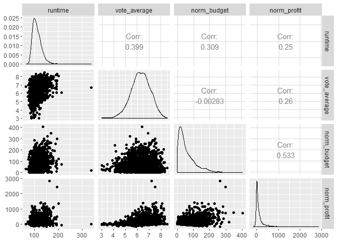
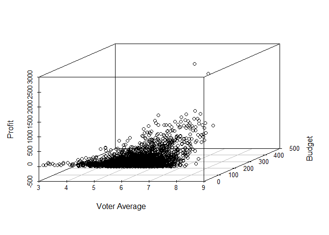
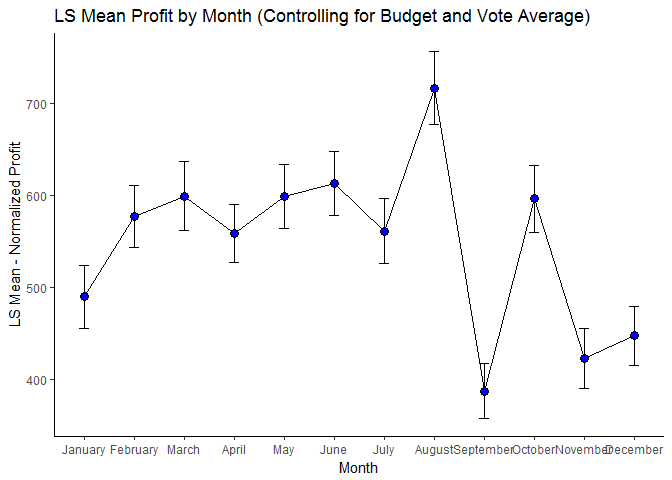
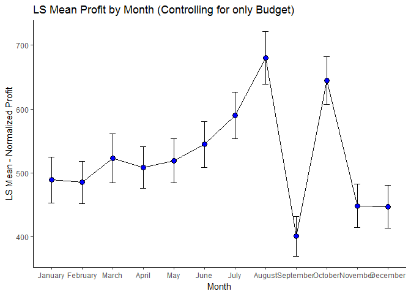
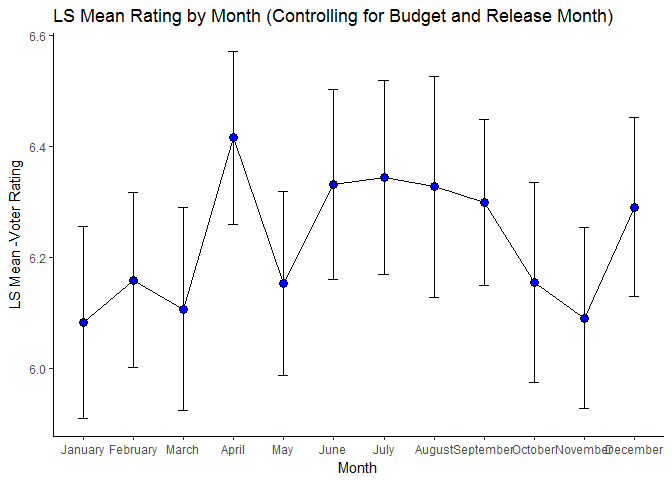
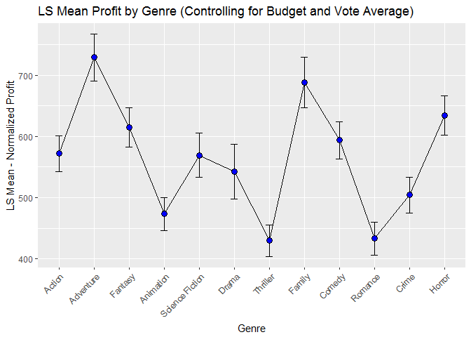
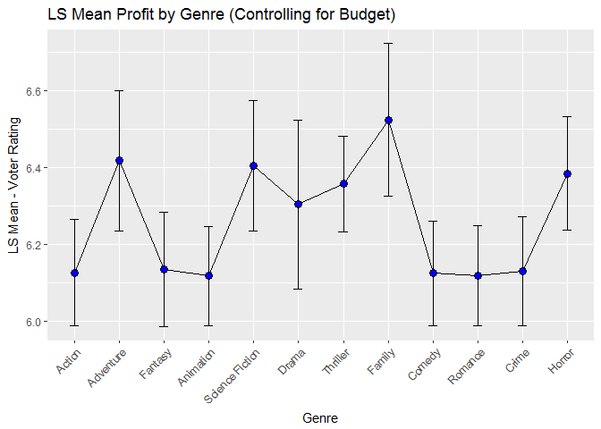
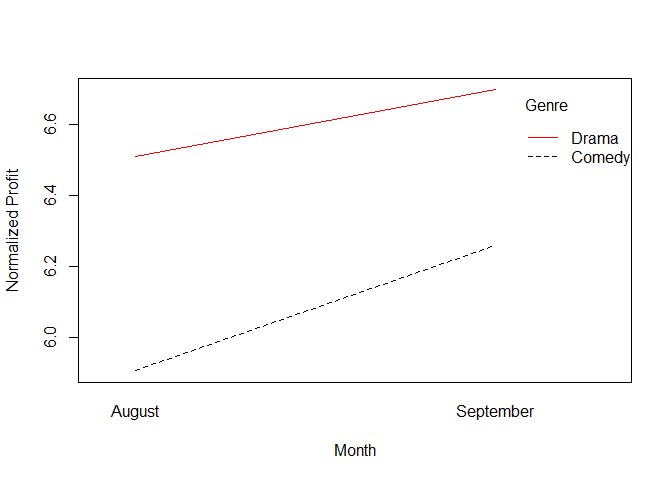
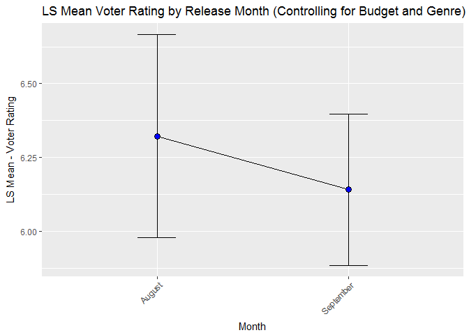

# **Summary of Project**

## The Data:

In this project, I analyzed a data set on movies that is publicly available on Kaggle at the link below:
https://www.kaggle.com/tmdb/tmdb-movie-metadata

The data set contains 4,803 rows of data and 20 columns. It contains information on a wide range of movies such as their title, revenue, budget, average voter rating on IMDB, and many other variables that may be of interest. For purposes of analysis, I had to create several additional columns derived from the source data.

## Purpose:

My primary intent in analysis was to evaluate whether there are any variables that have significant impact on a movie's success. Depending how compelling my findings are, certain variables can be used in the predictive modeling of a movie's success.

The term "success" has many interpretations. The metrics I chose to focus on were profit from ticket sales, and the average voter rating from user reviewes on IMDB.com. 


# **Data Munging (The Dirty Work)**

For the purposes of analysis, I had to make the following transformations to the source data set.

* Convert JSON text strings into readable format. For items that had multiple distinct values within a text string, only the first value was selected (presuming it was the primary value)
    - This only occured in the "production countries" and "genre" columns
* Derived a "release year" and "release month" column from the source "release date" column. 
* Converted all dollar amounts to be a factor of 1,000. The value of $100 million now appears as 100
* Removed rows that appeared to have inaccurate values for budget and/or revenue
    - There were 1,642 records removed that had budgets or revenue < $100k. I thought there was reasonable likelihood these values were inaccurate and would skew any subsequent analysis.
* I normalized all dollar values for each associated year based on Consumer Price Index data. This would surpress the impact of inflation over time for movie tickets.
    - Data source: https://fred.stlouisfed.org/series/CPIAUCSL
    - normalized profit and budget values would be the primary numeric variables used for subsequent analysis
* I removed all records from movies prior to 1992. The majority of movies in this data set were from the past 25 years.
    - There was less than 30 movies per year in the data set for years before 1992. For any analysis involving the release year of a movie, I wanted to ensure a reasonable sample size (> 30) that would be more likely to have a normal distribution of budget or profit.


For more in-depth analysis of the steps taken in data munging and configuration, see my other page that includes source code and additional commentary [here](https://cdn.rawgit.com/omshapira/Movie_Analysis_GIT/c6eca81b/Movie_Analysis_Code%2BObservations.html#data-munging-the-dirty-work)


# ** Preliminary Data Visualizations and Analysis (The Fun Part)**

The analysis and visualizations below are for preliminary interpretation of the data. The immediate intention was to spot any interesting trends when comparing a few variables at a time. As I was doing this, I also wanted to gauge whether the dataset should be filtered down at all to minimize outlier data points. Lastly, I was curious to see which variable(s) had the highest correlation to high profits and voter ratings.


The Box and Whiskers plot below helps give a sense for the distribution of normalzied movie budgets by release year. This plot type shows the quartile summaries and outlier data points by year. It appears that each release year had at least a few outliers. Years 2005-2015 particularly seemed to have an increasing amount of outlier "big budget" films


<!--html_preserve--><div id="27a07ff76f27" style="width:672px;height:480px;" class="plotly html-widget"></div>
<script type="application/json" data-for="27a07ff76f27">{"x":{"visdat":{"27a066611270":["function () ","plotlyVisDat"]},"cur_data":"27a066611270","attrs":{"27a066611270":{"x":{},"color":{},"alpha":1,"sizes":[10,100],"type":"box"}},"layout":{"margin":{"b":40,"l":60,"t":25,"r":10},"title":"Normalized Budget: Box and Whiskers","xaxis":{"domain":[0,1],"title":"Normalized Budget"},"yaxis":{"domain":[0,1],"title":"Release Year"},"hovermode":"closest","showlegend":true},"source":"A","config":{"modeBarButtonsToAdd":[{"name":"Collaborate","icon":{"width":1000,"ascent":500,"descent":-50,"path":"M487 375c7-10 9-23 5-36l-79-259c-3-12-11-23-22-31-11-8-22-12-35-12l-263 0c-15 0-29 5-43 15-13 10-23 23-28 37-5 13-5 25-1 37 0 0 0 3 1 7 1 5 1 8 1 11 0 2 0 4-1 6 0 3-1 5-1 6 1 2 2 4 3 6 1 2 2 4 4 6 2 3 4 5 5 7 5 7 9 16 13 26 4 10 7 19 9 26 0 2 0 5 0 9-1 4-1 6 0 8 0 2 2 5 4 8 3 3 5 5 5 7 4 6 8 15 12 26 4 11 7 19 7 26 1 1 0 4 0 9-1 4-1 7 0 8 1 2 3 5 6 8 4 4 6 6 6 7 4 5 8 13 13 24 4 11 7 20 7 28 1 1 0 4 0 7-1 3-1 6-1 7 0 2 1 4 3 6 1 1 3 4 5 6 2 3 3 5 5 6 1 2 3 5 4 9 2 3 3 7 5 10 1 3 2 6 4 10 2 4 4 7 6 9 2 3 4 5 7 7 3 2 7 3 11 3 3 0 8 0 13-1l0-1c7 2 12 2 14 2l218 0c14 0 25-5 32-16 8-10 10-23 6-37l-79-259c-7-22-13-37-20-43-7-7-19-10-37-10l-248 0c-5 0-9-2-11-5-2-3-2-7 0-12 4-13 18-20 41-20l264 0c5 0 10 2 16 5 5 3 8 6 10 11l85 282c2 5 2 10 2 17 7-3 13-7 17-13z m-304 0c-1-3-1-5 0-7 1-1 3-2 6-2l174 0c2 0 4 1 7 2 2 2 4 4 5 7l6 18c0 3 0 5-1 7-1 1-3 2-6 2l-173 0c-3 0-5-1-8-2-2-2-4-4-4-7z m-24-73c-1-3-1-5 0-7 2-2 3-2 6-2l174 0c2 0 5 0 7 2 3 2 4 4 5 7l6 18c1 2 0 5-1 6-1 2-3 3-5 3l-174 0c-3 0-5-1-7-3-3-1-4-4-5-6z"},"click":"function(gd) { \n        // is this being viewed in RStudio?\n        if (location.search == '?viewer_pane=1') {\n          alert('To learn about plotly for collaboration, visit:\\n https://cpsievert.github.io/plotly_book/plot-ly-for-collaboration.html');\n        } else {\n          window.open('https://cpsievert.github.io/plotly_book/plot-ly-for-collaboration.html', '_blank');\n        }\n      }"}],"cloud":false},"data":[{"x":[141.2,116.3,104.7,74.8,73.1,69.8,79.7,56.5,53.2,46.5,41.5,36.5,41.5,46.5,36.5,34.9,31.6,43.2,19.1,24.3,23.3,23.3,5,20.8,18.3,19.1,11.6,11.5,10,5.8,5,2.5,4.3,1.3],"type":"box","orientation":"h","name":"1993","line":{"fillcolor":"rgba(102,194,165,0.5)","color":"rgba(102,194,165,1)"},"xaxis":"x","yaxis":"y","frame":null},{"x":[186.2,72.9,102,100.4,89.1,89.1,97.2,81,81,81,74.5,72.9,72.9,40.5,64.8,24.3,61.5,56.7,48.6,48.6,48.6,43.7,42.1,40.5,40.5,35.6,32.4,37.2,29.1,25.9,21,24.3,17,16.2,14.6,13,22.7,8.1,9.7,1.1],"type":"box","orientation":"h","name":"1994","line":{"fillcolor":"rgba(165,181,144,0.5)","color":"rgba(165,181,144,1)"},"xaxis":"x","yaxis":"y","frame":null},{"x":[275.6,157.5,154.4,141.8,86.6,113.4,94.5,81.9,97.7,91.4,94.5,86.6,78.8,83.5,81.9,78.8,78.8,78.8,78.8,78.8,69.3,70.9,31.5,55.1,55.1,50.4,47.6,47.3,47.3,52,47.3,47.3,44.1,39.4,29.9,37.8,34.7,28.4,31.5,26,12.6,22.1,22.1,17.3,17.3,11.8,11,9.5,9.5,9.5,7.9,5.7,6.3,5.5,3.9,2.4],"type":"box","orientation":"h","name":"1995","line":{"fillcolor":"rgba(207,166,124,0.5)","color":"rgba(207,166,124,1)"},"xaxis":"x","yaxis":"y","frame":null},{"x":[153,153,140.8,122.4,122.4,107.1,122.4,114.8,114.8,122.4,76.5,99.5,91.8,87.2,82.6,84.2,84.2,76.5,76.5,84.2,76.5,76.5,76.5,71.9,71.9,70.4,70.4,68.9,68.9,67.3,61.2,61.2,58.1,58.1,41.3,49,39.8,38.3,39,41.3,38.3,42.8,38.3,29.1,21.4,23,22.2,19.9,19.1,18.4,18.4,13.8,10.7,7.7,10.7,1.5,6.9,5.4,6.1,4.6,4.6,3.7,0.3],"type":"box","orientation":"h","name":"1996","line":{"fillcolor":"rgba(243,147,104,0.5)","color":"rgba(243,147,104,1)"},"xaxis":"x","yaxis":"y","frame":null},{"x":[299,186.9,173.4,164.5,239.2,157,15,134.6,134.6,134.6,101.7,134.6,127.1,119.6,112.1,119.6,112.1,119.6,109.1,104.7,89.7,104.7,89.7,89.7,85.2,82.2,79.2,74.8,74.8,74.8,74.8,74.8,56.8,67.3,67.3,67.3,59.8,59.8,53.8,55.3,53.8,53.8,52.3,52.3,52.3,47.8,44.9,41.9,41.9,40.4,37.4,35.9,29.9,29.9,29.9,39.6,24.7,26.9,25.4,23.9,22.4,22.4,22.4,17.9,15,12,19,7.5,4.5,5.2,4.5,1.5,0.3,0.3,0.3],"type":"box","orientation":"h","name":"1997","line":{"fillcolor":"rgba(234,146,121,0.5)","color":"rgba(234,146,121,1)"},"xaxis":"x","yaxis":"y","frame":null},{"x":[206.1,206.1,132.5,132.5,132.5,110.4,103.1,117.8,125.2,132.5,110.4,107.5,110.4,104.5,103.1,103.1,103.1,97.2,103.1,95.7,139.9,88.3,103.1,88.3,88.3,103.1,110.4,81,81,76.6,73.6,73.6,70.7,66.3,176.7,66.3,58.9,58.9,44.2,44.2,44.2,39.8,39.8,36.8,38.3,44.2,36.8,36.8,36.8,95.7,35.3,33.9,33.9,29.4,29.4,29.4,27.2,25,22.1,22.1,22.1,22.1,22.1,20.6,19.1,19.1,19.1,17.7,17.7,14.7,13.3,44.2,29.4,26.5,11.8,8.8,7.4,14.7,4.4,4.3,2.9,2.2,2.2,2.1],"type":"box","orientation":"h","name":"1998","line":{"fillcolor":"rgba(205,152,153,0.5)","color":"rgba(205,152,153,1)"},"xaxis":"x","yaxis":"y","frame":null},{"x":[244.9,194.5,230.5,165.7,191.6,144.1,129.7,144.1,115.3,115.3,100.9,98,129.7,95.1,90.8,93.7,90.8,92.2,86.4,86.4,79.2,86.4,93.7,118.1,129.7,72,100.9,86.4,105.2,108.1,69.2,64.8,60.5,57.6,100.9,57.6,57.6,108.1,54.7,64.8,72,54.7,53.3,93.7,47.5,50.4,54.7,100.9,108.1,41.8,49.3,115.3,115.3,40.3,38.9,36,34.6,34.6,33.1,33.1,30.3,21.6,27.4,24.5,23.1,9.4,21.6,36,17.3,23.1,17.3,18.7,18.7,15.8,17.3,15.1,20.2,14.4,14.4,36,14.4,14.4,14.4,13,11.5,11.5,10.1,10.1,9.4,8.6,8.6,8.6,8.6,0.9,5.5,4.3,2.9,2.4,1.4,3,0.4],"type":"box","orientation":"h","name":"1999","line":{"fillcolor":"rgba(168,157,185,0.5)","color":"rgba(168,157,185,1)"},"xaxis":"x","yaxis":"y","frame":null},{"x":[177.7,171.4,174.2,167.3,153.3,125.4,143.6,139.4,132.4,139.4,128.2,132.4,125.4,125.4,118.5,117.1,114.3,111.5,61.3,111.5,105.9,104.5,104.5,104.5,104.5,97.6,90.6,90.6,86.4,111.5,83.6,125.4,115.7,76.7,76.7,64.1,71.1,72.5,55.8,66.9,66.9,62.7,62.7,59.9,62.7,55.8,55.8,55.8,55.8,88.6,58.5,50.2,46,41.8,44.6,43.2,41.8,41.8,39,36.2,34.8,34.8,34.8,57.6,33.5,33.5,32.1,32.1,30.7,41.8,41.8,25.1,22.3,22.3,22.3,23.7,20.9,20.9,27.9,19.5,34.8,20.9,20.9,19.5,18.8,18.1,17.8,16.7,13.9,33.5,39,13.9,13.9,15.3,36.2,11.8,9.8,11.2,12.5,7,6.3,8.4,22.3,2.8,1.4,1.4],"type":"box","orientation":"h","name":"2000","line":{"fillcolor":"rgba(155,158,202,0.5)","color":"rgba(155,158,202,1)"},"xaxis":"x","yaxis":"y","frame":null},{"x":[51.5,189.8,185.7,169.5,155.9,126.1,145.1,122,135.6,132.9,124.7,155.9,126.1,122,162.7,135.6,124.7,115.2,92.2,138.3,81.3,101.7,101.7,94.9,97.6,127.4,92.2,101.7,92.2,84.1,81.3,97.6,77.3,71.2,101.7,81.3,67.8,66.4,65.1,65.1,65.1,61,61,47.4,47.4,81.3,88.1,54.2,77.3,54.2,54.2,54.2,13.6,71.9,77.3,47.4,47.4,67.8,42,40.7,50.2,71.9,40.7,81.3,47.4,28.5,38,38,48.7,38,56.9,33.9,33.9,33.9,28.6,31.2,29.8,29.8,29.8,29.8,40.7,43.4,20.3,24.4,26.8,28.5,46.1,21.7,24,21.7,20.3,20.3,14.9,19,17.6,17.6,16.3,16.3,14.9,32.5,14.9,14.9,13.6,13.6,29.8,9.5,8.1,6.8,6.8,8.1,5.4,9.5,1.4,2,2,4.1,1.4,0.9,0.4,0.3],"type":"box","orientation":"h","name":"2001","line":{"fillcolor":"rgba(184,152,199,0.5)","color":"rgba(184,152,199,1)"},"xaxis":"x","yaxis":"y","frame":null},{"x":[186.8,186.8,185.5,160.1,160.1,153.5,136.1,133.4,186.8,133.4,133.4,105.4,133.4,113.4,112.1,106.7,106.7,106.7,106.7,104.1,96.1,93.4,100.1,93.4,93.4,93.4,93.4,90.7,78.7,86.7,84.1,80.1,80.1,80.1,80.1,80.1,80.1,80.1,73.4,73.4,72.1,69.4,66.7,66.7,66.7,66.7,64,61.4,60,53.4,57.4,56,42.7,41.4,54.7,46.7,53.4,53.4,53.4,53.4,40,50.7,50.7,48,44,46.7,46.7,46.7,46.7,60,40,33.4,40,38.7,36,34.7,33.4,33.4,33.4,33.4,26.7,28,28,26.7,26.7,46.7,40,26.7,26.7,25.4,24,20,17.3,20,26.7,18.7,18,16.7,16,16,16,16,17.3,14.7,18.7,26.7,11.3,13.3,12,6.7,10.7,10.7,8.7,10,9.3,6.7,7.1,4.7,6.7,6.7,20,5.3,5.3,4.4,5.3,4,2.7,0.7,1.3,1.1,0.3],"type":"box","orientation":"h","name":"2002","line":{"fillcolor":"rgba(210,145,197,0.5)","color":"rgba(210,145,197,1)"},"xaxis":"x","yaxis":"y","frame":null},{"x":[260.9,195.7,195.7,182.6,178.7,195.7,169.6,182.6,143.5,156.5,122.6,122.6,117.4,123.9,113.5,110.9,78.3,104.4,104.4,103,104.4,104.4,99.1,101.7,91.3,97.8,104.4,91.3,88.7,78.3,78.3,78.3,78.3,78.3,71.7,39.1,71.7,71.7,73,70.4,65.2,65.2,65.2,65.2,65.2,62.6,52.2,52.2,49.6,52.2,52.2,52.2,47,41.7,45.7,41.7,32.6,24.8,39.1,37.8,39.1,33.9,28.7,33.9,39.1,58.7,36.5,22.2,32.6,31.3,28.7,26.1,45.7,26.1,26.1,26.1,26.1,23.5,30,23.5,22.2,21.5,22.2,15.7,13,16.4,10.2,9.1,6.3,7.8,7.8,5.7,6.5,10.4,10.4,6.5,10.4,5.2,3.9,10.4,2.6,2.6,1,0.7,0.4],"type":"box","orientation":"h","name":"2003","line":{"fillcolor":"rgba(229,142,191,0.5)","color":"rgba(229,142,191,1)"},"xaxis":"x","yaxis":"y","frame":null},{"x":[254.1,209.6,196.9,222.3,165.2,158.8,133.4,139.8,147.4,139.8,139.8,152.5,127.1,127.1,114.3,184.2,116.9,95.3,101.6,127.1,95.3,101.6,76.2,95.3,101.6,57.2,94.7,76.2,190.6,88.9,88.9,82.6,101.6,82.6,76.2,88.9,76.2,83.9,76.2,71.1,38.1,88.9,72.4,63.5,57.2,63.5,63.5,63.5,63.5,50.8,31.8,53.4,50.8,63.5,50.8,50.8,76.2,49.5,34.3,44.5,39.4,39.4,41.9,35.6,25.4,38.1,38.1,36.8,24.1,47,44.5,38.1,50.8,38.1,31.8,15.2,35.6,35.6,34.3,34.3,33,38.1,38.1,31.8,33,25.4,31.8,31.8,21.6,30.5,29.2,47,40.7,25.4,25.4,25.4,25.4,24.1,22.9,21.6,22.9,22.2,20.3,20.3,19.1,19.1,15.2,23.3,16.3,16.5,15.2,15.2,12.7,8.3,11.4,10.8,9.5,8.9,8.3,8.3,7.6,5.1,6.4,5.3,3.8,3.3,3.2,3.4,2.5,1.5,0.1,0.6,0.5],"type":"box","orientation":"h","name":"2004","line":{"fillcolor":"rgba(214,169,160,0.5)","color":"rgba(214,169,160,1)"},"xaxis":"x","yaxis":"y","frame":null},{"x":[254.4,221.2,184.4,184.4,184.4,122.9,165.9,159.8,162.2,138.9,135.2,159.8,154.9,98.3,108.2,104.5,100.8,92.2,92.2,108.2,98.3,92.2,65.1,86,63.9,88.5,73.7,79.9,61.5,52.9,184.4,73.7,73.7,36.9,98.3,71.3,68.8,86,67.6,76.2,70.1,61.5,61.5,61.5,61.5,61.5,61.5,61.5,52.9,36.9,55.3,61.5,55.3,55.3,51.6,49.2,52.9,36.9,49.2,49.2,47.9,43,43,36.9,49.2,43,43,36.9,39.3,39.3,55.3,36.9,36.9,49.2,36.9,43,36.9,36.9,36.9,34.4,35.6,34.4,32,32,30.7,30.7,30.7,30.7,30.7,30.7,36.9,30.7,30.7,30.7,27,27,27,39.3,24.6,24.6,24.6,2.5,23.4,18.4,23.4,18.4,19.1,18.4,17.2,18.4,18.4,18.4,17.5,17.2,12.3,12.3,11.8,11.1,9.8,9.8,8,12.7,8.6,8.6,8,7.4,4.9,5.9,4.9,9.8,3.7,3.7,9.8,2.5,2.5,1.8,1.8,3.7,1.2,1.2,1.2,1.1,0.4],"type":"box","orientation":"h","name":"2005","line":{"fillcolor":"rgba(195,192,127,0.5)","color":"rgba(195,192,127,1)"},"xaxis":"x","yaxis":"y","frame":null},{"x":[321.5,238.2,250.1,190.5,178.6,177.4,148.8,131,178.6,119.1,119.1,107.2,119.1,101.2,101.2,101.2,98.2,95.3,101.2,102.4,90.5,95.3,83.4,89.3,86.3,142.9,89.3,83.4,75,77.4,59.5,76.2,77.4,59.5,71.4,59.5,71.4,65.5,64.3,65.5,107.2,61.9,60.7,53.6,59.5,64.3,59.5,53.6,59.5,56,53.6,59.5,65.5,59.5,53.6,47.6,47.6,47.6,47.6,47.6,47.6,47.6,41.7,41.7,41.7,41.7,41.7,39.3,38.1,38.1,35.7,35.7,35.7,35.7,35.7,25,33.3,28.6,17.9,32.2,29.8,23.8,29.8,28.6,25,45.2,23.8,23.8,23.8,29.8,10.7,23.8,23.8,23.8,10.4,21.4,17.9,21.4,20.8,20.2,17.9,23.8,20.2,20.2,47.6,20.2,20,22.6,17.9,17.9,17.9,23.8,17.9,31,22.6,15.5,15.5,15.5,15.5,14.3,14.3,14.3,14.3,14.3,13.1,13.1,8.8,11.9,7.1,14.3,11.9,15.4,10.7,6,14.3,7.7,9.5,9.5,9.5,9.5,9.5,7.7,7.1,6.9,2.6,6,4.8,4.8,4.8,4.2,35.7,2.9,2.4,2.4,2.4,1.5,1.2,1.2,0.8,0.5,0.1],"type":"box","orientation":"h","name":"2006","line":{"fillcolor":"rgba(170,213,90,0.5)","color":"rgba(170,213,90,1)"},"xaxis":"x","yaxis":"y","frame":null},{"x":[347.3,298.6,208.4,162.1,202.6,185.2,173.6,173.6,173.6,173.6,173.6,81,81,150.5,127.3,127.3,115.8,98.4,98.4,98.4,75.2,92.6,57.9,86.8,81,86.8,81,77.6,70.6,69.5,63.7,77.6,57.9,59.6,63.7,52.1,52.1,52.1,46.3,46.3,46.3,57.9,23.2,44,39.4,40.5,40.5,40.5,34.7,81,34.7,34.7,34.7,34.7,34.7,32.4,24.3,34.7,31.8,28.9,69.5,28.9,28.9,28.9,28.9,28.9,26.6,28.9,25.5,28.9,24.3,23.2,23.2,23.2,17.4,23.2,23.2,23.2,23.2,20.8,23.2,27.8,19.1,19.1,13.9,18.5,17.4,17.4,17.4,17.4,18.5,17.4,15,12.7,16.2,20.8,13.9,11.6,11.6,11.6,11.6,11.6,10.4,10.4,99.5,9.3,25.5,11.8,8.7,6.9,5.8,4.6,2.3,3,1.7,2.3,2.3,1.7,1.2,1,0.2],"type":"box","orientation":"h","name":"2007","line":{"fillcolor":"rgba(191,217,76,0.5)","color":"rgba(191,217,76,1)"},"xaxis":"x","yaxis":"y","frame":null},{"x":[223,250.9,206.3,200.7,206.3,156.1,161.7,167.3,167.3,167.3,167.3,167.3,145,145,133.8,108.5,100.4,102.6,83.6,100.4,94.8,94.8,89.2,89.2,89.2,89.2,89.2,83.6,78.1,78.1,72.5,50.2,69.1,66.9,66.9,66.9,66.9,66.9,66.9,66.9,64.7,61.3,61.3,61.3,58,78.1,50.2,39,78.1,50.2,50.2,44.6,44.6,89.5,61.3,44.6,41.3,41.3,41.3,40.7,41.3,39,39,39,39,33.5,39,22.9,46.5,33.5,35.7,33.5,33.5,33.5,33.5,33.5,31.2,30.1,39,30.1,27.9,30.1,36.8,28,27.9,27.9,27.9,27.9,27.9,26.8,22.3,23.4,22.3,22.3,22.3,22.3,22.3,22.3,22.3,22.3,27.9,22.3,22.3,44.6,21.2,20.1,20.1,25.6,17.8,16.7,12.3,16.7,16.7,16.7,16.7,16.7,9.5,16.7,16.7,13.9,13.4,13.4,13.4,13.4,12.3,12,10,5.6,8.4,7.8,6.7,6.7,7.8,6.7,4.5,5.6,5.6,3.3,2.8,2.2,7.8,0.6,39,0.2],"type":"box","orientation":"h","name":"2008","line":{"fillcolor":"rgba(218,217,65,0.5)","color":"rgba(218,217,65,1)"},"xaxis":"x","yaxis":"y","frame":null},{"x":[265.1,279.6,167.8,223.7,223.7,223.7,195.8,195.8,195.8,167.8,167.8,167.8,167.8,167.8,145.4,117.5,89.5,111.9,111.9,111.9,72.7,111.9,100.7,100.7,95.1,89.5,89.5,39.2,83.9,78.3,83.9,78.3,72.7,78.3,67.1,67.1,67.1,67.1,87.4,78.3,67.1,64.9,59.3,55.9,55.9,55.9,44.7,55.9,55.9,55.9,55.9,50.3,36.9,44.7,44.7,44.7,45.9,22.4,44.7,44.7,44.7,36.9,43.6,42.5,11.2,39.2,32.4,39.2,39.2,39.2,44.7,33.6,39.2,28,33.6,33.6,33.6,33.6,33.6,30.2,29.1,29.1,33.6,35.8,28,28,26.8,26.4,25.7,25.7,24.6,19,22.4,22.4,44.7,22.4,22.4,22.4,22.4,22.4,20.7,20.1,28,19,19,17.9,17.9,14.5,17.9,17.9,16.8,16.8,16.8,16.8,16.8,16.8,16.8,15.7,16.8,14.5,14,16.8,13.4,13.4,12.3,11.2,11.2,11.2,10.6,7.8,9.5,8.9,8.9,8.4,8.9,8.2,8.4,7.8,7.8,7.3,6.7,6.3,5.6,5.6,5,2.2,3.4,4.3,0.9],"type":"box","orientation":"h","name":"2009","line":{"fillcolor":"rgba(244,217,53,0.5)","color":"rgba(244,217,53,1)"},"xaxis":"x","yaxis":"y","frame":null},{"x":[286.1,220.1,220.1,187.1,220.1,165.1,220.1,181.6,181.6,176.1,165.1,170.6,165.1,121.1,143.1,137.6,132.1,128.8,123.3,110.1,110.1,110.1,88,110.1,110.1,104.6,110.1,99.1,66,93.5,88,88,88,88,88,82.5,77,74.8,75.9,75.9,71.5,66,63.8,88,66,60.5,60.5,57.2,57.2,55,55,24.2,51.7,49.5,44,48.4,46.2,44,44,44,44,40.7,33,39.6,41.8,38.5,38.5,38.5,38.5,35.2,35.2,35.2,34.1,33,33,33,33,30.8,30.8,28.6,27.5,27.5,27.5,27.5,27.5,27.5,27.5,26.4,26.4,24.2,22,22,22,22,22,22,22,22,22,22,20.9,22,20.9,19.8,19.8,22,16.5,16.5,16.5,16.5,13.2,11,15.4,15.4,14.7,14.3,22,13.8,13.8,13.2,27.5,11,11,11,11,7.7,9.9,13.2,8.8,8.8,8.8,8.8,7.7,7.7,7.5,5.5,4.4,5.5,5.5,5.5,5,3.9,10.5,1.1,3.9,3.5,3.3,3.3,2.8,2.2,2.2,2.2,2.2,2,2.2,1.7,3.9,0.6],"type":"box","orientation":"h","name":"2010","line":{"fillcolor":"rgba(251,213,71,0.5)","color":"rgba(251,213,71,1)"},"xaxis":"x","yaxis":"y","frame":null},{"x":[405.5,213.4,213.4,208.1,181.4,170.7,160.1,160.1,160.1,154.7,149.4,138.7,144.1,138.7,138.7,133.4,133.4,128,117.4,117.4,100.3,99.2,96,96,80,80,85.4,80,85.4,85.4,84.3,80,87.5,74.7,70.4,74.7,70.4,38.4,67.2,64,64,60.8,58.7,55.5,53.6,53.4,53.4,53.4,53.4,53.4,53.2,53.4,53.4,48,48,42.7,44.8,43.7,42.7,32,42.7,42.7,50.2,42.7,42.7,40.5,39.5,39.5,37.3,37.3,42.7,37.3,37.3,37.3,34.1,32,34.7,34.1,34.1,32,32,32,32,32,18.1,32,32,32,29.9,32,28.8,59.8,26.7,26.7,26.7,29.9,26.7,26.7,26.7,25.6,13.3,24.5,22.4,21.3,20.3,21.3,21.3,16,21.3,21.3,20.4,20.3,22.4,19.2,18.1,16,17.1,16,16,13.9,13.9,15.4,10.7,12.8,20.3,10.7,6.8,10.7,10.7,10.7,8.2,7.9,9.6,8.5,8.5,8.5,7,7.5,6.9,6.4,6.4,0.1,5.3,10.7,5.3,5.1,5.3,4.3,4.3,4.3,3.7,3.2,2.1,1.1,2.1,1.2,0.5,0.2,0.2,0.1,0.1],"type":"box","orientation":"h","name":"2011","line":{"fillcolor":"rgba(244,207,103,0.5)","color":"rgba(244,207,103,1)"},"xaxis":"x","yaxis":"y","frame":null},{"x":[261.3,271.8,230,235.2,224.8,218.5,209.1,193.4,177.7,172.5,261.3,156.8,156.8,151.6,151.6,125.4,135.9,125.4,135.9,104.5,104.5,106.6,99.3,88.9,88.9,88.9,52.3,78.4,82.6,73.2,78.4,72.1,68,63.8,68,68,68,62.7,62.7,60.6,73.2,71.1,62.7,41.8,52.3,52.3,47,47,46.5,43.9,41.8,43.9,41.8,43.9,41.8,41.8,40.8,33.5,41.8,36.6,47,36.6,36.6,34.5,31.4,36.6,32.4,31.4,31.4,31.4,31.4,31.4,31.4,27.2,26.1,26.1,26.1,26.1,14.6,26.1,23,2.1,17.8,22,20.9,20.9,20.9,14.6,17.8,17.8,16.7,17.8,7.3,15.7,15.7,15.7,14.6,15.7,13.6,13.1,12.5,12.5,15.7,12.5,12.5,12.5,11.5,12.5,14.6,10.5,20.9,9.3,7.3,7.3,7.2,5.2,6.3,5.2,3.9,4,3.1,3.1,2.6,2.6,1.9,1.6,1,1,1,0.8,0.8,0.5,0.2],"type":"box","orientation":"h","name":"2012","line":{"fillcolor":"rgba(236,200,130,0.5)","color":"rgba(236,200,130,1)"},"xaxis":"x","yaxis":"y","frame":null},{"x":[262.7,231.8,257.6,206.1,206.1,206.1,206.1,195.8,200.9,108.2,185.5,180.3,154.5,175.2,154.5,133.9,139.1,133.9,133.9,133.9,118.5,123.6,123.6,139.1,108.2,108.2,113.3,103,103,94.8,92.7,92.7,82.4,82.4,80.4,78.3,77.3,72.1,72.1,51.5,62.8,61.8,61.8,59.8,56.7,56.7,56.7,51.5,51.5,45.3,61.8,47.4,44.3,41.2,41.2,41.2,41.2,40.4,41.2,4,39.2,39.2,38.1,36.1,36.1,57.7,36.1,36.1,33,36.1,34,30.9,25.8,36.1,30.9,30.9,30.9,30.9,28.8,28.8,28.8,25.8,28.8,26.3,25.8,13.9,25.8,23.7,26.8,22.7,22.7,22.7,13.4,20.6,20.6,20.6,20.6,20.6,12.4,28,18.5,18.5,18.5,18.5,18.5,18,17.5,17.5,16.5,20.6,15.5,15.5,36.1,15.5,20.6,13.4,13.4,13.4,12.4,12.4,12.8,12.4,11.3,10.3,6.2,9.8,8.8,9.3,7.9,8.2,7.2,6.7,5.7,5.2,5.2,4.7,5.2,4.9,5.2,16.5,3.1,3.1,2.3,2.6,2.6,1,1.5,1.2],"type":"box","orientation":"h","name":"2013","line":{"fillcolor":"rgba(225,194,151,0.5)","color":"rgba(225,194,151,1)"},"xaxis":"x","yaxis":"y","frame":null},{"x":[253.5,212.9,202.8,253.5,180.5,182.5,172.4,172.4,167.3,172.4,167.3,147,142,147,133.8,126.7,128.8,126.7,104.4,121.7,126.7,111.5,101.4,91.3,96.3,101.4,86.2,68.9,131.8,71,71,71,66.9,65.9,65.9,65.9,65.9,61.9,60.8,60.8,60.8,60.8,59.6,55.8,55.8,50.7,50.7,50.7,50.7,50.7,50.7,50.7,48.7,40.6,44.6,40.6,40.6,40.6,42.6,40.6,40.6,36.5,35.5,34.5,30.4,28.4,28.4,28.4,28.4,26.4,25.3,25.3,25.3,25.3,25.3,24.3,22.8,22.3,22.3,22.3,20.3,20.3,20.1,20.3,20.3,20.3,18.3,16.2,18.3,18.3,18.3,17.2,17.2,16.2,14.2,15.2,15.2,15.2,15.2,15.2,13.5,13.2,12.7,13.4,13.2,12.2,12.2,11.2,10.1,9.1,9.1,6.1,8.6,8.1,7.1,7.1,6.6,5.6,5.6,5.1,5.1,5.1,5.1,5.1,5.1,5.1,4.1,4.1,3.3,2.8,5.1,4.1],"type":"box","orientation":"h","name":"2014","line":{"fillcolor":"rgba(211,189,160,0.5)","color":"rgba(211,189,160,1)"},"xaxis":"x","yaxis":"y","frame":null},{"x":[248.1,283.6,151.9,192.4,177.2,178.2,177.2,192.4,162,157,151.9,151.9,151.9,136.7,131.7,136.7,121.5,111.4,111.4,109.4,106.3,101.3,100.3,96.2,89.1,81,91.1,64.8,76,74.9,74.9,70.9,68.9,50.7,55.7,65.8,44.6,61.8,60.8,60.8,58.7,53.7,50.6,50.6,49.6,50.6,40.5,40.5,40.5,35.4,40.5,40.5,40.5,38.5,37.5,37.5,36.5,35.4,9,35.4,35.4,35.4,35.4,34.4,31.4,30.4,30.4,25.3,29.4,28.4,28.4,28.4,26.3,25.3,25.3,25.3,20.3,20.3,19.7,20.3,20.3,10.1,17.2,30.4,15.2,15.2,15,14.2,15.2,6.1,13.2,12.2,12.2,11.1,11.1,10.1,10.1,10.1,5.1,10.1,10.1,8.6,8.1,0.7,7.1,3.3,5.1,5.1,5.1,4.1,4.1,3,2,6.1,2,2,13.7,1,0.1],"type":"box","orientation":"h","name":"2015","line":{"fillcolor":"rgba(195,184,170,0.5)","color":"rgba(195,184,170,1)"},"xaxis":"x","yaxis":"y","frame":null},{"x":[250,250,185,180,178,175,175,165,15,170,160,144,145,140,140,120,115,135,110,100,90,75,73,80,60,68.5,58,50,50,50,50,25,40,40,38,38,35,31.5,19,29,29,28,27,23,25,22,20,20,20,20,20,18,18,18.5,15,16,17,11.5,10,10,65,10,7,15,4.9,5,20,5,4.5,3.5,5,8.5],"type":"box","orientation":"h","name":"2016","line":{"fillcolor":"rgba(179,179,179,0.5)","color":"rgba(179,179,179,1)"},"xaxis":"x","yaxis":"y","frame":null}],"highlight":{"on":"plotly_click","persistent":false,"dynamic":false,"selectize":false,"opacityDim":0.2,"selected":{"opacity":1}},"base_url":"https://plot.ly"},"evals":["config.modeBarButtonsToAdd.0.click"],"jsHooks":{"render":[{"code":"function(el, x) { var ctConfig = crosstalk.var('plotlyCrosstalkOpts').set({\"on\":\"plotly_click\",\"persistent\":false,\"dynamic\":false,\"selectize\":false,\"opacityDim\":0.2,\"selected\":{\"opacity\":1}}); }","data":null}]}}</script><!--/html_preserve-->


The scatter plot below adds an additional variable dimension (bubble size and color) that is based on the normalized profit of a movie. The data points are plotted on an axis of release year vs. normalized buget. 


The plot below is similar, expect that bubble size and color is based on the average voter rating. I filtered out movies that had < 30 total votes for the average voter rating.


<!--html_preserve--><div id="27a01d6b37ee" style="width:672px;height:480px;" class="plotly html-widget"></div>
<script type="application/json" data-for="27a01d6b37ee">{"x":{"visdat":{"27a0dfd3e83":["function () ","plotlyVisDat"]},"cur_data":"27a0dfd3e83","attrs":{"27a0dfd3e83":{"x":{},"y":{},"mode":"markers","hoverinfo":"text","text":{},"color":{},"size":{},"alpha":1,"sizes":[10,100],"type":"scatter"}},"layout":{"margin":{"b":80,"l":60,"t":25,"r":10},"title":"Average Voter Rating by Year and Normalized Budget","xaxis":{"domain":[0,1],"title":"Release Year","type":"category","categoryorder":"array","categoryarray":["1993","1994","1995","1996","1997","1998","1999","2000","2001","2002","2003","2004","2005","2006","2007","2008","2009","2010","2011","2012","2013","2014","2015","2016"]},"yaxis":{"domain":[0,1],"title":"Normalized Budget"},"hovermode":"closest","showlegend":false,"legend":{"y":0.5,"yanchor":"top"}},"source":"A","config":{"modeBarButtonsToAdd":[{"name":"Collaborate","icon":{"width":1000,"ascent":500,"descent":-50,"path":"M487 375c7-10 9-23 5-36l-79-259c-3-12-11-23-22-31-11-8-22-12-35-12l-263 0c-15 0-29 5-43 15-13 10-23 23-28 37-5 13-5 25-1 37 0 0 0 3 1 7 1 5 1 8 1 11 0 2 0 4-1 6 0 3-1 5-1 6 1 2 2 4 3 6 1 2 2 4 4 6 2 3 4 5 5 7 5 7 9 16 13 26 4 10 7 19 9 26 0 2 0 5 0 9-1 4-1 6 0 8 0 2 2 5 4 8 3 3 5 5 5 7 4 6 8 15 12 26 4 11 7 19 7 26 1 1 0 4 0 9-1 4-1 7 0 8 1 2 3 5 6 8 4 4 6 6 6 7 4 5 8 13 13 24 4 11 7 20 7 28 1 1 0 4 0 7-1 3-1 6-1 7 0 2 1 4 3 6 1 1 3 4 5 6 2 3 3 5 5 6 1 2 3 5 4 9 2 3 3 7 5 10 1 3 2 6 4 10 2 4 4 7 6 9 2 3 4 5 7 7 3 2 7 3 11 3 3 0 8 0 13-1l0-1c7 2 12 2 14 2l218 0c14 0 25-5 32-16 8-10 10-23 6-37l-79-259c-7-22-13-37-20-43-7-7-19-10-37-10l-248 0c-5 0-9-2-11-5-2-3-2-7 0-12 4-13 18-20 41-20l264 0c5 0 10 2 16 5 5 3 8 6 10 11l85 282c2 5 2 10 2 17 7-3 13-7 17-13z m-304 0c-1-3-1-5 0-7 1-1 3-2 6-2l174 0c2 0 4 1 7 2 2 2 4 4 5 7l6 18c0 3 0 5-1 7-1 1-3 2-6 2l-173 0c-3 0-5-1-8-2-2-2-4-4-4-7z m-24-73c-1-3-1-5 0-7 2-2 3-2 6-2l174 0c2 0 5 0 7 2 3 2 4 4 5 7l6 18c1 2 0 5-1 6-1 2-3 3-5 3l-174 0c-3 0-5-1-7-3-3-1-4-4-5-6z"},"click":"function(gd) { \n        // is this being viewed in RStudio?\n        if (location.search == '?viewer_pane=1') {\n          alert('To learn about plotly for collaboration, visit:\\n https://cpsievert.github.io/plotly_book/plot-ly-for-collaboration.html');\n        } else {\n          window.open('https://cpsievert.github.io/plotly_book/plot-ly-for-collaboration.html', '_blank');\n        }\n      }"}],"cloud":false},"data":[{"x":["2009","2007","2015","2012","2012","2007","2010","2015","2009","2016","2006","2008","2006","2013","2013","2008","2012","2011","2012","2014","2012","2010","2013","2007","2005","1997","2016","2012","2015","2012","2004","2013","2010","2006","2013","2009","2014","2013","2014","2010","2011","2011","2010","2009","2015","2013","2014","2013","2013","2013","2010","2013","2011","2008","2015","2012","2016","2008","2007","2009","2009","2015","2016","2005","2016","2008","2009","2009","2008","2011","1999","2008","2016","2007","2014","1995","2009","2015","2016","2010","2012","2014","2014","2013","2014","2010","2015","2014","2012","2004","2016","2010","2003","2014","2014","2010","2016","2012","2001","2008","2011","2015","2010","2006","2016","2007","2016","2015","2010","2001","2007","2004","2007","2005","2008","2007","2005","2007","2005","2008","2009","2009","2003","2013","2003","2013","2015","2009","2011","2008","2009","2012","2012","2015","2007","2011","2010","2006","2013","2011","2006","2015","2014","2004","2012","2002","2016","1998","2002","2007","2016","2011","2012","2005","2003","2014","2009","2002","2014","2016","2005","2009","1998","2003","2013","2005","2001","2011","1999","2003","2012","2011","2008","2016","2015","2013","2011","2014","2007","2008","2015","2013","2015","2005","2003","2011","2010","2014","2011","2004","2008","2013","2000","2014","2010","2001","2013","2003","2014","2006","2014","2003","2011","2011","2010","1999","2012","1997","2000","2004","2000","2000","2007","2012","2007","2016","2003","2012","2002","2013","2004","2014","2008","2010","2010","2013","2005","2002","2001","2013","1999","2013","2008","2002","2016","2014","2013","1997","2016","2015","2006","2015","1997","2000","2004","2005","2015","2004","2010","2011","2014","2011","2004","2016","2011","2013","1997","2013","2007","2001","2004","2001","2004","2005","1999","2009","2015","2005","2000","2000","2002","2002","2006","2001","2009","2007","1994","2009","2010","2010","1996","2012","1996","2000","2012","2004","2006","2009","2013","2010","1999","2006","2013","1995","1997","2012","2010","2004","2014","2002","2009","2014","2015","2015","2002","2010","2015","1997","2001","2002","2011","2007","2004","2001","1997","2010","2000","2012","2015","2009","2003","2003","2002","2014","2001","2014","2001","2011","2008","2013","2004","2004","1995","2010","1997","1999","2010","2001","2000","2009","2009","2013","2000","2006","1998","2008","2011","1995","2009","2016","2001","2008","2008","2015","2001","2003","1997","2000","2005","2013","2003","2016","1997","2001","2000","2011","1999","1997","2002","2005","2010","2003","1996","2000","2006","2004","1997","2001","2011","2012","2007","2012","2000","2011","2006","1998","2009","2007","2006","2014","2001","2003","1993","2005","2006","1998","2002","2012","2010","2003","2000","2002","2012","2006","2010","2008","2008","2007","2000","2003","2010","1996","2012","2011","2006","2002","2006","1998","2005","2011","2013","2008","2003","2010","2008","2005","1997","2008","2002","2011","1997","2008","2003","2010","1997","1999","1996","2008","1997","2014","1998","2010","2002","2011","1998","2004","2015","1999","2002","2001","2005","1998","2005","1996","2009","2000","1996","2013","2000","2003","2009","2003","1997","1998","2015","2000","2006","2005","2014","2001","1994","2012","2013","2002","2004","2011","2003","2015","2007","2000","2016","2003","2013","1996","1997","2005","2006","2000","2008","1996","2006","2004","2007","2004","2013","2010","2004","2009","2000","2007","2004","2006","2005","2005","2003","2010","2015","2004","2006","2001","1995","2011","2005","2000","2003","1998","2001","2004","2000","2015","2011","1998","1998","2016","2008","2009","2007","2006","2001","1995","2005","2007","2001","2001","2004","2004","1998","2002","2004","2006","1999","2002","2015","1996","2009","2003","2001","2006","2004","2009","2002","2013","1998","2011","2003","2011","2014","2010","2014","1998","2007","1997","2011","2002","2005","2002","2012","2012","2002","2011","2002","1998","2001","2013","2015","2004","2006","2013","2014","2002","2010","2001","2010","1995","2015","2009","1999","2011","1999","2016","2008","2010","2012","1999","1998","2007","1998","2014","2000","2002","2003","2012","1999","1995","2002","2012","1998","2008","1998","2010","2014","2000","1993","1996","2000","2006","2012","1999","2014","2015","2012","2004","2012","2008","1996","2005","1999","2006","2014","2005","2005","2014","1999","2015","2006","2002","2009","1993","1994","1994","2015","2006","2000","1995","2008","2001","2015","2011","2006","2004","2008","1999","2005","2014","2002","1995","1999","1998","1998","2003","2013","2001","2003","2002","1998","2009","2005","2015","2010","2010","1999","1998","2004","2002","2004","2012","1999","2011","2009","2008","2004","2006","2004","1996","2004","1998","2012","1997","2003","2008","1995","2014","2015","2016","1997","2007","2014","1998","2014","2002","2013","2009","2009","2009","2009","1999","2006","2009","2002","2003","2010","1997","2002","2008","2009","2000","2000","2005","2011","2003","1997","2002","2006","2006","2001","2000","2014","2013","2008","2005","2008","2008","2015","2005","2016","2014","2015","2005","2000","2008","2009","2013","2010","2012","1997","2012","1996","2004","2011","2001","2005","2004","1994","2007","2000","1995","1996","2005","2003","2013","2010","1995","2014","2002","1995","2006","2005","1994","1998","2003","2004","2000","1996","2011","2008","2013","1996","1998","1996","2014","2012","2003","2003","2012","2008","1996","1996","2004","2007","2005","2003","1997","2014","2004","2010","2002","2002","2008","2013","2005","2006","2003","2006","2000","1997","2001","2001","2015","2006","2009","2007","2002","2012","2006","2008","2010","2005","1998","2011","1999","1995","2010","2000","2006","2009","2001","2011","1996","2012","1997","1998","2013","2002","2011","2000","2003","2014","1994","2008","2016","2015","2014","2006","1999","1995","2011","2009","2006","2005","2011","2004","2011","1995","2014","2009","2006","2003","2006","2005","2001","2013","2002","2011","2005","2016","2014","2006","1997","1997","1997","2006","2012","1998","2014","1994","2014","2004","2004","2003","1994","2005","2000","2004","2009","1996","2010","2010","2002","1995","2007","1999","2013","2003","2002","2009","1996","1999","2004","2016","2003","2015","2007","2005","1999","2011","2011","1997","1994","1995","2010","2005","1995","2009","2013","2016","2004","2011","2009","2001","2009","2000","2015","1999","2002","1999","2015","2001","2001","2000","2007","2014","1998","1996","1999","2001","2006","1996","1997","2002","1996","2010","1996","1997","2016","1994","2012","2003","2000","2008","2004","1993","1994","2007","2005","2013","2001","1999","2001","2011","1998","2005","2002","1997","2000","2003","1998","2001","1994","1996","2005","2005","2007","2014","2006","2012","2004","2003","2006","2008","2006","2008","2009","2001","2005","1996","1995","2010","1998","2008","2008","2002","2007","2011","2012","1993","2010","1996","2006","2015","2000","2005","2002","1993","2010","2011","2012","1999","2000","2004","2013","2002","2002","2011","2001","1993","2005","2002","2012","2014","2010","2009","2002","2001","1999","2012","2011","2013","2009","1999","2014","2015","2003","1996","2003","2013","2016","2010","2009","2006","2000","2015","2009","2013","1999","2014","2006","2015","2016","2004","2005","2008","2009","2001","2006","2001","2009","2014","2009","2015","2001","2010","2004","1998","1997","2002","2011","2011","2006","2014","2013","2006","2010","2004","2006","2005","2008","2014","1997","2003","1997","2007","2007","2011","2012","2011","1999","2014","2000","2011","2000","2005","1994","2011","2010","2005","2000","2005","1999","1996","2001","2001","2007","1994","2011","1998","2002","2004","1995","2006","2000","2012","2009","2002","2001","2004","2012","1999","2002","2009","2003","1999","2009","2007","2012","2015","2006","2007","1995","2013","1994","2015","2009","2012","2005","2004","2013","2008","2002","2009","2002","1994","2013","2011","1999","2002","2015","2001","1999","1996","2001","2009","1996","2013","1997","2008","2012","2007","2008","2016","2015","2010","2012","2008","2008","2013","1999","2010","2016","2011","2008","2002","1999","2013","1997","2010","2014","2000","2003","2015","2011","1997","2008","2009","2015","1999","2009","2001","2011","2010","2006","2013","2008","2015","2005","1996","1997","2005","1995","2000","2010","2007","2003","2011","2016","2013","2012","2009","2009","2007","2005","1997","2002","2008","2011","2010","2011","1994","2002","2005","2004","2011","2008","2002","2008","1999","2004","2012","1997","2015","2010","2008","2004","2015","2011","2005","2008","2013","2005","2012","2015","2002","2013","2004","2010","2007","2007","2001","2009","2009","2011","2014","2003","2008","2006","2015","2006","2002","1999","2006","2014","2015","1993","2006","2012","2008","2015","1999","2013","2001","2000","2011","2012","2006","2004","2005","2012","2008","2008","2012","2003","1996","2006","2011","2013","1999","2000","2010","2013","2011","2011","1993","2007","2013","2005","2005","1995","2004","2010","2007","2013","2006","2010","2016","2012","2014","2001","2000","2015","1995","2002","1999","2001","1995","1994","2012","2010","2000","2013","2004","1995","2001","1996","1995","2009","2004","2003","2004","1999","2004","2008","2009","1994","2009","2002","2013","2012","1995","2012","2008","2005","2008","2009","2004","2004","2011","2001","1999","1994","2005","2007","2005","2007","2012","2005","2015","2015","2009","2015","2010","2002","2006","2007","2012","2008","2011","1997","2011","2013","2006","2006","2009","2013","2011","2003","1998","1995","2011","2004","2012","2004","2010","2006","2005","1998","1996","2010","2007","2005","2004","2008","2005","2003","2004","2011","2005","2004","2011","2005","2009","2010","2013","2001","2006","2006","2007","2011","2011","2016","2015","2005","2000","2002","2002","2016","2004","2005","2015","1998","2001","2016","2003","2008","2015","2004","2004","2001","2013","2001","2003","2013","2001","1994","2001","2013","1993","2007","2010","2011","2000","2014","2005","1995","2014","2007","2001","2006","1999","2010","1997","2001","2015","2016","1997","2008","2013","2006","2014","2007","2009","2008","2006","2007","1997","2008","2002","1999","2006","2011","1998","1998","2009","2004","2011","2016","2004","2008","2009","2003","2005","1998","2014","2008","1998","2003","2005","2003","2000","2010","2013","2002","2009","2004","2011","2001","2012","2004","1994","1996","2015","2005","2004","1993","2008","2008","2008","2014","1993","2011","2013","2003","2001","2008","2007","2014","2001","2000","2003","2012","2011","1993","2000","2006","2012","2007","2004","2012","2005","2004","2003","2005","2012","2007","2002","2005","2001","2008","2005","2014","2014","2003","2007","2003","2002","2006","2007","2004","2013","2007","1998","1998","1997","2011","1994","2001","1996","2014","2013","2005","2005","2016","1998","1994","2010","2010","2010","2007","2002","2004","2005","2009","2010","2004","1996","2015","2011","2014","2010","2005","2015","2011","1996","2008","2002","1999","2012","2011","2006","2009","1995","2008","2005","2011","2009","2013","2009","2010","2013","2012","2006","1997","2016","2014","2000","2003","1998","2000","2008","2009","2004","1999","2000","1999","2011","2010","2010","2004","2009","1998","1995","2000","2011","2000","2013","2001","1999","2011","1999","2007","2009","2004","2009","2007","2014","1998","1994","2002","2007","1995","2001","2014","1995","2001","2014","2003","2005","2009","2005","2013","2001","2012","2001","2001","2016","2013","2000","1993","2015","2006","2005","2012","2014","2010","2013","2007","2013","2012","1993","2001","2012","2007","2002","2008","1999","2009","2008","2002","2011","1999","2006","2003","2010","2008","2013","2005","2014","2003","1995","2004","2011","2013","2002","2016","2016","2006","2002","2014","2003","2005","2007","2000","2009","2015","2007","2015","2008","2006","2006","2010","1997","2010","2006","2014","2008","2004","2013","2013","2008","2016","2002","2011","1998","2010","2000","2008","2004","2010","2008","2013","2009","2010","2011","2006","2010","2006","2009","1995","2016","2008","2008","2014","1998","2007","2007","2006","2012","1996","2004","2007","2003","2004","2003","2009","2015","2008","2009","1997","2011","2012","2009","2002","2005","2002","2009","2010","2016","1997","2015","2007","2007","2014","2013","2013","2015","2011","2006","2005","2009","2014","2007","2012","2008","1997","2005","2002","2008","2015","1994","2011","2010","2013","2011","2004","1996","1999","2010","2003","2011","2010","2001","2008","2010","2011","2005","2002","2005","1998","2009","2014","1994","2006","2001","2005","1999","2014","2004","2003","1997","2016","2011","2004","2001","2014","2013","2006","2003","2011","2009","2010","2000","2015","2004","2015","2001","2013","1997","2014","1994","2013","2007","2008","2016","2013","2002","2013","2008","2010","2006","2012","2007","2008","2005","2004","2007","2014","1997","2014","2004","2006","2013","2006","2010","1998","2011","2006","2006","2012","2001","2009","2013","2009","2006","2006","2006","2003","2014","2006","2012","2006","1995","2007","2007","2003","1994","2000","2011","2009","2012","2006","2001","2011","2001","2007","2008","2008","2000","2009","2000","1993","1999","1999","2007","1997","2013","2013","2004","2008","2009","2009","2014","2000","1999","2010","2008","2009","2014","2010","2013","2013","2006","2007","2012","2006","2002","1997","2003","2013","2015","1998","1997","2001","2012","2000","2014","2000","2009","2014","2009","2005","2002","2007","2011","2004","1998","2007","2014","2005","2000","2009","1996","2005","1993","1997","2006","2000","2006","2016","2010","1998","2013","2014","2008","2012","2014","2000","2011","2009","2001","2012","1998","2004","1998","2006","2002","2007","2000","2002","2008","2008","2009","2012","2009","2005","2005","1999","2001","2010","2008","2007","2004","1995","2015","2008","2010","2008","2013","1993","2015","1996","2010","2005","2008","1993","2009","2007","1998","2011","1993","2002","1995","2009","2010","1999","2007","2001","2001","2012","2007","2006","2000","2010","2005","2002","2015","2000","2012","2004","2004","2014","2011","2010","2001","2016","2000","2014","2014","1999","2016","2004","1999","1998","2014","2007","2015","1999","2014","2001","2006","2006","2015","1994","1999","1998","2013","2006","2013","2009","2006","2012","2006","2015","2011","2011","2013","2009","2002","1993","2009","2007","2008","2000","1996","2009","2010","2010","1999","2012","2012","2002","1994","2012","2006","1997","2008","2012","2002","2012","2002","2008","2008","2001","2002","2012","2014","1998","1999","2013","2006","2015","2013","2001","2011","2006","2012","2015","2006","2006","2008","2006","2013","2013","2004","2009","2000","2009","2010","2014","2000","2016","2010","2006","2014","2002","2002","1995","1999","2009","2008","2001","2015","2001","2000","2012","2001","2001","2015","2002","1993","2013","2008","2006","1999","2007","2012","1997","2006","2000","2016","1999","2007","2005","2006","2004","1996","2001","2011","2001","2016","2010","2002","2015","2008","1999","1994","2002","2006","1998","2016","2015","2012","2009","1998","2010","2015","2003","1999","2013","2007","2011","2005","2015","1999","1999","2014","1998","2010","2013","2012","1998","1998","2013","2007","2014","2006","2015","2011","1993","1999","2004","2016","2015","2011","2012","2011","2009","2007","2002","2008","2011","2009","2009","2000","2012","2006","2011","2010","2010","1996","1999","2007","2014","2004","2000","2006","2000","2002","1994","2011","2014","2007","2009","2013","2006","2015","2001","2009","2010","2013","2006","2013","1994","2014","2004","2006","2002","2002","2011","2014","1994","1999","2006","1998","2009","2000","2002","2006","2009","2010","2000","2011","2015","2010","2010","2013","2005","2006","2010","2007","2003","1995","2005","2007","2009","2005","2002","2009","2011","2008","2016","2009","2007","2009","1993","2012","2011","2005","2005","1995","2014","1996","2015","2003","2009","2014","2004","2002","2011","2010","2015","2013","2012","2008","1993","2012","2010","2014","1999","2006","2011","2004","2013","2004","2009","2003","1995","2004","1999","1995","2002","2008","2007","1997","2003","1998","1995","2006","2012","1999","2012","2009","2011","2008","1999","2014","1999","2003","2001","2008","2002","2008","2005","2002","2009","2003","2006","2014","2005","2016","2002","2016","2011","2014","2013","2012","2003","2014","2013","2015","2000","2013","2006","2000","2013","2011","2016","2014","2014","2002","2013","1995","2001","2004","1996","2011","2008","2015","2016","2003","2001","2009","1997","2010","2008","1994","2015","2010","1998","2004","2014","2010","2003","2016","1996","2010","2015","2007","2009","1996","2011","2005","2011","2013","1994","2002","1996","2000","2014","2001","2010","2016","2012","2003","2004","2003","2001","2015","1995","2015","2010","2013","2014","2006","2006","1995","2002","2007","2011","2005","2014","2010","2013","2002","2011","2011","2010","2006","1997","1995","1993","2016","1996","1998","2009","2010","2005","2011","2008","2014","2002","1999","2012","2010","1996","2010","2002","2013","2012","1997","2000","1993","2013","1999","1996","1999","1996","2005","1998","2014","2003","2011","2009","2012","2015","1998","2010","2005","2007","2013","2007","2013","2004","1995","2012","2013","2008","2010","2006","2006","2007","2015","1999","2011","2006","2011","2003","2004","2000","2003","2010","2010","2015","2005","2015","2006","2008","2015","2005","1998","2004","2015","2006","2010","2010","2012","1998","2002","2010","1999","2013","2007","1995","2005","2001","1998","2010","2005","2013","1993","2001","2001","2007","2012","1998","2004","2001","2005","2011","2015","2016","2005","1999","2010","2005","2012","2006","2014","2012","2006","2012","2007","2007","2005","2005","2003","2012","2009","2012","2011","1994","2001","2006","2008","2004","2003","2004","2010","2006","2004","2008","1997","1997","2011","2008","1996","1997","2011","2007","2011","2016","2006","2015","2014"],"y":[265.1,347.3,248.1,261.3,271.8,298.6,286.1,283.6,279.6,250,321.5,223,238.2,262.7,231.8,250.9,230,405.5,235.2,253.5,224.8,220.1,257.6,208.4,254.4,299,250,218.5,151.9,209.1,254.1,206.1,220.1,250.1,206.1,167.8,212.9,206.1,202.8,187.1,213.4,213.4,220.1,223.7,192.4,206.1,253.5,195.8,200.9,108.2,165.1,185.5,208.1,206.3,177.2,193.4,185,200.7,162.1,223.7,223.7,178.2,180,221.2,178,206.3,195.8,195.8,156.1,181.4,244.9,161.7,175,202.6,180.5,275.6,195.8,177.2,175,220.1,177.7,182.5,172.4,180.3,172.4,181.6,192.4,167.3,172.5,209.6,165,181.6,260.9,172.4,167.3,176.1,15,261.3,51.5,167.3,170.7,162,165.1,190.5,170,185.2,160,157,170.6,189.8,173.6,196.9,173.6,184.4,167.3,173.6,184.4,173.6,184.4,167.3,167.8,167.8,195.7,154.5,195.7,175.2,151.9,167.8,160.1,167.3,167.8,156.8,156.8,151.9,173.6,160.1,165.1,178.6,154.5,160.1,177.4,151.9,147,222.3,151.6,186.8,144,206.1,186.8,81,145,154.7,151.6,122.9,182.6,142,167.8,185.5,147,140,165.9,145.4,206.1,178.7,133.9,159.8,185.7,149.4,194.5,195.7,125.4,138.7,167.3,140,136.7,139.1,144.1,133.8,81,145,131.7,133.9,136.7,162.2,169.6,138.7,121.1,126.7,138.7,165.2,145,133.9,177.7,128.8,143.1,169.5,133.9,182.6,126.7,148.8,104.4,143.5,133.4,133.4,137.6,230.5,135.9,186.9,171.4,158.8,174.2,167.3,150.5,125.4,127.3,120,156.5,135.9,160.1,118.5,133.4,121.7,133.8,132.1,128.8,123.6,138.9,160.1,155.9,123.6,165.7,139.1,108.5,153.5,115,126.7,108.2,173.4,135,121.5,131,111.4,164.5,153.3,139.8,135.2,111.4,147.4,123.3,128,111.5,117.4,139.8,110,117.4,108.2,239.2,113.3,127.3,126.1,139.8,145.1,152.5,159.8,191.6,117.5,109.4,154.9,125.4,143.6,136.1,133.4,178.6,135.6,89.5,115.8,186.2,111.9,110.1,110.1,153,104.5,153,139.4,104.5,127.1,119.1,111.9,103,110.1,144.1,119.1,103,157.5,157,106.6,88,127.1,101.4,186.8,111.9,91.3,106.3,101.3,133.4,110.1,100.3,15,132.9,133.4,100.3,98.4,114.3,124.7,134.6,110.1,132.4,99.3,96.2,72.7,122.6,122.6,105.4,96.3,155.9,101.4,126.1,99.2,100.4,94.8,184.2,116.9,154.4,104.6,134.6,129.7,110.1,122,139.4,111.9,100.7,92.7,128.2,107.2,132.5,102.6,96,141.8,100.7,100,162.7,83.6,100.4,89.1,135.6,117.4,134.6,132.4,98.3,92.7,123.9,90,101.7,124.7,125.4,96,144.1,134.6,133.4,108.2,99.1,113.5,140.8,125.4,119.1,95.3,127.1,115.2,80,88.9,98.4,88.9,118.5,80,101.2,132.5,95.1,98.4,101.2,86.2,92.2,110.9,141.2,104.5,101.2,132.5,113.4,88.9,66,78.3,117.1,112.1,52.3,98.2,93.5,94.8,94.8,75.2,114.3,104.4,88,122.4,78.4,85.4,95.3,106.7,101.2,110.4,100.8,80,82.4,89.2,104.4,88,89.2,92.2,119.6,89.2,106.7,85.4,112.1,89.2,103,88,119.6,115.3,122.4,89.2,112.1,68.9,103.1,88,106.7,85.4,117.8,101.6,81,115.3,106.7,138.3,92.2,125.2,108.2,107.1,89.5,111.5,122.4,82.4,61.3,104.4,89.5,104.4,119.6,132.5,91.1,111.5,102.4,98.3,131.8,81.3,72.9,82.6,80.4,104.1,127.1,84.3,99.1,64.8,92.6,105.9,75,101.7,78.3,114.8,109.1,92.2,90.5,104.5,83.6,114.8,95.3,95.3,57.9,101.6,77.3,88,76.2,39.2,104.5,86.8,95.3,83.4,65.1,86,91.3,82.5,76,101.6,89.3,101.7,86.6,80,63.9,104.5,97.8,110.4,101.7,57.2,104.5,74.9,87.5,107.5,110.4,73,78.1,83.9,81,86.3,94.9,113.4,88.5,86.8,97.6,127.4,94.7,76.2,104.5,96.1,190.6,142.9,100.9,93.4,74.9,122.4,78.3,104.4,92.2,89.3,88.9,83.9,100.1,72.1,103.1,74.7,91.3,70.4,71,77,71,103.1,81,104.7,74.7,93.4,73.7,93.4,73.2,78.4,93.4,70.4,93.4,103.1,101.7,72.1,70.9,88.9,83.4,51.5,71,90.7,74.8,92.2,75.9,94.5,68.9,78.3,98,38.4,129.7,80,78.1,75.9,72.1,95.1,97.2,77.6,103.1,66.9,97.6,78.7,88.7,68,90.8,81.9,86.7,63.8,95.7,72.5,139.9,71.5,65.9,90.6,116.3,76.5,90.6,75,68,93.7,65.9,50.7,68,82.6,68,50.2,99.5,79.9,90.8,77.4,65.9,61.5,52.9,65.9,92.2,55.7,59.5,84.1,72.7,104.7,102,100.4,65.8,76.2,86.4,97.7,69.1,84.1,44.6,67.2,77.4,101.6,66.9,86.4,184.4,61.9,80.1,91.4,86.4,88.3,103.1,78.3,62.8,81.3,78.3,80.1,88.3,78.3,73.7,61.8,66,63.8,79.2,88.3,82.6,80.1,76.2,62.7,86.4,64,67.1,66.9,88.9,59.5,76.2,91.8,83.9,103.1,62.7,89.7,78.3,66.9,94.5,60.8,60.8,60,104.7,70.6,60.8,110.4,60.8,80.1,61.8,67.1,67.1,67.1,87.4,93.7,71.4,78.3,80.1,78.3,88,89.7,80.1,66.9,67.1,111.5,83.6,73.7,64,78.3,89.7,80.1,59.5,71.4,97.6,125.4,60.8,61.8,66.9,36.9,66.9,66.9,60.8,98.3,58,59.6,58.7,71.3,115.7,64.7,64.9,59.8,66,60.6,85.2,73.2,87.2,76.2,60.8,77.3,68.8,71.1,89.1,69.5,76.7,86.6,82.6,86,71.7,56.7,60.5,78.8,55.8,73.4,83.5,65.5,67.6,89.1,81,39.1,38.1,76.7,84.2,58.7,61.3,56.7,84.2,81,76.5,55.8,71.1,71.7,71.7,62.7,61.3,76.5,84.2,88.9,63.7,76.2,73,82.2,50.7,72.4,60.5,73.4,72.1,61.3,56.7,70.1,64.3,70.4,65.5,64.1,79.2,71.2,101.7,53.7,107.2,59.3,77.6,69.4,41.8,61.9,58,57.2,61.5,76.6,55.5,118.1,81.9,57.2,71.1,60.7,55.9,81.3,53.6,76.5,52.3,74.8,73.6,51.5,66.7,53.4,72.5,65.2,50.7,97.2,78.1,50,50.6,50.7,53.6,129.7,78.8,53.4,55.9,59.5,61.5,53.4,63.5,53.4,78.8,50.7,55.9,64.3,65.2,59.5,61.5,67.8,51.5,66.7,53.4,61.5,50,50.7,53.6,74.8,74.8,74.8,59.5,52.3,73.6,50.7,81,50.7,57.2,63.5,65.2,81,61.5,55.8,63.5,44.7,76.5,55,55,66.7,78.8,57.9,72,45.3,65.2,66.7,55.9,76.5,100.9,63.5,50,65.2,50.6,59.6,61.5,86.4,53.2,53.4,74.8,81,78.8,24.2,61.5,78.8,55.9,61.8,50,63.5,53.4,55.9,66.4,55.9,66.9,49.6,105.2,64,108.1,50.6,65.1,65.1,66.9,63.7,48.7,70.7,71.9,69.2,65.1,56,71.9,56.8,61.4,70.4,51.7,70.4,67.3,25,74.5,47,62.6,62.7,50.2,50.8,74.8,72.9,52.1,52.9,47.4,61,64.8,61,48,66.3,36.9,60,67.3,62.7,52.2,176.7,47.4,72.9,68.9,55.3,61.5,52.1,40.6,53.6,47,31.8,52.2,59.5,39,65.5,78.1,50.3,47.4,55.3,68.9,69.3,49.5,66.3,50.2,50.2,53.4,52.1,48,46.5,73.1,44,67.3,59.5,40.5,59.9,55.3,57.4,69.8,48.4,42.7,43.9,60.5,62.7,53.4,44.3,56,42.7,44.8,81.3,79.7,51.6,41.4,41.8,44.6,46.2,36.9,54.7,88.1,57.6,43.9,43.7,41.2,44.7,100.9,40.6,40.5,49.6,61.2,52.2,41.2,40,44,44.7,53.6,55.8,40.5,44.7,41.2,57.6,40.6,47.6,35.4,40,50.8,49.2,44.6,45.9,54.2,47.6,77.3,22.4,40.6,44.7,40.5,54.2,44,63.5,58.9,59.8,46.7,42.7,32,47.6,42.6,41.2,47.6,44,50.8,47.6,52.9,44.6,40.6,59.8,52.2,53.8,46.3,46.3,42.7,41.8,42.7,57.6,40.6,55.8,50.2,55.8,36.9,40.5,42.7,44,49.2,55.8,49.2,108.1,61.2,54.2,54.2,46.3,64.8,42.7,58.9,53.4,50.8,70.9,47.6,88.6,43.9,44.7,53.4,13.6,76.2,41.8,54.7,53.4,44.7,52.2,64.8,36.9,57.9,41.8,40.5,47.6,23.2,31.5,40.4,24.3,40.5,43.6,40.8,47.9,49.5,41.2,89.5,40,42.5,50.7,61.5,4,40.5,72,50.7,38.5,71.9,54.7,58.1,77.3,11.2,58.1,39.2,55.3,61.3,33.5,44,44.6,38,37.5,40.7,41.8,41.3,41.3,39.2,53.3,33,38,39.5,41.3,48,93.7,38.1,53.8,39.6,36.5,58.5,47,37.5,39.5,53.8,41.3,39.2,36.5,47.5,32.4,47.4,37.3,41.8,41.7,36.1,39,35.4,43,41.3,52.3,43,55.1,46,38.5,39.4,41.7,37.3,35,36.1,36.6,39.2,39.2,40.5,36.9,52.3,44,39,42.7,38.5,37.3,56.7,46.7,49.2,34.3,37.3,39,46.7,39,50.4,44.5,47,52.3,9,38.5,33.5,39.4,35.4,37.3,43,39,57.7,43,36.6,35.4,46.7,36.1,39.4,38.5,40.5,40.5,47.4,39.2,44.7,34.1,35.5,45.7,22.9,41.7,35.4,41.7,46.7,54.7,41.7,34.5,35.4,56.5,41.7,36.6,46.5,34.4,108.1,36.1,67.8,41.8,32,34.5,39.3,41.9,36.9,31.4,33.5,35.7,36.6,41.7,49,38.1,34.7,33,41.8,44.6,35.2,36.1,34.1,34.1,53.2,34.7,34,39.3,39.3,50.4,35.6,35.2,81,30.9,38.1,35.2,31.5,32.4,30.4,42,43.2,31.4,47.6,60,49.3,40.7,47.3,48.6,31.4,34.1,41.8,25.8,25.4,47.3,50.2,39.8,52,33.6,38.1,32.6,38.1,115.3,36.8,33.5,39.2,48.6,28,40,36.1,31.4,47.3,31.4,33.5,55.3,33.5,33.6,24.1,47,32,71.9,115.3,48.6,36.9,34.7,36.9,34.7,31.4,49.2,30.4,30.4,33.6,25.3,33,33.4,35.7,34.7,31.4,33.5,32,44.9,32,30.9,35.7,35.7,33.6,30.9,32,24.8,44.2,47.3,32,44.5,31.4,38.1,33,35.7,36.9,44.2,38.3,33,34.7,43,50.8,33.5,36.9,39.1,38.1,18.1,36.9,31.8,32,36.9,33.6,33,30.9,40.7,35.7,25,34.7,32,32,19,29.4,34.4,41.8,40,38.7,29,15.2,35.6,28.4,44.2,81.3,29,37.8,31.2,28.4,35.6,35.6,47.4,30.9,28.5,39.1,28.8,38,43.7,38,28.8,46.5,32.4,30.8,29.9,39,28.4,34.4,44.1,28.4,24.3,48.7,33.3,40.3,30.8,41.9,38,28.4,28,41.9,30.1,28.8,28.6,28.4,34.7,33.6,39,17.9,31.8,40.4,30.1,36,38.9,32.2,32,39.8,39.8,30.2,34.3,28.8,27,34.3,27.9,29.1,33.9,32,36.8,28.4,30.1,38.3,28.7,32,33.9,36.2,28.6,25.8,34.7,29.1,33,59.8,56.9,27.2,38.1,42.1,39,26.3,30.7,38.1,41.5,36.8,28,27.9,26.4,36.5,26.7,28.8,39.1,33.9,27.9,28.9,25.3,33.9,34.8,58.7,26.1,26.7,41.5,34.8,29.8,26.1,69.5,31.8,26.1,30.7,33,36.5,30.7,26.1,28.9,33.4,30.7,33.9,27.9,30.7,25.3,25.3,22.2,28.9,32.6,33.4,23.8,28.9,25.4,26.3,28.9,44.2,36.8,37.4,26.7,40.5,28.6,41.3,25.3,25.8,30.7,36.9,23,36.8,40.5,27.5,27.5,27.5,28.9,33.4,31.8,30.7,33.6,27.5,31.8,38.3,25.3,29.9,25.3,27.5,30.7,25.3,26.7,42.8,27.9,33.4,36,14.6,26.7,29.8,35.8,39.4,27.9,30.7,26.7,28,13.9,28,27.5,25.8,26.1,28.6,35.9,25,24.3,57.6,31.3,95.7,33.5,26.8,26.8,21.6,34.6,33.5,34.6,25.6,26.4,26.4,30.5,26.4,33.9,29.9,32.1,13.3,32.1,23.7,31.2,33.1,24.5,33.1,26.6,25.7,29.2,25.7,28.9,22.8,33.9,35.6,26.7,25.5,37.8,29.8,22.3,34.7,29.8,22.3,28.7,27,24.6,27,26.8,29.8,23,29.8,40.7,22,22.7,30.7,36.5,25.3,25,27,2.1,22.3,24.2,22.7,28.9,22.7,17.8,34.9,43.4,22,24.3,28,22.3,30.3,19,23.4,28,22.4,21.6,45.2,26.1,22,22.3,13.4,39.3,20.3,45.7,28.4,47,21.3,20.6,26.7,20,20,23.8,26.7,20.3,26.1,24.6,23.2,41.8,22.4,20.3,23.2,20.3,22.3,23.8,23.8,22,29.9,22,29.8,20.1,22.3,40.7,20.6,20.6,22.3,20,46.7,20.3,29.4,22,41.8,22.3,25.4,22,22.3,20.6,22.4,22,21.3,10.7,22,23.8,44.7,31.5,20,22.3,22.3,20.3,29.4,23.2,17.4,23.8,20.9,29.1,25.4,23.2,26.1,25.4,26.1,22.4,19.7,27.9,22.4,29.9,21.3,20.9,22.4,40,24.6,26.7,22.4,22,20,29.9,20.3,23.2,23.2,20.3,20.6,12.4,20.3,16,10.4,24.6,22.4,20.3,23.2,20.9,22.3,39.6,2.5,26.7,44.6,10.1,32.4,21.3,22,28,21.3,24.1,21.4,27.4,20.9,23.5,20.4,22,20.3,21.2,20.9,20.3,23.4,25.4,18.4,27.2,20.7,18.3,37.2,21.4,24.4,23.4,24.5,16.2,22.9,30,24.7,18,22.4,21.6,26.8,18.3,18.5,17.9,23.5,19.2,20.1,19.8,25.1,17.2,22.9,30.4,28.5,18.5,26.9,18.3,29.1,18.5,20.8,20.1,18,18.5,24,18.5,20.1,19.8,21.4,14.6,23.2,25.6,18.4,22.2,27.8,18.3,25.4,17.2,20.3,20.8,17.5,20.2,22,25,18.1,17.9,23.8,17.8,46.1,19,17.5,19,20.2,20.2,47.6,22.2,17.2,20.2,17.8,20,26,19.1,19.1,21.5,25.9,22.3,16,17.9,16.7,22.6,21.7,17.1,24,13.9,17.8,16.7,22.3,17.9,22.3,43.2,23.1,9.4,18.5,23.9,16.5,20.6,20.3,12.3,14.5,17.9,16.2,23.7,21.6,16.5,16.7,17.9,14.2,16.5,15.5,15.5,17.9,17.4,17.8,17.9,20,22.4,22.2,36.1,15.2,22.1,22.4,21.7,7.3,20.9,15.2,20.9,16.8,15.2,16.8,18.4,17.3,17.4,16,19.1,22.1,17.4,15.2,17.2,27.9,16.8,23,18.4,19.1,22.4,17.9,19.5,23.8,15,16.5,22.1,15.5,15.2,16.7,15.7,15.2,34.8,16,16.8,20.3,15.7,22.1,19.1,22.1,17.9,20,18.5,20.9,26.7,16.7,16.7,16.8,15.7,16.8,18.4,18.4,36,20.3,16.5,16.7,17.4,15.2,12.6,15.2,9.5,13.2,16.7,20.6,24.3,15,22.2,11,17.5,16.7,23.3,16.8,15,20.6,13.9,23.3,18.7,22.1,15.7,15.4,17.3,12.7,14.9,19,14.6,16.2,31,19.5,15.4,17.2,18,14.2,18.8,15.7,23.3,16.3,13.5,13.9,14.3,17.6,16,18.1,13.2,12.7,23.1,17,16.5,17.3,19.1,13.4,20.8,15.2,18.7,13.2,17.6,22.6,15.5,6.1,21,18.7,19.1,13.4,15.5,13.4,16.8,15.5,13.6,15.5,13.2,15.4,10.7,13.4,14.5,16.7,20.8,14,13.9,13.9,17.8,19.1,16.8,22,13.8,15.8,13.1,12.5,16,24.3,12.5,14.3,17.9,13.4,15.7,16,12.5,16,13.4,13.4,16.3,16,12.5,12.2,17.7,17.3,12.4,14.3,12.2,12.4,16.3,12.8,14.3,12.5,12.2,14.3,14.3,13.4,13.1,12.8,12.4,15.2,13.4,16.7,13.4,13.2,12.2,13.9,11.5,27.5,13.1,11.2,17.3,14.7,17.3,15.1,12.3,12.3,14.9,11.1,32.5,33.5,11.5,14.9,14.9,11.1,18.7,18.3,11.3,12,8.8,20.2,11.6,12.5,15,11.9,39,10,14.4,11.6,12.3,7.1,12.7,18.4,13.6,10.7,13.6,10,11,26.7,10.1,10,14.4,16.2,11.3,14.3,14.7,65,10.1,14.6,11.2,13.3,11,10.1,16.4,36,10.3,11.6,6.8,12.3,5.1,14.4,14.4,10.1,44.2,11,6.2,10.5,29.4,26.5,9.8,11.6,9.1,11.9,10.1,10.7,19.1,14.4,8.3,10,10.1,10.7,20.9,10.7,11.2,11.6,13.3,5.6,8.2,11.2,10.6,15.3,9.3,15.4,7.9,11,7.7,13.8,13,10.4,9.1,11.4,36.2,10.7,11.8,12,14.6,9.6,6.1,99.5,7.8,8.8,14.3,8.6,29.8,9.5,13.2,9.3,7.7,7.9,13,8.6,10.8,9.5,6.7,10.7,8.5,8.1,22.7,11.5,9.5,11.8,8.9,9.8,10.7,9.5,8.9,8.8,11.2,8.5,8.1,8.8,8.8,8.2,9.8,9.5,8.8,25.5,10.2,11.8,8,11.8,8.4,12.7,8.7,8.9,8.5,8.4,7,8.2,8.7,8.4,11.6,7.3,7,8.6,8.6,11,7.1,10.7,0.7,9.1,7.8,7.1,8.9,9.3,7.5,7.7,7.1,7.2,7.3,7.8,11.5,7.2,7.5,6.6,9.4,7.7,6.9,8.3,6.7,8.3,7.3,6.3,9.5,7.6,8.6,9.5,6.7,6.7,6.9,19,7.8,8.8,9.5,7.1,5.2,8.6,6.3,6.7,6.4,7.8,8.6,5.6,8.6,7.8,8.1,6.7,7.1,4.5,7.4,4.7,6.3,6.5,2.6,5.6,4.9,15,6.7,4.9,5.3,5.1,5.7,5.2,10.4,5.1,5.2,3.3,12.5,5.2,6,7,4.7,10.7,5,5.1,5.1,6.7,5.2,7.9,6.8,5.1,7.7,5.3,5.6,5.1,20,10.4,6.8,5.6,7.5,4.4,5.6,8.1,5.1,5.5,7.4,6.4,5.1,5.5,6.5,5,10.7,5.5,5.1,5.8,5.6,1.5,5.1,5.9,5.3,4.9,9.7,20,6.9,6.3,5.1,8.1,5,4.5,3.9,10.4,5.3,5.2,5.4,4.1,5.7,4.1,3.9,5.2,4.1,4.8,4.8,6.3,5.3,4.6,4.3,4.9,4.1,10.5,16.5,5.3,4.3,4.3,1.1,4.8,5.2,5.5,5.8,3.5,5.4,14.7,2.2,3.9,9.8,3.7,3.3,3.3,4.4,0.9,4,3.5,6.1,3.3,5.3,3.1,3.1,4.5,22.3,5,3.1,5.5,4.6,4.3,4.6,3.7,4.4,2.8,3.9,3.2,3.4,3.1,3,4.3,3.3,9.8,2.3,2.3,3,2.6,3.2,3.9,2.6,2.6,2.8,2.8,35.7,2.9,1.7,2,2.9,2.1,2.4,1.1,10.4,3.4,2.8,2.6,2.2,2.2,6.1,2.5,2,2.4,2.2,2,2.5,2.9,2.5,13.7,2.4,2.2,2,1.9,2.2,0.7,2.2,2.4,1,2.3,2.4,1.8,1.4,2.2,1.7,1.8,1.5,2.5,2,2,1.7,1.6,2.1,1.5,4.1,3.7,1.2,1,5,1.2,1.4,3.9,1.2,1,1.2,5.1,1,1.2,1,1.2,1,1.2,1.1,1,0.8,0.9,0.8,0.5,1.1,0.9,0.8,0.6,0.1,0.7,0.6,0.6,0.5,0.5,39,0.3,0.3,0.2,0.2,0.3,0.3,0.1,0.2,0.1,8.5,0.1,0.1,4.1],"mode":"markers","hoverinfo":["text","text","text","text","text","text","text","text","text","text","text","text","text","text","text","text","text","text","text","text","text","text","text","text","text","text","text","text","text","text","text","text","text","text","text","text","text","text","text","text","text","text","text","text","text","text","text","text","text","text","text","text","text","text","text","text","text","text","text","text","text","text","text","text","text","text","text","text","text","text","text","text","text","text","text","text","text","text","text","text","text","text","text","text","text","text","text","text","text","text","text","text","text","text","text","text","text","text","text","text","text","text","text","text","text","text","text","text","text","text","text","text","text","text","text","text","text","text","text","text","text","text","text","text","text","text","text","text","text","text","text","text","text","text","text","text","text","text","text","text","text","text","text","text","text","text","text","text","text","text","text","text","text","text","text","text","text","text","text","text","text","text","text","text","text","text","text","text","text","text","text","text","text","text","text","text","text","text","text","text","text","text","text","text","text","text","text","text","text","text","text","text","text","text","text","text","text","text","text","text","text","text","text","text","text","text","text","text","text","text","text","text","text","text","text","text","text","text","text","text","text","text","text","text","text","text","text","text","text","text","text","text","text","text","text","text","text","text","text","text","text","text","text","text","text","text","text","text","text","text","text","text","text","text","text","text","text","text","text","text","text","text","text","text","text","text","text","text","text","text","text","text","text","text","text","text","text","text","text","text","text","text","text","text","text","text","text","text","text","text","text","text","text","text","text","text","text","text","text","text","text","text","text","text","text","text","text","text","text","text","text","text","text","text","text","text","text","text","text","text","text","text","text","text","text","text","text","text","text","text","text","text","text","text","text","text","text","text","text","text","text","text","text","text","text","text","text","text","text","text","text","text","text","text","text","text","text","text","text","text","text","text","text","text","text","text","text","text","text","text","text","text","text","text","text","text","text","text","text","text","text","text","text","text","text","text","text","text","text","text","text","text","text","text","text","text","text","text","text","text","text","text","text","text","text","text","text","text","text","text","text","text","text","text","text","text","text","text","text","text","text","text","text","text","text","text","text","text","text","text","text","text","text","text","text","text","text","text","text","text","text","text","text","text","text","text","text","text","text","text","text","text","text","text","text","text","text","text","text","text","text","text","text","text","text","text","text","text","text","text","text","text","text","text","text","text","text","text","text","text","text","text","text","text","text","text","text","text","text","text","text","text","text","text","text","text","text","text","text","text","text","text","text","text","text","text","text","text","text","text","text","text","text","text","text","text","text","text","text","text","text","text","text","text","text","text","text","text","text","text","text","text","text","text","text","text","text","text","text","text","text","text","text","text","text","text","text","text","text","text","text","text","text","text","text","text","text","text","text","text","text","text","text","text","text","text","text","text","text","text","text","text","text","text","text","text","text","text","text","text","text","text","text","text","text","text","text","text","text","text","text","text","text","text","text","text","text","text","text","text","text","text","text","text","text","text","text","text","text","text","text","text","text","text","text","text","text","text","text","text","text","text","text","text","text","text","text","text","text","text","text","text","text","text","text","text","text","text","text","text","text","text","text","text","text","text","text","text","text","text","text","text","text","text","text","text","text","text","text","text","text","text","text","text","text","text","text","text","text","text","text","text","text","text","text","text","text","text","text","text","text","text","text","text","text","text","text","text","text","text","text","text","text","text","text","text","text","text","text","text","text","text","text","text","text","text","text","text","text","text","text","text","text","text","text","text","text","text","text","text","text","text","text","text","text","text","text","text","text","text","text","text","text","text","text","text","text","text","text","text","text","text","text","text","text","text","text","text","text","text","text","text","text","text","text","text","text","text","text","text","text","text","text","text","text","text","text","text","text","text","text","text","text","text","text","text","text","text","text","text","text","text","text","text","text","text","text","text","text","text","text","text","text","text","text","text","text","text","text","text","text","text","text","text","text","text","text","text","text","text","text","text","text","text","text","text","text","text","text","text","text","text","text","text","text","text","text","text","text","text","text","text","text","text","text","text","text","text","text","text","text","text","text","text","text","text","text","text","text","text","text","text","text","text","text","text","text","text","text","text","text","text","text","text","text","text","text","text","text","text","text","text","text","text","text","text","text","text","text","text","text","text","text","text","text","text","text","text","text","text","text","text","text","text","text","text","text","text","text","text","text","text","text","text","text","text","text","text","text","text","text","text","text","text","text","text","text","text","text","text","text","text","text","text","text","text","text","text","text","text","text","text","text","text","text","text","text","text","text","text","text","text","text","text","text","text","text","text","text","text","text","text","text","text","text","text","text","text","text","text","text","text","text","text","text","text","text","text","text","text","text","text","text","text","text","text","text","text","text","text","text","text","text","text","text","text","text","text","text","text","text","text","text","text","text","text","text","text","text","text","text","text","text","text","text","text","text","text","text","text","text","text","text","text","text","text","text","text","text","text","text","text","text","text","text","text","text","text","text","text","text","text","text","text","text","text","text","text","text","text","text","text","text","text","text","text","text","text","text","text","text","text","text","text","text","text","text","text","text","text","text","text","text","text","text","text","text","text","text","text","text","text","text","text","text","text","text","text","text","text","text","text","text","text","text","text","text","text","text","text","text","text","text","text","text","text","text","text","text","text","text","text","text","text","text","text","text","text","text","text","text","text","text","text","text","text","text","text","text","text","text","text","text","text","text","text","text","text","text","text","text","text","text","text","text","text","text","text","text","text","text","text","text","text","text","text","text","text","text","text","text","text","text","text","text","text","text","text","text","text","text","text","text","text","text","text","text","text","text","text","text","text","text","text","text","text","text","text","text","text","text","text","text","text","text","text","text","text","text","text","text","text","text","text","text","text","text","text","text","text","text","text","text","text","text","text","text","text","text","text","text","text","text","text","text","text","text","text","text","text","text","text","text","text","text","text","text","text","text","text","text","text","text","text","text","text","text","text","text","text","text","text","text","text","text","text","text","text","text","text","text","text","text","text","text","text","text","text","text","text","text","text","text","text","text","text","text","text","text","text","text","text","text","text","text","text","text","text","text","text","text","text","text","text","text","text","text","text","text","text","text","text","text","text","text","text","text","text","text","text","text","text","text","text","text","text","text","text","text","text","text","text","text","text","text","text","text","text","text","text","text","text","text","text","text","text","text","text","text","text","text","text","text","text","text","text","text","text","text","text","text","text","text","text","text","text","text","text","text","text","text","text","text","text","text","text","text","text","text","text","text","text","text","text","text","text","text","text","text","text","text","text","text","text","text","text","text","text","text","text","text","text","text","text","text","text","text","text","text","text","text","text","text","text","text","text","text","text","text","text","text","text","text","text","text","text","text","text","text","text","text","text","text","text","text","text","text","text","text","text","text","text","text","text","text","text","text","text","text","text","text","text","text","text","text","text","text","text","text","text","text","text","text","text","text","text","text","text","text","text","text","text","text","text","text","text","text","text","text","text","text","text","text","text","text","text","text","text","text","text","text","text","text","text","text","text","text","text","text","text","text","text","text","text","text","text","text","text","text","text","text","text","text","text","text","text","text","text","text","text","text","text","text","text","text","text","text","text","text","text","text","text","text","text","text","text","text","text","text","text","text","text","text","text","text","text","text","text","text","text","text","text","text","text","text","text","text","text","text","text","text","text","text","text","text","text","text","text","text","text","text","text","text","text","text","text","text","text","text","text","text","text","text","text","text","text","text","text","text","text","text","text","text","text","text","text","text","text","text","text","text","text","text","text","text","text","text","text","text","text","text","text","text","text","text","text","text","text","text","text","text","text","text","text","text","text","text","text","text","text","text","text","text","text","text","text","text","text","text","text","text","text","text","text","text","text","text","text","text","text","text","text","text","text","text","text","text","text","text","text","text","text","text","text","text","text","text","text","text","text","text","text","text","text","text","text","text","text","text","text","text","text","text","text","text","text","text","text","text","text","text","text","text","text","text","text","text","text","text","text","text","text","text","text","text","text","text","text","text","text","text","text","text","text","text","text","text","text","text","text","text","text","text","text","text","text","text","text","text","text","text","text","text","text","text","text","text","text","text","text","text","text","text","text","text","text","text","text","text","text","text","text","text","text","text","text","text","text","text","text","text","text","text","text","text","text","text","text","text","text","text","text","text","text","text","text","text","text","text","text","text","text","text","text","text","text","text","text","text","text","text","text","text","text","text","text","text","text","text","text","text","text","text","text","text","text","text","text","text","text","text","text","text","text","text","text","text","text","text","text","text","text","text","text","text","text","text","text","text","text","text","text","text","text","text","text","text","text","text","text","text","text","text","text","text","text","text","text","text","text","text","text","text","text","text","text","text","text","text","text","text","text","text","text","text","text","text","text","text","text","text","text","text","text","text","text","text","text","text","text","text","text","text","text","text","text","text","text","text","text","text","text","text","text","text","text","text","text","text","text","text","text","text","text","text","text","text","text","text","text","text","text","text","text","text","text","text","text","text","text","text","text","text","text","text","text","text","text","text","text","text","text","text","text","text","text","text","text","text","text","text","text","text","text","text","text","text","text","text","text","text","text","text","text","text","text","text","text","text","text","text","text","text","text","text","text","text","text","text","text","text","text","text","text","text","text","text","text","text","text","text","text","text","text","text","text","text","text","text","text","text","text","text","text","text","text","text","text","text","text","text","text","text","text","text","text","text","text","text","text","text","text","text","text","text","text","text","text","text","text","text","text","text","text","text","text","text","text","text","text","text","text","text","text","text","text","text","text","text","text","text","text","text","text","text","text","text","text","text","text","text","text","text","text","text","text","text","text","text","text","text","text","text","text","text","text","text","text","text","text","text","text","text","text","text","text","text","text","text","text","text","text","text","text","text","text","text","text","text","text","text","text","text","text","text","text","text","text","text","text","text","text","text","text","text","text","text","text","text","text","text","text","text","text","text","text","text","text","text","text","text","text","text","text","text","text","text","text","text","text","text","text","text","text","text","text","text","text","text","text","text","text","text","text","text","text","text","text","text","text","text","text","text","text","text","text","text","text","text","text","text","text","text","text","text","text","text","text","text","text","text","text","text","text","text","text","text","text","text","text","text","text","text","text","text","text","text","text","text","text","text","text","text","text","text","text","text","text","text","text","text","text","text","text","text","text","text","text","text","text","text","text","text","text","text","text","text","text","text","text","text","text","text","text","text","text","text","text","text","text","text","text","text","text","text","text","text","text","text","text","text","text","text","text","text","text","text","text","text","text","text","text","text","text","text","text","text","text","text","text","text","text","text","text","text","text","text","text","text","text","text","text","text","text","text","text","text","text","text","text","text","text","text","text","text","text","text","text","text","text","text","text","text","text","text","text","text","text","text","text","text","text","text","text","text","text","text","text","text","text","text","text","text","text","text","text","text","text","text","text","text","text","text","text","text","text","text","text","text","text","text","text","text","text","text","text","text","text","text","text","text","text","text","text","text","text","text","text","text","text","text","text","text","text","text","text","text","text","text","text","text","text","text","text","text","text","text","text","text","text","text","text","text","text","text","text","text","text","text","text","text","text","text","text","text","text","text","text","text","text","text","text","text","text","text","text","text","text","text","text","text","text","text","text","text","text","text","text","text","text","text","text","text","text","text","text","text","text","text","text","text","text","text","text","text","text","text","text","text","text","text","text","text","text","text","text","text","text","text","text","text","text","text","text","text","text","text","text","text","text","text","text","text","text","text","text","text","text","text","text","text","text","text","text","text","text","text","text","text","text","text","text","text","text","text","text","text","text","text","text","text","text","text","text","text","text","text","text","text","text","text","text","text","text","text","text","text","text","text","text","text","text","text","text","text","text","text","text","text","text","text","text","text","text","text","text","text","text","text","text","text","text","text","text","text","text","text","text","text","text","text","text","text","text","text","text","text","text","text","text","text","text","text","text","text","text","text","text","text","text","text","text","text","text","text","text","text","text","text","text","text","text","text","text","text","text","text","text","text","text","text","text","text","text","text","text","text","text","text","text","text","text","text","text","text","text","text","text","text","text","text","text","text","text","text","text","text","text","text","text","text"],"text":["<\/br> Avatar <\/br> Profit:  2853.5 <\/br> Budget:  265.1 <\/br> Rating:  7.2","<\/br> Pirates of the Caribbean: At World's End <\/br> Profit:  765.1 <\/br> Budget:  347.3 <\/br> Rating:  6.9","<\/br> Spectre <\/br> Profit:  643.8 <\/br> Budget:  248.1 <\/br> Rating:  6.3","<\/br> The Dark Knight Rises <\/br> Profit:  872.8 <\/br> Budget:  261.3 <\/br> Rating:  7.6","<\/br> John Carter <\/br> Profit:  25.2 <\/br> Budget:  271.8 <\/br> Rating:  6.1","<\/br> Spider-Man 3 <\/br> Profit:  732.6 <\/br> Budget:  298.6 <\/br> Rating:  5.9","<\/br> Tangled <\/br> Profit:  365.2 <\/br> Budget:  286.1 <\/br> Rating:  7.4","<\/br> Avengers: Age of Ultron <\/br> Profit:  1139.8 <\/br> Budget:  283.6 <\/br> Rating:  7.3","<\/br> Harry Potter and the Half-Blood Prince <\/br> Profit:  765.1 <\/br> Budget:  279.6 <\/br> Rating:  7.4","<\/br> Batman v Superman: Dawn of Justice <\/br> Profit:  623.3 <\/br> Budget:  250 <\/br> Rating:  5.7","<\/br> Superman Returns <\/br> Profit:  144.2 <\/br> Budget:  321.5 <\/br> Rating:  5.4","<\/br> Quantum of Solace <\/br> Profit:  430.5 <\/br> Budget:  223 <\/br> Rating:  6.1","<\/br> Pirates of the Caribbean: Dead Man's Chest <\/br> Profit:  1030.8 <\/br> Budget:  238.2 <\/br> Rating:  7","<\/br> The Lone Ranger <\/br> Profit:  -170.7 <\/br> Budget:  262.7 <\/br> Rating:  5.9","<\/br> Man of Steel <\/br> Profit:  451.1 <\/br> Budget:  231.8 <\/br> Rating:  6.5","<\/br> The Chronicles of Narnia: Prince Caspian <\/br> Profit:  217.1 <\/br> Budget:  250.9 <\/br> Rating:  6.3","<\/br> The Avengers <\/br> Profit:  1358.6 <\/br> Budget:  230 <\/br> Rating:  7.4","<\/br> Pirates of the Caribbean: On Stranger Tides <\/br> Profit:  710.3 <\/br> Budget:  405.5 <\/br> Rating:  6.4","<\/br> Men in Black 3 <\/br> Profit:  417.1 <\/br> Budget:  235.2 <\/br> Rating:  6.2","<\/br> The Hobbit: The Battle of the Five Armies <\/br> Profit:  715.9 <\/br> Budget:  253.5 <\/br> Rating:  7.1","<\/br> The Amazing Spider-Man <\/br> Profit:  561.6 <\/br> Budget:  224.8 <\/br> Rating:  6.5","<\/br> Robin Hood <\/br> Profit:  121.8 <\/br> Budget:  220.1 <\/br> Rating:  6.2","<\/br> The Hobbit: The Desolation of Smaug <\/br> Profit:  729.9 <\/br> Budget:  257.6 <\/br> Rating:  7.6","<\/br> The Golden Compass <\/br> Profit:  222.5 <\/br> Budget:  208.4 <\/br> Rating:  5.8","<\/br> King Kong <\/br> Profit:  421.6 <\/br> Budget:  254.4 <\/br> Rating:  6.6","<\/br> Titanic <\/br> Profit:  2459.5 <\/br> Budget:  299 <\/br> Rating:  7.5","<\/br> Captain America: Civil War <\/br> Profit:  903.3 <\/br> Budget:  250 <\/br> Rating:  7.1","<\/br> Battleship <\/br> Profit:  98.3 <\/br> Budget:  218.5 <\/br> Rating:  5.5","<\/br> Jurassic World <\/br> Profit:  1380.9 <\/br> Budget:  151.9 <\/br> Rating:  6.5","<\/br> Skyfall <\/br> Profit:  949.8 <\/br> Budget:  209.1 <\/br> Rating:  6.9","<\/br> Spider-Man 2 <\/br> Profit:  741.7 <\/br> Budget:  254.1 <\/br> Rating:  6.7","<\/br> Iron Man 3 <\/br> Profit:  1046.2 <\/br> Budget:  206.1 <\/br> Rating:  6.8","<\/br> Alice in Wonderland <\/br> Profit:  908.5 <\/br> Budget:  220.1 <\/br> Rating:  6.4","<\/br> X-Men: The Last Stand <\/br> Profit:  297 <\/br> Budget:  250.1 <\/br> Rating:  6.3","<\/br> Monsters University <\/br> Profit:  560.1 <\/br> Budget:  206.1 <\/br> Rating:  7","<\/br> Transformers: Revenge of the Fallen <\/br> Profit:  767.7 <\/br> Budget:  167.8 <\/br> Rating:  6","<\/br> Transformers: Age of Extinction <\/br> Profit:  893.7 <\/br> Budget:  212.9 <\/br> Rating:  5.8","<\/br> Oz: The Great and Powerful <\/br> Profit:  300.7 <\/br> Budget:  206.1 <\/br> Rating:  5.7","<\/br> The Amazing Spider-Man 2 <\/br> Profit:  512.8 <\/br> Budget:  202.8 <\/br> Rating:  6.5","<\/br> TRON: Legacy <\/br> Profit:  253.2 <\/br> Budget:  187.1 <\/br> Rating:  6.3","<\/br> Cars 2 <\/br> Profit:  384 <\/br> Budget:  213.4 <\/br> Rating:  5.8","<\/br> Green Lantern <\/br> Profit:  21.2 <\/br> Budget:  213.4 <\/br> Rating:  5.1","<\/br> Toy Story 3 <\/br> Profit:  954.2 <\/br> Budget:  220.1 <\/br> Rating:  7.6","<\/br> Terminator Salvation <\/br> Profit:  191.7 <\/br> Budget:  223.7 <\/br> Rating:  5.9","<\/br> Furious 7 <\/br> Profit:  1333 <\/br> Budget:  192.4 <\/br> Rating:  7.3","<\/br> World War Z <\/br> Profit:  342 <\/br> Budget:  206.1 <\/br> Rating:  6.7","<\/br> X-Men: Days of Future Past <\/br> Profit:  504.9 <\/br> Budget:  253.5 <\/br> Rating:  7.5","<\/br> Star Trek Into Darkness <\/br> Profit:  285.8 <\/br> Budget:  195.8 <\/br> Rating:  7.4","<\/br> Jack the Giant Slayer <\/br> Profit:  2.8 <\/br> Budget:  200.9 <\/br> Rating:  5.5","<\/br> The Great Gatsby <\/br> Profit:  253.5 <\/br> Budget:  108.2 <\/br> Rating:  7.3","<\/br> Prince of Persia: The Sands of Time <\/br> Profit:  203.8 <\/br> Budget:  165.1 <\/br> Rating:  6.2","<\/br> Pacific Rim <\/br> Profit:  234.5 <\/br> Budget:  185.5 <\/br> Rating:  6.7","<\/br> Transformers: Dark of the Moon <\/br> Profit:  991 <\/br> Budget:  208.1 <\/br> Rating:  6.1","<\/br> Indiana Jones and the Kingdom of the Crystal Skull <\/br> Profit:  670.8 <\/br> Budget:  206.3 <\/br> Rating:  5.7","<\/br> The Good Dinosaur <\/br> Profit:  158.9 <\/br> Budget:  177.2 <\/br> Rating:  6.6","<\/br> Brave <\/br> Profit:  370.1 <\/br> Budget:  193.4 <\/br> Rating:  6.7","<\/br> Star Trek Beyond <\/br> Profit:  158.5 <\/br> Budget:  185 <\/br> Rating:  6.6","<\/br> WALLE <\/br> Profit:  380.6 <\/br> Budget:  200.7 <\/br> Rating:  7.8","<\/br> Rush Hour 3 <\/br> Profit:  136.6 <\/br> Budget:  162.1 <\/br> Rating:  6.1","<\/br> 2012 <\/br> Profit:  637.3 <\/br> Budget:  223.7 <\/br> Rating:  5.6","<\/br> A Christmas Carol <\/br> Profit:  140 <\/br> Budget:  223.7 <\/br> Rating:  6.6","<\/br> Jupiter Ascending <\/br> Profit:  8.1 <\/br> Budget:  178.2 <\/br> Rating:  5.2","<\/br> The Legend of Tarzan <\/br> Profit:  176.7 <\/br> Budget:  180 <\/br> Rating:  5.5","<\/br> The Chronicles of Narnia: The Lion, the Witch and the Wardrobe <\/br> Profit:  699.1 <\/br> Budget:  221.2 <\/br> Rating:  6.7","<\/br> X-Men: Apocalypse <\/br> Profit:  365.9 <\/br> Budget:  178 <\/br> Rating:  6.4","<\/br> The Dark Knight <\/br> Profit:  913.9 <\/br> Budget:  206.3 <\/br> Rating:  8.2","<\/br> Up <\/br> Profit:  626.5 <\/br> Budget:  195.8 <\/br> Rating:  7.7","<\/br> Monsters vs Aliens <\/br> Profit:  231 <\/br> Budget:  195.8 <\/br> Rating:  6","<\/br> Iron Man <\/br> Profit:  496.4 <\/br> Budget:  156.1 <\/br> Rating:  7.4","<\/br> Hugo <\/br> Profit:  16.9 <\/br> Budget:  181.4 <\/br> Rating:  7","<\/br> Wild Wild West <\/br> Profit:  75.1 <\/br> Budget:  244.9 <\/br> Rating:  5.1","<\/br> The Mummy: Tomb of the Dragon Emperor <\/br> Profit:  285.6 <\/br> Budget:  161.7 <\/br> Rating:  5.2","<\/br> Suicide Squad <\/br> Profit:  570 <\/br> Budget:  175 <\/br> Rating:  5.9","<\/br> Evan Almighty <\/br> Profit:  -2.3 <\/br> Budget:  202.6 <\/br> Rating:  5.3","<\/br> Edge of Tomorrow <\/br> Profit:  195.2 <\/br> Budget:  180.5 <\/br> Rating:  7.6","<\/br> Waterworld <\/br> Profit:  140.5 <\/br> Budget:  275.6 <\/br> Rating:  5.9","<\/br> G.I. Joe: The Rise of Cobra <\/br> Profit:  142.6 <\/br> Budget:  195.8 <\/br> Rating:  5.6","<\/br> Inside Out <\/br> Profit:  691.3 <\/br> Budget:  177.2 <\/br> Rating:  8","<\/br> The Jungle Book <\/br> Profit:  791.6 <\/br> Budget:  175 <\/br> Rating:  6.7","<\/br> Iron Man 2 <\/br> Profit:  466.5 <\/br> Budget:  220.1 <\/br> Rating:  6.6","<\/br> Snow White and the Huntsman <\/br> Profit:  236.9 <\/br> Budget:  177.7 <\/br> Rating:  5.8","<\/br> Maleficent <\/br> Profit:  586.6 <\/br> Budget:  182.5 <\/br> Rating:  7","<\/br> Dawn of the Planet of the Apes <\/br> Profit:  548.1 <\/br> Budget:  172.4 <\/br> Rating:  7.3","<\/br> 47 Ronin <\/br> Profit:  -24.7 <\/br> Budget:  180.3 <\/br> Rating:  5.9","<\/br> Captain America: The Winter Soldier <\/br> Profit:  552.4 <\/br> Budget:  172.4 <\/br> Rating:  7.6","<\/br> Shrek Forever After <\/br> Profit:  646.7 <\/br> Budget:  181.6 <\/br> Rating:  6","<\/br> Tomorrowland <\/br> Profit:  19.4 <\/br> Budget:  192.4 <\/br> Rating:  6.2","<\/br> Big Hero 6 <\/br> Profit:  493.9 <\/br> Budget:  167.3 <\/br> Rating:  7.8","<\/br> Wreck-It Ralph <\/br> Profit:  320.1 <\/br> Budget:  172.5 <\/br> Rating:  7.1","<\/br> The Polar Express <\/br> Profit:  179 <\/br> Budget:  209.6 <\/br> Rating:  6.4","<\/br> Independence Day: Resurgence <\/br> Profit:  224.7 <\/br> Budget:  165 <\/br> Rating:  4.9","<\/br> How to Train Your Dragon <\/br> Profit:  363.1 <\/br> Budget:  181.6 <\/br> Rating:  7.5","<\/br> Terminator 3: Rise of the Machines <\/br> Profit:  306.5 <\/br> Budget:  260.9 <\/br> Rating:  5.9","<\/br> Guardians of the Galaxy <\/br> Profit:  611.7 <\/br> Budget:  172.4 <\/br> Rating:  7.9","<\/br> Interstellar <\/br> Profit:  517.2 <\/br> Budget:  167.3 <\/br> Rating:  8.1","<\/br> Inception <\/br> Profit:  732.4 <\/br> Budget:  176.1 <\/br> Rating:  8.1","<\/br> Shin Godzilla <\/br> Profit:  62 <\/br> Budget:  15 <\/br> Rating:  6.5","<\/br> The Hobbit: An Unexpected Journey <\/br> Profit:  806.1 <\/br> Budget:  261.3 <\/br> Rating:  7","<\/br> The Fast and the Furious <\/br> Profit:  229.5 <\/br> Budget:  51.5 <\/br> Rating:  6.6","<\/br> The Curious Case of Benjamin Button <\/br> Profit:  205 <\/br> Budget:  167.3 <\/br> Rating:  7.3","<\/br> X-Men: First Class <\/br> Profit:  206.6 <\/br> Budget:  170.7 <\/br> Rating:  7.1","<\/br> The Hunger Games: Mockingjay - Part 2 <\/br> Profit:  499.7 <\/br> Budget:  162 <\/br> Rating:  6.6","<\/br> The Sorcerer's Apprentice <\/br> Profit:  71.9 <\/br> Budget:  165.1 <\/br> Rating:  5.8","<\/br> Poseidon <\/br> Profit:  25.8 <\/br> Budget:  190.5 <\/br> Rating:  5.5","<\/br> Alice Through the Looking Glass <\/br> Profit:  129.4 <\/br> Budget:  170 <\/br> Rating:  6.5","<\/br> Shrek the Third <\/br> Profit:  739.7 <\/br> Budget:  185.2 <\/br> Rating:  6","<\/br> Warcraft <\/br> Profit:  273.7 <\/br> Budget:  160 <\/br> Rating:  6.3","<\/br> Terminator Genisys <\/br> Profit:  289.2 <\/br> Budget:  157 <\/br> Rating:  5.8","<\/br> The Chronicles of Narnia: The Voyage of the Dawn Treader <\/br> Profit:  286.9 <\/br> Budget:  170.6 <\/br> Rating:  6.2","<\/br> Pearl Harbor <\/br> Profit:  419.2 <\/br> Budget:  189.8 <\/br> Rating:  6.6","<\/br> Transformers <\/br> Profit:  647.9 <\/br> Budget:  173.6 <\/br> Rating:  6.6","<\/br> Alexander <\/br> Profit:  15.6 <\/br> Budget:  196.9 <\/br> Rating:  5.6","<\/br> Harry Potter and the Order of the Phoenix <\/br> Profit:  912.4 <\/br> Budget:  173.6 <\/br> Rating:  7.4","<\/br> Harry Potter and the Goblet of Fire <\/br> Profit:  916.8 <\/br> Budget:  184.4 <\/br> Rating:  7.5","<\/br> Hancock <\/br> Profit:  528.5 <\/br> Budget:  167.3 <\/br> Rating:  6.2","<\/br> I Am Legend <\/br> Profit:  503.9 <\/br> Budget:  173.6 <\/br> Rating:  6.9","<\/br> Charlie and the Chocolate Factory <\/br> Profit:  399.5 <\/br> Budget:  184.4 <\/br> Rating:  6.7","<\/br> Ratatouille <\/br> Profit:  548.3 <\/br> Budget:  173.6 <\/br> Rating:  7.5","<\/br> Batman Begins <\/br> Profit:  275.6 <\/br> Budget:  184.4 <\/br> Rating:  7.5","<\/br> Madagascar: Escape 2 Africa <\/br> Profit:  506.1 <\/br> Budget:  167.3 <\/br> Rating:  6.2","<\/br> Night at the Museum: Battle of the Smithsonian <\/br> Profit:  294.3 <\/br> Budget:  167.8 <\/br> Rating:  5.9","<\/br> X-Men Origins: Wolverine <\/br> Profit:  249.6 <\/br> Budget:  167.8 <\/br> Rating:  6.2","<\/br> The Matrix Revolutions <\/br> Profit:  358.7 <\/br> Budget:  195.7 <\/br> Rating:  6.4","<\/br> Frozen <\/br> Profit:  1158.3 <\/br> Budget:  154.5 <\/br> Rating:  7.3","<\/br> The Matrix Reloaded <\/br> Profit:  767.8 <\/br> Budget:  195.7 <\/br> Rating:  6.7","<\/br> Thor: The Dark World <\/br> Profit:  489 <\/br> Budget:  175.2 <\/br> Rating:  6.8","<\/br> Mad Max: Fury Road <\/br> Profit:  231.8 <\/br> Budget:  151.9 <\/br> Rating:  7.2","<\/br> Angels & Demons <\/br> Profit:  231.1 <\/br> Budget:  167.8 <\/br> Rating:  6.5","<\/br> Thor <\/br> Profit:  319.4 <\/br> Budget:  160.1 <\/br> Rating:  6.6","<\/br> Bolt <\/br> Profit:  178.4 <\/br> Budget:  167.3 <\/br> Rating:  6.3","<\/br> G-Force <\/br> Profit:  159.7 <\/br> Budget:  167.8 <\/br> Rating:  5.1","<\/br> Wrath of the Titans <\/br> Profit:  157.9 <\/br> Budget:  156.8 <\/br> Rating:  5.5","<\/br> Dark Shadows <\/br> Profit:  99.8 <\/br> Budget:  156.8 <\/br> Rating:  5.7","<\/br> Mission: Impossible - Rogue Nation <\/br> Profit:  539.1 <\/br> Budget:  151.9 <\/br> Rating:  7.1","<\/br> Bee Movie <\/br> Profit:  159.3 <\/br> Budget:  173.6 <\/br> Rating:  5.7","<\/br> Kung Fu Panda 2 <\/br> Profit:  550.3 <\/br> Budget:  160.1 <\/br> Rating:  6.7","<\/br> The Last Airbender <\/br> Profit:  185.4 <\/br> Budget:  165.1 <\/br> Rating:  4.7","<\/br> Mission: Impossible III <\/br> Profit:  295.2 <\/br> Budget:  178.6 <\/br> Rating:  6.5","<\/br> White House Down <\/br> Profit:  57.1 <\/br> Budget:  154.5 <\/br> Rating:  6.4","<\/br> Mars Needs Moms <\/br> Profit:  -118.4 <\/br> Budget:  160.1 <\/br> Rating:  5.5","<\/br> Flushed Away <\/br> Profit:  -100.6 <\/br> Budget:  177.4 <\/br> Rating:  6","<\/br> Pan <\/br> Profit:  -21.9 <\/br> Budget:  151.9 <\/br> Rating:  5.9","<\/br> Mr. Peabody & Sherman <\/br> Profit:  129.7 <\/br> Budget:  147 <\/br> Rating:  6.7","<\/br> Troy <\/br> Profit:  409.6 <\/br> Budget:  222.3 <\/br> Rating:  6.9","<\/br> Madagascar 3: Europe's Most Wanted <\/br> Profit:  629.2 <\/br> Budget:  151.6 <\/br> Rating:  6.4","<\/br> Die Another Day <\/br> Profit:  389.6 <\/br> Budget:  186.8 <\/br> Rating:  5.8","<\/br> Ghostbusters <\/br> Profit:  85.1 <\/br> Budget:  144 <\/br> Rating:  5.3","<\/br> Armageddon <\/br> Profit:  609.3 <\/br> Budget:  206.1 <\/br> Rating:  6.4","<\/br> Men in Black II <\/br> Profit:  402.7 <\/br> Budget:  186.8 <\/br> Rating:  6","<\/br> Beowulf <\/br> Profit:  145.5 <\/br> Budget:  81 <\/br> Rating:  5.5","<\/br> Kung Fu Panda 3 <\/br> Profit:  376.2 <\/br> Budget:  145 <\/br> Rating:  6.7","<\/br> Mission: Impossible - Ghost Protocol <\/br> Profit:  586.6 <\/br> Budget:  154.7 <\/br> Rating:  6.8","<\/br> Rise of the Guardians <\/br> Profit:  169.3 <\/br> Budget:  151.6 <\/br> Rating:  7.1","<\/br> Fun with Dick and Jane <\/br> Profit:  125.4 <\/br> Budget:  122.9 <\/br> Rating:  5.9","<\/br> The Last Samurai <\/br> Profit:  413.2 <\/br> Budget:  182.6 <\/br> Rating:  7.3","<\/br> Exodus: Gods and Kings <\/br> Profit:  129.8 <\/br> Budget:  142 <\/br> Rating:  5.6","<\/br> Star Trek <\/br> Profit:  263.7 <\/br> Budget:  167.8 <\/br> Rating:  7.4","<\/br> Spider-Man <\/br> Profit:  911 <\/br> Budget:  185.5 <\/br> Rating:  6.8","<\/br> How to Train Your Dragon 2 <\/br> Profit:  470.6 <\/br> Budget:  147 <\/br> Rating:  7.6","<\/br> Gods of Egypt <\/br> Profit:  10.7 <\/br> Budget:  140 <\/br> Rating:  5.3","<\/br> Stealth <\/br> Profit:  -71.4 <\/br> Budget:  165.9 <\/br> Rating:  4.9","<\/br> Watchmen <\/br> Profit:  61.9 <\/br> Budget:  145.4 <\/br> Rating:  7","<\/br> Lethal Weapon 4 <\/br> Profit:  214.1 <\/br> Budget:  206.1 <\/br> Rating:  6.3","<\/br> Hulk <\/br> Profit:  141.4 <\/br> Budget:  178.7 <\/br> Rating:  5.3","<\/br> G.I. Joe: Retaliation <\/br> Profit:  249.2 <\/br> Budget:  133.9 <\/br> Rating:  5.4","<\/br> Sahara <\/br> Profit:  -13.2 <\/br> Budget:  159.8 <\/br> Rating:  5.7","<\/br> Final Fantasy: The Spirits Within <\/br> Profit:  -70.4 <\/br> Budget:  185.7 <\/br> Rating:  5.9","<\/br> Captain America: The First Avenger <\/br> Profit:  246.1 <\/br> Budget:  149.4 <\/br> Rating:  6.6","<\/br> The World Is Not Enough <\/br> Profit:  326.8 <\/br> Budget:  194.5 <\/br> Rating:  6","<\/br> Master and Commander: The Far Side of the World <\/br> Profit:  80.9 <\/br> Budget:  195.7 <\/br> Rating:  6.9","<\/br> The Twilight Saga: Breaking Dawn - Part 2 <\/br> Profit:  741.2 <\/br> Budget:  125.4 <\/br> Rating:  6.1","<\/br> Happy Feet Two <\/br> Profit:  21.8 <\/br> Budget:  138.7 <\/br> Rating:  5.8","<\/br> The Incredible Hulk <\/br> Profit:  15.3 <\/br> Budget:  167.3 <\/br> Rating:  6.1","<\/br> The BFG <\/br> Profit:  43.3 <\/br> Budget:  140 <\/br> Rating:  6","<\/br> The Revenant <\/br> Profit:  403.1 <\/br> Budget:  136.7 <\/br> Rating:  7.3","<\/br> Turbo <\/br> Profit:  152.1 <\/br> Budget:  139.1 <\/br> Rating:  6.1","<\/br> Rango <\/br> Profit:  118.1 <\/br> Budget:  144.1 <\/br> Rating:  6.6","<\/br> Penguins of Madagascar <\/br> Profit:  245 <\/br> Budget:  133.8 <\/br> Rating:  6.5","<\/br> The Bourne Ultimatum <\/br> Profit:  431.5 <\/br> Budget:  81 <\/br> Rating:  7.3","<\/br> Kung Fu Panda <\/br> Profit:  559.4 <\/br> Budget:  145 <\/br> Rating:  6.9","<\/br> Ant-Man <\/br> Profit:  394.3 <\/br> Budget:  131.7 <\/br> Rating:  7","<\/br> The Hunger Games: Catching Fire <\/br> Profit:  739.1 <\/br> Budget:  133.9 <\/br> Rating:  7.4","<\/br> Home <\/br> Profit:  236.9 <\/br> Budget:  136.7 <\/br> Rating:  6.8","<\/br> War of the Worlds <\/br> Profit:  565 <\/br> Budget:  162.2 <\/br> Rating:  6.2","<\/br> Bad Boys II <\/br> Profit:  186.9 <\/br> Budget:  169.6 <\/br> Rating:  6.3","<\/br> Puss in Boots <\/br> Profit:  453.5 <\/br> Budget:  138.7 <\/br> Rating:  6.4","<\/br> Salt <\/br> Profit:  201.7 <\/br> Budget:  121.1 <\/br> Rating:  6.2","<\/br> Noah <\/br> Profit:  240.9 <\/br> Budget:  126.7 <\/br> Rating:  5.6","<\/br> The Adventures of Tintin <\/br> Profit:  258.1 <\/br> Budget:  138.7 <\/br> Rating:  6.7","<\/br> Harry Potter and the Prisoner of Azkaban <\/br> Profit:  838.3 <\/br> Budget:  165.2 <\/br> Rating:  7.7","<\/br> Australia <\/br> Profit:  -89.6 <\/br> Budget:  145 <\/br> Rating:  6.3","<\/br> After Earth <\/br> Profit:  117.2 <\/br> Budget:  133.9 <\/br> Rating:  5","<\/br> Dinosaur <\/br> Profit:  316 <\/br> Budget:  177.7 <\/br> Rating:  6.2","<\/br> Night at the Museum: Secret of the Tomb <\/br> Profit:  225.5 <\/br> Budget:  128.8 <\/br> Rating:  6.1","<\/br> Megamind <\/br> Profit:  211.2 <\/br> Budget:  143.1 <\/br> Rating:  6.7","<\/br> Harry Potter and the Philosopher's Stone <\/br> Profit:  1154.3 <\/br> Budget:  169.5 <\/br> Rating:  7.5","<\/br> R.I.P.D. <\/br> Profit:  -70.5 <\/br> Budget:  133.9 <\/br> Rating:  5.4","<\/br> Pirates of the Caribbean: The Curse of the Black Pearl <\/br> Profit:  671.8 <\/br> Budget:  182.6 <\/br> Rating:  7.5","<\/br> The Hunger Games: Mockingjay - Part 1 <\/br> Profit:  635.9 <\/br> Budget:  126.7 <\/br> Rating:  6.6","<\/br> The Da Vinci Code <\/br> Profit:  765.4 <\/br> Budget:  148.8 <\/br> Rating:  6.5","<\/br> Rio 2 <\/br> Profit:  402.7 <\/br> Budget:  104.4 <\/br> Rating:  6.3","<\/br> X2 <\/br> Profit:  388.3 <\/br> Budget:  143.5 <\/br> Rating:  6.8","<\/br> Fast Five <\/br> Profit:  534.7 <\/br> Budget:  133.4 <\/br> Rating:  7.1","<\/br> Sherlock Holmes: A Game of Shadows <\/br> Profit:  223.7 <\/br> Budget:  133.4 <\/br> Rating:  7","<\/br> Clash of the Titans <\/br> Profit:  118.5 <\/br> Budget:  137.6 <\/br> Rating:  5.6","<\/br> The 13th Warrior <\/br> Profit:  -141.6 <\/br> Budget:  230.5 <\/br> Rating:  6.4","<\/br> The Bourne Legacy <\/br> Profit:  153.3 <\/br> Budget:  135.9 <\/br> Rating:  6","<\/br> Batman & Robin <\/br> Profit:  169.3 <\/br> Budget:  186.9 <\/br> Rating:  4.2","<\/br> How the Grinch Stole Christmas <\/br> Profit:  309.6 <\/br> Budget:  171.4 <\/br> Rating:  6.2","<\/br> The Day After Tomorrow <\/br> Profit:  532.7 <\/br> Budget:  158.8 <\/br> Rating:  6.2","<\/br> Mission: Impossible II <\/br> Profit:  587.4 <\/br> Budget:  174.2 <\/br> Rating:  5.9","<\/br> The Perfect Storm <\/br> Profit:  286.9 <\/br> Budget:  167.3 <\/br> Rating:  6.2","<\/br> Fantastic 4: Rise of the Silver Surfer <\/br> Profit:  184 <\/br> Budget:  150.5 <\/br> Rating:  5.4","<\/br> Life of Pi <\/br> Profit:  511.2 <\/br> Budget:  125.4 <\/br> Rating:  7.2","<\/br> Ghost Rider <\/br> Profit:  137.4 <\/br> Budget:  127.3 <\/br> Rating:  5.2","<\/br> Jason Bourne <\/br> Profit:  295.5 <\/br> Budget:  120 <\/br> Rating:  5.9","<\/br> Charlie's Angels: Full Throttle <\/br> Profit:  181.6 <\/br> Budget:  156.5 <\/br> Rating:  5.2","<\/br> Prometheus <\/br> Profit:  285.6 <\/br> Budget:  135.9 <\/br> Rating:  6.3","<\/br> Stuart Little 2 <\/br> Profit:  66.7 <\/br> Budget:  160.1 <\/br> Rating:  5.4","<\/br> Elysium <\/br> Profit:  176.3 <\/br> Budget:  118.5 <\/br> Rating:  6.4","<\/br> The Chronicles of Riddick <\/br> Profit:  13.7 <\/br> Budget:  133.4 <\/br> Rating:  6.3","<\/br> RoboCop <\/br> Profit:  124.4 <\/br> Budget:  121.7 <\/br> Rating:  5.7","<\/br> Speed Racer <\/br> Profit:  -29.1 <\/br> Budget:  133.8 <\/br> Rating:  5.7","<\/br> How Do You Know <\/br> Profit:  -78.5 <\/br> Budget:  132.1 <\/br> Rating:  4.9","<\/br> Knight and Day <\/br> Profit:  159.5 <\/br> Budget:  128.8 <\/br> Rating:  5.9","<\/br> Oblivion <\/br> Profit:  171.2 <\/br> Budget:  123.6 <\/br> Rating:  6.4","<\/br> Star Wars: Episode III - Revenge of the Sith <\/br> Profit:  905.9 <\/br> Budget:  138.9 <\/br> Rating:  7.1","<\/br> Star Wars: Episode II - Attack of the Clones <\/br> Profit:  706.4 <\/br> Budget:  160.1 <\/br> Rating:  6.4","<\/br> Monsters, Inc. <\/br> Profit:  607.1 <\/br> Budget:  155.9 <\/br> Rating:  7.5","<\/br> The Wolverine <\/br> Profit:  304.4 <\/br> Budget:  123.6 <\/br> Rating:  6.3","<\/br> Star Wars: Episode I - The Phantom Menace <\/br> Profit:  1166 <\/br> Budget:  165.7 <\/br> Rating:  6.3","<\/br> The Croods <\/br> Profit:  463.8 <\/br> Budget:  139.1 <\/br> Rating:  6.8","<\/br> Asterix at the Olympic Games <\/br> Profit:  39.7 <\/br> Budget:  108.5 <\/br> Rating:  5","<\/br> Windtalkers <\/br> Profit:  -49.9 <\/br> Budget:  153.5 <\/br> Rating:  5.8","<\/br> The Huntsman: Winter's War <\/br> Profit:  49.6 <\/br> Budget:  115 <\/br> Rating:  6","<\/br> Teenage Mutant Ninja Turtles <\/br> Profit:  357.1 <\/br> Budget:  126.7 <\/br> Rating:  5.8","<\/br> Gravity <\/br> Profit:  629.9 <\/br> Budget:  108.2 <\/br> Rating:  7.3","<\/br> Dante's Peak <\/br> Profit:  92.8 <\/br> Budget:  173.4 <\/br> Rating:  5.7","<\/br> Teenage Mutant Ninja Turtles: Out of the Shadows <\/br> Profit:  110.6 <\/br> Budget:  135 <\/br> Rating:  5.8","<\/br> Fantastic Four <\/br> Profit:  48.6 <\/br> Budget:  121.5 <\/br> Rating:  4.4","<\/br> Night at the Museum <\/br> Profit:  553.1 <\/br> Budget:  131 <\/br> Rating:  6.3","<\/br> San Andreas <\/br> Profit:  365.1 <\/br> Budget:  111.4 <\/br> Rating:  6","<\/br> Tomorrow Never Dies <\/br> Profit:  333.4 <\/br> Budget:  164.5 <\/br> Rating:  6","<\/br> The Patriot <\/br> Profit:  146.8 <\/br> Budget:  153.3 <\/br> Rating:  6.8","<\/br> Ocean's Twelve <\/br> Profit:  321.1 <\/br> Budget:  139.8 <\/br> Rating:  6.4","<\/br> Mr. & Mrs. Smith <\/br> Profit:  452.6 <\/br> Budget:  135.2 <\/br> Rating:  6.5","<\/br> Insurgent <\/br> Profit:  187.6 <\/br> Budget:  111.4 <\/br> Rating:  6.2","<\/br> The Aviator <\/br> Profit:  -17.8 <\/br> Budget:  147.4 <\/br> Rating:  7","<\/br> Gulliver's Travels <\/br> Profit:  138 <\/br> Budget:  123.3 <\/br> Rating:  4.9","<\/br> The Green Hornet <\/br> Profit:  115 <\/br> Budget:  128 <\/br> Rating:  5.5","<\/br> 300: Rise of an Empire <\/br> Profit:  230.8 <\/br> Budget:  111.5 <\/br> Rating:  6.1","<\/br> The Smurfs <\/br> Profit:  484.1 <\/br> Budget:  117.4 <\/br> Rating:  5.5","<\/br> Home on the Range <\/br> Profit:  -7.6 <\/br> Budget:  139.8 <\/br> Rating:  5.7","<\/br> Allegiant <\/br> Profit:  69.2 <\/br> Budget:  110 <\/br> Rating:  5.9","<\/br> Real Steel <\/br> Profit:  202 <\/br> Budget:  117.4 <\/br> Rating:  6.6","<\/br> The Smurfs 2 <\/br> Profit:  249.7 <\/br> Budget:  108.2 <\/br> Rating:  5.5","<\/br> Speed 2: Cruise Control <\/br> Profit:  6.7 <\/br> Budget:  239.2 <\/br> Rating:  4.1","<\/br> Ender's Game <\/br> Profit:  16 <\/br> Budget:  113.3 <\/br> Rating:  6.6","<\/br> Live Free or Die Hard <\/br> Profit:  316.6 <\/br> Budget:  127.3 <\/br> Rating:  6.4","<\/br> The Lord of the Rings: The Fellowship of the Ring <\/br> Profit:  1055.2 <\/br> Budget:  126.1 <\/br> Rating:  8","<\/br> Around the World in 80 Days <\/br> Profit:  -48 <\/br> Budget:  139.8 <\/br> Rating:  5.7","<\/br> Ali <\/br> Profit:  -26.2 <\/br> Budget:  145.1 <\/br> Rating:  6.7","<\/br> I, Robot <\/br> Profit:  288.7 <\/br> Budget:  152.5 <\/br> Rating:  6.7","<\/br> Kingdom of Heaven <\/br> Profit:  100.3 <\/br> Budget:  159.8 <\/br> Rating:  6.6","<\/br> Stuart Little <\/br> Profit:  240.8 <\/br> Budget:  191.6 <\/br> Rating:  5.8","<\/br> The Princess and the Frog <\/br> Profit:  181.2 <\/br> Budget:  117.5 <\/br> Rating:  6.7","<\/br> The Martian <\/br> Profit:  528.9 <\/br> Budget:  109.4 <\/br> Rating:  7.6","<\/br> The Island <\/br> Profit:  45.4 <\/br> Budget:  154.9 <\/br> Rating:  6.5","<\/br> Gone in Sixty Seconds <\/br> Profit:  205.2 <\/br> Budget:  125.4 <\/br> Rating:  6.1","<\/br> Gladiator <\/br> Profit:  494.3 <\/br> Budget:  143.6 <\/br> Rating:  7.9","<\/br> Minority Report <\/br> Profit:  342.1 <\/br> Budget:  136.1 <\/br> Rating:  7.1","<\/br> Harry Potter and the Chamber of Secrets <\/br> Profit:  1036.4 <\/br> Budget:  133.4 <\/br> Rating:  7.4","<\/br> Casino Royale <\/br> Profit:  534.7 <\/br> Budget:  178.6 <\/br> Rating:  7.3","<\/br> Planet of the Apes <\/br> Profit:  355.5 <\/br> Budget:  135.6 <\/br> Rating:  5.6","<\/br> Public Enemies <\/br> Profit:  150 <\/br> Budget:  89.5 <\/br> Rating:  6.5","<\/br> American Gangster <\/br> Profit:  192.7 <\/br> Budget:  115.8 <\/br> Rating:  7.4","<\/br> True Lies <\/br> Profit:  427.3 <\/br> Budget:  186.2 <\/br> Rating:  6.8","<\/br> The Taking of Pelham 1 2 3 <\/br> Profit:  56.2 <\/br> Budget:  111.9 <\/br> Rating:  6.2","<\/br> Little Fockers <\/br> Profit:  231.9 <\/br> Budget:  110.1 <\/br> Rating:  5.4","<\/br> The Other Guys <\/br> Profit:  77.5 <\/br> Budget:  110.1 <\/br> Rating:  6.1","<\/br> Eraser <\/br> Profit:  217.7 <\/br> Budget:  153 <\/br> Rating:  5.6","<\/br> Django Unchained <\/br> Profit:  340.2 <\/br> Budget:  104.5 <\/br> Rating:  7.8","<\/br> The Hunchback of Notre Dame <\/br> Profit:  0.2 <\/br> Budget:  153 <\/br> Rating:  6.8","<\/br> The Emperor's New Groove <\/br> Profit:  96.6 <\/br> Budget:  139.4 <\/br> Rating:  7.2","<\/br> The Expendables 2 <\/br> Profit:  222.3 <\/br> Budget:  104.5 <\/br> Rating:  6.1","<\/br> National Treasure <\/br> Profit:  314.5 <\/br> Budget:  127.1 <\/br> Rating:  6.4","<\/br> Eragon <\/br> Profit:  177.8 <\/br> Budget:  119.1 <\/br> Rating:  4.9","<\/br> Where the Wild Things Are <\/br> Profit:  0.1 <\/br> Budget:  111.9 <\/br> Rating:  6.4","<\/br> Epic <\/br> Profit:  173.5 <\/br> Budget:  103 <\/br> Rating:  6.4","<\/br> The Tourist <\/br> Profit:  196.7 <\/br> Budget:  110.1 <\/br> Rating:  6","<\/br> End of Days <\/br> Profit:  161.4 <\/br> Budget:  144.1 <\/br> Rating:  5.5","<\/br> Blood Diamond <\/br> Profit:  84.4 <\/br> Budget:  119.1 <\/br> Rating:  7.3","<\/br> The Wolf of Wall Street <\/br> Profit:  300.8 <\/br> Budget:  103 <\/br> Rating:  7.9","<\/br> Batman Forever <\/br> Profit:  372.5 <\/br> Budget:  157.5 <\/br> Rating:  5.2","<\/br> Starship Troopers <\/br> Profit:  24.2 <\/br> Budget:  157 <\/br> Rating:  6.7","<\/br> Cloud Atlas <\/br> Profit:  29.8 <\/br> Budget:  106.6 <\/br> Rating:  6.6","<\/br> Legend of the Guardians: The Owls of Ga'Hoole <\/br> Profit:  66.1 <\/br> Budget:  88 <\/br> Rating:  6.5","<\/br> Catwoman <\/br> Profit:  -22.7 <\/br> Budget:  127.1 <\/br> Rating:  4.2","<\/br> Hercules <\/br> Profit:  145.4 <\/br> Budget:  101.4 <\/br> Rating:  5.6","<\/br> Treasure Planet <\/br> Profit:  -40.6 <\/br> Budget:  186.8 <\/br> Rating:  7.2","<\/br> Land of the Lost <\/br> Profit:  -35 <\/br> Budget:  111.9 <\/br> Rating:  5.3","<\/br> The Expendables 3 <\/br> Profit:  117.8 <\/br> Budget:  91.3 <\/br> Rating:  6.1","<\/br> Point Break <\/br> Profit:  29.1 <\/br> Budget:  106.3 <\/br> Rating:  5.5","<\/br> In the Heart of the Sea <\/br> Profit:  -6.3 <\/br> Budget:  101.3 <\/br> Rating:  6.5","<\/br> The Adventures of Pluto Nash <\/br> Profit:  -124 <\/br> Budget:  133.4 <\/br> Rating:  4.4","<\/br> Green Zone <\/br> Profit:  -5.6 <\/br> Budget:  110.1 <\/br> Rating:  6.4","<\/br> The Peanuts Movie <\/br> Profit:  149.1 <\/br> Budget:  100.3 <\/br> Rating:  6.5","<\/br> The Spanish Prisoner <\/br> Profit:  5.7 <\/br> Budget:  15 <\/br> Rating:  7.1","<\/br> The Mummy Returns <\/br> Profit:  454.1 <\/br> Budget:  132.9 <\/br> Rating:  6","<\/br> Gangs of New York <\/br> Profit:  125.2 <\/br> Budget:  133.4 <\/br> Rating:  7.1","<\/br> The Flowers of War <\/br> Profit:  1.4 <\/br> Budget:  100.3 <\/br> Rating:  7.1","<\/br> Surf's Up <\/br> Profit:  74.1 <\/br> Budget:  98.4 <\/br> Rating:  5.9","<\/br> The Stepford Wives <\/br> Profit:  15.2 <\/br> Budget:  114.3 <\/br> Rating:  5.4","<\/br> Black Hawk Down <\/br> Profit:  109.8 <\/br> Budget:  124.7 <\/br> Rating:  7.2","<\/br> The Fifth Element <\/br> Profit:  260 <\/br> Budget:  134.6 <\/br> Rating:  7.3","<\/br> Sex and the City 2 <\/br> Profit:  207.2 <\/br> Budget:  110.1 <\/br> Rating:  5.4","<\/br> The Road to El Dorado <\/br> Profit:  -25.9 <\/br> Budget:  132.4 <\/br> Rating:  7","<\/br> Ice Age: Continental Drift <\/br> Profit:  817.7 <\/br> Budget:  99.3 <\/br> Rating:  6.2","<\/br> Cinderella <\/br> Profit:  454.2 <\/br> Budget:  96.2 <\/br> Rating:  6.7","<\/br> The Lovely Bones <\/br> Profit:  31.9 <\/br> Budget:  72.7 <\/br> Rating:  6.6","<\/br> Finding Nemo <\/br> Profit:  1103.9 <\/br> Budget:  122.6 <\/br> Rating:  7.6","<\/br> The Lord of the Rings: The Return of the King <\/br> Profit:  1336.9 <\/br> Budget:  122.6 <\/br> Rating:  8.1","<\/br> The Lord of the Rings: The Two Towers <\/br> Profit:  1130.6 <\/br> Budget:  105.4 <\/br> Rating:  8","<\/br> Seventh Son <\/br> Profit:  19.5 <\/br> Budget:  96.3 <\/br> Rating:  5.2","<\/br> Lara Croft: Tomb Raider <\/br> Profit:  216.5 <\/br> Budget:  155.9 <\/br> Rating:  5.7","<\/br> Transcendence <\/br> Profit:  3 <\/br> Budget:  101.4 <\/br> Rating:  5.9","<\/br> Jurassic Park III <\/br> Profit:  373.9 <\/br> Budget:  126.1 <\/br> Rating:  5.7","<\/br> Rise of the Planet of the Apes <\/br> Profit:  416.1 <\/br> Budget:  99.2 <\/br> Rating:  7","<\/br> The Spiderwick Chronicles <\/br> Profit:  81.2 <\/br> Budget:  100.4 <\/br> Rating:  6.3","<\/br> A Good Day to Die Hard <\/br> Profit:  219.1 <\/br> Budget:  94.8 <\/br> Rating:  5.2","<\/br> The Alamo <\/br> Profit:  -151.4 <\/br> Budget:  184.2 <\/br> Rating:  5.8","<\/br> The Incredibles <\/br> Profit:  685.3 <\/br> Budget:  116.9 <\/br> Rating:  7.4","<\/br> Cutthroat Island <\/br> Profit:  -138.6 <\/br> Budget:  154.4 <\/br> Rating:  5.7","<\/br> Percy Jackson & the Olympians: The Lightning Thief <\/br> Profit:  144.7 <\/br> Budget:  104.6 <\/br> Rating:  6","<\/br> Men in Black <\/br> Profit:  746.7 <\/br> Budget:  134.6 <\/br> Rating:  6.9","<\/br> Toy Story 2 <\/br> Profit:  587 <\/br> Budget:  129.7 <\/br> Rating:  7.3","<\/br> Unstoppable <\/br> Profit:  74.6 <\/br> Budget:  110.1 <\/br> Rating:  6.3","<\/br> Rush Hour 2 <\/br> Profit:  348.8 <\/br> Budget:  122 <\/br> Rating:  6.4","<\/br> What Lies Beneath <\/br> Profit:  77.4 <\/br> Budget:  139.4 <\/br> Rating:  6.3","<\/br> Cloudy with a Chance of Meatballs <\/br> Profit:  160 <\/br> Budget:  111.9 <\/br> Rating:  6.5","<\/br> Ice Age: Dawn of the Dinosaurs <\/br> Profit:  891.2 <\/br> Budget:  100.7 <\/br> Rating:  6.5","<\/br> The Secret Life of Walter Mitty <\/br> Profit:  101.1 <\/br> Budget:  92.7 <\/br> Rating:  7","<\/br> Charlie's Angels <\/br> Profit:  239.9 <\/br> Budget:  128.2 <\/br> Rating:  5.6","<\/br> The Departed <\/br> Profit:  237.9 <\/br> Budget:  107.2 <\/br> Rating:  7.9","<\/br> Mulan <\/br> Profit:  315.5 <\/br> Budget:  132.5 <\/br> Rating:  7.6","<\/br> Tropic Thunder <\/br> Profit:  107.2 <\/br> Budget:  102.6 <\/br> Rating:  6.5","<\/br> The Girl with the Dragon Tattoo <\/br> Profit:  152.2 <\/br> Budget:  96 <\/br> Rating:  7.2","<\/br> Die Hard: With a Vengeance <\/br> Profit:  434.9 <\/br> Budget:  141.8 <\/br> Rating:  6.9","<\/br> Sherlock Holmes <\/br> Profit:  485.5 <\/br> Budget:  100.7 <\/br> Rating:  7","<\/br> Ben-Hur <\/br> Profit:  -5.9 <\/br> Budget:  100 <\/br> Rating:  5.3","<\/br> Atlantis: The Lost Empire <\/br> Profit:  89.6 <\/br> Budget:  162.7 <\/br> Rating:  6.7","<\/br> Valkyrie <\/br> Profit:  139.7 <\/br> Budget:  83.6 <\/br> Rating:  6.7","<\/br> You Don't Mess with the Zohan <\/br> Profit:  124.4 <\/br> Budget:  100.4 <\/br> Rating:  5.5","<\/br> Pixels <\/br> Profit:  157.6 <\/br> Budget:  89.1 <\/br> Rating:  5.6","<\/br> A.I. Artificial Intelligence <\/br> Profit:  184.2 <\/br> Budget:  135.6 <\/br> Rating:  6.8","<\/br> The Haunted Mansion <\/br> Profit:  120.4 <\/br> Budget:  117.4 <\/br> Rating:  5.2","<\/br> Contact <\/br> Profit:  121.3 <\/br> Budget:  134.6 <\/br> Rating:  7.2","<\/br> Hollow Man <\/br> Profit:  132.7 <\/br> Budget:  132.4 <\/br> Rating:  5.6","<\/br> The Interpreter <\/br> Profit:  101.9 <\/br> Budget:  98.3 <\/br> Rating:  6.2","<\/br> Percy Jackson: Sea of Monsters <\/br> Profit:  87.2 <\/br> Budget:  92.7 <\/br> Rating:  5.9","<\/br> Lara Croft Tomb Raider: The Cradle of Life <\/br> Profit:  80.2 <\/br> Budget:  123.9 <\/br> Rating:  5.5","<\/br> Now You See Me 2 <\/br> Profit:  244.9 <\/br> Budget:  90 <\/br> Rating:  6.7","<\/br> The Saint <\/br> Profit:  74.9 <\/br> Budget:  101.7 <\/br> Rating:  5.9","<\/br> Spy Game <\/br> Profit:  69.1 <\/br> Budget:  124.7 <\/br> Rating:  6.8","<\/br> Mission to Mars <\/br> Profit:  -40.6 <\/br> Budget:  125.4 <\/br> Rating:  5.7","<\/br> Rio <\/br> Profit:  421.1 <\/br> Budget:  96 <\/br> Rating:  6.5","<\/br> Bicentennial Man <\/br> Profit:  -9.1 <\/br> Budget:  144.1 <\/br> Rating:  6.9","<\/br> The Devil's Own <\/br> Profit:  76 <\/br> Budget:  134.6 <\/br> Rating:  5.9","<\/br> K-19: The Widowmaker <\/br> Profit:  -86.5 <\/br> Budget:  133.4 <\/br> Rating:  6.1","<\/br> Cinderella Man <\/br> Profit:  25.2 <\/br> Budget:  108.2 <\/br> Rating:  7.3","<\/br> The Nutcracker: The Untold Story <\/br> Profit:  -81.2 <\/br> Budget:  99.1 <\/br> Rating:  5.4","<\/br> Seabiscuit <\/br> Profit:  80 <\/br> Budget:  113.5 <\/br> Rating:  6.7","<\/br> Twister <\/br> Profit:  615.9 <\/br> Budget:  140.8 <\/br> Rating:  6.1","<\/br> Cast Away <\/br> Profit:  473.3 <\/br> Budget:  125.4 <\/br> Rating:  7.5","<\/br> Happy Feet <\/br> Profit:  338.5 <\/br> Budget:  119.1 <\/br> Rating:  5.9","<\/br> The Bourne Supremacy <\/br> Profit:  271.3 <\/br> Budget:  95.3 <\/br> Rating:  7.2","<\/br> Air Force One <\/br> Profit:  344.2 <\/br> Budget:  127.1 <\/br> Rating:  6.2","<\/br> Ocean's Eleven <\/br> Profit:  495.8 <\/br> Budget:  115.2 <\/br> Rating:  7.2","<\/br> The Three Musketeers <\/br> Profit:  61.1 <\/br> Budget:  80 <\/br> Rating:  5.6","<\/br> Hotel Transylvania <\/br> Profit:  285.8 <\/br> Budget:  88.9 <\/br> Rating:  6.8","<\/br> Enchanted <\/br> Profit:  295.8 <\/br> Budget:  98.4 <\/br> Rating:  6.6","<\/br> Safe House <\/br> Profit:  128.7 <\/br> Budget:  88.9 <\/br> Rating:  6.3","<\/br> 102 Dalmatians <\/br> Profit:  137.4 <\/br> Budget:  118.5 <\/br> Rating:  5.1","<\/br> Tower Heist <\/br> Profit:  83.1 <\/br> Budget:  80 <\/br> Rating:  5.8","<\/br> The Holiday <\/br> Profit:  130 <\/br> Budget:  101.2 <\/br> Rating:  6.7","<\/br> Enemy of the State <\/br> Profit:  236.5 <\/br> Budget:  132.5 <\/br> Rating:  6.7","<\/br> It's Complicated <\/br> Profit:  150 <\/br> Budget:  95.1 <\/br> Rating:  6.2","<\/br> Ocean's Thirteen <\/br> Profit:  262 <\/br> Budget:  98.4 <\/br> Rating:  6.5","<\/br> Open Season <\/br> Profit:  133.7 <\/br> Budget:  101.2 <\/br> Rating:  6.1","<\/br> Divergent <\/br> Profit:  206.5 <\/br> Budget:  86.2 <\/br> Rating:  6.9","<\/br> Enemy at the Gates <\/br> Profit:  39.3 <\/br> Budget:  92.2 <\/br> Rating:  7.2","<\/br> The Rundown <\/br> Profit:  -5.3 <\/br> Budget:  110.9 <\/br> Rating:  6.4","<\/br> Last Action Hero <\/br> Profit:  86.9 <\/br> Budget:  141.2 <\/br> Rating:  6.1","<\/br> Memoirs of a Geisha <\/br> Profit:  94.9 <\/br> Budget:  104.5 <\/br> Rating:  7.3","<\/br> The Fast and the Furious: Tokyo Drift <\/br> Profit:  87.5 <\/br> Budget:  101.2 <\/br> Rating:  6.1","<\/br> Meet Joe Black <\/br> Profit:  77.9 <\/br> Budget:  132.5 <\/br> Rating:  6.9","<\/br> Collateral Damage <\/br> Profit:  -8.8 <\/br> Budget:  113.4 <\/br> Rating:  5.5","<\/br> Mirror Mirror <\/br> Profit:  102.4 <\/br> Budget:  88.9 <\/br> Rating:  5.5","<\/br> Scott Pilgrim vs. the World <\/br> Profit:  -13.5 <\/br> Budget:  66 <\/br> Rating:  7.2","<\/br> The Core <\/br> Profit:  18.5 <\/br> Budget:  78.3 <\/br> Rating:  5.4","<\/br> Nutty Professor II: The Klumps <\/br> Profit:  54.8 <\/br> Budget:  117.1 <\/br> Rating:  4.7","<\/br> Scooby-Doo <\/br> Profit:  255.8 <\/br> Budget:  112.1 <\/br> Rating:  5.4","<\/br> Dredd <\/br> Profit:  -9.4 <\/br> Budget:  52.3 <\/br> Rating:  6.6","<\/br> Click <\/br> Profit:  184.8 <\/br> Budget:  98.2 <\/br> Rating:  6","<\/br> Cats & Dogs 2 : The Revenge of Kitty Galore <\/br> Profit:  30.3 <\/br> Budget:  93.5 <\/br> Rating:  4.9","<\/br> Jumper <\/br> Profit:  153 <\/br> Budget:  94.8 <\/br> Rating:  5.9","<\/br> Hellboy II: The Golden Army <\/br> Profit:  84.1 <\/br> Budget:  94.8 <\/br> Rating:  6.5","<\/br> Zodiac <\/br> Profit:  22.9 <\/br> Budget:  75.2 <\/br> Rating:  7.3","<\/br> The 6th Day <\/br> Profit:  19.7 <\/br> Budget:  114.3 <\/br> Rating:  5.7","<\/br> Bruce Almighty <\/br> Profit:  527.8 <\/br> Budget:  104.4 <\/br> Rating:  6.4","<\/br> The Expendables <\/br> Profit:  214.1 <\/br> Budget:  88 <\/br> Rating:  6","<\/br> Mission: Impossible <\/br> Profit:  577.9 <\/br> Budget:  122.4 <\/br> Rating:  6.7","<\/br> The Hunger Games <\/br> Profit:  644.2 <\/br> Budget:  78.4 <\/br> Rating:  6.9","<\/br> The Hangover Part II <\/br> Profit:  186.2 <\/br> Budget:  85.4 <\/br> Rating:  6.2","<\/br> Over the Hedge <\/br> Profit:  313.6 <\/br> Budget:  95.3 <\/br> Rating:  6.3","<\/br> Lilo & Stitch <\/br> Profit:  87.8 <\/br> Budget:  106.7 <\/br> Rating:  7.1","<\/br> Charlotte's Web <\/br> Profit:  70.3 <\/br> Budget:  101.2 <\/br> Rating:  5.8","<\/br> Deep Impact <\/br> Profit:  96.4 <\/br> Budget:  110.4 <\/br> Rating:  5.9","<\/br> The Longest Yard <\/br> Profit:  133.1 <\/br> Budget:  100.8 <\/br> Rating:  6.2","<\/br> Alvin and the Chipmunks: Chipwrecked <\/br> Profit:  285.7 <\/br> Budget:  80 <\/br> Rating:  5.4","<\/br> Grown Ups 2 <\/br> Profit:  172.1 <\/br> Budget:  82.4 <\/br> Rating:  5.8","<\/br> Get Smart <\/br> Profit:  168 <\/br> Budget:  89.2 <\/br> Rating:  6","<\/br> Something's Gotta Give <\/br> Profit:  243.5 <\/br> Budget:  104.4 <\/br> Rating:  6.3","<\/br> Shutter Island <\/br> Profit:  236.4 <\/br> Budget:  88 <\/br> Rating:  7.8","<\/br> Four Christmases <\/br> Profit:  93.3 <\/br> Budget:  89.2 <\/br> Rating:  5.3","<\/br> Robots <\/br> Profit:  228.2 <\/br> Budget:  92.2 <\/br> Rating:  6","<\/br> Face/Off <\/br> Profit:  247.7 <\/br> Budget:  119.6 <\/br> Rating:  6.8","<\/br> Bedtime Stories <\/br> Profit:  148.2 <\/br> Budget:  89.2 <\/br> Rating:  5.9","<\/br> Road to Perdition <\/br> Profit:  134.8 <\/br> Budget:  106.7 <\/br> Rating:  7.3","<\/br> Just Go with It <\/br> Profit:  143.9 <\/br> Budget:  85.4 <\/br> Rating:  6.3","<\/br> Con Air <\/br> Profit:  222.8 <\/br> Budget:  112.1 <\/br> Rating:  6.5","<\/br> Eagle Eye <\/br> Profit:  109.4 <\/br> Budget:  89.2 <\/br> Rating:  6.3","<\/br> Cold Mountain <\/br> Profit:  122.6 <\/br> Budget:  103 <\/br> Rating:  6.7","<\/br> The Book of Eli <\/br> Profit:  84.9 <\/br> Budget:  88 <\/br> Rating:  6.6","<\/br> Flubber <\/br> Profit:  146.5 <\/br> Budget:  119.6 <\/br> Rating:  5.3","<\/br> The Haunting <\/br> Profit:  16.1 <\/br> Budget:  115.3 <\/br> Rating:  5.2","<\/br> Space Jam <\/br> Profit:  260.4 <\/br> Budget:  122.4 <\/br> Rating:  6.5","<\/br> The Day the Earth Stood Still <\/br> Profit:  170.7 <\/br> Budget:  89.2 <\/br> Rating:  5.2","<\/br> Conspiracy Theory <\/br> Profit:  92.7 <\/br> Budget:  112.1 <\/br> Rating:  6.5","<\/br> Fury <\/br> Profit:  145.8 <\/br> Budget:  68.9 <\/br> Rating:  7.4","<\/br> Six Days Seven Nights <\/br> Profit:  138.4 <\/br> Budget:  103.1 <\/br> Rating:  5.6","<\/br> Yogi Bear <\/br> Profit:  133.8 <\/br> Budget:  88 <\/br> Rating:  5.2","<\/br> Spirit: Stallion of the Cimarron <\/br> Profit:  56.8 <\/br> Budget:  106.7 <\/br> Rating:  7.4","<\/br> Zookeeper <\/br> Profit:  95.9 <\/br> Budget:  85.4 <\/br> Rating:  5.3","<\/br> Lost in Space <\/br> Profit:  82.7 <\/br> Budget:  117.8 <\/br> Rating:  5","<\/br> The Manchurian Candidate <\/br> Profit:  20.5 <\/br> Budget:  101.6 <\/br> Rating:  6.2","<\/br> Hotel Transylvania 2 <\/br> Profit:  398.2 <\/br> Budget:  81 <\/br> Rating:  6.7","<\/br> Fantasia 2000 <\/br> Profit:  15.7 <\/br> Budget:  115.3 <\/br> Rating:  7","<\/br> The Time Machine <\/br> Profit:  58.3 <\/br> Budget:  106.7 <\/br> Rating:  5.8","<\/br> Swordfish <\/br> Profit:  61.1 <\/br> Budget:  138.3 <\/br> Rating:  6.1","<\/br> The Legend of Zorro <\/br> Profit:  82.8 <\/br> Budget:  92.2 <\/br> Rating:  5.9","<\/br> What Dreams May Come <\/br> Profit:  -19.9 <\/br> Budget:  125.2 <\/br> Rating:  6.8","<\/br> The Brothers Grimm <\/br> Profit:  21.3 <\/br> Budget:  108.2 <\/br> Rating:  5.6","<\/br> Mars Attacks! <\/br> Profit:  48 <\/br> Budget:  107.1 <\/br> Rating:  6.1","<\/br> Surrogates <\/br> Profit:  47.4 <\/br> Budget:  89.5 <\/br> Rating:  5.9","<\/br> Thirteen Days <\/br> Profit:  -63.3 <\/br> Budget:  111.5 <\/br> Rating:  6.9","<\/br> Daylight <\/br> Profit:  121.2 <\/br> Budget:  122.4 <\/br> Rating:  5.8","<\/br> Walking With Dinosaurs <\/br> Profit:  47.9 <\/br> Budget:  82.4 <\/br> Rating:  5.2","<\/br> Battlefield Earth <\/br> Profit:  -31.5 <\/br> Budget:  61.3 <\/br> Rating:  3","<\/br> Looney Tunes: Back in Action <\/br> Profit:  -15 <\/br> Budget:  104.4 <\/br> Rating:  5.6","<\/br> Nine <\/br> Profit:  -29.3 <\/br> Budget:  89.5 <\/br> Rating:  5.1","<\/br> Timeline <\/br> Profit:  -78.9 <\/br> Budget:  104.4 <\/br> Rating:  5.4","<\/br> The Postman <\/br> Profit:  -93.3 <\/br> Budget:  119.6 <\/br> Rating:  6.1","<\/br> Babe: Pig in the City <\/br> Profit:  -30.8 <\/br> Budget:  132.5 <\/br> Rating:  5.2","<\/br> The Last Witch Hunter <\/br> Profit:  57.6 <\/br> Budget:  91.1 <\/br> Rating:  5.7","<\/br> Red Planet <\/br> Profit:  -64.8 <\/br> Budget:  111.5 <\/br> Rating:  5.4","<\/br> Arthur and the Invisibles <\/br> Profit:  26.1 <\/br> Budget:  102.4 <\/br> Rating:  6","<\/br> A Sound of Thunder <\/br> Profit:  -91 <\/br> Budget:  98.3 <\/br> Rating:  4.8","<\/br> Pompeii <\/br> Profit:  -12.4 <\/br> Budget:  131.8 <\/br> Rating:  5.2","<\/br> A Beautiful Mind <\/br> Profit:  343.7 <\/br> Budget:  81.3 <\/br> Rating:  7.7","<\/br> The Lion King <\/br> Profit:  1203.4 <\/br> Budget:  72.9 <\/br> Rating:  8","<\/br> Journey 2: The Mysterious Island <\/br> Profit:  289.3 <\/br> Budget:  82.6 <\/br> Rating:  5.8","<\/br> Cloudy with a Chance of Meatballs 2 <\/br> Profit:  175.6 <\/br> Budget:  80.4 <\/br> Rating:  6.4","<\/br> Red Dragon <\/br> Profit:  175.1 <\/br> Budget:  104.1 <\/br> Rating:  6.7","<\/br> Hidalgo <\/br> Profit:  10.3 <\/br> Budget:  127.1 <\/br> Rating:  6.5","<\/br> Jack and Jill <\/br> Profit:  75.4 <\/br> Budget:  84.3 <\/br> Rating:  4.1","<\/br> 2 Fast 2 Furious <\/br> Profit:  209.2 <\/br> Budget:  99.1 <\/br> Rating:  6.2","<\/br> The Little Prince <\/br> Profit:  34 <\/br> Budget:  64.8 <\/br> Rating:  7.6","<\/br> The Invasion <\/br> Profit:  -75.1 <\/br> Budget:  92.6 <\/br> Rating:  5.7","<\/br> The Adventures of Rocky & Bullwinkle <\/br> Profit:  -57 <\/br> Budget:  105.9 <\/br> Rating:  3.9","<\/br> The Secret Life of Pets <\/br> Profit:  801 <\/br> Budget:  75 <\/br> Rating:  5.9","<\/br> The League of Extraordinary Gentlemen <\/br> Profit:  132.1 <\/br> Budget:  101.7 <\/br> Rating:  5.7","<\/br> Despicable Me 2 <\/br> Profit:  921.9 <\/br> Budget:  78.3 <\/br> Rating:  7","<\/br> Independence Day <\/br> Profit:  1135.3 <\/br> Budget:  114.8 <\/br> Rating:  6.7","<\/br> The Lost World: Jurassic Park <\/br> Profit:  233.4 <\/br> Budget:  109.1 <\/br> Rating:  6.2","<\/br> Madagascar <\/br> Profit:  562.6 <\/br> Budget:  92.2 <\/br> Rating:  6.6","<\/br> Children of Men <\/br> Profit:  -7.1 <\/br> Budget:  90.5 <\/br> Rating:  7.4","<\/br> X-Men <\/br> Profit:  308.5 <\/br> Budget:  104.5 <\/br> Rating:  6.8","<\/br> Wanted <\/br> Profit:  204.4 <\/br> Budget:  83.6 <\/br> Rating:  6.4","<\/br> The Rock <\/br> Profit:  398 <\/br> Budget:  114.8 <\/br> Rating:  6.9","<\/br> Ice Age: The Meltdown <\/br> Profit:  691.7 <\/br> Budget:  95.3 <\/br> Rating:  6.5","<\/br> 50 First Dates <\/br> Profit:  154.4 <\/br> Budget:  95.3 <\/br> Rating:  6.6","<\/br> Hairspray <\/br> Profit:  46.9 <\/br> Budget:  57.9 <\/br> Rating:  6.5","<\/br> Exorcist: The Beginning <\/br> Profit:  -2.5 <\/br> Budget:  101.6 <\/br> Rating:  4.7","<\/br> Now You See Me <\/br> Profit:  44 <\/br> Budget:  77.3 <\/br> Rating:  7.3","<\/br> Grown Ups <\/br> Profit:  210.7 <\/br> Budget:  88 <\/br> Rating:  6","<\/br> The Terminal <\/br> Profit:  202.5 <\/br> Budget:  76.2 <\/br> Rating:  7","<\/br> Hotel for Dogs <\/br> Profit:  42.5 <\/br> Budget:  39.2 <\/br> Rating:  5.7","<\/br> Vertical Limit <\/br> Profit:  196.1 <\/br> Budget:  104.5 <\/br> Rating:  5.9","<\/br> Charlie Wilson's War <\/br> Profit:  50.9 <\/br> Budget:  86.8 <\/br> Rating:  6.5","<\/br> Shark Tale <\/br> Profit:  371.4 <\/br> Budget:  95.3 <\/br> Rating:  5.8","<\/br> Dreamgirls <\/br> Profit:  101.1 <\/br> Budget:  83.4 <\/br> Rating:  6.6","<\/br> Be Cool <\/br> Profit:  51.9 <\/br> Budget:  65.1 <\/br> Rating:  5.4","<\/br> Munich <\/br> Profit:  74.2 <\/br> Budget:  86 <\/br> Rating:  6.9","<\/br> Tears of the Sun <\/br> Profit:  20.3 <\/br> Budget:  91.3 <\/br> Rating:  6.4","<\/br> Killers <\/br> Profit:  25.5 <\/br> Budget:  82.5 <\/br> Rating:  5.7","<\/br> The Man from U.N.C.L.E. <\/br> Profit:  33.5 <\/br> Budget:  76 <\/br> Rating:  7.1","<\/br> Spanglish <\/br> Profit:  -31.8 <\/br> Budget:  101.6 <\/br> Rating:  5.8","<\/br> Monster House <\/br> Profit:  77.6 <\/br> Budget:  89.3 <\/br> Rating:  6.3","<\/br> Bandits <\/br> Profit:  -10 <\/br> Budget:  101.7 <\/br> Rating:  6.2","<\/br> First Knight <\/br> Profit:  114.3 <\/br> Budget:  86.6 <\/br> Rating:  5.9","<\/br> Immortals <\/br> Profit:  162.1 <\/br> Budget:  80 <\/br> Rating:  5.7","<\/br> Hostage <\/br> Profit:  31.8 <\/br> Budget:  63.9 <\/br> Rating:  6.2","<\/br> Titan A.E. <\/br> Profit:  -53.2 <\/br> Budget:  104.5 <\/br> Rating:  6.3","<\/br> Hollywood Homicide <\/br> Profit:  -31.2 <\/br> Budget:  97.8 <\/br> Rating:  5","<\/br> Soldier <\/br> Profit:  -88.9 <\/br> Budget:  110.4 <\/br> Rating:  6.1","<\/br> Monkeybone <\/br> Profit:  -94.4 <\/br> Budget:  101.7 <\/br> Rating:  4.3","<\/br> Flight of the Phoenix <\/br> Profit:  -30.5 <\/br> Budget:  57.2 <\/br> Rating:  5.7","<\/br> Unbreakable <\/br> Profit:  241.3 <\/br> Budget:  104.5 <\/br> Rating:  6.9","<\/br> Minions <\/br> Profit:  1096.5 <\/br> Budget:  74.9 <\/br> Rating:  6.4","<\/br> Sucker Punch <\/br> Profit:  8.3 <\/br> Budget:  87.5 <\/br> Rating:  5.9","<\/br> Snake Eyes <\/br> Profit:  45.5 <\/br> Budget:  107.5 <\/br> Rating:  5.8","<\/br> Sphere <\/br> Profit:  -91.1 <\/br> Budget:  110.4 <\/br> Rating:  5.8","<\/br> The Angry Birds Movie <\/br> Profit:  276.8 <\/br> Budget:  73 <\/br> Rating:  5.9","<\/br> Fool's Gold <\/br> Profit:  45.9 <\/br> Budget:  78.1 <\/br> Rating:  5.4","<\/br> Funny People <\/br> Profit:  -15.1 <\/br> Budget:  83.9 <\/br> Rating:  5.7","<\/br> The Kingdom <\/br> Profit:  19.3 <\/br> Budget:  81 <\/br> Rating:  6.5","<\/br> Talladega Nights: The Ballad of Ricky Bobby <\/br> Profit:  107.8 <\/br> Budget:  86.3 <\/br> Rating:  6.2","<\/br> Dr. Dolittle 2 <\/br> Profit:  143.8 <\/br> Budget:  94.9 <\/br> Rating:  4.9","<\/br> Braveheart <\/br> Profit:  217.4 <\/br> Budget:  113.4 <\/br> Rating:  7.7","<\/br> Jarhead <\/br> Profit:  30.6 <\/br> Budget:  88.5 <\/br> Rating:  6.6","<\/br> The Simpsons Movie <\/br> Profit:  523.3 <\/br> Budget:  86.8 <\/br> Rating:  6.9","<\/br> The Majestic <\/br> Profit:  -47 <\/br> Budget:  97.6 <\/br> Rating:  6.6","<\/br> Driven <\/br> Profit:  -53.3 <\/br> Budget:  127.4 <\/br> Rating:  4.5","<\/br> Two Brothers <\/br> Profit:  -15.6 <\/br> Budget:  94.7 <\/br> Rating:  6.9","<\/br> The Village <\/br> Profit:  249.9 <\/br> Budget:  76.2 <\/br> Rating:  6.2","<\/br> Doctor Dolittle <\/br> Profit:  329.1 <\/br> Budget:  104.5 <\/br> Rating:  5.4","<\/br> Signs <\/br> Profit:  448.6 <\/br> Budget:  96.1 <\/br> Rating:  6.4","<\/br> Shrek 2 <\/br> Profit:  978 <\/br> Budget:  190.6 <\/br> Rating:  6.7","<\/br> Cars <\/br> Profit:  407.2 <\/br> Budget:  142.9 <\/br> Rating:  6.6","<\/br> Runaway Bride <\/br> Profit:  345.1 <\/br> Budget:  100.9 <\/br> Rating:  5.7","<\/br> xXx <\/br> Profit:  276.7 <\/br> Budget:  93.4 <\/br> Rating:  5.8","<\/br> The SpongeBob Movie: Sponge Out of Water <\/br> Profit:  240.6 <\/br> Budget:  74.9 <\/br> Rating:  5.8","<\/br> Ransom <\/br> Profit:  351.2 <\/br> Budget:  122.4 <\/br> Rating:  6.4","<\/br> Inglourious Basterds <\/br> Profit:  278.6 <\/br> Budget:  78.3 <\/br> Rating:  7.9","<\/br> S.W.A.T. <\/br> Profit:  47.7 <\/br> Budget:  104.4 <\/br> Rating:  5.8","<\/br> Vanilla Sky <\/br> Profit:  183.6 <\/br> Budget:  92.2 <\/br> Rating:  6.5","<\/br> Lady in the Water <\/br> Profit:  -38.9 <\/br> Budget:  89.3 <\/br> Rating:  5.3","<\/br> AVP: Alien vs. Predator <\/br> Profit:  128.6 <\/br> Budget:  88.9 <\/br> Rating:  5.5","<\/br> Alvin and the Chipmunks: The Squeakquel <\/br> Profit:  411.8 <\/br> Budget:  83.9 <\/br> Rating:  5.4","<\/br> We Were Soldiers <\/br> Profit:  53 <\/br> Budget:  100.1 <\/br> Rating:  6.7","<\/br> Olympus Has Fallen <\/br> Profit:  93.8 <\/br> Budget:  72.1 <\/br> Rating:  6.2","<\/br> Star Trek: Insurrection <\/br> Profit:  70.7 <\/br> Budget:  103.1 <\/br> Rating:  6.3","<\/br> Battle: Los Angeles <\/br> Profit:  141.4 <\/br> Budget:  74.7 <\/br> Rating:  5.5","<\/br> Big Fish <\/br> Profit:  69 <\/br> Budget:  91.3 <\/br> Rating:  7.6","<\/br> War Horse <\/br> Profit:  119.1 <\/br> Budget:  70.4 <\/br> Rating:  7","<\/br> The Monuments Men <\/br> Profit:  86.2 <\/br> Budget:  71 <\/br> Rating:  5.8","<\/br> Wall Street: Money Never Sleeps <\/br> Profit:  71.2 <\/br> Budget:  77 <\/br> Rating:  5.8","<\/br> Dracula Untold <\/br> Profit:  147.5 <\/br> Budget:  71 <\/br> Rating:  6.2","<\/br> The Siege <\/br> Profit:  68.8 <\/br> Budget:  103.1 <\/br> Rating:  6","<\/br> Stardust <\/br> Profit:  75.9 <\/br> Budget:  81 <\/br> Rating:  7.1","<\/br> Seven Years in Tibet <\/br> Profit:  92 <\/br> Budget:  104.7 <\/br> Rating:  7","<\/br> The Dilemma <\/br> Profit:  -3.1 <\/br> Budget:  74.7 <\/br> Rating:  5.2","<\/br> Bad Company <\/br> Profit:  -5.3 <\/br> Budget:  93.4 <\/br> Rating:  5.4","<\/br> Doom <\/br> Profit:  -4.9 <\/br> Budget:  73.7 <\/br> Rating:  5","<\/br> I Spy <\/br> Profit:  -48.6 <\/br> Budget:  93.4 <\/br> Rating:  5.2","<\/br> Underworld: Awakening <\/br> Profit:  94.2 <\/br> Budget:  73.2 <\/br> Rating:  6.1","<\/br> Rock of Ages <\/br> Profit:  -16.3 <\/br> Budget:  78.4 <\/br> Rating:  6","<\/br> Hart's War <\/br> Profit:  -50.3 <\/br> Budget:  93.4 <\/br> Rating:  5.9","<\/br> Killer Elite <\/br> Profit:  -8.7 <\/br> Budget:  70.4 <\/br> Rating:  6.1","<\/br> Ballistic: Ecks vs. Sever <\/br> Profit:  -66.9 <\/br> Budget:  93.4 <\/br> Rating:  4.3","<\/br> Hard Rain <\/br> Profit:  -73.8 <\/br> Budget:  103.1 <\/br> Rating:  5.5","<\/br> Osmosis Jones <\/br> Profit:  -83.2 <\/br> Budget:  101.7 <\/br> Rating:  5.9","<\/br> Legends of Oz: Dorothy's Return <\/br> Profit:  -52.9 <\/br> Budget:  72.1 <\/br> Rating:  5.9","<\/br> Blackhat <\/br> Profit:  -52.9 <\/br> Budget:  70.9 <\/br> Rating:  5.1","<\/br> Sky Captain and the World of Tomorrow <\/br> Profit:  -15.2 <\/br> Budget:  88.9 <\/br> Rating:  5.7","<\/br> Basic Instinct 2 <\/br> Profit:  -37.4 <\/br> Budget:  83.4 <\/br> Rating:  4.6","<\/br> Escape Plan <\/br> Profit:  75.1 <\/br> Budget:  51.5 <\/br> Rating:  6.7","<\/br> The Legend of Hercules <\/br> Profit:  -8.8 <\/br> Budget:  71 <\/br> Rating:  4.4","<\/br> The Sum of All Fears <\/br> Profit:  166.8 <\/br> Budget:  90.7 <\/br> Rating:  5.9","<\/br> The Twilight Saga: Eclipse <\/br> Profit:  693.9 <\/br> Budget:  74.8 <\/br> Rating:  5.8","<\/br> The Score <\/br> Profit:  4.2 <\/br> Budget:  92.2 <\/br> Rating:  6.7","<\/br> Despicable Me <\/br> Profit:  522.2 <\/br> Budget:  75.9 <\/br> Rating:  7.1","<\/br> Money Train <\/br> Profit:  -38.7 <\/br> Budget:  94.5 <\/br> Rating:  5.4","<\/br> Ted 2 <\/br> Profit:  150.9 <\/br> Budget:  68.9 <\/br> Rating:  6.2","<\/br> Agora <\/br> Profit:  -34.7 <\/br> Budget:  78.3 <\/br> Rating:  6.9","<\/br> Mystery Men <\/br> Profit:  -55 <\/br> Budget:  98 <\/br> Rating:  5.7","<\/br> Hall Pass <\/br> Profit:  50.4 <\/br> Budget:  38.4 <\/br> Rating:  5.4","<\/br> The Insider <\/br> Profit:  -42.8 <\/br> Budget:  129.7 <\/br> Rating:  7.3","<\/br> The Finest Hours <\/br> Profit:  -27.9 <\/br> Budget:  80 <\/br> Rating:  6.3","<\/br> Body of Lies <\/br> Profit:  48.3 <\/br> Budget:  78.1 <\/br> Rating:  6.5","<\/br> Dinner for Schmucks <\/br> Profit:  19.2 <\/br> Budget:  75.9 <\/br> Rating:  5.5","<\/br> Abraham Lincoln: Vampire Hunter <\/br> Profit:  45.3 <\/br> Budget:  72.1 <\/br> Rating:  5.5","<\/br> Entrapment <\/br> Profit:  210.9 <\/br> Budget:  95.1 <\/br> Rating:  6","<\/br> The X Files <\/br> Profit:  181.4 <\/br> Budget:  97.2 <\/br> Rating:  6.6","<\/br> The Last Legion <\/br> Profit:  -48.3 <\/br> Budget:  77.6 <\/br> Rating:  5","<\/br> Saving Private Ryan <\/br> Profit:  606.3 <\/br> Budget:  103.1 <\/br> Rating:  7.9","<\/br> Need for Speed <\/br> Profit:  139.2 <\/br> Budget:  66.9 <\/br> Rating:  6.1","<\/br> What Women Want <\/br> Profit:  423.9 <\/br> Budget:  97.6 <\/br> Rating:  6.1","<\/br> Ice Age <\/br> Profit:  432.7 <\/br> Budget:  78.7 <\/br> Rating:  7.1","<\/br> Dreamcatcher <\/br> Profit:  10 <\/br> Budget:  88.7 <\/br> Rating:  5.3","<\/br> Lincoln <\/br> Profit:  219.8 <\/br> Budget:  68 <\/br> Rating:  6.7","<\/br> The Matrix <\/br> Profit:  577 <\/br> Budget:  90.8 <\/br> Rating:  7.9","<\/br> Apollo 13 <\/br> Profit:  477.6 <\/br> Budget:  81.9 <\/br> Rating:  7.3","<\/br> The Santa Clause 2 <\/br> Profit:  144 <\/br> Budget:  86.7 <\/br> Rating:  5.5","<\/br> Les Misrables <\/br> Profit:  398.1 <\/br> Budget:  63.8 <\/br> Rating:  7.1","<\/br> You've Got Mail <\/br> Profit:  273.6 <\/br> Budget:  95.7 <\/br> Rating:  6.3","<\/br> Step Brothers <\/br> Profit:  70.4 <\/br> Budget:  72.5 <\/br> Rating:  6.5","<\/br> The Mask of Zorro <\/br> Profit:  228.7 <\/br> Budget:  139.9 <\/br> Rating:  6.3","<\/br> Due Date <\/br> Profit:  161.6 <\/br> Budget:  71.5 <\/br> Rating:  6.2","<\/br> Unbroken <\/br> Profit:  99.8 <\/br> Budget:  65.9 <\/br> Rating:  7.3","<\/br> Space Cowboys <\/br> Profit:  89.1 <\/br> Budget:  90.6 <\/br> Rating:  6.3","<\/br> Cliffhanger <\/br> Profit:  307.3 <\/br> Budget:  116.3 <\/br> Rating:  6.1","<\/br> Broken Arrow <\/br> Profit:  153.5 <\/br> Budget:  76.5 <\/br> Rating:  5.7","<\/br> The Kid <\/br> Profit:  6.6 <\/br> Budget:  90.6 <\/br> Rating:  6","<\/br> World Trade Center <\/br> Profit:  119 <\/br> Budget:  75 <\/br> Rating:  5.9","<\/br> The Dictator <\/br> Profit:  119.6 <\/br> Budget:  68 <\/br> Rating:  5.9","<\/br> Eyes Wide Shut <\/br> Profit:  139.9 <\/br> Budget:  93.7 <\/br> Rating:  7.1","<\/br> Annie <\/br> Profit:  69.8 <\/br> Budget:  65.9 <\/br> Rating:  6","<\/br> Focus <\/br> Profit:  105.2 <\/br> Budget:  50.7 <\/br> Rating:  6.7","<\/br> This Means War <\/br> Profit:  96.2 <\/br> Budget:  68 <\/br> Rating:  5.9","<\/br> Blade: Trinity <\/br> Profit:  81.2 <\/br> Budget:  82.6 <\/br> Rating:  5.7","<\/br> Resident Evil: Retribution <\/br> Profit:  183.2 <\/br> Budget:  68 <\/br> Rating:  5.6","<\/br> Death Race <\/br> Profit:  32.1 <\/br> Budget:  50.2 <\/br> Rating:  6","<\/br> The Long Kiss Goodnight <\/br> Profit:  37.5 <\/br> Budget:  99.5 <\/br> Rating:  6.5","<\/br> Zathura: A Space Adventure <\/br> Profit:  -0.9 <\/br> Budget:  79.9 <\/br> Rating:  6.1","<\/br> Fight Club <\/br> Profit:  54.6 <\/br> Budget:  90.8 <\/br> Rating:  8.3","<\/br> We Are Marshall <\/br> Profit:  -25.6 <\/br> Budget:  77.4 <\/br> Rating:  6.7","<\/br> I, Frankenstein <\/br> Profit:  6.3 <\/br> Budget:  65.9 <\/br> Rating:  5","<\/br> Oliver Twist <\/br> Profit:  -9.7 <\/br> Budget:  61.5 <\/br> Rating:  6.7","<\/br> Elektra <\/br> Profit:  16.8 <\/br> Budget:  52.9 <\/br> Rating:  4.8","<\/br> Sin City: A Dame to Kill For <\/br> Profit:  -26 <\/br> Budget:  65.9 <\/br> Rating:  6.3","<\/br> Random Hearts <\/br> Profit:  15.3 <\/br> Budget:  92.2 <\/br> Rating:  5.3","<\/br> Everest <\/br> Profit:  150.3 <\/br> Budget:  55.7 <\/br> Rating:  6.7","<\/br> Perfume: The Story of a Murderer <\/br> Profit:  97.9 <\/br> Budget:  59.5 <\/br> Rating:  7.1","<\/br> Austin Powers in Goldmember <\/br> Profit:  311.8 <\/br> Budget:  84.1 <\/br> Rating:  5.9","<\/br> Astro Boy <\/br> Profit:  -23.4 <\/br> Budget:  72.7 <\/br> Rating:  6.1","<\/br> Jurassic Park <\/br> Profit:  1423.9 <\/br> Budget:  104.7 <\/br> Rating:  7.6","<\/br> Wyatt Earp <\/br> Profit:  -61.4 <\/br> Budget:  102 <\/br> Rating:  6.5","<\/br> Clear and Present Danger <\/br> Profit:  249.2 <\/br> Budget:  100.4 <\/br> Rating:  6.4","<\/br> Dragon Blade <\/br> Profit:  57.2 <\/br> Budget:  65.8 <\/br> Rating:  5.9","<\/br> Little Man <\/br> Profit:  44.8 <\/br> Budget:  76.2 <\/br> Rating:  5.3","<\/br> U-571 <\/br> Profit:  91.6 <\/br> Budget:  86.4 <\/br> Rating:  6.1","<\/br> The American President <\/br> Profit:  72.3 <\/br> Budget:  97.7 <\/br> Rating:  6.5","<\/br> The Love Guru <\/br> Profit:  -22.5 <\/br> Budget:  69.1 <\/br> Rating:  4.3","<\/br> 3000 Miles to Graceland <\/br> Profit:  -58.7 <\/br> Budget:  84.1 <\/br> Rating:  5.8","<\/br> The Hateful Eight <\/br> Profit:  113.2 <\/br> Budget:  44.6 <\/br> Rating:  7.6","<\/br> Hop <\/br> Profit:  129.1 <\/br> Budget:  67.2 <\/br> Rating:  5.5","<\/br> 300 <\/br> Profit:  425.8 <\/br> Budget:  77.4 <\/br> Rating:  7","<\/br> Meet the Fockers <\/br> Profit:  554.7 <\/br> Budget:  101.6 <\/br> Rating:  6.1","<\/br> Marley & Me <\/br> Profit:  205.3 <\/br> Budget:  66.9 <\/br> Rating:  6.9","<\/br> The Green Mile <\/br> Profit:  323.6 <\/br> Budget:  86.4 <\/br> Rating:  8.2","<\/br> Chicken Little <\/br> Profit:  202.1 <\/br> Budget:  184.4 <\/br> Rating:  5.6","<\/br> Gone Girl <\/br> Profit:  312.6 <\/br> Budget:  61.9 <\/br> Rating:  7.9","<\/br> The Bourne Identity <\/br> Profit:  205.5 <\/br> Budget:  80.1 <\/br> Rating:  7.3","<\/br> GoldenEye <\/br> Profit:  463.4 <\/br> Budget:  91.4 <\/br> Rating:  6.6","<\/br> The General's Daughter <\/br> Profit:  129.2 <\/br> Budget:  86.4 <\/br> Rating:  6.1","<\/br> The Truman Show <\/br> Profit:  300.5 <\/br> Budget:  88.3 <\/br> Rating:  7.8","<\/br> The Prince of Egypt <\/br> Profit:  218.8 <\/br> Budget:  103.1 <\/br> Rating:  6.8","<\/br> Daddy Day Care <\/br> Profit:  136.2 <\/br> Budget:  78.3 <\/br> Rating:  5.6","<\/br> 2 Guns <\/br> Profit:  73 <\/br> Budget:  62.8 <\/br> Rating:  6.6","<\/br> Cats & Dogs <\/br> Profit:  45.3 <\/br> Budget:  81.3 <\/br> Rating:  5","<\/br> The Italian Job <\/br> Profit:  151.4 <\/br> Budget:  78.3 <\/br> Rating:  6.6","<\/br> Two Weeks Notice <\/br> Profit:  44.6 <\/br> Budget:  80.1 <\/br> Rating:  5.9","<\/br> Antz <\/br> Profit:  164.6 <\/br> Budget:  88.3 <\/br> Rating:  6","<\/br> Couples Retreat <\/br> Profit:  113.9 <\/br> Budget:  78.3 <\/br> Rating:  5.3","<\/br> Cheaper by the Dozen 2 <\/br> Profit:  85.1 <\/br> Budget:  73.7 <\/br> Rating:  5.7","<\/br> Maze Runner: The Scorch Trials <\/br> Profit:  253.5 <\/br> Budget:  61.8 <\/br> Rating:  6.4","<\/br> Eat Pray Love <\/br> Profit:  159.1 <\/br> Budget:  66 <\/br> Rating:  5.8","<\/br> RED <\/br> Profit:  15.1 <\/br> Budget:  63.8 <\/br> Rating:  6.6","<\/br> Any Given Sunday <\/br> Profit:  65.1 <\/br> Budget:  79.2 <\/br> Rating:  6.8","<\/br> The Horse Whisperer <\/br> Profit:  186.8 <\/br> Budget:  88.3 <\/br> Rating:  6.7","<\/br> Collateral <\/br> Profit:  194.1 <\/br> Budget:  82.6 <\/br> Rating:  7","<\/br> The Scorpion King <\/br> Profit:  140.5 <\/br> Budget:  80.1 <\/br> Rating:  5.3","<\/br> Ladder 49 <\/br> Profit:  18.4 <\/br> Budget:  76.2 <\/br> Rating:  6.2","<\/br> Jack Reacher <\/br> Profit:  165.5 <\/br> Budget:  62.7 <\/br> Rating:  6.3","<\/br> Deep Blue Sea <\/br> Profit:  19.6 <\/br> Budget:  86.4 <\/br> Rating:  5.6","<\/br> Contagion <\/br> Profit:  82.8 <\/br> Budget:  64 <\/br> Rating:  6.2","<\/br> Coraline <\/br> Profit:  72.3 <\/br> Budget:  67.1 <\/br> Rating:  7.3","<\/br> The Happening <\/br> Profit:  115.3 <\/br> Budget:  66.9 <\/br> Rating:  4.9","<\/br> Man on Fire <\/br> Profit:  76.6 <\/br> Budget:  88.9 <\/br> Rating:  7.3","<\/br> The Shaggy Dog <\/br> Profit:  13.2 <\/br> Budget:  59.5 <\/br> Rating:  4.5","<\/br> Starsky & Hutch <\/br> Profit:  140.1 <\/br> Budget:  76.2 <\/br> Rating:  5.6","<\/br> Jingle All the Way <\/br> Profit:  106.8 <\/br> Budget:  91.8 <\/br> Rating:  5.5","<\/br> Hellboy <\/br> Profit:  42.3 <\/br> Budget:  83.9 <\/br> Rating:  6.5","<\/br> A Civil Action <\/br> Profit:  -19.6 <\/br> Budget:  103.1 <\/br> Rating:  6.1","<\/br> ParaNorman <\/br> Profit:  49.2 <\/br> Budget:  62.7 <\/br> Rating:  6.7","<\/br> The Jackal <\/br> Profit:  148.5 <\/br> Budget:  89.7 <\/br> Rating:  6.1","<\/br> Paycheck <\/br> Profit:  47.3 <\/br> Budget:  78.3 <\/br> Rating:  5.9","<\/br> The Tale of Despereaux <\/br> Profit:  -10.1 <\/br> Budget:  66.9 <\/br> Rating:  5.8","<\/br> Under Siege 2: Dark Territory <\/br> Profit:  69.8 <\/br> Budget:  94.5 <\/br> Rating:  5.6","<\/br> Jack Ryan: Shadow Recruit <\/br> Profit:  -9.6 <\/br> Budget:  60.8 <\/br> Rating:  5.9","<\/br> Joy <\/br> Profit:  41.6 <\/br> Budget:  60.8 <\/br> Rating:  6.4","<\/br> London Has Fallen <\/br> Profit:  145.8 <\/br> Budget:  60 <\/br> Rating:  5.8","<\/br> Alien: Resurrection <\/br> Profit:  137.6 <\/br> Budget:  104.7 <\/br> Rating:  5.9","<\/br> Shooter <\/br> Profit:  40.2 <\/br> Budget:  70.6 <\/br> Rating:  6.9","<\/br> The Boxtrolls <\/br> Profit:  49 <\/br> Budget:  60.8 <\/br> Rating:  6.6","<\/br> Practical Magic <\/br> Profit:  -41.7 <\/br> Budget:  110.4 <\/br> Rating:  6.3","<\/br> The Lego Movie <\/br> Profit:  414.9 <\/br> Budget:  60.8 <\/br> Rating:  7.5","<\/br> Reign of Fire <\/br> Profit:  -22.6 <\/br> Budget:  80.1 <\/br> Rating:  6","<\/br> Gangster Squad <\/br> Profit:  46.6 <\/br> Budget:  61.8 <\/br> Rating:  6.2","<\/br> Year One <\/br> Profit:  2.7 <\/br> Budget:  67.1 <\/br> Rating:  4.6","<\/br> Invictus <\/br> Profit:  69.6 <\/br> Budget:  67.1 <\/br> Rating:  7","<\/br> State of Play <\/br> Profit:  31.1 <\/br> Budget:  67.1 <\/br> Rating:  6.7","<\/br> Duplicity <\/br> Profit:  -20.2 <\/br> Budget:  87.4 <\/br> Rating:  5.7","<\/br> My Favorite Martian <\/br> Profit:  -40.5 <\/br> Budget:  93.7 <\/br> Rating:  5.1","<\/br> The Sentinel <\/br> Profit:  21.3 <\/br> Budget:  71.4 <\/br> Rating:  5.8","<\/br> Planet 51 <\/br> Profit:  39 <\/br> Budget:  78.3 <\/br> Rating:  5.6","<\/br> Star Trek: Nemesis <\/br> Profit:  9.7 <\/br> Budget:  80.1 <\/br> Rating:  6.1","<\/br> Intolerable Cruelty <\/br> Profit:  78.1 <\/br> Budget:  78.3 <\/br> Rating:  5.8","<\/br> Edge of Darkness <\/br> Profit:  -5.6 <\/br> Budget:  88 <\/br> Rating:  6.2","<\/br> The Relic <\/br> Profit:  -38.9 <\/br> Budget:  89.7 <\/br> Rating:  5.8","<\/br> Analyze That <\/br> Profit:  -6.7 <\/br> Budget:  80.1 <\/br> Rating:  5.7","<\/br> Righteous Kill <\/br> Profit:  14.7 <\/br> Budget:  66.9 <\/br> Rating:  5.9","<\/br> The Soloist <\/br> Profit:  -31.7 <\/br> Budget:  67.1 <\/br> Rating:  6.6","<\/br> The Legend of Bagger Vance <\/br> Profit:  -56.5 <\/br> Budget:  111.5 <\/br> Rating:  6.3","<\/br> Almost Famous <\/br> Profit:  -17.6 <\/br> Budget:  83.6 <\/br> Rating:  7.4","<\/br> xXx: State of the Union <\/br> Profit:  13.6 <\/br> Budget:  73.7 <\/br> Rating:  4.7","<\/br> Priest <\/br> Profit:  19.5 <\/br> Budget:  64 <\/br> Rating:  5.4","<\/br> Sinbad: Legend of the Seven Seas <\/br> Profit:  -44 <\/br> Budget:  78.3 <\/br> Rating:  6.6","<\/br> Event Horizon <\/br> Profit:  -49.8 <\/br> Budget:  89.7 <\/br> Rating:  6.5","<\/br> Dragonfly <\/br> Profit:  -10.3 <\/br> Budget:  80.1 <\/br> Rating:  6.1","<\/br> The Black Dahlia <\/br> Profit:  -1.1 <\/br> Budget:  59.5 <\/br> Rating:  5.7","<\/br> Flyboys <\/br> Profit:  -50.3 <\/br> Budget:  71.4 <\/br> Rating:  6.3","<\/br> The Last Castle <\/br> Profit:  -60.2 <\/br> Budget:  97.6 <\/br> Rating:  7","<\/br> Supernova <\/br> Profit:  -104.8 <\/br> Budget:  125.4 <\/br> Rating:  4.9","<\/br> Winter's Tale <\/br> Profit:  -29.6 <\/br> Budget:  60.8 <\/br> Rating:  6","<\/br> The Mortal Instruments: City of Bones <\/br> Profit:  31.5 <\/br> Budget:  61.8 <\/br> Rating:  6.2","<\/br> Meet Dave <\/br> Profit:  -10.4 <\/br> Budget:  66.9 <\/br> Rating:  5","<\/br> Dark Water <\/br> Profit:  -5.5 <\/br> Budget:  36.9 <\/br> Rating:  5.3","<\/br> Inkheart <\/br> Profit:  -2.8 <\/br> Budget:  66.9 <\/br> Rating:  6","<\/br> The Spirit <\/br> Profit:  -23.4 <\/br> Budget:  66.9 <\/br> Rating:  4.7","<\/br> Mortdecai <\/br> Profit:  -30 <\/br> Budget:  60.8 <\/br> Rating:  5.4","<\/br> The Great Raid <\/br> Profit:  -85.8 <\/br> Budget:  98.3 <\/br> Rating:  6.8","<\/br> Deadpool <\/br> Profit:  725.1 <\/br> Budget:  58 <\/br> Rating:  7.4","<\/br> American Sniper <\/br> Profit:  490.3 <\/br> Budget:  59.6 <\/br> Rating:  7.4","<\/br> Goosebumps <\/br> Profit:  101.5 <\/br> Budget:  58.7 <\/br> Rating:  6.2","<\/br> Just Like Heaven <\/br> Profit:  55.2 <\/br> Budget:  71.3 <\/br> Rating:  6.5","<\/br> The Flintstones in Viva Rock Vegas <\/br> Profit:  -32.8 <\/br> Budget:  115.7 <\/br> Rating:  4.4","<\/br> Leatherheads <\/br> Profit:  -18.6 <\/br> Budget:  64.7 <\/br> Rating:  5.7","<\/br> Did You Hear About the Morgans? <\/br> Profit:  30.5 <\/br> Budget:  64.9 <\/br> Rating:  5.1","<\/br> The Internship <\/br> Profit:  -14.4 <\/br> Budget:  59.8 <\/br> Rating:  6.1","<\/br> Resident Evil: Afterlife <\/br> Profit:  264.4 <\/br> Budget:  66 <\/br> Rating:  5.8","<\/br> Red Tails <\/br> Profit:  -7.9 <\/br> Budget:  60.6 <\/br> Rating:  5.9","<\/br> The Devil's Advocate <\/br> Profit:  143.4 <\/br> Budget:  85.2 <\/br> Rating:  7.2","<\/br> That's My Boy <\/br> Profit:  -12.4 <\/br> Budget:  73.2 <\/br> Rating:  5.5","<\/br> DragonHeart <\/br> Profit:  89.2 <\/br> Budget:  87.2 <\/br> Rating:  6.4","<\/br> After the Sunset <\/br> Profit:  1.7 <\/br> Budget:  76.2 <\/br> Rating:  6","<\/br> Ghost Rider: Spirit of Vengeance <\/br> Profit:  98.4 <\/br> Budget:  60.8 <\/br> Rating:  4.7","<\/br> Captain Corelli's Mandolin <\/br> Profit:  6.9 <\/br> Budget:  77.3 <\/br> Rating:  5.5","<\/br> The Pacifier <\/br> Profit:  70.1 <\/br> Budget:  68.8 <\/br> Rating:  5.8","<\/br> Walking Tall <\/br> Profit:  1.5 <\/br> Budget:  71.1 <\/br> Rating:  6","<\/br> Forrest Gump <\/br> Profit:  1008.6 <\/br> Budget:  89.1 <\/br> Rating:  8.2","<\/br> Alvin and the Chipmunks <\/br> Profit:  348.9 <\/br> Budget:  69.5 <\/br> Rating:  5.5","<\/br> Meet the Parents <\/br> Profit:  383.9 <\/br> Budget:  76.7 <\/br> Rating:  6.6","<\/br> Pocahontas <\/br> Profit:  458.5 <\/br> Budget:  86.6 <\/br> Rating:  6.7","<\/br> The Nutty Professor <\/br> Profit:  114.5 <\/br> Budget:  82.6 <\/br> Rating:  5.4","<\/br> Hitch <\/br> Profit:  366.4 <\/br> Budget:  86 <\/br> Rating:  6.4","<\/br> American Wedding <\/br> Profit:  230.1 <\/br> Budget:  71.7 <\/br> Rating:  6","<\/br> Captain Phillips <\/br> Profit:  41.2 <\/br> Budget:  56.7 <\/br> Rating:  7.6","<\/br> Date Night <\/br> Profit:  107.1 <\/br> Budget:  60.5 <\/br> Rating:  5.9","<\/br> Casper <\/br> Profit:  374.7 <\/br> Budget:  78.8 <\/br> Rating:  6","<\/br> The Equalizer <\/br> Profit:  139.2 <\/br> Budget:  55.8 <\/br> Rating:  7.1","<\/br> Maid in Manhattan <\/br> Profit:  133.3 <\/br> Budget:  73.4 <\/br> Rating:  5.6","<\/br> Crimson Tide <\/br> Profit:  164.4 <\/br> Budget:  83.5 <\/br> Rating:  7","<\/br> The Pursuit of Happyness <\/br> Profit:  300.2 <\/br> Budget:  65.5 <\/br> Rating:  7.7","<\/br> Flightplan <\/br> Profit:  207 <\/br> Budget:  67.6 <\/br> Rating:  6.1","<\/br> Disclosure <\/br> Profit:  257.5 <\/br> Budget:  89.1 <\/br> Rating:  5.9","<\/br> City of Angels <\/br> Profit:  211.6 <\/br> Budget:  81 <\/br> Rating:  6.4","<\/br> Kill Bill: Vol. 1 <\/br> Profit:  196.8 <\/br> Budget:  39.1 <\/br> Rating:  7.7","<\/br> Kill Bill: Vol. 2 <\/br> Profit:  155.3 <\/br> Budget:  38.1 <\/br> Rating:  7.6","<\/br> Shanghai Noon <\/br> Profit:  2.6 <\/br> Budget:  76.7 <\/br> Rating:  6.2","<\/br> Executive Decision <\/br> Profit:  102.5 <\/br> Budget:  84.2 <\/br> Rating:  5.8","<\/br> Mr. Popper's Penguins <\/br> Profit:  141.3 <\/br> Budget:  58.7 <\/br> Rating:  5.7","<\/br> The Forbidden Kingdom <\/br> Profit:  81.3 <\/br> Budget:  61.3 <\/br> Rating:  6.3","<\/br> Free Birds <\/br> Profit:  56.7 <\/br> Budget:  56.7 <\/br> Rating:  5.7","<\/br> Evita <\/br> Profit:  131.6 <\/br> Budget:  84.2 <\/br> Rating:  5.9","<\/br> Ronin <\/br> Profit:  -19.7 <\/br> Budget:  81 <\/br> Rating:  6.7","<\/br> The Ghost and the Darkness <\/br> Profit:  38.3 <\/br> Budget:  76.5 <\/br> Rating:  6.4","<\/br> Paddington <\/br> Profit:  207.1 <\/br> Budget:  55.8 <\/br> Rating:  7","<\/br> The Watch <\/br> Profit:  0.3 <\/br> Budget:  71.1 <\/br> Rating:  5.3","<\/br> The Hunted <\/br> Profit:  -27.1 <\/br> Budget:  71.7 <\/br> Rating:  6","<\/br> Stuck on You <\/br> Profit:  -27.7 <\/br> Budget:  71.7 <\/br> Rating:  5.1","<\/br> The Pirates! In an Adventure with Scientists! <\/br> Profit:  60.9 <\/br> Budget:  62.7 <\/br> Rating:  6.4","<\/br> Changeling <\/br> Profit:  64.7 <\/br> Budget:  61.3 <\/br> Rating:  7.3","<\/br> Chain Reaction <\/br> Profit:  15.6 <\/br> Budget:  76.5 <\/br> Rating:  5.3","<\/br> The Fan <\/br> Profit:  -55.7 <\/br> Budget:  84.2 <\/br> Rating:  5.7","<\/br> The Phantom of the Opera <\/br> Profit:  107.5 <\/br> Budget:  88.9 <\/br> Rating:  7","<\/br> Elizabeth: The Golden Age <\/br> Profit:  22.2 <\/br> Budget:  63.7 <\/br> Rating:  6.6","<\/br> on Flux <\/br> Profit:  -11.9 <\/br> Budget:  76.2 <\/br> Rating:  5.4","<\/br> Gods and Generals <\/br> Profit:  -56.2 <\/br> Budget:  73 <\/br> Rating:  6.1","<\/br> Turbulence <\/br> Profit:  -65 <\/br> Budget:  82.2 <\/br> Rating:  5.2","<\/br> Muppets Most Wanted <\/br> Profit:  30.8 <\/br> Budget:  50.7 <\/br> Rating:  6.2","<\/br> Thunderbirds <\/br> Profit:  -36.5 <\/br> Budget:  72.4 <\/br> Rating:  4.2","<\/br> Burlesque <\/br> Profit:  38 <\/br> Budget:  60.5 <\/br> Rating:  6.9","<\/br> D-Tox <\/br> Profit:  -64.9 <\/br> Budget:  73.4 <\/br> Rating:  5.3","<\/br> Blade II <\/br> Profit:  134.8 <\/br> Budget:  72.1 <\/br> Rating:  6.2","<\/br> Seven Pounds <\/br> Profit:  126.2 <\/br> Budget:  61.3 <\/br> Rating:  7.5","<\/br> Bullet to the Head <\/br> Profit:  -46.9 <\/br> Budget:  56.7 <\/br> Rating:  5.2","<\/br> Elizabethtown <\/br> Profit:  -6.1 <\/br> Budget:  70.1 <\/br> Rating:  6.1","<\/br> You, Me and Dupree <\/br> Profit:  91 <\/br> Budget:  64.3 <\/br> Rating:  5.4","<\/br> Gigli <\/br> Profit:  -60.9 <\/br> Budget:  70.4 <\/br> Rating:  3.5","<\/br> All the King's Men <\/br> Profit:  -54.2 <\/br> Budget:  65.5 <\/br> Rating:  5.7","<\/br> Shaft <\/br> Profit:  85.3 <\/br> Budget:  64.1 <\/br> Rating:  5.5","<\/br> Anastasia <\/br> Profit:  129.8 <\/br> Budget:  79.2 <\/br> Rating:  7.4","<\/br> Moulin Rouge! <\/br> Profit:  171.8 <\/br> Budget:  71.2 <\/br> Rating:  7.4","<\/br> Domestic Disturbance <\/br> Profit:  -28.2 <\/br> Budget:  101.7 <\/br> Rating:  5.4","<\/br> Black Mass <\/br> Profit:  46.4 <\/br> Budget:  53.7 <\/br> Rating:  6.3","<\/br> Flags of Our Fathers <\/br> Profit:  -28.7 <\/br> Budget:  107.2 <\/br> Rating:  6.7","<\/br> Law Abiding Citizen <\/br> Profit:  82.4 <\/br> Budget:  59.3 <\/br> Rating:  7.2","<\/br> Grindhouse <\/br> Profit:  -48.6 <\/br> Budget:  77.6 <\/br> Rating:  6.8","<\/br> Catch Me If You Can <\/br> Profit:  400.4 <\/br> Budget:  69.4 <\/br> Rating:  7.7","<\/br> Zero Dark Thirty <\/br> Profit:  97 <\/br> Budget:  41.8 <\/br> Rating:  6.7","<\/br> The Break-Up <\/br> Profit:  182.2 <\/br> Budget:  61.9 <\/br> Rating:  5.6","<\/br> Mamma Mia! <\/br> Profit:  621.9 <\/br> Budget:  58 <\/br> Rating:  6.4","<\/br> Valentine's Day <\/br> Profit:  181 <\/br> Budget:  57.2 <\/br> Rating:  5.7","<\/br> The Dukes of Hazzard <\/br> Profit:  74.7 <\/br> Budget:  61.5 <\/br> Rating:  5.1","<\/br> The Thin Red Line <\/br> Profit:  67.9 <\/br> Budget:  76.6 <\/br> Rating:  7.2","<\/br> The Change-Up <\/br> Profit:  25.1 <\/br> Budget:  55.5 <\/br> Rating:  5.9","<\/br> Man on the Moon <\/br> Profit:  -49.9 <\/br> Budget:  118.1 <\/br> Rating:  6.9","<\/br> Casino <\/br> Profit:  101 <\/br> Budget:  81.9 <\/br> Rating:  7.8","<\/br> From Paris with Love <\/br> Profit:  0.9 <\/br> Budget:  57.2 <\/br> Rating:  6.1","<\/br> Me, Myself & Irene <\/br> Profit:  137 <\/br> Budget:  71.1 <\/br> Rating:  6.1","<\/br> Barnyard <\/br> Profit:  26 <\/br> Budget:  60.7 <\/br> Rating:  5.3","<\/br> The Twilight Saga: New Moon <\/br> Profit:  738 <\/br> Budget:  55.9 <\/br> Rating:  5.6","<\/br> Shrek <\/br> Profit:  575.3 <\/br> Budget:  81.3 <\/br> Rating:  7.3","<\/br> The Adjustment Bureau <\/br> Profit:  82.9 <\/br> Budget:  53.6 <\/br> Rating:  6.5","<\/br> Jerry Maguire <\/br> Profit:  342.1 <\/br> Budget:  76.5 <\/br> Rating:  6.7","<\/br> Ted <\/br> Profit:  522.1 <\/br> Budget:  52.3 <\/br> Rating:  6.3","<\/br> As Good as It Gets <\/br> Profit:  395 <\/br> Budget:  74.8 <\/br> Rating:  7.2","<\/br> Patch Adams <\/br> Profit:  224.2 <\/br> Budget:  73.6 <\/br> Rating:  7","<\/br> Anchorman 2: The Legend Continues <\/br> Profit:  127.3 <\/br> Budget:  51.5 <\/br> Rating:  6","<\/br> Mr. Deeds <\/br> Profit:  161.9 <\/br> Budget:  66.7 <\/br> Rating:  5.6","<\/br> Super 8 <\/br> Profit:  224.2 <\/br> Budget:  53.4 <\/br> Rating:  6.6","<\/br> Erin Brockovich <\/br> Profit:  284.8 <\/br> Budget:  72.5 <\/br> Rating:  7.1","<\/br> How to Lose a Guy in 10 Days <\/br> Profit:  166.2 <\/br> Budget:  65.2 <\/br> Rating:  6.3","<\/br> 22 Jump Street <\/br> Profit:  140.3 <\/br> Budget:  50.7 <\/br> Rating:  7","<\/br> Interview with the Vampire <\/br> Profit:  265.1 <\/br> Budget:  97.2 <\/br> Rating:  7.2","<\/br> Yes Man <\/br> Profit:  173.9 <\/br> Budget:  78.1 <\/br> Rating:  6.4","<\/br> Central Intelligence <\/br> Profit:  167 <\/br> Budget:  50 <\/br> Rating:  6.2","<\/br> Daddy's Home <\/br> Profit:  195.3 <\/br> Budget:  50.6 <\/br> Rating:  5.8","<\/br> Into the Woods <\/br> Profit:  165.2 <\/br> Budget:  50.7 <\/br> Rating:  5.6","<\/br> Inside Man <\/br> Profit:  166 <\/br> Budget:  53.6 <\/br> Rating:  7.3","<\/br> Payback <\/br> Profit:  103.2 <\/br> Budget:  129.7 <\/br> Rating:  6.7","<\/br> Congo <\/br> Profit:  160.7 <\/br> Budget:  78.8 <\/br> Rating:  5","<\/br> We Bought a Zoo <\/br> Profit:  74.8 <\/br> Budget:  53.4 <\/br> Rating:  6.5","<\/br> Knowing <\/br> Profit:  117.9 <\/br> Budget:  55.9 <\/br> Rating:  5.9","<\/br> Failure to Launch <\/br> Profit:  46.1 <\/br> Budget:  59.5 <\/br> Rating:  5.5","<\/br> The Ring Two <\/br> Profit:  137 <\/br> Budget:  61.5 <\/br> Rating:  5.4","<\/br> Crazy, Stupid, Love. <\/br> Profit:  99.1 <\/br> Budget:  53.4 <\/br> Rating:  7","<\/br> Garfield <\/br> Profit:  191.6 <\/br> Budget:  63.5 <\/br> Rating:  5.2","<\/br> Moneyball <\/br> Profit:  64.2 <\/br> Budget:  53.4 <\/br> Rating:  7","<\/br> Outbreak <\/br> Profit:  220.3 <\/br> Budget:  78.8 <\/br> Rating:  6.3","<\/br> Non-Stop <\/br> Profit:  175.2 <\/br> Budget:  50.7 <\/br> Rating:  6.8","<\/br> Race to Witch Mountain <\/br> Profit:  63 <\/br> Budget:  55.9 <\/br> Rating:  5.5","<\/br> V for Vendetta <\/br> Profit:  93.5 <\/br> Budget:  64.3 <\/br> Rating:  7.7","<\/br> Shanghai Knights <\/br> Profit:  50 <\/br> Budget:  65.2 <\/br> Rating:  6","<\/br> Curious George <\/br> Profit:  23.6 <\/br> Budget:  59.5 <\/br> Rating:  6.2","<\/br> Herbie Fully Loaded <\/br> Profit:  19.7 <\/br> Budget:  61.5 <\/br> Rating:  5.1","<\/br> Don't Say a Word <\/br> Profit:  67.8 <\/br> Budget:  67.8 <\/br> Rating:  6","<\/br> Hansel & Gretel: Witch Hunters <\/br> Profit:  180.1 <\/br> Budget:  51.5 <\/br> Rating:  5.7","<\/br> Unfaithful <\/br> Profit:  92.2 <\/br> Budget:  66.7 <\/br> Rating:  6.3","<\/br> I Am Number Four <\/br> Profit:  100.8 <\/br> Budget:  53.4 <\/br> Rating:  5.9","<\/br> Syriana <\/br> Profit:  54.1 <\/br> Budget:  61.5 <\/br> Rating:  6.3","<\/br> 13 Hours: The Secret Soldiers of Benghazi <\/br> Profit:  19.4 <\/br> Budget:  50 <\/br> Rating:  7","<\/br> The Book of Life <\/br> Profit:  48.1 <\/br> Budget:  50.7 <\/br> Rating:  7.3","<\/br> Firewall <\/br> Profit:  45 <\/br> Budget:  53.6 <\/br> Rating:  5.6","<\/br> Absolute Power <\/br> Profit:  0.1 <\/br> Budget:  74.8 <\/br> Rating:  6.4","<\/br> G.I. Jane <\/br> Profit:  -2.7 <\/br> Budget:  74.8 <\/br> Rating:  6","<\/br> The Game <\/br> Profit:  88.8 <\/br> Budget:  74.8 <\/br> Rating:  7.5","<\/br> Silent Hill <\/br> Profit:  56.7 <\/br> Budget:  59.5 <\/br> Rating:  6.3","<\/br> American Reunion <\/br> Profit:  193.4 <\/br> Budget:  52.3 <\/br> Rating:  6.1","<\/br> The Negotiator <\/br> Profit:  -8.1 <\/br> Budget:  73.6 <\/br> Rating:  6.8","<\/br> Into the Storm <\/br> Profit:  112.1 <\/br> Budget:  50.7 <\/br> Rating:  5.8","<\/br> Beverly Hills Cop III <\/br> Profit:  112.1 <\/br> Budget:  81 <\/br> Rating:  5.5","<\/br> The Judge <\/br> Profit:  34.2 <\/br> Budget:  50.7 <\/br> Rating:  7.2","<\/br> Resident Evil: Apocalypse <\/br> Profit:  107.2 <\/br> Budget:  57.2 <\/br> Rating:  6.1","<\/br> Bridget Jones: The Edge of Reason <\/br> Profit:  -12.5 <\/br> Budget:  63.5 <\/br> Rating:  6.1","<\/br> Out of Time <\/br> Profit:  7.2 <\/br> Budget:  65.2 <\/br> Rating:  6.1","<\/br> On Deadly Ground <\/br> Profit:  -1.6 <\/br> Budget:  81 <\/br> Rating:  4.5","<\/br> The Adventures of Sharkboy and Lavagirl <\/br> Profit:  23.8 <\/br> Budget:  61.5 <\/br> Rating:  4.4","<\/br> The Beach <\/br> Profit:  145.1 <\/br> Budget:  55.8 <\/br> Rating:  6.3","<\/br> Raising Helen <\/br> Profit:  -0.4 <\/br> Budget:  63.5 <\/br> Rating:  5.9","<\/br> Ninja Assassin <\/br> Profit:  22.9 <\/br> Budget:  44.7 <\/br> Rating:  6.2","<\/br> Striptease <\/br> Profit:  96.9 <\/br> Budget:  76.5 <\/br> Rating:  4.4","<\/br> Marmaduke <\/br> Profit:  37.2 <\/br> Budget:  55 <\/br> Rating:  5","<\/br> Hereafter <\/br> Profit:  60.8 <\/br> Budget:  55 <\/br> Rating:  5.8","<\/br> Murder by Numbers <\/br> Profit:  8.9 <\/br> Budget:  66.7 <\/br> Rating:  6","<\/br> Assassins <\/br> Profit:  -31 <\/br> Budget:  78.8 <\/br> Rating:  6","<\/br> Hannibal Rising <\/br> Profit:  37.3 <\/br> Budget:  57.9 <\/br> Rating:  6","<\/br> The Story of Us <\/br> Profit:  12.8 <\/br> Budget:  72 <\/br> Rating:  5.9","<\/br> The Host <\/br> Profit:  19.9 <\/br> Budget:  45.3 <\/br> Rating:  6","<\/br> Basic <\/br> Profit:  -9.4 <\/br> Budget:  65.2 <\/br> Rating:  6.2","<\/br> Blood Work <\/br> Profit:  -31.8 <\/br> Budget:  66.7 <\/br> Rating:  6.1","<\/br> The International <\/br> Profit:  11.4 <\/br> Budget:  55.9 <\/br> Rating:  6","<\/br> Escape from L.A. <\/br> Profit:  -11.8 <\/br> Budget:  76.5 <\/br> Rating:  5.6","<\/br> The Iron Giant <\/br> Profit:  -67.4 <\/br> Budget:  100.9 <\/br> Rating:  7.6","<\/br> The Life Aquatic with Steve Zissou <\/br> Profit:  -19.3 <\/br> Budget:  63.5 <\/br> Rating:  7.1","<\/br> Free State of Jones <\/br> Profit:  -25 <\/br> Budget:  50 <\/br> Rating:  6.6","<\/br> The Life of David Gale <\/br> Profit:  -14.3 <\/br> Budget:  65.2 <\/br> Rating:  7.3","<\/br> Run All Night <\/br> Profit:  21.9 <\/br> Budget:  50.6 <\/br> Rating:  6.3","<\/br> Eastern Promises <\/br> Profit:  4.2 <\/br> Budget:  59.6 <\/br> Rating:  7.2","<\/br> Into the Blue <\/br> Profit:  -6.9 <\/br> Budget:  61.5 <\/br> Rating:  5.8","<\/br> The Messenger: The Story of Joan of Arc <\/br> Profit:  10.1 <\/br> Budget:  86.4 <\/br> Rating:  6.2","<\/br> Your Highness <\/br> Profit:  -25.4 <\/br> Budget:  53.2 <\/br> Rating:  5.2","<\/br> Dream House <\/br> Profit:  -12.3 <\/br> Budget:  53.4 <\/br> Rating:  5.8","<\/br> Mad City <\/br> Profit:  -59.1 <\/br> Budget:  74.8 <\/br> Rating:  5.9","<\/br> Baby's Day Out <\/br> Profit:  -53.9 <\/br> Budget:  81 <\/br> Rating:  5.8","<\/br> The Scarlet Letter <\/br> Profit:  -62.4 <\/br> Budget:  78.8 <\/br> Rating:  5.5","<\/br> Fair Game <\/br> Profit:  2.4 <\/br> Budget:  24.2 <\/br> Rating:  6.5","<\/br> Domino <\/br> Profit:  -33.3 <\/br> Budget:  61.5 <\/br> Rating:  6","<\/br> Jade <\/br> Profit:  -63.2 <\/br> Budget:  78.8 <\/br> Rating:  5.2","<\/br> Gamer <\/br> Profit:  -10.3 <\/br> Budget:  55.9 <\/br> Rating:  5.6","<\/br> Beautiful Creatures <\/br> Profit:  0.1 <\/br> Budget:  61.8 <\/br> Rating:  5.6","<\/br> Zoolander 2 <\/br> Profit:  6 <\/br> Budget:  50 <\/br> Rating:  4.7","<\/br> The Big Bounce <\/br> Profit:  -54.9 <\/br> Budget:  63.5 <\/br> Rating:  5","<\/br> Drive Angry <\/br> Profit:  -22.5 <\/br> Budget:  53.4 <\/br> Rating:  5.3","<\/br> Street Fighter: The Legend of Chun-Li <\/br> Profit:  -41.6 <\/br> Budget:  55.9 <\/br> Rating:  3.9","<\/br> The One <\/br> Profit:  32.1 <\/br> Budget:  66.4 <\/br> Rating:  5.7","<\/br> The Boat That Rocked <\/br> Profit:  -15.3 <\/br> Budget:  55.9 <\/br> Rating:  7.2","<\/br> Traffic <\/br> Profit:  222.3 <\/br> Budget:  66.9 <\/br> Rating:  6.9","<\/br> Chappie <\/br> Profit:  56.1 <\/br> Budget:  49.6 <\/br> Rating:  6.6","<\/br> The Bone Collector <\/br> Profit:  113.1 <\/br> Budget:  105.2 <\/br> Rating:  6.5","<\/br> Panic Room <\/br> Profit:  198 <\/br> Budget:  64 <\/br> Rating:  6.5","<\/br> Three Kings <\/br> Profit:  47.5 <\/br> Budget:  108.1 <\/br> Rating:  6.6","<\/br> Child 44 <\/br> Profit:  -47.3 <\/br> Budget:  50.6 <\/br> Rating:  6.1","<\/br> Rat Race <\/br> Profit:  50.8 <\/br> Budget:  65.1 <\/br> Rating:  6","<\/br> K-PAX <\/br> Profit:  3.1 <\/br> Budget:  65.1 <\/br> Rating:  7.1","<\/br> Bedazzled <\/br> Profit:  59.1 <\/br> Budget:  66.9 <\/br> Rating:  5.6","<\/br> 3:10 to Yuma <\/br> Profit:  17.4 <\/br> Budget:  63.7 <\/br> Rating:  6.9","<\/br> Taken 3 <\/br> Profit:  281.7 <\/br> Budget:  48.7 <\/br> Rating:  6.1","<\/br> Out of Sight <\/br> Profit:  43.7 <\/br> Budget:  70.7 <\/br> Rating:  6.5","<\/br> The Cable Guy <\/br> Profit:  85.4 <\/br> Budget:  71.9 <\/br> Rating:  5.7","<\/br> The Thomas Crown Affair <\/br> Profit:  109.9 <\/br> Budget:  69.2 <\/br> Rating:  6.6","<\/br> Riding in Cars with Boys <\/br> Profit:  -16.7 <\/br> Budget:  65.1 <\/br> Rating:  6.5","<\/br> Happily N'Ever After <\/br> Profit:  -10.6 <\/br> Budget:  56 <\/br> Rating:  4.6","<\/br> Mary Reilly <\/br> Profit:  -52.9 <\/br> Budget:  71.9 <\/br> Rating:  5.7","<\/br> My Best Friend's Wedding <\/br> Profit:  390.7 <\/br> Budget:  56.8 <\/br> Rating:  6.3","<\/br> Insomnia <\/br> Profit:  90.3 <\/br> Budget:  61.4 <\/br> Rating:  6.8","<\/br> Star Trek: First Contact <\/br> Profit:  159.1 <\/br> Budget:  70.4 <\/br> Rating:  7","<\/br> Jonah Hex <\/br> Profit:  -40.2 <\/br> Budget:  51.7 <\/br> Rating:  4.4","<\/br> Courage Under Fire <\/br> Profit:  84 <\/br> Budget:  70.4 <\/br> Rating:  6.2","<\/br> Liar Liar <\/br> Profit:  203.3 <\/br> Budget:  67.3 <\/br> Rating:  6.4","<\/br> The Infiltrator <\/br> Profit:  -9.6 <\/br> Budget:  25 <\/br> Rating:  6.6","<\/br> The Flintstones <\/br> Profit:  478.6 <\/br> Budget:  74.5 <\/br> Rating:  5","<\/br> Taken 2 <\/br> Profit:  346.1 <\/br> Budget:  47 <\/br> Rating:  6.1","<\/br> Scary Movie 3 <\/br> Profit:  225.3 <\/br> Budget:  62.6 <\/br> Rating:  5.8","<\/br> Miss Congeniality <\/br> Profit:  232.8 <\/br> Budget:  62.7 <\/br> Rating:  6.1","<\/br> Journey to the Center of the Earth <\/br> Profit:  63.2 <\/br> Budget:  50.2 <\/br> Rating:  5.8","<\/br> The Princess Diaries 2: Royal Engagement <\/br> Profit:  70 <\/br> Budget:  50.8 <\/br> Rating:  6","<\/br> The Pelican Brief <\/br> Profit:  249.7 <\/br> Budget:  74.8 <\/br> Rating:  6.3","<\/br> The Client <\/br> Profit:  117.6 <\/br> Budget:  72.9 <\/br> Rating:  6.4","<\/br> The Bucket List <\/br> Profit:  150.9 <\/br> Budget:  52.1 <\/br> Rating:  7","<\/br> Monster-in-Law <\/br> Profit:  137.3 <\/br> Budget:  52.9 <\/br> Rating:  5.6","<\/br> Prisoners <\/br> Profit:  78.4 <\/br> Budget:  47.4 <\/br> Rating:  7.9","<\/br> Training Day <\/br> Profit:  81.2 <\/br> Budget:  61 <\/br> Rating:  7.3","<\/br> Galaxy Quest <\/br> Profit:  65.8 <\/br> Budget:  64.8 <\/br> Rating:  6.9","<\/br> Scary Movie 2 <\/br> Profit:  130.4 <\/br> Budget:  61 <\/br> Rating:  5.4","<\/br> The Muppets <\/br> Profit:  128.3 <\/br> Budget:  48 <\/br> Rating:  6.5","<\/br> Blade <\/br> Profit:  126.9 <\/br> Budget:  66.3 <\/br> Rating:  6.5","<\/br> Coach Carter <\/br> Profit:  57.4 <\/br> Budget:  36.9 <\/br> Rating:  7.3","<\/br> Changing Lanes <\/br> Profit:  66.6 <\/br> Budget:  60 <\/br> Rating:  5.9","<\/br> Anaconda <\/br> Profit:  137.4 <\/br> Budget:  67.3 <\/br> Rating:  4.7","<\/br> Coyote Ugly <\/br> Profit:  96 <\/br> Budget:  62.7 <\/br> Rating:  5.8","<\/br> Love Actually <\/br> Profit:  267.3 <\/br> Budget:  52.2 <\/br> Rating:  7","<\/br> A Bug's Life <\/br> Profit:  358.2 <\/br> Budget:  176.7 <\/br> Rating:  6.8","<\/br> From Hell <\/br> Profit:  53.7 <\/br> Budget:  47.4 <\/br> Rating:  6.6","<\/br> The Specialist <\/br> Profit:  203.1 <\/br> Budget:  72.9 <\/br> Rating:  5.5","<\/br> Tin Cup <\/br> Profit:  13.6 <\/br> Budget:  68.9 <\/br> Rating:  5.9","<\/br> Kicking & Screaming <\/br> Profit:  13.6 <\/br> Budget:  55.3 <\/br> Rating:  5.6","<\/br> The Hitchhiker's Guide to the Galaxy <\/br> Profit:  67 <\/br> Budget:  61.5 <\/br> Rating:  6.6","<\/br> Resident Evil: Extinction <\/br> Profit:  119.7 <\/br> Budget:  52.1 <\/br> Rating:  6.1","<\/br> Blended <\/br> Profit:  84.7 <\/br> Budget:  40.6 <\/br> Rating:  6.6","<\/br> Last Holiday <\/br> Profit:  -7.9 <\/br> Budget:  53.6 <\/br> Rating:  6.4","<\/br> Savages <\/br> Profit:  39.7 <\/br> Budget:  47 <\/br> Rating:  6.2","<\/br> Cellular <\/br> Profit:  39.9 <\/br> Budget:  31.8 <\/br> Rating:  6.1","<\/br> Johnny English <\/br> Profit:  157.3 <\/br> Budget:  52.2 <\/br> Rating:  6","<\/br> The Ant Bully <\/br> Profit:  6.2 <\/br> Budget:  59.5 <\/br> Rating:  5.5","<\/br> Revolutionary Road <\/br> Profit:  44.8 <\/br> Budget:  39 <\/br> Rating:  6.7","<\/br> 16 Blocks <\/br> Profit:  12.7 <\/br> Budget:  65.5 <\/br> Rating:  6.2","<\/br> Babylon A.D. <\/br> Profit:  2.3 <\/br> Budget:  78.1 <\/br> Rating:  5.4","<\/br> Aliens in the Attic <\/br> Profit:  14.4 <\/br> Budget:  50.3 <\/br> Rating:  5.3","<\/br> The Pledge <\/br> Profit:  -7.6 <\/br> Budget:  47.4 <\/br> Rating:  6.5","<\/br> The Producers <\/br> Profit:  -8.5 <\/br> Budget:  55.3 <\/br> Rating:  6.1","<\/br> The Phantom <\/br> Profit:  -42.4 <\/br> Budget:  68.9 <\/br> Rating:  4.7","<\/br> Nixon <\/br> Profit:  -47.7 <\/br> Budget:  69.3 <\/br> Rating:  7.1","<\/br> The Ghost Writer <\/br> Profit:  16.7 <\/br> Budget:  49.5 <\/br> Rating:  6.7","<\/br> Deep Rising <\/br> Profit:  -49.8 <\/br> Budget:  66.3 <\/br> Rating:  6","<\/br> Miracle at St. Anna <\/br> Profit:  -39.8 <\/br> Budget:  50.2 <\/br> Rating:  6.3","<\/br> Bangkok Dangerous <\/br> Profit:  -2.8 <\/br> Budget:  50.2 <\/br> Rating:  5","<\/br> Big Trouble <\/br> Profit:  -42 <\/br> Budget:  53.4 <\/br> Rating:  6.3","<\/br> Love in the Time of Cholera <\/br> Profit:  -46.8 <\/br> Budget:  52.1 <\/br> Rating:  6.4","<\/br> Johnny English Reborn <\/br> Profit:  122.8 <\/br> Budget:  48 <\/br> Rating:  6","<\/br> Argo <\/br> Profit:  196.3 <\/br> Budget:  46.5 <\/br> Rating:  7.1","<\/br> The Fugitive <\/br> Profit:  539.7 <\/br> Budget:  73.1 <\/br> Rating:  7.2","<\/br> The Bounty Hunter <\/br> Profit:  105.7 <\/br> Budget:  44 <\/br> Rating:  5.5","<\/br> Sleepers <\/br> Profit:  186.1 <\/br> Budget:  67.3 <\/br> Rating:  7.3","<\/br> Underworld: Evolution <\/br> Profit:  73 <\/br> Budget:  59.5 <\/br> Rating:  6.4","<\/br> Victor Frankenstein <\/br> Profit:  -5.9 <\/br> Budget:  40.5 <\/br> Rating:  5.6","<\/br> Finding Forrester <\/br> Profit:  51.6 <\/br> Budget:  59.9 <\/br> Rating:  7","<\/br> Unleashed <\/br> Profit:  7.3 <\/br> Budget:  55.3 <\/br> Rating:  6.6","<\/br> The Sweetest Thing <\/br> Profit:  34.3 <\/br> Budget:  57.4 <\/br> Rating:  5.3","<\/br> The Firm <\/br> Profit:  379.1 <\/br> Budget:  69.8 <\/br> Rating:  6.6","<\/br> Charlie St. Cloud <\/br> Profit:  4.6 <\/br> Budget:  48.4 <\/br> Rating:  6.8","<\/br> The Mechanic <\/br> Profit:  11.8 <\/br> Budget:  42.7 <\/br> Rating:  6.3","<\/br> 21 Jump Street <\/br> Profit:  166.8 <\/br> Budget:  43.9 <\/br> Rating:  6.7","<\/br> Notting Hill <\/br> Profit:  463.8 <\/br> Budget:  60.5 <\/br> Rating:  7","<\/br> Chicken Run <\/br> Profit:  250.6 <\/br> Budget:  62.7 <\/br> Rating:  6.5","<\/br> Along Came Polly <\/br> Profit:  165.2 <\/br> Budget:  53.4 <\/br> Rating:  5.8","<\/br> The Heat <\/br> Profit:  119.2 <\/br> Budget:  44.3 <\/br> Rating:  6.5","<\/br> High Crimes <\/br> Profit:  29.1 <\/br> Budget:  56 <\/br> Rating:  6.1","<\/br> The Mothman Prophecies <\/br> Profit:  31 <\/br> Budget:  42.7 <\/br> Rating:  6.1","<\/br> Red Riding Hood <\/br> Profit:  50.4 <\/br> Budget:  44.8 <\/br> Rating:  5.6","<\/br> 15 Minutes <\/br> Profit:  -4.9 <\/br> Budget:  81.3 <\/br> Rating:  5.7","<\/br> Super Mario Bros. <\/br> Profit:  -45 <\/br> Budget:  79.7 <\/br> Rating:  4","<\/br> Lord of War <\/br> Profit:  -22 <\/br> Budget:  51.6 <\/br> Rating:  7","<\/br> Hero <\/br> Profit:  195.4 <\/br> Budget:  41.4 <\/br> Rating:  7.2","<\/br> One for the Money <\/br> Profit:  -3.2 <\/br> Budget:  41.8 <\/br> Rating:  5.3","<\/br> The Interview <\/br> Profit:  -32.1 <\/br> Budget:  44.6 <\/br> Rating:  6.1","<\/br> The Warrior's Way <\/br> Profit:  -34 <\/br> Budget:  46.2 <\/br> Rating:  6.3","<\/br> Micmacs <\/br> Profit:  -21.3 <\/br> Budget:  36.9 <\/br> Rating:  6.8","<\/br> 8 Mile <\/br> Profit:  232.2 <\/br> Budget:  54.7 <\/br> Rating:  6.8","<\/br> A Knight's Tale <\/br> Profit:  71.2 <\/br> Budget:  88.1 <\/br> Rating:  6.6","<\/br> The Sixth Sense <\/br> Profit:  911.7 <\/br> Budget:  57.6 <\/br> Rating:  7.7","<\/br> Man on a Ledge <\/br> Profit:  4.4 <\/br> Budget:  43.9 <\/br> Rating:  6.2","<\/br> The Big Year <\/br> Profit:  -35.9 <\/br> Budget:  43.7 <\/br> Rating:  5.6","<\/br> American Hustle <\/br> Profit:  217.6 <\/br> Budget:  41.2 <\/br> Rating:  6.8","<\/br> The Proposal <\/br> Profit:  310.3 <\/br> Budget:  44.7 <\/br> Rating:  6.7","<\/br> Double Jeopardy <\/br> Profit:  155.3 <\/br> Budget:  100.9 <\/br> Rating:  6.2","<\/br> Lucy <\/br> Profit:  87.7 <\/br> Budget:  40.6 <\/br> Rating:  6.3","<\/br> Fifty Shades of Grey <\/br> Profit:  537.8 <\/br> Budget:  40.5 <\/br> Rating:  5.2","<\/br> Spy Kids 3-D: Game Over <\/br> Profit:  207.4 <\/br> Budget:  49.6 <\/br> Rating:  4.7","<\/br> A Time to Kill <\/br> Profit:  171.8 <\/br> Budget:  61.2 <\/br> Rating:  7","<\/br> Cheaper by the Dozen <\/br> Profit:  195.9 <\/br> Budget:  52.2 <\/br> Rating:  6","<\/br> Lone Survivor <\/br> Profit:  112.6 <\/br> Budget:  41.2 <\/br> Rating:  7.4","<\/br> The Conjuring 2 <\/br> Profit:  280.2 <\/br> Budget:  40 <\/br> Rating:  7","<\/br> The Social Network <\/br> Profit:  203.5 <\/br> Budget:  44 <\/br> Rating:  7.1","<\/br> He's Just Not That Into You <\/br> Profit:  153.6 <\/br> Budget:  44.7 <\/br> Rating:  6.2","<\/br> Scary Movie 4 <\/br> Profit:  158.7 <\/br> Budget:  53.6 <\/br> Rating:  5.3","<\/br> Scream 3 <\/br> Profit:  169.8 <\/br> Budget:  55.8 <\/br> Rating:  5.7","<\/br> Get Hard <\/br> Profit:  72.7 <\/br> Budget:  40.5 <\/br> Rating:  5.9","<\/br> Julie & Julia <\/br> Profit:  100.1 <\/br> Budget:  44.7 <\/br> Rating:  6.6","<\/br> 42 <\/br> Profit:  56.7 <\/br> Budget:  41.2 <\/br> Rating:  6.8","<\/br> The Talented Mr. Ripley <\/br> Profit:  127.9 <\/br> Budget:  57.6 <\/br> Rating:  7","<\/br> Dumb and Dumber To <\/br> Profit:  131.6 <\/br> Budget:  40.6 <\/br> Rating:  5.4","<\/br> Eight Below <\/br> Profit:  95.9 <\/br> Budget:  47.6 <\/br> Rating:  6.7","<\/br> The Intern <\/br> Profit:  161.6 <\/br> Budget:  35.4 <\/br> Rating:  7.1","<\/br> Ride Along 2 <\/br> Profit:  84.8 <\/br> Budget:  40 <\/br> Rating:  6.1","<\/br> Ray <\/br> Profit:  107.6 <\/br> Budget:  50.8 <\/br> Rating:  7.2","<\/br> Sin City <\/br> Profit:  145.9 <\/br> Budget:  49.2 <\/br> Rating:  7.2","<\/br> Vantage Point <\/br> Profit:  124 <\/br> Budget:  44.6 <\/br> Rating:  6.2","<\/br> I Love You, Man <\/br> Profit:  56.6 <\/br> Budget:  45.9 <\/br> Rating:  6.5","<\/br> Shallow Hal <\/br> Profit:  137.1 <\/br> Budget:  54.2 <\/br> Rating:  5.7","<\/br> Big Momma's House 2 <\/br> Profit:  117.1 <\/br> Budget:  47.6 <\/br> Rating:  5.4","<\/br> The Mexican <\/br> Profit:  123.1 <\/br> Budget:  77.3 <\/br> Rating:  5.8","<\/br> 17 Again <\/br> Profit:  130.1 <\/br> Budget:  22.4 <\/br> Rating:  6.1","<\/br> The Other Woman <\/br> Profit:  159 <\/br> Budget:  40.6 <\/br> Rating:  6.2","<\/br> The Final Destination <\/br> Profit:  163.5 <\/br> Budget:  44.7 <\/br> Rating:  5.4","<\/br> Bridge of Spies <\/br> Profit:  127.1 <\/br> Budget:  40.5 <\/br> Rating:  7.2","<\/br> Behind Enemy Lines <\/br> Profit:  70.2 <\/br> Budget:  54.2 <\/br> Rating:  6","<\/br> Get Him to the Greek <\/br> Profit:  55 <\/br> Budget:  44 <\/br> Rating:  5.9","<\/br> Shall We Dance? <\/br> Profit:  152.6 <\/br> Budget:  63.5 <\/br> Rating:  5.9","<\/br> Small Soldiers <\/br> Profit:  21.6 <\/br> Budget:  58.9 <\/br> Rating:  6.2","<\/br> Spawn <\/br> Profit:  71.5 <\/br> Budget:  59.8 <\/br> Rating:  5","<\/br> The Count of Monte Cristo <\/br> Profit:  53.9 <\/br> Budget:  46.7 <\/br> Rating:  7.3","<\/br> The Lincoln Lawyer <\/br> Profit:  48.4 <\/br> Budget:  42.7 <\/br> Rating:  7","<\/br> Unknown <\/br> Profit:  107.6 <\/br> Budget:  32 <\/br> Rating:  6.5","<\/br> The Prestige <\/br> Profit:  83 <\/br> Budget:  47.6 <\/br> Rating:  8","<\/br> Horrible Bosses 2 <\/br> Profit:  66.6 <\/br> Budget:  42.6 <\/br> Rating:  6.1","<\/br> Escape from Planet Earth <\/br> Profit:  35.6 <\/br> Budget:  41.2 <\/br> Rating:  5.7","<\/br> Apocalypto <\/br> Profit:  95.5 <\/br> Budget:  47.6 <\/br> Rating:  7.3","<\/br> Predators <\/br> Profit:  94.9 <\/br> Budget:  44 <\/br> Rating:  6","<\/br> Secret Window <\/br> Profit:  67.2 <\/br> Budget:  50.8 <\/br> Rating:  6.4","<\/br> The Lake House <\/br> Profit:  89.1 <\/br> Budget:  47.6 <\/br> Rating:  6.5","<\/br> The Skeleton Key <\/br> Profit:  60.2 <\/br> Budget:  52.9 <\/br> Rating:  6.4","<\/br> Made of Honor <\/br> Profit:  49.7 <\/br> Budget:  44.6 <\/br> Rating:  6","<\/br> Jersey Boys <\/br> Profit:  27.7 <\/br> Budget:  40.6 <\/br> Rating:  6.8","<\/br> The Rainmaker <\/br> Profit:  8.8 <\/br> Budget:  59.8 <\/br> Rating:  6.7","<\/br> Gothika <\/br> Profit:  132.5 <\/br> Budget:  52.2 <\/br> Rating:  5.8","<\/br> Amistad <\/br> Profit:  56.8 <\/br> Budget:  53.8 <\/br> Rating:  6.8","<\/br> Aliens vs Predator: Requiem <\/br> Profit:  2.1 <\/br> Budget:  46.3 <\/br> Rating:  4.9","<\/br> Music and Lyrics <\/br> Profit:  122.6 <\/br> Budget:  46.3 <\/br> Rating:  6.2","<\/br> Paul <\/br> Profit:  61.5 <\/br> Budget:  42.7 <\/br> Rating:  6.5","<\/br> The Guilt Trip <\/br> Profit:  2 <\/br> Budget:  41.8 <\/br> Rating:  5.4","<\/br> Scream 4 <\/br> Profit:  60.9 <\/br> Budget:  42.7 <\/br> Rating:  6.1","<\/br> 8MM <\/br> Profit:  81.5 <\/br> Budget:  57.6 <\/br> Rating:  6.1","<\/br> Sex Tape <\/br> Profit:  87.3 <\/br> Budget:  40.6 <\/br> Rating:  5.3","<\/br> Hanging Up <\/br> Profit:  -5.6 <\/br> Budget:  55.8 <\/br> Rating:  5","<\/br> Final Destination 5 <\/br> Profit:  118.3 <\/br> Budget:  50.2 <\/br> Rating:  5.9","<\/br> Pay It Forward <\/br> Profit:  21.9 <\/br> Budget:  55.8 <\/br> Rating:  7","<\/br> Fever Pitch <\/br> Profit:  25.2 <\/br> Budget:  36.9 <\/br> Rating:  5.9","<\/br> The Shadow <\/br> Profit:  37.4 <\/br> Budget:  40.5 <\/br> Rating:  5.4","<\/br> Extremely Loud & Incredibly Close <\/br> Profit:  16.2 <\/br> Budget:  42.7 <\/br> Rating:  6.9","<\/br> Morning Glory <\/br> Profit:  20.7 <\/br> Budget:  44 <\/br> Rating:  6.1","<\/br> Get Rich or Die Tryin' <\/br> Profit:  7.9 <\/br> Budget:  49.2 <\/br> Rating:  6.3","<\/br> The Art of War <\/br> Profit:  -13.7 <\/br> Budget:  55.8 <\/br> Rating:  5.6","<\/br> Rent <\/br> Profit:  -10.2 <\/br> Budget:  49.2 <\/br> Rating:  6.7","<\/br> The Out-of-Towners <\/br> Profit:  -66.3 <\/br> Budget:  108.1 <\/br> Rating:  5","<\/br> The Island of Dr. Moreau <\/br> Profit:  14.7 <\/br> Budget:  61.2 <\/br> Rating:  4.6","<\/br> The Musketeer <\/br> Profit:  -17.5 <\/br> Budget:  54.2 <\/br> Rating:  5.2","<\/br> Sweet November <\/br> Profit:  35 <\/br> Budget:  54.2 <\/br> Rating:  6.4","<\/br> The Reaping <\/br> Profit:  26.4 <\/br> Budget:  46.3 <\/br> Rating:  5.4","<\/br> Renaissance Man <\/br> Profit:  -25.4 <\/br> Budget:  64.8 <\/br> Rating:  5.9","<\/br> Colombiana <\/br> Profit:  22.4 <\/br> Budget:  42.7 <\/br> Rating:  6.5","<\/br> Quest for Camelot <\/br> Profit:  -2.7 <\/br> Budget:  58.9 <\/br> Rating:  6.9","<\/br> City By The Sea <\/br> Profit:  -23.5 <\/br> Budget:  53.4 <\/br> Rating:  5.7","<\/br> Torque <\/br> Profit:  8.3 <\/br> Budget:  50.8 <\/br> Rating:  4.7","<\/br> Showgirls <\/br> Profit:  -38.7 <\/br> Budget:  70.9 <\/br> Rating:  4.9","<\/br> Marie Antoinette <\/br> Profit:  24.4 <\/br> Budget:  47.6 <\/br> Rating:  6.5","<\/br> Get Carter <\/br> Profit:  -61.6 <\/br> Budget:  88.6 <\/br> Rating:  4.8","<\/br> The Impossible <\/br> Profit:  144.6 <\/br> Budget:  43.9 <\/br> Rating:  7","<\/br> Fantastic Mr. Fox <\/br> Profit:  7.3 <\/br> Budget:  44.7 <\/br> Rating:  7.5","<\/br> Life or Something Like It <\/br> Profit:  -30.8 <\/br> Budget:  53.4 <\/br> Rating:  5.7","<\/br> Amlie <\/br> Profit:  222.2 <\/br> Budget:  13.6 <\/br> Rating:  7.8","<\/br> Alfie <\/br> Profit:  -59.2 <\/br> Budget:  76.2 <\/br> Rating:  5.6","<\/br> Big Miracle <\/br> Profit:  -16 <\/br> Budget:  41.8 <\/br> Rating:  6.6","<\/br> The Deep End of the Ocean <\/br> Profit:  -14.3 <\/br> Budget:  54.7 <\/br> Rating:  5.9","<\/br> FearDotCom <\/br> Profit:  -28.2 <\/br> Budget:  53.4 <\/br> Rating:  3.2","<\/br> Cirque du Freak: The Vampire's Assistant <\/br> Profit:  -13.2 <\/br> Budget:  44.7 <\/br> Rating:  5.5","<\/br> Duplex <\/br> Profit:  -27 <\/br> Budget:  52.2 <\/br> Rating:  5.9","<\/br> Universal Soldier: The Return <\/br> Profit:  -49.4 <\/br> Budget:  64.8 <\/br> Rating:  4.2","<\/br> Pandorum <\/br> Profit:  -13.9 <\/br> Budget:  36.9 <\/br> Rating:  6.5","<\/br> Sunshine <\/br> Profit:  -20.8 <\/br> Budget:  57.9 <\/br> Rating:  7","<\/br> A Thousand Words <\/br> Profit:  -18.8 <\/br> Budget:  41.8 <\/br> Rating:  6","<\/br> The Gunman <\/br> Profit:  -26.7 <\/br> Budget:  40.5 <\/br> Rating:  5.5","<\/br> Stormbreaker <\/br> Profit:  -19.2 <\/br> Budget:  47.6 <\/br> Rating:  5.1","<\/br> Disturbia <\/br> Profit:  113.2 <\/br> Budget:  23.2 <\/br> Rating:  6.6","<\/br> Hackers <\/br> Profit:  -19.5 <\/br> Budget:  31.5 <\/br> Rating:  6.2","<\/br> Snowpiercer <\/br> Profit:  49 <\/br> Budget:  40.4 <\/br> Rating:  6.7","<\/br> The Crow <\/br> Profit:  127.9 <\/br> Budget:  24.3 <\/br> Rating:  7.3","<\/br> Baahubali: The Beginning <\/br> Profit:  60.8 <\/br> Budget:  40.5 <\/br> Rating:  7.5","<\/br> The Time Traveler's Wife <\/br> Profit:  69.6 <\/br> Budget:  43.6 <\/br> Rating:  6.7","<\/br> Frankenweenie <\/br> Profit:  -3.9 <\/br> Budget:  40.8 <\/br> Rating:  6.6","<\/br> Serenity <\/br> Profit:  -0.1 <\/br> Budget:  47.9 <\/br> Rating:  7.4","<\/br> Against the Ropes <\/br> Profit:  -41.2 <\/br> Budget:  49.5 <\/br> Rating:  4.5","<\/br> Grudge Match <\/br> Profit:  5 <\/br> Budget:  41.2 <\/br> Rating:  6","<\/br> Red Cliff <\/br> Profit:  53 <\/br> Budget:  89.5 <\/br> Rating:  7.1","<\/br> Sweet Home Alabama <\/br> Profit:  201 <\/br> Budget:  40 <\/br> Rating:  6","<\/br> The Ugly Truth <\/br> Profit:  187.1 <\/br> Budget:  42.5 <\/br> Rating:  6.4","<\/br> Spy Kids 2: The Island of Lost Dreams <\/br> Profit:  109 <\/br> Budget:  50.7 <\/br> Rating:  5.3","<\/br> Star Trek: Generations <\/br> Profit:  132.8 <\/br> Budget:  61.5 <\/br> Rating:  6.4","<\/br> The Grandmaster <\/br> Profit:  62 <\/br> Budget:  4 <\/br> Rating:  6.3","<\/br> Water for Elephants <\/br> Profit:  81.3 <\/br> Budget:  40.5 <\/br> Rating:  6.7","<\/br> The Hurricane <\/br> Profit:  34.6 <\/br> Budget:  72 <\/br> Rating:  7.2","<\/br> Enough <\/br> Profit:  18.4 <\/br> Budget:  50.7 <\/br> Rating:  6.2","<\/br> Paul Blart: Mall Cop 2 <\/br> Profit:  70.5 <\/br> Budget:  38.5 <\/br> Rating:  5","<\/br> Angel Eyes <\/br> Profit:  -31.6 <\/br> Budget:  71.9 <\/br> Rating:  5.6","<\/br> The Ninth Gate <\/br> Profit:  29.4 <\/br> Budget:  54.7 <\/br> Rating:  6.3","<\/br> Extreme Measures <\/br> Profit:  -31.5 <\/br> Budget:  58.1 <\/br> Rating:  5.7","<\/br> Rock Star <\/br> Profit:  -54.2 <\/br> Budget:  77.3 <\/br> Rating:  6","<\/br> Precious <\/br> Profit:  41.9 <\/br> Budget:  11.2 <\/br> Rating:  6.9","<\/br> White Squall <\/br> Profit:  -42.4 <\/br> Budget:  58.1 <\/br> Rating:  6.3","<\/br> Riddick <\/br> Profit:  62.1 <\/br> Budget:  39.2 <\/br> Rating:  6.2","<\/br> Switchback <\/br> Profit:  -45.6 <\/br> Budget:  55.3 <\/br> Rating:  5.8","<\/br> City of Ember <\/br> Profit:  -41.4 <\/br> Budget:  61.3 <\/br> Rating:  6.2","<\/br> The Master <\/br> Profit:  -3.9 <\/br> Budget:  33.5 <\/br> Rating:  7","<\/br> Virgin Territory <\/br> Profit:  -37.7 <\/br> Budget:  44 <\/br> Rating:  4.3","<\/br> The Express <\/br> Profit:  -33.7 <\/br> Budget:  44.6 <\/br> Rating:  7.1","<\/br> The 5th Wave <\/br> Profit:  71.9 <\/br> Budget:  38 <\/br> Rating:  5.6","<\/br> Creed <\/br> Profit:  138.3 <\/br> Budget:  37.5 <\/br> Rating:  7.3","<\/br> The Town <\/br> Profit:  128.8 <\/br> Budget:  40.7 <\/br> Rating:  7","<\/br> What to Expect When You're Expecting <\/br> Profit:  41.5 <\/br> Budget:  41.8 <\/br> Rating:  5.8","<\/br> Burn After Reading <\/br> Profit:  141.3 <\/br> Budget:  41.3 <\/br> Rating:  6.5","<\/br> Nim's Island <\/br> Profit:  70.4 <\/br> Budget:  41.3 <\/br> Rating:  5.6","<\/br> Rush <\/br> Profit:  53.8 <\/br> Budget:  39.2 <\/br> Rating:  7.7","<\/br> Magnolia <\/br> Profit:  16.6 <\/br> Budget:  53.3 <\/br> Rating:  7.5","<\/br> Cop Out <\/br> Profit:  28.2 <\/br> Budget:  33 <\/br> Rating:  5.3","<\/br> How to Be Single <\/br> Profit:  74.3 <\/br> Budget:  38 <\/br> Rating:  5.9","<\/br> Dolphin Tale <\/br> Profit:  62.3 <\/br> Budget:  39.5 <\/br> Rating:  6.7","<\/br> Twilight <\/br> Profit:  396.5 <\/br> Budget:  41.3 <\/br> Rating:  5.8","<\/br> John Q <\/br> Profit:  88.3 <\/br> Budget:  48 <\/br> Rating:  7","<\/br> Blue Streak <\/br> Profit:  76.1 <\/br> Budget:  93.7 <\/br> Rating:  6.1","<\/br> We're the Millers <\/br> Profit:  240.1 <\/br> Budget:  38.1 <\/br> Rating:  6.8","<\/br> Breakdown <\/br> Profit:  21.2 <\/br> Budget:  53.8 <\/br> Rating:  6.6","<\/br> Hot Tub Time Machine <\/br> Profit:  31.5 <\/br> Budget:  39.6 <\/br> Rating:  6","<\/br> Dolphin Tale 2 <\/br> Profit:  16.6 <\/br> Budget:  36.5 <\/br> Rating:  6.7","<\/br> Reindeer Games <\/br> Profit:  -13.7 <\/br> Budget:  58.5 <\/br> Rating:  5.4","<\/br> A Man Apart <\/br> Profit:  11 <\/br> Budget:  47 <\/br> Rating:  5.8","<\/br> Aloha <\/br> Profit:  -10.8 <\/br> Budget:  37.5 <\/br> Rating:  5.2","<\/br> The Rite <\/br> Profit:  63 <\/br> Budget:  39.5 <\/br> Rating:  5.8","<\/br> Gattaca <\/br> Profit:  -35.1 <\/br> Budget:  53.8 <\/br> Rating:  7.5","<\/br> Space Chimps <\/br> Profit:  29.9 <\/br> Budget:  41.3 <\/br> Rating:  5.2","<\/br> The Hangover <\/br> Profit:  474.6 <\/br> Budget:  39.2 <\/br> Rating:  7.2","<\/br> Ip Man 3 <\/br> Profit:  122.3 <\/br> Budget:  36.5 <\/br> Rating:  6.5","<\/br> Austin Powers: The Spy Who Shagged Me <\/br> Profit:  400.4 <\/br> Budget:  47.5 <\/br> Rating:  6.2","<\/br> The Blind Side <\/br> Profit:  313.4 <\/br> Budget:  32.4 <\/br> Rating:  7.2","<\/br> Spy Kids <\/br> Profit:  153.1 <\/br> Budget:  47.4 <\/br> Rating:  5.5","<\/br> Horrible Bosses <\/br> Profit:  87.5 <\/br> Budget:  37.3 <\/br> Rating:  6.5","<\/br> True Grit <\/br> Profit:  235.9 <\/br> Budget:  41.8 <\/br> Rating:  7.2","<\/br> The Devil Wears Prada <\/br> Profit:  347.2 <\/br> Budget:  41.7 <\/br> Rating:  7","<\/br> Identity Thief <\/br> Profit:  143.2 <\/br> Budget:  36.1 <\/br> Rating:  5.6","<\/br> 21 <\/br> Profit:  38.8 <\/br> Budget:  39 <\/br> Rating:  6.5","<\/br> Trainwreck <\/br> Profit:  107.1 <\/br> Budget:  35.4 <\/br> Rating:  5.9","<\/br> Guess Who <\/br> Profit:  41.7 <\/br> Budget:  43 <\/br> Rating:  5.5","<\/br> The English Patient <\/br> Profit:  313.7 <\/br> Budget:  41.3 <\/br> Rating:  7","<\/br> L.A. Confidential <\/br> Profit:  136.4 <\/br> Budget:  52.3 <\/br> Rating:  7.7","<\/br> Sky High <\/br> Profit:  63.2 <\/br> Budget:  43 <\/br> Rating:  5.8","<\/br> Species <\/br> Profit:  123.5 <\/br> Budget:  55.1 <\/br> Rating:  5.5","<\/br> The Cell <\/br> Profit:  99.2 <\/br> Budget:  46 <\/br> Rating:  6","<\/br> Secretariat <\/br> Profit:  27.8 <\/br> Budget:  38.5 <\/br> Rating:  6.8","<\/br> TMNT <\/br> Profit:  71.3 <\/br> Budget:  39.4 <\/br> Rating:  6","<\/br> Radio <\/br> Profit:  26.5 <\/br> Budget:  41.7 <\/br> Rating:  6.8","<\/br> Friends with Benefits <\/br> Profit:  123.2 <\/br> Budget:  37.3 <\/br> Rating:  6.5","<\/br> Neighbors 2: Sorority Rising <\/br> Profit:  73.8 <\/br> Budget:  35 <\/br> Rating:  5.6","<\/br> Saving Mr. Banks <\/br> Profit:  79.8 <\/br> Budget:  36.1 <\/br> Rating:  7.3","<\/br> This Is 40 <\/br> Profit:  55.5 <\/br> Budget:  36.6 <\/br> Rating:  5.6","<\/br> Old Dogs <\/br> Profit:  64 <\/br> Budget:  39.2 <\/br> Rating:  5.2","<\/br> Underworld: Rise of the Lycans <\/br> Profit:  63.1 <\/br> Budget:  39.2 <\/br> Rating:  6.2","<\/br> License to Wed <\/br> Profit:  39.7 <\/br> Budget:  40.5 <\/br> Rating:  5.2","<\/br> Must Love Dogs <\/br> Profit:  34.9 <\/br> Budget:  36.9 <\/br> Rating:  5.8","<\/br> Donnie Brasco <\/br> Profit:  10.5 <\/br> Budget:  52.3 <\/br> Rating:  7.4","<\/br> Resident Evil <\/br> Profit:  93.4 <\/br> Budget:  44 <\/br> Rating:  6.4","<\/br> Max Payne <\/br> Profit:  56.2 <\/br> Budget:  39 <\/br> Rating:  5.2","<\/br> In Time <\/br> Profit:  142.9 <\/br> Budget:  42.7 <\/br> Rating:  6.7","<\/br> The Back-Up Plan <\/br> Profit:  46.8 <\/br> Budget:  38.5 <\/br> Rating:  5.7","<\/br> Something Borrowed <\/br> Profit:  26.6 <\/br> Budget:  37.3 <\/br> Rating:  5.9","<\/br> Street Fighter <\/br> Profit:  104.3 <\/br> Budget:  56.7 <\/br> Rating:  4.1","<\/br> The Pianist <\/br> Profit:  113.6 <\/br> Budget:  46.7 <\/br> Rating:  8","<\/br> House of Wax <\/br> Profit:  35.4 <\/br> Budget:  49.2 <\/br> Rating:  5.5","<\/br> Closer <\/br> Profit:  112.4 <\/br> Budget:  34.3 <\/br> Rating:  6.7","<\/br> J. Edgar <\/br> Profit:  52.9 <\/br> Budget:  37.3 <\/br> Rating:  6","<\/br> Mirrors <\/br> Profit:  41.7 <\/br> Budget:  39 <\/br> Rating:  6","<\/br> Queen of the Damned <\/br> Profit:  14 <\/br> Budget:  46.7 <\/br> Rating:  5.4","<\/br> Untraceable <\/br> Profit:  -2.8 <\/br> Budget:  39 <\/br> Rating:  5.9","<\/br> Blast from the Past <\/br> Profit:  7.6 <\/br> Budget:  50.4 <\/br> Rating:  6.3","<\/br> Jersey Girl <\/br> Profit:  1.4 <\/br> Budget:  44.5 <\/br> Rating:  5.8","<\/br> Alex Cross <\/br> Profit:  -15.3 <\/br> Budget:  47 <\/br> Rating:  5.1","<\/br> Midnight in the Garden of Good and Evil <\/br> Profit:  -14.8 <\/br> Budget:  52.3 <\/br> Rating:  6.3","<\/br> Heist <\/br> Profit:  -4.9 <\/br> Budget:  9 <\/br> Rating:  5.6","<\/br> Nanny McPhee and the Big Bang <\/br> Profit:  64.1 <\/br> Budget:  38.5 <\/br> Rating:  6","<\/br> The X Files: I Want to Believe <\/br> Profit:  42.8 <\/br> Budget:  33.5 <\/br> Rating:  5.5","<\/br> Ella Enchanted <\/br> Profit:  -4.6 <\/br> Budget:  39.4 <\/br> Rating:  5.9","<\/br> Concussion <\/br> Profit:  15.6 <\/br> Budget:  35.4 <\/br> Rating:  7","<\/br> Abduction <\/br> Profit:  50.3 <\/br> Budget:  37.3 <\/br> Rating:  5.6","<\/br> Valiant <\/br> Profit:  -19.1 <\/br> Budget:  43 <\/br> Rating:  5.2","<\/br> Superhero Movie <\/br> Profit:  -10.1 <\/br> Budget:  39 <\/br> Rating:  4.9","<\/br> Broken City <\/br> Profit:  -37.4 <\/br> Budget:  57.7 <\/br> Rating:  5.7","<\/br> Cursed <\/br> Profit:  -19.3 <\/br> Budget:  43 <\/br> Rating:  5.1","<\/br> Premium Rush <\/br> Profit:  -4.1 <\/br> Budget:  36.6 <\/br> Rating:  6.2","<\/br> Hot Pursuit <\/br> Profit:  16.9 <\/br> Budget:  35.4 <\/br> Rating:  5.4","<\/br> The Four Feathers <\/br> Profit:  -6.8 <\/br> Budget:  46.7 <\/br> Rating:  6.5","<\/br> Parker <\/br> Profit:  11.5 <\/br> Budget:  36.1 <\/br> Rating:  5.7","<\/br> Wimbledon <\/br> Profit:  13.3 <\/br> Budget:  39.4 <\/br> Rating:  6","<\/br> Furry Vengeance <\/br> Profit:  4.7 <\/br> Budget:  38.5 <\/br> Rating:  4.6","<\/br> Lions for Lambs <\/br> Profit:  32.6 <\/br> Budget:  40.5 <\/br> Rating:  6","<\/br> Walk Hard: The Dewey Cox Story <\/br> Profit:  -19.3 <\/br> Budget:  40.5 <\/br> Rating:  6.6","<\/br> American Outlaws <\/br> Profit:  -28.9 <\/br> Budget:  47.4 <\/br> Rating:  5.7","<\/br> The Young Victoria <\/br> Profit:  -8.5 <\/br> Budget:  39.2 <\/br> Rating:  7","<\/br> Whiteout <\/br> Profit:  -31.1 <\/br> Budget:  44.7 <\/br> Rating:  5.3","<\/br> The Tree of Life <\/br> Profit:  24.2 <\/br> Budget:  34.1 <\/br> Rating:  6.5","<\/br> Sabotage <\/br> Profit:  -17.7 <\/br> Budget:  35.5 <\/br> Rating:  5.5","<\/br> The Order <\/br> Profit:  -30.5 <\/br> Budget:  45.7 <\/br> Rating:  4.8","<\/br> Punisher: War Zone <\/br> Profit:  -11.6 <\/br> Budget:  22.9 <\/br> Rating:  5.6","<\/br> Zoom <\/br> Profit:  -26.8 <\/br> Budget:  41.7 <\/br> Rating:  4.9","<\/br> The Walk <\/br> Profit:  26.5 <\/br> Budget:  35.4 <\/br> Rating:  6.9","<\/br> A Good Year <\/br> Profit:  8.5 <\/br> Budget:  41.7 <\/br> Rating:  6.5","<\/br> Femme Fatale <\/br> Profit:  -24.3 <\/br> Budget:  46.7 <\/br> Rating:  6.2","<\/br> Ride with the Devil <\/br> Profit:  -53.9 <\/br> Budget:  54.7 <\/br> Rating:  6.6","<\/br> Bandidas <\/br> Profit:  -29.2 <\/br> Budget:  41.7 <\/br> Rating:  5.8","<\/br> The Maze Runner <\/br> Profit:  318.7 <\/br> Budget:  34.5 <\/br> Rating:  7","<\/br> Unfinished Business <\/br> Profit:  -20.9 <\/br> Budget:  35.4 <\/br> Rating:  5","<\/br> The Age of Innocence <\/br> Profit:  -2.8 <\/br> Budget:  56.5 <\/br> Rating:  7","<\/br> The Fountain <\/br> Profit:  -23.5 <\/br> Budget:  41.7 <\/br> Rating:  6.8","<\/br> Stolen <\/br> Profit:  -34.4 <\/br> Budget:  36.6 <\/br> Rating:  5.1","<\/br> Ponyo <\/br> Profit:  162.6 <\/br> Budget:  46.5 <\/br> Rating:  7.5","<\/br> The Longest Ride <\/br> Profit:  29.4 <\/br> Budget:  34.4 <\/br> Rating:  7.3","<\/br> The Astronaut's Wife <\/br> Profit:  -79.8 <\/br> Budget:  108.1 <\/br> Rating:  5.4","<\/br> Mandela: Long Walk to Freedom <\/br> Profit:  -7.9 <\/br> Budget:  36.1 <\/br> Rating:  6.5","<\/br> Exit Wounds <\/br> Profit:  40.7 <\/br> Budget:  67.8 <\/br> Rating:  5.3","<\/br> Big Momma's House <\/br> Profit:  200.7 <\/br> Budget:  41.8 <\/br> Rating:  5.6","<\/br> The Darkest Hour <\/br> Profit:  36.9 <\/br> Budget:  32 <\/br> Rating:  4.8","<\/br> Step Up Revolution <\/br> Profit:  112.4 <\/br> Budget:  34.5 <\/br> Rating:  6.7","<\/br> Snakes on a Plane <\/br> Profit:  34.5 <\/br> Budget:  39.3 <\/br> Rating:  5.1","<\/br> The Punisher <\/br> Profit:  27.6 <\/br> Budget:  41.9 <\/br> Rating:  6.1","<\/br> Goal!: The Dream Begins <\/br> Profit:  -2.9 <\/br> Budget:  36.9 <\/br> Rating:  6.6","<\/br> Safe <\/br> Profit:  10.8 <\/br> Budget:  31.4 <\/br> Rating:  6.3","<\/br> Doomsday <\/br> Profit:  -8.7 <\/br> Budget:  33.5 <\/br> Rating:  5.8","<\/br> The Reader <\/br> Profit:  90.3 <\/br> Budget:  35.7 <\/br> Rating:  7.2","<\/br> Wanderlust <\/br> Profit:  -11.3 <\/br> Budget:  36.6 <\/br> Rating:  5.3","<\/br> Elf <\/br> Profit:  184.4 <\/br> Budget:  41.7 <\/br> Rating:  6.4","<\/br> Phenomenon <\/br> Profit:  183.6 <\/br> Budget:  49 <\/br> Rating:  6.2","<\/br> Nacho Libre <\/br> Profit:  57.4 <\/br> Budget:  38.1 <\/br> Rating:  5.6","<\/br> Bridesmaids <\/br> Profit:  273.1 <\/br> Budget:  34.7 <\/br> Rating:  6.5","<\/br> This Is the End <\/br> Profit:  96.8 <\/br> Budget:  33 <\/br> Rating:  6.3","<\/br> Stigmata <\/br> Profit:  30.3 <\/br> Budget:  41.8 <\/br> Rating:  6","<\/br> Men of Honor <\/br> Profit:  23.4 <\/br> Budget:  44.6 <\/br> Rating:  7","<\/br> Takers <\/br> Profit:  40.8 <\/br> Budget:  35.2 <\/br> Rating:  6","<\/br> The Big Wedding <\/br> Profit:  -13.6 <\/br> Budget:  36.1 <\/br> Rating:  5.7","<\/br> Big Mommas: Like Father, Like Son <\/br> Profit:  55.1 <\/br> Budget:  34.1 <\/br> Rating:  5.3","<\/br> Source Code <\/br> Profit:  123 <\/br> Budget:  34.1 <\/br> Rating:  7.1","<\/br> Alive <\/br> Profit:  7.8 <\/br> Budget:  53.2 <\/br> Rating:  6.7","<\/br> The Number 23 <\/br> Profit:  55.1 <\/br> Budget:  34.7 <\/br> Rating:  6.3","<\/br> The Young and Prodigious T.S. Spivet <\/br> Profit:  -24.2 <\/br> Budget:  34 <\/br> Rating:  6.7","<\/br> A History of Violence <\/br> Profit:  35.3 <\/br> Budget:  39.3 <\/br> Rating:  6.9","<\/br> Transporter 2 <\/br> Profit:  65.4 <\/br> Budget:  39.3 <\/br> Rating:  6.2","<\/br> The Quick and the Dead <\/br> Profit:  -21.1 <\/br> Budget:  50.4 <\/br> Rating:  6.3","<\/br> Laws of Attraction <\/br> Profit:  2.5 <\/br> Budget:  35.6 <\/br> Rating:  5.6","<\/br> Repo Men <\/br> Profit:  -15 <\/br> Budget:  35.2 <\/br> Rating:  6.2","<\/br> Dragon Wars: D-War <\/br> Profit:  -19 <\/br> Budget:  81 <\/br> Rating:  4","<\/br> The Incredible Burt Wonderstone <\/br> Profit:  -2.7 <\/br> Budget:  30.9 <\/br> Rating:  5.3","<\/br> The Good German <\/br> Profit:  -31.1 <\/br> Budget:  38.1 <\/br> Rating:  5.9","<\/br> Going the Distance <\/br> Profit:  11 <\/br> Budget:  35.2 <\/br> Rating:  6","<\/br> Criminal <\/br> Profit:  -16.8 <\/br> Budget:  31.5 <\/br> Rating:  5.7","<\/br> Flight <\/br> Profit:  136.7 <\/br> Budget:  32.4 <\/br> Rating:  6.5","<\/br> The Grand Budapest Hotel <\/br> Profit:  146.6 <\/br> Budget:  30.4 <\/br> Rating:  8","<\/br> Hearts in Atlantis <\/br> Profit:  -9.2 <\/br> Budget:  42 <\/br> Rating:  6.4","<\/br> Frequency <\/br> Profit:  51.7 <\/br> Budget:  43.2 <\/br> Rating:  7","<\/br> Vacation <\/br> Profit:  74.3 <\/br> Budget:  31.4 <\/br> Rating:  6.2","<\/br> Get Shorty <\/br> Profit:  133.7 <\/br> Budget:  47.6 <\/br> Rating:  6.4","<\/br> Chicago <\/br> Profit:  349.3 <\/br> Budget:  60 <\/br> Rating:  6.9","<\/br> Big Daddy <\/br> Profit:  289 <\/br> Budget:  49.3 <\/br> Rating:  6.1","<\/br> American Pie 2 <\/br> Profit:  349.2 <\/br> Budget:  40.7 <\/br> Rating:  6","<\/br> Toy Story <\/br> Profit:  541.2 <\/br> Budget:  47.3 <\/br> Rating:  7.7","<\/br> Speed <\/br> Profit:  518.8 <\/br> Budget:  48.6 <\/br> Rating:  6.8","<\/br> The Vow <\/br> Profit:  173.6 <\/br> Budget:  31.4 <\/br> Rating:  7","<\/br> Extraordinary Measures <\/br> Profit:  -17.5 <\/br> Budget:  34.1 <\/br> Rating:  6","<\/br> Remember the Titans <\/br> Profit:  148.7 <\/br> Budget:  41.8 <\/br> Rating:  7.4","<\/br> The Butler <\/br> Profit:  93.7 <\/br> Budget:  25.8 <\/br> Rating:  7.2","<\/br> DodgeBall: A True Underdog Story <\/br> Profit:  187.7 <\/br> Budget:  25.4 <\/br> Rating:  6.2","<\/br> Ace Ventura: When Nature Calls <\/br> Profit:  287.3 <\/br> Budget:  47.3 <\/br> Rating:  6.1","<\/br> The Princess Diaries <\/br> Profit:  173.9 <\/br> Budget:  50.2 <\/br> Rating:  6.5","<\/br> The First Wives Club <\/br> Profit:  138.3 <\/br> Budget:  39.8 <\/br> Rating:  6.5","<\/br> Se7en <\/br> Profit:  463.5 <\/br> Budget:  52 <\/br> Rating:  8.1","<\/br> District 9 <\/br> Profit:  202.2 <\/br> Budget:  33.6 <\/br> Rating:  7.3","<\/br> The SpongeBob SquarePants Movie <\/br> Profit:  140 <\/br> Budget:  38.1 <\/br> Rating:  6.7","<\/br> Mystic River <\/br> Profit:  171.9 <\/br> Budget:  32.6 <\/br> Rating:  7.6","<\/br> Million Dollar Baby <\/br> Profit:  237.3 <\/br> Budget:  38.1 <\/br> Rating:  7.7","<\/br> Analyze This <\/br> Profit:  139.6 <\/br> Budget:  115.3 <\/br> Rating:  6.4","<\/br> The Notebook <\/br> Profit:  110 <\/br> Budget:  36.8 <\/br> Rating:  7.7","<\/br> 27 Dresses <\/br> Profit:  145.3 <\/br> Budget:  33.5 <\/br> Rating:  6.1","<\/br> Hannah Montana: The Movie <\/br> Profit:  134.8 <\/br> Budget:  39.2 <\/br> Rating:  6","<\/br> Legends of the Fall <\/br> Profit:  211.5 <\/br> Budget:  48.6 <\/br> Rating:  7.2","<\/br> Up in the Air <\/br> Profit:  155.1 <\/br> Budget:  28 <\/br> Rating:  6.7","<\/br> About Schmidt <\/br> Profit:  101.1 <\/br> Budget:  40 <\/br> Rating:  6.7","<\/br> Warm Bodies <\/br> Profit:  84.5 <\/br> Budget:  36.1 <\/br> Rating:  6.4","<\/br> Looper <\/br> Profit:  17.8 <\/br> Budget:  31.4 <\/br> Rating:  6.6","<\/br> Babe <\/br> Profit:  353 <\/br> Budget:  47.3 <\/br> Rating:  6","<\/br> Hope Springs <\/br> Profit:  88.1 <\/br> Budget:  31.4 <\/br> Rating:  5.8","<\/br> Forgetting Sarah Marshall <\/br> Profit:  83.8 <\/br> Budget:  33.5 <\/br> Rating:  6.4","<\/br> Four Brothers <\/br> Profit:  58.3 <\/br> Budget:  55.3 <\/br> Rating:  6.7","<\/br> Baby Mama <\/br> Profit:  37.7 <\/br> Budget:  33.5 <\/br> Rating:  5.8","<\/br> Bride Wars <\/br> Profit:  94.7 <\/br> Budget:  33.6 <\/br> Rating:  5.9","<\/br> Without a Paddle <\/br> Profit:  64.3 <\/br> Budget:  24.1 <\/br> Rating:  5.3","<\/br> 13 Going on 30 <\/br> Profit:  75.6 <\/br> Budget:  47 <\/br> Rating:  6.3","<\/br> Midnight in Paris <\/br> Profit:  129.2 <\/br> Budget:  32 <\/br> Rating:  7.4","<\/br> Blow <\/br> Profit:  41.1 <\/br> Budget:  71.9 <\/br> Rating:  7.4","<\/br> Message in a Bottle <\/br> Profit:  56 <\/br> Budget:  115.3 <\/br> Rating:  5.8","<\/br> The Naked Gun 33: The Final Insult <\/br> Profit:  34.2 <\/br> Budget:  48.6 <\/br> Rating:  6.3","<\/br> The Curse of the Were-Rabbit <\/br> Profit:  199.7 <\/br> Budget:  36.9 <\/br> Rating:  6.8","<\/br> P.S. I Love You <\/br> Profit:  146.8 <\/br> Budget:  34.7 <\/br> Rating:  6.9","<\/br> Racing Stripes <\/br> Profit:  78.4 <\/br> Budget:  36.9 <\/br> Rating:  5.1","<\/br> Atonement <\/br> Profit:  114.9 <\/br> Budget:  34.7 <\/br> Rating:  7.4","<\/br> The Three Stooges <\/br> Profit:  25.9 <\/br> Budget:  31.4 <\/br> Rating:  4.9","<\/br> Corpse Bride <\/br> Profit:  94.9 <\/br> Budget:  49.2 <\/br> Rating:  7.2","<\/br> Sicario <\/br> Profit:  54.7 <\/br> Budget:  30.4 <\/br> Rating:  7.2","<\/br> Southpaw <\/br> Profit:  62.5 <\/br> Budget:  30.4 <\/br> Rating:  7.3","<\/br> Drag Me to Hell <\/br> Profit:  68 <\/br> Budget:  33.6 <\/br> Rating:  6.2","<\/br> The Age of Adaline <\/br> Profit:  41.2 <\/br> Budget:  25.3 <\/br> Rating:  7.4","<\/br> Step Up 3D <\/br> Profit:  142.3 <\/br> Budget:  33 <\/br> Rating:  6.6","<\/br> Blue Crush <\/br> Profit:  35.8 <\/br> Budget:  33.4 <\/br> Rating:  5.6","<\/br> Stranger Than Fiction <\/br> Profit:  28.2 <\/br> Budget:  35.7 <\/br> Rating:  7.1","<\/br> 30 Days of Night <\/br> Profit:  52.7 <\/br> Budget:  34.7 <\/br> Rating:  6.2","<\/br> The Cabin in the Woods <\/br> Profit:  38.2 <\/br> Budget:  31.4 <\/br> Rating:  6.5","<\/br> Meet the Spartans <\/br> Profit:  60.9 <\/br> Budget:  33.5 <\/br> Rating:  3.7","<\/br> Hanna <\/br> Profit:  36.1 <\/br> Budget:  32 <\/br> Rating:  6.5","<\/br> Mortal Kombat: Annihilation <\/br> Profit:  32 <\/br> Budget:  44.9 <\/br> Rating:  3.8","<\/br> Larry Crowne <\/br> Profit:  6.6 <\/br> Budget:  32 <\/br> Rating:  5.7","<\/br> Carrie <\/br> Profit:  54 <\/br> Budget:  30.9 <\/br> Rating:  5.8","<\/br> Take the Lead <\/br> Profit:  5.6 <\/br> Budget:  35.7 <\/br> Rating:  6.6","<\/br> Gridiron Gang <\/br> Profit:  13.7 <\/br> Budget:  35.7 <\/br> Rating:  6.5","<\/br> 9 <\/br> Profit:  20.6 <\/br> Budget:  33.6 <\/br> Rating:  6.6","<\/br> Side Effects <\/br> Profit:  34.4 <\/br> Budget:  30.9 <\/br> Rating:  6.4","<\/br> Winnie the Pooh <\/br> Profit:  -16.5 <\/br> Budget:  32 <\/br> Rating:  6.8","<\/br> Dumb and Dumberer: When Harry Met Lloyd <\/br> Profit:  26.5 <\/br> Budget:  24.8 <\/br> Rating:  4.1","<\/br> Bulworth <\/br> Profit:  -1.2 <\/br> Budget:  44.2 <\/br> Rating:  6.3","<\/br> Virtuosity <\/br> Profit:  -9.5 <\/br> Budget:  47.3 <\/br> Rating:  5.4","<\/br> Sanctum <\/br> Profit:  83.9 <\/br> Budget:  32 <\/br> Rating:  5.8","<\/br> Little Black Book <\/br> Profit:  -16.5 <\/br> Budget:  44.5 <\/br> Rating:  5.2","<\/br> The Five-Year Engagement <\/br> Profit:  25 <\/br> Budget:  31.4 <\/br> Rating:  5.7","<\/br> Mr. 3000 <\/br> Profit:  -10.4 <\/br> Budget:  38.1 <\/br> Rating:  5","<\/br> The Next Three Days <\/br> Profit:  23.2 <\/br> Budget:  33 <\/br> Rating:  6.9","<\/br> Ultraviolet <\/br> Profit:  1.3 <\/br> Budget:  35.7 <\/br> Rating:  4.8","<\/br> Assault on Precinct 13 <\/br> Profit:  6.5 <\/br> Budget:  36.9 <\/br> Rating:  6","<\/br> The Replacement Killers <\/br> Profit:  -15.9 <\/br> Budget:  44.2 <\/br> Rating:  6","<\/br> Fled <\/br> Profit:  -11.9 <\/br> Budget:  38.3 <\/br> Rating:  5.2","<\/br> Love & Other Drugs <\/br> Profit:  80.1 <\/br> Budget:  33 <\/br> Rating:  6.6","<\/br> 88 Minutes <\/br> Profit:  -15.2 <\/br> Budget:  34.7 <\/br> Rating:  5.7","<\/br> North Country <\/br> Profit:  -12 <\/br> Budget:  43 <\/br> Rating:  6.8","<\/br> The Whole Ten Yards <\/br> Profit:  -17.5 <\/br> Budget:  50.8 <\/br> Rating:  5.5","<\/br> Pride and Glory <\/br> Profit:  1.2 <\/br> Budget:  33.5 <\/br> Rating:  6.3","<\/br> The Cave <\/br> Profit:  -18.4 <\/br> Budget:  36.9 <\/br> Rating:  5.1","<\/br> Alex & Emma <\/br> Profit:  -19 <\/br> Budget:  39.1 <\/br> Rating:  5","<\/br> Wicker Park <\/br> Profit:  -21.6 <\/br> Budget:  38.1 <\/br> Rating:  6.7","<\/br> Fright Night <\/br> Profit:  8.4 <\/br> Budget:  18.1 <\/br> Rating:  6","<\/br> The New World <\/br> Profit:  0.6 <\/br> Budget:  36.9 <\/br> Rating:  6.4","<\/br> Godsend <\/br> Profit:  6.5 <\/br> Budget:  31.8 <\/br> Rating:  4.7","<\/br> Hoodwinked Too! Hood VS. Evil <\/br> Profit:  -17.6 <\/br> Budget:  32 <\/br> Rating:  4.8","<\/br> An Unfinished Life <\/br> Profit:  -14 <\/br> Budget:  36.9 <\/br> Rating:  6.7","<\/br> The Imaginarium of Doctor Parnassus <\/br> Profit:  38.5 <\/br> Budget:  33.6 <\/br> Rating:  6.3","<\/br> Barney's Version <\/br> Profit:  -23.7 <\/br> Budget:  33 <\/br> Rating:  7.2","<\/br> Runner Runner <\/br> Profit:  33.6 <\/br> Budget:  30.9 <\/br> Rating:  5.5","<\/br> Antitrust <\/br> Profit:  -16 <\/br> Budget:  40.7 <\/br> Rating:  5.8","<\/br> Miss Potter <\/br> Profit:  6.1 <\/br> Budget:  35.7 <\/br> Rating:  6.3","<\/br> DOA: Dead or Alive <\/br> Profit:  -24.4 <\/br> Budget:  25 <\/br> Rating:  5","<\/br> The Assassination of Jesse James by the Coward Robert Ford <\/br> Profit:  -17.7 <\/br> Budget:  34.7 <\/br> Rating:  7","<\/br> 1911 <\/br> Profit:  -31.9 <\/br> Budget:  32 <\/br> Rating:  5","<\/br> Machine Gun Preacher <\/br> Profit:  -29.3 <\/br> Budget:  32 <\/br> Rating:  6.4","<\/br> Sausage Party <\/br> Profit:  121.8 <\/br> Budget:  19 <\/br> Rating:  5.6","<\/br> Pitch Perfect 2 <\/br> Profit:  261.8 <\/br> Budget:  29.4 <\/br> Rating:  6.8","<\/br> Walk the Line <\/br> Profit:  194.7 <\/br> Budget:  34.4 <\/br> Rating:  7.3","<\/br> Keeping the Faith <\/br> Profit:  9.8 <\/br> Budget:  41.8 <\/br> Rating:  5.9","<\/br> Confessions of a Dangerous Mind <\/br> Profit:  4 <\/br> Budget:  40 <\/br> Rating:  6.6","<\/br> Serving Sara <\/br> Profit:  -16.1 <\/br> Budget:  38.7 <\/br> Rating:  5","<\/br> The Boss <\/br> Profit:  49.6 <\/br> Budget:  29 <\/br> Rating:  5.5","<\/br> Seed of Chucky <\/br> Profit:  16.3 <\/br> Budget:  15.2 <\/br> Rating:  4.9","<\/br> The Jacket <\/br> Profit:  -9.7 <\/br> Budget:  35.6 <\/br> Rating:  6.8","<\/br> Straight Outta Compton <\/br> Profit:  175.8 <\/br> Budget:  28.4 <\/br> Rating:  7.7","<\/br> The Rugrats Movie <\/br> Profit:  103.8 <\/br> Budget:  44.2 <\/br> Rating:  5.7","<\/br> Along Came a Spider <\/br> Profit:  61.3 <\/br> Budget:  81.3 <\/br> Rating:  6.1","<\/br> Florence Foster Jenkins <\/br> Profit:  19.9 <\/br> Budget:  29 <\/br> Rating:  6.6","<\/br> Once Upon a Time in Mexico <\/br> Profit:  90.3 <\/br> Budget:  37.8 <\/br> Rating:  6.2","<\/br> Role Models <\/br> Profit:  71.8 <\/br> Budget:  31.2 <\/br> Rating:  6.4","<\/br> The Big Short <\/br> Profit:  106.6 <\/br> Budget:  28.4 <\/br> Rating:  7.3","<\/br> Miracle <\/br> Profit:  46.2 <\/br> Budget:  35.6 <\/br> Rating:  7","<\/br> Dawn of the Dead <\/br> Profit:  94.5 <\/br> Budget:  35.6 <\/br> Rating:  6.8","<\/br> The Wedding Planner <\/br> Profit:  80.9 <\/br> Budget:  47.4 <\/br> Rating:  5.5","<\/br> Space Pirate Captain Harlock <\/br> Profit:  -13.3 <\/br> Budget:  30.9 <\/br> Rating:  6.5","<\/br> The Royal Tenenbaums <\/br> Profit:  68.3 <\/br> Budget:  28.5 <\/br> Rating:  7.4","<\/br> Identity <\/br> Profit:  78.7 <\/br> Budget:  39.1 <\/br> Rating:  7.1","<\/br> Last Vegas <\/br> Profit:  109.6 <\/br> Budget:  28.8 <\/br> Rating:  6.4","<\/br> Serendipity <\/br> Profit:  67.1 <\/br> Budget:  38 <\/br> Rating:  6.6","<\/br> Timecop <\/br> Profit:  120.8 <\/br> Budget:  43.7 <\/br> Rating:  5.5","<\/br> Zoolander <\/br> Profit:  44.5 <\/br> Budget:  38 <\/br> Rating:  6.1","<\/br> Safe Haven <\/br> Profit:  71.7 <\/br> Budget:  28.8 <\/br> Rating:  6.9","<\/br> Hocus Pocus <\/br> Profit:  19.1 <\/br> Budget:  46.5 <\/br> Rating:  6.4","<\/br> No Reservations <\/br> Profit:  74.8 <\/br> Budget:  32.4 <\/br> Rating:  6.1","<\/br> Kick-Ass <\/br> Profit:  75.1 <\/br> Budget:  30.8 <\/br> Rating:  7.1","<\/br> 30 Minutes or Less <\/br> Profit:  13.3 <\/br> Budget:  29.9 <\/br> Rating:  5.6","<\/br> Dracula 2000 <\/br> Profit:  7 <\/br> Budget:  39 <\/br> Rating:  4.6","<\/br> Alexander and the Terrible, Horrible, No Good, Very Bad Day <\/br> Profit:  73.7 <\/br> Budget:  28.4 <\/br> Rating:  6.1","<\/br> Pride & Prejudice <\/br> Profit:  114.4 <\/br> Budget:  34.4 <\/br> Rating:  7.7","<\/br> Rob Roy <\/br> Profit:  5.7 <\/br> Budget:  44.1 <\/br> Rating:  6.5","<\/br> 3 Days to Kill <\/br> Profit:  24.9 <\/br> Budget:  28.4 <\/br> Rating:  6","<\/br> We Own the Night <\/br> Profit:  39.2 <\/br> Budget:  24.3 <\/br> Rating:  6.5","<\/br> Winged Migration <\/br> Profit:  -21.3 <\/br> Budget:  48.7 <\/br> Rating:  7","<\/br> Just My Luck <\/br> Profit:  12.1 <\/br> Budget:  33.3 <\/br> Rating:  5.8","<\/br> Mystery, Alaska <\/br> Profit:  -27.5 <\/br> Budget:  40.3 <\/br> Rating:  6","<\/br> The Spy Next Door <\/br> Profit:  18.9 <\/br> Budget:  30.8 <\/br> Rating:  5.5","<\/br> A Simple Wish <\/br> Profit:  -29.5 <\/br> Budget:  41.9 <\/br> Rating:  5.5","<\/br> Ghosts of Mars <\/br> Profit:  -19 <\/br> Budget:  38 <\/br> Rating:  4.8","<\/br> Our Brand Is Crisis <\/br> Profit:  -21.3 <\/br> Budget:  28.4 <\/br> Rating:  5.8","<\/br> Pride and Prejudice and Zombies <\/br> Profit:  -11.6 <\/br> Budget:  28 <\/br> Rating:  5.5","<\/br> Kundun <\/br> Profit:  -33.3 <\/br> Budget:  41.9 <\/br> Rating:  6.8","<\/br> How to Lose Friends & Alienate People <\/br> Profit:  -10.8 <\/br> Budget:  30.1 <\/br> Rating:  6.2","<\/br> Kick-Ass 2 <\/br> Profit:  33.7 <\/br> Budget:  28.8 <\/br> Rating:  6.3","<\/br> Alatriste <\/br> Profit:  -0.8 <\/br> Budget:  28.6 <\/br> Rating:  5.6","<\/br> Brick Mansions <\/br> Profit:  41.5 <\/br> Budget:  28.4 <\/br> Rating:  5.7","<\/br> Knocked Up <\/br> Profit:  218.9 <\/br> Budget:  34.7 <\/br> Rating:  6.2","<\/br> My Sister's Keeper <\/br> Profit:  73.5 <\/br> Budget:  33.6 <\/br> Rating:  7.1","<\/br> Welcome Home Roscoe Jenkins <\/br> Profit:  9.7 <\/br> Budget:  39 <\/br> Rating:  5.7","<\/br> Notes on a Scandal <\/br> Profit:  41.1 <\/br> Budget:  17.9 <\/br> Rating:  6.9","<\/br> Rendition <\/br> Profit:  -3.2 <\/br> Budget:  31.8 <\/br> Rating:  6.2","<\/br> Kiss the Girls <\/br> Profit:  50.1 <\/br> Budget:  40.4 <\/br> Rating:  6.2","<\/br> The Sisterhood of the Traveling Pants 2 <\/br> Profit:  19.4 <\/br> Budget:  30.1 <\/br> Rating:  6","<\/br> About a Boy <\/br> Profit:  136.1 <\/br> Budget:  36 <\/br> Rating:  6.6","<\/br> Lake Placid <\/br> Profit:  43.1 <\/br> Budget:  38.9 <\/br> Rating:  5.5","<\/br> Lucky Number Slevin <\/br> Profit:  34.9 <\/br> Budget:  32.2 <\/br> Rating:  7.4","<\/br> Anonymous <\/br> Profit:  -15.6 <\/br> Budget:  32 <\/br> Rating:  6.3","<\/br> Dark City <\/br> Profit:  0.3 <\/br> Budget:  39.8 <\/br> Rating:  7.2","<\/br> The Newton Boys <\/br> Profit:  72.1 <\/br> Budget:  39.8 <\/br> Rating:  5.9","<\/br> Case 39 <\/br> Profit:  2.2 <\/br> Budget:  30.2 <\/br> Rating:  6.1","<\/br> Suspect Zero <\/br> Profit:  -17.8 <\/br> Budget:  34.3 <\/br> Rating:  5.5","<\/br> Spy Kids: All the Time in the World <\/br> Profit:  62.5 <\/br> Budget:  28.8 <\/br> Rating:  4.4","<\/br> Money Monster <\/br> Profit:  66.3 <\/br> Budget:  27 <\/br> Rating:  6.5","<\/br> Mindhunters <\/br> Profit:  -7.5 <\/br> Budget:  34.3 <\/br> Rating:  6.3","<\/br> What Just Happened <\/br> Profit:  -20.4 <\/br> Budget:  27.9 <\/br> Rating:  5.2","<\/br> Paul Blart: Mall Cop <\/br> Profit:  176 <\/br> Budget:  29.1 <\/br> Rating:  5.2","<\/br> Freaky Friday <\/br> Profit:  109.8 <\/br> Budget:  33.9 <\/br> Rating:  6","<\/br> The 40 Year Old Virgin <\/br> Profit:  102.5 <\/br> Budget:  32 <\/br> Rating:  6.2","<\/br> Shakespeare in Love <\/br> Profit:  389.1 <\/br> Budget:  36.8 <\/br> Rating:  6.8","<\/br> A Walk Among the Tombstones <\/br> Profit:  25.6 <\/br> Budget:  28.4 <\/br> Rating:  6.2","<\/br> Pineapple Express <\/br> Profit:  83.2 <\/br> Budget:  30.1 <\/br> Rating:  6.6","<\/br> Ever After: A Cinderella Story <\/br> Profit:  58.5 <\/br> Budget:  38.3 <\/br> Rating:  6.8","<\/br> Open Range <\/br> Profit:  60.4 <\/br> Budget:  28.7 <\/br> Rating:  7","<\/br> Red Eye <\/br> Profit:  39.2 <\/br> Budget:  32 <\/br> Rating:  6.2","<\/br> Final Destination 2 <\/br> Profit:  84 <\/br> Budget:  33.9 <\/br> Rating:  5.9","<\/br> O Brother, Where Art Thou? <\/br> Profit:  64 <\/br> Budget:  36.2 <\/br> Rating:  7.3","<\/br> Legion <\/br> Profit:  46.1 <\/br> Budget:  28.6 <\/br> Rating:  5.2","<\/br> Pain & Gain <\/br> Profit:  63.1 <\/br> Budget:  25.8 <\/br> Rating:  6.1","<\/br> Clockstoppers <\/br> Profit:  17.1 <\/br> Budget:  34.7 <\/br> Rating:  4.9","<\/br> Brothers <\/br> Profit:  19.4 <\/br> Budget:  29.1 <\/br> Rating:  6.8","<\/br> Agent Cody Banks 2: Destination London <\/br> Profit:  3.6 <\/br> Budget:  33 <\/br> Rating:  5.2","<\/br> New Year's Eve <\/br> Profit:  91.8 <\/br> Budget:  59.8 <\/br> Rating:  5.7","<\/br> Original Sin <\/br> Profit:  -8.9 <\/br> Budget:  56.9 <\/br> Rating:  5.8","<\/br> The Raven <\/br> Profit:  3.9 <\/br> Budget:  27.2 <\/br> Rating:  6.1","<\/br> Welcome to Mooseport <\/br> Profit:  -20.3 <\/br> Budget:  38.1 <\/br> Rating:  4.8","<\/br> Highlander: The Final Dimension <\/br> Profit:  17.5 <\/br> Budget:  42.1 <\/br> Rating:  4.5","<\/br> Flipper <\/br> Profit:  -8.3 <\/br> Budget:  39 <\/br> Rating:  5.3","<\/br> Self/less <\/br> Profit:  4.6 <\/br> Budget:  26.3 <\/br> Rating:  6.3","<\/br> The Constant Gardener <\/br> Profit:  70.7 <\/br> Budget:  30.7 <\/br> Rating:  6.8","<\/br> The Passion of the Christ <\/br> Profit:  739.3 <\/br> Budget:  38.1 <\/br> Rating:  6.9","<\/br> Mrs. Doubtfire <\/br> Profit:  691.6 <\/br> Budget:  41.5 <\/br> Rating:  7","<\/br> Gran Torino <\/br> Profit:  264.3 <\/br> Budget:  36.8 <\/br> Rating:  7.8","<\/br> W. <\/br> Profit:  4.9 <\/br> Budget:  28 <\/br> Rating:  6.1","<\/br> Taken <\/br> Profit:  225 <\/br> Budget:  27.9 <\/br> Rating:  7.2","<\/br> The Best of Me <\/br> Profit:  10 <\/br> Budget:  26.4 <\/br> Rating:  7.2","<\/br> Schindler's List <\/br> Profit:  497.4 <\/br> Budget:  36.5 <\/br> Rating:  8.3","<\/br> The Help <\/br> Profit:  106 <\/br> Budget:  26.7 <\/br> Rating:  7.8","<\/br> The Fifth Estate <\/br> Profit:  -20 <\/br> Budget:  28.8 <\/br> Rating:  5.7","<\/br> Freddy vs. Jason <\/br> Profit:  110.7 <\/br> Budget:  39.1 <\/br> Rating:  5.8","<\/br> Jimmy Neutron: Boy Genius <\/br> Profit:  75.8 <\/br> Budget:  33.9 <\/br> Rating:  5.6","<\/br> Cloverfield <\/br> Profit:  162.6 <\/br> Budget:  27.9 <\/br> Rating:  6.4","<\/br> No Country for Old Men <\/br> Profit:  169.7 <\/br> Budget:  28.9 <\/br> Rating:  7.7","<\/br> Ride Along <\/br> Profit:  130.8 <\/br> Budget:  25.3 <\/br> Rating:  6.1","<\/br> Bridget Jones's Diary <\/br> Profit:  348.3 <\/br> Budget:  33.9 <\/br> Rating:  6.5","<\/br> Chocolat <\/br> Profit:  177.7 <\/br> Budget:  34.8 <\/br> Rating:  6.8","<\/br> Legally Blonde 2: Red, White & Blonde <\/br> Profit:  104.2 <\/br> Budget:  58.7 <\/br> Rating:  5.1","<\/br> Parental Guidance <\/br> Profit:  99.1 <\/br> Budget:  26.1 <\/br> Rating:  5.7","<\/br> No Strings Attached <\/br> Profit:  131 <\/br> Budget:  26.7 <\/br> Rating:  6.1","<\/br> Tombstone <\/br> Profit:  52.3 <\/br> Budget:  41.5 <\/br> Rating:  7.4","<\/br> Romeo Must Die <\/br> Profit:  92 <\/br> Budget:  34.8 <\/br> Rating:  6","<\/br> Final Destination 3 <\/br> Profit:  110.4 <\/br> Budget:  29.8 <\/br> Rating:  5.8","<\/br> The Lucky One <\/br> Profit:  77.8 <\/br> Budget:  26.1 <\/br> Rating:  6.8","<\/br> Bridge to Terabithia <\/br> Profit:  89.8 <\/br> Budget:  69.5 <\/br> Rating:  7","<\/br> Finding Neverland <\/br> Profit:  116.6 <\/br> Budget:  31.8 <\/br> Rating:  7.2","<\/br> The Grey <\/br> Profit:  54.7 <\/br> Budget:  26.1 <\/br> Rating:  6.4","<\/br> Hide and Seek <\/br> Profit:  120 <\/br> Budget:  30.7 <\/br> Rating:  6.1","<\/br> Anchorman: The Legend of Ron Burgundy <\/br> Profit:  82.1 <\/br> Budget:  33 <\/br> Rating:  6.7","<\/br> Agent Cody Banks <\/br> Profit:  40.2 <\/br> Budget:  36.5 <\/br> Rating:  5","<\/br> Nanny McPhee <\/br> Profit:  119.8 <\/br> Budget:  30.7 <\/br> Rating:  6.4","<\/br> Contraband <\/br> Profit:  39.8 <\/br> Budget:  26.1 <\/br> Rating:  6.1","<\/br> There Will Be Blood <\/br> Profit:  60.4 <\/br> Budget:  28.9 <\/br> Rating:  7.9","<\/br> Undercover Brother <\/br> Profit:  22.2 <\/br> Budget:  33.4 <\/br> Rating:  5.5","<\/br> The Sisterhood of the Traveling Pants <\/br> Profit:  17.3 <\/br> Budget:  30.7 <\/br> Rating:  6.3","<\/br> Kiss of the Dragon <\/br> Profit:  53.4 <\/br> Budget:  33.9 <\/br> Rating:  6.4","<\/br> The House Bunny <\/br> Profit:  50.6 <\/br> Budget:  27.9 <\/br> Rating:  5.6","<\/br> Beauty Shop <\/br> Profit:  14 <\/br> Budget:  30.7 <\/br> Rating:  5.4","<\/br> Million Dollar Arm <\/br> Profit:  13.5 <\/br> Budget:  25.3 <\/br> Rating:  6.6","<\/br> The Giver <\/br> Profit:  42.6 <\/br> Budget:  25.3 <\/br> Rating:  6.4","<\/br> Jeepers Creepers 2 <\/br> Profit:  60.1 <\/br> Budget:  22.2 <\/br> Rating:  5.5","<\/br> Good Luck Chuck <\/br> Profit:  39.6 <\/br> Budget:  28.9 <\/br> Rating:  5.5","<\/br> Cradle 2 the Grave <\/br> Profit:  41.1 <\/br> Budget:  32.6 <\/br> Rating:  5.8","<\/br> The Hours <\/br> Profit:  22.2 <\/br> Budget:  33.4 <\/br> Rating:  7","<\/br> She's the Man <\/br> Profit:  16.6 <\/br> Budget:  23.8 <\/br> Rating:  6.4","<\/br> Mr. Bean's Holiday <\/br> Profit:  236.9 <\/br> Budget:  28.9 <\/br> Rating:  6.1","<\/br> Anacondas: The Hunt for the Blood Orchid <\/br> Profit:  64.8 <\/br> Budget:  25.4 <\/br> Rating:  4.9","<\/br> Blood Ties <\/br> Profit:  -23.8 <\/br> Budget:  26.3 <\/br> Rating:  6","<\/br> August Rush <\/br> Profit:  47.6 <\/br> Budget:  28.9 <\/br> Rating:  7.1","<\/br> Elizabeth <\/br> Profit:  76.9 <\/br> Budget:  44.2 <\/br> Rating:  7.1","<\/br> Bride of Chucky <\/br> Profit:  37.8 <\/br> Budget:  36.8 <\/br> Rating:  5.5","<\/br> Spice World <\/br> Profit:  112.1 <\/br> Budget:  37.4 <\/br> Rating:  4.7","<\/br> The Sitter <\/br> Profit:  10.6 <\/br> Budget:  26.7 <\/br> Rating:  5.4","<\/br> The Shawshank Redemption <\/br> Profit:  5.3 <\/br> Budget:  40.5 <\/br> Rating:  8.5","<\/br> Crocodile Dundee in Los Angeles <\/br> Profit:  24.8 <\/br> Budget:  28.6 <\/br> Rating:  4.7","<\/br> Kingpin <\/br> Profit:  -3.1 <\/br> Budget:  41.3 <\/br> Rating:  6.7","<\/br> The Gambler <\/br> Profit:  14.4 <\/br> Budget:  25.3 <\/br> Rating:  5.7","<\/br> August: Osage County <\/br> Profit:  50.7 <\/br> Budget:  25.8 <\/br> Rating:  6.9","<\/br> Ice Princess <\/br> Profit:  3.2 <\/br> Budget:  30.7 <\/br> Rating:  5.9","<\/br> A Lot Like Love <\/br> Profit:  15.9 <\/br> Budget:  36.9 <\/br> Rating:  6.5","<\/br> Eddie the Eagle <\/br> Profit:  23.2 <\/br> Budget:  23 <\/br> Rating:  7.2","<\/br> He Got Game <\/br> Profit:  -5 <\/br> Budget:  36.8 <\/br> Rating:  6.7","<\/br> Don Juan DeMarco <\/br> Profit:  -4.5 <\/br> Budget:  40.5 <\/br> Rating:  6.2","<\/br> Dear John <\/br> Profit:  99.1 <\/br> Budget:  27.5 <\/br> Rating:  6.6","<\/br> The Losers <\/br> Profit:  -1.5 <\/br> Budget:  27.5 <\/br> Rating:  6.2","<\/br> Don't Be Afraid of the Dark <\/br> Profit:  13.2 <\/br> Budget:  27.5 <\/br> Rating:  5.4","<\/br> War <\/br> Profit:  17.9 <\/br> Budget:  28.9 <\/br> Rating:  6","<\/br> Punch-Drunk Love <\/br> Profit:  -10.7 <\/br> Budget:  33.4 <\/br> Rating:  6.9","<\/br> EuroTrip <\/br> Profit:  -5.3 <\/br> Budget:  31.8 <\/br> Rating:  6.5","<\/br> The Greatest Game Ever Played <\/br> Profit:  -11.8 <\/br> Budget:  30.7 <\/br> Rating:  6.9","<\/br> The Box <\/br> Profit:  3.7 <\/br> Budget:  33.6 <\/br> Rating:  5.4","<\/br> My Soul to Take <\/br> Profit:  -5.7 <\/br> Budget:  27.5 <\/br> Rating:  5.2","<\/br> The Girl Next Door <\/br> Profit:  6.9 <\/br> Budget:  31.8 <\/br> Rating:  6.3","<\/br> Maximum Risk <\/br> Profit:  40.9 <\/br> Budget:  38.3 <\/br> Rating:  5.2","<\/br> Legend <\/br> Profit:  18.2 <\/br> Budget:  25.3 <\/br> Rating:  6.7","<\/br> Shark Night <\/br> Profit:  -19.1 <\/br> Budget:  29.9 <\/br> Rating:  4.9","<\/br> Draft Day <\/br> Profit:  3.9 <\/br> Budget:  25.3 <\/br> Rating:  6.5","<\/br> The Conspirator <\/br> Profit:  -10.5 <\/br> Budget:  27.5 <\/br> Rating:  6.2","<\/br> Lords of Dogtown <\/br> Profit:  -14.3 <\/br> Budget:  30.7 <\/br> Rating:  7","<\/br> The 33 <\/br> Profit:  -0.1 <\/br> Budget:  25.3 <\/br> Rating:  6","<\/br> Warrior <\/br> Profit:  -2 <\/br> Budget:  26.7 <\/br> Rating:  7.7","<\/br> Michael Collins <\/br> Profit:  -17 <\/br> Budget:  42.8 <\/br> Rating:  6.7","<\/br> Stop-Loss <\/br> Profit:  -15.4 <\/br> Budget:  27.9 <\/br> Rating:  6.1","<\/br> Abandon <\/br> Profit:  -19.1 <\/br> Budget:  33.4 <\/br> Rating:  4.6","<\/br> Brokedown Palace <\/br> Profit:  -17.3 <\/br> Budget:  36 <\/br> Rating:  6.2","<\/br> The Possession <\/br> Profit:  74.6 <\/br> Budget:  14.6 <\/br> Rating:  5.8","<\/br> Straw Dogs <\/br> Profit:  -15.7 <\/br> Budget:  26.7 <\/br> Rating:  5.5","<\/br> The Hoax <\/br> Profit:  -15.7 <\/br> Budget:  29.8 <\/br> Rating:  6.4","<\/br> The Road <\/br> Profit:  -4.9 <\/br> Budget:  35.8 <\/br> Rating:  6.8","<\/br> Tank Girl <\/br> Profit:  -32.9 <\/br> Budget:  39.4 <\/br> Rating:  5.5","<\/br> Blindness <\/br> Profit:  -5.8 <\/br> Budget:  27.9 <\/br> Rating:  6.4","<\/br> BloodRayne <\/br> Profit:  -27.8 <\/br> Budget:  30.7 <\/br> Rating:  3.5","<\/br> Carnage <\/br> Profit:  2.8 <\/br> Budget:  26.7 <\/br> Rating:  7","<\/br> Me and Orson Welles <\/br> Profit:  -25.4 <\/br> Budget:  28 <\/br> Rating:  6.6","<\/br> The Best Offer <\/br> Profit:  6 <\/br> Budget:  13.9 <\/br> Rating:  7.7","<\/br> The Bad Lieutenant: Port of Call - New Orleans <\/br> Profit:  -16.1 <\/br> Budget:  28 <\/br> Rating:  6","<\/br> Little White Lies <\/br> Profit:  25.9 <\/br> Budget:  27.5 <\/br> Rating:  7.1","<\/br> The Counselor <\/br> Profit:  47.4 <\/br> Budget:  25.8 <\/br> Rating:  5","<\/br> On the Road <\/br> Profit:  -16.9 <\/br> Budget:  26.1 <\/br> Rating:  5.5","<\/br> Rocky Balboa <\/br> Profit:  156.8 <\/br> Budget:  28.6 <\/br> Rating:  6.5","<\/br> Scream 2 <\/br> Profit:  221.9 <\/br> Budget:  35.9 <\/br> Rating:  6.1","<\/br> Jane Got a Gun <\/br> Profit:  -23.6 <\/br> Budget:  25 <\/br> Rating:  5.4","<\/br> Think Like a Man Too <\/br> Profit:  46.8 <\/br> Budget:  24.3 <\/br> Rating:  6.4","<\/br> The Whole Nine Yards <\/br> Profit:  90.7 <\/br> Budget:  57.6 <\/br> Rating:  6.2","<\/br> Old School <\/br> Profit:  82.3 <\/br> Budget:  31.3 <\/br> Rating:  6.6","<\/br> I Still Know What You Did Last Summer <\/br> Profit:  -36.8 <\/br> Budget:  95.7 <\/br> Rating:  5.1","<\/br> Return to Me <\/br> Profit:  17.6 <\/br> Budget:  33.5 <\/br> Rating:  6.1","<\/br> Zack and Miri Make a Porno <\/br> Profit:  20.2 <\/br> Budget:  26.8 <\/br> Rating:  6.1","<\/br> The Men Who Stare at Goats <\/br> Profit:  50 <\/br> Budget:  26.8 <\/br> Rating:  5.9","<\/br> Win a Date with Tad Hamilton! <\/br> Profit:  0 <\/br> Budget:  21.6 <\/br> Rating:  5.5","<\/br> Muppets from Space <\/br> Profit:  -11.1 <\/br> Budget:  34.6 <\/br> Rating:  5.8","<\/br> Ready to Rumble <\/br> Profit:  -16.2 <\/br> Budget:  33.5 <\/br> Rating:  4.7","<\/br> Play It to the Bone <\/br> Profit:  -22.5 <\/br> Budget:  34.6 <\/br> Rating:  5.7","<\/br> I Don't Know How She Does It <\/br> Profit:  7 <\/br> Budget:  25.6 <\/br> Rating:  5","<\/br> Piranha 3D <\/br> Profit:  65.2 <\/br> Budget:  26.4 <\/br> Rating:  5.3","<\/br> Faster <\/br> Profit:  -1 <\/br> Budget:  26.4 <\/br> Rating:  6.1","<\/br> Howl's Moving Castle <\/br> Profit:  267.7 <\/br> Budget:  30.5 <\/br> Rating:  8.2","<\/br> Zombieland <\/br> Profit:  88.1 <\/br> Budget:  26.4 <\/br> Rating:  7.2","<\/br> The Waterboy <\/br> Profit:  240 <\/br> Budget:  33.9 <\/br> Rating:  5.9","<\/br> Bad Boys <\/br> Profit:  192.8 <\/br> Budget:  29.9 <\/br> Rating:  6.5","<\/br> Final Destination <\/br> Profit:  42.2 <\/br> Budget:  32.1 <\/br> Rating:  6.4","<\/br> The Ides of March <\/br> Profit:  67.8 <\/br> Budget:  13.3 <\/br> Rating:  6.5","<\/br> Pitch Black <\/br> Profit:  42.1 <\/br> Budget:  32.1 <\/br> Rating:  6.7","<\/br> Her <\/br> Profit:  25.1 <\/br> Budget:  23.7 <\/br> Rating:  7.9","<\/br> Joy Ride <\/br> Profit:  18.4 <\/br> Budget:  31.2 <\/br> Rating:  6.3","<\/br> Anywhere But Here <\/br> Profit:  -6.2 <\/br> Budget:  33.1 <\/br> Rating:  5.9","<\/br> Haywire <\/br> Profit:  11.1 <\/br> Budget:  24.5 <\/br> Rating:  5.6","<\/br> The End of the Affair <\/br> Profit:  -17.6 <\/br> Budget:  33.1 <\/br> Rating:  6.6","<\/br> In the Valley of Elah <\/br> Profit:  7.5 <\/br> Budget:  26.6 <\/br> Rating:  6.6","<\/br> Cheri <\/br> Profit:  -15.2 <\/br> Budget:  25.7 <\/br> Rating:  5.9","<\/br> Vanity Fair <\/br> Profit:  -8.8 <\/br> Budget:  29.2 <\/br> Rating:  5.5","<\/br> Bodyguards and Assassins <\/br> Profit:  -19.2 <\/br> Budget:  25.7 <\/br> Rating:  6.5","<\/br> 1408 <\/br> Profit:  80.7 <\/br> Budget:  28.9 <\/br> Rating:  6.5","<\/br> The Water Diviner <\/br> Profit:  -7.1 <\/br> Budget:  22.8 <\/br> Rating:  6.8","<\/br> There's Something About Mary <\/br> Profit:  510.8 <\/br> Budget:  33.9 <\/br> Rating:  6.5","<\/br> The Santa Clause <\/br> Profit:  271.7 <\/br> Budget:  35.6 <\/br> Rating:  6.3","<\/br> The Rookie <\/br> Profit:  74.2 <\/br> Budget:  26.7 <\/br> Rating:  6.5","<\/br> The Game Plan <\/br> Profit:  145.7 <\/br> Budget:  25.5 <\/br> Rating:  6","<\/br> The Bridges of Madison County <\/br> Profit:  248.9 <\/br> Budget:  37.8 <\/br> Rating:  7.3","<\/br> The Animal <\/br> Profit:  85.1 <\/br> Budget:  29.8 <\/br> Rating:  4.6","<\/br> The Hundred-Foot Journey <\/br> Profit:  67.8 <\/br> Budget:  22.3 <\/br> Rating:  7.3","<\/br> The Net <\/br> Profit:  139.5 <\/br> Budget:  34.7 <\/br> Rating:  5.6","<\/br> I Am Sam <\/br> Profit:  95.6 <\/br> Budget:  29.8 <\/br> Rating:  7.2","<\/br> Son of God <\/br> Profit:  46.4 <\/br> Budget:  22.3 <\/br> Rating:  5.9","<\/br> Underworld <\/br> Profit:  96.1 <\/br> Budget:  28.7 <\/br> Rating:  6.6","<\/br> Derailed <\/br> Profit:  43.6 <\/br> Budget:  27 <\/br> Rating:  6.1","<\/br> The Informant! <\/br> Profit:  15 <\/br> Budget:  24.6 <\/br> Rating:  6","<\/br> Deuce Bigalow: European Gigolo <\/br> Profit:  0.5 <\/br> Budget:  27 <\/br> Rating:  4.7","<\/br> Delivery Man <\/br> Profit:  26 <\/br> Budget:  26.8 <\/br> Rating:  6.2","<\/br> Saving Silverman <\/br> Profit:  -3.5 <\/br> Budget:  29.8 <\/br> Rating:  5.4","<\/br> Diary of a Wimpy Kid: Dog Days <\/br> Profit:  57.6 <\/br> Budget:  23 <\/br> Rating:  6","<\/br> Jay and Silent Bob Strike Back <\/br> Profit:  16 <\/br> Budget:  29.8 <\/br> Rating:  6.4","<\/br> The Glass House <\/br> Profit:  -8.7 <\/br> Budget:  40.7 <\/br> Rating:  5.4","<\/br> Hail, Caesar! <\/br> Profit:  41.6 <\/br> Budget:  22 <\/br> Rating:  5.7","<\/br> Homefront <\/br> Profit:  21.7 <\/br> Budget:  22.7 <\/br> Rating:  6.4","<\/br> The Little Vampire <\/br> Profit:  -11.7 <\/br> Budget:  30.7 <\/br> Rating:  6.1","<\/br> RoboCop 3 <\/br> Profit:  -18.8 <\/br> Budget:  36.5 <\/br> Rating:  4.2","<\/br> The Transporter Refueled <\/br> Profit:  48.2 <\/br> Budget:  25.3 <\/br> Rating:  5.2","<\/br> Black Book <\/br> Profit:  6.2 <\/br> Budget:  25 <\/br> Rating:  7.2","<\/br> Joyeux Nol <\/br> Profit:  -5.3 <\/br> Budget:  27 <\/br> Rating:  7.2","<\/br> Hit & Run <\/br> Profit:  13 <\/br> Budget:  2.1 <\/br> Rating:  5.5","<\/br> Before I Go to Sleep <\/br> Profit:  -6.7 <\/br> Budget:  22.3 <\/br> Rating:  6.2","<\/br> Stone <\/br> Profit:  -13.8 <\/br> Budget:  24.2 <\/br> Rating:  5.2","<\/br> Out of the Furnace <\/br> Profit:  -6.8 <\/br> Budget:  22.7 <\/br> Rating:  6.5","<\/br> Michael Clayton <\/br> Profit:  78.7 <\/br> Budget:  28.9 <\/br> Rating:  6.5","<\/br> Underdogs <\/br> Profit:  2.1 <\/br> Budget:  22.7 <\/br> Rating:  6","<\/br> To Rome with Love <\/br> Profit:  58.8 <\/br> Budget:  17.8 <\/br> Rating:  5.6","<\/br> Teenage Mutant Ninja Turtles III <\/br> Profit:  34.9 <\/br> Budget:  34.9 <\/br> Rating:  5.1","<\/br> Hardball <\/br> Profit:  11.1 <\/br> Budget:  43.4 <\/br> Rating:  6.3","<\/br> Silver Linings Playbook <\/br> Profit:  193.1 <\/br> Budget:  22 <\/br> Rating:  6.9","<\/br> Freedom Writers <\/br> Profit:  23.4 <\/br> Budget:  24.3 <\/br> Rating:  7.5","<\/br> The Transporter <\/br> Profit:  30.6 <\/br> Budget:  28 <\/br> Rating:  6.6","<\/br> Never Back Down <\/br> Profit:  24.1 <\/br> Budget:  22.3 <\/br> Rating:  6.4","<\/br> The Rage: Carrie 2 <\/br> Profit:  -4.6 <\/br> Budget:  30.3 <\/br> Rating:  5.1","<\/br> Away We Go <\/br> Profit:  -2.3 <\/br> Budget:  19 <\/br> Rating:  6.7","<\/br> Swing Vote <\/br> Profit:  -3.8 <\/br> Budget:  23.4 <\/br> Rating:  5.8","<\/br> Moonlight Mile <\/br> Profit:  -14.7 <\/br> Budget:  28 <\/br> Rating:  6.5","<\/br> The Beaver <\/br> Profit:  -21.3 <\/br> Budget:  22.4 <\/br> Rating:  6.3","<\/br> eXistenZ <\/br> Profit:  -17.4 <\/br> Budget:  21.6 <\/br> Rating:  6.7","<\/br> Pulse <\/br> Profit:  -9.6 <\/br> Budget:  45.2 <\/br> Rating:  5","<\/br> Bringing Down the House <\/br> Profit:  147 <\/br> Budget:  26.1 <\/br> Rating:  5.4","<\/br> Jackass 3D <\/br> Profit:  107 <\/br> Budget:  22 <\/br> Rating:  6.4","<\/br> Beverly Hills Chihuahua <\/br> Profit:  144.2 <\/br> Budget:  22.3 <\/br> Rating:  4.9","<\/br> The Conjuring <\/br> Profit:  314.2 <\/br> Budget:  13.4 <\/br> Rating:  7.4","<\/br> Are We There Yet? <\/br> Profit:  81 <\/br> Budget:  39.3 <\/br> Rating:  5.2","<\/br> Tammy <\/br> Profit:  81.6 <\/br> Budget:  20.3 <\/br> Rating:  5","<\/br> School of Rock <\/br> Profit:  125.6 <\/br> Budget:  45.7 <\/br> Rating:  6.7","<\/br> Mortal Kombat <\/br> Profit:  164.1 <\/br> Budget:  28.4 <\/br> Rating:  5.4","<\/br> White Chicks <\/br> Profit:  96.7 <\/br> Budget:  47 <\/br> Rating:  6.3","<\/br> The Descendants <\/br> Profit:  167.7 <\/br> Budget:  21.3 <\/br> Rating:  6.7","<\/br> 12 Years a Slave <\/br> Profit:  172.1 <\/br> Budget:  20.6 <\/br> Rating:  7.9","<\/br> Drumline <\/br> Profit:  50.2 <\/br> Budget:  26.7 <\/br> Rating:  6.2","<\/br> Me Before You <\/br> Profit:  187.9 <\/br> Budget:  20 <\/br> Rating:  7.6","<\/br> Bad Moms <\/br> Profit:  163.9 <\/br> Budget:  20 <\/br> Rating:  6.3","<\/br> Date Movie <\/br> Profit:  33.9 <\/br> Budget:  23.8 <\/br> Rating:  3.6","<\/br> Return to Never Land <\/br> Profit:  120 <\/br> Budget:  26.7 <\/br> Rating:  6.1","<\/br> Selma <\/br> Profit:  47.5 <\/br> Budget:  20.3 <\/br> Rating:  7.4","<\/br> The Jungle Book 2 <\/br> Profit:  150.9 <\/br> Budget:  26.1 <\/br> Rating:  5.6","<\/br> Boogeyman <\/br> Profit:  58 <\/br> Budget:  24.6 <\/br> Rating:  4.6","<\/br> Premonition <\/br> Profit:  74.2 <\/br> Budget:  23.2 <\/br> Rating:  5.8","<\/br> The Tigger Movie <\/br> Profit:  21.7 <\/br> Budget:  41.8 <\/br> Rating:  6.3","<\/br> Orphan <\/br> Profit:  24.2 <\/br> Budget:  22.4 <\/br> Rating:  6.7","<\/br> Max <\/br> Profit:  24.3 <\/br> Budget:  20.3 <\/br> Rating:  6.8","<\/br> Epic Movie <\/br> Profit:  77.4 <\/br> Budget:  23.2 <\/br> Rating:  3.2","<\/br> Spotlight <\/br> Profit:  69.2 <\/br> Budget:  20.3 <\/br> Rating:  7.8","<\/br> Lakeview Terrace <\/br> Profit:  8.5 <\/br> Budget:  22.3 <\/br> Rating:  5.9","<\/br> The Grudge 2 <\/br> Profit:  22.7 <\/br> Budget:  23.8 <\/br> Rating:  5.2","<\/br> Man of the Year <\/br> Profit:  25.2 <\/br> Budget:  23.8 <\/br> Rating:  5.8","<\/br> The American <\/br> Profit:  50.1 <\/br> Budget:  22 <\/br> Rating:  5.8","<\/br> Selena <\/br> Profit:  59.8 <\/br> Budget:  29.9 <\/br> Rating:  7","<\/br> Vampires Suck <\/br> Profit:  66.6 <\/br> Budget:  22 <\/br> Rating:  4.2","<\/br> Babel <\/br> Profit:  131.3 <\/br> Budget:  29.8 <\/br> Rating:  6.9","<\/br> This Is Where I Leave You <\/br> Profit:  21.8 <\/br> Budget:  20.1 <\/br> Rating:  6.5","<\/br> Doubt <\/br> Profit:  34.5 <\/br> Budget:  22.3 <\/br> Rating:  7","<\/br> Team America: World Police <\/br> Profit:  24 <\/br> Budget:  40.7 <\/br> Rating:  6.6","<\/br> Texas Chainsaw 3D <\/br> Profit:  28 <\/br> Budget:  20.6 <\/br> Rating:  5.3","<\/br> Scary Movie 5 <\/br> Profit:  60.2 <\/br> Budget:  20.6 <\/br> Rating:  4.6","<\/br> Milk <\/br> Profit:  38.6 <\/br> Budget:  22.3 <\/br> Rating:  7.1","<\/br> Risen <\/br> Profit:  26.1 <\/br> Budget:  20 <\/br> Rating:  5.7","<\/br> Ghost Ship <\/br> Profit:  44.4 <\/br> Budget:  46.7 <\/br> Rating:  5.3","<\/br> A Very Harold & Kumar Christmas <\/br> Profit:  17.5 <\/br> Budget:  20.3 <\/br> Rating:  6","<\/br> Wild Things <\/br> Profit:  69.5 <\/br> Budget:  29.4 <\/br> Rating:  6.3","<\/br> The Debt <\/br> Profit:  28.2 <\/br> Budget:  22 <\/br> Rating:  6.3","<\/br> High Fidelity <\/br> Profit:  23.8 <\/br> Budget:  41.8 <\/br> Rating:  7","<\/br> The Bank Job <\/br> Profit:  50 <\/br> Budget:  22.3 <\/br> Rating:  6.6","<\/br> Eternal Sunshine of the Spotless Mind <\/br> Profit:  66.4 <\/br> Budget:  25.4 <\/br> Rating:  7.9","<\/br> You Again <\/br> Profit:  13.2 <\/br> Budget:  22 <\/br> Rating:  6","<\/br> Street Kings <\/br> Profit:  50.8 <\/br> Budget:  22.3 <\/br> Rating:  6.3","<\/br> The World's End <\/br> Profit:  26.9 <\/br> Budget:  20.6 <\/br> Rating:  6.7","<\/br> Daybreakers <\/br> Profit:  35.1 <\/br> Budget:  22.4 <\/br> Rating:  6","<\/br> She's Out of My League <\/br> Profit:  32.8 <\/br> Budget:  22 <\/br> Rating:  5.9","<\/br> Monte Carlo <\/br> Profit:  -2.8 <\/br> Budget:  21.3 <\/br> Rating:  6","<\/br> Stay Alive <\/br> Profit:  21.6 <\/br> Budget:  10.7 <\/br> Rating:  5.3","<\/br> Alpha and Omega <\/br> Profit:  21.2 <\/br> Budget:  22 <\/br> Rating:  5.3","<\/br> The Covenant <\/br> Profit:  21 <\/br> Budget:  23.8 <\/br> Rating:  5.2","<\/br> Shorts <\/br> Profit:  -12.3 <\/br> Budget:  44.7 <\/br> Rating:  5.1","<\/br> To Die For <\/br> Profit:  2 <\/br> Budget:  31.5 <\/br> Rating:  6.7","<\/br> Nerve <\/br> Profit:  63.7 <\/br> Budget:  20 <\/br> Rating:  7.1","<\/br> Appaloosa <\/br> Profit:  0.2 <\/br> Budget:  22.3 <\/br> Rating:  6.3","<\/br> My Best Friend's Girl <\/br> Profit:  18.5 <\/br> Budget:  22.3 <\/br> Rating:  5.4","<\/br> Endless Love <\/br> Profit:  14.3 <\/br> Budget:  20.3 <\/br> Rating:  6.7","<\/br> Simon Birch <\/br> Profit:  -2.5 <\/br> Budget:  29.4 <\/br> Rating:  6.5","<\/br> Reign Over Me <\/br> Profit:  2.5 <\/br> Budget:  23.2 <\/br> Rating:  7.1","<\/br> Into the Wild <\/br> Profit:  47.8 <\/br> Budget:  17.4 <\/br> Rating:  7.8","<\/br> School for Scoundrels <\/br> Profit:  -2.6 <\/br> Budget:  23.8 <\/br> Rating:  5.6","<\/br> Silent Hill: Revelation 3D <\/br> Profit:  33.8 <\/br> Budget:  20.9 <\/br> Rating:  5","<\/br> From Dusk Till Dawn <\/br> Profit:  10.4 <\/br> Budget:  29.1 <\/br> Rating:  6.9","<\/br> Kung Fu Hustle <\/br> Profit:  102.8 <\/br> Budget:  25.4 <\/br> Rating:  7.2","<\/br> The Kite Runner <\/br> Profit:  61.7 <\/br> Budget:  23.2 <\/br> Rating:  7.3","<\/br> 21 Grams <\/br> Profit:  52.7 <\/br> Budget:  26.1 <\/br> Rating:  7.2","<\/br> Paparazzi <\/br> Profit:  -4.3 <\/br> Budget:  25.4 <\/br> Rating:  5.8","<\/br> A Guy Thing <\/br> Profit:  -3.4 <\/br> Budget:  26.1 <\/br> Rating:  5.3","<\/br> Capitalism: A Love Story <\/br> Profit:  -2.9 <\/br> Budget:  22.4 <\/br> Rating:  7","<\/br> Secret in Their Eyes <\/br> Profit:  15.6 <\/br> Budget:  19.7 <\/br> Rating:  6.2","<\/br> Disaster Movie <\/br> Profit:  -12.2 <\/br> Budget:  27.9 <\/br> Rating:  3","<\/br> Armored <\/br> Profit:  3.2 <\/br> Budget:  22.4 <\/br> Rating:  5.5","<\/br> The Man Who Knew Too Little <\/br> Profit:  -9.3 <\/br> Budget:  29.9 <\/br> Rating:  6.5","<\/br> What's Your Number? <\/br> Profit:  11.1 <\/br> Budget:  21.3 <\/br> Rating:  6.2","<\/br> Lockout <\/br> Profit:  12.8 <\/br> Budget:  20.9 <\/br> Rating:  5.8","<\/br> Crank: High Voltage <\/br> Profit:  16.3 <\/br> Budget:  22.4 <\/br> Rating:  5.9","<\/br> The Quiet American <\/br> Profit:  -3.1 <\/br> Budget:  40 <\/br> Rating:  6.4","<\/br> The Weather Man <\/br> Profit:  -9.2 <\/br> Budget:  24.6 <\/br> Rating:  6","<\/br> Undisputed <\/br> Profit:  -10.1 <\/br> Budget:  26.7 <\/br> Rating:  6.1","<\/br> 12 Rounds <\/br> Profit:  -3 <\/br> Budget:  22.4 <\/br> Rating:  5.7","<\/br> Let Me In <\/br> Profit:  4.5 <\/br> Budget:  22 <\/br> Rating:  6.7","<\/br> Triple 9 <\/br> Profit:  -7.4 <\/br> Budget:  20 <\/br> Rating:  5.6","<\/br> Deconstructing Harry <\/br> Profit:  -13.9 <\/br> Budget:  29.9 <\/br> Rating:  7.3","<\/br> Burnt <\/br> Profit:  16.8 <\/br> Budget:  20.3 <\/br> Rating:  6.3","<\/br> Death Sentence <\/br> Profit:  -3.5 <\/br> Budget:  23.2 <\/br> Rating:  6.5","<\/br> Code Name: The Cleaner <\/br> Profit:  -11.2 <\/br> Budget:  23.2 <\/br> Rating:  4.7","<\/br> Inherent Vice <\/br> Profit:  -9 <\/br> Budget:  20.3 <\/br> Rating:  6.5","<\/br> Battle of the Year <\/br> Profit:  -3.6 <\/br> Budget:  20.6 <\/br> Rating:  5.9","<\/br> Machete Kills <\/br> Profit:  3.1 <\/br> Budget:  12.4 <\/br> Rating:  5.3","<\/br> Little Boy <\/br> Profit:  -13.8 <\/br> Budget:  20.3 <\/br> Rating:  7","<\/br> A Dangerous Method <\/br> Profit:  13.3 <\/br> Budget:  16 <\/br> Rating:  6.2","<\/br> A Scanner Darkly <\/br> Profit:  -1.2 <\/br> Budget:  10.4 <\/br> Rating:  6.8","<\/br> Alone in the Dark <\/br> Profit:  -11.8 <\/br> Budget:  24.6 <\/br> Rating:  3.1","<\/br> Bandslam <\/br> Profit:  -16.6 <\/br> Budget:  22.4 <\/br> Rating:  5.4","<\/br> A Most Violent Year <\/br> Profit:  -8.1 <\/br> Budget:  20.3 <\/br> Rating:  6.5","<\/br> I'm Not There. <\/br> Profit:  -18.5 <\/br> Budget:  23.2 <\/br> Rating:  6.6","<\/br> The Cold Light of Day <\/br> Profit:  -3.2 <\/br> Budget:  20.9 <\/br> Rating:  4.8","<\/br> The Brothers Bloom <\/br> Profit:  -16.2 <\/br> Budget:  22.3 <\/br> Rating:  6.8","<\/br> Princess Mononoke <\/br> Profit:  198.7 <\/br> Budget:  39.6 <\/br> Rating:  8.2","<\/br> The Proposition <\/br> Profit:  3.7 <\/br> Budget:  2.5 <\/br> Rating:  7.1","<\/br> Equilibrium <\/br> Profit:  -19.5 <\/br> Budget:  26.7 <\/br> Rating:  6.9","<\/br> The Children of Huang Shi <\/br> Profit:  -36.3 <\/br> Budget:  44.6 <\/br> Rating:  6.5","<\/br> By the Sea <\/br> Profit:  -6.4 <\/br> Budget:  10.1 <\/br> Rating:  5.4","<\/br> Rapa Nui <\/br> Profit:  -31.9 <\/br> Budget:  32.4 <\/br> Rating:  6.2","<\/br> Dylan Dog: Dead of Night <\/br> Profit:  -16.4 <\/br> Budget:  21.3 <\/br> Rating:  4.5","<\/br> The Tempest <\/br> Profit:  -21.7 <\/br> Budget:  22 <\/br> Rating:  6","<\/br> The Frozen Ground <\/br> Profit:  -22.4 <\/br> Budget:  28 <\/br> Rating:  6.1","<\/br> Bad Teacher <\/br> Profit:  209.4 <\/br> Budget:  21.3 <\/br> Rating:  5.4","<\/br> A Cinderella Story <\/br> Profit:  64.9 <\/br> Budget:  24.1 <\/br> Rating:  6.1","<\/br> Scream <\/br> Profit:  243.3 <\/br> Budget:  21.4 <\/br> Rating:  7","<\/br> House on Haunted Hill <\/br> Profit:  31.4 <\/br> Budget:  27.4 <\/br> Rating:  5.5","<\/br> The Switch <\/br> Profit:  33.9 <\/br> Budget:  20.9 <\/br> Rating:  5.9","<\/br> Just Married <\/br> Profit:  109 <\/br> Budget:  23.5 <\/br> Rating:  5.3","<\/br> The Devil's Double <\/br> Profit:  -14.3 <\/br> Budget:  20.4 <\/br> Rating:  6.5","<\/br> The Crazies <\/br> Profit:  38.5 <\/br> Budget:  22 <\/br> Rating:  6.2","<\/br> Spirited Away <\/br> Profit:  352.3 <\/br> Budget:  20.3 <\/br> Rating:  8.3","<\/br> Sex Drive <\/br> Profit:  -0.2 <\/br> Budget:  21.2 <\/br> Rating:  6","<\/br> Leap Year <\/br> Profit:  12 <\/br> Budget:  20.9 <\/br> Rating:  6.4","<\/br> Take Me Home Tonight <\/br> Profit:  -12.9 <\/br> Budget:  20.3 <\/br> Rating:  6.2","<\/br> The Amityville Horror <\/br> Profit:  109.4 <\/br> Budget:  23.4 <\/br> Rating:  6","<\/br> Adaptation. <\/br> Profit:  18.4 <\/br> Budget:  25.4 <\/br> Rating:  7.3","<\/br> Land of the Dead <\/br> Profit:  39.1 <\/br> Budget:  18.4 <\/br> Rating:  6","<\/br> Fear and Loathing in Las Vegas <\/br> Profit:  -11.5 <\/br> Budget:  27.2 <\/br> Rating:  7.2","<\/br> The Invention of Lying <\/br> Profit:  15 <\/br> Budget:  20.7 <\/br> Rating:  6","<\/br> Neighbors <\/br> Profit:  253.7 <\/br> Budget:  18.3 <\/br> Rating:  6.2","<\/br> The Mask <\/br> Profit:  532.1 <\/br> Budget:  37.2 <\/br> Rating:  6.6","<\/br> Borat: Cultural Learnings of America for Make Benefit Glorious Nation of Kazakhstan <\/br> Profit:  290.1 <\/br> Budget:  21.4 <\/br> Rating:  6.5","<\/br> Legally Blonde <\/br> Profit:  167.8 <\/br> Budget:  24.4 <\/br> Rating:  6.1","<\/br> The Exorcism of Emily Rose <\/br> Profit:  153.9 <\/br> Budget:  23.4 <\/br> Rating:  6.3","<\/br> Deuce Bigalow: Male Gigolo <\/br> Profit:  69.9 <\/br> Budget:  24.5 <\/br> Rating:  5.5","<\/br> Left Behind <\/br> Profit:  3.8 <\/br> Budget:  16.2 <\/br> Rating:  3.7","<\/br> Barbershop 2:  Back in Business <\/br> Profit:  59.8 <\/br> Budget:  22.9 <\/br> Rating:  5.6","<\/br> Bad Santa <\/br> Profit:  69.8 <\/br> Budget:  30 <\/br> Rating:  6.5","<\/br> Austin Powers: International Man of Mystery <\/br> Profit:  76.6 <\/br> Budget:  24.7 <\/br> Rating:  6.5","<\/br> My Big Fat Greek Wedding 2 <\/br> Profit:  70.9 <\/br> Budget:  18 <\/br> Rating:  5.5","<\/br> Diary of a Wimpy Kid: Rodrick Rules <\/br> Profit:  54.8 <\/br> Budget:  22.4 <\/br> Rating:  6.3","<\/br> Mean Girls <\/br> Profit:  142.3 <\/br> Budget:  21.6 <\/br> Rating:  6.9","<\/br> Gosford Park <\/br> Profit:  92.2 <\/br> Budget:  26.8 <\/br> Rating:  6.8","<\/br> Birdman <\/br> Profit:  86.4 <\/br> Budget:  18.3 <\/br> Rating:  7.4","<\/br> Blue Jasmine <\/br> Profit:  83.7 <\/br> Budget:  18.5 <\/br> Rating:  7","<\/br> United 93 <\/br> Profit:  73 <\/br> Budget:  17.9 <\/br> Rating:  6.9","<\/br> Honey <\/br> Profit:  58.2 <\/br> Budget:  23.5 <\/br> Rating:  6","<\/br> Soul Surfer <\/br> Profit:  31.1 <\/br> Budget:  19.2 <\/br> Rating:  6.9","<\/br> Love Happens <\/br> Profit:  20.2 <\/br> Budget:  20.1 <\/br> Rating:  5.6","<\/br> 127 Hours <\/br> Profit:  19.5 <\/br> Budget:  19.8 <\/br> Rating:  7","<\/br> Center Stage <\/br> Profit:  -1.1 <\/br> Budget:  25.1 <\/br> Rating:  6.8","<\/br> Love the Coopers <\/br> Profit:  7.1 <\/br> Budget:  17.2 <\/br> Rating:  5.4","<\/br> Catch That Kid <\/br> Profit:  -1.7 <\/br> Budget:  22.9 <\/br> Rating:  4.9","<\/br> Steve Jobs <\/br> Profit:  4.5 <\/br> Budget:  30.4 <\/br> Rating:  6.8","<\/br> The Tailor of Panama <\/br> Profit:  9.5 <\/br> Budget:  28.5 <\/br> Rating:  6.2","<\/br> Getaway <\/br> Profit:  -7.7 <\/br> Budget:  18.5 <\/br> Rating:  4.9","<\/br> The Ice Storm <\/br> Profit:  -15 <\/br> Budget:  26.9 <\/br> Rating:  6.9","<\/br> And So It Goes <\/br> Profit:  7.4 <\/br> Budget:  18.3 <\/br> Rating:  5.7","<\/br> Ed Wood <\/br> Profit:  -19.6 <\/br> Budget:  29.1 <\/br> Rating:  7.3","<\/br> Labor Day <\/br> Profit:  2.4 <\/br> Budget:  18.5 <\/br> Rating:  6.7","<\/br> Mongol: The Rise of Genghis Khan <\/br> Profit:  9.8 <\/br> Budget:  20.8 <\/br> Rating:  6.5","<\/br> RockNRolla <\/br> Profit:  8.6 <\/br> Budget:  20.1 <\/br> Rating:  6.9","<\/br> Midnight Special <\/br> Profit:  -11.8 <\/br> Budget:  18 <\/br> Rating:  6.2","<\/br> The Railway Man <\/br> Profit:  4.4 <\/br> Budget:  18.5 <\/br> Rating:  6.7","<\/br> Salton Sea <\/br> Profit:  -23.1 <\/br> Budget:  24 <\/br> Rating:  7","<\/br> Metallica: Through the Never <\/br> Profit:  -10.3 <\/br> Budget:  18.5 <\/br> Rating:  6.7","<\/br> The Informers <\/br> Profit:  -19.6 <\/br> Budget:  20.1 <\/br> Rating:  4.4","<\/br> Carlos <\/br> Profit:  -18.8 <\/br> Budget:  19.8 <\/br> Rating:  6.7","<\/br> Renaissance <\/br> Profit:  -19.3 <\/br> Budget:  21.4 <\/br> Rating:  6.7","<\/br> Red Lights <\/br> Profit:  -0.4 <\/br> Budget:  14.6 <\/br> Rating:  6","<\/br> Superbad <\/br> Profit:  117.5 <\/br> Budget:  23.2 <\/br> Rating:  7","<\/br> Step Up 2: The Streets <\/br> Profit:  142.5 <\/br> Budget:  25.6 <\/br> Rating:  6.5","<\/br> Hoodwinked! <\/br> Profit:  44.4 <\/br> Budget:  18.4 <\/br> Rating:  5.9","<\/br> Hotel Rwanda <\/br> Profit:  26 <\/br> Budget:  22.2 <\/br> Rating:  7.5","<\/br> Hitman <\/br> Profit:  88 <\/br> Budget:  27.8 <\/br> Rating:  5.9","<\/br> The Prince <\/br> Profit:  252.1 <\/br> Budget:  18.3 <\/br> Rating:  4.6","<\/br> I Know What You Did Last Summer <\/br> Profit:  162.4 <\/br> Budget:  25.4 <\/br> Rating:  5.6","<\/br> Let's Be Cops <\/br> Profit:  121.3 <\/br> Budget:  17.2 <\/br> Rating:  6.4","<\/br> Sideways <\/br> Profit:  118.8 <\/br> Budget:  20.3 <\/br> Rating:  6.9","<\/br> Beerfest <\/br> Profit:  2 <\/br> Budget:  20.8 <\/br> Rating:  5.8","<\/br> The Best Man Holiday <\/br> Profit:  56.3 <\/br> Budget:  17.5 <\/br> Rating:  6.7","<\/br> Smokin' Aces <\/br> Profit:  47.7 <\/br> Budget:  20.2 <\/br> Rating:  6.4","<\/br> Saw: The Final Chapter <\/br> Profit:  127.9 <\/br> Budget:  22 <\/br> Rating:  5.8","<\/br> A Night at the Roxbury <\/br> Profit:  19.6 <\/br> Budget:  25 <\/br> Rating:  5.9","<\/br> Beastly <\/br> Profit:  28 <\/br> Budget:  18.1 <\/br> Rating:  6","<\/br> The Hills Have Eyes <\/br> Profit:  65 <\/br> Budget:  17.9 <\/br> Rating:  6.1","<\/br> ATL <\/br> Profit:  1.4 <\/br> Budget:  23.8 <\/br> Rating:  6","<\/br> Pitch Perfect <\/br> Profit:  102.9 <\/br> Budget:  17.8 <\/br> Rating:  7.3","<\/br> Summer Catch <\/br> Profit:  -19.4 <\/br> Budget:  46.1 <\/br> Rating:  4.8","<\/br> Brooklyn's Finest <\/br> Profit:  14 <\/br> Budget:  19 <\/br> Rating:  6.2","<\/br> Evil Dead <\/br> Profit:  82.9 <\/br> Budget:  17.5 <\/br> Rating:  6.4","<\/br> My Life in Ruins <\/br> Profit:  3.9 <\/br> Budget:  19 <\/br> Rating:  5.6","<\/br> American Dreamz <\/br> Profit:  -11.6 <\/br> Budget:  20.2 <\/br> Rating:  4.9","<\/br> Running Scared <\/br> Profit:  -8.9 <\/br> Budget:  20.2 <\/br> Rating:  7","<\/br> The Illusionist <\/br> Profit:  55.8 <\/br> Budget:  47.6 <\/br> Rating:  7.1","<\/br> Veronica Guerin <\/br> Profit:  -20.1 <\/br> Budget:  22.2 <\/br> Rating:  6.8","<\/br> Escobar: Paradise Lost <\/br> Profit:  -13.4 <\/br> Budget:  17.2 <\/br> Rating:  6.1","<\/br> Southland Tales <\/br> Profit:  -19.8 <\/br> Budget:  20.2 <\/br> Rating:  5.2","<\/br> The Apparition <\/br> Profit:  -7.7 <\/br> Budget:  17.8 <\/br> Rating:  4.5","<\/br> Fur: An Imaginary Portrait of Diane Arbus <\/br> Profit:  -17.3 <\/br> Budget:  20 <\/br> Rating:  5.8","<\/br> Sense and Sensibility <\/br> Profit:  186.6 <\/br> Budget:  26 <\/br> Rating:  7.2","<\/br> Becoming Jane <\/br> Profit:  24.1 <\/br> Budget:  19.1 <\/br> Rating:  6.9","<\/br> Sydney White <\/br> Profit:  -3.4 <\/br> Budget:  19.1 <\/br> Rating:  6","<\/br> House of Sand and Fog <\/br> Profit:  0.5 <\/br> Budget:  21.5 <\/br> Rating:  7","<\/br> Dumb and Dumber <\/br> Profit:  374.5 <\/br> Budget:  25.9 <\/br> Rating:  6.5","<\/br> Road Trip <\/br> Profit:  144.7 <\/br> Budget:  22.3 <\/br> Rating:  5.9","<\/br> The Artist <\/br> Profit:  126.3 <\/br> Budget:  16 <\/br> Rating:  7.3","<\/br> The Unborn <\/br> Profit:  67.7 <\/br> Budget:  17.9 <\/br> Rating:  4.8","<\/br> Moonrise Kingdom <\/br> Profit:  54.7 <\/br> Budget:  16.7 <\/br> Rating:  7.6","<\/br> Pan's Labyrinth <\/br> Profit:  76.6 <\/br> Budget:  22.6 <\/br> Rating:  7.6","<\/br> Baby Boy <\/br> Profit:  18.2 <\/br> Budget:  21.7 <\/br> Rating:  7.4","<\/br> The Roommate <\/br> Profit:  26.1 <\/br> Budget:  17.1 <\/br> Rating:  5.3","<\/br> Joe Dirt <\/br> Profit:  18 <\/br> Budget:  24 <\/br> Rating:  5.5","<\/br> Hot Fuzz <\/br> Profit:  79.4 <\/br> Budget:  13.9 <\/br> Rating:  7.4","<\/br> The Women <\/br> Profit:  37.9 <\/br> Budget:  17.8 <\/br> Rating:  4.6","<\/br> Vicky Cristina Barcelona <\/br> Profit:  90.8 <\/br> Budget:  16.7 <\/br> Rating:  6.7","<\/br> Boys and Girls <\/br> Profit:  6.4 <\/br> Budget:  22.3 <\/br> Rating:  5.4","<\/br> Jennifer's Body <\/br> Profit:  17.4 <\/br> Budget:  17.9 <\/br> Rating:  5.3","<\/br> Drowning Mona <\/br> Profit:  -0.8 <\/br> Budget:  22.3 <\/br> Rating:  5.4","<\/br> Philadelphia <\/br> Profit:  300.2 <\/br> Budget:  43.2 <\/br> Rating:  7.6","<\/br> The Thirteenth Floor <\/br> Profit:  3.7 <\/br> Budget:  23.1 <\/br> Rating:  6.8","<\/br> Detroit Rock City <\/br> Profit:  -3.3 <\/br> Budget:  9.4 <\/br> Rating:  6.7","<\/br> Things We Lost in the Fire <\/br> Profit:  -15.3 <\/br> Budget:  18.5 <\/br> Rating:  6.7","<\/br> Steel <\/br> Profit:  -21.4 <\/br> Budget:  23.9 <\/br> Rating:  4.3","<\/br> The Immigrant <\/br> Profit:  -10.4 <\/br> Budget:  16.5 <\/br> Rating:  6.2","<\/br> Trance <\/br> Profit:  4.4 <\/br> Budget:  20.6 <\/br> Rating:  6.5","<\/br> Soul Plane <\/br> Profit:  -1.5 <\/br> Budget:  20.3 <\/br> Rating:  4.7","<\/br> Welcome to the Sticks <\/br> Profit:  47.1 <\/br> Budget:  12.3 <\/br> Rating:  6.8","<\/br> Enter the Void <\/br> Profit:  -13.6 <\/br> Budget:  14.5 <\/br> Rating:  7.2","<\/br> Hachi: A Dog's Tale <\/br> Profit:  35.6 <\/br> Budget:  17.9 <\/br> Rating:  7.7","<\/br> The Homesman <\/br> Profit:  -12.8 <\/br> Budget:  16.2 <\/br> Rating:  6.4","<\/br> Crouching Tiger, Hidden Dragon <\/br> Profit:  273.9 <\/br> Budget:  23.7 <\/br> Rating:  7.2","<\/br> American Beauty <\/br> Profit:  491.7 <\/br> Budget:  21.6 <\/br> Rating:  7.9","<\/br> The King's Speech <\/br> Profit:  439.3 <\/br> Budget:  16.5 <\/br> Rating:  7.6","<\/br> The Yellow Handkerchief <\/br> Profit:  -16.4 <\/br> Budget:  16.7 <\/br> Rating:  6.4","<\/br> Tidal Wave <\/br> Profit:  -5.3 <\/br> Budget:  17.9 <\/br> Rating:  6.5","<\/br> The Imitation Game <\/br> Profit:  222.7 <\/br> Budget:  14.2 <\/br> Rating:  8","<\/br> Diary of a Wimpy Kid <\/br> Profit:  66.8 <\/br> Budget:  16.5 <\/br> Rating:  5.9","<\/br> Mama <\/br> Profit:  135.5 <\/br> Budget:  15.5 <\/br> Rating:  6","<\/br> Bad Grandpa <\/br> Profit:  140.9 <\/br> Budget:  15.5 <\/br> Rating:  6","<\/br> The Queen <\/br> Profit:  129.1 <\/br> Budget:  17.9 <\/br> Rating:  6.8","<\/br> Why Did I Get Married? <\/br> Profit:  46.5 <\/br> Budget:  17.4 <\/br> Rating:  6.1","<\/br> The Woman in Black <\/br> Profit:  115.7 <\/br> Budget:  17.8 <\/br> Rating:  6.1","<\/br> When a Stranger Calls <\/br> Profit:  61.9 <\/br> Budget:  17.9 <\/br> Rating:  5.4","<\/br> Big Fat Liar <\/br> Profit:  50.7 <\/br> Budget:  20 <\/br> Rating:  5.6","<\/br> Wag the Dog <\/br> Profit:  73.7 <\/br> Budget:  22.4 <\/br> Rating:  6.7","<\/br> The Lizzie McGuire Movie <\/br> Profit:  50.2 <\/br> Budget:  22.2 <\/br> Rating:  5.7","<\/br> Snitch <\/br> Profit:  8.1 <\/br> Budget:  36.1 <\/br> Rating:  5.8","<\/br> Krampus <\/br> Profit:  47.1 <\/br> Budget:  15.2 <\/br> Rating:  5.9","<\/br> The Faculty <\/br> Profit:  37.3 <\/br> Budget:  22.1 <\/br> Rating:  6.2","<\/br> Cop Land <\/br> Profit:  44.7 <\/br> Budget:  22.4 <\/br> Rating:  6.6","<\/br> Not Another Teen Movie <\/br> Profit:  68.5 <\/br> Budget:  21.7 <\/br> Rating:  5.5","<\/br> End of Watch <\/br> Profit:  43 <\/br> Budget:  7.3 <\/br> Rating:  7.2","<\/br> The Skulls <\/br> Profit:  27.9 <\/br> Budget:  20.9 <\/br> Rating:  5.8","<\/br> The Theory of Everything <\/br> Profit:  110.2 <\/br> Budget:  15.2 <\/br> Rating:  7.8","<\/br> Where the Heart Is <\/br> Profit:  26.2 <\/br> Budget:  20.9 <\/br> Rating:  6.9","<\/br> Halloween II <\/br> Profit:  27.3 <\/br> Budget:  16.8 <\/br> Rating:  5.1","<\/br> Wild <\/br> Profit:  38 <\/br> Budget:  15.2 <\/br> Rating:  7","<\/br> The Last House on the Left <\/br> Profit:  19.8 <\/br> Budget:  16.8 <\/br> Rating:  6.2","<\/br> The Wedding Date <\/br> Profit:  39.6 <\/br> Budget:  18.4 <\/br> Rating:  6.2","<\/br> Halloween: Resurrection <\/br> Profit:  33 <\/br> Budget:  17.3 <\/br> Rating:  4.5","<\/br> The Great Debaters <\/br> Profit:  17.6 <\/br> Budget:  17.4 <\/br> Rating:  6.9","<\/br> Drive <\/br> Profit:  67.3 <\/br> Budget:  16 <\/br> Rating:  7.4","<\/br> Confessions of a Teenage Drama Queen <\/br> Profit:  18.2 <\/br> Budget:  19.1 <\/br> Rating:  5.1","<\/br> The Object of My Affection <\/br> Profit:  47 <\/br> Budget:  22.1 <\/br> Rating:  5.6","<\/br> 28 Weeks Later <\/br> Profit:  57 <\/br> Budget:  17.4 <\/br> Rating:  6.5","<\/br> When the Game Stands Tall <\/br> Profit:  15.3 <\/br> Budget:  15.2 <\/br> Rating:  6.3","<\/br> Because of Winn-Dixie <\/br> Profit:  22.9 <\/br> Budget:  17.2 <\/br> Rating:  6.1","<\/br> Love & Basketball <\/br> Profit:  10.7 <\/br> Budget:  27.9 <\/br> Rating:  7.4","<\/br> All About Steve <\/br> Profit:  28.1 <\/br> Budget:  16.8 <\/br> Rating:  4.7","<\/br> The Craft <\/br> Profit:  15 <\/br> Budget:  23 <\/br> Rating:  6.3","<\/br> Match Point <\/br> Profit:  86.4 <\/br> Budget:  18.4 <\/br> Rating:  7.3","<\/br> The Remains of the Day <\/br> Profit:  19.4 <\/br> Budget:  19.1 <\/br> Rating:  7.5","<\/br> Boogie Nights <\/br> Profit:  42 <\/br> Budget:  22.4 <\/br> Rating:  7.5","<\/br> Flicka <\/br> Profit:  7.1 <\/br> Budget:  17.9 <\/br> Rating:  6.1","<\/br> Urban Legends: Final Cut <\/br> Profit:  34.3 <\/br> Budget:  19.5 <\/br> Rating:  4.4","<\/br> The Marine <\/br> Profit:  2.6 <\/br> Budget:  23.8 <\/br> Rating:  5","<\/br> Keanu <\/br> Profit:  5.6 <\/br> Budget:  15 <\/br> Rating:  6","<\/br> Country Strong <\/br> Profit:  6.1 <\/br> Budget:  16.5 <\/br> Rating:  5.9","<\/br> Disturbing Behavior <\/br> Profit:  3.7 <\/br> Budget:  22.1 <\/br> Rating:  5.5","<\/br> The Place Beyond the Pines <\/br> Profit:  21.1 <\/br> Budget:  15.5 <\/br> Rating:  6.8","<\/br> The November Man <\/br> Profit:  17.8 <\/br> Budget:  15.2 <\/br> Rating:  6","<\/br> The Hurt Locker <\/br> Profit:  30.1 <\/br> Budget:  16.7 <\/br> Rating:  7.2","<\/br> Killing Them Softly <\/br> Profit:  23.9 <\/br> Budget:  15.7 <\/br> Rating:  5.8","<\/br> A Most Wanted Man <\/br> Profit:  16.8 <\/br> Budget:  15.2 <\/br> Rating:  6.5","<\/br> Highlander: Endgame <\/br> Profit:  -12.8 <\/br> Budget:  34.8 <\/br> Rating:  4.4","<\/br> One Day <\/br> Profit:  47.4 <\/br> Budget:  16 <\/br> Rating:  7","<\/br> Whip It <\/br> Profit:  1.8 <\/br> Budget:  16.8 <\/br> Rating:  6.7","<\/br> Knockaround Guys <\/br> Profit:  -4.1 <\/br> Budget:  20.3 <\/br> Rating:  5.9","<\/br> The Man with the Iron Fists <\/br> Profit:  0.6 <\/br> Budget:  15.7 <\/br> Rating:  5.2","<\/br> Home Fries <\/br> Profit:  -6.8 <\/br> Budget:  22.1 <\/br> Rating:  4.8","<\/br> Raise Your Voice <\/br> Profit:  -0.1 <\/br> Budget:  19.1 <\/br> Rating:  6","<\/br> The Big Lebowski <\/br> Profit:  45.9 <\/br> Budget:  22.1 <\/br> Rating:  7.8","<\/br> Black Snake Moan <\/br> Profit:  -4.9 <\/br> Budget:  17.9 <\/br> Rating:  6.6","<\/br> Dark Blue <\/br> Profit:  -7.7 <\/br> Budget:  20 <\/br> Rating:  6.5","<\/br> A Mighty Heart <\/br> Profit:  3.4 <\/br> Budget:  18.5 <\/br> Rating:  6.7","<\/br> Whatever It Takes <\/br> Profit:  -7.1 <\/br> Budget:  20.9 <\/br> Rating:  5","<\/br> Boat Trip <\/br> Profit:  -15.2 <\/br> Budget:  26.7 <\/br> Rating:  4.7","<\/br> In Bruges <\/br> Profit:  21.7 <\/br> Budget:  16.7 <\/br> Rating:  7.4","<\/br> The Rocker <\/br> Profit:  -6.9 <\/br> Budget:  16.7 <\/br> Rating:  5.6","<\/br> Post Grad <\/br> Profit:  -9.6 <\/br> Budget:  16.8 <\/br> Rating:  5","<\/br> Promised Land <\/br> Profit:  -7.2 <\/br> Budget:  15.7 <\/br> Rating:  6","<\/br> Whatever Works <\/br> Profit:  22.5 <\/br> Budget:  16.8 <\/br> Rating:  6.8","<\/br> The Three Burials of Melquiades Estrada <\/br> Profit:  -3.7 <\/br> Budget:  18.4 <\/br> Rating:  7","<\/br> Kiss Kiss Bang Bang <\/br> Profit:  1 <\/br> Budget:  18.4 <\/br> Rating:  7.2","<\/br> Idle Hands <\/br> Profit:  -30 <\/br> Budget:  36 <\/br> Rating:  6.1","<\/br> Mulholland Drive <\/br> Profit:  6.9 <\/br> Budget:  20.3 <\/br> Rating:  7.6","<\/br> Never Let Me Go <\/br> Profit:  -6.1 <\/br> Budget:  16.5 <\/br> Rating:  6.8","<\/br> Transsiberian <\/br> Profit:  -10.1 <\/br> Budget:  16.7 <\/br> Rating:  6.5","<\/br> Funny Games <\/br> Profit:  -8.2 <\/br> Budget:  17.4 <\/br> Rating:  6.3","<\/br> District B13 <\/br> Profit:  -3 <\/br> Budget:  15.2 <\/br> Rating:  6.5","<\/br> Things to Do in Denver When You're Dead <\/br> Profit:  -11.8 <\/br> Budget:  12.6 <\/br> Rating:  6.7","<\/br> The Assassin <\/br> Profit:  -14.6 <\/br> Budget:  15.2 <\/br> Rating:  6.6","<\/br> Ong Bak 2 <\/br> Profit:  0.4 <\/br> Budget:  9.5 <\/br> Rating:  6","<\/br> Centurion <\/br> Profit:  -5.7 <\/br> Budget:  13.2 <\/br> Rating:  5.9","<\/br> The Midnight Meat Train <\/br> Profit:  -12.8 <\/br> Budget:  16.7 <\/br> Rating:  6","<\/br> Khumba <\/br> Profit:  7.4 <\/br> Budget:  20.6 <\/br> Rating:  5.8","<\/br> Groundhog Day <\/br> Profit:  93.5 <\/br> Budget:  24.3 <\/br> Rating:  7.4","<\/br> Magic Mike XXL <\/br> Profit:  109.1 <\/br> Budget:  15 <\/br> Rating:  6.3","<\/br> Romeo + Juliet <\/br> Profit:  203.2 <\/br> Budget:  22.2 <\/br> Rating:  6.7","<\/br> Sarah's Key <\/br> Profit:  8.3 <\/br> Budget:  11 <\/br> Rating:  7.2","<\/br> Manderlay <\/br> Profit:  -16.6 <\/br> Budget:  17.5 <\/br> Rating:  6.9","<\/br> Slumdog Millionaire <\/br> Profit:  404.6 <\/br> Budget:  16.7 <\/br> Rating:  7.6","<\/br> Cool Runnings <\/br> Profit:  234.1 <\/br> Budget:  23.3 <\/br> Rating:  6.8","<\/br> My Bloody Valentine <\/br> Profit:  95.9 <\/br> Budget:  16.8 <\/br> Rating:  5.3","<\/br> Stomp the Yard <\/br> Profit:  72.3 <\/br> Budget:  15 <\/br> Rating:  6.1","<\/br> Urban Legend <\/br> Profit:  86.1 <\/br> Budget:  20.6 <\/br> Rating:  5.6","<\/br> The Iron Lady <\/br> Profit:  108.8 <\/br> Budget:  13.9 <\/br> Rating:  6.2","<\/br> Poetic Justice <\/br> Profit:  22.4 <\/br> Budget:  23.3 <\/br> Rating:  6.9","<\/br> All About the Benjamins <\/br> Profit:  15.3 <\/br> Budget:  18.7 <\/br> Rating:  5.8","<\/br> Vampire in Brooklyn <\/br> Profit:  9.1 <\/br> Budget:  22.1 <\/br> Rating:  4.5","<\/br> A Perfect Getaway <\/br> Profit:  10 <\/br> Budget:  15.7 <\/br> Rating:  6.2","<\/br> Our Family Wedding <\/br> Profit:  8.1 <\/br> Budget:  15.4 <\/br> Rating:  5.7","<\/br> Tea with Mussolini <\/br> Profit:  13 <\/br> Budget:  17.3 <\/br> Rating:  5.8","<\/br> I Think I Love My Wife <\/br> Profit:  2.5 <\/br> Budget:  12.7 <\/br> Rating:  5","<\/br> Jason X <\/br> Profit:  8.1 <\/br> Budget:  14.9 <\/br> Rating:  4.5","<\/br> Head Over Heels <\/br> Profit:  -4.9 <\/br> Budget:  19 <\/br> Rating:  5.3","<\/br> Fun Size <\/br> Profit:  -2.7 <\/br> Budget:  14.6 <\/br> Rating:  5.5","<\/br> The Diving Bell and the Butterfly <\/br> Profit:  6.7 <\/br> Budget:  16.2 <\/br> Rating:  7.4","<\/br> Little Children <\/br> Profit:  -13.3 <\/br> Budget:  31 <\/br> Rating:  6.9","<\/br> Gossip <\/br> Profit:  -12.4 <\/br> Budget:  19.5 <\/br> Rating:  5.5","<\/br> Flipped <\/br> Profit:  -13.4 <\/br> Budget:  15.4 <\/br> Rating:  7.4","<\/br> Brokeback Mountain <\/br> Profit:  201.6 <\/br> Budget:  17.2 <\/br> Rating:  7.5","<\/br> Far from Heaven <\/br> Profit:  20.7 <\/br> Budget:  18 <\/br> Rating:  6.9","<\/br> Hot Tub Time Machine 2 <\/br> Profit:  -1.7 <\/br> Budget:  14.2 <\/br> Rating:  5","<\/br> Quills <\/br> Profit:  -8.9 <\/br> Budget:  18.8 <\/br> Rating:  6.8","<\/br> Seven Psychopaths <\/br> Profit:  4.6 <\/br> Budget:  15.7 <\/br> Rating:  6.7","<\/br> Downfall <\/br> Profit:  93.9 <\/br> Budget:  23.3 <\/br> Rating:  7.7","<\/br> The Sea Inside <\/br> Profit:  32.7 <\/br> Budget:  16.3 <\/br> Rating:  7.2","<\/br> Under the Skin <\/br> Profit:  -8 <\/br> Budget:  13.5 <\/br> Rating:  6","<\/br> Justin Bieber: Never Say Never <\/br> Profit:  91.1 <\/br> Budget:  13.9 <\/br> Rating:  4.8","<\/br> Black Swan <\/br> Profit:  346.5 <\/br> Budget:  14.3 <\/br> Rating:  7.3","<\/br> Save the Last Dance <\/br> Profit:  105.7 <\/br> Budget:  17.6 <\/br> Rating:  6.3","<\/br> Miracles from Heaven <\/br> Profit:  61 <\/br> Budget:  16 <\/br> Rating:  6.7","<\/br> Dude, Wheres My Car? <\/br> Profit:  83.9 <\/br> Budget:  18.1 <\/br> Rating:  5.2","<\/br> St. Vincent <\/br> Profit:  42.4 <\/br> Budget:  13.2 <\/br> Rating:  7.1","<\/br> About Last Night <\/br> Profit:  37 <\/br> Budget:  12.7 <\/br> Rating:  6","<\/br> 10 Things I Hate About You <\/br> Profit:  54 <\/br> Budget:  23.1 <\/br> Rating:  7.3","<\/br> The Shallows <\/br> Profit:  102.1 <\/br> Budget:  17 <\/br> Rating:  6.2","<\/br> The Butterfly Effect <\/br> Profit:  105.6 <\/br> Budget:  16.5 <\/br> Rating:  7.3","<\/br> Baby Geniuses <\/br> Profit:  35.3 <\/br> Budget:  17.3 <\/br> Rating:  3.3","<\/br> The Big Hit <\/br> Profit:  20.6 <\/br> Budget:  19.1 <\/br> Rating:  6.1","<\/br> No Good Deed <\/br> Profit:  41.2 <\/br> Budget:  13.4 <\/br> Rating:  5.6","<\/br> The Mist <\/br> Profit:  45.3 <\/br> Budget:  20.8 <\/br> Rating:  6.7","<\/br> Ex Machina <\/br> Profit:  22.2 <\/br> Budget:  15.2 <\/br> Rating:  7.6","<\/br> Being John Malkovich <\/br> Profit:  14.3 <\/br> Budget:  18.7 <\/br> Rating:  7.3","<\/br> Earth to Echo <\/br> Profit:  32.8 <\/br> Budget:  13.2 <\/br> Rating:  5.7","<\/br> Crazy/Beautiful <\/br> Profit:  5.3 <\/br> Budget:  17.6 <\/br> Rating:  6.6","<\/br> Letters from Iwo Jima <\/br> Profit:  59.2 <\/br> Budget:  22.6 <\/br> Rating:  7.2","<\/br> The Astronaut Farmer <\/br> Profit:  -2.3 <\/br> Budget:  15.5 <\/br> Rating:  6.2","<\/br> Room <\/br> Profit:  29.8 <\/br> Budget:  6.1 <\/br> Rating:  8.1","<\/br> Serial Mom <\/br> Profit:  -8.4 <\/br> Budget:  21 <\/br> Rating:  6.4","<\/br> Dick <\/br> Profit:  20.9 <\/br> Budget:  18.7 <\/br> Rating:  5.7","<\/br> 54 <\/br> Profit:  5.6 <\/br> Budget:  19.1 <\/br> Rating:  5.5","<\/br> 21 & Over <\/br> Profit:  36.2 <\/br> Budget:  13.4 <\/br> Rating:  5.7","<\/br> Paris, je t'aime <\/br> Profit:  -9.6 <\/br> Budget:  15.5 <\/br> Rating:  6.8","<\/br> Admission <\/br> Profit:  5.2 <\/br> Budget:  13.4 <\/br> Rating:  5.4","<\/br> Chloe <\/br> Profit:  -7.3 <\/br> Budget:  16.8 <\/br> Rating:  5.9","<\/br> Find Me Guilty <\/br> Profit:  -12.4 <\/br> Budget:  15.5 <\/br> Rating:  6.5","<\/br> The Perks of Being a Wallflower <\/br> Profit:  21.3 <\/br> Budget:  13.6 <\/br> Rating:  7.7","<\/br> Infamous <\/br> Profit:  -14.1 <\/br> Budget:  15.5 <\/br> Rating:  6.4","<\/br> The Vatican Tapes <\/br> Profit:  -11.3 <\/br> Budget:  13.2 <\/br> Rating:  4.6","<\/br> Attack the Block <\/br> Profit:  -11.1 <\/br> Budget:  15.4 <\/br> Rating:  6.3","<\/br> In the Land of Blood and Honey <\/br> Profit:  -10.4 <\/br> Budget:  10.7 <\/br> Rating:  5.8","<\/br> The Call <\/br> Profit:  57.3 <\/br> Budget:  13.4 <\/br> Rating:  6.6","<\/br> I Love You Phillip Morris <\/br> Profit:  -2.6 <\/br> Budget:  14.5 <\/br> Rating:  6.4","<\/br> Antwone Fisher <\/br> Profit:  14.5 <\/br> Budget:  16.7 <\/br> Rating:  6.7","<\/br> True Romance <\/br> Profit:  -0.3 <\/br> Budget:  20.8 <\/br> Rating:  7.5","<\/br> Sorority Row <\/br> Profit:  16.4 <\/br> Budget:  14 <\/br> Rating:  5.4","<\/br> Lars and the Real Girl <\/br> Profit:  -0.8 <\/br> Budget:  13.9 <\/br> Rating:  7.1","<\/br> The Boy in the Striped Pyjamas <\/br> Profit:  8.8 <\/br> Budget:  13.9 <\/br> Rating:  7.7","<\/br> Dancer in the Dark <\/br> Profit:  37.9 <\/br> Budget:  17.8 <\/br> Rating:  7.6","<\/br> The Funeral <\/br> Profit:  -17.3 <\/br> Budget:  19.1 <\/br> Rating:  7.3","<\/br> Solitary Man <\/br> Profit:  -11.2 <\/br> Budget:  16.8 <\/br> Rating:  5.8","<\/br> Machete <\/br> Profit:  12.4 <\/br> Budget:  22 <\/br> Rating:  6.3","<\/br> Casino Jack <\/br> Profit:  -12.5 <\/br> Budget:  13.8 <\/br> Rating:  6","<\/br> American Pie <\/br> Profit:  323.5 <\/br> Budget:  15.8 <\/br> Rating:  6.4","<\/br> Ernest & Celestine <\/br> Profit:  -4.6 <\/br> Budget:  13.1 <\/br> Rating:  7.6","<\/br> Think Like a Man <\/br> Profit:  87.9 <\/br> Budget:  12.5 <\/br> Rating:  6.9","<\/br> Barbershop <\/br> Profit:  85.1 <\/br> Budget:  16 <\/br> Rating:  6.2","<\/br> Ace Ventura: Pet Detective <\/br> Profit:  149.3 <\/br> Budget:  24.3 <\/br> Rating:  6.4","<\/br> Act of Valor <\/br> Profit:  72.4 <\/br> Budget:  12.5 <\/br> Rating:  6.3","<\/br> Step Up <\/br> Profit:  121.7 <\/br> Budget:  14.3 <\/br> Rating:  6.7","<\/br> Jackie Brown <\/br> Profit:  41.4 <\/br> Budget:  17.9 <\/br> Rating:  7.3","<\/br> Harold & Kumar Escape from Guantanamo Bay <\/br> Profit:  35.1 <\/br> Budget:  13.4 <\/br> Rating:  6.2","<\/br> Chronicle <\/br> Profit:  135.9 <\/br> Budget:  15.7 <\/br> Rating:  6.6","<\/br> Crossroads <\/br> Profit:  65.5 <\/br> Budget:  16 <\/br> Rating:  4.7","<\/br> Project X <\/br> Profit:  92 <\/br> Budget:  12.5 <\/br> Rating:  6.5","<\/br> One Hour Photo <\/br> Profit:  53.6 <\/br> Budget:  16 <\/br> Rating:  6.6","<\/br> Quarantine <\/br> Profit:  32.2 <\/br> Budget:  13.4 <\/br> Rating:  5.5","<\/br> The Eye <\/br> Profit:  49.4 <\/br> Budget:  13.4 <\/br> Rating:  5.5","<\/br> How High <\/br> Profit:  26 <\/br> Budget:  16.3 <\/br> Rating:  6.3","<\/br> Frida <\/br> Profit:  59.1 <\/br> Budget:  16 <\/br> Rating:  7.3","<\/br> Katy Perry: Part of Me <\/br> Profit:  21.6 <\/br> Budget:  12.5 <\/br> Rating:  6.5","<\/br> The Fault in Our Stars <\/br> Profit:  299.3 <\/br> Budget:  12.2 <\/br> Rating:  7.6","<\/br> Rounders <\/br> Profit:  16 <\/br> Budget:  17.7 <\/br> Rating:  6.9","<\/br> Stir of Echoes <\/br> Profit:  13.1 <\/br> Budget:  17.3 <\/br> Rating:  6.5","<\/br> Philomena <\/br> Profit:  90.8 <\/br> Budget:  12.4 <\/br> Rating:  7.4","<\/br> Aquamarine <\/br> Profit:  13.1 <\/br> Budget:  14.3 <\/br> Rating:  5.8","<\/br> Paper Towns <\/br> Profit:  74.4 <\/br> Budget:  12.2 <\/br> Rating:  6.1","<\/br> Nebraska <\/br> Profit:  5.9 <\/br> Budget:  12.4 <\/br> Rating:  7.4","<\/br> Max Keeble's Big Move <\/br> Profit:  7.2 <\/br> Budget:  16.3 <\/br> Rating:  5.4","<\/br> Young Adult <\/br> Profit:  11.6 <\/br> Budget:  12.8 <\/br> Rating:  5.6","<\/br> Crank <\/br> Profit:  36.8 <\/br> Budget:  14.3 <\/br> Rating:  6.6","<\/br> Arbitrage <\/br> Profit:  24.6 <\/br> Budget:  12.5 <\/br> Rating:  6.1","<\/br> Project Almanac <\/br> Profit:  20.5 <\/br> Budget:  12.2 <\/br> Rating:  6.4","<\/br> For Your Consideration <\/br> Profit:  -7.7 <\/br> Budget:  14.3 <\/br> Rating:  5.9","<\/br> Running with Scissors <\/br> Profit:  -6.2 <\/br> Budget:  14.3 <\/br> Rating:  5.8","<\/br> Two Lovers <\/br> Profit:  -9.9 <\/br> Budget:  13.4 <\/br> Rating:  6.6","<\/br> The Host <\/br> Profit:  92.3 <\/br> Budget:  13.1 <\/br> Rating:  6.7","<\/br> The Great Beauty <\/br> Profit:  -4.1 <\/br> Budget:  12.8 <\/br> Rating:  7.3","<\/br> Stoker <\/br> Profit:  0.1 <\/br> Budget:  12.4 <\/br> Rating:  6.5","<\/br> 2046 <\/br> Profit:  9.3 <\/br> Budget:  15.2 <\/br> Rating:  6.9","<\/br> Ondine <\/br> Profit:  -11.6 <\/br> Budget:  13.4 <\/br> Rating:  6.5","<\/br> Brother <\/br> Profit:  4.5 <\/br> Budget:  16.7 <\/br> Rating:  6.8","<\/br> City of Life and Death <\/br> Profit:  -1.5 <\/br> Budget:  13.4 <\/br> Rating:  7.6","<\/br> Space Battleship Yamato <\/br> Profit:  -0.9 <\/br> Budget:  13.2 <\/br> Rating:  6.3","<\/br> Heaven is for Real <\/br> Profit:  90.5 <\/br> Budget:  12.2 <\/br> Rating:  6","<\/br> Snatch <\/br> Profit:  102.6 <\/br> Budget:  13.9 <\/br> Rating:  7.7","<\/br> Dirty Grandpa <\/br> Profit:  82.6 <\/br> Budget:  11.5 <\/br> Rating:  5.7","<\/br> The Fighter <\/br> Profit:  75.5 <\/br> Budget:  27.5 <\/br> Rating:  7.2","<\/br> Jackass Number Two <\/br> Profit:  73.6 <\/br> Budget:  13.1 <\/br> Rating:  6.4","<\/br> If I Stay <\/br> Profit:  68.8 <\/br> Budget:  11.2 <\/br> Rating:  7.3","<\/br> Phone Booth <\/br> Profit:  113.2 <\/br> Budget:  17.3 <\/br> Rating:  6.7","<\/br> A Walk to Remember <\/br> Profit:  40.3 <\/br> Budget:  14.7 <\/br> Rating:  7.5","<\/br> Dead Man Walking <\/br> Profit:  44.7 <\/br> Budget:  17.3 <\/br> Rating:  7.3","<\/br> Cruel Intentions <\/br> Profit:  94.2 <\/br> Budget:  15.1 <\/br> Rating:  6.6","<\/br> Saw VI <\/br> Profit:  64 <\/br> Budget:  12.3 <\/br> Rating:  6","<\/br> The Secret Life of Bees <\/br> Profit:  30.2 <\/br> Budget:  12.3 <\/br> Rating:  7.4","<\/br> Corky Romano <\/br> Profit:  17.6 <\/br> Budget:  14.9 <\/br> Rating:  4.1","<\/br> Brooklyn <\/br> Profit:  51.8 <\/br> Budget:  11.1 <\/br> Rating:  7.2","<\/br> Out Cold <\/br> Profit:  -12.5 <\/br> Budget:  32.5 <\/br> Rating:  5.8","<\/br> The Ladies Man <\/br> Profit:  -14.4 <\/br> Budget:  33.5 <\/br> Rating:  5.7","<\/br> Quartet <\/br> Profit:  50.7 <\/br> Budget:  11.5 <\/br> Rating:  6.3","<\/br> Tomcats <\/br> Profit:  16.8 <\/br> Budget:  14.9 <\/br> Rating:  4.9","<\/br> Frailty <\/br> Profit:  2.8 <\/br> Budget:  14.9 <\/br> Rating:  7","<\/br> Woman in Gold <\/br> Profit:  51.2 <\/br> Budget:  11.1 <\/br> Rating:  7.3","<\/br> Slackers <\/br> Profit:  -10.1 <\/br> Budget:  18.7 <\/br> Rating:  5.4","<\/br> What's Eating Gilbert Grape <\/br> Profit:  31.6 <\/br> Budget:  18.3 <\/br> Rating:  7.5","<\/br> Inside Llewyn Davis <\/br> Profit:  22.6 <\/br> Budget:  11.3 <\/br> Rating:  7.2","<\/br> Saw V <\/br> Profit:  115 <\/br> Budget:  12 <\/br> Rating:  5.9","<\/br> Kabhi Alvida Naa Kehna <\/br> Profit:  11.4 <\/br> Budget:  8.8 <\/br> Rating:  6.1","<\/br> An Ideal Husband <\/br> Profit:  6.5 <\/br> Budget:  20.2 <\/br> Rating:  6.3","<\/br> In the Land of Women <\/br> Profit:  8.7 <\/br> Budget:  11.6 <\/br> Rating:  5.8","<\/br> For Greater Glory - The True Story of Cristiada <\/br> Profit:  -2.5 <\/br> Budget:  12.5 <\/br> Rating:  6.4","<\/br> Good Will Hunting <\/br> Profit:  322.8 <\/br> Budget:  15 <\/br> Rating:  7.9","<\/br> Saw III <\/br> Profit:  183.3 <\/br> Budget:  11.9 <\/br> Rating:  6.1","<\/br> Bring It On <\/br> Profit:  87 <\/br> Budget:  39 <\/br> Rating:  5.8","<\/br> The Purge: Election Year <\/br> Profit:  108.6 <\/br> Budget:  10 <\/br> Rating:  6.1","<\/br> She's All That <\/br> Profit:  134.3 <\/br> Budget:  14.4 <\/br> Rating:  5.7","<\/br> Saw IV <\/br> Profit:  149.8 <\/br> Budget:  11.6 <\/br> Rating:  5.9","<\/br> White Noise <\/br> Profit:  99.8 <\/br> Budget:  12.3 <\/br> Rating:  5.6","<\/br> Madea's Family Reunion <\/br> Profit:  61 <\/br> Budget:  7.1 <\/br> Rating:  6","<\/br> The Grudge <\/br> Profit:  220.4 <\/br> Budget:  12.7 <\/br> Rating:  5.8","<\/br> Happy Gilmore <\/br> Profit:  44.7 <\/br> Budget:  18.4 <\/br> Rating:  6.5","<\/br> Jeepers Creepers <\/br> Profit:  66.7 <\/br> Budget:  13.6 <\/br> Rating:  6.1","<\/br> The Best Exotic Marigold Hotel <\/br> Profit:  135.3 <\/br> Budget:  10.7 <\/br> Rating:  6.9","<\/br> Recess: School's Out <\/br> Profit:  46.8 <\/br> Budget:  13.6 <\/br> Rating:  6.6","<\/br> The Boy <\/br> Profit:  54.2 <\/br> Budget:  10 <\/br> Rating:  5.8","<\/br> Devil <\/br> Profit:  26 <\/br> Budget:  11 <\/br> Rating:  5.8","<\/br> Friday After Next <\/br> Profit:  18 <\/br> Budget:  26.7 <\/br> Rating:  6","<\/br> Insidious: Chapter 3 <\/br> Profit:  95.5 <\/br> Budget:  10.1 <\/br> Rating:  6.2","<\/br> Nick and Norah's Infinite Playlist <\/br> Profit:  26.8 <\/br> Budget:  10 <\/br> Rating:  6.4","<\/br> Dogma <\/br> Profit:  29.8 <\/br> Budget:  14.4 <\/br> Rating:  6.8","<\/br> A Low Down Dirty Shame <\/br> Profit:  31.4 <\/br> Budget:  16.2 <\/br> Rating:  6","<\/br> Swimfan <\/br> Profit:  34.6 <\/br> Budget:  11.3 <\/br> Rating:  5","<\/br> Employee of the Month <\/br> Profit:  31.4 <\/br> Budget:  14.3 <\/br> Rating:  5.3","<\/br> Can't Hardly Wait <\/br> Profit:  23 <\/br> Budget:  14.7 <\/br> Rating:  6.1","<\/br> Pete's Dragon <\/br> Profit:  78.7 <\/br> Budget:  65 <\/br> Rating:  6.2","<\/br> Sinister 2 <\/br> Profit:  43.4 <\/br> Budget:  10.1 <\/br> Rating:  5.4","<\/br> Sparkle <\/br> Profit:  11.1 <\/br> Budget:  14.6 <\/br> Rating:  5.8","<\/br> The Fourth Kind <\/br> Profit:  36.1 <\/br> Budget:  11.2 <\/br> Rating:  5.8","<\/br> Rushmore <\/br> Profit:  11.9 <\/br> Budget:  13.3 <\/br> Rating:  7.5","<\/br> Skyline <\/br> Profit:  62.5 <\/br> Budget:  11 <\/br> Rating:  4.7","<\/br> The Second Best Exotic Marigold Hotel <\/br> Profit:  77 <\/br> Budget:  10.1 <\/br> Rating:  6.3","<\/br> Wrong Turn <\/br> Profit:  21 <\/br> Budget:  16.4 <\/br> Rating:  6","<\/br> The Corruptor <\/br> Profit:  -14.1 <\/br> Budget:  36 <\/br> Rating:  6","<\/br> Mud <\/br> Profit:  12 <\/br> Budget:  10.3 <\/br> Rating:  7","<\/br> Reno 911!: Miami <\/br> Profit:  11.9 <\/br> Budget:  11.6 <\/br> Rating:  5.6","<\/br> My Week with Marilyn <\/br> Profit:  30.6 <\/br> Budget:  6.8 <\/br> Rating:  6.6","<\/br> The Matador <\/br> Profit:  9 <\/br> Budget:  12.3 <\/br> Rating:  6.2","<\/br> The Gift <\/br> Profit:  54.7 <\/br> Budget:  5.1 <\/br> Rating:  6.7","<\/br> Office Space <\/br> Profit:  4 <\/br> Budget:  14.4 <\/br> Rating:  7.4","<\/br> Drop Dead Gorgeous <\/br> Profit:  0.9 <\/br> Budget:  14.4 <\/br> Rating:  6.4","<\/br> Big Eyes <\/br> Profit:  19.2 <\/br> Budget:  10.1 <\/br> Rating:  6.8","<\/br> Very Bad Things <\/br> Profit:  -29.6 <\/br> Budget:  44.2 <\/br> Rating:  6.2","<\/br> MacGruber <\/br> Profit:  -4.3 <\/br> Budget:  11 <\/br> Rating:  5.1","<\/br> Movie 43 <\/br> Profit:  27.2 <\/br> Budget:  6.2 <\/br> Rating:  4.4","<\/br> Seeking a Friend for the End of the World <\/br> Profit:  -0.4 <\/br> Budget:  10.5 <\/br> Rating:  6.3","<\/br> American History X <\/br> Profit:  5.7 <\/br> Budget:  29.4 <\/br> Rating:  8.2","<\/br> The Red Violin <\/br> Profit:  -12.5 <\/br> Budget:  26.5 <\/br> Rating:  7.3","<\/br> Bad Words <\/br> Profit:  -1.8 <\/br> Budget:  9.8 <\/br> Rating:  6.4","<\/br> Run, Fatboy, Run <\/br> Profit:  26.6 <\/br> Budget:  11.6 <\/br> Rating:  6.2","<\/br> Black or White <\/br> Profit:  12.8 <\/br> Budget:  9.1 <\/br> Rating:  6.5","<\/br> Rescue Dawn <\/br> Profit:  -3.3 <\/br> Budget:  11.9 <\/br> Rating:  6.9","<\/br> Danny Collins <\/br> Profit:  0.8 <\/br> Budget:  10.1 <\/br> Rating:  6.6","<\/br> Jeff, Who Lives at Home <\/br> Profit:  -6 <\/br> Budget:  10.7 <\/br> Rating:  6.1","<\/br> Romeo Is Bleeding <\/br> Profit:  -13.6 <\/br> Budget:  19.1 <\/br> Rating:  5.7","<\/br> The Limey <\/br> Profit:  -9.8 <\/br> Budget:  14.4 <\/br> Rating:  6.6","<\/br> Crash <\/br> Profit:  116.8 <\/br> Budget:  8.3 <\/br> Rating:  7.2","<\/br> The Forest <\/br> Profit:  30.1 <\/br> Budget:  10 <\/br> Rating:  4.8","<\/br> While We're Young <\/br> Profit:  -2.4 <\/br> Budget:  10.1 <\/br> Rating:  5.8","<\/br> A Better Life <\/br> Profit:  -8.7 <\/br> Budget:  10.7 <\/br> Rating:  7","<\/br> The Iceman <\/br> Profit:  -18.8 <\/br> Budget:  20.9 <\/br> Rating:  6.4","<\/br> Killer Joe <\/br> Profit:  -6.7 <\/br> Budget:  10.7 <\/br> Rating:  6.5","<\/br> The Joneses <\/br> Profit:  -3.4 <\/br> Budget:  11.2 <\/br> Rating:  6.1","<\/br> My Blueberry Nights <\/br> Profit:  13.7 <\/br> Budget:  11.6 <\/br> Rating:  6","<\/br> Swept Away <\/br> Profit:  -12.5 <\/br> Budget:  13.3 <\/br> Rating:  4.8","<\/br> War, Inc. <\/br> Profit:  -4.1 <\/br> Budget:  5.6 <\/br> Rating:  5.6","<\/br> Coriolanus <\/br> Profit:  -7 <\/br> Budget:  8.2 <\/br> Rating:  5.9","<\/br> World's Greatest Dad <\/br> Profit:  -10.9 <\/br> Budget:  11.2 <\/br> Rating:  6.5","<\/br> Adventureland <\/br> Profit:  8.6 <\/br> Budget:  10.6 <\/br> Rating:  6.4","<\/br> Next Friday <\/br> Profit:  68 <\/br> Budget:  15.3 <\/br> Rating:  6.4","<\/br> Amour <\/br> Profit:  11.4 <\/br> Budget:  9.3 <\/br> Rating:  7.5","<\/br> Volver <\/br> Profit:  86.6 <\/br> Budget:  15.4 <\/br> Rating:  7.3","<\/br> Melancholia <\/br> Profit:  15.4 <\/br> Budget:  7.9 <\/br> Rating:  7","<\/br> The Runaways <\/br> Profit:  -7.7 <\/br> Budget:  11 <\/br> Rating:  6.3","<\/br> Loose Cannons <\/br> Profit:  1.3 <\/br> Budget:  7.7 <\/br> Rating:  7","<\/br> Set It Off <\/br> Profit:  49.9 <\/br> Budget:  13.8 <\/br> Rating:  6.9","<\/br> The Best Man <\/br> Profit:  36.9 <\/br> Budget:  13 <\/br> Rating:  6.8","<\/br> Sicko <\/br> Profit:  17.9 <\/br> Budget:  10.4 <\/br> Rating:  7.3","<\/br> The Purge: Anarchy <\/br> Profit:  101.2 <\/br> Budget:  9.1 <\/br> Rating:  6.6","<\/br> Harold & Kumar Go to White Castle <\/br> Profit:  18.9 <\/br> Budget:  11.4 <\/br> Rating:  6.6","<\/br> Boiler Room <\/br> Profit:  3.9 <\/br> Budget:  36.2 <\/br> Rating:  6.5","<\/br> Black Christmas <\/br> Profit:  14.9 <\/br> Budget:  10.7 <\/br> Rating:  4.8","<\/br> The Way of the Gun <\/br> Profit:  14.8 <\/br> Budget:  11.8 <\/br> Rating:  6.4","<\/br> Igby Goes Down <\/br> Profit:  -5.6 <\/br> Budget:  12 <\/br> Rating:  6.5","<\/br> PCU <\/br> Profit:  -7.4 <\/br> Budget:  14.6 <\/br> Rating:  6","<\/br> Glee: The Concert Movie <\/br> Profit:  10.4 <\/br> Budget:  9.6 <\/br> Rating:  6.8","<\/br> Barbecue <\/br> Profit:  8.4 <\/br> Budget:  6.1 <\/br> Rating:  5.8","<\/br> Awake <\/br> Profit:  -82.9 <\/br> Budget:  99.5 <\/br> Rating:  6.3","<\/br> Crazy Heart <\/br> Profit:  36.4 <\/br> Budget:  7.8 <\/br> Rating:  6.8","<\/br> Baggage Claim <\/br> Profit:  14.4 <\/br> Budget:  8.8 <\/br> Rating:  5.6","<\/br> The Namesake <\/br> Profit:  9.6 <\/br> Budget:  14.3 <\/br> Rating:  6.8","<\/br> The DUFF <\/br> Profit:  35.4 <\/br> Budget:  8.6 <\/br> Rating:  6.8","<\/br> Glitter <\/br> Profit:  -22.6 <\/br> Budget:  29.8 <\/br> Rating:  3.4","<\/br> Bright Star <\/br> Profit:  -4.6 <\/br> Budget:  9.5 <\/br> Rating:  6.8","<\/br> My Name Is Khan <\/br> Profit:  33.3 <\/br> Budget:  13.2 <\/br> Rating:  7.7","<\/br> All Is Lost <\/br> Profit:  -3 <\/br> Budget:  9.3 <\/br> Rating:  6.6","<\/br> The Wind That Shakes the Barley <\/br> Profit:  19.5 <\/br> Budget:  7.7 <\/br> Rating:  7.1","<\/br> Yeh Jawaani Hai Deewani <\/br> Profit:  39.5 <\/br> Budget:  7.9 <\/br> Rating:  7.2","<\/br> Pulp Fiction <\/br> Profit:  333.4 <\/br> Budget:  13 <\/br> Rating:  8.3","<\/br> Nightcrawler <\/br> Profit:  30.6 <\/br> Budget:  8.6 <\/br> Rating:  7.6","<\/br> Club Dread <\/br> Profit:  -4.4 <\/br> Budget:  10.8 <\/br> Rating:  5.1","<\/br> Little Miss Sunshine <\/br> Profit:  110.1 <\/br> Budget:  9.5 <\/br> Rating:  7.5","<\/br> 28 Days Later <\/br> Profit:  103.7 <\/br> Budget:  6.7 <\/br> Rating:  7.1","<\/br> Brown Sugar <\/br> Profit:  25.9 <\/br> Budget:  10.7 <\/br> Rating:  7","<\/br> 50/50 <\/br> Profit:  33.3 <\/br> Budget:  8.5 <\/br> Rating:  7","<\/br> That Awkward Moment <\/br> Profit:  18.3 <\/br> Budget:  8.1 <\/br> Rating:  6.1","<\/br> New Nightmare <\/br> Profit:  6.6 <\/br> Budget:  22.7 <\/br> Rating:  6.4","<\/br> Drive Me Crazy <\/br> Profit:  21 <\/br> Budget:  11.5 <\/br> Rating:  5.8","<\/br> Akeelah and the Bee <\/br> Profit:  13 <\/br> Budget:  9.5 <\/br> Rating:  6.7","<\/br> Half Baked <\/br> Profit:  14 <\/br> Budget:  11.8 <\/br> Rating:  6.4","<\/br> New in Town <\/br> Profit:  23.5 <\/br> Budget:  8.9 <\/br> Rating:  5.2","<\/br> American Psycho <\/br> Profit:  38.1 <\/br> Budget:  9.8 <\/br> Rating:  7.3","<\/br> The Good Girl <\/br> Profit:  11.9 <\/br> Budget:  10.7 <\/br> Rating:  6.1","<\/br> Bon Cop Bad Cop <\/br> Profit:  5.6 <\/br> Budget:  9.5 <\/br> Rating:  6.5","<\/br> The Boondock Saints II: All Saints Day <\/br> Profit:  2.9 <\/br> Budget:  8.9 <\/br> Rating:  5.9","<\/br> Easy A <\/br> Profit:  73.7 <\/br> Budget:  8.8 <\/br> Rating:  6.7","<\/br> Shadow of the Vampire <\/br> Profit:  0.4 <\/br> Budget:  11.2 <\/br> Rating:  6.6","<\/br> Prom <\/br> Profit:  2.2 <\/br> Budget:  8.5 <\/br> Rating:  5.7","<\/br> Anomalisa <\/br> Profit:  -2.3 <\/br> Budget:  8.1 <\/br> Rating:  7","<\/br> Another Year <\/br> Profit:  11.1 <\/br> Budget:  8.8 <\/br> Rating:  7","<\/br> It's Kind of a Funny Story <\/br> Profit:  -1.7 <\/br> Budget:  8.8 <\/br> Rating:  6.9","<\/br> Begin Again <\/br> Profit:  57.2 <\/br> Budget:  8.2 <\/br> Rating:  7.3","<\/br> Down in the Valley <\/br> Profit:  -8.7 <\/br> Budget:  9.8 <\/br> Rating:  5.9","<\/br> Fido <\/br> Profit:  -9 <\/br> Budget:  9.5 <\/br> Rating:  6.6","<\/br> Wild Target <\/br> Profit:  -5 <\/br> Budget:  8.8 <\/br> Rating:  6.4","<\/br> The Death and Life of Bobby Z <\/br> Profit:  -25 <\/br> Budget:  25.5 <\/br> Rating:  5.8","<\/br> Swimming Pool <\/br> Profit:  19 <\/br> Budget:  10.2 <\/br> Rating:  6.4","<\/br> Rumble in the Bronx <\/br> Profit:  39.2 <\/br> Budget:  11.8 <\/br> Rating:  6.5","<\/br> Thank You for Smoking <\/br> Profit:  22.5 <\/br> Budget:  8 <\/br> Rating:  7.1","<\/br> Hostel: Part II <\/br> Profit:  29.4 <\/br> Budget:  11.8 <\/br> Rating:  5.6","<\/br> An Education <\/br> Profit:  20.8 <\/br> Budget:  8.4 <\/br> Rating:  6.8","<\/br> Shopgirl <\/br> Profit:  1.6 <\/br> Budget:  12.7 <\/br> Rating:  5.7","<\/br> Narc <\/br> Profit:  8.1 <\/br> Budget:  8.7 <\/br> Rating:  6.8","<\/br> Extract <\/br> Profit:  3.1 <\/br> Budget:  8.9 <\/br> Rating:  5.7","<\/br> Albert Nobbs <\/br> Profit:  -2.6 <\/br> Budget:  8.5 <\/br> Rating:  6.2","<\/br> The Wave <\/br> Profit:  12.8 <\/br> Budget:  8.4 <\/br> Rating:  7.5","<\/br> The Neon Demon <\/br> Profit:  -5.7 <\/br> Budget:  7 <\/br> Rating:  6.4","<\/br> Harry Brown <\/br> Profit:  3.4 <\/br> Budget:  8.2 <\/br> Rating:  6.7","<\/br> Juno <\/br> Profit:  259.2 <\/br> Budget:  8.7 <\/br> Rating:  7","<\/br> (500) Days of Summer <\/br> Profit:  59.5 <\/br> Budget:  8.4 <\/br> Rating:  7.2","<\/br> The Piano <\/br> Profit:  182.2 <\/br> Budget:  11.6 <\/br> Rating:  7.1","<\/br> Magic Mike <\/br> Profit:  167.5 <\/br> Budget:  7.3 <\/br> Rating:  6.1","<\/br> Jumping the Broom <\/br> Profit:  33.2 <\/br> Budget:  7 <\/br> Rating:  6","<\/br> Good Night, and Good Luck. <\/br> Profit:  58.5 <\/br> Budget:  8.6 <\/br> Rating:  6.8","<\/br> Capote <\/br> Profit:  51.7 <\/br> Budget:  8.6 <\/br> Rating:  6.8","<\/br> Desperado <\/br> Profit:  29 <\/br> Budget:  11 <\/br> Rating:  6.8","<\/br> Devil's Due <\/br> Profit:  29.8 <\/br> Budget:  7.1 <\/br> Rating:  4.4","<\/br> Flirting with Disaster <\/br> Profit:  11.8 <\/br> Budget:  10.7 <\/br> Rating:  6.3","<\/br> Dope <\/br> Profit:  17.5 <\/br> Budget:  0.7 <\/br> Rating:  7.2","<\/br> House of 1000 Corpses <\/br> Profit:  12.8 <\/br> Budget:  9.1 <\/br> Rating:  6","<\/br> A Serious Man <\/br> Profit:  27.3 <\/br> Budget:  7.8 <\/br> Rating:  6.6","<\/br> Beyond the Lights <\/br> Profit:  7.7 <\/br> Budget:  7.1 <\/br> Rating:  7","<\/br> Veer-Zaara <\/br> Profit:  28.5 <\/br> Budget:  8.9 <\/br> Rating:  7.4","<\/br> Auto Focus <\/br> Profit:  -6.5 <\/br> Budget:  9.3 <\/br> Rating:  6.1","<\/br> We Need to Talk About Kevin <\/br> Profit:  -1.1 <\/br> Budget:  7.5 <\/br> Rating:  7.4","<\/br> Hesher <\/br> Profit:  -7.3 <\/br> Budget:  7.7 <\/br> Rating:  6.7","<\/br> Freeheld <\/br> Profit:  -6.5 <\/br> Budget:  7.1 <\/br> Rating:  7.1","<\/br> Hard to Be a God <\/br> Profit:  -5.9 <\/br> Budget:  7.2 <\/br> Rating:  6.7","<\/br> The Snow Queen <\/br> Profit:  5.6 <\/br> Budget:  7.3 <\/br> Rating:  5.1","<\/br> Stargate: The Ark of Truth <\/br> Profit:  2.1 <\/br> Budget:  7.8 <\/br> Rating:  6.9","<\/br> Dazed and Confused <\/br> Profit:  1.8 <\/br> Budget:  11.5 <\/br> Rating:  7.4","<\/br> House at the End of the Street <\/br> Profit:  39.1 <\/br> Budget:  7.2 <\/br> Rating:  5.6","<\/br> Incendies <\/br> Profit:  0.3 <\/br> Budget:  7.5 <\/br> Rating:  7.9","<\/br> Annabelle <\/br> Profit:  252.3 <\/br> Budget:  6.6 <\/br> Rating:  5.6","<\/br> Go <\/br> Profit:  31.7 <\/br> Budget:  9.4 <\/br> Rating:  7","<\/br> Friends with Money <\/br> Profit:  8.2 <\/br> Budget:  7.7 <\/br> Rating:  5.1","<\/br> Shame <\/br> Profit:  12 <\/br> Budget:  6.9 <\/br> Rating:  7","<\/br> Layer Cake <\/br> Profit:  6.9 <\/br> Budget:  8.3 <\/br> Rating:  7","<\/br> The East <\/br> Profit:  -4.2 <\/br> Budget:  6.7 <\/br> Rating:  6.5","<\/br> A Home at the End of the World <\/br> Profit:  -6.4 <\/br> Budget:  8.3 <\/br> Rating:  6.8","<\/br> The Messenger <\/br> Profit:  -5.6 <\/br> Budget:  7.3 <\/br> Rating:  7.1","<\/br> Good bye, Lenin! <\/br> Profit:  97.3 <\/br> Budget:  6.3 <\/br> Rating:  7.4","<\/br> Mallrats <\/br> Profit:  -6.1 <\/br> Budget:  9.5 <\/br> Rating:  6.8","<\/br> Fahrenheit 9/11 <\/br> Profit:  143.7 <\/br> Budget:  7.6 <\/br> Rating:  6.8","<\/br> The Wood <\/br> Profit:  27.5 <\/br> Budget:  8.6 <\/br> Rating:  7.1","<\/br> The Usual Suspects <\/br> Profit:  27.2 <\/br> Budget:  9.5 <\/br> Rating:  8.1","<\/br> National Lampoons Van Wilder <\/br> Profit:  44.4 <\/br> Budget:  6.7 <\/br> Rating:  5.9","<\/br> The Wrestler <\/br> Profit:  43.2 <\/br> Budget:  6.7 <\/br> Rating:  7.3","<\/br> Daddy Day Camp <\/br> Profit:  14.1 <\/br> Budget:  6.9 <\/br> Rating:  4.4","<\/br> Mr. Nice Guy <\/br> Profit:  9.1 <\/br> Budget:  19 <\/br> Rating:  6.3","<\/br> A Mighty Wind <\/br> Profit:  16.7 <\/br> Budget:  7.8 <\/br> Rating:  6.6","<\/br> Sliding Doors <\/br> Profit:  76.6 <\/br> Budget:  8.8 <\/br> Rating:  6.5","<\/br> Tales from the Hood <\/br> Profit:  9.5 <\/br> Budget:  9.5 <\/br> Rating:  5.4","<\/br> The Last King of Scotland <\/br> Profit:  50 <\/br> Budget:  7.1 <\/br> Rating:  7.4","<\/br> Bernie <\/br> Profit:  4.4 <\/br> Budget:  5.2 <\/br> Rating:  6.5","<\/br> 200 Cigarettes <\/br> Profit:  1.3 <\/br> Budget:  8.6 <\/br> Rating:  6.1","<\/br> The Words <\/br> Profit:  7.5 <\/br> Budget:  6.3 <\/br> Rating:  6.4","<\/br> City Island <\/br> Profit:  0.8 <\/br> Budget:  6.7 <\/br> Rating:  6.9","<\/br> The Guard <\/br> Profit:  14.5 <\/br> Budget:  6.4 <\/br> Rating:  6.8","<\/br> College <\/br> Profit:  -0.9 <\/br> Budget:  7.8 <\/br> Rating:  4.8","<\/br> The Virgin Suicides <\/br> Profit:  6.3 <\/br> Budget:  8.6 <\/br> Rating:  7.1","<\/br> Wish I Was Here <\/br> Profit:  0 <\/br> Budget:  5.6 <\/br> Rating:  6.4","<\/br> Simply Irresistible <\/br> Profit:  -2.3 <\/br> Budget:  8.6 <\/br> Rating:  5.5","<\/br> Shattered Glass <\/br> Profit:  -4 <\/br> Budget:  7.8 <\/br> Rating:  6.6","<\/br> Novocaine <\/br> Profit:  -5.4 <\/br> Budget:  8.1 <\/br> Rating:  6","<\/br> The Wackness <\/br> Profit:  -3.5 <\/br> Budget:  6.7 <\/br> Rating:  6.2","<\/br> The Spanish Apartment <\/br> Profit:  -1.9 <\/br> Budget:  7.1 <\/br> Rating:  7","<\/br> Winter in Wartime <\/br> Profit:  -3.9 <\/br> Budget:  4.5 <\/br> Rating:  6.8","<\/br> The Protector <\/br> Profit:  26.1 <\/br> Budget:  7.4 <\/br> Rating:  6.8","<\/br> Bend It Like Beckham <\/br> Profit:  97.5 <\/br> Budget:  4.7 <\/br> Rating:  6.2","<\/br> [REC] <\/br> Profit:  14.4 <\/br> Budget:  6.3 <\/br> Rating:  6.4","<\/br> Wonderland <\/br> Profit:  -3.3 <\/br> Budget:  6.5 <\/br> Rating:  6.2","<\/br> Rang De Basanti <\/br> Profit:  11.1 <\/br> Budget:  2.6 <\/br> Rating:  7.2","<\/br> Miss Julie <\/br> Profit:  -0.5 <\/br> Budget:  5.6 <\/br> Rating:  5.9","<\/br> Saw II <\/br> Profit:  183 <\/br> Budget:  4.9 <\/br> Rating:  6.3","<\/br> 10 Cloverfield Lane <\/br> Profit:  93.3 <\/br> Budget:  15 <\/br> Rating:  6.8","<\/br> Jackass: The Movie <\/br> Profit:  79.1 <\/br> Budget:  6.7 <\/br> Rating:  6.1","<\/br> Lights Out <\/br> Profit:  39.2 <\/br> Budget:  4.9 <\/br> Rating:  6.3","<\/br> Paranormal Activity 3 <\/br> Profit:  214.2 <\/br> Budget:  5.3 <\/br> Rating:  5.9","<\/br> Ouija <\/br> Profit:  100 <\/br> Budget:  5.1 <\/br> Rating:  4.9","<\/br> Instructions Not Included <\/br> Profit:  96.4 <\/br> Budget:  5.7 <\/br> Rating:  7.5","<\/br> Paranormal Activity 4 <\/br> Profit:  144.1 <\/br> Budget:  5.2 <\/br> Rating:  5.2","<\/br> Monster <\/br> Profit:  68.4 <\/br> Budget:  10.4 <\/br> Rating:  7","<\/br> Paranormal Activity: The Marked Ones <\/br> Profit:  82.5 <\/br> Budget:  5.1 <\/br> Rating:  5.2","<\/br> Dallas Buyers Club <\/br> Profit:  51.7 <\/br> Budget:  5.2 <\/br> Rating:  7.9","<\/br> The Lazarus Effect <\/br> Profit:  61.6 <\/br> Budget:  3.3 <\/br> Rating:  5.1","<\/br> Memento <\/br> Profit:  42.8 <\/br> Budget:  12.5 <\/br> Rating:  8.1","<\/br> Oculus <\/br> Profit:  40.2 <\/br> Budget:  5.2 <\/br> Rating:  6.3","<\/br> Clerks II <\/br> Profit:  26.1 <\/br> Budget:  6 <\/br> Rating:  6.9","<\/br> Billy Elliot <\/br> Profit:  146.4 <\/br> Budget:  7 <\/br> Rating:  7.4","<\/br> The Way Way Back <\/br> Profit:  19.2 <\/br> Budget:  4.7 <\/br> Rating:  7.1","<\/br> Our Idiot Brother <\/br> Profit:  7.8 <\/br> Budget:  10.7 <\/br> Rating:  5.9","<\/br> Race <\/br> Profit:  19.8 <\/br> Budget:  5 <\/br> Rating:  7.1","<\/br> As Above, So Below <\/br> Profit:  35.6 <\/br> Budget:  5.1 <\/br> Rating:  6.1","<\/br> Still Alice <\/br> Profit:  39.4 <\/br> Budget:  5.1 <\/br> Rating:  7.5","<\/br> My Big Fat Greek Wedding <\/br> Profit:  485.3 <\/br> Budget:  6.7 <\/br> Rating:  6.2","<\/br> Spring Breakers <\/br> Profit:  27.5 <\/br> Budget:  5.2 <\/br> Rating:  5","<\/br> Halloween: The Curse of Michael Myers <\/br> Profit:  15.9 <\/br> Budget:  7.9 <\/br> Rating:  5","<\/br> Y Tu Mam Tambin <\/br> Profit:  38.8 <\/br> Budget:  6.8 <\/br> Rating:  7.3","<\/br> Shaun of the Dead <\/br> Profit:  33 <\/br> Budget:  5.1 <\/br> Rating:  7.5","<\/br> Lone Star <\/br> Profit:  12.7 <\/br> Budget:  7.7 <\/br> Rating:  6.9","<\/br> Apollo 18 <\/br> Profit:  22 <\/br> Budget:  5.3 <\/br> Rating:  5","<\/br> Sunshine Cleaning <\/br> Profit:  12.5 <\/br> Budget:  5.6 <\/br> Rating:  6.5","<\/br> No Escape <\/br> Profit:  50 <\/br> Budget:  5.1 <\/br> Rating:  6.7","<\/br> Fifty Shades of Black <\/br> Profit:  1.2 <\/br> Budget:  20 <\/br> Rating:  4.3","<\/br> The Barbarian Invasions <\/br> Profit:  -6 <\/br> Budget:  10.4 <\/br> Rating:  6.7","<\/br> Made <\/br> Profit:  0.7 <\/br> Budget:  6.8 <\/br> Rating:  6.3","<\/br> Moon <\/br> Profit:  5.4 <\/br> Budget:  5.6 <\/br> Rating:  7.6","<\/br> The Sweet Hereafter <\/br> Profit:  -2.5 <\/br> Budget:  7.5 <\/br> Rating:  6.8","<\/br> Of Gods and Men <\/br> Profit:  41.2 <\/br> Budget:  4.4 <\/br> Rating:  6.5","<\/br> Bottle Shock <\/br> Profit:  -1.1 <\/br> Budget:  5.6 <\/br> Rating:  6.6","<\/br> Heavenly Creatures <\/br> Profit:  -3.2 <\/br> Budget:  8.1 <\/br> Rating:  7","<\/br> 90 Minutes in Heaven <\/br> Profit:  -0.2 <\/br> Budget:  5.1 <\/br> Rating:  5.4","<\/br> Everything Must Go <\/br> Profit:  -2.6 <\/br> Budget:  5.5 <\/br> Rating:  6","<\/br> Zero Effect <\/br> Profit:  -4.4 <\/br> Budget:  7.4 <\/br> Rating:  6","<\/br> The Machinist <\/br> Profit:  4.1 <\/br> Budget:  6.4 <\/br> Rating:  7.3","<\/br> Kill the Messenger <\/br> Profit:  -2.5 <\/br> Budget:  5.1 <\/br> Rating:  6.6","<\/br> Rabbit Hole <\/br> Profit:  0.1 <\/br> Budget:  5.5 <\/br> Rating:  6.9","<\/br> Party Monster <\/br> Profit:  -5.6 <\/br> Budget:  6.5 <\/br> Rating:  5.9","<\/br> Green Room <\/br> Profit:  -1.8 <\/br> Budget:  5 <\/br> Rating:  6.7","<\/br> Bottle Rocket <\/br> Profit:  -9.8 <\/br> Budget:  10.7 <\/br> Rating:  6.8","<\/br> Tucker and Dale vs Evil <\/br> Profit:  0.6 <\/br> Budget:  5.5 <\/br> Rating:  7.3","<\/br> The Visit <\/br> Profit:  94.7 <\/br> Budget:  5.1 <\/br> Rating:  6","<\/br> Redacted <\/br> Profit:  -4.9 <\/br> Budget:  5.8 <\/br> Rating:  6.2","<\/br> Soul Kitchen <\/br> Profit:  14.4 <\/br> Budget:  5.6 <\/br> Rating:  7.1","<\/br> Sling Blade <\/br> Profit:  36 <\/br> Budget:  1.5 <\/br> Rating:  7.4","<\/br> The Awakening <\/br> Profit:  -4.9 <\/br> Budget:  5.1 <\/br> Rating:  6.3","<\/br> Hostel <\/br> Profit:  93.2 <\/br> Budget:  5.9 <\/br> Rating:  5.7","<\/br> Take Shelter <\/br> Profit:  -2 <\/br> Budget:  5.3 <\/br> Rating:  7.1","<\/br> Only God Forgives <\/br> Profit:  5.7 <\/br> Budget:  4.9 <\/br> Rating:  5.6","<\/br> Four Weddings and a Funeral <\/br> Profit:  402.7 <\/br> Budget:  9.7 <\/br> Rating:  6.6","<\/br> 25th Hour <\/br> Profit:  -2.5 <\/br> Budget:  20 <\/br> Rating:  7.2","<\/br> Bound <\/br> Profit:  3.8 <\/br> Budget:  6.9 <\/br> Rating:  6.9","<\/br> Requiem for a Dream <\/br> Profit:  4 <\/br> Budget:  6.3 <\/br> Rating:  7.9","<\/br> Moms' Night Out <\/br> Profit:  5.5 <\/br> Budget:  5.1 <\/br> Rating:  5.5","<\/br> Donnie Darko <\/br> Profit:  -6.4 <\/br> Budget:  8.1 <\/br> Rating:  7.7","<\/br> After.Life <\/br> Profit:  -1 <\/br> Budget:  5 <\/br> Rating:  5.4","<\/br> Airlift <\/br> Profit:  27.5 <\/br> Budget:  4.5 <\/br> Rating:  7.3","<\/br> The Sweeney <\/br> Profit:  2.7 <\/br> Budget:  3.9 <\/br> Rating:  5.7","<\/br> Whale Rider <\/br> Profit:  43.6 <\/br> Budget:  10.4 <\/br> Rating:  7.1","<\/br> Night Watch <\/br> Profit:  35.3 <\/br> Budget:  5.3 <\/br> Rating:  6.3","<\/br> Lost in Translation <\/br> Profit:  150.9 <\/br> Budget:  5.2 <\/br> Rating:  7.3","<\/br> Monster's Ball <\/br> Profit:  55.4 <\/br> Budget:  5.4 <\/br> Rating:  6.5","<\/br> Maggie <\/br> Profit:  -3.8 <\/br> Budget:  4.1 <\/br> Rating:  5.2","<\/br> Leaving Las Vegas <\/br> Profit:  72.8 <\/br> Budget:  5.7 <\/br> Rating:  7.1","<\/br> The Boy Next Door <\/br> Profit:  49 <\/br> Budget:  4.1 <\/br> Rating:  4.1","<\/br> The Kids Are All Right <\/br> Profit:  34.3 <\/br> Budget:  3.9 <\/br> Rating:  6.5","<\/br> The Last Exorcism Part II <\/br> Profit:  10.5 <\/br> Budget:  5.2 <\/br> Rating:  4.4","<\/br> Boyhood <\/br> Profit:  40.9 <\/br> Budget:  4.1 <\/br> Rating:  7.5","<\/br> Scoop <\/br> Profit:  32.9 <\/br> Budget:  4.8 <\/br> Rating:  6.4","<\/br> Let's Go to Prison <\/br> Profit:  0.7 <\/br> Budget:  4.8 <\/br> Rating:  5.5","<\/br> Four Rooms <\/br> Profit:  0.5 <\/br> Budget:  6.3 <\/br> Rating:  6.5","<\/br> Secretary <\/br> Profit:  7.1 <\/br> Budget:  5.3 <\/br> Rating:  6.7","<\/br> You Kill Me <\/br> Profit:  -1.9 <\/br> Budget:  4.6 <\/br> Rating:  6.2","<\/br> Red State <\/br> Profit:  -3.1 <\/br> Budget:  4.3 <\/br> Rating:  5.9","<\/br> Mirrormask <\/br> Profit:  -3.8 <\/br> Budget:  4.9 <\/br> Rating:  6.6","<\/br> Joe <\/br> Profit:  -1.6 <\/br> Budget:  4.1 <\/br> Rating:  6.5","<\/br> Trust <\/br> Profit:  -10.3 <\/br> Budget:  10.5 <\/br> Rating:  6.6","<\/br> Adore <\/br> Profit:  -16.2 <\/br> Budget:  16.5 <\/br> Rating:  6.1","<\/br> Mondays in the Sun <\/br> Profit:  -5.2 <\/br> Budget:  5.3 <\/br> Rating:  7.1","<\/br> Another Happy Day <\/br> Profit:  -3.8 <\/br> Budget:  4.3 <\/br> Rating:  6.2","<\/br> A Lonely Place to Die <\/br> Profit:  22.7 <\/br> Budget:  4.3 <\/br> Rating:  6.2","<\/br> Four Lions <\/br> Profit:  3.6 <\/br> Budget:  1.1 <\/br> Rating:  7","<\/br> The History Boys <\/br> Profit:  11.2 <\/br> Budget:  4.8 <\/br> Rating:  6.6","<\/br> The Full Monty <\/br> Profit:  380.4 <\/br> Budget:  5.2 <\/br> Rating:  6.8","<\/br> Friday <\/br> Profit:  38.9 <\/br> Budget:  5.5 <\/br> Rating:  7","<\/br> Menace II Society <\/br> Profit:  40.5 <\/br> Budget:  5.8 <\/br> Rating:  7.2","<\/br> The Witch <\/br> Profit:  36.9 <\/br> Budget:  3.5 <\/br> Rating:  6.3","<\/br> She's the One <\/br> Profit:  9.2 <\/br> Budget:  5.4 <\/br> Rating:  5.7","<\/br> Gods and Monsters <\/br> Profit:  -5.2 <\/br> Budget:  14.7 <\/br> Rating:  6.8","<\/br> The Secret in Their Eyes <\/br> Profit:  35.8 <\/br> Budget:  2.2 <\/br> Rating:  7.8","<\/br> Troll Hunter <\/br> Profit:  0.8 <\/br> Budget:  3.9 <\/br> Rating:  6.7","<\/br> March of the Penguins <\/br> Profit:  146.8 <\/br> Budget:  9.8 <\/br> Rating:  6.9","<\/br> Margin Call <\/br> Profit:  17.1 <\/br> Budget:  3.7 <\/br> Rating:  6.7","<\/br> Choke <\/br> Profit:  0.9 <\/br> Budget:  3.3 <\/br> Rating:  6","<\/br> Whiplash <\/br> Profit:  9.9 <\/br> Budget:  3.3 <\/br> Rating:  8.3","<\/br> City of God <\/br> Profit:  36.4 <\/br> Budget:  4.4 <\/br> Rating:  8.1","<\/br> Human Traffic <\/br> Profit:  4.9 <\/br> Budget:  0.9 <\/br> Rating:  6.8","<\/br> The Hunt <\/br> Profit:  13.6 <\/br> Budget:  4 <\/br> Rating:  7.9","<\/br> Beginners <\/br> Profit:  2.3 <\/br> Budget:  3.5 <\/br> Rating:  6.8","<\/br> Trainspotting <\/br> Profit:  19.1 <\/br> Budget:  6.1 <\/br> Rating:  7.8","<\/br> Paranormal Activity 2 <\/br> Profit:  192.1 <\/br> Budget:  3.3 <\/br> Rating:  5.7","<\/br> Bowling for Columbine <\/br> Profit:  42.2 <\/br> Budget:  5.3 <\/br> Rating:  7.3","<\/br> The Purge <\/br> Profit:  88.9 <\/br> Budget:  3.1 <\/br> Rating:  6","<\/br> Sinister <\/br> Profit:  78.1 <\/br> Budget:  3.1 <\/br> Rating:  6.7","<\/br> Air Bud <\/br> Profit:  30.1 <\/br> Budget:  4.5 <\/br> Rating:  5.3","<\/br> Pokmon: Spell of the Unknown <\/br> Profit:  73 <\/br> Budget:  22.3 <\/br> Rating:  5.9","<\/br> Jason Goes to Hell: The Final Friday <\/br> Profit:  21.4 <\/br> Budget:  5 <\/br> Rating:  4.2","<\/br> Before Midnight <\/br> Profit:  8.4 <\/br> Budget:  3.1 <\/br> Rating:  7.4","<\/br> East Is East <\/br> Profit:  35.2 <\/br> Budget:  5.5 <\/br> Rating:  6.5","<\/br> Kama Sutra - A Tale of Love <\/br> Profit:  1.7 <\/br> Budget:  4.6 <\/br> Rating:  5.7","<\/br> Jawbreaker <\/br> Profit:  0.1 <\/br> Budget:  4.3 <\/br> Rating:  5.9","<\/br> Basquiat <\/br> Profit:  0 <\/br> Budget:  4.6 <\/br> Rating:  6.6","<\/br> Tsotsi <\/br> Profit:  8.5 <\/br> Budget:  3.7 <\/br> Rating:  6.9","<\/br> Happiness <\/br> Profit:  -0.3 <\/br> Budget:  4.4 <\/br> Rating:  7.4","<\/br> Tusk <\/br> Profit:  -1 <\/br> Budget:  2.8 <\/br> Rating:  5.1","<\/br> Oldboy <\/br> Profit:  15.7 <\/br> Budget:  3.9 <\/br> Rating:  8","<\/br> Hobo with a Shotgun <\/br> Profit:  -2.5 <\/br> Budget:  3.2 <\/br> Rating:  5.7","<\/br> Fish Tank <\/br> Profit:  -0.7 <\/br> Budget:  3.4 <\/br> Rating:  6.9","<\/br> Bachelorette <\/br> Profit:  9.3 <\/br> Budget:  3.1 <\/br> Rating:  5.3","<\/br> Demonic <\/br> Profit:  0.4 <\/br> Budget:  3 <\/br> Rating:  4.9","<\/br> Central Station <\/br> Profit:  4 <\/br> Budget:  4.3 <\/br> Rating:  7.6","<\/br> Freakonomics <\/br> Profit:  -3.2 <\/br> Budget:  3.3 <\/br> Rating:  6.6","<\/br> Hustle & Flow <\/br> Profit:  19.2 <\/br> Budget:  9.8 <\/br> Rating:  6.9","<\/br> Diary of the Dead <\/br> Profit:  3.9 <\/br> Budget:  2.3 <\/br> Rating:  5.4","<\/br> Ida <\/br> Profit:  8.8 <\/br> Budget:  2.3 <\/br> Rating:  7.1","<\/br> Timecrimes <\/br> Profit:  -2.3 <\/br> Budget:  3 <\/br> Rating:  7","<\/br> A Haunted House <\/br> Profit:  59.3 <\/br> Budget:  2.6 <\/br> Rating:  5.4","<\/br> Garden State <\/br> Profit:  30.9 <\/br> Budget:  3.2 <\/br> Rating:  7.1","<\/br> Before Sunrise <\/br> Profit:  4.7 <\/br> Budget:  3.9 <\/br> Rating:  7.7","<\/br> Robot & Frank <\/br> Profit:  0.8 <\/br> Budget:  2.6 <\/br> Rating:  6.8","<\/br> The Spectacular Now <\/br> Profit:  4.5 <\/br> Budget:  2.6 <\/br> Rating:  6.8","<\/br> Sleep Dealer <\/br> Profit:  -2.7 <\/br> Budget:  2.8 <\/br> Rating:  6","<\/br> Super <\/br> Profit:  -2.4 <\/br> Budget:  2.8 <\/br> Rating:  6.6","<\/br> Idiocracy <\/br> Profit:  -35.1 <\/br> Budget:  35.7 <\/br> Rating:  6.3","<\/br> This Is England <\/br> Profit:  6.9 <\/br> Budget:  2.9 <\/br> Rating:  7.4","<\/br> [REC] <\/br> Profit:  33.5 <\/br> Budget:  1.7 <\/br> Rating:  7.1","<\/br> It Follows <\/br> Profit:  12.9 <\/br> Budget:  2 <\/br> Rating:  6.6","<\/br> Boys Don't Cry <\/br> Profit:  13.7 <\/br> Budget:  2.9 <\/br> Rating:  7.2","<\/br> Silent House <\/br> Profit:  11.8 <\/br> Budget:  2.1 <\/br> Rating:  5.2","<\/br> The Lives of Others <\/br> Profit:  81 <\/br> Budget:  2.4 <\/br> Rating:  7.9","<\/br> Courageous <\/br> Profit:  35.7 <\/br> Budget:  1.1 <\/br> Rating:  6.8","<\/br> The Triplets of Belleville <\/br> Profit:  -8.5 <\/br> Budget:  10.4 <\/br> Rating:  7.3","<\/br> Before Sunset <\/br> Profit:  16.9 <\/br> Budget:  3.4 <\/br> Rating:  7.6","<\/br> Amores perros <\/br> Profit:  26.3 <\/br> Budget:  2.8 <\/br> Rating:  7.6","<\/br> Thirteen <\/br> Profit:  3.4 <\/br> Budget:  2.6 <\/br> Rating:  6.7","<\/br> Winter's Bone <\/br> Profit:  13 <\/br> Budget:  2.2 <\/br> Rating:  6.8","<\/br> Inside Job <\/br> Profit:  6.5 <\/br> Budget:  2.2 <\/br> Rating:  7.7","<\/br> We Are Your Friends <\/br> Profit:  5.2 <\/br> Budget:  6.1 <\/br> Rating:  6.3","<\/br> Harsh Times <\/br> Profit:  4.9 <\/br> Budget:  2.5 <\/br> Rating:  6.3","<\/br> Captive <\/br> Profit:  0.8 <\/br> Budget:  2 <\/br> Rating:  5.6","<\/br> Shortbus <\/br> Profit:  3.8 <\/br> Budget:  2.4 <\/br> Rating:  6.3","<\/br> Waltz with Bashir <\/br> Profit:  10.1 <\/br> Budget:  2.2 <\/br> Rating:  7.8","<\/br> The Diary of a Teenage Girl <\/br> Profit:  -0.5 <\/br> Budget:  2 <\/br> Rating:  6.8","<\/br> Inside Deep Throat <\/br> Profit:  -1.6 <\/br> Budget:  2.5 <\/br> Rating:  6.8","<\/br> Six-String Samurai <\/br> Profit:  -2.8 <\/br> Budget:  2.9 <\/br> Rating:  5.8","<\/br> It's All Gone Pete Tong <\/br> Profit:  -2.4 <\/br> Budget:  2.5 <\/br> Rating:  7.1","<\/br> Stonewall <\/br> Profit:  -13.5 <\/br> Budget:  13.7 <\/br> Rating:  5.2","<\/br> Sherrybaby <\/br> Profit:  -1.7 <\/br> Budget:  2.4 <\/br> Rating:  6.3","<\/br> Buried <\/br> Profit:  18.9 <\/br> Budget:  2.2 <\/br> Rating:  6.6","<\/br> The Last Exorcism <\/br> Profit:  72.5 <\/br> Budget:  2 <\/br> Rating:  5.6","<\/br> Beasts of the Southern Wild <\/br> Profit:  20.2 <\/br> Budget:  1.9 <\/br> Rating:  6.8","<\/br> Run Lola Run <\/br> Profit:  8.5 <\/br> Budget:  2.2 <\/br> Rating:  7.2","<\/br> May <\/br> Profit:  -0.4 <\/br> Budget:  0.7 <\/br> Rating:  6.3","<\/br> I Spit on Your Grave <\/br> Profit:  -1.5 <\/br> Budget:  2.2 <\/br> Rating:  6.3","<\/br> Happy, Texas <\/br> Profit:  0.3 <\/br> Budget:  2.4 <\/br> Rating:  5.5","<\/br> The Lunchbox <\/br> Profit:  3.3 <\/br> Budget:  1 <\/br> Rating:  7.3","<\/br> Waitress <\/br> Profit:  23.4 <\/br> Budget:  2.3 <\/br> Rating:  6.7","<\/br> Kids <\/br> Profit:  9.3 <\/br> Budget:  2.4 <\/br> Rating:  6.8","<\/br> The Squid and the Whale <\/br> Profit:  11.8 <\/br> Budget:  1.8 <\/br> Rating:  6.9","<\/br> Kissing Jessica Stein <\/br> Profit:  12.2 <\/br> Budget:  1.4 <\/br> Rating:  5.9","<\/br> Buffalo '66 <\/br> Profit:  1.3 <\/br> Budget:  2.2 <\/br> Rating:  7.1","<\/br> Insidious <\/br> Profit:  105.1 <\/br> Budget:  1.7 <\/br> Rating:  6.8","<\/br> The Ballad of Jack and Rose <\/br> Profit:  -1 <\/br> Budget:  1.8 <\/br> Rating:  6.5","<\/br> The To Do List <\/br> Profit:  2.2 <\/br> Budget:  1.5 <\/br> Rating:  5.5","<\/br> Killing Zoe <\/br> Profit:  -1.8 <\/br> Budget:  2.5 <\/br> Rating:  6.1","<\/br> The Believer <\/br> Profit:  -1.5 <\/br> Budget:  2 <\/br> Rating:  6.8","<\/br> Session 9 <\/br> Profit:  -1.5 <\/br> Budget:  2 <\/br> Rating:  6.2","<\/br> My Name Is Bruce <\/br> Profit:  -1.5 <\/br> Budget:  1.7 <\/br> Rating:  5.9","<\/br> The Lords of Salem <\/br> Profit:  -0.3 <\/br> Budget:  1.6 <\/br> Rating:  5.1","<\/br> Lock, Stock and Two Smoking Barrels <\/br> Profit:  3.7 <\/br> Budget:  2.1 <\/br> Rating:  7.5","<\/br> Saw <\/br> Profit:  130.5 <\/br> Budget:  1.5 <\/br> Rating:  7.2","<\/br> Super Troopers <\/br> Profit:  21 <\/br> Budget:  4.1 <\/br> Rating:  6.6","<\/br> Waiting... <\/br> Profit:  19.2 <\/br> Budget:  3.7 <\/br> Rating:  6.2","<\/br> The Raid <\/br> Profit:  3.2 <\/br> Budget:  1.2 <\/br> Rating:  7.3","<\/br> Unfriended <\/br> Profit:  62.7 <\/br> Budget:  1 <\/br> Rating:  5.5","<\/br> God's Not Dead 2 <\/br> Profit:  18.5 <\/br> Budget:  5 <\/br> Rating:  5.7","<\/br> Cry_Wolf <\/br> Profit:  11.1 <\/br> Budget:  1.2 <\/br> Rating:  5.6","<\/br> Godzilla 2000 <\/br> Profit:  13 <\/br> Budget:  1.4 <\/br> Rating:  5.9","<\/br> Blue Valentine <\/br> Profit:  14.4 <\/br> Budget:  3.9 <\/br> Rating:  6.9","<\/br> Transamerica <\/br> Profit:  15.2 <\/br> Budget:  1.2 <\/br> Rating:  6.9","<\/br> The Devil Inside <\/br> Profit:  105.4 <\/br> Budget:  1 <\/br> Rating:  4.6","<\/br> An Inconvenient Truth <\/br> Profit:  53.8 <\/br> Budget:  1.2 <\/br> Rating:  6.7","<\/br> The Green Inferno <\/br> Profit:  1.8 <\/br> Budget:  5.1 <\/br> Rating:  5","<\/br> The Sessions <\/br> Profit:  8.5 <\/br> Budget:  1 <\/br> Rating:  6.6","<\/br> Who Killed the Electric Car? <\/br> Profit:  0.8 <\/br> Budget:  1.2 <\/br> Rating:  7.2","<\/br> The Act of Killing <\/br> Profit:  -0.6 <\/br> Budget:  1 <\/br> Rating:  7.5","<\/br> Taxi to the Dark Side <\/br> Profit:  -0.8 <\/br> Budget:  1.2 <\/br> Rating:  6.6","<\/br> 4 Months, 3 Weeks and 2 Days <\/br> Profit:  0.3 <\/br> Budget:  1 <\/br> Rating:  7.3","<\/br> Hard Candy <\/br> Profit:  7.4 <\/br> Budget:  1.2 <\/br> Rating:  6.8","<\/br> The Quiet <\/br> Profit:  -0.6 <\/br> Budget:  1.1 <\/br> Rating:  6.1","<\/br> Latter Days <\/br> Profit:  0 <\/br> Budget:  1 <\/br> Rating:  6.7","<\/br> For a Good Time, Call... <\/br> Profit:  0.4 <\/br> Budget:  0.8 <\/br> Rating:  5.8","<\/br> Dead Snow <\/br> Profit:  1.3 <\/br> Budget:  0.9 <\/br> Rating:  6.1","<\/br> Safety Not Guaranteed <\/br> Profit:  3.3 <\/br> Budget:  0.8 <\/br> Rating:  6.8","<\/br> Kill List <\/br> Profit:  -0.3 <\/br> Budget:  0.5 <\/br> Rating:  6","<\/br> Hoop Dreams <\/br> Profit:  11.5 <\/br> Budget:  1.1 <\/br> Rating:  7.7","<\/br> L.I.E. <\/br> Profit:  1.4 <\/br> Budget:  0.9 <\/br> Rating:  6.7","<\/br> Half Nelson <\/br> Profit:  5 <\/br> Budget:  0.8 <\/br> Rating:  6.5","<\/br> Fireproof <\/br> Profit:  36.8 <\/br> Budget:  0.6 <\/br> Rating:  7","<\/br> Open Water <\/br> Profit:  69.4 <\/br> Budget:  0.1 <\/br> Rating:  5.4","<\/br> The Station Agent <\/br> Profit:  10.7 <\/br> Budget:  0.7 <\/br> Rating:  7.4","<\/br> Mean Creek <\/br> Profit:  0.1 <\/br> Budget:  0.6 <\/br> Rating:  6.9","<\/br> Monsters <\/br> Profit:  4.1 <\/br> Budget:  0.6 <\/br> Rating:  6.2","<\/br> Conversations with Other Women <\/br> Profit:  0.7 <\/br> Budget:  0.5 <\/br> Rating:  6.2","<\/br> Napoleon Dynamite <\/br> Profit:  58.1 <\/br> Budget:  0.5 <\/br> Rating:  6.7","<\/br> What Happens in Vegas <\/br> Profit:  150.5 <\/br> Budget:  39 <\/br> Rating:  5.8","<\/br> Chasing Amy <\/br> Profit:  17.6 <\/br> Budget:  0.3 <\/br> Rating:  6.7","<\/br> Cube <\/br> Profit:  0.4 <\/br> Budget:  0.3 <\/br> Rating:  6.9","<\/br> Like Crazy <\/br> Profit:  3.5 <\/br> Budget:  0.2 <\/br> Rating:  6.4","<\/br> Bronson <\/br> Profit:  2.3 <\/br> Budget:  0.2 <\/br> Rating:  6.9","<\/br> Swingers <\/br> Profit:  6.6 <\/br> Budget:  0.3 <\/br> Rating:  6.8","<\/br> Children of Heaven <\/br> Profit:  1 <\/br> Budget:  0.3 <\/br> Rating:  7.8","<\/br> Another Earth <\/br> Profit:  1.8 <\/br> Budget:  0.1 <\/br> Rating:  6.8","<\/br> Once <\/br> Profit:  23.7 <\/br> Budget:  0.2 <\/br> Rating:  7.3","<\/br> Your Sister's Sister <\/br> Profit:  3.3 <\/br> Budget:  0.1 <\/br> Rating:  6.5","<\/br> The Birth of a Nation <\/br> Profit:  7.4 <\/br> Budget:  8.5 <\/br> Rating:  6.5","<\/br> Facing the Giants <\/br> Profit:  12 <\/br> Budget:  0.1 <\/br> Rating:  6.6","<\/br> The Gallows <\/br> Profit:  43.1 <\/br> Budget:  0.1 <\/br> Rating:  4.9","<\/br> The Signal <\/br> Profit:  -3.4 <\/br> Budget:  4.1 <\/br> Rating:  5.8"],"type":"scatter","marker":{"size":[78.7272727272727,73.8181818181818,64,85.2727272727273,60.7272727272727,57.4545454545455,82,80.3636363636364,82,54.1818181818182,49.2727272727273,60.7272727272727,75.4545454545455,57.4545454545455,67.2727272727273,64,82,65.6363636363637,62.3636363636364,77.0909090909091,67.2727272727273,62.3636363636364,85.2727272727273,55.8181818181818,68.9090909090909,83.6363636363636,77.0909090909091,50.9090909090909,67.2727272727273,73.8181818181818,70.5454545454545,72.1818181818182,65.6363636363637,64,75.4545454545455,59.0909090909091,55.8181818181818,54.1818181818182,67.2727272727273,64,55.8181818181818,44.3636363636364,85.2727272727273,57.4545454545455,80.3636363636364,70.5454545454545,83.6363636363636,82,50.9090909090909,80.3636363636364,62.3636363636364,70.5454545454545,60.7272727272727,54.1818181818182,68.9090909090909,70.5454545454545,68.9090909090909,88.5454545454545,60.7272727272727,52.5454545454545,68.9090909090909,46,50.9090909090909,70.5454545454545,65.6363636363637,95.0909090909091,86.9090909090909,59.0909090909091,82,75.4545454545455,44.3636363636364,46,57.4545454545455,47.6363636363636,85.2727272727273,57.4545454545455,52.5454545454545,91.8181818181818,70.5454545454545,68.9090909090909,55.8181818181818,75.4545454545455,80.3636363636364,57.4545454545455,85.2727272727273,59.0909090909091,62.3636363636364,88.5454545454545,77.0909090909091,65.6363636363637,41.0909090909091,83.6363636363636,57.4545454545455,90.1818181818182,93.4545454545455,93.4545454545455,67.2727272727273,75.4545454545455,68.9090909090909,80.3636363636364,77.0909090909091,68.9090909090909,55.8181818181818,50.9090909090909,67.2727272727273,59.0909090909091,64,55.8181818181818,62.3636363636364,68.9090909090909,68.9090909090909,52.5454545454545,82,83.6363636363636,62.3636363636364,73.8181818181818,70.5454545454545,83.6363636363636,83.6363636363636,62.3636363636364,57.4545454545455,62.3636363636364,65.6363636363637,80.3636363636364,70.5454545454545,72.1818181818182,78.7272727272727,67.2727272727273,68.9090909090909,64,44.3636363636364,50.9090909090909,54.1818181818182,77.0909090909091,54.1818181818182,70.5454545454545,37.8181818181818,67.2727272727273,65.6363636363637,50.9090909090909,59.0909090909091,57.4545454545455,70.5454545454545,73.8181818181818,65.6363636363637,55.8181818181818,47.6363636363636,65.6363636363637,59.0909090909091,50.9090909090909,70.5454545454545,72.1818181818182,77.0909090909091,57.4545454545455,80.3636363636364,52.5454545454545,82,72.1818181818182,85.2727272727273,47.6363636363636,41.0909090909091,75.4545454545455,64,47.6363636363636,49.2727272727273,54.1818181818182,57.4545454545455,68.9090909090909,59.0909090909091,73.8181818181818,60.7272727272727,55.8181818181818,60.7272727272727,59.0909090909091,80.3636363636364,60.7272727272727,68.9090909090909,67.2727272727273,80.3636363636364,73.8181818181818,75.4545454545455,82,72.1818181818182,62.3636363636364,64,65.6363636363637,62.3636363636364,52.5454545454545,70.5454545454545,86.9090909090909,64,42.7272727272727,62.3636363636364,60.7272727272727,70.5454545454545,83.6363636363636,49.2727272727273,83.6363636363636,68.9090909090909,67.2727272727273,64,72.1818181818182,77.0909090909091,75.4545454545455,52.5454545454545,65.6363636363637,59.0909090909091,29.6363636363636,62.3636363636364,62.3636363636364,57.4545454545455,62.3636363636364,49.2727272727273,78.7272727272727,46,57.4545454545455,46,64,49.2727272727273,65.6363636363637,64,54.1818181818182,54.1818181818182,41.0909090909091,57.4545454545455,65.6363636363637,77.0909090909091,65.6363636363637,83.6363636363636,64,64,72.1818181818182,42.7272727272727,55.8181818181818,59.0909090909091,55.8181818181818,80.3636363636364,54.1818181818182,55.8181818181818,32.9090909090909,64,59.0909090909091,59.0909090909091,72.1818181818182,65.6363636363637,67.2727272727273,62.3636363636364,75.4545454545455,41.0909090909091,50.9090909090909,60.7272727272727,50.9090909090909,54.1818181818182,57.4545454545455,68.9090909090909,50.9090909090909,28,68.9090909090909,65.6363636363637,91.8181818181818,54.1818181818182,70.5454545454545,70.5454545454545,68.9090909090909,55.8181818181818,70.5454545454545,85.2727272727273,67.2727272727273,60.7272727272727,90.1818181818182,77.0909090909091,82,80.3636363636364,52.5454545454545,67.2727272727273,82,72.1818181818182,62.3636363636364,49.2727272727273,60.7272727272727,52.5454545454545,88.5454545454545,72.1818181818182,78.7272727272727,60.7272727272727,65.6363636363637,41.0909090909091,65.6363636363637,65.6363636363637,59.0909090909091,50.9090909090909,80.3636363636364,90.1818181818182,46,70.5454545454545,68.9090909090909,67.2727272727273,29.6363636363636,52.5454545454545,78.7272727272727,47.6363636363636,60.7272727272727,50.9090909090909,67.2727272727273,32.9090909090909,65.6363636363637,67.2727272727273,77.0909090909091,59.0909090909091,77.0909090909091,77.0909090909091,57.4545454545455,49.2727272727273,78.7272727272727,80.3636363636364,49.2727272727273,75.4545454545455,62.3636363636364,70.5454545454545,68.9090909090909,85.2727272727273,93.4545454545455,91.8181818181818,46,54.1818181818182,57.4545454545455,54.1818181818182,75.4545454545455,64,46,55.8181818181818,82,54.1818181818182,59.0909090909091,73.8181818181818,80.3636363636364,64,65.6363636363637,64,67.2727272727273,67.2727272727273,75.4545454545455,52.5454545454545,90.1818181818182,85.2727272727273,67.2727272727273,78.7272727272727,73.8181818181818,75.4545454545455,47.6363636363636,70.5454545454545,70.5454545454545,50.9090909090909,52.5454545454545,72.1818181818182,46,78.7272727272727,52.5454545454545,62.3636363636364,57.4545454545455,50.9090909090909,70.5454545454545,57.4545454545455,72.1818181818182,54.1818181818182,67.2727272727273,73.8181818181818,57.4545454545455,60.7272727272727,80.3636363636364,49.2727272727273,70.5454545454545,60.7272727272727,83.6363636363636,57.4545454545455,78.7272727272727,62.3636363636364,78.7272727272727,52.5454545454545,72.1818181818182,68.9090909090909,64,44.3636363636364,55.8181818181818,70.5454545454545,70.5454545454545,62.3636363636364,67.2727272727273,60.7272727272727,73.8181818181818,78.7272727272727,65.6363636363637,60.7272727272727,80.3636363636364,60.7272727272727,73.8181818181818,50.9090909090909,50.9090909090909,78.7272727272727,49.2727272727273,37.8181818181818,49.2727272727273,68.9090909090909,59.0909090909091,41.0909090909091,57.4545454545455,67.2727272727273,80.3636363636364,54.1818181818182,65.6363636363637,59.0909090909091,70.5454545454545,73.8181818181818,62.3636363636364,64,77.0909090909091,55.8181818181818,57.4545454545455,62.3636363636364,49.2727272727273,55.8181818181818,59.0909090909091,64,88.5454545454545,47.6363636363636,59.0909090909091,72.1818181818182,57.4545454545455,80.3636363636364,64,67.2727272727273,64,70.5454545454545,68.9090909090909,47.6363636363636,46,67.2727272727273,46,67.2727272727273,82,52.5454545454545,46,82,47.6363636363636,42.7272727272727,62.3636363636364,70.5454545454545,75.4545454545455,55.8181818181818,60.7272727272727,57.4545454545455,72.1818181818182,52.5454545454545,60.7272727272727,57.4545454545455,73.8181818181818,55.8181818181818,46,10,52.5454545454545,44.3636363636364,49.2727272727273,60.7272727272727,46,54.1818181818182,49.2727272727273,59.0909090909091,39.4545454545455,46,86.9090909090909,91.8181818181818,55.8181818181818,65.6363636363637,70.5454545454545,67.2727272727273,28,62.3636363636364,85.2727272727273,54.1818181818182,24.7272727272727,57.4545454545455,54.1818181818182,75.4545454545455,70.5454545454545,62.3636363636364,68.9090909090909,82,72.1818181818182,65.6363636363637,73.8181818181818,67.2727272727273,68.9090909090909,67.2727272727273,37.8181818181818,80.3636363636364,59.0909090909091,75.4545454545455,54.1818181818182,57.4545454545455,67.2727272727273,55.8181818181818,68.9090909090909,49.2727272727273,73.8181818181818,65.6363636363637,54.1818181818182,77.0909090909091,55.8181818181818,64,62.3636363636364,57.4545454545455,54.1818181818182,62.3636363636364,64,42.7272727272727,60.7272727272727,31.2727272727273,54.1818181818182,73.8181818181818,65.6363636363637,57.4545454545455,55.8181818181818,55.8181818181818,57.4545454545455,49.2727272727273,54.1818181818182,67.2727272727273,62.3636363636364,41.0909090909091,86.9090909090909,68.9090909090909,73.8181818181818,68.9090909090909,34.5454545454545,73.8181818181818,62.3636363636364,49.2727272727273,65.6363636363637,70.5454545454545,68.9090909090909,54.1818181818182,55.8181818181818,55.8181818181818,65.6363636363637,90.1818181818182,55.8181818181818,67.2727272727273,47.6363636363636,50.9090909090909,49.2727272727273,70.5454545454545,62.3636363636364,64,50.9090909090909,85.2727272727273,75.4545454545455,55.8181818181818,55.8181818181818,62.3636363636364,59.0909090909091,77.0909090909091,75.4545454545455,46,49.2727272727273,42.7272727272727,46,60.7272727272727,59.0909090909091,57.4545454545455,60.7272727272727,31.2727272727273,50.9090909090909,57.4545454545455,57.4545454545455,44.3636363636364,54.1818181818182,36.1818181818182,70.5454545454545,32.9090909090909,57.4545454545455,55.8181818181818,70.5454545454545,77.0909090909091,49.2727272727273,62.3636363636364,73.8181818181818,54.1818181818182,49.2727272727273,80.3636363636364,64,67.2727272727273,50.9090909090909,50.9090909090909,59.0909090909091,68.9090909090909,42.7272727272727,90.1818181818182,60.7272727272727,60.7272727272727,77.0909090909091,47.6363636363636,70.5454545454545,90.1818181818182,80.3636363636364,50.9090909090909,77.0909090909091,64,67.2727272727273,64,62.3636363636364,80.3636363636364,64,60.7272727272727,54.1818181818182,59.0909090909091,57.4545454545455,57.4545454545455,77.0909090909091,59.0909090909091,70.5454545454545,57.4545454545455,54.1818181818182,52.5454545454545,59.0909090909091,67.2727272727273,60.7272727272727,96.7272727272727,70.5454545454545,42.7272727272727,70.5454545454545,39.4545454545455,64,47.6363636363636,70.5454545454545,77.0909090909091,57.4545454545455,60.7272727272727,85.2727272727273,67.2727272727273,65.6363636363637,57.4545454545455,47.6363636363636,60.7272727272727,67.2727272727273,31.2727272727273,55.8181818181818,85.2727272727273,50.9090909090909,75.4545454545455,60.7272727272727,73.8181818181818,95.0909090909091,52.5454545454545,90.1818181818182,80.3636363636364,68.9090909090909,60.7272727272727,88.5454545454545,72.1818181818182,52.5454545454545,68.9090909090909,42.7272727272727,68.9090909090909,57.4545454545455,59.0909090909091,47.6363636363636,54.1818181818182,65.6363636363637,55.8181818181818,68.9090909090909,72.1818181818182,70.5454545454545,75.4545454545455,47.6363636363636,62.3636363636364,64,52.5454545454545,62.3636363636364,80.3636363636364,41.0909090909091,80.3636363636364,34.5454545454545,52.5454545454545,50.9090909090909,67.2727272727273,60.7272727272727,70.5454545454545,60.7272727272727,57.4545454545455,55.8181818181818,52.5454545454545,57.4545454545455,65.6363636363637,55.8181818181818,57.4545454545455,73.8181818181818,68.9090909090909,64,83.6363636363636,59.0909090909091,62.3636363636364,36.1818181818182,75.4545454545455,70.5454545454545,54.1818181818182,44.3636363636364,55.8181818181818,52.5454545454545,60.7272727272727,55.8181818181818,62.3636363636364,55.8181818181818,54.1818181818182,57.4545454545455,68.9090909090909,64,82,37.8181818181818,49.2727272727273,68.9090909090909,67.2727272727273,60.7272727272727,54.1818181818182,64,75.4545454545455,41.0909090909091,59.0909090909091,62.3636363636364,42.7272727272727,47.6363636363636,59.0909090909091,37.8181818181818,49.2727272727273,72.1818181818182,82,82,62.3636363636364,67.2727272727273,32.9090909090909,54.1818181818182,44.3636363636364,60.7272727272727,55.8181818181818,57.4545454545455,78.7272727272727,50.9090909090909,65.6363636363637,59.0909090909091,37.8181818181818,50.9090909090909,55.8181818181818,59.0909090909091,95.0909090909091,50.9090909090909,68.9090909090909,70.5454545454545,49.2727272727273,65.6363636363637,59.0909090909091,85.2727272727273,57.4545454545455,59.0909090909091,77.0909090909091,52.5454545454545,75.4545454545455,86.9090909090909,60.7272727272727,57.4545454545455,65.6363636363637,86.9090909090909,85.2727272727273,62.3636363636364,55.8181818181818,54.1818181818182,64,54.1818181818182,57.4545454545455,70.5454545454545,65.6363636363637,75.4545454545455,47.6363636363636,59.0909090909091,44.3636363636364,65.6363636363637,80.3636363636364,47.6363636363636,54.1818181818182,75.4545454545455,68.9090909090909,49.2727272727273,60.7272727272727,46,62.3636363636364,29.6363636363636,73.8181818181818,47.6363636363636,62.3636363636364,83.6363636363636,46,60.7272727272727,49.2727272727273,18.1818181818182,54.1818181818182,50.9090909090909,82,82,49.2727272727273,64,70.5454545454545,78.7272727272727,72.1818181818182,86.9090909090909,70.5454545454545,52.5454545454545,65.6363636363637,54.1818181818182,44.3636363636364,78.7272727272727,57.4545454545455,73.8181818181818,88.5454545454545,60.7272727272727,60.7272727272727,47.6363636363636,52.5454545454545,80.3636363636364,67.2727272727273,70.5454545454545,64,78.7272727272727,75.4545454545455,59.0909090909091,52.5454545454545,68.9090909090909,77.0909090909091,64,75.4545454545455,78.7272727272727,65.6363636363637,62.3636363636364,55.8181818181818,52.5454545454545,80.3636363636364,70.5454545454545,42.7272727272727,67.2727272727273,57.4545454545455,50.9090909090909,49.2727272727273,75.4545454545455,46,75.4545454545455,64,72.1818181818182,50.9090909090909,86.9090909090909,59.0909090909091,62.3636363636364,44.3636363636364,59.0909090909091,54.1818181818182,64,57.4545454545455,64,75.4545454545455,80.3636363636364,52.5454545454545,65.6363636363637,59.0909090909091,83.6363636363636,64,60.7272727272727,72.1818181818182,55.8181818181818,50.9090909090909,78.7272727272727,60.7272727272727,60.7272727272727,60.7272727272727,34.5454545454545,32.9090909090909,64,57.4545454545455,62.3636363636364,32.9090909090909,42.7272727272727,55.8181818181818,59.0909090909091,59.0909090909091,59.0909090909091,57.4545454545455,59.0909090909091,62.3636363636364,60.7272727272727,59.0909090909091,52.5454545454545,85.2727272727273,77.0909090909091,68.9090909090909,80.3636363636364,64,78.7272727272727,55.8181818181818,62.3636363636364,46,55.8181818181818,57.4545454545455,55.8181818181818,50.9090909090909,67.2727272727273,59.0909090909091,46,52.5454545454545,52.5454545454545,37.8181818181818,42.7272727272727,47.6363636363636,24.7272727272727,54.1818181818182,78.7272727272727,73.8181818181818,68.9090909090909,67.2727272727273,67.2727272727273,68.9090909090909,60.7272727272727,59.0909090909091,77.0909090909091,52.5454545454545,73.8181818181818,60.7272727272727,67.2727272727273,54.1818181818182,68.9090909090909,67.2727272727273,36.1818181818182,54.1818181818182,64,72.1818181818182,75.4545454545455,32.9090909090909,62.3636363636364,65.6363636363637,68.9090909090909,42.7272727272727,60.7272727272727,55.8181818181818,60.7272727272727,55.8181818181818,59.0909090909091,64,65.6363636363637,75.4545454545455,52.5454545454545,90.1818181818182,80.3636363636364,73.8181818181818,49.2727272727273,67.2727272727273,67.2727272727273,80.3636363636364,57.4545454545455,37.8181818181818,55.8181818181818,75.4545454545455,72.1818181818182,68.9090909090909,50.9090909090909,57.4545454545455,52.5454545454545,68.9090909090909,60.7272727272727,68.9090909090909,65.6363636363637,62.3636363636364,60.7272727272727,59.0909090909091,50.9090909090909,70.5454545454545,62.3636363636364,49.2727272727273,47.6363636363636,67.2727272727273,60.7272727272727,37.8181818181818,77.0909090909091,70.5454545454545,59.0909090909091,64,42.7272727272727,64,65.6363636363637,59.0909090909091,77.0909090909091,78.7272727272727,50.9090909090909,80.3636363636364,65.6363636363637,52.5454545454545,75.4545454545455,68.9090909090909,47.6363636363636,68.9090909090909,72.1818181818182,64,70.5454545454545,75.4545454545455,67.2727272727273,55.8181818181818,67.2727272727273,60.7272727272727,60.7272727272727,52.5454545454545,54.1818181818182,26.3636363636364,75.4545454545455,78.7272727272727,47.6363636363636,60.7272727272727,64,72.1818181818182,72.1818181818182,68.9090909090909,86.9090909090909,62.3636363636364,52.5454545454545,72.1818181818182,70.5454545454545,62.3636363636364,64,46,37.8181818181818,75.4545454545455,59.0909090909091,82,75.4545454545455,77.0909090909091,62.3636363636364,47.6363636363636,54.1818181818182,57.4545454545455,68.9090909090909,72.1818181818182,75.4545454545455,49.2727272727273,70.5454545454545,77.0909090909091,60.7272727272727,78.7272727272727,78.7272727272727,62.3636363636364,67.2727272727273,54.1818181818182,49.2727272727273,55.8181818181818,60.7272727272727,62.3636363636364,49.2727272727273,78.7272727272727,59.0909090909091,57.4545454545455,57.4545454545455,62.3636363636364,42.7272727272727,80.3636363636364,75.4545454545455,67.2727272727273,91.8181818181818,60.7272727272727,54.1818181818182,80.3636363636364,59.0909090909091,65.6363636363637,67.2727272727273,65.6363636363637,59.0909090909091,72.1818181818182,70.5454545454545,55.8181818181818,72.1818181818182,41.0909090909091,62.3636363636364,67.2727272727273,49.2727272727273,60.7272727272727,60.7272727272727,47.6363636363636,42.7272727272727,57.4545454545455,75.4545454545455,57.4545454545455,49.2727272727273,73.8181818181818,60.7272727272727,64,52.5454545454545,70.5454545454545,42.7272727272727,36.1818181818182,46,65.6363636363637,49.2727272727273,57.4545454545455,67.2727272727273,73.8181818181818,54.1818181818182,37.8181818181818,41.0909090909091,67.2727272727273,39.4545454545455,75.4545454545455,83.6363636363636,54.1818181818182,88.5454545454545,52.5454545454545,68.9090909090909,57.4545454545455,13.2727272727273,50.9090909090909,57.4545454545455,29.6363636363636,67.2727272727273,75.4545454545455,59.0909090909091,50.9090909090909,44.3636363636364,68.9090909090909,62.3636363636364,70.5454545454545,80.3636363636364,83.6363636363636,70.5454545454545,68.9090909090909,82,34.5454545454545,59.0909090909091,77.0909090909091,59.0909090909091,65.6363636363637,47.6363636363636,65.6363636363637,64,70.5454545454545,78.7272727272727,62.3636363636364,42.7272727272727,52.5454545454545,64,54.1818181818182,59.0909090909091,73.8181818181818,64,62.3636363636364,55.8181818181818,62.3636363636364,75.4545454545455,31.2727272727273,77.0909090909091,52.5454545454545,80.3636363636364,75.4545454545455,55.8181818181818,67.2727272727273,52.5454545454545,86.9090909090909,83.6363636363636,47.6363636363636,57.4545454545455,70.5454545454545,55.8181818181818,75.4545454545455,60.7272727272727,72.1818181818182,68.9090909090909,59.0909090909091,70.5454545454545,49.2727272727273,55.8181818181818,46,55.8181818181818,83.6363636363636,46,78.7272727272727,67.2727272727273,62.3636363636364,78.7272727272727,50.9090909090909,67.2727272727273,78.7272727272727,75.4545454545455,52.5454545454545,67.2727272727273,57.4545454545455,50.9090909090909,75.4545454545455,86.9090909090909,55.8181818181818,50.9090909090909,59.0909090909091,72.1818181818182,59.0909090909091,72.1818181818182,67.2727272727273,52.5454545454545,80.3636363636364,52.5454545454545,46,62.3636363636364,46,55.8181818181818,82,65.6363636363637,46,70.5454545454545,54.1818181818182,57.4545454545455,28,91.8181818181818,50.9090909090909,70.5454545454545,59.0909090909091,59.0909090909091,49.2727272727273,57.4545454545455,64,55.8181818181818,44.3636363636364,64,52.5454545454545,59.0909090909091,50.9090909090909,57.4545454545455,75.4545454545455,52.5454545454545,46,41.0909090909091,54.1818181818182,44.3636363636364,62.3636363636364,49.2727272727273,67.2727272727273,54.1818181818182,59.0909090909091,36.1818181818182,59.0909090909091,68.9090909090909,54.1818181818182,75.4545454545455,47.6363636363636,67.2727272727273,50.9090909090909,39.4545454545455,52.5454545454545,41.0909090909091,73.8181818181818,67.2727272727273,62.3636363636364,68.9090909090909,55.8181818181818,75.4545454545455,42.7272727272727,75.4545454545455,72.1818181818182,44.3636363636364,83.6363636363636,80.3636363636364,49.2727272727273,67.2727272727273,47.6363636363636,52.5454545454545,39.4545454545455,70.5454545454545,44.3636363636364,60.7272727272727,68.9090909090909,64,55.8181818181818,78.7272727272727,47.6363636363636,65.6363636363637,62.3636363636364,52.5454545454545,67.2727272727273,64,59.0909090909091,75.4545454545455,59.0909090909091,54.1818181818182,47.6363636363636,77.0909090909091,70.5454545454545,64,70.5454545454545,73.8181818181818,62.3636363636364,64,52.5454545454545,62.3636363636364,26.3636363636364,47.6363636363636,57.4545454545455,59.0909090909091,54.1818181818182,67.2727272727273,91.8181818181818,65.6363636363637,75.4545454545455,62.3636363636364,65.6363636363637,73.8181818181818,60.7272727272727,59.0909090909091,86.9090909090909,72.1818181818182,75.4545454545455,59.0909090909091,82,78.7272727272727,62.3636363636364,60.7272727272727,67.2727272727273,67.2727272727273,93.4545454545455,80.3636363636364,70.5454545454545,85.2727272727273,86.9090909090909,65.6363636363637,86.9090909090909,60.7272727272727,59.0909090909091,78.7272727272727,70.5454545454545,70.5454545454545,65.6363636363637,68.9090909090909,59.0909090909091,55.8181818181818,65.6363636363637,70.5454545454545,55.8181818181818,57.4545454545455,47.6363636363636,64,82,82,55.8181818181818,64,72.1818181818182,73.8181818181818,44.3636363636364,82,41.0909090909091,78.7272727272727,78.7272727272727,80.3636363636364,62.3636363636364,82,68.9090909090909,52.5454545454545,77.0909090909091,62.3636363636364,67.2727272727273,21.4545454545455,67.2727272727273,23.0909090909091,54.1818181818182,55.8181818181818,68.9090909090909,67.2727272727273,68.9090909090909,65.6363636363637,72.1818181818182,28,64,49.2727272727273,55.8181818181818,46,54.1818181818182,42.7272727272727,73.8181818181818,39.4545454545455,59.0909090909091,59.0909090909091,46,68.9090909090909,54.1818181818182,72.1818181818182,50.9090909090909,64,44.3636363636364,42.7272727272727,70.5454545454545,59.0909090909091,65.6363636363637,37.8181818181818,39.4545454545455,70.5454545454545,64,78.7272727272727,50.9090909090909,55.8181818181818,64,42.7272727272727,75.4545454545455,42.7272727272727,65.6363636363637,52.5454545454545,72.1818181818182,80.3636363636364,57.4545454545455,68.9090909090909,42.7272727272727,50.9090909090909,41.0909090909091,72.1818181818182,86.9090909090909,54.1818181818182,60.7272727272727,68.9090909090909,62.3636363636364,65.6363636363637,80.3636363636364,75.4545454545455,72.1818181818182,50.9090909090909,67.2727272727273,82,77.0909090909091,65.6363636363637,68.9090909090909,50.9090909090909,60.7272727272727,73.8181818181818,65.6363636363637,60.7272727272727,77.0909090909091,52.5454545454545,36.1818181818182,60.7272727272727,86.9090909090909,67.2727272727273,59.0909090909091,67.2727272727273,75.4545454545455,55.8181818181818,59.0909090909091,50.9090909090909,50.9090909090909,39.4545454545455,55.8181818181818,50.9090909090909,72.1818181818182,62.3636363636364,64,52.5454545454545,54.1818181818182,62.3636363636364,77.0909090909091,54.1818181818182,73.8181818181818,62.3636363636364,62.3636363636364,59.0909090909091,68.9090909090909,50.9090909090909,82,64,78.7272727272727,57.4545454545455,60.7272727272727,50.9090909090909,32.9090909090909,67.2727272727273,64,46,46,59.0909090909091,62.3636363636364,72.1818181818182,62.3636363636364,68.9090909090909,72.1818181818182,75.4545454545455,62.3636363636364,57.4545454545455,80.3636363636364,46,60.7272727272727,41.0909090909091,72.1818181818182,46,54.1818181818182,55.8181818181818,60.7272727272727,39.4545454545455,34.5454545454545,47.6363636363636,64,72.1818181818182,73.8181818181818,75.4545454545455,88.5454545454545,60.7272727272727,78.7272727272727,78.7272727272727,96.7272727272727,88.5454545454545,54.1818181818182,55.8181818181818,52.5454545454545,65.6363636363637,86.9090909090909,60.7272727272727,67.2727272727273,72.1818181818182,44.3636363636364,54.1818181818182,60.7272727272727,82,59.0909090909091,55.8181818181818,72.1818181818182,75.4545454545455,78.7272727272727,65.6363636363637,60.7272727272727,70.5454545454545,42.7272727272727,65.6363636363637,60.7272727272727,90.1818181818182,50.9090909090909,64,65.6363636363637,52.5454545454545,49.2727272727273,68.9090909090909,65.6363636363637,50.9090909090909,50.9090909090909,55.8181818181818,75.4545454545455,65.6363636363637,60.7272727272727,41.0909090909091,59.0909090909091,77.0909090909091,77.0909090909091,50.9090909090909,37.8181818181818,49.2727272727273,100,37.8181818181818,70.5454545454545,54.1818181818182,73.8181818181818,57.4545454545455,67.2727272727273,78.7272727272727,70.5454545454545,62.3636363636364,68.9090909090909,62.3636363636364,49.2727272727273,59.0909090909091,73.8181818181818,67.2727272727273,73.8181818181818,49.2727272727273,46,64,46,70.5454545454545,41.0909090909091,67.2727272727273,62.3636363636364,75.4545454545455,59.0909090909091,86.9090909090909,70.5454545454545,60.7272727272727,36.1818181818182,62.3636363636364,55.8181818181818,50.9090909090909,65.6363636363637,72.1818181818182,50.9090909090909,65.6363636363637,18.1818181818182,75.4545454545455,68.9090909090909,86.9090909090909,59.0909090909091,77.0909090909091,42.7272727272727,50.9090909090909,67.2727272727273,60.7272727272727,49.2727272727273,65.6363636363637,62.3636363636364,68.9090909090909,44.3636363636364,60.7272727272727,60.7272727272727,57.4545454545455,50.9090909090909,55.8181818181818,37.8181818181818,54.1818181818182,42.7272727272727,47.6363636363636,60.7272727272727,95.0909090909091,78.7272727272727,57.4545454545455,67.2727272727273,65.6363636363637,67.2727272727273,70.5454545454545,90.1818181818182,64,57.4545454545455,52.5454545454545,68.9090909090909,68.9090909090909,57.4545454545455,50.9090909090909,67.2727272727273,67.2727272727273,72.1818181818182,67.2727272727273,64,67.2727272727273,59.0909090909091,80.3636363636364,36.1818181818182,80.3636363636364,52.5454545454545,78.7272727272727,57.4545454545455,68.9090909090909,60.7272727272727,59.0909090909091,37.8181818181818,62.3636363636364,49.2727272727273,59.0909090909091,65.6363636363637,49.2727272727273,54.1818181818182,65.6363636363637,60.7272727272727,29.6363636363636,46,78.7272727272727,78.7272727272727,50.9090909090909,62.3636363636364,46,67.2727272727273,67.2727272727273,59.0909090909091,52.5454545454545,44.3636363636364,64,73.8181818181818,83.6363636363636,68.9090909090909,65.6363636363637,44.3636363636364,70.5454545454545,55.8181818181818,67.2727272727273,64,70.5454545454545,42.7272727272727,49.2727272727273,65.6363636363637,41.0909090909091,82,46,42.7272727272727,70.5454545454545,49.2727272727273,64,70.5454545454545,90.1818181818182,62.3636363636364,85.2727272727273,64,19.8181818181818,60.7272727272727,82,52.5454545454545,36.1818181818182,55.8181818181818,64,70.5454545454545,72.1818181818182,13.2727272727273,88.5454545454545,57.4545454545455,46,55.8181818181818,55.8181818181818,75.4545454545455,29.6363636363636,73.8181818181818,67.2727272727273,75.4545454545455,68.9090909090909,47.6363636363636,36.1818181818182,77.0909090909091,54.1818181818182,47.6363636363636,59.0909090909091,64,64,75.4545454545455,68.9090909090909,90.1818181818182,59.0909090909091,64,70.5454545454545,59.0909090909091,57.4545454545455,59.0909090909091,47.6363636363636,47.6363636363636,46,44.3636363636364,70.5454545454545,77.0909090909091,64,49.2727272727273,70.5454545454545,67.2727272727273,77.0909090909091,88.5454545454545,52.5454545454545,42.7272727272727,73.8181818181818,78.7272727272727,80.3636363636364,78.7272727272727,55.8181818181818,47.6363636363636,75.4545454545455,62.3636363636364,10,50.9090909090909,67.2727272727273,62.3636363636364,55.8181818181818,57.4545454545455,65.6363636363637,59.0909090909091,60.7272727272727,54.1818181818182,70.5454545454545,52.5454545454545,80.3636363636364,64,67.2727272727273,37.8181818181818,67.2727272727273,57.4545454545455,47.6363636363636,75.4545454545455,62.3636363636364,72.1818181818182,11.6363636363636,49.2727272727273,67.2727272727273,68.9090909090909,39.4545454545455,72.1818181818182,95.0909090909091,77.0909090909091,73.8181818181818,67.2727272727273,49.2727272727273,62.3636363636364,34.5454545454545,59.0909090909091,60.7272727272727,49.2727272727273,60.7272727272727,75.4545454545455,50.9090909090909,57.4545454545455,47.6363636363636,67.2727272727273,62.3636363636364,96.7272727272727,59.0909090909091,65.6363636363637,62.3636363636364,59.0909090909091,80.3636363636364,59.0909090909091,78.7272727272727,59.0909090909091,62.3636363636364,68.9090909090909,67.2727272727273,60.7272727272727,64,50.9090909090909,21.4545454545455,52.5454545454545,67.2727272727273,67.2727272727273,50.9090909090909,64,73.8181818181818,72.1818181818182,82,75.4545454545455,73.8181818181818,59.0909090909091,73.8181818181818,52.5454545454545,75.4545454545455,72.1818181818182,49.2727272727273,41.0909090909091,72.1818181818182,62.3636363636364,41.0909090909091,73.8181818181818,54.1818181818182,80.3636363636364,70.5454545454545,67.2727272727273,73.8181818181818,62.3636363636364,70.5454545454545,75.4545454545455,70.5454545454545,32.9090909090909,70.5454545454545,70.5454545454545,59.0909090909091,75.4545454545455,67.2727272727273,57.4545454545455,83.6363636363636,57.4545454545455,36.1818181818182,52.5454545454545,65.6363636363637,73.8181818181818,55.8181818181818,70.5454545454545,65.6363636363637,55.8181818181818,57.4545454545455,59.0909090909091,60.7272727272727,59.0909090909091,80.3636363636364,39.4545454545455,62.3636363636364,65.6363636363637,52.5454545454545,41.0909090909091,75.4545454545455,77.0909090909091,72.1818181818182,60.7272727272727,46,34.5454545454545,55.8181818181818,78.7272727272727,73.8181818181818,59.0909090909091,75.4545454545455,67.2727272727273,57.4545454545455,80.3636363636364,39.4545454545455,85.2727272727273,85.2727272727273,82,47.6363636363636,50.9090909090909,82,36.1818181818182,70.5454545454545,49.2727272727273,47.6363636363636,49.2727272727273,85.2727272727273,72.1818181818182,70.5454545454545,70.5454545454545,31.2727272727273,62.3636363636364,67.2727272727273,37.8181818181818,72.1818181818182,78.7272727272727,86.9090909090909,65.6363636363637,78.7272727272727,90.1818181818182,85.2727272727273,65.6363636363637,67.2727272727273,91.8181818181818,57.4545454545455,59.0909090909091,59.0909090909091,72.1818181818182,60.7272727272727,60.7272727272727,49.2727272727273,52.5454545454545,70.5454545454545,54.1818181818182,55.8181818181818,57.4545454545455,62.3636363636364,68.9090909090909,50.9090909090909,78.7272727272727,55.8181818181818,88.5454545454545,73.8181818181818,44.3636363636364,75.4545454545455,62.3636363636364,62.3636363636364,34.5454545454545,73.8181818181818,82,44.3636363636364,52.5454545454545,67.2727272727273,64,60.7272727272727,82,37.8181818181818,64,80.3636363636364,83.6363636363636,83.6363636363636,60.7272727272727,32.9090909090909,42.7272727272727,59.0909090909091,57.4545454545455,50.9090909090909,72.1818181818182,59.0909090909091,78.7272727272727,55.8181818181818,67.2727272727273,32.9090909090909,75.4545454545455,70.5454545454545,57.4545454545455,46,39.4545454545455,59.0909090909091,88.5454545454545,68.9090909090909,67.2727272727273,70.5454545454545,42.7272727272727,37.8181818181818,82,52.5454545454545,42.7272727272727,59.0909090909091,72.1818181818182,75.4545454545455,78.7272727272727,60.7272727272727,85.2727272727273,72.1818181818182,67.2727272727273,64,67.2727272727273,70.5454545454545,68.9090909090909,59.0909090909091,57.4545454545455,59.0909090909091,55.8181818181818,82,64,70.5454545454545,78.7272727272727,73.8181818181818,85.2727272727273,72.1818181818182,47.6363636363636,60.7272727272727,52.5454545454545,62.3636363636364,73.8181818181818,55.8181818181818,34.5454545454545,62.3636363636364,54.1818181818182,55.8181818181818,42.7272727272727,34.5454545454545,47.6363636363636,50.9090909090909,82,73.8181818181818,50.9090909090909,82,83.6363636363636,73.8181818181818,42.7272727272727,72.1818181818182,70.5454545454545,86.9090909090909,78.7272727272727,59.0909090909091,39.4545454545455,80.3636363636364,64,70.5454545454545,46,77.0909090909091,59.0909090909091,80.3636363636364,62.3636363636364,80.3636363636364,14.9090909090909,60.7272727272727,52.5454545454545,70.5454545454545,85.2727272727273,80.3636363636364,54.1818181818182,68.9090909090909,78.7272727272727,62.3636363636364,93.4545454545455,65.6363636363637,54.1818181818182,50.9090909090909,54.1818181818182,72.1818181818182,49.2727272727273,57.4545454545455,67.2727272727273,86.9090909090909,65.6363636363637,36.1818181818182,64,55.8181818181818,68.9090909090909,65.6363636363637,70.5454545454545,83.6363636363636,49.2727272727273,77.0909090909091,86.9090909090909,85.2727272727273,80.3636363636364,55.8181818181818,64,59.0909090909091,65.6363636363637,85.2727272727273,73.8181818181818,62.3636363636364,65.6363636363637,64,70.5454545454545,80.3636363636364,62.3636363636364,68.9090909090909,37.8181818181818,67.2727272727273,68.9090909090909,50.9090909090909,50.9090909090909,64,80.3636363636364,67.2727272727273,85.2727272727273,73.8181818181818,67.2727272727273,82,55.8181818181818,60.7272727272727,82,49.2727272727273,52.5454545454545,68.9090909090909,60.7272727272727,65.6363636363637,57.4545454545455,55.8181818181818,68.9090909090909,70.5454545454545,80.3636363636364,67.2727272727273,73.8181818181818,67.2727272727273,72.1818181818182,85.2727272727273,64,59.0909090909091,86.9090909090909,54.1818181818182,78.7272727272727,65.6363636363637,80.3636363636364,70.5454545454545,83.6363636363636,80.3636363636364,68.9090909090909,59.0909090909091,82,28,78.7272727272727,55.8181818181818,54.1818181818182,64,41.0909090909091,75.4545454545455,80.3636363636364,49.2727272727273,83.6363636363636,78.7272727272727,57.4545454545455,60.7272727272727,64,55.8181818181818,65.6363636363637,90.1818181818182,60.7272727272727,55.8181818181818,60.7272727272727,54.1818181818182,57.4545454545455,52.5454545454545,59.0909090909091,55.8181818181818,67.2727272727273,60.7272727272727,73.8181818181818,68.9090909090909,55.8181818181818,55.8181818181818,59.0909090909091,62.3636363636364,65.6363636363637,72.1818181818182,59.0909090909091,42.7272727272727,47.6363636363636,60.7272727272727,62.3636363636364,49.2727272727273,55.8181818181818,55.8181818181818,83.6363636363636,37.8181818181818,64,59.0909090909091,59.0909090909091,75.4545454545455,52.5454545454545,68.9090909090909,62.3636363636364,70.5454545454545,82,65.6363636363637,72.1818181818182,62.3636363636364,44.3636363636364,32.9090909090909,64,95.0909090909091,80.3636363636364,65.6363636363637,62.3636363636364,67.2727272727273,73.8181818181818,68.9090909090909,60.7272727272727,54.1818181818182,68.9090909090909,78.7272727272727,39.4545454545455,55.8181818181818,75.4545454545455,65.6363636363637,67.2727272727273,60.7272727272727,59.0909090909091,39.4545454545455,52.5454545454545,57.4545454545455,67.2727272727273,65.6363636363637,65.6363636363637,83.6363636363636,80.3636363636364,75.4545454545455,64,75.4545454545455,73.8181818181818,72.1818181818182,80.3636363636364,68.9090909090909,68.9090909090909,67.2727272727273,39.4545454545455,65.6363636363637,67.2727272727273,59.0909090909091,72.1818181818182,55.8181818181818,64,72.1818181818182,52.5454545454545,72.1818181818182,72.1818181818182,16.5454545454545,72.1818181818182,86.9090909090909,68.9090909090909,77.0909090909091,78.7272727272727,96.7272727272727,85.2727272727273,44.3636363636364,83.6363636363636,77.0909090909091,75.4545454545455,75.4545454545455,60.7272727272727,65.6363636363637,55.8181818181818,70.5454545454545,65.6363636363637,46,80.3636363636364,60.7272727272727,67.2727272727273,57.4545454545455,70.5454545454545,68.9090909090909,54.1818181818182,75.4545454545455,75.4545454545455,73.8181818181818,80.3636363636364,57.4545454545455,68.9090909090909,65.6363636363637,55.8181818181818,65.6363636363637,67.2727272727273,77.0909090909091,52.5454545454545,72.1818181818182,54.1818181818182,72.1818181818182,54.1818181818182,62.3636363636364,83.6363636363636,65.6363636363637,70.5454545454545,75.4545454545455,78.7272727272727,77.0909090909091,60.7272727272727,59.0909090909091,72.1818181818182,72.1818181818182,72.1818181818182,32.9090909090909,64,78.7272727272727,59.0909090909091,68.9090909090909,75.4545454545455,82,60.7272727272727,82,70.5454545454545,77.0909090909091,70.5454545454545,44.3636363636364,73.8181818181818,82,52.5454545454545,90.1818181818182,52.5454545454545,75.4545454545455,44.3636363636364,75.4545454545455,75.4545454545455,67.2727272727273,72.1818181818182,77.0909090909091,82,72.1818181818182,72.1818181818182,77.0909090909091,93.4545454545455,57.4545454545455,80.3636363636364,32.9090909090909,64,68.9090909090909,67.2727272727273,49.2727272727273,82,67.2727272727273,60.7272727272727,65.6363636363637,73.8181818181818,72.1818181818182,39.4545454545455,77.0909090909091,65.6363636363637,50.9090909090909,68.9090909090909,59.0909090909091,62.3636363636364,75.4545454545455,72.1818181818182,72.1818181818182,62.3636363636364,65.6363636363637,62.3636363636364,78.7272727272727,57.4545454545455,64,72.1818181818182,60.7272727272727,64,57.4545454545455,41.0909090909091,83.6363636363636,46,75.4545454545455,46,90.1818181818182,44.3636363636364,93.4545454545455,64,73.8181818181818,82,77.0909090909091,57.4545454545455,77.0909090909091,60.7272727272727,83.6363636363636,62.3636363636364,42.7272727272727,42.7272727272727,80.3636363636364,83.6363636363636,73.8181818181818,42.7272727272727,67.2727272727273,70.5454545454545,31.2727272727273,70.5454545454545,64,85.2727272727273,72.1818181818182,67.2727272727273,68.9090909090909,75.4545454545455,49.2727272727273,59.0909090909091,59.0909090909091,80.3636363636364,68.9090909090909,73.8181818181818,57.4545454545455,70.5454545454545,72.1818181818182,80.3636363636364,59.0909090909091,62.3636363636364,77.0909090909091,82,64,54.1818181818182,77.0909090909091,52.5454545454545,68.9090909090909,78.7272727272727,73.8181818181818,90.1818181818182,50.9090909090909,86.9090909090909,49.2727272727273,80.3636363636364,54.1818181818182,77.0909090909091,64,80.3636363636364,67.2727272727273,46,77.0909090909091,28,67.2727272727273,32.9090909090909,83.6363636363636,65.6363636363637,50.9090909090909,67.2727272727273,70.5454545454545,62.3636363636364,57.4545454545455,68.9090909090909,67.2727272727273,68.9090909090909,60.7272727272727,77.0909090909091,62.3636363636364,62.3636363636364,75.4545454545455,68.9090909090909,72.1818181818182,75.4545454545455,78.7272727272727,64,54.1818181818182,72.1818181818182,88.5454545454545,70.5454545454545,73.8181818181818,70.5454545454545,59.0909090909091,96.7272727272727,93.4545454545455,72.1818181818182,90.1818181818182,72.1818181818182,88.5454545454545,54.1818181818182,80.3636363636364,59.0909090909091,70.5454545454545,47.6363636363636,57.4545454545455,29.6363636363636,82,67.2727272727273,54.1818181818182,57.4545454545455,68.9090909090909,73.8181818181818,82,44.3636363636364,91.8181818181818,54.1818181818182,73.8181818181818,47.6363636363636,41.0909090909091,85.2727272727273,68.9090909090909,73.8181818181818,49.2727272727273,77.0909090909091,75.4545454545455,49.2727272727273,77.0909090909091,86.9090909090909,72.1818181818182,72.1818181818182,59.0909090909091,68.9090909090909,64,82,77.0909090909091,68.9090909090909,78.7272727272727,46,90.1818181818182,72.1818181818182,80.3636363636364,85.2727272727273,85.2727272727273,70.5454545454545,72.1818181818182,86.9090909090909,64,64,52.5454545454545,64,88.5454545454545,72.1818181818182,72.1818181818182,55.8181818181818,77.0909090909091,46,64,68.9090909090909,52.5454545454545,72.1818181818182,78.7272727272727,64,64,50.9090909090909,80.3636363636364,70.5454545454545,72.1818181818182,73.8181818181818,57.4545454545455,77.0909090909091,72.1818181818182,67.2727272727273,50.9090909090909,60.7272727272727,72.1818181818182,62.3636363636364,57.4545454545455,44.3636363636364,83.6363636363636,78.7272727272727,68.9090909090909,62.3636363636364,80.3636363636364,50.9090909090909,54.1818181818182,52.5454545454545,57.4545454545455,73.8181818181818,73.8181818181818,36.1818181818182,70.5454545454545,42.7272727272727,68.9090909090909,78.7272727272727,83.6363636363636,68.9090909090909,80.3636363636364,72.1818181818182,60.7272727272727,70.5454545454545,55.8181818181818,60.7272727272727,72.1818181818182,59.0909090909091,86.9090909090909,70.5454545454545,67.2727272727273,75.4545454545455,49.2727272727273,82,73.8181818181818,62.3636363636364,62.3636363636364,70.5454545454545,55.8181818181818,70.5454545454545,73.8181818181818,65.6363636363637,73.8181818181818,72.1818181818182,88.5454545454545,72.1818181818182,80.3636363636364,67.2727272727273,67.2727272727273,68.9090909090909,41.0909090909091,55.8181818181818],"sizemode":"area","colorbar":{"title":"vote_average","ticklen":2},"cmin":3,"cmax":8.5,"colorscale":[["0","rgba(68,1,84,1)"],["0.327272727272727","rgba(50,102,142,1)"],["0.4","rgba(44,120,142,1)"],["0.436363636363636","rgba(39,128,142,1)"],["0.454545454545455","rgba(38,133,142,1)"],["0.472727272727273","rgba(38,137,141,1)"],["0.509090909090909","rgba(36,146,139,1)"],["0.527272727272727","rgba(34,151,138,1)"],["0.545454545454545","rgba(32,155,138,1)"],["0.563636363636364","rgba(33,160,136,1)"],["0.581818181818182","rgba(38,164,133,1)"],["0.6","rgba(42,168,131,1)"],["0.618181818181818","rgba(46,172,128,1)"],["0.636363636363636","rgba(49,176,126,1)"],["0.654545454545454","rgba(51,180,123,1)"],["0.672727272727273","rgba(58,184,119,1)"],["0.690909090909091","rgba(69,188,115,1)"],["0.709090909090909","rgba(79,191,110,1)"],["0.745454545454545","rgba(96,199,99,1)"],["0.763636363636364","rgba(104,202,94,1)"],["0.8","rgba(125,208,82,1)"],["0.836363636363636","rgba(149,214,69,1)"],["1","rgba(253,231,37,1)"]],"showscale":false,"color":[7.2,6.9,6.3,7.6,6.1,5.9,7.4,7.3,7.4,5.7,5.4,6.1,7,5.9,6.5,6.3,7.4,6.4,6.2,7.1,6.5,6.2,7.6,5.8,6.6,7.5,7.1,5.5,6.5,6.9,6.7,6.8,6.4,6.3,7,6,5.8,5.7,6.5,6.3,5.8,5.1,7.6,5.9,7.3,6.7,7.5,7.4,5.5,7.3,6.2,6.7,6.1,5.7,6.6,6.7,6.6,7.8,6.1,5.6,6.6,5.2,5.5,6.7,6.4,8.2,7.7,6,7.4,7,5.1,5.2,5.9,5.3,7.6,5.9,5.6,8,6.7,6.6,5.8,7,7.3,5.9,7.6,6,6.2,7.8,7.1,6.4,4.9,7.5,5.9,7.9,8.1,8.1,6.5,7,6.6,7.3,7.1,6.6,5.8,5.5,6.5,6,6.3,5.8,6.2,6.6,6.6,5.6,7.4,7.5,6.2,6.9,6.7,7.5,7.5,6.2,5.9,6.2,6.4,7.3,6.7,6.8,7.2,6.5,6.6,6.3,5.1,5.5,5.7,7.1,5.7,6.7,4.7,6.5,6.4,5.5,6,5.9,6.7,6.9,6.4,5.8,5.3,6.4,6,5.5,6.7,6.8,7.1,5.9,7.3,5.6,7.4,6.8,7.6,5.3,4.9,7,6.3,5.3,5.4,5.7,5.9,6.6,6,6.9,6.1,5.8,6.1,6,7.3,6.1,6.6,6.5,7.3,6.9,7,7.4,6.8,6.2,6.3,6.4,6.2,5.6,6.7,7.7,6.3,5,6.2,6.1,6.7,7.5,5.4,7.5,6.6,6.5,6.3,6.8,7.1,7,5.6,6.4,6,4.2,6.2,6.2,5.9,6.2,5.4,7.2,5.2,5.9,5.2,6.3,5.4,6.4,6.3,5.7,5.7,4.9,5.9,6.4,7.1,6.4,7.5,6.3,6.3,6.8,5,5.8,6,5.8,7.3,5.7,5.8,4.4,6.3,6,6,6.8,6.4,6.5,6.2,7,4.9,5.5,6.1,5.5,5.7,5.9,6.6,5.5,4.1,6.6,6.4,8,5.7,6.7,6.7,6.6,5.8,6.7,7.6,6.5,6.1,7.9,7.1,7.4,7.3,5.6,6.5,7.4,6.8,6.2,5.4,6.1,5.6,7.8,6.8,7.2,6.1,6.4,4.9,6.4,6.4,6,5.5,7.3,7.9,5.2,6.7,6.6,6.5,4.2,5.6,7.2,5.3,6.1,5.5,6.5,4.4,6.4,6.5,7.1,6,7.1,7.1,5.9,5.4,7.2,7.3,5.4,7,6.2,6.7,6.6,7.6,8.1,8,5.2,5.7,5.9,5.7,7,6.3,5.2,5.8,7.4,5.7,6,6.9,7.3,6.3,6.4,6.3,6.5,6.5,7,5.6,7.9,7.6,6.5,7.2,6.9,7,5.3,6.7,6.7,5.5,5.6,6.8,5.2,7.2,5.6,6.2,5.9,5.5,6.7,5.9,6.8,5.7,6.5,6.9,5.9,6.1,7.3,5.4,6.7,6.1,7.5,5.9,7.2,6.2,7.2,5.6,6.8,6.6,6.3,5.1,5.8,6.7,6.7,6.2,6.5,6.1,6.9,7.2,6.4,6.1,7.3,6.1,6.9,5.5,5.5,7.2,5.4,4.7,5.4,6.6,6,4.9,5.9,6.5,7.3,5.7,6.4,6,6.7,6.9,6.2,6.3,7.1,5.8,5.9,6.2,5.4,5.8,6,6.3,7.8,5.3,6,6.8,5.9,7.3,6.3,6.5,6.3,6.7,6.6,5.3,5.2,6.5,5.2,6.5,7.4,5.6,5.2,7.4,5.3,5,6.2,6.7,7,5.8,6.1,5.9,6.8,5.6,6.1,5.9,6.9,5.8,5.2,3,5.6,5.1,5.4,6.1,5.2,5.7,5.4,6,4.8,5.2,7.7,8,5.8,6.4,6.7,6.5,4.1,6.2,7.6,5.7,3.9,5.9,5.7,7,6.7,6.2,6.6,7.4,6.8,6.4,6.9,6.5,6.6,6.5,4.7,7.3,6,7,5.7,5.9,6.5,5.8,6.6,5.4,6.9,6.4,5.7,7.1,5.8,6.3,6.2,5.9,5.7,6.2,6.3,5,6.1,4.3,5.7,6.9,6.4,5.9,5.8,5.8,5.9,5.4,5.7,6.5,6.2,4.9,7.7,6.6,6.9,6.6,4.5,6.9,6.2,5.4,6.4,6.7,6.6,5.7,5.8,5.8,6.4,7.9,5.8,6.5,5.3,5.5,5.4,6.7,6.2,6.3,5.5,7.6,7,5.8,5.8,6.2,6,7.1,7,5.2,5.4,5,5.2,6.1,6,5.9,6.1,4.3,5.5,5.9,5.9,5.1,5.7,4.6,6.7,4.4,5.9,5.8,6.7,7.1,5.4,6.2,6.9,5.7,5.4,7.3,6.3,6.5,5.5,5.5,6,6.6,5,7.9,6.1,6.1,7.1,5.3,6.7,7.9,7.3,5.5,7.1,6.3,6.5,6.3,6.2,7.3,6.3,6.1,5.7,6,5.9,5.9,7.1,6,6.7,5.9,5.7,5.6,6,6.5,6.1,8.3,6.7,5,6.7,4.8,6.3,5.3,6.7,7.1,5.9,6.1,7.6,6.5,6.4,5.9,5.3,6.1,6.5,4.3,5.8,7.6,5.5,7,6.1,6.9,8.2,5.6,7.9,7.3,6.6,6.1,7.8,6.8,5.6,6.6,5,6.6,5.9,6,5.3,5.7,6.4,5.8,6.6,6.8,6.7,7,5.3,6.2,6.3,5.6,6.2,7.3,4.9,7.3,4.5,5.6,5.5,6.5,6.1,6.7,6.1,5.9,5.8,5.6,5.9,6.4,5.8,5.9,6.9,6.6,6.3,7.5,6,6.2,4.6,7,6.7,5.7,5.1,5.8,5.6,6.1,5.8,6.2,5.8,5.7,5.9,6.6,6.3,7.4,4.7,5.4,6.6,6.5,6.1,5.7,6.3,7,4.9,6,6.2,5,5.3,6,4.7,5.4,6.8,7.4,7.4,6.2,6.5,4.4,5.7,5.1,6.1,5.8,5.9,7.2,5.5,6.4,6,4.7,5.5,5.8,6,8.2,5.5,6.6,6.7,5.4,6.4,6,7.6,5.9,6,7.1,5.6,7,7.7,6.1,5.9,6.4,7.7,7.6,6.2,5.8,5.7,6.3,5.7,5.9,6.7,6.4,7,5.3,6,5.1,6.4,7.3,5.3,5.7,7,6.6,5.4,6.1,5.2,6.2,4.2,6.9,5.3,6.2,7.5,5.2,6.1,5.4,3.5,5.7,5.5,7.4,7.4,5.4,6.3,6.7,7.2,6.8,7.7,6.7,5.6,6.4,5.7,5.1,7.2,5.9,6.9,7.8,6.1,6.1,5.3,5.6,7.3,6.5,6.7,6.3,7.2,7,6,5.6,6.6,7.1,6.3,7,7.2,6.4,6.2,5.8,5.6,7.3,6.7,5,6.5,5.9,5.5,5.4,7,5.2,7,6.3,6.8,5.5,7.7,6,6.2,5.1,6,5.7,6.3,5.9,6.3,7,7.3,5.6,6.4,6,7.5,6.3,6.1,6.8,5.8,5.5,7.2,6.1,6.1,6.1,4.5,4.4,6.3,5.9,6.2,4.4,5,5.8,6,6,6,5.9,6,6.2,6.1,6,5.6,7.6,7.1,6.6,7.3,6.3,7.2,5.8,6.2,5.2,5.8,5.9,5.8,5.5,6.5,6,5.2,5.6,5.6,4.7,5,5.3,3.9,5.7,7.2,6.9,6.6,6.5,6.5,6.6,6.1,6,7.1,5.6,6.9,6.1,6.5,5.7,6.6,6.5,4.6,5.7,6.3,6.8,7,4.4,6.2,6.4,6.6,5,6.1,5.8,6.1,5.8,6,6.3,6.4,7,5.6,7.9,7.3,6.9,5.4,6.5,6.5,7.3,5.9,4.7,5.8,7,6.8,6.6,5.5,5.9,5.6,6.6,6.1,6.6,6.4,6.2,6.1,6,5.5,6.7,6.2,5.4,5.3,6.5,6.1,4.7,7.1,6.7,6,6.3,5,6.3,6.4,6,7.1,7.2,5.5,7.3,6.4,5.6,7,6.6,5.3,6.6,6.8,6.3,6.7,7,6.5,5.8,6.5,6.1,6.1,5.6,5.7,4,7,7.2,5.3,6.1,6.3,6.8,6.8,6.6,7.7,6.2,5.6,6.8,6.7,6.2,6.3,5.2,4.7,7,6,7.4,7,7.1,6.2,5.3,5.7,5.9,6.6,6.8,7,5.4,6.7,7.1,6.1,7.2,7.2,6.2,6.5,5.7,5.4,5.8,6.1,6.2,5.4,7.2,6,5.9,5.9,6.2,5,7.3,7,6.5,8,6.1,5.7,7.3,6,6.4,6.5,6.4,6,6.8,6.7,5.8,6.8,4.9,6.2,6.5,5.4,6.1,6.1,5.3,5,5.9,7,5.9,5.4,6.9,6.1,6.3,5.6,6.7,5,4.6,5.2,6.4,5.4,5.9,6.5,6.9,5.7,4.7,4.9,6.5,4.8,7,7.5,5.7,7.8,5.6,6.6,5.9,3.2,5.5,5.9,4.2,6.5,7,6,5.5,5.1,6.6,6.2,6.7,7.3,7.5,6.7,6.6,7.4,4.5,6,7.1,6,6.4,5.3,6.4,6.3,6.7,7.2,6.2,5,5.6,6.3,5.7,6,6.9,6.3,6.2,5.8,6.2,7,4.3,7.1,5.6,7.3,7,5.8,6.5,5.6,7.7,7.5,5.3,5.9,6.7,5.8,7,6.1,6.8,6.6,6,6.7,5.4,5.8,5.2,5.8,7.5,5.2,7.2,6.5,6.2,7.2,5.5,6.5,7.2,7,5.6,6.5,5.9,5.5,7,7.7,5.8,5.5,6,6.8,6,6.8,6.5,5.6,7.3,5.6,5.2,6.2,5.2,5.8,7.4,6.4,5.2,6.7,5.7,5.9,4.1,8,5.5,6.7,6,6,5.4,5.9,6.3,5.8,5.1,6.3,5.6,6,5.5,5.9,7,5.6,5.2,4.9,5.7,5.1,6.2,5.4,6.5,5.7,6,4.6,6,6.6,5.7,7,5.3,6.5,5.5,4.8,5.6,4.9,6.9,6.5,6.2,6.6,5.8,7,5,7,6.8,5.1,7.5,7.3,5.4,6.5,5.3,5.6,4.8,6.7,5.1,6.1,6.6,6.3,5.8,7.2,5.3,6.4,6.2,5.6,6.5,6.3,6,7,6,5.7,5.3,7.1,6.7,6.3,6.7,6.9,6.2,6.3,5.6,6.2,4,5.3,5.9,6,5.7,6.5,8,6.4,7,6.2,6.4,6.9,6.1,6,7.7,6.8,7,6,7.4,7.2,6.2,6.1,6.5,6.5,8.1,7.3,6.7,7.6,7.7,6.4,7.7,6.1,6,7.2,6.7,6.7,6.4,6.6,6,5.8,6.4,6.7,5.8,5.9,5.3,6.3,7.4,7.4,5.8,6.3,6.8,6.9,5.1,7.4,4.9,7.2,7.2,7.3,6.2,7.4,6.6,5.6,7.1,6.2,6.5,3.7,6.5,3.8,5.7,5.8,6.6,6.5,6.6,6.4,6.8,4.1,6.3,5.4,5.8,5.2,5.7,5,6.9,4.8,6,6,5.2,6.6,5.7,6.8,5.5,6.3,5.1,5,6.7,6,6.4,4.7,4.8,6.7,6.3,7.2,5.5,5.8,6.3,5,7,5,6.4,5.6,6.8,7.3,5.9,6.6,5,5.5,4.9,6.8,7.7,5.7,6.1,6.6,6.2,6.4,7.3,7,6.8,5.5,6.5,7.4,7.1,6.4,6.6,5.5,6.1,6.9,6.4,6.1,7.1,5.6,4.6,6.1,7.7,6.5,6,6.5,7,5.8,6,5.5,5.5,4.8,5.8,5.5,6.8,6.2,6.3,5.6,5.7,6.2,7.1,5.7,6.9,6.2,6.2,6,6.6,5.5,7.4,6.3,7.2,5.9,6.1,5.5,4.4,6.5,6.3,5.2,5.2,6,6.2,6.8,6.2,6.6,6.8,7,6.2,5.9,7.3,5.2,6.1,4.9,6.8,5.2,5.7,5.8,6.1,4.8,4.5,5.3,6.3,6.8,6.9,7,7.8,6.1,7.2,7.2,8.3,7.8,5.7,5.8,5.6,6.4,7.7,6.1,6.5,6.8,5.1,5.7,6.1,7.4,6,5.8,6.8,7,7.2,6.4,6.1,6.7,5,6.4,6.1,7.9,5.5,6.3,6.4,5.6,5.4,6.6,6.4,5.5,5.5,5.8,7,6.4,6.1,4.9,6,7.1,7.1,5.5,4.7,5.4,8.5,4.7,6.7,5.7,6.9,5.9,6.5,7.2,6.7,6.2,6.6,6.2,5.4,6,6.9,6.5,6.9,5.4,5.2,6.3,5.2,6.7,4.9,6.5,6.2,7,6,7.7,6.7,6.1,4.6,6.2,5.8,5.5,6.4,6.8,5.5,6.4,3.5,7,6.6,7.7,6,7.1,5,5.5,6.5,6.1,5.4,6.4,6.2,6.6,5.1,6.1,6.1,5.9,5.5,5.8,4.7,5.7,5,5.3,6.1,8.2,7.2,5.9,6.5,6.4,6.5,6.7,7.9,6.3,5.9,5.6,6.6,6.6,5.9,5.5,6.5,6.5,6.8,6.5,6.3,6.5,6,7.3,4.6,7.3,5.6,7.2,5.9,6.6,6.1,6,4.7,6.2,5.4,6,6.4,5.4,5.7,6.4,6.1,4.2,5.2,7.2,7.2,5.5,6.2,5.2,6.5,6.5,6,5.6,5.1,6.3,6.9,7.5,6.6,6.4,5.1,6.7,5.8,6.5,6.3,6.7,5,5.4,6.4,4.9,7.4,5.2,5,6.7,5.4,6.3,6.7,7.9,6.2,7.6,6.3,3.6,6.1,7.4,5.6,4.6,5.8,6.3,6.7,6.8,3.2,7.8,5.9,5.2,5.8,5.8,7,4.2,6.9,6.5,7,6.6,5.3,4.6,7.1,5.7,5.3,6,6.3,6.3,7,6.6,7.9,6,6.3,6.7,6,5.9,6,5.3,5.3,5.2,5.1,6.7,7.1,6.3,5.4,6.7,6.5,7.1,7.8,5.6,5,6.9,7.2,7.3,7.2,5.8,5.3,7,6.2,3,5.5,6.5,6.2,5.8,5.9,6.4,6,6.1,5.7,6.7,5.6,7.3,6.3,6.5,4.7,6.5,5.9,5.3,7,6.2,6.8,3.1,5.4,6.5,6.6,4.8,6.8,8.2,7.1,6.9,6.5,5.4,6.2,4.5,6,6.1,5.4,6.1,7,5.5,5.9,5.3,6.5,6.2,8.3,6,6.4,6.2,6,7.3,6,7.2,6,6.2,6.6,6.5,6.1,6.3,5.5,3.7,5.6,6.5,6.5,5.5,6.3,6.9,6.8,7.4,7,6.9,6,6.9,5.6,7,6.8,5.4,4.9,6.8,6.2,4.9,6.9,5.7,7.3,6.7,6.5,6.9,6.2,6.7,7,6.7,4.4,6.7,6.7,6,7,6.5,5.9,7.5,5.9,4.6,5.6,6.4,6.9,5.8,6.7,6.4,5.8,5.9,6,6.1,6,7.3,4.8,6.2,6.4,5.6,4.9,7,7.1,6.8,6.1,5.2,4.5,5.8,7.2,6.9,6,7,6.5,5.9,7.3,4.8,7.6,7.6,7.4,5.3,5.5,7.4,4.6,6.7,5.4,5.3,5.4,7.6,6.8,6.7,6.7,4.3,6.2,6.5,4.7,6.8,7.2,7.7,6.4,7.2,7.9,7.6,6.4,6.5,8,5.9,6,6,6.8,6.1,6.1,5.4,5.6,6.7,5.7,5.8,5.9,6.2,6.6,5.5,7.2,5.8,7.8,6.9,5.1,7,6.2,6.2,4.5,6.9,7.4,5.1,5.6,6.5,6.3,6.1,7.4,4.7,6.3,7.3,7.5,7.5,6.1,4.4,5,6,5.9,5.5,6.8,6,7.2,5.8,6.5,4.4,7,6.7,5.9,5.2,4.8,6,7.8,6.6,6.5,6.7,5,4.7,7.4,5.6,5,6,6.8,7,7.2,6.1,7.6,6.8,6.5,6.3,6.5,6.7,6.6,6,5.9,6,5.8,7.4,6.3,6.7,7.2,6.9,7.6,6.8,5.3,6.1,5.6,6.2,6.9,5.8,4.5,6.2,5.7,5.8,5,4.5,5.3,5.5,7.4,6.9,5.5,7.4,7.5,6.9,5,6.8,6.7,7.7,7.2,6,4.8,7.3,6.3,6.7,5.2,7.1,6,7.3,6.2,7.3,3.3,6.1,5.6,6.7,7.6,7.3,5.7,6.6,7.2,6.2,8.1,6.4,5.7,5.5,5.7,6.8,5.4,5.9,6.5,7.7,6.4,4.6,6.3,5.8,6.6,6.4,6.7,7.5,5.4,7.1,7.7,7.6,7.3,5.8,6.3,6,6.4,7.6,6.9,6.2,6.4,6.3,6.7,7.3,6.2,6.6,4.7,6.5,6.6,5.5,5.5,6.3,7.3,6.5,7.6,6.9,6.5,7.4,5.8,6.1,7.4,5.4,5.6,6.6,6.1,6.4,5.9,5.8,6.6,6.7,7.3,6.5,6.9,6.5,6.8,7.6,6.3,6,7.7,5.7,7.2,6.4,7.3,6.7,7.5,7.3,6.6,6,7.4,4.1,7.2,5.8,5.7,6.3,4.9,7,7.3,5.4,7.5,7.2,5.9,6.1,6.3,5.8,6.4,7.9,6.1,5.8,6.1,5.7,5.9,5.6,6,5.8,6.5,6.1,6.9,6.6,5.8,5.8,6,6.2,6.4,6.8,6,5,5.3,6.1,6.2,5.4,5.8,5.8,7.5,4.7,6.3,6,6,7,5.6,6.6,6.2,6.7,7.4,6.4,6.8,6.2,5.1,4.4,6.3,8.2,7.3,6.4,6.2,6.5,6.9,6.6,6.1,5.7,6.6,7.2,4.8,5.8,7,6.4,6.5,6.1,6,4.8,5.6,5.9,6.5,6.4,6.4,7.5,7.3,7,6.3,7,6.9,6.8,7.3,6.6,6.6,6.5,4.8,6.4,6.5,6,6.8,5.8,6.3,6.8,5.6,6.8,6.8,3.4,6.8,7.7,6.6,7.1,7.2,8.3,7.6,5.1,7.5,7.1,7,7,6.1,6.4,5.8,6.7,6.4,5.2,7.3,6.1,6.5,5.9,6.7,6.6,5.7,7,7,6.9,7.3,5.9,6.6,6.4,5.8,6.4,6.5,7.1,5.6,6.8,5.7,6.8,5.7,6.2,7.5,6.4,6.7,7,7.2,7.1,6.1,6,6.8,6.8,6.8,4.4,6.3,7.2,6,6.6,7,7.4,6.1,7.4,6.7,7.1,6.7,5.1,6.9,7.4,5.6,7.9,5.6,7,5.1,7,7,6.5,6.8,7.1,7.4,6.8,6.8,7.1,8.1,5.9,7.3,4.4,6.3,6.6,6.5,5.4,7.4,6.5,6.1,6.4,6.9,6.8,4.8,7.1,6.4,5.5,6.6,6,6.2,7,6.8,6.8,6.2,6.4,6.2,7.2,5.9,6.3,6.8,6.1,6.3,5.9,4.9,7.5,5.2,7,5.2,7.9,5.1,8.1,6.3,6.9,7.4,7.1,5.9,7.1,6.1,7.5,6.2,5,5,7.3,7.5,6.9,5,6.5,6.7,4.3,6.7,6.3,7.6,6.8,6.5,6.6,7,5.4,6,6,7.3,6.6,6.9,5.9,6.7,6.8,7.3,6,6.2,7.1,7.4,6.3,5.7,7.1,5.6,6.6,7.2,6.9,7.9,5.5,7.7,5.4,7.3,5.7,7.1,6.3,7.3,6.5,5.2,7.1,4.1,6.5,4.4,7.5,6.4,5.5,6.5,6.7,6.2,5.9,6.6,6.5,6.6,6.1,7.1,6.2,6.2,7,6.6,6.8,7,7.2,6.3,5.7,6.8,7.8,6.7,6.9,6.7,6,8.3,8.1,6.8,7.9,6.8,7.8,5.7,7.3,6,6.7,5.3,5.9,4.2,7.4,6.5,5.7,5.9,6.6,6.9,7.4,5.1,8,5.7,6.9,5.3,4.9,7.6,6.6,6.9,5.4,7.1,7,5.4,7.1,7.7,6.8,6.8,6,6.6,6.3,7.4,7.1,6.6,7.2,5.2,7.9,6.8,7.3,7.6,7.6,6.7,6.8,7.7,6.3,6.3,5.6,6.3,7.8,6.8,6.8,5.8,7.1,5.2,6.3,6.6,5.6,6.8,7.2,6.3,6.3,5.5,7.3,6.7,6.8,6.9,5.9,7.1,6.8,6.5,5.5,6.1,6.8,6.2,5.9,5.1,7.5,7.2,6.6,6.2,7.3,5.5,5.7,5.6,5.9,6.9,6.9,4.6,6.7,5,6.6,7.2,7.5,6.6,7.3,6.8,6.1,6.7,5.8,6.1,6.8,6,7.7,6.7,6.5,7,5.4,7.4,6.9,6.2,6.2,6.7,5.8,6.7,6.9,6.4,6.9,6.8,7.8,6.8,7.3,6.5,6.5,6.6,4.9,5.8],"line":{"color":"transparent"}},"xaxis":"x","yaxis":"y","frame":null},{"x":["1993","2016"],"y":[0.1,405.5],"type":"scatter","mode":"markers","opacity":0,"hoverinfo":"none","showlegend":false,"marker":{"colorbar":{"title":"vote_average","ticklen":2,"len":0.5,"y":1,"lenmode":"fraction","yanchor":"top"},"cmin":3,"cmax":8.5,"colorscale":[["0","rgba(68,1,84,1)"],["0.327272727272727","rgba(50,102,142,1)"],["0.4","rgba(44,120,142,1)"],["0.436363636363636","rgba(39,128,142,1)"],["0.454545454545455","rgba(38,133,142,1)"],["0.472727272727273","rgba(38,137,141,1)"],["0.509090909090909","rgba(36,146,139,1)"],["0.527272727272727","rgba(34,151,138,1)"],["0.545454545454545","rgba(32,155,138,1)"],["0.563636363636364","rgba(33,160,136,1)"],["0.581818181818182","rgba(38,164,133,1)"],["0.6","rgba(42,168,131,1)"],["0.618181818181818","rgba(46,172,128,1)"],["0.636363636363636","rgba(49,176,126,1)"],["0.654545454545454","rgba(51,180,123,1)"],["0.672727272727273","rgba(58,184,119,1)"],["0.690909090909091","rgba(69,188,115,1)"],["0.709090909090909","rgba(79,191,110,1)"],["0.745454545454545","rgba(96,199,99,1)"],["0.763636363636364","rgba(104,202,94,1)"],["0.8","rgba(125,208,82,1)"],["0.836363636363636","rgba(149,214,69,1)"],["1","rgba(253,231,37,1)"]],"showscale":true,"color":[3,8.5]},"xaxis":"x","yaxis":"y","frame":null}],"highlight":{"on":"plotly_click","persistent":false,"dynamic":false,"selectize":false,"opacityDim":0.2,"selected":{"opacity":1}},"base_url":"https://plot.ly"},"evals":["config.modeBarButtonsToAdd.0.click"],"jsHooks":{"render":[{"code":"function(el, x) { var ctConfig = crosstalk.var('plotlyCrosstalkOpts').set({\"on\":\"plotly_click\",\"persistent\":false,\"dynamic\":false,\"selectize\":false,\"opacityDim\":0.2,\"selected\":{\"opacity\":1}}); }","data":null}]}}</script><!--/html_preserve-->


The scatter plot below replaces the release year x-axis with average voter rating. Based on this plot, it doesn't seem like there is much correlation with voter rating and normalized budget per movie. This will be explored in more detail later on.


<!--html_preserve--><div id="27a04be278de" style="width:672px;height:480px;" class="plotly html-widget"></div>
<script type="application/json" data-for="27a04be278de">{"x":{"visdat":{"27a0196541aa":["function () ","plotlyVisDat"]},"cur_data":"27a0196541aa","attrs":{"27a0196541aa":{"x":{},"y":{},"mode":"markers","hoverinfo":"text","text":{},"color":{},"size":{},"alpha":1,"sizes":[10,100],"type":"scatter"}},"layout":{"margin":{"b":80,"l":60,"t":25,"r":10},"title":"Voter Rating vs. Normalized Budget and Profit","xaxis":{"domain":[0,1],"title":"Average Voter Rating"},"yaxis":{"domain":[0,1],"title":"Normalized Budget"},"hovermode":"closest","showlegend":false,"legend":{"y":0.5,"yanchor":"top"}},"source":"A","config":{"modeBarButtonsToAdd":[{"name":"Collaborate","icon":{"width":1000,"ascent":500,"descent":-50,"path":"M487 375c7-10 9-23 5-36l-79-259c-3-12-11-23-22-31-11-8-22-12-35-12l-263 0c-15 0-29 5-43 15-13 10-23 23-28 37-5 13-5 25-1 37 0 0 0 3 1 7 1 5 1 8 1 11 0 2 0 4-1 6 0 3-1 5-1 6 1 2 2 4 3 6 1 2 2 4 4 6 2 3 4 5 5 7 5 7 9 16 13 26 4 10 7 19 9 26 0 2 0 5 0 9-1 4-1 6 0 8 0 2 2 5 4 8 3 3 5 5 5 7 4 6 8 15 12 26 4 11 7 19 7 26 1 1 0 4 0 9-1 4-1 7 0 8 1 2 3 5 6 8 4 4 6 6 6 7 4 5 8 13 13 24 4 11 7 20 7 28 1 1 0 4 0 7-1 3-1 6-1 7 0 2 1 4 3 6 1 1 3 4 5 6 2 3 3 5 5 6 1 2 3 5 4 9 2 3 3 7 5 10 1 3 2 6 4 10 2 4 4 7 6 9 2 3 4 5 7 7 3 2 7 3 11 3 3 0 8 0 13-1l0-1c7 2 12 2 14 2l218 0c14 0 25-5 32-16 8-10 10-23 6-37l-79-259c-7-22-13-37-20-43-7-7-19-10-37-10l-248 0c-5 0-9-2-11-5-2-3-2-7 0-12 4-13 18-20 41-20l264 0c5 0 10 2 16 5 5 3 8 6 10 11l85 282c2 5 2 10 2 17 7-3 13-7 17-13z m-304 0c-1-3-1-5 0-7 1-1 3-2 6-2l174 0c2 0 4 1 7 2 2 2 4 4 5 7l6 18c0 3 0 5-1 7-1 1-3 2-6 2l-173 0c-3 0-5-1-8-2-2-2-4-4-4-7z m-24-73c-1-3-1-5 0-7 2-2 3-2 6-2l174 0c2 0 5 0 7 2 3 2 4 4 5 7l6 18c1 2 0 5-1 6-1 2-3 3-5 3l-174 0c-3 0-5-1-7-3-3-1-4-4-5-6z"},"click":"function(gd) { \n        // is this being viewed in RStudio?\n        if (location.search == '?viewer_pane=1') {\n          alert('To learn about plotly for collaboration, visit:\\n https://cpsievert.github.io/plotly_book/plot-ly-for-collaboration.html');\n        } else {\n          window.open('https://cpsievert.github.io/plotly_book/plot-ly-for-collaboration.html', '_blank');\n        }\n      }"}],"cloud":false},"data":[{"x":[7.2,6.9,6.3,7.6,6.1,5.9,7.4,7.3,7.4,5.7,5.4,6.1,7,5.9,6.5,6.3,7.4,6.4,6.2,7.1,6.5,6.2,7.6,5.8,6.6,7.5,7.1,5.5,6.5,6.9,6.7,6.8,6.4,6.3,7,6,5.8,5.7,6.5,6.3,5.8,5.1,7.6,5.9,7.3,6.7,7.5,7.4,5.5,7.3,6.2,6.7,6.1,5.7,6.6,6.7,6.6,7.8,6.1,5.6,6.6,5.2,5.5,6.7,6.4,8.2,7.7,6,7.4,7,5.1,5.2,5.9,5.3,7.6,5.9,5.6,8,6.7,6.6,5.8,7,7.3,5.9,7.6,6,6.2,7.8,7.1,6.4,4.9,7.5,5.9,7.9,8.1,8.1,6.5,7,6.6,7.3,7.1,6.6,5.8,5.5,6.5,6,6.3,5.8,6.2,6.6,6.6,5.6,7.4,7.5,6.2,6.9,6.7,7.5,7.5,6.2,5.9,6.2,6.4,7.3,6.7,6.8,7.2,6.5,6.6,6.3,5.1,5.5,5.7,7.1,5.7,6.7,4.7,6.5,6.4,5.5,6,5.9,6.7,6.9,6.4,5.8,5.3,6.4,6,5.5,6.7,6.8,7.1,5.9,7.3,5.6,7.4,6.8,7.6,5.3,4.9,7,6.3,5.3,5.4,5.7,5.9,6.6,6,6.9,6.1,5.8,6.1,6,7.3,6.1,6.6,6.5,7.3,6.9,7,7.4,6.8,6.2,6.3,6.4,6.2,5.6,6.7,7.7,6.3,5,6.2,6.1,6.7,7.5,5.4,7.5,6.6,6.5,6.3,6.8,7.1,7,5.6,6.4,6,4.2,6.2,6.2,5.9,6.2,5.4,7.2,5.2,5.9,5.2,6.3,5.4,6.4,6.3,5.7,5.7,4.9,5.9,6.4,7.1,6.4,7.5,6.3,6.3,6.8,5,5.8,6,5.8,7.3,5.7,5.8,4.4,6.3,6,6,6.8,6.4,6.5,6.2,7,4.9,5.5,6.1,5.5,5.7,5.9,6.6,5.5,4.1,6.6,6.4,8,5.7,6.7,6.7,6.6,5.8,6.7,7.6,6.5,6.1,7.9,7.1,7.4,7.3,5.6,6.5,7.4,6.8,6.2,5.4,6.1,5.6,7.8,6.8,7.2,6.1,6.4,4.9,6.4,6.4,6,5.5,7.3,7.9,5.2,6.7,6.6,6.5,4.2,5.6,7.2,5.3,6.1,5.5,6.5,4.4,6.4,6.5,7.1,6,7.1,7.1,5.9,5.4,7.2,7.3,5.4,7,6.2,6.7,6.6,7.6,8.1,8,5.2,5.7,5.9,5.7,7,6.3,5.2,5.8,7.4,5.7,6,6.9,7.3,6.3,6.4,6.3,6.5,6.5,7,5.6,7.9,7.6,6.5,7.2,6.9,7,5.3,6.7,6.7,5.5,5.6,6.8,5.2,7.2,5.6,6.2,5.9,5.5,6.7,5.9,6.8,5.7,6.5,6.9,5.9,6.1,7.3,5.4,6.7,6.1,7.5,5.9,7.2,6.2,7.2,5.6,6.8,6.6,6.3,5.1,5.8,6.7,6.7,6.2,6.5,6.1,6.9,7.2,6.4,6.1,7.3,6.1,6.9,5.5,5.5,7.2,5.4,4.7,5.4,6.6,6,4.9,5.9,6.5,7.3,5.7,6.4,6,6.7,6.9,6.2,6.3,7.1,5.8,5.9,6.2,5.4,5.8,6,6.3,7.8,5.3,6,6.8,5.9,7.3,6.3,6.5,6.3,6.7,6.6,5.3,5.2,6.5,5.2,6.5,7.4,5.6,5.2,7.4,5.3,5,6.2,6.7,7,5.8,6.1,5.9,6.8,5.6,6.1,5.9,6.9,5.8,5.2,3,5.6,5.1,5.4,6.1,5.2,5.7,5.4,6,4.8,5.2,7.7,8,5.8,6.4,6.7,6.5,4.1,6.2,7.6,5.7,3.9,5.9,5.7,7,6.7,6.2,6.6,7.4,6.8,6.4,6.9,6.5,6.6,6.5,4.7,7.3,6,7,5.7,5.9,6.5,5.8,6.6,5.4,6.9,6.4,5.7,7.1,5.8,6.3,6.2,5.9,5.7,6.2,6.3,5,6.1,4.3,5.7,6.9,6.4,5.9,5.8,5.8,5.9,5.4,5.7,6.5,6.2,4.9,7.7,6.6,6.9,6.6,4.5,6.9,6.2,5.4,6.4,6.7,6.6,5.7,5.8,5.8,6.4,7.9,5.8,6.5,5.3,5.5,5.4,6.7,6.2,6.3,5.5,7.6,7,5.8,5.8,6.2,6,7.1,7,5.2,5.4,5,5.2,6.1,6,5.9,6.1,4.3,5.5,5.9,5.9,5.1,5.7,4.6,6.7,4.4,5.9,5.8,6.7,7.1,5.4,6.2,6.9,5.7,5.4,7.3,6.3,6.5,5.5,5.5,6,6.6,5,7.9,6.1,6.1,7.1,5.3,6.7,7.9,7.3,5.5,7.1,6.3,6.5,6.3,6.2,7.3,6.3,6.1,5.7,6,5.9,5.9,7.1,6,6.7,5.9,5.7,5.6,6,6.5,6.1,8.3,6.7,5,6.7,4.8,6.3,5.3,6.7,7.1,5.9,6.1,7.6,6.5,6.4,5.9,5.3,6.1,6.5,4.3,5.8,7.6,5.5,7,6.1,6.9,8.2,5.6,7.9,7.3,6.6,6.1,7.8,6.8,5.6,6.6,5,6.6,5.9,6,5.3,5.7,6.4,5.8,6.6,6.8,6.7,7,5.3,6.2,6.3,5.6,6.2,7.3,4.9,7.3,4.5,5.6,5.5,6.5,6.1,6.7,6.1,5.9,5.8,5.6,5.9,6.4,5.8,5.9,6.9,6.6,6.3,7.5,6,6.2,4.6,7,6.7,5.7,5.1,5.8,5.6,6.1,5.8,6.2,5.8,5.7,5.9,6.6,6.3,7.4,4.7,5.4,6.6,6.5,6.1,5.7,6.3,7,4.9,6,6.2,5,5.3,6,4.7,5.4,6.8,7.4,7.4,6.2,6.5,4.4,5.7,5.1,6.1,5.8,5.9,7.2,5.5,6.4,6,4.7,5.5,5.8,6,8.2,5.5,6.6,6.7,5.4,6.4,6,7.6,5.9,6,7.1,5.6,7,7.7,6.1,5.9,6.4,7.7,7.6,6.2,5.8,5.7,6.3,5.7,5.9,6.7,6.4,7,5.3,6,5.1,6.4,7.3,5.3,5.7,7,6.6,5.4,6.1,5.2,6.2,4.2,6.9,5.3,6.2,7.5,5.2,6.1,5.4,3.5,5.7,5.5,7.4,7.4,5.4,6.3,6.7,7.2,6.8,7.7,6.7,5.6,6.4,5.7,5.1,7.2,5.9,6.9,7.8,6.1,6.1,5.3,5.6,7.3,6.5,6.7,6.3,7.2,7,6,5.6,6.6,7.1,6.3,7,7.2,6.4,6.2,5.8,5.6,7.3,6.7,5,6.5,5.9,5.5,5.4,7,5.2,7,6.3,6.8,5.5,7.7,6,6.2,5.1,6,5.7,6.3,5.9,6.3,7,7.3,5.6,6.4,6,7.5,6.3,6.1,6.8,5.8,5.5,7.2,6.1,6.1,6.1,4.5,4.4,6.3,5.9,6.2,4.4,5,5.8,6,6,6,5.9,6,6.2,6.1,6,5.6,7.6,7.1,6.6,7.3,6.3,7.2,5.8,6.2,5.2,5.8,5.9,5.8,5.5,6.5,6,5.2,5.6,5.6,4.7,5,5.3,3.9,5.7,7.2,6.9,6.6,6.5,6.5,6.6,6.1,6,7.1,5.6,6.9,6.1,6.5,5.7,6.6,6.5,4.6,5.7,6.3,6.8,7,4.4,6.2,6.4,6.6,5,6.1,5.8,6.1,5.8,6,6.3,6.4,7,5.6,7.9,7.3,6.9,5.4,6.5,6.5,7.3,5.9,4.7,5.8,7,6.8,6.6,5.5,5.9,5.6,6.6,6.1,6.6,6.4,6.2,6.1,6,5.5,6.7,6.2,5.4,5.3,6.5,6.1,4.7,7.1,6.7,6,6.3,5,6.3,6.4,6,7.1,7.2,5.5,7.3,6.4,5.6,7,6.6,5.3,6.6,6.8,6.3,6.7,7,6.5,5.8,6.5,6.1,6.1,5.6,5.7,4,7,7.2,5.3,6.1,6.3,6.8,6.8,6.6,7.7,6.2,5.6,6.8,6.7,6.2,6.3,5.2,4.7,7,6,7.4,7,7.1,6.2,5.3,5.7,5.9,6.6,6.8,7,5.4,6.7,7.1,6.1,7.2,7.2,6.2,6.5,5.7,5.4,5.8,6.1,6.2,5.4,7.2,6,5.9,5.9,6.2,5,7.3,7,6.5,8,6.1,5.7,7.3,6,6.4,6.5,6.4,6,6.8,6.7,5.8,6.8,4.9,6.2,6.5,5.4,6.1,6.1,5.3,5,5.9,7,5.9,5.4,6.9,6.1,6.3,5.6,6.7,5,4.6,5.2,6.4,5.4,5.9,6.5,6.9,5.7,4.7,4.9,6.5,4.8,7,7.5,5.7,7.8,5.6,6.6,5.9,3.2,5.5,5.9,4.2,6.5,7,6,5.5,5.1,6.6,6.2,6.7,7.3,7.5,6.7,6.6,7.4,4.5,6,7.1,6,6.4,5.3,6.4,6.3,6.7,7.2,6.2,5,5.6,6.3,5.7,6,6.9,6.3,6.2,5.8,6.2,7,4.3,7.1,5.6,7.3,7,5.8,6.5,5.6,7.7,7.5,5.3,5.9,6.7,5.8,7,6.1,6.8,6.6,6,6.7,5.4,5.8,5.2,5.8,7.5,5.2,7.2,6.5,6.2,7.2,5.5,6.5,7.2,7,5.6,6.5,5.9,5.5,7,7.7,5.8,5.5,6,6.8,6,6.8,6.5,5.6,7.3,5.6,5.2,6.2,5.2,5.8,7.4,6.4,5.2,6.7,5.7,5.9,4.1,8,5.5,6.7,6,6,5.4,5.9,6.3,5.8,5.1,6.3,5.6,6,5.5,5.9,7,5.6,5.2,4.9,5.7,5.1,6.2,5.4,6.5,5.7,6,4.6,6,6.6,5.7,7,5.3,6.5,5.5,4.8,5.6,4.9,6.9,6.5,6.2,6.6,5.8,7,5,7,6.8,5.1,7.5,7.3,5.4,6.5,5.3,5.6,4.8,6.7,5.1,6.1,6.6,6.3,5.8,7.2,5.3,6.4,6.2,5.6,6.5,6.3,6,7,6,5.7,5.3,7.1,6.7,6.3,6.7,6.9,6.2,6.3,5.6,6.2,4,5.3,5.9,6,5.7,6.5,8,6.4,7,6.2,6.4,6.9,6.1,6,7.7,6.8,7,6,7.4,7.2,6.2,6.1,6.5,6.5,8.1,7.3,6.7,7.6,7.7,6.4,7.7,6.1,6,7.2,6.7,6.7,6.4,6.6,6,5.8,6.4,6.7,5.8,5.9,5.3,6.3,7.4,7.4,5.8,6.3,6.8,6.9,5.1,7.4,4.9,7.2,7.2,7.3,6.2,7.4,6.6,5.6,7.1,6.2,6.5,3.7,6.5,3.8,5.7,5.8,6.6,6.5,6.6,6.4,6.8,4.1,6.3,5.4,5.8,5.2,5.7,5,6.9,4.8,6,6,5.2,6.6,5.7,6.8,5.5,6.3,5.1,5,6.7,6,6.4,4.7,4.8,6.7,6.3,7.2,5.5,5.8,6.3,5,7,5,6.4,5.6,6.8,7.3,5.9,6.6,5,5.5,4.9,6.8,7.7,5.7,6.1,6.6,6.2,6.4,7.3,7,6.8,5.5,6.5,7.4,7.1,6.4,6.6,5.5,6.1,6.9,6.4,6.1,7.1,5.6,4.6,6.1,7.7,6.5,6,6.5,7,5.8,6,5.5,5.5,4.8,5.8,5.5,6.8,6.2,6.3,5.6,5.7,6.2,7.1,5.7,6.9,6.2,6.2,6,6.6,5.5,7.4,6.3,7.2,5.9,6.1,5.5,4.4,6.5,6.3,5.2,5.2,6,6.2,6.8,6.2,6.6,6.8,7,6.2,5.9,7.3,5.2,6.1,4.9,6.8,5.2,5.7,5.8,6.1,4.8,4.5,5.3,6.3,6.8,6.9,7,7.8,6.1,7.2,7.2,8.3,7.8,5.7,5.8,5.6,6.4,7.7,6.1,6.5,6.8,5.1,5.7,6.1,7.4,6,5.8,6.8,7,7.2,6.4,6.1,6.7,5,6.4,6.1,7.9,5.5,6.3,6.4,5.6,5.4,6.6,6.4,5.5,5.5,5.8,7,6.4,6.1,4.9,6,7.1,7.1,5.5,4.7,5.4,8.5,4.7,6.7,5.7,6.9,5.9,6.5,7.2,6.7,6.2,6.6,6.2,5.4,6,6.9,6.5,6.9,5.4,5.2,6.3,5.2,6.7,4.9,6.5,6.2,7,6,7.7,6.7,6.1,4.6,6.2,5.8,5.5,6.4,6.8,5.5,6.4,3.5,7,6.6,7.7,6,7.1,5,5.5,6.5,6.1,5.4,6.4,6.2,6.6,5.1,6.1,6.1,5.9,5.5,5.8,4.7,5.7,5,5.3,6.1,8.2,7.2,5.9,6.5,6.4,6.5,6.7,7.9,6.3,5.9,5.6,6.6,6.6,5.9,5.5,6.5,6.5,6.8,6.5,6.3,6.5,6,7.3,4.6,7.3,5.6,7.2,5.9,6.6,6.1,6,4.7,6.2,5.4,6,6.4,5.4,5.7,6.4,6.1,4.2,5.2,7.2,7.2,5.5,6.2,5.2,6.5,6.5,6,5.6,5.1,6.3,6.9,7.5,6.6,6.4,5.1,6.7,5.8,6.5,6.3,6.7,5,5.4,6.4,4.9,7.4,5.2,5,6.7,5.4,6.3,6.7,7.9,6.2,7.6,6.3,3.6,6.1,7.4,5.6,4.6,5.8,6.3,6.7,6.8,3.2,7.8,5.9,5.2,5.8,5.8,7,4.2,6.9,6.5,7,6.6,5.3,4.6,7.1,5.7,5.3,6,6.3,6.3,7,6.6,7.9,6,6.3,6.7,6,5.9,6,5.3,5.3,5.2,5.1,6.7,7.1,6.3,5.4,6.7,6.5,7.1,7.8,5.6,5,6.9,7.2,7.3,7.2,5.8,5.3,7,6.2,3,5.5,6.5,6.2,5.8,5.9,6.4,6,6.1,5.7,6.7,5.6,7.3,6.3,6.5,4.7,6.5,5.9,5.3,7,6.2,6.8,3.1,5.4,6.5,6.6,4.8,6.8,8.2,7.1,6.9,6.5,5.4,6.2,4.5,6,6.1,5.4,6.1,7,5.5,5.9,5.3,6.5,6.2,8.3,6,6.4,6.2,6,7.3,6,7.2,6,6.2,6.6,6.5,6.1,6.3,5.5,3.7,5.6,6.5,6.5,5.5,6.3,6.9,6.8,7.4,7,6.9,6,6.9,5.6,7,6.8,5.4,4.9,6.8,6.2,4.9,6.9,5.7,7.3,6.7,6.5,6.9,6.2,6.7,7,6.7,4.4,6.7,6.7,6,7,6.5,5.9,7.5,5.9,4.6,5.6,6.4,6.9,5.8,6.7,6.4,5.8,5.9,6,6.1,6,7.3,4.8,6.2,6.4,5.6,4.9,7,7.1,6.8,6.1,5.2,4.5,5.8,7.2,6.9,6,7,6.5,5.9,7.3,4.8,7.6,7.6,7.4,5.3,5.5,7.4,4.6,6.7,5.4,5.3,5.4,7.6,6.8,6.7,6.7,4.3,6.2,6.5,4.7,6.8,7.2,7.7,6.4,7.2,7.9,7.6,6.4,6.5,8,5.9,6,6,6.8,6.1,6.1,5.4,5.6,6.7,5.7,5.8,5.9,6.2,6.6,5.5,7.2,5.8,7.8,6.9,5.1,7,6.2,6.2,4.5,6.9,7.4,5.1,5.6,6.5,6.3,6.1,7.4,4.7,6.3,7.3,7.5,7.5,6.1,4.4,5,6,5.9,5.5,6.8,6,7.2,5.8,6.5,4.4,7,6.7,5.9,5.2,4.8,6,7.8,6.6,6.5,6.7,5,4.7,7.4,5.6,5,6,6.8,7,7.2,6.1,7.6,6.8,6.5,6.3,6.5,6.7,6.6,6,5.9,6,5.8,7.4,6.3,6.7,7.2,6.9,7.6,6.8,5.3,6.1,5.6,6.2,6.9,5.8,4.5,6.2,5.7,5.8,5,4.5,5.3,5.5,7.4,6.9,5.5,7.4,7.5,6.9,5,6.8,6.7,7.7,7.2,6,4.8,7.3,6.3,6.7,5.2,7.1,6,7.3,6.2,7.3,3.3,6.1,5.6,6.7,7.6,7.3,5.7,6.6,7.2,6.2,8.1,6.4,5.7,5.5,5.7,6.8,5.4,5.9,6.5,7.7,6.4,4.6,6.3,5.8,6.6,6.4,6.7,7.5,5.4,7.1,7.7,7.6,7.3,5.8,6.3,6,6.4,7.6,6.9,6.2,6.4,6.3,6.7,7.3,6.2,6.6,4.7,6.5,6.6,5.5,5.5,6.3,7.3,6.5,7.6,6.9,6.5,7.4,5.8,6.1,7.4,5.4,5.6,6.6,6.1,6.4,5.9,5.8,6.6,6.7,7.3,6.5,6.9,6.5,6.8,7.6,6.3,6,7.7,5.7,7.2,6.4,7.3,6.7,7.5,7.3,6.6,6,7.4,4.1,7.2,5.8,5.7,6.3,4.9,7,7.3,5.4,7.5,7.2,5.9,6.1,6.3,5.8,6.4,7.9,6.1,5.8,6.1,5.7,5.9,5.6,6,5.8,6.5,6.1,6.9,6.6,5.8,5.8,6,6.2,6.4,6.8,6,5,5.3,6.1,6.2,5.4,5.8,5.8,7.5,4.7,6.3,6,6,7,5.6,6.6,6.2,6.7,7.4,6.4,6.8,6.2,5.1,4.4,6.3,8.2,7.3,6.4,6.2,6.5,6.9,6.6,6.1,5.7,6.6,7.2,4.8,5.8,7,6.4,6.5,6.1,6,4.8,5.6,5.9,6.5,6.4,6.4,7.5,7.3,7,6.3,7,6.9,6.8,7.3,6.6,6.6,6.5,4.8,6.4,6.5,6,6.8,5.8,6.3,6.8,5.6,6.8,6.8,3.4,6.8,7.7,6.6,7.1,7.2,8.3,7.6,5.1,7.5,7.1,7,7,6.1,6.4,5.8,6.7,6.4,5.2,7.3,6.1,6.5,5.9,6.7,6.6,5.7,7,7,6.9,7.3,5.9,6.6,6.4,5.8,6.4,6.5,7.1,5.6,6.8,5.7,6.8,5.7,6.2,7.5,6.4,6.7,7,7.2,7.1,6.1,6,6.8,6.8,6.8,4.4,6.3,7.2,6,6.6,7,7.4,6.1,7.4,6.7,7.1,6.7,5.1,6.9,7.4,5.6,7.9,5.6,7,5.1,7,7,6.5,6.8,7.1,7.4,6.8,6.8,7.1,8.1,5.9,7.3,4.4,6.3,6.6,6.5,5.4,7.4,6.5,6.1,6.4,6.9,6.8,4.8,7.1,6.4,5.5,6.6,6,6.2,7,6.8,6.8,6.2,6.4,6.2,7.2,5.9,6.3,6.8,6.1,6.3,5.9,4.9,7.5,5.2,7,5.2,7.9,5.1,8.1,6.3,6.9,7.4,7.1,5.9,7.1,6.1,7.5,6.2,5,5,7.3,7.5,6.9,5,6.5,6.7,4.3,6.7,6.3,7.6,6.8,6.5,6.6,7,5.4,6,6,7.3,6.6,6.9,5.9,6.7,6.8,7.3,6,6.2,7.1,7.4,6.3,5.7,7.1,5.6,6.6,7.2,6.9,7.9,5.5,7.7,5.4,7.3,5.7,7.1,6.3,7.3,6.5,5.2,7.1,4.1,6.5,4.4,7.5,6.4,5.5,6.5,6.7,6.2,5.9,6.6,6.5,6.6,6.1,7.1,6.2,6.2,7,6.6,6.8,7,7.2,6.3,5.7,6.8,7.8,6.7,6.9,6.7,6,8.3,8.1,6.8,7.9,6.8,7.8,5.7,7.3,6,6.7,5.3,5.9,4.2,7.4,6.5,5.7,5.9,6.6,6.9,7.4,5.1,8,5.7,6.9,5.3,4.9,7.6,6.6,6.9,5.4,7.1,7,5.4,7.1,7.7,6.8,6.8,6,6.6,6.3,7.4,7.1,6.6,7.2,5.2,7.9,6.8,7.3,7.6,7.6,6.7,6.8,7.7,6.3,6.3,5.6,6.3,7.8,6.8,6.8,5.8,7.1,5.2,6.3,6.6,5.6,6.8,7.2,6.3,6.3,5.5,7.3,6.7,6.8,6.9,5.9,7.1,6.8,6.5,5.5,6.1,6.8,6.2,5.9,5.1,7.5,7.2,6.6,6.2,7.3,5.5,5.7,5.6,5.9,6.9,6.9,4.6,6.7,5,6.6,7.2,7.5,6.6,7.3,6.8,6.1,6.7,5.8,6.1,6.8,6,7.7,6.7,6.5,7,5.4,7.4,6.9,6.2,6.2,6.7,5.8,6.7,6.9,6.4,6.9,6.8,7.8,6.8,7.3,6.5,6.5,6.6,4.9,5.8],"y":[265.1,347.3,248.1,261.3,271.8,298.6,286.1,283.6,279.6,250,321.5,223,238.2,262.7,231.8,250.9,230,405.5,235.2,253.5,224.8,220.1,257.6,208.4,254.4,299,250,218.5,151.9,209.1,254.1,206.1,220.1,250.1,206.1,167.8,212.9,206.1,202.8,187.1,213.4,213.4,220.1,223.7,192.4,206.1,253.5,195.8,200.9,108.2,165.1,185.5,208.1,206.3,177.2,193.4,185,200.7,162.1,223.7,223.7,178.2,180,221.2,178,206.3,195.8,195.8,156.1,181.4,244.9,161.7,175,202.6,180.5,275.6,195.8,177.2,175,220.1,177.7,182.5,172.4,180.3,172.4,181.6,192.4,167.3,172.5,209.6,165,181.6,260.9,172.4,167.3,176.1,15,261.3,51.5,167.3,170.7,162,165.1,190.5,170,185.2,160,157,170.6,189.8,173.6,196.9,173.6,184.4,167.3,173.6,184.4,173.6,184.4,167.3,167.8,167.8,195.7,154.5,195.7,175.2,151.9,167.8,160.1,167.3,167.8,156.8,156.8,151.9,173.6,160.1,165.1,178.6,154.5,160.1,177.4,151.9,147,222.3,151.6,186.8,144,206.1,186.8,81,145,154.7,151.6,122.9,182.6,142,167.8,185.5,147,140,165.9,145.4,206.1,178.7,133.9,159.8,185.7,149.4,194.5,195.7,125.4,138.7,167.3,140,136.7,139.1,144.1,133.8,81,145,131.7,133.9,136.7,162.2,169.6,138.7,121.1,126.7,138.7,165.2,145,133.9,177.7,128.8,143.1,169.5,133.9,182.6,126.7,148.8,104.4,143.5,133.4,133.4,137.6,230.5,135.9,186.9,171.4,158.8,174.2,167.3,150.5,125.4,127.3,120,156.5,135.9,160.1,118.5,133.4,121.7,133.8,132.1,128.8,123.6,138.9,160.1,155.9,123.6,165.7,139.1,108.5,153.5,115,126.7,108.2,173.4,135,121.5,131,111.4,164.5,153.3,139.8,135.2,111.4,147.4,123.3,128,111.5,117.4,139.8,110,117.4,108.2,239.2,113.3,127.3,126.1,139.8,145.1,152.5,159.8,191.6,117.5,109.4,154.9,125.4,143.6,136.1,133.4,178.6,135.6,89.5,115.8,186.2,111.9,110.1,110.1,153,104.5,153,139.4,104.5,127.1,119.1,111.9,103,110.1,144.1,119.1,103,157.5,157,106.6,88,127.1,101.4,186.8,111.9,91.3,106.3,101.3,133.4,110.1,100.3,15,132.9,133.4,100.3,98.4,114.3,124.7,134.6,110.1,132.4,99.3,96.2,72.7,122.6,122.6,105.4,96.3,155.9,101.4,126.1,99.2,100.4,94.8,184.2,116.9,154.4,104.6,134.6,129.7,110.1,122,139.4,111.9,100.7,92.7,128.2,107.2,132.5,102.6,96,141.8,100.7,100,162.7,83.6,100.4,89.1,135.6,117.4,134.6,132.4,98.3,92.7,123.9,90,101.7,124.7,125.4,96,144.1,134.6,133.4,108.2,99.1,113.5,140.8,125.4,119.1,95.3,127.1,115.2,80,88.9,98.4,88.9,118.5,80,101.2,132.5,95.1,98.4,101.2,86.2,92.2,110.9,141.2,104.5,101.2,132.5,113.4,88.9,66,78.3,117.1,112.1,52.3,98.2,93.5,94.8,94.8,75.2,114.3,104.4,88,122.4,78.4,85.4,95.3,106.7,101.2,110.4,100.8,80,82.4,89.2,104.4,88,89.2,92.2,119.6,89.2,106.7,85.4,112.1,89.2,103,88,119.6,115.3,122.4,89.2,112.1,68.9,103.1,88,106.7,85.4,117.8,101.6,81,115.3,106.7,138.3,92.2,125.2,108.2,107.1,89.5,111.5,122.4,82.4,61.3,104.4,89.5,104.4,119.6,132.5,91.1,111.5,102.4,98.3,131.8,81.3,72.9,82.6,80.4,104.1,127.1,84.3,99.1,64.8,92.6,105.9,75,101.7,78.3,114.8,109.1,92.2,90.5,104.5,83.6,114.8,95.3,95.3,57.9,101.6,77.3,88,76.2,39.2,104.5,86.8,95.3,83.4,65.1,86,91.3,82.5,76,101.6,89.3,101.7,86.6,80,63.9,104.5,97.8,110.4,101.7,57.2,104.5,74.9,87.5,107.5,110.4,73,78.1,83.9,81,86.3,94.9,113.4,88.5,86.8,97.6,127.4,94.7,76.2,104.5,96.1,190.6,142.9,100.9,93.4,74.9,122.4,78.3,104.4,92.2,89.3,88.9,83.9,100.1,72.1,103.1,74.7,91.3,70.4,71,77,71,103.1,81,104.7,74.7,93.4,73.7,93.4,73.2,78.4,93.4,70.4,93.4,103.1,101.7,72.1,70.9,88.9,83.4,51.5,71,90.7,74.8,92.2,75.9,94.5,68.9,78.3,98,38.4,129.7,80,78.1,75.9,72.1,95.1,97.2,77.6,103.1,66.9,97.6,78.7,88.7,68,90.8,81.9,86.7,63.8,95.7,72.5,139.9,71.5,65.9,90.6,116.3,76.5,90.6,75,68,93.7,65.9,50.7,68,82.6,68,50.2,99.5,79.9,90.8,77.4,65.9,61.5,52.9,65.9,92.2,55.7,59.5,84.1,72.7,104.7,102,100.4,65.8,76.2,86.4,97.7,69.1,84.1,44.6,67.2,77.4,101.6,66.9,86.4,184.4,61.9,80.1,91.4,86.4,88.3,103.1,78.3,62.8,81.3,78.3,80.1,88.3,78.3,73.7,61.8,66,63.8,79.2,88.3,82.6,80.1,76.2,62.7,86.4,64,67.1,66.9,88.9,59.5,76.2,91.8,83.9,103.1,62.7,89.7,78.3,66.9,94.5,60.8,60.8,60,104.7,70.6,60.8,110.4,60.8,80.1,61.8,67.1,67.1,67.1,87.4,93.7,71.4,78.3,80.1,78.3,88,89.7,80.1,66.9,67.1,111.5,83.6,73.7,64,78.3,89.7,80.1,59.5,71.4,97.6,125.4,60.8,61.8,66.9,36.9,66.9,66.9,60.8,98.3,58,59.6,58.7,71.3,115.7,64.7,64.9,59.8,66,60.6,85.2,73.2,87.2,76.2,60.8,77.3,68.8,71.1,89.1,69.5,76.7,86.6,82.6,86,71.7,56.7,60.5,78.8,55.8,73.4,83.5,65.5,67.6,89.1,81,39.1,38.1,76.7,84.2,58.7,61.3,56.7,84.2,81,76.5,55.8,71.1,71.7,71.7,62.7,61.3,76.5,84.2,88.9,63.7,76.2,73,82.2,50.7,72.4,60.5,73.4,72.1,61.3,56.7,70.1,64.3,70.4,65.5,64.1,79.2,71.2,101.7,53.7,107.2,59.3,77.6,69.4,41.8,61.9,58,57.2,61.5,76.6,55.5,118.1,81.9,57.2,71.1,60.7,55.9,81.3,53.6,76.5,52.3,74.8,73.6,51.5,66.7,53.4,72.5,65.2,50.7,97.2,78.1,50,50.6,50.7,53.6,129.7,78.8,53.4,55.9,59.5,61.5,53.4,63.5,53.4,78.8,50.7,55.9,64.3,65.2,59.5,61.5,67.8,51.5,66.7,53.4,61.5,50,50.7,53.6,74.8,74.8,74.8,59.5,52.3,73.6,50.7,81,50.7,57.2,63.5,65.2,81,61.5,55.8,63.5,44.7,76.5,55,55,66.7,78.8,57.9,72,45.3,65.2,66.7,55.9,76.5,100.9,63.5,50,65.2,50.6,59.6,61.5,86.4,53.2,53.4,74.8,81,78.8,24.2,61.5,78.8,55.9,61.8,50,63.5,53.4,55.9,66.4,55.9,66.9,49.6,105.2,64,108.1,50.6,65.1,65.1,66.9,63.7,48.7,70.7,71.9,69.2,65.1,56,71.9,56.8,61.4,70.4,51.7,70.4,67.3,25,74.5,47,62.6,62.7,50.2,50.8,74.8,72.9,52.1,52.9,47.4,61,64.8,61,48,66.3,36.9,60,67.3,62.7,52.2,176.7,47.4,72.9,68.9,55.3,61.5,52.1,40.6,53.6,47,31.8,52.2,59.5,39,65.5,78.1,50.3,47.4,55.3,68.9,69.3,49.5,66.3,50.2,50.2,53.4,52.1,48,46.5,73.1,44,67.3,59.5,40.5,59.9,55.3,57.4,69.8,48.4,42.7,43.9,60.5,62.7,53.4,44.3,56,42.7,44.8,81.3,79.7,51.6,41.4,41.8,44.6,46.2,36.9,54.7,88.1,57.6,43.9,43.7,41.2,44.7,100.9,40.6,40.5,49.6,61.2,52.2,41.2,40,44,44.7,53.6,55.8,40.5,44.7,41.2,57.6,40.6,47.6,35.4,40,50.8,49.2,44.6,45.9,54.2,47.6,77.3,22.4,40.6,44.7,40.5,54.2,44,63.5,58.9,59.8,46.7,42.7,32,47.6,42.6,41.2,47.6,44,50.8,47.6,52.9,44.6,40.6,59.8,52.2,53.8,46.3,46.3,42.7,41.8,42.7,57.6,40.6,55.8,50.2,55.8,36.9,40.5,42.7,44,49.2,55.8,49.2,108.1,61.2,54.2,54.2,46.3,64.8,42.7,58.9,53.4,50.8,70.9,47.6,88.6,43.9,44.7,53.4,13.6,76.2,41.8,54.7,53.4,44.7,52.2,64.8,36.9,57.9,41.8,40.5,47.6,23.2,31.5,40.4,24.3,40.5,43.6,40.8,47.9,49.5,41.2,89.5,40,42.5,50.7,61.5,4,40.5,72,50.7,38.5,71.9,54.7,58.1,77.3,11.2,58.1,39.2,55.3,61.3,33.5,44,44.6,38,37.5,40.7,41.8,41.3,41.3,39.2,53.3,33,38,39.5,41.3,48,93.7,38.1,53.8,39.6,36.5,58.5,47,37.5,39.5,53.8,41.3,39.2,36.5,47.5,32.4,47.4,37.3,41.8,41.7,36.1,39,35.4,43,41.3,52.3,43,55.1,46,38.5,39.4,41.7,37.3,35,36.1,36.6,39.2,39.2,40.5,36.9,52.3,44,39,42.7,38.5,37.3,56.7,46.7,49.2,34.3,37.3,39,46.7,39,50.4,44.5,47,52.3,9,38.5,33.5,39.4,35.4,37.3,43,39,57.7,43,36.6,35.4,46.7,36.1,39.4,38.5,40.5,40.5,47.4,39.2,44.7,34.1,35.5,45.7,22.9,41.7,35.4,41.7,46.7,54.7,41.7,34.5,35.4,56.5,41.7,36.6,46.5,34.4,108.1,36.1,67.8,41.8,32,34.5,39.3,41.9,36.9,31.4,33.5,35.7,36.6,41.7,49,38.1,34.7,33,41.8,44.6,35.2,36.1,34.1,34.1,53.2,34.7,34,39.3,39.3,50.4,35.6,35.2,81,30.9,38.1,35.2,31.5,32.4,30.4,42,43.2,31.4,47.6,60,49.3,40.7,47.3,48.6,31.4,34.1,41.8,25.8,25.4,47.3,50.2,39.8,52,33.6,38.1,32.6,38.1,115.3,36.8,33.5,39.2,48.6,28,40,36.1,31.4,47.3,31.4,33.5,55.3,33.5,33.6,24.1,47,32,71.9,115.3,48.6,36.9,34.7,36.9,34.7,31.4,49.2,30.4,30.4,33.6,25.3,33,33.4,35.7,34.7,31.4,33.5,32,44.9,32,30.9,35.7,35.7,33.6,30.9,32,24.8,44.2,47.3,32,44.5,31.4,38.1,33,35.7,36.9,44.2,38.3,33,34.7,43,50.8,33.5,36.9,39.1,38.1,18.1,36.9,31.8,32,36.9,33.6,33,30.9,40.7,35.7,25,34.7,32,32,19,29.4,34.4,41.8,40,38.7,29,15.2,35.6,28.4,44.2,81.3,29,37.8,31.2,28.4,35.6,35.6,47.4,30.9,28.5,39.1,28.8,38,43.7,38,28.8,46.5,32.4,30.8,29.9,39,28.4,34.4,44.1,28.4,24.3,48.7,33.3,40.3,30.8,41.9,38,28.4,28,41.9,30.1,28.8,28.6,28.4,34.7,33.6,39,17.9,31.8,40.4,30.1,36,38.9,32.2,32,39.8,39.8,30.2,34.3,28.8,27,34.3,27.9,29.1,33.9,32,36.8,28.4,30.1,38.3,28.7,32,33.9,36.2,28.6,25.8,34.7,29.1,33,59.8,56.9,27.2,38.1,42.1,39,26.3,30.7,38.1,41.5,36.8,28,27.9,26.4,36.5,26.7,28.8,39.1,33.9,27.9,28.9,25.3,33.9,34.8,58.7,26.1,26.7,41.5,34.8,29.8,26.1,69.5,31.8,26.1,30.7,33,36.5,30.7,26.1,28.9,33.4,30.7,33.9,27.9,30.7,25.3,25.3,22.2,28.9,32.6,33.4,23.8,28.9,25.4,26.3,28.9,44.2,36.8,37.4,26.7,40.5,28.6,41.3,25.3,25.8,30.7,36.9,23,36.8,40.5,27.5,27.5,27.5,28.9,33.4,31.8,30.7,33.6,27.5,31.8,38.3,25.3,29.9,25.3,27.5,30.7,25.3,26.7,42.8,27.9,33.4,36,14.6,26.7,29.8,35.8,39.4,27.9,30.7,26.7,28,13.9,28,27.5,25.8,26.1,28.6,35.9,25,24.3,57.6,31.3,95.7,33.5,26.8,26.8,21.6,34.6,33.5,34.6,25.6,26.4,26.4,30.5,26.4,33.9,29.9,32.1,13.3,32.1,23.7,31.2,33.1,24.5,33.1,26.6,25.7,29.2,25.7,28.9,22.8,33.9,35.6,26.7,25.5,37.8,29.8,22.3,34.7,29.8,22.3,28.7,27,24.6,27,26.8,29.8,23,29.8,40.7,22,22.7,30.7,36.5,25.3,25,27,2.1,22.3,24.2,22.7,28.9,22.7,17.8,34.9,43.4,22,24.3,28,22.3,30.3,19,23.4,28,22.4,21.6,45.2,26.1,22,22.3,13.4,39.3,20.3,45.7,28.4,47,21.3,20.6,26.7,20,20,23.8,26.7,20.3,26.1,24.6,23.2,41.8,22.4,20.3,23.2,20.3,22.3,23.8,23.8,22,29.9,22,29.8,20.1,22.3,40.7,20.6,20.6,22.3,20,46.7,20.3,29.4,22,41.8,22.3,25.4,22,22.3,20.6,22.4,22,21.3,10.7,22,23.8,44.7,31.5,20,22.3,22.3,20.3,29.4,23.2,17.4,23.8,20.9,29.1,25.4,23.2,26.1,25.4,26.1,22.4,19.7,27.9,22.4,29.9,21.3,20.9,22.4,40,24.6,26.7,22.4,22,20,29.9,20.3,23.2,23.2,20.3,20.6,12.4,20.3,16,10.4,24.6,22.4,20.3,23.2,20.9,22.3,39.6,2.5,26.7,44.6,10.1,32.4,21.3,22,28,21.3,24.1,21.4,27.4,20.9,23.5,20.4,22,20.3,21.2,20.9,20.3,23.4,25.4,18.4,27.2,20.7,18.3,37.2,21.4,24.4,23.4,24.5,16.2,22.9,30,24.7,18,22.4,21.6,26.8,18.3,18.5,17.9,23.5,19.2,20.1,19.8,25.1,17.2,22.9,30.4,28.5,18.5,26.9,18.3,29.1,18.5,20.8,20.1,18,18.5,24,18.5,20.1,19.8,21.4,14.6,23.2,25.6,18.4,22.2,27.8,18.3,25.4,17.2,20.3,20.8,17.5,20.2,22,25,18.1,17.9,23.8,17.8,46.1,19,17.5,19,20.2,20.2,47.6,22.2,17.2,20.2,17.8,20,26,19.1,19.1,21.5,25.9,22.3,16,17.9,16.7,22.6,21.7,17.1,24,13.9,17.8,16.7,22.3,17.9,22.3,43.2,23.1,9.4,18.5,23.9,16.5,20.6,20.3,12.3,14.5,17.9,16.2,23.7,21.6,16.5,16.7,17.9,14.2,16.5,15.5,15.5,17.9,17.4,17.8,17.9,20,22.4,22.2,36.1,15.2,22.1,22.4,21.7,7.3,20.9,15.2,20.9,16.8,15.2,16.8,18.4,17.3,17.4,16,19.1,22.1,17.4,15.2,17.2,27.9,16.8,23,18.4,19.1,22.4,17.9,19.5,23.8,15,16.5,22.1,15.5,15.2,16.7,15.7,15.2,34.8,16,16.8,20.3,15.7,22.1,19.1,22.1,17.9,20,18.5,20.9,26.7,16.7,16.7,16.8,15.7,16.8,18.4,18.4,36,20.3,16.5,16.7,17.4,15.2,12.6,15.2,9.5,13.2,16.7,20.6,24.3,15,22.2,11,17.5,16.7,23.3,16.8,15,20.6,13.9,23.3,18.7,22.1,15.7,15.4,17.3,12.7,14.9,19,14.6,16.2,31,19.5,15.4,17.2,18,14.2,18.8,15.7,23.3,16.3,13.5,13.9,14.3,17.6,16,18.1,13.2,12.7,23.1,17,16.5,17.3,19.1,13.4,20.8,15.2,18.7,13.2,17.6,22.6,15.5,6.1,21,18.7,19.1,13.4,15.5,13.4,16.8,15.5,13.6,15.5,13.2,15.4,10.7,13.4,14.5,16.7,20.8,14,13.9,13.9,17.8,19.1,16.8,22,13.8,15.8,13.1,12.5,16,24.3,12.5,14.3,17.9,13.4,15.7,16,12.5,16,13.4,13.4,16.3,16,12.5,12.2,17.7,17.3,12.4,14.3,12.2,12.4,16.3,12.8,14.3,12.5,12.2,14.3,14.3,13.4,13.1,12.8,12.4,15.2,13.4,16.7,13.4,13.2,12.2,13.9,11.5,27.5,13.1,11.2,17.3,14.7,17.3,15.1,12.3,12.3,14.9,11.1,32.5,33.5,11.5,14.9,14.9,11.1,18.7,18.3,11.3,12,8.8,20.2,11.6,12.5,15,11.9,39,10,14.4,11.6,12.3,7.1,12.7,18.4,13.6,10.7,13.6,10,11,26.7,10.1,10,14.4,16.2,11.3,14.3,14.7,65,10.1,14.6,11.2,13.3,11,10.1,16.4,36,10.3,11.6,6.8,12.3,5.1,14.4,14.4,10.1,44.2,11,6.2,10.5,29.4,26.5,9.8,11.6,9.1,11.9,10.1,10.7,19.1,14.4,8.3,10,10.1,10.7,20.9,10.7,11.2,11.6,13.3,5.6,8.2,11.2,10.6,15.3,9.3,15.4,7.9,11,7.7,13.8,13,10.4,9.1,11.4,36.2,10.7,11.8,12,14.6,9.6,6.1,99.5,7.8,8.8,14.3,8.6,29.8,9.5,13.2,9.3,7.7,7.9,13,8.6,10.8,9.5,6.7,10.7,8.5,8.1,22.7,11.5,9.5,11.8,8.9,9.8,10.7,9.5,8.9,8.8,11.2,8.5,8.1,8.8,8.8,8.2,9.8,9.5,8.8,25.5,10.2,11.8,8,11.8,8.4,12.7,8.7,8.9,8.5,8.4,7,8.2,8.7,8.4,11.6,7.3,7,8.6,8.6,11,7.1,10.7,0.7,9.1,7.8,7.1,8.9,9.3,7.5,7.7,7.1,7.2,7.3,7.8,11.5,7.2,7.5,6.6,9.4,7.7,6.9,8.3,6.7,8.3,7.3,6.3,9.5,7.6,8.6,9.5,6.7,6.7,6.9,19,7.8,8.8,9.5,7.1,5.2,8.6,6.3,6.7,6.4,7.8,8.6,5.6,8.6,7.8,8.1,6.7,7.1,4.5,7.4,4.7,6.3,6.5,2.6,5.6,4.9,15,6.7,4.9,5.3,5.1,5.7,5.2,10.4,5.1,5.2,3.3,12.5,5.2,6,7,4.7,10.7,5,5.1,5.1,6.7,5.2,7.9,6.8,5.1,7.7,5.3,5.6,5.1,20,10.4,6.8,5.6,7.5,4.4,5.6,8.1,5.1,5.5,7.4,6.4,5.1,5.5,6.5,5,10.7,5.5,5.1,5.8,5.6,1.5,5.1,5.9,5.3,4.9,9.7,20,6.9,6.3,5.1,8.1,5,4.5,3.9,10.4,5.3,5.2,5.4,4.1,5.7,4.1,3.9,5.2,4.1,4.8,4.8,6.3,5.3,4.6,4.3,4.9,4.1,10.5,16.5,5.3,4.3,4.3,1.1,4.8,5.2,5.5,5.8,3.5,5.4,14.7,2.2,3.9,9.8,3.7,3.3,3.3,4.4,0.9,4,3.5,6.1,3.3,5.3,3.1,3.1,4.5,22.3,5,3.1,5.5,4.6,4.3,4.6,3.7,4.4,2.8,3.9,3.2,3.4,3.1,3,4.3,3.3,9.8,2.3,2.3,3,2.6,3.2,3.9,2.6,2.6,2.8,2.8,35.7,2.9,1.7,2,2.9,2.1,2.4,1.1,10.4,3.4,2.8,2.6,2.2,2.2,6.1,2.5,2,2.4,2.2,2,2.5,2.9,2.5,13.7,2.4,2.2,2,1.9,2.2,0.7,2.2,2.4,1,2.3,2.4,1.8,1.4,2.2,1.7,1.8,1.5,2.5,2,2,1.7,1.6,2.1,1.5,4.1,3.7,1.2,1,5,1.2,1.4,3.9,1.2,1,1.2,5.1,1,1.2,1,1.2,1,1.2,1.1,1,0.8,0.9,0.8,0.5,1.1,0.9,0.8,0.6,0.1,0.7,0.6,0.6,0.5,0.5,39,0.3,0.3,0.2,0.2,0.3,0.3,0.1,0.2,0.1,8.5,0.1,0.1,4.1],"mode":"markers","hoverinfo":["text","text","text","text","text","text","text","text","text","text","text","text","text","text","text","text","text","text","text","text","text","text","text","text","text","text","text","text","text","text","text","text","text","text","text","text","text","text","text","text","text","text","text","text","text","text","text","text","text","text","text","text","text","text","text","text","text","text","text","text","text","text","text","text","text","text","text","text","text","text","text","text","text","text","text","text","text","text","text","text","text","text","text","text","text","text","text","text","text","text","text","text","text","text","text","text","text","text","text","text","text","text","text","text","text","text","text","text","text","text","text","text","text","text","text","text","text","text","text","text","text","text","text","text","text","text","text","text","text","text","text","text","text","text","text","text","text","text","text","text","text","text","text","text","text","text","text","text","text","text","text","text","text","text","text","text","text","text","text","text","text","text","text","text","text","text","text","text","text","text","text","text","text","text","text","text","text","text","text","text","text","text","text","text","text","text","text","text","text","text","text","text","text","text","text","text","text","text","text","text","text","text","text","text","text","text","text","text","text","text","text","text","text","text","text","text","text","text","text","text","text","text","text","text","text","text","text","text","text","text","text","text","text","text","text","text","text","text","text","text","text","text","text","text","text","text","text","text","text","text","text","text","text","text","text","text","text","text","text","text","text","text","text","text","text","text","text","text","text","text","text","text","text","text","text","text","text","text","text","text","text","text","text","text","text","text","text","text","text","text","text","text","text","text","text","text","text","text","text","text","text","text","text","text","text","text","text","text","text","text","text","text","text","text","text","text","text","text","text","text","text","text","text","text","text","text","text","text","text","text","text","text","text","text","text","text","text","text","text","text","text","text","text","text","text","text","text","text","text","text","text","text","text","text","text","text","text","text","text","text","text","text","text","text","text","text","text","text","text","text","text","text","text","text","text","text","text","text","text","text","text","text","text","text","text","text","text","text","text","text","text","text","text","text","text","text","text","text","text","text","text","text","text","text","text","text","text","text","text","text","text","text","text","text","text","text","text","text","text","text","text","text","text","text","text","text","text","text","text","text","text","text","text","text","text","text","text","text","text","text","text","text","text","text","text","text","text","text","text","text","text","text","text","text","text","text","text","text","text","text","text","text","text","text","text","text","text","text","text","text","text","text","text","text","text","text","text","text","text","text","text","text","text","text","text","text","text","text","text","text","text","text","text","text","text","text","text","text","text","text","text","text","text","text","text","text","text","text","text","text","text","text","text","text","text","text","text","text","text","text","text","text","text","text","text","text","text","text","text","text","text","text","text","text","text","text","text","text","text","text","text","text","text","text","text","text","text","text","text","text","text","text","text","text","text","text","text","text","text","text","text","text","text","text","text","text","text","text","text","text","text","text","text","text","text","text","text","text","text","text","text","text","text","text","text","text","text","text","text","text","text","text","text","text","text","text","text","text","text","text","text","text","text","text","text","text","text","text","text","text","text","text","text","text","text","text","text","text","text","text","text","text","text","text","text","text","text","text","text","text","text","text","text","text","text","text","text","text","text","text","text","text","text","text","text","text","text","text","text","text","text","text","text","text","text","text","text","text","text","text","text","text","text","text","text","text","text","text","text","text","text","text","text","text","text","text","text","text","text","text","text","text","text","text","text","text","text","text","text","text","text","text","text","text","text","text","text","text","text","text","text","text","text","text","text","text","text","text","text","text","text","text","text","text","text","text","text","text","text","text","text","text","text","text","text","text","text","text","text","text","text","text","text","text","text","text","text","text","text","text","text","text","text","text","text","text","text","text","text","text","text","text","text","text","text","text","text","text","text","text","text","text","text","text","text","text","text","text","text","text","text","text","text","text","text","text","text","text","text","text","text","text","text","text","text","text","text","text","text","text","text","text","text","text","text","text","text","text","text","text","text","text","text","text","text","text","text","text","text","text","text","text","text","text","text","text","text","text","text","text","text","text","text","text","text","text","text","text","text","text","text","text","text","text","text","text","text","text","text","text","text","text","text","text","text","text","text","text","text","text","text","text","text","text","text","text","text","text","text","text","text","text","text","text","text","text","text","text","text","text","text","text","text","text","text","text","text","text","text","text","text","text","text","text","text","text","text","text","text","text","text","text","text","text","text","text","text","text","text","text","text","text","text","text","text","text","text","text","text","text","text","text","text","text","text","text","text","text","text","text","text","text","text","text","text","text","text","text","text","text","text","text","text","text","text","text","text","text","text","text","text","text","text","text","text","text","text","text","text","text","text","text","text","text","text","text","text","text","text","text","text","text","text","text","text","text","text","text","text","text","text","text","text","text","text","text","text","text","text","text","text","text","text","text","text","text","text","text","text","text","text","text","text","text","text","text","text","text","text","text","text","text","text","text","text","text","text","text","text","text","text","text","text","text","text","text","text","text","text","text","text","text","text","text","text","text","text","text","text","text","text","text","text","text","text","text","text","text","text","text","text","text","text","text","text","text","text","text","text","text","text","text","text","text","text","text","text","text","text","text","text","text","text","text","text","text","text","text","text","text","text","text","text","text","text","text","text","text","text","text","text","text","text","text","text","text","text","text","text","text","text","text","text","text","text","text","text","text","text","text","text","text","text","text","text","text","text","text","text","text","text","text","text","text","text","text","text","text","text","text","text","text","text","text","text","text","text","text","text","text","text","text","text","text","text","text","text","text","text","text","text","text","text","text","text","text","text","text","text","text","text","text","text","text","text","text","text","text","text","text","text","text","text","text","text","text","text","text","text","text","text","text","text","text","text","text","text","text","text","text","text","text","text","text","text","text","text","text","text","text","text","text","text","text","text","text","text","text","text","text","text","text","text","text","text","text","text","text","text","text","text","text","text","text","text","text","text","text","text","text","text","text","text","text","text","text","text","text","text","text","text","text","text","text","text","text","text","text","text","text","text","text","text","text","text","text","text","text","text","text","text","text","text","text","text","text","text","text","text","text","text","text","text","text","text","text","text","text","text","text","text","text","text","text","text","text","text","text","text","text","text","text","text","text","text","text","text","text","text","text","text","text","text","text","text","text","text","text","text","text","text","text","text","text","text","text","text","text","text","text","text","text","text","text","text","text","text","text","text","text","text","text","text","text","text","text","text","text","text","text","text","text","text","text","text","text","text","text","text","text","text","text","text","text","text","text","text","text","text","text","text","text","text","text","text","text","text","text","text","text","text","text","text","text","text","text","text","text","text","text","text","text","text","text","text","text","text","text","text","text","text","text","text","text","text","text","text","text","text","text","text","text","text","text","text","text","text","text","text","text","text","text","text","text","text","text","text","text","text","text","text","text","text","text","text","text","text","text","text","text","text","text","text","text","text","text","text","text","text","text","text","text","text","text","text","text","text","text","text","text","text","text","text","text","text","text","text","text","text","text","text","text","text","text","text","text","text","text","text","text","text","text","text","text","text","text","text","text","text","text","text","text","text","text","text","text","text","text","text","text","text","text","text","text","text","text","text","text","text","text","text","text","text","text","text","text","text","text","text","text","text","text","text","text","text","text","text","text","text","text","text","text","text","text","text","text","text","text","text","text","text","text","text","text","text","text","text","text","text","text","text","text","text","text","text","text","text","text","text","text","text","text","text","text","text","text","text","text","text","text","text","text","text","text","text","text","text","text","text","text","text","text","text","text","text","text","text","text","text","text","text","text","text","text","text","text","text","text","text","text","text","text","text","text","text","text","text","text","text","text","text","text","text","text","text","text","text","text","text","text","text","text","text","text","text","text","text","text","text","text","text","text","text","text","text","text","text","text","text","text","text","text","text","text","text","text","text","text","text","text","text","text","text","text","text","text","text","text","text","text","text","text","text","text","text","text","text","text","text","text","text","text","text","text","text","text","text","text","text","text","text","text","text","text","text","text","text","text","text","text","text","text","text","text","text","text","text","text","text","text","text","text","text","text","text","text","text","text","text","text","text","text","text","text","text","text","text","text","text","text","text","text","text","text","text","text","text","text","text","text","text","text","text","text","text","text","text","text","text","text","text","text","text","text","text","text","text","text","text","text","text","text","text","text","text","text","text","text","text","text","text","text","text","text","text","text","text","text","text","text","text","text","text","text","text","text","text","text","text","text","text","text","text","text","text","text","text","text","text","text","text","text","text","text","text","text","text","text","text","text","text","text","text","text","text","text","text","text","text","text","text","text","text","text","text","text","text","text","text","text","text","text","text","text","text","text","text","text","text","text","text","text","text","text","text","text","text","text","text","text","text","text","text","text","text","text","text","text","text","text","text","text","text","text","text","text","text","text","text","text","text","text","text","text","text","text","text","text","text","text","text","text","text","text","text","text","text","text","text","text","text","text","text","text","text","text","text","text","text","text","text","text","text","text","text","text","text","text","text","text","text","text","text","text","text","text","text","text","text","text","text","text","text","text","text","text","text","text","text","text","text","text","text","text","text","text","text","text","text","text","text","text","text","text","text","text","text","text","text","text","text","text","text","text","text","text","text","text","text","text","text","text","text","text","text","text","text","text","text","text","text","text","text","text","text","text","text","text","text","text","text","text","text","text","text","text","text","text","text","text","text","text","text","text","text","text","text","text","text","text","text","text","text","text","text","text","text","text","text","text","text","text","text","text","text","text","text","text","text","text","text","text","text","text","text","text","text","text","text","text","text","text","text","text","text","text","text","text","text","text","text","text","text","text","text","text","text","text","text","text","text","text","text","text","text","text","text","text","text","text","text","text","text","text","text","text","text","text","text","text","text","text","text","text","text","text","text","text","text","text","text","text","text","text","text","text","text","text","text","text","text","text","text","text","text","text","text","text","text","text","text","text","text","text","text","text","text","text","text","text","text","text","text","text","text","text","text","text","text","text","text","text","text","text","text","text","text","text","text","text","text","text","text","text","text","text","text","text","text","text","text","text","text","text","text","text","text","text","text","text","text","text","text","text","text","text","text","text","text","text","text","text","text","text","text","text","text","text","text","text","text","text","text","text","text","text","text","text","text","text","text","text","text","text","text","text","text","text","text","text","text","text","text","text","text","text","text","text","text","text","text","text","text","text","text","text","text","text","text","text","text","text","text","text","text","text","text","text","text","text","text","text","text","text","text","text","text","text","text","text","text","text","text","text","text","text","text","text","text","text","text","text","text","text","text","text","text","text","text","text","text","text","text","text","text","text","text","text","text","text","text","text","text","text","text","text","text","text","text","text","text","text","text","text","text","text","text","text","text","text","text","text","text","text","text","text","text","text","text","text","text","text","text","text","text","text","text","text","text","text","text","text","text","text","text","text","text","text","text","text","text","text","text","text","text","text","text","text","text","text","text","text","text","text","text","text","text","text","text","text","text","text","text","text","text","text","text","text","text","text","text","text","text","text","text","text","text","text","text","text","text","text","text","text","text","text","text","text","text","text","text","text","text","text","text","text","text","text","text","text","text","text","text","text","text","text","text","text","text","text","text","text","text","text","text","text","text","text","text","text","text","text","text","text","text","text","text","text","text","text","text","text","text","text","text","text","text","text","text","text","text","text","text","text","text","text","text","text","text","text","text","text","text","text","text","text","text","text","text","text","text","text","text","text","text","text","text","text","text","text","text","text","text","text","text","text","text","text","text","text","text","text","text","text","text","text","text","text","text","text","text","text","text","text","text","text","text","text","text","text","text","text","text","text","text","text","text","text","text","text","text","text","text","text","text","text","text","text","text","text","text","text","text","text","text","text","text","text","text","text","text","text","text","text","text","text","text","text","text","text","text","text","text","text","text","text","text","text","text","text","text","text","text","text","text","text","text","text","text","text","text","text","text","text","text","text","text","text","text","text","text","text","text","text","text","text","text","text","text","text","text","text","text","text","text","text","text","text","text","text","text","text","text","text","text","text","text","text","text","text","text","text","text","text","text","text","text","text","text","text","text","text","text","text","text","text","text","text","text","text","text","text","text","text","text","text","text","text","text","text","text","text","text","text","text","text","text","text","text","text","text"],"text":["<\/br> Avatar <\/br> Profit:  2853.5 <\/br> Budget:  265.1 <\/br> Rating:  7.2 <\/br> Release Year:  2009","<\/br> Pirates of the Caribbean: At World's End <\/br> Profit:  765.1 <\/br> Budget:  347.3 <\/br> Rating:  6.9 <\/br> Release Year:  2007","<\/br> Spectre <\/br> Profit:  643.8 <\/br> Budget:  248.1 <\/br> Rating:  6.3 <\/br> Release Year:  2015","<\/br> The Dark Knight Rises <\/br> Profit:  872.8 <\/br> Budget:  261.3 <\/br> Rating:  7.6 <\/br> Release Year:  2012","<\/br> John Carter <\/br> Profit:  25.2 <\/br> Budget:  271.8 <\/br> Rating:  6.1 <\/br> Release Year:  2012","<\/br> Spider-Man 3 <\/br> Profit:  732.6 <\/br> Budget:  298.6 <\/br> Rating:  5.9 <\/br> Release Year:  2007","<\/br> Tangled <\/br> Profit:  365.2 <\/br> Budget:  286.1 <\/br> Rating:  7.4 <\/br> Release Year:  2010","<\/br> Avengers: Age of Ultron <\/br> Profit:  1139.8 <\/br> Budget:  283.6 <\/br> Rating:  7.3 <\/br> Release Year:  2015","<\/br> Harry Potter and the Half-Blood Prince <\/br> Profit:  765.1 <\/br> Budget:  279.6 <\/br> Rating:  7.4 <\/br> Release Year:  2009","<\/br> Batman v Superman: Dawn of Justice <\/br> Profit:  623.3 <\/br> Budget:  250 <\/br> Rating:  5.7 <\/br> Release Year:  2016","<\/br> Superman Returns <\/br> Profit:  144.2 <\/br> Budget:  321.5 <\/br> Rating:  5.4 <\/br> Release Year:  2006","<\/br> Quantum of Solace <\/br> Profit:  430.5 <\/br> Budget:  223 <\/br> Rating:  6.1 <\/br> Release Year:  2008","<\/br> Pirates of the Caribbean: Dead Man's Chest <\/br> Profit:  1030.8 <\/br> Budget:  238.2 <\/br> Rating:  7 <\/br> Release Year:  2006","<\/br> The Lone Ranger <\/br> Profit:  -170.7 <\/br> Budget:  262.7 <\/br> Rating:  5.9 <\/br> Release Year:  2013","<\/br> Man of Steel <\/br> Profit:  451.1 <\/br> Budget:  231.8 <\/br> Rating:  6.5 <\/br> Release Year:  2013","<\/br> The Chronicles of Narnia: Prince Caspian <\/br> Profit:  217.1 <\/br> Budget:  250.9 <\/br> Rating:  6.3 <\/br> Release Year:  2008","<\/br> The Avengers <\/br> Profit:  1358.6 <\/br> Budget:  230 <\/br> Rating:  7.4 <\/br> Release Year:  2012","<\/br> Pirates of the Caribbean: On Stranger Tides <\/br> Profit:  710.3 <\/br> Budget:  405.5 <\/br> Rating:  6.4 <\/br> Release Year:  2011","<\/br> Men in Black 3 <\/br> Profit:  417.1 <\/br> Budget:  235.2 <\/br> Rating:  6.2 <\/br> Release Year:  2012","<\/br> The Hobbit: The Battle of the Five Armies <\/br> Profit:  715.9 <\/br> Budget:  253.5 <\/br> Rating:  7.1 <\/br> Release Year:  2014","<\/br> The Amazing Spider-Man <\/br> Profit:  561.6 <\/br> Budget:  224.8 <\/br> Rating:  6.5 <\/br> Release Year:  2012","<\/br> Robin Hood <\/br> Profit:  121.8 <\/br> Budget:  220.1 <\/br> Rating:  6.2 <\/br> Release Year:  2010","<\/br> The Hobbit: The Desolation of Smaug <\/br> Profit:  729.9 <\/br> Budget:  257.6 <\/br> Rating:  7.6 <\/br> Release Year:  2013","<\/br> The Golden Compass <\/br> Profit:  222.5 <\/br> Budget:  208.4 <\/br> Rating:  5.8 <\/br> Release Year:  2007","<\/br> King Kong <\/br> Profit:  421.6 <\/br> Budget:  254.4 <\/br> Rating:  6.6 <\/br> Release Year:  2005","<\/br> Titanic <\/br> Profit:  2459.5 <\/br> Budget:  299 <\/br> Rating:  7.5 <\/br> Release Year:  1997","<\/br> Captain America: Civil War <\/br> Profit:  903.3 <\/br> Budget:  250 <\/br> Rating:  7.1 <\/br> Release Year:  2016","<\/br> Battleship <\/br> Profit:  98.3 <\/br> Budget:  218.5 <\/br> Rating:  5.5 <\/br> Release Year:  2012","<\/br> Jurassic World <\/br> Profit:  1380.9 <\/br> Budget:  151.9 <\/br> Rating:  6.5 <\/br> Release Year:  2015","<\/br> Skyfall <\/br> Profit:  949.8 <\/br> Budget:  209.1 <\/br> Rating:  6.9 <\/br> Release Year:  2012","<\/br> Spider-Man 2 <\/br> Profit:  741.7 <\/br> Budget:  254.1 <\/br> Rating:  6.7 <\/br> Release Year:  2004","<\/br> Iron Man 3 <\/br> Profit:  1046.2 <\/br> Budget:  206.1 <\/br> Rating:  6.8 <\/br> Release Year:  2013","<\/br> Alice in Wonderland <\/br> Profit:  908.5 <\/br> Budget:  220.1 <\/br> Rating:  6.4 <\/br> Release Year:  2010","<\/br> X-Men: The Last Stand <\/br> Profit:  297 <\/br> Budget:  250.1 <\/br> Rating:  6.3 <\/br> Release Year:  2006","<\/br> Monsters University <\/br> Profit:  560.1 <\/br> Budget:  206.1 <\/br> Rating:  7 <\/br> Release Year:  2013","<\/br> Transformers: Revenge of the Fallen <\/br> Profit:  767.7 <\/br> Budget:  167.8 <\/br> Rating:  6 <\/br> Release Year:  2009","<\/br> Transformers: Age of Extinction <\/br> Profit:  893.7 <\/br> Budget:  212.9 <\/br> Rating:  5.8 <\/br> Release Year:  2014","<\/br> Oz: The Great and Powerful <\/br> Profit:  300.7 <\/br> Budget:  206.1 <\/br> Rating:  5.7 <\/br> Release Year:  2013","<\/br> The Amazing Spider-Man 2 <\/br> Profit:  512.8 <\/br> Budget:  202.8 <\/br> Rating:  6.5 <\/br> Release Year:  2014","<\/br> TRON: Legacy <\/br> Profit:  253.2 <\/br> Budget:  187.1 <\/br> Rating:  6.3 <\/br> Release Year:  2010","<\/br> Cars 2 <\/br> Profit:  384 <\/br> Budget:  213.4 <\/br> Rating:  5.8 <\/br> Release Year:  2011","<\/br> Green Lantern <\/br> Profit:  21.2 <\/br> Budget:  213.4 <\/br> Rating:  5.1 <\/br> Release Year:  2011","<\/br> Toy Story 3 <\/br> Profit:  954.2 <\/br> Budget:  220.1 <\/br> Rating:  7.6 <\/br> Release Year:  2010","<\/br> Terminator Salvation <\/br> Profit:  191.7 <\/br> Budget:  223.7 <\/br> Rating:  5.9 <\/br> Release Year:  2009","<\/br> Furious 7 <\/br> Profit:  1333 <\/br> Budget:  192.4 <\/br> Rating:  7.3 <\/br> Release Year:  2015","<\/br> World War Z <\/br> Profit:  342 <\/br> Budget:  206.1 <\/br> Rating:  6.7 <\/br> Release Year:  2013","<\/br> X-Men: Days of Future Past <\/br> Profit:  504.9 <\/br> Budget:  253.5 <\/br> Rating:  7.5 <\/br> Release Year:  2014","<\/br> Star Trek Into Darkness <\/br> Profit:  285.8 <\/br> Budget:  195.8 <\/br> Rating:  7.4 <\/br> Release Year:  2013","<\/br> Jack the Giant Slayer <\/br> Profit:  2.8 <\/br> Budget:  200.9 <\/br> Rating:  5.5 <\/br> Release Year:  2013","<\/br> The Great Gatsby <\/br> Profit:  253.5 <\/br> Budget:  108.2 <\/br> Rating:  7.3 <\/br> Release Year:  2013","<\/br> Prince of Persia: The Sands of Time <\/br> Profit:  203.8 <\/br> Budget:  165.1 <\/br> Rating:  6.2 <\/br> Release Year:  2010","<\/br> Pacific Rim <\/br> Profit:  234.5 <\/br> Budget:  185.5 <\/br> Rating:  6.7 <\/br> Release Year:  2013","<\/br> Transformers: Dark of the Moon <\/br> Profit:  991 <\/br> Budget:  208.1 <\/br> Rating:  6.1 <\/br> Release Year:  2011","<\/br> Indiana Jones and the Kingdom of the Crystal Skull <\/br> Profit:  670.8 <\/br> Budget:  206.3 <\/br> Rating:  5.7 <\/br> Release Year:  2008","<\/br> The Good Dinosaur <\/br> Profit:  158.9 <\/br> Budget:  177.2 <\/br> Rating:  6.6 <\/br> Release Year:  2015","<\/br> Brave <\/br> Profit:  370.1 <\/br> Budget:  193.4 <\/br> Rating:  6.7 <\/br> Release Year:  2012","<\/br> Star Trek Beyond <\/br> Profit:  158.5 <\/br> Budget:  185 <\/br> Rating:  6.6 <\/br> Release Year:  2016","<\/br> WALLE <\/br> Profit:  380.6 <\/br> Budget:  200.7 <\/br> Rating:  7.8 <\/br> Release Year:  2008","<\/br> Rush Hour 3 <\/br> Profit:  136.6 <\/br> Budget:  162.1 <\/br> Rating:  6.1 <\/br> Release Year:  2007","<\/br> 2012 <\/br> Profit:  637.3 <\/br> Budget:  223.7 <\/br> Rating:  5.6 <\/br> Release Year:  2009","<\/br> A Christmas Carol <\/br> Profit:  140 <\/br> Budget:  223.7 <\/br> Rating:  6.6 <\/br> Release Year:  2009","<\/br> Jupiter Ascending <\/br> Profit:  8.1 <\/br> Budget:  178.2 <\/br> Rating:  5.2 <\/br> Release Year:  2015","<\/br> The Legend of Tarzan <\/br> Profit:  176.7 <\/br> Budget:  180 <\/br> Rating:  5.5 <\/br> Release Year:  2016","<\/br> The Chronicles of Narnia: The Lion, the Witch and the Wardrobe <\/br> Profit:  699.1 <\/br> Budget:  221.2 <\/br> Rating:  6.7 <\/br> Release Year:  2005","<\/br> X-Men: Apocalypse <\/br> Profit:  365.9 <\/br> Budget:  178 <\/br> Rating:  6.4 <\/br> Release Year:  2016","<\/br> The Dark Knight <\/br> Profit:  913.9 <\/br> Budget:  206.3 <\/br> Rating:  8.2 <\/br> Release Year:  2008","<\/br> Up <\/br> Profit:  626.5 <\/br> Budget:  195.8 <\/br> Rating:  7.7 <\/br> Release Year:  2009","<\/br> Monsters vs Aliens <\/br> Profit:  231 <\/br> Budget:  195.8 <\/br> Rating:  6 <\/br> Release Year:  2009","<\/br> Iron Man <\/br> Profit:  496.4 <\/br> Budget:  156.1 <\/br> Rating:  7.4 <\/br> Release Year:  2008","<\/br> Hugo <\/br> Profit:  16.9 <\/br> Budget:  181.4 <\/br> Rating:  7 <\/br> Release Year:  2011","<\/br> Wild Wild West <\/br> Profit:  75.1 <\/br> Budget:  244.9 <\/br> Rating:  5.1 <\/br> Release Year:  1999","<\/br> The Mummy: Tomb of the Dragon Emperor <\/br> Profit:  285.6 <\/br> Budget:  161.7 <\/br> Rating:  5.2 <\/br> Release Year:  2008","<\/br> Suicide Squad <\/br> Profit:  570 <\/br> Budget:  175 <\/br> Rating:  5.9 <\/br> Release Year:  2016","<\/br> Evan Almighty <\/br> Profit:  -2.3 <\/br> Budget:  202.6 <\/br> Rating:  5.3 <\/br> Release Year:  2007","<\/br> Edge of Tomorrow <\/br> Profit:  195.2 <\/br> Budget:  180.5 <\/br> Rating:  7.6 <\/br> Release Year:  2014","<\/br> Waterworld <\/br> Profit:  140.5 <\/br> Budget:  275.6 <\/br> Rating:  5.9 <\/br> Release Year:  1995","<\/br> G.I. Joe: The Rise of Cobra <\/br> Profit:  142.6 <\/br> Budget:  195.8 <\/br> Rating:  5.6 <\/br> Release Year:  2009","<\/br> Inside Out <\/br> Profit:  691.3 <\/br> Budget:  177.2 <\/br> Rating:  8 <\/br> Release Year:  2015","<\/br> The Jungle Book <\/br> Profit:  791.6 <\/br> Budget:  175 <\/br> Rating:  6.7 <\/br> Release Year:  2016","<\/br> Iron Man 2 <\/br> Profit:  466.5 <\/br> Budget:  220.1 <\/br> Rating:  6.6 <\/br> Release Year:  2010","<\/br> Snow White and the Huntsman <\/br> Profit:  236.9 <\/br> Budget:  177.7 <\/br> Rating:  5.8 <\/br> Release Year:  2012","<\/br> Maleficent <\/br> Profit:  586.6 <\/br> Budget:  182.5 <\/br> Rating:  7 <\/br> Release Year:  2014","<\/br> Dawn of the Planet of the Apes <\/br> Profit:  548.1 <\/br> Budget:  172.4 <\/br> Rating:  7.3 <\/br> Release Year:  2014","<\/br> 47 Ronin <\/br> Profit:  -24.7 <\/br> Budget:  180.3 <\/br> Rating:  5.9 <\/br> Release Year:  2013","<\/br> Captain America: The Winter Soldier <\/br> Profit:  552.4 <\/br> Budget:  172.4 <\/br> Rating:  7.6 <\/br> Release Year:  2014","<\/br> Shrek Forever After <\/br> Profit:  646.7 <\/br> Budget:  181.6 <\/br> Rating:  6 <\/br> Release Year:  2010","<\/br> Tomorrowland <\/br> Profit:  19.4 <\/br> Budget:  192.4 <\/br> Rating:  6.2 <\/br> Release Year:  2015","<\/br> Big Hero 6 <\/br> Profit:  493.9 <\/br> Budget:  167.3 <\/br> Rating:  7.8 <\/br> Release Year:  2014","<\/br> Wreck-It Ralph <\/br> Profit:  320.1 <\/br> Budget:  172.5 <\/br> Rating:  7.1 <\/br> Release Year:  2012","<\/br> The Polar Express <\/br> Profit:  179 <\/br> Budget:  209.6 <\/br> Rating:  6.4 <\/br> Release Year:  2004","<\/br> Independence Day: Resurgence <\/br> Profit:  224.7 <\/br> Budget:  165 <\/br> Rating:  4.9 <\/br> Release Year:  2016","<\/br> How to Train Your Dragon <\/br> Profit:  363.1 <\/br> Budget:  181.6 <\/br> Rating:  7.5 <\/br> Release Year:  2010","<\/br> Terminator 3: Rise of the Machines <\/br> Profit:  306.5 <\/br> Budget:  260.9 <\/br> Rating:  5.9 <\/br> Release Year:  2003","<\/br> Guardians of the Galaxy <\/br> Profit:  611.7 <\/br> Budget:  172.4 <\/br> Rating:  7.9 <\/br> Release Year:  2014","<\/br> Interstellar <\/br> Profit:  517.2 <\/br> Budget:  167.3 <\/br> Rating:  8.1 <\/br> Release Year:  2014","<\/br> Inception <\/br> Profit:  732.4 <\/br> Budget:  176.1 <\/br> Rating:  8.1 <\/br> Release Year:  2010","<\/br> Shin Godzilla <\/br> Profit:  62 <\/br> Budget:  15 <\/br> Rating:  6.5 <\/br> Release Year:  2016","<\/br> The Hobbit: An Unexpected Journey <\/br> Profit:  806.1 <\/br> Budget:  261.3 <\/br> Rating:  7 <\/br> Release Year:  2012","<\/br> The Fast and the Furious <\/br> Profit:  229.5 <\/br> Budget:  51.5 <\/br> Rating:  6.6 <\/br> Release Year:  2001","<\/br> The Curious Case of Benjamin Button <\/br> Profit:  205 <\/br> Budget:  167.3 <\/br> Rating:  7.3 <\/br> Release Year:  2008","<\/br> X-Men: First Class <\/br> Profit:  206.6 <\/br> Budget:  170.7 <\/br> Rating:  7.1 <\/br> Release Year:  2011","<\/br> The Hunger Games: Mockingjay - Part 2 <\/br> Profit:  499.7 <\/br> Budget:  162 <\/br> Rating:  6.6 <\/br> Release Year:  2015","<\/br> The Sorcerer's Apprentice <\/br> Profit:  71.9 <\/br> Budget:  165.1 <\/br> Rating:  5.8 <\/br> Release Year:  2010","<\/br> Poseidon <\/br> Profit:  25.8 <\/br> Budget:  190.5 <\/br> Rating:  5.5 <\/br> Release Year:  2006","<\/br> Alice Through the Looking Glass <\/br> Profit:  129.4 <\/br> Budget:  170 <\/br> Rating:  6.5 <\/br> Release Year:  2016","<\/br> Shrek the Third <\/br> Profit:  739.7 <\/br> Budget:  185.2 <\/br> Rating:  6 <\/br> Release Year:  2007","<\/br> Warcraft <\/br> Profit:  273.7 <\/br> Budget:  160 <\/br> Rating:  6.3 <\/br> Release Year:  2016","<\/br> Terminator Genisys <\/br> Profit:  289.2 <\/br> Budget:  157 <\/br> Rating:  5.8 <\/br> Release Year:  2015","<\/br> The Chronicles of Narnia: The Voyage of the Dawn Treader <\/br> Profit:  286.9 <\/br> Budget:  170.6 <\/br> Rating:  6.2 <\/br> Release Year:  2010","<\/br> Pearl Harbor <\/br> Profit:  419.2 <\/br> Budget:  189.8 <\/br> Rating:  6.6 <\/br> Release Year:  2001","<\/br> Transformers <\/br> Profit:  647.9 <\/br> Budget:  173.6 <\/br> Rating:  6.6 <\/br> Release Year:  2007","<\/br> Alexander <\/br> Profit:  15.6 <\/br> Budget:  196.9 <\/br> Rating:  5.6 <\/br> Release Year:  2004","<\/br> Harry Potter and the Order of the Phoenix <\/br> Profit:  912.4 <\/br> Budget:  173.6 <\/br> Rating:  7.4 <\/br> Release Year:  2007","<\/br> Harry Potter and the Goblet of Fire <\/br> Profit:  916.8 <\/br> Budget:  184.4 <\/br> Rating:  7.5 <\/br> Release Year:  2005","<\/br> Hancock <\/br> Profit:  528.5 <\/br> Budget:  167.3 <\/br> Rating:  6.2 <\/br> Release Year:  2008","<\/br> I Am Legend <\/br> Profit:  503.9 <\/br> Budget:  173.6 <\/br> Rating:  6.9 <\/br> Release Year:  2007","<\/br> Charlie and the Chocolate Factory <\/br> Profit:  399.5 <\/br> Budget:  184.4 <\/br> Rating:  6.7 <\/br> Release Year:  2005","<\/br> Ratatouille <\/br> Profit:  548.3 <\/br> Budget:  173.6 <\/br> Rating:  7.5 <\/br> Release Year:  2007","<\/br> Batman Begins <\/br> Profit:  275.6 <\/br> Budget:  184.4 <\/br> Rating:  7.5 <\/br> Release Year:  2005","<\/br> Madagascar: Escape 2 Africa <\/br> Profit:  506.1 <\/br> Budget:  167.3 <\/br> Rating:  6.2 <\/br> Release Year:  2008","<\/br> Night at the Museum: Battle of the Smithsonian <\/br> Profit:  294.3 <\/br> Budget:  167.8 <\/br> Rating:  5.9 <\/br> Release Year:  2009","<\/br> X-Men Origins: Wolverine <\/br> Profit:  249.6 <\/br> Budget:  167.8 <\/br> Rating:  6.2 <\/br> Release Year:  2009","<\/br> The Matrix Revolutions <\/br> Profit:  358.7 <\/br> Budget:  195.7 <\/br> Rating:  6.4 <\/br> Release Year:  2003","<\/br> Frozen <\/br> Profit:  1158.3 <\/br> Budget:  154.5 <\/br> Rating:  7.3 <\/br> Release Year:  2013","<\/br> The Matrix Reloaded <\/br> Profit:  767.8 <\/br> Budget:  195.7 <\/br> Rating:  6.7 <\/br> Release Year:  2003","<\/br> Thor: The Dark World <\/br> Profit:  489 <\/br> Budget:  175.2 <\/br> Rating:  6.8 <\/br> Release Year:  2013","<\/br> Mad Max: Fury Road <\/br> Profit:  231.8 <\/br> Budget:  151.9 <\/br> Rating:  7.2 <\/br> Release Year:  2015","<\/br> Angels & Demons <\/br> Profit:  231.1 <\/br> Budget:  167.8 <\/br> Rating:  6.5 <\/br> Release Year:  2009","<\/br> Thor <\/br> Profit:  319.4 <\/br> Budget:  160.1 <\/br> Rating:  6.6 <\/br> Release Year:  2011","<\/br> Bolt <\/br> Profit:  178.4 <\/br> Budget:  167.3 <\/br> Rating:  6.3 <\/br> Release Year:  2008","<\/br> G-Force <\/br> Profit:  159.7 <\/br> Budget:  167.8 <\/br> Rating:  5.1 <\/br> Release Year:  2009","<\/br> Wrath of the Titans <\/br> Profit:  157.9 <\/br> Budget:  156.8 <\/br> Rating:  5.5 <\/br> Release Year:  2012","<\/br> Dark Shadows <\/br> Profit:  99.8 <\/br> Budget:  156.8 <\/br> Rating:  5.7 <\/br> Release Year:  2012","<\/br> Mission: Impossible - Rogue Nation <\/br> Profit:  539.1 <\/br> Budget:  151.9 <\/br> Rating:  7.1 <\/br> Release Year:  2015","<\/br> Bee Movie <\/br> Profit:  159.3 <\/br> Budget:  173.6 <\/br> Rating:  5.7 <\/br> Release Year:  2007","<\/br> Kung Fu Panda 2 <\/br> Profit:  550.3 <\/br> Budget:  160.1 <\/br> Rating:  6.7 <\/br> Release Year:  2011","<\/br> The Last Airbender <\/br> Profit:  185.4 <\/br> Budget:  165.1 <\/br> Rating:  4.7 <\/br> Release Year:  2010","<\/br> Mission: Impossible III <\/br> Profit:  295.2 <\/br> Budget:  178.6 <\/br> Rating:  6.5 <\/br> Release Year:  2006","<\/br> White House Down <\/br> Profit:  57.1 <\/br> Budget:  154.5 <\/br> Rating:  6.4 <\/br> Release Year:  2013","<\/br> Mars Needs Moms <\/br> Profit:  -118.4 <\/br> Budget:  160.1 <\/br> Rating:  5.5 <\/br> Release Year:  2011","<\/br> Flushed Away <\/br> Profit:  -100.6 <\/br> Budget:  177.4 <\/br> Rating:  6 <\/br> Release Year:  2006","<\/br> Pan <\/br> Profit:  -21.9 <\/br> Budget:  151.9 <\/br> Rating:  5.9 <\/br> Release Year:  2015","<\/br> Mr. Peabody & Sherman <\/br> Profit:  129.7 <\/br> Budget:  147 <\/br> Rating:  6.7 <\/br> Release Year:  2014","<\/br> Troy <\/br> Profit:  409.6 <\/br> Budget:  222.3 <\/br> Rating:  6.9 <\/br> Release Year:  2004","<\/br> Madagascar 3: Europe's Most Wanted <\/br> Profit:  629.2 <\/br> Budget:  151.6 <\/br> Rating:  6.4 <\/br> Release Year:  2012","<\/br> Die Another Day <\/br> Profit:  389.6 <\/br> Budget:  186.8 <\/br> Rating:  5.8 <\/br> Release Year:  2002","<\/br> Ghostbusters <\/br> Profit:  85.1 <\/br> Budget:  144 <\/br> Rating:  5.3 <\/br> Release Year:  2016","<\/br> Armageddon <\/br> Profit:  609.3 <\/br> Budget:  206.1 <\/br> Rating:  6.4 <\/br> Release Year:  1998","<\/br> Men in Black II <\/br> Profit:  402.7 <\/br> Budget:  186.8 <\/br> Rating:  6 <\/br> Release Year:  2002","<\/br> Beowulf <\/br> Profit:  145.5 <\/br> Budget:  81 <\/br> Rating:  5.5 <\/br> Release Year:  2007","<\/br> Kung Fu Panda 3 <\/br> Profit:  376.2 <\/br> Budget:  145 <\/br> Rating:  6.7 <\/br> Release Year:  2016","<\/br> Mission: Impossible - Ghost Protocol <\/br> Profit:  586.6 <\/br> Budget:  154.7 <\/br> Rating:  6.8 <\/br> Release Year:  2011","<\/br> Rise of the Guardians <\/br> Profit:  169.3 <\/br> Budget:  151.6 <\/br> Rating:  7.1 <\/br> Release Year:  2012","<\/br> Fun with Dick and Jane <\/br> Profit:  125.4 <\/br> Budget:  122.9 <\/br> Rating:  5.9 <\/br> Release Year:  2005","<\/br> The Last Samurai <\/br> Profit:  413.2 <\/br> Budget:  182.6 <\/br> Rating:  7.3 <\/br> Release Year:  2003","<\/br> Exodus: Gods and Kings <\/br> Profit:  129.8 <\/br> Budget:  142 <\/br> Rating:  5.6 <\/br> Release Year:  2014","<\/br> Star Trek <\/br> Profit:  263.7 <\/br> Budget:  167.8 <\/br> Rating:  7.4 <\/br> Release Year:  2009","<\/br> Spider-Man <\/br> Profit:  911 <\/br> Budget:  185.5 <\/br> Rating:  6.8 <\/br> Release Year:  2002","<\/br> How to Train Your Dragon 2 <\/br> Profit:  470.6 <\/br> Budget:  147 <\/br> Rating:  7.6 <\/br> Release Year:  2014","<\/br> Gods of Egypt <\/br> Profit:  10.7 <\/br> Budget:  140 <\/br> Rating:  5.3 <\/br> Release Year:  2016","<\/br> Stealth <\/br> Profit:  -71.4 <\/br> Budget:  165.9 <\/br> Rating:  4.9 <\/br> Release Year:  2005","<\/br> Watchmen <\/br> Profit:  61.9 <\/br> Budget:  145.4 <\/br> Rating:  7 <\/br> Release Year:  2009","<\/br> Lethal Weapon 4 <\/br> Profit:  214.1 <\/br> Budget:  206.1 <\/br> Rating:  6.3 <\/br> Release Year:  1998","<\/br> Hulk <\/br> Profit:  141.4 <\/br> Budget:  178.7 <\/br> Rating:  5.3 <\/br> Release Year:  2003","<\/br> G.I. Joe: Retaliation <\/br> Profit:  249.2 <\/br> Budget:  133.9 <\/br> Rating:  5.4 <\/br> Release Year:  2013","<\/br> Sahara <\/br> Profit:  -13.2 <\/br> Budget:  159.8 <\/br> Rating:  5.7 <\/br> Release Year:  2005","<\/br> Final Fantasy: The Spirits Within <\/br> Profit:  -70.4 <\/br> Budget:  185.7 <\/br> Rating:  5.9 <\/br> Release Year:  2001","<\/br> Captain America: The First Avenger <\/br> Profit:  246.1 <\/br> Budget:  149.4 <\/br> Rating:  6.6 <\/br> Release Year:  2011","<\/br> The World Is Not Enough <\/br> Profit:  326.8 <\/br> Budget:  194.5 <\/br> Rating:  6 <\/br> Release Year:  1999","<\/br> Master and Commander: The Far Side of the World <\/br> Profit:  80.9 <\/br> Budget:  195.7 <\/br> Rating:  6.9 <\/br> Release Year:  2003","<\/br> The Twilight Saga: Breaking Dawn - Part 2 <\/br> Profit:  741.2 <\/br> Budget:  125.4 <\/br> Rating:  6.1 <\/br> Release Year:  2012","<\/br> Happy Feet Two <\/br> Profit:  21.8 <\/br> Budget:  138.7 <\/br> Rating:  5.8 <\/br> Release Year:  2011","<\/br> The Incredible Hulk <\/br> Profit:  15.3 <\/br> Budget:  167.3 <\/br> Rating:  6.1 <\/br> Release Year:  2008","<\/br> The BFG <\/br> Profit:  43.3 <\/br> Budget:  140 <\/br> Rating:  6 <\/br> Release Year:  2016","<\/br> The Revenant <\/br> Profit:  403.1 <\/br> Budget:  136.7 <\/br> Rating:  7.3 <\/br> Release Year:  2015","<\/br> Turbo <\/br> Profit:  152.1 <\/br> Budget:  139.1 <\/br> Rating:  6.1 <\/br> Release Year:  2013","<\/br> Rango <\/br> Profit:  118.1 <\/br> Budget:  144.1 <\/br> Rating:  6.6 <\/br> Release Year:  2011","<\/br> Penguins of Madagascar <\/br> Profit:  245 <\/br> Budget:  133.8 <\/br> Rating:  6.5 <\/br> Release Year:  2014","<\/br> The Bourne Ultimatum <\/br> Profit:  431.5 <\/br> Budget:  81 <\/br> Rating:  7.3 <\/br> Release Year:  2007","<\/br> Kung Fu Panda <\/br> Profit:  559.4 <\/br> Budget:  145 <\/br> Rating:  6.9 <\/br> Release Year:  2008","<\/br> Ant-Man <\/br> Profit:  394.3 <\/br> Budget:  131.7 <\/br> Rating:  7 <\/br> Release Year:  2015","<\/br> The Hunger Games: Catching Fire <\/br> Profit:  739.1 <\/br> Budget:  133.9 <\/br> Rating:  7.4 <\/br> Release Year:  2013","<\/br> Home <\/br> Profit:  236.9 <\/br> Budget:  136.7 <\/br> Rating:  6.8 <\/br> Release Year:  2015","<\/br> War of the Worlds <\/br> Profit:  565 <\/br> Budget:  162.2 <\/br> Rating:  6.2 <\/br> Release Year:  2005","<\/br> Bad Boys II <\/br> Profit:  186.9 <\/br> Budget:  169.6 <\/br> Rating:  6.3 <\/br> Release Year:  2003","<\/br> Puss in Boots <\/br> Profit:  453.5 <\/br> Budget:  138.7 <\/br> Rating:  6.4 <\/br> Release Year:  2011","<\/br> Salt <\/br> Profit:  201.7 <\/br> Budget:  121.1 <\/br> Rating:  6.2 <\/br> Release Year:  2010","<\/br> Noah <\/br> Profit:  240.9 <\/br> Budget:  126.7 <\/br> Rating:  5.6 <\/br> Release Year:  2014","<\/br> The Adventures of Tintin <\/br> Profit:  258.1 <\/br> Budget:  138.7 <\/br> Rating:  6.7 <\/br> Release Year:  2011","<\/br> Harry Potter and the Prisoner of Azkaban <\/br> Profit:  838.3 <\/br> Budget:  165.2 <\/br> Rating:  7.7 <\/br> Release Year:  2004","<\/br> Australia <\/br> Profit:  -89.6 <\/br> Budget:  145 <\/br> Rating:  6.3 <\/br> Release Year:  2008","<\/br> After Earth <\/br> Profit:  117.2 <\/br> Budget:  133.9 <\/br> Rating:  5 <\/br> Release Year:  2013","<\/br> Dinosaur <\/br> Profit:  316 <\/br> Budget:  177.7 <\/br> Rating:  6.2 <\/br> Release Year:  2000","<\/br> Night at the Museum: Secret of the Tomb <\/br> Profit:  225.5 <\/br> Budget:  128.8 <\/br> Rating:  6.1 <\/br> Release Year:  2014","<\/br> Megamind <\/br> Profit:  211.2 <\/br> Budget:  143.1 <\/br> Rating:  6.7 <\/br> Release Year:  2010","<\/br> Harry Potter and the Philosopher's Stone <\/br> Profit:  1154.3 <\/br> Budget:  169.5 <\/br> Rating:  7.5 <\/br> Release Year:  2001","<\/br> R.I.P.D. <\/br> Profit:  -70.5 <\/br> Budget:  133.9 <\/br> Rating:  5.4 <\/br> Release Year:  2013","<\/br> Pirates of the Caribbean: The Curse of the Black Pearl <\/br> Profit:  671.8 <\/br> Budget:  182.6 <\/br> Rating:  7.5 <\/br> Release Year:  2003","<\/br> The Hunger Games: Mockingjay - Part 1 <\/br> Profit:  635.9 <\/br> Budget:  126.7 <\/br> Rating:  6.6 <\/br> Release Year:  2014","<\/br> The Da Vinci Code <\/br> Profit:  765.4 <\/br> Budget:  148.8 <\/br> Rating:  6.5 <\/br> Release Year:  2006","<\/br> Rio 2 <\/br> Profit:  402.7 <\/br> Budget:  104.4 <\/br> Rating:  6.3 <\/br> Release Year:  2014","<\/br> X2 <\/br> Profit:  388.3 <\/br> Budget:  143.5 <\/br> Rating:  6.8 <\/br> Release Year:  2003","<\/br> Fast Five <\/br> Profit:  534.7 <\/br> Budget:  133.4 <\/br> Rating:  7.1 <\/br> Release Year:  2011","<\/br> Sherlock Holmes: A Game of Shadows <\/br> Profit:  223.7 <\/br> Budget:  133.4 <\/br> Rating:  7 <\/br> Release Year:  2011","<\/br> Clash of the Titans <\/br> Profit:  118.5 <\/br> Budget:  137.6 <\/br> Rating:  5.6 <\/br> Release Year:  2010","<\/br> The 13th Warrior <\/br> Profit:  -141.6 <\/br> Budget:  230.5 <\/br> Rating:  6.4 <\/br> Release Year:  1999","<\/br> The Bourne Legacy <\/br> Profit:  153.3 <\/br> Budget:  135.9 <\/br> Rating:  6 <\/br> Release Year:  2012","<\/br> Batman & Robin <\/br> Profit:  169.3 <\/br> Budget:  186.9 <\/br> Rating:  4.2 <\/br> Release Year:  1997","<\/br> How the Grinch Stole Christmas <\/br> Profit:  309.6 <\/br> Budget:  171.4 <\/br> Rating:  6.2 <\/br> Release Year:  2000","<\/br> The Day After Tomorrow <\/br> Profit:  532.7 <\/br> Budget:  158.8 <\/br> Rating:  6.2 <\/br> Release Year:  2004","<\/br> Mission: Impossible II <\/br> Profit:  587.4 <\/br> Budget:  174.2 <\/br> Rating:  5.9 <\/br> Release Year:  2000","<\/br> The Perfect Storm <\/br> Profit:  286.9 <\/br> Budget:  167.3 <\/br> Rating:  6.2 <\/br> Release Year:  2000","<\/br> Fantastic 4: Rise of the Silver Surfer <\/br> Profit:  184 <\/br> Budget:  150.5 <\/br> Rating:  5.4 <\/br> Release Year:  2007","<\/br> Life of Pi <\/br> Profit:  511.2 <\/br> Budget:  125.4 <\/br> Rating:  7.2 <\/br> Release Year:  2012","<\/br> Ghost Rider <\/br> Profit:  137.4 <\/br> Budget:  127.3 <\/br> Rating:  5.2 <\/br> Release Year:  2007","<\/br> Jason Bourne <\/br> Profit:  295.5 <\/br> Budget:  120 <\/br> Rating:  5.9 <\/br> Release Year:  2016","<\/br> Charlie's Angels: Full Throttle <\/br> Profit:  181.6 <\/br> Budget:  156.5 <\/br> Rating:  5.2 <\/br> Release Year:  2003","<\/br> Prometheus <\/br> Profit:  285.6 <\/br> Budget:  135.9 <\/br> Rating:  6.3 <\/br> Release Year:  2012","<\/br> Stuart Little 2 <\/br> Profit:  66.7 <\/br> Budget:  160.1 <\/br> Rating:  5.4 <\/br> Release Year:  2002","<\/br> Elysium <\/br> Profit:  176.3 <\/br> Budget:  118.5 <\/br> Rating:  6.4 <\/br> Release Year:  2013","<\/br> The Chronicles of Riddick <\/br> Profit:  13.7 <\/br> Budget:  133.4 <\/br> Rating:  6.3 <\/br> Release Year:  2004","<\/br> RoboCop <\/br> Profit:  124.4 <\/br> Budget:  121.7 <\/br> Rating:  5.7 <\/br> Release Year:  2014","<\/br> Speed Racer <\/br> Profit:  -29.1 <\/br> Budget:  133.8 <\/br> Rating:  5.7 <\/br> Release Year:  2008","<\/br> How Do You Know <\/br> Profit:  -78.5 <\/br> Budget:  132.1 <\/br> Rating:  4.9 <\/br> Release Year:  2010","<\/br> Knight and Day <\/br> Profit:  159.5 <\/br> Budget:  128.8 <\/br> Rating:  5.9 <\/br> Release Year:  2010","<\/br> Oblivion <\/br> Profit:  171.2 <\/br> Budget:  123.6 <\/br> Rating:  6.4 <\/br> Release Year:  2013","<\/br> Star Wars: Episode III - Revenge of the Sith <\/br> Profit:  905.9 <\/br> Budget:  138.9 <\/br> Rating:  7.1 <\/br> Release Year:  2005","<\/br> Star Wars: Episode II - Attack of the Clones <\/br> Profit:  706.4 <\/br> Budget:  160.1 <\/br> Rating:  6.4 <\/br> Release Year:  2002","<\/br> Monsters, Inc. <\/br> Profit:  607.1 <\/br> Budget:  155.9 <\/br> Rating:  7.5 <\/br> Release Year:  2001","<\/br> The Wolverine <\/br> Profit:  304.4 <\/br> Budget:  123.6 <\/br> Rating:  6.3 <\/br> Release Year:  2013","<\/br> Star Wars: Episode I - The Phantom Menace <\/br> Profit:  1166 <\/br> Budget:  165.7 <\/br> Rating:  6.3 <\/br> Release Year:  1999","<\/br> The Croods <\/br> Profit:  463.8 <\/br> Budget:  139.1 <\/br> Rating:  6.8 <\/br> Release Year:  2013","<\/br> Asterix at the Olympic Games <\/br> Profit:  39.7 <\/br> Budget:  108.5 <\/br> Rating:  5 <\/br> Release Year:  2008","<\/br> Windtalkers <\/br> Profit:  -49.9 <\/br> Budget:  153.5 <\/br> Rating:  5.8 <\/br> Release Year:  2002","<\/br> The Huntsman: Winter's War <\/br> Profit:  49.6 <\/br> Budget:  115 <\/br> Rating:  6 <\/br> Release Year:  2016","<\/br> Teenage Mutant Ninja Turtles <\/br> Profit:  357.1 <\/br> Budget:  126.7 <\/br> Rating:  5.8 <\/br> Release Year:  2014","<\/br> Gravity <\/br> Profit:  629.9 <\/br> Budget:  108.2 <\/br> Rating:  7.3 <\/br> Release Year:  2013","<\/br> Dante's Peak <\/br> Profit:  92.8 <\/br> Budget:  173.4 <\/br> Rating:  5.7 <\/br> Release Year:  1997","<\/br> Teenage Mutant Ninja Turtles: Out of the Shadows <\/br> Profit:  110.6 <\/br> Budget:  135 <\/br> Rating:  5.8 <\/br> Release Year:  2016","<\/br> Fantastic Four <\/br> Profit:  48.6 <\/br> Budget:  121.5 <\/br> Rating:  4.4 <\/br> Release Year:  2015","<\/br> Night at the Museum <\/br> Profit:  553.1 <\/br> Budget:  131 <\/br> Rating:  6.3 <\/br> Release Year:  2006","<\/br> San Andreas <\/br> Profit:  365.1 <\/br> Budget:  111.4 <\/br> Rating:  6 <\/br> Release Year:  2015","<\/br> Tomorrow Never Dies <\/br> Profit:  333.4 <\/br> Budget:  164.5 <\/br> Rating:  6 <\/br> Release Year:  1997","<\/br> The Patriot <\/br> Profit:  146.8 <\/br> Budget:  153.3 <\/br> Rating:  6.8 <\/br> Release Year:  2000","<\/br> Ocean's Twelve <\/br> Profit:  321.1 <\/br> Budget:  139.8 <\/br> Rating:  6.4 <\/br> Release Year:  2004","<\/br> Mr. & Mrs. Smith <\/br> Profit:  452.6 <\/br> Budget:  135.2 <\/br> Rating:  6.5 <\/br> Release Year:  2005","<\/br> Insurgent <\/br> Profit:  187.6 <\/br> Budget:  111.4 <\/br> Rating:  6.2 <\/br> Release Year:  2015","<\/br> The Aviator <\/br> Profit:  -17.8 <\/br> Budget:  147.4 <\/br> Rating:  7 <\/br> Release Year:  2004","<\/br> Gulliver's Travels <\/br> Profit:  138 <\/br> Budget:  123.3 <\/br> Rating:  4.9 <\/br> Release Year:  2010","<\/br> The Green Hornet <\/br> Profit:  115 <\/br> Budget:  128 <\/br> Rating:  5.5 <\/br> Release Year:  2011","<\/br> 300: Rise of an Empire <\/br> Profit:  230.8 <\/br> Budget:  111.5 <\/br> Rating:  6.1 <\/br> Release Year:  2014","<\/br> The Smurfs <\/br> Profit:  484.1 <\/br> Budget:  117.4 <\/br> Rating:  5.5 <\/br> Release Year:  2011","<\/br> Home on the Range <\/br> Profit:  -7.6 <\/br> Budget:  139.8 <\/br> Rating:  5.7 <\/br> Release Year:  2004","<\/br> Allegiant <\/br> Profit:  69.2 <\/br> Budget:  110 <\/br> Rating:  5.9 <\/br> Release Year:  2016","<\/br> Real Steel <\/br> Profit:  202 <\/br> Budget:  117.4 <\/br> Rating:  6.6 <\/br> Release Year:  2011","<\/br> The Smurfs 2 <\/br> Profit:  249.7 <\/br> Budget:  108.2 <\/br> Rating:  5.5 <\/br> Release Year:  2013","<\/br> Speed 2: Cruise Control <\/br> Profit:  6.7 <\/br> Budget:  239.2 <\/br> Rating:  4.1 <\/br> Release Year:  1997","<\/br> Ender's Game <\/br> Profit:  16 <\/br> Budget:  113.3 <\/br> Rating:  6.6 <\/br> Release Year:  2013","<\/br> Live Free or Die Hard <\/br> Profit:  316.6 <\/br> Budget:  127.3 <\/br> Rating:  6.4 <\/br> Release Year:  2007","<\/br> The Lord of the Rings: The Fellowship of the Ring <\/br> Profit:  1055.2 <\/br> Budget:  126.1 <\/br> Rating:  8 <\/br> Release Year:  2001","<\/br> Around the World in 80 Days <\/br> Profit:  -48 <\/br> Budget:  139.8 <\/br> Rating:  5.7 <\/br> Release Year:  2004","<\/br> Ali <\/br> Profit:  -26.2 <\/br> Budget:  145.1 <\/br> Rating:  6.7 <\/br> Release Year:  2001","<\/br> I, Robot <\/br> Profit:  288.7 <\/br> Budget:  152.5 <\/br> Rating:  6.7 <\/br> Release Year:  2004","<\/br> Kingdom of Heaven <\/br> Profit:  100.3 <\/br> Budget:  159.8 <\/br> Rating:  6.6 <\/br> Release Year:  2005","<\/br> Stuart Little <\/br> Profit:  240.8 <\/br> Budget:  191.6 <\/br> Rating:  5.8 <\/br> Release Year:  1999","<\/br> The Princess and the Frog <\/br> Profit:  181.2 <\/br> Budget:  117.5 <\/br> Rating:  6.7 <\/br> Release Year:  2009","<\/br> The Martian <\/br> Profit:  528.9 <\/br> Budget:  109.4 <\/br> Rating:  7.6 <\/br> Release Year:  2015","<\/br> The Island <\/br> Profit:  45.4 <\/br> Budget:  154.9 <\/br> Rating:  6.5 <\/br> Release Year:  2005","<\/br> Gone in Sixty Seconds <\/br> Profit:  205.2 <\/br> Budget:  125.4 <\/br> Rating:  6.1 <\/br> Release Year:  2000","<\/br> Gladiator <\/br> Profit:  494.3 <\/br> Budget:  143.6 <\/br> Rating:  7.9 <\/br> Release Year:  2000","<\/br> Minority Report <\/br> Profit:  342.1 <\/br> Budget:  136.1 <\/br> Rating:  7.1 <\/br> Release Year:  2002","<\/br> Harry Potter and the Chamber of Secrets <\/br> Profit:  1036.4 <\/br> Budget:  133.4 <\/br> Rating:  7.4 <\/br> Release Year:  2002","<\/br> Casino Royale <\/br> Profit:  534.7 <\/br> Budget:  178.6 <\/br> Rating:  7.3 <\/br> Release Year:  2006","<\/br> Planet of the Apes <\/br> Profit:  355.5 <\/br> Budget:  135.6 <\/br> Rating:  5.6 <\/br> Release Year:  2001","<\/br> Public Enemies <\/br> Profit:  150 <\/br> Budget:  89.5 <\/br> Rating:  6.5 <\/br> Release Year:  2009","<\/br> American Gangster <\/br> Profit:  192.7 <\/br> Budget:  115.8 <\/br> Rating:  7.4 <\/br> Release Year:  2007","<\/br> True Lies <\/br> Profit:  427.3 <\/br> Budget:  186.2 <\/br> Rating:  6.8 <\/br> Release Year:  1994","<\/br> The Taking of Pelham 1 2 3 <\/br> Profit:  56.2 <\/br> Budget:  111.9 <\/br> Rating:  6.2 <\/br> Release Year:  2009","<\/br> Little Fockers <\/br> Profit:  231.9 <\/br> Budget:  110.1 <\/br> Rating:  5.4 <\/br> Release Year:  2010","<\/br> The Other Guys <\/br> Profit:  77.5 <\/br> Budget:  110.1 <\/br> Rating:  6.1 <\/br> Release Year:  2010","<\/br> Eraser <\/br> Profit:  217.7 <\/br> Budget:  153 <\/br> Rating:  5.6 <\/br> Release Year:  1996","<\/br> Django Unchained <\/br> Profit:  340.2 <\/br> Budget:  104.5 <\/br> Rating:  7.8 <\/br> Release Year:  2012","<\/br> The Hunchback of Notre Dame <\/br> Profit:  0.2 <\/br> Budget:  153 <\/br> Rating:  6.8 <\/br> Release Year:  1996","<\/br> The Emperor's New Groove <\/br> Profit:  96.6 <\/br> Budget:  139.4 <\/br> Rating:  7.2 <\/br> Release Year:  2000","<\/br> The Expendables 2 <\/br> Profit:  222.3 <\/br> Budget:  104.5 <\/br> Rating:  6.1 <\/br> Release Year:  2012","<\/br> National Treasure <\/br> Profit:  314.5 <\/br> Budget:  127.1 <\/br> Rating:  6.4 <\/br> Release Year:  2004","<\/br> Eragon <\/br> Profit:  177.8 <\/br> Budget:  119.1 <\/br> Rating:  4.9 <\/br> Release Year:  2006","<\/br> Where the Wild Things Are <\/br> Profit:  0.1 <\/br> Budget:  111.9 <\/br> Rating:  6.4 <\/br> Release Year:  2009","<\/br> Epic <\/br> Profit:  173.5 <\/br> Budget:  103 <\/br> Rating:  6.4 <\/br> Release Year:  2013","<\/br> The Tourist <\/br> Profit:  196.7 <\/br> Budget:  110.1 <\/br> Rating:  6 <\/br> Release Year:  2010","<\/br> End of Days <\/br> Profit:  161.4 <\/br> Budget:  144.1 <\/br> Rating:  5.5 <\/br> Release Year:  1999","<\/br> Blood Diamond <\/br> Profit:  84.4 <\/br> Budget:  119.1 <\/br> Rating:  7.3 <\/br> Release Year:  2006","<\/br> The Wolf of Wall Street <\/br> Profit:  300.8 <\/br> Budget:  103 <\/br> Rating:  7.9 <\/br> Release Year:  2013","<\/br> Batman Forever <\/br> Profit:  372.5 <\/br> Budget:  157.5 <\/br> Rating:  5.2 <\/br> Release Year:  1995","<\/br> Starship Troopers <\/br> Profit:  24.2 <\/br> Budget:  157 <\/br> Rating:  6.7 <\/br> Release Year:  1997","<\/br> Cloud Atlas <\/br> Profit:  29.8 <\/br> Budget:  106.6 <\/br> Rating:  6.6 <\/br> Release Year:  2012","<\/br> Legend of the Guardians: The Owls of Ga'Hoole <\/br> Profit:  66.1 <\/br> Budget:  88 <\/br> Rating:  6.5 <\/br> Release Year:  2010","<\/br> Catwoman <\/br> Profit:  -22.7 <\/br> Budget:  127.1 <\/br> Rating:  4.2 <\/br> Release Year:  2004","<\/br> Hercules <\/br> Profit:  145.4 <\/br> Budget:  101.4 <\/br> Rating:  5.6 <\/br> Release Year:  2014","<\/br> Treasure Planet <\/br> Profit:  -40.6 <\/br> Budget:  186.8 <\/br> Rating:  7.2 <\/br> Release Year:  2002","<\/br> Land of the Lost <\/br> Profit:  -35 <\/br> Budget:  111.9 <\/br> Rating:  5.3 <\/br> Release Year:  2009","<\/br> The Expendables 3 <\/br> Profit:  117.8 <\/br> Budget:  91.3 <\/br> Rating:  6.1 <\/br> Release Year:  2014","<\/br> Point Break <\/br> Profit:  29.1 <\/br> Budget:  106.3 <\/br> Rating:  5.5 <\/br> Release Year:  2015","<\/br> In the Heart of the Sea <\/br> Profit:  -6.3 <\/br> Budget:  101.3 <\/br> Rating:  6.5 <\/br> Release Year:  2015","<\/br> The Adventures of Pluto Nash <\/br> Profit:  -124 <\/br> Budget:  133.4 <\/br> Rating:  4.4 <\/br> Release Year:  2002","<\/br> Green Zone <\/br> Profit:  -5.6 <\/br> Budget:  110.1 <\/br> Rating:  6.4 <\/br> Release Year:  2010","<\/br> The Peanuts Movie <\/br> Profit:  149.1 <\/br> Budget:  100.3 <\/br> Rating:  6.5 <\/br> Release Year:  2015","<\/br> The Spanish Prisoner <\/br> Profit:  5.7 <\/br> Budget:  15 <\/br> Rating:  7.1 <\/br> Release Year:  1997","<\/br> The Mummy Returns <\/br> Profit:  454.1 <\/br> Budget:  132.9 <\/br> Rating:  6 <\/br> Release Year:  2001","<\/br> Gangs of New York <\/br> Profit:  125.2 <\/br> Budget:  133.4 <\/br> Rating:  7.1 <\/br> Release Year:  2002","<\/br> The Flowers of War <\/br> Profit:  1.4 <\/br> Budget:  100.3 <\/br> Rating:  7.1 <\/br> Release Year:  2011","<\/br> Surf's Up <\/br> Profit:  74.1 <\/br> Budget:  98.4 <\/br> Rating:  5.9 <\/br> Release Year:  2007","<\/br> The Stepford Wives <\/br> Profit:  15.2 <\/br> Budget:  114.3 <\/br> Rating:  5.4 <\/br> Release Year:  2004","<\/br> Black Hawk Down <\/br> Profit:  109.8 <\/br> Budget:  124.7 <\/br> Rating:  7.2 <\/br> Release Year:  2001","<\/br> The Fifth Element <\/br> Profit:  260 <\/br> Budget:  134.6 <\/br> Rating:  7.3 <\/br> Release Year:  1997","<\/br> Sex and the City 2 <\/br> Profit:  207.2 <\/br> Budget:  110.1 <\/br> Rating:  5.4 <\/br> Release Year:  2010","<\/br> The Road to El Dorado <\/br> Profit:  -25.9 <\/br> Budget:  132.4 <\/br> Rating:  7 <\/br> Release Year:  2000","<\/br> Ice Age: Continental Drift <\/br> Profit:  817.7 <\/br> Budget:  99.3 <\/br> Rating:  6.2 <\/br> Release Year:  2012","<\/br> Cinderella <\/br> Profit:  454.2 <\/br> Budget:  96.2 <\/br> Rating:  6.7 <\/br> Release Year:  2015","<\/br> The Lovely Bones <\/br> Profit:  31.9 <\/br> Budget:  72.7 <\/br> Rating:  6.6 <\/br> Release Year:  2009","<\/br> Finding Nemo <\/br> Profit:  1103.9 <\/br> Budget:  122.6 <\/br> Rating:  7.6 <\/br> Release Year:  2003","<\/br> The Lord of the Rings: The Return of the King <\/br> Profit:  1336.9 <\/br> Budget:  122.6 <\/br> Rating:  8.1 <\/br> Release Year:  2003","<\/br> The Lord of the Rings: The Two Towers <\/br> Profit:  1130.6 <\/br> Budget:  105.4 <\/br> Rating:  8 <\/br> Release Year:  2002","<\/br> Seventh Son <\/br> Profit:  19.5 <\/br> Budget:  96.3 <\/br> Rating:  5.2 <\/br> Release Year:  2014","<\/br> Lara Croft: Tomb Raider <\/br> Profit:  216.5 <\/br> Budget:  155.9 <\/br> Rating:  5.7 <\/br> Release Year:  2001","<\/br> Transcendence <\/br> Profit:  3 <\/br> Budget:  101.4 <\/br> Rating:  5.9 <\/br> Release Year:  2014","<\/br> Jurassic Park III <\/br> Profit:  373.9 <\/br> Budget:  126.1 <\/br> Rating:  5.7 <\/br> Release Year:  2001","<\/br> Rise of the Planet of the Apes <\/br> Profit:  416.1 <\/br> Budget:  99.2 <\/br> Rating:  7 <\/br> Release Year:  2011","<\/br> The Spiderwick Chronicles <\/br> Profit:  81.2 <\/br> Budget:  100.4 <\/br> Rating:  6.3 <\/br> Release Year:  2008","<\/br> A Good Day to Die Hard <\/br> Profit:  219.1 <\/br> Budget:  94.8 <\/br> Rating:  5.2 <\/br> Release Year:  2013","<\/br> The Alamo <\/br> Profit:  -151.4 <\/br> Budget:  184.2 <\/br> Rating:  5.8 <\/br> Release Year:  2004","<\/br> The Incredibles <\/br> Profit:  685.3 <\/br> Budget:  116.9 <\/br> Rating:  7.4 <\/br> Release Year:  2004","<\/br> Cutthroat Island <\/br> Profit:  -138.6 <\/br> Budget:  154.4 <\/br> Rating:  5.7 <\/br> Release Year:  1995","<\/br> Percy Jackson & the Olympians: The Lightning Thief <\/br> Profit:  144.7 <\/br> Budget:  104.6 <\/br> Rating:  6 <\/br> Release Year:  2010","<\/br> Men in Black <\/br> Profit:  746.7 <\/br> Budget:  134.6 <\/br> Rating:  6.9 <\/br> Release Year:  1997","<\/br> Toy Story 2 <\/br> Profit:  587 <\/br> Budget:  129.7 <\/br> Rating:  7.3 <\/br> Release Year:  1999","<\/br> Unstoppable <\/br> Profit:  74.6 <\/br> Budget:  110.1 <\/br> Rating:  6.3 <\/br> Release Year:  2010","<\/br> Rush Hour 2 <\/br> Profit:  348.8 <\/br> Budget:  122 <\/br> Rating:  6.4 <\/br> Release Year:  2001","<\/br> What Lies Beneath <\/br> Profit:  77.4 <\/br> Budget:  139.4 <\/br> Rating:  6.3 <\/br> Release Year:  2000","<\/br> Cloudy with a Chance of Meatballs <\/br> Profit:  160 <\/br> Budget:  111.9 <\/br> Rating:  6.5 <\/br> Release Year:  2009","<\/br> Ice Age: Dawn of the Dinosaurs <\/br> Profit:  891.2 <\/br> Budget:  100.7 <\/br> Rating:  6.5 <\/br> Release Year:  2009","<\/br> The Secret Life of Walter Mitty <\/br> Profit:  101.1 <\/br> Budget:  92.7 <\/br> Rating:  7 <\/br> Release Year:  2013","<\/br> Charlie's Angels <\/br> Profit:  239.9 <\/br> Budget:  128.2 <\/br> Rating:  5.6 <\/br> Release Year:  2000","<\/br> The Departed <\/br> Profit:  237.9 <\/br> Budget:  107.2 <\/br> Rating:  7.9 <\/br> Release Year:  2006","<\/br> Mulan <\/br> Profit:  315.5 <\/br> Budget:  132.5 <\/br> Rating:  7.6 <\/br> Release Year:  1998","<\/br> Tropic Thunder <\/br> Profit:  107.2 <\/br> Budget:  102.6 <\/br> Rating:  6.5 <\/br> Release Year:  2008","<\/br> The Girl with the Dragon Tattoo <\/br> Profit:  152.2 <\/br> Budget:  96 <\/br> Rating:  7.2 <\/br> Release Year:  2011","<\/br> Die Hard: With a Vengeance <\/br> Profit:  434.9 <\/br> Budget:  141.8 <\/br> Rating:  6.9 <\/br> Release Year:  1995","<\/br> Sherlock Holmes <\/br> Profit:  485.5 <\/br> Budget:  100.7 <\/br> Rating:  7 <\/br> Release Year:  2009","<\/br> Ben-Hur <\/br> Profit:  -5.9 <\/br> Budget:  100 <\/br> Rating:  5.3 <\/br> Release Year:  2016","<\/br> Atlantis: The Lost Empire <\/br> Profit:  89.6 <\/br> Budget:  162.7 <\/br> Rating:  6.7 <\/br> Release Year:  2001","<\/br> Valkyrie <\/br> Profit:  139.7 <\/br> Budget:  83.6 <\/br> Rating:  6.7 <\/br> Release Year:  2008","<\/br> You Don't Mess with the Zohan <\/br> Profit:  124.4 <\/br> Budget:  100.4 <\/br> Rating:  5.5 <\/br> Release Year:  2008","<\/br> Pixels <\/br> Profit:  157.6 <\/br> Budget:  89.1 <\/br> Rating:  5.6 <\/br> Release Year:  2015","<\/br> A.I. Artificial Intelligence <\/br> Profit:  184.2 <\/br> Budget:  135.6 <\/br> Rating:  6.8 <\/br> Release Year:  2001","<\/br> The Haunted Mansion <\/br> Profit:  120.4 <\/br> Budget:  117.4 <\/br> Rating:  5.2 <\/br> Release Year:  2003","<\/br> Contact <\/br> Profit:  121.3 <\/br> Budget:  134.6 <\/br> Rating:  7.2 <\/br> Release Year:  1997","<\/br> Hollow Man <\/br> Profit:  132.7 <\/br> Budget:  132.4 <\/br> Rating:  5.6 <\/br> Release Year:  2000","<\/br> The Interpreter <\/br> Profit:  101.9 <\/br> Budget:  98.3 <\/br> Rating:  6.2 <\/br> Release Year:  2005","<\/br> Percy Jackson: Sea of Monsters <\/br> Profit:  87.2 <\/br> Budget:  92.7 <\/br> Rating:  5.9 <\/br> Release Year:  2013","<\/br> Lara Croft Tomb Raider: The Cradle of Life <\/br> Profit:  80.2 <\/br> Budget:  123.9 <\/br> Rating:  5.5 <\/br> Release Year:  2003","<\/br> Now You See Me 2 <\/br> Profit:  244.9 <\/br> Budget:  90 <\/br> Rating:  6.7 <\/br> Release Year:  2016","<\/br> The Saint <\/br> Profit:  74.9 <\/br> Budget:  101.7 <\/br> Rating:  5.9 <\/br> Release Year:  1997","<\/br> Spy Game <\/br> Profit:  69.1 <\/br> Budget:  124.7 <\/br> Rating:  6.8 <\/br> Release Year:  2001","<\/br> Mission to Mars <\/br> Profit:  -40.6 <\/br> Budget:  125.4 <\/br> Rating:  5.7 <\/br> Release Year:  2000","<\/br> Rio <\/br> Profit:  421.1 <\/br> Budget:  96 <\/br> Rating:  6.5 <\/br> Release Year:  2011","<\/br> Bicentennial Man <\/br> Profit:  -9.1 <\/br> Budget:  144.1 <\/br> Rating:  6.9 <\/br> Release Year:  1999","<\/br> The Devil's Own <\/br> Profit:  76 <\/br> Budget:  134.6 <\/br> Rating:  5.9 <\/br> Release Year:  1997","<\/br> K-19: The Widowmaker <\/br> Profit:  -86.5 <\/br> Budget:  133.4 <\/br> Rating:  6.1 <\/br> Release Year:  2002","<\/br> Cinderella Man <\/br> Profit:  25.2 <\/br> Budget:  108.2 <\/br> Rating:  7.3 <\/br> Release Year:  2005","<\/br> The Nutcracker: The Untold Story <\/br> Profit:  -81.2 <\/br> Budget:  99.1 <\/br> Rating:  5.4 <\/br> Release Year:  2010","<\/br> Seabiscuit <\/br> Profit:  80 <\/br> Budget:  113.5 <\/br> Rating:  6.7 <\/br> Release Year:  2003","<\/br> Twister <\/br> Profit:  615.9 <\/br> Budget:  140.8 <\/br> Rating:  6.1 <\/br> Release Year:  1996","<\/br> Cast Away <\/br> Profit:  473.3 <\/br> Budget:  125.4 <\/br> Rating:  7.5 <\/br> Release Year:  2000","<\/br> Happy Feet <\/br> Profit:  338.5 <\/br> Budget:  119.1 <\/br> Rating:  5.9 <\/br> Release Year:  2006","<\/br> The Bourne Supremacy <\/br> Profit:  271.3 <\/br> Budget:  95.3 <\/br> Rating:  7.2 <\/br> Release Year:  2004","<\/br> Air Force One <\/br> Profit:  344.2 <\/br> Budget:  127.1 <\/br> Rating:  6.2 <\/br> Release Year:  1997","<\/br> Ocean's Eleven <\/br> Profit:  495.8 <\/br> Budget:  115.2 <\/br> Rating:  7.2 <\/br> Release Year:  2001","<\/br> The Three Musketeers <\/br> Profit:  61.1 <\/br> Budget:  80 <\/br> Rating:  5.6 <\/br> Release Year:  2011","<\/br> Hotel Transylvania <\/br> Profit:  285.8 <\/br> Budget:  88.9 <\/br> Rating:  6.8 <\/br> Release Year:  2012","<\/br> Enchanted <\/br> Profit:  295.8 <\/br> Budget:  98.4 <\/br> Rating:  6.6 <\/br> Release Year:  2007","<\/br> Safe House <\/br> Profit:  128.7 <\/br> Budget:  88.9 <\/br> Rating:  6.3 <\/br> Release Year:  2012","<\/br> 102 Dalmatians <\/br> Profit:  137.4 <\/br> Budget:  118.5 <\/br> Rating:  5.1 <\/br> Release Year:  2000","<\/br> Tower Heist <\/br> Profit:  83.1 <\/br> Budget:  80 <\/br> Rating:  5.8 <\/br> Release Year:  2011","<\/br> The Holiday <\/br> Profit:  130 <\/br> Budget:  101.2 <\/br> Rating:  6.7 <\/br> Release Year:  2006","<\/br> Enemy of the State <\/br> Profit:  236.5 <\/br> Budget:  132.5 <\/br> Rating:  6.7 <\/br> Release Year:  1998","<\/br> It's Complicated <\/br> Profit:  150 <\/br> Budget:  95.1 <\/br> Rating:  6.2 <\/br> Release Year:  2009","<\/br> Ocean's Thirteen <\/br> Profit:  262 <\/br> Budget:  98.4 <\/br> Rating:  6.5 <\/br> Release Year:  2007","<\/br> Open Season <\/br> Profit:  133.7 <\/br> Budget:  101.2 <\/br> Rating:  6.1 <\/br> Release Year:  2006","<\/br> Divergent <\/br> Profit:  206.5 <\/br> Budget:  86.2 <\/br> Rating:  6.9 <\/br> Release Year:  2014","<\/br> Enemy at the Gates <\/br> Profit:  39.3 <\/br> Budget:  92.2 <\/br> Rating:  7.2 <\/br> Release Year:  2001","<\/br> The Rundown <\/br> Profit:  -5.3 <\/br> Budget:  110.9 <\/br> Rating:  6.4 <\/br> Release Year:  2003","<\/br> Last Action Hero <\/br> Profit:  86.9 <\/br> Budget:  141.2 <\/br> Rating:  6.1 <\/br> Release Year:  1993","<\/br> Memoirs of a Geisha <\/br> Profit:  94.9 <\/br> Budget:  104.5 <\/br> Rating:  7.3 <\/br> Release Year:  2005","<\/br> The Fast and the Furious: Tokyo Drift <\/br> Profit:  87.5 <\/br> Budget:  101.2 <\/br> Rating:  6.1 <\/br> Release Year:  2006","<\/br> Meet Joe Black <\/br> Profit:  77.9 <\/br> Budget:  132.5 <\/br> Rating:  6.9 <\/br> Release Year:  1998","<\/br> Collateral Damage <\/br> Profit:  -8.8 <\/br> Budget:  113.4 <\/br> Rating:  5.5 <\/br> Release Year:  2002","<\/br> Mirror Mirror <\/br> Profit:  102.4 <\/br> Budget:  88.9 <\/br> Rating:  5.5 <\/br> Release Year:  2012","<\/br> Scott Pilgrim vs. the World <\/br> Profit:  -13.5 <\/br> Budget:  66 <\/br> Rating:  7.2 <\/br> Release Year:  2010","<\/br> The Core <\/br> Profit:  18.5 <\/br> Budget:  78.3 <\/br> Rating:  5.4 <\/br> Release Year:  2003","<\/br> Nutty Professor II: The Klumps <\/br> Profit:  54.8 <\/br> Budget:  117.1 <\/br> Rating:  4.7 <\/br> Release Year:  2000","<\/br> Scooby-Doo <\/br> Profit:  255.8 <\/br> Budget:  112.1 <\/br> Rating:  5.4 <\/br> Release Year:  2002","<\/br> Dredd <\/br> Profit:  -9.4 <\/br> Budget:  52.3 <\/br> Rating:  6.6 <\/br> Release Year:  2012","<\/br> Click <\/br> Profit:  184.8 <\/br> Budget:  98.2 <\/br> Rating:  6 <\/br> Release Year:  2006","<\/br> Cats & Dogs 2 : The Revenge of Kitty Galore <\/br> Profit:  30.3 <\/br> Budget:  93.5 <\/br> Rating:  4.9 <\/br> Release Year:  2010","<\/br> Jumper <\/br> Profit:  153 <\/br> Budget:  94.8 <\/br> Rating:  5.9 <\/br> Release Year:  2008","<\/br> Hellboy II: The Golden Army <\/br> Profit:  84.1 <\/br> Budget:  94.8 <\/br> Rating:  6.5 <\/br> Release Year:  2008","<\/br> Zodiac <\/br> Profit:  22.9 <\/br> Budget:  75.2 <\/br> Rating:  7.3 <\/br> Release Year:  2007","<\/br> The 6th Day <\/br> Profit:  19.7 <\/br> Budget:  114.3 <\/br> Rating:  5.7 <\/br> Release Year:  2000","<\/br> Bruce Almighty <\/br> Profit:  527.8 <\/br> Budget:  104.4 <\/br> Rating:  6.4 <\/br> Release Year:  2003","<\/br> The Expendables <\/br> Profit:  214.1 <\/br> Budget:  88 <\/br> Rating:  6 <\/br> Release Year:  2010","<\/br> Mission: Impossible <\/br> Profit:  577.9 <\/br> Budget:  122.4 <\/br> Rating:  6.7 <\/br> Release Year:  1996","<\/br> The Hunger Games <\/br> Profit:  644.2 <\/br> Budget:  78.4 <\/br> Rating:  6.9 <\/br> Release Year:  2012","<\/br> The Hangover Part II <\/br> Profit:  186.2 <\/br> Budget:  85.4 <\/br> Rating:  6.2 <\/br> Release Year:  2011","<\/br> Over the Hedge <\/br> Profit:  313.6 <\/br> Budget:  95.3 <\/br> Rating:  6.3 <\/br> Release Year:  2006","<\/br> Lilo & Stitch <\/br> Profit:  87.8 <\/br> Budget:  106.7 <\/br> Rating:  7.1 <\/br> Release Year:  2002","<\/br> Charlotte's Web <\/br> Profit:  70.3 <\/br> Budget:  101.2 <\/br> Rating:  5.8 <\/br> Release Year:  2006","<\/br> Deep Impact <\/br> Profit:  96.4 <\/br> Budget:  110.4 <\/br> Rating:  5.9 <\/br> Release Year:  1998","<\/br> The Longest Yard <\/br> Profit:  133.1 <\/br> Budget:  100.8 <\/br> Rating:  6.2 <\/br> Release Year:  2005","<\/br> Alvin and the Chipmunks: Chipwrecked <\/br> Profit:  285.7 <\/br> Budget:  80 <\/br> Rating:  5.4 <\/br> Release Year:  2011","<\/br> Grown Ups 2 <\/br> Profit:  172.1 <\/br> Budget:  82.4 <\/br> Rating:  5.8 <\/br> Release Year:  2013","<\/br> Get Smart <\/br> Profit:  168 <\/br> Budget:  89.2 <\/br> Rating:  6 <\/br> Release Year:  2008","<\/br> Something's Gotta Give <\/br> Profit:  243.5 <\/br> Budget:  104.4 <\/br> Rating:  6.3 <\/br> Release Year:  2003","<\/br> Shutter Island <\/br> Profit:  236.4 <\/br> Budget:  88 <\/br> Rating:  7.8 <\/br> Release Year:  2010","<\/br> Four Christmases <\/br> Profit:  93.3 <\/br> Budget:  89.2 <\/br> Rating:  5.3 <\/br> Release Year:  2008","<\/br> Robots <\/br> Profit:  228.2 <\/br> Budget:  92.2 <\/br> Rating:  6 <\/br> Release Year:  2005","<\/br> Face/Off <\/br> Profit:  247.7 <\/br> Budget:  119.6 <\/br> Rating:  6.8 <\/br> Release Year:  1997","<\/br> Bedtime Stories <\/br> Profit:  148.2 <\/br> Budget:  89.2 <\/br> Rating:  5.9 <\/br> Release Year:  2008","<\/br> Road to Perdition <\/br> Profit:  134.8 <\/br> Budget:  106.7 <\/br> Rating:  7.3 <\/br> Release Year:  2002","<\/br> Just Go with It <\/br> Profit:  143.9 <\/br> Budget:  85.4 <\/br> Rating:  6.3 <\/br> Release Year:  2011","<\/br> Con Air <\/br> Profit:  222.8 <\/br> Budget:  112.1 <\/br> Rating:  6.5 <\/br> Release Year:  1997","<\/br> Eagle Eye <\/br> Profit:  109.4 <\/br> Budget:  89.2 <\/br> Rating:  6.3 <\/br> Release Year:  2008","<\/br> Cold Mountain <\/br> Profit:  122.6 <\/br> Budget:  103 <\/br> Rating:  6.7 <\/br> Release Year:  2003","<\/br> The Book of Eli <\/br> Profit:  84.9 <\/br> Budget:  88 <\/br> Rating:  6.6 <\/br> Release Year:  2010","<\/br> Flubber <\/br> Profit:  146.5 <\/br> Budget:  119.6 <\/br> Rating:  5.3 <\/br> Release Year:  1997","<\/br> The Haunting <\/br> Profit:  16.1 <\/br> Budget:  115.3 <\/br> Rating:  5.2 <\/br> Release Year:  1999","<\/br> Space Jam <\/br> Profit:  260.4 <\/br> Budget:  122.4 <\/br> Rating:  6.5 <\/br> Release Year:  1996","<\/br> The Day the Earth Stood Still <\/br> Profit:  170.7 <\/br> Budget:  89.2 <\/br> Rating:  5.2 <\/br> Release Year:  2008","<\/br> Conspiracy Theory <\/br> Profit:  92.7 <\/br> Budget:  112.1 <\/br> Rating:  6.5 <\/br> Release Year:  1997","<\/br> Fury <\/br> Profit:  145.8 <\/br> Budget:  68.9 <\/br> Rating:  7.4 <\/br> Release Year:  2014","<\/br> Six Days Seven Nights <\/br> Profit:  138.4 <\/br> Budget:  103.1 <\/br> Rating:  5.6 <\/br> Release Year:  1998","<\/br> Yogi Bear <\/br> Profit:  133.8 <\/br> Budget:  88 <\/br> Rating:  5.2 <\/br> Release Year:  2010","<\/br> Spirit: Stallion of the Cimarron <\/br> Profit:  56.8 <\/br> Budget:  106.7 <\/br> Rating:  7.4 <\/br> Release Year:  2002","<\/br> Zookeeper <\/br> Profit:  95.9 <\/br> Budget:  85.4 <\/br> Rating:  5.3 <\/br> Release Year:  2011","<\/br> Lost in Space <\/br> Profit:  82.7 <\/br> Budget:  117.8 <\/br> Rating:  5 <\/br> Release Year:  1998","<\/br> The Manchurian Candidate <\/br> Profit:  20.5 <\/br> Budget:  101.6 <\/br> Rating:  6.2 <\/br> Release Year:  2004","<\/br> Hotel Transylvania 2 <\/br> Profit:  398.2 <\/br> Budget:  81 <\/br> Rating:  6.7 <\/br> Release Year:  2015","<\/br> Fantasia 2000 <\/br> Profit:  15.7 <\/br> Budget:  115.3 <\/br> Rating:  7 <\/br> Release Year:  1999","<\/br> The Time Machine <\/br> Profit:  58.3 <\/br> Budget:  106.7 <\/br> Rating:  5.8 <\/br> Release Year:  2002","<\/br> Swordfish <\/br> Profit:  61.1 <\/br> Budget:  138.3 <\/br> Rating:  6.1 <\/br> Release Year:  2001","<\/br> The Legend of Zorro <\/br> Profit:  82.8 <\/br> Budget:  92.2 <\/br> Rating:  5.9 <\/br> Release Year:  2005","<\/br> What Dreams May Come <\/br> Profit:  -19.9 <\/br> Budget:  125.2 <\/br> Rating:  6.8 <\/br> Release Year:  1998","<\/br> The Brothers Grimm <\/br> Profit:  21.3 <\/br> Budget:  108.2 <\/br> Rating:  5.6 <\/br> Release Year:  2005","<\/br> Mars Attacks! <\/br> Profit:  48 <\/br> Budget:  107.1 <\/br> Rating:  6.1 <\/br> Release Year:  1996","<\/br> Surrogates <\/br> Profit:  47.4 <\/br> Budget:  89.5 <\/br> Rating:  5.9 <\/br> Release Year:  2009","<\/br> Thirteen Days <\/br> Profit:  -63.3 <\/br> Budget:  111.5 <\/br> Rating:  6.9 <\/br> Release Year:  2000","<\/br> Daylight <\/br> Profit:  121.2 <\/br> Budget:  122.4 <\/br> Rating:  5.8 <\/br> Release Year:  1996","<\/br> Walking With Dinosaurs <\/br> Profit:  47.9 <\/br> Budget:  82.4 <\/br> Rating:  5.2 <\/br> Release Year:  2013","<\/br> Battlefield Earth <\/br> Profit:  -31.5 <\/br> Budget:  61.3 <\/br> Rating:  3 <\/br> Release Year:  2000","<\/br> Looney Tunes: Back in Action <\/br> Profit:  -15 <\/br> Budget:  104.4 <\/br> Rating:  5.6 <\/br> Release Year:  2003","<\/br> Nine <\/br> Profit:  -29.3 <\/br> Budget:  89.5 <\/br> Rating:  5.1 <\/br> Release Year:  2009","<\/br> Timeline <\/br> Profit:  -78.9 <\/br> Budget:  104.4 <\/br> Rating:  5.4 <\/br> Release Year:  2003","<\/br> The Postman <\/br> Profit:  -93.3 <\/br> Budget:  119.6 <\/br> Rating:  6.1 <\/br> Release Year:  1997","<\/br> Babe: Pig in the City <\/br> Profit:  -30.8 <\/br> Budget:  132.5 <\/br> Rating:  5.2 <\/br> Release Year:  1998","<\/br> The Last Witch Hunter <\/br> Profit:  57.6 <\/br> Budget:  91.1 <\/br> Rating:  5.7 <\/br> Release Year:  2015","<\/br> Red Planet <\/br> Profit:  -64.8 <\/br> Budget:  111.5 <\/br> Rating:  5.4 <\/br> Release Year:  2000","<\/br> Arthur and the Invisibles <\/br> Profit:  26.1 <\/br> Budget:  102.4 <\/br> Rating:  6 <\/br> Release Year:  2006","<\/br> A Sound of Thunder <\/br> Profit:  -91 <\/br> Budget:  98.3 <\/br> Rating:  4.8 <\/br> Release Year:  2005","<\/br> Pompeii <\/br> Profit:  -12.4 <\/br> Budget:  131.8 <\/br> Rating:  5.2 <\/br> Release Year:  2014","<\/br> A Beautiful Mind <\/br> Profit:  343.7 <\/br> Budget:  81.3 <\/br> Rating:  7.7 <\/br> Release Year:  2001","<\/br> The Lion King <\/br> Profit:  1203.4 <\/br> Budget:  72.9 <\/br> Rating:  8 <\/br> Release Year:  1994","<\/br> Journey 2: The Mysterious Island <\/br> Profit:  289.3 <\/br> Budget:  82.6 <\/br> Rating:  5.8 <\/br> Release Year:  2012","<\/br> Cloudy with a Chance of Meatballs 2 <\/br> Profit:  175.6 <\/br> Budget:  80.4 <\/br> Rating:  6.4 <\/br> Release Year:  2013","<\/br> Red Dragon <\/br> Profit:  175.1 <\/br> Budget:  104.1 <\/br> Rating:  6.7 <\/br> Release Year:  2002","<\/br> Hidalgo <\/br> Profit:  10.3 <\/br> Budget:  127.1 <\/br> Rating:  6.5 <\/br> Release Year:  2004","<\/br> Jack and Jill <\/br> Profit:  75.4 <\/br> Budget:  84.3 <\/br> Rating:  4.1 <\/br> Release Year:  2011","<\/br> 2 Fast 2 Furious <\/br> Profit:  209.2 <\/br> Budget:  99.1 <\/br> Rating:  6.2 <\/br> Release Year:  2003","<\/br> The Little Prince <\/br> Profit:  34 <\/br> Budget:  64.8 <\/br> Rating:  7.6 <\/br> Release Year:  2015","<\/br> The Invasion <\/br> Profit:  -75.1 <\/br> Budget:  92.6 <\/br> Rating:  5.7 <\/br> Release Year:  2007","<\/br> The Adventures of Rocky & Bullwinkle <\/br> Profit:  -57 <\/br> Budget:  105.9 <\/br> Rating:  3.9 <\/br> Release Year:  2000","<\/br> The Secret Life of Pets <\/br> Profit:  801 <\/br> Budget:  75 <\/br> Rating:  5.9 <\/br> Release Year:  2016","<\/br> The League of Extraordinary Gentlemen <\/br> Profit:  132.1 <\/br> Budget:  101.7 <\/br> Rating:  5.7 <\/br> Release Year:  2003","<\/br> Despicable Me 2 <\/br> Profit:  921.9 <\/br> Budget:  78.3 <\/br> Rating:  7 <\/br> Release Year:  2013","<\/br> Independence Day <\/br> Profit:  1135.3 <\/br> Budget:  114.8 <\/br> Rating:  6.7 <\/br> Release Year:  1996","<\/br> The Lost World: Jurassic Park <\/br> Profit:  233.4 <\/br> Budget:  109.1 <\/br> Rating:  6.2 <\/br> Release Year:  1997","<\/br> Madagascar <\/br> Profit:  562.6 <\/br> Budget:  92.2 <\/br> Rating:  6.6 <\/br> Release Year:  2005","<\/br> Children of Men <\/br> Profit:  -7.1 <\/br> Budget:  90.5 <\/br> Rating:  7.4 <\/br> Release Year:  2006","<\/br> X-Men <\/br> Profit:  308.5 <\/br> Budget:  104.5 <\/br> Rating:  6.8 <\/br> Release Year:  2000","<\/br> Wanted <\/br> Profit:  204.4 <\/br> Budget:  83.6 <\/br> Rating:  6.4 <\/br> Release Year:  2008","<\/br> The Rock <\/br> Profit:  398 <\/br> Budget:  114.8 <\/br> Rating:  6.9 <\/br> Release Year:  1996","<\/br> Ice Age: The Meltdown <\/br> Profit:  691.7 <\/br> Budget:  95.3 <\/br> Rating:  6.5 <\/br> Release Year:  2006","<\/br> 50 First Dates <\/br> Profit:  154.4 <\/br> Budget:  95.3 <\/br> Rating:  6.6 <\/br> Release Year:  2004","<\/br> Hairspray <\/br> Profit:  46.9 <\/br> Budget:  57.9 <\/br> Rating:  6.5 <\/br> Release Year:  2007","<\/br> Exorcist: The Beginning <\/br> Profit:  -2.5 <\/br> Budget:  101.6 <\/br> Rating:  4.7 <\/br> Release Year:  2004","<\/br> Now You See Me <\/br> Profit:  44 <\/br> Budget:  77.3 <\/br> Rating:  7.3 <\/br> Release Year:  2013","<\/br> Grown Ups <\/br> Profit:  210.7 <\/br> Budget:  88 <\/br> Rating:  6 <\/br> Release Year:  2010","<\/br> The Terminal <\/br> Profit:  202.5 <\/br> Budget:  76.2 <\/br> Rating:  7 <\/br> Release Year:  2004","<\/br> Hotel for Dogs <\/br> Profit:  42.5 <\/br> Budget:  39.2 <\/br> Rating:  5.7 <\/br> Release Year:  2009","<\/br> Vertical Limit <\/br> Profit:  196.1 <\/br> Budget:  104.5 <\/br> Rating:  5.9 <\/br> Release Year:  2000","<\/br> Charlie Wilson's War <\/br> Profit:  50.9 <\/br> Budget:  86.8 <\/br> Rating:  6.5 <\/br> Release Year:  2007","<\/br> Shark Tale <\/br> Profit:  371.4 <\/br> Budget:  95.3 <\/br> Rating:  5.8 <\/br> Release Year:  2004","<\/br> Dreamgirls <\/br> Profit:  101.1 <\/br> Budget:  83.4 <\/br> Rating:  6.6 <\/br> Release Year:  2006","<\/br> Be Cool <\/br> Profit:  51.9 <\/br> Budget:  65.1 <\/br> Rating:  5.4 <\/br> Release Year:  2005","<\/br> Munich <\/br> Profit:  74.2 <\/br> Budget:  86 <\/br> Rating:  6.9 <\/br> Release Year:  2005","<\/br> Tears of the Sun <\/br> Profit:  20.3 <\/br> Budget:  91.3 <\/br> Rating:  6.4 <\/br> Release Year:  2003","<\/br> Killers <\/br> Profit:  25.5 <\/br> Budget:  82.5 <\/br> Rating:  5.7 <\/br> Release Year:  2010","<\/br> The Man from U.N.C.L.E. <\/br> Profit:  33.5 <\/br> Budget:  76 <\/br> Rating:  7.1 <\/br> Release Year:  2015","<\/br> Spanglish <\/br> Profit:  -31.8 <\/br> Budget:  101.6 <\/br> Rating:  5.8 <\/br> Release Year:  2004","<\/br> Monster House <\/br> Profit:  77.6 <\/br> Budget:  89.3 <\/br> Rating:  6.3 <\/br> Release Year:  2006","<\/br> Bandits <\/br> Profit:  -10 <\/br> Budget:  101.7 <\/br> Rating:  6.2 <\/br> Release Year:  2001","<\/br> First Knight <\/br> Profit:  114.3 <\/br> Budget:  86.6 <\/br> Rating:  5.9 <\/br> Release Year:  1995","<\/br> Immortals <\/br> Profit:  162.1 <\/br> Budget:  80 <\/br> Rating:  5.7 <\/br> Release Year:  2011","<\/br> Hostage <\/br> Profit:  31.8 <\/br> Budget:  63.9 <\/br> Rating:  6.2 <\/br> Release Year:  2005","<\/br> Titan A.E. <\/br> Profit:  -53.2 <\/br> Budget:  104.5 <\/br> Rating:  6.3 <\/br> Release Year:  2000","<\/br> Hollywood Homicide <\/br> Profit:  -31.2 <\/br> Budget:  97.8 <\/br> Rating:  5 <\/br> Release Year:  2003","<\/br> Soldier <\/br> Profit:  -88.9 <\/br> Budget:  110.4 <\/br> Rating:  6.1 <\/br> Release Year:  1998","<\/br> Monkeybone <\/br> Profit:  -94.4 <\/br> Budget:  101.7 <\/br> Rating:  4.3 <\/br> Release Year:  2001","<\/br> Flight of the Phoenix <\/br> Profit:  -30.5 <\/br> Budget:  57.2 <\/br> Rating:  5.7 <\/br> Release Year:  2004","<\/br> Unbreakable <\/br> Profit:  241.3 <\/br> Budget:  104.5 <\/br> Rating:  6.9 <\/br> Release Year:  2000","<\/br> Minions <\/br> Profit:  1096.5 <\/br> Budget:  74.9 <\/br> Rating:  6.4 <\/br> Release Year:  2015","<\/br> Sucker Punch <\/br> Profit:  8.3 <\/br> Budget:  87.5 <\/br> Rating:  5.9 <\/br> Release Year:  2011","<\/br> Snake Eyes <\/br> Profit:  45.5 <\/br> Budget:  107.5 <\/br> Rating:  5.8 <\/br> Release Year:  1998","<\/br> Sphere <\/br> Profit:  -91.1 <\/br> Budget:  110.4 <\/br> Rating:  5.8 <\/br> Release Year:  1998","<\/br> The Angry Birds Movie <\/br> Profit:  276.8 <\/br> Budget:  73 <\/br> Rating:  5.9 <\/br> Release Year:  2016","<\/br> Fool's Gold <\/br> Profit:  45.9 <\/br> Budget:  78.1 <\/br> Rating:  5.4 <\/br> Release Year:  2008","<\/br> Funny People <\/br> Profit:  -15.1 <\/br> Budget:  83.9 <\/br> Rating:  5.7 <\/br> Release Year:  2009","<\/br> The Kingdom <\/br> Profit:  19.3 <\/br> Budget:  81 <\/br> Rating:  6.5 <\/br> Release Year:  2007","<\/br> Talladega Nights: The Ballad of Ricky Bobby <\/br> Profit:  107.8 <\/br> Budget:  86.3 <\/br> Rating:  6.2 <\/br> Release Year:  2006","<\/br> Dr. Dolittle 2 <\/br> Profit:  143.8 <\/br> Budget:  94.9 <\/br> Rating:  4.9 <\/br> Release Year:  2001","<\/br> Braveheart <\/br> Profit:  217.4 <\/br> Budget:  113.4 <\/br> Rating:  7.7 <\/br> Release Year:  1995","<\/br> Jarhead <\/br> Profit:  30.6 <\/br> Budget:  88.5 <\/br> Rating:  6.6 <\/br> Release Year:  2005","<\/br> The Simpsons Movie <\/br> Profit:  523.3 <\/br> Budget:  86.8 <\/br> Rating:  6.9 <\/br> Release Year:  2007","<\/br> The Majestic <\/br> Profit:  -47 <\/br> Budget:  97.6 <\/br> Rating:  6.6 <\/br> Release Year:  2001","<\/br> Driven <\/br> Profit:  -53.3 <\/br> Budget:  127.4 <\/br> Rating:  4.5 <\/br> Release Year:  2001","<\/br> Two Brothers <\/br> Profit:  -15.6 <\/br> Budget:  94.7 <\/br> Rating:  6.9 <\/br> Release Year:  2004","<\/br> The Village <\/br> Profit:  249.9 <\/br> Budget:  76.2 <\/br> Rating:  6.2 <\/br> Release Year:  2004","<\/br> Doctor Dolittle <\/br> Profit:  329.1 <\/br> Budget:  104.5 <\/br> Rating:  5.4 <\/br> Release Year:  1998","<\/br> Signs <\/br> Profit:  448.6 <\/br> Budget:  96.1 <\/br> Rating:  6.4 <\/br> Release Year:  2002","<\/br> Shrek 2 <\/br> Profit:  978 <\/br> Budget:  190.6 <\/br> Rating:  6.7 <\/br> Release Year:  2004","<\/br> Cars <\/br> Profit:  407.2 <\/br> Budget:  142.9 <\/br> Rating:  6.6 <\/br> Release Year:  2006","<\/br> Runaway Bride <\/br> Profit:  345.1 <\/br> Budget:  100.9 <\/br> Rating:  5.7 <\/br> Release Year:  1999","<\/br> xXx <\/br> Profit:  276.7 <\/br> Budget:  93.4 <\/br> Rating:  5.8 <\/br> Release Year:  2002","<\/br> The SpongeBob Movie: Sponge Out of Water <\/br> Profit:  240.6 <\/br> Budget:  74.9 <\/br> Rating:  5.8 <\/br> Release Year:  2015","<\/br> Ransom <\/br> Profit:  351.2 <\/br> Budget:  122.4 <\/br> Rating:  6.4 <\/br> Release Year:  1996","<\/br> Inglourious Basterds <\/br> Profit:  278.6 <\/br> Budget:  78.3 <\/br> Rating:  7.9 <\/br> Release Year:  2009","<\/br> S.W.A.T. <\/br> Profit:  47.7 <\/br> Budget:  104.4 <\/br> Rating:  5.8 <\/br> Release Year:  2003","<\/br> Vanilla Sky <\/br> Profit:  183.6 <\/br> Budget:  92.2 <\/br> Rating:  6.5 <\/br> Release Year:  2001","<\/br> Lady in the Water <\/br> Profit:  -38.9 <\/br> Budget:  89.3 <\/br> Rating:  5.3 <\/br> Release Year:  2006","<\/br> AVP: Alien vs. Predator <\/br> Profit:  128.6 <\/br> Budget:  88.9 <\/br> Rating:  5.5 <\/br> Release Year:  2004","<\/br> Alvin and the Chipmunks: The Squeakquel <\/br> Profit:  411.8 <\/br> Budget:  83.9 <\/br> Rating:  5.4 <\/br> Release Year:  2009","<\/br> We Were Soldiers <\/br> Profit:  53 <\/br> Budget:  100.1 <\/br> Rating:  6.7 <\/br> Release Year:  2002","<\/br> Olympus Has Fallen <\/br> Profit:  93.8 <\/br> Budget:  72.1 <\/br> Rating:  6.2 <\/br> Release Year:  2013","<\/br> Star Trek: Insurrection <\/br> Profit:  70.7 <\/br> Budget:  103.1 <\/br> Rating:  6.3 <\/br> Release Year:  1998","<\/br> Battle: Los Angeles <\/br> Profit:  141.4 <\/br> Budget:  74.7 <\/br> Rating:  5.5 <\/br> Release Year:  2011","<\/br> Big Fish <\/br> Profit:  69 <\/br> Budget:  91.3 <\/br> Rating:  7.6 <\/br> Release Year:  2003","<\/br> War Horse <\/br> Profit:  119.1 <\/br> Budget:  70.4 <\/br> Rating:  7 <\/br> Release Year:  2011","<\/br> The Monuments Men <\/br> Profit:  86.2 <\/br> Budget:  71 <\/br> Rating:  5.8 <\/br> Release Year:  2014","<\/br> Wall Street: Money Never Sleeps <\/br> Profit:  71.2 <\/br> Budget:  77 <\/br> Rating:  5.8 <\/br> Release Year:  2010","<\/br> Dracula Untold <\/br> Profit:  147.5 <\/br> Budget:  71 <\/br> Rating:  6.2 <\/br> Release Year:  2014","<\/br> The Siege <\/br> Profit:  68.8 <\/br> Budget:  103.1 <\/br> Rating:  6 <\/br> Release Year:  1998","<\/br> Stardust <\/br> Profit:  75.9 <\/br> Budget:  81 <\/br> Rating:  7.1 <\/br> Release Year:  2007","<\/br> Seven Years in Tibet <\/br> Profit:  92 <\/br> Budget:  104.7 <\/br> Rating:  7 <\/br> Release Year:  1997","<\/br> The Dilemma <\/br> Profit:  -3.1 <\/br> Budget:  74.7 <\/br> Rating:  5.2 <\/br> Release Year:  2011","<\/br> Bad Company <\/br> Profit:  -5.3 <\/br> Budget:  93.4 <\/br> Rating:  5.4 <\/br> Release Year:  2002","<\/br> Doom <\/br> Profit:  -4.9 <\/br> Budget:  73.7 <\/br> Rating:  5 <\/br> Release Year:  2005","<\/br> I Spy <\/br> Profit:  -48.6 <\/br> Budget:  93.4 <\/br> Rating:  5.2 <\/br> Release Year:  2002","<\/br> Underworld: Awakening <\/br> Profit:  94.2 <\/br> Budget:  73.2 <\/br> Rating:  6.1 <\/br> Release Year:  2012","<\/br> Rock of Ages <\/br> Profit:  -16.3 <\/br> Budget:  78.4 <\/br> Rating:  6 <\/br> Release Year:  2012","<\/br> Hart's War <\/br> Profit:  -50.3 <\/br> Budget:  93.4 <\/br> Rating:  5.9 <\/br> Release Year:  2002","<\/br> Killer Elite <\/br> Profit:  -8.7 <\/br> Budget:  70.4 <\/br> Rating:  6.1 <\/br> Release Year:  2011","<\/br> Ballistic: Ecks vs. Sever <\/br> Profit:  -66.9 <\/br> Budget:  93.4 <\/br> Rating:  4.3 <\/br> Release Year:  2002","<\/br> Hard Rain <\/br> Profit:  -73.8 <\/br> Budget:  103.1 <\/br> Rating:  5.5 <\/br> Release Year:  1998","<\/br> Osmosis Jones <\/br> Profit:  -83.2 <\/br> Budget:  101.7 <\/br> Rating:  5.9 <\/br> Release Year:  2001","<\/br> Legends of Oz: Dorothy's Return <\/br> Profit:  -52.9 <\/br> Budget:  72.1 <\/br> Rating:  5.9 <\/br> Release Year:  2013","<\/br> Blackhat <\/br> Profit:  -52.9 <\/br> Budget:  70.9 <\/br> Rating:  5.1 <\/br> Release Year:  2015","<\/br> Sky Captain and the World of Tomorrow <\/br> Profit:  -15.2 <\/br> Budget:  88.9 <\/br> Rating:  5.7 <\/br> Release Year:  2004","<\/br> Basic Instinct 2 <\/br> Profit:  -37.4 <\/br> Budget:  83.4 <\/br> Rating:  4.6 <\/br> Release Year:  2006","<\/br> Escape Plan <\/br> Profit:  75.1 <\/br> Budget:  51.5 <\/br> Rating:  6.7 <\/br> Release Year:  2013","<\/br> The Legend of Hercules <\/br> Profit:  -8.8 <\/br> Budget:  71 <\/br> Rating:  4.4 <\/br> Release Year:  2014","<\/br> The Sum of All Fears <\/br> Profit:  166.8 <\/br> Budget:  90.7 <\/br> Rating:  5.9 <\/br> Release Year:  2002","<\/br> The Twilight Saga: Eclipse <\/br> Profit:  693.9 <\/br> Budget:  74.8 <\/br> Rating:  5.8 <\/br> Release Year:  2010","<\/br> The Score <\/br> Profit:  4.2 <\/br> Budget:  92.2 <\/br> Rating:  6.7 <\/br> Release Year:  2001","<\/br> Despicable Me <\/br> Profit:  522.2 <\/br> Budget:  75.9 <\/br> Rating:  7.1 <\/br> Release Year:  2010","<\/br> Money Train <\/br> Profit:  -38.7 <\/br> Budget:  94.5 <\/br> Rating:  5.4 <\/br> Release Year:  1995","<\/br> Ted 2 <\/br> Profit:  150.9 <\/br> Budget:  68.9 <\/br> Rating:  6.2 <\/br> Release Year:  2015","<\/br> Agora <\/br> Profit:  -34.7 <\/br> Budget:  78.3 <\/br> Rating:  6.9 <\/br> Release Year:  2009","<\/br> Mystery Men <\/br> Profit:  -55 <\/br> Budget:  98 <\/br> Rating:  5.7 <\/br> Release Year:  1999","<\/br> Hall Pass <\/br> Profit:  50.4 <\/br> Budget:  38.4 <\/br> Rating:  5.4 <\/br> Release Year:  2011","<\/br> The Insider <\/br> Profit:  -42.8 <\/br> Budget:  129.7 <\/br> Rating:  7.3 <\/br> Release Year:  1999","<\/br> The Finest Hours <\/br> Profit:  -27.9 <\/br> Budget:  80 <\/br> Rating:  6.3 <\/br> Release Year:  2016","<\/br> Body of Lies <\/br> Profit:  48.3 <\/br> Budget:  78.1 <\/br> Rating:  6.5 <\/br> Release Year:  2008","<\/br> Dinner for Schmucks <\/br> Profit:  19.2 <\/br> Budget:  75.9 <\/br> Rating:  5.5 <\/br> Release Year:  2010","<\/br> Abraham Lincoln: Vampire Hunter <\/br> Profit:  45.3 <\/br> Budget:  72.1 <\/br> Rating:  5.5 <\/br> Release Year:  2012","<\/br> Entrapment <\/br> Profit:  210.9 <\/br> Budget:  95.1 <\/br> Rating:  6 <\/br> Release Year:  1999","<\/br> The X Files <\/br> Profit:  181.4 <\/br> Budget:  97.2 <\/br> Rating:  6.6 <\/br> Release Year:  1998","<\/br> The Last Legion <\/br> Profit:  -48.3 <\/br> Budget:  77.6 <\/br> Rating:  5 <\/br> Release Year:  2007","<\/br> Saving Private Ryan <\/br> Profit:  606.3 <\/br> Budget:  103.1 <\/br> Rating:  7.9 <\/br> Release Year:  1998","<\/br> Need for Speed <\/br> Profit:  139.2 <\/br> Budget:  66.9 <\/br> Rating:  6.1 <\/br> Release Year:  2014","<\/br> What Women Want <\/br> Profit:  423.9 <\/br> Budget:  97.6 <\/br> Rating:  6.1 <\/br> Release Year:  2000","<\/br> Ice Age <\/br> Profit:  432.7 <\/br> Budget:  78.7 <\/br> Rating:  7.1 <\/br> Release Year:  2002","<\/br> Dreamcatcher <\/br> Profit:  10 <\/br> Budget:  88.7 <\/br> Rating:  5.3 <\/br> Release Year:  2003","<\/br> Lincoln <\/br> Profit:  219.8 <\/br> Budget:  68 <\/br> Rating:  6.7 <\/br> Release Year:  2012","<\/br> The Matrix <\/br> Profit:  577 <\/br> Budget:  90.8 <\/br> Rating:  7.9 <\/br> Release Year:  1999","<\/br> Apollo 13 <\/br> Profit:  477.6 <\/br> Budget:  81.9 <\/br> Rating:  7.3 <\/br> Release Year:  1995","<\/br> The Santa Clause 2 <\/br> Profit:  144 <\/br> Budget:  86.7 <\/br> Rating:  5.5 <\/br> Release Year:  2002","<\/br> Les Misrables <\/br> Profit:  398.1 <\/br> Budget:  63.8 <\/br> Rating:  7.1 <\/br> Release Year:  2012","<\/br> You've Got Mail <\/br> Profit:  273.6 <\/br> Budget:  95.7 <\/br> Rating:  6.3 <\/br> Release Year:  1998","<\/br> Step Brothers <\/br> Profit:  70.4 <\/br> Budget:  72.5 <\/br> Rating:  6.5 <\/br> Release Year:  2008","<\/br> The Mask of Zorro <\/br> Profit:  228.7 <\/br> Budget:  139.9 <\/br> Rating:  6.3 <\/br> Release Year:  1998","<\/br> Due Date <\/br> Profit:  161.6 <\/br> Budget:  71.5 <\/br> Rating:  6.2 <\/br> Release Year:  2010","<\/br> Unbroken <\/br> Profit:  99.8 <\/br> Budget:  65.9 <\/br> Rating:  7.3 <\/br> Release Year:  2014","<\/br> Space Cowboys <\/br> Profit:  89.1 <\/br> Budget:  90.6 <\/br> Rating:  6.3 <\/br> Release Year:  2000","<\/br> Cliffhanger <\/br> Profit:  307.3 <\/br> Budget:  116.3 <\/br> Rating:  6.1 <\/br> Release Year:  1993","<\/br> Broken Arrow <\/br> Profit:  153.5 <\/br> Budget:  76.5 <\/br> Rating:  5.7 <\/br> Release Year:  1996","<\/br> The Kid <\/br> Profit:  6.6 <\/br> Budget:  90.6 <\/br> Rating:  6 <\/br> Release Year:  2000","<\/br> World Trade Center <\/br> Profit:  119 <\/br> Budget:  75 <\/br> Rating:  5.9 <\/br> Release Year:  2006","<\/br> The Dictator <\/br> Profit:  119.6 <\/br> Budget:  68 <\/br> Rating:  5.9 <\/br> Release Year:  2012","<\/br> Eyes Wide Shut <\/br> Profit:  139.9 <\/br> Budget:  93.7 <\/br> Rating:  7.1 <\/br> Release Year:  1999","<\/br> Annie <\/br> Profit:  69.8 <\/br> Budget:  65.9 <\/br> Rating:  6 <\/br> Release Year:  2014","<\/br> Focus <\/br> Profit:  105.2 <\/br> Budget:  50.7 <\/br> Rating:  6.7 <\/br> Release Year:  2015","<\/br> This Means War <\/br> Profit:  96.2 <\/br> Budget:  68 <\/br> Rating:  5.9 <\/br> Release Year:  2012","<\/br> Blade: Trinity <\/br> Profit:  81.2 <\/br> Budget:  82.6 <\/br> Rating:  5.7 <\/br> Release Year:  2004","<\/br> Resident Evil: Retribution <\/br> Profit:  183.2 <\/br> Budget:  68 <\/br> Rating:  5.6 <\/br> Release Year:  2012","<\/br> Death Race <\/br> Profit:  32.1 <\/br> Budget:  50.2 <\/br> Rating:  6 <\/br> Release Year:  2008","<\/br> The Long Kiss Goodnight <\/br> Profit:  37.5 <\/br> Budget:  99.5 <\/br> Rating:  6.5 <\/br> Release Year:  1996","<\/br> Zathura: A Space Adventure <\/br> Profit:  -0.9 <\/br> Budget:  79.9 <\/br> Rating:  6.1 <\/br> Release Year:  2005","<\/br> Fight Club <\/br> Profit:  54.6 <\/br> Budget:  90.8 <\/br> Rating:  8.3 <\/br> Release Year:  1999","<\/br> We Are Marshall <\/br> Profit:  -25.6 <\/br> Budget:  77.4 <\/br> Rating:  6.7 <\/br> Release Year:  2006","<\/br> I, Frankenstein <\/br> Profit:  6.3 <\/br> Budget:  65.9 <\/br> Rating:  5 <\/br> Release Year:  2014","<\/br> Oliver Twist <\/br> Profit:  -9.7 <\/br> Budget:  61.5 <\/br> Rating:  6.7 <\/br> Release Year:  2005","<\/br> Elektra <\/br> Profit:  16.8 <\/br> Budget:  52.9 <\/br> Rating:  4.8 <\/br> Release Year:  2005","<\/br> Sin City: A Dame to Kill For <\/br> Profit:  -26 <\/br> Budget:  65.9 <\/br> Rating:  6.3 <\/br> Release Year:  2014","<\/br> Random Hearts <\/br> Profit:  15.3 <\/br> Budget:  92.2 <\/br> Rating:  5.3 <\/br> Release Year:  1999","<\/br> Everest <\/br> Profit:  150.3 <\/br> Budget:  55.7 <\/br> Rating:  6.7 <\/br> Release Year:  2015","<\/br> Perfume: The Story of a Murderer <\/br> Profit:  97.9 <\/br> Budget:  59.5 <\/br> Rating:  7.1 <\/br> Release Year:  2006","<\/br> Austin Powers in Goldmember <\/br> Profit:  311.8 <\/br> Budget:  84.1 <\/br> Rating:  5.9 <\/br> Release Year:  2002","<\/br> Astro Boy <\/br> Profit:  -23.4 <\/br> Budget:  72.7 <\/br> Rating:  6.1 <\/br> Release Year:  2009","<\/br> Jurassic Park <\/br> Profit:  1423.9 <\/br> Budget:  104.7 <\/br> Rating:  7.6 <\/br> Release Year:  1993","<\/br> Wyatt Earp <\/br> Profit:  -61.4 <\/br> Budget:  102 <\/br> Rating:  6.5 <\/br> Release Year:  1994","<\/br> Clear and Present Danger <\/br> Profit:  249.2 <\/br> Budget:  100.4 <\/br> Rating:  6.4 <\/br> Release Year:  1994","<\/br> Dragon Blade <\/br> Profit:  57.2 <\/br> Budget:  65.8 <\/br> Rating:  5.9 <\/br> Release Year:  2015","<\/br> Little Man <\/br> Profit:  44.8 <\/br> Budget:  76.2 <\/br> Rating:  5.3 <\/br> Release Year:  2006","<\/br> U-571 <\/br> Profit:  91.6 <\/br> Budget:  86.4 <\/br> Rating:  6.1 <\/br> Release Year:  2000","<\/br> The American President <\/br> Profit:  72.3 <\/br> Budget:  97.7 <\/br> Rating:  6.5 <\/br> Release Year:  1995","<\/br> The Love Guru <\/br> Profit:  -22.5 <\/br> Budget:  69.1 <\/br> Rating:  4.3 <\/br> Release Year:  2008","<\/br> 3000 Miles to Graceland <\/br> Profit:  -58.7 <\/br> Budget:  84.1 <\/br> Rating:  5.8 <\/br> Release Year:  2001","<\/br> The Hateful Eight <\/br> Profit:  113.2 <\/br> Budget:  44.6 <\/br> Rating:  7.6 <\/br> Release Year:  2015","<\/br> Hop <\/br> Profit:  129.1 <\/br> Budget:  67.2 <\/br> Rating:  5.5 <\/br> Release Year:  2011","<\/br> 300 <\/br> Profit:  425.8 <\/br> Budget:  77.4 <\/br> Rating:  7 <\/br> Release Year:  2006","<\/br> Meet the Fockers <\/br> Profit:  554.7 <\/br> Budget:  101.6 <\/br> Rating:  6.1 <\/br> Release Year:  2004","<\/br> Marley & Me <\/br> Profit:  205.3 <\/br> Budget:  66.9 <\/br> Rating:  6.9 <\/br> Release Year:  2008","<\/br> The Green Mile <\/br> Profit:  323.6 <\/br> Budget:  86.4 <\/br> Rating:  8.2 <\/br> Release Year:  1999","<\/br> Chicken Little <\/br> Profit:  202.1 <\/br> Budget:  184.4 <\/br> Rating:  5.6 <\/br> Release Year:  2005","<\/br> Gone Girl <\/br> Profit:  312.6 <\/br> Budget:  61.9 <\/br> Rating:  7.9 <\/br> Release Year:  2014","<\/br> The Bourne Identity <\/br> Profit:  205.5 <\/br> Budget:  80.1 <\/br> Rating:  7.3 <\/br> Release Year:  2002","<\/br> GoldenEye <\/br> Profit:  463.4 <\/br> Budget:  91.4 <\/br> Rating:  6.6 <\/br> Release Year:  1995","<\/br> The General's Daughter <\/br> Profit:  129.2 <\/br> Budget:  86.4 <\/br> Rating:  6.1 <\/br> Release Year:  1999","<\/br> The Truman Show <\/br> Profit:  300.5 <\/br> Budget:  88.3 <\/br> Rating:  7.8 <\/br> Release Year:  1998","<\/br> The Prince of Egypt <\/br> Profit:  218.8 <\/br> Budget:  103.1 <\/br> Rating:  6.8 <\/br> Release Year:  1998","<\/br> Daddy Day Care <\/br> Profit:  136.2 <\/br> Budget:  78.3 <\/br> Rating:  5.6 <\/br> Release Year:  2003","<\/br> 2 Guns <\/br> Profit:  73 <\/br> Budget:  62.8 <\/br> Rating:  6.6 <\/br> Release Year:  2013","<\/br> Cats & Dogs <\/br> Profit:  45.3 <\/br> Budget:  81.3 <\/br> Rating:  5 <\/br> Release Year:  2001","<\/br> The Italian Job <\/br> Profit:  151.4 <\/br> Budget:  78.3 <\/br> Rating:  6.6 <\/br> Release Year:  2003","<\/br> Two Weeks Notice <\/br> Profit:  44.6 <\/br> Budget:  80.1 <\/br> Rating:  5.9 <\/br> Release Year:  2002","<\/br> Antz <\/br> Profit:  164.6 <\/br> Budget:  88.3 <\/br> Rating:  6 <\/br> Release Year:  1998","<\/br> Couples Retreat <\/br> Profit:  113.9 <\/br> Budget:  78.3 <\/br> Rating:  5.3 <\/br> Release Year:  2009","<\/br> Cheaper by the Dozen 2 <\/br> Profit:  85.1 <\/br> Budget:  73.7 <\/br> Rating:  5.7 <\/br> Release Year:  2005","<\/br> Maze Runner: The Scorch Trials <\/br> Profit:  253.5 <\/br> Budget:  61.8 <\/br> Rating:  6.4 <\/br> Release Year:  2015","<\/br> Eat Pray Love <\/br> Profit:  159.1 <\/br> Budget:  66 <\/br> Rating:  5.8 <\/br> Release Year:  2010","<\/br> RED <\/br> Profit:  15.1 <\/br> Budget:  63.8 <\/br> Rating:  6.6 <\/br> Release Year:  2010","<\/br> Any Given Sunday <\/br> Profit:  65.1 <\/br> Budget:  79.2 <\/br> Rating:  6.8 <\/br> Release Year:  1999","<\/br> The Horse Whisperer <\/br> Profit:  186.8 <\/br> Budget:  88.3 <\/br> Rating:  6.7 <\/br> Release Year:  1998","<\/br> Collateral <\/br> Profit:  194.1 <\/br> Budget:  82.6 <\/br> Rating:  7 <\/br> Release Year:  2004","<\/br> The Scorpion King <\/br> Profit:  140.5 <\/br> Budget:  80.1 <\/br> Rating:  5.3 <\/br> Release Year:  2002","<\/br> Ladder 49 <\/br> Profit:  18.4 <\/br> Budget:  76.2 <\/br> Rating:  6.2 <\/br> Release Year:  2004","<\/br> Jack Reacher <\/br> Profit:  165.5 <\/br> Budget:  62.7 <\/br> Rating:  6.3 <\/br> Release Year:  2012","<\/br> Deep Blue Sea <\/br> Profit:  19.6 <\/br> Budget:  86.4 <\/br> Rating:  5.6 <\/br> Release Year:  1999","<\/br> Contagion <\/br> Profit:  82.8 <\/br> Budget:  64 <\/br> Rating:  6.2 <\/br> Release Year:  2011","<\/br> Coraline <\/br> Profit:  72.3 <\/br> Budget:  67.1 <\/br> Rating:  7.3 <\/br> Release Year:  2009","<\/br> The Happening <\/br> Profit:  115.3 <\/br> Budget:  66.9 <\/br> Rating:  4.9 <\/br> Release Year:  2008","<\/br> Man on Fire <\/br> Profit:  76.6 <\/br> Budget:  88.9 <\/br> Rating:  7.3 <\/br> Release Year:  2004","<\/br> The Shaggy Dog <\/br> Profit:  13.2 <\/br> Budget:  59.5 <\/br> Rating:  4.5 <\/br> Release Year:  2006","<\/br> Starsky & Hutch <\/br> Profit:  140.1 <\/br> Budget:  76.2 <\/br> Rating:  5.6 <\/br> Release Year:  2004","<\/br> Jingle All the Way <\/br> Profit:  106.8 <\/br> Budget:  91.8 <\/br> Rating:  5.5 <\/br> Release Year:  1996","<\/br> Hellboy <\/br> Profit:  42.3 <\/br> Budget:  83.9 <\/br> Rating:  6.5 <\/br> Release Year:  2004","<\/br> A Civil Action <\/br> Profit:  -19.6 <\/br> Budget:  103.1 <\/br> Rating:  6.1 <\/br> Release Year:  1998","<\/br> ParaNorman <\/br> Profit:  49.2 <\/br> Budget:  62.7 <\/br> Rating:  6.7 <\/br> Release Year:  2012","<\/br> The Jackal <\/br> Profit:  148.5 <\/br> Budget:  89.7 <\/br> Rating:  6.1 <\/br> Release Year:  1997","<\/br> Paycheck <\/br> Profit:  47.3 <\/br> Budget:  78.3 <\/br> Rating:  5.9 <\/br> Release Year:  2003","<\/br> The Tale of Despereaux <\/br> Profit:  -10.1 <\/br> Budget:  66.9 <\/br> Rating:  5.8 <\/br> Release Year:  2008","<\/br> Under Siege 2: Dark Territory <\/br> Profit:  69.8 <\/br> Budget:  94.5 <\/br> Rating:  5.6 <\/br> Release Year:  1995","<\/br> Jack Ryan: Shadow Recruit <\/br> Profit:  -9.6 <\/br> Budget:  60.8 <\/br> Rating:  5.9 <\/br> Release Year:  2014","<\/br> Joy <\/br> Profit:  41.6 <\/br> Budget:  60.8 <\/br> Rating:  6.4 <\/br> Release Year:  2015","<\/br> London Has Fallen <\/br> Profit:  145.8 <\/br> Budget:  60 <\/br> Rating:  5.8 <\/br> Release Year:  2016","<\/br> Alien: Resurrection <\/br> Profit:  137.6 <\/br> Budget:  104.7 <\/br> Rating:  5.9 <\/br> Release Year:  1997","<\/br> Shooter <\/br> Profit:  40.2 <\/br> Budget:  70.6 <\/br> Rating:  6.9 <\/br> Release Year:  2007","<\/br> The Boxtrolls <\/br> Profit:  49 <\/br> Budget:  60.8 <\/br> Rating:  6.6 <\/br> Release Year:  2014","<\/br> Practical Magic <\/br> Profit:  -41.7 <\/br> Budget:  110.4 <\/br> Rating:  6.3 <\/br> Release Year:  1998","<\/br> The Lego Movie <\/br> Profit:  414.9 <\/br> Budget:  60.8 <\/br> Rating:  7.5 <\/br> Release Year:  2014","<\/br> Reign of Fire <\/br> Profit:  -22.6 <\/br> Budget:  80.1 <\/br> Rating:  6 <\/br> Release Year:  2002","<\/br> Gangster Squad <\/br> Profit:  46.6 <\/br> Budget:  61.8 <\/br> Rating:  6.2 <\/br> Release Year:  2013","<\/br> Year One <\/br> Profit:  2.7 <\/br> Budget:  67.1 <\/br> Rating:  4.6 <\/br> Release Year:  2009","<\/br> Invictus <\/br> Profit:  69.6 <\/br> Budget:  67.1 <\/br> Rating:  7 <\/br> Release Year:  2009","<\/br> State of Play <\/br> Profit:  31.1 <\/br> Budget:  67.1 <\/br> Rating:  6.7 <\/br> Release Year:  2009","<\/br> Duplicity <\/br> Profit:  -20.2 <\/br> Budget:  87.4 <\/br> Rating:  5.7 <\/br> Release Year:  2009","<\/br> My Favorite Martian <\/br> Profit:  -40.5 <\/br> Budget:  93.7 <\/br> Rating:  5.1 <\/br> Release Year:  1999","<\/br> The Sentinel <\/br> Profit:  21.3 <\/br> Budget:  71.4 <\/br> Rating:  5.8 <\/br> Release Year:  2006","<\/br> Planet 51 <\/br> Profit:  39 <\/br> Budget:  78.3 <\/br> Rating:  5.6 <\/br> Release Year:  2009","<\/br> Star Trek: Nemesis <\/br> Profit:  9.7 <\/br> Budget:  80.1 <\/br> Rating:  6.1 <\/br> Release Year:  2002","<\/br> Intolerable Cruelty <\/br> Profit:  78.1 <\/br> Budget:  78.3 <\/br> Rating:  5.8 <\/br> Release Year:  2003","<\/br> Edge of Darkness <\/br> Profit:  -5.6 <\/br> Budget:  88 <\/br> Rating:  6.2 <\/br> Release Year:  2010","<\/br> The Relic <\/br> Profit:  -38.9 <\/br> Budget:  89.7 <\/br> Rating:  5.8 <\/br> Release Year:  1997","<\/br> Analyze That <\/br> Profit:  -6.7 <\/br> Budget:  80.1 <\/br> Rating:  5.7 <\/br> Release Year:  2002","<\/br> Righteous Kill <\/br> Profit:  14.7 <\/br> Budget:  66.9 <\/br> Rating:  5.9 <\/br> Release Year:  2008","<\/br> The Soloist <\/br> Profit:  -31.7 <\/br> Budget:  67.1 <\/br> Rating:  6.6 <\/br> Release Year:  2009","<\/br> The Legend of Bagger Vance <\/br> Profit:  -56.5 <\/br> Budget:  111.5 <\/br> Rating:  6.3 <\/br> Release Year:  2000","<\/br> Almost Famous <\/br> Profit:  -17.6 <\/br> Budget:  83.6 <\/br> Rating:  7.4 <\/br> Release Year:  2000","<\/br> xXx: State of the Union <\/br> Profit:  13.6 <\/br> Budget:  73.7 <\/br> Rating:  4.7 <\/br> Release Year:  2005","<\/br> Priest <\/br> Profit:  19.5 <\/br> Budget:  64 <\/br> Rating:  5.4 <\/br> Release Year:  2011","<\/br> Sinbad: Legend of the Seven Seas <\/br> Profit:  -44 <\/br> Budget:  78.3 <\/br> Rating:  6.6 <\/br> Release Year:  2003","<\/br> Event Horizon <\/br> Profit:  -49.8 <\/br> Budget:  89.7 <\/br> Rating:  6.5 <\/br> Release Year:  1997","<\/br> Dragonfly <\/br> Profit:  -10.3 <\/br> Budget:  80.1 <\/br> Rating:  6.1 <\/br> Release Year:  2002","<\/br> The Black Dahlia <\/br> Profit:  -1.1 <\/br> Budget:  59.5 <\/br> Rating:  5.7 <\/br> Release Year:  2006","<\/br> Flyboys <\/br> Profit:  -50.3 <\/br> Budget:  71.4 <\/br> Rating:  6.3 <\/br> Release Year:  2006","<\/br> The Last Castle <\/br> Profit:  -60.2 <\/br> Budget:  97.6 <\/br> Rating:  7 <\/br> Release Year:  2001","<\/br> Supernova <\/br> Profit:  -104.8 <\/br> Budget:  125.4 <\/br> Rating:  4.9 <\/br> Release Year:  2000","<\/br> Winter's Tale <\/br> Profit:  -29.6 <\/br> Budget:  60.8 <\/br> Rating:  6 <\/br> Release Year:  2014","<\/br> The Mortal Instruments: City of Bones <\/br> Profit:  31.5 <\/br> Budget:  61.8 <\/br> Rating:  6.2 <\/br> Release Year:  2013","<\/br> Meet Dave <\/br> Profit:  -10.4 <\/br> Budget:  66.9 <\/br> Rating:  5 <\/br> Release Year:  2008","<\/br> Dark Water <\/br> Profit:  -5.5 <\/br> Budget:  36.9 <\/br> Rating:  5.3 <\/br> Release Year:  2005","<\/br> Inkheart <\/br> Profit:  -2.8 <\/br> Budget:  66.9 <\/br> Rating:  6 <\/br> Release Year:  2008","<\/br> The Spirit <\/br> Profit:  -23.4 <\/br> Budget:  66.9 <\/br> Rating:  4.7 <\/br> Release Year:  2008","<\/br> Mortdecai <\/br> Profit:  -30 <\/br> Budget:  60.8 <\/br> Rating:  5.4 <\/br> Release Year:  2015","<\/br> The Great Raid <\/br> Profit:  -85.8 <\/br> Budget:  98.3 <\/br> Rating:  6.8 <\/br> Release Year:  2005","<\/br> Deadpool <\/br> Profit:  725.1 <\/br> Budget:  58 <\/br> Rating:  7.4 <\/br> Release Year:  2016","<\/br> American Sniper <\/br> Profit:  490.3 <\/br> Budget:  59.6 <\/br> Rating:  7.4 <\/br> Release Year:  2014","<\/br> Goosebumps <\/br> Profit:  101.5 <\/br> Budget:  58.7 <\/br> Rating:  6.2 <\/br> Release Year:  2015","<\/br> Just Like Heaven <\/br> Profit:  55.2 <\/br> Budget:  71.3 <\/br> Rating:  6.5 <\/br> Release Year:  2005","<\/br> The Flintstones in Viva Rock Vegas <\/br> Profit:  -32.8 <\/br> Budget:  115.7 <\/br> Rating:  4.4 <\/br> Release Year:  2000","<\/br> Leatherheads <\/br> Profit:  -18.6 <\/br> Budget:  64.7 <\/br> Rating:  5.7 <\/br> Release Year:  2008","<\/br> Did You Hear About the Morgans? <\/br> Profit:  30.5 <\/br> Budget:  64.9 <\/br> Rating:  5.1 <\/br> Release Year:  2009","<\/br> The Internship <\/br> Profit:  -14.4 <\/br> Budget:  59.8 <\/br> Rating:  6.1 <\/br> Release Year:  2013","<\/br> Resident Evil: Afterlife <\/br> Profit:  264.4 <\/br> Budget:  66 <\/br> Rating:  5.8 <\/br> Release Year:  2010","<\/br> Red Tails <\/br> Profit:  -7.9 <\/br> Budget:  60.6 <\/br> Rating:  5.9 <\/br> Release Year:  2012","<\/br> The Devil's Advocate <\/br> Profit:  143.4 <\/br> Budget:  85.2 <\/br> Rating:  7.2 <\/br> Release Year:  1997","<\/br> That's My Boy <\/br> Profit:  -12.4 <\/br> Budget:  73.2 <\/br> Rating:  5.5 <\/br> Release Year:  2012","<\/br> DragonHeart <\/br> Profit:  89.2 <\/br> Budget:  87.2 <\/br> Rating:  6.4 <\/br> Release Year:  1996","<\/br> After the Sunset <\/br> Profit:  1.7 <\/br> Budget:  76.2 <\/br> Rating:  6 <\/br> Release Year:  2004","<\/br> Ghost Rider: Spirit of Vengeance <\/br> Profit:  98.4 <\/br> Budget:  60.8 <\/br> Rating:  4.7 <\/br> Release Year:  2011","<\/br> Captain Corelli's Mandolin <\/br> Profit:  6.9 <\/br> Budget:  77.3 <\/br> Rating:  5.5 <\/br> Release Year:  2001","<\/br> The Pacifier <\/br> Profit:  70.1 <\/br> Budget:  68.8 <\/br> Rating:  5.8 <\/br> Release Year:  2005","<\/br> Walking Tall <\/br> Profit:  1.5 <\/br> Budget:  71.1 <\/br> Rating:  6 <\/br> Release Year:  2004","<\/br> Forrest Gump <\/br> Profit:  1008.6 <\/br> Budget:  89.1 <\/br> Rating:  8.2 <\/br> Release Year:  1994","<\/br> Alvin and the Chipmunks <\/br> Profit:  348.9 <\/br> Budget:  69.5 <\/br> Rating:  5.5 <\/br> Release Year:  2007","<\/br> Meet the Parents <\/br> Profit:  383.9 <\/br> Budget:  76.7 <\/br> Rating:  6.6 <\/br> Release Year:  2000","<\/br> Pocahontas <\/br> Profit:  458.5 <\/br> Budget:  86.6 <\/br> Rating:  6.7 <\/br> Release Year:  1995","<\/br> The Nutty Professor <\/br> Profit:  114.5 <\/br> Budget:  82.6 <\/br> Rating:  5.4 <\/br> Release Year:  1996","<\/br> Hitch <\/br> Profit:  366.4 <\/br> Budget:  86 <\/br> Rating:  6.4 <\/br> Release Year:  2005","<\/br> American Wedding <\/br> Profit:  230.1 <\/br> Budget:  71.7 <\/br> Rating:  6 <\/br> Release Year:  2003","<\/br> Captain Phillips <\/br> Profit:  41.2 <\/br> Budget:  56.7 <\/br> Rating:  7.6 <\/br> Release Year:  2013","<\/br> Date Night <\/br> Profit:  107.1 <\/br> Budget:  60.5 <\/br> Rating:  5.9 <\/br> Release Year:  2010","<\/br> Casper <\/br> Profit:  374.7 <\/br> Budget:  78.8 <\/br> Rating:  6 <\/br> Release Year:  1995","<\/br> The Equalizer <\/br> Profit:  139.2 <\/br> Budget:  55.8 <\/br> Rating:  7.1 <\/br> Release Year:  2014","<\/br> Maid in Manhattan <\/br> Profit:  133.3 <\/br> Budget:  73.4 <\/br> Rating:  5.6 <\/br> Release Year:  2002","<\/br> Crimson Tide <\/br> Profit:  164.4 <\/br> Budget:  83.5 <\/br> Rating:  7 <\/br> Release Year:  1995","<\/br> The Pursuit of Happyness <\/br> Profit:  300.2 <\/br> Budget:  65.5 <\/br> Rating:  7.7 <\/br> Release Year:  2006","<\/br> Flightplan <\/br> Profit:  207 <\/br> Budget:  67.6 <\/br> Rating:  6.1 <\/br> Release Year:  2005","<\/br> Disclosure <\/br> Profit:  257.5 <\/br> Budget:  89.1 <\/br> Rating:  5.9 <\/br> Release Year:  1994","<\/br> City of Angels <\/br> Profit:  211.6 <\/br> Budget:  81 <\/br> Rating:  6.4 <\/br> Release Year:  1998","<\/br> Kill Bill: Vol. 1 <\/br> Profit:  196.8 <\/br> Budget:  39.1 <\/br> Rating:  7.7 <\/br> Release Year:  2003","<\/br> Kill Bill: Vol. 2 <\/br> Profit:  155.3 <\/br> Budget:  38.1 <\/br> Rating:  7.6 <\/br> Release Year:  2004","<\/br> Shanghai Noon <\/br> Profit:  2.6 <\/br> Budget:  76.7 <\/br> Rating:  6.2 <\/br> Release Year:  2000","<\/br> Executive Decision <\/br> Profit:  102.5 <\/br> Budget:  84.2 <\/br> Rating:  5.8 <\/br> Release Year:  1996","<\/br> Mr. Popper's Penguins <\/br> Profit:  141.3 <\/br> Budget:  58.7 <\/br> Rating:  5.7 <\/br> Release Year:  2011","<\/br> The Forbidden Kingdom <\/br> Profit:  81.3 <\/br> Budget:  61.3 <\/br> Rating:  6.3 <\/br> Release Year:  2008","<\/br> Free Birds <\/br> Profit:  56.7 <\/br> Budget:  56.7 <\/br> Rating:  5.7 <\/br> Release Year:  2013","<\/br> Evita <\/br> Profit:  131.6 <\/br> Budget:  84.2 <\/br> Rating:  5.9 <\/br> Release Year:  1996","<\/br> Ronin <\/br> Profit:  -19.7 <\/br> Budget:  81 <\/br> Rating:  6.7 <\/br> Release Year:  1998","<\/br> The Ghost and the Darkness <\/br> Profit:  38.3 <\/br> Budget:  76.5 <\/br> Rating:  6.4 <\/br> Release Year:  1996","<\/br> Paddington <\/br> Profit:  207.1 <\/br> Budget:  55.8 <\/br> Rating:  7 <\/br> Release Year:  2014","<\/br> The Watch <\/br> Profit:  0.3 <\/br> Budget:  71.1 <\/br> Rating:  5.3 <\/br> Release Year:  2012","<\/br> The Hunted <\/br> Profit:  -27.1 <\/br> Budget:  71.7 <\/br> Rating:  6 <\/br> Release Year:  2003","<\/br> Stuck on You <\/br> Profit:  -27.7 <\/br> Budget:  71.7 <\/br> Rating:  5.1 <\/br> Release Year:  2003","<\/br> The Pirates! In an Adventure with Scientists! <\/br> Profit:  60.9 <\/br> Budget:  62.7 <\/br> Rating:  6.4 <\/br> Release Year:  2012","<\/br> Changeling <\/br> Profit:  64.7 <\/br> Budget:  61.3 <\/br> Rating:  7.3 <\/br> Release Year:  2008","<\/br> Chain Reaction <\/br> Profit:  15.6 <\/br> Budget:  76.5 <\/br> Rating:  5.3 <\/br> Release Year:  1996","<\/br> The Fan <\/br> Profit:  -55.7 <\/br> Budget:  84.2 <\/br> Rating:  5.7 <\/br> Release Year:  1996","<\/br> The Phantom of the Opera <\/br> Profit:  107.5 <\/br> Budget:  88.9 <\/br> Rating:  7 <\/br> Release Year:  2004","<\/br> Elizabeth: The Golden Age <\/br> Profit:  22.2 <\/br> Budget:  63.7 <\/br> Rating:  6.6 <\/br> Release Year:  2007","<\/br> on Flux <\/br> Profit:  -11.9 <\/br> Budget:  76.2 <\/br> Rating:  5.4 <\/br> Release Year:  2005","<\/br> Gods and Generals <\/br> Profit:  -56.2 <\/br> Budget:  73 <\/br> Rating:  6.1 <\/br> Release Year:  2003","<\/br> Turbulence <\/br> Profit:  -65 <\/br> Budget:  82.2 <\/br> Rating:  5.2 <\/br> Release Year:  1997","<\/br> Muppets Most Wanted <\/br> Profit:  30.8 <\/br> Budget:  50.7 <\/br> Rating:  6.2 <\/br> Release Year:  2014","<\/br> Thunderbirds <\/br> Profit:  -36.5 <\/br> Budget:  72.4 <\/br> Rating:  4.2 <\/br> Release Year:  2004","<\/br> Burlesque <\/br> Profit:  38 <\/br> Budget:  60.5 <\/br> Rating:  6.9 <\/br> Release Year:  2010","<\/br> D-Tox <\/br> Profit:  -64.9 <\/br> Budget:  73.4 <\/br> Rating:  5.3 <\/br> Release Year:  2002","<\/br> Blade II <\/br> Profit:  134.8 <\/br> Budget:  72.1 <\/br> Rating:  6.2 <\/br> Release Year:  2002","<\/br> Seven Pounds <\/br> Profit:  126.2 <\/br> Budget:  61.3 <\/br> Rating:  7.5 <\/br> Release Year:  2008","<\/br> Bullet to the Head <\/br> Profit:  -46.9 <\/br> Budget:  56.7 <\/br> Rating:  5.2 <\/br> Release Year:  2013","<\/br> Elizabethtown <\/br> Profit:  -6.1 <\/br> Budget:  70.1 <\/br> Rating:  6.1 <\/br> Release Year:  2005","<\/br> You, Me and Dupree <\/br> Profit:  91 <\/br> Budget:  64.3 <\/br> Rating:  5.4 <\/br> Release Year:  2006","<\/br> Gigli <\/br> Profit:  -60.9 <\/br> Budget:  70.4 <\/br> Rating:  3.5 <\/br> Release Year:  2003","<\/br> All the King's Men <\/br> Profit:  -54.2 <\/br> Budget:  65.5 <\/br> Rating:  5.7 <\/br> Release Year:  2006","<\/br> Shaft <\/br> Profit:  85.3 <\/br> Budget:  64.1 <\/br> Rating:  5.5 <\/br> Release Year:  2000","<\/br> Anastasia <\/br> Profit:  129.8 <\/br> Budget:  79.2 <\/br> Rating:  7.4 <\/br> Release Year:  1997","<\/br> Moulin Rouge! <\/br> Profit:  171.8 <\/br> Budget:  71.2 <\/br> Rating:  7.4 <\/br> Release Year:  2001","<\/br> Domestic Disturbance <\/br> Profit:  -28.2 <\/br> Budget:  101.7 <\/br> Rating:  5.4 <\/br> Release Year:  2001","<\/br> Black Mass <\/br> Profit:  46.4 <\/br> Budget:  53.7 <\/br> Rating:  6.3 <\/br> Release Year:  2015","<\/br> Flags of Our Fathers <\/br> Profit:  -28.7 <\/br> Budget:  107.2 <\/br> Rating:  6.7 <\/br> Release Year:  2006","<\/br> Law Abiding Citizen <\/br> Profit:  82.4 <\/br> Budget:  59.3 <\/br> Rating:  7.2 <\/br> Release Year:  2009","<\/br> Grindhouse <\/br> Profit:  -48.6 <\/br> Budget:  77.6 <\/br> Rating:  6.8 <\/br> Release Year:  2007","<\/br> Catch Me If You Can <\/br> Profit:  400.4 <\/br> Budget:  69.4 <\/br> Rating:  7.7 <\/br> Release Year:  2002","<\/br> Zero Dark Thirty <\/br> Profit:  97 <\/br> Budget:  41.8 <\/br> Rating:  6.7 <\/br> Release Year:  2012","<\/br> The Break-Up <\/br> Profit:  182.2 <\/br> Budget:  61.9 <\/br> Rating:  5.6 <\/br> Release Year:  2006","<\/br> Mamma Mia! <\/br> Profit:  621.9 <\/br> Budget:  58 <\/br> Rating:  6.4 <\/br> Release Year:  2008","<\/br> Valentine's Day <\/br> Profit:  181 <\/br> Budget:  57.2 <\/br> Rating:  5.7 <\/br> Release Year:  2010","<\/br> The Dukes of Hazzard <\/br> Profit:  74.7 <\/br> Budget:  61.5 <\/br> Rating:  5.1 <\/br> Release Year:  2005","<\/br> The Thin Red Line <\/br> Profit:  67.9 <\/br> Budget:  76.6 <\/br> Rating:  7.2 <\/br> Release Year:  1998","<\/br> The Change-Up <\/br> Profit:  25.1 <\/br> Budget:  55.5 <\/br> Rating:  5.9 <\/br> Release Year:  2011","<\/br> Man on the Moon <\/br> Profit:  -49.9 <\/br> Budget:  118.1 <\/br> Rating:  6.9 <\/br> Release Year:  1999","<\/br> Casino <\/br> Profit:  101 <\/br> Budget:  81.9 <\/br> Rating:  7.8 <\/br> Release Year:  1995","<\/br> From Paris with Love <\/br> Profit:  0.9 <\/br> Budget:  57.2 <\/br> Rating:  6.1 <\/br> Release Year:  2010","<\/br> Me, Myself & Irene <\/br> Profit:  137 <\/br> Budget:  71.1 <\/br> Rating:  6.1 <\/br> Release Year:  2000","<\/br> Barnyard <\/br> Profit:  26 <\/br> Budget:  60.7 <\/br> Rating:  5.3 <\/br> Release Year:  2006","<\/br> The Twilight Saga: New Moon <\/br> Profit:  738 <\/br> Budget:  55.9 <\/br> Rating:  5.6 <\/br> Release Year:  2009","<\/br> Shrek <\/br> Profit:  575.3 <\/br> Budget:  81.3 <\/br> Rating:  7.3 <\/br> Release Year:  2001","<\/br> The Adjustment Bureau <\/br> Profit:  82.9 <\/br> Budget:  53.6 <\/br> Rating:  6.5 <\/br> Release Year:  2011","<\/br> Jerry Maguire <\/br> Profit:  342.1 <\/br> Budget:  76.5 <\/br> Rating:  6.7 <\/br> Release Year:  1996","<\/br> Ted <\/br> Profit:  522.1 <\/br> Budget:  52.3 <\/br> Rating:  6.3 <\/br> Release Year:  2012","<\/br> As Good as It Gets <\/br> Profit:  395 <\/br> Budget:  74.8 <\/br> Rating:  7.2 <\/br> Release Year:  1997","<\/br> Patch Adams <\/br> Profit:  224.2 <\/br> Budget:  73.6 <\/br> Rating:  7 <\/br> Release Year:  1998","<\/br> Anchorman 2: The Legend Continues <\/br> Profit:  127.3 <\/br> Budget:  51.5 <\/br> Rating:  6 <\/br> Release Year:  2013","<\/br> Mr. Deeds <\/br> Profit:  161.9 <\/br> Budget:  66.7 <\/br> Rating:  5.6 <\/br> Release Year:  2002","<\/br> Super 8 <\/br> Profit:  224.2 <\/br> Budget:  53.4 <\/br> Rating:  6.6 <\/br> Release Year:  2011","<\/br> Erin Brockovich <\/br> Profit:  284.8 <\/br> Budget:  72.5 <\/br> Rating:  7.1 <\/br> Release Year:  2000","<\/br> How to Lose a Guy in 10 Days <\/br> Profit:  166.2 <\/br> Budget:  65.2 <\/br> Rating:  6.3 <\/br> Release Year:  2003","<\/br> 22 Jump Street <\/br> Profit:  140.3 <\/br> Budget:  50.7 <\/br> Rating:  7 <\/br> Release Year:  2014","<\/br> Interview with the Vampire <\/br> Profit:  265.1 <\/br> Budget:  97.2 <\/br> Rating:  7.2 <\/br> Release Year:  1994","<\/br> Yes Man <\/br> Profit:  173.9 <\/br> Budget:  78.1 <\/br> Rating:  6.4 <\/br> Release Year:  2008","<\/br> Central Intelligence <\/br> Profit:  167 <\/br> Budget:  50 <\/br> Rating:  6.2 <\/br> Release Year:  2016","<\/br> Daddy's Home <\/br> Profit:  195.3 <\/br> Budget:  50.6 <\/br> Rating:  5.8 <\/br> Release Year:  2015","<\/br> Into the Woods <\/br> Profit:  165.2 <\/br> Budget:  50.7 <\/br> Rating:  5.6 <\/br> Release Year:  2014","<\/br> Inside Man <\/br> Profit:  166 <\/br> Budget:  53.6 <\/br> Rating:  7.3 <\/br> Release Year:  2006","<\/br> Payback <\/br> Profit:  103.2 <\/br> Budget:  129.7 <\/br> Rating:  6.7 <\/br> Release Year:  1999","<\/br> Congo <\/br> Profit:  160.7 <\/br> Budget:  78.8 <\/br> Rating:  5 <\/br> Release Year:  1995","<\/br> We Bought a Zoo <\/br> Profit:  74.8 <\/br> Budget:  53.4 <\/br> Rating:  6.5 <\/br> Release Year:  2011","<\/br> Knowing <\/br> Profit:  117.9 <\/br> Budget:  55.9 <\/br> Rating:  5.9 <\/br> Release Year:  2009","<\/br> Failure to Launch <\/br> Profit:  46.1 <\/br> Budget:  59.5 <\/br> Rating:  5.5 <\/br> Release Year:  2006","<\/br> The Ring Two <\/br> Profit:  137 <\/br> Budget:  61.5 <\/br> Rating:  5.4 <\/br> Release Year:  2005","<\/br> Crazy, Stupid, Love. <\/br> Profit:  99.1 <\/br> Budget:  53.4 <\/br> Rating:  7 <\/br> Release Year:  2011","<\/br> Garfield <\/br> Profit:  191.6 <\/br> Budget:  63.5 <\/br> Rating:  5.2 <\/br> Release Year:  2004","<\/br> Moneyball <\/br> Profit:  64.2 <\/br> Budget:  53.4 <\/br> Rating:  7 <\/br> Release Year:  2011","<\/br> Outbreak <\/br> Profit:  220.3 <\/br> Budget:  78.8 <\/br> Rating:  6.3 <\/br> Release Year:  1995","<\/br> Non-Stop <\/br> Profit:  175.2 <\/br> Budget:  50.7 <\/br> Rating:  6.8 <\/br> Release Year:  2014","<\/br> Race to Witch Mountain <\/br> Profit:  63 <\/br> Budget:  55.9 <\/br> Rating:  5.5 <\/br> Release Year:  2009","<\/br> V for Vendetta <\/br> Profit:  93.5 <\/br> Budget:  64.3 <\/br> Rating:  7.7 <\/br> Release Year:  2006","<\/br> Shanghai Knights <\/br> Profit:  50 <\/br> Budget:  65.2 <\/br> Rating:  6 <\/br> Release Year:  2003","<\/br> Curious George <\/br> Profit:  23.6 <\/br> Budget:  59.5 <\/br> Rating:  6.2 <\/br> Release Year:  2006","<\/br> Herbie Fully Loaded <\/br> Profit:  19.7 <\/br> Budget:  61.5 <\/br> Rating:  5.1 <\/br> Release Year:  2005","<\/br> Don't Say a Word <\/br> Profit:  67.8 <\/br> Budget:  67.8 <\/br> Rating:  6 <\/br> Release Year:  2001","<\/br> Hansel & Gretel: Witch Hunters <\/br> Profit:  180.1 <\/br> Budget:  51.5 <\/br> Rating:  5.7 <\/br> Release Year:  2013","<\/br> Unfaithful <\/br> Profit:  92.2 <\/br> Budget:  66.7 <\/br> Rating:  6.3 <\/br> Release Year:  2002","<\/br> I Am Number Four <\/br> Profit:  100.8 <\/br> Budget:  53.4 <\/br> Rating:  5.9 <\/br> Release Year:  2011","<\/br> Syriana <\/br> Profit:  54.1 <\/br> Budget:  61.5 <\/br> Rating:  6.3 <\/br> Release Year:  2005","<\/br> 13 Hours: The Secret Soldiers of Benghazi <\/br> Profit:  19.4 <\/br> Budget:  50 <\/br> Rating:  7 <\/br> Release Year:  2016","<\/br> The Book of Life <\/br> Profit:  48.1 <\/br> Budget:  50.7 <\/br> Rating:  7.3 <\/br> Release Year:  2014","<\/br> Firewall <\/br> Profit:  45 <\/br> Budget:  53.6 <\/br> Rating:  5.6 <\/br> Release Year:  2006","<\/br> Absolute Power <\/br> Profit:  0.1 <\/br> Budget:  74.8 <\/br> Rating:  6.4 <\/br> Release Year:  1997","<\/br> G.I. Jane <\/br> Profit:  -2.7 <\/br> Budget:  74.8 <\/br> Rating:  6 <\/br> Release Year:  1997","<\/br> The Game <\/br> Profit:  88.8 <\/br> Budget:  74.8 <\/br> Rating:  7.5 <\/br> Release Year:  1997","<\/br> Silent Hill <\/br> Profit:  56.7 <\/br> Budget:  59.5 <\/br> Rating:  6.3 <\/br> Release Year:  2006","<\/br> American Reunion <\/br> Profit:  193.4 <\/br> Budget:  52.3 <\/br> Rating:  6.1 <\/br> Release Year:  2012","<\/br> The Negotiator <\/br> Profit:  -8.1 <\/br> Budget:  73.6 <\/br> Rating:  6.8 <\/br> Release Year:  1998","<\/br> Into the Storm <\/br> Profit:  112.1 <\/br> Budget:  50.7 <\/br> Rating:  5.8 <\/br> Release Year:  2014","<\/br> Beverly Hills Cop III <\/br> Profit:  112.1 <\/br> Budget:  81 <\/br> Rating:  5.5 <\/br> Release Year:  1994","<\/br> The Judge <\/br> Profit:  34.2 <\/br> Budget:  50.7 <\/br> Rating:  7.2 <\/br> Release Year:  2014","<\/br> Resident Evil: Apocalypse <\/br> Profit:  107.2 <\/br> Budget:  57.2 <\/br> Rating:  6.1 <\/br> Release Year:  2004","<\/br> Bridget Jones: The Edge of Reason <\/br> Profit:  -12.5 <\/br> Budget:  63.5 <\/br> Rating:  6.1 <\/br> Release Year:  2004","<\/br> Out of Time <\/br> Profit:  7.2 <\/br> Budget:  65.2 <\/br> Rating:  6.1 <\/br> Release Year:  2003","<\/br> On Deadly Ground <\/br> Profit:  -1.6 <\/br> Budget:  81 <\/br> Rating:  4.5 <\/br> Release Year:  1994","<\/br> The Adventures of Sharkboy and Lavagirl <\/br> Profit:  23.8 <\/br> Budget:  61.5 <\/br> Rating:  4.4 <\/br> Release Year:  2005","<\/br> The Beach <\/br> Profit:  145.1 <\/br> Budget:  55.8 <\/br> Rating:  6.3 <\/br> Release Year:  2000","<\/br> Raising Helen <\/br> Profit:  -0.4 <\/br> Budget:  63.5 <\/br> Rating:  5.9 <\/br> Release Year:  2004","<\/br> Ninja Assassin <\/br> Profit:  22.9 <\/br> Budget:  44.7 <\/br> Rating:  6.2 <\/br> Release Year:  2009","<\/br> Striptease <\/br> Profit:  96.9 <\/br> Budget:  76.5 <\/br> Rating:  4.4 <\/br> Release Year:  1996","<\/br> Marmaduke <\/br> Profit:  37.2 <\/br> Budget:  55 <\/br> Rating:  5 <\/br> Release Year:  2010","<\/br> Hereafter <\/br> Profit:  60.8 <\/br> Budget:  55 <\/br> Rating:  5.8 <\/br> Release Year:  2010","<\/br> Murder by Numbers <\/br> Profit:  8.9 <\/br> Budget:  66.7 <\/br> Rating:  6 <\/br> Release Year:  2002","<\/br> Assassins <\/br> Profit:  -31 <\/br> Budget:  78.8 <\/br> Rating:  6 <\/br> Release Year:  1995","<\/br> Hannibal Rising <\/br> Profit:  37.3 <\/br> Budget:  57.9 <\/br> Rating:  6 <\/br> Release Year:  2007","<\/br> The Story of Us <\/br> Profit:  12.8 <\/br> Budget:  72 <\/br> Rating:  5.9 <\/br> Release Year:  1999","<\/br> The Host <\/br> Profit:  19.9 <\/br> Budget:  45.3 <\/br> Rating:  6 <\/br> Release Year:  2013","<\/br> Basic <\/br> Profit:  -9.4 <\/br> Budget:  65.2 <\/br> Rating:  6.2 <\/br> Release Year:  2003","<\/br> Blood Work <\/br> Profit:  -31.8 <\/br> Budget:  66.7 <\/br> Rating:  6.1 <\/br> Release Year:  2002","<\/br> The International <\/br> Profit:  11.4 <\/br> Budget:  55.9 <\/br> Rating:  6 <\/br> Release Year:  2009","<\/br> Escape from L.A. <\/br> Profit:  -11.8 <\/br> Budget:  76.5 <\/br> Rating:  5.6 <\/br> Release Year:  1996","<\/br> The Iron Giant <\/br> Profit:  -67.4 <\/br> Budget:  100.9 <\/br> Rating:  7.6 <\/br> Release Year:  1999","<\/br> The Life Aquatic with Steve Zissou <\/br> Profit:  -19.3 <\/br> Budget:  63.5 <\/br> Rating:  7.1 <\/br> Release Year:  2004","<\/br> Free State of Jones <\/br> Profit:  -25 <\/br> Budget:  50 <\/br> Rating:  6.6 <\/br> Release Year:  2016","<\/br> The Life of David Gale <\/br> Profit:  -14.3 <\/br> Budget:  65.2 <\/br> Rating:  7.3 <\/br> Release Year:  2003","<\/br> Run All Night <\/br> Profit:  21.9 <\/br> Budget:  50.6 <\/br> Rating:  6.3 <\/br> Release Year:  2015","<\/br> Eastern Promises <\/br> Profit:  4.2 <\/br> Budget:  59.6 <\/br> Rating:  7.2 <\/br> Release Year:  2007","<\/br> Into the Blue <\/br> Profit:  -6.9 <\/br> Budget:  61.5 <\/br> Rating:  5.8 <\/br> Release Year:  2005","<\/br> The Messenger: The Story of Joan of Arc <\/br> Profit:  10.1 <\/br> Budget:  86.4 <\/br> Rating:  6.2 <\/br> Release Year:  1999","<\/br> Your Highness <\/br> Profit:  -25.4 <\/br> Budget:  53.2 <\/br> Rating:  5.2 <\/br> Release Year:  2011","<\/br> Dream House <\/br> Profit:  -12.3 <\/br> Budget:  53.4 <\/br> Rating:  5.8 <\/br> Release Year:  2011","<\/br> Mad City <\/br> Profit:  -59.1 <\/br> Budget:  74.8 <\/br> Rating:  5.9 <\/br> Release Year:  1997","<\/br> Baby's Day Out <\/br> Profit:  -53.9 <\/br> Budget:  81 <\/br> Rating:  5.8 <\/br> Release Year:  1994","<\/br> The Scarlet Letter <\/br> Profit:  -62.4 <\/br> Budget:  78.8 <\/br> Rating:  5.5 <\/br> Release Year:  1995","<\/br> Fair Game <\/br> Profit:  2.4 <\/br> Budget:  24.2 <\/br> Rating:  6.5 <\/br> Release Year:  2010","<\/br> Domino <\/br> Profit:  -33.3 <\/br> Budget:  61.5 <\/br> Rating:  6 <\/br> Release Year:  2005","<\/br> Jade <\/br> Profit:  -63.2 <\/br> Budget:  78.8 <\/br> Rating:  5.2 <\/br> Release Year:  1995","<\/br> Gamer <\/br> Profit:  -10.3 <\/br> Budget:  55.9 <\/br> Rating:  5.6 <\/br> Release Year:  2009","<\/br> Beautiful Creatures <\/br> Profit:  0.1 <\/br> Budget:  61.8 <\/br> Rating:  5.6 <\/br> Release Year:  2013","<\/br> Zoolander 2 <\/br> Profit:  6 <\/br> Budget:  50 <\/br> Rating:  4.7 <\/br> Release Year:  2016","<\/br> The Big Bounce <\/br> Profit:  -54.9 <\/br> Budget:  63.5 <\/br> Rating:  5 <\/br> Release Year:  2004","<\/br> Drive Angry <\/br> Profit:  -22.5 <\/br> Budget:  53.4 <\/br> Rating:  5.3 <\/br> Release Year:  2011","<\/br> Street Fighter: The Legend of Chun-Li <\/br> Profit:  -41.6 <\/br> Budget:  55.9 <\/br> Rating:  3.9 <\/br> Release Year:  2009","<\/br> The One <\/br> Profit:  32.1 <\/br> Budget:  66.4 <\/br> Rating:  5.7 <\/br> Release Year:  2001","<\/br> The Boat That Rocked <\/br> Profit:  -15.3 <\/br> Budget:  55.9 <\/br> Rating:  7.2 <\/br> Release Year:  2009","<\/br> Traffic <\/br> Profit:  222.3 <\/br> Budget:  66.9 <\/br> Rating:  6.9 <\/br> Release Year:  2000","<\/br> Chappie <\/br> Profit:  56.1 <\/br> Budget:  49.6 <\/br> Rating:  6.6 <\/br> Release Year:  2015","<\/br> The Bone Collector <\/br> Profit:  113.1 <\/br> Budget:  105.2 <\/br> Rating:  6.5 <\/br> Release Year:  1999","<\/br> Panic Room <\/br> Profit:  198 <\/br> Budget:  64 <\/br> Rating:  6.5 <\/br> Release Year:  2002","<\/br> Three Kings <\/br> Profit:  47.5 <\/br> Budget:  108.1 <\/br> Rating:  6.6 <\/br> Release Year:  1999","<\/br> Child 44 <\/br> Profit:  -47.3 <\/br> Budget:  50.6 <\/br> Rating:  6.1 <\/br> Release Year:  2015","<\/br> Rat Race <\/br> Profit:  50.8 <\/br> Budget:  65.1 <\/br> Rating:  6 <\/br> Release Year:  2001","<\/br> K-PAX <\/br> Profit:  3.1 <\/br> Budget:  65.1 <\/br> Rating:  7.1 <\/br> Release Year:  2001","<\/br> Bedazzled <\/br> Profit:  59.1 <\/br> Budget:  66.9 <\/br> Rating:  5.6 <\/br> Release Year:  2000","<\/br> 3:10 to Yuma <\/br> Profit:  17.4 <\/br> Budget:  63.7 <\/br> Rating:  6.9 <\/br> Release Year:  2007","<\/br> Taken 3 <\/br> Profit:  281.7 <\/br> Budget:  48.7 <\/br> Rating:  6.1 <\/br> Release Year:  2014","<\/br> Out of Sight <\/br> Profit:  43.7 <\/br> Budget:  70.7 <\/br> Rating:  6.5 <\/br> Release Year:  1998","<\/br> The Cable Guy <\/br> Profit:  85.4 <\/br> Budget:  71.9 <\/br> Rating:  5.7 <\/br> Release Year:  1996","<\/br> The Thomas Crown Affair <\/br> Profit:  109.9 <\/br> Budget:  69.2 <\/br> Rating:  6.6 <\/br> Release Year:  1999","<\/br> Riding in Cars with Boys <\/br> Profit:  -16.7 <\/br> Budget:  65.1 <\/br> Rating:  6.5 <\/br> Release Year:  2001","<\/br> Happily N'Ever After <\/br> Profit:  -10.6 <\/br> Budget:  56 <\/br> Rating:  4.6 <\/br> Release Year:  2006","<\/br> Mary Reilly <\/br> Profit:  -52.9 <\/br> Budget:  71.9 <\/br> Rating:  5.7 <\/br> Release Year:  1996","<\/br> My Best Friend's Wedding <\/br> Profit:  390.7 <\/br> Budget:  56.8 <\/br> Rating:  6.3 <\/br> Release Year:  1997","<\/br> Insomnia <\/br> Profit:  90.3 <\/br> Budget:  61.4 <\/br> Rating:  6.8 <\/br> Release Year:  2002","<\/br> Star Trek: First Contact <\/br> Profit:  159.1 <\/br> Budget:  70.4 <\/br> Rating:  7 <\/br> Release Year:  1996","<\/br> Jonah Hex <\/br> Profit:  -40.2 <\/br> Budget:  51.7 <\/br> Rating:  4.4 <\/br> Release Year:  2010","<\/br> Courage Under Fire <\/br> Profit:  84 <\/br> Budget:  70.4 <\/br> Rating:  6.2 <\/br> Release Year:  1996","<\/br> Liar Liar <\/br> Profit:  203.3 <\/br> Budget:  67.3 <\/br> Rating:  6.4 <\/br> Release Year:  1997","<\/br> The Infiltrator <\/br> Profit:  -9.6 <\/br> Budget:  25 <\/br> Rating:  6.6 <\/br> Release Year:  2016","<\/br> The Flintstones <\/br> Profit:  478.6 <\/br> Budget:  74.5 <\/br> Rating:  5 <\/br> Release Year:  1994","<\/br> Taken 2 <\/br> Profit:  346.1 <\/br> Budget:  47 <\/br> Rating:  6.1 <\/br> Release Year:  2012","<\/br> Scary Movie 3 <\/br> Profit:  225.3 <\/br> Budget:  62.6 <\/br> Rating:  5.8 <\/br> Release Year:  2003","<\/br> Miss Congeniality <\/br> Profit:  232.8 <\/br> Budget:  62.7 <\/br> Rating:  6.1 <\/br> Release Year:  2000","<\/br> Journey to the Center of the Earth <\/br> Profit:  63.2 <\/br> Budget:  50.2 <\/br> Rating:  5.8 <\/br> Release Year:  2008","<\/br> The Princess Diaries 2: Royal Engagement <\/br> Profit:  70 <\/br> Budget:  50.8 <\/br> Rating:  6 <\/br> Release Year:  2004","<\/br> The Pelican Brief <\/br> Profit:  249.7 <\/br> Budget:  74.8 <\/br> Rating:  6.3 <\/br> Release Year:  1993","<\/br> The Client <\/br> Profit:  117.6 <\/br> Budget:  72.9 <\/br> Rating:  6.4 <\/br> Release Year:  1994","<\/br> The Bucket List <\/br> Profit:  150.9 <\/br> Budget:  52.1 <\/br> Rating:  7 <\/br> Release Year:  2007","<\/br> Monster-in-Law <\/br> Profit:  137.3 <\/br> Budget:  52.9 <\/br> Rating:  5.6 <\/br> Release Year:  2005","<\/br> Prisoners <\/br> Profit:  78.4 <\/br> Budget:  47.4 <\/br> Rating:  7.9 <\/br> Release Year:  2013","<\/br> Training Day <\/br> Profit:  81.2 <\/br> Budget:  61 <\/br> Rating:  7.3 <\/br> Release Year:  2001","<\/br> Galaxy Quest <\/br> Profit:  65.8 <\/br> Budget:  64.8 <\/br> Rating:  6.9 <\/br> Release Year:  1999","<\/br> Scary Movie 2 <\/br> Profit:  130.4 <\/br> Budget:  61 <\/br> Rating:  5.4 <\/br> Release Year:  2001","<\/br> The Muppets <\/br> Profit:  128.3 <\/br> Budget:  48 <\/br> Rating:  6.5 <\/br> Release Year:  2011","<\/br> Blade <\/br> Profit:  126.9 <\/br> Budget:  66.3 <\/br> Rating:  6.5 <\/br> Release Year:  1998","<\/br> Coach Carter <\/br> Profit:  57.4 <\/br> Budget:  36.9 <\/br> Rating:  7.3 <\/br> Release Year:  2005","<\/br> Changing Lanes <\/br> Profit:  66.6 <\/br> Budget:  60 <\/br> Rating:  5.9 <\/br> Release Year:  2002","<\/br> Anaconda <\/br> Profit:  137.4 <\/br> Budget:  67.3 <\/br> Rating:  4.7 <\/br> Release Year:  1997","<\/br> Coyote Ugly <\/br> Profit:  96 <\/br> Budget:  62.7 <\/br> Rating:  5.8 <\/br> Release Year:  2000","<\/br> Love Actually <\/br> Profit:  267.3 <\/br> Budget:  52.2 <\/br> Rating:  7 <\/br> Release Year:  2003","<\/br> A Bug's Life <\/br> Profit:  358.2 <\/br> Budget:  176.7 <\/br> Rating:  6.8 <\/br> Release Year:  1998","<\/br> From Hell <\/br> Profit:  53.7 <\/br> Budget:  47.4 <\/br> Rating:  6.6 <\/br> Release Year:  2001","<\/br> The Specialist <\/br> Profit:  203.1 <\/br> Budget:  72.9 <\/br> Rating:  5.5 <\/br> Release Year:  1994","<\/br> Tin Cup <\/br> Profit:  13.6 <\/br> Budget:  68.9 <\/br> Rating:  5.9 <\/br> Release Year:  1996","<\/br> Kicking & Screaming <\/br> Profit:  13.6 <\/br> Budget:  55.3 <\/br> Rating:  5.6 <\/br> Release Year:  2005","<\/br> The Hitchhiker's Guide to the Galaxy <\/br> Profit:  67 <\/br> Budget:  61.5 <\/br> Rating:  6.6 <\/br> Release Year:  2005","<\/br> Resident Evil: Extinction <\/br> Profit:  119.7 <\/br> Budget:  52.1 <\/br> Rating:  6.1 <\/br> Release Year:  2007","<\/br> Blended <\/br> Profit:  84.7 <\/br> Budget:  40.6 <\/br> Rating:  6.6 <\/br> Release Year:  2014","<\/br> Last Holiday <\/br> Profit:  -7.9 <\/br> Budget:  53.6 <\/br> Rating:  6.4 <\/br> Release Year:  2006","<\/br> Savages <\/br> Profit:  39.7 <\/br> Budget:  47 <\/br> Rating:  6.2 <\/br> Release Year:  2012","<\/br> Cellular <\/br> Profit:  39.9 <\/br> Budget:  31.8 <\/br> Rating:  6.1 <\/br> Release Year:  2004","<\/br> Johnny English <\/br> Profit:  157.3 <\/br> Budget:  52.2 <\/br> Rating:  6 <\/br> Release Year:  2003","<\/br> The Ant Bully <\/br> Profit:  6.2 <\/br> Budget:  59.5 <\/br> Rating:  5.5 <\/br> Release Year:  2006","<\/br> Revolutionary Road <\/br> Profit:  44.8 <\/br> Budget:  39 <\/br> Rating:  6.7 <\/br> Release Year:  2008","<\/br> 16 Blocks <\/br> Profit:  12.7 <\/br> Budget:  65.5 <\/br> Rating:  6.2 <\/br> Release Year:  2006","<\/br> Babylon A.D. <\/br> Profit:  2.3 <\/br> Budget:  78.1 <\/br> Rating:  5.4 <\/br> Release Year:  2008","<\/br> Aliens in the Attic <\/br> Profit:  14.4 <\/br> Budget:  50.3 <\/br> Rating:  5.3 <\/br> Release Year:  2009","<\/br> The Pledge <\/br> Profit:  -7.6 <\/br> Budget:  47.4 <\/br> Rating:  6.5 <\/br> Release Year:  2001","<\/br> The Producers <\/br> Profit:  -8.5 <\/br> Budget:  55.3 <\/br> Rating:  6.1 <\/br> Release Year:  2005","<\/br> The Phantom <\/br> Profit:  -42.4 <\/br> Budget:  68.9 <\/br> Rating:  4.7 <\/br> Release Year:  1996","<\/br> Nixon <\/br> Profit:  -47.7 <\/br> Budget:  69.3 <\/br> Rating:  7.1 <\/br> Release Year:  1995","<\/br> The Ghost Writer <\/br> Profit:  16.7 <\/br> Budget:  49.5 <\/br> Rating:  6.7 <\/br> Release Year:  2010","<\/br> Deep Rising <\/br> Profit:  -49.8 <\/br> Budget:  66.3 <\/br> Rating:  6 <\/br> Release Year:  1998","<\/br> Miracle at St. Anna <\/br> Profit:  -39.8 <\/br> Budget:  50.2 <\/br> Rating:  6.3 <\/br> Release Year:  2008","<\/br> Bangkok Dangerous <\/br> Profit:  -2.8 <\/br> Budget:  50.2 <\/br> Rating:  5 <\/br> Release Year:  2008","<\/br> Big Trouble <\/br> Profit:  -42 <\/br> Budget:  53.4 <\/br> Rating:  6.3 <\/br> Release Year:  2002","<\/br> Love in the Time of Cholera <\/br> Profit:  -46.8 <\/br> Budget:  52.1 <\/br> Rating:  6.4 <\/br> Release Year:  2007","<\/br> Johnny English Reborn <\/br> Profit:  122.8 <\/br> Budget:  48 <\/br> Rating:  6 <\/br> Release Year:  2011","<\/br> Argo <\/br> Profit:  196.3 <\/br> Budget:  46.5 <\/br> Rating:  7.1 <\/br> Release Year:  2012","<\/br> The Fugitive <\/br> Profit:  539.7 <\/br> Budget:  73.1 <\/br> Rating:  7.2 <\/br> Release Year:  1993","<\/br> The Bounty Hunter <\/br> Profit:  105.7 <\/br> Budget:  44 <\/br> Rating:  5.5 <\/br> Release Year:  2010","<\/br> Sleepers <\/br> Profit:  186.1 <\/br> Budget:  67.3 <\/br> Rating:  7.3 <\/br> Release Year:  1996","<\/br> Underworld: Evolution <\/br> Profit:  73 <\/br> Budget:  59.5 <\/br> Rating:  6.4 <\/br> Release Year:  2006","<\/br> Victor Frankenstein <\/br> Profit:  -5.9 <\/br> Budget:  40.5 <\/br> Rating:  5.6 <\/br> Release Year:  2015","<\/br> Finding Forrester <\/br> Profit:  51.6 <\/br> Budget:  59.9 <\/br> Rating:  7 <\/br> Release Year:  2000","<\/br> Unleashed <\/br> Profit:  7.3 <\/br> Budget:  55.3 <\/br> Rating:  6.6 <\/br> Release Year:  2005","<\/br> The Sweetest Thing <\/br> Profit:  34.3 <\/br> Budget:  57.4 <\/br> Rating:  5.3 <\/br> Release Year:  2002","<\/br> The Firm <\/br> Profit:  379.1 <\/br> Budget:  69.8 <\/br> Rating:  6.6 <\/br> Release Year:  1993","<\/br> Charlie St. Cloud <\/br> Profit:  4.6 <\/br> Budget:  48.4 <\/br> Rating:  6.8 <\/br> Release Year:  2010","<\/br> The Mechanic <\/br> Profit:  11.8 <\/br> Budget:  42.7 <\/br> Rating:  6.3 <\/br> Release Year:  2011","<\/br> 21 Jump Street <\/br> Profit:  166.8 <\/br> Budget:  43.9 <\/br> Rating:  6.7 <\/br> Release Year:  2012","<\/br> Notting Hill <\/br> Profit:  463.8 <\/br> Budget:  60.5 <\/br> Rating:  7 <\/br> Release Year:  1999","<\/br> Chicken Run <\/br> Profit:  250.6 <\/br> Budget:  62.7 <\/br> Rating:  6.5 <\/br> Release Year:  2000","<\/br> Along Came Polly <\/br> Profit:  165.2 <\/br> Budget:  53.4 <\/br> Rating:  5.8 <\/br> Release Year:  2004","<\/br> The Heat <\/br> Profit:  119.2 <\/br> Budget:  44.3 <\/br> Rating:  6.5 <\/br> Release Year:  2013","<\/br> High Crimes <\/br> Profit:  29.1 <\/br> Budget:  56 <\/br> Rating:  6.1 <\/br> Release Year:  2002","<\/br> The Mothman Prophecies <\/br> Profit:  31 <\/br> Budget:  42.7 <\/br> Rating:  6.1 <\/br> Release Year:  2002","<\/br> Red Riding Hood <\/br> Profit:  50.4 <\/br> Budget:  44.8 <\/br> Rating:  5.6 <\/br> Release Year:  2011","<\/br> 15 Minutes <\/br> Profit:  -4.9 <\/br> Budget:  81.3 <\/br> Rating:  5.7 <\/br> Release Year:  2001","<\/br> Super Mario Bros. <\/br> Profit:  -45 <\/br> Budget:  79.7 <\/br> Rating:  4 <\/br> Release Year:  1993","<\/br> Lord of War <\/br> Profit:  -22 <\/br> Budget:  51.6 <\/br> Rating:  7 <\/br> Release Year:  2005","<\/br> Hero <\/br> Profit:  195.4 <\/br> Budget:  41.4 <\/br> Rating:  7.2 <\/br> Release Year:  2002","<\/br> One for the Money <\/br> Profit:  -3.2 <\/br> Budget:  41.8 <\/br> Rating:  5.3 <\/br> Release Year:  2012","<\/br> The Interview <\/br> Profit:  -32.1 <\/br> Budget:  44.6 <\/br> Rating:  6.1 <\/br> Release Year:  2014","<\/br> The Warrior's Way <\/br> Profit:  -34 <\/br> Budget:  46.2 <\/br> Rating:  6.3 <\/br> Release Year:  2010","<\/br> Micmacs <\/br> Profit:  -21.3 <\/br> Budget:  36.9 <\/br> Rating:  6.8 <\/br> Release Year:  2009","<\/br> 8 Mile <\/br> Profit:  232.2 <\/br> Budget:  54.7 <\/br> Rating:  6.8 <\/br> Release Year:  2002","<\/br> A Knight's Tale <\/br> Profit:  71.2 <\/br> Budget:  88.1 <\/br> Rating:  6.6 <\/br> Release Year:  2001","<\/br> The Sixth Sense <\/br> Profit:  911.7 <\/br> Budget:  57.6 <\/br> Rating:  7.7 <\/br> Release Year:  1999","<\/br> Man on a Ledge <\/br> Profit:  4.4 <\/br> Budget:  43.9 <\/br> Rating:  6.2 <\/br> Release Year:  2012","<\/br> The Big Year <\/br> Profit:  -35.9 <\/br> Budget:  43.7 <\/br> Rating:  5.6 <\/br> Release Year:  2011","<\/br> American Hustle <\/br> Profit:  217.6 <\/br> Budget:  41.2 <\/br> Rating:  6.8 <\/br> Release Year:  2013","<\/br> The Proposal <\/br> Profit:  310.3 <\/br> Budget:  44.7 <\/br> Rating:  6.7 <\/br> Release Year:  2009","<\/br> Double Jeopardy <\/br> Profit:  155.3 <\/br> Budget:  100.9 <\/br> Rating:  6.2 <\/br> Release Year:  1999","<\/br> Lucy <\/br> Profit:  87.7 <\/br> Budget:  40.6 <\/br> Rating:  6.3 <\/br> Release Year:  2014","<\/br> Fifty Shades of Grey <\/br> Profit:  537.8 <\/br> Budget:  40.5 <\/br> Rating:  5.2 <\/br> Release Year:  2015","<\/br> Spy Kids 3-D: Game Over <\/br> Profit:  207.4 <\/br> Budget:  49.6 <\/br> Rating:  4.7 <\/br> Release Year:  2003","<\/br> A Time to Kill <\/br> Profit:  171.8 <\/br> Budget:  61.2 <\/br> Rating:  7 <\/br> Release Year:  1996","<\/br> Cheaper by the Dozen <\/br> Profit:  195.9 <\/br> Budget:  52.2 <\/br> Rating:  6 <\/br> Release Year:  2003","<\/br> Lone Survivor <\/br> Profit:  112.6 <\/br> Budget:  41.2 <\/br> Rating:  7.4 <\/br> Release Year:  2013","<\/br> The Conjuring 2 <\/br> Profit:  280.2 <\/br> Budget:  40 <\/br> Rating:  7 <\/br> Release Year:  2016","<\/br> The Social Network <\/br> Profit:  203.5 <\/br> Budget:  44 <\/br> Rating:  7.1 <\/br> Release Year:  2010","<\/br> He's Just Not That Into You <\/br> Profit:  153.6 <\/br> Budget:  44.7 <\/br> Rating:  6.2 <\/br> Release Year:  2009","<\/br> Scary Movie 4 <\/br> Profit:  158.7 <\/br> Budget:  53.6 <\/br> Rating:  5.3 <\/br> Release Year:  2006","<\/br> Scream 3 <\/br> Profit:  169.8 <\/br> Budget:  55.8 <\/br> Rating:  5.7 <\/br> Release Year:  2000","<\/br> Get Hard <\/br> Profit:  72.7 <\/br> Budget:  40.5 <\/br> Rating:  5.9 <\/br> Release Year:  2015","<\/br> Julie & Julia <\/br> Profit:  100.1 <\/br> Budget:  44.7 <\/br> Rating:  6.6 <\/br> Release Year:  2009","<\/br> 42 <\/br> Profit:  56.7 <\/br> Budget:  41.2 <\/br> Rating:  6.8 <\/br> Release Year:  2013","<\/br> The Talented Mr. Ripley <\/br> Profit:  127.9 <\/br> Budget:  57.6 <\/br> Rating:  7 <\/br> Release Year:  1999","<\/br> Dumb and Dumber To <\/br> Profit:  131.6 <\/br> Budget:  40.6 <\/br> Rating:  5.4 <\/br> Release Year:  2014","<\/br> Eight Below <\/br> Profit:  95.9 <\/br> Budget:  47.6 <\/br> Rating:  6.7 <\/br> Release Year:  2006","<\/br> The Intern <\/br> Profit:  161.6 <\/br> Budget:  35.4 <\/br> Rating:  7.1 <\/br> Release Year:  2015","<\/br> Ride Along 2 <\/br> Profit:  84.8 <\/br> Budget:  40 <\/br> Rating:  6.1 <\/br> Release Year:  2016","<\/br> Ray <\/br> Profit:  107.6 <\/br> Budget:  50.8 <\/br> Rating:  7.2 <\/br> Release Year:  2004","<\/br> Sin City <\/br> Profit:  145.9 <\/br> Budget:  49.2 <\/br> Rating:  7.2 <\/br> Release Year:  2005","<\/br> Vantage Point <\/br> Profit:  124 <\/br> Budget:  44.6 <\/br> Rating:  6.2 <\/br> Release Year:  2008","<\/br> I Love You, Man <\/br> Profit:  56.6 <\/br> Budget:  45.9 <\/br> Rating:  6.5 <\/br> Release Year:  2009","<\/br> Shallow Hal <\/br> Profit:  137.1 <\/br> Budget:  54.2 <\/br> Rating:  5.7 <\/br> Release Year:  2001","<\/br> Big Momma's House 2 <\/br> Profit:  117.1 <\/br> Budget:  47.6 <\/br> Rating:  5.4 <\/br> Release Year:  2006","<\/br> The Mexican <\/br> Profit:  123.1 <\/br> Budget:  77.3 <\/br> Rating:  5.8 <\/br> Release Year:  2001","<\/br> 17 Again <\/br> Profit:  130.1 <\/br> Budget:  22.4 <\/br> Rating:  6.1 <\/br> Release Year:  2009","<\/br> The Other Woman <\/br> Profit:  159 <\/br> Budget:  40.6 <\/br> Rating:  6.2 <\/br> Release Year:  2014","<\/br> The Final Destination <\/br> Profit:  163.5 <\/br> Budget:  44.7 <\/br> Rating:  5.4 <\/br> Release Year:  2009","<\/br> Bridge of Spies <\/br> Profit:  127.1 <\/br> Budget:  40.5 <\/br> Rating:  7.2 <\/br> Release Year:  2015","<\/br> Behind Enemy Lines <\/br> Profit:  70.2 <\/br> Budget:  54.2 <\/br> Rating:  6 <\/br> Release Year:  2001","<\/br> Get Him to the Greek <\/br> Profit:  55 <\/br> Budget:  44 <\/br> Rating:  5.9 <\/br> Release Year:  2010","<\/br> Shall We Dance? <\/br> Profit:  152.6 <\/br> Budget:  63.5 <\/br> Rating:  5.9 <\/br> Release Year:  2004","<\/br> Small Soldiers <\/br> Profit:  21.6 <\/br> Budget:  58.9 <\/br> Rating:  6.2 <\/br> Release Year:  1998","<\/br> Spawn <\/br> Profit:  71.5 <\/br> Budget:  59.8 <\/br> Rating:  5 <\/br> Release Year:  1997","<\/br> The Count of Monte Cristo <\/br> Profit:  53.9 <\/br> Budget:  46.7 <\/br> Rating:  7.3 <\/br> Release Year:  2002","<\/br> The Lincoln Lawyer <\/br> Profit:  48.4 <\/br> Budget:  42.7 <\/br> Rating:  7 <\/br> Release Year:  2011","<\/br> Unknown <\/br> Profit:  107.6 <\/br> Budget:  32 <\/br> Rating:  6.5 <\/br> Release Year:  2011","<\/br> The Prestige <\/br> Profit:  83 <\/br> Budget:  47.6 <\/br> Rating:  8 <\/br> Release Year:  2006","<\/br> Horrible Bosses 2 <\/br> Profit:  66.6 <\/br> Budget:  42.6 <\/br> Rating:  6.1 <\/br> Release Year:  2014","<\/br> Escape from Planet Earth <\/br> Profit:  35.6 <\/br> Budget:  41.2 <\/br> Rating:  5.7 <\/br> Release Year:  2013","<\/br> Apocalypto <\/br> Profit:  95.5 <\/br> Budget:  47.6 <\/br> Rating:  7.3 <\/br> Release Year:  2006","<\/br> Predators <\/br> Profit:  94.9 <\/br> Budget:  44 <\/br> Rating:  6 <\/br> Release Year:  2010","<\/br> Secret Window <\/br> Profit:  67.2 <\/br> Budget:  50.8 <\/br> Rating:  6.4 <\/br> Release Year:  2004","<\/br> The Lake House <\/br> Profit:  89.1 <\/br> Budget:  47.6 <\/br> Rating:  6.5 <\/br> Release Year:  2006","<\/br> The Skeleton Key <\/br> Profit:  60.2 <\/br> Budget:  52.9 <\/br> Rating:  6.4 <\/br> Release Year:  2005","<\/br> Made of Honor <\/br> Profit:  49.7 <\/br> Budget:  44.6 <\/br> Rating:  6 <\/br> Release Year:  2008","<\/br> Jersey Boys <\/br> Profit:  27.7 <\/br> Budget:  40.6 <\/br> Rating:  6.8 <\/br> Release Year:  2014","<\/br> The Rainmaker <\/br> Profit:  8.8 <\/br> Budget:  59.8 <\/br> Rating:  6.7 <\/br> Release Year:  1997","<\/br> Gothika <\/br> Profit:  132.5 <\/br> Budget:  52.2 <\/br> Rating:  5.8 <\/br> Release Year:  2003","<\/br> Amistad <\/br> Profit:  56.8 <\/br> Budget:  53.8 <\/br> Rating:  6.8 <\/br> Release Year:  1997","<\/br> Aliens vs Predator: Requiem <\/br> Profit:  2.1 <\/br> Budget:  46.3 <\/br> Rating:  4.9 <\/br> Release Year:  2007","<\/br> Music and Lyrics <\/br> Profit:  122.6 <\/br> Budget:  46.3 <\/br> Rating:  6.2 <\/br> Release Year:  2007","<\/br> Paul <\/br> Profit:  61.5 <\/br> Budget:  42.7 <\/br> Rating:  6.5 <\/br> Release Year:  2011","<\/br> The Guilt Trip <\/br> Profit:  2 <\/br> Budget:  41.8 <\/br> Rating:  5.4 <\/br> Release Year:  2012","<\/br> Scream 4 <\/br> Profit:  60.9 <\/br> Budget:  42.7 <\/br> Rating:  6.1 <\/br> Release Year:  2011","<\/br> 8MM <\/br> Profit:  81.5 <\/br> Budget:  57.6 <\/br> Rating:  6.1 <\/br> Release Year:  1999","<\/br> Sex Tape <\/br> Profit:  87.3 <\/br> Budget:  40.6 <\/br> Rating:  5.3 <\/br> Release Year:  2014","<\/br> Hanging Up <\/br> Profit:  -5.6 <\/br> Budget:  55.8 <\/br> Rating:  5 <\/br> Release Year:  2000","<\/br> Final Destination 5 <\/br> Profit:  118.3 <\/br> Budget:  50.2 <\/br> Rating:  5.9 <\/br> Release Year:  2011","<\/br> Pay It Forward <\/br> Profit:  21.9 <\/br> Budget:  55.8 <\/br> Rating:  7 <\/br> Release Year:  2000","<\/br> Fever Pitch <\/br> Profit:  25.2 <\/br> Budget:  36.9 <\/br> Rating:  5.9 <\/br> Release Year:  2005","<\/br> The Shadow <\/br> Profit:  37.4 <\/br> Budget:  40.5 <\/br> Rating:  5.4 <\/br> Release Year:  1994","<\/br> Extremely Loud & Incredibly Close <\/br> Profit:  16.2 <\/br> Budget:  42.7 <\/br> Rating:  6.9 <\/br> Release Year:  2011","<\/br> Morning Glory <\/br> Profit:  20.7 <\/br> Budget:  44 <\/br> Rating:  6.1 <\/br> Release Year:  2010","<\/br> Get Rich or Die Tryin' <\/br> Profit:  7.9 <\/br> Budget:  49.2 <\/br> Rating:  6.3 <\/br> Release Year:  2005","<\/br> The Art of War <\/br> Profit:  -13.7 <\/br> Budget:  55.8 <\/br> Rating:  5.6 <\/br> Release Year:  2000","<\/br> Rent <\/br> Profit:  -10.2 <\/br> Budget:  49.2 <\/br> Rating:  6.7 <\/br> Release Year:  2005","<\/br> The Out-of-Towners <\/br> Profit:  -66.3 <\/br> Budget:  108.1 <\/br> Rating:  5 <\/br> Release Year:  1999","<\/br> The Island of Dr. Moreau <\/br> Profit:  14.7 <\/br> Budget:  61.2 <\/br> Rating:  4.6 <\/br> Release Year:  1996","<\/br> The Musketeer <\/br> Profit:  -17.5 <\/br> Budget:  54.2 <\/br> Rating:  5.2 <\/br> Release Year:  2001","<\/br> Sweet November <\/br> Profit:  35 <\/br> Budget:  54.2 <\/br> Rating:  6.4 <\/br> Release Year:  2001","<\/br> The Reaping <\/br> Profit:  26.4 <\/br> Budget:  46.3 <\/br> Rating:  5.4 <\/br> Release Year:  2007","<\/br> Renaissance Man <\/br> Profit:  -25.4 <\/br> Budget:  64.8 <\/br> Rating:  5.9 <\/br> Release Year:  1994","<\/br> Colombiana <\/br> Profit:  22.4 <\/br> Budget:  42.7 <\/br> Rating:  6.5 <\/br> Release Year:  2011","<\/br> Quest for Camelot <\/br> Profit:  -2.7 <\/br> Budget:  58.9 <\/br> Rating:  6.9 <\/br> Release Year:  1998","<\/br> City By The Sea <\/br> Profit:  -23.5 <\/br> Budget:  53.4 <\/br> Rating:  5.7 <\/br> Release Year:  2002","<\/br> Torque <\/br> Profit:  8.3 <\/br> Budget:  50.8 <\/br> Rating:  4.7 <\/br> Release Year:  2004","<\/br> Showgirls <\/br> Profit:  -38.7 <\/br> Budget:  70.9 <\/br> Rating:  4.9 <\/br> Release Year:  1995","<\/br> Marie Antoinette <\/br> Profit:  24.4 <\/br> Budget:  47.6 <\/br> Rating:  6.5 <\/br> Release Year:  2006","<\/br> Get Carter <\/br> Profit:  -61.6 <\/br> Budget:  88.6 <\/br> Rating:  4.8 <\/br> Release Year:  2000","<\/br> The Impossible <\/br> Profit:  144.6 <\/br> Budget:  43.9 <\/br> Rating:  7 <\/br> Release Year:  2012","<\/br> Fantastic Mr. Fox <\/br> Profit:  7.3 <\/br> Budget:  44.7 <\/br> Rating:  7.5 <\/br> Release Year:  2009","<\/br> Life or Something Like It <\/br> Profit:  -30.8 <\/br> Budget:  53.4 <\/br> Rating:  5.7 <\/br> Release Year:  2002","<\/br> Amlie <\/br> Profit:  222.2 <\/br> Budget:  13.6 <\/br> Rating:  7.8 <\/br> Release Year:  2001","<\/br> Alfie <\/br> Profit:  -59.2 <\/br> Budget:  76.2 <\/br> Rating:  5.6 <\/br> Release Year:  2004","<\/br> Big Miracle <\/br> Profit:  -16 <\/br> Budget:  41.8 <\/br> Rating:  6.6 <\/br> Release Year:  2012","<\/br> The Deep End of the Ocean <\/br> Profit:  -14.3 <\/br> Budget:  54.7 <\/br> Rating:  5.9 <\/br> Release Year:  1999","<\/br> FearDotCom <\/br> Profit:  -28.2 <\/br> Budget:  53.4 <\/br> Rating:  3.2 <\/br> Release Year:  2002","<\/br> Cirque du Freak: The Vampire's Assistant <\/br> Profit:  -13.2 <\/br> Budget:  44.7 <\/br> Rating:  5.5 <\/br> Release Year:  2009","<\/br> Duplex <\/br> Profit:  -27 <\/br> Budget:  52.2 <\/br> Rating:  5.9 <\/br> Release Year:  2003","<\/br> Universal Soldier: The Return <\/br> Profit:  -49.4 <\/br> Budget:  64.8 <\/br> Rating:  4.2 <\/br> Release Year:  1999","<\/br> Pandorum <\/br> Profit:  -13.9 <\/br> Budget:  36.9 <\/br> Rating:  6.5 <\/br> Release Year:  2009","<\/br> Sunshine <\/br> Profit:  -20.8 <\/br> Budget:  57.9 <\/br> Rating:  7 <\/br> Release Year:  2007","<\/br> A Thousand Words <\/br> Profit:  -18.8 <\/br> Budget:  41.8 <\/br> Rating:  6 <\/br> Release Year:  2012","<\/br> The Gunman <\/br> Profit:  -26.7 <\/br> Budget:  40.5 <\/br> Rating:  5.5 <\/br> Release Year:  2015","<\/br> Stormbreaker <\/br> Profit:  -19.2 <\/br> Budget:  47.6 <\/br> Rating:  5.1 <\/br> Release Year:  2006","<\/br> Disturbia <\/br> Profit:  113.2 <\/br> Budget:  23.2 <\/br> Rating:  6.6 <\/br> Release Year:  2007","<\/br> Hackers <\/br> Profit:  -19.5 <\/br> Budget:  31.5 <\/br> Rating:  6.2 <\/br> Release Year:  1995","<\/br> Snowpiercer <\/br> Profit:  49 <\/br> Budget:  40.4 <\/br> Rating:  6.7 <\/br> Release Year:  2013","<\/br> The Crow <\/br> Profit:  127.9 <\/br> Budget:  24.3 <\/br> Rating:  7.3 <\/br> Release Year:  1994","<\/br> Baahubali: The Beginning <\/br> Profit:  60.8 <\/br> Budget:  40.5 <\/br> Rating:  7.5 <\/br> Release Year:  2015","<\/br> The Time Traveler's Wife <\/br> Profit:  69.6 <\/br> Budget:  43.6 <\/br> Rating:  6.7 <\/br> Release Year:  2009","<\/br> Frankenweenie <\/br> Profit:  -3.9 <\/br> Budget:  40.8 <\/br> Rating:  6.6 <\/br> Release Year:  2012","<\/br> Serenity <\/br> Profit:  -0.1 <\/br> Budget:  47.9 <\/br> Rating:  7.4 <\/br> Release Year:  2005","<\/br> Against the Ropes <\/br> Profit:  -41.2 <\/br> Budget:  49.5 <\/br> Rating:  4.5 <\/br> Release Year:  2004","<\/br> Grudge Match <\/br> Profit:  5 <\/br> Budget:  41.2 <\/br> Rating:  6 <\/br> Release Year:  2013","<\/br> Red Cliff <\/br> Profit:  53 <\/br> Budget:  89.5 <\/br> Rating:  7.1 <\/br> Release Year:  2008","<\/br> Sweet Home Alabama <\/br> Profit:  201 <\/br> Budget:  40 <\/br> Rating:  6 <\/br> Release Year:  2002","<\/br> The Ugly Truth <\/br> Profit:  187.1 <\/br> Budget:  42.5 <\/br> Rating:  6.4 <\/br> Release Year:  2009","<\/br> Spy Kids 2: The Island of Lost Dreams <\/br> Profit:  109 <\/br> Budget:  50.7 <\/br> Rating:  5.3 <\/br> Release Year:  2002","<\/br> Star Trek: Generations <\/br> Profit:  132.8 <\/br> Budget:  61.5 <\/br> Rating:  6.4 <\/br> Release Year:  1994","<\/br> The Grandmaster <\/br> Profit:  62 <\/br> Budget:  4 <\/br> Rating:  6.3 <\/br> Release Year:  2013","<\/br> Water for Elephants <\/br> Profit:  81.3 <\/br> Budget:  40.5 <\/br> Rating:  6.7 <\/br> Release Year:  2011","<\/br> The Hurricane <\/br> Profit:  34.6 <\/br> Budget:  72 <\/br> Rating:  7.2 <\/br> Release Year:  1999","<\/br> Enough <\/br> Profit:  18.4 <\/br> Budget:  50.7 <\/br> Rating:  6.2 <\/br> Release Year:  2002","<\/br> Paul Blart: Mall Cop 2 <\/br> Profit:  70.5 <\/br> Budget:  38.5 <\/br> Rating:  5 <\/br> Release Year:  2015","<\/br> Angel Eyes <\/br> Profit:  -31.6 <\/br> Budget:  71.9 <\/br> Rating:  5.6 <\/br> Release Year:  2001","<\/br> The Ninth Gate <\/br> Profit:  29.4 <\/br> Budget:  54.7 <\/br> Rating:  6.3 <\/br> Release Year:  1999","<\/br> Extreme Measures <\/br> Profit:  -31.5 <\/br> Budget:  58.1 <\/br> Rating:  5.7 <\/br> Release Year:  1996","<\/br> Rock Star <\/br> Profit:  -54.2 <\/br> Budget:  77.3 <\/br> Rating:  6 <\/br> Release Year:  2001","<\/br> Precious <\/br> Profit:  41.9 <\/br> Budget:  11.2 <\/br> Rating:  6.9 <\/br> Release Year:  2009","<\/br> White Squall <\/br> Profit:  -42.4 <\/br> Budget:  58.1 <\/br> Rating:  6.3 <\/br> Release Year:  1996","<\/br> Riddick <\/br> Profit:  62.1 <\/br> Budget:  39.2 <\/br> Rating:  6.2 <\/br> Release Year:  2013","<\/br> Switchback <\/br> Profit:  -45.6 <\/br> Budget:  55.3 <\/br> Rating:  5.8 <\/br> Release Year:  1997","<\/br> City of Ember <\/br> Profit:  -41.4 <\/br> Budget:  61.3 <\/br> Rating:  6.2 <\/br> Release Year:  2008","<\/br> The Master <\/br> Profit:  -3.9 <\/br> Budget:  33.5 <\/br> Rating:  7 <\/br> Release Year:  2012","<\/br> Virgin Territory <\/br> Profit:  -37.7 <\/br> Budget:  44 <\/br> Rating:  4.3 <\/br> Release Year:  2007","<\/br> The Express <\/br> Profit:  -33.7 <\/br> Budget:  44.6 <\/br> Rating:  7.1 <\/br> Release Year:  2008","<\/br> The 5th Wave <\/br> Profit:  71.9 <\/br> Budget:  38 <\/br> Rating:  5.6 <\/br> Release Year:  2016","<\/br> Creed <\/br> Profit:  138.3 <\/br> Budget:  37.5 <\/br> Rating:  7.3 <\/br> Release Year:  2015","<\/br> The Town <\/br> Profit:  128.8 <\/br> Budget:  40.7 <\/br> Rating:  7 <\/br> Release Year:  2010","<\/br> What to Expect When You're Expecting <\/br> Profit:  41.5 <\/br> Budget:  41.8 <\/br> Rating:  5.8 <\/br> Release Year:  2012","<\/br> Burn After Reading <\/br> Profit:  141.3 <\/br> Budget:  41.3 <\/br> Rating:  6.5 <\/br> Release Year:  2008","<\/br> Nim's Island <\/br> Profit:  70.4 <\/br> Budget:  41.3 <\/br> Rating:  5.6 <\/br> Release Year:  2008","<\/br> Rush <\/br> Profit:  53.8 <\/br> Budget:  39.2 <\/br> Rating:  7.7 <\/br> Release Year:  2013","<\/br> Magnolia <\/br> Profit:  16.6 <\/br> Budget:  53.3 <\/br> Rating:  7.5 <\/br> Release Year:  1999","<\/br> Cop Out <\/br> Profit:  28.2 <\/br> Budget:  33 <\/br> Rating:  5.3 <\/br> Release Year:  2010","<\/br> How to Be Single <\/br> Profit:  74.3 <\/br> Budget:  38 <\/br> Rating:  5.9 <\/br> Release Year:  2016","<\/br> Dolphin Tale <\/br> Profit:  62.3 <\/br> Budget:  39.5 <\/br> Rating:  6.7 <\/br> Release Year:  2011","<\/br> Twilight <\/br> Profit:  396.5 <\/br> Budget:  41.3 <\/br> Rating:  5.8 <\/br> Release Year:  2008","<\/br> John Q <\/br> Profit:  88.3 <\/br> Budget:  48 <\/br> Rating:  7 <\/br> Release Year:  2002","<\/br> Blue Streak <\/br> Profit:  76.1 <\/br> Budget:  93.7 <\/br> Rating:  6.1 <\/br> Release Year:  1999","<\/br> We're the Millers <\/br> Profit:  240.1 <\/br> Budget:  38.1 <\/br> Rating:  6.8 <\/br> Release Year:  2013","<\/br> Breakdown <\/br> Profit:  21.2 <\/br> Budget:  53.8 <\/br> Rating:  6.6 <\/br> Release Year:  1997","<\/br> Hot Tub Time Machine <\/br> Profit:  31.5 <\/br> Budget:  39.6 <\/br> Rating:  6 <\/br> Release Year:  2010","<\/br> Dolphin Tale 2 <\/br> Profit:  16.6 <\/br> Budget:  36.5 <\/br> Rating:  6.7 <\/br> Release Year:  2014","<\/br> Reindeer Games <\/br> Profit:  -13.7 <\/br> Budget:  58.5 <\/br> Rating:  5.4 <\/br> Release Year:  2000","<\/br> A Man Apart <\/br> Profit:  11 <\/br> Budget:  47 <\/br> Rating:  5.8 <\/br> Release Year:  2003","<\/br> Aloha <\/br> Profit:  -10.8 <\/br> Budget:  37.5 <\/br> Rating:  5.2 <\/br> Release Year:  2015","<\/br> The Rite <\/br> Profit:  63 <\/br> Budget:  39.5 <\/br> Rating:  5.8 <\/br> Release Year:  2011","<\/br> Gattaca <\/br> Profit:  -35.1 <\/br> Budget:  53.8 <\/br> Rating:  7.5 <\/br> Release Year:  1997","<\/br> Space Chimps <\/br> Profit:  29.9 <\/br> Budget:  41.3 <\/br> Rating:  5.2 <\/br> Release Year:  2008","<\/br> The Hangover <\/br> Profit:  474.6 <\/br> Budget:  39.2 <\/br> Rating:  7.2 <\/br> Release Year:  2009","<\/br> Ip Man 3 <\/br> Profit:  122.3 <\/br> Budget:  36.5 <\/br> Rating:  6.5 <\/br> Release Year:  2015","<\/br> Austin Powers: The Spy Who Shagged Me <\/br> Profit:  400.4 <\/br> Budget:  47.5 <\/br> Rating:  6.2 <\/br> Release Year:  1999","<\/br> The Blind Side <\/br> Profit:  313.4 <\/br> Budget:  32.4 <\/br> Rating:  7.2 <\/br> Release Year:  2009","<\/br> Spy Kids <\/br> Profit:  153.1 <\/br> Budget:  47.4 <\/br> Rating:  5.5 <\/br> Release Year:  2001","<\/br> Horrible Bosses <\/br> Profit:  87.5 <\/br> Budget:  37.3 <\/br> Rating:  6.5 <\/br> Release Year:  2011","<\/br> True Grit <\/br> Profit:  235.9 <\/br> Budget:  41.8 <\/br> Rating:  7.2 <\/br> Release Year:  2010","<\/br> The Devil Wears Prada <\/br> Profit:  347.2 <\/br> Budget:  41.7 <\/br> Rating:  7 <\/br> Release Year:  2006","<\/br> Identity Thief <\/br> Profit:  143.2 <\/br> Budget:  36.1 <\/br> Rating:  5.6 <\/br> Release Year:  2013","<\/br> 21 <\/br> Profit:  38.8 <\/br> Budget:  39 <\/br> Rating:  6.5 <\/br> Release Year:  2008","<\/br> Trainwreck <\/br> Profit:  107.1 <\/br> Budget:  35.4 <\/br> Rating:  5.9 <\/br> Release Year:  2015","<\/br> Guess Who <\/br> Profit:  41.7 <\/br> Budget:  43 <\/br> Rating:  5.5 <\/br> Release Year:  2005","<\/br> The English Patient <\/br> Profit:  313.7 <\/br> Budget:  41.3 <\/br> Rating:  7 <\/br> Release Year:  1996","<\/br> L.A. Confidential <\/br> Profit:  136.4 <\/br> Budget:  52.3 <\/br> Rating:  7.7 <\/br> Release Year:  1997","<\/br> Sky High <\/br> Profit:  63.2 <\/br> Budget:  43 <\/br> Rating:  5.8 <\/br> Release Year:  2005","<\/br> Species <\/br> Profit:  123.5 <\/br> Budget:  55.1 <\/br> Rating:  5.5 <\/br> Release Year:  1995","<\/br> The Cell <\/br> Profit:  99.2 <\/br> Budget:  46 <\/br> Rating:  6 <\/br> Release Year:  2000","<\/br> Secretariat <\/br> Profit:  27.8 <\/br> Budget:  38.5 <\/br> Rating:  6.8 <\/br> Release Year:  2010","<\/br> TMNT <\/br> Profit:  71.3 <\/br> Budget:  39.4 <\/br> Rating:  6 <\/br> Release Year:  2007","<\/br> Radio <\/br> Profit:  26.5 <\/br> Budget:  41.7 <\/br> Rating:  6.8 <\/br> Release Year:  2003","<\/br> Friends with Benefits <\/br> Profit:  123.2 <\/br> Budget:  37.3 <\/br> Rating:  6.5 <\/br> Release Year:  2011","<\/br> Neighbors 2: Sorority Rising <\/br> Profit:  73.8 <\/br> Budget:  35 <\/br> Rating:  5.6 <\/br> Release Year:  2016","<\/br> Saving Mr. Banks <\/br> Profit:  79.8 <\/br> Budget:  36.1 <\/br> Rating:  7.3 <\/br> Release Year:  2013","<\/br> This Is 40 <\/br> Profit:  55.5 <\/br> Budget:  36.6 <\/br> Rating:  5.6 <\/br> Release Year:  2012","<\/br> Old Dogs <\/br> Profit:  64 <\/br> Budget:  39.2 <\/br> Rating:  5.2 <\/br> Release Year:  2009","<\/br> Underworld: Rise of the Lycans <\/br> Profit:  63.1 <\/br> Budget:  39.2 <\/br> Rating:  6.2 <\/br> Release Year:  2009","<\/br> License to Wed <\/br> Profit:  39.7 <\/br> Budget:  40.5 <\/br> Rating:  5.2 <\/br> Release Year:  2007","<\/br> Must Love Dogs <\/br> Profit:  34.9 <\/br> Budget:  36.9 <\/br> Rating:  5.8 <\/br> Release Year:  2005","<\/br> Donnie Brasco <\/br> Profit:  10.5 <\/br> Budget:  52.3 <\/br> Rating:  7.4 <\/br> Release Year:  1997","<\/br> Resident Evil <\/br> Profit:  93.4 <\/br> Budget:  44 <\/br> Rating:  6.4 <\/br> Release Year:  2002","<\/br> Max Payne <\/br> Profit:  56.2 <\/br> Budget:  39 <\/br> Rating:  5.2 <\/br> Release Year:  2008","<\/br> In Time <\/br> Profit:  142.9 <\/br> Budget:  42.7 <\/br> Rating:  6.7 <\/br> Release Year:  2011","<\/br> The Back-Up Plan <\/br> Profit:  46.8 <\/br> Budget:  38.5 <\/br> Rating:  5.7 <\/br> Release Year:  2010","<\/br> Something Borrowed <\/br> Profit:  26.6 <\/br> Budget:  37.3 <\/br> Rating:  5.9 <\/br> Release Year:  2011","<\/br> Street Fighter <\/br> Profit:  104.3 <\/br> Budget:  56.7 <\/br> Rating:  4.1 <\/br> Release Year:  1994","<\/br> The Pianist <\/br> Profit:  113.6 <\/br> Budget:  46.7 <\/br> Rating:  8 <\/br> Release Year:  2002","<\/br> House of Wax <\/br> Profit:  35.4 <\/br> Budget:  49.2 <\/br> Rating:  5.5 <\/br> Release Year:  2005","<\/br> Closer <\/br> Profit:  112.4 <\/br> Budget:  34.3 <\/br> Rating:  6.7 <\/br> Release Year:  2004","<\/br> J. Edgar <\/br> Profit:  52.9 <\/br> Budget:  37.3 <\/br> Rating:  6 <\/br> Release Year:  2011","<\/br> Mirrors <\/br> Profit:  41.7 <\/br> Budget:  39 <\/br> Rating:  6 <\/br> Release Year:  2008","<\/br> Queen of the Damned <\/br> Profit:  14 <\/br> Budget:  46.7 <\/br> Rating:  5.4 <\/br> Release Year:  2002","<\/br> Untraceable <\/br> Profit:  -2.8 <\/br> Budget:  39 <\/br> Rating:  5.9 <\/br> Release Year:  2008","<\/br> Blast from the Past <\/br> Profit:  7.6 <\/br> Budget:  50.4 <\/br> Rating:  6.3 <\/br> Release Year:  1999","<\/br> Jersey Girl <\/br> Profit:  1.4 <\/br> Budget:  44.5 <\/br> Rating:  5.8 <\/br> Release Year:  2004","<\/br> Alex Cross <\/br> Profit:  -15.3 <\/br> Budget:  47 <\/br> Rating:  5.1 <\/br> Release Year:  2012","<\/br> Midnight in the Garden of Good and Evil <\/br> Profit:  -14.8 <\/br> Budget:  52.3 <\/br> Rating:  6.3 <\/br> Release Year:  1997","<\/br> Heist <\/br> Profit:  -4.9 <\/br> Budget:  9 <\/br> Rating:  5.6 <\/br> Release Year:  2015","<\/br> Nanny McPhee and the Big Bang <\/br> Profit:  64.1 <\/br> Budget:  38.5 <\/br> Rating:  6 <\/br> Release Year:  2010","<\/br> The X Files: I Want to Believe <\/br> Profit:  42.8 <\/br> Budget:  33.5 <\/br> Rating:  5.5 <\/br> Release Year:  2008","<\/br> Ella Enchanted <\/br> Profit:  -4.6 <\/br> Budget:  39.4 <\/br> Rating:  5.9 <\/br> Release Year:  2004","<\/br> Concussion <\/br> Profit:  15.6 <\/br> Budget:  35.4 <\/br> Rating:  7 <\/br> Release Year:  2015","<\/br> Abduction <\/br> Profit:  50.3 <\/br> Budget:  37.3 <\/br> Rating:  5.6 <\/br> Release Year:  2011","<\/br> Valiant <\/br> Profit:  -19.1 <\/br> Budget:  43 <\/br> Rating:  5.2 <\/br> Release Year:  2005","<\/br> Superhero Movie <\/br> Profit:  -10.1 <\/br> Budget:  39 <\/br> Rating:  4.9 <\/br> Release Year:  2008","<\/br> Broken City <\/br> Profit:  -37.4 <\/br> Budget:  57.7 <\/br> Rating:  5.7 <\/br> Release Year:  2013","<\/br> Cursed <\/br> Profit:  -19.3 <\/br> Budget:  43 <\/br> Rating:  5.1 <\/br> Release Year:  2005","<\/br> Premium Rush <\/br> Profit:  -4.1 <\/br> Budget:  36.6 <\/br> Rating:  6.2 <\/br> Release Year:  2012","<\/br> Hot Pursuit <\/br> Profit:  16.9 <\/br> Budget:  35.4 <\/br> Rating:  5.4 <\/br> Release Year:  2015","<\/br> The Four Feathers <\/br> Profit:  -6.8 <\/br> Budget:  46.7 <\/br> Rating:  6.5 <\/br> Release Year:  2002","<\/br> Parker <\/br> Profit:  11.5 <\/br> Budget:  36.1 <\/br> Rating:  5.7 <\/br> Release Year:  2013","<\/br> Wimbledon <\/br> Profit:  13.3 <\/br> Budget:  39.4 <\/br> Rating:  6 <\/br> Release Year:  2004","<\/br> Furry Vengeance <\/br> Profit:  4.7 <\/br> Budget:  38.5 <\/br> Rating:  4.6 <\/br> Release Year:  2010","<\/br> Lions for Lambs <\/br> Profit:  32.6 <\/br> Budget:  40.5 <\/br> Rating:  6 <\/br> Release Year:  2007","<\/br> Walk Hard: The Dewey Cox Story <\/br> Profit:  -19.3 <\/br> Budget:  40.5 <\/br> Rating:  6.6 <\/br> Release Year:  2007","<\/br> American Outlaws <\/br> Profit:  -28.9 <\/br> Budget:  47.4 <\/br> Rating:  5.7 <\/br> Release Year:  2001","<\/br> The Young Victoria <\/br> Profit:  -8.5 <\/br> Budget:  39.2 <\/br> Rating:  7 <\/br> Release Year:  2009","<\/br> Whiteout <\/br> Profit:  -31.1 <\/br> Budget:  44.7 <\/br> Rating:  5.3 <\/br> Release Year:  2009","<\/br> The Tree of Life <\/br> Profit:  24.2 <\/br> Budget:  34.1 <\/br> Rating:  6.5 <\/br> Release Year:  2011","<\/br> Sabotage <\/br> Profit:  -17.7 <\/br> Budget:  35.5 <\/br> Rating:  5.5 <\/br> Release Year:  2014","<\/br> The Order <\/br> Profit:  -30.5 <\/br> Budget:  45.7 <\/br> Rating:  4.8 <\/br> Release Year:  2003","<\/br> Punisher: War Zone <\/br> Profit:  -11.6 <\/br> Budget:  22.9 <\/br> Rating:  5.6 <\/br> Release Year:  2008","<\/br> Zoom <\/br> Profit:  -26.8 <\/br> Budget:  41.7 <\/br> Rating:  4.9 <\/br> Release Year:  2006","<\/br> The Walk <\/br> Profit:  26.5 <\/br> Budget:  35.4 <\/br> Rating:  6.9 <\/br> Release Year:  2015","<\/br> A Good Year <\/br> Profit:  8.5 <\/br> Budget:  41.7 <\/br> Rating:  6.5 <\/br> Release Year:  2006","<\/br> Femme Fatale <\/br> Profit:  -24.3 <\/br> Budget:  46.7 <\/br> Rating:  6.2 <\/br> Release Year:  2002","<\/br> Ride with the Devil <\/br> Profit:  -53.9 <\/br> Budget:  54.7 <\/br> Rating:  6.6 <\/br> Release Year:  1999","<\/br> Bandidas <\/br> Profit:  -29.2 <\/br> Budget:  41.7 <\/br> Rating:  5.8 <\/br> Release Year:  2006","<\/br> The Maze Runner <\/br> Profit:  318.7 <\/br> Budget:  34.5 <\/br> Rating:  7 <\/br> Release Year:  2014","<\/br> Unfinished Business <\/br> Profit:  -20.9 <\/br> Budget:  35.4 <\/br> Rating:  5 <\/br> Release Year:  2015","<\/br> The Age of Innocence <\/br> Profit:  -2.8 <\/br> Budget:  56.5 <\/br> Rating:  7 <\/br> Release Year:  1993","<\/br> The Fountain <\/br> Profit:  -23.5 <\/br> Budget:  41.7 <\/br> Rating:  6.8 <\/br> Release Year:  2006","<\/br> Stolen <\/br> Profit:  -34.4 <\/br> Budget:  36.6 <\/br> Rating:  5.1 <\/br> Release Year:  2012","<\/br> Ponyo <\/br> Profit:  162.6 <\/br> Budget:  46.5 <\/br> Rating:  7.5 <\/br> Release Year:  2008","<\/br> The Longest Ride <\/br> Profit:  29.4 <\/br> Budget:  34.4 <\/br> Rating:  7.3 <\/br> Release Year:  2015","<\/br> The Astronaut's Wife <\/br> Profit:  -79.8 <\/br> Budget:  108.1 <\/br> Rating:  5.4 <\/br> Release Year:  1999","<\/br> Mandela: Long Walk to Freedom <\/br> Profit:  -7.9 <\/br> Budget:  36.1 <\/br> Rating:  6.5 <\/br> Release Year:  2013","<\/br> Exit Wounds <\/br> Profit:  40.7 <\/br> Budget:  67.8 <\/br> Rating:  5.3 <\/br> Release Year:  2001","<\/br> Big Momma's House <\/br> Profit:  200.7 <\/br> Budget:  41.8 <\/br> Rating:  5.6 <\/br> Release Year:  2000","<\/br> The Darkest Hour <\/br> Profit:  36.9 <\/br> Budget:  32 <\/br> Rating:  4.8 <\/br> Release Year:  2011","<\/br> Step Up Revolution <\/br> Profit:  112.4 <\/br> Budget:  34.5 <\/br> Rating:  6.7 <\/br> Release Year:  2012","<\/br> Snakes on a Plane <\/br> Profit:  34.5 <\/br> Budget:  39.3 <\/br> Rating:  5.1 <\/br> Release Year:  2006","<\/br> The Punisher <\/br> Profit:  27.6 <\/br> Budget:  41.9 <\/br> Rating:  6.1 <\/br> Release Year:  2004","<\/br> Goal!: The Dream Begins <\/br> Profit:  -2.9 <\/br> Budget:  36.9 <\/br> Rating:  6.6 <\/br> Release Year:  2005","<\/br> Safe <\/br> Profit:  10.8 <\/br> Budget:  31.4 <\/br> Rating:  6.3 <\/br> Release Year:  2012","<\/br> Doomsday <\/br> Profit:  -8.7 <\/br> Budget:  33.5 <\/br> Rating:  5.8 <\/br> Release Year:  2008","<\/br> The Reader <\/br> Profit:  90.3 <\/br> Budget:  35.7 <\/br> Rating:  7.2 <\/br> Release Year:  2008","<\/br> Wanderlust <\/br> Profit:  -11.3 <\/br> Budget:  36.6 <\/br> Rating:  5.3 <\/br> Release Year:  2012","<\/br> Elf <\/br> Profit:  184.4 <\/br> Budget:  41.7 <\/br> Rating:  6.4 <\/br> Release Year:  2003","<\/br> Phenomenon <\/br> Profit:  183.6 <\/br> Budget:  49 <\/br> Rating:  6.2 <\/br> Release Year:  1996","<\/br> Nacho Libre <\/br> Profit:  57.4 <\/br> Budget:  38.1 <\/br> Rating:  5.6 <\/br> Release Year:  2006","<\/br> Bridesmaids <\/br> Profit:  273.1 <\/br> Budget:  34.7 <\/br> Rating:  6.5 <\/br> Release Year:  2011","<\/br> This Is the End <\/br> Profit:  96.8 <\/br> Budget:  33 <\/br> Rating:  6.3 <\/br> Release Year:  2013","<\/br> Stigmata <\/br> Profit:  30.3 <\/br> Budget:  41.8 <\/br> Rating:  6 <\/br> Release Year:  1999","<\/br> Men of Honor <\/br> Profit:  23.4 <\/br> Budget:  44.6 <\/br> Rating:  7 <\/br> Release Year:  2000","<\/br> Takers <\/br> Profit:  40.8 <\/br> Budget:  35.2 <\/br> Rating:  6 <\/br> Release Year:  2010","<\/br> The Big Wedding <\/br> Profit:  -13.6 <\/br> Budget:  36.1 <\/br> Rating:  5.7 <\/br> Release Year:  2013","<\/br> Big Mommas: Like Father, Like Son <\/br> Profit:  55.1 <\/br> Budget:  34.1 <\/br> Rating:  5.3 <\/br> Release Year:  2011","<\/br> Source Code <\/br> Profit:  123 <\/br> Budget:  34.1 <\/br> Rating:  7.1 <\/br> Release Year:  2011","<\/br> Alive <\/br> Profit:  7.8 <\/br> Budget:  53.2 <\/br> Rating:  6.7 <\/br> Release Year:  1993","<\/br> The Number 23 <\/br> Profit:  55.1 <\/br> Budget:  34.7 <\/br> Rating:  6.3 <\/br> Release Year:  2007","<\/br> The Young and Prodigious T.S. Spivet <\/br> Profit:  -24.2 <\/br> Budget:  34 <\/br> Rating:  6.7 <\/br> Release Year:  2013","<\/br> A History of Violence <\/br> Profit:  35.3 <\/br> Budget:  39.3 <\/br> Rating:  6.9 <\/br> Release Year:  2005","<\/br> Transporter 2 <\/br> Profit:  65.4 <\/br> Budget:  39.3 <\/br> Rating:  6.2 <\/br> Release Year:  2005","<\/br> The Quick and the Dead <\/br> Profit:  -21.1 <\/br> Budget:  50.4 <\/br> Rating:  6.3 <\/br> Release Year:  1995","<\/br> Laws of Attraction <\/br> Profit:  2.5 <\/br> Budget:  35.6 <\/br> Rating:  5.6 <\/br> Release Year:  2004","<\/br> Repo Men <\/br> Profit:  -15 <\/br> Budget:  35.2 <\/br> Rating:  6.2 <\/br> Release Year:  2010","<\/br> Dragon Wars: D-War <\/br> Profit:  -19 <\/br> Budget:  81 <\/br> Rating:  4 <\/br> Release Year:  2007","<\/br> The Incredible Burt Wonderstone <\/br> Profit:  -2.7 <\/br> Budget:  30.9 <\/br> Rating:  5.3 <\/br> Release Year:  2013","<\/br> The Good German <\/br> Profit:  -31.1 <\/br> Budget:  38.1 <\/br> Rating:  5.9 <\/br> Release Year:  2006","<\/br> Going the Distance <\/br> Profit:  11 <\/br> Budget:  35.2 <\/br> Rating:  6 <\/br> Release Year:  2010","<\/br> Criminal <\/br> Profit:  -16.8 <\/br> Budget:  31.5 <\/br> Rating:  5.7 <\/br> Release Year:  2016","<\/br> Flight <\/br> Profit:  136.7 <\/br> Budget:  32.4 <\/br> Rating:  6.5 <\/br> Release Year:  2012","<\/br> The Grand Budapest Hotel <\/br> Profit:  146.6 <\/br> Budget:  30.4 <\/br> Rating:  8 <\/br> Release Year:  2014","<\/br> Hearts in Atlantis <\/br> Profit:  -9.2 <\/br> Budget:  42 <\/br> Rating:  6.4 <\/br> Release Year:  2001","<\/br> Frequency <\/br> Profit:  51.7 <\/br> Budget:  43.2 <\/br> Rating:  7 <\/br> Release Year:  2000","<\/br> Vacation <\/br> Profit:  74.3 <\/br> Budget:  31.4 <\/br> Rating:  6.2 <\/br> Release Year:  2015","<\/br> Get Shorty <\/br> Profit:  133.7 <\/br> Budget:  47.6 <\/br> Rating:  6.4 <\/br> Release Year:  1995","<\/br> Chicago <\/br> Profit:  349.3 <\/br> Budget:  60 <\/br> Rating:  6.9 <\/br> Release Year:  2002","<\/br> Big Daddy <\/br> Profit:  289 <\/br> Budget:  49.3 <\/br> Rating:  6.1 <\/br> Release Year:  1999","<\/br> American Pie 2 <\/br> Profit:  349.2 <\/br> Budget:  40.7 <\/br> Rating:  6 <\/br> Release Year:  2001","<\/br> Toy Story <\/br> Profit:  541.2 <\/br> Budget:  47.3 <\/br> Rating:  7.7 <\/br> Release Year:  1995","<\/br> Speed <\/br> Profit:  518.8 <\/br> Budget:  48.6 <\/br> Rating:  6.8 <\/br> Release Year:  1994","<\/br> The Vow <\/br> Profit:  173.6 <\/br> Budget:  31.4 <\/br> Rating:  7 <\/br> Release Year:  2012","<\/br> Extraordinary Measures <\/br> Profit:  -17.5 <\/br> Budget:  34.1 <\/br> Rating:  6 <\/br> Release Year:  2010","<\/br> Remember the Titans <\/br> Profit:  148.7 <\/br> Budget:  41.8 <\/br> Rating:  7.4 <\/br> Release Year:  2000","<\/br> The Butler <\/br> Profit:  93.7 <\/br> Budget:  25.8 <\/br> Rating:  7.2 <\/br> Release Year:  2013","<\/br> DodgeBall: A True Underdog Story <\/br> Profit:  187.7 <\/br> Budget:  25.4 <\/br> Rating:  6.2 <\/br> Release Year:  2004","<\/br> Ace Ventura: When Nature Calls <\/br> Profit:  287.3 <\/br> Budget:  47.3 <\/br> Rating:  6.1 <\/br> Release Year:  1995","<\/br> The Princess Diaries <\/br> Profit:  173.9 <\/br> Budget:  50.2 <\/br> Rating:  6.5 <\/br> Release Year:  2001","<\/br> The First Wives Club <\/br> Profit:  138.3 <\/br> Budget:  39.8 <\/br> Rating:  6.5 <\/br> Release Year:  1996","<\/br> Se7en <\/br> Profit:  463.5 <\/br> Budget:  52 <\/br> Rating:  8.1 <\/br> Release Year:  1995","<\/br> District 9 <\/br> Profit:  202.2 <\/br> Budget:  33.6 <\/br> Rating:  7.3 <\/br> Release Year:  2009","<\/br> The SpongeBob SquarePants Movie <\/br> Profit:  140 <\/br> Budget:  38.1 <\/br> Rating:  6.7 <\/br> Release Year:  2004","<\/br> Mystic River <\/br> Profit:  171.9 <\/br> Budget:  32.6 <\/br> Rating:  7.6 <\/br> Release Year:  2003","<\/br> Million Dollar Baby <\/br> Profit:  237.3 <\/br> Budget:  38.1 <\/br> Rating:  7.7 <\/br> Release Year:  2004","<\/br> Analyze This <\/br> Profit:  139.6 <\/br> Budget:  115.3 <\/br> Rating:  6.4 <\/br> Release Year:  1999","<\/br> The Notebook <\/br> Profit:  110 <\/br> Budget:  36.8 <\/br> Rating:  7.7 <\/br> Release Year:  2004","<\/br> 27 Dresses <\/br> Profit:  145.3 <\/br> Budget:  33.5 <\/br> Rating:  6.1 <\/br> Release Year:  2008","<\/br> Hannah Montana: The Movie <\/br> Profit:  134.8 <\/br> Budget:  39.2 <\/br> Rating:  6 <\/br> Release Year:  2009","<\/br> Legends of the Fall <\/br> Profit:  211.5 <\/br> Budget:  48.6 <\/br> Rating:  7.2 <\/br> Release Year:  1994","<\/br> Up in the Air <\/br> Profit:  155.1 <\/br> Budget:  28 <\/br> Rating:  6.7 <\/br> Release Year:  2009","<\/br> About Schmidt <\/br> Profit:  101.1 <\/br> Budget:  40 <\/br> Rating:  6.7 <\/br> Release Year:  2002","<\/br> Warm Bodies <\/br> Profit:  84.5 <\/br> Budget:  36.1 <\/br> Rating:  6.4 <\/br> Release Year:  2013","<\/br> Looper <\/br> Profit:  17.8 <\/br> Budget:  31.4 <\/br> Rating:  6.6 <\/br> Release Year:  2012","<\/br> Babe <\/br> Profit:  353 <\/br> Budget:  47.3 <\/br> Rating:  6 <\/br> Release Year:  1995","<\/br> Hope Springs <\/br> Profit:  88.1 <\/br> Budget:  31.4 <\/br> Rating:  5.8 <\/br> Release Year:  2012","<\/br> Forgetting Sarah Marshall <\/br> Profit:  83.8 <\/br> Budget:  33.5 <\/br> Rating:  6.4 <\/br> Release Year:  2008","<\/br> Four Brothers <\/br> Profit:  58.3 <\/br> Budget:  55.3 <\/br> Rating:  6.7 <\/br> Release Year:  2005","<\/br> Baby Mama <\/br> Profit:  37.7 <\/br> Budget:  33.5 <\/br> Rating:  5.8 <\/br> Release Year:  2008","<\/br> Bride Wars <\/br> Profit:  94.7 <\/br> Budget:  33.6 <\/br> Rating:  5.9 <\/br> Release Year:  2009","<\/br> Without a Paddle <\/br> Profit:  64.3 <\/br> Budget:  24.1 <\/br> Rating:  5.3 <\/br> Release Year:  2004","<\/br> 13 Going on 30 <\/br> Profit:  75.6 <\/br> Budget:  47 <\/br> Rating:  6.3 <\/br> Release Year:  2004","<\/br> Midnight in Paris <\/br> Profit:  129.2 <\/br> Budget:  32 <\/br> Rating:  7.4 <\/br> Release Year:  2011","<\/br> Blow <\/br> Profit:  41.1 <\/br> Budget:  71.9 <\/br> Rating:  7.4 <\/br> Release Year:  2001","<\/br> Message in a Bottle <\/br> Profit:  56 <\/br> Budget:  115.3 <\/br> Rating:  5.8 <\/br> Release Year:  1999","<\/br> The Naked Gun 33: The Final Insult <\/br> Profit:  34.2 <\/br> Budget:  48.6 <\/br> Rating:  6.3 <\/br> Release Year:  1994","<\/br> The Curse of the Were-Rabbit <\/br> Profit:  199.7 <\/br> Budget:  36.9 <\/br> Rating:  6.8 <\/br> Release Year:  2005","<\/br> P.S. I Love You <\/br> Profit:  146.8 <\/br> Budget:  34.7 <\/br> Rating:  6.9 <\/br> Release Year:  2007","<\/br> Racing Stripes <\/br> Profit:  78.4 <\/br> Budget:  36.9 <\/br> Rating:  5.1 <\/br> Release Year:  2005","<\/br> Atonement <\/br> Profit:  114.9 <\/br> Budget:  34.7 <\/br> Rating:  7.4 <\/br> Release Year:  2007","<\/br> The Three Stooges <\/br> Profit:  25.9 <\/br> Budget:  31.4 <\/br> Rating:  4.9 <\/br> Release Year:  2012","<\/br> Corpse Bride <\/br> Profit:  94.9 <\/br> Budget:  49.2 <\/br> Rating:  7.2 <\/br> Release Year:  2005","<\/br> Sicario <\/br> Profit:  54.7 <\/br> Budget:  30.4 <\/br> Rating:  7.2 <\/br> Release Year:  2015","<\/br> Southpaw <\/br> Profit:  62.5 <\/br> Budget:  30.4 <\/br> Rating:  7.3 <\/br> Release Year:  2015","<\/br> Drag Me to Hell <\/br> Profit:  68 <\/br> Budget:  33.6 <\/br> Rating:  6.2 <\/br> Release Year:  2009","<\/br> The Age of Adaline <\/br> Profit:  41.2 <\/br> Budget:  25.3 <\/br> Rating:  7.4 <\/br> Release Year:  2015","<\/br> Step Up 3D <\/br> Profit:  142.3 <\/br> Budget:  33 <\/br> Rating:  6.6 <\/br> Release Year:  2010","<\/br> Blue Crush <\/br> Profit:  35.8 <\/br> Budget:  33.4 <\/br> Rating:  5.6 <\/br> Release Year:  2002","<\/br> Stranger Than Fiction <\/br> Profit:  28.2 <\/br> Budget:  35.7 <\/br> Rating:  7.1 <\/br> Release Year:  2006","<\/br> 30 Days of Night <\/br> Profit:  52.7 <\/br> Budget:  34.7 <\/br> Rating:  6.2 <\/br> Release Year:  2007","<\/br> The Cabin in the Woods <\/br> Profit:  38.2 <\/br> Budget:  31.4 <\/br> Rating:  6.5 <\/br> Release Year:  2012","<\/br> Meet the Spartans <\/br> Profit:  60.9 <\/br> Budget:  33.5 <\/br> Rating:  3.7 <\/br> Release Year:  2008","<\/br> Hanna <\/br> Profit:  36.1 <\/br> Budget:  32 <\/br> Rating:  6.5 <\/br> Release Year:  2011","<\/br> Mortal Kombat: Annihilation <\/br> Profit:  32 <\/br> Budget:  44.9 <\/br> Rating:  3.8 <\/br> Release Year:  1997","<\/br> Larry Crowne <\/br> Profit:  6.6 <\/br> Budget:  32 <\/br> Rating:  5.7 <\/br> Release Year:  2011","<\/br> Carrie <\/br> Profit:  54 <\/br> Budget:  30.9 <\/br> Rating:  5.8 <\/br> Release Year:  2013","<\/br> Take the Lead <\/br> Profit:  5.6 <\/br> Budget:  35.7 <\/br> Rating:  6.6 <\/br> Release Year:  2006","<\/br> Gridiron Gang <\/br> Profit:  13.7 <\/br> Budget:  35.7 <\/br> Rating:  6.5 <\/br> Release Year:  2006","<\/br> 9 <\/br> Profit:  20.6 <\/br> Budget:  33.6 <\/br> Rating:  6.6 <\/br> Release Year:  2009","<\/br> Side Effects <\/br> Profit:  34.4 <\/br> Budget:  30.9 <\/br> Rating:  6.4 <\/br> Release Year:  2013","<\/br> Winnie the Pooh <\/br> Profit:  -16.5 <\/br> Budget:  32 <\/br> Rating:  6.8 <\/br> Release Year:  2011","<\/br> Dumb and Dumberer: When Harry Met Lloyd <\/br> Profit:  26.5 <\/br> Budget:  24.8 <\/br> Rating:  4.1 <\/br> Release Year:  2003","<\/br> Bulworth <\/br> Profit:  -1.2 <\/br> Budget:  44.2 <\/br> Rating:  6.3 <\/br> Release Year:  1998","<\/br> Virtuosity <\/br> Profit:  -9.5 <\/br> Budget:  47.3 <\/br> Rating:  5.4 <\/br> Release Year:  1995","<\/br> Sanctum <\/br> Profit:  83.9 <\/br> Budget:  32 <\/br> Rating:  5.8 <\/br> Release Year:  2011","<\/br> Little Black Book <\/br> Profit:  -16.5 <\/br> Budget:  44.5 <\/br> Rating:  5.2 <\/br> Release Year:  2004","<\/br> The Five-Year Engagement <\/br> Profit:  25 <\/br> Budget:  31.4 <\/br> Rating:  5.7 <\/br> Release Year:  2012","<\/br> Mr. 3000 <\/br> Profit:  -10.4 <\/br> Budget:  38.1 <\/br> Rating:  5 <\/br> Release Year:  2004","<\/br> The Next Three Days <\/br> Profit:  23.2 <\/br> Budget:  33 <\/br> Rating:  6.9 <\/br> Release Year:  2010","<\/br> Ultraviolet <\/br> Profit:  1.3 <\/br> Budget:  35.7 <\/br> Rating:  4.8 <\/br> Release Year:  2006","<\/br> Assault on Precinct 13 <\/br> Profit:  6.5 <\/br> Budget:  36.9 <\/br> Rating:  6 <\/br> Release Year:  2005","<\/br> The Replacement Killers <\/br> Profit:  -15.9 <\/br> Budget:  44.2 <\/br> Rating:  6 <\/br> Release Year:  1998","<\/br> Fled <\/br> Profit:  -11.9 <\/br> Budget:  38.3 <\/br> Rating:  5.2 <\/br> Release Year:  1996","<\/br> Love & Other Drugs <\/br> Profit:  80.1 <\/br> Budget:  33 <\/br> Rating:  6.6 <\/br> Release Year:  2010","<\/br> 88 Minutes <\/br> Profit:  -15.2 <\/br> Budget:  34.7 <\/br> Rating:  5.7 <\/br> Release Year:  2007","<\/br> North Country <\/br> Profit:  -12 <\/br> Budget:  43 <\/br> Rating:  6.8 <\/br> Release Year:  2005","<\/br> The Whole Ten Yards <\/br> Profit:  -17.5 <\/br> Budget:  50.8 <\/br> Rating:  5.5 <\/br> Release Year:  2004","<\/br> Pride and Glory <\/br> Profit:  1.2 <\/br> Budget:  33.5 <\/br> Rating:  6.3 <\/br> Release Year:  2008","<\/br> The Cave <\/br> Profit:  -18.4 <\/br> Budget:  36.9 <\/br> Rating:  5.1 <\/br> Release Year:  2005","<\/br> Alex & Emma <\/br> Profit:  -19 <\/br> Budget:  39.1 <\/br> Rating:  5 <\/br> Release Year:  2003","<\/br> Wicker Park <\/br> Profit:  -21.6 <\/br> Budget:  38.1 <\/br> Rating:  6.7 <\/br> Release Year:  2004","<\/br> Fright Night <\/br> Profit:  8.4 <\/br> Budget:  18.1 <\/br> Rating:  6 <\/br> Release Year:  2011","<\/br> The New World <\/br> Profit:  0.6 <\/br> Budget:  36.9 <\/br> Rating:  6.4 <\/br> Release Year:  2005","<\/br> Godsend <\/br> Profit:  6.5 <\/br> Budget:  31.8 <\/br> Rating:  4.7 <\/br> Release Year:  2004","<\/br> Hoodwinked Too! Hood VS. Evil <\/br> Profit:  -17.6 <\/br> Budget:  32 <\/br> Rating:  4.8 <\/br> Release Year:  2011","<\/br> An Unfinished Life <\/br> Profit:  -14 <\/br> Budget:  36.9 <\/br> Rating:  6.7 <\/br> Release Year:  2005","<\/br> The Imaginarium of Doctor Parnassus <\/br> Profit:  38.5 <\/br> Budget:  33.6 <\/br> Rating:  6.3 <\/br> Release Year:  2009","<\/br> Barney's Version <\/br> Profit:  -23.7 <\/br> Budget:  33 <\/br> Rating:  7.2 <\/br> Release Year:  2010","<\/br> Runner Runner <\/br> Profit:  33.6 <\/br> Budget:  30.9 <\/br> Rating:  5.5 <\/br> Release Year:  2013","<\/br> Antitrust <\/br> Profit:  -16 <\/br> Budget:  40.7 <\/br> Rating:  5.8 <\/br> Release Year:  2001","<\/br> Miss Potter <\/br> Profit:  6.1 <\/br> Budget:  35.7 <\/br> Rating:  6.3 <\/br> Release Year:  2006","<\/br> DOA: Dead or Alive <\/br> Profit:  -24.4 <\/br> Budget:  25 <\/br> Rating:  5 <\/br> Release Year:  2006","<\/br> The Assassination of Jesse James by the Coward Robert Ford <\/br> Profit:  -17.7 <\/br> Budget:  34.7 <\/br> Rating:  7 <\/br> Release Year:  2007","<\/br> 1911 <\/br> Profit:  -31.9 <\/br> Budget:  32 <\/br> Rating:  5 <\/br> Release Year:  2011","<\/br> Machine Gun Preacher <\/br> Profit:  -29.3 <\/br> Budget:  32 <\/br> Rating:  6.4 <\/br> Release Year:  2011","<\/br> Sausage Party <\/br> Profit:  121.8 <\/br> Budget:  19 <\/br> Rating:  5.6 <\/br> Release Year:  2016","<\/br> Pitch Perfect 2 <\/br> Profit:  261.8 <\/br> Budget:  29.4 <\/br> Rating:  6.8 <\/br> Release Year:  2015","<\/br> Walk the Line <\/br> Profit:  194.7 <\/br> Budget:  34.4 <\/br> Rating:  7.3 <\/br> Release Year:  2005","<\/br> Keeping the Faith <\/br> Profit:  9.8 <\/br> Budget:  41.8 <\/br> Rating:  5.9 <\/br> Release Year:  2000","<\/br> Confessions of a Dangerous Mind <\/br> Profit:  4 <\/br> Budget:  40 <\/br> Rating:  6.6 <\/br> Release Year:  2002","<\/br> Serving Sara <\/br> Profit:  -16.1 <\/br> Budget:  38.7 <\/br> Rating:  5 <\/br> Release Year:  2002","<\/br> The Boss <\/br> Profit:  49.6 <\/br> Budget:  29 <\/br> Rating:  5.5 <\/br> Release Year:  2016","<\/br> Seed of Chucky <\/br> Profit:  16.3 <\/br> Budget:  15.2 <\/br> Rating:  4.9 <\/br> Release Year:  2004","<\/br> The Jacket <\/br> Profit:  -9.7 <\/br> Budget:  35.6 <\/br> Rating:  6.8 <\/br> Release Year:  2005","<\/br> Straight Outta Compton <\/br> Profit:  175.8 <\/br> Budget:  28.4 <\/br> Rating:  7.7 <\/br> Release Year:  2015","<\/br> The Rugrats Movie <\/br> Profit:  103.8 <\/br> Budget:  44.2 <\/br> Rating:  5.7 <\/br> Release Year:  1998","<\/br> Along Came a Spider <\/br> Profit:  61.3 <\/br> Budget:  81.3 <\/br> Rating:  6.1 <\/br> Release Year:  2001","<\/br> Florence Foster Jenkins <\/br> Profit:  19.9 <\/br> Budget:  29 <\/br> Rating:  6.6 <\/br> Release Year:  2016","<\/br> Once Upon a Time in Mexico <\/br> Profit:  90.3 <\/br> Budget:  37.8 <\/br> Rating:  6.2 <\/br> Release Year:  2003","<\/br> Role Models <\/br> Profit:  71.8 <\/br> Budget:  31.2 <\/br> Rating:  6.4 <\/br> Release Year:  2008","<\/br> The Big Short <\/br> Profit:  106.6 <\/br> Budget:  28.4 <\/br> Rating:  7.3 <\/br> Release Year:  2015","<\/br> Miracle <\/br> Profit:  46.2 <\/br> Budget:  35.6 <\/br> Rating:  7 <\/br> Release Year:  2004","<\/br> Dawn of the Dead <\/br> Profit:  94.5 <\/br> Budget:  35.6 <\/br> Rating:  6.8 <\/br> Release Year:  2004","<\/br> The Wedding Planner <\/br> Profit:  80.9 <\/br> Budget:  47.4 <\/br> Rating:  5.5 <\/br> Release Year:  2001","<\/br> Space Pirate Captain Harlock <\/br> Profit:  -13.3 <\/br> Budget:  30.9 <\/br> Rating:  6.5 <\/br> Release Year:  2013","<\/br> The Royal Tenenbaums <\/br> Profit:  68.3 <\/br> Budget:  28.5 <\/br> Rating:  7.4 <\/br> Release Year:  2001","<\/br> Identity <\/br> Profit:  78.7 <\/br> Budget:  39.1 <\/br> Rating:  7.1 <\/br> Release Year:  2003","<\/br> Last Vegas <\/br> Profit:  109.6 <\/br> Budget:  28.8 <\/br> Rating:  6.4 <\/br> Release Year:  2013","<\/br> Serendipity <\/br> Profit:  67.1 <\/br> Budget:  38 <\/br> Rating:  6.6 <\/br> Release Year:  2001","<\/br> Timecop <\/br> Profit:  120.8 <\/br> Budget:  43.7 <\/br> Rating:  5.5 <\/br> Release Year:  1994","<\/br> Zoolander <\/br> Profit:  44.5 <\/br> Budget:  38 <\/br> Rating:  6.1 <\/br> Release Year:  2001","<\/br> Safe Haven <\/br> Profit:  71.7 <\/br> Budget:  28.8 <\/br> Rating:  6.9 <\/br> Release Year:  2013","<\/br> Hocus Pocus <\/br> Profit:  19.1 <\/br> Budget:  46.5 <\/br> Rating:  6.4 <\/br> Release Year:  1993","<\/br> No Reservations <\/br> Profit:  74.8 <\/br> Budget:  32.4 <\/br> Rating:  6.1 <\/br> Release Year:  2007","<\/br> Kick-Ass <\/br> Profit:  75.1 <\/br> Budget:  30.8 <\/br> Rating:  7.1 <\/br> Release Year:  2010","<\/br> 30 Minutes or Less <\/br> Profit:  13.3 <\/br> Budget:  29.9 <\/br> Rating:  5.6 <\/br> Release Year:  2011","<\/br> Dracula 2000 <\/br> Profit:  7 <\/br> Budget:  39 <\/br> Rating:  4.6 <\/br> Release Year:  2000","<\/br> Alexander and the Terrible, Horrible, No Good, Very Bad Day <\/br> Profit:  73.7 <\/br> Budget:  28.4 <\/br> Rating:  6.1 <\/br> Release Year:  2014","<\/br> Pride & Prejudice <\/br> Profit:  114.4 <\/br> Budget:  34.4 <\/br> Rating:  7.7 <\/br> Release Year:  2005","<\/br> Rob Roy <\/br> Profit:  5.7 <\/br> Budget:  44.1 <\/br> Rating:  6.5 <\/br> Release Year:  1995","<\/br> 3 Days to Kill <\/br> Profit:  24.9 <\/br> Budget:  28.4 <\/br> Rating:  6 <\/br> Release Year:  2014","<\/br> We Own the Night <\/br> Profit:  39.2 <\/br> Budget:  24.3 <\/br> Rating:  6.5 <\/br> Release Year:  2007","<\/br> Winged Migration <\/br> Profit:  -21.3 <\/br> Budget:  48.7 <\/br> Rating:  7 <\/br> Release Year:  2001","<\/br> Just My Luck <\/br> Profit:  12.1 <\/br> Budget:  33.3 <\/br> Rating:  5.8 <\/br> Release Year:  2006","<\/br> Mystery, Alaska <\/br> Profit:  -27.5 <\/br> Budget:  40.3 <\/br> Rating:  6 <\/br> Release Year:  1999","<\/br> The Spy Next Door <\/br> Profit:  18.9 <\/br> Budget:  30.8 <\/br> Rating:  5.5 <\/br> Release Year:  2010","<\/br> A Simple Wish <\/br> Profit:  -29.5 <\/br> Budget:  41.9 <\/br> Rating:  5.5 <\/br> Release Year:  1997","<\/br> Ghosts of Mars <\/br> Profit:  -19 <\/br> Budget:  38 <\/br> Rating:  4.8 <\/br> Release Year:  2001","<\/br> Our Brand Is Crisis <\/br> Profit:  -21.3 <\/br> Budget:  28.4 <\/br> Rating:  5.8 <\/br> Release Year:  2015","<\/br> Pride and Prejudice and Zombies <\/br> Profit:  -11.6 <\/br> Budget:  28 <\/br> Rating:  5.5 <\/br> Release Year:  2016","<\/br> Kundun <\/br> Profit:  -33.3 <\/br> Budget:  41.9 <\/br> Rating:  6.8 <\/br> Release Year:  1997","<\/br> How to Lose Friends & Alienate People <\/br> Profit:  -10.8 <\/br> Budget:  30.1 <\/br> Rating:  6.2 <\/br> Release Year:  2008","<\/br> Kick-Ass 2 <\/br> Profit:  33.7 <\/br> Budget:  28.8 <\/br> Rating:  6.3 <\/br> Release Year:  2013","<\/br> Alatriste <\/br> Profit:  -0.8 <\/br> Budget:  28.6 <\/br> Rating:  5.6 <\/br> Release Year:  2006","<\/br> Brick Mansions <\/br> Profit:  41.5 <\/br> Budget:  28.4 <\/br> Rating:  5.7 <\/br> Release Year:  2014","<\/br> Knocked Up <\/br> Profit:  218.9 <\/br> Budget:  34.7 <\/br> Rating:  6.2 <\/br> Release Year:  2007","<\/br> My Sister's Keeper <\/br> Profit:  73.5 <\/br> Budget:  33.6 <\/br> Rating:  7.1 <\/br> Release Year:  2009","<\/br> Welcome Home Roscoe Jenkins <\/br> Profit:  9.7 <\/br> Budget:  39 <\/br> Rating:  5.7 <\/br> Release Year:  2008","<\/br> Notes on a Scandal <\/br> Profit:  41.1 <\/br> Budget:  17.9 <\/br> Rating:  6.9 <\/br> Release Year:  2006","<\/br> Rendition <\/br> Profit:  -3.2 <\/br> Budget:  31.8 <\/br> Rating:  6.2 <\/br> Release Year:  2007","<\/br> Kiss the Girls <\/br> Profit:  50.1 <\/br> Budget:  40.4 <\/br> Rating:  6.2 <\/br> Release Year:  1997","<\/br> The Sisterhood of the Traveling Pants 2 <\/br> Profit:  19.4 <\/br> Budget:  30.1 <\/br> Rating:  6 <\/br> Release Year:  2008","<\/br> About a Boy <\/br> Profit:  136.1 <\/br> Budget:  36 <\/br> Rating:  6.6 <\/br> Release Year:  2002","<\/br> Lake Placid <\/br> Profit:  43.1 <\/br> Budget:  38.9 <\/br> Rating:  5.5 <\/br> Release Year:  1999","<\/br> Lucky Number Slevin <\/br> Profit:  34.9 <\/br> Budget:  32.2 <\/br> Rating:  7.4 <\/br> Release Year:  2006","<\/br> Anonymous <\/br> Profit:  -15.6 <\/br> Budget:  32 <\/br> Rating:  6.3 <\/br> Release Year:  2011","<\/br> Dark City <\/br> Profit:  0.3 <\/br> Budget:  39.8 <\/br> Rating:  7.2 <\/br> Release Year:  1998","<\/br> The Newton Boys <\/br> Profit:  72.1 <\/br> Budget:  39.8 <\/br> Rating:  5.9 <\/br> Release Year:  1998","<\/br> Case 39 <\/br> Profit:  2.2 <\/br> Budget:  30.2 <\/br> Rating:  6.1 <\/br> Release Year:  2009","<\/br> Suspect Zero <\/br> Profit:  -17.8 <\/br> Budget:  34.3 <\/br> Rating:  5.5 <\/br> Release Year:  2004","<\/br> Spy Kids: All the Time in the World <\/br> Profit:  62.5 <\/br> Budget:  28.8 <\/br> Rating:  4.4 <\/br> Release Year:  2011","<\/br> Money Monster <\/br> Profit:  66.3 <\/br> Budget:  27 <\/br> Rating:  6.5 <\/br> Release Year:  2016","<\/br> Mindhunters <\/br> Profit:  -7.5 <\/br> Budget:  34.3 <\/br> Rating:  6.3 <\/br> Release Year:  2004","<\/br> What Just Happened <\/br> Profit:  -20.4 <\/br> Budget:  27.9 <\/br> Rating:  5.2 <\/br> Release Year:  2008","<\/br> Paul Blart: Mall Cop <\/br> Profit:  176 <\/br> Budget:  29.1 <\/br> Rating:  5.2 <\/br> Release Year:  2009","<\/br> Freaky Friday <\/br> Profit:  109.8 <\/br> Budget:  33.9 <\/br> Rating:  6 <\/br> Release Year:  2003","<\/br> The 40 Year Old Virgin <\/br> Profit:  102.5 <\/br> Budget:  32 <\/br> Rating:  6.2 <\/br> Release Year:  2005","<\/br> Shakespeare in Love <\/br> Profit:  389.1 <\/br> Budget:  36.8 <\/br> Rating:  6.8 <\/br> Release Year:  1998","<\/br> A Walk Among the Tombstones <\/br> Profit:  25.6 <\/br> Budget:  28.4 <\/br> Rating:  6.2 <\/br> Release Year:  2014","<\/br> Pineapple Express <\/br> Profit:  83.2 <\/br> Budget:  30.1 <\/br> Rating:  6.6 <\/br> Release Year:  2008","<\/br> Ever After: A Cinderella Story <\/br> Profit:  58.5 <\/br> Budget:  38.3 <\/br> Rating:  6.8 <\/br> Release Year:  1998","<\/br> Open Range <\/br> Profit:  60.4 <\/br> Budget:  28.7 <\/br> Rating:  7 <\/br> Release Year:  2003","<\/br> Red Eye <\/br> Profit:  39.2 <\/br> Budget:  32 <\/br> Rating:  6.2 <\/br> Release Year:  2005","<\/br> Final Destination 2 <\/br> Profit:  84 <\/br> Budget:  33.9 <\/br> Rating:  5.9 <\/br> Release Year:  2003","<\/br> O Brother, Where Art Thou? <\/br> Profit:  64 <\/br> Budget:  36.2 <\/br> Rating:  7.3 <\/br> Release Year:  2000","<\/br> Legion <\/br> Profit:  46.1 <\/br> Budget:  28.6 <\/br> Rating:  5.2 <\/br> Release Year:  2010","<\/br> Pain & Gain <\/br> Profit:  63.1 <\/br> Budget:  25.8 <\/br> Rating:  6.1 <\/br> Release Year:  2013","<\/br> Clockstoppers <\/br> Profit:  17.1 <\/br> Budget:  34.7 <\/br> Rating:  4.9 <\/br> Release Year:  2002","<\/br> Brothers <\/br> Profit:  19.4 <\/br> Budget:  29.1 <\/br> Rating:  6.8 <\/br> Release Year:  2009","<\/br> Agent Cody Banks 2: Destination London <\/br> Profit:  3.6 <\/br> Budget:  33 <\/br> Rating:  5.2 <\/br> Release Year:  2004","<\/br> New Year's Eve <\/br> Profit:  91.8 <\/br> Budget:  59.8 <\/br> Rating:  5.7 <\/br> Release Year:  2011","<\/br> Original Sin <\/br> Profit:  -8.9 <\/br> Budget:  56.9 <\/br> Rating:  5.8 <\/br> Release Year:  2001","<\/br> The Raven <\/br> Profit:  3.9 <\/br> Budget:  27.2 <\/br> Rating:  6.1 <\/br> Release Year:  2012","<\/br> Welcome to Mooseport <\/br> Profit:  -20.3 <\/br> Budget:  38.1 <\/br> Rating:  4.8 <\/br> Release Year:  2004","<\/br> Highlander: The Final Dimension <\/br> Profit:  17.5 <\/br> Budget:  42.1 <\/br> Rating:  4.5 <\/br> Release Year:  1994","<\/br> Flipper <\/br> Profit:  -8.3 <\/br> Budget:  39 <\/br> Rating:  5.3 <\/br> Release Year:  1996","<\/br> Self/less <\/br> Profit:  4.6 <\/br> Budget:  26.3 <\/br> Rating:  6.3 <\/br> Release Year:  2015","<\/br> The Constant Gardener <\/br> Profit:  70.7 <\/br> Budget:  30.7 <\/br> Rating:  6.8 <\/br> Release Year:  2005","<\/br> The Passion of the Christ <\/br> Profit:  739.3 <\/br> Budget:  38.1 <\/br> Rating:  6.9 <\/br> Release Year:  2004","<\/br> Mrs. Doubtfire <\/br> Profit:  691.6 <\/br> Budget:  41.5 <\/br> Rating:  7 <\/br> Release Year:  1993","<\/br> Gran Torino <\/br> Profit:  264.3 <\/br> Budget:  36.8 <\/br> Rating:  7.8 <\/br> Release Year:  2008","<\/br> W. <\/br> Profit:  4.9 <\/br> Budget:  28 <\/br> Rating:  6.1 <\/br> Release Year:  2008","<\/br> Taken <\/br> Profit:  225 <\/br> Budget:  27.9 <\/br> Rating:  7.2 <\/br> Release Year:  2008","<\/br> The Best of Me <\/br> Profit:  10 <\/br> Budget:  26.4 <\/br> Rating:  7.2 <\/br> Release Year:  2014","<\/br> Schindler's List <\/br> Profit:  497.4 <\/br> Budget:  36.5 <\/br> Rating:  8.3 <\/br> Release Year:  1993","<\/br> The Help <\/br> Profit:  106 <\/br> Budget:  26.7 <\/br> Rating:  7.8 <\/br> Release Year:  2011","<\/br> The Fifth Estate <\/br> Profit:  -20 <\/br> Budget:  28.8 <\/br> Rating:  5.7 <\/br> Release Year:  2013","<\/br> Freddy vs. Jason <\/br> Profit:  110.7 <\/br> Budget:  39.1 <\/br> Rating:  5.8 <\/br> Release Year:  2003","<\/br> Jimmy Neutron: Boy Genius <\/br> Profit:  75.8 <\/br> Budget:  33.9 <\/br> Rating:  5.6 <\/br> Release Year:  2001","<\/br> Cloverfield <\/br> Profit:  162.6 <\/br> Budget:  27.9 <\/br> Rating:  6.4 <\/br> Release Year:  2008","<\/br> No Country for Old Men <\/br> Profit:  169.7 <\/br> Budget:  28.9 <\/br> Rating:  7.7 <\/br> Release Year:  2007","<\/br> Ride Along <\/br> Profit:  130.8 <\/br> Budget:  25.3 <\/br> Rating:  6.1 <\/br> Release Year:  2014","<\/br> Bridget Jones's Diary <\/br> Profit:  348.3 <\/br> Budget:  33.9 <\/br> Rating:  6.5 <\/br> Release Year:  2001","<\/br> Chocolat <\/br> Profit:  177.7 <\/br> Budget:  34.8 <\/br> Rating:  6.8 <\/br> Release Year:  2000","<\/br> Legally Blonde 2: Red, White & Blonde <\/br> Profit:  104.2 <\/br> Budget:  58.7 <\/br> Rating:  5.1 <\/br> Release Year:  2003","<\/br> Parental Guidance <\/br> Profit:  99.1 <\/br> Budget:  26.1 <\/br> Rating:  5.7 <\/br> Release Year:  2012","<\/br> No Strings Attached <\/br> Profit:  131 <\/br> Budget:  26.7 <\/br> Rating:  6.1 <\/br> Release Year:  2011","<\/br> Tombstone <\/br> Profit:  52.3 <\/br> Budget:  41.5 <\/br> Rating:  7.4 <\/br> Release Year:  1993","<\/br> Romeo Must Die <\/br> Profit:  92 <\/br> Budget:  34.8 <\/br> Rating:  6 <\/br> Release Year:  2000","<\/br> Final Destination 3 <\/br> Profit:  110.4 <\/br> Budget:  29.8 <\/br> Rating:  5.8 <\/br> Release Year:  2006","<\/br> The Lucky One <\/br> Profit:  77.8 <\/br> Budget:  26.1 <\/br> Rating:  6.8 <\/br> Release Year:  2012","<\/br> Bridge to Terabithia <\/br> Profit:  89.8 <\/br> Budget:  69.5 <\/br> Rating:  7 <\/br> Release Year:  2007","<\/br> Finding Neverland <\/br> Profit:  116.6 <\/br> Budget:  31.8 <\/br> Rating:  7.2 <\/br> Release Year:  2004","<\/br> The Grey <\/br> Profit:  54.7 <\/br> Budget:  26.1 <\/br> Rating:  6.4 <\/br> Release Year:  2012","<\/br> Hide and Seek <\/br> Profit:  120 <\/br> Budget:  30.7 <\/br> Rating:  6.1 <\/br> Release Year:  2005","<\/br> Anchorman: The Legend of Ron Burgundy <\/br> Profit:  82.1 <\/br> Budget:  33 <\/br> Rating:  6.7 <\/br> Release Year:  2004","<\/br> Agent Cody Banks <\/br> Profit:  40.2 <\/br> Budget:  36.5 <\/br> Rating:  5 <\/br> Release Year:  2003","<\/br> Nanny McPhee <\/br> Profit:  119.8 <\/br> Budget:  30.7 <\/br> Rating:  6.4 <\/br> Release Year:  2005","<\/br> Contraband <\/br> Profit:  39.8 <\/br> Budget:  26.1 <\/br> Rating:  6.1 <\/br> Release Year:  2012","<\/br> There Will Be Blood <\/br> Profit:  60.4 <\/br> Budget:  28.9 <\/br> Rating:  7.9 <\/br> Release Year:  2007","<\/br> Undercover Brother <\/br> Profit:  22.2 <\/br> Budget:  33.4 <\/br> Rating:  5.5 <\/br> Release Year:  2002","<\/br> The Sisterhood of the Traveling Pants <\/br> Profit:  17.3 <\/br> Budget:  30.7 <\/br> Rating:  6.3 <\/br> Release Year:  2005","<\/br> Kiss of the Dragon <\/br> Profit:  53.4 <\/br> Budget:  33.9 <\/br> Rating:  6.4 <\/br> Release Year:  2001","<\/br> The House Bunny <\/br> Profit:  50.6 <\/br> Budget:  27.9 <\/br> Rating:  5.6 <\/br> Release Year:  2008","<\/br> Beauty Shop <\/br> Profit:  14 <\/br> Budget:  30.7 <\/br> Rating:  5.4 <\/br> Release Year:  2005","<\/br> Million Dollar Arm <\/br> Profit:  13.5 <\/br> Budget:  25.3 <\/br> Rating:  6.6 <\/br> Release Year:  2014","<\/br> The Giver <\/br> Profit:  42.6 <\/br> Budget:  25.3 <\/br> Rating:  6.4 <\/br> Release Year:  2014","<\/br> Jeepers Creepers 2 <\/br> Profit:  60.1 <\/br> Budget:  22.2 <\/br> Rating:  5.5 <\/br> Release Year:  2003","<\/br> Good Luck Chuck <\/br> Profit:  39.6 <\/br> Budget:  28.9 <\/br> Rating:  5.5 <\/br> Release Year:  2007","<\/br> Cradle 2 the Grave <\/br> Profit:  41.1 <\/br> Budget:  32.6 <\/br> Rating:  5.8 <\/br> Release Year:  2003","<\/br> The Hours <\/br> Profit:  22.2 <\/br> Budget:  33.4 <\/br> Rating:  7 <\/br> Release Year:  2002","<\/br> She's the Man <\/br> Profit:  16.6 <\/br> Budget:  23.8 <\/br> Rating:  6.4 <\/br> Release Year:  2006","<\/br> Mr. Bean's Holiday <\/br> Profit:  236.9 <\/br> Budget:  28.9 <\/br> Rating:  6.1 <\/br> Release Year:  2007","<\/br> Anacondas: The Hunt for the Blood Orchid <\/br> Profit:  64.8 <\/br> Budget:  25.4 <\/br> Rating:  4.9 <\/br> Release Year:  2004","<\/br> Blood Ties <\/br> Profit:  -23.8 <\/br> Budget:  26.3 <\/br> Rating:  6 <\/br> Release Year:  2013","<\/br> August Rush <\/br> Profit:  47.6 <\/br> Budget:  28.9 <\/br> Rating:  7.1 <\/br> Release Year:  2007","<\/br> Elizabeth <\/br> Profit:  76.9 <\/br> Budget:  44.2 <\/br> Rating:  7.1 <\/br> Release Year:  1998","<\/br> Bride of Chucky <\/br> Profit:  37.8 <\/br> Budget:  36.8 <\/br> Rating:  5.5 <\/br> Release Year:  1998","<\/br> Spice World <\/br> Profit:  112.1 <\/br> Budget:  37.4 <\/br> Rating:  4.7 <\/br> Release Year:  1997","<\/br> The Sitter <\/br> Profit:  10.6 <\/br> Budget:  26.7 <\/br> Rating:  5.4 <\/br> Release Year:  2011","<\/br> The Shawshank Redemption <\/br> Profit:  5.3 <\/br> Budget:  40.5 <\/br> Rating:  8.5 <\/br> Release Year:  1994","<\/br> Crocodile Dundee in Los Angeles <\/br> Profit:  24.8 <\/br> Budget:  28.6 <\/br> Rating:  4.7 <\/br> Release Year:  2001","<\/br> Kingpin <\/br> Profit:  -3.1 <\/br> Budget:  41.3 <\/br> Rating:  6.7 <\/br> Release Year:  1996","<\/br> The Gambler <\/br> Profit:  14.4 <\/br> Budget:  25.3 <\/br> Rating:  5.7 <\/br> Release Year:  2014","<\/br> August: Osage County <\/br> Profit:  50.7 <\/br> Budget:  25.8 <\/br> Rating:  6.9 <\/br> Release Year:  2013","<\/br> Ice Princess <\/br> Profit:  3.2 <\/br> Budget:  30.7 <\/br> Rating:  5.9 <\/br> Release Year:  2005","<\/br> A Lot Like Love <\/br> Profit:  15.9 <\/br> Budget:  36.9 <\/br> Rating:  6.5 <\/br> Release Year:  2005","<\/br> Eddie the Eagle <\/br> Profit:  23.2 <\/br> Budget:  23 <\/br> Rating:  7.2 <\/br> Release Year:  2016","<\/br> He Got Game <\/br> Profit:  -5 <\/br> Budget:  36.8 <\/br> Rating:  6.7 <\/br> Release Year:  1998","<\/br> Don Juan DeMarco <\/br> Profit:  -4.5 <\/br> Budget:  40.5 <\/br> Rating:  6.2 <\/br> Release Year:  1994","<\/br> Dear John <\/br> Profit:  99.1 <\/br> Budget:  27.5 <\/br> Rating:  6.6 <\/br> Release Year:  2010","<\/br> The Losers <\/br> Profit:  -1.5 <\/br> Budget:  27.5 <\/br> Rating:  6.2 <\/br> Release Year:  2010","<\/br> Don't Be Afraid of the Dark <\/br> Profit:  13.2 <\/br> Budget:  27.5 <\/br> Rating:  5.4 <\/br> Release Year:  2010","<\/br> War <\/br> Profit:  17.9 <\/br> Budget:  28.9 <\/br> Rating:  6 <\/br> Release Year:  2007","<\/br> Punch-Drunk Love <\/br> Profit:  -10.7 <\/br> Budget:  33.4 <\/br> Rating:  6.9 <\/br> Release Year:  2002","<\/br> EuroTrip <\/br> Profit:  -5.3 <\/br> Budget:  31.8 <\/br> Rating:  6.5 <\/br> Release Year:  2004","<\/br> The Greatest Game Ever Played <\/br> Profit:  -11.8 <\/br> Budget:  30.7 <\/br> Rating:  6.9 <\/br> Release Year:  2005","<\/br> The Box <\/br> Profit:  3.7 <\/br> Budget:  33.6 <\/br> Rating:  5.4 <\/br> Release Year:  2009","<\/br> My Soul to Take <\/br> Profit:  -5.7 <\/br> Budget:  27.5 <\/br> Rating:  5.2 <\/br> Release Year:  2010","<\/br> The Girl Next Door <\/br> Profit:  6.9 <\/br> Budget:  31.8 <\/br> Rating:  6.3 <\/br> Release Year:  2004","<\/br> Maximum Risk <\/br> Profit:  40.9 <\/br> Budget:  38.3 <\/br> Rating:  5.2 <\/br> Release Year:  1996","<\/br> Legend <\/br> Profit:  18.2 <\/br> Budget:  25.3 <\/br> Rating:  6.7 <\/br> Release Year:  2015","<\/br> Shark Night <\/br> Profit:  -19.1 <\/br> Budget:  29.9 <\/br> Rating:  4.9 <\/br> Release Year:  2011","<\/br> Draft Day <\/br> Profit:  3.9 <\/br> Budget:  25.3 <\/br> Rating:  6.5 <\/br> Release Year:  2014","<\/br> The Conspirator <\/br> Profit:  -10.5 <\/br> Budget:  27.5 <\/br> Rating:  6.2 <\/br> Release Year:  2010","<\/br> Lords of Dogtown <\/br> Profit:  -14.3 <\/br> Budget:  30.7 <\/br> Rating:  7 <\/br> Release Year:  2005","<\/br> The 33 <\/br> Profit:  -0.1 <\/br> Budget:  25.3 <\/br> Rating:  6 <\/br> Release Year:  2015","<\/br> Warrior <\/br> Profit:  -2 <\/br> Budget:  26.7 <\/br> Rating:  7.7 <\/br> Release Year:  2011","<\/br> Michael Collins <\/br> Profit:  -17 <\/br> Budget:  42.8 <\/br> Rating:  6.7 <\/br> Release Year:  1996","<\/br> Stop-Loss <\/br> Profit:  -15.4 <\/br> Budget:  27.9 <\/br> Rating:  6.1 <\/br> Release Year:  2008","<\/br> Abandon <\/br> Profit:  -19.1 <\/br> Budget:  33.4 <\/br> Rating:  4.6 <\/br> Release Year:  2002","<\/br> Brokedown Palace <\/br> Profit:  -17.3 <\/br> Budget:  36 <\/br> Rating:  6.2 <\/br> Release Year:  1999","<\/br> The Possession <\/br> Profit:  74.6 <\/br> Budget:  14.6 <\/br> Rating:  5.8 <\/br> Release Year:  2012","<\/br> Straw Dogs <\/br> Profit:  -15.7 <\/br> Budget:  26.7 <\/br> Rating:  5.5 <\/br> Release Year:  2011","<\/br> The Hoax <\/br> Profit:  -15.7 <\/br> Budget:  29.8 <\/br> Rating:  6.4 <\/br> Release Year:  2006","<\/br> The Road <\/br> Profit:  -4.9 <\/br> Budget:  35.8 <\/br> Rating:  6.8 <\/br> Release Year:  2009","<\/br> Tank Girl <\/br> Profit:  -32.9 <\/br> Budget:  39.4 <\/br> Rating:  5.5 <\/br> Release Year:  1995","<\/br> Blindness <\/br> Profit:  -5.8 <\/br> Budget:  27.9 <\/br> Rating:  6.4 <\/br> Release Year:  2008","<\/br> BloodRayne <\/br> Profit:  -27.8 <\/br> Budget:  30.7 <\/br> Rating:  3.5 <\/br> Release Year:  2005","<\/br> Carnage <\/br> Profit:  2.8 <\/br> Budget:  26.7 <\/br> Rating:  7 <\/br> Release Year:  2011","<\/br> Me and Orson Welles <\/br> Profit:  -25.4 <\/br> Budget:  28 <\/br> Rating:  6.6 <\/br> Release Year:  2009","<\/br> The Best Offer <\/br> Profit:  6 <\/br> Budget:  13.9 <\/br> Rating:  7.7 <\/br> Release Year:  2013","<\/br> The Bad Lieutenant: Port of Call - New Orleans <\/br> Profit:  -16.1 <\/br> Budget:  28 <\/br> Rating:  6 <\/br> Release Year:  2009","<\/br> Little White Lies <\/br> Profit:  25.9 <\/br> Budget:  27.5 <\/br> Rating:  7.1 <\/br> Release Year:  2010","<\/br> The Counselor <\/br> Profit:  47.4 <\/br> Budget:  25.8 <\/br> Rating:  5 <\/br> Release Year:  2013","<\/br> On the Road <\/br> Profit:  -16.9 <\/br> Budget:  26.1 <\/br> Rating:  5.5 <\/br> Release Year:  2012","<\/br> Rocky Balboa <\/br> Profit:  156.8 <\/br> Budget:  28.6 <\/br> Rating:  6.5 <\/br> Release Year:  2006","<\/br> Scream 2 <\/br> Profit:  221.9 <\/br> Budget:  35.9 <\/br> Rating:  6.1 <\/br> Release Year:  1997","<\/br> Jane Got a Gun <\/br> Profit:  -23.6 <\/br> Budget:  25 <\/br> Rating:  5.4 <\/br> Release Year:  2016","<\/br> Think Like a Man Too <\/br> Profit:  46.8 <\/br> Budget:  24.3 <\/br> Rating:  6.4 <\/br> Release Year:  2014","<\/br> The Whole Nine Yards <\/br> Profit:  90.7 <\/br> Budget:  57.6 <\/br> Rating:  6.2 <\/br> Release Year:  2000","<\/br> Old School <\/br> Profit:  82.3 <\/br> Budget:  31.3 <\/br> Rating:  6.6 <\/br> Release Year:  2003","<\/br> I Still Know What You Did Last Summer <\/br> Profit:  -36.8 <\/br> Budget:  95.7 <\/br> Rating:  5.1 <\/br> Release Year:  1998","<\/br> Return to Me <\/br> Profit:  17.6 <\/br> Budget:  33.5 <\/br> Rating:  6.1 <\/br> Release Year:  2000","<\/br> Zack and Miri Make a Porno <\/br> Profit:  20.2 <\/br> Budget:  26.8 <\/br> Rating:  6.1 <\/br> Release Year:  2008","<\/br> The Men Who Stare at Goats <\/br> Profit:  50 <\/br> Budget:  26.8 <\/br> Rating:  5.9 <\/br> Release Year:  2009","<\/br> Win a Date with Tad Hamilton! <\/br> Profit:  0 <\/br> Budget:  21.6 <\/br> Rating:  5.5 <\/br> Release Year:  2004","<\/br> Muppets from Space <\/br> Profit:  -11.1 <\/br> Budget:  34.6 <\/br> Rating:  5.8 <\/br> Release Year:  1999","<\/br> Ready to Rumble <\/br> Profit:  -16.2 <\/br> Budget:  33.5 <\/br> Rating:  4.7 <\/br> Release Year:  2000","<\/br> Play It to the Bone <\/br> Profit:  -22.5 <\/br> Budget:  34.6 <\/br> Rating:  5.7 <\/br> Release Year:  1999","<\/br> I Don't Know How She Does It <\/br> Profit:  7 <\/br> Budget:  25.6 <\/br> Rating:  5 <\/br> Release Year:  2011","<\/br> Piranha 3D <\/br> Profit:  65.2 <\/br> Budget:  26.4 <\/br> Rating:  5.3 <\/br> Release Year:  2010","<\/br> Faster <\/br> Profit:  -1 <\/br> Budget:  26.4 <\/br> Rating:  6.1 <\/br> Release Year:  2010","<\/br> Howl's Moving Castle <\/br> Profit:  267.7 <\/br> Budget:  30.5 <\/br> Rating:  8.2 <\/br> Release Year:  2004","<\/br> Zombieland <\/br> Profit:  88.1 <\/br> Budget:  26.4 <\/br> Rating:  7.2 <\/br> Release Year:  2009","<\/br> The Waterboy <\/br> Profit:  240 <\/br> Budget:  33.9 <\/br> Rating:  5.9 <\/br> Release Year:  1998","<\/br> Bad Boys <\/br> Profit:  192.8 <\/br> Budget:  29.9 <\/br> Rating:  6.5 <\/br> Release Year:  1995","<\/br> Final Destination <\/br> Profit:  42.2 <\/br> Budget:  32.1 <\/br> Rating:  6.4 <\/br> Release Year:  2000","<\/br> The Ides of March <\/br> Profit:  67.8 <\/br> Budget:  13.3 <\/br> Rating:  6.5 <\/br> Release Year:  2011","<\/br> Pitch Black <\/br> Profit:  42.1 <\/br> Budget:  32.1 <\/br> Rating:  6.7 <\/br> Release Year:  2000","<\/br> Her <\/br> Profit:  25.1 <\/br> Budget:  23.7 <\/br> Rating:  7.9 <\/br> Release Year:  2013","<\/br> Joy Ride <\/br> Profit:  18.4 <\/br> Budget:  31.2 <\/br> Rating:  6.3 <\/br> Release Year:  2001","<\/br> Anywhere But Here <\/br> Profit:  -6.2 <\/br> Budget:  33.1 <\/br> Rating:  5.9 <\/br> Release Year:  1999","<\/br> Haywire <\/br> Profit:  11.1 <\/br> Budget:  24.5 <\/br> Rating:  5.6 <\/br> Release Year:  2011","<\/br> The End of the Affair <\/br> Profit:  -17.6 <\/br> Budget:  33.1 <\/br> Rating:  6.6 <\/br> Release Year:  1999","<\/br> In the Valley of Elah <\/br> Profit:  7.5 <\/br> Budget:  26.6 <\/br> Rating:  6.6 <\/br> Release Year:  2007","<\/br> Cheri <\/br> Profit:  -15.2 <\/br> Budget:  25.7 <\/br> Rating:  5.9 <\/br> Release Year:  2009","<\/br> Vanity Fair <\/br> Profit:  -8.8 <\/br> Budget:  29.2 <\/br> Rating:  5.5 <\/br> Release Year:  2004","<\/br> Bodyguards and Assassins <\/br> Profit:  -19.2 <\/br> Budget:  25.7 <\/br> Rating:  6.5 <\/br> Release Year:  2009","<\/br> 1408 <\/br> Profit:  80.7 <\/br> Budget:  28.9 <\/br> Rating:  6.5 <\/br> Release Year:  2007","<\/br> The Water Diviner <\/br> Profit:  -7.1 <\/br> Budget:  22.8 <\/br> Rating:  6.8 <\/br> Release Year:  2014","<\/br> There's Something About Mary <\/br> Profit:  510.8 <\/br> Budget:  33.9 <\/br> Rating:  6.5 <\/br> Release Year:  1998","<\/br> The Santa Clause <\/br> Profit:  271.7 <\/br> Budget:  35.6 <\/br> Rating:  6.3 <\/br> Release Year:  1994","<\/br> The Rookie <\/br> Profit:  74.2 <\/br> Budget:  26.7 <\/br> Rating:  6.5 <\/br> Release Year:  2002","<\/br> The Game Plan <\/br> Profit:  145.7 <\/br> Budget:  25.5 <\/br> Rating:  6 <\/br> Release Year:  2007","<\/br> The Bridges of Madison County <\/br> Profit:  248.9 <\/br> Budget:  37.8 <\/br> Rating:  7.3 <\/br> Release Year:  1995","<\/br> The Animal <\/br> Profit:  85.1 <\/br> Budget:  29.8 <\/br> Rating:  4.6 <\/br> Release Year:  2001","<\/br> The Hundred-Foot Journey <\/br> Profit:  67.8 <\/br> Budget:  22.3 <\/br> Rating:  7.3 <\/br> Release Year:  2014","<\/br> The Net <\/br> Profit:  139.5 <\/br> Budget:  34.7 <\/br> Rating:  5.6 <\/br> Release Year:  1995","<\/br> I Am Sam <\/br> Profit:  95.6 <\/br> Budget:  29.8 <\/br> Rating:  7.2 <\/br> Release Year:  2001","<\/br> Son of God <\/br> Profit:  46.4 <\/br> Budget:  22.3 <\/br> Rating:  5.9 <\/br> Release Year:  2014","<\/br> Underworld <\/br> Profit:  96.1 <\/br> Budget:  28.7 <\/br> Rating:  6.6 <\/br> Release Year:  2003","<\/br> Derailed <\/br> Profit:  43.6 <\/br> Budget:  27 <\/br> Rating:  6.1 <\/br> Release Year:  2005","<\/br> The Informant! <\/br> Profit:  15 <\/br> Budget:  24.6 <\/br> Rating:  6 <\/br> Release Year:  2009","<\/br> Deuce Bigalow: European Gigolo <\/br> Profit:  0.5 <\/br> Budget:  27 <\/br> Rating:  4.7 <\/br> Release Year:  2005","<\/br> Delivery Man <\/br> Profit:  26 <\/br> Budget:  26.8 <\/br> Rating:  6.2 <\/br> Release Year:  2013","<\/br> Saving Silverman <\/br> Profit:  -3.5 <\/br> Budget:  29.8 <\/br> Rating:  5.4 <\/br> Release Year:  2001","<\/br> Diary of a Wimpy Kid: Dog Days <\/br> Profit:  57.6 <\/br> Budget:  23 <\/br> Rating:  6 <\/br> Release Year:  2012","<\/br> Jay and Silent Bob Strike Back <\/br> Profit:  16 <\/br> Budget:  29.8 <\/br> Rating:  6.4 <\/br> Release Year:  2001","<\/br> The Glass House <\/br> Profit:  -8.7 <\/br> Budget:  40.7 <\/br> Rating:  5.4 <\/br> Release Year:  2001","<\/br> Hail, Caesar! <\/br> Profit:  41.6 <\/br> Budget:  22 <\/br> Rating:  5.7 <\/br> Release Year:  2016","<\/br> Homefront <\/br> Profit:  21.7 <\/br> Budget:  22.7 <\/br> Rating:  6.4 <\/br> Release Year:  2013","<\/br> The Little Vampire <\/br> Profit:  -11.7 <\/br> Budget:  30.7 <\/br> Rating:  6.1 <\/br> Release Year:  2000","<\/br> RoboCop 3 <\/br> Profit:  -18.8 <\/br> Budget:  36.5 <\/br> Rating:  4.2 <\/br> Release Year:  1993","<\/br> The Transporter Refueled <\/br> Profit:  48.2 <\/br> Budget:  25.3 <\/br> Rating:  5.2 <\/br> Release Year:  2015","<\/br> Black Book <\/br> Profit:  6.2 <\/br> Budget:  25 <\/br> Rating:  7.2 <\/br> Release Year:  2006","<\/br> Joyeux Nol <\/br> Profit:  -5.3 <\/br> Budget:  27 <\/br> Rating:  7.2 <\/br> Release Year:  2005","<\/br> Hit & Run <\/br> Profit:  13 <\/br> Budget:  2.1 <\/br> Rating:  5.5 <\/br> Release Year:  2012","<\/br> Before I Go to Sleep <\/br> Profit:  -6.7 <\/br> Budget:  22.3 <\/br> Rating:  6.2 <\/br> Release Year:  2014","<\/br> Stone <\/br> Profit:  -13.8 <\/br> Budget:  24.2 <\/br> Rating:  5.2 <\/br> Release Year:  2010","<\/br> Out of the Furnace <\/br> Profit:  -6.8 <\/br> Budget:  22.7 <\/br> Rating:  6.5 <\/br> Release Year:  2013","<\/br> Michael Clayton <\/br> Profit:  78.7 <\/br> Budget:  28.9 <\/br> Rating:  6.5 <\/br> Release Year:  2007","<\/br> Underdogs <\/br> Profit:  2.1 <\/br> Budget:  22.7 <\/br> Rating:  6 <\/br> Release Year:  2013","<\/br> To Rome with Love <\/br> Profit:  58.8 <\/br> Budget:  17.8 <\/br> Rating:  5.6 <\/br> Release Year:  2012","<\/br> Teenage Mutant Ninja Turtles III <\/br> Profit:  34.9 <\/br> Budget:  34.9 <\/br> Rating:  5.1 <\/br> Release Year:  1993","<\/br> Hardball <\/br> Profit:  11.1 <\/br> Budget:  43.4 <\/br> Rating:  6.3 <\/br> Release Year:  2001","<\/br> Silver Linings Playbook <\/br> Profit:  193.1 <\/br> Budget:  22 <\/br> Rating:  6.9 <\/br> Release Year:  2012","<\/br> Freedom Writers <\/br> Profit:  23.4 <\/br> Budget:  24.3 <\/br> Rating:  7.5 <\/br> Release Year:  2007","<\/br> The Transporter <\/br> Profit:  30.6 <\/br> Budget:  28 <\/br> Rating:  6.6 <\/br> Release Year:  2002","<\/br> Never Back Down <\/br> Profit:  24.1 <\/br> Budget:  22.3 <\/br> Rating:  6.4 <\/br> Release Year:  2008","<\/br> The Rage: Carrie 2 <\/br> Profit:  -4.6 <\/br> Budget:  30.3 <\/br> Rating:  5.1 <\/br> Release Year:  1999","<\/br> Away We Go <\/br> Profit:  -2.3 <\/br> Budget:  19 <\/br> Rating:  6.7 <\/br> Release Year:  2009","<\/br> Swing Vote <\/br> Profit:  -3.8 <\/br> Budget:  23.4 <\/br> Rating:  5.8 <\/br> Release Year:  2008","<\/br> Moonlight Mile <\/br> Profit:  -14.7 <\/br> Budget:  28 <\/br> Rating:  6.5 <\/br> Release Year:  2002","<\/br> The Beaver <\/br> Profit:  -21.3 <\/br> Budget:  22.4 <\/br> Rating:  6.3 <\/br> Release Year:  2011","<\/br> eXistenZ <\/br> Profit:  -17.4 <\/br> Budget:  21.6 <\/br> Rating:  6.7 <\/br> Release Year:  1999","<\/br> Pulse <\/br> Profit:  -9.6 <\/br> Budget:  45.2 <\/br> Rating:  5 <\/br> Release Year:  2006","<\/br> Bringing Down the House <\/br> Profit:  147 <\/br> Budget:  26.1 <\/br> Rating:  5.4 <\/br> Release Year:  2003","<\/br> Jackass 3D <\/br> Profit:  107 <\/br> Budget:  22 <\/br> Rating:  6.4 <\/br> Release Year:  2010","<\/br> Beverly Hills Chihuahua <\/br> Profit:  144.2 <\/br> Budget:  22.3 <\/br> Rating:  4.9 <\/br> Release Year:  2008","<\/br> The Conjuring <\/br> Profit:  314.2 <\/br> Budget:  13.4 <\/br> Rating:  7.4 <\/br> Release Year:  2013","<\/br> Are We There Yet? <\/br> Profit:  81 <\/br> Budget:  39.3 <\/br> Rating:  5.2 <\/br> Release Year:  2005","<\/br> Tammy <\/br> Profit:  81.6 <\/br> Budget:  20.3 <\/br> Rating:  5 <\/br> Release Year:  2014","<\/br> School of Rock <\/br> Profit:  125.6 <\/br> Budget:  45.7 <\/br> Rating:  6.7 <\/br> Release Year:  2003","<\/br> Mortal Kombat <\/br> Profit:  164.1 <\/br> Budget:  28.4 <\/br> Rating:  5.4 <\/br> Release Year:  1995","<\/br> White Chicks <\/br> Profit:  96.7 <\/br> Budget:  47 <\/br> Rating:  6.3 <\/br> Release Year:  2004","<\/br> The Descendants <\/br> Profit:  167.7 <\/br> Budget:  21.3 <\/br> Rating:  6.7 <\/br> Release Year:  2011","<\/br> 12 Years a Slave <\/br> Profit:  172.1 <\/br> Budget:  20.6 <\/br> Rating:  7.9 <\/br> Release Year:  2013","<\/br> Drumline <\/br> Profit:  50.2 <\/br> Budget:  26.7 <\/br> Rating:  6.2 <\/br> Release Year:  2002","<\/br> Me Before You <\/br> Profit:  187.9 <\/br> Budget:  20 <\/br> Rating:  7.6 <\/br> Release Year:  2016","<\/br> Bad Moms <\/br> Profit:  163.9 <\/br> Budget:  20 <\/br> Rating:  6.3 <\/br> Release Year:  2016","<\/br> Date Movie <\/br> Profit:  33.9 <\/br> Budget:  23.8 <\/br> Rating:  3.6 <\/br> Release Year:  2006","<\/br> Return to Never Land <\/br> Profit:  120 <\/br> Budget:  26.7 <\/br> Rating:  6.1 <\/br> Release Year:  2002","<\/br> Selma <\/br> Profit:  47.5 <\/br> Budget:  20.3 <\/br> Rating:  7.4 <\/br> Release Year:  2014","<\/br> The Jungle Book 2 <\/br> Profit:  150.9 <\/br> Budget:  26.1 <\/br> Rating:  5.6 <\/br> Release Year:  2003","<\/br> Boogeyman <\/br> Profit:  58 <\/br> Budget:  24.6 <\/br> Rating:  4.6 <\/br> Release Year:  2005","<\/br> Premonition <\/br> Profit:  74.2 <\/br> Budget:  23.2 <\/br> Rating:  5.8 <\/br> Release Year:  2007","<\/br> The Tigger Movie <\/br> Profit:  21.7 <\/br> Budget:  41.8 <\/br> Rating:  6.3 <\/br> Release Year:  2000","<\/br> Orphan <\/br> Profit:  24.2 <\/br> Budget:  22.4 <\/br> Rating:  6.7 <\/br> Release Year:  2009","<\/br> Max <\/br> Profit:  24.3 <\/br> Budget:  20.3 <\/br> Rating:  6.8 <\/br> Release Year:  2015","<\/br> Epic Movie <\/br> Profit:  77.4 <\/br> Budget:  23.2 <\/br> Rating:  3.2 <\/br> Release Year:  2007","<\/br> Spotlight <\/br> Profit:  69.2 <\/br> Budget:  20.3 <\/br> Rating:  7.8 <\/br> Release Year:  2015","<\/br> Lakeview Terrace <\/br> Profit:  8.5 <\/br> Budget:  22.3 <\/br> Rating:  5.9 <\/br> Release Year:  2008","<\/br> The Grudge 2 <\/br> Profit:  22.7 <\/br> Budget:  23.8 <\/br> Rating:  5.2 <\/br> Release Year:  2006","<\/br> Man of the Year <\/br> Profit:  25.2 <\/br> Budget:  23.8 <\/br> Rating:  5.8 <\/br> Release Year:  2006","<\/br> The American <\/br> Profit:  50.1 <\/br> Budget:  22 <\/br> Rating:  5.8 <\/br> Release Year:  2010","<\/br> Selena <\/br> Profit:  59.8 <\/br> Budget:  29.9 <\/br> Rating:  7 <\/br> Release Year:  1997","<\/br> Vampires Suck <\/br> Profit:  66.6 <\/br> Budget:  22 <\/br> Rating:  4.2 <\/br> Release Year:  2010","<\/br> Babel <\/br> Profit:  131.3 <\/br> Budget:  29.8 <\/br> Rating:  6.9 <\/br> Release Year:  2006","<\/br> This Is Where I Leave You <\/br> Profit:  21.8 <\/br> Budget:  20.1 <\/br> Rating:  6.5 <\/br> Release Year:  2014","<\/br> Doubt <\/br> Profit:  34.5 <\/br> Budget:  22.3 <\/br> Rating:  7 <\/br> Release Year:  2008","<\/br> Team America: World Police <\/br> Profit:  24 <\/br> Budget:  40.7 <\/br> Rating:  6.6 <\/br> Release Year:  2004","<\/br> Texas Chainsaw 3D <\/br> Profit:  28 <\/br> Budget:  20.6 <\/br> Rating:  5.3 <\/br> Release Year:  2013","<\/br> Scary Movie 5 <\/br> Profit:  60.2 <\/br> Budget:  20.6 <\/br> Rating:  4.6 <\/br> Release Year:  2013","<\/br> Milk <\/br> Profit:  38.6 <\/br> Budget:  22.3 <\/br> Rating:  7.1 <\/br> Release Year:  2008","<\/br> Risen <\/br> Profit:  26.1 <\/br> Budget:  20 <\/br> Rating:  5.7 <\/br> Release Year:  2016","<\/br> Ghost Ship <\/br> Profit:  44.4 <\/br> Budget:  46.7 <\/br> Rating:  5.3 <\/br> Release Year:  2002","<\/br> A Very Harold & Kumar Christmas <\/br> Profit:  17.5 <\/br> Budget:  20.3 <\/br> Rating:  6 <\/br> Release Year:  2011","<\/br> Wild Things <\/br> Profit:  69.5 <\/br> Budget:  29.4 <\/br> Rating:  6.3 <\/br> Release Year:  1998","<\/br> The Debt <\/br> Profit:  28.2 <\/br> Budget:  22 <\/br> Rating:  6.3 <\/br> Release Year:  2010","<\/br> High Fidelity <\/br> Profit:  23.8 <\/br> Budget:  41.8 <\/br> Rating:  7 <\/br> Release Year:  2000","<\/br> The Bank Job <\/br> Profit:  50 <\/br> Budget:  22.3 <\/br> Rating:  6.6 <\/br> Release Year:  2008","<\/br> Eternal Sunshine of the Spotless Mind <\/br> Profit:  66.4 <\/br> Budget:  25.4 <\/br> Rating:  7.9 <\/br> Release Year:  2004","<\/br> You Again <\/br> Profit:  13.2 <\/br> Budget:  22 <\/br> Rating:  6 <\/br> Release Year:  2010","<\/br> Street Kings <\/br> Profit:  50.8 <\/br> Budget:  22.3 <\/br> Rating:  6.3 <\/br> Release Year:  2008","<\/br> The World's End <\/br> Profit:  26.9 <\/br> Budget:  20.6 <\/br> Rating:  6.7 <\/br> Release Year:  2013","<\/br> Daybreakers <\/br> Profit:  35.1 <\/br> Budget:  22.4 <\/br> Rating:  6 <\/br> Release Year:  2009","<\/br> She's Out of My League <\/br> Profit:  32.8 <\/br> Budget:  22 <\/br> Rating:  5.9 <\/br> Release Year:  2010","<\/br> Monte Carlo <\/br> Profit:  -2.8 <\/br> Budget:  21.3 <\/br> Rating:  6 <\/br> Release Year:  2011","<\/br> Stay Alive <\/br> Profit:  21.6 <\/br> Budget:  10.7 <\/br> Rating:  5.3 <\/br> Release Year:  2006","<\/br> Alpha and Omega <\/br> Profit:  21.2 <\/br> Budget:  22 <\/br> Rating:  5.3 <\/br> Release Year:  2010","<\/br> The Covenant <\/br> Profit:  21 <\/br> Budget:  23.8 <\/br> Rating:  5.2 <\/br> Release Year:  2006","<\/br> Shorts <\/br> Profit:  -12.3 <\/br> Budget:  44.7 <\/br> Rating:  5.1 <\/br> Release Year:  2009","<\/br> To Die For <\/br> Profit:  2 <\/br> Budget:  31.5 <\/br> Rating:  6.7 <\/br> Release Year:  1995","<\/br> Nerve <\/br> Profit:  63.7 <\/br> Budget:  20 <\/br> Rating:  7.1 <\/br> Release Year:  2016","<\/br> Appaloosa <\/br> Profit:  0.2 <\/br> Budget:  22.3 <\/br> Rating:  6.3 <\/br> Release Year:  2008","<\/br> My Best Friend's Girl <\/br> Profit:  18.5 <\/br> Budget:  22.3 <\/br> Rating:  5.4 <\/br> Release Year:  2008","<\/br> Endless Love <\/br> Profit:  14.3 <\/br> Budget:  20.3 <\/br> Rating:  6.7 <\/br> Release Year:  2014","<\/br> Simon Birch <\/br> Profit:  -2.5 <\/br> Budget:  29.4 <\/br> Rating:  6.5 <\/br> Release Year:  1998","<\/br> Reign Over Me <\/br> Profit:  2.5 <\/br> Budget:  23.2 <\/br> Rating:  7.1 <\/br> Release Year:  2007","<\/br> Into the Wild <\/br> Profit:  47.8 <\/br> Budget:  17.4 <\/br> Rating:  7.8 <\/br> Release Year:  2007","<\/br> School for Scoundrels <\/br> Profit:  -2.6 <\/br> Budget:  23.8 <\/br> Rating:  5.6 <\/br> Release Year:  2006","<\/br> Silent Hill: Revelation 3D <\/br> Profit:  33.8 <\/br> Budget:  20.9 <\/br> Rating:  5 <\/br> Release Year:  2012","<\/br> From Dusk Till Dawn <\/br> Profit:  10.4 <\/br> Budget:  29.1 <\/br> Rating:  6.9 <\/br> Release Year:  1996","<\/br> Kung Fu Hustle <\/br> Profit:  102.8 <\/br> Budget:  25.4 <\/br> Rating:  7.2 <\/br> Release Year:  2004","<\/br> The Kite Runner <\/br> Profit:  61.7 <\/br> Budget:  23.2 <\/br> Rating:  7.3 <\/br> Release Year:  2007","<\/br> 21 Grams <\/br> Profit:  52.7 <\/br> Budget:  26.1 <\/br> Rating:  7.2 <\/br> Release Year:  2003","<\/br> Paparazzi <\/br> Profit:  -4.3 <\/br> Budget:  25.4 <\/br> Rating:  5.8 <\/br> Release Year:  2004","<\/br> A Guy Thing <\/br> Profit:  -3.4 <\/br> Budget:  26.1 <\/br> Rating:  5.3 <\/br> Release Year:  2003","<\/br> Capitalism: A Love Story <\/br> Profit:  -2.9 <\/br> Budget:  22.4 <\/br> Rating:  7 <\/br> Release Year:  2009","<\/br> Secret in Their Eyes <\/br> Profit:  15.6 <\/br> Budget:  19.7 <\/br> Rating:  6.2 <\/br> Release Year:  2015","<\/br> Disaster Movie <\/br> Profit:  -12.2 <\/br> Budget:  27.9 <\/br> Rating:  3 <\/br> Release Year:  2008","<\/br> Armored <\/br> Profit:  3.2 <\/br> Budget:  22.4 <\/br> Rating:  5.5 <\/br> Release Year:  2009","<\/br> The Man Who Knew Too Little <\/br> Profit:  -9.3 <\/br> Budget:  29.9 <\/br> Rating:  6.5 <\/br> Release Year:  1997","<\/br> What's Your Number? <\/br> Profit:  11.1 <\/br> Budget:  21.3 <\/br> Rating:  6.2 <\/br> Release Year:  2011","<\/br> Lockout <\/br> Profit:  12.8 <\/br> Budget:  20.9 <\/br> Rating:  5.8 <\/br> Release Year:  2012","<\/br> Crank: High Voltage <\/br> Profit:  16.3 <\/br> Budget:  22.4 <\/br> Rating:  5.9 <\/br> Release Year:  2009","<\/br> The Quiet American <\/br> Profit:  -3.1 <\/br> Budget:  40 <\/br> Rating:  6.4 <\/br> Release Year:  2002","<\/br> The Weather Man <\/br> Profit:  -9.2 <\/br> Budget:  24.6 <\/br> Rating:  6 <\/br> Release Year:  2005","<\/br> Undisputed <\/br> Profit:  -10.1 <\/br> Budget:  26.7 <\/br> Rating:  6.1 <\/br> Release Year:  2002","<\/br> 12 Rounds <\/br> Profit:  -3 <\/br> Budget:  22.4 <\/br> Rating:  5.7 <\/br> Release Year:  2009","<\/br> Let Me In <\/br> Profit:  4.5 <\/br> Budget:  22 <\/br> Rating:  6.7 <\/br> Release Year:  2010","<\/br> Triple 9 <\/br> Profit:  -7.4 <\/br> Budget:  20 <\/br> Rating:  5.6 <\/br> Release Year:  2016","<\/br> Deconstructing Harry <\/br> Profit:  -13.9 <\/br> Budget:  29.9 <\/br> Rating:  7.3 <\/br> Release Year:  1997","<\/br> Burnt <\/br> Profit:  16.8 <\/br> Budget:  20.3 <\/br> Rating:  6.3 <\/br> Release Year:  2015","<\/br> Death Sentence <\/br> Profit:  -3.5 <\/br> Budget:  23.2 <\/br> Rating:  6.5 <\/br> Release Year:  2007","<\/br> Code Name: The Cleaner <\/br> Profit:  -11.2 <\/br> Budget:  23.2 <\/br> Rating:  4.7 <\/br> Release Year:  2007","<\/br> Inherent Vice <\/br> Profit:  -9 <\/br> Budget:  20.3 <\/br> Rating:  6.5 <\/br> Release Year:  2014","<\/br> Battle of the Year <\/br> Profit:  -3.6 <\/br> Budget:  20.6 <\/br> Rating:  5.9 <\/br> Release Year:  2013","<\/br> Machete Kills <\/br> Profit:  3.1 <\/br> Budget:  12.4 <\/br> Rating:  5.3 <\/br> Release Year:  2013","<\/br> Little Boy <\/br> Profit:  -13.8 <\/br> Budget:  20.3 <\/br> Rating:  7 <\/br> Release Year:  2015","<\/br> A Dangerous Method <\/br> Profit:  13.3 <\/br> Budget:  16 <\/br> Rating:  6.2 <\/br> Release Year:  2011","<\/br> A Scanner Darkly <\/br> Profit:  -1.2 <\/br> Budget:  10.4 <\/br> Rating:  6.8 <\/br> Release Year:  2006","<\/br> Alone in the Dark <\/br> Profit:  -11.8 <\/br> Budget:  24.6 <\/br> Rating:  3.1 <\/br> Release Year:  2005","<\/br> Bandslam <\/br> Profit:  -16.6 <\/br> Budget:  22.4 <\/br> Rating:  5.4 <\/br> Release Year:  2009","<\/br> A Most Violent Year <\/br> Profit:  -8.1 <\/br> Budget:  20.3 <\/br> Rating:  6.5 <\/br> Release Year:  2014","<\/br> I'm Not There. <\/br> Profit:  -18.5 <\/br> Budget:  23.2 <\/br> Rating:  6.6 <\/br> Release Year:  2007","<\/br> The Cold Light of Day <\/br> Profit:  -3.2 <\/br> Budget:  20.9 <\/br> Rating:  4.8 <\/br> Release Year:  2012","<\/br> The Brothers Bloom <\/br> Profit:  -16.2 <\/br> Budget:  22.3 <\/br> Rating:  6.8 <\/br> Release Year:  2008","<\/br> Princess Mononoke <\/br> Profit:  198.7 <\/br> Budget:  39.6 <\/br> Rating:  8.2 <\/br> Release Year:  1997","<\/br> The Proposition <\/br> Profit:  3.7 <\/br> Budget:  2.5 <\/br> Rating:  7.1 <\/br> Release Year:  2005","<\/br> Equilibrium <\/br> Profit:  -19.5 <\/br> Budget:  26.7 <\/br> Rating:  6.9 <\/br> Release Year:  2002","<\/br> The Children of Huang Shi <\/br> Profit:  -36.3 <\/br> Budget:  44.6 <\/br> Rating:  6.5 <\/br> Release Year:  2008","<\/br> By the Sea <\/br> Profit:  -6.4 <\/br> Budget:  10.1 <\/br> Rating:  5.4 <\/br> Release Year:  2015","<\/br> Rapa Nui <\/br> Profit:  -31.9 <\/br> Budget:  32.4 <\/br> Rating:  6.2 <\/br> Release Year:  1994","<\/br> Dylan Dog: Dead of Night <\/br> Profit:  -16.4 <\/br> Budget:  21.3 <\/br> Rating:  4.5 <\/br> Release Year:  2011","<\/br> The Tempest <\/br> Profit:  -21.7 <\/br> Budget:  22 <\/br> Rating:  6 <\/br> Release Year:  2010","<\/br> The Frozen Ground <\/br> Profit:  -22.4 <\/br> Budget:  28 <\/br> Rating:  6.1 <\/br> Release Year:  2013","<\/br> Bad Teacher <\/br> Profit:  209.4 <\/br> Budget:  21.3 <\/br> Rating:  5.4 <\/br> Release Year:  2011","<\/br> A Cinderella Story <\/br> Profit:  64.9 <\/br> Budget:  24.1 <\/br> Rating:  6.1 <\/br> Release Year:  2004","<\/br> Scream <\/br> Profit:  243.3 <\/br> Budget:  21.4 <\/br> Rating:  7 <\/br> Release Year:  1996","<\/br> House on Haunted Hill <\/br> Profit:  31.4 <\/br> Budget:  27.4 <\/br> Rating:  5.5 <\/br> Release Year:  1999","<\/br> The Switch <\/br> Profit:  33.9 <\/br> Budget:  20.9 <\/br> Rating:  5.9 <\/br> Release Year:  2010","<\/br> Just Married <\/br> Profit:  109 <\/br> Budget:  23.5 <\/br> Rating:  5.3 <\/br> Release Year:  2003","<\/br> The Devil's Double <\/br> Profit:  -14.3 <\/br> Budget:  20.4 <\/br> Rating:  6.5 <\/br> Release Year:  2011","<\/br> The Crazies <\/br> Profit:  38.5 <\/br> Budget:  22 <\/br> Rating:  6.2 <\/br> Release Year:  2010","<\/br> Spirited Away <\/br> Profit:  352.3 <\/br> Budget:  20.3 <\/br> Rating:  8.3 <\/br> Release Year:  2001","<\/br> Sex Drive <\/br> Profit:  -0.2 <\/br> Budget:  21.2 <\/br> Rating:  6 <\/br> Release Year:  2008","<\/br> Leap Year <\/br> Profit:  12 <\/br> Budget:  20.9 <\/br> Rating:  6.4 <\/br> Release Year:  2010","<\/br> Take Me Home Tonight <\/br> Profit:  -12.9 <\/br> Budget:  20.3 <\/br> Rating:  6.2 <\/br> Release Year:  2011","<\/br> The Amityville Horror <\/br> Profit:  109.4 <\/br> Budget:  23.4 <\/br> Rating:  6 <\/br> Release Year:  2005","<\/br> Adaptation. <\/br> Profit:  18.4 <\/br> Budget:  25.4 <\/br> Rating:  7.3 <\/br> Release Year:  2002","<\/br> Land of the Dead <\/br> Profit:  39.1 <\/br> Budget:  18.4 <\/br> Rating:  6 <\/br> Release Year:  2005","<\/br> Fear and Loathing in Las Vegas <\/br> Profit:  -11.5 <\/br> Budget:  27.2 <\/br> Rating:  7.2 <\/br> Release Year:  1998","<\/br> The Invention of Lying <\/br> Profit:  15 <\/br> Budget:  20.7 <\/br> Rating:  6 <\/br> Release Year:  2009","<\/br> Neighbors <\/br> Profit:  253.7 <\/br> Budget:  18.3 <\/br> Rating:  6.2 <\/br> Release Year:  2014","<\/br> The Mask <\/br> Profit:  532.1 <\/br> Budget:  37.2 <\/br> Rating:  6.6 <\/br> Release Year:  1994","<\/br> Borat: Cultural Learnings of America for Make Benefit Glorious Nation of Kazakhstan <\/br> Profit:  290.1 <\/br> Budget:  21.4 <\/br> Rating:  6.5 <\/br> Release Year:  2006","<\/br> Legally Blonde <\/br> Profit:  167.8 <\/br> Budget:  24.4 <\/br> Rating:  6.1 <\/br> Release Year:  2001","<\/br> The Exorcism of Emily Rose <\/br> Profit:  153.9 <\/br> Budget:  23.4 <\/br> Rating:  6.3 <\/br> Release Year:  2005","<\/br> Deuce Bigalow: Male Gigolo <\/br> Profit:  69.9 <\/br> Budget:  24.5 <\/br> Rating:  5.5 <\/br> Release Year:  1999","<\/br> Left Behind <\/br> Profit:  3.8 <\/br> Budget:  16.2 <\/br> Rating:  3.7 <\/br> Release Year:  2014","<\/br> Barbershop 2:  Back in Business <\/br> Profit:  59.8 <\/br> Budget:  22.9 <\/br> Rating:  5.6 <\/br> Release Year:  2004","<\/br> Bad Santa <\/br> Profit:  69.8 <\/br> Budget:  30 <\/br> Rating:  6.5 <\/br> Release Year:  2003","<\/br> Austin Powers: International Man of Mystery <\/br> Profit:  76.6 <\/br> Budget:  24.7 <\/br> Rating:  6.5 <\/br> Release Year:  1997","<\/br> My Big Fat Greek Wedding 2 <\/br> Profit:  70.9 <\/br> Budget:  18 <\/br> Rating:  5.5 <\/br> Release Year:  2016","<\/br> Diary of a Wimpy Kid: Rodrick Rules <\/br> Profit:  54.8 <\/br> Budget:  22.4 <\/br> Rating:  6.3 <\/br> Release Year:  2011","<\/br> Mean Girls <\/br> Profit:  142.3 <\/br> Budget:  21.6 <\/br> Rating:  6.9 <\/br> Release Year:  2004","<\/br> Gosford Park <\/br> Profit:  92.2 <\/br> Budget:  26.8 <\/br> Rating:  6.8 <\/br> Release Year:  2001","<\/br> Birdman <\/br> Profit:  86.4 <\/br> Budget:  18.3 <\/br> Rating:  7.4 <\/br> Release Year:  2014","<\/br> Blue Jasmine <\/br> Profit:  83.7 <\/br> Budget:  18.5 <\/br> Rating:  7 <\/br> Release Year:  2013","<\/br> United 93 <\/br> Profit:  73 <\/br> Budget:  17.9 <\/br> Rating:  6.9 <\/br> Release Year:  2006","<\/br> Honey <\/br> Profit:  58.2 <\/br> Budget:  23.5 <\/br> Rating:  6 <\/br> Release Year:  2003","<\/br> Soul Surfer <\/br> Profit:  31.1 <\/br> Budget:  19.2 <\/br> Rating:  6.9 <\/br> Release Year:  2011","<\/br> Love Happens <\/br> Profit:  20.2 <\/br> Budget:  20.1 <\/br> Rating:  5.6 <\/br> Release Year:  2009","<\/br> 127 Hours <\/br> Profit:  19.5 <\/br> Budget:  19.8 <\/br> Rating:  7 <\/br> Release Year:  2010","<\/br> Center Stage <\/br> Profit:  -1.1 <\/br> Budget:  25.1 <\/br> Rating:  6.8 <\/br> Release Year:  2000","<\/br> Love the Coopers <\/br> Profit:  7.1 <\/br> Budget:  17.2 <\/br> Rating:  5.4 <\/br> Release Year:  2015","<\/br> Catch That Kid <\/br> Profit:  -1.7 <\/br> Budget:  22.9 <\/br> Rating:  4.9 <\/br> Release Year:  2004","<\/br> Steve Jobs <\/br> Profit:  4.5 <\/br> Budget:  30.4 <\/br> Rating:  6.8 <\/br> Release Year:  2015","<\/br> The Tailor of Panama <\/br> Profit:  9.5 <\/br> Budget:  28.5 <\/br> Rating:  6.2 <\/br> Release Year:  2001","<\/br> Getaway <\/br> Profit:  -7.7 <\/br> Budget:  18.5 <\/br> Rating:  4.9 <\/br> Release Year:  2013","<\/br> The Ice Storm <\/br> Profit:  -15 <\/br> Budget:  26.9 <\/br> Rating:  6.9 <\/br> Release Year:  1997","<\/br> And So It Goes <\/br> Profit:  7.4 <\/br> Budget:  18.3 <\/br> Rating:  5.7 <\/br> Release Year:  2014","<\/br> Ed Wood <\/br> Profit:  -19.6 <\/br> Budget:  29.1 <\/br> Rating:  7.3 <\/br> Release Year:  1994","<\/br> Labor Day <\/br> Profit:  2.4 <\/br> Budget:  18.5 <\/br> Rating:  6.7 <\/br> Release Year:  2013","<\/br> Mongol: The Rise of Genghis Khan <\/br> Profit:  9.8 <\/br> Budget:  20.8 <\/br> Rating:  6.5 <\/br> Release Year:  2007","<\/br> RockNRolla <\/br> Profit:  8.6 <\/br> Budget:  20.1 <\/br> Rating:  6.9 <\/br> Release Year:  2008","<\/br> Midnight Special <\/br> Profit:  -11.8 <\/br> Budget:  18 <\/br> Rating:  6.2 <\/br> Release Year:  2016","<\/br> The Railway Man <\/br> Profit:  4.4 <\/br> Budget:  18.5 <\/br> Rating:  6.7 <\/br> Release Year:  2013","<\/br> Salton Sea <\/br> Profit:  -23.1 <\/br> Budget:  24 <\/br> Rating:  7 <\/br> Release Year:  2002","<\/br> Metallica: Through the Never <\/br> Profit:  -10.3 <\/br> Budget:  18.5 <\/br> Rating:  6.7 <\/br> Release Year:  2013","<\/br> The Informers <\/br> Profit:  -19.6 <\/br> Budget:  20.1 <\/br> Rating:  4.4 <\/br> Release Year:  2008","<\/br> Carlos <\/br> Profit:  -18.8 <\/br> Budget:  19.8 <\/br> Rating:  6.7 <\/br> Release Year:  2010","<\/br> Renaissance <\/br> Profit:  -19.3 <\/br> Budget:  21.4 <\/br> Rating:  6.7 <\/br> Release Year:  2006","<\/br> Red Lights <\/br> Profit:  -0.4 <\/br> Budget:  14.6 <\/br> Rating:  6 <\/br> Release Year:  2012","<\/br> Superbad <\/br> Profit:  117.5 <\/br> Budget:  23.2 <\/br> Rating:  7 <\/br> Release Year:  2007","<\/br> Step Up 2: The Streets <\/br> Profit:  142.5 <\/br> Budget:  25.6 <\/br> Rating:  6.5 <\/br> Release Year:  2008","<\/br> Hoodwinked! <\/br> Profit:  44.4 <\/br> Budget:  18.4 <\/br> Rating:  5.9 <\/br> Release Year:  2005","<\/br> Hotel Rwanda <\/br> Profit:  26 <\/br> Budget:  22.2 <\/br> Rating:  7.5 <\/br> Release Year:  2004","<\/br> Hitman <\/br> Profit:  88 <\/br> Budget:  27.8 <\/br> Rating:  5.9 <\/br> Release Year:  2007","<\/br> The Prince <\/br> Profit:  252.1 <\/br> Budget:  18.3 <\/br> Rating:  4.6 <\/br> Release Year:  2014","<\/br> I Know What You Did Last Summer <\/br> Profit:  162.4 <\/br> Budget:  25.4 <\/br> Rating:  5.6 <\/br> Release Year:  1997","<\/br> Let's Be Cops <\/br> Profit:  121.3 <\/br> Budget:  17.2 <\/br> Rating:  6.4 <\/br> Release Year:  2014","<\/br> Sideways <\/br> Profit:  118.8 <\/br> Budget:  20.3 <\/br> Rating:  6.9 <\/br> Release Year:  2004","<\/br> Beerfest <\/br> Profit:  2 <\/br> Budget:  20.8 <\/br> Rating:  5.8 <\/br> Release Year:  2006","<\/br> The Best Man Holiday <\/br> Profit:  56.3 <\/br> Budget:  17.5 <\/br> Rating:  6.7 <\/br> Release Year:  2013","<\/br> Smokin' Aces <\/br> Profit:  47.7 <\/br> Budget:  20.2 <\/br> Rating:  6.4 <\/br> Release Year:  2006","<\/br> Saw: The Final Chapter <\/br> Profit:  127.9 <\/br> Budget:  22 <\/br> Rating:  5.8 <\/br> Release Year:  2010","<\/br> A Night at the Roxbury <\/br> Profit:  19.6 <\/br> Budget:  25 <\/br> Rating:  5.9 <\/br> Release Year:  1998","<\/br> Beastly <\/br> Profit:  28 <\/br> Budget:  18.1 <\/br> Rating:  6 <\/br> Release Year:  2011","<\/br> The Hills Have Eyes <\/br> Profit:  65 <\/br> Budget:  17.9 <\/br> Rating:  6.1 <\/br> Release Year:  2006","<\/br> ATL <\/br> Profit:  1.4 <\/br> Budget:  23.8 <\/br> Rating:  6 <\/br> Release Year:  2006","<\/br> Pitch Perfect <\/br> Profit:  102.9 <\/br> Budget:  17.8 <\/br> Rating:  7.3 <\/br> Release Year:  2012","<\/br> Summer Catch <\/br> Profit:  -19.4 <\/br> Budget:  46.1 <\/br> Rating:  4.8 <\/br> Release Year:  2001","<\/br> Brooklyn's Finest <\/br> Profit:  14 <\/br> Budget:  19 <\/br> Rating:  6.2 <\/br> Release Year:  2009","<\/br> Evil Dead <\/br> Profit:  82.9 <\/br> Budget:  17.5 <\/br> Rating:  6.4 <\/br> Release Year:  2013","<\/br> My Life in Ruins <\/br> Profit:  3.9 <\/br> Budget:  19 <\/br> Rating:  5.6 <\/br> Release Year:  2009","<\/br> American Dreamz <\/br> Profit:  -11.6 <\/br> Budget:  20.2 <\/br> Rating:  4.9 <\/br> Release Year:  2006","<\/br> Running Scared <\/br> Profit:  -8.9 <\/br> Budget:  20.2 <\/br> Rating:  7 <\/br> Release Year:  2006","<\/br> The Illusionist <\/br> Profit:  55.8 <\/br> Budget:  47.6 <\/br> Rating:  7.1 <\/br> Release Year:  2006","<\/br> Veronica Guerin <\/br> Profit:  -20.1 <\/br> Budget:  22.2 <\/br> Rating:  6.8 <\/br> Release Year:  2003","<\/br> Escobar: Paradise Lost <\/br> Profit:  -13.4 <\/br> Budget:  17.2 <\/br> Rating:  6.1 <\/br> Release Year:  2014","<\/br> Southland Tales <\/br> Profit:  -19.8 <\/br> Budget:  20.2 <\/br> Rating:  5.2 <\/br> Release Year:  2006","<\/br> The Apparition <\/br> Profit:  -7.7 <\/br> Budget:  17.8 <\/br> Rating:  4.5 <\/br> Release Year:  2012","<\/br> Fur: An Imaginary Portrait of Diane Arbus <\/br> Profit:  -17.3 <\/br> Budget:  20 <\/br> Rating:  5.8 <\/br> Release Year:  2006","<\/br> Sense and Sensibility <\/br> Profit:  186.6 <\/br> Budget:  26 <\/br> Rating:  7.2 <\/br> Release Year:  1995","<\/br> Becoming Jane <\/br> Profit:  24.1 <\/br> Budget:  19.1 <\/br> Rating:  6.9 <\/br> Release Year:  2007","<\/br> Sydney White <\/br> Profit:  -3.4 <\/br> Budget:  19.1 <\/br> Rating:  6 <\/br> Release Year:  2007","<\/br> House of Sand and Fog <\/br> Profit:  0.5 <\/br> Budget:  21.5 <\/br> Rating:  7 <\/br> Release Year:  2003","<\/br> Dumb and Dumber <\/br> Profit:  374.5 <\/br> Budget:  25.9 <\/br> Rating:  6.5 <\/br> Release Year:  1994","<\/br> Road Trip <\/br> Profit:  144.7 <\/br> Budget:  22.3 <\/br> Rating:  5.9 <\/br> Release Year:  2000","<\/br> The Artist <\/br> Profit:  126.3 <\/br> Budget:  16 <\/br> Rating:  7.3 <\/br> Release Year:  2011","<\/br> The Unborn <\/br> Profit:  67.7 <\/br> Budget:  17.9 <\/br> Rating:  4.8 <\/br> Release Year:  2009","<\/br> Moonrise Kingdom <\/br> Profit:  54.7 <\/br> Budget:  16.7 <\/br> Rating:  7.6 <\/br> Release Year:  2012","<\/br> Pan's Labyrinth <\/br> Profit:  76.6 <\/br> Budget:  22.6 <\/br> Rating:  7.6 <\/br> Release Year:  2006","<\/br> Baby Boy <\/br> Profit:  18.2 <\/br> Budget:  21.7 <\/br> Rating:  7.4 <\/br> Release Year:  2001","<\/br> The Roommate <\/br> Profit:  26.1 <\/br> Budget:  17.1 <\/br> Rating:  5.3 <\/br> Release Year:  2011","<\/br> Joe Dirt <\/br> Profit:  18 <\/br> Budget:  24 <\/br> Rating:  5.5 <\/br> Release Year:  2001","<\/br> Hot Fuzz <\/br> Profit:  79.4 <\/br> Budget:  13.9 <\/br> Rating:  7.4 <\/br> Release Year:  2007","<\/br> The Women <\/br> Profit:  37.9 <\/br> Budget:  17.8 <\/br> Rating:  4.6 <\/br> Release Year:  2008","<\/br> Vicky Cristina Barcelona <\/br> Profit:  90.8 <\/br> Budget:  16.7 <\/br> Rating:  6.7 <\/br> Release Year:  2008","<\/br> Boys and Girls <\/br> Profit:  6.4 <\/br> Budget:  22.3 <\/br> Rating:  5.4 <\/br> Release Year:  2000","<\/br> Jennifer's Body <\/br> Profit:  17.4 <\/br> Budget:  17.9 <\/br> Rating:  5.3 <\/br> Release Year:  2009","<\/br> Drowning Mona <\/br> Profit:  -0.8 <\/br> Budget:  22.3 <\/br> Rating:  5.4 <\/br> Release Year:  2000","<\/br> Philadelphia <\/br> Profit:  300.2 <\/br> Budget:  43.2 <\/br> Rating:  7.6 <\/br> Release Year:  1993","<\/br> The Thirteenth Floor <\/br> Profit:  3.7 <\/br> Budget:  23.1 <\/br> Rating:  6.8 <\/br> Release Year:  1999","<\/br> Detroit Rock City <\/br> Profit:  -3.3 <\/br> Budget:  9.4 <\/br> Rating:  6.7 <\/br> Release Year:  1999","<\/br> Things We Lost in the Fire <\/br> Profit:  -15.3 <\/br> Budget:  18.5 <\/br> Rating:  6.7 <\/br> Release Year:  2007","<\/br> Steel <\/br> Profit:  -21.4 <\/br> Budget:  23.9 <\/br> Rating:  4.3 <\/br> Release Year:  1997","<\/br> The Immigrant <\/br> Profit:  -10.4 <\/br> Budget:  16.5 <\/br> Rating:  6.2 <\/br> Release Year:  2013","<\/br> Trance <\/br> Profit:  4.4 <\/br> Budget:  20.6 <\/br> Rating:  6.5 <\/br> Release Year:  2013","<\/br> Soul Plane <\/br> Profit:  -1.5 <\/br> Budget:  20.3 <\/br> Rating:  4.7 <\/br> Release Year:  2004","<\/br> Welcome to the Sticks <\/br> Profit:  47.1 <\/br> Budget:  12.3 <\/br> Rating:  6.8 <\/br> Release Year:  2008","<\/br> Enter the Void <\/br> Profit:  -13.6 <\/br> Budget:  14.5 <\/br> Rating:  7.2 <\/br> Release Year:  2009","<\/br> Hachi: A Dog's Tale <\/br> Profit:  35.6 <\/br> Budget:  17.9 <\/br> Rating:  7.7 <\/br> Release Year:  2009","<\/br> The Homesman <\/br> Profit:  -12.8 <\/br> Budget:  16.2 <\/br> Rating:  6.4 <\/br> Release Year:  2014","<\/br> Crouching Tiger, Hidden Dragon <\/br> Profit:  273.9 <\/br> Budget:  23.7 <\/br> Rating:  7.2 <\/br> Release Year:  2000","<\/br> American Beauty <\/br> Profit:  491.7 <\/br> Budget:  21.6 <\/br> Rating:  7.9 <\/br> Release Year:  1999","<\/br> The King's Speech <\/br> Profit:  439.3 <\/br> Budget:  16.5 <\/br> Rating:  7.6 <\/br> Release Year:  2010","<\/br> The Yellow Handkerchief <\/br> Profit:  -16.4 <\/br> Budget:  16.7 <\/br> Rating:  6.4 <\/br> Release Year:  2008","<\/br> Tidal Wave <\/br> Profit:  -5.3 <\/br> Budget:  17.9 <\/br> Rating:  6.5 <\/br> Release Year:  2009","<\/br> The Imitation Game <\/br> Profit:  222.7 <\/br> Budget:  14.2 <\/br> Rating:  8 <\/br> Release Year:  2014","<\/br> Diary of a Wimpy Kid <\/br> Profit:  66.8 <\/br> Budget:  16.5 <\/br> Rating:  5.9 <\/br> Release Year:  2010","<\/br> Mama <\/br> Profit:  135.5 <\/br> Budget:  15.5 <\/br> Rating:  6 <\/br> Release Year:  2013","<\/br> Bad Grandpa <\/br> Profit:  140.9 <\/br> Budget:  15.5 <\/br> Rating:  6 <\/br> Release Year:  2013","<\/br> The Queen <\/br> Profit:  129.1 <\/br> Budget:  17.9 <\/br> Rating:  6.8 <\/br> Release Year:  2006","<\/br> Why Did I Get Married? <\/br> Profit:  46.5 <\/br> Budget:  17.4 <\/br> Rating:  6.1 <\/br> Release Year:  2007","<\/br> The Woman in Black <\/br> Profit:  115.7 <\/br> Budget:  17.8 <\/br> Rating:  6.1 <\/br> Release Year:  2012","<\/br> When a Stranger Calls <\/br> Profit:  61.9 <\/br> Budget:  17.9 <\/br> Rating:  5.4 <\/br> Release Year:  2006","<\/br> Big Fat Liar <\/br> Profit:  50.7 <\/br> Budget:  20 <\/br> Rating:  5.6 <\/br> Release Year:  2002","<\/br> Wag the Dog <\/br> Profit:  73.7 <\/br> Budget:  22.4 <\/br> Rating:  6.7 <\/br> Release Year:  1997","<\/br> The Lizzie McGuire Movie <\/br> Profit:  50.2 <\/br> Budget:  22.2 <\/br> Rating:  5.7 <\/br> Release Year:  2003","<\/br> Snitch <\/br> Profit:  8.1 <\/br> Budget:  36.1 <\/br> Rating:  5.8 <\/br> Release Year:  2013","<\/br> Krampus <\/br> Profit:  47.1 <\/br> Budget:  15.2 <\/br> Rating:  5.9 <\/br> Release Year:  2015","<\/br> The Faculty <\/br> Profit:  37.3 <\/br> Budget:  22.1 <\/br> Rating:  6.2 <\/br> Release Year:  1998","<\/br> Cop Land <\/br> Profit:  44.7 <\/br> Budget:  22.4 <\/br> Rating:  6.6 <\/br> Release Year:  1997","<\/br> Not Another Teen Movie <\/br> Profit:  68.5 <\/br> Budget:  21.7 <\/br> Rating:  5.5 <\/br> Release Year:  2001","<\/br> End of Watch <\/br> Profit:  43 <\/br> Budget:  7.3 <\/br> Rating:  7.2 <\/br> Release Year:  2012","<\/br> The Skulls <\/br> Profit:  27.9 <\/br> Budget:  20.9 <\/br> Rating:  5.8 <\/br> Release Year:  2000","<\/br> The Theory of Everything <\/br> Profit:  110.2 <\/br> Budget:  15.2 <\/br> Rating:  7.8 <\/br> Release Year:  2014","<\/br> Where the Heart Is <\/br> Profit:  26.2 <\/br> Budget:  20.9 <\/br> Rating:  6.9 <\/br> Release Year:  2000","<\/br> Halloween II <\/br> Profit:  27.3 <\/br> Budget:  16.8 <\/br> Rating:  5.1 <\/br> Release Year:  2009","<\/br> Wild <\/br> Profit:  38 <\/br> Budget:  15.2 <\/br> Rating:  7 <\/br> Release Year:  2014","<\/br> The Last House on the Left <\/br> Profit:  19.8 <\/br> Budget:  16.8 <\/br> Rating:  6.2 <\/br> Release Year:  2009","<\/br> The Wedding Date <\/br> Profit:  39.6 <\/br> Budget:  18.4 <\/br> Rating:  6.2 <\/br> Release Year:  2005","<\/br> Halloween: Resurrection <\/br> Profit:  33 <\/br> Budget:  17.3 <\/br> Rating:  4.5 <\/br> Release Year:  2002","<\/br> The Great Debaters <\/br> Profit:  17.6 <\/br> Budget:  17.4 <\/br> Rating:  6.9 <\/br> Release Year:  2007","<\/br> Drive <\/br> Profit:  67.3 <\/br> Budget:  16 <\/br> Rating:  7.4 <\/br> Release Year:  2011","<\/br> Confessions of a Teenage Drama Queen <\/br> Profit:  18.2 <\/br> Budget:  19.1 <\/br> Rating:  5.1 <\/br> Release Year:  2004","<\/br> The Object of My Affection <\/br> Profit:  47 <\/br> Budget:  22.1 <\/br> Rating:  5.6 <\/br> Release Year:  1998","<\/br> 28 Weeks Later <\/br> Profit:  57 <\/br> Budget:  17.4 <\/br> Rating:  6.5 <\/br> Release Year:  2007","<\/br> When the Game Stands Tall <\/br> Profit:  15.3 <\/br> Budget:  15.2 <\/br> Rating:  6.3 <\/br> Release Year:  2014","<\/br> Because of Winn-Dixie <\/br> Profit:  22.9 <\/br> Budget:  17.2 <\/br> Rating:  6.1 <\/br> Release Year:  2005","<\/br> Love & Basketball <\/br> Profit:  10.7 <\/br> Budget:  27.9 <\/br> Rating:  7.4 <\/br> Release Year:  2000","<\/br> All About Steve <\/br> Profit:  28.1 <\/br> Budget:  16.8 <\/br> Rating:  4.7 <\/br> Release Year:  2009","<\/br> The Craft <\/br> Profit:  15 <\/br> Budget:  23 <\/br> Rating:  6.3 <\/br> Release Year:  1996","<\/br> Match Point <\/br> Profit:  86.4 <\/br> Budget:  18.4 <\/br> Rating:  7.3 <\/br> Release Year:  2005","<\/br> The Remains of the Day <\/br> Profit:  19.4 <\/br> Budget:  19.1 <\/br> Rating:  7.5 <\/br> Release Year:  1993","<\/br> Boogie Nights <\/br> Profit:  42 <\/br> Budget:  22.4 <\/br> Rating:  7.5 <\/br> Release Year:  1997","<\/br> Flicka <\/br> Profit:  7.1 <\/br> Budget:  17.9 <\/br> Rating:  6.1 <\/br> Release Year:  2006","<\/br> Urban Legends: Final Cut <\/br> Profit:  34.3 <\/br> Budget:  19.5 <\/br> Rating:  4.4 <\/br> Release Year:  2000","<\/br> The Marine <\/br> Profit:  2.6 <\/br> Budget:  23.8 <\/br> Rating:  5 <\/br> Release Year:  2006","<\/br> Keanu <\/br> Profit:  5.6 <\/br> Budget:  15 <\/br> Rating:  6 <\/br> Release Year:  2016","<\/br> Country Strong <\/br> Profit:  6.1 <\/br> Budget:  16.5 <\/br> Rating:  5.9 <\/br> Release Year:  2010","<\/br> Disturbing Behavior <\/br> Profit:  3.7 <\/br> Budget:  22.1 <\/br> Rating:  5.5 <\/br> Release Year:  1998","<\/br> The Place Beyond the Pines <\/br> Profit:  21.1 <\/br> Budget:  15.5 <\/br> Rating:  6.8 <\/br> Release Year:  2013","<\/br> The November Man <\/br> Profit:  17.8 <\/br> Budget:  15.2 <\/br> Rating:  6 <\/br> Release Year:  2014","<\/br> The Hurt Locker <\/br> Profit:  30.1 <\/br> Budget:  16.7 <\/br> Rating:  7.2 <\/br> Release Year:  2008","<\/br> Killing Them Softly <\/br> Profit:  23.9 <\/br> Budget:  15.7 <\/br> Rating:  5.8 <\/br> Release Year:  2012","<\/br> A Most Wanted Man <\/br> Profit:  16.8 <\/br> Budget:  15.2 <\/br> Rating:  6.5 <\/br> Release Year:  2014","<\/br> Highlander: Endgame <\/br> Profit:  -12.8 <\/br> Budget:  34.8 <\/br> Rating:  4.4 <\/br> Release Year:  2000","<\/br> One Day <\/br> Profit:  47.4 <\/br> Budget:  16 <\/br> Rating:  7 <\/br> Release Year:  2011","<\/br> Whip It <\/br> Profit:  1.8 <\/br> Budget:  16.8 <\/br> Rating:  6.7 <\/br> Release Year:  2009","<\/br> Knockaround Guys <\/br> Profit:  -4.1 <\/br> Budget:  20.3 <\/br> Rating:  5.9 <\/br> Release Year:  2001","<\/br> The Man with the Iron Fists <\/br> Profit:  0.6 <\/br> Budget:  15.7 <\/br> Rating:  5.2 <\/br> Release Year:  2012","<\/br> Home Fries <\/br> Profit:  -6.8 <\/br> Budget:  22.1 <\/br> Rating:  4.8 <\/br> Release Year:  1998","<\/br> Raise Your Voice <\/br> Profit:  -0.1 <\/br> Budget:  19.1 <\/br> Rating:  6 <\/br> Release Year:  2004","<\/br> The Big Lebowski <\/br> Profit:  45.9 <\/br> Budget:  22.1 <\/br> Rating:  7.8 <\/br> Release Year:  1998","<\/br> Black Snake Moan <\/br> Profit:  -4.9 <\/br> Budget:  17.9 <\/br> Rating:  6.6 <\/br> Release Year:  2006","<\/br> Dark Blue <\/br> Profit:  -7.7 <\/br> Budget:  20 <\/br> Rating:  6.5 <\/br> Release Year:  2002","<\/br> A Mighty Heart <\/br> Profit:  3.4 <\/br> Budget:  18.5 <\/br> Rating:  6.7 <\/br> Release Year:  2007","<\/br> Whatever It Takes <\/br> Profit:  -7.1 <\/br> Budget:  20.9 <\/br> Rating:  5 <\/br> Release Year:  2000","<\/br> Boat Trip <\/br> Profit:  -15.2 <\/br> Budget:  26.7 <\/br> Rating:  4.7 <\/br> Release Year:  2002","<\/br> In Bruges <\/br> Profit:  21.7 <\/br> Budget:  16.7 <\/br> Rating:  7.4 <\/br> Release Year:  2008","<\/br> The Rocker <\/br> Profit:  -6.9 <\/br> Budget:  16.7 <\/br> Rating:  5.6 <\/br> Release Year:  2008","<\/br> Post Grad <\/br> Profit:  -9.6 <\/br> Budget:  16.8 <\/br> Rating:  5 <\/br> Release Year:  2009","<\/br> Promised Land <\/br> Profit:  -7.2 <\/br> Budget:  15.7 <\/br> Rating:  6 <\/br> Release Year:  2012","<\/br> Whatever Works <\/br> Profit:  22.5 <\/br> Budget:  16.8 <\/br> Rating:  6.8 <\/br> Release Year:  2009","<\/br> The Three Burials of Melquiades Estrada <\/br> Profit:  -3.7 <\/br> Budget:  18.4 <\/br> Rating:  7 <\/br> Release Year:  2005","<\/br> Kiss Kiss Bang Bang <\/br> Profit:  1 <\/br> Budget:  18.4 <\/br> Rating:  7.2 <\/br> Release Year:  2005","<\/br> Idle Hands <\/br> Profit:  -30 <\/br> Budget:  36 <\/br> Rating:  6.1 <\/br> Release Year:  1999","<\/br> Mulholland Drive <\/br> Profit:  6.9 <\/br> Budget:  20.3 <\/br> Rating:  7.6 <\/br> Release Year:  2001","<\/br> Never Let Me Go <\/br> Profit:  -6.1 <\/br> Budget:  16.5 <\/br> Rating:  6.8 <\/br> Release Year:  2010","<\/br> Transsiberian <\/br> Profit:  -10.1 <\/br> Budget:  16.7 <\/br> Rating:  6.5 <\/br> Release Year:  2008","<\/br> Funny Games <\/br> Profit:  -8.2 <\/br> Budget:  17.4 <\/br> Rating:  6.3 <\/br> Release Year:  2007","<\/br> District B13 <\/br> Profit:  -3 <\/br> Budget:  15.2 <\/br> Rating:  6.5 <\/br> Release Year:  2004","<\/br> Things to Do in Denver When You're Dead <\/br> Profit:  -11.8 <\/br> Budget:  12.6 <\/br> Rating:  6.7 <\/br> Release Year:  1995","<\/br> The Assassin <\/br> Profit:  -14.6 <\/br> Budget:  15.2 <\/br> Rating:  6.6 <\/br> Release Year:  2015","<\/br> Ong Bak 2 <\/br> Profit:  0.4 <\/br> Budget:  9.5 <\/br> Rating:  6 <\/br> Release Year:  2008","<\/br> Centurion <\/br> Profit:  -5.7 <\/br> Budget:  13.2 <\/br> Rating:  5.9 <\/br> Release Year:  2010","<\/br> The Midnight Meat Train <\/br> Profit:  -12.8 <\/br> Budget:  16.7 <\/br> Rating:  6 <\/br> Release Year:  2008","<\/br> Khumba <\/br> Profit:  7.4 <\/br> Budget:  20.6 <\/br> Rating:  5.8 <\/br> Release Year:  2013","<\/br> Groundhog Day <\/br> Profit:  93.5 <\/br> Budget:  24.3 <\/br> Rating:  7.4 <\/br> Release Year:  1993","<\/br> Magic Mike XXL <\/br> Profit:  109.1 <\/br> Budget:  15 <\/br> Rating:  6.3 <\/br> Release Year:  2015","<\/br> Romeo + Juliet <\/br> Profit:  203.2 <\/br> Budget:  22.2 <\/br> Rating:  6.7 <\/br> Release Year:  1996","<\/br> Sarah's Key <\/br> Profit:  8.3 <\/br> Budget:  11 <\/br> Rating:  7.2 <\/br> Release Year:  2010","<\/br> Manderlay <\/br> Profit:  -16.6 <\/br> Budget:  17.5 <\/br> Rating:  6.9 <\/br> Release Year:  2005","<\/br> Slumdog Millionaire <\/br> Profit:  404.6 <\/br> Budget:  16.7 <\/br> Rating:  7.6 <\/br> Release Year:  2008","<\/br> Cool Runnings <\/br> Profit:  234.1 <\/br> Budget:  23.3 <\/br> Rating:  6.8 <\/br> Release Year:  1993","<\/br> My Bloody Valentine <\/br> Profit:  95.9 <\/br> Budget:  16.8 <\/br> Rating:  5.3 <\/br> Release Year:  2009","<\/br> Stomp the Yard <\/br> Profit:  72.3 <\/br> Budget:  15 <\/br> Rating:  6.1 <\/br> Release Year:  2007","<\/br> Urban Legend <\/br> Profit:  86.1 <\/br> Budget:  20.6 <\/br> Rating:  5.6 <\/br> Release Year:  1998","<\/br> The Iron Lady <\/br> Profit:  108.8 <\/br> Budget:  13.9 <\/br> Rating:  6.2 <\/br> Release Year:  2011","<\/br> Poetic Justice <\/br> Profit:  22.4 <\/br> Budget:  23.3 <\/br> Rating:  6.9 <\/br> Release Year:  1993","<\/br> All About the Benjamins <\/br> Profit:  15.3 <\/br> Budget:  18.7 <\/br> Rating:  5.8 <\/br> Release Year:  2002","<\/br> Vampire in Brooklyn <\/br> Profit:  9.1 <\/br> Budget:  22.1 <\/br> Rating:  4.5 <\/br> Release Year:  1995","<\/br> A Perfect Getaway <\/br> Profit:  10 <\/br> Budget:  15.7 <\/br> Rating:  6.2 <\/br> Release Year:  2009","<\/br> Our Family Wedding <\/br> Profit:  8.1 <\/br> Budget:  15.4 <\/br> Rating:  5.7 <\/br> Release Year:  2010","<\/br> Tea with Mussolini <\/br> Profit:  13 <\/br> Budget:  17.3 <\/br> Rating:  5.8 <\/br> Release Year:  1999","<\/br> I Think I Love My Wife <\/br> Profit:  2.5 <\/br> Budget:  12.7 <\/br> Rating:  5 <\/br> Release Year:  2007","<\/br> Jason X <\/br> Profit:  8.1 <\/br> Budget:  14.9 <\/br> Rating:  4.5 <\/br> Release Year:  2001","<\/br> Head Over Heels <\/br> Profit:  -4.9 <\/br> Budget:  19 <\/br> Rating:  5.3 <\/br> Release Year:  2001","<\/br> Fun Size <\/br> Profit:  -2.7 <\/br> Budget:  14.6 <\/br> Rating:  5.5 <\/br> Release Year:  2012","<\/br> The Diving Bell and the Butterfly <\/br> Profit:  6.7 <\/br> Budget:  16.2 <\/br> Rating:  7.4 <\/br> Release Year:  2007","<\/br> Little Children <\/br> Profit:  -13.3 <\/br> Budget:  31 <\/br> Rating:  6.9 <\/br> Release Year:  2006","<\/br> Gossip <\/br> Profit:  -12.4 <\/br> Budget:  19.5 <\/br> Rating:  5.5 <\/br> Release Year:  2000","<\/br> Flipped <\/br> Profit:  -13.4 <\/br> Budget:  15.4 <\/br> Rating:  7.4 <\/br> Release Year:  2010","<\/br> Brokeback Mountain <\/br> Profit:  201.6 <\/br> Budget:  17.2 <\/br> Rating:  7.5 <\/br> Release Year:  2005","<\/br> Far from Heaven <\/br> Profit:  20.7 <\/br> Budget:  18 <\/br> Rating:  6.9 <\/br> Release Year:  2002","<\/br> Hot Tub Time Machine 2 <\/br> Profit:  -1.7 <\/br> Budget:  14.2 <\/br> Rating:  5 <\/br> Release Year:  2015","<\/br> Quills <\/br> Profit:  -8.9 <\/br> Budget:  18.8 <\/br> Rating:  6.8 <\/br> Release Year:  2000","<\/br> Seven Psychopaths <\/br> Profit:  4.6 <\/br> Budget:  15.7 <\/br> Rating:  6.7 <\/br> Release Year:  2012","<\/br> Downfall <\/br> Profit:  93.9 <\/br> Budget:  23.3 <\/br> Rating:  7.7 <\/br> Release Year:  2004","<\/br> The Sea Inside <\/br> Profit:  32.7 <\/br> Budget:  16.3 <\/br> Rating:  7.2 <\/br> Release Year:  2004","<\/br> Under the Skin <\/br> Profit:  -8 <\/br> Budget:  13.5 <\/br> Rating:  6 <\/br> Release Year:  2014","<\/br> Justin Bieber: Never Say Never <\/br> Profit:  91.1 <\/br> Budget:  13.9 <\/br> Rating:  4.8 <\/br> Release Year:  2011","<\/br> Black Swan <\/br> Profit:  346.5 <\/br> Budget:  14.3 <\/br> Rating:  7.3 <\/br> Release Year:  2010","<\/br> Save the Last Dance <\/br> Profit:  105.7 <\/br> Budget:  17.6 <\/br> Rating:  6.3 <\/br> Release Year:  2001","<\/br> Miracles from Heaven <\/br> Profit:  61 <\/br> Budget:  16 <\/br> Rating:  6.7 <\/br> Release Year:  2016","<\/br> Dude, Wheres My Car? <\/br> Profit:  83.9 <\/br> Budget:  18.1 <\/br> Rating:  5.2 <\/br> Release Year:  2000","<\/br> St. Vincent <\/br> Profit:  42.4 <\/br> Budget:  13.2 <\/br> Rating:  7.1 <\/br> Release Year:  2014","<\/br> About Last Night <\/br> Profit:  37 <\/br> Budget:  12.7 <\/br> Rating:  6 <\/br> Release Year:  2014","<\/br> 10 Things I Hate About You <\/br> Profit:  54 <\/br> Budget:  23.1 <\/br> Rating:  7.3 <\/br> Release Year:  1999","<\/br> The Shallows <\/br> Profit:  102.1 <\/br> Budget:  17 <\/br> Rating:  6.2 <\/br> Release Year:  2016","<\/br> The Butterfly Effect <\/br> Profit:  105.6 <\/br> Budget:  16.5 <\/br> Rating:  7.3 <\/br> Release Year:  2004","<\/br> Baby Geniuses <\/br> Profit:  35.3 <\/br> Budget:  17.3 <\/br> Rating:  3.3 <\/br> Release Year:  1999","<\/br> The Big Hit <\/br> Profit:  20.6 <\/br> Budget:  19.1 <\/br> Rating:  6.1 <\/br> Release Year:  1998","<\/br> No Good Deed <\/br> Profit:  41.2 <\/br> Budget:  13.4 <\/br> Rating:  5.6 <\/br> Release Year:  2014","<\/br> The Mist <\/br> Profit:  45.3 <\/br> Budget:  20.8 <\/br> Rating:  6.7 <\/br> Release Year:  2007","<\/br> Ex Machina <\/br> Profit:  22.2 <\/br> Budget:  15.2 <\/br> Rating:  7.6 <\/br> Release Year:  2015","<\/br> Being John Malkovich <\/br> Profit:  14.3 <\/br> Budget:  18.7 <\/br> Rating:  7.3 <\/br> Release Year:  1999","<\/br> Earth to Echo <\/br> Profit:  32.8 <\/br> Budget:  13.2 <\/br> Rating:  5.7 <\/br> Release Year:  2014","<\/br> Crazy/Beautiful <\/br> Profit:  5.3 <\/br> Budget:  17.6 <\/br> Rating:  6.6 <\/br> Release Year:  2001","<\/br> Letters from Iwo Jima <\/br> Profit:  59.2 <\/br> Budget:  22.6 <\/br> Rating:  7.2 <\/br> Release Year:  2006","<\/br> The Astronaut Farmer <\/br> Profit:  -2.3 <\/br> Budget:  15.5 <\/br> Rating:  6.2 <\/br> Release Year:  2006","<\/br> Room <\/br> Profit:  29.8 <\/br> Budget:  6.1 <\/br> Rating:  8.1 <\/br> Release Year:  2015","<\/br> Serial Mom <\/br> Profit:  -8.4 <\/br> Budget:  21 <\/br> Rating:  6.4 <\/br> Release Year:  1994","<\/br> Dick <\/br> Profit:  20.9 <\/br> Budget:  18.7 <\/br> Rating:  5.7 <\/br> Release Year:  1999","<\/br> 54 <\/br> Profit:  5.6 <\/br> Budget:  19.1 <\/br> Rating:  5.5 <\/br> Release Year:  1998","<\/br> 21 & Over <\/br> Profit:  36.2 <\/br> Budget:  13.4 <\/br> Rating:  5.7 <\/br> Release Year:  2013","<\/br> Paris, je t'aime <\/br> Profit:  -9.6 <\/br> Budget:  15.5 <\/br> Rating:  6.8 <\/br> Release Year:  2006","<\/br> Admission <\/br> Profit:  5.2 <\/br> Budget:  13.4 <\/br> Rating:  5.4 <\/br> Release Year:  2013","<\/br> Chloe <\/br> Profit:  -7.3 <\/br> Budget:  16.8 <\/br> Rating:  5.9 <\/br> Release Year:  2009","<\/br> Find Me Guilty <\/br> Profit:  -12.4 <\/br> Budget:  15.5 <\/br> Rating:  6.5 <\/br> Release Year:  2006","<\/br> The Perks of Being a Wallflower <\/br> Profit:  21.3 <\/br> Budget:  13.6 <\/br> Rating:  7.7 <\/br> Release Year:  2012","<\/br> Infamous <\/br> Profit:  -14.1 <\/br> Budget:  15.5 <\/br> Rating:  6.4 <\/br> Release Year:  2006","<\/br> The Vatican Tapes <\/br> Profit:  -11.3 <\/br> Budget:  13.2 <\/br> Rating:  4.6 <\/br> Release Year:  2015","<\/br> Attack the Block <\/br> Profit:  -11.1 <\/br> Budget:  15.4 <\/br> Rating:  6.3 <\/br> Release Year:  2011","<\/br> In the Land of Blood and Honey <\/br> Profit:  -10.4 <\/br> Budget:  10.7 <\/br> Rating:  5.8 <\/br> Release Year:  2011","<\/br> The Call <\/br> Profit:  57.3 <\/br> Budget:  13.4 <\/br> Rating:  6.6 <\/br> Release Year:  2013","<\/br> I Love You Phillip Morris <\/br> Profit:  -2.6 <\/br> Budget:  14.5 <\/br> Rating:  6.4 <\/br> Release Year:  2009","<\/br> Antwone Fisher <\/br> Profit:  14.5 <\/br> Budget:  16.7 <\/br> Rating:  6.7 <\/br> Release Year:  2002","<\/br> True Romance <\/br> Profit:  -0.3 <\/br> Budget:  20.8 <\/br> Rating:  7.5 <\/br> Release Year:  1993","<\/br> Sorority Row <\/br> Profit:  16.4 <\/br> Budget:  14 <\/br> Rating:  5.4 <\/br> Release Year:  2009","<\/br> Lars and the Real Girl <\/br> Profit:  -0.8 <\/br> Budget:  13.9 <\/br> Rating:  7.1 <\/br> Release Year:  2007","<\/br> The Boy in the Striped Pyjamas <\/br> Profit:  8.8 <\/br> Budget:  13.9 <\/br> Rating:  7.7 <\/br> Release Year:  2008","<\/br> Dancer in the Dark <\/br> Profit:  37.9 <\/br> Budget:  17.8 <\/br> Rating:  7.6 <\/br> Release Year:  2000","<\/br> The Funeral <\/br> Profit:  -17.3 <\/br> Budget:  19.1 <\/br> Rating:  7.3 <\/br> Release Year:  1996","<\/br> Solitary Man <\/br> Profit:  -11.2 <\/br> Budget:  16.8 <\/br> Rating:  5.8 <\/br> Release Year:  2009","<\/br> Machete <\/br> Profit:  12.4 <\/br> Budget:  22 <\/br> Rating:  6.3 <\/br> Release Year:  2010","<\/br> Casino Jack <\/br> Profit:  -12.5 <\/br> Budget:  13.8 <\/br> Rating:  6 <\/br> Release Year:  2010","<\/br> American Pie <\/br> Profit:  323.5 <\/br> Budget:  15.8 <\/br> Rating:  6.4 <\/br> Release Year:  1999","<\/br> Ernest & Celestine <\/br> Profit:  -4.6 <\/br> Budget:  13.1 <\/br> Rating:  7.6 <\/br> Release Year:  2012","<\/br> Think Like a Man <\/br> Profit:  87.9 <\/br> Budget:  12.5 <\/br> Rating:  6.9 <\/br> Release Year:  2012","<\/br> Barbershop <\/br> Profit:  85.1 <\/br> Budget:  16 <\/br> Rating:  6.2 <\/br> Release Year:  2002","<\/br> Ace Ventura: Pet Detective <\/br> Profit:  149.3 <\/br> Budget:  24.3 <\/br> Rating:  6.4 <\/br> Release Year:  1994","<\/br> Act of Valor <\/br> Profit:  72.4 <\/br> Budget:  12.5 <\/br> Rating:  6.3 <\/br> Release Year:  2012","<\/br> Step Up <\/br> Profit:  121.7 <\/br> Budget:  14.3 <\/br> Rating:  6.7 <\/br> Release Year:  2006","<\/br> Jackie Brown <\/br> Profit:  41.4 <\/br> Budget:  17.9 <\/br> Rating:  7.3 <\/br> Release Year:  1997","<\/br> Harold & Kumar Escape from Guantanamo Bay <\/br> Profit:  35.1 <\/br> Budget:  13.4 <\/br> Rating:  6.2 <\/br> Release Year:  2008","<\/br> Chronicle <\/br> Profit:  135.9 <\/br> Budget:  15.7 <\/br> Rating:  6.6 <\/br> Release Year:  2012","<\/br> Crossroads <\/br> Profit:  65.5 <\/br> Budget:  16 <\/br> Rating:  4.7 <\/br> Release Year:  2002","<\/br> Project X <\/br> Profit:  92 <\/br> Budget:  12.5 <\/br> Rating:  6.5 <\/br> Release Year:  2012","<\/br> One Hour Photo <\/br> Profit:  53.6 <\/br> Budget:  16 <\/br> Rating:  6.6 <\/br> Release Year:  2002","<\/br> Quarantine <\/br> Profit:  32.2 <\/br> Budget:  13.4 <\/br> Rating:  5.5 <\/br> Release Year:  2008","<\/br> The Eye <\/br> Profit:  49.4 <\/br> Budget:  13.4 <\/br> Rating:  5.5 <\/br> Release Year:  2008","<\/br> How High <\/br> Profit:  26 <\/br> Budget:  16.3 <\/br> Rating:  6.3 <\/br> Release Year:  2001","<\/br> Frida <\/br> Profit:  59.1 <\/br> Budget:  16 <\/br> Rating:  7.3 <\/br> Release Year:  2002","<\/br> Katy Perry: Part of Me <\/br> Profit:  21.6 <\/br> Budget:  12.5 <\/br> Rating:  6.5 <\/br> Release Year:  2012","<\/br> The Fault in Our Stars <\/br> Profit:  299.3 <\/br> Budget:  12.2 <\/br> Rating:  7.6 <\/br> Release Year:  2014","<\/br> Rounders <\/br> Profit:  16 <\/br> Budget:  17.7 <\/br> Rating:  6.9 <\/br> Release Year:  1998","<\/br> Stir of Echoes <\/br> Profit:  13.1 <\/br> Budget:  17.3 <\/br> Rating:  6.5 <\/br> Release Year:  1999","<\/br> Philomena <\/br> Profit:  90.8 <\/br> Budget:  12.4 <\/br> Rating:  7.4 <\/br> Release Year:  2013","<\/br> Aquamarine <\/br> Profit:  13.1 <\/br> Budget:  14.3 <\/br> Rating:  5.8 <\/br> Release Year:  2006","<\/br> Paper Towns <\/br> Profit:  74.4 <\/br> Budget:  12.2 <\/br> Rating:  6.1 <\/br> Release Year:  2015","<\/br> Nebraska <\/br> Profit:  5.9 <\/br> Budget:  12.4 <\/br> Rating:  7.4 <\/br> Release Year:  2013","<\/br> Max Keeble's Big Move <\/br> Profit:  7.2 <\/br> Budget:  16.3 <\/br> Rating:  5.4 <\/br> Release Year:  2001","<\/br> Young Adult <\/br> Profit:  11.6 <\/br> Budget:  12.8 <\/br> Rating:  5.6 <\/br> Release Year:  2011","<\/br> Crank <\/br> Profit:  36.8 <\/br> Budget:  14.3 <\/br> Rating:  6.6 <\/br> Release Year:  2006","<\/br> Arbitrage <\/br> Profit:  24.6 <\/br> Budget:  12.5 <\/br> Rating:  6.1 <\/br> Release Year:  2012","<\/br> Project Almanac <\/br> Profit:  20.5 <\/br> Budget:  12.2 <\/br> Rating:  6.4 <\/br> Release Year:  2015","<\/br> For Your Consideration <\/br> Profit:  -7.7 <\/br> Budget:  14.3 <\/br> Rating:  5.9 <\/br> Release Year:  2006","<\/br> Running with Scissors <\/br> Profit:  -6.2 <\/br> Budget:  14.3 <\/br> Rating:  5.8 <\/br> Release Year:  2006","<\/br> Two Lovers <\/br> Profit:  -9.9 <\/br> Budget:  13.4 <\/br> Rating:  6.6 <\/br> Release Year:  2008","<\/br> The Host <\/br> Profit:  92.3 <\/br> Budget:  13.1 <\/br> Rating:  6.7 <\/br> Release Year:  2006","<\/br> The Great Beauty <\/br> Profit:  -4.1 <\/br> Budget:  12.8 <\/br> Rating:  7.3 <\/br> Release Year:  2013","<\/br> Stoker <\/br> Profit:  0.1 <\/br> Budget:  12.4 <\/br> Rating:  6.5 <\/br> Release Year:  2013","<\/br> 2046 <\/br> Profit:  9.3 <\/br> Budget:  15.2 <\/br> Rating:  6.9 <\/br> Release Year:  2004","<\/br> Ondine <\/br> Profit:  -11.6 <\/br> Budget:  13.4 <\/br> Rating:  6.5 <\/br> Release Year:  2009","<\/br> Brother <\/br> Profit:  4.5 <\/br> Budget:  16.7 <\/br> Rating:  6.8 <\/br> Release Year:  2000","<\/br> City of Life and Death <\/br> Profit:  -1.5 <\/br> Budget:  13.4 <\/br> Rating:  7.6 <\/br> Release Year:  2009","<\/br> Space Battleship Yamato <\/br> Profit:  -0.9 <\/br> Budget:  13.2 <\/br> Rating:  6.3 <\/br> Release Year:  2010","<\/br> Heaven is for Real <\/br> Profit:  90.5 <\/br> Budget:  12.2 <\/br> Rating:  6 <\/br> Release Year:  2014","<\/br> Snatch <\/br> Profit:  102.6 <\/br> Budget:  13.9 <\/br> Rating:  7.7 <\/br> Release Year:  2000","<\/br> Dirty Grandpa <\/br> Profit:  82.6 <\/br> Budget:  11.5 <\/br> Rating:  5.7 <\/br> Release Year:  2016","<\/br> The Fighter <\/br> Profit:  75.5 <\/br> Budget:  27.5 <\/br> Rating:  7.2 <\/br> Release Year:  2010","<\/br> Jackass Number Two <\/br> Profit:  73.6 <\/br> Budget:  13.1 <\/br> Rating:  6.4 <\/br> Release Year:  2006","<\/br> If I Stay <\/br> Profit:  68.8 <\/br> Budget:  11.2 <\/br> Rating:  7.3 <\/br> Release Year:  2014","<\/br> Phone Booth <\/br> Profit:  113.2 <\/br> Budget:  17.3 <\/br> Rating:  6.7 <\/br> Release Year:  2002","<\/br> A Walk to Remember <\/br> Profit:  40.3 <\/br> Budget:  14.7 <\/br> Rating:  7.5 <\/br> Release Year:  2002","<\/br> Dead Man Walking <\/br> Profit:  44.7 <\/br> Budget:  17.3 <\/br> Rating:  7.3 <\/br> Release Year:  1995","<\/br> Cruel Intentions <\/br> Profit:  94.2 <\/br> Budget:  15.1 <\/br> Rating:  6.6 <\/br> Release Year:  1999","<\/br> Saw VI <\/br> Profit:  64 <\/br> Budget:  12.3 <\/br> Rating:  6 <\/br> Release Year:  2009","<\/br> The Secret Life of Bees <\/br> Profit:  30.2 <\/br> Budget:  12.3 <\/br> Rating:  7.4 <\/br> Release Year:  2008","<\/br> Corky Romano <\/br> Profit:  17.6 <\/br> Budget:  14.9 <\/br> Rating:  4.1 <\/br> Release Year:  2001","<\/br> Brooklyn <\/br> Profit:  51.8 <\/br> Budget:  11.1 <\/br> Rating:  7.2 <\/br> Release Year:  2015","<\/br> Out Cold <\/br> Profit:  -12.5 <\/br> Budget:  32.5 <\/br> Rating:  5.8 <\/br> Release Year:  2001","<\/br> The Ladies Man <\/br> Profit:  -14.4 <\/br> Budget:  33.5 <\/br> Rating:  5.7 <\/br> Release Year:  2000","<\/br> Quartet <\/br> Profit:  50.7 <\/br> Budget:  11.5 <\/br> Rating:  6.3 <\/br> Release Year:  2012","<\/br> Tomcats <\/br> Profit:  16.8 <\/br> Budget:  14.9 <\/br> Rating:  4.9 <\/br> Release Year:  2001","<\/br> Frailty <\/br> Profit:  2.8 <\/br> Budget:  14.9 <\/br> Rating:  7 <\/br> Release Year:  2001","<\/br> Woman in Gold <\/br> Profit:  51.2 <\/br> Budget:  11.1 <\/br> Rating:  7.3 <\/br> Release Year:  2015","<\/br> Slackers <\/br> Profit:  -10.1 <\/br> Budget:  18.7 <\/br> Rating:  5.4 <\/br> Release Year:  2002","<\/br> What's Eating Gilbert Grape <\/br> Profit:  31.6 <\/br> Budget:  18.3 <\/br> Rating:  7.5 <\/br> Release Year:  1993","<\/br> Inside Llewyn Davis <\/br> Profit:  22.6 <\/br> Budget:  11.3 <\/br> Rating:  7.2 <\/br> Release Year:  2013","<\/br> Saw V <\/br> Profit:  115 <\/br> Budget:  12 <\/br> Rating:  5.9 <\/br> Release Year:  2008","<\/br> Kabhi Alvida Naa Kehna <\/br> Profit:  11.4 <\/br> Budget:  8.8 <\/br> Rating:  6.1 <\/br> Release Year:  2006","<\/br> An Ideal Husband <\/br> Profit:  6.5 <\/br> Budget:  20.2 <\/br> Rating:  6.3 <\/br> Release Year:  1999","<\/br> In the Land of Women <\/br> Profit:  8.7 <\/br> Budget:  11.6 <\/br> Rating:  5.8 <\/br> Release Year:  2007","<\/br> For Greater Glory - The True Story of Cristiada <\/br> Profit:  -2.5 <\/br> Budget:  12.5 <\/br> Rating:  6.4 <\/br> Release Year:  2012","<\/br> Good Will Hunting <\/br> Profit:  322.8 <\/br> Budget:  15 <\/br> Rating:  7.9 <\/br> Release Year:  1997","<\/br> Saw III <\/br> Profit:  183.3 <\/br> Budget:  11.9 <\/br> Rating:  6.1 <\/br> Release Year:  2006","<\/br> Bring It On <\/br> Profit:  87 <\/br> Budget:  39 <\/br> Rating:  5.8 <\/br> Release Year:  2000","<\/br> The Purge: Election Year <\/br> Profit:  108.6 <\/br> Budget:  10 <\/br> Rating:  6.1 <\/br> Release Year:  2016","<\/br> She's All That <\/br> Profit:  134.3 <\/br> Budget:  14.4 <\/br> Rating:  5.7 <\/br> Release Year:  1999","<\/br> Saw IV <\/br> Profit:  149.8 <\/br> Budget:  11.6 <\/br> Rating:  5.9 <\/br> Release Year:  2007","<\/br> White Noise <\/br> Profit:  99.8 <\/br> Budget:  12.3 <\/br> Rating:  5.6 <\/br> Release Year:  2005","<\/br> Madea's Family Reunion <\/br> Profit:  61 <\/br> Budget:  7.1 <\/br> Rating:  6 <\/br> Release Year:  2006","<\/br> The Grudge <\/br> Profit:  220.4 <\/br> Budget:  12.7 <\/br> Rating:  5.8 <\/br> Release Year:  2004","<\/br> Happy Gilmore <\/br> Profit:  44.7 <\/br> Budget:  18.4 <\/br> Rating:  6.5 <\/br> Release Year:  1996","<\/br> Jeepers Creepers <\/br> Profit:  66.7 <\/br> Budget:  13.6 <\/br> Rating:  6.1 <\/br> Release Year:  2001","<\/br> The Best Exotic Marigold Hotel <\/br> Profit:  135.3 <\/br> Budget:  10.7 <\/br> Rating:  6.9 <\/br> Release Year:  2011","<\/br> Recess: School's Out <\/br> Profit:  46.8 <\/br> Budget:  13.6 <\/br> Rating:  6.6 <\/br> Release Year:  2001","<\/br> The Boy <\/br> Profit:  54.2 <\/br> Budget:  10 <\/br> Rating:  5.8 <\/br> Release Year:  2016","<\/br> Devil <\/br> Profit:  26 <\/br> Budget:  11 <\/br> Rating:  5.8 <\/br> Release Year:  2010","<\/br> Friday After Next <\/br> Profit:  18 <\/br> Budget:  26.7 <\/br> Rating:  6 <\/br> Release Year:  2002","<\/br> Insidious: Chapter 3 <\/br> Profit:  95.5 <\/br> Budget:  10.1 <\/br> Rating:  6.2 <\/br> Release Year:  2015","<\/br> Nick and Norah's Infinite Playlist <\/br> Profit:  26.8 <\/br> Budget:  10 <\/br> Rating:  6.4 <\/br> Release Year:  2008","<\/br> Dogma <\/br> Profit:  29.8 <\/br> Budget:  14.4 <\/br> Rating:  6.8 <\/br> Release Year:  1999","<\/br> A Low Down Dirty Shame <\/br> Profit:  31.4 <\/br> Budget:  16.2 <\/br> Rating:  6 <\/br> Release Year:  1994","<\/br> Swimfan <\/br> Profit:  34.6 <\/br> Budget:  11.3 <\/br> Rating:  5 <\/br> Release Year:  2002","<\/br> Employee of the Month <\/br> Profit:  31.4 <\/br> Budget:  14.3 <\/br> Rating:  5.3 <\/br> Release Year:  2006","<\/br> Can't Hardly Wait <\/br> Profit:  23 <\/br> Budget:  14.7 <\/br> Rating:  6.1 <\/br> Release Year:  1998","<\/br> Pete's Dragon <\/br> Profit:  78.7 <\/br> Budget:  65 <\/br> Rating:  6.2 <\/br> Release Year:  2016","<\/br> Sinister 2 <\/br> Profit:  43.4 <\/br> Budget:  10.1 <\/br> Rating:  5.4 <\/br> Release Year:  2015","<\/br> Sparkle <\/br> Profit:  11.1 <\/br> Budget:  14.6 <\/br> Rating:  5.8 <\/br> Release Year:  2012","<\/br> The Fourth Kind <\/br> Profit:  36.1 <\/br> Budget:  11.2 <\/br> Rating:  5.8 <\/br> Release Year:  2009","<\/br> Rushmore <\/br> Profit:  11.9 <\/br> Budget:  13.3 <\/br> Rating:  7.5 <\/br> Release Year:  1998","<\/br> Skyline <\/br> Profit:  62.5 <\/br> Budget:  11 <\/br> Rating:  4.7 <\/br> Release Year:  2010","<\/br> The Second Best Exotic Marigold Hotel <\/br> Profit:  77 <\/br> Budget:  10.1 <\/br> Rating:  6.3 <\/br> Release Year:  2015","<\/br> Wrong Turn <\/br> Profit:  21 <\/br> Budget:  16.4 <\/br> Rating:  6 <\/br> Release Year:  2003","<\/br> The Corruptor <\/br> Profit:  -14.1 <\/br> Budget:  36 <\/br> Rating:  6 <\/br> Release Year:  1999","<\/br> Mud <\/br> Profit:  12 <\/br> Budget:  10.3 <\/br> Rating:  7 <\/br> Release Year:  2013","<\/br> Reno 911!: Miami <\/br> Profit:  11.9 <\/br> Budget:  11.6 <\/br> Rating:  5.6 <\/br> Release Year:  2007","<\/br> My Week with Marilyn <\/br> Profit:  30.6 <\/br> Budget:  6.8 <\/br> Rating:  6.6 <\/br> Release Year:  2011","<\/br> The Matador <\/br> Profit:  9 <\/br> Budget:  12.3 <\/br> Rating:  6.2 <\/br> Release Year:  2005","<\/br> The Gift <\/br> Profit:  54.7 <\/br> Budget:  5.1 <\/br> Rating:  6.7 <\/br> Release Year:  2015","<\/br> Office Space <\/br> Profit:  4 <\/br> Budget:  14.4 <\/br> Rating:  7.4 <\/br> Release Year:  1999","<\/br> Drop Dead Gorgeous <\/br> Profit:  0.9 <\/br> Budget:  14.4 <\/br> Rating:  6.4 <\/br> Release Year:  1999","<\/br> Big Eyes <\/br> Profit:  19.2 <\/br> Budget:  10.1 <\/br> Rating:  6.8 <\/br> Release Year:  2014","<\/br> Very Bad Things <\/br> Profit:  -29.6 <\/br> Budget:  44.2 <\/br> Rating:  6.2 <\/br> Release Year:  1998","<\/br> MacGruber <\/br> Profit:  -4.3 <\/br> Budget:  11 <\/br> Rating:  5.1 <\/br> Release Year:  2010","<\/br> Movie 43 <\/br> Profit:  27.2 <\/br> Budget:  6.2 <\/br> Rating:  4.4 <\/br> Release Year:  2013","<\/br> Seeking a Friend for the End of the World <\/br> Profit:  -0.4 <\/br> Budget:  10.5 <\/br> Rating:  6.3 <\/br> Release Year:  2012","<\/br> American History X <\/br> Profit:  5.7 <\/br> Budget:  29.4 <\/br> Rating:  8.2 <\/br> Release Year:  1998","<\/br> The Red Violin <\/br> Profit:  -12.5 <\/br> Budget:  26.5 <\/br> Rating:  7.3 <\/br> Release Year:  1998","<\/br> Bad Words <\/br> Profit:  -1.8 <\/br> Budget:  9.8 <\/br> Rating:  6.4 <\/br> Release Year:  2013","<\/br> Run, Fatboy, Run <\/br> Profit:  26.6 <\/br> Budget:  11.6 <\/br> Rating:  6.2 <\/br> Release Year:  2007","<\/br> Black or White <\/br> Profit:  12.8 <\/br> Budget:  9.1 <\/br> Rating:  6.5 <\/br> Release Year:  2014","<\/br> Rescue Dawn <\/br> Profit:  -3.3 <\/br> Budget:  11.9 <\/br> Rating:  6.9 <\/br> Release Year:  2006","<\/br> Danny Collins <\/br> Profit:  0.8 <\/br> Budget:  10.1 <\/br> Rating:  6.6 <\/br> Release Year:  2015","<\/br> Jeff, Who Lives at Home <\/br> Profit:  -6 <\/br> Budget:  10.7 <\/br> Rating:  6.1 <\/br> Release Year:  2011","<\/br> Romeo Is Bleeding <\/br> Profit:  -13.6 <\/br> Budget:  19.1 <\/br> Rating:  5.7 <\/br> Release Year:  1993","<\/br> The Limey <\/br> Profit:  -9.8 <\/br> Budget:  14.4 <\/br> Rating:  6.6 <\/br> Release Year:  1999","<\/br> Crash <\/br> Profit:  116.8 <\/br> Budget:  8.3 <\/br> Rating:  7.2 <\/br> Release Year:  2004","<\/br> The Forest <\/br> Profit:  30.1 <\/br> Budget:  10 <\/br> Rating:  4.8 <\/br> Release Year:  2016","<\/br> While We're Young <\/br> Profit:  -2.4 <\/br> Budget:  10.1 <\/br> Rating:  5.8 <\/br> Release Year:  2015","<\/br> A Better Life <\/br> Profit:  -8.7 <\/br> Budget:  10.7 <\/br> Rating:  7 <\/br> Release Year:  2011","<\/br> The Iceman <\/br> Profit:  -18.8 <\/br> Budget:  20.9 <\/br> Rating:  6.4 <\/br> Release Year:  2012","<\/br> Killer Joe <\/br> Profit:  -6.7 <\/br> Budget:  10.7 <\/br> Rating:  6.5 <\/br> Release Year:  2011","<\/br> The Joneses <\/br> Profit:  -3.4 <\/br> Budget:  11.2 <\/br> Rating:  6.1 <\/br> Release Year:  2009","<\/br> My Blueberry Nights <\/br> Profit:  13.7 <\/br> Budget:  11.6 <\/br> Rating:  6 <\/br> Release Year:  2007","<\/br> Swept Away <\/br> Profit:  -12.5 <\/br> Budget:  13.3 <\/br> Rating:  4.8 <\/br> Release Year:  2002","<\/br> War, Inc. <\/br> Profit:  -4.1 <\/br> Budget:  5.6 <\/br> Rating:  5.6 <\/br> Release Year:  2008","<\/br> Coriolanus <\/br> Profit:  -7 <\/br> Budget:  8.2 <\/br> Rating:  5.9 <\/br> Release Year:  2011","<\/br> World's Greatest Dad <\/br> Profit:  -10.9 <\/br> Budget:  11.2 <\/br> Rating:  6.5 <\/br> Release Year:  2009","<\/br> Adventureland <\/br> Profit:  8.6 <\/br> Budget:  10.6 <\/br> Rating:  6.4 <\/br> Release Year:  2009","<\/br> Next Friday <\/br> Profit:  68 <\/br> Budget:  15.3 <\/br> Rating:  6.4 <\/br> Release Year:  2000","<\/br> Amour <\/br> Profit:  11.4 <\/br> Budget:  9.3 <\/br> Rating:  7.5 <\/br> Release Year:  2012","<\/br> Volver <\/br> Profit:  86.6 <\/br> Budget:  15.4 <\/br> Rating:  7.3 <\/br> Release Year:  2006","<\/br> Melancholia <\/br> Profit:  15.4 <\/br> Budget:  7.9 <\/br> Rating:  7 <\/br> Release Year:  2011","<\/br> The Runaways <\/br> Profit:  -7.7 <\/br> Budget:  11 <\/br> Rating:  6.3 <\/br> Release Year:  2010","<\/br> Loose Cannons <\/br> Profit:  1.3 <\/br> Budget:  7.7 <\/br> Rating:  7 <\/br> Release Year:  2010","<\/br> Set It Off <\/br> Profit:  49.9 <\/br> Budget:  13.8 <\/br> Rating:  6.9 <\/br> Release Year:  1996","<\/br> The Best Man <\/br> Profit:  36.9 <\/br> Budget:  13 <\/br> Rating:  6.8 <\/br> Release Year:  1999","<\/br> Sicko <\/br> Profit:  17.9 <\/br> Budget:  10.4 <\/br> Rating:  7.3 <\/br> Release Year:  2007","<\/br> The Purge: Anarchy <\/br> Profit:  101.2 <\/br> Budget:  9.1 <\/br> Rating:  6.6 <\/br> Release Year:  2014","<\/br> Harold & Kumar Go to White Castle <\/br> Profit:  18.9 <\/br> Budget:  11.4 <\/br> Rating:  6.6 <\/br> Release Year:  2004","<\/br> Boiler Room <\/br> Profit:  3.9 <\/br> Budget:  36.2 <\/br> Rating:  6.5 <\/br> Release Year:  2000","<\/br> Black Christmas <\/br> Profit:  14.9 <\/br> Budget:  10.7 <\/br> Rating:  4.8 <\/br> Release Year:  2006","<\/br> The Way of the Gun <\/br> Profit:  14.8 <\/br> Budget:  11.8 <\/br> Rating:  6.4 <\/br> Release Year:  2000","<\/br> Igby Goes Down <\/br> Profit:  -5.6 <\/br> Budget:  12 <\/br> Rating:  6.5 <\/br> Release Year:  2002","<\/br> PCU <\/br> Profit:  -7.4 <\/br> Budget:  14.6 <\/br> Rating:  6 <\/br> Release Year:  1994","<\/br> Glee: The Concert Movie <\/br> Profit:  10.4 <\/br> Budget:  9.6 <\/br> Rating:  6.8 <\/br> Release Year:  2011","<\/br> Barbecue <\/br> Profit:  8.4 <\/br> Budget:  6.1 <\/br> Rating:  5.8 <\/br> Release Year:  2014","<\/br> Awake <\/br> Profit:  -82.9 <\/br> Budget:  99.5 <\/br> Rating:  6.3 <\/br> Release Year:  2007","<\/br> Crazy Heart <\/br> Profit:  36.4 <\/br> Budget:  7.8 <\/br> Rating:  6.8 <\/br> Release Year:  2009","<\/br> Baggage Claim <\/br> Profit:  14.4 <\/br> Budget:  8.8 <\/br> Rating:  5.6 <\/br> Release Year:  2013","<\/br> The Namesake <\/br> Profit:  9.6 <\/br> Budget:  14.3 <\/br> Rating:  6.8 <\/br> Release Year:  2006","<\/br> The DUFF <\/br> Profit:  35.4 <\/br> Budget:  8.6 <\/br> Rating:  6.8 <\/br> Release Year:  2015","<\/br> Glitter <\/br> Profit:  -22.6 <\/br> Budget:  29.8 <\/br> Rating:  3.4 <\/br> Release Year:  2001","<\/br> Bright Star <\/br> Profit:  -4.6 <\/br> Budget:  9.5 <\/br> Rating:  6.8 <\/br> Release Year:  2009","<\/br> My Name Is Khan <\/br> Profit:  33.3 <\/br> Budget:  13.2 <\/br> Rating:  7.7 <\/br> Release Year:  2010","<\/br> All Is Lost <\/br> Profit:  -3 <\/br> Budget:  9.3 <\/br> Rating:  6.6 <\/br> Release Year:  2013","<\/br> The Wind That Shakes the Barley <\/br> Profit:  19.5 <\/br> Budget:  7.7 <\/br> Rating:  7.1 <\/br> Release Year:  2006","<\/br> Yeh Jawaani Hai Deewani <\/br> Profit:  39.5 <\/br> Budget:  7.9 <\/br> Rating:  7.2 <\/br> Release Year:  2013","<\/br> Pulp Fiction <\/br> Profit:  333.4 <\/br> Budget:  13 <\/br> Rating:  8.3 <\/br> Release Year:  1994","<\/br> Nightcrawler <\/br> Profit:  30.6 <\/br> Budget:  8.6 <\/br> Rating:  7.6 <\/br> Release Year:  2014","<\/br> Club Dread <\/br> Profit:  -4.4 <\/br> Budget:  10.8 <\/br> Rating:  5.1 <\/br> Release Year:  2004","<\/br> Little Miss Sunshine <\/br> Profit:  110.1 <\/br> Budget:  9.5 <\/br> Rating:  7.5 <\/br> Release Year:  2006","<\/br> 28 Days Later <\/br> Profit:  103.7 <\/br> Budget:  6.7 <\/br> Rating:  7.1 <\/br> Release Year:  2002","<\/br> Brown Sugar <\/br> Profit:  25.9 <\/br> Budget:  10.7 <\/br> Rating:  7 <\/br> Release Year:  2002","<\/br> 50/50 <\/br> Profit:  33.3 <\/br> Budget:  8.5 <\/br> Rating:  7 <\/br> Release Year:  2011","<\/br> That Awkward Moment <\/br> Profit:  18.3 <\/br> Budget:  8.1 <\/br> Rating:  6.1 <\/br> Release Year:  2014","<\/br> New Nightmare <\/br> Profit:  6.6 <\/br> Budget:  22.7 <\/br> Rating:  6.4 <\/br> Release Year:  1994","<\/br> Drive Me Crazy <\/br> Profit:  21 <\/br> Budget:  11.5 <\/br> Rating:  5.8 <\/br> Release Year:  1999","<\/br> Akeelah and the Bee <\/br> Profit:  13 <\/br> Budget:  9.5 <\/br> Rating:  6.7 <\/br> Release Year:  2006","<\/br> Half Baked <\/br> Profit:  14 <\/br> Budget:  11.8 <\/br> Rating:  6.4 <\/br> Release Year:  1998","<\/br> New in Town <\/br> Profit:  23.5 <\/br> Budget:  8.9 <\/br> Rating:  5.2 <\/br> Release Year:  2009","<\/br> American Psycho <\/br> Profit:  38.1 <\/br> Budget:  9.8 <\/br> Rating:  7.3 <\/br> Release Year:  2000","<\/br> The Good Girl <\/br> Profit:  11.9 <\/br> Budget:  10.7 <\/br> Rating:  6.1 <\/br> Release Year:  2002","<\/br> Bon Cop Bad Cop <\/br> Profit:  5.6 <\/br> Budget:  9.5 <\/br> Rating:  6.5 <\/br> Release Year:  2006","<\/br> The Boondock Saints II: All Saints Day <\/br> Profit:  2.9 <\/br> Budget:  8.9 <\/br> Rating:  5.9 <\/br> Release Year:  2009","<\/br> Easy A <\/br> Profit:  73.7 <\/br> Budget:  8.8 <\/br> Rating:  6.7 <\/br> Release Year:  2010","<\/br> Shadow of the Vampire <\/br> Profit:  0.4 <\/br> Budget:  11.2 <\/br> Rating:  6.6 <\/br> Release Year:  2000","<\/br> Prom <\/br> Profit:  2.2 <\/br> Budget:  8.5 <\/br> Rating:  5.7 <\/br> Release Year:  2011","<\/br> Anomalisa <\/br> Profit:  -2.3 <\/br> Budget:  8.1 <\/br> Rating:  7 <\/br> Release Year:  2015","<\/br> Another Year <\/br> Profit:  11.1 <\/br> Budget:  8.8 <\/br> Rating:  7 <\/br> Release Year:  2010","<\/br> It's Kind of a Funny Story <\/br> Profit:  -1.7 <\/br> Budget:  8.8 <\/br> Rating:  6.9 <\/br> Release Year:  2010","<\/br> Begin Again <\/br> Profit:  57.2 <\/br> Budget:  8.2 <\/br> Rating:  7.3 <\/br> Release Year:  2013","<\/br> Down in the Valley <\/br> Profit:  -8.7 <\/br> Budget:  9.8 <\/br> Rating:  5.9 <\/br> Release Year:  2005","<\/br> Fido <\/br> Profit:  -9 <\/br> Budget:  9.5 <\/br> Rating:  6.6 <\/br> Release Year:  2006","<\/br> Wild Target <\/br> Profit:  -5 <\/br> Budget:  8.8 <\/br> Rating:  6.4 <\/br> Release Year:  2010","<\/br> The Death and Life of Bobby Z <\/br> Profit:  -25 <\/br> Budget:  25.5 <\/br> Rating:  5.8 <\/br> Release Year:  2007","<\/br> Swimming Pool <\/br> Profit:  19 <\/br> Budget:  10.2 <\/br> Rating:  6.4 <\/br> Release Year:  2003","<\/br> Rumble in the Bronx <\/br> Profit:  39.2 <\/br> Budget:  11.8 <\/br> Rating:  6.5 <\/br> Release Year:  1995","<\/br> Thank You for Smoking <\/br> Profit:  22.5 <\/br> Budget:  8 <\/br> Rating:  7.1 <\/br> Release Year:  2005","<\/br> Hostel: Part II <\/br> Profit:  29.4 <\/br> Budget:  11.8 <\/br> Rating:  5.6 <\/br> Release Year:  2007","<\/br> An Education <\/br> Profit:  20.8 <\/br> Budget:  8.4 <\/br> Rating:  6.8 <\/br> Release Year:  2009","<\/br> Shopgirl <\/br> Profit:  1.6 <\/br> Budget:  12.7 <\/br> Rating:  5.7 <\/br> Release Year:  2005","<\/br> Narc <\/br> Profit:  8.1 <\/br> Budget:  8.7 <\/br> Rating:  6.8 <\/br> Release Year:  2002","<\/br> Extract <\/br> Profit:  3.1 <\/br> Budget:  8.9 <\/br> Rating:  5.7 <\/br> Release Year:  2009","<\/br> Albert Nobbs <\/br> Profit:  -2.6 <\/br> Budget:  8.5 <\/br> Rating:  6.2 <\/br> Release Year:  2011","<\/br> The Wave <\/br> Profit:  12.8 <\/br> Budget:  8.4 <\/br> Rating:  7.5 <\/br> Release Year:  2008","<\/br> The Neon Demon <\/br> Profit:  -5.7 <\/br> Budget:  7 <\/br> Rating:  6.4 <\/br> Release Year:  2016","<\/br> Harry Brown <\/br> Profit:  3.4 <\/br> Budget:  8.2 <\/br> Rating:  6.7 <\/br> Release Year:  2009","<\/br> Juno <\/br> Profit:  259.2 <\/br> Budget:  8.7 <\/br> Rating:  7 <\/br> Release Year:  2007","<\/br> (500) Days of Summer <\/br> Profit:  59.5 <\/br> Budget:  8.4 <\/br> Rating:  7.2 <\/br> Release Year:  2009","<\/br> The Piano <\/br> Profit:  182.2 <\/br> Budget:  11.6 <\/br> Rating:  7.1 <\/br> Release Year:  1993","<\/br> Magic Mike <\/br> Profit:  167.5 <\/br> Budget:  7.3 <\/br> Rating:  6.1 <\/br> Release Year:  2012","<\/br> Jumping the Broom <\/br> Profit:  33.2 <\/br> Budget:  7 <\/br> Rating:  6 <\/br> Release Year:  2011","<\/br> Good Night, and Good Luck. <\/br> Profit:  58.5 <\/br> Budget:  8.6 <\/br> Rating:  6.8 <\/br> Release Year:  2005","<\/br> Capote <\/br> Profit:  51.7 <\/br> Budget:  8.6 <\/br> Rating:  6.8 <\/br> Release Year:  2005","<\/br> Desperado <\/br> Profit:  29 <\/br> Budget:  11 <\/br> Rating:  6.8 <\/br> Release Year:  1995","<\/br> Devil's Due <\/br> Profit:  29.8 <\/br> Budget:  7.1 <\/br> Rating:  4.4 <\/br> Release Year:  2014","<\/br> Flirting with Disaster <\/br> Profit:  11.8 <\/br> Budget:  10.7 <\/br> Rating:  6.3 <\/br> Release Year:  1996","<\/br> Dope <\/br> Profit:  17.5 <\/br> Budget:  0.7 <\/br> Rating:  7.2 <\/br> Release Year:  2015","<\/br> House of 1000 Corpses <\/br> Profit:  12.8 <\/br> Budget:  9.1 <\/br> Rating:  6 <\/br> Release Year:  2003","<\/br> A Serious Man <\/br> Profit:  27.3 <\/br> Budget:  7.8 <\/br> Rating:  6.6 <\/br> Release Year:  2009","<\/br> Beyond the Lights <\/br> Profit:  7.7 <\/br> Budget:  7.1 <\/br> Rating:  7 <\/br> Release Year:  2014","<\/br> Veer-Zaara <\/br> Profit:  28.5 <\/br> Budget:  8.9 <\/br> Rating:  7.4 <\/br> Release Year:  2004","<\/br> Auto Focus <\/br> Profit:  -6.5 <\/br> Budget:  9.3 <\/br> Rating:  6.1 <\/br> Release Year:  2002","<\/br> We Need to Talk About Kevin <\/br> Profit:  -1.1 <\/br> Budget:  7.5 <\/br> Rating:  7.4 <\/br> Release Year:  2011","<\/br> Hesher <\/br> Profit:  -7.3 <\/br> Budget:  7.7 <\/br> Rating:  6.7 <\/br> Release Year:  2010","<\/br> Freeheld <\/br> Profit:  -6.5 <\/br> Budget:  7.1 <\/br> Rating:  7.1 <\/br> Release Year:  2015","<\/br> Hard to Be a God <\/br> Profit:  -5.9 <\/br> Budget:  7.2 <\/br> Rating:  6.7 <\/br> Release Year:  2013","<\/br> The Snow Queen <\/br> Profit:  5.6 <\/br> Budget:  7.3 <\/br> Rating:  5.1 <\/br> Release Year:  2012","<\/br> Stargate: The Ark of Truth <\/br> Profit:  2.1 <\/br> Budget:  7.8 <\/br> Rating:  6.9 <\/br> Release Year:  2008","<\/br> Dazed and Confused <\/br> Profit:  1.8 <\/br> Budget:  11.5 <\/br> Rating:  7.4 <\/br> Release Year:  1993","<\/br> House at the End of the Street <\/br> Profit:  39.1 <\/br> Budget:  7.2 <\/br> Rating:  5.6 <\/br> Release Year:  2012","<\/br> Incendies <\/br> Profit:  0.3 <\/br> Budget:  7.5 <\/br> Rating:  7.9 <\/br> Release Year:  2010","<\/br> Annabelle <\/br> Profit:  252.3 <\/br> Budget:  6.6 <\/br> Rating:  5.6 <\/br> Release Year:  2014","<\/br> Go <\/br> Profit:  31.7 <\/br> Budget:  9.4 <\/br> Rating:  7 <\/br> Release Year:  1999","<\/br> Friends with Money <\/br> Profit:  8.2 <\/br> Budget:  7.7 <\/br> Rating:  5.1 <\/br> Release Year:  2006","<\/br> Shame <\/br> Profit:  12 <\/br> Budget:  6.9 <\/br> Rating:  7 <\/br> Release Year:  2011","<\/br> Layer Cake <\/br> Profit:  6.9 <\/br> Budget:  8.3 <\/br> Rating:  7 <\/br> Release Year:  2004","<\/br> The East <\/br> Profit:  -4.2 <\/br> Budget:  6.7 <\/br> Rating:  6.5 <\/br> Release Year:  2013","<\/br> A Home at the End of the World <\/br> Profit:  -6.4 <\/br> Budget:  8.3 <\/br> Rating:  6.8 <\/br> Release Year:  2004","<\/br> The Messenger <\/br> Profit:  -5.6 <\/br> Budget:  7.3 <\/br> Rating:  7.1 <\/br> Release Year:  2009","<\/br> Good bye, Lenin! <\/br> Profit:  97.3 <\/br> Budget:  6.3 <\/br> Rating:  7.4 <\/br> Release Year:  2003","<\/br> Mallrats <\/br> Profit:  -6.1 <\/br> Budget:  9.5 <\/br> Rating:  6.8 <\/br> Release Year:  1995","<\/br> Fahrenheit 9/11 <\/br> Profit:  143.7 <\/br> Budget:  7.6 <\/br> Rating:  6.8 <\/br> Release Year:  2004","<\/br> The Wood <\/br> Profit:  27.5 <\/br> Budget:  8.6 <\/br> Rating:  7.1 <\/br> Release Year:  1999","<\/br> The Usual Suspects <\/br> Profit:  27.2 <\/br> Budget:  9.5 <\/br> Rating:  8.1 <\/br> Release Year:  1995","<\/br> National Lampoons Van Wilder <\/br> Profit:  44.4 <\/br> Budget:  6.7 <\/br> Rating:  5.9 <\/br> Release Year:  2002","<\/br> The Wrestler <\/br> Profit:  43.2 <\/br> Budget:  6.7 <\/br> Rating:  7.3 <\/br> Release Year:  2008","<\/br> Daddy Day Camp <\/br> Profit:  14.1 <\/br> Budget:  6.9 <\/br> Rating:  4.4 <\/br> Release Year:  2007","<\/br> Mr. Nice Guy <\/br> Profit:  9.1 <\/br> Budget:  19 <\/br> Rating:  6.3 <\/br> Release Year:  1997","<\/br> A Mighty Wind <\/br> Profit:  16.7 <\/br> Budget:  7.8 <\/br> Rating:  6.6 <\/br> Release Year:  2003","<\/br> Sliding Doors <\/br> Profit:  76.6 <\/br> Budget:  8.8 <\/br> Rating:  6.5 <\/br> Release Year:  1998","<\/br> Tales from the Hood <\/br> Profit:  9.5 <\/br> Budget:  9.5 <\/br> Rating:  5.4 <\/br> Release Year:  1995","<\/br> The Last King of Scotland <\/br> Profit:  50 <\/br> Budget:  7.1 <\/br> Rating:  7.4 <\/br> Release Year:  2006","<\/br> Bernie <\/br> Profit:  4.4 <\/br> Budget:  5.2 <\/br> Rating:  6.5 <\/br> Release Year:  2012","<\/br> 200 Cigarettes <\/br> Profit:  1.3 <\/br> Budget:  8.6 <\/br> Rating:  6.1 <\/br> Release Year:  1999","<\/br> The Words <\/br> Profit:  7.5 <\/br> Budget:  6.3 <\/br> Rating:  6.4 <\/br> Release Year:  2012","<\/br> City Island <\/br> Profit:  0.8 <\/br> Budget:  6.7 <\/br> Rating:  6.9 <\/br> Release Year:  2009","<\/br> The Guard <\/br> Profit:  14.5 <\/br> Budget:  6.4 <\/br> Rating:  6.8 <\/br> Release Year:  2011","<\/br> College <\/br> Profit:  -0.9 <\/br> Budget:  7.8 <\/br> Rating:  4.8 <\/br> Release Year:  2008","<\/br> The Virgin Suicides <\/br> Profit:  6.3 <\/br> Budget:  8.6 <\/br> Rating:  7.1 <\/br> Release Year:  1999","<\/br> Wish I Was Here <\/br> Profit:  0 <\/br> Budget:  5.6 <\/br> Rating:  6.4 <\/br> Release Year:  2014","<\/br> Simply Irresistible <\/br> Profit:  -2.3 <\/br> Budget:  8.6 <\/br> Rating:  5.5 <\/br> Release Year:  1999","<\/br> Shattered Glass <\/br> Profit:  -4 <\/br> Budget:  7.8 <\/br> Rating:  6.6 <\/br> Release Year:  2003","<\/br> Novocaine <\/br> Profit:  -5.4 <\/br> Budget:  8.1 <\/br> Rating:  6 <\/br> Release Year:  2001","<\/br> The Wackness <\/br> Profit:  -3.5 <\/br> Budget:  6.7 <\/br> Rating:  6.2 <\/br> Release Year:  2008","<\/br> The Spanish Apartment <\/br> Profit:  -1.9 <\/br> Budget:  7.1 <\/br> Rating:  7 <\/br> Release Year:  2002","<\/br> Winter in Wartime <\/br> Profit:  -3.9 <\/br> Budget:  4.5 <\/br> Rating:  6.8 <\/br> Release Year:  2008","<\/br> The Protector <\/br> Profit:  26.1 <\/br> Budget:  7.4 <\/br> Rating:  6.8 <\/br> Release Year:  2005","<\/br> Bend It Like Beckham <\/br> Profit:  97.5 <\/br> Budget:  4.7 <\/br> Rating:  6.2 <\/br> Release Year:  2002","<\/br> [REC] <\/br> Profit:  14.4 <\/br> Budget:  6.3 <\/br> Rating:  6.4 <\/br> Release Year:  2009","<\/br> Wonderland <\/br> Profit:  -3.3 <\/br> Budget:  6.5 <\/br> Rating:  6.2 <\/br> Release Year:  2003","<\/br> Rang De Basanti <\/br> Profit:  11.1 <\/br> Budget:  2.6 <\/br> Rating:  7.2 <\/br> Release Year:  2006","<\/br> Miss Julie <\/br> Profit:  -0.5 <\/br> Budget:  5.6 <\/br> Rating:  5.9 <\/br> Release Year:  2014","<\/br> Saw II <\/br> Profit:  183 <\/br> Budget:  4.9 <\/br> Rating:  6.3 <\/br> Release Year:  2005","<\/br> 10 Cloverfield Lane <\/br> Profit:  93.3 <\/br> Budget:  15 <\/br> Rating:  6.8 <\/br> Release Year:  2016","<\/br> Jackass: The Movie <\/br> Profit:  79.1 <\/br> Budget:  6.7 <\/br> Rating:  6.1 <\/br> Release Year:  2002","<\/br> Lights Out <\/br> Profit:  39.2 <\/br> Budget:  4.9 <\/br> Rating:  6.3 <\/br> Release Year:  2016","<\/br> Paranormal Activity 3 <\/br> Profit:  214.2 <\/br> Budget:  5.3 <\/br> Rating:  5.9 <\/br> Release Year:  2011","<\/br> Ouija <\/br> Profit:  100 <\/br> Budget:  5.1 <\/br> Rating:  4.9 <\/br> Release Year:  2014","<\/br> Instructions Not Included <\/br> Profit:  96.4 <\/br> Budget:  5.7 <\/br> Rating:  7.5 <\/br> Release Year:  2013","<\/br> Paranormal Activity 4 <\/br> Profit:  144.1 <\/br> Budget:  5.2 <\/br> Rating:  5.2 <\/br> Release Year:  2012","<\/br> Monster <\/br> Profit:  68.4 <\/br> Budget:  10.4 <\/br> Rating:  7 <\/br> Release Year:  2003","<\/br> Paranormal Activity: The Marked Ones <\/br> Profit:  82.5 <\/br> Budget:  5.1 <\/br> Rating:  5.2 <\/br> Release Year:  2014","<\/br> Dallas Buyers Club <\/br> Profit:  51.7 <\/br> Budget:  5.2 <\/br> Rating:  7.9 <\/br> Release Year:  2013","<\/br> The Lazarus Effect <\/br> Profit:  61.6 <\/br> Budget:  3.3 <\/br> Rating:  5.1 <\/br> Release Year:  2015","<\/br> Memento <\/br> Profit:  42.8 <\/br> Budget:  12.5 <\/br> Rating:  8.1 <\/br> Release Year:  2000","<\/br> Oculus <\/br> Profit:  40.2 <\/br> Budget:  5.2 <\/br> Rating:  6.3 <\/br> Release Year:  2013","<\/br> Clerks II <\/br> Profit:  26.1 <\/br> Budget:  6 <\/br> Rating:  6.9 <\/br> Release Year:  2006","<\/br> Billy Elliot <\/br> Profit:  146.4 <\/br> Budget:  7 <\/br> Rating:  7.4 <\/br> Release Year:  2000","<\/br> The Way Way Back <\/br> Profit:  19.2 <\/br> Budget:  4.7 <\/br> Rating:  7.1 <\/br> Release Year:  2013","<\/br> Our Idiot Brother <\/br> Profit:  7.8 <\/br> Budget:  10.7 <\/br> Rating:  5.9 <\/br> Release Year:  2011","<\/br> Race <\/br> Profit:  19.8 <\/br> Budget:  5 <\/br> Rating:  7.1 <\/br> Release Year:  2016","<\/br> As Above, So Below <\/br> Profit:  35.6 <\/br> Budget:  5.1 <\/br> Rating:  6.1 <\/br> Release Year:  2014","<\/br> Still Alice <\/br> Profit:  39.4 <\/br> Budget:  5.1 <\/br> Rating:  7.5 <\/br> Release Year:  2014","<\/br> My Big Fat Greek Wedding <\/br> Profit:  485.3 <\/br> Budget:  6.7 <\/br> Rating:  6.2 <\/br> Release Year:  2002","<\/br> Spring Breakers <\/br> Profit:  27.5 <\/br> Budget:  5.2 <\/br> Rating:  5 <\/br> Release Year:  2013","<\/br> Halloween: The Curse of Michael Myers <\/br> Profit:  15.9 <\/br> Budget:  7.9 <\/br> Rating:  5 <\/br> Release Year:  1995","<\/br> Y Tu Mam Tambin <\/br> Profit:  38.8 <\/br> Budget:  6.8 <\/br> Rating:  7.3 <\/br> Release Year:  2001","<\/br> Shaun of the Dead <\/br> Profit:  33 <\/br> Budget:  5.1 <\/br> Rating:  7.5 <\/br> Release Year:  2004","<\/br> Lone Star <\/br> Profit:  12.7 <\/br> Budget:  7.7 <\/br> Rating:  6.9 <\/br> Release Year:  1996","<\/br> Apollo 18 <\/br> Profit:  22 <\/br> Budget:  5.3 <\/br> Rating:  5 <\/br> Release Year:  2011","<\/br> Sunshine Cleaning <\/br> Profit:  12.5 <\/br> Budget:  5.6 <\/br> Rating:  6.5 <\/br> Release Year:  2008","<\/br> No Escape <\/br> Profit:  50 <\/br> Budget:  5.1 <\/br> Rating:  6.7 <\/br> Release Year:  2015","<\/br> Fifty Shades of Black <\/br> Profit:  1.2 <\/br> Budget:  20 <\/br> Rating:  4.3 <\/br> Release Year:  2016","<\/br> The Barbarian Invasions <\/br> Profit:  -6 <\/br> Budget:  10.4 <\/br> Rating:  6.7 <\/br> Release Year:  2003","<\/br> Made <\/br> Profit:  0.7 <\/br> Budget:  6.8 <\/br> Rating:  6.3 <\/br> Release Year:  2001","<\/br> Moon <\/br> Profit:  5.4 <\/br> Budget:  5.6 <\/br> Rating:  7.6 <\/br> Release Year:  2009","<\/br> The Sweet Hereafter <\/br> Profit:  -2.5 <\/br> Budget:  7.5 <\/br> Rating:  6.8 <\/br> Release Year:  1997","<\/br> Of Gods and Men <\/br> Profit:  41.2 <\/br> Budget:  4.4 <\/br> Rating:  6.5 <\/br> Release Year:  2010","<\/br> Bottle Shock <\/br> Profit:  -1.1 <\/br> Budget:  5.6 <\/br> Rating:  6.6 <\/br> Release Year:  2008","<\/br> Heavenly Creatures <\/br> Profit:  -3.2 <\/br> Budget:  8.1 <\/br> Rating:  7 <\/br> Release Year:  1994","<\/br> 90 Minutes in Heaven <\/br> Profit:  -0.2 <\/br> Budget:  5.1 <\/br> Rating:  5.4 <\/br> Release Year:  2015","<\/br> Everything Must Go <\/br> Profit:  -2.6 <\/br> Budget:  5.5 <\/br> Rating:  6 <\/br> Release Year:  2010","<\/br> Zero Effect <\/br> Profit:  -4.4 <\/br> Budget:  7.4 <\/br> Rating:  6 <\/br> Release Year:  1998","<\/br> The Machinist <\/br> Profit:  4.1 <\/br> Budget:  6.4 <\/br> Rating:  7.3 <\/br> Release Year:  2004","<\/br> Kill the Messenger <\/br> Profit:  -2.5 <\/br> Budget:  5.1 <\/br> Rating:  6.6 <\/br> Release Year:  2014","<\/br> Rabbit Hole <\/br> Profit:  0.1 <\/br> Budget:  5.5 <\/br> Rating:  6.9 <\/br> Release Year:  2010","<\/br> Party Monster <\/br> Profit:  -5.6 <\/br> Budget:  6.5 <\/br> Rating:  5.9 <\/br> Release Year:  2003","<\/br> Green Room <\/br> Profit:  -1.8 <\/br> Budget:  5 <\/br> Rating:  6.7 <\/br> Release Year:  2016","<\/br> Bottle Rocket <\/br> Profit:  -9.8 <\/br> Budget:  10.7 <\/br> Rating:  6.8 <\/br> Release Year:  1996","<\/br> Tucker and Dale vs Evil <\/br> Profit:  0.6 <\/br> Budget:  5.5 <\/br> Rating:  7.3 <\/br> Release Year:  2010","<\/br> The Visit <\/br> Profit:  94.7 <\/br> Budget:  5.1 <\/br> Rating:  6 <\/br> Release Year:  2015","<\/br> Redacted <\/br> Profit:  -4.9 <\/br> Budget:  5.8 <\/br> Rating:  6.2 <\/br> Release Year:  2007","<\/br> Soul Kitchen <\/br> Profit:  14.4 <\/br> Budget:  5.6 <\/br> Rating:  7.1 <\/br> Release Year:  2009","<\/br> Sling Blade <\/br> Profit:  36 <\/br> Budget:  1.5 <\/br> Rating:  7.4 <\/br> Release Year:  1996","<\/br> The Awakening <\/br> Profit:  -4.9 <\/br> Budget:  5.1 <\/br> Rating:  6.3 <\/br> Release Year:  2011","<\/br> Hostel <\/br> Profit:  93.2 <\/br> Budget:  5.9 <\/br> Rating:  5.7 <\/br> Release Year:  2005","<\/br> Take Shelter <\/br> Profit:  -2 <\/br> Budget:  5.3 <\/br> Rating:  7.1 <\/br> Release Year:  2011","<\/br> Only God Forgives <\/br> Profit:  5.7 <\/br> Budget:  4.9 <\/br> Rating:  5.6 <\/br> Release Year:  2013","<\/br> Four Weddings and a Funeral <\/br> Profit:  402.7 <\/br> Budget:  9.7 <\/br> Rating:  6.6 <\/br> Release Year:  1994","<\/br> 25th Hour <\/br> Profit:  -2.5 <\/br> Budget:  20 <\/br> Rating:  7.2 <\/br> Release Year:  2002","<\/br> Bound <\/br> Profit:  3.8 <\/br> Budget:  6.9 <\/br> Rating:  6.9 <\/br> Release Year:  1996","<\/br> Requiem for a Dream <\/br> Profit:  4 <\/br> Budget:  6.3 <\/br> Rating:  7.9 <\/br> Release Year:  2000","<\/br> Moms' Night Out <\/br> Profit:  5.5 <\/br> Budget:  5.1 <\/br> Rating:  5.5 <\/br> Release Year:  2014","<\/br> Donnie Darko <\/br> Profit:  -6.4 <\/br> Budget:  8.1 <\/br> Rating:  7.7 <\/br> Release Year:  2001","<\/br> After.Life <\/br> Profit:  -1 <\/br> Budget:  5 <\/br> Rating:  5.4 <\/br> Release Year:  2010","<\/br> Airlift <\/br> Profit:  27.5 <\/br> Budget:  4.5 <\/br> Rating:  7.3 <\/br> Release Year:  2016","<\/br> The Sweeney <\/br> Profit:  2.7 <\/br> Budget:  3.9 <\/br> Rating:  5.7 <\/br> Release Year:  2012","<\/br> Whale Rider <\/br> Profit:  43.6 <\/br> Budget:  10.4 <\/br> Rating:  7.1 <\/br> Release Year:  2003","<\/br> Night Watch <\/br> Profit:  35.3 <\/br> Budget:  5.3 <\/br> Rating:  6.3 <\/br> Release Year:  2004","<\/br> Lost in Translation <\/br> Profit:  150.9 <\/br> Budget:  5.2 <\/br> Rating:  7.3 <\/br> Release Year:  2003","<\/br> Monster's Ball <\/br> Profit:  55.4 <\/br> Budget:  5.4 <\/br> Rating:  6.5 <\/br> Release Year:  2001","<\/br> Maggie <\/br> Profit:  -3.8 <\/br> Budget:  4.1 <\/br> Rating:  5.2 <\/br> Release Year:  2015","<\/br> Leaving Las Vegas <\/br> Profit:  72.8 <\/br> Budget:  5.7 <\/br> Rating:  7.1 <\/br> Release Year:  1995","<\/br> The Boy Next Door <\/br> Profit:  49 <\/br> Budget:  4.1 <\/br> Rating:  4.1 <\/br> Release Year:  2015","<\/br> The Kids Are All Right <\/br> Profit:  34.3 <\/br> Budget:  3.9 <\/br> Rating:  6.5 <\/br> Release Year:  2010","<\/br> The Last Exorcism Part II <\/br> Profit:  10.5 <\/br> Budget:  5.2 <\/br> Rating:  4.4 <\/br> Release Year:  2013","<\/br> Boyhood <\/br> Profit:  40.9 <\/br> Budget:  4.1 <\/br> Rating:  7.5 <\/br> Release Year:  2014","<\/br> Scoop <\/br> Profit:  32.9 <\/br> Budget:  4.8 <\/br> Rating:  6.4 <\/br> Release Year:  2006","<\/br> Let's Go to Prison <\/br> Profit:  0.7 <\/br> Budget:  4.8 <\/br> Rating:  5.5 <\/br> Release Year:  2006","<\/br> Four Rooms <\/br> Profit:  0.5 <\/br> Budget:  6.3 <\/br> Rating:  6.5 <\/br> Release Year:  1995","<\/br> Secretary <\/br> Profit:  7.1 <\/br> Budget:  5.3 <\/br> Rating:  6.7 <\/br> Release Year:  2002","<\/br> You Kill Me <\/br> Profit:  -1.9 <\/br> Budget:  4.6 <\/br> Rating:  6.2 <\/br> Release Year:  2007","<\/br> Red State <\/br> Profit:  -3.1 <\/br> Budget:  4.3 <\/br> Rating:  5.9 <\/br> Release Year:  2011","<\/br> Mirrormask <\/br> Profit:  -3.8 <\/br> Budget:  4.9 <\/br> Rating:  6.6 <\/br> Release Year:  2005","<\/br> Joe <\/br> Profit:  -1.6 <\/br> Budget:  4.1 <\/br> Rating:  6.5 <\/br> Release Year:  2014","<\/br> Trust <\/br> Profit:  -10.3 <\/br> Budget:  10.5 <\/br> Rating:  6.6 <\/br> Release Year:  2010","<\/br> Adore <\/br> Profit:  -16.2 <\/br> Budget:  16.5 <\/br> Rating:  6.1 <\/br> Release Year:  2013","<\/br> Mondays in the Sun <\/br> Profit:  -5.2 <\/br> Budget:  5.3 <\/br> Rating:  7.1 <\/br> Release Year:  2002","<\/br> Another Happy Day <\/br> Profit:  -3.8 <\/br> Budget:  4.3 <\/br> Rating:  6.2 <\/br> Release Year:  2011","<\/br> A Lonely Place to Die <\/br> Profit:  22.7 <\/br> Budget:  4.3 <\/br> Rating:  6.2 <\/br> Release Year:  2011","<\/br> Four Lions <\/br> Profit:  3.6 <\/br> Budget:  1.1 <\/br> Rating:  7 <\/br> Release Year:  2010","<\/br> The History Boys <\/br> Profit:  11.2 <\/br> Budget:  4.8 <\/br> Rating:  6.6 <\/br> Release Year:  2006","<\/br> The Full Monty <\/br> Profit:  380.4 <\/br> Budget:  5.2 <\/br> Rating:  6.8 <\/br> Release Year:  1997","<\/br> Friday <\/br> Profit:  38.9 <\/br> Budget:  5.5 <\/br> Rating:  7 <\/br> Release Year:  1995","<\/br> Menace II Society <\/br> Profit:  40.5 <\/br> Budget:  5.8 <\/br> Rating:  7.2 <\/br> Release Year:  1993","<\/br> The Witch <\/br> Profit:  36.9 <\/br> Budget:  3.5 <\/br> Rating:  6.3 <\/br> Release Year:  2016","<\/br> She's the One <\/br> Profit:  9.2 <\/br> Budget:  5.4 <\/br> Rating:  5.7 <\/br> Release Year:  1996","<\/br> Gods and Monsters <\/br> Profit:  -5.2 <\/br> Budget:  14.7 <\/br> Rating:  6.8 <\/br> Release Year:  1998","<\/br> The Secret in Their Eyes <\/br> Profit:  35.8 <\/br> Budget:  2.2 <\/br> Rating:  7.8 <\/br> Release Year:  2009","<\/br> Troll Hunter <\/br> Profit:  0.8 <\/br> Budget:  3.9 <\/br> Rating:  6.7 <\/br> Release Year:  2010","<\/br> March of the Penguins <\/br> Profit:  146.8 <\/br> Budget:  9.8 <\/br> Rating:  6.9 <\/br> Release Year:  2005","<\/br> Margin Call <\/br> Profit:  17.1 <\/br> Budget:  3.7 <\/br> Rating:  6.7 <\/br> Release Year:  2011","<\/br> Choke <\/br> Profit:  0.9 <\/br> Budget:  3.3 <\/br> Rating:  6 <\/br> Release Year:  2008","<\/br> Whiplash <\/br> Profit:  9.9 <\/br> Budget:  3.3 <\/br> Rating:  8.3 <\/br> Release Year:  2014","<\/br> City of God <\/br> Profit:  36.4 <\/br> Budget:  4.4 <\/br> Rating:  8.1 <\/br> Release Year:  2002","<\/br> Human Traffic <\/br> Profit:  4.9 <\/br> Budget:  0.9 <\/br> Rating:  6.8 <\/br> Release Year:  1999","<\/br> The Hunt <\/br> Profit:  13.6 <\/br> Budget:  4 <\/br> Rating:  7.9 <\/br> Release Year:  2012","<\/br> Beginners <\/br> Profit:  2.3 <\/br> Budget:  3.5 <\/br> Rating:  6.8 <\/br> Release Year:  2010","<\/br> Trainspotting <\/br> Profit:  19.1 <\/br> Budget:  6.1 <\/br> Rating:  7.8 <\/br> Release Year:  1996","<\/br> Paranormal Activity 2 <\/br> Profit:  192.1 <\/br> Budget:  3.3 <\/br> Rating:  5.7 <\/br> Release Year:  2010","<\/br> Bowling for Columbine <\/br> Profit:  42.2 <\/br> Budget:  5.3 <\/br> Rating:  7.3 <\/br> Release Year:  2002","<\/br> The Purge <\/br> Profit:  88.9 <\/br> Budget:  3.1 <\/br> Rating:  6 <\/br> Release Year:  2013","<\/br> Sinister <\/br> Profit:  78.1 <\/br> Budget:  3.1 <\/br> Rating:  6.7 <\/br> Release Year:  2012","<\/br> Air Bud <\/br> Profit:  30.1 <\/br> Budget:  4.5 <\/br> Rating:  5.3 <\/br> Release Year:  1997","<\/br> Pokmon: Spell of the Unknown <\/br> Profit:  73 <\/br> Budget:  22.3 <\/br> Rating:  5.9 <\/br> Release Year:  2000","<\/br> Jason Goes to Hell: The Final Friday <\/br> Profit:  21.4 <\/br> Budget:  5 <\/br> Rating:  4.2 <\/br> Release Year:  1993","<\/br> Before Midnight <\/br> Profit:  8.4 <\/br> Budget:  3.1 <\/br> Rating:  7.4 <\/br> Release Year:  2013","<\/br> East Is East <\/br> Profit:  35.2 <\/br> Budget:  5.5 <\/br> Rating:  6.5 <\/br> Release Year:  1999","<\/br> Kama Sutra - A Tale of Love <\/br> Profit:  1.7 <\/br> Budget:  4.6 <\/br> Rating:  5.7 <\/br> Release Year:  1996","<\/br> Jawbreaker <\/br> Profit:  0.1 <\/br> Budget:  4.3 <\/br> Rating:  5.9 <\/br> Release Year:  1999","<\/br> Basquiat <\/br> Profit:  0 <\/br> Budget:  4.6 <\/br> Rating:  6.6 <\/br> Release Year:  1996","<\/br> Tsotsi <\/br> Profit:  8.5 <\/br> Budget:  3.7 <\/br> Rating:  6.9 <\/br> Release Year:  2005","<\/br> Happiness <\/br> Profit:  -0.3 <\/br> Budget:  4.4 <\/br> Rating:  7.4 <\/br> Release Year:  1998","<\/br> Tusk <\/br> Profit:  -1 <\/br> Budget:  2.8 <\/br> Rating:  5.1 <\/br> Release Year:  2014","<\/br> Oldboy <\/br> Profit:  15.7 <\/br> Budget:  3.9 <\/br> Rating:  8 <\/br> Release Year:  2003","<\/br> Hobo with a Shotgun <\/br> Profit:  -2.5 <\/br> Budget:  3.2 <\/br> Rating:  5.7 <\/br> Release Year:  2011","<\/br> Fish Tank <\/br> Profit:  -0.7 <\/br> Budget:  3.4 <\/br> Rating:  6.9 <\/br> Release Year:  2009","<\/br> Bachelorette <\/br> Profit:  9.3 <\/br> Budget:  3.1 <\/br> Rating:  5.3 <\/br> Release Year:  2012","<\/br> Demonic <\/br> Profit:  0.4 <\/br> Budget:  3 <\/br> Rating:  4.9 <\/br> Release Year:  2015","<\/br> Central Station <\/br> Profit:  4 <\/br> Budget:  4.3 <\/br> Rating:  7.6 <\/br> Release Year:  1998","<\/br> Freakonomics <\/br> Profit:  -3.2 <\/br> Budget:  3.3 <\/br> Rating:  6.6 <\/br> Release Year:  2010","<\/br> Hustle & Flow <\/br> Profit:  19.2 <\/br> Budget:  9.8 <\/br> Rating:  6.9 <\/br> Release Year:  2005","<\/br> Diary of the Dead <\/br> Profit:  3.9 <\/br> Budget:  2.3 <\/br> Rating:  5.4 <\/br> Release Year:  2007","<\/br> Ida <\/br> Profit:  8.8 <\/br> Budget:  2.3 <\/br> Rating:  7.1 <\/br> Release Year:  2013","<\/br> Timecrimes <\/br> Profit:  -2.3 <\/br> Budget:  3 <\/br> Rating:  7 <\/br> Release Year:  2007","<\/br> A Haunted House <\/br> Profit:  59.3 <\/br> Budget:  2.6 <\/br> Rating:  5.4 <\/br> Release Year:  2013","<\/br> Garden State <\/br> Profit:  30.9 <\/br> Budget:  3.2 <\/br> Rating:  7.1 <\/br> Release Year:  2004","<\/br> Before Sunrise <\/br> Profit:  4.7 <\/br> Budget:  3.9 <\/br> Rating:  7.7 <\/br> Release Year:  1995","<\/br> Robot & Frank <\/br> Profit:  0.8 <\/br> Budget:  2.6 <\/br> Rating:  6.8 <\/br> Release Year:  2012","<\/br> The Spectacular Now <\/br> Profit:  4.5 <\/br> Budget:  2.6 <\/br> Rating:  6.8 <\/br> Release Year:  2013","<\/br> Sleep Dealer <\/br> Profit:  -2.7 <\/br> Budget:  2.8 <\/br> Rating:  6 <\/br> Release Year:  2008","<\/br> Super <\/br> Profit:  -2.4 <\/br> Budget:  2.8 <\/br> Rating:  6.6 <\/br> Release Year:  2010","<\/br> Idiocracy <\/br> Profit:  -35.1 <\/br> Budget:  35.7 <\/br> Rating:  6.3 <\/br> Release Year:  2006","<\/br> This Is England <\/br> Profit:  6.9 <\/br> Budget:  2.9 <\/br> Rating:  7.4 <\/br> Release Year:  2006","<\/br> [REC] <\/br> Profit:  33.5 <\/br> Budget:  1.7 <\/br> Rating:  7.1 <\/br> Release Year:  2007","<\/br> It Follows <\/br> Profit:  12.9 <\/br> Budget:  2 <\/br> Rating:  6.6 <\/br> Release Year:  2015","<\/br> Boys Don't Cry <\/br> Profit:  13.7 <\/br> Budget:  2.9 <\/br> Rating:  7.2 <\/br> Release Year:  1999","<\/br> Silent House <\/br> Profit:  11.8 <\/br> Budget:  2.1 <\/br> Rating:  5.2 <\/br> Release Year:  2011","<\/br> The Lives of Others <\/br> Profit:  81 <\/br> Budget:  2.4 <\/br> Rating:  7.9 <\/br> Release Year:  2006","<\/br> Courageous <\/br> Profit:  35.7 <\/br> Budget:  1.1 <\/br> Rating:  6.8 <\/br> Release Year:  2011","<\/br> The Triplets of Belleville <\/br> Profit:  -8.5 <\/br> Budget:  10.4 <\/br> Rating:  7.3 <\/br> Release Year:  2003","<\/br> Before Sunset <\/br> Profit:  16.9 <\/br> Budget:  3.4 <\/br> Rating:  7.6 <\/br> Release Year:  2004","<\/br> Amores perros <\/br> Profit:  26.3 <\/br> Budget:  2.8 <\/br> Rating:  7.6 <\/br> Release Year:  2000","<\/br> Thirteen <\/br> Profit:  3.4 <\/br> Budget:  2.6 <\/br> Rating:  6.7 <\/br> Release Year:  2003","<\/br> Winter's Bone <\/br> Profit:  13 <\/br> Budget:  2.2 <\/br> Rating:  6.8 <\/br> Release Year:  2010","<\/br> Inside Job <\/br> Profit:  6.5 <\/br> Budget:  2.2 <\/br> Rating:  7.7 <\/br> Release Year:  2010","<\/br> We Are Your Friends <\/br> Profit:  5.2 <\/br> Budget:  6.1 <\/br> Rating:  6.3 <\/br> Release Year:  2015","<\/br> Harsh Times <\/br> Profit:  4.9 <\/br> Budget:  2.5 <\/br> Rating:  6.3 <\/br> Release Year:  2005","<\/br> Captive <\/br> Profit:  0.8 <\/br> Budget:  2 <\/br> Rating:  5.6 <\/br> Release Year:  2015","<\/br> Shortbus <\/br> Profit:  3.8 <\/br> Budget:  2.4 <\/br> Rating:  6.3 <\/br> Release Year:  2006","<\/br> Waltz with Bashir <\/br> Profit:  10.1 <\/br> Budget:  2.2 <\/br> Rating:  7.8 <\/br> Release Year:  2008","<\/br> The Diary of a Teenage Girl <\/br> Profit:  -0.5 <\/br> Budget:  2 <\/br> Rating:  6.8 <\/br> Release Year:  2015","<\/br> Inside Deep Throat <\/br> Profit:  -1.6 <\/br> Budget:  2.5 <\/br> Rating:  6.8 <\/br> Release Year:  2005","<\/br> Six-String Samurai <\/br> Profit:  -2.8 <\/br> Budget:  2.9 <\/br> Rating:  5.8 <\/br> Release Year:  1998","<\/br> It's All Gone Pete Tong <\/br> Profit:  -2.4 <\/br> Budget:  2.5 <\/br> Rating:  7.1 <\/br> Release Year:  2004","<\/br> Stonewall <\/br> Profit:  -13.5 <\/br> Budget:  13.7 <\/br> Rating:  5.2 <\/br> Release Year:  2015","<\/br> Sherrybaby <\/br> Profit:  -1.7 <\/br> Budget:  2.4 <\/br> Rating:  6.3 <\/br> Release Year:  2006","<\/br> Buried <\/br> Profit:  18.9 <\/br> Budget:  2.2 <\/br> Rating:  6.6 <\/br> Release Year:  2010","<\/br> The Last Exorcism <\/br> Profit:  72.5 <\/br> Budget:  2 <\/br> Rating:  5.6 <\/br> Release Year:  2010","<\/br> Beasts of the Southern Wild <\/br> Profit:  20.2 <\/br> Budget:  1.9 <\/br> Rating:  6.8 <\/br> Release Year:  2012","<\/br> Run Lola Run <\/br> Profit:  8.5 <\/br> Budget:  2.2 <\/br> Rating:  7.2 <\/br> Release Year:  1998","<\/br> May <\/br> Profit:  -0.4 <\/br> Budget:  0.7 <\/br> Rating:  6.3 <\/br> Release Year:  2002","<\/br> I Spit on Your Grave <\/br> Profit:  -1.5 <\/br> Budget:  2.2 <\/br> Rating:  6.3 <\/br> Release Year:  2010","<\/br> Happy, Texas <\/br> Profit:  0.3 <\/br> Budget:  2.4 <\/br> Rating:  5.5 <\/br> Release Year:  1999","<\/br> The Lunchbox <\/br> Profit:  3.3 <\/br> Budget:  1 <\/br> Rating:  7.3 <\/br> Release Year:  2013","<\/br> Waitress <\/br> Profit:  23.4 <\/br> Budget:  2.3 <\/br> Rating:  6.7 <\/br> Release Year:  2007","<\/br> Kids <\/br> Profit:  9.3 <\/br> Budget:  2.4 <\/br> Rating:  6.8 <\/br> Release Year:  1995","<\/br> The Squid and the Whale <\/br> Profit:  11.8 <\/br> Budget:  1.8 <\/br> Rating:  6.9 <\/br> Release Year:  2005","<\/br> Kissing Jessica Stein <\/br> Profit:  12.2 <\/br> Budget:  1.4 <\/br> Rating:  5.9 <\/br> Release Year:  2001","<\/br> Buffalo '66 <\/br> Profit:  1.3 <\/br> Budget:  2.2 <\/br> Rating:  7.1 <\/br> Release Year:  1998","<\/br> Insidious <\/br> Profit:  105.1 <\/br> Budget:  1.7 <\/br> Rating:  6.8 <\/br> Release Year:  2010","<\/br> The Ballad of Jack and Rose <\/br> Profit:  -1 <\/br> Budget:  1.8 <\/br> Rating:  6.5 <\/br> Release Year:  2005","<\/br> The To Do List <\/br> Profit:  2.2 <\/br> Budget:  1.5 <\/br> Rating:  5.5 <\/br> Release Year:  2013","<\/br> Killing Zoe <\/br> Profit:  -1.8 <\/br> Budget:  2.5 <\/br> Rating:  6.1 <\/br> Release Year:  1993","<\/br> The Believer <\/br> Profit:  -1.5 <\/br> Budget:  2 <\/br> Rating:  6.8 <\/br> Release Year:  2001","<\/br> Session 9 <\/br> Profit:  -1.5 <\/br> Budget:  2 <\/br> Rating:  6.2 <\/br> Release Year:  2001","<\/br> My Name Is Bruce <\/br> Profit:  -1.5 <\/br> Budget:  1.7 <\/br> Rating:  5.9 <\/br> Release Year:  2007","<\/br> The Lords of Salem <\/br> Profit:  -0.3 <\/br> Budget:  1.6 <\/br> Rating:  5.1 <\/br> Release Year:  2012","<\/br> Lock, Stock and Two Smoking Barrels <\/br> Profit:  3.7 <\/br> Budget:  2.1 <\/br> Rating:  7.5 <\/br> Release Year:  1998","<\/br> Saw <\/br> Profit:  130.5 <\/br> Budget:  1.5 <\/br> Rating:  7.2 <\/br> Release Year:  2004","<\/br> Super Troopers <\/br> Profit:  21 <\/br> Budget:  4.1 <\/br> Rating:  6.6 <\/br> Release Year:  2001","<\/br> Waiting... <\/br> Profit:  19.2 <\/br> Budget:  3.7 <\/br> Rating:  6.2 <\/br> Release Year:  2005","<\/br> The Raid <\/br> Profit:  3.2 <\/br> Budget:  1.2 <\/br> Rating:  7.3 <\/br> Release Year:  2011","<\/br> Unfriended <\/br> Profit:  62.7 <\/br> Budget:  1 <\/br> Rating:  5.5 <\/br> Release Year:  2015","<\/br> God's Not Dead 2 <\/br> Profit:  18.5 <\/br> Budget:  5 <\/br> Rating:  5.7 <\/br> Release Year:  2016","<\/br> Cry_Wolf <\/br> Profit:  11.1 <\/br> Budget:  1.2 <\/br> Rating:  5.6 <\/br> Release Year:  2005","<\/br> Godzilla 2000 <\/br> Profit:  13 <\/br> Budget:  1.4 <\/br> Rating:  5.9 <\/br> Release Year:  1999","<\/br> Blue Valentine <\/br> Profit:  14.4 <\/br> Budget:  3.9 <\/br> Rating:  6.9 <\/br> Release Year:  2010","<\/br> Transamerica <\/br> Profit:  15.2 <\/br> Budget:  1.2 <\/br> Rating:  6.9 <\/br> Release Year:  2005","<\/br> The Devil Inside <\/br> Profit:  105.4 <\/br> Budget:  1 <\/br> Rating:  4.6 <\/br> Release Year:  2012","<\/br> An Inconvenient Truth <\/br> Profit:  53.8 <\/br> Budget:  1.2 <\/br> Rating:  6.7 <\/br> Release Year:  2006","<\/br> The Green Inferno <\/br> Profit:  1.8 <\/br> Budget:  5.1 <\/br> Rating:  5 <\/br> Release Year:  2014","<\/br> The Sessions <\/br> Profit:  8.5 <\/br> Budget:  1 <\/br> Rating:  6.6 <\/br> Release Year:  2012","<\/br> Who Killed the Electric Car? <\/br> Profit:  0.8 <\/br> Budget:  1.2 <\/br> Rating:  7.2 <\/br> Release Year:  2006","<\/br> The Act of Killing <\/br> Profit:  -0.6 <\/br> Budget:  1 <\/br> Rating:  7.5 <\/br> Release Year:  2012","<\/br> Taxi to the Dark Side <\/br> Profit:  -0.8 <\/br> Budget:  1.2 <\/br> Rating:  6.6 <\/br> Release Year:  2007","<\/br> 4 Months, 3 Weeks and 2 Days <\/br> Profit:  0.3 <\/br> Budget:  1 <\/br> Rating:  7.3 <\/br> Release Year:  2007","<\/br> Hard Candy <\/br> Profit:  7.4 <\/br> Budget:  1.2 <\/br> Rating:  6.8 <\/br> Release Year:  2005","<\/br> The Quiet <\/br> Profit:  -0.6 <\/br> Budget:  1.1 <\/br> Rating:  6.1 <\/br> Release Year:  2005","<\/br> Latter Days <\/br> Profit:  0 <\/br> Budget:  1 <\/br> Rating:  6.7 <\/br> Release Year:  2003","<\/br> For a Good Time, Call... <\/br> Profit:  0.4 <\/br> Budget:  0.8 <\/br> Rating:  5.8 <\/br> Release Year:  2012","<\/br> Dead Snow <\/br> Profit:  1.3 <\/br> Budget:  0.9 <\/br> Rating:  6.1 <\/br> Release Year:  2009","<\/br> Safety Not Guaranteed <\/br> Profit:  3.3 <\/br> Budget:  0.8 <\/br> Rating:  6.8 <\/br> Release Year:  2012","<\/br> Kill List <\/br> Profit:  -0.3 <\/br> Budget:  0.5 <\/br> Rating:  6 <\/br> Release Year:  2011","<\/br> Hoop Dreams <\/br> Profit:  11.5 <\/br> Budget:  1.1 <\/br> Rating:  7.7 <\/br> Release Year:  1994","<\/br> L.I.E. <\/br> Profit:  1.4 <\/br> Budget:  0.9 <\/br> Rating:  6.7 <\/br> Release Year:  2001","<\/br> Half Nelson <\/br> Profit:  5 <\/br> Budget:  0.8 <\/br> Rating:  6.5 <\/br> Release Year:  2006","<\/br> Fireproof <\/br> Profit:  36.8 <\/br> Budget:  0.6 <\/br> Rating:  7 <\/br> Release Year:  2008","<\/br> Open Water <\/br> Profit:  69.4 <\/br> Budget:  0.1 <\/br> Rating:  5.4 <\/br> Release Year:  2004","<\/br> The Station Agent <\/br> Profit:  10.7 <\/br> Budget:  0.7 <\/br> Rating:  7.4 <\/br> Release Year:  2003","<\/br> Mean Creek <\/br> Profit:  0.1 <\/br> Budget:  0.6 <\/br> Rating:  6.9 <\/br> Release Year:  2004","<\/br> Monsters <\/br> Profit:  4.1 <\/br> Budget:  0.6 <\/br> Rating:  6.2 <\/br> Release Year:  2010","<\/br> Conversations with Other Women <\/br> Profit:  0.7 <\/br> Budget:  0.5 <\/br> Rating:  6.2 <\/br> Release Year:  2006","<\/br> Napoleon Dynamite <\/br> Profit:  58.1 <\/br> Budget:  0.5 <\/br> Rating:  6.7 <\/br> Release Year:  2004","<\/br> What Happens in Vegas <\/br> Profit:  150.5 <\/br> Budget:  39 <\/br> Rating:  5.8 <\/br> Release Year:  2008","<\/br> Chasing Amy <\/br> Profit:  17.6 <\/br> Budget:  0.3 <\/br> Rating:  6.7 <\/br> Release Year:  1997","<\/br> Cube <\/br> Profit:  0.4 <\/br> Budget:  0.3 <\/br> Rating:  6.9 <\/br> Release Year:  1997","<\/br> Like Crazy <\/br> Profit:  3.5 <\/br> Budget:  0.2 <\/br> Rating:  6.4 <\/br> Release Year:  2011","<\/br> Bronson <\/br> Profit:  2.3 <\/br> Budget:  0.2 <\/br> Rating:  6.9 <\/br> Release Year:  2008","<\/br> Swingers <\/br> Profit:  6.6 <\/br> Budget:  0.3 <\/br> Rating:  6.8 <\/br> Release Year:  1996","<\/br> Children of Heaven <\/br> Profit:  1 <\/br> Budget:  0.3 <\/br> Rating:  7.8 <\/br> Release Year:  1997","<\/br> Another Earth <\/br> Profit:  1.8 <\/br> Budget:  0.1 <\/br> Rating:  6.8 <\/br> Release Year:  2011","<\/br> Once <\/br> Profit:  23.7 <\/br> Budget:  0.2 <\/br> Rating:  7.3 <\/br> Release Year:  2007","<\/br> Your Sister's Sister <\/br> Profit:  3.3 <\/br> Budget:  0.1 <\/br> Rating:  6.5 <\/br> Release Year:  2011","<\/br> The Birth of a Nation <\/br> Profit:  7.4 <\/br> Budget:  8.5 <\/br> Rating:  6.5 <\/br> Release Year:  2016","<\/br> Facing the Giants <\/br> Profit:  12 <\/br> Budget:  0.1 <\/br> Rating:  6.6 <\/br> Release Year:  2006","<\/br> The Gallows <\/br> Profit:  43.1 <\/br> Budget:  0.1 <\/br> Rating:  4.9 <\/br> Release Year:  2015","<\/br> The Signal <\/br> Profit:  -3.4 <\/br> Budget:  4.1 <\/br> Rating:  5.8 <\/br> Release Year:  2014"],"type":"scatter","marker":{"size":[100,37.8493485880563,34.2394682891343,41.0544937504133,15.8299715627273,36.8821506514119,25.9483499768534,49.0003967991535,37.8493485880563,33.6293895906355,19.3714040076715,27.8916738310958,45.7565637193307,10,28.5047285232458,21.5409033794061,55.5118709080087,36.2185040671913,27.4928906818332,36.3851597116593,31.7932015078368,18.7047814297996,36.8017988228292,21.7016070365717,27.6268103961378,88.2745850142186,41.9621718140335,18.0054229217644,56.1755174922294,43.3460088618478,37.1529660736724,46.2148667416176,42.1169234838966,23.9187223067257,31.7485616030686,37.9267244229879,41.676476423517,24.0288340718206,30.3409166060446,22.6152370874942,26.5078367832815,15.7109318166788,43.4769525825012,20.7850009919979,54.7500165332981,25.2579194497718,30.1058131075987,23.5854110177898,15.1633489848555,22.6241650684479,21.1450962237947,22.0587262747173,44.5721182461477,35.042986574962,19.8088750743998,26.0941736657628,19.796971099795,26.4066529991403,19.1452284901792,34.0460287018054,19.2464122743205,15.3210766483698,20.3386019443159,35.8851927782554,25.9691819324119,42.2776271410621,33.7246213874744,21.9545664969248,29.8528536472456,15.5829640896766,17.3149923946829,23.5794590304874,32.0431849745387,15.0115733086436,20.8891607697904,19.2612922425765,19.323788109252,35.6530652734608,38.6379869056279,28.9630315455327,22.1301501223464,32.5371999206402,31.391442364923,14.3449507307718,31.5194100919251,34.3257721050195,15.6573639309569,29.7784538059652,24.6061768401561,20.4070497982938,21.7670788968984,25.8858541101779,24.201441703591,33.2841743270948,30.471860326698,36.8761986641095,16.9251372263739,39.0695059850539,21.9099265921566,21.1808081476093,21.2284240460287,29.9510614377356,17.2197605978441,15.8478275246346,18.9309569472918,37.0934462006481,23.225315785993,23.6865948019311,23.6181469479532,27.5553865485087,34.3614840288341,15.5442761722108,42.2329872362939,42.3639309569473,30.8081476092851,30.0760531710866,26.9691157992196,31.3973943522254,23.281859665366,30.1415250314133,23.838370478143,22.5081013160505,25.7549103895245,49.550955624628,37.9297004166391,29.6326301170558,21.9783744461345,21.957542490576,24.5853448845976,20.3891938363865,19.8326830236095,19.7791151378877,18.0500628265326,31.1236029363137,19.8207790490047,31.4569142252497,20.5975133919714,23.8651544210039,16.7793135374645,11.5564446795847,12.0861715495007,14.4282785530058,18.9398849282455,27.2696911579922,33.8049732160571,26.6744924277495,17.6125917598042,33.2127504794656,27.0643475960585,19.4100919251372,26.2757092784869,32.5371999206402,20.118378414126,18.8119172012433,27.3768269294359,18.9428609218967,22.9277164208716,42.1913233251769,29.0850472852325,15.3984524833014,12.955161695655,16.9221612327227,21.4516235698697,19.2880761854375,22.4961973414457,14.6871900006613,12.9849216321672,22.4039415382581,24.8055684147874,17.4876000264533,37.1380861054163,15.7287877785861,15.5353481912572,16.368626413597,27.0762515706633,19.6065075061173,18.5946696647047,22.3712056080947,27.921433767608,31.7277296475101,26.8143641293565,37.0755902387408,22.1301501223464,31.894385291978,20.6421532967396,28.5761523708749,21.0826003571192,22.249189868395,22.7610607764037,40.0277759407447,12.4135308511342,18.5678857218438,24.4841611004563,21.7908868461081,21.3653197539845,49.4319158785795,12.981945638516,35.0727465114741,34.0043647906884,37.85827656901,27.0643475960585,26.6358045102837,30.9926592156603,21.7373189603862,18.6065736393096,10.8660141525031,19.6422194299319,20.118378414126,24.2936975067787,30.9331393426361,32.5610078698499,23.6181469479532,20.5558494808544,30.2933007076252,19.1690364393889,23.8740824019575,20.4844256332253,23.5794590304874,17.065008927981,20.326697969711,15.4877322928378,18.7821572647312,14.2140070101184,12.7438661464189,19.8267310363071,20.1749222934991,42.039547648965,36.102440314794,33.1472786191389,24.1389458369155,49.7801071357715,28.8826797169499,16.2614906421533,13.595000330666,16.5561140136234,25.7072944911051,33.8258051716156,17.8417432709477,18.3714701408637,16.5263540771113,31.5402420474836,25.9453739832022,25.0019839957675,19.448779842603,24.6359367766682,28.549368428014,20.6629852522981,14.5502942927055,19.1868924012962,18.5024138615171,21.9486145096224,29.4868064281463,14.8538456451293,17.1394087692613,21.0915283380729,22.5110773097017,15.2794127372528,15.5561801468157,24.5020170623636,46.4827061702268,13.651544210039,14.3003108260036,23.671714833675,18.0649427947887,22.2462138747437,20.4725216586205,30.82005158389,16.4311222802725,21.1867601349117,29.7903577805701,25.2608954434231,45.9232193637987,30.9926592156603,25.6596785926857,19.5440116394418,20.81476092851,27.796442034257,16.7525295946035,21.9813504397857,17.386416242312,21.5587593413134,25.20435156405,15.0859731499239,17.9548310296938,21.6956550492692,24.4395211956881,20.3713378744792,15.0829971562727,20.243370147477,20.9338006745586,19.8832749156802,17.5917598042458,24.0318100654719,26.165597513392,15.8002116262152,15.9668672706832,17.0471529660737,14.404470603796,19.407115931486,13.8717677402288,14.0384233846968,18.5857416837511,15.9460353151247,14.8925335625951,11.3897890351167,14.9133655181536,19.5172276965809,15.2496528007407,28.5940083327822,18.8059652139409,15.1216850737385,17.2852324581708,15.532372197606,18.347662191654,22.8176046557767,21.246280007936,14.3092388069572,39.4147212485947,28.5969843264334,16.0293631373586,47.9320150783678,54.8660802856954,48.7266053832419,15.6603399246082,21.5230474174988,15.1693009721579,26.207261424509,27.4631307453211,17.4965280074069,21.6004232524304,10.5743667746842,35.4745056543879,10.9552939620395,19.3862839759275,37.3017657562331,32.549103895245,17.3001124264268,25.4602870180544,17.3834402486608,19.8416110045632,41.6020765822366,18.0887507439984,22.2194299318828,22.1599100588585,24.4692811322003,18.2702863567224,19.6094834997685,28.0226175517492,29.5284703392633,14.9044375371999,17.7465114741089,19.2374842933668,18.7821572647312,19.7701871569341,20.5618014681569,18.6631175186826,18.6899014615435,19.0291647377819,18.1125586932081,17.6750876264797,17.4667680708948,22.3682296144435,17.3090404073805,17.1364327756101,13.8717677402288,27.6119304278818,14.8092057403611,17.3417763375438,12.5057866543218,15.8299715627273,12.6635143178361,17.4608160835924,33.4091660604457,29.1653991138152,25.1537596719794,23.1538919383639,25.3233913100985,29.8349976853383,16.898353283513,23.5854110177898,23.8830103829112,18.9101249917334,19.1690364393889,17.55307188678,18.9488129091991,22.1182461477416,19.5440116394418,22.877124528801,19.058924674294,21.2254480523775,16.2495866675484,14.9222934991072,17.6661596455261,17.9042391376232,17.6840156074334,17.3983202169169,14.8181337213147,18.1274386614642,14.6782620197077,15.630579988096,16.7108656834865,22.6926129224258,14.8002777594074,20.5796574300642,15.9817472389392,19.6332914489782,17.5828318232921,15.7615237087494,15.6662919119106,30.7873156537266,21.4516235698697,32.2782884729846,34.2513722637392,20.6213213411811,24.4127372528272,17.692943588387,17.1721446994246,17.9488790423914,19.0410687123867,23.5824350241386,20.20170623636,20.0796904966603,22.3265657033265,22.1152701540903,17.8566232392038,21.8712386746908,22.4515574366775,19.49044375372,19.0916606044574,19.3624760267178,21.7105350175253,18.3357582170491,18.7285893790093,17.6066397725018,19.4398518616494,15.5591561404669,22.8295086303816,20.160042325243,17.8387672772965,19.4190199060909,19.1987963759011,19.0619006679452,16.7703855565108,17.9339990741353,17.5411679121751,15.6900998611203,26.9304278817539,15.547252165862,16.815025461279,16.898353283513,17.5441439058263,14.48779842603,15.71390781033,16.508498115204,16.4906421532967,13.1962171814033,18.6869254678923,16.5055221215528,14.1425831624893,14.6336221149395,14.208055022816,12.731962171814,12.3034190860393,14.1634151180477,16.7941935057205,13.1515772766351,15.8567555055883,12.3718669400172,14.710997949871,25.3085113418425,50.8931287613253,23.6895707955823,20.3058660141525,20.2909860458964,15.3865485086965,17.3239203756365,21.3057998809603,16.0918590040341,12.8450499305601,13.3837047814298,38.917730308842,19.0113087758746,42.5157066331592,48.8664770848489,22.0259903445539,31.8229614443489,14.8687256133854,24.2609615766153,21.162952185702,26.9244758944514,35.6649692480656,19.6749553600952,16.4757621850407,15.0056213213412,16.3894583691555,21.3504397857285,21.1064083063289,16.3448184643873,20.9159447126513,16.5948019310892,26.1328615832286,18.0887507439984,16.6245618676014,17.288208451822,15.6841478738179,15.838899543681,16.0769790357781,14.1336551815356,17.3893922359632,14.7824217975002,18.4815819059586,19.9041068712387,16.0263871437074,13.4967925401759,14.1515111434429,12.4343628066927,12.2706831558759,14.1723430990014,22.2610938429998,47.711791548178,15.3270286356722,16.4340982739237,12.368890946366,23.3175715891806,16.4460022485285,14.6306461212883,15.6543879373057,18.2881423186297,19.3595000330666,21.5498313603598,15.9906752198929,30.653395939422,13.6813041465512,13.4938165465247,14.6157661530322,22.5170292970042,24.8740162687653,28.4303286819655,44.18523907149,27.1982673103631,25.3501752529595,23.3145955955294,22.2402618874413,25.5317108656835,23.3711394749025,16.4995701342504,20.5439455062496,13.9223596322995,18.9071489980821,27.3351630183189,16.6572977977647,17.8715032074598,17.1840486740295,19.2880761854375,17.1334567819589,18.6244296012168,17.6453276899676,17.1989286422856,19.4696117981615,17.1275047946564,17.3388003438926,17.817935321738,14.9877653594339,14.9222934991072,14.9341974737121,13.6336882481317,17.8834071820647,14.5949341974737,13.5830963560611,14.8211097149659,13.0890814099597,12.8837378480259,12.6039944448118,13.5057205211296,13.5057205211296,14.6276701276371,13.9669995370677,17.3149923946829,14.8181337213147,20.0439785728457,35.7304411083923,15.2050128959725,30.6206600092586,13.9283116196019,19.5707955823028,14.0473513656504,13.4432246544541,16.5799219628331,13.8062958799021,14.2497189339329,16.5174260961577,15.6514119436545,16.4281462866213,21.3563917730309,20.4784736459229,13.6426162290854,33.1234706699292,19.2226043251108,27.6952582501157,27.9571456914225,15.3776205277429,21.6212552079889,32.2515045301237,29.2933668408174,19.365452020369,26.9274518881026,23.2223397923418,17.1751206930759,21.8861186429469,19.8892269029826,18.0500628265326,17.7316315058528,24.2252496528007,19.6481714172343,15.2764367436016,18.6214536075656,18.6393095694729,19.2434362806693,17.1572647311686,18.2107664836982,17.9429270550889,17.4965280074069,20.5320415316447,16.0353151246611,16.1960187818266,15.0532372197606,16.7049136961841,14.3181667879109,15.267508762648,14.7913497784538,15.5799880960254,14.306262813306,15.5353481912572,19.5529396203955,17.9935189471596,24.3591693671054,14.3836386482376,57.4551947622512,13.2527610607764,22.4961973414457,16.7822895311157,16.4132663183652,17.8060313471331,17.2316645724489,14.4104225910985,13.3331128893592,18.4488459757953,18.9220289663382,27.7518021294888,31.5878579459031,21.1897361285629,24.7103366179485,21.0945043317241,24.3829773163151,21.1956881158654,28.8707757423451,18.9250049599894,24.0228820845182,21.5914952714768,19.1333245155744,17.2524965280074,16.4281462866213,19.5856755505588,16.4073143310628,19.978506712519,18.4696779313538,17.6125917598042,22.6241650684479,19.8148270617023,15.5293962039548,17.0173930295615,20.6391773030884,20.856424839627,19.2612922425765,15.6276039944448,20.0052906553799,15.6633159182594,17.5441439058263,17.2316645724489,18.5113418424707,17.3596322994511,15.4728523245817,19.2493882679717,18.2583823821176,16.3388664770848,14.4967264069837,16.5442100390186,19.4993717346736,16.4876661596455,14.779445803849,17.1572647311686,14.794325772105,16.3180345215264,19.4190199060909,19.1749884266914,16.2763706104094,16.5382580517162,13.8390318100655,27.4274188215065,14.4074465974473,16.466834204087,15.1603729912043,17.1513127438661,16.0055551881489,14.4788704450764,13.87474373388,15.71390781033,16.2406586865948,15.3686925467892,17.4042722042193,14.9133655181536,13.9223596322995,14.8806295879902,15.5174922293499,14.1366311751868,13.3985847496859,14.5562462800079,15.4847562991866,15.6603399246082,13.7705839560876,13.5979763243172,14.7734938165465,15.0472852324582,13.5830963560611,13.288472984591,11.9611798161497,14.1991270418623,16.0174591627538,14.7705178228953,14.9163415118048,14.9966933403875,14.3836386482376,14.1872230672575,12.5266186098803,36.6589511275709,29.6713180345215,18.1006547186033,16.7227696580914,14.1038952450235,14.5264863434958,15.9876992262417,14.6514780768468,22.9485483764301,14.8449176641757,19.3475960584617,14.710997949871,17.734607499504,15.1306130546921,18.0083989154156,15.2853647245553,17.1661927121222,15.1246610673897,45.0958931287613,25.4632630117056,26.5048607896303,28.7249520534356,18.487533893261,25.9840619006679,21.9277825540639,16.3061305469215,18.2673103630712,26.2310693737187,19.2226043251108,19.0470206996892,19.9725547252166,24.0139541035646,21.2403280206336,22.7432048144964,21.3772237285894,20.9367766682098,19.7017393029562,15.1573969975531,18.1304146551154,19.2851001917863,17.4995040010581,16.7674095628596,18.9964288076185,14.4937504133325,16.2198267310363,21.2433040142848,15.0889491435752,14.2735268831426,14.2556709212354,16.8924012962106,17.0054890549567,15.5442761722108,13.4223926988956,18.2792143376761,15.7406917531909,14.7258779181271,13.4075127306395,13.1456252893327,15.9966272071953,13.9937834799286,16.2108987500827,13.1486012829839,19.0916606044574,18.835725150453,13.6842801402024,14.8984855498975,17.7881753852258,13.2676410290325,13.4670326036638,17.6185437471067,18.9428609218967,20.1927782554064,14.2407909529793,16.4608822167846,14.2259109847232,17.5322399312215,13.6336882481317,26.9958997420805,17.9667350042987,20.5022815951326,33.5877256795185,20.466569671318,17.303088420078,17.1007208517955,15.8269955690761,13.595000330666,18.0857747503472,15.1068051054824,19.1571324647841,15.853779511937,37.0428543085775,32.200912638053,17.5471198994775,25.2608954434231,30.6176840156074,26.835196084915,21.7521989286423,18.8684610806164,19.8981548839363,21.7521989286423,23.5556510812777,20.0261226109384,19.2553402552741,22.9693803319886,20.2552741220819,20.0499305601481,20.8921367634416,19.9963626744263,20.020170623636,18.1512466106739,19.8624429601217,17.3060644137293,18.5887176774023,16.451954235831,19.1571324647841,18.0292308709741,20.7820249983467,16.9906090867006,21.636135176245,20.2939620395477,16.9548971628861,17.8625752265062,16.5680179882283,15.7823556643079,15.6662919119106,17.0977448581443,20.4397857284571,17.8238873090404,18.0798227630448,16.690033727928,15.6573639309569,16.5114741088552,16.4192183056676,15.0829971562727,14.9996693340388,17.7227035248991,16.7674095628596,20.8355928840685,14.8389656768732,18.4161100456319,18.4161100456319,16.0978109913366,18.2702863567224,14.7080219562198,15.2942927055089,15.0324052642021,15.7883076516103,19.3981879505324,15.0681171880167,15.7615237087494,17.9637590106474,16.187090800873,16.8894253025594,15.3448845975795,14.1574631307453,16.1900667945242,15.4609483499769,15.672243899213,14.8002777594074,14.1336551815356,15.4192844388599,14.7288539117783,13.0742014417036,14.5056543879373,14.3360227498181,14.654454070498,15.7317637722373,15.2050128959725,14.8746776006878,15.3805965213941,14.3241187752133,14.7139739435223,13.3212089147543,13.4759605846174,13.2230011242643,15.1514450102506,14.0890152767674,13.1991931750546,14.7734938165465,15.0829971562727,15.2585807816943,13.4462006481053,14.4104225910985,13.8420078037167,16.0353151246611,14.6246941339858,21.6956550492692,16.7495536009523,18.445869982144,20.9724885920243,16.493618146948,13.6723761655975,16.591825937438,15.1722769658091,16.8388334104887,15.5978440579327,23.4633952780901,16.3805303882018,17.6215197407579,18.3506381853052,14.5830302228689,14.7645658355929,13.5057205211296,26.7072283579128,17.7673434296673,19.8148270617023,13.8836717148337,17.5798558296409,21.1302162555387,14.794325772105,29.3231267773295,25.3799351894716,21.7849348588056,22.0081343826467,16.9608491501885,17.163216718471,22.5110773097017,18.5797896964486,19.5707955823028,19.1660604457377,17.4132001851729,17.4965280074069,17.03822498512,18.960716883804,18.8982210171285,18.8565571060115,16.7882415184181,17.0620329343297,19.1690364393889,17.9369750677865,23.0348521923153,25.7400304212684,16.6781297533232,21.1242642682362,15.4847562991866,15.4847562991866,17.0739369089346,18.6422855631241,17.6006877851994,14.8449176641757,16.2614906421533,16.2674426294557,19.7612591759804,15.2645327689968,16.4132663183652,15.4579723563256,15.1484690165994,15.5085642483963,14.8538456451293,14.8270617022684,13.818199854507,13.6604721909927,15.5770121023742,13.5979763243172,13.8955756894385,14.9966933403875,13.8301038291118,13.6872561338536,18.7345413663118,20.9218966999537,31.141458898221,18.2256464519542,20.6183453475299,17.2524965280074,14.9044375371999,16.6156338866477,15.2972686991601,16.1007869849878,26.3620130943721,15.2169168705773,15.4311884134647,20.0439785728457,28.8826797169499,22.5378612525627,19.9963626744263,18.6274055948681,15.9460353151247,16.0025791944977,16.5799219628331,14.9341974737121,13.7408240195754,14.4253025593545,20.8951127570928,14.9847893657827,14.124727200582,14.0681833212089,14.446134514913,21.9902784207394,17.1989286422856,42.2121552807354,15.2109648832749,14.0116394418359,21.5557833476622,24.3145294623371,19.7017393029562,17.6899675947358,31.084915018848,21.2522319952384,20.1927782554064,20.9099927253489,18.430990013888,23.4187553733219,21.1361682428411,19.6511474108855,19.8029230870974,20.1332583823821,17.2435685470538,18.0589908074863,16.7674095628596,18.8863170425236,18.9964288076185,17.9339990741353,19.8892269029826,17.6036637788506,18.2821903313273,19.4219958997421,18.7702532901263,16.7644335692084,19.1601084584353,18.5649097281926,18.7434693472654,18.9517889028503,19.8118510680511,19.9457707823557,18.8625090933139,17.1691687057734,16.716817670789,19.6213874743734,15.7228357912836,17.2078566232392,16.6840817406256,16.5204020898089,18.2821903313273,17.5500958931288,17.0620329343297,16.1394749024535,17.9220950995305,17.9042391376232,17.079888896237,17.7316315058528,16.8715693406521,16.5590900072747,15.9043714040077,15.3419086039283,19.0232127504795,16.7703855565108,15.142517029297,18.7285893790093,16.9102572581178,15.1395410356458,16.8924012962106,17.5054559883606,17.6780636201309,14.9133655181536,18.6006216520071,15.7317637722373,15.8299715627273,16.1930427881754,15.5621321341181,15.6960518484227,15.3151246610674,14.6723100324053,14.7764698101977,13.1069373718669,15.5174922293499,14.5592222736591,16.1216189405463,15.8656834865419,14.3241187752133,15.7466437404934,14.9996693340388,14.3806626545863,15.3270286356722,13.9283116196019,15.8061636135176,13.246809073474,19.3833079822763,15.2972686991601,14.1634151180477,21.692679055618,13.3182329211031,14.6038621784274,14.654454070498,14.2407909529793,14.6871900006613,14.2765028767939,13.609880298922,14.6663580451028,14.4610144831691,14.5205343561934,14.2854308577475,14.5086303815885,18.4488459757953,14.4997024006349,16.5382580517162,18.8863170425236,16.8894253025594,17.1513127438661,14.9639574102242,15.0770451689703,13.8539117783215,15.2288208451822,16.6572977977647,21.0617684015607,20.6481052840421,18.3238542424443,19.0321407314331,16.9251372263739,17.4995040010581,16.1097149659414,15.6276039944448,17.1780966867271,14.139607168838,15.9549632960783,14.1425831624893,13.4670326036638,16.32696250248,13.818199854507,16.9281132200251,13.7229680576681,13.8479597910191,14.9639574102242,13.958071556114,14.0771113021626,17.2197605978441,19.1958203822499,18.9131009853846,16.3150585278751,19.2851001917863,17.1751206930759,16.6811057469744,15.574036108723,15.9192513722637,17.2911844454732,16.9340652073276,26.8798359896832,17.7078235566431,17.344752331195,22.2253819191852,15.7109318166788,16.0174591627538,15.574036108723,14.6723100324053,15.407380464255,14.7586138482905,16.9548971628861,14.0354473910456,15.9698432643344,29.204087031281,18.7196613980557,26.9958997420805,24.4067852655248,19.6362674426295,17.6840156074334,22.1003901858343,25.4126711196349,19.3416440711593,16.2347066992924,18.2673103630712,16.3210105151776,24.4157132464784,19.1392765028768,16.9608491501885,18.7553733218702,18.0322068646254,15.9073473976589,17.2019046359368,15.8686594801931,18.7464453409166,17.2763044772171,17.4548640962899,16.731697639045,16.9846570993982,16.9578731565373,16.2614906421533,16.118642946895,15.3925004959989,17.859599232855,16.7525295946035,19.3327160902057,16.4727861913895,15.8716354738443,18.1839825408372,18.4607499504001,16.1335229151511,18.4250380265855,16.6543218041135,16.3210105151776,15.4966602737914,14.9966933403875,15.3061966801138,15.1216850737385,14.6246941339858,14.6395741022419,14.9341974737121,16.9876330930494,16.3537464453409,14.9431254546657,15.5442761722108,16.5769459691819,14.5116063752397,14.779445803849,13.9669995370677,14.5056543879373,14.9580054229218,15.5829640896766,14.877653594339,15.4222604325111,15.4758283182329,15.2198928642286,16.0501950929171,14.5056543879373,14.2199589974208,14.8270617022684,14.1544871370941,15.8002116262152,14.5532702863567,14.1723430990014,14.7348058990807,14.2824548640963,15.8686594801931,15.3329806229747,14.3568547053766,13.4759605846174,14.2110310164672,24.5645129290391,14.4580384895179,14.9966933403875,14.3806626545863,14.0562793466041,19.9189868394947,15.9549632960783,12.7051782289531,14.8449176641757,16.2912505786654,21.0528404206071,16.1781628199193,18.4250380265855,16.1067389722902,15.9013954103565,14.9937173467363,15.4014284769526,14.8211097149659,17.7673434296673,14.7437338800344,20.5677534554593,20.5439455062496,16.7882415184181,23.2074598240857,17.9607830169962,15.9817472389392,15.7764036770055,16.2942265723166,14.6752860260565,16.7197936644402,18.7404933536142,15.3121486674162,16.7197936644402,14.3598306990278,16.1305469214999,17.0263210105152,14.4520865022155,15.1544210039019,14.6336221149395,14.5145823688909,14.9996693340388,14.1544871370941,15.407380464255,14.5800542292176,19.1482044838304,19.4428278553006,14.8062297467099,16.6186098802989,17.2911844454732,19.058924674294,25.4751669863104,23.6806428146287,25.4721909926592,31.1860988029892,30.5194762251174,20.2463461411282,14.5592222736591,19.5053237219761,17.8685272138086,20.6659612459493,23.630050922558,20.2552741220819,19.1958203822499,28.8737517359963,21.0974803253753,19.2464122743205,20.1957542490576,22.1420540969513,19.2345082997156,18.3536141789564,19.4041399378348,19.0916606044574,21.3742477349382,19.6957873156537,18.0887507439984,17.594735797897,15.6097480325375,25.5852787514053,17.7018715693407,17.5739038423385,16.815025461279,16.201970769129,17.8982871503207,16.9935850803518,17.329872362939,18.9250049599894,16.3031545532703,16.7465776073011,16.0978109913366,21.023080484095,19.448779842603,17.4132001851729,18.4994378678659,15.8508035182858,17.9042391376232,16.7078896898353,16.94001719463,17.1036968454467,16.3061305469215,19.3148601282984,16.145426889756,15.9192513722637,16.6483698168111,16.2168507373851,16.8924012962106,16.1543548707096,16.0323391310099,15.2764367436016,16.6870577342768,15.2466768070895,15.4877322928378,15.6930758547715,16.103762978639,14.5889822101713,15.8686594801931,15.044309238807,14.7973017657562,17.5768798359897,14.5889822101713,15.8240195754249,14.7705178228953,15.7704516897031,15.1187090800873,15.2734607499504,14.6068381720786,14.7258779181271,17.4637920772436,14.6276701276371,14.7229019244759,14.5592222736591,15.1157330864361,14.5324383307982,14.5145823688909,14.4372065339594,15.3300046293235,15.0978771245288,15.2734607499504,14.5562462800079,14.6633820514516,16.2257787183387,14.3747106672839,16.0799550294293,14.6038621784274,15.2615567753455,14.3538787117254,14.5532702863567,14.1306791878844,14.208055022816,18.7047814297996,22.8711725414986,20.8742808015343,15.3716685404404,15.1990609086701,14.6008861847761,16.5561140136234,15.5651081277693,14.7913497784538,20.3118180014549,18.1691025725812,16.9043052708154,15.672243899213,17.7673434296673,17.2167846041928,18.2524303948152,16.4549302294822,17.8923351630183,17.4876000264533,14.6842140070101,17.1126248264004,17.4221281661266,18.3417102043516,17.0769129025858,18.6750214932875,16.4043383374115,17.2138086105416,15.6484359500033,17.3060644137293,17.3149923946829,15.4758283182329,15.2883407182065,17.2733284835659,18.4845578996098,15.2496528007407,15.8210435817737,16.2466106738972,14.446134514913,15.4401163944184,14.2616229085378,15.6424839627009,14.2021030355135,14.5145823688909,14.446134514913,14.7348058990807,14.0890152767674,14.7586138482905,16.0829310230805,15.0562132134118,16.3150585278751,21.594471265128,17.2673764962635,15.3686925467892,16.3031545532703,14.9847893657827,16.5709939818795,15.6573639309569,19.1303485219232,16.3626744262946,16.118642946895,14.6157661530322,15.0889491435752,17.2257125851465,15.1454930229482,14.5502942927055,16.94001719463,17.0531049533761,14.8568216387805,14.472918457774,20.3177699887574,18.347662191654,18.1304146551154,26.6596124594934,15.8418755373322,17.5560478804312,16.8209774485814,16.8775213279545,16.2466106738972,17.5798558296409,16.9846570993982,16.451954235831,16.9578731565373,15.588916076979,15.6573639309569,15.1871569340652,17.8119833344356,14.8151577276635,15.1960849150188,14.4758944514252,15.6008200515839,14.8330136895708,15.2169168705773,17.1840486740295,37.0815422260433,35.6619932544144,22.9455723827789,15.225844851531,21.776006877852,15.3776205277429,29.8826135837577,18.2345744329079,14.4848224323788,18.3744461345149,17.3358243502414,19.9189868394947,20.1302823887309,18.9726208584088,25.4454070497983,20.368361880828,18.181006547186,18.0292308709741,18.9785728457113,16.6364658422062,17.817935321738,18.3655181535613,17.3953442232657,17.7524634614113,18.5500297599365,16.7078896898353,18.6512135440778,17.5233119502678,16.2763706104094,18.6452615567753,16.2644666358045,16.8775213279545,15.7406917531909,15.5948680642815,16.6692017723696,16.5858739501356,15.4966602737914,15.4817803055353,16.3477944580385,16.8685933470009,16.2585146485021,16.3031545532703,15.7406917531909,15.574036108723,22.1301501223464,17.0084650486079,14.3717346736327,16.4965941405992,17.3685602804047,16.2049467627802,18.4161100456319,15.3954764896502,15.2377488261358,15.8180675881225,14.9877653594339,15.5085642483963,16.5888499437868,15.1752529594604,15.5532041531645,15.7704516897031,14.9312214800608,14.9461014483169,18.0292308709741,15.0353812578533,15.4728523245817,15.6127240261887,14.7615898419417,14.9222934991072,14.7288539117783,15.1901329277164,14.9103895245023,15.2853647245553,16.2972025659679,15.6216520071424,14.5116063752397,15.1960849150188,14.7675418292441,14.654454070498,15.0770451689703,15.0205012895972,14.5741022419152,14.6217181403346,14.5116063752397,14.5651742609616,17.3001124264268,14.612790159381,14.612790159381,14.9341974737121,14.1009192513723,14.9074135308511,14.2526949275842,15.1633489848555,14.3241187752133,15.2585807816943,14.6008861847761,15.8508035182858,16.4906421532967,14.5770782355664,19.7463792077244,21.6837510746644,14.3776866609351,16.4727861913895,17.7792474042722,17.5292639375703,13.9848554989749,15.6037960452351,15.6811718801667,16.5680179882283,15.0800211626215,14.7496858673368,14.5979101911249,14.4104225910985,15.2883407182065,17.0203690232128,15.0502612261094,23.0467561669202,17.7018715693407,22.222405925534,20.8177369221612,16.3358904834336,17.0977448581443,16.3329144897824,15.8269955690761,15.6276039944448,14.8955095562463,15.4103564579062,14.5562462800079,15.3032206864625,14.6276701276371,14.8181337213147,14.5086303815885,17.4816480391508,14.8687256133854,30.2813967330203,23.1657959129687,17.288208451822,19.4160439124397,22.487269360492,17.6125917598042,17.0977448581443,19.2315323060644,17.9250710931817,16.4608822167846,17.9399510614377,16.3775543945506,15.5264202103036,15.0949011308776,15.853779511937,14.975861384829,16.7941935057205,15.5561801468157,14.8211097149659,16.3180345215264,15.7258117849349,14.7318299054295,14.5205343561934,16.5144501025064,15.2645327689968,14.9222934991072,15.4669003372793,14.8806295879902,14.669334038754,14.877653594339,17.4221281661266,15.142517029297,16.8299054295351,16.118642946895,15.4103564579062,20.8266649031149,15.7764036770055,15.9906752198929,15.797235632564,14.9431254546657,15.0115733086436,14.9669334038754,14.6425500958931,14.446134514913,14.5621982673104,14.794325772105,19.4547318299054,18.26433436942,19.3714040076715,24.4305932147345,17.4905760201045,17.5084319820118,18.8178691885457,19.9636267442629,17.957807023345,20.0707625157066,20.20170623636,16.5739699755307,20.6719132332518,19.9576747569605,16.0888830103829,18.6512135440778,16.493618146948,19.5707955823028,16.8060974803254,17.288208451822,15.7258117849349,15.8002116262152,15.8031876198664,17.3834402486608,17.1394087692613,15.3329806229747,15.755571721447,15.8299715627273,16.5709939818795,16.8596653660472,17.0620329343297,18.9875008266649,15.7287877785861,16.1067389722902,15.7942596389128,15.9132993849613,16.8715693406521,16.22875471199,15.8567555055883,16.4013623437603,15.6008200515839,17.1483367502149,15.9192513722637,15.7883076516103,16.5680179882283,17.0560809470273,15.4728523245817,16.591825937438,15.880563454798,16.1245949341975,16.0561470802196,14.9966933403875,15.7228357912836,15.7109318166788,15.7049798293764,14.7139739435223,15.1395410356458,16.9757291184445,15.0859731499239,15.630579988096,15.5055882547451,15.0056213213412,15.1544210039019,16.5025461279016,15.00264532769,16.0859070167317,15.3895245023477,18.139342636069,16.9162092454203,16.6483698168111,14.9520534356193,14.9788373784803,14.9937173467363,15.5442761722108,14.7169499371735,15.1752529594604,14.8032537530587,15.4103564579062,15.4609483499769,15.5651081277693,14.9877653594339,14.8062297467099,14.779445803849,14.9907413530851,15.2139408769261,14.8597976324317,14.6663580451028,15.5799880960254,14.975861384829,14.7467098736856,14.8121817340123,14.9728853911778,15.1722769658091,14.669334038754,15.4758283182329,15.044309238807,14.7288539117783,14.5860062165201,14.8389656768732,14.529462337147,14.9847893657827,14.5979101911249,20.9933205475828,15.1901329277164,14.4997024006349,13.999735467231,14.8895575689439,14.1306791878844,14.5919582038225,14.4342305403082,14.4133985847497,21.3117518682627,17.0114410422591,22.3206137160241,16.0144831691026,16.0888830103829,18.3238542424443,14.654454070498,16.2257787183387,25.5644467958468,15.0740691753191,15.4371404007671,14.696117981615,18.3357582170491,15.6276039944448,16.243634680246,14.737781892732,15.5264202103036,22.6301170557503,30.9152833807288,23.713378744792,20.0737385093578,19.6600753918392,17.1602407248198,15.1931089213676,16.8596653660472,17.1572647311686,17.3596322994511,17.1900006613319,16.7108656834865,19.3148601282984,17.8238873090404,17.65127967727,17.5709278486873,17.2524965280074,16.8120494676278,16.0055551881489,15.6811718801667,15.6603399246082,15.0472852324582,15.2913167118577,15.0294292705509,15.2139408769261,15.3627405594868,14.8508696514781,14.6336221149395,15.3002446928113,14.4967264069837,15.1514450102506,15.3716685404404,15.3359566166259,14.7288539117783,15.2109648832749,14.3925666291912,14.7734938165465,14.4967264069837,14.5205343561934,14.5056543879373,15.0681171880167,18.5768137027974,19.3208121156008,16.4013623437603,15.853779511937,17.6988955756894,22.5825011573309,19.9130348521923,18.6899014615435,18.6155016202632,15.1395410356458,16.7555055882547,16.4995701342504,18.8863170425236,15.6633159182594,15.9132993849613,17.0144170359103,15.1216850737385,18.1423186297203,14.5026783942861,15.4966602737914,17.5471198994775,15.1960849150188,14.7348058990807,14.8151577276635,16.7406256199987,14.4818464387276,14.6812380133589,14.4907744196812,14.8508696514781,14.5651742609616,20.633225315786,15.797235632564,14.9788373784803,15.0949011308776,26.2251173864162,19.3862839759275,18.8387011441042,17.0947688644931,16.7078896898353,17.3596322994511,15.6216520071424,15.8567555055883,15.61570001984,17.4429601216851,16.2079227564315,17.7822233979234,15.2704847562992,15.5978440579327,15.0562132134118,24.0139541035646,15.1901329277164,14.9818133721315,14.6246941339858,14.4431585212618,14.7705178228953,15.2109648832749,15.0353812578533,16.4817141723431,14.6752860260565,16.1394749024535,14.6990939752662,23.2312677732954,29.7129819456385,28.1535612724026,14.5919582038225,14.9222934991072,21.7075590238741,17.0679849216322,19.1124925600159,19.2731962171814,18.9220289663382,16.4638582104358,18.5232458170756,16.9221612327227,16.5888499437868,17.2733284835659,16.5739699755307,15.3210766483698,16.4817141723431,16.1900667945242,16.410290324714,17.1185768137028,16.3596984326433,15.9103233913101,18.3595661662588,15.8597314992395,15.8924674294028,16.2108987500827,15.6692679055618,16.2585146485021,16.062099067522,15.6037960452351,17.0828648898882,15.6216520071424,16.4787381786919,16.7763375438132,15.5353481912572,15.7615237087494,15.3984524833014,15.9162753786125,15.5264202103036,17.65127967727,15.6573639309569,16.3299384961312,15.2913167118577,16.1007869849878,15.1573969975531,15.2466768070895,15.2615567753455,15.1901329277164,15.7079558230276,15.6097480325375,15.9757952516368,15.7912836452616,15.5799880960254,14.6990939752662,16.4906421532967,15.1335890483434,14.9580054229218,15.0978771245288,14.877653594339,15.0770451689703,16.4460022485285,14.9341974737121,14.8508696514781,15.1812049467628,14.8687256133854,14.6276701276371,15.7258117849349,14.8746776006878,14.794325772105,14.8657496197341,15.7496197341446,14.9699093975266,15.1097810991337,14.1872230672575,15.2853647245553,14.8984855498975,14.779445803849,14.835989683222,14.9907413530851,14.7288539117783,14.6455260895443,15.0919251372264,14.9103895245023,14.6990939752662,15.3002446928113,17.8625752265062,18.3268302360955,21.1272402618874,15.3270286356722,14.5860062165201,27.1208914754315,22.0468223001124,17.9339990741353,17.2316645724489,17.6423516963164,18.3179022551419,15.7466437404934,15.5353481912572,15.350836584882,15.3776205277429,15.3210766483698,15.4669003372793,15.1544210039019,15.3210766483698,14.9341974737121,14.9996693340388,15.2794127372528,14.6842140070101,14.710997949871,14.6812380133589,21.079624363468,15.6960518484227,15.0294292705509,14.8151577276635,15.2169168705773,17.874479201111,16.0531710865683,14.8419416705244,17.7911513788771,25.3918391640765,18.2256464519542,16.8953772898618,17.5768798359897,16.3418424707361,16.1811388135705,16.6870577342768,18.1185106805105,18.222670458303,16.1305469214999,15.6930758547715,16.3061305469215,16.4281462866213,15.7406917531909,15.5055882547451,16.0561470802196,15.2377488261358,16.8418094041399,15.0115733086436,15.9668672706832,14.8300376959196,15.7020038357252,15.2466768070895,16.1573308643608,14.794325772105,15.2347728324846,14.8627736260829,14.710997949871,15.71390781033,14.6604060578004,14.7437338800344,14.7496858673368,14.7705178228953,16.7852655247669,15.00264532769,15.5115402420475,15.0710931816679,15.5680841214205,15.0562132134118,15.3419086039283,16.2079227564315,14.5651742609616,14.7467098736856,15.449044375372,14.7080219562198,24.7073606242973,14.9431254546657,17.6959195820382,17.6125917598042,19.5231796838833,17.2346405661001,18.7018054361484,16.3120825342239,16.1245949341975,19.1243965346207,17.0292970041664,17.817935321738,16.675153759672,16.0382911183123,16.550162026321,15.853779511937,16.8388334104887,15.7228357912836,23.9871701607037,15.5561801468157,15.4698763309305,17.7822233979234,15.4698763309305,17.2941604391244,15.2556047880431,15.2942927055089,15.4252364261623,16.1751868262681,15.8121156008201,15.6900998611203,14.8508696514781,14.8955095562463,14.7853977911514,17.8268633026916,14.9580054229218,15.0829971562727,15.3567885721844,14.7348058990807,15.2139408769261,15.0353812578533,15.0532372197606,17.7732954169698,18.1333906487666,17.5381919185239,17.3268963692877,17.2703524899147,17.1275047946564,18.4488459757953,16.2793466040606,16.410290324714,17.8834071820647,16.9846570993982,15.978771245288,15.6037960452351,16.6215858739501,14.7080219562198,14.6514780768468,16.5888499437868,15.5799880960254,15.1633489848555,16.6037299120429,14.779445803849,16.020435156405,15.7525957277958,18.5024138615171,15.4192844388599,15.2734607499504,15.3389326102771,15.0056213213412,24.6865286687388,20.5350175252959,17.6691356391773,18.3119502678394,19.0767806362013,19.5380596521394,18.0500628265326,16.8953772898618,21.6391111698962,16.410290324714,17.065008927981,19.1065405727134,16.4727861913895,16.6930097215793,15.853779511937,15.61570001984,17.9220950995305,15.8775874611467,15.9668672706832,16.0144831691026,16.1097149659414,16.0144831691026,15.7644997024006,17.4221281661266,16.3716024072482,15.4103564579062,16.1543548707096,15.4341644071159,16.94001719463,17.3715362740559,15.7049798293764,14.6604060578004,15.4371404007671,15.4341644071159,15.9906752198929,15.3478605912307,16.7078896898353,15.1990609086701,15.1068051054824,15.6514119436545,14.1991270418623,14.9520534356193,15.8894914357516,15.0681171880167,15.2496528007407,14.7080219562198,15.0264532768997,15.8716354738443,15.4609483499769,14.9818133721315,15.1038291118312,14.9014615435487,14.6752860260565,14.7883737848026,18.5559817472389,15.9757952516368,15.0085973149924,14.8211097149659,14.5205343561934,14.8806295879902,14.9788373784803,15.4877322928378,14.7080219562198,14.9580054229218,14.8717016070366,14.7556378546392,15.3359566166259,17.1036968454467,15.4192844388599,17.6572316645724,15.5383241849084,14.8508696514781,15.1187090800873,16.5650419945771,16.1781628199193,15.6127240261887,18.0917267376496,15.6424839627009,15.1960849150188,15.5234442166523,15.5204682230011,14.9133655181536,14.8597976324317,15.3895245023477,15.3300046293235,12.6129224257655,16.1632828516633,15.5085642483963,15.365716553138,16.1335229151511,14.4074465974473,14.9431254546657,16.0710270484756,14.9907413530851,15.6603399246082,16.2555386548509,25.0019839957675,15.9906752198929,14.9490774419681,18.3565901726076,18.16612657893,15.8508035182858,16.0710270484756,15.6246280007936,15.2764367436016,15.7049798293764,15.4669003372793,15.4966602737914,15.7793796706567,16.2138747437339,15.4341644071159,15.2466768070895,15.1663249785067,17.2733284835659,15.0919251372264,15.1454930229482,15.0115733086436,15.4103564579062,15.0294292705509,16.7822895311157,14.8211097149659,14.8121817340123,14.9312214800608,14.3360227498181,15.6454599563521,16.2466106738972,15.7496197341446,15.9549632960783,15.6990278420739,15.1276370610409,15.3210766483698,15.1722769658091,15.00264532769,15.4609483499769,14.9103895245023,15.1812049467628,22.793796706567,16.8507373850936,20.5022815951326,20.0648105284042,16.0680510548244,16.8209774485814,16.6186098802989,15.9430593214734,15.9668672706832,15.4311884134647,15.6008200515839,15.4609483499769,15.8924674294028,15.309172673765,15.9281793532174,14.8865815752926,15.0472852324582,14.8627736260829,14.8865815752926,14.9044375371999,15.2466768070895,15.142517029297,15.1335890483434,16.243634680246,15.0889491435752,22.5884531446333,16.0234111500562,15.324052642021,15.4371404007671,15.2853647245553,14.9550294292706,14.8895575689439,14.9133655181536,17.9756629852523,14.8984855498975,19.3565240394154,15.8984194167052,15.8894914357516,16.4013623437603,16.3656504199458,15.4996362674426,15.350836584882,15.5770121023742,17.3596322994511,15.3627405594868,16.5680179882283,15.2109648832749,15.1187090800873,15.3032206864625,15.1038291118312,15.5115402420475,15.0532372197606,15.267508762648,15.0800211626215,15.0115733086436,14.960981416573,14.919317505456,14.975861384829,15.0234772832485,14.9639574102242,15.8567555055883,17.9816149725547,15.5085642483963,14.9818133721315,15.4103564579062,15.0651411943655,20.5260895443423,17.8566232392038,17.4340321407314,16.2466106738972,21.4545995635209,18.0560148138351,17.9488790423914,19.3684280140202,17.1156008200516,17.5352159248727,16.6186098802989,16.9132332517691,16.3537464453409,16.2763706104094,15.8567555055883,19.4368758679981,15.6514119436545,15.3121486674162,15.6692679055618,16.1394749024535,16.2525626611997,29.5225183519608,15.8984194167052,15.5532041531645,16.2347066992924,16.062099067522,15.4579723563256,15.7347397658885,15.4520203690232,16.5680179882283,15.1157330864361,14.9014615435487,15.10085311818,15.2407248197871,15.0056213213412,16.3061305469215,15.0472852324582,14.9847893657827,15.0740691753191,15.00264532769,14.9490774419681,15.2020369023213,15.0056213213412,15.0829971562727,14.9133655181536,15.0264532768997,14.7883737848026,15.0978771245288,17.8982871503207,14.9341974737121,15.5085642483963,16.1513788770584,14.9341974737121,17.8536472455525,15.0205012895972,15.2496528007407,27.0643475960585,15.0056213213412,15.1931089213676,15.1990609086701,15.2437008134383,14.8895575689439,15.0502612261094,15.8984194167052,15.1603729912043,16.3775543945506,16.1305469214999,19.5707955823028,16.7287216453938,14.9669334038754,17.246544540705,16.5382580517162,16.1007869849878,15.3925004959989,16.2972025659679,16.0591230738708,15.10085311818,15.0949011308776,15.2913167118577,15.0234772832485,14.9877653594339,14.9669334038754,15.0324052642021,14.7734938165465,14.5979101911249,14.9252694927584,14.9669334038754,15.755571721447,15.1871569340652,15.4133324515574,26.4007010118378,16.2376826929436,16.285298591363,16.1781628199193,15.3538125785332,14.9252694927584,16.145426889756,15.1038291118312,19.448779842603,15.588916076979,15.1068051054824,15.3746445340917,16.1632828516633,15.225844851531,15.4847562991866,15.1484690165994,15.6484359500033,20.7969049666027,16.3358904834336,17.7256795185504,17.4042722042193,15.9757952516368,17.2524965280074,15.7168838039812,15.3300046293235,16.1275709278487,15.1306130546921,15.0829971562727,15.0800211626215,15.3329806229747,15.0710931816679,15.0502612261094,15.547252165862,15.0056213213412,15.059189207063,15.3567885721844,15.0919251372264,15.1990609086701,14.9847893657827,15.6514119436545,15.1960849150188,15.3419086039283,15.0115733086436,16.8447853977912,15.9996032008465,15.2198928642286,15.1038291118312,15.2139408769261,14.9996693340388,15.0085973149924,14.0354473910456,15.2853647245553,16.0769790357781,15.4639243436281,15.4877322928378,15.4311884134647,17.4905760201045,16.1424508961048,14.8270617022684,15.5829640896766,15.8627074928907,15.1812049467628,15.4669003372793,15.2734607499504,15.2347728324846,15.225844851531,15.1038291118312,15.1931089213676,15.3805965213941,15.0651411943655,15.0324052642021,14.9966933403875,15.0085973149924,14.6782620197077,15.0294292705509,15.6424839627009,17.2376165597513,15.6811718801667,15.3329806229747,15.0681171880167,15.0353812578533,15.0889491435752,15.1782289531116,15.7764036770055,15.3567885721844,15.4311884134647,15.4430923880696,15.1187090800873,18.207790490047,15.0502612261094,15.1454930229482,15.0264532768997,15.0353812578533,15.0353812578533,15.0353812578533,15.0710931816679,15.1901329277164,18.9636928774552,15.7049798293764,15.6514119436545,15.1752529594604,16.9459691819324,15.630579988096,15.4103564579062,15.4669003372793,15.5085642483963,15.532372197606,18.2167184710006,16.6811057469744,15.1335890483434,15.3329806229747,15.1038291118312,15.0621652007142,15.0562132134118,15.0889491435752,15.3002446928113,15.0621652007142,15.0800211626215,15.0919251372264,15.1187090800873,15.1782289531116,15.0710931816679,15.4222604325111,15.1216850737385,15.2288208451822,16.1751868262681,17.1453607565637,15.3984524833014,15.0829971562727,15.2020369023213,15.10085311818,16.8090734739766,19.5588916076979,15.6037960452351,15.0919251372264,15.184180940414,15.1484690165994,15.2764367436016,15.1097810991337,15.1335890483434,15.7853316579591,15.1782289531116,15.3002446928113,15.4371404007671,16.3626744262946,14.9788373784803],"sizemode":"area","colorbar":{"title":"norm_profit","ticklen":2},"cmin":-170.7,"cmax":2853.5,"colorscale":[["0","rgba(68,1,84,1)"],["0.0453673698829443","rgba(70,20,98,1)"],["0.0501620263210105","rgba(71,22,100,1)"],["0.0525428212419813","rgba(71,22,101,1)"],["0.0543614840288341","rgba(71,23,101,1)"],["0.0556180146815687","rgba(71,23,102,1)"],["0.0567422789498049","rgba(71,24,102,1)"],["0.0582798756695986","rgba(71,24,103,1)"],["0.0600158719661398","rgba(71,25,103,1)"],["0.0619006679452417","rgba(71,25,104,1)"],["0.0637854639243436","rgba(71,26,104,1)"],["0.0665961245949342","rgba(71,27,105,1)"],["0.0695390516500232","rgba(71,28,106,1)"],["0.0729614443489187","rgba(71,29,107,1)"],["0.076813702797434","rgba(71,30,109,1)"],["0.0809635606110707","rgba(72,31,110,1)"],["0.0856424839627009","rgba(72,33,112,1)"],["0.0918920706302493","rgba(72,35,114,1)"],["0.0995965875272799","rgba(72,37,116,1)"],["0.107053104953376","rgba(72,39,119,1)"],["0.12039547648965","rgba(72,43,121,1)"],["0.138549037762053","rgba(70,49,124,1)"],["0.171946299847894","rgba(68,59,129,1)"],["0.233764301302824","rgba(61,77,138,1)"],["1","rgba(253,231,37,1)"]],"showscale":false,"color":[2853.5,765.1,643.8,872.8,25.2,732.6,365.2,1139.8,765.1,623.3,144.2,430.5,1030.8,-170.7,451.1,217.1,1358.6,710.3,417.1,715.9,561.6,121.8,729.9,222.5,421.6,2459.5,903.3,98.3,1380.9,949.8,741.7,1046.2,908.5,297,560.1,767.7,893.7,300.7,512.8,253.2,384,21.2,954.2,191.7,1333,342,504.9,285.8,2.8,253.5,203.8,234.5,991,670.8,158.9,370.1,158.5,380.6,136.6,637.3,140,8.1,176.7,699.1,365.9,913.9,626.5,231,496.4,16.9,75.1,285.6,570,-2.3,195.2,140.5,142.6,691.3,791.6,466.5,236.9,586.6,548.1,-24.7,552.4,646.7,19.4,493.9,320.1,179,224.7,363.1,306.5,611.7,517.2,732.4,62,806.1,229.5,205,206.6,499.7,71.9,25.8,129.4,739.7,273.7,289.2,286.9,419.2,647.9,15.6,912.4,916.8,528.5,503.9,399.5,548.3,275.6,506.1,294.3,249.6,358.7,1158.3,767.8,489,231.8,231.1,319.4,178.4,159.7,157.9,99.8,539.1,159.3,550.3,185.4,295.2,57.1,-118.4,-100.6,-21.9,129.7,409.6,629.2,389.6,85.1,609.3,402.7,145.5,376.2,586.6,169.3,125.4,413.2,129.8,263.7,911,470.6,10.7,-71.4,61.9,214.1,141.4,249.2,-13.2,-70.4,246.1,326.8,80.9,741.2,21.8,15.3,43.3,403.1,152.1,118.1,245,431.5,559.4,394.3,739.1,236.9,565,186.9,453.5,201.7,240.9,258.1,838.3,-89.6,117.2,316,225.5,211.2,1154.3,-70.5,671.8,635.9,765.4,402.7,388.3,534.7,223.7,118.5,-141.6,153.3,169.3,309.6,532.7,587.4,286.9,184,511.2,137.4,295.5,181.6,285.6,66.7,176.3,13.7,124.4,-29.1,-78.5,159.5,171.2,905.9,706.4,607.1,304.4,1166,463.8,39.7,-49.9,49.6,357.1,629.9,92.8,110.6,48.6,553.1,365.1,333.4,146.8,321.1,452.6,187.6,-17.8,138,115,230.8,484.1,-7.6,69.2,202,249.7,6.7,16,316.6,1055.2,-48,-26.2,288.7,100.3,240.8,181.2,528.9,45.4,205.2,494.3,342.1,1036.4,534.7,355.5,150,192.7,427.3,56.2,231.9,77.5,217.7,340.2,0.2,96.6,222.3,314.5,177.8,0.1,173.5,196.7,161.4,84.4,300.8,372.5,24.2,29.8,66.1,-22.7,145.4,-40.6,-35,117.8,29.1,-6.3,-124,-5.6,149.1,5.7,454.1,125.2,1.4,74.1,15.2,109.8,260,207.2,-25.9,817.7,454.2,31.9,1103.9,1336.9,1130.6,19.5,216.5,3,373.9,416.1,81.2,219.1,-151.4,685.3,-138.6,144.7,746.7,587,74.6,348.8,77.4,160,891.2,101.1,239.9,237.9,315.5,107.2,152.2,434.9,485.5,-5.9,89.6,139.7,124.4,157.6,184.2,120.4,121.3,132.7,101.9,87.2,80.2,244.9,74.9,69.1,-40.6,421.1,-9.1,76,-86.5,25.2,-81.2,80,615.9,473.3,338.5,271.3,344.2,495.8,61.1,285.8,295.8,128.7,137.4,83.1,130,236.5,150,262,133.7,206.5,39.3,-5.3,86.9,94.9,87.5,77.9,-8.8,102.4,-13.5,18.5,54.8,255.8,-9.4,184.8,30.3,153,84.1,22.9,19.7,527.8,214.1,577.9,644.2,186.2,313.6,87.8,70.3,96.4,133.1,285.7,172.1,168,243.5,236.4,93.3,228.2,247.7,148.2,134.8,143.9,222.8,109.4,122.6,84.9,146.5,16.1,260.4,170.7,92.7,145.8,138.4,133.8,56.8,95.9,82.7,20.5,398.2,15.7,58.3,61.1,82.8,-19.9,21.3,48,47.4,-63.3,121.2,47.9,-31.5,-15,-29.3,-78.9,-93.3,-30.8,57.6,-64.8,26.1,-91,-12.4,343.7,1203.4,289.3,175.6,175.1,10.3,75.4,209.2,34,-75.1,-57,801,132.1,921.9,1135.3,233.4,562.6,-7.1,308.5,204.4,398,691.7,154.4,46.9,-2.5,44,210.7,202.5,42.5,196.1,50.9,371.4,101.1,51.9,74.2,20.3,25.5,33.5,-31.8,77.6,-10,114.3,162.1,31.8,-53.2,-31.2,-88.9,-94.4,-30.5,241.3,1096.5,8.3,45.5,-91.1,276.8,45.9,-15.1,19.3,107.8,143.8,217.4,30.6,523.3,-47,-53.3,-15.6,249.9,329.1,448.6,978,407.2,345.1,276.7,240.6,351.2,278.6,47.7,183.6,-38.9,128.6,411.8,53,93.8,70.7,141.4,69,119.1,86.2,71.2,147.5,68.8,75.9,92,-3.1,-5.3,-4.9,-48.6,94.2,-16.3,-50.3,-8.7,-66.9,-73.8,-83.2,-52.9,-52.9,-15.2,-37.4,75.1,-8.8,166.8,693.9,4.2,522.2,-38.7,150.9,-34.7,-55,50.4,-42.8,-27.9,48.3,19.2,45.3,210.9,181.4,-48.3,606.3,139.2,423.9,432.7,10,219.8,577,477.6,144,398.1,273.6,70.4,228.7,161.6,99.8,89.1,307.3,153.5,6.6,119,119.6,139.9,69.8,105.2,96.2,81.2,183.2,32.1,37.5,-0.9,54.6,-25.6,6.3,-9.7,16.8,-26,15.3,150.3,97.9,311.8,-23.4,1423.9,-61.4,249.2,57.2,44.8,91.6,72.3,-22.5,-58.7,113.2,129.1,425.8,554.7,205.3,323.6,202.1,312.6,205.5,463.4,129.2,300.5,218.8,136.2,73,45.3,151.4,44.6,164.6,113.9,85.1,253.5,159.1,15.1,65.1,186.8,194.1,140.5,18.4,165.5,19.6,82.8,72.3,115.3,76.6,13.2,140.1,106.8,42.3,-19.6,49.2,148.5,47.3,-10.1,69.8,-9.6,41.6,145.8,137.6,40.2,49,-41.7,414.9,-22.6,46.6,2.7,69.6,31.1,-20.2,-40.5,21.3,39,9.7,78.1,-5.6,-38.9,-6.7,14.7,-31.7,-56.5,-17.6,13.6,19.5,-44,-49.8,-10.3,-1.1,-50.3,-60.2,-104.8,-29.6,31.5,-10.4,-5.5,-2.8,-23.4,-30,-85.8,725.1,490.3,101.5,55.2,-32.8,-18.6,30.5,-14.4,264.4,-7.9,143.4,-12.4,89.2,1.7,98.4,6.9,70.1,1.5,1008.6,348.9,383.9,458.5,114.5,366.4,230.1,41.2,107.1,374.7,139.2,133.3,164.4,300.2,207,257.5,211.6,196.8,155.3,2.6,102.5,141.3,81.3,56.7,131.6,-19.7,38.3,207.1,0.3,-27.1,-27.7,60.9,64.7,15.6,-55.7,107.5,22.2,-11.9,-56.2,-65,30.8,-36.5,38,-64.9,134.8,126.2,-46.9,-6.1,91,-60.9,-54.2,85.3,129.8,171.8,-28.2,46.4,-28.7,82.4,-48.6,400.4,97,182.2,621.9,181,74.7,67.9,25.1,-49.9,101,0.9,137,26,738,575.3,82.9,342.1,522.1,395,224.2,127.3,161.9,224.2,284.8,166.2,140.3,265.1,173.9,167,195.3,165.2,166,103.2,160.7,74.8,117.9,46.1,137,99.1,191.6,64.2,220.3,175.2,63,93.5,50,23.6,19.7,67.8,180.1,92.2,100.8,54.1,19.4,48.1,45,0.1,-2.7,88.8,56.7,193.4,-8.1,112.1,112.1,34.2,107.2,-12.5,7.2,-1.6,23.8,145.1,-0.4,22.9,96.9,37.2,60.8,8.9,-31,37.3,12.8,19.9,-9.4,-31.8,11.4,-11.8,-67.4,-19.3,-25,-14.3,21.9,4.2,-6.9,10.1,-25.4,-12.3,-59.1,-53.9,-62.4,2.4,-33.3,-63.2,-10.3,0.1,6,-54.9,-22.5,-41.6,32.1,-15.3,222.3,56.1,113.1,198,47.5,-47.3,50.8,3.1,59.1,17.4,281.7,43.7,85.4,109.9,-16.7,-10.6,-52.9,390.7,90.3,159.1,-40.2,84,203.3,-9.6,478.6,346.1,225.3,232.8,63.2,70,249.7,117.6,150.9,137.3,78.4,81.2,65.8,130.4,128.3,126.9,57.4,66.6,137.4,96,267.3,358.2,53.7,203.1,13.6,13.6,67,119.7,84.7,-7.9,39.7,39.9,157.3,6.2,44.8,12.7,2.3,14.4,-7.6,-8.5,-42.4,-47.7,16.7,-49.8,-39.8,-2.8,-42,-46.8,122.8,196.3,539.7,105.7,186.1,73,-5.9,51.6,7.3,34.3,379.1,4.6,11.8,166.8,463.8,250.6,165.2,119.2,29.1,31,50.4,-4.9,-45,-22,195.4,-3.2,-32.1,-34,-21.3,232.2,71.2,911.7,4.4,-35.9,217.6,310.3,155.3,87.7,537.8,207.4,171.8,195.9,112.6,280.2,203.5,153.6,158.7,169.8,72.7,100.1,56.7,127.9,131.6,95.9,161.6,84.8,107.6,145.9,124,56.6,137.1,117.1,123.1,130.1,159,163.5,127.1,70.2,55,152.6,21.6,71.5,53.9,48.4,107.6,83,66.6,35.6,95.5,94.9,67.2,89.1,60.2,49.7,27.7,8.8,132.5,56.8,2.1,122.6,61.5,2,60.9,81.5,87.3,-5.6,118.3,21.9,25.2,37.4,16.2,20.7,7.9,-13.7,-10.2,-66.3,14.7,-17.5,35,26.4,-25.4,22.4,-2.7,-23.5,8.3,-38.7,24.4,-61.6,144.6,7.3,-30.8,222.2,-59.2,-16,-14.3,-28.2,-13.2,-27,-49.4,-13.9,-20.8,-18.8,-26.7,-19.2,113.2,-19.5,49,127.9,60.8,69.6,-3.9,-0.1,-41.2,5,53,201,187.1,109,132.8,62,81.3,34.6,18.4,70.5,-31.6,29.4,-31.5,-54.2,41.9,-42.4,62.1,-45.6,-41.4,-3.9,-37.7,-33.7,71.9,138.3,128.8,41.5,141.3,70.4,53.8,16.6,28.2,74.3,62.3,396.5,88.3,76.1,240.1,21.2,31.5,16.6,-13.7,11,-10.8,63,-35.1,29.9,474.6,122.3,400.4,313.4,153.1,87.5,235.9,347.2,143.2,38.8,107.1,41.7,313.7,136.4,63.2,123.5,99.2,27.8,71.3,26.5,123.2,73.8,79.8,55.5,64,63.1,39.7,34.9,10.5,93.4,56.2,142.9,46.8,26.6,104.3,113.6,35.4,112.4,52.9,41.7,14,-2.8,7.6,1.4,-15.3,-14.8,-4.9,64.1,42.8,-4.6,15.6,50.3,-19.1,-10.1,-37.4,-19.3,-4.1,16.9,-6.8,11.5,13.3,4.7,32.6,-19.3,-28.9,-8.5,-31.1,24.2,-17.7,-30.5,-11.6,-26.8,26.5,8.5,-24.3,-53.9,-29.2,318.7,-20.9,-2.8,-23.5,-34.4,162.6,29.4,-79.8,-7.9,40.7,200.7,36.9,112.4,34.5,27.6,-2.9,10.8,-8.7,90.3,-11.3,184.4,183.6,57.4,273.1,96.8,30.3,23.4,40.8,-13.6,55.1,123,7.8,55.1,-24.2,35.3,65.4,-21.1,2.5,-15,-19,-2.7,-31.1,11,-16.8,136.7,146.6,-9.2,51.7,74.3,133.7,349.3,289,349.2,541.2,518.8,173.6,-17.5,148.7,93.7,187.7,287.3,173.9,138.3,463.5,202.2,140,171.9,237.3,139.6,110,145.3,134.8,211.5,155.1,101.1,84.5,17.8,353,88.1,83.8,58.3,37.7,94.7,64.3,75.6,129.2,41.1,56,34.2,199.7,146.8,78.4,114.9,25.9,94.9,54.7,62.5,68,41.2,142.3,35.8,28.2,52.7,38.2,60.9,36.1,32,6.6,54,5.6,13.7,20.6,34.4,-16.5,26.5,-1.2,-9.5,83.9,-16.5,25,-10.4,23.2,1.3,6.5,-15.9,-11.9,80.1,-15.2,-12,-17.5,1.2,-18.4,-19,-21.6,8.4,0.6,6.5,-17.6,-14,38.5,-23.7,33.6,-16,6.1,-24.4,-17.7,-31.9,-29.3,121.8,261.8,194.7,9.8,4,-16.1,49.6,16.3,-9.7,175.8,103.8,61.3,19.9,90.3,71.8,106.6,46.2,94.5,80.9,-13.3,68.3,78.7,109.6,67.1,120.8,44.5,71.7,19.1,74.8,75.1,13.3,7,73.7,114.4,5.7,24.9,39.2,-21.3,12.1,-27.5,18.9,-29.5,-19,-21.3,-11.6,-33.3,-10.8,33.7,-0.8,41.5,218.9,73.5,9.7,41.1,-3.2,50.1,19.4,136.1,43.1,34.9,-15.6,0.3,72.1,2.2,-17.8,62.5,66.3,-7.5,-20.4,176,109.8,102.5,389.1,25.6,83.2,58.5,60.4,39.2,84,64,46.1,63.1,17.1,19.4,3.6,91.8,-8.9,3.9,-20.3,17.5,-8.3,4.6,70.7,739.3,691.6,264.3,4.9,225,10,497.4,106,-20,110.7,75.8,162.6,169.7,130.8,348.3,177.7,104.2,99.1,131,52.3,92,110.4,77.8,89.8,116.6,54.7,120,82.1,40.2,119.8,39.8,60.4,22.2,17.3,53.4,50.6,14,13.5,42.6,60.1,39.6,41.1,22.2,16.6,236.9,64.8,-23.8,47.6,76.9,37.8,112.1,10.6,5.3,24.8,-3.1,14.4,50.7,3.2,15.9,23.2,-5,-4.5,99.1,-1.5,13.2,17.9,-10.7,-5.3,-11.8,3.7,-5.7,6.9,40.9,18.2,-19.1,3.9,-10.5,-14.3,-0.1,-2,-17,-15.4,-19.1,-17.3,74.6,-15.7,-15.7,-4.9,-32.9,-5.8,-27.8,2.8,-25.4,6,-16.1,25.9,47.4,-16.9,156.8,221.9,-23.6,46.8,90.7,82.3,-36.8,17.6,20.2,50,0,-11.1,-16.2,-22.5,7,65.2,-1,267.7,88.1,240,192.8,42.2,67.8,42.1,25.1,18.4,-6.2,11.1,-17.6,7.5,-15.2,-8.8,-19.2,80.7,-7.1,510.8,271.7,74.2,145.7,248.9,85.1,67.8,139.5,95.6,46.4,96.1,43.6,15,0.5,26,-3.5,57.6,16,-8.7,41.6,21.7,-11.7,-18.8,48.2,6.2,-5.3,13,-6.7,-13.8,-6.8,78.7,2.1,58.8,34.9,11.1,193.1,23.4,30.6,24.1,-4.6,-2.3,-3.8,-14.7,-21.3,-17.4,-9.6,147,107,144.2,314.2,81,81.6,125.6,164.1,96.7,167.7,172.1,50.2,187.9,163.9,33.9,120,47.5,150.9,58,74.2,21.7,24.2,24.3,77.4,69.2,8.5,22.7,25.2,50.1,59.8,66.6,131.3,21.8,34.5,24,28,60.2,38.6,26.1,44.4,17.5,69.5,28.2,23.8,50,66.4,13.2,50.8,26.9,35.1,32.8,-2.8,21.6,21.2,21,-12.3,2,63.7,0.2,18.5,14.3,-2.5,2.5,47.8,-2.6,33.8,10.4,102.8,61.7,52.7,-4.3,-3.4,-2.9,15.6,-12.2,3.2,-9.3,11.1,12.8,16.3,-3.1,-9.2,-10.1,-3,4.5,-7.4,-13.9,16.8,-3.5,-11.2,-9,-3.6,3.1,-13.8,13.3,-1.2,-11.8,-16.6,-8.1,-18.5,-3.2,-16.2,198.7,3.7,-19.5,-36.3,-6.4,-31.9,-16.4,-21.7,-22.4,209.4,64.9,243.3,31.4,33.9,109,-14.3,38.5,352.3,-0.2,12,-12.9,109.4,18.4,39.1,-11.5,15,253.7,532.1,290.1,167.8,153.9,69.9,3.8,59.8,69.8,76.6,70.9,54.8,142.3,92.2,86.4,83.7,73,58.2,31.1,20.2,19.5,-1.1,7.1,-1.7,4.5,9.5,-7.7,-15,7.4,-19.6,2.4,9.8,8.6,-11.8,4.4,-23.1,-10.3,-19.6,-18.8,-19.3,-0.4,117.5,142.5,44.4,26,88,252.1,162.4,121.3,118.8,2,56.3,47.7,127.9,19.6,28,65,1.4,102.9,-19.4,14,82.9,3.9,-11.6,-8.9,55.8,-20.1,-13.4,-19.8,-7.7,-17.3,186.6,24.1,-3.4,0.5,374.5,144.7,126.3,67.7,54.7,76.6,18.2,26.1,18,79.4,37.9,90.8,6.4,17.4,-0.8,300.2,3.7,-3.3,-15.3,-21.4,-10.4,4.4,-1.5,47.1,-13.6,35.6,-12.8,273.9,491.7,439.3,-16.4,-5.3,222.7,66.8,135.5,140.9,129.1,46.5,115.7,61.9,50.7,73.7,50.2,8.1,47.1,37.3,44.7,68.5,43,27.9,110.2,26.2,27.3,38,19.8,39.6,33,17.6,67.3,18.2,47,57,15.3,22.9,10.7,28.1,15,86.4,19.4,42,7.1,34.3,2.6,5.6,6.1,3.7,21.1,17.8,30.1,23.9,16.8,-12.8,47.4,1.8,-4.1,0.6,-6.8,-0.1,45.9,-4.9,-7.7,3.4,-7.1,-15.2,21.7,-6.9,-9.6,-7.2,22.5,-3.7,1,-30,6.9,-6.1,-10.1,-8.2,-3,-11.8,-14.6,0.4,-5.7,-12.8,7.4,93.5,109.1,203.2,8.3,-16.6,404.6,234.1,95.9,72.3,86.1,108.8,22.4,15.3,9.1,10,8.1,13,2.5,8.1,-4.9,-2.7,6.7,-13.3,-12.4,-13.4,201.6,20.7,-1.7,-8.9,4.6,93.9,32.7,-8,91.1,346.5,105.7,61,83.9,42.4,37,54,102.1,105.6,35.3,20.6,41.2,45.3,22.2,14.3,32.8,5.3,59.2,-2.3,29.8,-8.4,20.9,5.6,36.2,-9.6,5.2,-7.3,-12.4,21.3,-14.1,-11.3,-11.1,-10.4,57.3,-2.6,14.5,-0.3,16.4,-0.8,8.8,37.9,-17.3,-11.2,12.4,-12.5,323.5,-4.6,87.9,85.1,149.3,72.4,121.7,41.4,35.1,135.9,65.5,92,53.6,32.2,49.4,26,59.1,21.6,299.3,16,13.1,90.8,13.1,74.4,5.9,7.2,11.6,36.8,24.6,20.5,-7.7,-6.2,-9.9,92.3,-4.1,0.1,9.3,-11.6,4.5,-1.5,-0.9,90.5,102.6,82.6,75.5,73.6,68.8,113.2,40.3,44.7,94.2,64,30.2,17.6,51.8,-12.5,-14.4,50.7,16.8,2.8,51.2,-10.1,31.6,22.6,115,11.4,6.5,8.7,-2.5,322.8,183.3,87,108.6,134.3,149.8,99.8,61,220.4,44.7,66.7,135.3,46.8,54.2,26,18,95.5,26.8,29.8,31.4,34.6,31.4,23,78.7,43.4,11.1,36.1,11.9,62.5,77,21,-14.1,12,11.9,30.6,9,54.7,4,0.9,19.2,-29.6,-4.3,27.2,-0.4,5.7,-12.5,-1.8,26.6,12.8,-3.3,0.8,-6,-13.6,-9.8,116.8,30.1,-2.4,-8.7,-18.8,-6.7,-3.4,13.7,-12.5,-4.1,-7,-10.9,8.6,68,11.4,86.6,15.4,-7.7,1.3,49.9,36.9,17.9,101.2,18.9,3.9,14.9,14.8,-5.6,-7.4,10.4,8.4,-82.9,36.4,14.4,9.6,35.4,-22.6,-4.6,33.3,-3,19.5,39.5,333.4,30.6,-4.4,110.1,103.7,25.9,33.3,18.3,6.6,21,13,14,23.5,38.1,11.9,5.6,2.9,73.7,0.4,2.2,-2.3,11.1,-1.7,57.2,-8.7,-9,-5,-25,19,39.2,22.5,29.4,20.8,1.6,8.1,3.1,-2.6,12.8,-5.7,3.4,259.2,59.5,182.2,167.5,33.2,58.5,51.7,29,29.8,11.8,17.5,12.8,27.3,7.7,28.5,-6.5,-1.1,-7.3,-6.5,-5.9,5.6,2.1,1.8,39.1,0.3,252.3,31.7,8.2,12,6.9,-4.2,-6.4,-5.6,97.3,-6.1,143.7,27.5,27.2,44.4,43.2,14.1,9.1,16.7,76.6,9.5,50,4.4,1.3,7.5,0.8,14.5,-0.9,6.3,0,-2.3,-4,-5.4,-3.5,-1.9,-3.9,26.1,97.5,14.4,-3.3,11.1,-0.5,183,93.3,79.1,39.2,214.2,100,96.4,144.1,68.4,82.5,51.7,61.6,42.8,40.2,26.1,146.4,19.2,7.8,19.8,35.6,39.4,485.3,27.5,15.9,38.8,33,12.7,22,12.5,50,1.2,-6,0.7,5.4,-2.5,41.2,-1.1,-3.2,-0.2,-2.6,-4.4,4.1,-2.5,0.1,-5.6,-1.8,-9.8,0.6,94.7,-4.9,14.4,36,-4.9,93.2,-2,5.7,402.7,-2.5,3.8,4,5.5,-6.4,-1,27.5,2.7,43.6,35.3,150.9,55.4,-3.8,72.8,49,34.3,10.5,40.9,32.9,0.7,0.5,7.1,-1.9,-3.1,-3.8,-1.6,-10.3,-16.2,-5.2,-3.8,22.7,3.6,11.2,380.4,38.9,40.5,36.9,9.2,-5.2,35.8,0.8,146.8,17.1,0.9,9.9,36.4,4.9,13.6,2.3,19.1,192.1,42.2,88.9,78.1,30.1,73,21.4,8.4,35.2,1.7,0.1,0,8.5,-0.3,-1,15.7,-2.5,-0.7,9.3,0.4,4,-3.2,19.2,3.9,8.8,-2.3,59.3,30.9,4.7,0.8,4.5,-2.7,-2.4,-35.1,6.9,33.5,12.9,13.7,11.8,81,35.7,-8.5,16.9,26.3,3.4,13,6.5,5.2,4.9,0.8,3.8,10.1,-0.5,-1.6,-2.8,-2.4,-13.5,-1.7,18.9,72.5,20.2,8.5,-0.4,-1.5,0.3,3.3,23.4,9.3,11.8,12.2,1.3,105.1,-1,2.2,-1.8,-1.5,-1.5,-1.5,-0.3,3.7,130.5,21,19.2,3.2,62.7,18.5,11.1,13,14.4,15.2,105.4,53.8,1.8,8.5,0.8,-0.6,-0.8,0.3,7.4,-0.6,0,0.4,1.3,3.3,-0.3,11.5,1.4,5,36.8,69.4,10.7,0.1,4.1,0.7,58.1,150.5,17.6,0.4,3.5,2.3,6.6,1,1.8,23.7,3.3,7.4,12,43.1,-3.4],"line":{"color":"transparent"}},"xaxis":"x","yaxis":"y","frame":null},{"x":[3,8.5],"y":[0.1,405.5],"type":"scatter","mode":"markers","opacity":0,"hoverinfo":"none","showlegend":false,"marker":{"colorbar":{"title":"norm_profit","ticklen":2,"len":0.5,"y":1,"lenmode":"fraction","yanchor":"top"},"cmin":-170.7,"cmax":2853.5,"colorscale":[["0","rgba(68,1,84,1)"],["0.0453673698829443","rgba(70,20,98,1)"],["0.0501620263210105","rgba(71,22,100,1)"],["0.0525428212419813","rgba(71,22,101,1)"],["0.0543614840288341","rgba(71,23,101,1)"],["0.0556180146815687","rgba(71,23,102,1)"],["0.0567422789498049","rgba(71,24,102,1)"],["0.0582798756695986","rgba(71,24,103,1)"],["0.0600158719661398","rgba(71,25,103,1)"],["0.0619006679452417","rgba(71,25,104,1)"],["0.0637854639243436","rgba(71,26,104,1)"],["0.0665961245949342","rgba(71,27,105,1)"],["0.0695390516500232","rgba(71,28,106,1)"],["0.0729614443489187","rgba(71,29,107,1)"],["0.076813702797434","rgba(71,30,109,1)"],["0.0809635606110707","rgba(72,31,110,1)"],["0.0856424839627009","rgba(72,33,112,1)"],["0.0918920706302493","rgba(72,35,114,1)"],["0.0995965875272799","rgba(72,37,116,1)"],["0.107053104953376","rgba(72,39,119,1)"],["0.12039547648965","rgba(72,43,121,1)"],["0.138549037762053","rgba(70,49,124,1)"],["0.171946299847894","rgba(68,59,129,1)"],["0.233764301302824","rgba(61,77,138,1)"],["1","rgba(253,231,37,1)"]],"showscale":true,"color":[-170.7,2853.5]},"xaxis":"x","yaxis":"y","frame":null}],"highlight":{"on":"plotly_click","persistent":false,"dynamic":false,"selectize":false,"opacityDim":0.2,"selected":{"opacity":1}},"base_url":"https://plot.ly"},"evals":["config.modeBarButtonsToAdd.0.click"],"jsHooks":{"render":[{"code":"function(el, x) { var ctConfig = crosstalk.var('plotlyCrosstalkOpts').set({\"on\":\"plotly_click\",\"persistent\":false,\"dynamic\":false,\"selectize\":false,\"opacityDim\":0.2,\"selected\":{\"opacity\":1}}); }","data":null}]}}</script><!--/html_preserve-->


# **Part 3: Additional Visualizations and Statistical Analysis (THe Important Part)**
##Linear Regression Modeling

Much of my analysis below is driven by my original question of "What makes a movie successful?". The two key metrics I've chosen to measure success are normalized profit, and average voter rating.


The correlation matrix below helps highlight which variables have the highest correlation to profit and voter rating.

<!-- -->


It appears that average voter rating, movie runtime, and particularly normalized budget have some correlation to normalized profit. Therefore, I decided to create a linear model that projects the impact of these combined variables on normalized profit.

For reference, the standard equation for a linear regression model is Y-intercept value + Slope of Line(variable1)+ Slope(variable2).... + Standard Error =Beta0 + Beta1(x1) + Beta1(x2).....+ E


To determine the most suitable regression model for predicting the profit of a movie, I had to calculate several different regression models that had different combinations of confounding variables. I also had to test the statistical significance of each regression model to see whether it would be applicable to all movies (not just this sample data set). I used a combination of F-test and T-test formal hypothesis testing for this. There were two regression models I felt were most suitable for further analysis. 


###Multivariable Linear Regression for Movie Profit

The new linear regression model I've calculated below only includes budget and voter average as predictors of profit.
-408.4 + 1.98(norm_budget) + 64.03(vote_average). A 3D plot for this is below. It has an

This model is likely not a good predictor for movie profit because the R-squared value is 0.35. This means that only 35% of the variability in profit can be explained from this model. Most people would not trust a model with such a low precision level.


<!-- -->

Within this multivariate regression model, I wanted to see whether the significance of it (proven in F-test) can be attributed to both or just one of these variables. This is determined by separately running a t-test on both the budget and voter average variables. When running t-tests on each variable, I'm essentially testing the "fit" of a linear model for one variable at a time.


I determined that normalized budget was the best single variable as a predictor of normalized profit. The linear regression equation for this model is: -6.82 + 1.98x. The 99% confidence interval for the slope is 1.98 +/- 2.577*0.0619 (1.82, 2.14). The model is plotted against the scatter plot of datapoints below.

The scatterplot for this model is seen below.

<!--html_preserve--><div id="27a054f4c33" style="width:672px;height:480px;" class="plotly html-widget"></div>
<script type="application/json" data-for="27a054f4c33">{"x":{"visdat":{"27a0410e7b85":["function () ","plotlyVisDat"]},"cur_data":"27a0410e7b85","attrs":{"27a0410e7b85":{"x":{},"y":{},"mode":"markers","hoverinfo":"text","text":{},"alpha":1,"sizes":[10,100],"type":"scatter"},"27a0410e7b85.1":{"x":{},"y":[517.247283201462,679.746275102968,483.640435727925,509.735164354438,530.4923348528,583.472541458143,558.761624198188,553.819440746197,545.911947223012,487.396495151438,628.74294187838,434.020913869936,464.069389258041,512.502787087552,451.417399620944,489.175681194155,447.859027535511,794.800305865278,458.138769115652,494.315551984226,437.579285955369,428.287981065626,502.420732845491,405.158562510308,496.094738026943,584.263290810462,487.396495151438,425.124983656352,293.465216495312,406.542373876866,495.501676012704,400.611753734477,428.287981065626,487.594182489518,400.611753734477,324.897503249975,414.054492723892,400.611753734477,394.088071577849,363.051159499345,415.04292941429,415.04292941429,428.287981065626,435.404725236493,373.528588417566,400.611753734477,494.315551984226,380.249957912274,390.332012154335,207.07584975451,319.559945121825,359.888162090071,404.565500496069,401.007128410636,343.480113029461,375.505461798362,358.899725399673,389.936637478176,313.629324979435,435.404725236493,435.404725236493,345.456986410257,349.015358495691,430.462541784502,345.061611734098,401.007128410636,380.249957912274,380.249957912274,301.768084694657,351.782981228806,477.314440909377,312.838575627117,339.130991591709,393.692696901689,350.003795186089,538.004453699826,380.249957912274,343.480113029461,339.130991591709,428.287981065626,344.468549719859,353.957541947682,333.991120801638,349.60842050993,333.991120801638,352.178355904965,373.528588417566,323.909066559577,334.188808139718,407.530810567264,319.362257783745,352.178355904965,508.944415002119,333.991120801638,323.909066559577,341.305552310585,22.8312506642858,509.735164354438,94.9871290633542,323.909066559577,330.630436054284,313.431637641356,319.559945121825,369.772528994053,329.246624687727,359.295100075832,309.477890879763,303.547270737374,330.432748716205,368.388717627495,336.363368858594,382.42451863115,336.363368858594,357.713601371195,323.909066559577,336.363368858594,357.713601371195,336.363368858594,357.713601371195,323.909066559577,324.897503249975,324.897503249975,380.052270574194,298.605087285383,380.052270574194,339.526366267868,293.465216495312,324.897503249975,309.675578217843,323.909066559577,324.897503249975,303.151896061215,303.151896061215,293.465216495312,336.363368858594,309.675578217843,319.559945121825,346.247735762576,298.605087285383,309.675578217843,343.87548770562,293.465216495312,283.77853692941,432.637102503378,292.872154481073,362.458097485106,277.847916787021,400.611753734477,362.458097485106,153.304893796848,279.824790167817,299.000461961542,292.872154481073,236.135888452217,354.155229285761,273.894170025428,324.897503249975,359.888162090071,283.77853692941,269.940423263835,321.141443826462,280.615539520136,400.611753734477,346.445423100655,257.881495640977,309.082516203604,360.28353676623,288.523033043321,377.680022517239,380.052270574194,241.078071904208,267.3704878688,323.909066559577,269.940423263835,263.416741107207,268.161237221118,278.0456041251,257.683808302897,153.304893796848,279.824790167817,253.532374203225,257.881495640977,263.416741107207,313.827012317515,328.455875335408,267.3704878688,232.577516366783,243.648007299243,267.3704878688,319.757632459904,279.824790167817,257.881495640977,344.468549719859,247.799441398915,276.068730744304,328.258187997329,257.881495640977,354.155229285761,243.648007299243,287.336909014843,199.563730907483,276.859480096622,256.893058950579,256.893058950579,265.195927149924,448.847464225909,261.83524240257,362.655784823186,332.014247420842,307.105642822807,337.549492887072,323.909066559577,290.697593762197,241.078071904208,244.834131327721,230.402955647907,302.558834046976,261.83524240257,309.675578217843,227.437645576713,256.893058950579,233.763640395261,257.683808302897,254.323123555544,247.799441398915,237.519699818774,267.765862544959,309.675578217843,301.372710018498,237.519699818774,320.746069150302,268.161237221118,207.668911768749,296.628213904586,220.518588743925,243.648007299243,207.07584975451,335.967994182435,260.056056359853,233.368265719102,252.148562836668,213.401844573058,318.373821093347,296.232839228427,269.545048587676,260.451431036012,213.401844573058,284.569286281728,236.926637804535,246.217942694278,213.599531911138,225.263084857837,269.545048587676,210.634221839943,225.263084857837,207.07584975451,466.046262638837,217.157903996571,244.834131327721,242.461883270765,269.545048587676,280.022477505897,294.65134052379,309.082516203604,371.947089712929,225.460772195916,209.448097811465,299.395836637701,241.078071904208,277.057167434702,262.230617078729,256.893058950579,346.247735762576,261.242180388331,170.108317533617,222.100087448562,361.271973456628,214.390281263456,210.831909178023,210.831909178023,295.639777214188,199.761418245563,295.639777214188,268.754299235357,199.761418245563,244.438756651562,228.62376960519,214.390281263456,196.796108174368,210.831909178023,278.0456041251,228.62376960519,196.796108174368,304.535707427772,303.547270737374,203.912852345235,167.143007462423,244.438756651562,193.633110765094,362.458097485106,214.390281263456,173.666689619051,203.319790330997,193.435423427015,256.893058950579,210.831909178023,191.458550046218,22.8312506642858,255.904622260181,256.893058950579,191.458550046218,187.702490622705,219.134777377368,239.69426053765,259.265307007534,210.831909178023,254.916185569782,189.481676665422,183.353369184953,136.896844736238,235.542826437978,235.542826437978,201.54060428828,183.551056523033,301.372710018498,193.633110765094,242.461883270765,189.283989327342,191.656237384298,180.585746451838,357.318226695036,224.274648167438,298.407399947303,199.959105583643,259.265307007534,249.578627441632,210.831909178023,234.3567024095,268.754299235357,214.390281263456,192.249299398537,176.434312352166,246.613317370438,205.098976373713,255.113872907862,196.00535882205,182.957994508794,273.498795349269,192.249299398537,190.865488031979,314.815449007913,158.444764586918,191.656237384298,169.317568181299,261.242180388331,225.263084857837,259.265307007534,254.916185569782,187.504803284625,176.434312352166,238.112761833013,171.096754224015,194.226172779333,239.69426053765,241.078071904208,182.957994508794,278.0456041251,259.265307007534,256.893058950579,207.07584975451,189.086301989262,217.553278672731,271.521921968472,241.078071904208,228.62376960519,181.574183142236,244.438756651562,220.913963420084,151.328020416051,168.922193505139,187.702490622705,168.922193505139,227.437645576713,151.328020416051,193.237736088935,255.113872907862,181.178808466077,187.702490622705,193.237736088935,163.584635376989,175.445875661767,212.41340788266,272.312671320791,199.761418245563,193.237736088935,255.113872907862,217.355591334651,168.922193505139,123.651793084902,147.967335668698,224.670022843598,214.785655939616,96.5686277679913,187.307115946546,178.015811056803,180.585746451838,180.585746451838,141.839028188229,219.134777377368,199.563730907483,167.143007462423,235.147451761819,148.165023006777,162.003136672352,181.574183142236,204.110539683315,193.237736088935,211.424971192262,192.446986736616,151.328020416051,156.072516529963,169.515255519378,199.563730907483,167.143007462423,169.515255519378,175.445875661767,229.612206295589,169.515255519378,204.110539683315,162.003136672352,214.785655939616,169.515255519378,196.796108174368,167.143007462423,229.612206295589,221.111650758164,235.147451761819,169.515255519378,214.785655939616,129.384725889211,196.993795512448,167.143007462423,204.110539683315,162.003136672352,226.053834210155,194.028485441254,153.304893796848,221.111650758164,204.110539683315,266.579738516481,175.445875661767,240.682697228048,207.07584975451,204.901289035634,170.108317533617,213.599531911138,235.147451761819,156.072516529963,114.360488195159,199.563730907483,170.108317533617,199.563730907483,229.612206295589,255.113872907862,173.271314942891,213.599531911138,195.609984145891,187.504803284625,253.730061541305,153.897955811087,137.292219412397,156.467891206122,152.11876976837,198.970668893244,244.438756651562,159.828575953476,189.086301989263,121.279545027946,176.236625014086,202.529040978678,141.443653512069,194.226172779333,147.967335668698,220.123214067766,208.855035797226,175.445875661767,172.085190914414,199.761418245563,158.444764586918,220.123214067766,181.574183142236,181.574183142236,107.639118700451,194.028485441254,145.990462287901,167.143007462423,143.815901569025,70.6715864795585,199.761418245563,164.770759405467,181.574183142236,158.049389910759,121.872607042185,163.18926070083,173.666689619051,156.270203868042,143.420526892866,194.028485441254,169.712942857458,194.226172779333,164.375384729308,151.328020416051,119.500358985229,199.761418245563,186.516366594227,211.424971192262,194.226172779333,106.255307333894,199.761418245563,141.24596617399,166.154570772024,205.692038387952,211.424971192262,137.489906750477,147.571960992538,159.037826601157,153.304893796848,163.782322715069,180.783433789918,217.355591334651,168.131444152821,164.770759405467,186.120991918068,245.0318186658,180.388059113758,143.815901569025,199.761418245563,183.155681846873,369.970216332133,275.673356068145,192.644674074696,177.818123718723,141.24596617399,235.147451761819,147.967335668698,199.563730907483,175.445875661767,169.712942857458,168.922193505139,159.037826601157,191.063175370059,135.71072070776,196.993795512448,140.850591497831,173.666689619051,132.350035960406,133.536159988884,145.397400273662,133.536159988884,196.993795512448,153.304893796848,200.156792921722,140.850591497831,177.818123718723,138.873718117034,177.818123718723,137.885281426636,148.165023006777,177.818123718723,132.350035960406,177.818123718723,196.993795512448,194.226172779333,135.71072070776,133.338472650804,168.922193505139,158.049389910759,94.9871290633542,133.536159988884,172.480565590573,141.04827883591,175.445875661767,143.222839554786,179.992684437599,129.384725889211,147.967335668698,186.911741270386,69.0900877749214,249.578627441632,151.328020416051,147.571960992538,143.222839554786,135.71072070776,181.178808466077,185.330242565749,146.58352430214,196.993795512448,125.430979127619,186.120991918068,148.758085021016,168.52681882898,127.605539846495,172.678252928652,155.084079839565,164.573072067387,119.30267164715,182.364932494555,136.501470060078,269.742735925755,134.524596679282,123.454105746822,172.282878252493,223.088524138961,144.408963583264,172.282878252493,141.443653512069,127.605539846495,178.411185732962,123.454105746822,93.405630358717,127.605539846495,156.467891206122,127.605539846495,92.4171936683189,189.877051341581,151.130333077972,172.678252928652,146.188149625981,123.454105746822,114.755862871318,97.7547517964691,123.454105746822,175.445875661767,103.289997262699,110.802116109725,159.433201277317,136.896844736238,200.156792921722,194.819234793572,191.656237384298,123.256418408743,143.815901569025,163.980010053148,186.318679256148,129.780100565371,159.433201277317,81.3467027358591,126.024041141858,146.188149625981,194.028485441254,125.430979127619,163.980010053148,357.713601371195,115.546612223637,151.525707754131,173.86437695713,163.980010053148,167.736069476661,196.993795512448,147.967335668698,117.325798266353,153.897955811087,147.967335668698,151.525707754131,167.736069476661,147.967335668698,138.873718117034,115.348924885557,123.651793084902,119.30267164715,149.746521711414,167.736069476661,156.467891206122,151.525707754131,143.815901569025,117.128110928274,163.980010053148,119.698046323309,125.826353803778,125.430979127619,168.922193505139,110.802116109725,143.815901569025,174.655126309449,159.037826601157,196.993795512448,117.128110928274,170.503692209776,147.967335668698,125.430979127619,179.992684437599,113.372051504761,113.372051504761,111.790552800124,200.156792921722,132.745410636565,113.372051504761,211.424971192262,113.372051504761,151.525707754131,115.348924885557,125.826353803778,125.826353803778,125.826353803778,165.956883433945,178.411185732962,134.326909341202,147.967335668698,151.525707754131,147.967335668698,167.143007462423,170.503692209776,151.525707754131,125.430979127619,125.826353803778,213.599531911138,158.444764586918,138.873718117034,119.698046323309,147.967335668698,170.503692209776,151.525707754131,110.802116109725,134.326909341202,186.120991918068,241.078071904208,113.372051504761,115.348924885557,125.430979127619,66.1247777037268,125.430979127619,125.430979127619,113.372051504761,187.504803284625,107.836806038531,110.999803447805,109.220617405088,134.129222003123,221.902400110483,121.081857689867,121.477232366026,111.395178123964,123.651793084902,112.976676828601,161.607761996193,137.885281426636,165.561508757785,143.815901569025,113.372051504761,145.990462287901,129.187038551132,133.733847326963,169.317568181298,130.570849917689,144.804338259423,164.375384729308,156.467891206122,163.18926070083,134.919971355441,105.266870643495,112.778989490522,148.955772359096,103.487684600779,138.280656102795,158.247077248839,122.663356394504,126.814790494176,169.317568181299,153.304893796848,70.4738991414789,68.4970257606825,144.804338259423,159.630888615396,109.220617405088,114.360488195159,105.266870643495,159.630888615396,153.304893796848,144.408963583264,103.487684600779,133.733847326963,134.919971355441,134.919971355441,117.128110928274,114.360488195159,144.408963583264,159.630888615396,168.922193505139,119.10498430907,143.815901569025,137.489906750477,155.677141853803,93.405630358717,136.303782721999,112.778989490522,138.280656102795,135.71072070776,114.360488195159,105.266870643495,131.756973946167,120.291108337548,132.350035960406,122.663356394504,119.895733661389,149.746521711414,133.931534665043,194.226172779333,99.3362505011062,205.098976373713,110.406741433566,146.58352430214,130.37316257961,75.8114572696291,115.546612223637,107.836806038531,106.255307333894,114.755862871318,144.606650921344,102.89462258654,226.646896224394,155.084079839565,106.255307333894,133.733847326963,113.174364166681,103.685371938858,153.897955811087,99.1385631630266,144.408963583264,96.5686277679913,141.04827883591,138.676030778954,94.9871290633542,125.035604451459,98.7431884868673,136.501470060078,122.070294380265,93.405630358717,185.330242565749,147.571960992538,92.0218189921596,93.2079430206374,93.4056303587171,99.1385631630266,249.578627441632,148.955772359096,98.7431884868673,103.685371938858,110.802116109725,114.755862871318,98.7431884868673,118.709609632911,98.7431884868673,148.955772359096,93.405630358717,103.685371938858,120.291108337548,122.070294380265,110.802116109725,114.755862871318,127.210165170335,94.9871290633542,125.035604451459,98.7431884868673,114.755862871318,92.0218189921596,93.4056303587171,99.1385631630266,141.04827883591,141.04827883591,141.04827883591,110.802116109725,96.5686277679913,138.676030778954,93.4056303587171,153.304893796848,93.4056303587171,106.255307333894,118.709609632911,122.070294380265,153.304893796848,114.755862871318,103.487684600779,118.709609632911,81.5443900739387,144.408963583264,101.906185896142,101.906185896142,125.035604451459,148.955772359096,107.639118700451,135.51303336968,82.7305141024165,122.070294380265,125.035604451459,103.685371938858,144.408963583264,192.644674074696,118.709609632911,92.0218189921596,122.070294380265,93.2079430206374,110.999803447805,114.755862871318,163.980010053148,98.3478138107081,98.7431884868673,141.04827883591,153.304893796848,148.955772359096,41.0184857676126,114.755862871318,148.955772359096,103.685371938858,115.348924885557,92.0218189921596,118.709609632911,98.7431884868673,103.685371938858,124.44254243722,103.685371938858,125.430979127619,91.231069639841,201.145229612121,119.698046323309,206.87816241643,93.2079430206374,121.872607042185,121.872607042185,125.430979127619,119.10498430907,89.4518835971243,132.943097974645,135.315346031601,129.97778790345,121.872607042185,103.883059276938,135.315346031601,105.464557981575,114.558175533238,132.350035960406,95.3825037395135,132.350035960406,126.221728479937,42.5999844722497,140.455216821671,86.0911988497704,116.930423590194,117.128110928274,92.4171936683189,93.6033176967967,141.04827883591,137.292219412397,96.173253091832,97.7547517964691,86.8819482020889,113.76742618092,121.279545027946,113.76742618092,88.0680722305668,124.244855099141,66.1247777037268,111.790552800124,126.221728479937,117.128110928274,96.3709404299116,342.491676339063,86.8819482020889,137.292219412397,129.384725889211,102.49924791038,114.755862871318,96.173253091832,73.4392092126735,99.1385631630266,86.0911988497704,56.0427234616652,96.3709404299117,110.802116109725,70.2762118033992,122.663356394504,147.571960992538,92.6148810063985,86.8819482020889,102.49924791038,129.384725889211,130.17547524153,91.0333823017614,124.244855099141,92.4171936683188,92.4171936683189,98.7431884868673,96.173253091832,88.0680722305668,85.1027621593722,137.687594088556,80.1605787073812,126.221728479937,110.802116109725,73.2415218745938,111.592865462044,102.49924791038,106.650682010053,131.163911931928,88.8588215828854,77.5906433123459,79.9628913693016,112.778989490522,117.128110928274,98.7431884868673,80.7536407216201,103.883059276938,77.5906433123459,81.7420774120183,153.897955811087,150.734958401812,95.1848164014338,75.0207079173106,75.8114572696291,81.3467027358591,84.5097001451333,66.1247777037268,101.313123881903,167.340694800502,107.046056686212,79.9628913693016,79.5675166931423,74.6253332411513,81.5443900739387,192.644674074696,73.4392092126735,73.2415218745939,91.231069639841,114.162800857079,96.3709404299116,74.6253332411513,72.2530851841956,80.1605787073812,81.5443900739387,99.1385631630266,103.487684600779,73.2415218745938,81.5443900739387,74.6253332411513,107.046056686212,73.4392092126735,87.2773228782482,63.1594676325322,72.2530851841956,93.6033176967967,90.4403202875225,81.3467027358591,83.9166381308944,100.324687191504,87.2773228782482,145.990462287901,37.4601136821791,73.4392092126735,81.5443900739387,73.2415218745938,100.324687191504,80.1605787073812,118.709609632911,109.615992081247,111.395178123964,85.4981368355315,77.5906433123459,56.4380981378245,87.2773228782482,77.3929559742663,74.6253332411513,87.2773228782482,80.1605787073812,93.6033176967967,87.2773228782482,97.7547517964691,81.346702735859,73.4392092126735,111.395178123964,96.3709404299117,99.5339378391859,84.7073874832129,84.7073874832129,77.5906433123459,75.8114572696291,77.5906433123459,107.046056686212,73.4392092126735,103.487684600779,92.4171936683189,103.487684600779,66.1247777037268,73.2415218745938,77.5906433123459,80.1605787073812,90.4403202875225,103.487684600779,90.4403202875225,206.87816241643,114.162800857079,100.324687191504,100.324687191504,84.7073874832129,121.279545027946,77.5906433123459,109.615992081247,98.7431884868673,93.6033176967967,133.338472650804,87.2773228782482,168.3291314909,79.9628913693016,81.5443900739387,98.7431884868673,20.0636279311708,143.815901569025,75.8114572696291,101.313123881903,98.7431884868673,81.5443900739387,96.3709404299117,121.279545027946,66.1247777037268,107.639118700451,75.8114572696291,73.2415218745938,87.2773228782482,39.0416123868162,55.4496614474263,73.0438345365142,41.2161731056922,73.2415218745938,79.3698293550627,73.8345838888328,87.8703848924872,91.0333823017614,74.6253332411513,170.108317533617,72.2530851841956,77.1952686361866,93.4056303587171,114.755862871318,1.08564347552546,73.2415218745938,135.51303336968,93.405630358717,69.287775113001,135.315346031601,101.313123881903,108.03449337661,145.990462287901,15.3191318172595,108.03449337661,70.6715864795585,102.49924791038,114.360488195159,59.4034082090191,80.1605787073812,81.3467027358591,68.2993384226029,67.3109017322047,73.6368965507531,75.8114572696291,74.8230205792309,74.8230205792309,70.6715864795585,98.5455011487877,58.4149715186209,68.2993384226029,71.2646484937974,74.823020579231,88.0680722305668,178.411185732962,68.4970257606825,99.5339378391859,71.4623358318771,65.3340283514083,108.825242728929,86.0911988497704,67.3109017322047,71.2646484937974,99.5339378391859,74.8230205792309,70.6715864795585,65.3340283514083,87.0796355401686,57.228847490143,86.8819482020889,66.9155270560454,75.8114572696291,75.6137699315495,64.5432789990897,70.2762118033992,63.1594676325322,78.1837053265848,74.8230205792309,96.5686277679913,78.1837053265848,102.103873234221,84.114325468974,69.287775113001,71.0669611557178,75.6137699315495,66.9155270560454,62.3687182802137,64.5432789990897,65.5317156894879,70.6715864795585,70.6715864795585,73.2415218745938,66.1247777037268,96.5686277679913,80.1605787073812,70.2762118033992,77.5906433123459,69.287775113001,66.9155270560454,105.266870643495,85.4981368355315,90.4403202875225,60.9849069136562,66.9155270560454,70.2762118033992,85.4981368355315,70.2762118033992,92.8125683444781,81.1490153977794,86.0911988497704,96.5686277679913,10.9700103795074,69.287775113001,59.4034082090191,71.0669611557178,63.1594676325322,66.9155270560454,78.1837053265848,70.2762118033992,107.243744024292,78.1837053265848,65.5317156894879,63.1594676325322,85.4981368355315,64.5432789990897,71.0669611557178,69.2877751130011,73.2415218745938,73.2415218745939,86.8819482020889,70.6715864795585,81.5443900739387,60.5895322374969,63.3571549706118,83.5212634547351,38.4485503725773,75.6137699315495,63.1594676325322,75.6137699315495,85.4981368355315,101.313123881903,75.6137699315495,61.3802815898155,63.1594676325322,104.871495967336,75.6137699315495,65.5317156894879,85.1027621593722,61.1825942517358,206.87816241643,64.5432789990897,127.210165170335,75.8114572696291,56.4380981378245,61.3802815898155,70.8692738176381,76.0091446077088,66.1247777037268,55.2519741093466,59.4034082090191,63.7525296467712,65.5317156894879,75.6137699315495,90.0449456113632,68.4970257606825,61.7756562659748,58.4149715186209,75.8114572696291,81.3467027358591,62.7640929563729,64.5432789990897,60.5895322374969,60.5895322374969,98.347813810708,61.7756562659748,60.3918448994173,70.8692738176382,70.8692738176381,92.8125683444781,63.5548423086915,62.7640929563729,153.304893796848,54.2635374189484,68.4970257606825,62.7640929563729,55.4496614474263,57.228847490143,53.2751007285503,76.2068319457884,78.5790800027441,55.2519741093466,87.2773228782482,111.790552800124,90.6380076256021,73.6368965507531,86.6842608640094,89.2541962590446,55.2519741093466,60.5895322374969,75.8114572696291,44.1814831768868,43.3907338245683,86.6842608640093,92.4171936683189,71.8577105080363,95.9755657537524,59.6010955470987,68.4970257606825,57.6242221663023,68.4970257606825,221.111650758164,65.9270903656472,59.4034082090191,70.6715864795585,89.2541962590446,48.5306046146389,72.2530851841956,64.5432789990897,55.2519741093466,86.6842608640093,55.2519741093466,59.4034082090191,102.49924791038,59.4034082090191,59.6010955470987,40.820798429533,86.0911988497704,56.4380981378245,135.315346031601,221.111650758164,89.2541962590446,66.1247777037268,61.7756562659748,66.1247777037268,61.7756562659748,55.2519741093466,90.4403202875225,53.2751007285503,53.2751007285503,59.6010955470987,43.1930464864886,58.4149715186209,59.2057208709394,63.7525296467712,61.7756562659748,55.2519741093466,59.4034082090191,56.4380981378245,81.939764750098,56.4380981378245,54.2635374189485,63.7525296467711,63.7525296467712,59.6010955470987,54.2635374189484,56.4380981378245,42.2046097960904,80.5559533835405,86.6842608640093,56.4380981378245,81.1490153977794,55.2519741093466,68.4970257606825,58.4149715186209,63.7525296467711,66.1247777037268,80.5559533835405,68.8924004368418,58.4149715186209,61.7756562659747,78.1837053265848,93.6033176967967,59.4034082090191,66.1247777037268,70.4738991414789,68.4970257606825,28.9595581447546,66.1247777037268,56.0427234616652,56.4380981378245,66.1247777037268,59.6010955470987,58.4149715186209,54.2635374189485,73.6368965507531,63.7525296467711,42.5999844722497,61.7756562659747,56.4380981378245,56.4380981378245,30.7387441874714,51.2982273477539,61.1825942517358,75.8114572696291,72.2530851841956,69.6831497891603,50.5074779954353,23.2266253404451,63.5548423086915,49.3213539669575,80.5559533835405,153.897955811087,50.5074779954353,67.9039637464436,54.8565994331874,49.3213539669575,63.5548423086915,63.5548423086915,86.8819482020889,54.2635374189485,49.5190413050371,70.4738991414789,50.112103319276,68.2993384226029,79.5675166931423,68.2993384226028,50.112103319276,85.1027621593722,57.228847490143,54.0658500808688,52.286664038152,70.2762118033992,49.3213539669575,61.1825942517358,80.3582660454609,49.3213539669575,41.2161731056922,89.4518835971243,59.0080335328598,72.8461471984346,54.0658500808688,76.0091446077088,68.2993384226029,49.3213539669575,48.5306046146389,76.0091446077088,52.6820387143114,50.112103319276,49.7167286431168,49.3213539669575,61.7756562659748,59.6010955470987,70.2762118033992,28.5641834685953,56.0427234616652,73.0438345365142,52.6820387143113,64.3455916610101,70.0785244653196,56.8334728139838,56.4380981378245,71.8577105080363,71.8577105080363,52.879726052391,60.9849069136562,50.112103319276,46.5537312338425,60.9849069136562,48.3329172765593,50.7051653335149,60.1941575613376,56.4380981378245,65.9270903656471,49.3213539669575,52.6820387143113,68.8924004368418,49.9144159811964,56.4380981378245,60.1941575613376,64.7409663371693,49.7167286431168,44.1814831768869,61.7756562659748,50.7051653335149,58.4149715186209,111.395178123964,105.662245319655,46.9491059100018,68.4970257606825,76.4045192838681,70.2762118033992,45.169919867285,53.8681627427892,68.4970257606825,75.2183952553902,65.9270903656472,48.5306046146389,48.3329172765593,45.3676072053647,65.3340283514083,45.9606692196036,50.112103319276,70.4738991414789,60.1941575613376,48.3329172765593,50.3097906573557,43.1930464864886,60.1941575613376,61.9733436040544,109.220617405088,44.7745451911258,45.9606692196036,75.2183952553902,61.9733436040544,52.0889767000724,44.7745451911258,130.570849917689,56.0427234616652,44.7745451911258,53.8681627427892,58.4149715186209,65.3340283514083,53.8681627427892,44.7745451911258,50.3097906573557,59.2057208709394,53.8681627427892,60.1941575613376,48.3329172765593,53.8681627427892,43.1930464864886,43.1930464864886,37.0647390060198,50.3097906573557,57.6242221663023,59.2057208709394,40.2277364152941,50.3097906573556,43.3907338245683,45.169919867285,50.3097906573557,80.5559533835405,65.9270903656472,67.113214394125,45.9606692196036,73.2415218745938,49.7167286431167,74.8230205792309,43.1930464864886,44.1814831768868,53.8681627427892,66.1247777037268,38.646237710657,65.9270903656472,73.2415218745938,47.5421679242407,47.5421679242407,47.5421679242407,50.3097906573557,59.2057208709394,56.0427234616652,53.8681627427892,59.6010955470987,47.5421679242407,56.0427234616652,68.8924004368418,43.1930464864887,52.286664038152,43.1930464864886,47.5421679242407,53.8681627427892,43.1930464864886,45.9606692196036,77.7883306504255,48.3329172765593,59.2057208709394,64.3455916610101,22.0405013119672,45.9606692196036,52.0889767000724,63.9502169848508,71.0669611557178,48.3329172765593,53.8681627427892,45.9606692196036,48.5306046146389,20.6566899454098,48.5306046146389,47.5421679242407,44.1814831768868,44.7745451911258,49.7167286431167,64.1479043229304,42.5999844722497,41.2161731056922,107.046056686212,55.054286771267,182.364932494555,59.4034082090191,46.1583565576832,46.1583565576832,35.878614977542,61.5779689278951,59.4034082090191,61.5779689278951,43.7861085007276,45.3676072053647,45.3676072053647,53.4727880666299,45.3676072053647,60.1941575613376,52.2866640381521,56.6357854759041,19.4705659169319,56.6357854759041,40.0300490772144,54.8565994331873,58.6126588567005,41.6115477818515,58.6126588567005,45.762981881524,43.9837958388072,50.9028526715946,43.9837958388072,50.3097906573557,38.2508630344976,60.1941575613376,63.5548423086915,45.9606692196036,43.5884211626479,67.9039637464436,52.0889767000724,37.2624263440995,61.7756562659748,52.0889767000724,37.2624263440994,49.9144159811964,46.5537312338425,41.8092351199312,46.5537312338425,46.1583565576832,52.0889767000724,38.646237710657,52.0889767000724,73.6368965507531,36.6693643298606,38.053175696418,53.8681627427892,65.3340283514083,43.1930464864886,42.5999844722497,46.5537312338425,-2.67041594798769,37.2624263440994,41.0184857676126,38.053175696418,50.3097906573557,38.053175696418,28.3664961305157,62.171030942134,78.9744546789034,36.6693643298605,41.2161731056922,48.5306046146389,37.2624263440995,53.0774133904706,30.7387441874714,39.4369870629755,48.5306046146389,37.4601136821791,35.878614977542,82.5328267643369,44.7745451911258,36.6693643298605,37.2624263440995,19.6682532550116,70.8692738176381,33.3086795825067,83.5212634547351,49.3213539669575,86.0911988497704,35.2855529633031,33.9017415967456,45.9606692196036,32.7156175682678,32.7156175682678,40.227736415294,45.9606692196036,33.3086795825067,44.7745451911258,41.8092351199312,39.0416123868162,75.8114572696292,37.4601136821791,33.3086795825067,39.0416123868162,33.3086795825067,37.2624263440995,40.227736415294,40.227736415294,36.6693643298606,52.2866640381521,36.6693643298605,52.0889767000724,32.9133049063474,37.2624263440995,73.6368965507531,33.9017415967456,33.9017415967456,37.2624263440995,32.7156175682678,85.4981368355315,33.3086795825067,51.2982273477539,36.6693643298606,75.8114572696291,37.2624263440995,43.3907338245683,36.6693643298606,37.2624263440995,33.9017415967456,37.4601136821791,36.6693643298605,35.2855529633031,14.3306951268613,36.6693643298606,40.227736415294,81.5443900739387,55.4496614474263,32.7156175682678,37.2624263440995,37.2624263440995,33.3086795825066,51.2982273477539,39.0416123868162,27.5757467781971,40.227736415294,34.4948036109845,50.7051653335149,43.3907338245683,39.0416123868162,44.7745451911258,43.3907338245683,44.7745451911258,37.4601136821791,32.1225555540288,48.3329172765593,37.4601136821791,52.2866640381521,35.2855529633031,34.4948036109845,37.4601136821791,72.2530851841956,41.8092351199312,45.9606692196036,37.4601136821791,36.6693643298606,32.7156175682678,52.2866640381521,33.3086795825067,39.0416123868162,39.0416123868162,33.3086795825067,33.9017415967456,17.6913798742152,33.3086795825067,24.8081240450822,13.7376331126224,41.8092351199312,37.4601136821791,33.3086795825066,39.0416123868162,34.4948036109845,37.2624263440994,71.4623358318771,-1.87966659566912,45.9606692196036,81.346702735859,13.1445710983835,57.228847490143,35.2855529633031,36.6693643298605,48.5306046146389,35.285552963303,40.820798429533,35.4832403013827,47.3444805861611,34.4948036109845,39.6346744010551,33.5063669205863,36.6693643298605,33.3086795825067,35.0878656252234,34.4948036109845,33.3086795825067,39.4369870629755,43.3907338245683,29.5526201589935,46.9491059100018,34.0994289348252,29.3549328209139,66.7178397179657,35.4832403013827,41.4138604437719,39.4369870629755,41.6115477818515,25.2034987212414,38.4485503725773,52.4843513762317,42.0069224580108,28.761870806675,37.4601136821791,35.878614977542,46.1583565576832,29.3549328209139,29.7503074970732,28.5641834685953,39.6346744010551,31.1341188636307,32.9133049063474,32.3202428921085,42.7976718103294,27.1803721020379,38.4485503725773,53.2751007285503,49.5190413050371,29.7503074970732,46.3560438957629,29.3549328209139,50.7051653335149,29.7503074970732,34.2971162729049,32.9133049063474,28.761870806675,29.7503074970732,40.6231110914533,29.7503074970732,32.9133049063474,32.3202428921085,35.4832403013827,22.0405013119672,39.0416123868162,43.7861085007276,29.5526201589935,37.0647390060198,48.1352299384796,29.3549328209139,43.3907338245683,27.1803721020379,33.3086795825067,34.2971162729049,27.7734341162768,33.1109922444271,36.6693643298605,42.5999844722497,28.9595581447546,28.5641834685953,40.227736415294,28.3664961305157,84.3120128070536,30.7387441874714,27.7734341162768,30.7387441874714,33.110992244427,33.1109922444271,87.2773228782482,37.0647390060198,27.1803721020379,33.1109922444271,28.3664961305157,32.7156175682678,44.5768578530461,30.936431525551,30.936431525551,35.6809276394623,44.3791705149665,37.2624263440995,24.8081240450822,28.5641834685953,26.1919354116397,37.8554883583384,36.0763023156216,26.9826847639582,40.6231110914533,20.6566899454098,28.3664961305157,26.1919354116396,37.2624263440994,28.5641834685953,37.2624263440995,78.5790800027441,38.8439250487366,11.760759731826,29.7503074970732,40.4254237533737,25.7965607354804,33.9017415967456,33.3086795825067,17.4936925361355,21.8428139738876,28.5641834685953,25.2034987212415,40.0300490772144,35.878614977542,25.7965607354803,26.1919354116397,28.5641834685953,21.2497519596487,25.7965607354804,23.819687354684,23.819687354684,28.5641834685953,27.5757467781971,28.3664961305157,28.5641834685953,32.7156175682678,37.4601136821791,37.0647390060198,64.5432789990897,23.2266253404451,36.8670516679402,37.4601136821791,36.0763023156216,7.60932563215355,34.4948036109845,23.2266253404451,34.4948036109845,26.3896227497193,23.2266253404451,26.3896227497193,29.5526201589935,27.3780594401175,27.5757467781971,24.8081240450822,30.936431525551,36.8670516679402,27.5757467781971,23.2266253404451,27.1803721020379,48.3329172765593,26.3896227497193,38.6462377106569,29.5526201589935,30.936431525551,37.4601136821791,28.5641834685953,31.7271808778696,40.2277364152941,22.8312506642858,25.7965607354804,36.8670516679402,23.819687354684,23.2266253404451,26.1919354116397,24.2150620308433,23.2266253404451,61.9733436040544,24.8081240450822,26.3896227497193,33.3086795825066,24.2150620308433,36.8670516679402,30.936431525551,36.8670516679402,28.5641834685953,32.7156175682677,29.7503074970732,34.4948036109845,45.9606692196036,26.1919354116397,26.1919354116397,26.3896227497193,24.2150620308432,26.3896227497193,29.5526201589935,29.5526201589935,64.34559166101,33.3086795825066,25.7965607354804,26.1919354116397,27.5757467781971,23.2266253404451,18.0867545503744,23.2266253404451,11.9584470699056,19.2728785788523,26.1919354116397,33.9017415967456,41.2161731056922,22.8312506642858,37.0647390060198,14.9237571411002,27.7734341162768,26.1919354116396,39.2392997248959,26.3896227497193,22.8312506642858,33.9017415967456,20.6566899454098,39.2392997248958,30.1456821732324,36.8670516679402,24.2150620308433,23.6220000166043,27.3780594401175,18.2844418884541,22.6335633262062,30.7387441874714,22.0405013119672,25.2034987212415,54.4612247570281,31.7271808778696,23.6220000166043,27.1803721020379,28.761870806675,21.2497519596487,30.3433695113121,24.2150620308433,39.2392997248959,25.4011860593211,19.8659405930912,20.6566899454098,21.4474392977284,27.9711214543564,24.8081240450822,28.9595581447546,19.2728785788523,18.2844418884541,38.8439250487366,26.7849974258786,25.7965607354804,27.3780594401175,30.936431525551,19.6682532550116,34.2971162729049,23.2266253404451,30.1456821732324,19.2728785788523,27.9711214543564,37.8554883583384,23.819687354684,5.23707757519787,34.6924909490642,30.1456821732324,30.936431525551,19.6682532550116,23.819687354684,19.6682532550116,26.3896227497193,23.819687354684,20.0636279311708,23.819687354684,19.2728785788523,23.6220000166043,14.3306951268613,19.6682532550115,21.8428139738876,26.1919354116397,34.2971162729049,20.8543772834894,20.6566899454098,20.6566899454097,28.3664961305157,30.936431525551,26.3896227497193,36.6693643298605,20.4590026073301,24.412749368923,19.0751912407726,17.8890672122948,24.8081240450822,41.2161731056922,17.8890672122948,21.4474392977283,28.5641834685953,19.6682532550116,24.2150620308433,24.8081240450822,17.8890672122948,24.8081240450822,19.6682532550115,19.6682532550115,25.4011860593211,24.8081240450822,17.8890672122948,17.2960051980559,28.1688087924361,27.3780594401175,17.6913798742152,21.4474392977283,17.2960051980559,17.6913798742152,25.4011860593211,18.4821292265337,21.4474392977283,17.8890672122948,17.2960051980559,21.4474392977283,21.4474392977283,19.6682532550116,19.0751912407727,18.4821292265337,17.6913798742152,23.2266253404451,19.6682532550115,26.1919354116397,19.6682532550115,19.2728785788523,17.2960051980559,20.6566899454098,15.9121938314984,47.5421679242407,19.0751912407727,15.3191318172595,27.3780594401175,22.2381886500469,27.3780594401175,23.0289380023654,17.4936925361355,17.4936925361355,22.6335633262062,15.1214444791799,57.4265348282227,59.4034082090191,15.9121938314984,22.6335633262061,22.6335633262061,15.1214444791799,30.1456821732324,29.3549328209139,15.5168191553391,16.9006305218966,10.5746357033481,33.1109922444271,16.1098811695781,17.8890672122948,22.8312506642858,16.702943183817,70.2762118033992,12.9468837603038,21.645126635808,16.109881169578,17.4936925361355,7.21395095599428,18.2844418884541,29.5526201589935,20.0636279311708,14.3306951268613,20.0636279311708,12.9468837603038,14.9237571411002,45.9606692196036,13.1445710983835,12.9468837603038,21.6451266358079,25.2034987212415,15.5168191553391,21.4474392977283,22.2381886500469,121.674919704105,13.1445710983835,22.0405013119672,15.3191318172595,19.4705659169319,14.9237571411002,13.1445710983835,25.5988733974007,64.3455916610101,13.5399457745427,16.109881169578,6.62088894175534,17.4936925361355,3.26020419440149,21.6451266358079,21.6451266358079,13.1445710983835,80.5559533835405,14.9237571411002,5.43476491327754,13.935320450702,51.2982273477539,45.5652945434443,12.5515090841445,16.1098811695781,11.1676977175871,16.702943183817,13.1445710983835,14.3306951268613,30.936431525551,21.645126635808,9.58619901294993,12.9468837603038,13.1445710983835,14.3306951268613,34.4948036109845,14.3306951268613,15.3191318172595,16.1098811695781,19.4705659169319,4.24864088479967,9.38851167487032,15.3191318172595,14.1330077887817,23.4243126785247,11.5630723937463,23.6220000166043,8.79544966063138,14.9237571411002,8.4000749844721,20.4590026073301,18.877503902693,13.7376331126224,11.1676977175871,15.7145064934188,64.7409663371693,14.3306951268613,16.5052558457373,16.9006305218966,22.0405013119672,12.1561344079853,5.23707757519787,189.877051341581,8.59776232255172,10.5746357033481,21.4474392977283,10.1792610271889,52.0889767000724,11.9584470699056,19.2728785788523,11.5630723937463,8.40007498447211,8.79544966063138,18.877503902693,10.1792610271889,14.5283824649409,11.9584470699056,6.42320160367571,14.3306951268613,9.98157368910922,9.19082433679066,38.053175696418,15.9121938314984,11.9584470699056,16.5052558457373,10.7723230414278,12.5515090841445,14.3306951268613,11.9584470699056,10.7723230414278,10.5746357033481,15.3191318172595,9.98157368910923,9.19082433679068,10.5746357033481,10.5746357033481,9.38851167487032,12.5515090841445,11.9584470699056,10.5746357033481,43.5884211626479,13.3422584364631,16.5052558457373,8.99313699871103,16.5052558457373,9.78388635102956,18.2844418884541,10.3769483652685,10.7723230414278,9.98157368910921,9.78388635102956,7.01626361791462,9.38851167487031,10.3769483652685,9.78388635102958,16.109881169578,7.60932563215357,7.01626361791463,10.1792610271889,10.1792610271889,14.9237571411002,7.21395095599427,14.3306951268613,-5.43803868110264,11.1676977175871,8.59776232255172,7.21395095599429,10.7723230414278,11.5630723937463,8.00470030831282,8.40007498447212,7.21395095599428,7.41163829407393,7.60932563215355,8.59776232255174,15.9121938314984,7.41163829407393,8.00470030831282,6.22551426559608,11.760759731826,8.40007498447212,6.81857627983501,9.58619901294993,6.4232016036757,9.58619901294994,7.60932563215354,5.63245225135715,11.9584470699056,8.20238764639248,10.1792610271889,11.9584470699056,6.42320160367571,6.42320160367571,6.81857627983501,30.7387441874714,8.59776232255174,10.5746357033481,11.9584470699056,7.21395095599428,3.45789153248112,10.1792610271889,5.63245225135716,6.4232016036757,5.8301395894368,8.59776232255174,10.1792610271889,4.24864088479968,10.1792610271889,8.59776232255173,9.19082433679067,6.42320160367571,7.21395095599428,2.07408016592366,7.80701297023319,2.46945484208292,5.63245225135715,6.02782692751644,-1.68197925758949,4.24864088479968,2.86482951824217,22.8312506642858,6.42320160367572,2.8648295182422,3.65557887056076,3.2602041944015,4.44632822287932,3.45789153248111,13.7376331126224,3.2602041944015,3.45789153248113,-0.298167891032023,17.8890672122948,3.45789153248113,5.03939023711826,7.01626361791463,2.46945484208294,14.3306951268613,3.06251685632185,3.2602041944015,3.26020419440148,6.42320160367564,3.45789153248113,8.79544966063138,6.62088894175533,3.26020419440149,8.40007498447212,3.65557887056076,4.24864088479968,3.26020419440149,32.7156175682678,13.7376331126224,6.62088894175534,4.24864088479967,8.00470030831283,1.87639282784401,4.24864088479967,9.19082433679066,3.26020419440148,4.05095354672003,7.80701297023319,5.8301395894368,3.26020419440149,4.05095354672004,6.02782692751642,3.06251685632187,14.3306951268613,4.05095354672004,3.26020419440148,4.64401556095895,4.24864088479967,-3.85653997646553,3.26020419440149,4.84170289903861,3.65557887056076,2.86482951824221,12.353821746065,32.7156175682678,6.818576279835,5.63245225135716,3.26020419440149,9.19082433679067,3.06251685632186,2.07408016592365,0.887956137445816,13.7376331126224,3.65557887056076,3.45789153248111,3.8532662086404,1.28333081360512,4.44632822287932,1.2833308136051,0.887956137445805,3.45789153248113,1.2833308136051,2.66714218016255,2.66714218016257,5.63245225135716,3.65557887056077,2.27176750400328,1.67870548976436,2.86482951824221,1.2833308136051,13.935320450702,25.7965607354804,3.65557887056075,1.67870548976437,1.67870548976438,-4.64728932878408,2.66714218016257,3.45789153248109,4.05095354672002,4.64401556095895,0.0972067851272485,3.85326620864042,22.2381886500469,-2.47272860990805,0.887956137445794,12.5515090841445,0.492581461286537,-0.298167891032035,-0.298167891032035,1.876392827844,-5.04266400494339,1.08564347552546,0.097206785127244,5.23707757519789,-0.298167891032023,3.65557887056076,-0.693542567191287,-0.693542567191287,2.07408016592366,37.2624263440995,3.06251685632185,-0.693542567191299,4.05095354672003,2.27176750400329,1.67870548976437,2.27176750400328,0.492581461286527,1.87639282784402,-1.28660458143023,0.887956137445816,-0.495855229111648,-0.100480552952402,-0.693542567191304,-0.891229905270939,1.67870548976436,-0.298167891032041,12.5515090841445,-2.27504127182843,-2.27504127182844,-0.891229905270921,-1.6819792575895,-0.495855229111655,0.887956137445816,-1.68197925758951,-1.6819792575895,-1.28660458143024,-1.28660458143023,63.7525296467711,-1.0889172433506,-3.46116530030625,-2.86810328606735,-1.08891724335058,-2.6704159479877,-2.07735393374878,-4.64728932878408,13.7376331126224,-0.100480552952394,-1.28660458143025,-1.6819792575895,-2.47272860990804,-2.47272860990804,5.23707757519789,-1.87966659566914,-2.86810328606736,-2.07735393374879,-2.47272860990803,-2.86810328606735,-1.87966659566914,-1.08891724335058,-1.87966659566913,20.2613152692505,-2.07735393374879,-2.47272860990805,-2.86810328606734,-3.06579062414698,-2.47272860990804,-5.43803868110263,-2.47272860990804,-2.07735393374879,-4.84497666686375,-2.27504127182844,-2.07735393374879,-3.26347796222664,-4.05422731454517,-2.47272860990805,-3.46116530030625,-3.26347796222663,-3.85653997646552,-1.87966659566912,-2.86810328606735,-2.86810328606735,-3.46116530030625,-3.65885263838588,-2.67041594798767,-3.85653997646554,1.2833308136051,0.492581461286541,-4.44960199070443,-4.84497666686374,3.06251685632186,-4.44960199070443,-4.05422731454518,0.8879561374458,-4.44960199070443,-4.84497666686374,-4.44960199070444,3.26020419440148,-4.84497666686374,-4.44960199070445,-4.84497666686374,-4.44960199070443,-4.84497666686375,-4.44960199070444,-4.64728932878409,-4.84497666686374,-5.24035134302303,-5.04266400494339,-5.24035134302304,-5.83341335726192,-4.64728932878408,-5.04266400494339,-5.24035134302303,-5.63572601918229,-6.62416270958047,-5.43803868110263,-5.63572601918228,-5.63572601918228,-5.83341335726192,-5.83341335726193,70.2762118033992,-6.22878803342121,-6.22878803342122,-6.42647537150084,-6.42647537150085,-6.22878803342121,-6.22878803342122,-6.62416270958049,-6.42647537150082,-6.62416270958049,9.98157368910921,-6.62416270958048,-6.62416270958047,1.28333081360511],"mode":"lines","hoverinfo":"text","text":{},"alpha":1,"sizes":[10,100],"type":"scatter"}},"layout":{"margin":{"b":40,"l":60,"t":25,"r":10},"title":"Normalized Movie Budget vs. Profit","xaxis":{"domain":[0,1],"title":"Budget: -6.82  +  1.98 * Budget"},"yaxis":{"domain":[0,1],"title":"Movie Profit"},"showlegend":false,"hovermode":"closest"},"source":"A","config":{"modeBarButtonsToAdd":[{"name":"Collaborate","icon":{"width":1000,"ascent":500,"descent":-50,"path":"M487 375c7-10 9-23 5-36l-79-259c-3-12-11-23-22-31-11-8-22-12-35-12l-263 0c-15 0-29 5-43 15-13 10-23 23-28 37-5 13-5 25-1 37 0 0 0 3 1 7 1 5 1 8 1 11 0 2 0 4-1 6 0 3-1 5-1 6 1 2 2 4 3 6 1 2 2 4 4 6 2 3 4 5 5 7 5 7 9 16 13 26 4 10 7 19 9 26 0 2 0 5 0 9-1 4-1 6 0 8 0 2 2 5 4 8 3 3 5 5 5 7 4 6 8 15 12 26 4 11 7 19 7 26 1 1 0 4 0 9-1 4-1 7 0 8 1 2 3 5 6 8 4 4 6 6 6 7 4 5 8 13 13 24 4 11 7 20 7 28 1 1 0 4 0 7-1 3-1 6-1 7 0 2 1 4 3 6 1 1 3 4 5 6 2 3 3 5 5 6 1 2 3 5 4 9 2 3 3 7 5 10 1 3 2 6 4 10 2 4 4 7 6 9 2 3 4 5 7 7 3 2 7 3 11 3 3 0 8 0 13-1l0-1c7 2 12 2 14 2l218 0c14 0 25-5 32-16 8-10 10-23 6-37l-79-259c-7-22-13-37-20-43-7-7-19-10-37-10l-248 0c-5 0-9-2-11-5-2-3-2-7 0-12 4-13 18-20 41-20l264 0c5 0 10 2 16 5 5 3 8 6 10 11l85 282c2 5 2 10 2 17 7-3 13-7 17-13z m-304 0c-1-3-1-5 0-7 1-1 3-2 6-2l174 0c2 0 4 1 7 2 2 2 4 4 5 7l6 18c0 3 0 5-1 7-1 1-3 2-6 2l-173 0c-3 0-5-1-8-2-2-2-4-4-4-7z m-24-73c-1-3-1-5 0-7 2-2 3-2 6-2l174 0c2 0 5 0 7 2 3 2 4 4 5 7l6 18c1 2 0 5-1 6-1 2-3 3-5 3l-174 0c-3 0-5-1-7-3-3-1-4-4-5-6z"},"click":"function(gd) { \n        // is this being viewed in RStudio?\n        if (location.search == '?viewer_pane=1') {\n          alert('To learn about plotly for collaboration, visit:\\n https://cpsievert.github.io/plotly_book/plot-ly-for-collaboration.html');\n        } else {\n          window.open('https://cpsievert.github.io/plotly_book/plot-ly-for-collaboration.html', '_blank');\n        }\n      }"}],"cloud":false},"data":[{"x":[265.1,347.3,248.1,261.3,271.8,298.6,286.1,283.6,279.6,250,321.5,223,238.2,262.7,231.8,250.9,230,405.5,235.2,253.5,224.8,220.1,257.6,208.4,254.4,299,250,218.5,151.9,209.1,254.1,206.1,220.1,250.1,206.1,167.8,212.9,206.1,202.8,187.1,213.4,213.4,220.1,223.7,192.4,206.1,253.5,195.8,200.9,108.2,165.1,185.5,208.1,206.3,177.2,193.4,185,200.7,162.1,223.7,223.7,178.2,180,221.2,178,206.3,195.8,195.8,156.1,181.4,244.9,161.7,175,202.6,180.5,275.6,195.8,177.2,175,220.1,177.7,182.5,172.4,180.3,172.4,181.6,192.4,167.3,172.5,209.6,165,181.6,260.9,172.4,167.3,176.1,15,261.3,51.5,167.3,170.7,162,165.1,190.5,170,185.2,160,157,170.6,189.8,173.6,196.9,173.6,184.4,167.3,173.6,184.4,173.6,184.4,167.3,167.8,167.8,195.7,154.5,195.7,175.2,151.9,167.8,160.1,167.3,167.8,156.8,156.8,151.9,173.6,160.1,165.1,178.6,154.5,160.1,177.4,151.9,147,222.3,151.6,186.8,144,206.1,186.8,81,145,154.7,151.6,122.9,182.6,142,167.8,185.5,147,140,165.9,145.4,206.1,178.7,133.9,159.8,185.7,149.4,194.5,195.7,125.4,138.7,167.3,140,136.7,139.1,144.1,133.8,81,145,131.7,133.9,136.7,162.2,169.6,138.7,121.1,126.7,138.7,165.2,145,133.9,177.7,128.8,143.1,169.5,133.9,182.6,126.7,148.8,104.4,143.5,133.4,133.4,137.6,230.5,135.9,186.9,171.4,158.8,174.2,167.3,150.5,125.4,127.3,120,156.5,135.9,160.1,118.5,133.4,121.7,133.8,132.1,128.8,123.6,138.9,160.1,155.9,123.6,165.7,139.1,108.5,153.5,115,126.7,108.2,173.4,135,121.5,131,111.4,164.5,153.3,139.8,135.2,111.4,147.4,123.3,128,111.5,117.4,139.8,110,117.4,108.2,239.2,113.3,127.3,126.1,139.8,145.1,152.5,159.8,191.6,117.5,109.4,154.9,125.4,143.6,136.1,133.4,178.6,135.6,89.5,115.8,186.2,111.9,110.1,110.1,153,104.5,153,139.4,104.5,127.1,119.1,111.9,103,110.1,144.1,119.1,103,157.5,157,106.6,88,127.1,101.4,186.8,111.9,91.3,106.3,101.3,133.4,110.1,100.3,15,132.9,133.4,100.3,98.4,114.3,124.7,134.6,110.1,132.4,99.3,96.2,72.7,122.6,122.6,105.4,96.3,155.9,101.4,126.1,99.2,100.4,94.8,184.2,116.9,154.4,104.6,134.6,129.7,110.1,122,139.4,111.9,100.7,92.7,128.2,107.2,132.5,102.6,96,141.8,100.7,100,162.7,83.6,100.4,89.1,135.6,117.4,134.6,132.4,98.3,92.7,123.9,90,101.7,124.7,125.4,96,144.1,134.6,133.4,108.2,99.1,113.5,140.8,125.4,119.1,95.3,127.1,115.2,80,88.9,98.4,88.9,118.5,80,101.2,132.5,95.1,98.4,101.2,86.2,92.2,110.9,141.2,104.5,101.2,132.5,113.4,88.9,66,78.3,117.1,112.1,52.3,98.2,93.5,94.8,94.8,75.2,114.3,104.4,88,122.4,78.4,85.4,95.3,106.7,101.2,110.4,100.8,80,82.4,89.2,104.4,88,89.2,92.2,119.6,89.2,106.7,85.4,112.1,89.2,103,88,119.6,115.3,122.4,89.2,112.1,68.9,103.1,88,106.7,85.4,117.8,101.6,81,115.3,106.7,138.3,92.2,125.2,108.2,107.1,89.5,111.5,122.4,82.4,61.3,104.4,89.5,104.4,119.6,132.5,91.1,111.5,102.4,98.3,131.8,81.3,72.9,82.6,80.4,104.1,127.1,84.3,99.1,64.8,92.6,105.9,75,101.7,78.3,114.8,109.1,92.2,90.5,104.5,83.6,114.8,95.3,95.3,57.9,101.6,77.3,88,76.2,39.2,104.5,86.8,95.3,83.4,65.1,86,91.3,82.5,76,101.6,89.3,101.7,86.6,80,63.9,104.5,97.8,110.4,101.7,57.2,104.5,74.9,87.5,107.5,110.4,73,78.1,83.9,81,86.3,94.9,113.4,88.5,86.8,97.6,127.4,94.7,76.2,104.5,96.1,190.6,142.9,100.9,93.4,74.9,122.4,78.3,104.4,92.2,89.3,88.9,83.9,100.1,72.1,103.1,74.7,91.3,70.4,71,77,71,103.1,81,104.7,74.7,93.4,73.7,93.4,73.2,78.4,93.4,70.4,93.4,103.1,101.7,72.1,70.9,88.9,83.4,51.5,71,90.7,74.8,92.2,75.9,94.5,68.9,78.3,98,38.4,129.7,80,78.1,75.9,72.1,95.1,97.2,77.6,103.1,66.9,97.6,78.7,88.7,68,90.8,81.9,86.7,63.8,95.7,72.5,139.9,71.5,65.9,90.6,116.3,76.5,90.6,75,68,93.7,65.9,50.7,68,82.6,68,50.2,99.5,79.9,90.8,77.4,65.9,61.5,52.9,65.9,92.2,55.7,59.5,84.1,72.7,104.7,102,100.4,65.8,76.2,86.4,97.7,69.1,84.1,44.6,67.2,77.4,101.6,66.9,86.4,184.4,61.9,80.1,91.4,86.4,88.3,103.1,78.3,62.8,81.3,78.3,80.1,88.3,78.3,73.7,61.8,66,63.8,79.2,88.3,82.6,80.1,76.2,62.7,86.4,64,67.1,66.9,88.9,59.5,76.2,91.8,83.9,103.1,62.7,89.7,78.3,66.9,94.5,60.8,60.8,60,104.7,70.6,60.8,110.4,60.8,80.1,61.8,67.1,67.1,67.1,87.4,93.7,71.4,78.3,80.1,78.3,88,89.7,80.1,66.9,67.1,111.5,83.6,73.7,64,78.3,89.7,80.1,59.5,71.4,97.6,125.4,60.8,61.8,66.9,36.9,66.9,66.9,60.8,98.3,58,59.6,58.7,71.3,115.7,64.7,64.9,59.8,66,60.6,85.2,73.2,87.2,76.2,60.8,77.3,68.8,71.1,89.1,69.5,76.7,86.6,82.6,86,71.7,56.7,60.5,78.8,55.8,73.4,83.5,65.5,67.6,89.1,81,39.1,38.1,76.7,84.2,58.7,61.3,56.7,84.2,81,76.5,55.8,71.1,71.7,71.7,62.7,61.3,76.5,84.2,88.9,63.7,76.2,73,82.2,50.7,72.4,60.5,73.4,72.1,61.3,56.7,70.1,64.3,70.4,65.5,64.1,79.2,71.2,101.7,53.7,107.2,59.3,77.6,69.4,41.8,61.9,58,57.2,61.5,76.6,55.5,118.1,81.9,57.2,71.1,60.7,55.9,81.3,53.6,76.5,52.3,74.8,73.6,51.5,66.7,53.4,72.5,65.2,50.7,97.2,78.1,50,50.6,50.7,53.6,129.7,78.8,53.4,55.9,59.5,61.5,53.4,63.5,53.4,78.8,50.7,55.9,64.3,65.2,59.5,61.5,67.8,51.5,66.7,53.4,61.5,50,50.7,53.6,74.8,74.8,74.8,59.5,52.3,73.6,50.7,81,50.7,57.2,63.5,65.2,81,61.5,55.8,63.5,44.7,76.5,55,55,66.7,78.8,57.9,72,45.3,65.2,66.7,55.9,76.5,100.9,63.5,50,65.2,50.6,59.6,61.5,86.4,53.2,53.4,74.8,81,78.8,24.2,61.5,78.8,55.9,61.8,50,63.5,53.4,55.9,66.4,55.9,66.9,49.6,105.2,64,108.1,50.6,65.1,65.1,66.9,63.7,48.7,70.7,71.9,69.2,65.1,56,71.9,56.8,61.4,70.4,51.7,70.4,67.3,25,74.5,47,62.6,62.7,50.2,50.8,74.8,72.9,52.1,52.9,47.4,61,64.8,61,48,66.3,36.9,60,67.3,62.7,52.2,176.7,47.4,72.9,68.9,55.3,61.5,52.1,40.6,53.6,47,31.8,52.2,59.5,39,65.5,78.1,50.3,47.4,55.3,68.9,69.3,49.5,66.3,50.2,50.2,53.4,52.1,48,46.5,73.1,44,67.3,59.5,40.5,59.9,55.3,57.4,69.8,48.4,42.7,43.9,60.5,62.7,53.4,44.3,56,42.7,44.8,81.3,79.7,51.6,41.4,41.8,44.6,46.2,36.9,54.7,88.1,57.6,43.9,43.7,41.2,44.7,100.9,40.6,40.5,49.6,61.2,52.2,41.2,40,44,44.7,53.6,55.8,40.5,44.7,41.2,57.6,40.6,47.6,35.4,40,50.8,49.2,44.6,45.9,54.2,47.6,77.3,22.4,40.6,44.7,40.5,54.2,44,63.5,58.9,59.8,46.7,42.7,32,47.6,42.6,41.2,47.6,44,50.8,47.6,52.9,44.6,40.6,59.8,52.2,53.8,46.3,46.3,42.7,41.8,42.7,57.6,40.6,55.8,50.2,55.8,36.9,40.5,42.7,44,49.2,55.8,49.2,108.1,61.2,54.2,54.2,46.3,64.8,42.7,58.9,53.4,50.8,70.9,47.6,88.6,43.9,44.7,53.4,13.6,76.2,41.8,54.7,53.4,44.7,52.2,64.8,36.9,57.9,41.8,40.5,47.6,23.2,31.5,40.4,24.3,40.5,43.6,40.8,47.9,49.5,41.2,89.5,40,42.5,50.7,61.5,4,40.5,72,50.7,38.5,71.9,54.7,58.1,77.3,11.2,58.1,39.2,55.3,61.3,33.5,44,44.6,38,37.5,40.7,41.8,41.3,41.3,39.2,53.3,33,38,39.5,41.3,48,93.7,38.1,53.8,39.6,36.5,58.5,47,37.5,39.5,53.8,41.3,39.2,36.5,47.5,32.4,47.4,37.3,41.8,41.7,36.1,39,35.4,43,41.3,52.3,43,55.1,46,38.5,39.4,41.7,37.3,35,36.1,36.6,39.2,39.2,40.5,36.9,52.3,44,39,42.7,38.5,37.3,56.7,46.7,49.2,34.3,37.3,39,46.7,39,50.4,44.5,47,52.3,9,38.5,33.5,39.4,35.4,37.3,43,39,57.7,43,36.6,35.4,46.7,36.1,39.4,38.5,40.5,40.5,47.4,39.2,44.7,34.1,35.5,45.7,22.9,41.7,35.4,41.7,46.7,54.7,41.7,34.5,35.4,56.5,41.7,36.6,46.5,34.4,108.1,36.1,67.8,41.8,32,34.5,39.3,41.9,36.9,31.4,33.5,35.7,36.6,41.7,49,38.1,34.7,33,41.8,44.6,35.2,36.1,34.1,34.1,53.2,34.7,34,39.3,39.3,50.4,35.6,35.2,81,30.9,38.1,35.2,31.5,32.4,30.4,42,43.2,31.4,47.6,60,49.3,40.7,47.3,48.6,31.4,34.1,41.8,25.8,25.4,47.3,50.2,39.8,52,33.6,38.1,32.6,38.1,115.3,36.8,33.5,39.2,48.6,28,40,36.1,31.4,47.3,31.4,33.5,55.3,33.5,33.6,24.1,47,32,71.9,115.3,48.6,36.9,34.7,36.9,34.7,31.4,49.2,30.4,30.4,33.6,25.3,33,33.4,35.7,34.7,31.4,33.5,32,44.9,32,30.9,35.7,35.7,33.6,30.9,32,24.8,44.2,47.3,32,44.5,31.4,38.1,33,35.7,36.9,44.2,38.3,33,34.7,43,50.8,33.5,36.9,39.1,38.1,18.1,36.9,31.8,32,36.9,33.6,33,30.9,40.7,35.7,25,34.7,32,32,19,29.4,34.4,41.8,40,38.7,29,15.2,35.6,28.4,44.2,81.3,29,37.8,31.2,28.4,35.6,35.6,47.4,30.9,28.5,39.1,28.8,38,43.7,38,28.8,46.5,32.4,30.8,29.9,39,28.4,34.4,44.1,28.4,24.3,48.7,33.3,40.3,30.8,41.9,38,28.4,28,41.9,30.1,28.8,28.6,28.4,34.7,33.6,39,17.9,31.8,40.4,30.1,36,38.9,32.2,32,39.8,39.8,30.2,34.3,28.8,27,34.3,27.9,29.1,33.9,32,36.8,28.4,30.1,38.3,28.7,32,33.9,36.2,28.6,25.8,34.7,29.1,33,59.8,56.9,27.2,38.1,42.1,39,26.3,30.7,38.1,41.5,36.8,28,27.9,26.4,36.5,26.7,28.8,39.1,33.9,27.9,28.9,25.3,33.9,34.8,58.7,26.1,26.7,41.5,34.8,29.8,26.1,69.5,31.8,26.1,30.7,33,36.5,30.7,26.1,28.9,33.4,30.7,33.9,27.9,30.7,25.3,25.3,22.2,28.9,32.6,33.4,23.8,28.9,25.4,26.3,28.9,44.2,36.8,37.4,26.7,40.5,28.6,41.3,25.3,25.8,30.7,36.9,23,36.8,40.5,27.5,27.5,27.5,28.9,33.4,31.8,30.7,33.6,27.5,31.8,38.3,25.3,29.9,25.3,27.5,30.7,25.3,26.7,42.8,27.9,33.4,36,14.6,26.7,29.8,35.8,39.4,27.9,30.7,26.7,28,13.9,28,27.5,25.8,26.1,28.6,35.9,25,24.3,57.6,31.3,95.7,33.5,26.8,26.8,21.6,34.6,33.5,34.6,25.6,26.4,26.4,30.5,26.4,33.9,29.9,32.1,13.3,32.1,23.7,31.2,33.1,24.5,33.1,26.6,25.7,29.2,25.7,28.9,22.8,33.9,35.6,26.7,25.5,37.8,29.8,22.3,34.7,29.8,22.3,28.7,27,24.6,27,26.8,29.8,23,29.8,40.7,22,22.7,30.7,36.5,25.3,25,27,2.1,22.3,24.2,22.7,28.9,22.7,17.8,34.9,43.4,22,24.3,28,22.3,30.3,19,23.4,28,22.4,21.6,45.2,26.1,22,22.3,13.4,39.3,20.3,45.7,28.4,47,21.3,20.6,26.7,20,20,23.8,26.7,20.3,26.1,24.6,23.2,41.8,22.4,20.3,23.2,20.3,22.3,23.8,23.8,22,29.9,22,29.8,20.1,22.3,40.7,20.6,20.6,22.3,20,46.7,20.3,29.4,22,41.8,22.3,25.4,22,22.3,20.6,22.4,22,21.3,10.7,22,23.8,44.7,31.5,20,22.3,22.3,20.3,29.4,23.2,17.4,23.8,20.9,29.1,25.4,23.2,26.1,25.4,26.1,22.4,19.7,27.9,22.4,29.9,21.3,20.9,22.4,40,24.6,26.7,22.4,22,20,29.9,20.3,23.2,23.2,20.3,20.6,12.4,20.3,16,10.4,24.6,22.4,20.3,23.2,20.9,22.3,39.6,2.5,26.7,44.6,10.1,32.4,21.3,22,28,21.3,24.1,21.4,27.4,20.9,23.5,20.4,22,20.3,21.2,20.9,20.3,23.4,25.4,18.4,27.2,20.7,18.3,37.2,21.4,24.4,23.4,24.5,16.2,22.9,30,24.7,18,22.4,21.6,26.8,18.3,18.5,17.9,23.5,19.2,20.1,19.8,25.1,17.2,22.9,30.4,28.5,18.5,26.9,18.3,29.1,18.5,20.8,20.1,18,18.5,24,18.5,20.1,19.8,21.4,14.6,23.2,25.6,18.4,22.2,27.8,18.3,25.4,17.2,20.3,20.8,17.5,20.2,22,25,18.1,17.9,23.8,17.8,46.1,19,17.5,19,20.2,20.2,47.6,22.2,17.2,20.2,17.8,20,26,19.1,19.1,21.5,25.9,22.3,16,17.9,16.7,22.6,21.7,17.1,24,13.9,17.8,16.7,22.3,17.9,22.3,43.2,23.1,9.4,18.5,23.9,16.5,20.6,20.3,12.3,14.5,17.9,16.2,23.7,21.6,16.5,16.7,17.9,14.2,16.5,15.5,15.5,17.9,17.4,17.8,17.9,20,22.4,22.2,36.1,15.2,22.1,22.4,21.7,7.3,20.9,15.2,20.9,16.8,15.2,16.8,18.4,17.3,17.4,16,19.1,22.1,17.4,15.2,17.2,27.9,16.8,23,18.4,19.1,22.4,17.9,19.5,23.8,15,16.5,22.1,15.5,15.2,16.7,15.7,15.2,34.8,16,16.8,20.3,15.7,22.1,19.1,22.1,17.9,20,18.5,20.9,26.7,16.7,16.7,16.8,15.7,16.8,18.4,18.4,36,20.3,16.5,16.7,17.4,15.2,12.6,15.2,9.5,13.2,16.7,20.6,24.3,15,22.2,11,17.5,16.7,23.3,16.8,15,20.6,13.9,23.3,18.7,22.1,15.7,15.4,17.3,12.7,14.9,19,14.6,16.2,31,19.5,15.4,17.2,18,14.2,18.8,15.7,23.3,16.3,13.5,13.9,14.3,17.6,16,18.1,13.2,12.7,23.1,17,16.5,17.3,19.1,13.4,20.8,15.2,18.7,13.2,17.6,22.6,15.5,6.1,21,18.7,19.1,13.4,15.5,13.4,16.8,15.5,13.6,15.5,13.2,15.4,10.7,13.4,14.5,16.7,20.8,14,13.9,13.9,17.8,19.1,16.8,22,13.8,15.8,13.1,12.5,16,24.3,12.5,14.3,17.9,13.4,15.7,16,12.5,16,13.4,13.4,16.3,16,12.5,12.2,17.7,17.3,12.4,14.3,12.2,12.4,16.3,12.8,14.3,12.5,12.2,14.3,14.3,13.4,13.1,12.8,12.4,15.2,13.4,16.7,13.4,13.2,12.2,13.9,11.5,27.5,13.1,11.2,17.3,14.7,17.3,15.1,12.3,12.3,14.9,11.1,32.5,33.5,11.5,14.9,14.9,11.1,18.7,18.3,11.3,12,8.8,20.2,11.6,12.5,15,11.9,39,10,14.4,11.6,12.3,7.1,12.7,18.4,13.6,10.7,13.6,10,11,26.7,10.1,10,14.4,16.2,11.3,14.3,14.7,65,10.1,14.6,11.2,13.3,11,10.1,16.4,36,10.3,11.6,6.8,12.3,5.1,14.4,14.4,10.1,44.2,11,6.2,10.5,29.4,26.5,9.8,11.6,9.1,11.9,10.1,10.7,19.1,14.4,8.3,10,10.1,10.7,20.9,10.7,11.2,11.6,13.3,5.6,8.2,11.2,10.6,15.3,9.3,15.4,7.9,11,7.7,13.8,13,10.4,9.1,11.4,36.2,10.7,11.8,12,14.6,9.6,6.1,99.5,7.8,8.8,14.3,8.6,29.8,9.5,13.2,9.3,7.7,7.9,13,8.6,10.8,9.5,6.7,10.7,8.5,8.1,22.7,11.5,9.5,11.8,8.9,9.8,10.7,9.5,8.9,8.8,11.2,8.5,8.1,8.8,8.8,8.2,9.8,9.5,8.8,25.5,10.2,11.8,8,11.8,8.4,12.7,8.7,8.9,8.5,8.4,7,8.2,8.7,8.4,11.6,7.3,7,8.6,8.6,11,7.1,10.7,0.7,9.1,7.8,7.1,8.9,9.3,7.5,7.7,7.1,7.2,7.3,7.8,11.5,7.2,7.5,6.6,9.4,7.7,6.9,8.3,6.7,8.3,7.3,6.3,9.5,7.6,8.6,9.5,6.7,6.7,6.9,19,7.8,8.8,9.5,7.1,5.2,8.6,6.3,6.7,6.4,7.8,8.6,5.6,8.6,7.8,8.1,6.7,7.1,4.5,7.4,4.7,6.3,6.5,2.6,5.6,4.9,15,6.7,4.9,5.3,5.1,5.7,5.2,10.4,5.1,5.2,3.3,12.5,5.2,6,7,4.7,10.7,5,5.1,5.1,6.7,5.2,7.9,6.8,5.1,7.7,5.3,5.6,5.1,20,10.4,6.8,5.6,7.5,4.4,5.6,8.1,5.1,5.5,7.4,6.4,5.1,5.5,6.5,5,10.7,5.5,5.1,5.8,5.6,1.5,5.1,5.9,5.3,4.9,9.7,20,6.9,6.3,5.1,8.1,5,4.5,3.9,10.4,5.3,5.2,5.4,4.1,5.7,4.1,3.9,5.2,4.1,4.8,4.8,6.3,5.3,4.6,4.3,4.9,4.1,10.5,16.5,5.3,4.3,4.3,1.1,4.8,5.2,5.5,5.8,3.5,5.4,14.7,2.2,3.9,9.8,3.7,3.3,3.3,4.4,0.9,4,3.5,6.1,3.3,5.3,3.1,3.1,4.5,22.3,5,3.1,5.5,4.6,4.3,4.6,3.7,4.4,2.8,3.9,3.2,3.4,3.1,3,4.3,3.3,9.8,2.3,2.3,3,2.6,3.2,3.9,2.6,2.6,2.8,2.8,35.7,2.9,1.7,2,2.9,2.1,2.4,1.1,10.4,3.4,2.8,2.6,2.2,2.2,6.1,2.5,2,2.4,2.2,2,2.5,2.9,2.5,13.7,2.4,2.2,2,1.9,2.2,0.7,2.2,2.4,1,2.3,2.4,1.8,1.4,2.2,1.7,1.8,1.5,2.5,2,2,1.7,1.6,2.1,1.5,4.1,3.7,1.2,1,5,1.2,1.4,3.9,1.2,1,1.2,5.1,1,1.2,1,1.2,1,1.2,1.1,1,0.8,0.9,0.8,0.5,1.1,0.9,0.8,0.6,0.1,0.7,0.6,0.6,0.5,0.5,39,0.3,0.3,0.2,0.2,0.3,0.3,0.1,0.2,0.1,8.5,0.1,0.1,4.1],"y":[2853.5,765.1,643.8,872.8,25.2,732.6,365.2,1139.8,765.1,623.3,144.2,430.5,1030.8,-170.7,451.1,217.1,1358.6,710.3,417.1,715.9,561.6,121.8,729.9,222.5,421.6,2459.5,903.3,98.3,1380.9,949.8,741.7,1046.2,908.5,297,560.1,767.7,893.7,300.7,512.8,253.2,384,21.2,954.2,191.7,1333,342,504.9,285.8,2.8,253.5,203.8,234.5,991,670.8,158.9,370.1,158.5,380.6,136.6,637.3,140,8.1,176.7,699.1,365.9,913.9,626.5,231,496.4,16.9,75.1,285.6,570,-2.3,195.2,140.5,142.6,691.3,791.6,466.5,236.9,586.6,548.1,-24.7,552.4,646.7,19.4,493.9,320.1,179,224.7,363.1,306.5,611.7,517.2,732.4,62,806.1,229.5,205,206.6,499.7,71.9,25.8,129.4,739.7,273.7,289.2,286.9,419.2,647.9,15.6,912.4,916.8,528.5,503.9,399.5,548.3,275.6,506.1,294.3,249.6,358.7,1158.3,767.8,489,231.8,231.1,319.4,178.4,159.7,157.9,99.8,539.1,159.3,550.3,185.4,295.2,57.1,-118.4,-100.6,-21.9,129.7,409.6,629.2,389.6,85.1,609.3,402.7,145.5,376.2,586.6,169.3,125.4,413.2,129.8,263.7,911,470.6,10.7,-71.4,61.9,214.1,141.4,249.2,-13.2,-70.4,246.1,326.8,80.9,741.2,21.8,15.3,43.3,403.1,152.1,118.1,245,431.5,559.4,394.3,739.1,236.9,565,186.9,453.5,201.7,240.9,258.1,838.3,-89.6,117.2,316,225.5,211.2,1154.3,-70.5,671.8,635.9,765.4,402.7,388.3,534.7,223.7,118.5,-141.6,153.3,169.3,309.6,532.7,587.4,286.9,184,511.2,137.4,295.5,181.6,285.6,66.7,176.3,13.7,124.4,-29.1,-78.5,159.5,171.2,905.9,706.4,607.1,304.4,1166,463.8,39.7,-49.9,49.6,357.1,629.9,92.8,110.6,48.6,553.1,365.1,333.4,146.8,321.1,452.6,187.6,-17.8,138,115,230.8,484.1,-7.6,69.2,202,249.7,6.7,16,316.6,1055.2,-48,-26.2,288.7,100.3,240.8,181.2,528.9,45.4,205.2,494.3,342.1,1036.4,534.7,355.5,150,192.7,427.3,56.2,231.9,77.5,217.7,340.2,0.2,96.6,222.3,314.5,177.8,0.1,173.5,196.7,161.4,84.4,300.8,372.5,24.2,29.8,66.1,-22.7,145.4,-40.6,-35,117.8,29.1,-6.3,-124,-5.6,149.1,5.7,454.1,125.2,1.4,74.1,15.2,109.8,260,207.2,-25.9,817.7,454.2,31.9,1103.9,1336.9,1130.6,19.5,216.5,3,373.9,416.1,81.2,219.1,-151.4,685.3,-138.6,144.7,746.7,587,74.6,348.8,77.4,160,891.2,101.1,239.9,237.9,315.5,107.2,152.2,434.9,485.5,-5.9,89.6,139.7,124.4,157.6,184.2,120.4,121.3,132.7,101.9,87.2,80.2,244.9,74.9,69.1,-40.6,421.1,-9.1,76,-86.5,25.2,-81.2,80,615.9,473.3,338.5,271.3,344.2,495.8,61.1,285.8,295.8,128.7,137.4,83.1,130,236.5,150,262,133.7,206.5,39.3,-5.3,86.9,94.9,87.5,77.9,-8.8,102.4,-13.5,18.5,54.8,255.8,-9.4,184.8,30.3,153,84.1,22.9,19.7,527.8,214.1,577.9,644.2,186.2,313.6,87.8,70.3,96.4,133.1,285.7,172.1,168,243.5,236.4,93.3,228.2,247.7,148.2,134.8,143.9,222.8,109.4,122.6,84.9,146.5,16.1,260.4,170.7,92.7,145.8,138.4,133.8,56.8,95.9,82.7,20.5,398.2,15.7,58.3,61.1,82.8,-19.9,21.3,48,47.4,-63.3,121.2,47.9,-31.5,-15,-29.3,-78.9,-93.3,-30.8,57.6,-64.8,26.1,-91,-12.4,343.7,1203.4,289.3,175.6,175.1,10.3,75.4,209.2,34,-75.1,-57,801,132.1,921.9,1135.3,233.4,562.6,-7.1,308.5,204.4,398,691.7,154.4,46.9,-2.5,44,210.7,202.5,42.5,196.1,50.9,371.4,101.1,51.9,74.2,20.3,25.5,33.5,-31.8,77.6,-10,114.3,162.1,31.8,-53.2,-31.2,-88.9,-94.4,-30.5,241.3,1096.5,8.3,45.5,-91.1,276.8,45.9,-15.1,19.3,107.8,143.8,217.4,30.6,523.3,-47,-53.3,-15.6,249.9,329.1,448.6,978,407.2,345.1,276.7,240.6,351.2,278.6,47.7,183.6,-38.9,128.6,411.8,53,93.8,70.7,141.4,69,119.1,86.2,71.2,147.5,68.8,75.9,92,-3.1,-5.3,-4.9,-48.6,94.2,-16.3,-50.3,-8.7,-66.9,-73.8,-83.2,-52.9,-52.9,-15.2,-37.4,75.1,-8.8,166.8,693.9,4.2,522.2,-38.7,150.9,-34.7,-55,50.4,-42.8,-27.9,48.3,19.2,45.3,210.9,181.4,-48.3,606.3,139.2,423.9,432.7,10,219.8,577,477.6,144,398.1,273.6,70.4,228.7,161.6,99.8,89.1,307.3,153.5,6.6,119,119.6,139.9,69.8,105.2,96.2,81.2,183.2,32.1,37.5,-0.9,54.6,-25.6,6.3,-9.7,16.8,-26,15.3,150.3,97.9,311.8,-23.4,1423.9,-61.4,249.2,57.2,44.8,91.6,72.3,-22.5,-58.7,113.2,129.1,425.8,554.7,205.3,323.6,202.1,312.6,205.5,463.4,129.2,300.5,218.8,136.2,73,45.3,151.4,44.6,164.6,113.9,85.1,253.5,159.1,15.1,65.1,186.8,194.1,140.5,18.4,165.5,19.6,82.8,72.3,115.3,76.6,13.2,140.1,106.8,42.3,-19.6,49.2,148.5,47.3,-10.1,69.8,-9.6,41.6,145.8,137.6,40.2,49,-41.7,414.9,-22.6,46.6,2.7,69.6,31.1,-20.2,-40.5,21.3,39,9.7,78.1,-5.6,-38.9,-6.7,14.7,-31.7,-56.5,-17.6,13.6,19.5,-44,-49.8,-10.3,-1.1,-50.3,-60.2,-104.8,-29.6,31.5,-10.4,-5.5,-2.8,-23.4,-30,-85.8,725.1,490.3,101.5,55.2,-32.8,-18.6,30.5,-14.4,264.4,-7.9,143.4,-12.4,89.2,1.7,98.4,6.9,70.1,1.5,1008.6,348.9,383.9,458.5,114.5,366.4,230.1,41.2,107.1,374.7,139.2,133.3,164.4,300.2,207,257.5,211.6,196.8,155.3,2.6,102.5,141.3,81.3,56.7,131.6,-19.7,38.3,207.1,0.3,-27.1,-27.7,60.9,64.7,15.6,-55.7,107.5,22.2,-11.9,-56.2,-65,30.8,-36.5,38,-64.9,134.8,126.2,-46.9,-6.1,91,-60.9,-54.2,85.3,129.8,171.8,-28.2,46.4,-28.7,82.4,-48.6,400.4,97,182.2,621.9,181,74.7,67.9,25.1,-49.9,101,0.9,137,26,738,575.3,82.9,342.1,522.1,395,224.2,127.3,161.9,224.2,284.8,166.2,140.3,265.1,173.9,167,195.3,165.2,166,103.2,160.7,74.8,117.9,46.1,137,99.1,191.6,64.2,220.3,175.2,63,93.5,50,23.6,19.7,67.8,180.1,92.2,100.8,54.1,19.4,48.1,45,0.1,-2.7,88.8,56.7,193.4,-8.1,112.1,112.1,34.2,107.2,-12.5,7.2,-1.6,23.8,145.1,-0.4,22.9,96.9,37.2,60.8,8.9,-31,37.3,12.8,19.9,-9.4,-31.8,11.4,-11.8,-67.4,-19.3,-25,-14.3,21.9,4.2,-6.9,10.1,-25.4,-12.3,-59.1,-53.9,-62.4,2.4,-33.3,-63.2,-10.3,0.1,6,-54.9,-22.5,-41.6,32.1,-15.3,222.3,56.1,113.1,198,47.5,-47.3,50.8,3.1,59.1,17.4,281.7,43.7,85.4,109.9,-16.7,-10.6,-52.9,390.7,90.3,159.1,-40.2,84,203.3,-9.6,478.6,346.1,225.3,232.8,63.2,70,249.7,117.6,150.9,137.3,78.4,81.2,65.8,130.4,128.3,126.9,57.4,66.6,137.4,96,267.3,358.2,53.7,203.1,13.6,13.6,67,119.7,84.7,-7.9,39.7,39.9,157.3,6.2,44.8,12.7,2.3,14.4,-7.6,-8.5,-42.4,-47.7,16.7,-49.8,-39.8,-2.8,-42,-46.8,122.8,196.3,539.7,105.7,186.1,73,-5.9,51.6,7.3,34.3,379.1,4.6,11.8,166.8,463.8,250.6,165.2,119.2,29.1,31,50.4,-4.9,-45,-22,195.4,-3.2,-32.1,-34,-21.3,232.2,71.2,911.7,4.4,-35.9,217.6,310.3,155.3,87.7,537.8,207.4,171.8,195.9,112.6,280.2,203.5,153.6,158.7,169.8,72.7,100.1,56.7,127.9,131.6,95.9,161.6,84.8,107.6,145.9,124,56.6,137.1,117.1,123.1,130.1,159,163.5,127.1,70.2,55,152.6,21.6,71.5,53.9,48.4,107.6,83,66.6,35.6,95.5,94.9,67.2,89.1,60.2,49.7,27.7,8.8,132.5,56.8,2.1,122.6,61.5,2,60.9,81.5,87.3,-5.6,118.3,21.9,25.2,37.4,16.2,20.7,7.9,-13.7,-10.2,-66.3,14.7,-17.5,35,26.4,-25.4,22.4,-2.7,-23.5,8.3,-38.7,24.4,-61.6,144.6,7.3,-30.8,222.2,-59.2,-16,-14.3,-28.2,-13.2,-27,-49.4,-13.9,-20.8,-18.8,-26.7,-19.2,113.2,-19.5,49,127.9,60.8,69.6,-3.9,-0.1,-41.2,5,53,201,187.1,109,132.8,62,81.3,34.6,18.4,70.5,-31.6,29.4,-31.5,-54.2,41.9,-42.4,62.1,-45.6,-41.4,-3.9,-37.7,-33.7,71.9,138.3,128.8,41.5,141.3,70.4,53.8,16.6,28.2,74.3,62.3,396.5,88.3,76.1,240.1,21.2,31.5,16.6,-13.7,11,-10.8,63,-35.1,29.9,474.6,122.3,400.4,313.4,153.1,87.5,235.9,347.2,143.2,38.8,107.1,41.7,313.7,136.4,63.2,123.5,99.2,27.8,71.3,26.5,123.2,73.8,79.8,55.5,64,63.1,39.7,34.9,10.5,93.4,56.2,142.9,46.8,26.6,104.3,113.6,35.4,112.4,52.9,41.7,14,-2.8,7.6,1.4,-15.3,-14.8,-4.9,64.1,42.8,-4.6,15.6,50.3,-19.1,-10.1,-37.4,-19.3,-4.1,16.9,-6.8,11.5,13.3,4.7,32.6,-19.3,-28.9,-8.5,-31.1,24.2,-17.7,-30.5,-11.6,-26.8,26.5,8.5,-24.3,-53.9,-29.2,318.7,-20.9,-2.8,-23.5,-34.4,162.6,29.4,-79.8,-7.9,40.7,200.7,36.9,112.4,34.5,27.6,-2.9,10.8,-8.7,90.3,-11.3,184.4,183.6,57.4,273.1,96.8,30.3,23.4,40.8,-13.6,55.1,123,7.8,55.1,-24.2,35.3,65.4,-21.1,2.5,-15,-19,-2.7,-31.1,11,-16.8,136.7,146.6,-9.2,51.7,74.3,133.7,349.3,289,349.2,541.2,518.8,173.6,-17.5,148.7,93.7,187.7,287.3,173.9,138.3,463.5,202.2,140,171.9,237.3,139.6,110,145.3,134.8,211.5,155.1,101.1,84.5,17.8,353,88.1,83.8,58.3,37.7,94.7,64.3,75.6,129.2,41.1,56,34.2,199.7,146.8,78.4,114.9,25.9,94.9,54.7,62.5,68,41.2,142.3,35.8,28.2,52.7,38.2,60.9,36.1,32,6.6,54,5.6,13.7,20.6,34.4,-16.5,26.5,-1.2,-9.5,83.9,-16.5,25,-10.4,23.2,1.3,6.5,-15.9,-11.9,80.1,-15.2,-12,-17.5,1.2,-18.4,-19,-21.6,8.4,0.6,6.5,-17.6,-14,38.5,-23.7,33.6,-16,6.1,-24.4,-17.7,-31.9,-29.3,121.8,261.8,194.7,9.8,4,-16.1,49.6,16.3,-9.7,175.8,103.8,61.3,19.9,90.3,71.8,106.6,46.2,94.5,80.9,-13.3,68.3,78.7,109.6,67.1,120.8,44.5,71.7,19.1,74.8,75.1,13.3,7,73.7,114.4,5.7,24.9,39.2,-21.3,12.1,-27.5,18.9,-29.5,-19,-21.3,-11.6,-33.3,-10.8,33.7,-0.8,41.5,218.9,73.5,9.7,41.1,-3.2,50.1,19.4,136.1,43.1,34.9,-15.6,0.3,72.1,2.2,-17.8,62.5,66.3,-7.5,-20.4,176,109.8,102.5,389.1,25.6,83.2,58.5,60.4,39.2,84,64,46.1,63.1,17.1,19.4,3.6,91.8,-8.9,3.9,-20.3,17.5,-8.3,4.6,70.7,739.3,691.6,264.3,4.9,225,10,497.4,106,-20,110.7,75.8,162.6,169.7,130.8,348.3,177.7,104.2,99.1,131,52.3,92,110.4,77.8,89.8,116.6,54.7,120,82.1,40.2,119.8,39.8,60.4,22.2,17.3,53.4,50.6,14,13.5,42.6,60.1,39.6,41.1,22.2,16.6,236.9,64.8,-23.8,47.6,76.9,37.8,112.1,10.6,5.3,24.8,-3.1,14.4,50.7,3.2,15.9,23.2,-5,-4.5,99.1,-1.5,13.2,17.9,-10.7,-5.3,-11.8,3.7,-5.7,6.9,40.9,18.2,-19.1,3.9,-10.5,-14.3,-0.1,-2,-17,-15.4,-19.1,-17.3,74.6,-15.7,-15.7,-4.9,-32.9,-5.8,-27.8,2.8,-25.4,6,-16.1,25.9,47.4,-16.9,156.8,221.9,-23.6,46.8,90.7,82.3,-36.8,17.6,20.2,50,0,-11.1,-16.2,-22.5,7,65.2,-1,267.7,88.1,240,192.8,42.2,67.8,42.1,25.1,18.4,-6.2,11.1,-17.6,7.5,-15.2,-8.8,-19.2,80.7,-7.1,510.8,271.7,74.2,145.7,248.9,85.1,67.8,139.5,95.6,46.4,96.1,43.6,15,0.5,26,-3.5,57.6,16,-8.7,41.6,21.7,-11.7,-18.8,48.2,6.2,-5.3,13,-6.7,-13.8,-6.8,78.7,2.1,58.8,34.9,11.1,193.1,23.4,30.6,24.1,-4.6,-2.3,-3.8,-14.7,-21.3,-17.4,-9.6,147,107,144.2,314.2,81,81.6,125.6,164.1,96.7,167.7,172.1,50.2,187.9,163.9,33.9,120,47.5,150.9,58,74.2,21.7,24.2,24.3,77.4,69.2,8.5,22.7,25.2,50.1,59.8,66.6,131.3,21.8,34.5,24,28,60.2,38.6,26.1,44.4,17.5,69.5,28.2,23.8,50,66.4,13.2,50.8,26.9,35.1,32.8,-2.8,21.6,21.2,21,-12.3,2,63.7,0.2,18.5,14.3,-2.5,2.5,47.8,-2.6,33.8,10.4,102.8,61.7,52.7,-4.3,-3.4,-2.9,15.6,-12.2,3.2,-9.3,11.1,12.8,16.3,-3.1,-9.2,-10.1,-3,4.5,-7.4,-13.9,16.8,-3.5,-11.2,-9,-3.6,3.1,-13.8,13.3,-1.2,-11.8,-16.6,-8.1,-18.5,-3.2,-16.2,198.7,3.7,-19.5,-36.3,-6.4,-31.9,-16.4,-21.7,-22.4,209.4,64.9,243.3,31.4,33.9,109,-14.3,38.5,352.3,-0.2,12,-12.9,109.4,18.4,39.1,-11.5,15,253.7,532.1,290.1,167.8,153.9,69.9,3.8,59.8,69.8,76.6,70.9,54.8,142.3,92.2,86.4,83.7,73,58.2,31.1,20.2,19.5,-1.1,7.1,-1.7,4.5,9.5,-7.7,-15,7.4,-19.6,2.4,9.8,8.6,-11.8,4.4,-23.1,-10.3,-19.6,-18.8,-19.3,-0.4,117.5,142.5,44.4,26,88,252.1,162.4,121.3,118.8,2,56.3,47.7,127.9,19.6,28,65,1.4,102.9,-19.4,14,82.9,3.9,-11.6,-8.9,55.8,-20.1,-13.4,-19.8,-7.7,-17.3,186.6,24.1,-3.4,0.5,374.5,144.7,126.3,67.7,54.7,76.6,18.2,26.1,18,79.4,37.9,90.8,6.4,17.4,-0.8,300.2,3.7,-3.3,-15.3,-21.4,-10.4,4.4,-1.5,47.1,-13.6,35.6,-12.8,273.9,491.7,439.3,-16.4,-5.3,222.7,66.8,135.5,140.9,129.1,46.5,115.7,61.9,50.7,73.7,50.2,8.1,47.1,37.3,44.7,68.5,43,27.9,110.2,26.2,27.3,38,19.8,39.6,33,17.6,67.3,18.2,47,57,15.3,22.9,10.7,28.1,15,86.4,19.4,42,7.1,34.3,2.6,5.6,6.1,3.7,21.1,17.8,30.1,23.9,16.8,-12.8,47.4,1.8,-4.1,0.6,-6.8,-0.1,45.9,-4.9,-7.7,3.4,-7.1,-15.2,21.7,-6.9,-9.6,-7.2,22.5,-3.7,1,-30,6.9,-6.1,-10.1,-8.2,-3,-11.8,-14.6,0.4,-5.7,-12.8,7.4,93.5,109.1,203.2,8.3,-16.6,404.6,234.1,95.9,72.3,86.1,108.8,22.4,15.3,9.1,10,8.1,13,2.5,8.1,-4.9,-2.7,6.7,-13.3,-12.4,-13.4,201.6,20.7,-1.7,-8.9,4.6,93.9,32.7,-8,91.1,346.5,105.7,61,83.9,42.4,37,54,102.1,105.6,35.3,20.6,41.2,45.3,22.2,14.3,32.8,5.3,59.2,-2.3,29.8,-8.4,20.9,5.6,36.2,-9.6,5.2,-7.3,-12.4,21.3,-14.1,-11.3,-11.1,-10.4,57.3,-2.6,14.5,-0.3,16.4,-0.8,8.8,37.9,-17.3,-11.2,12.4,-12.5,323.5,-4.6,87.9,85.1,149.3,72.4,121.7,41.4,35.1,135.9,65.5,92,53.6,32.2,49.4,26,59.1,21.6,299.3,16,13.1,90.8,13.1,74.4,5.9,7.2,11.6,36.8,24.6,20.5,-7.7,-6.2,-9.9,92.3,-4.1,0.1,9.3,-11.6,4.5,-1.5,-0.9,90.5,102.6,82.6,75.5,73.6,68.8,113.2,40.3,44.7,94.2,64,30.2,17.6,51.8,-12.5,-14.4,50.7,16.8,2.8,51.2,-10.1,31.6,22.6,115,11.4,6.5,8.7,-2.5,322.8,183.3,87,108.6,134.3,149.8,99.8,61,220.4,44.7,66.7,135.3,46.8,54.2,26,18,95.5,26.8,29.8,31.4,34.6,31.4,23,78.7,43.4,11.1,36.1,11.9,62.5,77,21,-14.1,12,11.9,30.6,9,54.7,4,0.9,19.2,-29.6,-4.3,27.2,-0.4,5.7,-12.5,-1.8,26.6,12.8,-3.3,0.8,-6,-13.6,-9.8,116.8,30.1,-2.4,-8.7,-18.8,-6.7,-3.4,13.7,-12.5,-4.1,-7,-10.9,8.6,68,11.4,86.6,15.4,-7.7,1.3,49.9,36.9,17.9,101.2,18.9,3.9,14.9,14.8,-5.6,-7.4,10.4,8.4,-82.9,36.4,14.4,9.6,35.4,-22.6,-4.6,33.3,-3,19.5,39.5,333.4,30.6,-4.4,110.1,103.7,25.9,33.3,18.3,6.6,21,13,14,23.5,38.1,11.9,5.6,2.9,73.7,0.4,2.2,-2.3,11.1,-1.7,57.2,-8.7,-9,-5,-25,19,39.2,22.5,29.4,20.8,1.6,8.1,3.1,-2.6,12.8,-5.7,3.4,259.2,59.5,182.2,167.5,33.2,58.5,51.7,29,29.8,11.8,17.5,12.8,27.3,7.7,28.5,-6.5,-1.1,-7.3,-6.5,-5.9,5.6,2.1,1.8,39.1,0.3,252.3,31.7,8.2,12,6.9,-4.2,-6.4,-5.6,97.3,-6.1,143.7,27.5,27.2,44.4,43.2,14.1,9.1,16.7,76.6,9.5,50,4.4,1.3,7.5,0.8,14.5,-0.9,6.3,0,-2.3,-4,-5.4,-3.5,-1.9,-3.9,26.1,97.5,14.4,-3.3,11.1,-0.5,183,93.3,79.1,39.2,214.2,100,96.4,144.1,68.4,82.5,51.7,61.6,42.8,40.2,26.1,146.4,19.2,7.8,19.8,35.6,39.4,485.3,27.5,15.9,38.8,33,12.7,22,12.5,50,1.2,-6,0.7,5.4,-2.5,41.2,-1.1,-3.2,-0.2,-2.6,-4.4,4.1,-2.5,0.1,-5.6,-1.8,-9.8,0.6,94.7,-4.9,14.4,36,-4.9,93.2,-2,5.7,402.7,-2.5,3.8,4,5.5,-6.4,-1,27.5,2.7,43.6,35.3,150.9,55.4,-3.8,72.8,49,34.3,10.5,40.9,32.9,0.7,0.5,7.1,-1.9,-3.1,-3.8,-1.6,-10.3,-16.2,-5.2,-3.8,22.7,3.6,11.2,380.4,38.9,40.5,36.9,9.2,-5.2,35.8,0.8,146.8,17.1,0.9,9.9,36.4,4.9,13.6,2.3,19.1,192.1,42.2,88.9,78.1,30.1,73,21.4,8.4,35.2,1.7,0.1,0,8.5,-0.3,-1,15.7,-2.5,-0.7,9.3,0.4,4,-3.2,19.2,3.9,8.8,-2.3,59.3,30.9,4.7,0.8,4.5,-2.7,-2.4,-35.1,6.9,33.5,12.9,13.7,11.8,81,35.7,-8.5,16.9,26.3,3.4,13,6.5,5.2,4.9,0.8,3.8,10.1,-0.5,-1.6,-2.8,-2.4,-13.5,-1.7,18.9,72.5,20.2,8.5,-0.4,-1.5,0.3,3.3,23.4,9.3,11.8,12.2,1.3,105.1,-1,2.2,-1.8,-1.5,-1.5,-1.5,-0.3,3.7,130.5,21,19.2,3.2,62.7,18.5,11.1,13,14.4,15.2,105.4,53.8,1.8,8.5,0.8,-0.6,-0.8,0.3,7.4,-0.6,0,0.4,1.3,3.3,-0.3,11.5,1.4,5,36.8,69.4,10.7,0.1,4.1,0.7,58.1,150.5,17.6,0.4,3.5,2.3,6.6,1,1.8,23.7,3.3,7.4,12,43.1,-3.4],"mode":"markers","hoverinfo":["text","text","text","text","text","text","text","text","text","text","text","text","text","text","text","text","text","text","text","text","text","text","text","text","text","text","text","text","text","text","text","text","text","text","text","text","text","text","text","text","text","text","text","text","text","text","text","text","text","text","text","text","text","text","text","text","text","text","text","text","text","text","text","text","text","text","text","text","text","text","text","text","text","text","text","text","text","text","text","text","text","text","text","text","text","text","text","text","text","text","text","text","text","text","text","text","text","text","text","text","text","text","text","text","text","text","text","text","text","text","text","text","text","text","text","text","text","text","text","text","text","text","text","text","text","text","text","text","text","text","text","text","text","text","text","text","text","text","text","text","text","text","text","text","text","text","text","text","text","text","text","text","text","text","text","text","text","text","text","text","text","text","text","text","text","text","text","text","text","text","text","text","text","text","text","text","text","text","text","text","text","text","text","text","text","text","text","text","text","text","text","text","text","text","text","text","text","text","text","text","text","text","text","text","text","text","text","text","text","text","text","text","text","text","text","text","text","text","text","text","text","text","text","text","text","text","text","text","text","text","text","text","text","text","text","text","text","text","text","text","text","text","text","text","text","text","text","text","text","text","text","text","text","text","text","text","text","text","text","text","text","text","text","text","text","text","text","text","text","text","text","text","text","text","text","text","text","text","text","text","text","text","text","text","text","text","text","text","text","text","text","text","text","text","text","text","text","text","text","text","text","text","text","text","text","text","text","text","text","text","text","text","text","text","text","text","text","text","text","text","text","text","text","text","text","text","text","text","text","text","text","text","text","text","text","text","text","text","text","text","text","text","text","text","text","text","text","text","text","text","text","text","text","text","text","text","text","text","text","text","text","text","text","text","text","text","text","text","text","text","text","text","text","text","text","text","text","text","text","text","text","text","text","text","text","text","text","text","text","text","text","text","text","text","text","text","text","text","text","text","text","text","text","text","text","text","text","text","text","text","text","text","text","text","text","text","text","text","text","text","text","text","text","text","text","text","text","text","text","text","text","text","text","text","text","text","text","text","text","text","text","text","text","text","text","text","text","text","text","text","text","text","text","text","text","text","text","text","text","text","text","text","text","text","text","text","text","text","text","text","text","text","text","text","text","text","text","text","text","text","text","text","text","text","text","text","text","text","text","text","text","text","text","text","text","text","text","text","text","text","text","text","text","text","text","text","text","text","text","text","text","text","text","text","text","text","text","text","text","text","text","text","text","text","text","text","text","text","text","text","text","text","text","text","text","text","text","text","text","text","text","text","text","text","text","text","text","text","text","text","text","text","text","text","text","text","text","text","text","text","text","text","text","text","text","text","text","text","text","text","text","text","text","text","text","text","text","text","text","text","text","text","text","text","text","text","text","text","text","text","text","text","text","text","text","text","text","text","text","text","text","text","text","text","text","text","text","text","text","text","text","text","text","text","text","text","text","text","text","text","text","text","text","text","text","text","text","text","text","text","text","text","text","text","text","text","text","text","text","text","text","text","text","text","text","text","text","text","text","text","text","text","text","text","text","text","text","text","text","text","text","text","text","text","text","text","text","text","text","text","text","text","text","text","text","text","text","text","text","text","text","text","text","text","text","text","text","text","text","text","text","text","text","text","text","text","text","text","text","text","text","text","text","text","text","text","text","text","text","text","text","text","text","text","text","text","text","text","text","text","text","text","text","text","text","text","text","text","text","text","text","text","text","text","text","text","text","text","text","text","text","text","text","text","text","text","text","text","text","text","text","text","text","text","text","text","text","text","text","text","text","text","text","text","text","text","text","text","text","text","text","text","text","text","text","text","text","text","text","text","text","text","text","text","text","text","text","text","text","text","text","text","text","text","text","text","text","text","text","text","text","text","text","text","text","text","text","text","text","text","text","text","text","text","text","text","text","text","text","text","text","text","text","text","text","text","text","text","text","text","text","text","text","text","text","text","text","text","text","text","text","text","text","text","text","text","text","text","text","text","text","text","text","text","text","text","text","text","text","text","text","text","text","text","text","text","text","text","text","text","text","text","text","text","text","text","text","text","text","text","text","text","text","text","text","text","text","text","text","text","text","text","text","text","text","text","text","text","text","text","text","text","text","text","text","text","text","text","text","text","text","text","text","text","text","text","text","text","text","text","text","text","text","text","text","text","text","text","text","text","text","text","text","text","text","text","text","text","text","text","text","text","text","text","text","text","text","text","text","text","text","text","text","text","text","text","text","text","text","text","text","text","text","text","text","text","text","text","text","text","text","text","text","text","text","text","text","text","text","text","text","text","text","text","text","text","text","text","text","text","text","text","text","text","text","text","text","text","text","text","text","text","text","text","text","text","text","text","text","text","text","text","text","text","text","text","text","text","text","text","text","text","text","text","text","text","text","text","text","text","text","text","text","text","text","text","text","text","text","text","text","text","text","text","text","text","text","text","text","text","text","text","text","text","text","text","text","text","text","text","text","text","text","text","text","text","text","text","text","text","text","text","text","text","text","text","text","text","text","text","text","text","text","text","text","text","text","text","text","text","text","text","text","text","text","text","text","text","text","text","text","text","text","text","text","text","text","text","text","text","text","text","text","text","text","text","text","text","text","text","text","text","text","text","text","text","text","text","text","text","text","text","text","text","text","text","text","text","text","text","text","text","text","text","text","text","text","text","text","text","text","text","text","text","text","text","text","text","text","text","text","text","text","text","text","text","text","text","text","text","text","text","text","text","text","text","text","text","text","text","text","text","text","text","text","text","text","text","text","text","text","text","text","text","text","text","text","text","text","text","text","text","text","text","text","text","text","text","text","text","text","text","text","text","text","text","text","text","text","text","text","text","text","text","text","text","text","text","text","text","text","text","text","text","text","text","text","text","text","text","text","text","text","text","text","text","text","text","text","text","text","text","text","text","text","text","text","text","text","text","text","text","text","text","text","text","text","text","text","text","text","text","text","text","text","text","text","text","text","text","text","text","text","text","text","text","text","text","text","text","text","text","text","text","text","text","text","text","text","text","text","text","text","text","text","text","text","text","text","text","text","text","text","text","text","text","text","text","text","text","text","text","text","text","text","text","text","text","text","text","text","text","text","text","text","text","text","text","text","text","text","text","text","text","text","text","text","text","text","text","text","text","text","text","text","text","text","text","text","text","text","text","text","text","text","text","text","text","text","text","text","text","text","text","text","text","text","text","text","text","text","text","text","text","text","text","text","text","text","text","text","text","text","text","text","text","text","text","text","text","text","text","text","text","text","text","text","text","text","text","text","text","text","text","text","text","text","text","text","text","text","text","text","text","text","text","text","text","text","text","text","text","text","text","text","text","text","text","text","text","text","text","text","text","text","text","text","text","text","text","text","text","text","text","text","text","text","text","text","text","text","text","text","text","text","text","text","text","text","text","text","text","text","text","text","text","text","text","text","text","text","text","text","text","text","text","text","text","text","text","text","text","text","text","text","text","text","text","text","text","text","text","text","text","text","text","text","text","text","text","text","text","text","text","text","text","text","text","text","text","text","text","text","text","text","text","text","text","text","text","text","text","text","text","text","text","text","text","text","text","text","text","text","text","text","text","text","text","text","text","text","text","text","text","text","text","text","text","text","text","text","text","text","text","text","text","text","text","text","text","text","text","text","text","text","text","text","text","text","text","text","text","text","text","text","text","text","text","text","text","text","text","text","text","text","text","text","text","text","text","text","text","text","text","text","text","text","text","text","text","text","text","text","text","text","text","text","text","text","text","text","text","text","text","text","text","text","text","text","text","text","text","text","text","text","text","text","text","text","text","text","text","text","text","text","text","text","text","text","text","text","text","text","text","text","text","text","text","text","text","text","text","text","text","text","text","text","text","text","text","text","text","text","text","text","text","text","text","text","text","text","text","text","text","text","text","text","text","text","text","text","text","text","text","text","text","text","text","text","text","text","text","text","text","text","text","text","text","text","text","text","text","text","text","text","text","text","text","text","text","text","text","text","text","text","text","text","text","text","text","text","text","text","text","text","text","text","text","text","text","text","text","text","text","text","text","text","text","text","text","text","text","text","text","text","text","text","text","text","text","text","text","text","text","text","text","text","text","text","text","text","text","text","text","text","text","text","text","text","text","text","text","text","text","text","text","text","text","text","text","text","text","text","text","text","text","text","text","text","text","text","text","text","text","text","text","text","text","text","text","text","text","text","text","text","text","text","text","text","text","text","text","text","text","text","text","text","text","text","text","text","text","text","text","text","text","text","text","text","text","text","text","text","text","text","text","text","text","text","text","text","text","text","text","text","text","text","text","text","text","text","text","text","text","text","text","text","text","text","text","text","text","text","text","text","text","text","text","text","text","text","text","text","text","text","text","text","text","text","text","text","text","text","text","text","text","text","text","text","text","text","text","text","text","text","text","text","text","text","text","text","text","text","text","text","text","text","text","text","text","text","text","text","text","text","text","text","text","text","text","text","text","text","text","text","text","text","text","text","text","text","text","text","text","text","text","text","text","text","text","text","text","text","text","text","text","text","text","text","text","text","text","text","text","text","text","text","text","text","text","text","text","text","text","text","text","text","text","text","text","text","text","text","text","text","text","text","text","text","text","text","text","text","text","text","text","text","text","text","text","text","text","text","text","text","text","text","text","text","text","text","text","text","text","text","text","text","text","text","text","text","text","text","text","text","text","text","text","text","text","text","text","text","text","text","text","text","text","text","text","text","text","text","text","text","text","text","text","text","text","text","text","text","text","text","text","text","text","text","text","text","text","text","text","text","text","text","text","text","text","text","text","text","text","text","text","text","text","text","text","text","text","text","text","text","text","text","text","text","text","text","text","text","text","text","text","text","text","text","text","text","text","text","text","text","text","text","text","text","text","text","text","text","text","text","text","text","text","text","text","text","text","text","text","text","text","text","text","text","text","text","text","text","text","text","text","text","text","text","text","text","text","text","text","text","text","text","text","text","text","text","text","text","text","text","text","text","text","text","text","text","text","text","text","text","text","text","text","text","text","text","text","text","text","text","text","text","text","text","text","text","text","text","text","text","text","text","text","text","text","text","text","text","text","text","text","text","text","text","text","text","text","text","text","text","text","text","text","text","text","text","text","text","text","text","text","text","text","text","text","text","text","text","text","text","text","text","text","text","text","text","text","text","text","text","text","text","text","text","text","text","text","text","text","text","text","text","text","text","text","text","text","text","text","text","text","text","text","text","text","text","text","text","text","text","text","text","text","text","text","text","text","text","text","text","text","text","text","text","text","text","text","text","text","text","text","text","text","text","text","text","text","text","text","text","text","text","text","text","text","text","text","text","text","text","text","text","text","text","text","text","text","text","text","text","text","text","text","text","text","text","text","text","text","text","text","text","text","text","text","text","text","text","text","text","text","text","text","text","text","text","text","text","text","text","text","text","text","text","text","text","text","text","text","text","text","text","text","text","text","text","text","text","text","text","text","text","text","text","text","text","text","text","text","text","text","text","text","text","text","text","text","text","text","text","text","text","text","text","text","text","text","text","text","text","text","text","text","text","text","text","text","text","text","text","text","text","text","text","text","text","text","text","text","text","text","text","text","text","text","text","text","text","text","text","text","text","text","text","text","text","text","text","text","text","text","text","text","text","text","text","text","text","text","text","text","text","text","text","text","text","text","text","text","text","text","text","text","text","text","text","text","text","text","text","text","text","text","text","text","text","text","text","text","text","text","text","text","text","text","text","text","text","text","text","text","text","text","text","text","text","text","text","text","text","text","text","text","text","text","text","text","text","text","text","text","text","text","text","text","text","text","text","text","text","text","text","text","text","text","text","text","text","text","text","text","text","text","text","text","text","text","text","text","text","text","text","text","text","text","text","text","text","text","text","text","text","text","text","text","text","text","text","text","text","text","text","text","text","text","text","text","text","text","text","text","text","text","text","text","text","text","text","text","text","text","text","text","text","text","text"],"text":["<\/br> Avatar <\/br> Profit:  2853.5 <\/br> Budget:  265.1","<\/br> Pirates of the Caribbean: At World's End <\/br> Profit:  765.1 <\/br> Budget:  347.3","<\/br> Spectre <\/br> Profit:  643.8 <\/br> Budget:  248.1","<\/br> The Dark Knight Rises <\/br> Profit:  872.8 <\/br> Budget:  261.3","<\/br> John Carter <\/br> Profit:  25.2 <\/br> Budget:  271.8","<\/br> Spider-Man 3 <\/br> Profit:  732.6 <\/br> Budget:  298.6","<\/br> Tangled <\/br> Profit:  365.2 <\/br> Budget:  286.1","<\/br> Avengers: Age of Ultron <\/br> Profit:  1139.8 <\/br> Budget:  283.6","<\/br> Harry Potter and the Half-Blood Prince <\/br> Profit:  765.1 <\/br> Budget:  279.6","<\/br> Batman v Superman: Dawn of Justice <\/br> Profit:  623.3 <\/br> Budget:  250","<\/br> Superman Returns <\/br> Profit:  144.2 <\/br> Budget:  321.5","<\/br> Quantum of Solace <\/br> Profit:  430.5 <\/br> Budget:  223","<\/br> Pirates of the Caribbean: Dead Man's Chest <\/br> Profit:  1030.8 <\/br> Budget:  238.2","<\/br> The Lone Ranger <\/br> Profit:  -170.7 <\/br> Budget:  262.7","<\/br> Man of Steel <\/br> Profit:  451.1 <\/br> Budget:  231.8","<\/br> The Chronicles of Narnia: Prince Caspian <\/br> Profit:  217.1 <\/br> Budget:  250.9","<\/br> The Avengers <\/br> Profit:  1358.6 <\/br> Budget:  230","<\/br> Pirates of the Caribbean: On Stranger Tides <\/br> Profit:  710.3 <\/br> Budget:  405.5","<\/br> Men in Black 3 <\/br> Profit:  417.1 <\/br> Budget:  235.2","<\/br> The Hobbit: The Battle of the Five Armies <\/br> Profit:  715.9 <\/br> Budget:  253.5","<\/br> The Amazing Spider-Man <\/br> Profit:  561.6 <\/br> Budget:  224.8","<\/br> Robin Hood <\/br> Profit:  121.8 <\/br> Budget:  220.1","<\/br> The Hobbit: The Desolation of Smaug <\/br> Profit:  729.9 <\/br> Budget:  257.6","<\/br> The Golden Compass <\/br> Profit:  222.5 <\/br> Budget:  208.4","<\/br> King Kong <\/br> Profit:  421.6 <\/br> Budget:  254.4","<\/br> Titanic <\/br> Profit:  2459.5 <\/br> Budget:  299","<\/br> Captain America: Civil War <\/br> Profit:  903.3 <\/br> Budget:  250","<\/br> Battleship <\/br> Profit:  98.3 <\/br> Budget:  218.5","<\/br> Jurassic World <\/br> Profit:  1380.9 <\/br> Budget:  151.9","<\/br> Skyfall <\/br> Profit:  949.8 <\/br> Budget:  209.1","<\/br> Spider-Man 2 <\/br> Profit:  741.7 <\/br> Budget:  254.1","<\/br> Iron Man 3 <\/br> Profit:  1046.2 <\/br> Budget:  206.1","<\/br> Alice in Wonderland <\/br> Profit:  908.5 <\/br> Budget:  220.1","<\/br> X-Men: The Last Stand <\/br> Profit:  297 <\/br> Budget:  250.1","<\/br> Monsters University <\/br> Profit:  560.1 <\/br> Budget:  206.1","<\/br> Transformers: Revenge of the Fallen <\/br> Profit:  767.7 <\/br> Budget:  167.8","<\/br> Transformers: Age of Extinction <\/br> Profit:  893.7 <\/br> Budget:  212.9","<\/br> Oz: The Great and Powerful <\/br> Profit:  300.7 <\/br> Budget:  206.1","<\/br> The Amazing Spider-Man 2 <\/br> Profit:  512.8 <\/br> Budget:  202.8","<\/br> TRON: Legacy <\/br> Profit:  253.2 <\/br> Budget:  187.1","<\/br> Cars 2 <\/br> Profit:  384 <\/br> Budget:  213.4","<\/br> Green Lantern <\/br> Profit:  21.2 <\/br> Budget:  213.4","<\/br> Toy Story 3 <\/br> Profit:  954.2 <\/br> Budget:  220.1","<\/br> Terminator Salvation <\/br> Profit:  191.7 <\/br> Budget:  223.7","<\/br> Furious 7 <\/br> Profit:  1333 <\/br> Budget:  192.4","<\/br> World War Z <\/br> Profit:  342 <\/br> Budget:  206.1","<\/br> X-Men: Days of Future Past <\/br> Profit:  504.9 <\/br> Budget:  253.5","<\/br> Star Trek Into Darkness <\/br> Profit:  285.8 <\/br> Budget:  195.8","<\/br> Jack the Giant Slayer <\/br> Profit:  2.8 <\/br> Budget:  200.9","<\/br> The Great Gatsby <\/br> Profit:  253.5 <\/br> Budget:  108.2","<\/br> Prince of Persia: The Sands of Time <\/br> Profit:  203.8 <\/br> Budget:  165.1","<\/br> Pacific Rim <\/br> Profit:  234.5 <\/br> Budget:  185.5","<\/br> Transformers: Dark of the Moon <\/br> Profit:  991 <\/br> Budget:  208.1","<\/br> Indiana Jones and the Kingdom of the Crystal Skull <\/br> Profit:  670.8 <\/br> Budget:  206.3","<\/br> The Good Dinosaur <\/br> Profit:  158.9 <\/br> Budget:  177.2","<\/br> Brave <\/br> Profit:  370.1 <\/br> Budget:  193.4","<\/br> Star Trek Beyond <\/br> Profit:  158.5 <\/br> Budget:  185","<\/br> WALLE <\/br> Profit:  380.6 <\/br> Budget:  200.7","<\/br> Rush Hour 3 <\/br> Profit:  136.6 <\/br> Budget:  162.1","<\/br> 2012 <\/br> Profit:  637.3 <\/br> Budget:  223.7","<\/br> A Christmas Carol <\/br> Profit:  140 <\/br> Budget:  223.7","<\/br> Jupiter Ascending <\/br> Profit:  8.1 <\/br> Budget:  178.2","<\/br> The Legend of Tarzan <\/br> Profit:  176.7 <\/br> Budget:  180","<\/br> The Chronicles of Narnia: The Lion, the Witch and the Wardrobe <\/br> Profit:  699.1 <\/br> Budget:  221.2","<\/br> X-Men: Apocalypse <\/br> Profit:  365.9 <\/br> Budget:  178","<\/br> The Dark Knight <\/br> Profit:  913.9 <\/br> Budget:  206.3","<\/br> Up <\/br> Profit:  626.5 <\/br> Budget:  195.8","<\/br> Monsters vs Aliens <\/br> Profit:  231 <\/br> Budget:  195.8","<\/br> Iron Man <\/br> Profit:  496.4 <\/br> Budget:  156.1","<\/br> Hugo <\/br> Profit:  16.9 <\/br> Budget:  181.4","<\/br> Wild Wild West <\/br> Profit:  75.1 <\/br> Budget:  244.9","<\/br> The Mummy: Tomb of the Dragon Emperor <\/br> Profit:  285.6 <\/br> Budget:  161.7","<\/br> Suicide Squad <\/br> Profit:  570 <\/br> Budget:  175","<\/br> Evan Almighty <\/br> Profit:  -2.3 <\/br> Budget:  202.6","<\/br> Edge of Tomorrow <\/br> Profit:  195.2 <\/br> Budget:  180.5","<\/br> Waterworld <\/br> Profit:  140.5 <\/br> Budget:  275.6","<\/br> G.I. Joe: The Rise of Cobra <\/br> Profit:  142.6 <\/br> Budget:  195.8","<\/br> Inside Out <\/br> Profit:  691.3 <\/br> Budget:  177.2","<\/br> The Jungle Book <\/br> Profit:  791.6 <\/br> Budget:  175","<\/br> Iron Man 2 <\/br> Profit:  466.5 <\/br> Budget:  220.1","<\/br> Snow White and the Huntsman <\/br> Profit:  236.9 <\/br> Budget:  177.7","<\/br> Maleficent <\/br> Profit:  586.6 <\/br> Budget:  182.5","<\/br> Dawn of the Planet of the Apes <\/br> Profit:  548.1 <\/br> Budget:  172.4","<\/br> 47 Ronin <\/br> Profit:  -24.7 <\/br> Budget:  180.3","<\/br> Captain America: The Winter Soldier <\/br> Profit:  552.4 <\/br> Budget:  172.4","<\/br> Shrek Forever After <\/br> Profit:  646.7 <\/br> Budget:  181.6","<\/br> Tomorrowland <\/br> Profit:  19.4 <\/br> Budget:  192.4","<\/br> Big Hero 6 <\/br> Profit:  493.9 <\/br> Budget:  167.3","<\/br> Wreck-It Ralph <\/br> Profit:  320.1 <\/br> Budget:  172.5","<\/br> The Polar Express <\/br> Profit:  179 <\/br> Budget:  209.6","<\/br> Independence Day: Resurgence <\/br> Profit:  224.7 <\/br> Budget:  165","<\/br> How to Train Your Dragon <\/br> Profit:  363.1 <\/br> Budget:  181.6","<\/br> Terminator 3: Rise of the Machines <\/br> Profit:  306.5 <\/br> Budget:  260.9","<\/br> Guardians of the Galaxy <\/br> Profit:  611.7 <\/br> Budget:  172.4","<\/br> Interstellar <\/br> Profit:  517.2 <\/br> Budget:  167.3","<\/br> Inception <\/br> Profit:  732.4 <\/br> Budget:  176.1","<\/br> Shin Godzilla <\/br> Profit:  62 <\/br> Budget:  15","<\/br> The Hobbit: An Unexpected Journey <\/br> Profit:  806.1 <\/br> Budget:  261.3","<\/br> The Fast and the Furious <\/br> Profit:  229.5 <\/br> Budget:  51.5","<\/br> The Curious Case of Benjamin Button <\/br> Profit:  205 <\/br> Budget:  167.3","<\/br> X-Men: First Class <\/br> Profit:  206.6 <\/br> Budget:  170.7","<\/br> The Hunger Games: Mockingjay - Part 2 <\/br> Profit:  499.7 <\/br> Budget:  162","<\/br> The Sorcerer's Apprentice <\/br> Profit:  71.9 <\/br> Budget:  165.1","<\/br> Poseidon <\/br> Profit:  25.8 <\/br> Budget:  190.5","<\/br> Alice Through the Looking Glass <\/br> Profit:  129.4 <\/br> Budget:  170","<\/br> Shrek the Third <\/br> Profit:  739.7 <\/br> Budget:  185.2","<\/br> Warcraft <\/br> Profit:  273.7 <\/br> Budget:  160","<\/br> Terminator Genisys <\/br> Profit:  289.2 <\/br> Budget:  157","<\/br> The Chronicles of Narnia: The Voyage of the Dawn Treader <\/br> Profit:  286.9 <\/br> Budget:  170.6","<\/br> Pearl Harbor <\/br> Profit:  419.2 <\/br> Budget:  189.8","<\/br> Transformers <\/br> Profit:  647.9 <\/br> Budget:  173.6","<\/br> Alexander <\/br> Profit:  15.6 <\/br> Budget:  196.9","<\/br> Harry Potter and the Order of the Phoenix <\/br> Profit:  912.4 <\/br> Budget:  173.6","<\/br> Harry Potter and the Goblet of Fire <\/br> Profit:  916.8 <\/br> Budget:  184.4","<\/br> Hancock <\/br> Profit:  528.5 <\/br> Budget:  167.3","<\/br> I Am Legend <\/br> Profit:  503.9 <\/br> Budget:  173.6","<\/br> Charlie and the Chocolate Factory <\/br> Profit:  399.5 <\/br> Budget:  184.4","<\/br> Ratatouille <\/br> Profit:  548.3 <\/br> Budget:  173.6","<\/br> Batman Begins <\/br> Profit:  275.6 <\/br> Budget:  184.4","<\/br> Madagascar: Escape 2 Africa <\/br> Profit:  506.1 <\/br> Budget:  167.3","<\/br> Night at the Museum: Battle of the Smithsonian <\/br> Profit:  294.3 <\/br> Budget:  167.8","<\/br> X-Men Origins: Wolverine <\/br> Profit:  249.6 <\/br> Budget:  167.8","<\/br> The Matrix Revolutions <\/br> Profit:  358.7 <\/br> Budget:  195.7","<\/br> Frozen <\/br> Profit:  1158.3 <\/br> Budget:  154.5","<\/br> The Matrix Reloaded <\/br> Profit:  767.8 <\/br> Budget:  195.7","<\/br> Thor: The Dark World <\/br> Profit:  489 <\/br> Budget:  175.2","<\/br> Mad Max: Fury Road <\/br> Profit:  231.8 <\/br> Budget:  151.9","<\/br> Angels & Demons <\/br> Profit:  231.1 <\/br> Budget:  167.8","<\/br> Thor <\/br> Profit:  319.4 <\/br> Budget:  160.1","<\/br> Bolt <\/br> Profit:  178.4 <\/br> Budget:  167.3","<\/br> G-Force <\/br> Profit:  159.7 <\/br> Budget:  167.8","<\/br> Wrath of the Titans <\/br> Profit:  157.9 <\/br> Budget:  156.8","<\/br> Dark Shadows <\/br> Profit:  99.8 <\/br> Budget:  156.8","<\/br> Mission: Impossible - Rogue Nation <\/br> Profit:  539.1 <\/br> Budget:  151.9","<\/br> Bee Movie <\/br> Profit:  159.3 <\/br> Budget:  173.6","<\/br> Kung Fu Panda 2 <\/br> Profit:  550.3 <\/br> Budget:  160.1","<\/br> The Last Airbender <\/br> Profit:  185.4 <\/br> Budget:  165.1","<\/br> Mission: Impossible III <\/br> Profit:  295.2 <\/br> Budget:  178.6","<\/br> White House Down <\/br> Profit:  57.1 <\/br> Budget:  154.5","<\/br> Mars Needs Moms <\/br> Profit:  -118.4 <\/br> Budget:  160.1","<\/br> Flushed Away <\/br> Profit:  -100.6 <\/br> Budget:  177.4","<\/br> Pan <\/br> Profit:  -21.9 <\/br> Budget:  151.9","<\/br> Mr. Peabody & Sherman <\/br> Profit:  129.7 <\/br> Budget:  147","<\/br> Troy <\/br> Profit:  409.6 <\/br> Budget:  222.3","<\/br> Madagascar 3: Europe's Most Wanted <\/br> Profit:  629.2 <\/br> Budget:  151.6","<\/br> Die Another Day <\/br> Profit:  389.6 <\/br> Budget:  186.8","<\/br> Ghostbusters <\/br> Profit:  85.1 <\/br> Budget:  144","<\/br> Armageddon <\/br> Profit:  609.3 <\/br> Budget:  206.1","<\/br> Men in Black II <\/br> Profit:  402.7 <\/br> Budget:  186.8","<\/br> Beowulf <\/br> Profit:  145.5 <\/br> Budget:  81","<\/br> Kung Fu Panda 3 <\/br> Profit:  376.2 <\/br> Budget:  145","<\/br> Mission: Impossible - Ghost Protocol <\/br> Profit:  586.6 <\/br> Budget:  154.7","<\/br> Rise of the Guardians <\/br> Profit:  169.3 <\/br> Budget:  151.6","<\/br> Fun with Dick and Jane <\/br> Profit:  125.4 <\/br> Budget:  122.9","<\/br> The Last Samurai <\/br> Profit:  413.2 <\/br> Budget:  182.6","<\/br> Exodus: Gods and Kings <\/br> Profit:  129.8 <\/br> Budget:  142","<\/br> Star Trek <\/br> Profit:  263.7 <\/br> Budget:  167.8","<\/br> Spider-Man <\/br> Profit:  911 <\/br> Budget:  185.5","<\/br> How to Train Your Dragon 2 <\/br> Profit:  470.6 <\/br> Budget:  147","<\/br> Gods of Egypt <\/br> Profit:  10.7 <\/br> Budget:  140","<\/br> Stealth <\/br> Profit:  -71.4 <\/br> Budget:  165.9","<\/br> Watchmen <\/br> Profit:  61.9 <\/br> Budget:  145.4","<\/br> Lethal Weapon 4 <\/br> Profit:  214.1 <\/br> Budget:  206.1","<\/br> Hulk <\/br> Profit:  141.4 <\/br> Budget:  178.7","<\/br> G.I. Joe: Retaliation <\/br> Profit:  249.2 <\/br> Budget:  133.9","<\/br> Sahara <\/br> Profit:  -13.2 <\/br> Budget:  159.8","<\/br> Final Fantasy: The Spirits Within <\/br> Profit:  -70.4 <\/br> Budget:  185.7","<\/br> Captain America: The First Avenger <\/br> Profit:  246.1 <\/br> Budget:  149.4","<\/br> The World Is Not Enough <\/br> Profit:  326.8 <\/br> Budget:  194.5","<\/br> Master and Commander: The Far Side of the World <\/br> Profit:  80.9 <\/br> Budget:  195.7","<\/br> The Twilight Saga: Breaking Dawn - Part 2 <\/br> Profit:  741.2 <\/br> Budget:  125.4","<\/br> Happy Feet Two <\/br> Profit:  21.8 <\/br> Budget:  138.7","<\/br> The Incredible Hulk <\/br> Profit:  15.3 <\/br> Budget:  167.3","<\/br> The BFG <\/br> Profit:  43.3 <\/br> Budget:  140","<\/br> The Revenant <\/br> Profit:  403.1 <\/br> Budget:  136.7","<\/br> Turbo <\/br> Profit:  152.1 <\/br> Budget:  139.1","<\/br> Rango <\/br> Profit:  118.1 <\/br> Budget:  144.1","<\/br> Penguins of Madagascar <\/br> Profit:  245 <\/br> Budget:  133.8","<\/br> The Bourne Ultimatum <\/br> Profit:  431.5 <\/br> Budget:  81","<\/br> Kung Fu Panda <\/br> Profit:  559.4 <\/br> Budget:  145","<\/br> Ant-Man <\/br> Profit:  394.3 <\/br> Budget:  131.7","<\/br> The Hunger Games: Catching Fire <\/br> Profit:  739.1 <\/br> Budget:  133.9","<\/br> Home <\/br> Profit:  236.9 <\/br> Budget:  136.7","<\/br> War of the Worlds <\/br> Profit:  565 <\/br> Budget:  162.2","<\/br> Bad Boys II <\/br> Profit:  186.9 <\/br> Budget:  169.6","<\/br> Puss in Boots <\/br> Profit:  453.5 <\/br> Budget:  138.7","<\/br> Salt <\/br> Profit:  201.7 <\/br> Budget:  121.1","<\/br> Noah <\/br> Profit:  240.9 <\/br> Budget:  126.7","<\/br> The Adventures of Tintin <\/br> Profit:  258.1 <\/br> Budget:  138.7","<\/br> Harry Potter and the Prisoner of Azkaban <\/br> Profit:  838.3 <\/br> Budget:  165.2","<\/br> Australia <\/br> Profit:  -89.6 <\/br> Budget:  145","<\/br> After Earth <\/br> Profit:  117.2 <\/br> Budget:  133.9","<\/br> Dinosaur <\/br> Profit:  316 <\/br> Budget:  177.7","<\/br> Night at the Museum: Secret of the Tomb <\/br> Profit:  225.5 <\/br> Budget:  128.8","<\/br> Megamind <\/br> Profit:  211.2 <\/br> Budget:  143.1","<\/br> Harry Potter and the Philosopher's Stone <\/br> Profit:  1154.3 <\/br> Budget:  169.5","<\/br> R.I.P.D. <\/br> Profit:  -70.5 <\/br> Budget:  133.9","<\/br> Pirates of the Caribbean: The Curse of the Black Pearl <\/br> Profit:  671.8 <\/br> Budget:  182.6","<\/br> The Hunger Games: Mockingjay - Part 1 <\/br> Profit:  635.9 <\/br> Budget:  126.7","<\/br> The Da Vinci Code <\/br> Profit:  765.4 <\/br> Budget:  148.8","<\/br> Rio 2 <\/br> Profit:  402.7 <\/br> Budget:  104.4","<\/br> X2 <\/br> Profit:  388.3 <\/br> Budget:  143.5","<\/br> Fast Five <\/br> Profit:  534.7 <\/br> Budget:  133.4","<\/br> Sherlock Holmes: A Game of Shadows <\/br> Profit:  223.7 <\/br> Budget:  133.4","<\/br> Clash of the Titans <\/br> Profit:  118.5 <\/br> Budget:  137.6","<\/br> The 13th Warrior <\/br> Profit:  -141.6 <\/br> Budget:  230.5","<\/br> The Bourne Legacy <\/br> Profit:  153.3 <\/br> Budget:  135.9","<\/br> Batman & Robin <\/br> Profit:  169.3 <\/br> Budget:  186.9","<\/br> How the Grinch Stole Christmas <\/br> Profit:  309.6 <\/br> Budget:  171.4","<\/br> The Day After Tomorrow <\/br> Profit:  532.7 <\/br> Budget:  158.8","<\/br> Mission: Impossible II <\/br> Profit:  587.4 <\/br> Budget:  174.2","<\/br> The Perfect Storm <\/br> Profit:  286.9 <\/br> Budget:  167.3","<\/br> Fantastic 4: Rise of the Silver Surfer <\/br> Profit:  184 <\/br> Budget:  150.5","<\/br> Life of Pi <\/br> Profit:  511.2 <\/br> Budget:  125.4","<\/br> Ghost Rider <\/br> Profit:  137.4 <\/br> Budget:  127.3","<\/br> Jason Bourne <\/br> Profit:  295.5 <\/br> Budget:  120","<\/br> Charlie's Angels: Full Throttle <\/br> Profit:  181.6 <\/br> Budget:  156.5","<\/br> Prometheus <\/br> Profit:  285.6 <\/br> Budget:  135.9","<\/br> Stuart Little 2 <\/br> Profit:  66.7 <\/br> Budget:  160.1","<\/br> Elysium <\/br> Profit:  176.3 <\/br> Budget:  118.5","<\/br> The Chronicles of Riddick <\/br> Profit:  13.7 <\/br> Budget:  133.4","<\/br> RoboCop <\/br> Profit:  124.4 <\/br> Budget:  121.7","<\/br> Speed Racer <\/br> Profit:  -29.1 <\/br> Budget:  133.8","<\/br> How Do You Know <\/br> Profit:  -78.5 <\/br> Budget:  132.1","<\/br> Knight and Day <\/br> Profit:  159.5 <\/br> Budget:  128.8","<\/br> Oblivion <\/br> Profit:  171.2 <\/br> Budget:  123.6","<\/br> Star Wars: Episode III - Revenge of the Sith <\/br> Profit:  905.9 <\/br> Budget:  138.9","<\/br> Star Wars: Episode II - Attack of the Clones <\/br> Profit:  706.4 <\/br> Budget:  160.1","<\/br> Monsters, Inc. <\/br> Profit:  607.1 <\/br> Budget:  155.9","<\/br> The Wolverine <\/br> Profit:  304.4 <\/br> Budget:  123.6","<\/br> Star Wars: Episode I - The Phantom Menace <\/br> Profit:  1166 <\/br> Budget:  165.7","<\/br> The Croods <\/br> Profit:  463.8 <\/br> Budget:  139.1","<\/br> Asterix at the Olympic Games <\/br> Profit:  39.7 <\/br> Budget:  108.5","<\/br> Windtalkers <\/br> Profit:  -49.9 <\/br> Budget:  153.5","<\/br> The Huntsman: Winter's War <\/br> Profit:  49.6 <\/br> Budget:  115","<\/br> Teenage Mutant Ninja Turtles <\/br> Profit:  357.1 <\/br> Budget:  126.7","<\/br> Gravity <\/br> Profit:  629.9 <\/br> Budget:  108.2","<\/br> Dante's Peak <\/br> Profit:  92.8 <\/br> Budget:  173.4","<\/br> Teenage Mutant Ninja Turtles: Out of the Shadows <\/br> Profit:  110.6 <\/br> Budget:  135","<\/br> Fantastic Four <\/br> Profit:  48.6 <\/br> Budget:  121.5","<\/br> Night at the Museum <\/br> Profit:  553.1 <\/br> Budget:  131","<\/br> San Andreas <\/br> Profit:  365.1 <\/br> Budget:  111.4","<\/br> Tomorrow Never Dies <\/br> Profit:  333.4 <\/br> Budget:  164.5","<\/br> The Patriot <\/br> Profit:  146.8 <\/br> Budget:  153.3","<\/br> Ocean's Twelve <\/br> Profit:  321.1 <\/br> Budget:  139.8","<\/br> Mr. & Mrs. Smith <\/br> Profit:  452.6 <\/br> Budget:  135.2","<\/br> Insurgent <\/br> Profit:  187.6 <\/br> Budget:  111.4","<\/br> The Aviator <\/br> Profit:  -17.8 <\/br> Budget:  147.4","<\/br> Gulliver's Travels <\/br> Profit:  138 <\/br> Budget:  123.3","<\/br> The Green Hornet <\/br> Profit:  115 <\/br> Budget:  128","<\/br> 300: Rise of an Empire <\/br> Profit:  230.8 <\/br> Budget:  111.5","<\/br> The Smurfs <\/br> Profit:  484.1 <\/br> Budget:  117.4","<\/br> Home on the Range <\/br> Profit:  -7.6 <\/br> Budget:  139.8","<\/br> Allegiant <\/br> Profit:  69.2 <\/br> Budget:  110","<\/br> Real Steel <\/br> Profit:  202 <\/br> Budget:  117.4","<\/br> The Smurfs 2 <\/br> Profit:  249.7 <\/br> Budget:  108.2","<\/br> Speed 2: Cruise Control <\/br> Profit:  6.7 <\/br> Budget:  239.2","<\/br> Ender's Game <\/br> Profit:  16 <\/br> Budget:  113.3","<\/br> Live Free or Die Hard <\/br> Profit:  316.6 <\/br> Budget:  127.3","<\/br> The Lord of the Rings: The Fellowship of the Ring <\/br> Profit:  1055.2 <\/br> Budget:  126.1","<\/br> Around the World in 80 Days <\/br> Profit:  -48 <\/br> Budget:  139.8","<\/br> Ali <\/br> Profit:  -26.2 <\/br> Budget:  145.1","<\/br> I, Robot <\/br> Profit:  288.7 <\/br> Budget:  152.5","<\/br> Kingdom of Heaven <\/br> Profit:  100.3 <\/br> Budget:  159.8","<\/br> Stuart Little <\/br> Profit:  240.8 <\/br> Budget:  191.6","<\/br> The Princess and the Frog <\/br> Profit:  181.2 <\/br> Budget:  117.5","<\/br> The Martian <\/br> Profit:  528.9 <\/br> Budget:  109.4","<\/br> The Island <\/br> Profit:  45.4 <\/br> Budget:  154.9","<\/br> Gone in Sixty Seconds <\/br> Profit:  205.2 <\/br> Budget:  125.4","<\/br> Gladiator <\/br> Profit:  494.3 <\/br> Budget:  143.6","<\/br> Minority Report <\/br> Profit:  342.1 <\/br> Budget:  136.1","<\/br> Harry Potter and the Chamber of Secrets <\/br> Profit:  1036.4 <\/br> Budget:  133.4","<\/br> Casino Royale <\/br> Profit:  534.7 <\/br> Budget:  178.6","<\/br> Planet of the Apes <\/br> Profit:  355.5 <\/br> Budget:  135.6","<\/br> Public Enemies <\/br> Profit:  150 <\/br> Budget:  89.5","<\/br> American Gangster <\/br> Profit:  192.7 <\/br> Budget:  115.8","<\/br> True Lies <\/br> Profit:  427.3 <\/br> Budget:  186.2","<\/br> The Taking of Pelham 1 2 3 <\/br> Profit:  56.2 <\/br> Budget:  111.9","<\/br> Little Fockers <\/br> Profit:  231.9 <\/br> Budget:  110.1","<\/br> The Other Guys <\/br> Profit:  77.5 <\/br> Budget:  110.1","<\/br> Eraser <\/br> Profit:  217.7 <\/br> Budget:  153","<\/br> Django Unchained <\/br> Profit:  340.2 <\/br> Budget:  104.5","<\/br> The Hunchback of Notre Dame <\/br> Profit:  0.2 <\/br> Budget:  153","<\/br> The Emperor's New Groove <\/br> Profit:  96.6 <\/br> Budget:  139.4","<\/br> The Expendables 2 <\/br> Profit:  222.3 <\/br> Budget:  104.5","<\/br> National Treasure <\/br> Profit:  314.5 <\/br> Budget:  127.1","<\/br> Eragon <\/br> Profit:  177.8 <\/br> Budget:  119.1","<\/br> Where the Wild Things Are <\/br> Profit:  0.1 <\/br> Budget:  111.9","<\/br> Epic <\/br> Profit:  173.5 <\/br> Budget:  103","<\/br> The Tourist <\/br> Profit:  196.7 <\/br> Budget:  110.1","<\/br> End of Days <\/br> Profit:  161.4 <\/br> Budget:  144.1","<\/br> Blood Diamond <\/br> Profit:  84.4 <\/br> Budget:  119.1","<\/br> The Wolf of Wall Street <\/br> Profit:  300.8 <\/br> Budget:  103","<\/br> Batman Forever <\/br> Profit:  372.5 <\/br> Budget:  157.5","<\/br> Starship Troopers <\/br> Profit:  24.2 <\/br> Budget:  157","<\/br> Cloud Atlas <\/br> Profit:  29.8 <\/br> Budget:  106.6","<\/br> Legend of the Guardians: The Owls of Ga'Hoole <\/br> Profit:  66.1 <\/br> Budget:  88","<\/br> Catwoman <\/br> Profit:  -22.7 <\/br> Budget:  127.1","<\/br> Hercules <\/br> Profit:  145.4 <\/br> Budget:  101.4","<\/br> Treasure Planet <\/br> Profit:  -40.6 <\/br> Budget:  186.8","<\/br> Land of the Lost <\/br> Profit:  -35 <\/br> Budget:  111.9","<\/br> The Expendables 3 <\/br> Profit:  117.8 <\/br> Budget:  91.3","<\/br> Point Break <\/br> Profit:  29.1 <\/br> Budget:  106.3","<\/br> In the Heart of the Sea <\/br> Profit:  -6.3 <\/br> Budget:  101.3","<\/br> The Adventures of Pluto Nash <\/br> Profit:  -124 <\/br> Budget:  133.4","<\/br> Green Zone <\/br> Profit:  -5.6 <\/br> Budget:  110.1","<\/br> The Peanuts Movie <\/br> Profit:  149.1 <\/br> Budget:  100.3","<\/br> The Spanish Prisoner <\/br> Profit:  5.7 <\/br> Budget:  15","<\/br> The Mummy Returns <\/br> Profit:  454.1 <\/br> Budget:  132.9","<\/br> Gangs of New York <\/br> Profit:  125.2 <\/br> Budget:  133.4","<\/br> The Flowers of War <\/br> Profit:  1.4 <\/br> Budget:  100.3","<\/br> Surf's Up <\/br> Profit:  74.1 <\/br> Budget:  98.4","<\/br> The Stepford Wives <\/br> Profit:  15.2 <\/br> Budget:  114.3","<\/br> Black Hawk Down <\/br> Profit:  109.8 <\/br> Budget:  124.7","<\/br> The Fifth Element <\/br> Profit:  260 <\/br> Budget:  134.6","<\/br> Sex and the City 2 <\/br> Profit:  207.2 <\/br> Budget:  110.1","<\/br> The Road to El Dorado <\/br> Profit:  -25.9 <\/br> Budget:  132.4","<\/br> Ice Age: Continental Drift <\/br> Profit:  817.7 <\/br> Budget:  99.3","<\/br> Cinderella <\/br> Profit:  454.2 <\/br> Budget:  96.2","<\/br> The Lovely Bones <\/br> Profit:  31.9 <\/br> Budget:  72.7","<\/br> Finding Nemo <\/br> Profit:  1103.9 <\/br> Budget:  122.6","<\/br> The Lord of the Rings: The Return of the King <\/br> Profit:  1336.9 <\/br> Budget:  122.6","<\/br> The Lord of the Rings: The Two Towers <\/br> Profit:  1130.6 <\/br> Budget:  105.4","<\/br> Seventh Son <\/br> Profit:  19.5 <\/br> Budget:  96.3","<\/br> Lara Croft: Tomb Raider <\/br> Profit:  216.5 <\/br> Budget:  155.9","<\/br> Transcendence <\/br> Profit:  3 <\/br> Budget:  101.4","<\/br> Jurassic Park III <\/br> Profit:  373.9 <\/br> Budget:  126.1","<\/br> Rise of the Planet of the Apes <\/br> Profit:  416.1 <\/br> Budget:  99.2","<\/br> The Spiderwick Chronicles <\/br> Profit:  81.2 <\/br> Budget:  100.4","<\/br> A Good Day to Die Hard <\/br> Profit:  219.1 <\/br> Budget:  94.8","<\/br> The Alamo <\/br> Profit:  -151.4 <\/br> Budget:  184.2","<\/br> The Incredibles <\/br> Profit:  685.3 <\/br> Budget:  116.9","<\/br> Cutthroat Island <\/br> Profit:  -138.6 <\/br> Budget:  154.4","<\/br> Percy Jackson & the Olympians: The Lightning Thief <\/br> Profit:  144.7 <\/br> Budget:  104.6","<\/br> Men in Black <\/br> Profit:  746.7 <\/br> Budget:  134.6","<\/br> Toy Story 2 <\/br> Profit:  587 <\/br> Budget:  129.7","<\/br> Unstoppable <\/br> Profit:  74.6 <\/br> Budget:  110.1","<\/br> Rush Hour 2 <\/br> Profit:  348.8 <\/br> Budget:  122","<\/br> What Lies Beneath <\/br> Profit:  77.4 <\/br> Budget:  139.4","<\/br> Cloudy with a Chance of Meatballs <\/br> Profit:  160 <\/br> Budget:  111.9","<\/br> Ice Age: Dawn of the Dinosaurs <\/br> Profit:  891.2 <\/br> Budget:  100.7","<\/br> The Secret Life of Walter Mitty <\/br> Profit:  101.1 <\/br> Budget:  92.7","<\/br> Charlie's Angels <\/br> Profit:  239.9 <\/br> Budget:  128.2","<\/br> The Departed <\/br> Profit:  237.9 <\/br> Budget:  107.2","<\/br> Mulan <\/br> Profit:  315.5 <\/br> Budget:  132.5","<\/br> Tropic Thunder <\/br> Profit:  107.2 <\/br> Budget:  102.6","<\/br> The Girl with the Dragon Tattoo <\/br> Profit:  152.2 <\/br> Budget:  96","<\/br> Die Hard: With a Vengeance <\/br> Profit:  434.9 <\/br> Budget:  141.8","<\/br> Sherlock Holmes <\/br> Profit:  485.5 <\/br> Budget:  100.7","<\/br> Ben-Hur <\/br> Profit:  -5.9 <\/br> Budget:  100","<\/br> Atlantis: The Lost Empire <\/br> Profit:  89.6 <\/br> Budget:  162.7","<\/br> Valkyrie <\/br> Profit:  139.7 <\/br> Budget:  83.6","<\/br> You Don't Mess with the Zohan <\/br> Profit:  124.4 <\/br> Budget:  100.4","<\/br> Pixels <\/br> Profit:  157.6 <\/br> Budget:  89.1","<\/br> A.I. Artificial Intelligence <\/br> Profit:  184.2 <\/br> Budget:  135.6","<\/br> The Haunted Mansion <\/br> Profit:  120.4 <\/br> Budget:  117.4","<\/br> Contact <\/br> Profit:  121.3 <\/br> Budget:  134.6","<\/br> Hollow Man <\/br> Profit:  132.7 <\/br> Budget:  132.4","<\/br> The Interpreter <\/br> Profit:  101.9 <\/br> Budget:  98.3","<\/br> Percy Jackson: Sea of Monsters <\/br> Profit:  87.2 <\/br> Budget:  92.7","<\/br> Lara Croft Tomb Raider: The Cradle of Life <\/br> Profit:  80.2 <\/br> Budget:  123.9","<\/br> Now You See Me 2 <\/br> Profit:  244.9 <\/br> Budget:  90","<\/br> The Saint <\/br> Profit:  74.9 <\/br> Budget:  101.7","<\/br> Spy Game <\/br> Profit:  69.1 <\/br> Budget:  124.7","<\/br> Mission to Mars <\/br> Profit:  -40.6 <\/br> Budget:  125.4","<\/br> Rio <\/br> Profit:  421.1 <\/br> Budget:  96","<\/br> Bicentennial Man <\/br> Profit:  -9.1 <\/br> Budget:  144.1","<\/br> The Devil's Own <\/br> Profit:  76 <\/br> Budget:  134.6","<\/br> K-19: The Widowmaker <\/br> Profit:  -86.5 <\/br> Budget:  133.4","<\/br> Cinderella Man <\/br> Profit:  25.2 <\/br> Budget:  108.2","<\/br> The Nutcracker: The Untold Story <\/br> Profit:  -81.2 <\/br> Budget:  99.1","<\/br> Seabiscuit <\/br> Profit:  80 <\/br> Budget:  113.5","<\/br> Twister <\/br> Profit:  615.9 <\/br> Budget:  140.8","<\/br> Cast Away <\/br> Profit:  473.3 <\/br> Budget:  125.4","<\/br> Happy Feet <\/br> Profit:  338.5 <\/br> Budget:  119.1","<\/br> The Bourne Supremacy <\/br> Profit:  271.3 <\/br> Budget:  95.3","<\/br> Air Force One <\/br> Profit:  344.2 <\/br> Budget:  127.1","<\/br> Ocean's Eleven <\/br> Profit:  495.8 <\/br> Budget:  115.2","<\/br> The Three Musketeers <\/br> Profit:  61.1 <\/br> Budget:  80","<\/br> Hotel Transylvania <\/br> Profit:  285.8 <\/br> Budget:  88.9","<\/br> Enchanted <\/br> Profit:  295.8 <\/br> Budget:  98.4","<\/br> Safe House <\/br> Profit:  128.7 <\/br> Budget:  88.9","<\/br> 102 Dalmatians <\/br> Profit:  137.4 <\/br> Budget:  118.5","<\/br> Tower Heist <\/br> Profit:  83.1 <\/br> Budget:  80","<\/br> The Holiday <\/br> Profit:  130 <\/br> Budget:  101.2","<\/br> Enemy of the State <\/br> Profit:  236.5 <\/br> Budget:  132.5","<\/br> It's Complicated <\/br> Profit:  150 <\/br> Budget:  95.1","<\/br> Ocean's Thirteen <\/br> Profit:  262 <\/br> Budget:  98.4","<\/br> Open Season <\/br> Profit:  133.7 <\/br> Budget:  101.2","<\/br> Divergent <\/br> Profit:  206.5 <\/br> Budget:  86.2","<\/br> Enemy at the Gates <\/br> Profit:  39.3 <\/br> Budget:  92.2","<\/br> The Rundown <\/br> Profit:  -5.3 <\/br> Budget:  110.9","<\/br> Last Action Hero <\/br> Profit:  86.9 <\/br> Budget:  141.2","<\/br> Memoirs of a Geisha <\/br> Profit:  94.9 <\/br> Budget:  104.5","<\/br> The Fast and the Furious: Tokyo Drift <\/br> Profit:  87.5 <\/br> Budget:  101.2","<\/br> Meet Joe Black <\/br> Profit:  77.9 <\/br> Budget:  132.5","<\/br> Collateral Damage <\/br> Profit:  -8.8 <\/br> Budget:  113.4","<\/br> Mirror Mirror <\/br> Profit:  102.4 <\/br> Budget:  88.9","<\/br> Scott Pilgrim vs. the World <\/br> Profit:  -13.5 <\/br> Budget:  66","<\/br> The Core <\/br> Profit:  18.5 <\/br> Budget:  78.3","<\/br> Nutty Professor II: The Klumps <\/br> Profit:  54.8 <\/br> Budget:  117.1","<\/br> Scooby-Doo <\/br> Profit:  255.8 <\/br> Budget:  112.1","<\/br> Dredd <\/br> Profit:  -9.4 <\/br> Budget:  52.3","<\/br> Click <\/br> Profit:  184.8 <\/br> Budget:  98.2","<\/br> Cats & Dogs 2 : The Revenge of Kitty Galore <\/br> Profit:  30.3 <\/br> Budget:  93.5","<\/br> Jumper <\/br> Profit:  153 <\/br> Budget:  94.8","<\/br> Hellboy II: The Golden Army <\/br> Profit:  84.1 <\/br> Budget:  94.8","<\/br> Zodiac <\/br> Profit:  22.9 <\/br> Budget:  75.2","<\/br> The 6th Day <\/br> Profit:  19.7 <\/br> Budget:  114.3","<\/br> Bruce Almighty <\/br> Profit:  527.8 <\/br> Budget:  104.4","<\/br> The Expendables <\/br> Profit:  214.1 <\/br> Budget:  88","<\/br> Mission: Impossible <\/br> Profit:  577.9 <\/br> Budget:  122.4","<\/br> The Hunger Games <\/br> Profit:  644.2 <\/br> Budget:  78.4","<\/br> The Hangover Part II <\/br> Profit:  186.2 <\/br> Budget:  85.4","<\/br> Over the Hedge <\/br> Profit:  313.6 <\/br> Budget:  95.3","<\/br> Lilo & Stitch <\/br> Profit:  87.8 <\/br> Budget:  106.7","<\/br> Charlotte's Web <\/br> Profit:  70.3 <\/br> Budget:  101.2","<\/br> Deep Impact <\/br> Profit:  96.4 <\/br> Budget:  110.4","<\/br> The Longest Yard <\/br> Profit:  133.1 <\/br> Budget:  100.8","<\/br> Alvin and the Chipmunks: Chipwrecked <\/br> Profit:  285.7 <\/br> Budget:  80","<\/br> Grown Ups 2 <\/br> Profit:  172.1 <\/br> Budget:  82.4","<\/br> Get Smart <\/br> Profit:  168 <\/br> Budget:  89.2","<\/br> Something's Gotta Give <\/br> Profit:  243.5 <\/br> Budget:  104.4","<\/br> Shutter Island <\/br> Profit:  236.4 <\/br> Budget:  88","<\/br> Four Christmases <\/br> Profit:  93.3 <\/br> Budget:  89.2","<\/br> Robots <\/br> Profit:  228.2 <\/br> Budget:  92.2","<\/br> Face/Off <\/br> Profit:  247.7 <\/br> Budget:  119.6","<\/br> Bedtime Stories <\/br> Profit:  148.2 <\/br> Budget:  89.2","<\/br> Road to Perdition <\/br> Profit:  134.8 <\/br> Budget:  106.7","<\/br> Just Go with It <\/br> Profit:  143.9 <\/br> Budget:  85.4","<\/br> Con Air <\/br> Profit:  222.8 <\/br> Budget:  112.1","<\/br> Eagle Eye <\/br> Profit:  109.4 <\/br> Budget:  89.2","<\/br> Cold Mountain <\/br> Profit:  122.6 <\/br> Budget:  103","<\/br> The Book of Eli <\/br> Profit:  84.9 <\/br> Budget:  88","<\/br> Flubber <\/br> Profit:  146.5 <\/br> Budget:  119.6","<\/br> The Haunting <\/br> Profit:  16.1 <\/br> Budget:  115.3","<\/br> Space Jam <\/br> Profit:  260.4 <\/br> Budget:  122.4","<\/br> The Day the Earth Stood Still <\/br> Profit:  170.7 <\/br> Budget:  89.2","<\/br> Conspiracy Theory <\/br> Profit:  92.7 <\/br> Budget:  112.1","<\/br> Fury <\/br> Profit:  145.8 <\/br> Budget:  68.9","<\/br> Six Days Seven Nights <\/br> Profit:  138.4 <\/br> Budget:  103.1","<\/br> Yogi Bear <\/br> Profit:  133.8 <\/br> Budget:  88","<\/br> Spirit: Stallion of the Cimarron <\/br> Profit:  56.8 <\/br> Budget:  106.7","<\/br> Zookeeper <\/br> Profit:  95.9 <\/br> Budget:  85.4","<\/br> Lost in Space <\/br> Profit:  82.7 <\/br> Budget:  117.8","<\/br> The Manchurian Candidate <\/br> Profit:  20.5 <\/br> Budget:  101.6","<\/br> Hotel Transylvania 2 <\/br> Profit:  398.2 <\/br> Budget:  81","<\/br> Fantasia 2000 <\/br> Profit:  15.7 <\/br> Budget:  115.3","<\/br> The Time Machine <\/br> Profit:  58.3 <\/br> Budget:  106.7","<\/br> Swordfish <\/br> Profit:  61.1 <\/br> Budget:  138.3","<\/br> The Legend of Zorro <\/br> Profit:  82.8 <\/br> Budget:  92.2","<\/br> What Dreams May Come <\/br> Profit:  -19.9 <\/br> Budget:  125.2","<\/br> The Brothers Grimm <\/br> Profit:  21.3 <\/br> Budget:  108.2","<\/br> Mars Attacks! <\/br> Profit:  48 <\/br> Budget:  107.1","<\/br> Surrogates <\/br> Profit:  47.4 <\/br> Budget:  89.5","<\/br> Thirteen Days <\/br> Profit:  -63.3 <\/br> Budget:  111.5","<\/br> Daylight <\/br> Profit:  121.2 <\/br> Budget:  122.4","<\/br> Walking With Dinosaurs <\/br> Profit:  47.9 <\/br> Budget:  82.4","<\/br> Battlefield Earth <\/br> Profit:  -31.5 <\/br> Budget:  61.3","<\/br> Looney Tunes: Back in Action <\/br> Profit:  -15 <\/br> Budget:  104.4","<\/br> Nine <\/br> Profit:  -29.3 <\/br> Budget:  89.5","<\/br> Timeline <\/br> Profit:  -78.9 <\/br> Budget:  104.4","<\/br> The Postman <\/br> Profit:  -93.3 <\/br> Budget:  119.6","<\/br> Babe: Pig in the City <\/br> Profit:  -30.8 <\/br> Budget:  132.5","<\/br> The Last Witch Hunter <\/br> Profit:  57.6 <\/br> Budget:  91.1","<\/br> Red Planet <\/br> Profit:  -64.8 <\/br> Budget:  111.5","<\/br> Arthur and the Invisibles <\/br> Profit:  26.1 <\/br> Budget:  102.4","<\/br> A Sound of Thunder <\/br> Profit:  -91 <\/br> Budget:  98.3","<\/br> Pompeii <\/br> Profit:  -12.4 <\/br> Budget:  131.8","<\/br> A Beautiful Mind <\/br> Profit:  343.7 <\/br> Budget:  81.3","<\/br> The Lion King <\/br> Profit:  1203.4 <\/br> Budget:  72.9","<\/br> Journey 2: The Mysterious Island <\/br> Profit:  289.3 <\/br> Budget:  82.6","<\/br> Cloudy with a Chance of Meatballs 2 <\/br> Profit:  175.6 <\/br> Budget:  80.4","<\/br> Red Dragon <\/br> Profit:  175.1 <\/br> Budget:  104.1","<\/br> Hidalgo <\/br> Profit:  10.3 <\/br> Budget:  127.1","<\/br> Jack and Jill <\/br> Profit:  75.4 <\/br> Budget:  84.3","<\/br> 2 Fast 2 Furious <\/br> Profit:  209.2 <\/br> Budget:  99.1","<\/br> The Little Prince <\/br> Profit:  34 <\/br> Budget:  64.8","<\/br> The Invasion <\/br> Profit:  -75.1 <\/br> Budget:  92.6","<\/br> The Adventures of Rocky & Bullwinkle <\/br> Profit:  -57 <\/br> Budget:  105.9","<\/br> The Secret Life of Pets <\/br> Profit:  801 <\/br> Budget:  75","<\/br> The League of Extraordinary Gentlemen <\/br> Profit:  132.1 <\/br> Budget:  101.7","<\/br> Despicable Me 2 <\/br> Profit:  921.9 <\/br> Budget:  78.3","<\/br> Independence Day <\/br> Profit:  1135.3 <\/br> Budget:  114.8","<\/br> The Lost World: Jurassic Park <\/br> Profit:  233.4 <\/br> Budget:  109.1","<\/br> Madagascar <\/br> Profit:  562.6 <\/br> Budget:  92.2","<\/br> Children of Men <\/br> Profit:  -7.1 <\/br> Budget:  90.5","<\/br> X-Men <\/br> Profit:  308.5 <\/br> Budget:  104.5","<\/br> Wanted <\/br> Profit:  204.4 <\/br> Budget:  83.6","<\/br> The Rock <\/br> Profit:  398 <\/br> Budget:  114.8","<\/br> Ice Age: The Meltdown <\/br> Profit:  691.7 <\/br> Budget:  95.3","<\/br> 50 First Dates <\/br> Profit:  154.4 <\/br> Budget:  95.3","<\/br> Hairspray <\/br> Profit:  46.9 <\/br> Budget:  57.9","<\/br> Exorcist: The Beginning <\/br> Profit:  -2.5 <\/br> Budget:  101.6","<\/br> Now You See Me <\/br> Profit:  44 <\/br> Budget:  77.3","<\/br> Grown Ups <\/br> Profit:  210.7 <\/br> Budget:  88","<\/br> The Terminal <\/br> Profit:  202.5 <\/br> Budget:  76.2","<\/br> Hotel for Dogs <\/br> Profit:  42.5 <\/br> Budget:  39.2","<\/br> Vertical Limit <\/br> Profit:  196.1 <\/br> Budget:  104.5","<\/br> Charlie Wilson's War <\/br> Profit:  50.9 <\/br> Budget:  86.8","<\/br> Shark Tale <\/br> Profit:  371.4 <\/br> Budget:  95.3","<\/br> Dreamgirls <\/br> Profit:  101.1 <\/br> Budget:  83.4","<\/br> Be Cool <\/br> Profit:  51.9 <\/br> Budget:  65.1","<\/br> Munich <\/br> Profit:  74.2 <\/br> Budget:  86","<\/br> Tears of the Sun <\/br> Profit:  20.3 <\/br> Budget:  91.3","<\/br> Killers <\/br> Profit:  25.5 <\/br> Budget:  82.5","<\/br> The Man from U.N.C.L.E. <\/br> Profit:  33.5 <\/br> Budget:  76","<\/br> Spanglish <\/br> Profit:  -31.8 <\/br> Budget:  101.6","<\/br> Monster House <\/br> Profit:  77.6 <\/br> Budget:  89.3","<\/br> Bandits <\/br> Profit:  -10 <\/br> Budget:  101.7","<\/br> First Knight <\/br> Profit:  114.3 <\/br> Budget:  86.6","<\/br> Immortals <\/br> Profit:  162.1 <\/br> Budget:  80","<\/br> Hostage <\/br> Profit:  31.8 <\/br> Budget:  63.9","<\/br> Titan A.E. <\/br> Profit:  -53.2 <\/br> Budget:  104.5","<\/br> Hollywood Homicide <\/br> Profit:  -31.2 <\/br> Budget:  97.8","<\/br> Soldier <\/br> Profit:  -88.9 <\/br> Budget:  110.4","<\/br> Monkeybone <\/br> Profit:  -94.4 <\/br> Budget:  101.7","<\/br> Flight of the Phoenix <\/br> Profit:  -30.5 <\/br> Budget:  57.2","<\/br> Unbreakable <\/br> Profit:  241.3 <\/br> Budget:  104.5","<\/br> Minions <\/br> Profit:  1096.5 <\/br> Budget:  74.9","<\/br> Sucker Punch <\/br> Profit:  8.3 <\/br> Budget:  87.5","<\/br> Snake Eyes <\/br> Profit:  45.5 <\/br> Budget:  107.5","<\/br> Sphere <\/br> Profit:  -91.1 <\/br> Budget:  110.4","<\/br> The Angry Birds Movie <\/br> Profit:  276.8 <\/br> Budget:  73","<\/br> Fool's Gold <\/br> Profit:  45.9 <\/br> Budget:  78.1","<\/br> Funny People <\/br> Profit:  -15.1 <\/br> Budget:  83.9","<\/br> The Kingdom <\/br> Profit:  19.3 <\/br> Budget:  81","<\/br> Talladega Nights: The Ballad of Ricky Bobby <\/br> Profit:  107.8 <\/br> Budget:  86.3","<\/br> Dr. Dolittle 2 <\/br> Profit:  143.8 <\/br> Budget:  94.9","<\/br> Braveheart <\/br> Profit:  217.4 <\/br> Budget:  113.4","<\/br> Jarhead <\/br> Profit:  30.6 <\/br> Budget:  88.5","<\/br> The Simpsons Movie <\/br> Profit:  523.3 <\/br> Budget:  86.8","<\/br> The Majestic <\/br> Profit:  -47 <\/br> Budget:  97.6","<\/br> Driven <\/br> Profit:  -53.3 <\/br> Budget:  127.4","<\/br> Two Brothers <\/br> Profit:  -15.6 <\/br> Budget:  94.7","<\/br> The Village <\/br> Profit:  249.9 <\/br> Budget:  76.2","<\/br> Doctor Dolittle <\/br> Profit:  329.1 <\/br> Budget:  104.5","<\/br> Signs <\/br> Profit:  448.6 <\/br> Budget:  96.1","<\/br> Shrek 2 <\/br> Profit:  978 <\/br> Budget:  190.6","<\/br> Cars <\/br> Profit:  407.2 <\/br> Budget:  142.9","<\/br> Runaway Bride <\/br> Profit:  345.1 <\/br> Budget:  100.9","<\/br> xXx <\/br> Profit:  276.7 <\/br> Budget:  93.4","<\/br> The SpongeBob Movie: Sponge Out of Water <\/br> Profit:  240.6 <\/br> Budget:  74.9","<\/br> Ransom <\/br> Profit:  351.2 <\/br> Budget:  122.4","<\/br> Inglourious Basterds <\/br> Profit:  278.6 <\/br> Budget:  78.3","<\/br> S.W.A.T. <\/br> Profit:  47.7 <\/br> Budget:  104.4","<\/br> Vanilla Sky <\/br> Profit:  183.6 <\/br> Budget:  92.2","<\/br> Lady in the Water <\/br> Profit:  -38.9 <\/br> Budget:  89.3","<\/br> AVP: Alien vs. Predator <\/br> Profit:  128.6 <\/br> Budget:  88.9","<\/br> Alvin and the Chipmunks: The Squeakquel <\/br> Profit:  411.8 <\/br> Budget:  83.9","<\/br> We Were Soldiers <\/br> Profit:  53 <\/br> Budget:  100.1","<\/br> Olympus Has Fallen <\/br> Profit:  93.8 <\/br> Budget:  72.1","<\/br> Star Trek: Insurrection <\/br> Profit:  70.7 <\/br> Budget:  103.1","<\/br> Battle: Los Angeles <\/br> Profit:  141.4 <\/br> Budget:  74.7","<\/br> Big Fish <\/br> Profit:  69 <\/br> Budget:  91.3","<\/br> War Horse <\/br> Profit:  119.1 <\/br> Budget:  70.4","<\/br> The Monuments Men <\/br> Profit:  86.2 <\/br> Budget:  71","<\/br> Wall Street: Money Never Sleeps <\/br> Profit:  71.2 <\/br> Budget:  77","<\/br> Dracula Untold <\/br> Profit:  147.5 <\/br> Budget:  71","<\/br> The Siege <\/br> Profit:  68.8 <\/br> Budget:  103.1","<\/br> Stardust <\/br> Profit:  75.9 <\/br> Budget:  81","<\/br> Seven Years in Tibet <\/br> Profit:  92 <\/br> Budget:  104.7","<\/br> The Dilemma <\/br> Profit:  -3.1 <\/br> Budget:  74.7","<\/br> Bad Company <\/br> Profit:  -5.3 <\/br> Budget:  93.4","<\/br> Doom <\/br> Profit:  -4.9 <\/br> Budget:  73.7","<\/br> I Spy <\/br> Profit:  -48.6 <\/br> Budget:  93.4","<\/br> Underworld: Awakening <\/br> Profit:  94.2 <\/br> Budget:  73.2","<\/br> Rock of Ages <\/br> Profit:  -16.3 <\/br> Budget:  78.4","<\/br> Hart's War <\/br> Profit:  -50.3 <\/br> Budget:  93.4","<\/br> Killer Elite <\/br> Profit:  -8.7 <\/br> Budget:  70.4","<\/br> Ballistic: Ecks vs. Sever <\/br> Profit:  -66.9 <\/br> Budget:  93.4","<\/br> Hard Rain <\/br> Profit:  -73.8 <\/br> Budget:  103.1","<\/br> Osmosis Jones <\/br> Profit:  -83.2 <\/br> Budget:  101.7","<\/br> Legends of Oz: Dorothy's Return <\/br> Profit:  -52.9 <\/br> Budget:  72.1","<\/br> Blackhat <\/br> Profit:  -52.9 <\/br> Budget:  70.9","<\/br> Sky Captain and the World of Tomorrow <\/br> Profit:  -15.2 <\/br> Budget:  88.9","<\/br> Basic Instinct 2 <\/br> Profit:  -37.4 <\/br> Budget:  83.4","<\/br> Escape Plan <\/br> Profit:  75.1 <\/br> Budget:  51.5","<\/br> The Legend of Hercules <\/br> Profit:  -8.8 <\/br> Budget:  71","<\/br> The Sum of All Fears <\/br> Profit:  166.8 <\/br> Budget:  90.7","<\/br> The Twilight Saga: Eclipse <\/br> Profit:  693.9 <\/br> Budget:  74.8","<\/br> The Score <\/br> Profit:  4.2 <\/br> Budget:  92.2","<\/br> Despicable Me <\/br> Profit:  522.2 <\/br> Budget:  75.9","<\/br> Money Train <\/br> Profit:  -38.7 <\/br> Budget:  94.5","<\/br> Ted 2 <\/br> Profit:  150.9 <\/br> Budget:  68.9","<\/br> Agora <\/br> Profit:  -34.7 <\/br> Budget:  78.3","<\/br> Mystery Men <\/br> Profit:  -55 <\/br> Budget:  98","<\/br> Hall Pass <\/br> Profit:  50.4 <\/br> Budget:  38.4","<\/br> The Insider <\/br> Profit:  -42.8 <\/br> Budget:  129.7","<\/br> The Finest Hours <\/br> Profit:  -27.9 <\/br> Budget:  80","<\/br> Body of Lies <\/br> Profit:  48.3 <\/br> Budget:  78.1","<\/br> Dinner for Schmucks <\/br> Profit:  19.2 <\/br> Budget:  75.9","<\/br> Abraham Lincoln: Vampire Hunter <\/br> Profit:  45.3 <\/br> Budget:  72.1","<\/br> Entrapment <\/br> Profit:  210.9 <\/br> Budget:  95.1","<\/br> The X Files <\/br> Profit:  181.4 <\/br> Budget:  97.2","<\/br> The Last Legion <\/br> Profit:  -48.3 <\/br> Budget:  77.6","<\/br> Saving Private Ryan <\/br> Profit:  606.3 <\/br> Budget:  103.1","<\/br> Need for Speed <\/br> Profit:  139.2 <\/br> Budget:  66.9","<\/br> What Women Want <\/br> Profit:  423.9 <\/br> Budget:  97.6","<\/br> Ice Age <\/br> Profit:  432.7 <\/br> Budget:  78.7","<\/br> Dreamcatcher <\/br> Profit:  10 <\/br> Budget:  88.7","<\/br> Lincoln <\/br> Profit:  219.8 <\/br> Budget:  68","<\/br> The Matrix <\/br> Profit:  577 <\/br> Budget:  90.8","<\/br> Apollo 13 <\/br> Profit:  477.6 <\/br> Budget:  81.9","<\/br> The Santa Clause 2 <\/br> Profit:  144 <\/br> Budget:  86.7","<\/br> Les Misrables <\/br> Profit:  398.1 <\/br> Budget:  63.8","<\/br> You've Got Mail <\/br> Profit:  273.6 <\/br> Budget:  95.7","<\/br> Step Brothers <\/br> Profit:  70.4 <\/br> Budget:  72.5","<\/br> The Mask of Zorro <\/br> Profit:  228.7 <\/br> Budget:  139.9","<\/br> Due Date <\/br> Profit:  161.6 <\/br> Budget:  71.5","<\/br> Unbroken <\/br> Profit:  99.8 <\/br> Budget:  65.9","<\/br> Space Cowboys <\/br> Profit:  89.1 <\/br> Budget:  90.6","<\/br> Cliffhanger <\/br> Profit:  307.3 <\/br> Budget:  116.3","<\/br> Broken Arrow <\/br> Profit:  153.5 <\/br> Budget:  76.5","<\/br> The Kid <\/br> Profit:  6.6 <\/br> Budget:  90.6","<\/br> World Trade Center <\/br> Profit:  119 <\/br> Budget:  75","<\/br> The Dictator <\/br> Profit:  119.6 <\/br> Budget:  68","<\/br> Eyes Wide Shut <\/br> Profit:  139.9 <\/br> Budget:  93.7","<\/br> Annie <\/br> Profit:  69.8 <\/br> Budget:  65.9","<\/br> Focus <\/br> Profit:  105.2 <\/br> Budget:  50.7","<\/br> This Means War <\/br> Profit:  96.2 <\/br> Budget:  68","<\/br> Blade: Trinity <\/br> Profit:  81.2 <\/br> Budget:  82.6","<\/br> Resident Evil: Retribution <\/br> Profit:  183.2 <\/br> Budget:  68","<\/br> Death Race <\/br> Profit:  32.1 <\/br> Budget:  50.2","<\/br> The Long Kiss Goodnight <\/br> Profit:  37.5 <\/br> Budget:  99.5","<\/br> Zathura: A Space Adventure <\/br> Profit:  -0.9 <\/br> Budget:  79.9","<\/br> Fight Club <\/br> Profit:  54.6 <\/br> Budget:  90.8","<\/br> We Are Marshall <\/br> Profit:  -25.6 <\/br> Budget:  77.4","<\/br> I, Frankenstein <\/br> Profit:  6.3 <\/br> Budget:  65.9","<\/br> Oliver Twist <\/br> Profit:  -9.7 <\/br> Budget:  61.5","<\/br> Elektra <\/br> Profit:  16.8 <\/br> Budget:  52.9","<\/br> Sin City: A Dame to Kill For <\/br> Profit:  -26 <\/br> Budget:  65.9","<\/br> Random Hearts <\/br> Profit:  15.3 <\/br> Budget:  92.2","<\/br> Everest <\/br> Profit:  150.3 <\/br> Budget:  55.7","<\/br> Perfume: The Story of a Murderer <\/br> Profit:  97.9 <\/br> Budget:  59.5","<\/br> Austin Powers in Goldmember <\/br> Profit:  311.8 <\/br> Budget:  84.1","<\/br> Astro Boy <\/br> Profit:  -23.4 <\/br> Budget:  72.7","<\/br> Jurassic Park <\/br> Profit:  1423.9 <\/br> Budget:  104.7","<\/br> Wyatt Earp <\/br> Profit:  -61.4 <\/br> Budget:  102","<\/br> Clear and Present Danger <\/br> Profit:  249.2 <\/br> Budget:  100.4","<\/br> Dragon Blade <\/br> Profit:  57.2 <\/br> Budget:  65.8","<\/br> Little Man <\/br> Profit:  44.8 <\/br> Budget:  76.2","<\/br> U-571 <\/br> Profit:  91.6 <\/br> Budget:  86.4","<\/br> The American President <\/br> Profit:  72.3 <\/br> Budget:  97.7","<\/br> The Love Guru <\/br> Profit:  -22.5 <\/br> Budget:  69.1","<\/br> 3000 Miles to Graceland <\/br> Profit:  -58.7 <\/br> Budget:  84.1","<\/br> The Hateful Eight <\/br> Profit:  113.2 <\/br> Budget:  44.6","<\/br> Hop <\/br> Profit:  129.1 <\/br> Budget:  67.2","<\/br> 300 <\/br> Profit:  425.8 <\/br> Budget:  77.4","<\/br> Meet the Fockers <\/br> Profit:  554.7 <\/br> Budget:  101.6","<\/br> Marley & Me <\/br> Profit:  205.3 <\/br> Budget:  66.9","<\/br> The Green Mile <\/br> Profit:  323.6 <\/br> Budget:  86.4","<\/br> Chicken Little <\/br> Profit:  202.1 <\/br> Budget:  184.4","<\/br> Gone Girl <\/br> Profit:  312.6 <\/br> Budget:  61.9","<\/br> The Bourne Identity <\/br> Profit:  205.5 <\/br> Budget:  80.1","<\/br> GoldenEye <\/br> Profit:  463.4 <\/br> Budget:  91.4","<\/br> The General's Daughter <\/br> Profit:  129.2 <\/br> Budget:  86.4","<\/br> The Truman Show <\/br> Profit:  300.5 <\/br> Budget:  88.3","<\/br> The Prince of Egypt <\/br> Profit:  218.8 <\/br> Budget:  103.1","<\/br> Daddy Day Care <\/br> Profit:  136.2 <\/br> Budget:  78.3","<\/br> 2 Guns <\/br> Profit:  73 <\/br> Budget:  62.8","<\/br> Cats & Dogs <\/br> Profit:  45.3 <\/br> Budget:  81.3","<\/br> The Italian Job <\/br> Profit:  151.4 <\/br> Budget:  78.3","<\/br> Two Weeks Notice <\/br> Profit:  44.6 <\/br> Budget:  80.1","<\/br> Antz <\/br> Profit:  164.6 <\/br> Budget:  88.3","<\/br> Couples Retreat <\/br> Profit:  113.9 <\/br> Budget:  78.3","<\/br> Cheaper by the Dozen 2 <\/br> Profit:  85.1 <\/br> Budget:  73.7","<\/br> Maze Runner: The Scorch Trials <\/br> Profit:  253.5 <\/br> Budget:  61.8","<\/br> Eat Pray Love <\/br> Profit:  159.1 <\/br> Budget:  66","<\/br> RED <\/br> Profit:  15.1 <\/br> Budget:  63.8","<\/br> Any Given Sunday <\/br> Profit:  65.1 <\/br> Budget:  79.2","<\/br> The Horse Whisperer <\/br> Profit:  186.8 <\/br> Budget:  88.3","<\/br> Collateral <\/br> Profit:  194.1 <\/br> Budget:  82.6","<\/br> The Scorpion King <\/br> Profit:  140.5 <\/br> Budget:  80.1","<\/br> Ladder 49 <\/br> Profit:  18.4 <\/br> Budget:  76.2","<\/br> Jack Reacher <\/br> Profit:  165.5 <\/br> Budget:  62.7","<\/br> Deep Blue Sea <\/br> Profit:  19.6 <\/br> Budget:  86.4","<\/br> Contagion <\/br> Profit:  82.8 <\/br> Budget:  64","<\/br> Coraline <\/br> Profit:  72.3 <\/br> Budget:  67.1","<\/br> The Happening <\/br> Profit:  115.3 <\/br> Budget:  66.9","<\/br> Man on Fire <\/br> Profit:  76.6 <\/br> Budget:  88.9","<\/br> The Shaggy Dog <\/br> Profit:  13.2 <\/br> Budget:  59.5","<\/br> Starsky & Hutch <\/br> Profit:  140.1 <\/br> Budget:  76.2","<\/br> Jingle All the Way <\/br> Profit:  106.8 <\/br> Budget:  91.8","<\/br> Hellboy <\/br> Profit:  42.3 <\/br> Budget:  83.9","<\/br> A Civil Action <\/br> Profit:  -19.6 <\/br> Budget:  103.1","<\/br> ParaNorman <\/br> Profit:  49.2 <\/br> Budget:  62.7","<\/br> The Jackal <\/br> Profit:  148.5 <\/br> Budget:  89.7","<\/br> Paycheck <\/br> Profit:  47.3 <\/br> Budget:  78.3","<\/br> The Tale of Despereaux <\/br> Profit:  -10.1 <\/br> Budget:  66.9","<\/br> Under Siege 2: Dark Territory <\/br> Profit:  69.8 <\/br> Budget:  94.5","<\/br> Jack Ryan: Shadow Recruit <\/br> Profit:  -9.6 <\/br> Budget:  60.8","<\/br> Joy <\/br> Profit:  41.6 <\/br> Budget:  60.8","<\/br> London Has Fallen <\/br> Profit:  145.8 <\/br> Budget:  60","<\/br> Alien: Resurrection <\/br> Profit:  137.6 <\/br> Budget:  104.7","<\/br> Shooter <\/br> Profit:  40.2 <\/br> Budget:  70.6","<\/br> The Boxtrolls <\/br> Profit:  49 <\/br> Budget:  60.8","<\/br> Practical Magic <\/br> Profit:  -41.7 <\/br> Budget:  110.4","<\/br> The Lego Movie <\/br> Profit:  414.9 <\/br> Budget:  60.8","<\/br> Reign of Fire <\/br> Profit:  -22.6 <\/br> Budget:  80.1","<\/br> Gangster Squad <\/br> Profit:  46.6 <\/br> Budget:  61.8","<\/br> Year One <\/br> Profit:  2.7 <\/br> Budget:  67.1","<\/br> Invictus <\/br> Profit:  69.6 <\/br> Budget:  67.1","<\/br> State of Play <\/br> Profit:  31.1 <\/br> Budget:  67.1","<\/br> Duplicity <\/br> Profit:  -20.2 <\/br> Budget:  87.4","<\/br> My Favorite Martian <\/br> Profit:  -40.5 <\/br> Budget:  93.7","<\/br> The Sentinel <\/br> Profit:  21.3 <\/br> Budget:  71.4","<\/br> Planet 51 <\/br> Profit:  39 <\/br> Budget:  78.3","<\/br> Star Trek: Nemesis <\/br> Profit:  9.7 <\/br> Budget:  80.1","<\/br> Intolerable Cruelty <\/br> Profit:  78.1 <\/br> Budget:  78.3","<\/br> Edge of Darkness <\/br> Profit:  -5.6 <\/br> Budget:  88","<\/br> The Relic <\/br> Profit:  -38.9 <\/br> Budget:  89.7","<\/br> Analyze That <\/br> Profit:  -6.7 <\/br> Budget:  80.1","<\/br> Righteous Kill <\/br> Profit:  14.7 <\/br> Budget:  66.9","<\/br> The Soloist <\/br> Profit:  -31.7 <\/br> Budget:  67.1","<\/br> The Legend of Bagger Vance <\/br> Profit:  -56.5 <\/br> Budget:  111.5","<\/br> Almost Famous <\/br> Profit:  -17.6 <\/br> Budget:  83.6","<\/br> xXx: State of the Union <\/br> Profit:  13.6 <\/br> Budget:  73.7","<\/br> Priest <\/br> Profit:  19.5 <\/br> Budget:  64","<\/br> Sinbad: Legend of the Seven Seas <\/br> Profit:  -44 <\/br> Budget:  78.3","<\/br> Event Horizon <\/br> Profit:  -49.8 <\/br> Budget:  89.7","<\/br> Dragonfly <\/br> Profit:  -10.3 <\/br> Budget:  80.1","<\/br> The Black Dahlia <\/br> Profit:  -1.1 <\/br> Budget:  59.5","<\/br> Flyboys <\/br> Profit:  -50.3 <\/br> Budget:  71.4","<\/br> The Last Castle <\/br> Profit:  -60.2 <\/br> Budget:  97.6","<\/br> Supernova <\/br> Profit:  -104.8 <\/br> Budget:  125.4","<\/br> Winter's Tale <\/br> Profit:  -29.6 <\/br> Budget:  60.8","<\/br> The Mortal Instruments: City of Bones <\/br> Profit:  31.5 <\/br> Budget:  61.8","<\/br> Meet Dave <\/br> Profit:  -10.4 <\/br> Budget:  66.9","<\/br> Dark Water <\/br> Profit:  -5.5 <\/br> Budget:  36.9","<\/br> Inkheart <\/br> Profit:  -2.8 <\/br> Budget:  66.9","<\/br> The Spirit <\/br> Profit:  -23.4 <\/br> Budget:  66.9","<\/br> Mortdecai <\/br> Profit:  -30 <\/br> Budget:  60.8","<\/br> The Great Raid <\/br> Profit:  -85.8 <\/br> Budget:  98.3","<\/br> Deadpool <\/br> Profit:  725.1 <\/br> Budget:  58","<\/br> American Sniper <\/br> Profit:  490.3 <\/br> Budget:  59.6","<\/br> Goosebumps <\/br> Profit:  101.5 <\/br> Budget:  58.7","<\/br> Just Like Heaven <\/br> Profit:  55.2 <\/br> Budget:  71.3","<\/br> The Flintstones in Viva Rock Vegas <\/br> Profit:  -32.8 <\/br> Budget:  115.7","<\/br> Leatherheads <\/br> Profit:  -18.6 <\/br> Budget:  64.7","<\/br> Did You Hear About the Morgans? <\/br> Profit:  30.5 <\/br> Budget:  64.9","<\/br> The Internship <\/br> Profit:  -14.4 <\/br> Budget:  59.8","<\/br> Resident Evil: Afterlife <\/br> Profit:  264.4 <\/br> Budget:  66","<\/br> Red Tails <\/br> Profit:  -7.9 <\/br> Budget:  60.6","<\/br> The Devil's Advocate <\/br> Profit:  143.4 <\/br> Budget:  85.2","<\/br> That's My Boy <\/br> Profit:  -12.4 <\/br> Budget:  73.2","<\/br> DragonHeart <\/br> Profit:  89.2 <\/br> Budget:  87.2","<\/br> After the Sunset <\/br> Profit:  1.7 <\/br> Budget:  76.2","<\/br> Ghost Rider: Spirit of Vengeance <\/br> Profit:  98.4 <\/br> Budget:  60.8","<\/br> Captain Corelli's Mandolin <\/br> Profit:  6.9 <\/br> Budget:  77.3","<\/br> The Pacifier <\/br> Profit:  70.1 <\/br> Budget:  68.8","<\/br> Walking Tall <\/br> Profit:  1.5 <\/br> Budget:  71.1","<\/br> Forrest Gump <\/br> Profit:  1008.6 <\/br> Budget:  89.1","<\/br> Alvin and the Chipmunks <\/br> Profit:  348.9 <\/br> Budget:  69.5","<\/br> Meet the Parents <\/br> Profit:  383.9 <\/br> Budget:  76.7","<\/br> Pocahontas <\/br> Profit:  458.5 <\/br> Budget:  86.6","<\/br> The Nutty Professor <\/br> Profit:  114.5 <\/br> Budget:  82.6","<\/br> Hitch <\/br> Profit:  366.4 <\/br> Budget:  86","<\/br> American Wedding <\/br> Profit:  230.1 <\/br> Budget:  71.7","<\/br> Captain Phillips <\/br> Profit:  41.2 <\/br> Budget:  56.7","<\/br> Date Night <\/br> Profit:  107.1 <\/br> Budget:  60.5","<\/br> Casper <\/br> Profit:  374.7 <\/br> Budget:  78.8","<\/br> The Equalizer <\/br> Profit:  139.2 <\/br> Budget:  55.8","<\/br> Maid in Manhattan <\/br> Profit:  133.3 <\/br> Budget:  73.4","<\/br> Crimson Tide <\/br> Profit:  164.4 <\/br> Budget:  83.5","<\/br> The Pursuit of Happyness <\/br> Profit:  300.2 <\/br> Budget:  65.5","<\/br> Flightplan <\/br> Profit:  207 <\/br> Budget:  67.6","<\/br> Disclosure <\/br> Profit:  257.5 <\/br> Budget:  89.1","<\/br> City of Angels <\/br> Profit:  211.6 <\/br> Budget:  81","<\/br> Kill Bill: Vol. 1 <\/br> Profit:  196.8 <\/br> Budget:  39.1","<\/br> Kill Bill: Vol. 2 <\/br> Profit:  155.3 <\/br> Budget:  38.1","<\/br> Shanghai Noon <\/br> Profit:  2.6 <\/br> Budget:  76.7","<\/br> Executive Decision <\/br> Profit:  102.5 <\/br> Budget:  84.2","<\/br> Mr. Popper's Penguins <\/br> Profit:  141.3 <\/br> Budget:  58.7","<\/br> The Forbidden Kingdom <\/br> Profit:  81.3 <\/br> Budget:  61.3","<\/br> Free Birds <\/br> Profit:  56.7 <\/br> Budget:  56.7","<\/br> Evita <\/br> Profit:  131.6 <\/br> Budget:  84.2","<\/br> Ronin <\/br> Profit:  -19.7 <\/br> Budget:  81","<\/br> The Ghost and the Darkness <\/br> Profit:  38.3 <\/br> Budget:  76.5","<\/br> Paddington <\/br> Profit:  207.1 <\/br> Budget:  55.8","<\/br> The Watch <\/br> Profit:  0.3 <\/br> Budget:  71.1","<\/br> The Hunted <\/br> Profit:  -27.1 <\/br> Budget:  71.7","<\/br> Stuck on You <\/br> Profit:  -27.7 <\/br> Budget:  71.7","<\/br> The Pirates! In an Adventure with Scientists! <\/br> Profit:  60.9 <\/br> Budget:  62.7","<\/br> Changeling <\/br> Profit:  64.7 <\/br> Budget:  61.3","<\/br> Chain Reaction <\/br> Profit:  15.6 <\/br> Budget:  76.5","<\/br> The Fan <\/br> Profit:  -55.7 <\/br> Budget:  84.2","<\/br> The Phantom of the Opera <\/br> Profit:  107.5 <\/br> Budget:  88.9","<\/br> Elizabeth: The Golden Age <\/br> Profit:  22.2 <\/br> Budget:  63.7","<\/br> on Flux <\/br> Profit:  -11.9 <\/br> Budget:  76.2","<\/br> Gods and Generals <\/br> Profit:  -56.2 <\/br> Budget:  73","<\/br> Turbulence <\/br> Profit:  -65 <\/br> Budget:  82.2","<\/br> Muppets Most Wanted <\/br> Profit:  30.8 <\/br> Budget:  50.7","<\/br> Thunderbirds <\/br> Profit:  -36.5 <\/br> Budget:  72.4","<\/br> Burlesque <\/br> Profit:  38 <\/br> Budget:  60.5","<\/br> D-Tox <\/br> Profit:  -64.9 <\/br> Budget:  73.4","<\/br> Blade II <\/br> Profit:  134.8 <\/br> Budget:  72.1","<\/br> Seven Pounds <\/br> Profit:  126.2 <\/br> Budget:  61.3","<\/br> Bullet to the Head <\/br> Profit:  -46.9 <\/br> Budget:  56.7","<\/br> Elizabethtown <\/br> Profit:  -6.1 <\/br> Budget:  70.1","<\/br> You, Me and Dupree <\/br> Profit:  91 <\/br> Budget:  64.3","<\/br> Gigli <\/br> Profit:  -60.9 <\/br> Budget:  70.4","<\/br> All the King's Men <\/br> Profit:  -54.2 <\/br> Budget:  65.5","<\/br> Shaft <\/br> Profit:  85.3 <\/br> Budget:  64.1","<\/br> Anastasia <\/br> Profit:  129.8 <\/br> Budget:  79.2","<\/br> Moulin Rouge! <\/br> Profit:  171.8 <\/br> Budget:  71.2","<\/br> Domestic Disturbance <\/br> Profit:  -28.2 <\/br> Budget:  101.7","<\/br> Black Mass <\/br> Profit:  46.4 <\/br> Budget:  53.7","<\/br> Flags of Our Fathers <\/br> Profit:  -28.7 <\/br> Budget:  107.2","<\/br> Law Abiding Citizen <\/br> Profit:  82.4 <\/br> Budget:  59.3","<\/br> Grindhouse <\/br> Profit:  -48.6 <\/br> Budget:  77.6","<\/br> Catch Me If You Can <\/br> Profit:  400.4 <\/br> Budget:  69.4","<\/br> Zero Dark Thirty <\/br> Profit:  97 <\/br> Budget:  41.8","<\/br> The Break-Up <\/br> Profit:  182.2 <\/br> Budget:  61.9","<\/br> Mamma Mia! <\/br> Profit:  621.9 <\/br> Budget:  58","<\/br> Valentine's Day <\/br> Profit:  181 <\/br> Budget:  57.2","<\/br> The Dukes of Hazzard <\/br> Profit:  74.7 <\/br> Budget:  61.5","<\/br> The Thin Red Line <\/br> Profit:  67.9 <\/br> Budget:  76.6","<\/br> The Change-Up <\/br> Profit:  25.1 <\/br> Budget:  55.5","<\/br> Man on the Moon <\/br> Profit:  -49.9 <\/br> Budget:  118.1","<\/br> Casino <\/br> Profit:  101 <\/br> Budget:  81.9","<\/br> From Paris with Love <\/br> Profit:  0.9 <\/br> Budget:  57.2","<\/br> Me, Myself & Irene <\/br> Profit:  137 <\/br> Budget:  71.1","<\/br> Barnyard <\/br> Profit:  26 <\/br> Budget:  60.7","<\/br> The Twilight Saga: New Moon <\/br> Profit:  738 <\/br> Budget:  55.9","<\/br> Shrek <\/br> Profit:  575.3 <\/br> Budget:  81.3","<\/br> The Adjustment Bureau <\/br> Profit:  82.9 <\/br> Budget:  53.6","<\/br> Jerry Maguire <\/br> Profit:  342.1 <\/br> Budget:  76.5","<\/br> Ted <\/br> Profit:  522.1 <\/br> Budget:  52.3","<\/br> As Good as It Gets <\/br> Profit:  395 <\/br> Budget:  74.8","<\/br> Patch Adams <\/br> Profit:  224.2 <\/br> Budget:  73.6","<\/br> Anchorman 2: The Legend Continues <\/br> Profit:  127.3 <\/br> Budget:  51.5","<\/br> Mr. Deeds <\/br> Profit:  161.9 <\/br> Budget:  66.7","<\/br> Super 8 <\/br> Profit:  224.2 <\/br> Budget:  53.4","<\/br> Erin Brockovich <\/br> Profit:  284.8 <\/br> Budget:  72.5","<\/br> How to Lose a Guy in 10 Days <\/br> Profit:  166.2 <\/br> Budget:  65.2","<\/br> 22 Jump Street <\/br> Profit:  140.3 <\/br> Budget:  50.7","<\/br> Interview with the Vampire <\/br> Profit:  265.1 <\/br> Budget:  97.2","<\/br> Yes Man <\/br> Profit:  173.9 <\/br> Budget:  78.1","<\/br> Central Intelligence <\/br> Profit:  167 <\/br> Budget:  50","<\/br> Daddy's Home <\/br> Profit:  195.3 <\/br> Budget:  50.6","<\/br> Into the Woods <\/br> Profit:  165.2 <\/br> Budget:  50.7","<\/br> Inside Man <\/br> Profit:  166 <\/br> Budget:  53.6","<\/br> Payback <\/br> Profit:  103.2 <\/br> Budget:  129.7","<\/br> Congo <\/br> Profit:  160.7 <\/br> Budget:  78.8","<\/br> We Bought a Zoo <\/br> Profit:  74.8 <\/br> Budget:  53.4","<\/br> Knowing <\/br> Profit:  117.9 <\/br> Budget:  55.9","<\/br> Failure to Launch <\/br> Profit:  46.1 <\/br> Budget:  59.5","<\/br> The Ring Two <\/br> Profit:  137 <\/br> Budget:  61.5","<\/br> Crazy, Stupid, Love. <\/br> Profit:  99.1 <\/br> Budget:  53.4","<\/br> Garfield <\/br> Profit:  191.6 <\/br> Budget:  63.5","<\/br> Moneyball <\/br> Profit:  64.2 <\/br> Budget:  53.4","<\/br> Outbreak <\/br> Profit:  220.3 <\/br> Budget:  78.8","<\/br> Non-Stop <\/br> Profit:  175.2 <\/br> Budget:  50.7","<\/br> Race to Witch Mountain <\/br> Profit:  63 <\/br> Budget:  55.9","<\/br> V for Vendetta <\/br> Profit:  93.5 <\/br> Budget:  64.3","<\/br> Shanghai Knights <\/br> Profit:  50 <\/br> Budget:  65.2","<\/br> Curious George <\/br> Profit:  23.6 <\/br> Budget:  59.5","<\/br> Herbie Fully Loaded <\/br> Profit:  19.7 <\/br> Budget:  61.5","<\/br> Don't Say a Word <\/br> Profit:  67.8 <\/br> Budget:  67.8","<\/br> Hansel & Gretel: Witch Hunters <\/br> Profit:  180.1 <\/br> Budget:  51.5","<\/br> Unfaithful <\/br> Profit:  92.2 <\/br> Budget:  66.7","<\/br> I Am Number Four <\/br> Profit:  100.8 <\/br> Budget:  53.4","<\/br> Syriana <\/br> Profit:  54.1 <\/br> Budget:  61.5","<\/br> 13 Hours: The Secret Soldiers of Benghazi <\/br> Profit:  19.4 <\/br> Budget:  50","<\/br> The Book of Life <\/br> Profit:  48.1 <\/br> Budget:  50.7","<\/br> Firewall <\/br> Profit:  45 <\/br> Budget:  53.6","<\/br> Absolute Power <\/br> Profit:  0.1 <\/br> Budget:  74.8","<\/br> G.I. Jane <\/br> Profit:  -2.7 <\/br> Budget:  74.8","<\/br> The Game <\/br> Profit:  88.8 <\/br> Budget:  74.8","<\/br> Silent Hill <\/br> Profit:  56.7 <\/br> Budget:  59.5","<\/br> American Reunion <\/br> Profit:  193.4 <\/br> Budget:  52.3","<\/br> The Negotiator <\/br> Profit:  -8.1 <\/br> Budget:  73.6","<\/br> Into the Storm <\/br> Profit:  112.1 <\/br> Budget:  50.7","<\/br> Beverly Hills Cop III <\/br> Profit:  112.1 <\/br> Budget:  81","<\/br> The Judge <\/br> Profit:  34.2 <\/br> Budget:  50.7","<\/br> Resident Evil: Apocalypse <\/br> Profit:  107.2 <\/br> Budget:  57.2","<\/br> Bridget Jones: The Edge of Reason <\/br> Profit:  -12.5 <\/br> Budget:  63.5","<\/br> Out of Time <\/br> Profit:  7.2 <\/br> Budget:  65.2","<\/br> On Deadly Ground <\/br> Profit:  -1.6 <\/br> Budget:  81","<\/br> The Adventures of Sharkboy and Lavagirl <\/br> Profit:  23.8 <\/br> Budget:  61.5","<\/br> The Beach <\/br> Profit:  145.1 <\/br> Budget:  55.8","<\/br> Raising Helen <\/br> Profit:  -0.4 <\/br> Budget:  63.5","<\/br> Ninja Assassin <\/br> Profit:  22.9 <\/br> Budget:  44.7","<\/br> Striptease <\/br> Profit:  96.9 <\/br> Budget:  76.5","<\/br> Marmaduke <\/br> Profit:  37.2 <\/br> Budget:  55","<\/br> Hereafter <\/br> Profit:  60.8 <\/br> Budget:  55","<\/br> Murder by Numbers <\/br> Profit:  8.9 <\/br> Budget:  66.7","<\/br> Assassins <\/br> Profit:  -31 <\/br> Budget:  78.8","<\/br> Hannibal Rising <\/br> Profit:  37.3 <\/br> Budget:  57.9","<\/br> The Story of Us <\/br> Profit:  12.8 <\/br> Budget:  72","<\/br> The Host <\/br> Profit:  19.9 <\/br> Budget:  45.3","<\/br> Basic <\/br> Profit:  -9.4 <\/br> Budget:  65.2","<\/br> Blood Work <\/br> Profit:  -31.8 <\/br> Budget:  66.7","<\/br> The International <\/br> Profit:  11.4 <\/br> Budget:  55.9","<\/br> Escape from L.A. <\/br> Profit:  -11.8 <\/br> Budget:  76.5","<\/br> The Iron Giant <\/br> Profit:  -67.4 <\/br> Budget:  100.9","<\/br> The Life Aquatic with Steve Zissou <\/br> Profit:  -19.3 <\/br> Budget:  63.5","<\/br> Free State of Jones <\/br> Profit:  -25 <\/br> Budget:  50","<\/br> The Life of David Gale <\/br> Profit:  -14.3 <\/br> Budget:  65.2","<\/br> Run All Night <\/br> Profit:  21.9 <\/br> Budget:  50.6","<\/br> Eastern Promises <\/br> Profit:  4.2 <\/br> Budget:  59.6","<\/br> Into the Blue <\/br> Profit:  -6.9 <\/br> Budget:  61.5","<\/br> The Messenger: The Story of Joan of Arc <\/br> Profit:  10.1 <\/br> Budget:  86.4","<\/br> Your Highness <\/br> Profit:  -25.4 <\/br> Budget:  53.2","<\/br> Dream House <\/br> Profit:  -12.3 <\/br> Budget:  53.4","<\/br> Mad City <\/br> Profit:  -59.1 <\/br> Budget:  74.8","<\/br> Baby's Day Out <\/br> Profit:  -53.9 <\/br> Budget:  81","<\/br> The Scarlet Letter <\/br> Profit:  -62.4 <\/br> Budget:  78.8","<\/br> Fair Game <\/br> Profit:  2.4 <\/br> Budget:  24.2","<\/br> Domino <\/br> Profit:  -33.3 <\/br> Budget:  61.5","<\/br> Jade <\/br> Profit:  -63.2 <\/br> Budget:  78.8","<\/br> Gamer <\/br> Profit:  -10.3 <\/br> Budget:  55.9","<\/br> Beautiful Creatures <\/br> Profit:  0.1 <\/br> Budget:  61.8","<\/br> Zoolander 2 <\/br> Profit:  6 <\/br> Budget:  50","<\/br> The Big Bounce <\/br> Profit:  -54.9 <\/br> Budget:  63.5","<\/br> Drive Angry <\/br> Profit:  -22.5 <\/br> Budget:  53.4","<\/br> Street Fighter: The Legend of Chun-Li <\/br> Profit:  -41.6 <\/br> Budget:  55.9","<\/br> The One <\/br> Profit:  32.1 <\/br> Budget:  66.4","<\/br> The Boat That Rocked <\/br> Profit:  -15.3 <\/br> Budget:  55.9","<\/br> Traffic <\/br> Profit:  222.3 <\/br> Budget:  66.9","<\/br> Chappie <\/br> Profit:  56.1 <\/br> Budget:  49.6","<\/br> The Bone Collector <\/br> Profit:  113.1 <\/br> Budget:  105.2","<\/br> Panic Room <\/br> Profit:  198 <\/br> Budget:  64","<\/br> Three Kings <\/br> Profit:  47.5 <\/br> Budget:  108.1","<\/br> Child 44 <\/br> Profit:  -47.3 <\/br> Budget:  50.6","<\/br> Rat Race <\/br> Profit:  50.8 <\/br> Budget:  65.1","<\/br> K-PAX <\/br> Profit:  3.1 <\/br> Budget:  65.1","<\/br> Bedazzled <\/br> Profit:  59.1 <\/br> Budget:  66.9","<\/br> 3:10 to Yuma <\/br> Profit:  17.4 <\/br> Budget:  63.7","<\/br> Taken 3 <\/br> Profit:  281.7 <\/br> Budget:  48.7","<\/br> Out of Sight <\/br> Profit:  43.7 <\/br> Budget:  70.7","<\/br> The Cable Guy <\/br> Profit:  85.4 <\/br> Budget:  71.9","<\/br> The Thomas Crown Affair <\/br> Profit:  109.9 <\/br> Budget:  69.2","<\/br> Riding in Cars with Boys <\/br> Profit:  -16.7 <\/br> Budget:  65.1","<\/br> Happily N'Ever After <\/br> Profit:  -10.6 <\/br> Budget:  56","<\/br> Mary Reilly <\/br> Profit:  -52.9 <\/br> Budget:  71.9","<\/br> My Best Friend's Wedding <\/br> Profit:  390.7 <\/br> Budget:  56.8","<\/br> Insomnia <\/br> Profit:  90.3 <\/br> Budget:  61.4","<\/br> Star Trek: First Contact <\/br> Profit:  159.1 <\/br> Budget:  70.4","<\/br> Jonah Hex <\/br> Profit:  -40.2 <\/br> Budget:  51.7","<\/br> Courage Under Fire <\/br> Profit:  84 <\/br> Budget:  70.4","<\/br> Liar Liar <\/br> Profit:  203.3 <\/br> Budget:  67.3","<\/br> The Infiltrator <\/br> Profit:  -9.6 <\/br> Budget:  25","<\/br> The Flintstones <\/br> Profit:  478.6 <\/br> Budget:  74.5","<\/br> Taken 2 <\/br> Profit:  346.1 <\/br> Budget:  47","<\/br> Scary Movie 3 <\/br> Profit:  225.3 <\/br> Budget:  62.6","<\/br> Miss Congeniality <\/br> Profit:  232.8 <\/br> Budget:  62.7","<\/br> Journey to the Center of the Earth <\/br> Profit:  63.2 <\/br> Budget:  50.2","<\/br> The Princess Diaries 2: Royal Engagement <\/br> Profit:  70 <\/br> Budget:  50.8","<\/br> The Pelican Brief <\/br> Profit:  249.7 <\/br> Budget:  74.8","<\/br> The Client <\/br> Profit:  117.6 <\/br> Budget:  72.9","<\/br> The Bucket List <\/br> Profit:  150.9 <\/br> Budget:  52.1","<\/br> Monster-in-Law <\/br> Profit:  137.3 <\/br> Budget:  52.9","<\/br> Prisoners <\/br> Profit:  78.4 <\/br> Budget:  47.4","<\/br> Training Day <\/br> Profit:  81.2 <\/br> Budget:  61","<\/br> Galaxy Quest <\/br> Profit:  65.8 <\/br> Budget:  64.8","<\/br> Scary Movie 2 <\/br> Profit:  130.4 <\/br> Budget:  61","<\/br> The Muppets <\/br> Profit:  128.3 <\/br> Budget:  48","<\/br> Blade <\/br> Profit:  126.9 <\/br> Budget:  66.3","<\/br> Coach Carter <\/br> Profit:  57.4 <\/br> Budget:  36.9","<\/br> Changing Lanes <\/br> Profit:  66.6 <\/br> Budget:  60","<\/br> Anaconda <\/br> Profit:  137.4 <\/br> Budget:  67.3","<\/br> Coyote Ugly <\/br> Profit:  96 <\/br> Budget:  62.7","<\/br> Love Actually <\/br> Profit:  267.3 <\/br> Budget:  52.2","<\/br> A Bug's Life <\/br> Profit:  358.2 <\/br> Budget:  176.7","<\/br> From Hell <\/br> Profit:  53.7 <\/br> Budget:  47.4","<\/br> The Specialist <\/br> Profit:  203.1 <\/br> Budget:  72.9","<\/br> Tin Cup <\/br> Profit:  13.6 <\/br> Budget:  68.9","<\/br> Kicking & Screaming <\/br> Profit:  13.6 <\/br> Budget:  55.3","<\/br> The Hitchhiker's Guide to the Galaxy <\/br> Profit:  67 <\/br> Budget:  61.5","<\/br> Resident Evil: Extinction <\/br> Profit:  119.7 <\/br> Budget:  52.1","<\/br> Blended <\/br> Profit:  84.7 <\/br> Budget:  40.6","<\/br> Last Holiday <\/br> Profit:  -7.9 <\/br> Budget:  53.6","<\/br> Savages <\/br> Profit:  39.7 <\/br> Budget:  47","<\/br> Cellular <\/br> Profit:  39.9 <\/br> Budget:  31.8","<\/br> Johnny English <\/br> Profit:  157.3 <\/br> Budget:  52.2","<\/br> The Ant Bully <\/br> Profit:  6.2 <\/br> Budget:  59.5","<\/br> Revolutionary Road <\/br> Profit:  44.8 <\/br> Budget:  39","<\/br> 16 Blocks <\/br> Profit:  12.7 <\/br> Budget:  65.5","<\/br> Babylon A.D. <\/br> Profit:  2.3 <\/br> Budget:  78.1","<\/br> Aliens in the Attic <\/br> Profit:  14.4 <\/br> Budget:  50.3","<\/br> The Pledge <\/br> Profit:  -7.6 <\/br> Budget:  47.4","<\/br> The Producers <\/br> Profit:  -8.5 <\/br> Budget:  55.3","<\/br> The Phantom <\/br> Profit:  -42.4 <\/br> Budget:  68.9","<\/br> Nixon <\/br> Profit:  -47.7 <\/br> Budget:  69.3","<\/br> The Ghost Writer <\/br> Profit:  16.7 <\/br> Budget:  49.5","<\/br> Deep Rising <\/br> Profit:  -49.8 <\/br> Budget:  66.3","<\/br> Miracle at St. Anna <\/br> Profit:  -39.8 <\/br> Budget:  50.2","<\/br> Bangkok Dangerous <\/br> Profit:  -2.8 <\/br> Budget:  50.2","<\/br> Big Trouble <\/br> Profit:  -42 <\/br> Budget:  53.4","<\/br> Love in the Time of Cholera <\/br> Profit:  -46.8 <\/br> Budget:  52.1","<\/br> Johnny English Reborn <\/br> Profit:  122.8 <\/br> Budget:  48","<\/br> Argo <\/br> Profit:  196.3 <\/br> Budget:  46.5","<\/br> The Fugitive <\/br> Profit:  539.7 <\/br> Budget:  73.1","<\/br> The Bounty Hunter <\/br> Profit:  105.7 <\/br> Budget:  44","<\/br> Sleepers <\/br> Profit:  186.1 <\/br> Budget:  67.3","<\/br> Underworld: Evolution <\/br> Profit:  73 <\/br> Budget:  59.5","<\/br> Victor Frankenstein <\/br> Profit:  -5.9 <\/br> Budget:  40.5","<\/br> Finding Forrester <\/br> Profit:  51.6 <\/br> Budget:  59.9","<\/br> Unleashed <\/br> Profit:  7.3 <\/br> Budget:  55.3","<\/br> The Sweetest Thing <\/br> Profit:  34.3 <\/br> Budget:  57.4","<\/br> The Firm <\/br> Profit:  379.1 <\/br> Budget:  69.8","<\/br> Charlie St. Cloud <\/br> Profit:  4.6 <\/br> Budget:  48.4","<\/br> The Mechanic <\/br> Profit:  11.8 <\/br> Budget:  42.7","<\/br> 21 Jump Street <\/br> Profit:  166.8 <\/br> Budget:  43.9","<\/br> Notting Hill <\/br> Profit:  463.8 <\/br> Budget:  60.5","<\/br> Chicken Run <\/br> Profit:  250.6 <\/br> Budget:  62.7","<\/br> Along Came Polly <\/br> Profit:  165.2 <\/br> Budget:  53.4","<\/br> The Heat <\/br> Profit:  119.2 <\/br> Budget:  44.3","<\/br> High Crimes <\/br> Profit:  29.1 <\/br> Budget:  56","<\/br> The Mothman Prophecies <\/br> Profit:  31 <\/br> Budget:  42.7","<\/br> Red Riding Hood <\/br> Profit:  50.4 <\/br> Budget:  44.8","<\/br> 15 Minutes <\/br> Profit:  -4.9 <\/br> Budget:  81.3","<\/br> Super Mario Bros. <\/br> Profit:  -45 <\/br> Budget:  79.7","<\/br> Lord of War <\/br> Profit:  -22 <\/br> Budget:  51.6","<\/br> Hero <\/br> Profit:  195.4 <\/br> Budget:  41.4","<\/br> One for the Money <\/br> Profit:  -3.2 <\/br> Budget:  41.8","<\/br> The Interview <\/br> Profit:  -32.1 <\/br> Budget:  44.6","<\/br> The Warrior's Way <\/br> Profit:  -34 <\/br> Budget:  46.2","<\/br> Micmacs <\/br> Profit:  -21.3 <\/br> Budget:  36.9","<\/br> 8 Mile <\/br> Profit:  232.2 <\/br> Budget:  54.7","<\/br> A Knight's Tale <\/br> Profit:  71.2 <\/br> Budget:  88.1","<\/br> The Sixth Sense <\/br> Profit:  911.7 <\/br> Budget:  57.6","<\/br> Man on a Ledge <\/br> Profit:  4.4 <\/br> Budget:  43.9","<\/br> The Big Year <\/br> Profit:  -35.9 <\/br> Budget:  43.7","<\/br> American Hustle <\/br> Profit:  217.6 <\/br> Budget:  41.2","<\/br> The Proposal <\/br> Profit:  310.3 <\/br> Budget:  44.7","<\/br> Double Jeopardy <\/br> Profit:  155.3 <\/br> Budget:  100.9","<\/br> Lucy <\/br> Profit:  87.7 <\/br> Budget:  40.6","<\/br> Fifty Shades of Grey <\/br> Profit:  537.8 <\/br> Budget:  40.5","<\/br> Spy Kids 3-D: Game Over <\/br> Profit:  207.4 <\/br> Budget:  49.6","<\/br> A Time to Kill <\/br> Profit:  171.8 <\/br> Budget:  61.2","<\/br> Cheaper by the Dozen <\/br> Profit:  195.9 <\/br> Budget:  52.2","<\/br> Lone Survivor <\/br> Profit:  112.6 <\/br> Budget:  41.2","<\/br> The Conjuring 2 <\/br> Profit:  280.2 <\/br> Budget:  40","<\/br> The Social Network <\/br> Profit:  203.5 <\/br> Budget:  44","<\/br> He's Just Not That Into You <\/br> Profit:  153.6 <\/br> Budget:  44.7","<\/br> Scary Movie 4 <\/br> Profit:  158.7 <\/br> Budget:  53.6","<\/br> Scream 3 <\/br> Profit:  169.8 <\/br> Budget:  55.8","<\/br> Get Hard <\/br> Profit:  72.7 <\/br> Budget:  40.5","<\/br> Julie & Julia <\/br> Profit:  100.1 <\/br> Budget:  44.7","<\/br> 42 <\/br> Profit:  56.7 <\/br> Budget:  41.2","<\/br> The Talented Mr. Ripley <\/br> Profit:  127.9 <\/br> Budget:  57.6","<\/br> Dumb and Dumber To <\/br> Profit:  131.6 <\/br> Budget:  40.6","<\/br> Eight Below <\/br> Profit:  95.9 <\/br> Budget:  47.6","<\/br> The Intern <\/br> Profit:  161.6 <\/br> Budget:  35.4","<\/br> Ride Along 2 <\/br> Profit:  84.8 <\/br> Budget:  40","<\/br> Ray <\/br> Profit:  107.6 <\/br> Budget:  50.8","<\/br> Sin City <\/br> Profit:  145.9 <\/br> Budget:  49.2","<\/br> Vantage Point <\/br> Profit:  124 <\/br> Budget:  44.6","<\/br> I Love You, Man <\/br> Profit:  56.6 <\/br> Budget:  45.9","<\/br> Shallow Hal <\/br> Profit:  137.1 <\/br> Budget:  54.2","<\/br> Big Momma's House 2 <\/br> Profit:  117.1 <\/br> Budget:  47.6","<\/br> The Mexican <\/br> Profit:  123.1 <\/br> Budget:  77.3","<\/br> 17 Again <\/br> Profit:  130.1 <\/br> Budget:  22.4","<\/br> The Other Woman <\/br> Profit:  159 <\/br> Budget:  40.6","<\/br> The Final Destination <\/br> Profit:  163.5 <\/br> Budget:  44.7","<\/br> Bridge of Spies <\/br> Profit:  127.1 <\/br> Budget:  40.5","<\/br> Behind Enemy Lines <\/br> Profit:  70.2 <\/br> Budget:  54.2","<\/br> Get Him to the Greek <\/br> Profit:  55 <\/br> Budget:  44","<\/br> Shall We Dance? <\/br> Profit:  152.6 <\/br> Budget:  63.5","<\/br> Small Soldiers <\/br> Profit:  21.6 <\/br> Budget:  58.9","<\/br> Spawn <\/br> Profit:  71.5 <\/br> Budget:  59.8","<\/br> The Count of Monte Cristo <\/br> Profit:  53.9 <\/br> Budget:  46.7","<\/br> The Lincoln Lawyer <\/br> Profit:  48.4 <\/br> Budget:  42.7","<\/br> Unknown <\/br> Profit:  107.6 <\/br> Budget:  32","<\/br> The Prestige <\/br> Profit:  83 <\/br> Budget:  47.6","<\/br> Horrible Bosses 2 <\/br> Profit:  66.6 <\/br> Budget:  42.6","<\/br> Escape from Planet Earth <\/br> Profit:  35.6 <\/br> Budget:  41.2","<\/br> Apocalypto <\/br> Profit:  95.5 <\/br> Budget:  47.6","<\/br> Predators <\/br> Profit:  94.9 <\/br> Budget:  44","<\/br> Secret Window <\/br> Profit:  67.2 <\/br> Budget:  50.8","<\/br> The Lake House <\/br> Profit:  89.1 <\/br> Budget:  47.6","<\/br> The Skeleton Key <\/br> Profit:  60.2 <\/br> Budget:  52.9","<\/br> Made of Honor <\/br> Profit:  49.7 <\/br> Budget:  44.6","<\/br> Jersey Boys <\/br> Profit:  27.7 <\/br> Budget:  40.6","<\/br> The Rainmaker <\/br> Profit:  8.8 <\/br> Budget:  59.8","<\/br> Gothika <\/br> Profit:  132.5 <\/br> Budget:  52.2","<\/br> Amistad <\/br> Profit:  56.8 <\/br> Budget:  53.8","<\/br> Aliens vs Predator: Requiem <\/br> Profit:  2.1 <\/br> Budget:  46.3","<\/br> Music and Lyrics <\/br> Profit:  122.6 <\/br> Budget:  46.3","<\/br> Paul <\/br> Profit:  61.5 <\/br> Budget:  42.7","<\/br> The Guilt Trip <\/br> Profit:  2 <\/br> Budget:  41.8","<\/br> Scream 4 <\/br> Profit:  60.9 <\/br> Budget:  42.7","<\/br> 8MM <\/br> Profit:  81.5 <\/br> Budget:  57.6","<\/br> Sex Tape <\/br> Profit:  87.3 <\/br> Budget:  40.6","<\/br> Hanging Up <\/br> Profit:  -5.6 <\/br> Budget:  55.8","<\/br> Final Destination 5 <\/br> Profit:  118.3 <\/br> Budget:  50.2","<\/br> Pay It Forward <\/br> Profit:  21.9 <\/br> Budget:  55.8","<\/br> Fever Pitch <\/br> Profit:  25.2 <\/br> Budget:  36.9","<\/br> The Shadow <\/br> Profit:  37.4 <\/br> Budget:  40.5","<\/br> Extremely Loud & Incredibly Close <\/br> Profit:  16.2 <\/br> Budget:  42.7","<\/br> Morning Glory <\/br> Profit:  20.7 <\/br> Budget:  44","<\/br> Get Rich or Die Tryin' <\/br> Profit:  7.9 <\/br> Budget:  49.2","<\/br> The Art of War <\/br> Profit:  -13.7 <\/br> Budget:  55.8","<\/br> Rent <\/br> Profit:  -10.2 <\/br> Budget:  49.2","<\/br> The Out-of-Towners <\/br> Profit:  -66.3 <\/br> Budget:  108.1","<\/br> The Island of Dr. Moreau <\/br> Profit:  14.7 <\/br> Budget:  61.2","<\/br> The Musketeer <\/br> Profit:  -17.5 <\/br> Budget:  54.2","<\/br> Sweet November <\/br> Profit:  35 <\/br> Budget:  54.2","<\/br> The Reaping <\/br> Profit:  26.4 <\/br> Budget:  46.3","<\/br> Renaissance Man <\/br> Profit:  -25.4 <\/br> Budget:  64.8","<\/br> Colombiana <\/br> Profit:  22.4 <\/br> Budget:  42.7","<\/br> Quest for Camelot <\/br> Profit:  -2.7 <\/br> Budget:  58.9","<\/br> City By The Sea <\/br> Profit:  -23.5 <\/br> Budget:  53.4","<\/br> Torque <\/br> Profit:  8.3 <\/br> Budget:  50.8","<\/br> Showgirls <\/br> Profit:  -38.7 <\/br> Budget:  70.9","<\/br> Marie Antoinette <\/br> Profit:  24.4 <\/br> Budget:  47.6","<\/br> Get Carter <\/br> Profit:  -61.6 <\/br> Budget:  88.6","<\/br> The Impossible <\/br> Profit:  144.6 <\/br> Budget:  43.9","<\/br> Fantastic Mr. Fox <\/br> Profit:  7.3 <\/br> Budget:  44.7","<\/br> Life or Something Like It <\/br> Profit:  -30.8 <\/br> Budget:  53.4","<\/br> Amlie <\/br> Profit:  222.2 <\/br> Budget:  13.6","<\/br> Alfie <\/br> Profit:  -59.2 <\/br> Budget:  76.2","<\/br> Big Miracle <\/br> Profit:  -16 <\/br> Budget:  41.8","<\/br> The Deep End of the Ocean <\/br> Profit:  -14.3 <\/br> Budget:  54.7","<\/br> FearDotCom <\/br> Profit:  -28.2 <\/br> Budget:  53.4","<\/br> Cirque du Freak: The Vampire's Assistant <\/br> Profit:  -13.2 <\/br> Budget:  44.7","<\/br> Duplex <\/br> Profit:  -27 <\/br> Budget:  52.2","<\/br> Universal Soldier: The Return <\/br> Profit:  -49.4 <\/br> Budget:  64.8","<\/br> Pandorum <\/br> Profit:  -13.9 <\/br> Budget:  36.9","<\/br> Sunshine <\/br> Profit:  -20.8 <\/br> Budget:  57.9","<\/br> A Thousand Words <\/br> Profit:  -18.8 <\/br> Budget:  41.8","<\/br> The Gunman <\/br> Profit:  -26.7 <\/br> Budget:  40.5","<\/br> Stormbreaker <\/br> Profit:  -19.2 <\/br> Budget:  47.6","<\/br> Disturbia <\/br> Profit:  113.2 <\/br> Budget:  23.2","<\/br> Hackers <\/br> Profit:  -19.5 <\/br> Budget:  31.5","<\/br> Snowpiercer <\/br> Profit:  49 <\/br> Budget:  40.4","<\/br> The Crow <\/br> Profit:  127.9 <\/br> Budget:  24.3","<\/br> Baahubali: The Beginning <\/br> Profit:  60.8 <\/br> Budget:  40.5","<\/br> The Time Traveler's Wife <\/br> Profit:  69.6 <\/br> Budget:  43.6","<\/br> Frankenweenie <\/br> Profit:  -3.9 <\/br> Budget:  40.8","<\/br> Serenity <\/br> Profit:  -0.1 <\/br> Budget:  47.9","<\/br> Against the Ropes <\/br> Profit:  -41.2 <\/br> Budget:  49.5","<\/br> Grudge Match <\/br> Profit:  5 <\/br> Budget:  41.2","<\/br> Red Cliff <\/br> Profit:  53 <\/br> Budget:  89.5","<\/br> Sweet Home Alabama <\/br> Profit:  201 <\/br> Budget:  40","<\/br> The Ugly Truth <\/br> Profit:  187.1 <\/br> Budget:  42.5","<\/br> Spy Kids 2: The Island of Lost Dreams <\/br> Profit:  109 <\/br> Budget:  50.7","<\/br> Star Trek: Generations <\/br> Profit:  132.8 <\/br> Budget:  61.5","<\/br> The Grandmaster <\/br> Profit:  62 <\/br> Budget:  4","<\/br> Water for Elephants <\/br> Profit:  81.3 <\/br> Budget:  40.5","<\/br> The Hurricane <\/br> Profit:  34.6 <\/br> Budget:  72","<\/br> Enough <\/br> Profit:  18.4 <\/br> Budget:  50.7","<\/br> Paul Blart: Mall Cop 2 <\/br> Profit:  70.5 <\/br> Budget:  38.5","<\/br> Angel Eyes <\/br> Profit:  -31.6 <\/br> Budget:  71.9","<\/br> The Ninth Gate <\/br> Profit:  29.4 <\/br> Budget:  54.7","<\/br> Extreme Measures <\/br> Profit:  -31.5 <\/br> Budget:  58.1","<\/br> Rock Star <\/br> Profit:  -54.2 <\/br> Budget:  77.3","<\/br> Precious <\/br> Profit:  41.9 <\/br> Budget:  11.2","<\/br> White Squall <\/br> Profit:  -42.4 <\/br> Budget:  58.1","<\/br> Riddick <\/br> Profit:  62.1 <\/br> Budget:  39.2","<\/br> Switchback <\/br> Profit:  -45.6 <\/br> Budget:  55.3","<\/br> City of Ember <\/br> Profit:  -41.4 <\/br> Budget:  61.3","<\/br> The Master <\/br> Profit:  -3.9 <\/br> Budget:  33.5","<\/br> Virgin Territory <\/br> Profit:  -37.7 <\/br> Budget:  44","<\/br> The Express <\/br> Profit:  -33.7 <\/br> Budget:  44.6","<\/br> The 5th Wave <\/br> Profit:  71.9 <\/br> Budget:  38","<\/br> Creed <\/br> Profit:  138.3 <\/br> Budget:  37.5","<\/br> The Town <\/br> Profit:  128.8 <\/br> Budget:  40.7","<\/br> What to Expect When You're Expecting <\/br> Profit:  41.5 <\/br> Budget:  41.8","<\/br> Burn After Reading <\/br> Profit:  141.3 <\/br> Budget:  41.3","<\/br> Nim's Island <\/br> Profit:  70.4 <\/br> Budget:  41.3","<\/br> Rush <\/br> Profit:  53.8 <\/br> Budget:  39.2","<\/br> Magnolia <\/br> Profit:  16.6 <\/br> Budget:  53.3","<\/br> Cop Out <\/br> Profit:  28.2 <\/br> Budget:  33","<\/br> How to Be Single <\/br> Profit:  74.3 <\/br> Budget:  38","<\/br> Dolphin Tale <\/br> Profit:  62.3 <\/br> Budget:  39.5","<\/br> Twilight <\/br> Profit:  396.5 <\/br> Budget:  41.3","<\/br> John Q <\/br> Profit:  88.3 <\/br> Budget:  48","<\/br> Blue Streak <\/br> Profit:  76.1 <\/br> Budget:  93.7","<\/br> We're the Millers <\/br> Profit:  240.1 <\/br> Budget:  38.1","<\/br> Breakdown <\/br> Profit:  21.2 <\/br> Budget:  53.8","<\/br> Hot Tub Time Machine <\/br> Profit:  31.5 <\/br> Budget:  39.6","<\/br> Dolphin Tale 2 <\/br> Profit:  16.6 <\/br> Budget:  36.5","<\/br> Reindeer Games <\/br> Profit:  -13.7 <\/br> Budget:  58.5","<\/br> A Man Apart <\/br> Profit:  11 <\/br> Budget:  47","<\/br> Aloha <\/br> Profit:  -10.8 <\/br> Budget:  37.5","<\/br> The Rite <\/br> Profit:  63 <\/br> Budget:  39.5","<\/br> Gattaca <\/br> Profit:  -35.1 <\/br> Budget:  53.8","<\/br> Space Chimps <\/br> Profit:  29.9 <\/br> Budget:  41.3","<\/br> The Hangover <\/br> Profit:  474.6 <\/br> Budget:  39.2","<\/br> Ip Man 3 <\/br> Profit:  122.3 <\/br> Budget:  36.5","<\/br> Austin Powers: The Spy Who Shagged Me <\/br> Profit:  400.4 <\/br> Budget:  47.5","<\/br> The Blind Side <\/br> Profit:  313.4 <\/br> Budget:  32.4","<\/br> Spy Kids <\/br> Profit:  153.1 <\/br> Budget:  47.4","<\/br> Horrible Bosses <\/br> Profit:  87.5 <\/br> Budget:  37.3","<\/br> True Grit <\/br> Profit:  235.9 <\/br> Budget:  41.8","<\/br> The Devil Wears Prada <\/br> Profit:  347.2 <\/br> Budget:  41.7","<\/br> Identity Thief <\/br> Profit:  143.2 <\/br> Budget:  36.1","<\/br> 21 <\/br> Profit:  38.8 <\/br> Budget:  39","<\/br> Trainwreck <\/br> Profit:  107.1 <\/br> Budget:  35.4","<\/br> Guess Who <\/br> Profit:  41.7 <\/br> Budget:  43","<\/br> The English Patient <\/br> Profit:  313.7 <\/br> Budget:  41.3","<\/br> L.A. Confidential <\/br> Profit:  136.4 <\/br> Budget:  52.3","<\/br> Sky High <\/br> Profit:  63.2 <\/br> Budget:  43","<\/br> Species <\/br> Profit:  123.5 <\/br> Budget:  55.1","<\/br> The Cell <\/br> Profit:  99.2 <\/br> Budget:  46","<\/br> Secretariat <\/br> Profit:  27.8 <\/br> Budget:  38.5","<\/br> TMNT <\/br> Profit:  71.3 <\/br> Budget:  39.4","<\/br> Radio <\/br> Profit:  26.5 <\/br> Budget:  41.7","<\/br> Friends with Benefits <\/br> Profit:  123.2 <\/br> Budget:  37.3","<\/br> Neighbors 2: Sorority Rising <\/br> Profit:  73.8 <\/br> Budget:  35","<\/br> Saving Mr. Banks <\/br> Profit:  79.8 <\/br> Budget:  36.1","<\/br> This Is 40 <\/br> Profit:  55.5 <\/br> Budget:  36.6","<\/br> Old Dogs <\/br> Profit:  64 <\/br> Budget:  39.2","<\/br> Underworld: Rise of the Lycans <\/br> Profit:  63.1 <\/br> Budget:  39.2","<\/br> License to Wed <\/br> Profit:  39.7 <\/br> Budget:  40.5","<\/br> Must Love Dogs <\/br> Profit:  34.9 <\/br> Budget:  36.9","<\/br> Donnie Brasco <\/br> Profit:  10.5 <\/br> Budget:  52.3","<\/br> Resident Evil <\/br> Profit:  93.4 <\/br> Budget:  44","<\/br> Max Payne <\/br> Profit:  56.2 <\/br> Budget:  39","<\/br> In Time <\/br> Profit:  142.9 <\/br> Budget:  42.7","<\/br> The Back-Up Plan <\/br> Profit:  46.8 <\/br> Budget:  38.5","<\/br> Something Borrowed <\/br> Profit:  26.6 <\/br> Budget:  37.3","<\/br> Street Fighter <\/br> Profit:  104.3 <\/br> Budget:  56.7","<\/br> The Pianist <\/br> Profit:  113.6 <\/br> Budget:  46.7","<\/br> House of Wax <\/br> Profit:  35.4 <\/br> Budget:  49.2","<\/br> Closer <\/br> Profit:  112.4 <\/br> Budget:  34.3","<\/br> J. Edgar <\/br> Profit:  52.9 <\/br> Budget:  37.3","<\/br> Mirrors <\/br> Profit:  41.7 <\/br> Budget:  39","<\/br> Queen of the Damned <\/br> Profit:  14 <\/br> Budget:  46.7","<\/br> Untraceable <\/br> Profit:  -2.8 <\/br> Budget:  39","<\/br> Blast from the Past <\/br> Profit:  7.6 <\/br> Budget:  50.4","<\/br> Jersey Girl <\/br> Profit:  1.4 <\/br> Budget:  44.5","<\/br> Alex Cross <\/br> Profit:  -15.3 <\/br> Budget:  47","<\/br> Midnight in the Garden of Good and Evil <\/br> Profit:  -14.8 <\/br> Budget:  52.3","<\/br> Heist <\/br> Profit:  -4.9 <\/br> Budget:  9","<\/br> Nanny McPhee and the Big Bang <\/br> Profit:  64.1 <\/br> Budget:  38.5","<\/br> The X Files: I Want to Believe <\/br> Profit:  42.8 <\/br> Budget:  33.5","<\/br> Ella Enchanted <\/br> Profit:  -4.6 <\/br> Budget:  39.4","<\/br> Concussion <\/br> Profit:  15.6 <\/br> Budget:  35.4","<\/br> Abduction <\/br> Profit:  50.3 <\/br> Budget:  37.3","<\/br> Valiant <\/br> Profit:  -19.1 <\/br> Budget:  43","<\/br> Superhero Movie <\/br> Profit:  -10.1 <\/br> Budget:  39","<\/br> Broken City <\/br> Profit:  -37.4 <\/br> Budget:  57.7","<\/br> Cursed <\/br> Profit:  -19.3 <\/br> Budget:  43","<\/br> Premium Rush <\/br> Profit:  -4.1 <\/br> Budget:  36.6","<\/br> Hot Pursuit <\/br> Profit:  16.9 <\/br> Budget:  35.4","<\/br> The Four Feathers <\/br> Profit:  -6.8 <\/br> Budget:  46.7","<\/br> Parker <\/br> Profit:  11.5 <\/br> Budget:  36.1","<\/br> Wimbledon <\/br> Profit:  13.3 <\/br> Budget:  39.4","<\/br> Furry Vengeance <\/br> Profit:  4.7 <\/br> Budget:  38.5","<\/br> Lions for Lambs <\/br> Profit:  32.6 <\/br> Budget:  40.5","<\/br> Walk Hard: The Dewey Cox Story <\/br> Profit:  -19.3 <\/br> Budget:  40.5","<\/br> American Outlaws <\/br> Profit:  -28.9 <\/br> Budget:  47.4","<\/br> The Young Victoria <\/br> Profit:  -8.5 <\/br> Budget:  39.2","<\/br> Whiteout <\/br> Profit:  -31.1 <\/br> Budget:  44.7","<\/br> The Tree of Life <\/br> Profit:  24.2 <\/br> Budget:  34.1","<\/br> Sabotage <\/br> Profit:  -17.7 <\/br> Budget:  35.5","<\/br> The Order <\/br> Profit:  -30.5 <\/br> Budget:  45.7","<\/br> Punisher: War Zone <\/br> Profit:  -11.6 <\/br> Budget:  22.9","<\/br> Zoom <\/br> Profit:  -26.8 <\/br> Budget:  41.7","<\/br> The Walk <\/br> Profit:  26.5 <\/br> Budget:  35.4","<\/br> A Good Year <\/br> Profit:  8.5 <\/br> Budget:  41.7","<\/br> Femme Fatale <\/br> Profit:  -24.3 <\/br> Budget:  46.7","<\/br> Ride with the Devil <\/br> Profit:  -53.9 <\/br> Budget:  54.7","<\/br> Bandidas <\/br> Profit:  -29.2 <\/br> Budget:  41.7","<\/br> The Maze Runner <\/br> Profit:  318.7 <\/br> Budget:  34.5","<\/br> Unfinished Business <\/br> Profit:  -20.9 <\/br> Budget:  35.4","<\/br> The Age of Innocence <\/br> Profit:  -2.8 <\/br> Budget:  56.5","<\/br> The Fountain <\/br> Profit:  -23.5 <\/br> Budget:  41.7","<\/br> Stolen <\/br> Profit:  -34.4 <\/br> Budget:  36.6","<\/br> Ponyo <\/br> Profit:  162.6 <\/br> Budget:  46.5","<\/br> The Longest Ride <\/br> Profit:  29.4 <\/br> Budget:  34.4","<\/br> The Astronaut's Wife <\/br> Profit:  -79.8 <\/br> Budget:  108.1","<\/br> Mandela: Long Walk to Freedom <\/br> Profit:  -7.9 <\/br> Budget:  36.1","<\/br> Exit Wounds <\/br> Profit:  40.7 <\/br> Budget:  67.8","<\/br> Big Momma's House <\/br> Profit:  200.7 <\/br> Budget:  41.8","<\/br> The Darkest Hour <\/br> Profit:  36.9 <\/br> Budget:  32","<\/br> Step Up Revolution <\/br> Profit:  112.4 <\/br> Budget:  34.5","<\/br> Snakes on a Plane <\/br> Profit:  34.5 <\/br> Budget:  39.3","<\/br> The Punisher <\/br> Profit:  27.6 <\/br> Budget:  41.9","<\/br> Goal!: The Dream Begins <\/br> Profit:  -2.9 <\/br> Budget:  36.9","<\/br> Safe <\/br> Profit:  10.8 <\/br> Budget:  31.4","<\/br> Doomsday <\/br> Profit:  -8.7 <\/br> Budget:  33.5","<\/br> The Reader <\/br> Profit:  90.3 <\/br> Budget:  35.7","<\/br> Wanderlust <\/br> Profit:  -11.3 <\/br> Budget:  36.6","<\/br> Elf <\/br> Profit:  184.4 <\/br> Budget:  41.7","<\/br> Phenomenon <\/br> Profit:  183.6 <\/br> Budget:  49","<\/br> Nacho Libre <\/br> Profit:  57.4 <\/br> Budget:  38.1","<\/br> Bridesmaids <\/br> Profit:  273.1 <\/br> Budget:  34.7","<\/br> This Is the End <\/br> Profit:  96.8 <\/br> Budget:  33","<\/br> Stigmata <\/br> Profit:  30.3 <\/br> Budget:  41.8","<\/br> Men of Honor <\/br> Profit:  23.4 <\/br> Budget:  44.6","<\/br> Takers <\/br> Profit:  40.8 <\/br> Budget:  35.2","<\/br> The Big Wedding <\/br> Profit:  -13.6 <\/br> Budget:  36.1","<\/br> Big Mommas: Like Father, Like Son <\/br> Profit:  55.1 <\/br> Budget:  34.1","<\/br> Source Code <\/br> Profit:  123 <\/br> Budget:  34.1","<\/br> Alive <\/br> Profit:  7.8 <\/br> Budget:  53.2","<\/br> The Number 23 <\/br> Profit:  55.1 <\/br> Budget:  34.7","<\/br> The Young and Prodigious T.S. Spivet <\/br> Profit:  -24.2 <\/br> Budget:  34","<\/br> A History of Violence <\/br> Profit:  35.3 <\/br> Budget:  39.3","<\/br> Transporter 2 <\/br> Profit:  65.4 <\/br> Budget:  39.3","<\/br> The Quick and the Dead <\/br> Profit:  -21.1 <\/br> Budget:  50.4","<\/br> Laws of Attraction <\/br> Profit:  2.5 <\/br> Budget:  35.6","<\/br> Repo Men <\/br> Profit:  -15 <\/br> Budget:  35.2","<\/br> Dragon Wars: D-War <\/br> Profit:  -19 <\/br> Budget:  81","<\/br> The Incredible Burt Wonderstone <\/br> Profit:  -2.7 <\/br> Budget:  30.9","<\/br> The Good German <\/br> Profit:  -31.1 <\/br> Budget:  38.1","<\/br> Going the Distance <\/br> Profit:  11 <\/br> Budget:  35.2","<\/br> Criminal <\/br> Profit:  -16.8 <\/br> Budget:  31.5","<\/br> Flight <\/br> Profit:  136.7 <\/br> Budget:  32.4","<\/br> The Grand Budapest Hotel <\/br> Profit:  146.6 <\/br> Budget:  30.4","<\/br> Hearts in Atlantis <\/br> Profit:  -9.2 <\/br> Budget:  42","<\/br> Frequency <\/br> Profit:  51.7 <\/br> Budget:  43.2","<\/br> Vacation <\/br> Profit:  74.3 <\/br> Budget:  31.4","<\/br> Get Shorty <\/br> Profit:  133.7 <\/br> Budget:  47.6","<\/br> Chicago <\/br> Profit:  349.3 <\/br> Budget:  60","<\/br> Big Daddy <\/br> Profit:  289 <\/br> Budget:  49.3","<\/br> American Pie 2 <\/br> Profit:  349.2 <\/br> Budget:  40.7","<\/br> Toy Story <\/br> Profit:  541.2 <\/br> Budget:  47.3","<\/br> Speed <\/br> Profit:  518.8 <\/br> Budget:  48.6","<\/br> The Vow <\/br> Profit:  173.6 <\/br> Budget:  31.4","<\/br> Extraordinary Measures <\/br> Profit:  -17.5 <\/br> Budget:  34.1","<\/br> Remember the Titans <\/br> Profit:  148.7 <\/br> Budget:  41.8","<\/br> The Butler <\/br> Profit:  93.7 <\/br> Budget:  25.8","<\/br> DodgeBall: A True Underdog Story <\/br> Profit:  187.7 <\/br> Budget:  25.4","<\/br> Ace Ventura: When Nature Calls <\/br> Profit:  287.3 <\/br> Budget:  47.3","<\/br> The Princess Diaries <\/br> Profit:  173.9 <\/br> Budget:  50.2","<\/br> The First Wives Club <\/br> Profit:  138.3 <\/br> Budget:  39.8","<\/br> Se7en <\/br> Profit:  463.5 <\/br> Budget:  52","<\/br> District 9 <\/br> Profit:  202.2 <\/br> Budget:  33.6","<\/br> The SpongeBob SquarePants Movie <\/br> Profit:  140 <\/br> Budget:  38.1","<\/br> Mystic River <\/br> Profit:  171.9 <\/br> Budget:  32.6","<\/br> Million Dollar Baby <\/br> Profit:  237.3 <\/br> Budget:  38.1","<\/br> Analyze This <\/br> Profit:  139.6 <\/br> Budget:  115.3","<\/br> The Notebook <\/br> Profit:  110 <\/br> Budget:  36.8","<\/br> 27 Dresses <\/br> Profit:  145.3 <\/br> Budget:  33.5","<\/br> Hannah Montana: The Movie <\/br> Profit:  134.8 <\/br> Budget:  39.2","<\/br> Legends of the Fall <\/br> Profit:  211.5 <\/br> Budget:  48.6","<\/br> Up in the Air <\/br> Profit:  155.1 <\/br> Budget:  28","<\/br> About Schmidt <\/br> Profit:  101.1 <\/br> Budget:  40","<\/br> Warm Bodies <\/br> Profit:  84.5 <\/br> Budget:  36.1","<\/br> Looper <\/br> Profit:  17.8 <\/br> Budget:  31.4","<\/br> Babe <\/br> Profit:  353 <\/br> Budget:  47.3","<\/br> Hope Springs <\/br> Profit:  88.1 <\/br> Budget:  31.4","<\/br> Forgetting Sarah Marshall <\/br> Profit:  83.8 <\/br> Budget:  33.5","<\/br> Four Brothers <\/br> Profit:  58.3 <\/br> Budget:  55.3","<\/br> Baby Mama <\/br> Profit:  37.7 <\/br> Budget:  33.5","<\/br> Bride Wars <\/br> Profit:  94.7 <\/br> Budget:  33.6","<\/br> Without a Paddle <\/br> Profit:  64.3 <\/br> Budget:  24.1","<\/br> 13 Going on 30 <\/br> Profit:  75.6 <\/br> Budget:  47","<\/br> Midnight in Paris <\/br> Profit:  129.2 <\/br> Budget:  32","<\/br> Blow <\/br> Profit:  41.1 <\/br> Budget:  71.9","<\/br> Message in a Bottle <\/br> Profit:  56 <\/br> Budget:  115.3","<\/br> The Naked Gun 33: The Final Insult <\/br> Profit:  34.2 <\/br> Budget:  48.6","<\/br> The Curse of the Were-Rabbit <\/br> Profit:  199.7 <\/br> Budget:  36.9","<\/br> P.S. I Love You <\/br> Profit:  146.8 <\/br> Budget:  34.7","<\/br> Racing Stripes <\/br> Profit:  78.4 <\/br> Budget:  36.9","<\/br> Atonement <\/br> Profit:  114.9 <\/br> Budget:  34.7","<\/br> The Three Stooges <\/br> Profit:  25.9 <\/br> Budget:  31.4","<\/br> Corpse Bride <\/br> Profit:  94.9 <\/br> Budget:  49.2","<\/br> Sicario <\/br> Profit:  54.7 <\/br> Budget:  30.4","<\/br> Southpaw <\/br> Profit:  62.5 <\/br> Budget:  30.4","<\/br> Drag Me to Hell <\/br> Profit:  68 <\/br> Budget:  33.6","<\/br> The Age of Adaline <\/br> Profit:  41.2 <\/br> Budget:  25.3","<\/br> Step Up 3D <\/br> Profit:  142.3 <\/br> Budget:  33","<\/br> Blue Crush <\/br> Profit:  35.8 <\/br> Budget:  33.4","<\/br> Stranger Than Fiction <\/br> Profit:  28.2 <\/br> Budget:  35.7","<\/br> 30 Days of Night <\/br> Profit:  52.7 <\/br> Budget:  34.7","<\/br> The Cabin in the Woods <\/br> Profit:  38.2 <\/br> Budget:  31.4","<\/br> Meet the Spartans <\/br> Profit:  60.9 <\/br> Budget:  33.5","<\/br> Hanna <\/br> Profit:  36.1 <\/br> Budget:  32","<\/br> Mortal Kombat: Annihilation <\/br> Profit:  32 <\/br> Budget:  44.9","<\/br> Larry Crowne <\/br> Profit:  6.6 <\/br> Budget:  32","<\/br> Carrie <\/br> Profit:  54 <\/br> Budget:  30.9","<\/br> Take the Lead <\/br> Profit:  5.6 <\/br> Budget:  35.7","<\/br> Gridiron Gang <\/br> Profit:  13.7 <\/br> Budget:  35.7","<\/br> 9 <\/br> Profit:  20.6 <\/br> Budget:  33.6","<\/br> Side Effects <\/br> Profit:  34.4 <\/br> Budget:  30.9","<\/br> Winnie the Pooh <\/br> Profit:  -16.5 <\/br> Budget:  32","<\/br> Dumb and Dumberer: When Harry Met Lloyd <\/br> Profit:  26.5 <\/br> Budget:  24.8","<\/br> Bulworth <\/br> Profit:  -1.2 <\/br> Budget:  44.2","<\/br> Virtuosity <\/br> Profit:  -9.5 <\/br> Budget:  47.3","<\/br> Sanctum <\/br> Profit:  83.9 <\/br> Budget:  32","<\/br> Little Black Book <\/br> Profit:  -16.5 <\/br> Budget:  44.5","<\/br> The Five-Year Engagement <\/br> Profit:  25 <\/br> Budget:  31.4","<\/br> Mr. 3000 <\/br> Profit:  -10.4 <\/br> Budget:  38.1","<\/br> The Next Three Days <\/br> Profit:  23.2 <\/br> Budget:  33","<\/br> Ultraviolet <\/br> Profit:  1.3 <\/br> Budget:  35.7","<\/br> Assault on Precinct 13 <\/br> Profit:  6.5 <\/br> Budget:  36.9","<\/br> The Replacement Killers <\/br> Profit:  -15.9 <\/br> Budget:  44.2","<\/br> Fled <\/br> Profit:  -11.9 <\/br> Budget:  38.3","<\/br> Love & Other Drugs <\/br> Profit:  80.1 <\/br> Budget:  33","<\/br> 88 Minutes <\/br> Profit:  -15.2 <\/br> Budget:  34.7","<\/br> North Country <\/br> Profit:  -12 <\/br> Budget:  43","<\/br> The Whole Ten Yards <\/br> Profit:  -17.5 <\/br> Budget:  50.8","<\/br> Pride and Glory <\/br> Profit:  1.2 <\/br> Budget:  33.5","<\/br> The Cave <\/br> Profit:  -18.4 <\/br> Budget:  36.9","<\/br> Alex & Emma <\/br> Profit:  -19 <\/br> Budget:  39.1","<\/br> Wicker Park <\/br> Profit:  -21.6 <\/br> Budget:  38.1","<\/br> Fright Night <\/br> Profit:  8.4 <\/br> Budget:  18.1","<\/br> The New World <\/br> Profit:  0.6 <\/br> Budget:  36.9","<\/br> Godsend <\/br> Profit:  6.5 <\/br> Budget:  31.8","<\/br> Hoodwinked Too! Hood VS. Evil <\/br> Profit:  -17.6 <\/br> Budget:  32","<\/br> An Unfinished Life <\/br> Profit:  -14 <\/br> Budget:  36.9","<\/br> The Imaginarium of Doctor Parnassus <\/br> Profit:  38.5 <\/br> Budget:  33.6","<\/br> Barney's Version <\/br> Profit:  -23.7 <\/br> Budget:  33","<\/br> Runner Runner <\/br> Profit:  33.6 <\/br> Budget:  30.9","<\/br> Antitrust <\/br> Profit:  -16 <\/br> Budget:  40.7","<\/br> Miss Potter <\/br> Profit:  6.1 <\/br> Budget:  35.7","<\/br> DOA: Dead or Alive <\/br> Profit:  -24.4 <\/br> Budget:  25","<\/br> The Assassination of Jesse James by the Coward Robert Ford <\/br> Profit:  -17.7 <\/br> Budget:  34.7","<\/br> 1911 <\/br> Profit:  -31.9 <\/br> Budget:  32","<\/br> Machine Gun Preacher <\/br> Profit:  -29.3 <\/br> Budget:  32","<\/br> Sausage Party <\/br> Profit:  121.8 <\/br> Budget:  19","<\/br> Pitch Perfect 2 <\/br> Profit:  261.8 <\/br> Budget:  29.4","<\/br> Walk the Line <\/br> Profit:  194.7 <\/br> Budget:  34.4","<\/br> Keeping the Faith <\/br> Profit:  9.8 <\/br> Budget:  41.8","<\/br> Confessions of a Dangerous Mind <\/br> Profit:  4 <\/br> Budget:  40","<\/br> Serving Sara <\/br> Profit:  -16.1 <\/br> Budget:  38.7","<\/br> The Boss <\/br> Profit:  49.6 <\/br> Budget:  29","<\/br> Seed of Chucky <\/br> Profit:  16.3 <\/br> Budget:  15.2","<\/br> The Jacket <\/br> Profit:  -9.7 <\/br> Budget:  35.6","<\/br> Straight Outta Compton <\/br> Profit:  175.8 <\/br> Budget:  28.4","<\/br> The Rugrats Movie <\/br> Profit:  103.8 <\/br> Budget:  44.2","<\/br> Along Came a Spider <\/br> Profit:  61.3 <\/br> Budget:  81.3","<\/br> Florence Foster Jenkins <\/br> Profit:  19.9 <\/br> Budget:  29","<\/br> Once Upon a Time in Mexico <\/br> Profit:  90.3 <\/br> Budget:  37.8","<\/br> Role Models <\/br> Profit:  71.8 <\/br> Budget:  31.2","<\/br> The Big Short <\/br> Profit:  106.6 <\/br> Budget:  28.4","<\/br> Miracle <\/br> Profit:  46.2 <\/br> Budget:  35.6","<\/br> Dawn of the Dead <\/br> Profit:  94.5 <\/br> Budget:  35.6","<\/br> The Wedding Planner <\/br> Profit:  80.9 <\/br> Budget:  47.4","<\/br> Space Pirate Captain Harlock <\/br> Profit:  -13.3 <\/br> Budget:  30.9","<\/br> The Royal Tenenbaums <\/br> Profit:  68.3 <\/br> Budget:  28.5","<\/br> Identity <\/br> Profit:  78.7 <\/br> Budget:  39.1","<\/br> Last Vegas <\/br> Profit:  109.6 <\/br> Budget:  28.8","<\/br> Serendipity <\/br> Profit:  67.1 <\/br> Budget:  38","<\/br> Timecop <\/br> Profit:  120.8 <\/br> Budget:  43.7","<\/br> Zoolander <\/br> Profit:  44.5 <\/br> Budget:  38","<\/br> Safe Haven <\/br> Profit:  71.7 <\/br> Budget:  28.8","<\/br> Hocus Pocus <\/br> Profit:  19.1 <\/br> Budget:  46.5","<\/br> No Reservations <\/br> Profit:  74.8 <\/br> Budget:  32.4","<\/br> Kick-Ass <\/br> Profit:  75.1 <\/br> Budget:  30.8","<\/br> 30 Minutes or Less <\/br> Profit:  13.3 <\/br> Budget:  29.9","<\/br> Dracula 2000 <\/br> Profit:  7 <\/br> Budget:  39","<\/br> Alexander and the Terrible, Horrible, No Good, Very Bad Day <\/br> Profit:  73.7 <\/br> Budget:  28.4","<\/br> Pride & Prejudice <\/br> Profit:  114.4 <\/br> Budget:  34.4","<\/br> Rob Roy <\/br> Profit:  5.7 <\/br> Budget:  44.1","<\/br> 3 Days to Kill <\/br> Profit:  24.9 <\/br> Budget:  28.4","<\/br> We Own the Night <\/br> Profit:  39.2 <\/br> Budget:  24.3","<\/br> Winged Migration <\/br> Profit:  -21.3 <\/br> Budget:  48.7","<\/br> Just My Luck <\/br> Profit:  12.1 <\/br> Budget:  33.3","<\/br> Mystery, Alaska <\/br> Profit:  -27.5 <\/br> Budget:  40.3","<\/br> The Spy Next Door <\/br> Profit:  18.9 <\/br> Budget:  30.8","<\/br> A Simple Wish <\/br> Profit:  -29.5 <\/br> Budget:  41.9","<\/br> Ghosts of Mars <\/br> Profit:  -19 <\/br> Budget:  38","<\/br> Our Brand Is Crisis <\/br> Profit:  -21.3 <\/br> Budget:  28.4","<\/br> Pride and Prejudice and Zombies <\/br> Profit:  -11.6 <\/br> Budget:  28","<\/br> Kundun <\/br> Profit:  -33.3 <\/br> Budget:  41.9","<\/br> How to Lose Friends & Alienate People <\/br> Profit:  -10.8 <\/br> Budget:  30.1","<\/br> Kick-Ass 2 <\/br> Profit:  33.7 <\/br> Budget:  28.8","<\/br> Alatriste <\/br> Profit:  -0.8 <\/br> Budget:  28.6","<\/br> Brick Mansions <\/br> Profit:  41.5 <\/br> Budget:  28.4","<\/br> Knocked Up <\/br> Profit:  218.9 <\/br> Budget:  34.7","<\/br> My Sister's Keeper <\/br> Profit:  73.5 <\/br> Budget:  33.6","<\/br> Welcome Home Roscoe Jenkins <\/br> Profit:  9.7 <\/br> Budget:  39","<\/br> Notes on a Scandal <\/br> Profit:  41.1 <\/br> Budget:  17.9","<\/br> Rendition <\/br> Profit:  -3.2 <\/br> Budget:  31.8","<\/br> Kiss the Girls <\/br> Profit:  50.1 <\/br> Budget:  40.4","<\/br> The Sisterhood of the Traveling Pants 2 <\/br> Profit:  19.4 <\/br> Budget:  30.1","<\/br> About a Boy <\/br> Profit:  136.1 <\/br> Budget:  36","<\/br> Lake Placid <\/br> Profit:  43.1 <\/br> Budget:  38.9","<\/br> Lucky Number Slevin <\/br> Profit:  34.9 <\/br> Budget:  32.2","<\/br> Anonymous <\/br> Profit:  -15.6 <\/br> Budget:  32","<\/br> Dark City <\/br> Profit:  0.3 <\/br> Budget:  39.8","<\/br> The Newton Boys <\/br> Profit:  72.1 <\/br> Budget:  39.8","<\/br> Case 39 <\/br> Profit:  2.2 <\/br> Budget:  30.2","<\/br> Suspect Zero <\/br> Profit:  -17.8 <\/br> Budget:  34.3","<\/br> Spy Kids: All the Time in the World <\/br> Profit:  62.5 <\/br> Budget:  28.8","<\/br> Money Monster <\/br> Profit:  66.3 <\/br> Budget:  27","<\/br> Mindhunters <\/br> Profit:  -7.5 <\/br> Budget:  34.3","<\/br> What Just Happened <\/br> Profit:  -20.4 <\/br> Budget:  27.9","<\/br> Paul Blart: Mall Cop <\/br> Profit:  176 <\/br> Budget:  29.1","<\/br> Freaky Friday <\/br> Profit:  109.8 <\/br> Budget:  33.9","<\/br> The 40 Year Old Virgin <\/br> Profit:  102.5 <\/br> Budget:  32","<\/br> Shakespeare in Love <\/br> Profit:  389.1 <\/br> Budget:  36.8","<\/br> A Walk Among the Tombstones <\/br> Profit:  25.6 <\/br> Budget:  28.4","<\/br> Pineapple Express <\/br> Profit:  83.2 <\/br> Budget:  30.1","<\/br> Ever After: A Cinderella Story <\/br> Profit:  58.5 <\/br> Budget:  38.3","<\/br> Open Range <\/br> Profit:  60.4 <\/br> Budget:  28.7","<\/br> Red Eye <\/br> Profit:  39.2 <\/br> Budget:  32","<\/br> Final Destination 2 <\/br> Profit:  84 <\/br> Budget:  33.9","<\/br> O Brother, Where Art Thou? <\/br> Profit:  64 <\/br> Budget:  36.2","<\/br> Legion <\/br> Profit:  46.1 <\/br> Budget:  28.6","<\/br> Pain & Gain <\/br> Profit:  63.1 <\/br> Budget:  25.8","<\/br> Clockstoppers <\/br> Profit:  17.1 <\/br> Budget:  34.7","<\/br> Brothers <\/br> Profit:  19.4 <\/br> Budget:  29.1","<\/br> Agent Cody Banks 2: Destination London <\/br> Profit:  3.6 <\/br> Budget:  33","<\/br> New Year's Eve <\/br> Profit:  91.8 <\/br> Budget:  59.8","<\/br> Original Sin <\/br> Profit:  -8.9 <\/br> Budget:  56.9","<\/br> The Raven <\/br> Profit:  3.9 <\/br> Budget:  27.2","<\/br> Welcome to Mooseport <\/br> Profit:  -20.3 <\/br> Budget:  38.1","<\/br> Highlander: The Final Dimension <\/br> Profit:  17.5 <\/br> Budget:  42.1","<\/br> Flipper <\/br> Profit:  -8.3 <\/br> Budget:  39","<\/br> Self/less <\/br> Profit:  4.6 <\/br> Budget:  26.3","<\/br> The Constant Gardener <\/br> Profit:  70.7 <\/br> Budget:  30.7","<\/br> The Passion of the Christ <\/br> Profit:  739.3 <\/br> Budget:  38.1","<\/br> Mrs. Doubtfire <\/br> Profit:  691.6 <\/br> Budget:  41.5","<\/br> Gran Torino <\/br> Profit:  264.3 <\/br> Budget:  36.8","<\/br> W. <\/br> Profit:  4.9 <\/br> Budget:  28","<\/br> Taken <\/br> Profit:  225 <\/br> Budget:  27.9","<\/br> The Best of Me <\/br> Profit:  10 <\/br> Budget:  26.4","<\/br> Schindler's List <\/br> Profit:  497.4 <\/br> Budget:  36.5","<\/br> The Help <\/br> Profit:  106 <\/br> Budget:  26.7","<\/br> The Fifth Estate <\/br> Profit:  -20 <\/br> Budget:  28.8","<\/br> Freddy vs. Jason <\/br> Profit:  110.7 <\/br> Budget:  39.1","<\/br> Jimmy Neutron: Boy Genius <\/br> Profit:  75.8 <\/br> Budget:  33.9","<\/br> Cloverfield <\/br> Profit:  162.6 <\/br> Budget:  27.9","<\/br> No Country for Old Men <\/br> Profit:  169.7 <\/br> Budget:  28.9","<\/br> Ride Along <\/br> Profit:  130.8 <\/br> Budget:  25.3","<\/br> Bridget Jones's Diary <\/br> Profit:  348.3 <\/br> Budget:  33.9","<\/br> Chocolat <\/br> Profit:  177.7 <\/br> Budget:  34.8","<\/br> Legally Blonde 2: Red, White & Blonde <\/br> Profit:  104.2 <\/br> Budget:  58.7","<\/br> Parental Guidance <\/br> Profit:  99.1 <\/br> Budget:  26.1","<\/br> No Strings Attached <\/br> Profit:  131 <\/br> Budget:  26.7","<\/br> Tombstone <\/br> Profit:  52.3 <\/br> Budget:  41.5","<\/br> Romeo Must Die <\/br> Profit:  92 <\/br> Budget:  34.8","<\/br> Final Destination 3 <\/br> Profit:  110.4 <\/br> Budget:  29.8","<\/br> The Lucky One <\/br> Profit:  77.8 <\/br> Budget:  26.1","<\/br> Bridge to Terabithia <\/br> Profit:  89.8 <\/br> Budget:  69.5","<\/br> Finding Neverland <\/br> Profit:  116.6 <\/br> Budget:  31.8","<\/br> The Grey <\/br> Profit:  54.7 <\/br> Budget:  26.1","<\/br> Hide and Seek <\/br> Profit:  120 <\/br> Budget:  30.7","<\/br> Anchorman: The Legend of Ron Burgundy <\/br> Profit:  82.1 <\/br> Budget:  33","<\/br> Agent Cody Banks <\/br> Profit:  40.2 <\/br> Budget:  36.5","<\/br> Nanny McPhee <\/br> Profit:  119.8 <\/br> Budget:  30.7","<\/br> Contraband <\/br> Profit:  39.8 <\/br> Budget:  26.1","<\/br> There Will Be Blood <\/br> Profit:  60.4 <\/br> Budget:  28.9","<\/br> Undercover Brother <\/br> Profit:  22.2 <\/br> Budget:  33.4","<\/br> The Sisterhood of the Traveling Pants <\/br> Profit:  17.3 <\/br> Budget:  30.7","<\/br> Kiss of the Dragon <\/br> Profit:  53.4 <\/br> Budget:  33.9","<\/br> The House Bunny <\/br> Profit:  50.6 <\/br> Budget:  27.9","<\/br> Beauty Shop <\/br> Profit:  14 <\/br> Budget:  30.7","<\/br> Million Dollar Arm <\/br> Profit:  13.5 <\/br> Budget:  25.3","<\/br> The Giver <\/br> Profit:  42.6 <\/br> Budget:  25.3","<\/br> Jeepers Creepers 2 <\/br> Profit:  60.1 <\/br> Budget:  22.2","<\/br> Good Luck Chuck <\/br> Profit:  39.6 <\/br> Budget:  28.9","<\/br> Cradle 2 the Grave <\/br> Profit:  41.1 <\/br> Budget:  32.6","<\/br> The Hours <\/br> Profit:  22.2 <\/br> Budget:  33.4","<\/br> She's the Man <\/br> Profit:  16.6 <\/br> Budget:  23.8","<\/br> Mr. Bean's Holiday <\/br> Profit:  236.9 <\/br> Budget:  28.9","<\/br> Anacondas: The Hunt for the Blood Orchid <\/br> Profit:  64.8 <\/br> Budget:  25.4","<\/br> Blood Ties <\/br> Profit:  -23.8 <\/br> Budget:  26.3","<\/br> August Rush <\/br> Profit:  47.6 <\/br> Budget:  28.9","<\/br> Elizabeth <\/br> Profit:  76.9 <\/br> Budget:  44.2","<\/br> Bride of Chucky <\/br> Profit:  37.8 <\/br> Budget:  36.8","<\/br> Spice World <\/br> Profit:  112.1 <\/br> Budget:  37.4","<\/br> The Sitter <\/br> Profit:  10.6 <\/br> Budget:  26.7","<\/br> The Shawshank Redemption <\/br> Profit:  5.3 <\/br> Budget:  40.5","<\/br> Crocodile Dundee in Los Angeles <\/br> Profit:  24.8 <\/br> Budget:  28.6","<\/br> Kingpin <\/br> Profit:  -3.1 <\/br> Budget:  41.3","<\/br> The Gambler <\/br> Profit:  14.4 <\/br> Budget:  25.3","<\/br> August: Osage County <\/br> Profit:  50.7 <\/br> Budget:  25.8","<\/br> Ice Princess <\/br> Profit:  3.2 <\/br> Budget:  30.7","<\/br> A Lot Like Love <\/br> Profit:  15.9 <\/br> Budget:  36.9","<\/br> Eddie the Eagle <\/br> Profit:  23.2 <\/br> Budget:  23","<\/br> He Got Game <\/br> Profit:  -5 <\/br> Budget:  36.8","<\/br> Don Juan DeMarco <\/br> Profit:  -4.5 <\/br> Budget:  40.5","<\/br> Dear John <\/br> Profit:  99.1 <\/br> Budget:  27.5","<\/br> The Losers <\/br> Profit:  -1.5 <\/br> Budget:  27.5","<\/br> Don't Be Afraid of the Dark <\/br> Profit:  13.2 <\/br> Budget:  27.5","<\/br> War <\/br> Profit:  17.9 <\/br> Budget:  28.9","<\/br> Punch-Drunk Love <\/br> Profit:  -10.7 <\/br> Budget:  33.4","<\/br> EuroTrip <\/br> Profit:  -5.3 <\/br> Budget:  31.8","<\/br> The Greatest Game Ever Played <\/br> Profit:  -11.8 <\/br> Budget:  30.7","<\/br> The Box <\/br> Profit:  3.7 <\/br> Budget:  33.6","<\/br> My Soul to Take <\/br> Profit:  -5.7 <\/br> Budget:  27.5","<\/br> The Girl Next Door <\/br> Profit:  6.9 <\/br> Budget:  31.8","<\/br> Maximum Risk <\/br> Profit:  40.9 <\/br> Budget:  38.3","<\/br> Legend <\/br> Profit:  18.2 <\/br> Budget:  25.3","<\/br> Shark Night <\/br> Profit:  -19.1 <\/br> Budget:  29.9","<\/br> Draft Day <\/br> Profit:  3.9 <\/br> Budget:  25.3","<\/br> The Conspirator <\/br> Profit:  -10.5 <\/br> Budget:  27.5","<\/br> Lords of Dogtown <\/br> Profit:  -14.3 <\/br> Budget:  30.7","<\/br> The 33 <\/br> Profit:  -0.1 <\/br> Budget:  25.3","<\/br> Warrior <\/br> Profit:  -2 <\/br> Budget:  26.7","<\/br> Michael Collins <\/br> Profit:  -17 <\/br> Budget:  42.8","<\/br> Stop-Loss <\/br> Profit:  -15.4 <\/br> Budget:  27.9","<\/br> Abandon <\/br> Profit:  -19.1 <\/br> Budget:  33.4","<\/br> Brokedown Palace <\/br> Profit:  -17.3 <\/br> Budget:  36","<\/br> The Possession <\/br> Profit:  74.6 <\/br> Budget:  14.6","<\/br> Straw Dogs <\/br> Profit:  -15.7 <\/br> Budget:  26.7","<\/br> The Hoax <\/br> Profit:  -15.7 <\/br> Budget:  29.8","<\/br> The Road <\/br> Profit:  -4.9 <\/br> Budget:  35.8","<\/br> Tank Girl <\/br> Profit:  -32.9 <\/br> Budget:  39.4","<\/br> Blindness <\/br> Profit:  -5.8 <\/br> Budget:  27.9","<\/br> BloodRayne <\/br> Profit:  -27.8 <\/br> Budget:  30.7","<\/br> Carnage <\/br> Profit:  2.8 <\/br> Budget:  26.7","<\/br> Me and Orson Welles <\/br> Profit:  -25.4 <\/br> Budget:  28","<\/br> The Best Offer <\/br> Profit:  6 <\/br> Budget:  13.9","<\/br> The Bad Lieutenant: Port of Call - New Orleans <\/br> Profit:  -16.1 <\/br> Budget:  28","<\/br> Little White Lies <\/br> Profit:  25.9 <\/br> Budget:  27.5","<\/br> The Counselor <\/br> Profit:  47.4 <\/br> Budget:  25.8","<\/br> On the Road <\/br> Profit:  -16.9 <\/br> Budget:  26.1","<\/br> Rocky Balboa <\/br> Profit:  156.8 <\/br> Budget:  28.6","<\/br> Scream 2 <\/br> Profit:  221.9 <\/br> Budget:  35.9","<\/br> Jane Got a Gun <\/br> Profit:  -23.6 <\/br> Budget:  25","<\/br> Think Like a Man Too <\/br> Profit:  46.8 <\/br> Budget:  24.3","<\/br> The Whole Nine Yards <\/br> Profit:  90.7 <\/br> Budget:  57.6","<\/br> Old School <\/br> Profit:  82.3 <\/br> Budget:  31.3","<\/br> I Still Know What You Did Last Summer <\/br> Profit:  -36.8 <\/br> Budget:  95.7","<\/br> Return to Me <\/br> Profit:  17.6 <\/br> Budget:  33.5","<\/br> Zack and Miri Make a Porno <\/br> Profit:  20.2 <\/br> Budget:  26.8","<\/br> The Men Who Stare at Goats <\/br> Profit:  50 <\/br> Budget:  26.8","<\/br> Win a Date with Tad Hamilton! <\/br> Profit:  0 <\/br> Budget:  21.6","<\/br> Muppets from Space <\/br> Profit:  -11.1 <\/br> Budget:  34.6","<\/br> Ready to Rumble <\/br> Profit:  -16.2 <\/br> Budget:  33.5","<\/br> Play It to the Bone <\/br> Profit:  -22.5 <\/br> Budget:  34.6","<\/br> I Don't Know How She Does It <\/br> Profit:  7 <\/br> Budget:  25.6","<\/br> Piranha 3D <\/br> Profit:  65.2 <\/br> Budget:  26.4","<\/br> Faster <\/br> Profit:  -1 <\/br> Budget:  26.4","<\/br> Howl's Moving Castle <\/br> Profit:  267.7 <\/br> Budget:  30.5","<\/br> Zombieland <\/br> Profit:  88.1 <\/br> Budget:  26.4","<\/br> The Waterboy <\/br> Profit:  240 <\/br> Budget:  33.9","<\/br> Bad Boys <\/br> Profit:  192.8 <\/br> Budget:  29.9","<\/br> Final Destination <\/br> Profit:  42.2 <\/br> Budget:  32.1","<\/br> The Ides of March <\/br> Profit:  67.8 <\/br> Budget:  13.3","<\/br> Pitch Black <\/br> Profit:  42.1 <\/br> Budget:  32.1","<\/br> Her <\/br> Profit:  25.1 <\/br> Budget:  23.7","<\/br> Joy Ride <\/br> Profit:  18.4 <\/br> Budget:  31.2","<\/br> Anywhere But Here <\/br> Profit:  -6.2 <\/br> Budget:  33.1","<\/br> Haywire <\/br> Profit:  11.1 <\/br> Budget:  24.5","<\/br> The End of the Affair <\/br> Profit:  -17.6 <\/br> Budget:  33.1","<\/br> In the Valley of Elah <\/br> Profit:  7.5 <\/br> Budget:  26.6","<\/br> Cheri <\/br> Profit:  -15.2 <\/br> Budget:  25.7","<\/br> Vanity Fair <\/br> Profit:  -8.8 <\/br> Budget:  29.2","<\/br> Bodyguards and Assassins <\/br> Profit:  -19.2 <\/br> Budget:  25.7","<\/br> 1408 <\/br> Profit:  80.7 <\/br> Budget:  28.9","<\/br> The Water Diviner <\/br> Profit:  -7.1 <\/br> Budget:  22.8","<\/br> There's Something About Mary <\/br> Profit:  510.8 <\/br> Budget:  33.9","<\/br> The Santa Clause <\/br> Profit:  271.7 <\/br> Budget:  35.6","<\/br> The Rookie <\/br> Profit:  74.2 <\/br> Budget:  26.7","<\/br> The Game Plan <\/br> Profit:  145.7 <\/br> Budget:  25.5","<\/br> The Bridges of Madison County <\/br> Profit:  248.9 <\/br> Budget:  37.8","<\/br> The Animal <\/br> Profit:  85.1 <\/br> Budget:  29.8","<\/br> The Hundred-Foot Journey <\/br> Profit:  67.8 <\/br> Budget:  22.3","<\/br> The Net <\/br> Profit:  139.5 <\/br> Budget:  34.7","<\/br> I Am Sam <\/br> Profit:  95.6 <\/br> Budget:  29.8","<\/br> Son of God <\/br> Profit:  46.4 <\/br> Budget:  22.3","<\/br> Underworld <\/br> Profit:  96.1 <\/br> Budget:  28.7","<\/br> Derailed <\/br> Profit:  43.6 <\/br> Budget:  27","<\/br> The Informant! <\/br> Profit:  15 <\/br> Budget:  24.6","<\/br> Deuce Bigalow: European Gigolo <\/br> Profit:  0.5 <\/br> Budget:  27","<\/br> Delivery Man <\/br> Profit:  26 <\/br> Budget:  26.8","<\/br> Saving Silverman <\/br> Profit:  -3.5 <\/br> Budget:  29.8","<\/br> Diary of a Wimpy Kid: Dog Days <\/br> Profit:  57.6 <\/br> Budget:  23","<\/br> Jay and Silent Bob Strike Back <\/br> Profit:  16 <\/br> Budget:  29.8","<\/br> The Glass House <\/br> Profit:  -8.7 <\/br> Budget:  40.7","<\/br> Hail, Caesar! <\/br> Profit:  41.6 <\/br> Budget:  22","<\/br> Homefront <\/br> Profit:  21.7 <\/br> Budget:  22.7","<\/br> The Little Vampire <\/br> Profit:  -11.7 <\/br> Budget:  30.7","<\/br> RoboCop 3 <\/br> Profit:  -18.8 <\/br> Budget:  36.5","<\/br> The Transporter Refueled <\/br> Profit:  48.2 <\/br> Budget:  25.3","<\/br> Black Book <\/br> Profit:  6.2 <\/br> Budget:  25","<\/br> Joyeux Nol <\/br> Profit:  -5.3 <\/br> Budget:  27","<\/br> Hit & Run <\/br> Profit:  13 <\/br> Budget:  2.1","<\/br> Before I Go to Sleep <\/br> Profit:  -6.7 <\/br> Budget:  22.3","<\/br> Stone <\/br> Profit:  -13.8 <\/br> Budget:  24.2","<\/br> Out of the Furnace <\/br> Profit:  -6.8 <\/br> Budget:  22.7","<\/br> Michael Clayton <\/br> Profit:  78.7 <\/br> Budget:  28.9","<\/br> Underdogs <\/br> Profit:  2.1 <\/br> Budget:  22.7","<\/br> To Rome with Love <\/br> Profit:  58.8 <\/br> Budget:  17.8","<\/br> Teenage Mutant Ninja Turtles III <\/br> Profit:  34.9 <\/br> Budget:  34.9","<\/br> Hardball <\/br> Profit:  11.1 <\/br> Budget:  43.4","<\/br> Silver Linings Playbook <\/br> Profit:  193.1 <\/br> Budget:  22","<\/br> Freedom Writers <\/br> Profit:  23.4 <\/br> Budget:  24.3","<\/br> The Transporter <\/br> Profit:  30.6 <\/br> Budget:  28","<\/br> Never Back Down <\/br> Profit:  24.1 <\/br> Budget:  22.3","<\/br> The Rage: Carrie 2 <\/br> Profit:  -4.6 <\/br> Budget:  30.3","<\/br> Away We Go <\/br> Profit:  -2.3 <\/br> Budget:  19","<\/br> Swing Vote <\/br> Profit:  -3.8 <\/br> Budget:  23.4","<\/br> Moonlight Mile <\/br> Profit:  -14.7 <\/br> Budget:  28","<\/br> The Beaver <\/br> Profit:  -21.3 <\/br> Budget:  22.4","<\/br> eXistenZ <\/br> Profit:  -17.4 <\/br> Budget:  21.6","<\/br> Pulse <\/br> Profit:  -9.6 <\/br> Budget:  45.2","<\/br> Bringing Down the House <\/br> Profit:  147 <\/br> Budget:  26.1","<\/br> Jackass 3D <\/br> Profit:  107 <\/br> Budget:  22","<\/br> Beverly Hills Chihuahua <\/br> Profit:  144.2 <\/br> Budget:  22.3","<\/br> The Conjuring <\/br> Profit:  314.2 <\/br> Budget:  13.4","<\/br> Are We There Yet? <\/br> Profit:  81 <\/br> Budget:  39.3","<\/br> Tammy <\/br> Profit:  81.6 <\/br> Budget:  20.3","<\/br> School of Rock <\/br> Profit:  125.6 <\/br> Budget:  45.7","<\/br> Mortal Kombat <\/br> Profit:  164.1 <\/br> Budget:  28.4","<\/br> White Chicks <\/br> Profit:  96.7 <\/br> Budget:  47","<\/br> The Descendants <\/br> Profit:  167.7 <\/br> Budget:  21.3","<\/br> 12 Years a Slave <\/br> Profit:  172.1 <\/br> Budget:  20.6","<\/br> Drumline <\/br> Profit:  50.2 <\/br> Budget:  26.7","<\/br> Me Before You <\/br> Profit:  187.9 <\/br> Budget:  20","<\/br> Bad Moms <\/br> Profit:  163.9 <\/br> Budget:  20","<\/br> Date Movie <\/br> Profit:  33.9 <\/br> Budget:  23.8","<\/br> Return to Never Land <\/br> Profit:  120 <\/br> Budget:  26.7","<\/br> Selma <\/br> Profit:  47.5 <\/br> Budget:  20.3","<\/br> The Jungle Book 2 <\/br> Profit:  150.9 <\/br> Budget:  26.1","<\/br> Boogeyman <\/br> Profit:  58 <\/br> Budget:  24.6","<\/br> Premonition <\/br> Profit:  74.2 <\/br> Budget:  23.2","<\/br> The Tigger Movie <\/br> Profit:  21.7 <\/br> Budget:  41.8","<\/br> Orphan <\/br> Profit:  24.2 <\/br> Budget:  22.4","<\/br> Max <\/br> Profit:  24.3 <\/br> Budget:  20.3","<\/br> Epic Movie <\/br> Profit:  77.4 <\/br> Budget:  23.2","<\/br> Spotlight <\/br> Profit:  69.2 <\/br> Budget:  20.3","<\/br> Lakeview Terrace <\/br> Profit:  8.5 <\/br> Budget:  22.3","<\/br> The Grudge 2 <\/br> Profit:  22.7 <\/br> Budget:  23.8","<\/br> Man of the Year <\/br> Profit:  25.2 <\/br> Budget:  23.8","<\/br> The American <\/br> Profit:  50.1 <\/br> Budget:  22","<\/br> Selena <\/br> Profit:  59.8 <\/br> Budget:  29.9","<\/br> Vampires Suck <\/br> Profit:  66.6 <\/br> Budget:  22","<\/br> Babel <\/br> Profit:  131.3 <\/br> Budget:  29.8","<\/br> This Is Where I Leave You <\/br> Profit:  21.8 <\/br> Budget:  20.1","<\/br> Doubt <\/br> Profit:  34.5 <\/br> Budget:  22.3","<\/br> Team America: World Police <\/br> Profit:  24 <\/br> Budget:  40.7","<\/br> Texas Chainsaw 3D <\/br> Profit:  28 <\/br> Budget:  20.6","<\/br> Scary Movie 5 <\/br> Profit:  60.2 <\/br> Budget:  20.6","<\/br> Milk <\/br> Profit:  38.6 <\/br> Budget:  22.3","<\/br> Risen <\/br> Profit:  26.1 <\/br> Budget:  20","<\/br> Ghost Ship <\/br> Profit:  44.4 <\/br> Budget:  46.7","<\/br> A Very Harold & Kumar Christmas <\/br> Profit:  17.5 <\/br> Budget:  20.3","<\/br> Wild Things <\/br> Profit:  69.5 <\/br> Budget:  29.4","<\/br> The Debt <\/br> Profit:  28.2 <\/br> Budget:  22","<\/br> High Fidelity <\/br> Profit:  23.8 <\/br> Budget:  41.8","<\/br> The Bank Job <\/br> Profit:  50 <\/br> Budget:  22.3","<\/br> Eternal Sunshine of the Spotless Mind <\/br> Profit:  66.4 <\/br> Budget:  25.4","<\/br> You Again <\/br> Profit:  13.2 <\/br> Budget:  22","<\/br> Street Kings <\/br> Profit:  50.8 <\/br> Budget:  22.3","<\/br> The World's End <\/br> Profit:  26.9 <\/br> Budget:  20.6","<\/br> Daybreakers <\/br> Profit:  35.1 <\/br> Budget:  22.4","<\/br> She's Out of My League <\/br> Profit:  32.8 <\/br> Budget:  22","<\/br> Monte Carlo <\/br> Profit:  -2.8 <\/br> Budget:  21.3","<\/br> Stay Alive <\/br> Profit:  21.6 <\/br> Budget:  10.7","<\/br> Alpha and Omega <\/br> Profit:  21.2 <\/br> Budget:  22","<\/br> The Covenant <\/br> Profit:  21 <\/br> Budget:  23.8","<\/br> Shorts <\/br> Profit:  -12.3 <\/br> Budget:  44.7","<\/br> To Die For <\/br> Profit:  2 <\/br> Budget:  31.5","<\/br> Nerve <\/br> Profit:  63.7 <\/br> Budget:  20","<\/br> Appaloosa <\/br> Profit:  0.2 <\/br> Budget:  22.3","<\/br> My Best Friend's Girl <\/br> Profit:  18.5 <\/br> Budget:  22.3","<\/br> Endless Love <\/br> Profit:  14.3 <\/br> Budget:  20.3","<\/br> Simon Birch <\/br> Profit:  -2.5 <\/br> Budget:  29.4","<\/br> Reign Over Me <\/br> Profit:  2.5 <\/br> Budget:  23.2","<\/br> Into the Wild <\/br> Profit:  47.8 <\/br> Budget:  17.4","<\/br> School for Scoundrels <\/br> Profit:  -2.6 <\/br> Budget:  23.8","<\/br> Silent Hill: Revelation 3D <\/br> Profit:  33.8 <\/br> Budget:  20.9","<\/br> From Dusk Till Dawn <\/br> Profit:  10.4 <\/br> Budget:  29.1","<\/br> Kung Fu Hustle <\/br> Profit:  102.8 <\/br> Budget:  25.4","<\/br> The Kite Runner <\/br> Profit:  61.7 <\/br> Budget:  23.2","<\/br> 21 Grams <\/br> Profit:  52.7 <\/br> Budget:  26.1","<\/br> Paparazzi <\/br> Profit:  -4.3 <\/br> Budget:  25.4","<\/br> A Guy Thing <\/br> Profit:  -3.4 <\/br> Budget:  26.1","<\/br> Capitalism: A Love Story <\/br> Profit:  -2.9 <\/br> Budget:  22.4","<\/br> Secret in Their Eyes <\/br> Profit:  15.6 <\/br> Budget:  19.7","<\/br> Disaster Movie <\/br> Profit:  -12.2 <\/br> Budget:  27.9","<\/br> Armored <\/br> Profit:  3.2 <\/br> Budget:  22.4","<\/br> The Man Who Knew Too Little <\/br> Profit:  -9.3 <\/br> Budget:  29.9","<\/br> What's Your Number? <\/br> Profit:  11.1 <\/br> Budget:  21.3","<\/br> Lockout <\/br> Profit:  12.8 <\/br> Budget:  20.9","<\/br> Crank: High Voltage <\/br> Profit:  16.3 <\/br> Budget:  22.4","<\/br> The Quiet American <\/br> Profit:  -3.1 <\/br> Budget:  40","<\/br> The Weather Man <\/br> Profit:  -9.2 <\/br> Budget:  24.6","<\/br> Undisputed <\/br> Profit:  -10.1 <\/br> Budget:  26.7","<\/br> 12 Rounds <\/br> Profit:  -3 <\/br> Budget:  22.4","<\/br> Let Me In <\/br> Profit:  4.5 <\/br> Budget:  22","<\/br> Triple 9 <\/br> Profit:  -7.4 <\/br> Budget:  20","<\/br> Deconstructing Harry <\/br> Profit:  -13.9 <\/br> Budget:  29.9","<\/br> Burnt <\/br> Profit:  16.8 <\/br> Budget:  20.3","<\/br> Death Sentence <\/br> Profit:  -3.5 <\/br> Budget:  23.2","<\/br> Code Name: The Cleaner <\/br> Profit:  -11.2 <\/br> Budget:  23.2","<\/br> Inherent Vice <\/br> Profit:  -9 <\/br> Budget:  20.3","<\/br> Battle of the Year <\/br> Profit:  -3.6 <\/br> Budget:  20.6","<\/br> Machete Kills <\/br> Profit:  3.1 <\/br> Budget:  12.4","<\/br> Little Boy <\/br> Profit:  -13.8 <\/br> Budget:  20.3","<\/br> A Dangerous Method <\/br> Profit:  13.3 <\/br> Budget:  16","<\/br> A Scanner Darkly <\/br> Profit:  -1.2 <\/br> Budget:  10.4","<\/br> Alone in the Dark <\/br> Profit:  -11.8 <\/br> Budget:  24.6","<\/br> Bandslam <\/br> Profit:  -16.6 <\/br> Budget:  22.4","<\/br> A Most Violent Year <\/br> Profit:  -8.1 <\/br> Budget:  20.3","<\/br> I'm Not There. <\/br> Profit:  -18.5 <\/br> Budget:  23.2","<\/br> The Cold Light of Day <\/br> Profit:  -3.2 <\/br> Budget:  20.9","<\/br> The Brothers Bloom <\/br> Profit:  -16.2 <\/br> Budget:  22.3","<\/br> Princess Mononoke <\/br> Profit:  198.7 <\/br> Budget:  39.6","<\/br> The Proposition <\/br> Profit:  3.7 <\/br> Budget:  2.5","<\/br> Equilibrium <\/br> Profit:  -19.5 <\/br> Budget:  26.7","<\/br> The Children of Huang Shi <\/br> Profit:  -36.3 <\/br> Budget:  44.6","<\/br> By the Sea <\/br> Profit:  -6.4 <\/br> Budget:  10.1","<\/br> Rapa Nui <\/br> Profit:  -31.9 <\/br> Budget:  32.4","<\/br> Dylan Dog: Dead of Night <\/br> Profit:  -16.4 <\/br> Budget:  21.3","<\/br> The Tempest <\/br> Profit:  -21.7 <\/br> Budget:  22","<\/br> The Frozen Ground <\/br> Profit:  -22.4 <\/br> Budget:  28","<\/br> Bad Teacher <\/br> Profit:  209.4 <\/br> Budget:  21.3","<\/br> A Cinderella Story <\/br> Profit:  64.9 <\/br> Budget:  24.1","<\/br> Scream <\/br> Profit:  243.3 <\/br> Budget:  21.4","<\/br> House on Haunted Hill <\/br> Profit:  31.4 <\/br> Budget:  27.4","<\/br> The Switch <\/br> Profit:  33.9 <\/br> Budget:  20.9","<\/br> Just Married <\/br> Profit:  109 <\/br> Budget:  23.5","<\/br> The Devil's Double <\/br> Profit:  -14.3 <\/br> Budget:  20.4","<\/br> The Crazies <\/br> Profit:  38.5 <\/br> Budget:  22","<\/br> Spirited Away <\/br> Profit:  352.3 <\/br> Budget:  20.3","<\/br> Sex Drive <\/br> Profit:  -0.2 <\/br> Budget:  21.2","<\/br> Leap Year <\/br> Profit:  12 <\/br> Budget:  20.9","<\/br> Take Me Home Tonight <\/br> Profit:  -12.9 <\/br> Budget:  20.3","<\/br> The Amityville Horror <\/br> Profit:  109.4 <\/br> Budget:  23.4","<\/br> Adaptation. <\/br> Profit:  18.4 <\/br> Budget:  25.4","<\/br> Land of the Dead <\/br> Profit:  39.1 <\/br> Budget:  18.4","<\/br> Fear and Loathing in Las Vegas <\/br> Profit:  -11.5 <\/br> Budget:  27.2","<\/br> The Invention of Lying <\/br> Profit:  15 <\/br> Budget:  20.7","<\/br> Neighbors <\/br> Profit:  253.7 <\/br> Budget:  18.3","<\/br> The Mask <\/br> Profit:  532.1 <\/br> Budget:  37.2","<\/br> Borat: Cultural Learnings of America for Make Benefit Glorious Nation of Kazakhstan <\/br> Profit:  290.1 <\/br> Budget:  21.4","<\/br> Legally Blonde <\/br> Profit:  167.8 <\/br> Budget:  24.4","<\/br> The Exorcism of Emily Rose <\/br> Profit:  153.9 <\/br> Budget:  23.4","<\/br> Deuce Bigalow: Male Gigolo <\/br> Profit:  69.9 <\/br> Budget:  24.5","<\/br> Left Behind <\/br> Profit:  3.8 <\/br> Budget:  16.2","<\/br> Barbershop 2:  Back in Business <\/br> Profit:  59.8 <\/br> Budget:  22.9","<\/br> Bad Santa <\/br> Profit:  69.8 <\/br> Budget:  30","<\/br> Austin Powers: International Man of Mystery <\/br> Profit:  76.6 <\/br> Budget:  24.7","<\/br> My Big Fat Greek Wedding 2 <\/br> Profit:  70.9 <\/br> Budget:  18","<\/br> Diary of a Wimpy Kid: Rodrick Rules <\/br> Profit:  54.8 <\/br> Budget:  22.4","<\/br> Mean Girls <\/br> Profit:  142.3 <\/br> Budget:  21.6","<\/br> Gosford Park <\/br> Profit:  92.2 <\/br> Budget:  26.8","<\/br> Birdman <\/br> Profit:  86.4 <\/br> Budget:  18.3","<\/br> Blue Jasmine <\/br> Profit:  83.7 <\/br> Budget:  18.5","<\/br> United 93 <\/br> Profit:  73 <\/br> Budget:  17.9","<\/br> Honey <\/br> Profit:  58.2 <\/br> Budget:  23.5","<\/br> Soul Surfer <\/br> Profit:  31.1 <\/br> Budget:  19.2","<\/br> Love Happens <\/br> Profit:  20.2 <\/br> Budget:  20.1","<\/br> 127 Hours <\/br> Profit:  19.5 <\/br> Budget:  19.8","<\/br> Center Stage <\/br> Profit:  -1.1 <\/br> Budget:  25.1","<\/br> Love the Coopers <\/br> Profit:  7.1 <\/br> Budget:  17.2","<\/br> Catch That Kid <\/br> Profit:  -1.7 <\/br> Budget:  22.9","<\/br> Steve Jobs <\/br> Profit:  4.5 <\/br> Budget:  30.4","<\/br> The Tailor of Panama <\/br> Profit:  9.5 <\/br> Budget:  28.5","<\/br> Getaway <\/br> Profit:  -7.7 <\/br> Budget:  18.5","<\/br> The Ice Storm <\/br> Profit:  -15 <\/br> Budget:  26.9","<\/br> And So It Goes <\/br> Profit:  7.4 <\/br> Budget:  18.3","<\/br> Ed Wood <\/br> Profit:  -19.6 <\/br> Budget:  29.1","<\/br> Labor Day <\/br> Profit:  2.4 <\/br> Budget:  18.5","<\/br> Mongol: The Rise of Genghis Khan <\/br> Profit:  9.8 <\/br> Budget:  20.8","<\/br> RockNRolla <\/br> Profit:  8.6 <\/br> Budget:  20.1","<\/br> Midnight Special <\/br> Profit:  -11.8 <\/br> Budget:  18","<\/br> The Railway Man <\/br> Profit:  4.4 <\/br> Budget:  18.5","<\/br> Salton Sea <\/br> Profit:  -23.1 <\/br> Budget:  24","<\/br> Metallica: Through the Never <\/br> Profit:  -10.3 <\/br> Budget:  18.5","<\/br> The Informers <\/br> Profit:  -19.6 <\/br> Budget:  20.1","<\/br> Carlos <\/br> Profit:  -18.8 <\/br> Budget:  19.8","<\/br> Renaissance <\/br> Profit:  -19.3 <\/br> Budget:  21.4","<\/br> Red Lights <\/br> Profit:  -0.4 <\/br> Budget:  14.6","<\/br> Superbad <\/br> Profit:  117.5 <\/br> Budget:  23.2","<\/br> Step Up 2: The Streets <\/br> Profit:  142.5 <\/br> Budget:  25.6","<\/br> Hoodwinked! <\/br> Profit:  44.4 <\/br> Budget:  18.4","<\/br> Hotel Rwanda <\/br> Profit:  26 <\/br> Budget:  22.2","<\/br> Hitman <\/br> Profit:  88 <\/br> Budget:  27.8","<\/br> The Prince <\/br> Profit:  252.1 <\/br> Budget:  18.3","<\/br> I Know What You Did Last Summer <\/br> Profit:  162.4 <\/br> Budget:  25.4","<\/br> Let's Be Cops <\/br> Profit:  121.3 <\/br> Budget:  17.2","<\/br> Sideways <\/br> Profit:  118.8 <\/br> Budget:  20.3","<\/br> Beerfest <\/br> Profit:  2 <\/br> Budget:  20.8","<\/br> The Best Man Holiday <\/br> Profit:  56.3 <\/br> Budget:  17.5","<\/br> Smokin' Aces <\/br> Profit:  47.7 <\/br> Budget:  20.2","<\/br> Saw: The Final Chapter <\/br> Profit:  127.9 <\/br> Budget:  22","<\/br> A Night at the Roxbury <\/br> Profit:  19.6 <\/br> Budget:  25","<\/br> Beastly <\/br> Profit:  28 <\/br> Budget:  18.1","<\/br> The Hills Have Eyes <\/br> Profit:  65 <\/br> Budget:  17.9","<\/br> ATL <\/br> Profit:  1.4 <\/br> Budget:  23.8","<\/br> Pitch Perfect <\/br> Profit:  102.9 <\/br> Budget:  17.8","<\/br> Summer Catch <\/br> Profit:  -19.4 <\/br> Budget:  46.1","<\/br> Brooklyn's Finest <\/br> Profit:  14 <\/br> Budget:  19","<\/br> Evil Dead <\/br> Profit:  82.9 <\/br> Budget:  17.5","<\/br> My Life in Ruins <\/br> Profit:  3.9 <\/br> Budget:  19","<\/br> American Dreamz <\/br> Profit:  -11.6 <\/br> Budget:  20.2","<\/br> Running Scared <\/br> Profit:  -8.9 <\/br> Budget:  20.2","<\/br> The Illusionist <\/br> Profit:  55.8 <\/br> Budget:  47.6","<\/br> Veronica Guerin <\/br> Profit:  -20.1 <\/br> Budget:  22.2","<\/br> Escobar: Paradise Lost <\/br> Profit:  -13.4 <\/br> Budget:  17.2","<\/br> Southland Tales <\/br> Profit:  -19.8 <\/br> Budget:  20.2","<\/br> The Apparition <\/br> Profit:  -7.7 <\/br> Budget:  17.8","<\/br> Fur: An Imaginary Portrait of Diane Arbus <\/br> Profit:  -17.3 <\/br> Budget:  20","<\/br> Sense and Sensibility <\/br> Profit:  186.6 <\/br> Budget:  26","<\/br> Becoming Jane <\/br> Profit:  24.1 <\/br> Budget:  19.1","<\/br> Sydney White <\/br> Profit:  -3.4 <\/br> Budget:  19.1","<\/br> House of Sand and Fog <\/br> Profit:  0.5 <\/br> Budget:  21.5","<\/br> Dumb and Dumber <\/br> Profit:  374.5 <\/br> Budget:  25.9","<\/br> Road Trip <\/br> Profit:  144.7 <\/br> Budget:  22.3","<\/br> The Artist <\/br> Profit:  126.3 <\/br> Budget:  16","<\/br> The Unborn <\/br> Profit:  67.7 <\/br> Budget:  17.9","<\/br> Moonrise Kingdom <\/br> Profit:  54.7 <\/br> Budget:  16.7","<\/br> Pan's Labyrinth <\/br> Profit:  76.6 <\/br> Budget:  22.6","<\/br> Baby Boy <\/br> Profit:  18.2 <\/br> Budget:  21.7","<\/br> The Roommate <\/br> Profit:  26.1 <\/br> Budget:  17.1","<\/br> Joe Dirt <\/br> Profit:  18 <\/br> Budget:  24","<\/br> Hot Fuzz <\/br> Profit:  79.4 <\/br> Budget:  13.9","<\/br> The Women <\/br> Profit:  37.9 <\/br> Budget:  17.8","<\/br> Vicky Cristina Barcelona <\/br> Profit:  90.8 <\/br> Budget:  16.7","<\/br> Boys and Girls <\/br> Profit:  6.4 <\/br> Budget:  22.3","<\/br> Jennifer's Body <\/br> Profit:  17.4 <\/br> Budget:  17.9","<\/br> Drowning Mona <\/br> Profit:  -0.8 <\/br> Budget:  22.3","<\/br> Philadelphia <\/br> Profit:  300.2 <\/br> Budget:  43.2","<\/br> The Thirteenth Floor <\/br> Profit:  3.7 <\/br> Budget:  23.1","<\/br> Detroit Rock City <\/br> Profit:  -3.3 <\/br> Budget:  9.4","<\/br> Things We Lost in the Fire <\/br> Profit:  -15.3 <\/br> Budget:  18.5","<\/br> Steel <\/br> Profit:  -21.4 <\/br> Budget:  23.9","<\/br> The Immigrant <\/br> Profit:  -10.4 <\/br> Budget:  16.5","<\/br> Trance <\/br> Profit:  4.4 <\/br> Budget:  20.6","<\/br> Soul Plane <\/br> Profit:  -1.5 <\/br> Budget:  20.3","<\/br> Welcome to the Sticks <\/br> Profit:  47.1 <\/br> Budget:  12.3","<\/br> Enter the Void <\/br> Profit:  -13.6 <\/br> Budget:  14.5","<\/br> Hachi: A Dog's Tale <\/br> Profit:  35.6 <\/br> Budget:  17.9","<\/br> The Homesman <\/br> Profit:  -12.8 <\/br> Budget:  16.2","<\/br> Crouching Tiger, Hidden Dragon <\/br> Profit:  273.9 <\/br> Budget:  23.7","<\/br> American Beauty <\/br> Profit:  491.7 <\/br> Budget:  21.6","<\/br> The King's Speech <\/br> Profit:  439.3 <\/br> Budget:  16.5","<\/br> The Yellow Handkerchief <\/br> Profit:  -16.4 <\/br> Budget:  16.7","<\/br> Tidal Wave <\/br> Profit:  -5.3 <\/br> Budget:  17.9","<\/br> The Imitation Game <\/br> Profit:  222.7 <\/br> Budget:  14.2","<\/br> Diary of a Wimpy Kid <\/br> Profit:  66.8 <\/br> Budget:  16.5","<\/br> Mama <\/br> Profit:  135.5 <\/br> Budget:  15.5","<\/br> Bad Grandpa <\/br> Profit:  140.9 <\/br> Budget:  15.5","<\/br> The Queen <\/br> Profit:  129.1 <\/br> Budget:  17.9","<\/br> Why Did I Get Married? <\/br> Profit:  46.5 <\/br> Budget:  17.4","<\/br> The Woman in Black <\/br> Profit:  115.7 <\/br> Budget:  17.8","<\/br> When a Stranger Calls <\/br> Profit:  61.9 <\/br> Budget:  17.9","<\/br> Big Fat Liar <\/br> Profit:  50.7 <\/br> Budget:  20","<\/br> Wag the Dog <\/br> Profit:  73.7 <\/br> Budget:  22.4","<\/br> The Lizzie McGuire Movie <\/br> Profit:  50.2 <\/br> Budget:  22.2","<\/br> Snitch <\/br> Profit:  8.1 <\/br> Budget:  36.1","<\/br> Krampus <\/br> Profit:  47.1 <\/br> Budget:  15.2","<\/br> The Faculty <\/br> Profit:  37.3 <\/br> Budget:  22.1","<\/br> Cop Land <\/br> Profit:  44.7 <\/br> Budget:  22.4","<\/br> Not Another Teen Movie <\/br> Profit:  68.5 <\/br> Budget:  21.7","<\/br> End of Watch <\/br> Profit:  43 <\/br> Budget:  7.3","<\/br> The Skulls <\/br> Profit:  27.9 <\/br> Budget:  20.9","<\/br> The Theory of Everything <\/br> Profit:  110.2 <\/br> Budget:  15.2","<\/br> Where the Heart Is <\/br> Profit:  26.2 <\/br> Budget:  20.9","<\/br> Halloween II <\/br> Profit:  27.3 <\/br> Budget:  16.8","<\/br> Wild <\/br> Profit:  38 <\/br> Budget:  15.2","<\/br> The Last House on the Left <\/br> Profit:  19.8 <\/br> Budget:  16.8","<\/br> The Wedding Date <\/br> Profit:  39.6 <\/br> Budget:  18.4","<\/br> Halloween: Resurrection <\/br> Profit:  33 <\/br> Budget:  17.3","<\/br> The Great Debaters <\/br> Profit:  17.6 <\/br> Budget:  17.4","<\/br> Drive <\/br> Profit:  67.3 <\/br> Budget:  16","<\/br> Confessions of a Teenage Drama Queen <\/br> Profit:  18.2 <\/br> Budget:  19.1","<\/br> The Object of My Affection <\/br> Profit:  47 <\/br> Budget:  22.1","<\/br> 28 Weeks Later <\/br> Profit:  57 <\/br> Budget:  17.4","<\/br> When the Game Stands Tall <\/br> Profit:  15.3 <\/br> Budget:  15.2","<\/br> Because of Winn-Dixie <\/br> Profit:  22.9 <\/br> Budget:  17.2","<\/br> Love & Basketball <\/br> Profit:  10.7 <\/br> Budget:  27.9","<\/br> All About Steve <\/br> Profit:  28.1 <\/br> Budget:  16.8","<\/br> The Craft <\/br> Profit:  15 <\/br> Budget:  23","<\/br> Match Point <\/br> Profit:  86.4 <\/br> Budget:  18.4","<\/br> The Remains of the Day <\/br> Profit:  19.4 <\/br> Budget:  19.1","<\/br> Boogie Nights <\/br> Profit:  42 <\/br> Budget:  22.4","<\/br> Flicka <\/br> Profit:  7.1 <\/br> Budget:  17.9","<\/br> Urban Legends: Final Cut <\/br> Profit:  34.3 <\/br> Budget:  19.5","<\/br> The Marine <\/br> Profit:  2.6 <\/br> Budget:  23.8","<\/br> Keanu <\/br> Profit:  5.6 <\/br> Budget:  15","<\/br> Country Strong <\/br> Profit:  6.1 <\/br> Budget:  16.5","<\/br> Disturbing Behavior <\/br> Profit:  3.7 <\/br> Budget:  22.1","<\/br> The Place Beyond the Pines <\/br> Profit:  21.1 <\/br> Budget:  15.5","<\/br> The November Man <\/br> Profit:  17.8 <\/br> Budget:  15.2","<\/br> The Hurt Locker <\/br> Profit:  30.1 <\/br> Budget:  16.7","<\/br> Killing Them Softly <\/br> Profit:  23.9 <\/br> Budget:  15.7","<\/br> A Most Wanted Man <\/br> Profit:  16.8 <\/br> Budget:  15.2","<\/br> Highlander: Endgame <\/br> Profit:  -12.8 <\/br> Budget:  34.8","<\/br> One Day <\/br> Profit:  47.4 <\/br> Budget:  16","<\/br> Whip It <\/br> Profit:  1.8 <\/br> Budget:  16.8","<\/br> Knockaround Guys <\/br> Profit:  -4.1 <\/br> Budget:  20.3","<\/br> The Man with the Iron Fists <\/br> Profit:  0.6 <\/br> Budget:  15.7","<\/br> Home Fries <\/br> Profit:  -6.8 <\/br> Budget:  22.1","<\/br> Raise Your Voice <\/br> Profit:  -0.1 <\/br> Budget:  19.1","<\/br> The Big Lebowski <\/br> Profit:  45.9 <\/br> Budget:  22.1","<\/br> Black Snake Moan <\/br> Profit:  -4.9 <\/br> Budget:  17.9","<\/br> Dark Blue <\/br> Profit:  -7.7 <\/br> Budget:  20","<\/br> A Mighty Heart <\/br> Profit:  3.4 <\/br> Budget:  18.5","<\/br> Whatever It Takes <\/br> Profit:  -7.1 <\/br> Budget:  20.9","<\/br> Boat Trip <\/br> Profit:  -15.2 <\/br> Budget:  26.7","<\/br> In Bruges <\/br> Profit:  21.7 <\/br> Budget:  16.7","<\/br> The Rocker <\/br> Profit:  -6.9 <\/br> Budget:  16.7","<\/br> Post Grad <\/br> Profit:  -9.6 <\/br> Budget:  16.8","<\/br> Promised Land <\/br> Profit:  -7.2 <\/br> Budget:  15.7","<\/br> Whatever Works <\/br> Profit:  22.5 <\/br> Budget:  16.8","<\/br> The Three Burials of Melquiades Estrada <\/br> Profit:  -3.7 <\/br> Budget:  18.4","<\/br> Kiss Kiss Bang Bang <\/br> Profit:  1 <\/br> Budget:  18.4","<\/br> Idle Hands <\/br> Profit:  -30 <\/br> Budget:  36","<\/br> Mulholland Drive <\/br> Profit:  6.9 <\/br> Budget:  20.3","<\/br> Never Let Me Go <\/br> Profit:  -6.1 <\/br> Budget:  16.5","<\/br> Transsiberian <\/br> Profit:  -10.1 <\/br> Budget:  16.7","<\/br> Funny Games <\/br> Profit:  -8.2 <\/br> Budget:  17.4","<\/br> District B13 <\/br> Profit:  -3 <\/br> Budget:  15.2","<\/br> Things to Do in Denver When You're Dead <\/br> Profit:  -11.8 <\/br> Budget:  12.6","<\/br> The Assassin <\/br> Profit:  -14.6 <\/br> Budget:  15.2","<\/br> Ong Bak 2 <\/br> Profit:  0.4 <\/br> Budget:  9.5","<\/br> Centurion <\/br> Profit:  -5.7 <\/br> Budget:  13.2","<\/br> The Midnight Meat Train <\/br> Profit:  -12.8 <\/br> Budget:  16.7","<\/br> Khumba <\/br> Profit:  7.4 <\/br> Budget:  20.6","<\/br> Groundhog Day <\/br> Profit:  93.5 <\/br> Budget:  24.3","<\/br> Magic Mike XXL <\/br> Profit:  109.1 <\/br> Budget:  15","<\/br> Romeo + Juliet <\/br> Profit:  203.2 <\/br> Budget:  22.2","<\/br> Sarah's Key <\/br> Profit:  8.3 <\/br> Budget:  11","<\/br> Manderlay <\/br> Profit:  -16.6 <\/br> Budget:  17.5","<\/br> Slumdog Millionaire <\/br> Profit:  404.6 <\/br> Budget:  16.7","<\/br> Cool Runnings <\/br> Profit:  234.1 <\/br> Budget:  23.3","<\/br> My Bloody Valentine <\/br> Profit:  95.9 <\/br> Budget:  16.8","<\/br> Stomp the Yard <\/br> Profit:  72.3 <\/br> Budget:  15","<\/br> Urban Legend <\/br> Profit:  86.1 <\/br> Budget:  20.6","<\/br> The Iron Lady <\/br> Profit:  108.8 <\/br> Budget:  13.9","<\/br> Poetic Justice <\/br> Profit:  22.4 <\/br> Budget:  23.3","<\/br> All About the Benjamins <\/br> Profit:  15.3 <\/br> Budget:  18.7","<\/br> Vampire in Brooklyn <\/br> Profit:  9.1 <\/br> Budget:  22.1","<\/br> A Perfect Getaway <\/br> Profit:  10 <\/br> Budget:  15.7","<\/br> Our Family Wedding <\/br> Profit:  8.1 <\/br> Budget:  15.4","<\/br> Tea with Mussolini <\/br> Profit:  13 <\/br> Budget:  17.3","<\/br> I Think I Love My Wife <\/br> Profit:  2.5 <\/br> Budget:  12.7","<\/br> Jason X <\/br> Profit:  8.1 <\/br> Budget:  14.9","<\/br> Head Over Heels <\/br> Profit:  -4.9 <\/br> Budget:  19","<\/br> Fun Size <\/br> Profit:  -2.7 <\/br> Budget:  14.6","<\/br> The Diving Bell and the Butterfly <\/br> Profit:  6.7 <\/br> Budget:  16.2","<\/br> Little Children <\/br> Profit:  -13.3 <\/br> Budget:  31","<\/br> Gossip <\/br> Profit:  -12.4 <\/br> Budget:  19.5","<\/br> Flipped <\/br> Profit:  -13.4 <\/br> Budget:  15.4","<\/br> Brokeback Mountain <\/br> Profit:  201.6 <\/br> Budget:  17.2","<\/br> Far from Heaven <\/br> Profit:  20.7 <\/br> Budget:  18","<\/br> Hot Tub Time Machine 2 <\/br> Profit:  -1.7 <\/br> Budget:  14.2","<\/br> Quills <\/br> Profit:  -8.9 <\/br> Budget:  18.8","<\/br> Seven Psychopaths <\/br> Profit:  4.6 <\/br> Budget:  15.7","<\/br> Downfall <\/br> Profit:  93.9 <\/br> Budget:  23.3","<\/br> The Sea Inside <\/br> Profit:  32.7 <\/br> Budget:  16.3","<\/br> Under the Skin <\/br> Profit:  -8 <\/br> Budget:  13.5","<\/br> Justin Bieber: Never Say Never <\/br> Profit:  91.1 <\/br> Budget:  13.9","<\/br> Black Swan <\/br> Profit:  346.5 <\/br> Budget:  14.3","<\/br> Save the Last Dance <\/br> Profit:  105.7 <\/br> Budget:  17.6","<\/br> Miracles from Heaven <\/br> Profit:  61 <\/br> Budget:  16","<\/br> Dude, Wheres My Car? <\/br> Profit:  83.9 <\/br> Budget:  18.1","<\/br> St. Vincent <\/br> Profit:  42.4 <\/br> Budget:  13.2","<\/br> About Last Night <\/br> Profit:  37 <\/br> Budget:  12.7","<\/br> 10 Things I Hate About You <\/br> Profit:  54 <\/br> Budget:  23.1","<\/br> The Shallows <\/br> Profit:  102.1 <\/br> Budget:  17","<\/br> The Butterfly Effect <\/br> Profit:  105.6 <\/br> Budget:  16.5","<\/br> Baby Geniuses <\/br> Profit:  35.3 <\/br> Budget:  17.3","<\/br> The Big Hit <\/br> Profit:  20.6 <\/br> Budget:  19.1","<\/br> No Good Deed <\/br> Profit:  41.2 <\/br> Budget:  13.4","<\/br> The Mist <\/br> Profit:  45.3 <\/br> Budget:  20.8","<\/br> Ex Machina <\/br> Profit:  22.2 <\/br> Budget:  15.2","<\/br> Being John Malkovich <\/br> Profit:  14.3 <\/br> Budget:  18.7","<\/br> Earth to Echo <\/br> Profit:  32.8 <\/br> Budget:  13.2","<\/br> Crazy/Beautiful <\/br> Profit:  5.3 <\/br> Budget:  17.6","<\/br> Letters from Iwo Jima <\/br> Profit:  59.2 <\/br> Budget:  22.6","<\/br> The Astronaut Farmer <\/br> Profit:  -2.3 <\/br> Budget:  15.5","<\/br> Room <\/br> Profit:  29.8 <\/br> Budget:  6.1","<\/br> Serial Mom <\/br> Profit:  -8.4 <\/br> Budget:  21","<\/br> Dick <\/br> Profit:  20.9 <\/br> Budget:  18.7","<\/br> 54 <\/br> Profit:  5.6 <\/br> Budget:  19.1","<\/br> 21 & Over <\/br> Profit:  36.2 <\/br> Budget:  13.4","<\/br> Paris, je t'aime <\/br> Profit:  -9.6 <\/br> Budget:  15.5","<\/br> Admission <\/br> Profit:  5.2 <\/br> Budget:  13.4","<\/br> Chloe <\/br> Profit:  -7.3 <\/br> Budget:  16.8","<\/br> Find Me Guilty <\/br> Profit:  -12.4 <\/br> Budget:  15.5","<\/br> The Perks of Being a Wallflower <\/br> Profit:  21.3 <\/br> Budget:  13.6","<\/br> Infamous <\/br> Profit:  -14.1 <\/br> Budget:  15.5","<\/br> The Vatican Tapes <\/br> Profit:  -11.3 <\/br> Budget:  13.2","<\/br> Attack the Block <\/br> Profit:  -11.1 <\/br> Budget:  15.4","<\/br> In the Land of Blood and Honey <\/br> Profit:  -10.4 <\/br> Budget:  10.7","<\/br> The Call <\/br> Profit:  57.3 <\/br> Budget:  13.4","<\/br> I Love You Phillip Morris <\/br> Profit:  -2.6 <\/br> Budget:  14.5","<\/br> Antwone Fisher <\/br> Profit:  14.5 <\/br> Budget:  16.7","<\/br> True Romance <\/br> Profit:  -0.3 <\/br> Budget:  20.8","<\/br> Sorority Row <\/br> Profit:  16.4 <\/br> Budget:  14","<\/br> Lars and the Real Girl <\/br> Profit:  -0.8 <\/br> Budget:  13.9","<\/br> The Boy in the Striped Pyjamas <\/br> Profit:  8.8 <\/br> Budget:  13.9","<\/br> Dancer in the Dark <\/br> Profit:  37.9 <\/br> Budget:  17.8","<\/br> The Funeral <\/br> Profit:  -17.3 <\/br> Budget:  19.1","<\/br> Solitary Man <\/br> Profit:  -11.2 <\/br> Budget:  16.8","<\/br> Machete <\/br> Profit:  12.4 <\/br> Budget:  22","<\/br> Casino Jack <\/br> Profit:  -12.5 <\/br> Budget:  13.8","<\/br> American Pie <\/br> Profit:  323.5 <\/br> Budget:  15.8","<\/br> Ernest & Celestine <\/br> Profit:  -4.6 <\/br> Budget:  13.1","<\/br> Think Like a Man <\/br> Profit:  87.9 <\/br> Budget:  12.5","<\/br> Barbershop <\/br> Profit:  85.1 <\/br> Budget:  16","<\/br> Ace Ventura: Pet Detective <\/br> Profit:  149.3 <\/br> Budget:  24.3","<\/br> Act of Valor <\/br> Profit:  72.4 <\/br> Budget:  12.5","<\/br> Step Up <\/br> Profit:  121.7 <\/br> Budget:  14.3","<\/br> Jackie Brown <\/br> Profit:  41.4 <\/br> Budget:  17.9","<\/br> Harold & Kumar Escape from Guantanamo Bay <\/br> Profit:  35.1 <\/br> Budget:  13.4","<\/br> Chronicle <\/br> Profit:  135.9 <\/br> Budget:  15.7","<\/br> Crossroads <\/br> Profit:  65.5 <\/br> Budget:  16","<\/br> Project X <\/br> Profit:  92 <\/br> Budget:  12.5","<\/br> One Hour Photo <\/br> Profit:  53.6 <\/br> Budget:  16","<\/br> Quarantine <\/br> Profit:  32.2 <\/br> Budget:  13.4","<\/br> The Eye <\/br> Profit:  49.4 <\/br> Budget:  13.4","<\/br> How High <\/br> Profit:  26 <\/br> Budget:  16.3","<\/br> Frida <\/br> Profit:  59.1 <\/br> Budget:  16","<\/br> Katy Perry: Part of Me <\/br> Profit:  21.6 <\/br> Budget:  12.5","<\/br> The Fault in Our Stars <\/br> Profit:  299.3 <\/br> Budget:  12.2","<\/br> Rounders <\/br> Profit:  16 <\/br> Budget:  17.7","<\/br> Stir of Echoes <\/br> Profit:  13.1 <\/br> Budget:  17.3","<\/br> Philomena <\/br> Profit:  90.8 <\/br> Budget:  12.4","<\/br> Aquamarine <\/br> Profit:  13.1 <\/br> Budget:  14.3","<\/br> Paper Towns <\/br> Profit:  74.4 <\/br> Budget:  12.2","<\/br> Nebraska <\/br> Profit:  5.9 <\/br> Budget:  12.4","<\/br> Max Keeble's Big Move <\/br> Profit:  7.2 <\/br> Budget:  16.3","<\/br> Young Adult <\/br> Profit:  11.6 <\/br> Budget:  12.8","<\/br> Crank <\/br> Profit:  36.8 <\/br> Budget:  14.3","<\/br> Arbitrage <\/br> Profit:  24.6 <\/br> Budget:  12.5","<\/br> Project Almanac <\/br> Profit:  20.5 <\/br> Budget:  12.2","<\/br> For Your Consideration <\/br> Profit:  -7.7 <\/br> Budget:  14.3","<\/br> Running with Scissors <\/br> Profit:  -6.2 <\/br> Budget:  14.3","<\/br> Two Lovers <\/br> Profit:  -9.9 <\/br> Budget:  13.4","<\/br> The Host <\/br> Profit:  92.3 <\/br> Budget:  13.1","<\/br> The Great Beauty <\/br> Profit:  -4.1 <\/br> Budget:  12.8","<\/br> Stoker <\/br> Profit:  0.1 <\/br> Budget:  12.4","<\/br> 2046 <\/br> Profit:  9.3 <\/br> Budget:  15.2","<\/br> Ondine <\/br> Profit:  -11.6 <\/br> Budget:  13.4","<\/br> Brother <\/br> Profit:  4.5 <\/br> Budget:  16.7","<\/br> City of Life and Death <\/br> Profit:  -1.5 <\/br> Budget:  13.4","<\/br> Space Battleship Yamato <\/br> Profit:  -0.9 <\/br> Budget:  13.2","<\/br> Heaven is for Real <\/br> Profit:  90.5 <\/br> Budget:  12.2","<\/br> Snatch <\/br> Profit:  102.6 <\/br> Budget:  13.9","<\/br> Dirty Grandpa <\/br> Profit:  82.6 <\/br> Budget:  11.5","<\/br> The Fighter <\/br> Profit:  75.5 <\/br> Budget:  27.5","<\/br> Jackass Number Two <\/br> Profit:  73.6 <\/br> Budget:  13.1","<\/br> If I Stay <\/br> Profit:  68.8 <\/br> Budget:  11.2","<\/br> Phone Booth <\/br> Profit:  113.2 <\/br> Budget:  17.3","<\/br> A Walk to Remember <\/br> Profit:  40.3 <\/br> Budget:  14.7","<\/br> Dead Man Walking <\/br> Profit:  44.7 <\/br> Budget:  17.3","<\/br> Cruel Intentions <\/br> Profit:  94.2 <\/br> Budget:  15.1","<\/br> Saw VI <\/br> Profit:  64 <\/br> Budget:  12.3","<\/br> The Secret Life of Bees <\/br> Profit:  30.2 <\/br> Budget:  12.3","<\/br> Corky Romano <\/br> Profit:  17.6 <\/br> Budget:  14.9","<\/br> Brooklyn <\/br> Profit:  51.8 <\/br> Budget:  11.1","<\/br> Out Cold <\/br> Profit:  -12.5 <\/br> Budget:  32.5","<\/br> The Ladies Man <\/br> Profit:  -14.4 <\/br> Budget:  33.5","<\/br> Quartet <\/br> Profit:  50.7 <\/br> Budget:  11.5","<\/br> Tomcats <\/br> Profit:  16.8 <\/br> Budget:  14.9","<\/br> Frailty <\/br> Profit:  2.8 <\/br> Budget:  14.9","<\/br> Woman in Gold <\/br> Profit:  51.2 <\/br> Budget:  11.1","<\/br> Slackers <\/br> Profit:  -10.1 <\/br> Budget:  18.7","<\/br> What's Eating Gilbert Grape <\/br> Profit:  31.6 <\/br> Budget:  18.3","<\/br> Inside Llewyn Davis <\/br> Profit:  22.6 <\/br> Budget:  11.3","<\/br> Saw V <\/br> Profit:  115 <\/br> Budget:  12","<\/br> Kabhi Alvida Naa Kehna <\/br> Profit:  11.4 <\/br> Budget:  8.8","<\/br> An Ideal Husband <\/br> Profit:  6.5 <\/br> Budget:  20.2","<\/br> In the Land of Women <\/br> Profit:  8.7 <\/br> Budget:  11.6","<\/br> For Greater Glory - The True Story of Cristiada <\/br> Profit:  -2.5 <\/br> Budget:  12.5","<\/br> Good Will Hunting <\/br> Profit:  322.8 <\/br> Budget:  15","<\/br> Saw III <\/br> Profit:  183.3 <\/br> Budget:  11.9","<\/br> Bring It On <\/br> Profit:  87 <\/br> Budget:  39","<\/br> The Purge: Election Year <\/br> Profit:  108.6 <\/br> Budget:  10","<\/br> She's All That <\/br> Profit:  134.3 <\/br> Budget:  14.4","<\/br> Saw IV <\/br> Profit:  149.8 <\/br> Budget:  11.6","<\/br> White Noise <\/br> Profit:  99.8 <\/br> Budget:  12.3","<\/br> Madea's Family Reunion <\/br> Profit:  61 <\/br> Budget:  7.1","<\/br> The Grudge <\/br> Profit:  220.4 <\/br> Budget:  12.7","<\/br> Happy Gilmore <\/br> Profit:  44.7 <\/br> Budget:  18.4","<\/br> Jeepers Creepers <\/br> Profit:  66.7 <\/br> Budget:  13.6","<\/br> The Best Exotic Marigold Hotel <\/br> Profit:  135.3 <\/br> Budget:  10.7","<\/br> Recess: School's Out <\/br> Profit:  46.8 <\/br> Budget:  13.6","<\/br> The Boy <\/br> Profit:  54.2 <\/br> Budget:  10","<\/br> Devil <\/br> Profit:  26 <\/br> Budget:  11","<\/br> Friday After Next <\/br> Profit:  18 <\/br> Budget:  26.7","<\/br> Insidious: Chapter 3 <\/br> Profit:  95.5 <\/br> Budget:  10.1","<\/br> Nick and Norah's Infinite Playlist <\/br> Profit:  26.8 <\/br> Budget:  10","<\/br> Dogma <\/br> Profit:  29.8 <\/br> Budget:  14.4","<\/br> A Low Down Dirty Shame <\/br> Profit:  31.4 <\/br> Budget:  16.2","<\/br> Swimfan <\/br> Profit:  34.6 <\/br> Budget:  11.3","<\/br> Employee of the Month <\/br> Profit:  31.4 <\/br> Budget:  14.3","<\/br> Can't Hardly Wait <\/br> Profit:  23 <\/br> Budget:  14.7","<\/br> Pete's Dragon <\/br> Profit:  78.7 <\/br> Budget:  65","<\/br> Sinister 2 <\/br> Profit:  43.4 <\/br> Budget:  10.1","<\/br> Sparkle <\/br> Profit:  11.1 <\/br> Budget:  14.6","<\/br> The Fourth Kind <\/br> Profit:  36.1 <\/br> Budget:  11.2","<\/br> Rushmore <\/br> Profit:  11.9 <\/br> Budget:  13.3","<\/br> Skyline <\/br> Profit:  62.5 <\/br> Budget:  11","<\/br> The Second Best Exotic Marigold Hotel <\/br> Profit:  77 <\/br> Budget:  10.1","<\/br> Wrong Turn <\/br> Profit:  21 <\/br> Budget:  16.4","<\/br> The Corruptor <\/br> Profit:  -14.1 <\/br> Budget:  36","<\/br> Mud <\/br> Profit:  12 <\/br> Budget:  10.3","<\/br> Reno 911!: Miami <\/br> Profit:  11.9 <\/br> Budget:  11.6","<\/br> My Week with Marilyn <\/br> Profit:  30.6 <\/br> Budget:  6.8","<\/br> The Matador <\/br> Profit:  9 <\/br> Budget:  12.3","<\/br> The Gift <\/br> Profit:  54.7 <\/br> Budget:  5.1","<\/br> Office Space <\/br> Profit:  4 <\/br> Budget:  14.4","<\/br> Drop Dead Gorgeous <\/br> Profit:  0.9 <\/br> Budget:  14.4","<\/br> Big Eyes <\/br> Profit:  19.2 <\/br> Budget:  10.1","<\/br> Very Bad Things <\/br> Profit:  -29.6 <\/br> Budget:  44.2","<\/br> MacGruber <\/br> Profit:  -4.3 <\/br> Budget:  11","<\/br> Movie 43 <\/br> Profit:  27.2 <\/br> Budget:  6.2","<\/br> Seeking a Friend for the End of the World <\/br> Profit:  -0.4 <\/br> Budget:  10.5","<\/br> American History X <\/br> Profit:  5.7 <\/br> Budget:  29.4","<\/br> The Red Violin <\/br> Profit:  -12.5 <\/br> Budget:  26.5","<\/br> Bad Words <\/br> Profit:  -1.8 <\/br> Budget:  9.8","<\/br> Run, Fatboy, Run <\/br> Profit:  26.6 <\/br> Budget:  11.6","<\/br> Black or White <\/br> Profit:  12.8 <\/br> Budget:  9.1","<\/br> Rescue Dawn <\/br> Profit:  -3.3 <\/br> Budget:  11.9","<\/br> Danny Collins <\/br> Profit:  0.8 <\/br> Budget:  10.1","<\/br> Jeff, Who Lives at Home <\/br> Profit:  -6 <\/br> Budget:  10.7","<\/br> Romeo Is Bleeding <\/br> Profit:  -13.6 <\/br> Budget:  19.1","<\/br> The Limey <\/br> Profit:  -9.8 <\/br> Budget:  14.4","<\/br> Crash <\/br> Profit:  116.8 <\/br> Budget:  8.3","<\/br> The Forest <\/br> Profit:  30.1 <\/br> Budget:  10","<\/br> While We're Young <\/br> Profit:  -2.4 <\/br> Budget:  10.1","<\/br> A Better Life <\/br> Profit:  -8.7 <\/br> Budget:  10.7","<\/br> The Iceman <\/br> Profit:  -18.8 <\/br> Budget:  20.9","<\/br> Killer Joe <\/br> Profit:  -6.7 <\/br> Budget:  10.7","<\/br> The Joneses <\/br> Profit:  -3.4 <\/br> Budget:  11.2","<\/br> My Blueberry Nights <\/br> Profit:  13.7 <\/br> Budget:  11.6","<\/br> Swept Away <\/br> Profit:  -12.5 <\/br> Budget:  13.3","<\/br> War, Inc. <\/br> Profit:  -4.1 <\/br> Budget:  5.6","<\/br> Coriolanus <\/br> Profit:  -7 <\/br> Budget:  8.2","<\/br> World's Greatest Dad <\/br> Profit:  -10.9 <\/br> Budget:  11.2","<\/br> Adventureland <\/br> Profit:  8.6 <\/br> Budget:  10.6","<\/br> Next Friday <\/br> Profit:  68 <\/br> Budget:  15.3","<\/br> Amour <\/br> Profit:  11.4 <\/br> Budget:  9.3","<\/br> Volver <\/br> Profit:  86.6 <\/br> Budget:  15.4","<\/br> Melancholia <\/br> Profit:  15.4 <\/br> Budget:  7.9","<\/br> The Runaways <\/br> Profit:  -7.7 <\/br> Budget:  11","<\/br> Loose Cannons <\/br> Profit:  1.3 <\/br> Budget:  7.7","<\/br> Set It Off <\/br> Profit:  49.9 <\/br> Budget:  13.8","<\/br> The Best Man <\/br> Profit:  36.9 <\/br> Budget:  13","<\/br> Sicko <\/br> Profit:  17.9 <\/br> Budget:  10.4","<\/br> The Purge: Anarchy <\/br> Profit:  101.2 <\/br> Budget:  9.1","<\/br> Harold & Kumar Go to White Castle <\/br> Profit:  18.9 <\/br> Budget:  11.4","<\/br> Boiler Room <\/br> Profit:  3.9 <\/br> Budget:  36.2","<\/br> Black Christmas <\/br> Profit:  14.9 <\/br> Budget:  10.7","<\/br> The Way of the Gun <\/br> Profit:  14.8 <\/br> Budget:  11.8","<\/br> Igby Goes Down <\/br> Profit:  -5.6 <\/br> Budget:  12","<\/br> PCU <\/br> Profit:  -7.4 <\/br> Budget:  14.6","<\/br> Glee: The Concert Movie <\/br> Profit:  10.4 <\/br> Budget:  9.6","<\/br> Barbecue <\/br> Profit:  8.4 <\/br> Budget:  6.1","<\/br> Awake <\/br> Profit:  -82.9 <\/br> Budget:  99.5","<\/br> Crazy Heart <\/br> Profit:  36.4 <\/br> Budget:  7.8","<\/br> Baggage Claim <\/br> Profit:  14.4 <\/br> Budget:  8.8","<\/br> The Namesake <\/br> Profit:  9.6 <\/br> Budget:  14.3","<\/br> The DUFF <\/br> Profit:  35.4 <\/br> Budget:  8.6","<\/br> Glitter <\/br> Profit:  -22.6 <\/br> Budget:  29.8","<\/br> Bright Star <\/br> Profit:  -4.6 <\/br> Budget:  9.5","<\/br> My Name Is Khan <\/br> Profit:  33.3 <\/br> Budget:  13.2","<\/br> All Is Lost <\/br> Profit:  -3 <\/br> Budget:  9.3","<\/br> The Wind That Shakes the Barley <\/br> Profit:  19.5 <\/br> Budget:  7.7","<\/br> Yeh Jawaani Hai Deewani <\/br> Profit:  39.5 <\/br> Budget:  7.9","<\/br> Pulp Fiction <\/br> Profit:  333.4 <\/br> Budget:  13","<\/br> Nightcrawler <\/br> Profit:  30.6 <\/br> Budget:  8.6","<\/br> Club Dread <\/br> Profit:  -4.4 <\/br> Budget:  10.8","<\/br> Little Miss Sunshine <\/br> Profit:  110.1 <\/br> Budget:  9.5","<\/br> 28 Days Later <\/br> Profit:  103.7 <\/br> Budget:  6.7","<\/br> Brown Sugar <\/br> Profit:  25.9 <\/br> Budget:  10.7","<\/br> 50/50 <\/br> Profit:  33.3 <\/br> Budget:  8.5","<\/br> That Awkward Moment <\/br> Profit:  18.3 <\/br> Budget:  8.1","<\/br> New Nightmare <\/br> Profit:  6.6 <\/br> Budget:  22.7","<\/br> Drive Me Crazy <\/br> Profit:  21 <\/br> Budget:  11.5","<\/br> Akeelah and the Bee <\/br> Profit:  13 <\/br> Budget:  9.5","<\/br> Half Baked <\/br> Profit:  14 <\/br> Budget:  11.8","<\/br> New in Town <\/br> Profit:  23.5 <\/br> Budget:  8.9","<\/br> American Psycho <\/br> Profit:  38.1 <\/br> Budget:  9.8","<\/br> The Good Girl <\/br> Profit:  11.9 <\/br> Budget:  10.7","<\/br> Bon Cop Bad Cop <\/br> Profit:  5.6 <\/br> Budget:  9.5","<\/br> The Boondock Saints II: All Saints Day <\/br> Profit:  2.9 <\/br> Budget:  8.9","<\/br> Easy A <\/br> Profit:  73.7 <\/br> Budget:  8.8","<\/br> Shadow of the Vampire <\/br> Profit:  0.4 <\/br> Budget:  11.2","<\/br> Prom <\/br> Profit:  2.2 <\/br> Budget:  8.5","<\/br> Anomalisa <\/br> Profit:  -2.3 <\/br> Budget:  8.1","<\/br> Another Year <\/br> Profit:  11.1 <\/br> Budget:  8.8","<\/br> It's Kind of a Funny Story <\/br> Profit:  -1.7 <\/br> Budget:  8.8","<\/br> Begin Again <\/br> Profit:  57.2 <\/br> Budget:  8.2","<\/br> Down in the Valley <\/br> Profit:  -8.7 <\/br> Budget:  9.8","<\/br> Fido <\/br> Profit:  -9 <\/br> Budget:  9.5","<\/br> Wild Target <\/br> Profit:  -5 <\/br> Budget:  8.8","<\/br> The Death and Life of Bobby Z <\/br> Profit:  -25 <\/br> Budget:  25.5","<\/br> Swimming Pool <\/br> Profit:  19 <\/br> Budget:  10.2","<\/br> Rumble in the Bronx <\/br> Profit:  39.2 <\/br> Budget:  11.8","<\/br> Thank You for Smoking <\/br> Profit:  22.5 <\/br> Budget:  8","<\/br> Hostel: Part II <\/br> Profit:  29.4 <\/br> Budget:  11.8","<\/br> An Education <\/br> Profit:  20.8 <\/br> Budget:  8.4","<\/br> Shopgirl <\/br> Profit:  1.6 <\/br> Budget:  12.7","<\/br> Narc <\/br> Profit:  8.1 <\/br> Budget:  8.7","<\/br> Extract <\/br> Profit:  3.1 <\/br> Budget:  8.9","<\/br> Albert Nobbs <\/br> Profit:  -2.6 <\/br> Budget:  8.5","<\/br> The Wave <\/br> Profit:  12.8 <\/br> Budget:  8.4","<\/br> The Neon Demon <\/br> Profit:  -5.7 <\/br> Budget:  7","<\/br> Harry Brown <\/br> Profit:  3.4 <\/br> Budget:  8.2","<\/br> Juno <\/br> Profit:  259.2 <\/br> Budget:  8.7","<\/br> (500) Days of Summer <\/br> Profit:  59.5 <\/br> Budget:  8.4","<\/br> The Piano <\/br> Profit:  182.2 <\/br> Budget:  11.6","<\/br> Magic Mike <\/br> Profit:  167.5 <\/br> Budget:  7.3","<\/br> Jumping the Broom <\/br> Profit:  33.2 <\/br> Budget:  7","<\/br> Good Night, and Good Luck. <\/br> Profit:  58.5 <\/br> Budget:  8.6","<\/br> Capote <\/br> Profit:  51.7 <\/br> Budget:  8.6","<\/br> Desperado <\/br> Profit:  29 <\/br> Budget:  11","<\/br> Devil's Due <\/br> Profit:  29.8 <\/br> Budget:  7.1","<\/br> Flirting with Disaster <\/br> Profit:  11.8 <\/br> Budget:  10.7","<\/br> Dope <\/br> Profit:  17.5 <\/br> Budget:  0.7","<\/br> House of 1000 Corpses <\/br> Profit:  12.8 <\/br> Budget:  9.1","<\/br> A Serious Man <\/br> Profit:  27.3 <\/br> Budget:  7.8","<\/br> Beyond the Lights <\/br> Profit:  7.7 <\/br> Budget:  7.1","<\/br> Veer-Zaara <\/br> Profit:  28.5 <\/br> Budget:  8.9","<\/br> Auto Focus <\/br> Profit:  -6.5 <\/br> Budget:  9.3","<\/br> We Need to Talk About Kevin <\/br> Profit:  -1.1 <\/br> Budget:  7.5","<\/br> Hesher <\/br> Profit:  -7.3 <\/br> Budget:  7.7","<\/br> Freeheld <\/br> Profit:  -6.5 <\/br> Budget:  7.1","<\/br> Hard to Be a God <\/br> Profit:  -5.9 <\/br> Budget:  7.2","<\/br> The Snow Queen <\/br> Profit:  5.6 <\/br> Budget:  7.3","<\/br> Stargate: The Ark of Truth <\/br> Profit:  2.1 <\/br> Budget:  7.8","<\/br> Dazed and Confused <\/br> Profit:  1.8 <\/br> Budget:  11.5","<\/br> House at the End of the Street <\/br> Profit:  39.1 <\/br> Budget:  7.2","<\/br> Incendies <\/br> Profit:  0.3 <\/br> Budget:  7.5","<\/br> Annabelle <\/br> Profit:  252.3 <\/br> Budget:  6.6","<\/br> Go <\/br> Profit:  31.7 <\/br> Budget:  9.4","<\/br> Friends with Money <\/br> Profit:  8.2 <\/br> Budget:  7.7","<\/br> Shame <\/br> Profit:  12 <\/br> Budget:  6.9","<\/br> Layer Cake <\/br> Profit:  6.9 <\/br> Budget:  8.3","<\/br> The East <\/br> Profit:  -4.2 <\/br> Budget:  6.7","<\/br> A Home at the End of the World <\/br> Profit:  -6.4 <\/br> Budget:  8.3","<\/br> The Messenger <\/br> Profit:  -5.6 <\/br> Budget:  7.3","<\/br> Good bye, Lenin! <\/br> Profit:  97.3 <\/br> Budget:  6.3","<\/br> Mallrats <\/br> Profit:  -6.1 <\/br> Budget:  9.5","<\/br> Fahrenheit 9/11 <\/br> Profit:  143.7 <\/br> Budget:  7.6","<\/br> The Wood <\/br> Profit:  27.5 <\/br> Budget:  8.6","<\/br> The Usual Suspects <\/br> Profit:  27.2 <\/br> Budget:  9.5","<\/br> National Lampoons Van Wilder <\/br> Profit:  44.4 <\/br> Budget:  6.7","<\/br> The Wrestler <\/br> Profit:  43.2 <\/br> Budget:  6.7","<\/br> Daddy Day Camp <\/br> Profit:  14.1 <\/br> Budget:  6.9","<\/br> Mr. Nice Guy <\/br> Profit:  9.1 <\/br> Budget:  19","<\/br> A Mighty Wind <\/br> Profit:  16.7 <\/br> Budget:  7.8","<\/br> Sliding Doors <\/br> Profit:  76.6 <\/br> Budget:  8.8","<\/br> Tales from the Hood <\/br> Profit:  9.5 <\/br> Budget:  9.5","<\/br> The Last King of Scotland <\/br> Profit:  50 <\/br> Budget:  7.1","<\/br> Bernie <\/br> Profit:  4.4 <\/br> Budget:  5.2","<\/br> 200 Cigarettes <\/br> Profit:  1.3 <\/br> Budget:  8.6","<\/br> The Words <\/br> Profit:  7.5 <\/br> Budget:  6.3","<\/br> City Island <\/br> Profit:  0.8 <\/br> Budget:  6.7","<\/br> The Guard <\/br> Profit:  14.5 <\/br> Budget:  6.4","<\/br> College <\/br> Profit:  -0.9 <\/br> Budget:  7.8","<\/br> The Virgin Suicides <\/br> Profit:  6.3 <\/br> Budget:  8.6","<\/br> Wish I Was Here <\/br> Profit:  0 <\/br> Budget:  5.6","<\/br> Simply Irresistible <\/br> Profit:  -2.3 <\/br> Budget:  8.6","<\/br> Shattered Glass <\/br> Profit:  -4 <\/br> Budget:  7.8","<\/br> Novocaine <\/br> Profit:  -5.4 <\/br> Budget:  8.1","<\/br> The Wackness <\/br> Profit:  -3.5 <\/br> Budget:  6.7","<\/br> The Spanish Apartment <\/br> Profit:  -1.9 <\/br> Budget:  7.1","<\/br> Winter in Wartime <\/br> Profit:  -3.9 <\/br> Budget:  4.5","<\/br> The Protector <\/br> Profit:  26.1 <\/br> Budget:  7.4","<\/br> Bend It Like Beckham <\/br> Profit:  97.5 <\/br> Budget:  4.7","<\/br> [REC] <\/br> Profit:  14.4 <\/br> Budget:  6.3","<\/br> Wonderland <\/br> Profit:  -3.3 <\/br> Budget:  6.5","<\/br> Rang De Basanti <\/br> Profit:  11.1 <\/br> Budget:  2.6","<\/br> Miss Julie <\/br> Profit:  -0.5 <\/br> Budget:  5.6","<\/br> Saw II <\/br> Profit:  183 <\/br> Budget:  4.9","<\/br> 10 Cloverfield Lane <\/br> Profit:  93.3 <\/br> Budget:  15","<\/br> Jackass: The Movie <\/br> Profit:  79.1 <\/br> Budget:  6.7","<\/br> Lights Out <\/br> Profit:  39.2 <\/br> Budget:  4.9","<\/br> Paranormal Activity 3 <\/br> Profit:  214.2 <\/br> Budget:  5.3","<\/br> Ouija <\/br> Profit:  100 <\/br> Budget:  5.1","<\/br> Instructions Not Included <\/br> Profit:  96.4 <\/br> Budget:  5.7","<\/br> Paranormal Activity 4 <\/br> Profit:  144.1 <\/br> Budget:  5.2","<\/br> Monster <\/br> Profit:  68.4 <\/br> Budget:  10.4","<\/br> Paranormal Activity: The Marked Ones <\/br> Profit:  82.5 <\/br> Budget:  5.1","<\/br> Dallas Buyers Club <\/br> Profit:  51.7 <\/br> Budget:  5.2","<\/br> The Lazarus Effect <\/br> Profit:  61.6 <\/br> Budget:  3.3","<\/br> Memento <\/br> Profit:  42.8 <\/br> Budget:  12.5","<\/br> Oculus <\/br> Profit:  40.2 <\/br> Budget:  5.2","<\/br> Clerks II <\/br> Profit:  26.1 <\/br> Budget:  6","<\/br> Billy Elliot <\/br> Profit:  146.4 <\/br> Budget:  7","<\/br> The Way Way Back <\/br> Profit:  19.2 <\/br> Budget:  4.7","<\/br> Our Idiot Brother <\/br> Profit:  7.8 <\/br> Budget:  10.7","<\/br> Race <\/br> Profit:  19.8 <\/br> Budget:  5","<\/br> As Above, So Below <\/br> Profit:  35.6 <\/br> Budget:  5.1","<\/br> Still Alice <\/br> Profit:  39.4 <\/br> Budget:  5.1","<\/br> My Big Fat Greek Wedding <\/br> Profit:  485.3 <\/br> Budget:  6.7","<\/br> Spring Breakers <\/br> Profit:  27.5 <\/br> Budget:  5.2","<\/br> Halloween: The Curse of Michael Myers <\/br> Profit:  15.9 <\/br> Budget:  7.9","<\/br> Y Tu Mam Tambin <\/br> Profit:  38.8 <\/br> Budget:  6.8","<\/br> Shaun of the Dead <\/br> Profit:  33 <\/br> Budget:  5.1","<\/br> Lone Star <\/br> Profit:  12.7 <\/br> Budget:  7.7","<\/br> Apollo 18 <\/br> Profit:  22 <\/br> Budget:  5.3","<\/br> Sunshine Cleaning <\/br> Profit:  12.5 <\/br> Budget:  5.6","<\/br> No Escape <\/br> Profit:  50 <\/br> Budget:  5.1","<\/br> Fifty Shades of Black <\/br> Profit:  1.2 <\/br> Budget:  20","<\/br> The Barbarian Invasions <\/br> Profit:  -6 <\/br> Budget:  10.4","<\/br> Made <\/br> Profit:  0.7 <\/br> Budget:  6.8","<\/br> Moon <\/br> Profit:  5.4 <\/br> Budget:  5.6","<\/br> The Sweet Hereafter <\/br> Profit:  -2.5 <\/br> Budget:  7.5","<\/br> Of Gods and Men <\/br> Profit:  41.2 <\/br> Budget:  4.4","<\/br> Bottle Shock <\/br> Profit:  -1.1 <\/br> Budget:  5.6","<\/br> Heavenly Creatures <\/br> Profit:  -3.2 <\/br> Budget:  8.1","<\/br> 90 Minutes in Heaven <\/br> Profit:  -0.2 <\/br> Budget:  5.1","<\/br> Everything Must Go <\/br> Profit:  -2.6 <\/br> Budget:  5.5","<\/br> Zero Effect <\/br> Profit:  -4.4 <\/br> Budget:  7.4","<\/br> The Machinist <\/br> Profit:  4.1 <\/br> Budget:  6.4","<\/br> Kill the Messenger <\/br> Profit:  -2.5 <\/br> Budget:  5.1","<\/br> Rabbit Hole <\/br> Profit:  0.1 <\/br> Budget:  5.5","<\/br> Party Monster <\/br> Profit:  -5.6 <\/br> Budget:  6.5","<\/br> Green Room <\/br> Profit:  -1.8 <\/br> Budget:  5","<\/br> Bottle Rocket <\/br> Profit:  -9.8 <\/br> Budget:  10.7","<\/br> Tucker and Dale vs Evil <\/br> Profit:  0.6 <\/br> Budget:  5.5","<\/br> The Visit <\/br> Profit:  94.7 <\/br> Budget:  5.1","<\/br> Redacted <\/br> Profit:  -4.9 <\/br> Budget:  5.8","<\/br> Soul Kitchen <\/br> Profit:  14.4 <\/br> Budget:  5.6","<\/br> Sling Blade <\/br> Profit:  36 <\/br> Budget:  1.5","<\/br> The Awakening <\/br> Profit:  -4.9 <\/br> Budget:  5.1","<\/br> Hostel <\/br> Profit:  93.2 <\/br> Budget:  5.9","<\/br> Take Shelter <\/br> Profit:  -2 <\/br> Budget:  5.3","<\/br> Only God Forgives <\/br> Profit:  5.7 <\/br> Budget:  4.9","<\/br> Four Weddings and a Funeral <\/br> Profit:  402.7 <\/br> Budget:  9.7","<\/br> 25th Hour <\/br> Profit:  -2.5 <\/br> Budget:  20","<\/br> Bound <\/br> Profit:  3.8 <\/br> Budget:  6.9","<\/br> Requiem for a Dream <\/br> Profit:  4 <\/br> Budget:  6.3","<\/br> Moms' Night Out <\/br> Profit:  5.5 <\/br> Budget:  5.1","<\/br> Donnie Darko <\/br> Profit:  -6.4 <\/br> Budget:  8.1","<\/br> After.Life <\/br> Profit:  -1 <\/br> Budget:  5","<\/br> Airlift <\/br> Profit:  27.5 <\/br> Budget:  4.5","<\/br> The Sweeney <\/br> Profit:  2.7 <\/br> Budget:  3.9","<\/br> Whale Rider <\/br> Profit:  43.6 <\/br> Budget:  10.4","<\/br> Night Watch <\/br> Profit:  35.3 <\/br> Budget:  5.3","<\/br> Lost in Translation <\/br> Profit:  150.9 <\/br> Budget:  5.2","<\/br> Monster's Ball <\/br> Profit:  55.4 <\/br> Budget:  5.4","<\/br> Maggie <\/br> Profit:  -3.8 <\/br> Budget:  4.1","<\/br> Leaving Las Vegas <\/br> Profit:  72.8 <\/br> Budget:  5.7","<\/br> The Boy Next Door <\/br> Profit:  49 <\/br> Budget:  4.1","<\/br> The Kids Are All Right <\/br> Profit:  34.3 <\/br> Budget:  3.9","<\/br> The Last Exorcism Part II <\/br> Profit:  10.5 <\/br> Budget:  5.2","<\/br> Boyhood <\/br> Profit:  40.9 <\/br> Budget:  4.1","<\/br> Scoop <\/br> Profit:  32.9 <\/br> Budget:  4.8","<\/br> Let's Go to Prison <\/br> Profit:  0.7 <\/br> Budget:  4.8","<\/br> Four Rooms <\/br> Profit:  0.5 <\/br> Budget:  6.3","<\/br> Secretary <\/br> Profit:  7.1 <\/br> Budget:  5.3","<\/br> You Kill Me <\/br> Profit:  -1.9 <\/br> Budget:  4.6","<\/br> Red State <\/br> Profit:  -3.1 <\/br> Budget:  4.3","<\/br> Mirrormask <\/br> Profit:  -3.8 <\/br> Budget:  4.9","<\/br> Joe <\/br> Profit:  -1.6 <\/br> Budget:  4.1","<\/br> Trust <\/br> Profit:  -10.3 <\/br> Budget:  10.5","<\/br> Adore <\/br> Profit:  -16.2 <\/br> Budget:  16.5","<\/br> Mondays in the Sun <\/br> Profit:  -5.2 <\/br> Budget:  5.3","<\/br> Another Happy Day <\/br> Profit:  -3.8 <\/br> Budget:  4.3","<\/br> A Lonely Place to Die <\/br> Profit:  22.7 <\/br> Budget:  4.3","<\/br> Four Lions <\/br> Profit:  3.6 <\/br> Budget:  1.1","<\/br> The History Boys <\/br> Profit:  11.2 <\/br> Budget:  4.8","<\/br> The Full Monty <\/br> Profit:  380.4 <\/br> Budget:  5.2","<\/br> Friday <\/br> Profit:  38.9 <\/br> Budget:  5.5","<\/br> Menace II Society <\/br> Profit:  40.5 <\/br> Budget:  5.8","<\/br> The Witch <\/br> Profit:  36.9 <\/br> Budget:  3.5","<\/br> She's the One <\/br> Profit:  9.2 <\/br> Budget:  5.4","<\/br> Gods and Monsters <\/br> Profit:  -5.2 <\/br> Budget:  14.7","<\/br> The Secret in Their Eyes <\/br> Profit:  35.8 <\/br> Budget:  2.2","<\/br> Troll Hunter <\/br> Profit:  0.8 <\/br> Budget:  3.9","<\/br> March of the Penguins <\/br> Profit:  146.8 <\/br> Budget:  9.8","<\/br> Margin Call <\/br> Profit:  17.1 <\/br> Budget:  3.7","<\/br> Choke <\/br> Profit:  0.9 <\/br> Budget:  3.3","<\/br> Whiplash <\/br> Profit:  9.9 <\/br> Budget:  3.3","<\/br> City of God <\/br> Profit:  36.4 <\/br> Budget:  4.4","<\/br> Human Traffic <\/br> Profit:  4.9 <\/br> Budget:  0.9","<\/br> The Hunt <\/br> Profit:  13.6 <\/br> Budget:  4","<\/br> Beginners <\/br> Profit:  2.3 <\/br> Budget:  3.5","<\/br> Trainspotting <\/br> Profit:  19.1 <\/br> Budget:  6.1","<\/br> Paranormal Activity 2 <\/br> Profit:  192.1 <\/br> Budget:  3.3","<\/br> Bowling for Columbine <\/br> Profit:  42.2 <\/br> Budget:  5.3","<\/br> The Purge <\/br> Profit:  88.9 <\/br> Budget:  3.1","<\/br> Sinister <\/br> Profit:  78.1 <\/br> Budget:  3.1","<\/br> Air Bud <\/br> Profit:  30.1 <\/br> Budget:  4.5","<\/br> Pokmon: Spell of the Unknown <\/br> Profit:  73 <\/br> Budget:  22.3","<\/br> Jason Goes to Hell: The Final Friday <\/br> Profit:  21.4 <\/br> Budget:  5","<\/br> Before Midnight <\/br> Profit:  8.4 <\/br> Budget:  3.1","<\/br> East Is East <\/br> Profit:  35.2 <\/br> Budget:  5.5","<\/br> Kama Sutra - A Tale of Love <\/br> Profit:  1.7 <\/br> Budget:  4.6","<\/br> Jawbreaker <\/br> Profit:  0.1 <\/br> Budget:  4.3","<\/br> Basquiat <\/br> Profit:  0 <\/br> Budget:  4.6","<\/br> Tsotsi <\/br> Profit:  8.5 <\/br> Budget:  3.7","<\/br> Happiness <\/br> Profit:  -0.3 <\/br> Budget:  4.4","<\/br> Tusk <\/br> Profit:  -1 <\/br> Budget:  2.8","<\/br> Oldboy <\/br> Profit:  15.7 <\/br> Budget:  3.9","<\/br> Hobo with a Shotgun <\/br> Profit:  -2.5 <\/br> Budget:  3.2","<\/br> Fish Tank <\/br> Profit:  -0.7 <\/br> Budget:  3.4","<\/br> Bachelorette <\/br> Profit:  9.3 <\/br> Budget:  3.1","<\/br> Demonic <\/br> Profit:  0.4 <\/br> Budget:  3","<\/br> Central Station <\/br> Profit:  4 <\/br> Budget:  4.3","<\/br> Freakonomics <\/br> Profit:  -3.2 <\/br> Budget:  3.3","<\/br> Hustle & Flow <\/br> Profit:  19.2 <\/br> Budget:  9.8","<\/br> Diary of the Dead <\/br> Profit:  3.9 <\/br> Budget:  2.3","<\/br> Ida <\/br> Profit:  8.8 <\/br> Budget:  2.3","<\/br> Timecrimes <\/br> Profit:  -2.3 <\/br> Budget:  3","<\/br> A Haunted House <\/br> Profit:  59.3 <\/br> Budget:  2.6","<\/br> Garden State <\/br> Profit:  30.9 <\/br> Budget:  3.2","<\/br> Before Sunrise <\/br> Profit:  4.7 <\/br> Budget:  3.9","<\/br> Robot & Frank <\/br> Profit:  0.8 <\/br> Budget:  2.6","<\/br> The Spectacular Now <\/br> Profit:  4.5 <\/br> Budget:  2.6","<\/br> Sleep Dealer <\/br> Profit:  -2.7 <\/br> Budget:  2.8","<\/br> Super <\/br> Profit:  -2.4 <\/br> Budget:  2.8","<\/br> Idiocracy <\/br> Profit:  -35.1 <\/br> Budget:  35.7","<\/br> This Is England <\/br> Profit:  6.9 <\/br> Budget:  2.9","<\/br> [REC] <\/br> Profit:  33.5 <\/br> Budget:  1.7","<\/br> It Follows <\/br> Profit:  12.9 <\/br> Budget:  2","<\/br> Boys Don't Cry <\/br> Profit:  13.7 <\/br> Budget:  2.9","<\/br> Silent House <\/br> Profit:  11.8 <\/br> Budget:  2.1","<\/br> The Lives of Others <\/br> Profit:  81 <\/br> Budget:  2.4","<\/br> Courageous <\/br> Profit:  35.7 <\/br> Budget:  1.1","<\/br> The Triplets of Belleville <\/br> Profit:  -8.5 <\/br> Budget:  10.4","<\/br> Before Sunset <\/br> Profit:  16.9 <\/br> Budget:  3.4","<\/br> Amores perros <\/br> Profit:  26.3 <\/br> Budget:  2.8","<\/br> Thirteen <\/br> Profit:  3.4 <\/br> Budget:  2.6","<\/br> Winter's Bone <\/br> Profit:  13 <\/br> Budget:  2.2","<\/br> Inside Job <\/br> Profit:  6.5 <\/br> Budget:  2.2","<\/br> We Are Your Friends <\/br> Profit:  5.2 <\/br> Budget:  6.1","<\/br> Harsh Times <\/br> Profit:  4.9 <\/br> Budget:  2.5","<\/br> Captive <\/br> Profit:  0.8 <\/br> Budget:  2","<\/br> Shortbus <\/br> Profit:  3.8 <\/br> Budget:  2.4","<\/br> Waltz with Bashir <\/br> Profit:  10.1 <\/br> Budget:  2.2","<\/br> The Diary of a Teenage Girl <\/br> Profit:  -0.5 <\/br> Budget:  2","<\/br> Inside Deep Throat <\/br> Profit:  -1.6 <\/br> Budget:  2.5","<\/br> Six-String Samurai <\/br> Profit:  -2.8 <\/br> Budget:  2.9","<\/br> It's All Gone Pete Tong <\/br> Profit:  -2.4 <\/br> Budget:  2.5","<\/br> Stonewall <\/br> Profit:  -13.5 <\/br> Budget:  13.7","<\/br> Sherrybaby <\/br> Profit:  -1.7 <\/br> Budget:  2.4","<\/br> Buried <\/br> Profit:  18.9 <\/br> Budget:  2.2","<\/br> The Last Exorcism <\/br> Profit:  72.5 <\/br> Budget:  2","<\/br> Beasts of the Southern Wild <\/br> Profit:  20.2 <\/br> Budget:  1.9","<\/br> Run Lola Run <\/br> Profit:  8.5 <\/br> Budget:  2.2","<\/br> May <\/br> Profit:  -0.4 <\/br> Budget:  0.7","<\/br> I Spit on Your Grave <\/br> Profit:  -1.5 <\/br> Budget:  2.2","<\/br> Happy, Texas <\/br> Profit:  0.3 <\/br> Budget:  2.4","<\/br> The Lunchbox <\/br> Profit:  3.3 <\/br> Budget:  1","<\/br> Waitress <\/br> Profit:  23.4 <\/br> Budget:  2.3","<\/br> Kids <\/br> Profit:  9.3 <\/br> Budget:  2.4","<\/br> The Squid and the Whale <\/br> Profit:  11.8 <\/br> Budget:  1.8","<\/br> Kissing Jessica Stein <\/br> Profit:  12.2 <\/br> Budget:  1.4","<\/br> Buffalo '66 <\/br> Profit:  1.3 <\/br> Budget:  2.2","<\/br> Insidious <\/br> Profit:  105.1 <\/br> Budget:  1.7","<\/br> The Ballad of Jack and Rose <\/br> Profit:  -1 <\/br> Budget:  1.8","<\/br> The To Do List <\/br> Profit:  2.2 <\/br> Budget:  1.5","<\/br> Killing Zoe <\/br> Profit:  -1.8 <\/br> Budget:  2.5","<\/br> The Believer <\/br> Profit:  -1.5 <\/br> Budget:  2","<\/br> Session 9 <\/br> Profit:  -1.5 <\/br> Budget:  2","<\/br> My Name Is Bruce <\/br> Profit:  -1.5 <\/br> Budget:  1.7","<\/br> The Lords of Salem <\/br> Profit:  -0.3 <\/br> Budget:  1.6","<\/br> Lock, Stock and Two Smoking Barrels <\/br> Profit:  3.7 <\/br> Budget:  2.1","<\/br> Saw <\/br> Profit:  130.5 <\/br> Budget:  1.5","<\/br> Super Troopers <\/br> Profit:  21 <\/br> Budget:  4.1","<\/br> Waiting... <\/br> Profit:  19.2 <\/br> Budget:  3.7","<\/br> The Raid <\/br> Profit:  3.2 <\/br> Budget:  1.2","<\/br> Unfriended <\/br> Profit:  62.7 <\/br> Budget:  1","<\/br> God's Not Dead 2 <\/br> Profit:  18.5 <\/br> Budget:  5","<\/br> Cry_Wolf <\/br> Profit:  11.1 <\/br> Budget:  1.2","<\/br> Godzilla 2000 <\/br> Profit:  13 <\/br> Budget:  1.4","<\/br> Blue Valentine <\/br> Profit:  14.4 <\/br> Budget:  3.9","<\/br> Transamerica <\/br> Profit:  15.2 <\/br> Budget:  1.2","<\/br> The Devil Inside <\/br> Profit:  105.4 <\/br> Budget:  1","<\/br> An Inconvenient Truth <\/br> Profit:  53.8 <\/br> Budget:  1.2","<\/br> The Green Inferno <\/br> Profit:  1.8 <\/br> Budget:  5.1","<\/br> The Sessions <\/br> Profit:  8.5 <\/br> Budget:  1","<\/br> Who Killed the Electric Car? <\/br> Profit:  0.8 <\/br> Budget:  1.2","<\/br> The Act of Killing <\/br> Profit:  -0.6 <\/br> Budget:  1","<\/br> Taxi to the Dark Side <\/br> Profit:  -0.8 <\/br> Budget:  1.2","<\/br> 4 Months, 3 Weeks and 2 Days <\/br> Profit:  0.3 <\/br> Budget:  1","<\/br> Hard Candy <\/br> Profit:  7.4 <\/br> Budget:  1.2","<\/br> The Quiet <\/br> Profit:  -0.6 <\/br> Budget:  1.1","<\/br> Latter Days <\/br> Profit:  0 <\/br> Budget:  1","<\/br> For a Good Time, Call... <\/br> Profit:  0.4 <\/br> Budget:  0.8","<\/br> Dead Snow <\/br> Profit:  1.3 <\/br> Budget:  0.9","<\/br> Safety Not Guaranteed <\/br> Profit:  3.3 <\/br> Budget:  0.8","<\/br> Kill List <\/br> Profit:  -0.3 <\/br> Budget:  0.5","<\/br> Hoop Dreams <\/br> Profit:  11.5 <\/br> Budget:  1.1","<\/br> L.I.E. <\/br> Profit:  1.4 <\/br> Budget:  0.9","<\/br> Half Nelson <\/br> Profit:  5 <\/br> Budget:  0.8","<\/br> Fireproof <\/br> Profit:  36.8 <\/br> Budget:  0.6","<\/br> Open Water <\/br> Profit:  69.4 <\/br> Budget:  0.1","<\/br> The Station Agent <\/br> Profit:  10.7 <\/br> Budget:  0.7","<\/br> Mean Creek <\/br> Profit:  0.1 <\/br> Budget:  0.6","<\/br> Monsters <\/br> Profit:  4.1 <\/br> Budget:  0.6","<\/br> Conversations with Other Women <\/br> Profit:  0.7 <\/br> Budget:  0.5","<\/br> Napoleon Dynamite <\/br> Profit:  58.1 <\/br> Budget:  0.5","<\/br> What Happens in Vegas <\/br> Profit:  150.5 <\/br> Budget:  39","<\/br> Chasing Amy <\/br> Profit:  17.6 <\/br> Budget:  0.3","<\/br> Cube <\/br> Profit:  0.4 <\/br> Budget:  0.3","<\/br> Like Crazy <\/br> Profit:  3.5 <\/br> Budget:  0.2","<\/br> Bronson <\/br> Profit:  2.3 <\/br> Budget:  0.2","<\/br> Swingers <\/br> Profit:  6.6 <\/br> Budget:  0.3","<\/br> Children of Heaven <\/br> Profit:  1 <\/br> Budget:  0.3","<\/br> Another Earth <\/br> Profit:  1.8 <\/br> Budget:  0.1","<\/br> Once <\/br> Profit:  23.7 <\/br> Budget:  0.2","<\/br> Your Sister's Sister <\/br> Profit:  3.3 <\/br> Budget:  0.1","<\/br> The Birth of a Nation <\/br> Profit:  7.4 <\/br> Budget:  8.5","<\/br> Facing the Giants <\/br> Profit:  12 <\/br> Budget:  0.1","<\/br> The Gallows <\/br> Profit:  43.1 <\/br> Budget:  0.1","<\/br> The Signal <\/br> Profit:  -3.4 <\/br> Budget:  4.1"],"type":"scatter","marker":{"fillcolor":"rgba(31,119,180,1)","color":"rgba(31,119,180,1)","line":{"color":"transparent"}},"xaxis":"x","yaxis":"y","frame":null},{"x":[0.1,0.1,0.1,0.1,0.1,0.2,0.2,0.2,0.3,0.3,0.3,0.3,0.5,0.5,0.5,0.6,0.6,0.6,0.7,0.7,0.7,0.8,0.8,0.8,0.9,0.9,0.9,1,1,1,1,1,1,1,1.1,1.1,1.1,1.1,1.2,1.2,1.2,1.2,1.2,1.2,1.2,1.4,1.4,1.5,1.5,1.5,1.6,1.7,1.7,1.7,1.8,1.8,1.9,2,2,2,2,2,2,2.1,2.1,2.1,2.2,2.2,2.2,2.2,2.2,2.2,2.2,2.2,2.3,2.3,2.3,2.4,2.4,2.4,2.4,2.4,2.5,2.5,2.5,2.5,2.5,2.6,2.6,2.6,2.6,2.6,2.8,2.8,2.8,2.8,2.9,2.9,2.9,3,3,3.1,3.1,3.1,3.1,3.2,3.2,3.3,3.3,3.3,3.3,3.3,3.4,3.4,3.5,3.5,3.7,3.7,3.7,3.9,3.9,3.9,3.9,3.9,3.9,4,4,4.1,4.1,4.1,4.1,4.1,4.1,4.3,4.3,4.3,4.3,4.3,4.4,4.4,4.4,4.5,4.5,4.5,4.6,4.6,4.6,4.7,4.7,4.8,4.8,4.8,4.9,4.9,4.9,4.9,5,5,5,5,5,5.1,5.1,5.1,5.1,5.1,5.1,5.1,5.1,5.1,5.1,5.1,5.1,5.1,5.2,5.2,5.2,5.2,5.2,5.2,5.2,5.2,5.3,5.3,5.3,5.3,5.3,5.3,5.3,5.4,5.4,5.5,5.5,5.5,5.5,5.5,5.6,5.6,5.6,5.6,5.6,5.6,5.6,5.7,5.7,5.8,5.8,5.9,6,6.1,6.1,6.1,6.1,6.2,6.3,6.3,6.3,6.3,6.3,6.4,6.4,6.5,6.5,6.6,6.7,6.7,6.7,6.7,6.7,6.7,6.7,6.7,6.8,6.8,6.8,6.9,6.9,6.9,7,7,7,7.1,7.1,7.1,7.1,7.1,7.1,7.2,7.2,7.3,7.3,7.3,7.3,7.4,7.4,7.5,7.5,7.5,7.6,7.7,7.7,7.7,7.7,7.7,7.8,7.8,7.8,7.8,7.8,7.8,7.9,7.9,7.9,8,8.1,8.1,8.1,8.1,8.1,8.2,8.2,8.2,8.3,8.3,8.3,8.4,8.4,8.4,8.5,8.5,8.5,8.5,8.6,8.6,8.6,8.6,8.6,8.6,8.6,8.6,8.7,8.7,8.8,8.8,8.8,8.8,8.8,8.8,8.8,8.9,8.9,8.9,8.9,9,9.1,9.1,9.1,9.3,9.3,9.3,9.4,9.4,9.5,9.5,9.5,9.5,9.5,9.5,9.5,9.5,9.5,9.6,9.7,9.8,9.8,9.8,9.8,9.8,10,10,10,10,10.1,10.1,10.1,10.1,10.1,10.1,10.1,10.2,10.3,10.4,10.4,10.4,10.4,10.4,10.4,10.5,10.5,10.6,10.7,10.7,10.7,10.7,10.7,10.7,10.7,10.7,10.7,10.7,10.7,10.7,10.8,11,11,11,11,11,11,11.1,11.1,11.2,11.2,11.2,11.2,11.2,11.2,11.3,11.3,11.4,11.5,11.5,11.5,11.5,11.6,11.6,11.6,11.6,11.6,11.6,11.8,11.8,11.8,11.8,11.9,11.9,12,12,12.2,12.2,12.2,12.2,12.3,12.3,12.3,12.3,12.3,12.4,12.4,12.4,12.4,12.5,12.5,12.5,12.5,12.5,12.5,12.5,12.6,12.7,12.7,12.7,12.7,12.8,12.8,13,13,13.1,13.1,13.1,13.2,13.2,13.2,13.2,13.2,13.2,13.3,13.3,13.3,13.4,13.4,13.4,13.4,13.4,13.4,13.4,13.4,13.4,13.4,13.4,13.5,13.6,13.6,13.6,13.6,13.7,13.8,13.8,13.9,13.9,13.9,13.9,13.9,13.9,13.9,14,14.2,14.2,14.3,14.3,14.3,14.3,14.3,14.3,14.3,14.3,14.4,14.4,14.4,14.4,14.4,14.5,14.5,14.6,14.6,14.6,14.6,14.6,14.7,14.7,14.7,14.9,14.9,14.9,14.9,15,15,15,15,15,15,15,15.1,15.2,15.2,15.2,15.2,15.2,15.2,15.2,15.2,15.2,15.2,15.2,15.3,15.4,15.4,15.4,15.4,15.5,15.5,15.5,15.5,15.5,15.5,15.5,15.7,15.7,15.7,15.7,15.7,15.7,15.8,16,16,16,16,16,16,16,16,16,16.2,16.2,16.2,16.2,16.3,16.3,16.3,16.4,16.5,16.5,16.5,16.5,16.5,16.5,16.5,16.7,16.7,16.7,16.7,16.7,16.7,16.7,16.7,16.7,16.7,16.7,16.8,16.8,16.8,16.8,16.8,16.8,16.8,16.8,16.8,17,17.1,17.2,17.2,17.2,17.2,17.2,17.3,17.3,17.3,17.3,17.3,17.3,17.4,17.4,17.4,17.4,17.4,17.5,17.5,17.5,17.6,17.6,17.7,17.8,17.8,17.8,17.8,17.8,17.8,17.9,17.9,17.9,17.9,17.9,17.9,17.9,17.9,17.9,17.9,17.9,17.9,18,18,18,18.1,18.1,18.1,18.3,18.3,18.3,18.3,18.3,18.4,18.4,18.4,18.4,18.4,18.4,18.4,18.5,18.5,18.5,18.5,18.5,18.5,18.5,18.7,18.7,18.7,18.7,18.8,19,19,19,19,19,19,19.1,19.1,19.1,19.1,19.1,19.1,19.1,19.1,19.1,19.2,19.5,19.5,19.7,19.8,19.8,20,20,20,20,20,20,20,20,20,20,20.1,20.1,20.1,20.1,20.2,20.2,20.2,20.2,20.2,20.3,20.3,20.3,20.3,20.3,20.3,20.3,20.3,20.3,20.3,20.3,20.3,20.3,20.3,20.3,20.3,20.4,20.6,20.6,20.6,20.6,20.6,20.6,20.6,20.6,20.7,20.8,20.8,20.8,20.8,20.9,20.9,20.9,20.9,20.9,20.9,20.9,20.9,20.9,21,21.2,21.3,21.3,21.3,21.3,21.3,21.4,21.4,21.4,21.5,21.6,21.6,21.6,21.6,21.7,21.7,22,22,22,22,22,22,22,22,22,22,22,22,22,22,22.1,22.1,22.1,22.1,22.1,22.1,22.2,22.2,22.2,22.2,22.2,22.3,22.3,22.3,22.3,22.3,22.3,22.3,22.3,22.3,22.3,22.3,22.3,22.3,22.3,22.3,22.3,22.3,22.4,22.4,22.4,22.4,22.4,22.4,22.4,22.4,22.4,22.4,22.4,22.4,22.4,22.6,22.6,22.7,22.7,22.7,22.7,22.8,22.9,22.9,22.9,23,23,23,23.1,23.1,23.2,23.2,23.2,23.2,23.2,23.2,23.2,23.2,23.2,23.3,23.3,23.3,23.4,23.4,23.4,23.5,23.5,23.7,23.7,23.8,23.8,23.8,23.8,23.8,23.8,23.8,23.8,23.9,24,24,24.1,24.1,24.2,24.2,24.3,24.3,24.3,24.3,24.3,24.3,24.4,24.5,24.5,24.6,24.6,24.6,24.6,24.7,24.8,25,25,25,25,25,25.1,25.3,25.3,25.3,25.3,25.3,25.3,25.3,25.3,25.3,25.4,25.4,25.4,25.4,25.4,25.4,25.4,25.5,25.5,25.6,25.6,25.7,25.7,25.8,25.8,25.8,25.8,25.9,26,26.1,26.1,26.1,26.1,26.1,26.1,26.1,26.1,26.1,26.3,26.3,26.4,26.4,26.4,26.4,26.5,26.6,26.7,26.7,26.7,26.7,26.7,26.7,26.7,26.7,26.7,26.7,26.7,26.7,26.7,26.8,26.8,26.8,26.8,26.9,27,27,27,27,27.2,27.2,27.4,27.5,27.5,27.5,27.5,27.5,27.5,27.5,27.8,27.9,27.9,27.9,27.9,27.9,27.9,27.9,27.9,28,28,28,28,28,28,28,28,28.4,28.4,28.4,28.4,28.4,28.4,28.4,28.4,28.5,28.5,28.6,28.6,28.6,28.6,28.7,28.7,28.8,28.8,28.8,28.8,28.8,28.9,28.9,28.9,28.9,28.9,28.9,28.9,28.9,29,29,29.1,29.1,29.1,29.1,29.2,29.4,29.4,29.4,29.4,29.8,29.8,29.8,29.8,29.8,29.8,29.8,29.8,29.9,29.9,29.9,29.9,29.9,29.9,30,30.1,30.1,30.1,30.2,30.3,30.4,30.4,30.4,30.4,30.5,30.7,30.7,30.7,30.7,30.7,30.7,30.7,30.7,30.7,30.7,30.8,30.8,30.9,30.9,30.9,30.9,30.9,31,31.2,31.2,31.3,31.4,31.4,31.4,31.4,31.4,31.4,31.4,31.4,31.5,31.5,31.5,31.8,31.8,31.8,31.8,31.8,31.8,32,32,32,32,32,32,32,32,32,32,32,32,32,32.1,32.1,32.2,32.4,32.4,32.4,32.4,32.5,32.6,32.6,33,33,33,33,33,33,33,33,33.1,33.1,33.3,33.4,33.4,33.4,33.4,33.4,33.5,33.5,33.5,33.5,33.5,33.5,33.5,33.5,33.5,33.5,33.5,33.6,33.6,33.6,33.6,33.6,33.6,33.6,33.9,33.9,33.9,33.9,33.9,33.9,33.9,34,34.1,34.1,34.1,34.1,34.3,34.3,34.3,34.4,34.4,34.4,34.5,34.5,34.6,34.6,34.7,34.7,34.7,34.7,34.7,34.7,34.7,34.7,34.7,34.7,34.8,34.8,34.8,34.9,35,35.2,35.2,35.2,35.4,35.4,35.4,35.4,35.4,35.4,35.5,35.6,35.6,35.6,35.6,35.6,35.7,35.7,35.7,35.7,35.7,35.7,35.7,35.8,35.9,36,36,36,36,36.1,36.1,36.1,36.1,36.1,36.1,36.1,36.2,36.2,36.5,36.5,36.5,36.5,36.5,36.6,36.6,36.6,36.6,36.8,36.8,36.8,36.8,36.8,36.9,36.9,36.9,36.9,36.9,36.9,36.9,36.9,36.9,36.9,36.9,36.9,36.9,36.9,37.2,37.3,37.3,37.3,37.3,37.3,37.4,37.5,37.5,37.8,37.8,38,38,38,38,38,38.1,38.1,38.1,38.1,38.1,38.1,38.1,38.1,38.1,38.1,38.3,38.3,38.3,38.4,38.5,38.5,38.5,38.5,38.5,38.7,38.9,39,39,39,39,39,39,39,39,39,39,39,39.1,39.1,39.1,39.1,39.2,39.2,39.2,39.2,39.2,39.2,39.2,39.2,39.3,39.3,39.3,39.3,39.4,39.4,39.4,39.4,39.5,39.5,39.6,39.6,39.8,39.8,39.8,40,40,40,40,40,40,40.3,40.4,40.4,40.5,40.5,40.5,40.5,40.5,40.5,40.5,40.5,40.5,40.5,40.5,40.5,40.5,40.6,40.6,40.6,40.6,40.6,40.6,40.7,40.7,40.7,40.7,40.7,40.8,41.2,41.2,41.2,41.2,41.2,41.3,41.3,41.3,41.3,41.3,41.3,41.4,41.5,41.5,41.7,41.7,41.7,41.7,41.7,41.7,41.7,41.8,41.8,41.8,41.8,41.8,41.8,41.8,41.8,41.8,41.8,41.8,41.8,41.8,41.9,41.9,41.9,42,42.1,42.5,42.6,42.7,42.7,42.7,42.7,42.7,42.7,42.7,42.7,42.8,43,43,43,43,43,43.2,43.2,43.4,43.6,43.7,43.7,43.9,43.9,43.9,44,44,44,44,44,44,44,44.1,44.2,44.2,44.2,44.2,44.2,44.3,44.5,44.5,44.6,44.6,44.6,44.6,44.6,44.6,44.6,44.7,44.7,44.7,44.7,44.7,44.7,44.7,44.7,44.7,44.8,44.9,45.2,45.3,45.7,45.7,45.9,46,46.1,46.2,46.3,46.3,46.3,46.5,46.5,46.5,46.7,46.7,46.7,46.7,46.7,46.7,47,47,47,47,47,47,47.3,47.3,47.3,47.3,47.4,47.4,47.4,47.4,47.4,47.4,47.5,47.6,47.6,47.6,47.6,47.6,47.6,47.6,47.6,47.6,47.9,48,48,48,48.4,48.6,48.6,48.6,48.7,48.7,49,49.2,49.2,49.2,49.2,49.2,49.3,49.5,49.5,49.6,49.6,50,50,50,50,50.2,50.2,50.2,50.2,50.2,50.2,50.3,50.4,50.4,50.6,50.6,50.6,50.7,50.7,50.7,50.7,50.7,50.7,50.7,50.7,50.7,50.7,50.8,50.8,50.8,50.8,50.8,51.5,51.5,51.5,51.5,51.6,51.7,52,52.1,52.1,52.1,52.2,52.2,52.2,52.2,52.2,52.3,52.3,52.3,52.3,52.3,52.3,52.9,52.9,52.9,53.2,53.2,53.3,53.4,53.4,53.4,53.4,53.4,53.4,53.4,53.4,53.4,53.4,53.4,53.4,53.6,53.6,53.6,53.6,53.6,53.7,53.8,53.8,53.8,54.2,54.2,54.2,54.2,54.7,54.7,54.7,54.7,55,55,55.1,55.3,55.3,55.3,55.3,55.3,55.5,55.7,55.8,55.8,55.8,55.8,55.8,55.8,55.8,55.9,55.9,55.9,55.9,55.9,55.9,55.9,56,56,56.5,56.7,56.7,56.7,56.7,56.8,56.9,57.2,57.2,57.2,57.2,57.4,57.6,57.6,57.6,57.6,57.7,57.9,57.9,57.9,58,58,58.1,58.1,58.5,58.7,58.7,58.7,58.9,58.9,59.3,59.5,59.5,59.5,59.5,59.5,59.5,59.5,59.5,59.6,59.6,59.8,59.8,59.8,59.8,59.9,60,60,60,60.5,60.5,60.5,60.6,60.7,60.8,60.8,60.8,60.8,60.8,60.8,60.8,61,61,61.2,61.2,61.3,61.3,61.3,61.3,61.3,61.4,61.5,61.5,61.5,61.5,61.5,61.5,61.5,61.5,61.5,61.5,61.8,61.8,61.8,61.8,61.9,61.9,62.6,62.7,62.7,62.7,62.7,62.7,62.7,62.8,63.5,63.5,63.5,63.5,63.5,63.5,63.7,63.7,63.8,63.8,63.9,64,64,64,64.1,64.3,64.3,64.7,64.8,64.8,64.8,64.8,64.9,65,65.1,65.1,65.1,65.1,65.2,65.2,65.2,65.2,65.2,65.5,65.5,65.5,65.8,65.9,65.9,65.9,65.9,66,66,66,66.3,66.3,66.4,66.7,66.7,66.7,66.7,66.9,66.9,66.9,66.9,66.9,66.9,66.9,66.9,66.9,66.9,67.1,67.1,67.1,67.1,67.1,67.2,67.3,67.3,67.3,67.6,67.8,67.8,68,68,68,68,68.8,68.9,68.9,68.9,68.9,69.1,69.2,69.3,69.4,69.5,69.5,69.8,70.1,70.4,70.4,70.4,70.4,70.4,70.6,70.7,70.9,70.9,71,71,71,71.1,71.1,71.1,71.2,71.3,71.4,71.4,71.5,71.7,71.7,71.7,71.9,71.9,71.9,71.9,72,72,72.1,72.1,72.1,72.1,72.4,72.5,72.5,72.7,72.7,72.9,72.9,72.9,73,73,73.1,73.2,73.2,73.4,73.4,73.6,73.6,73.7,73.7,73.7,74.5,74.7,74.7,74.8,74.8,74.8,74.8,74.8,74.8,74.8,74.9,74.9,75,75,75.2,75.9,75.9,76,76.2,76.2,76.2,76.2,76.2,76.2,76.2,76.2,76.5,76.5,76.5,76.5,76.5,76.5,76.6,76.7,76.7,77,77.3,77.3,77.3,77.3,77.4,77.4,77.6,77.6,78.1,78.1,78.1,78.1,78.3,78.3,78.3,78.3,78.3,78.3,78.3,78.3,78.3,78.3,78.3,78.4,78.4,78.7,78.8,78.8,78.8,78.8,78.8,78.8,79.2,79.2,79.7,79.9,80,80,80,80,80,80.1,80.1,80.1,80.1,80.1,80.1,80.1,80.4,81,81,81,81,81,81,81,81,81,81,81,81.3,81.3,81.3,81.3,81.3,81.9,81.9,82.2,82.4,82.4,82.5,82.6,82.6,82.6,82.6,83.4,83.4,83.5,83.6,83.6,83.6,83.9,83.9,83.9,84.1,84.1,84.2,84.2,84.2,84.3,85.2,85.4,85.4,85.4,86,86,86.2,86.3,86.4,86.4,86.4,86.4,86.4,86.6,86.6,86.7,86.8,86.8,87.2,87.4,87.5,88,88,88,88,88,88,88,88.1,88.3,88.3,88.3,88.5,88.6,88.7,88.9,88.9,88.9,88.9,88.9,88.9,88.9,89.1,89.1,89.1,89.2,89.2,89.2,89.2,89.2,89.3,89.3,89.5,89.5,89.5,89.5,89.7,89.7,89.7,90,90.5,90.6,90.6,90.7,90.8,90.8,91.1,91.3,91.3,91.3,91.4,91.8,92.2,92.2,92.2,92.2,92.2,92.2,92.2,92.6,92.7,92.7,93.4,93.4,93.4,93.4,93.4,93.5,93.7,93.7,93.7,94.5,94.5,94.7,94.8,94.8,94.8,94.9,95.1,95.1,95.3,95.3,95.3,95.3,95.3,95.7,95.7,96,96,96.1,96.2,96.3,97.2,97.2,97.6,97.6,97.6,97.7,97.8,98,98.2,98.3,98.3,98.3,98.4,98.4,98.4,99.1,99.1,99.2,99.3,99.5,99.5,100,100.1,100.3,100.3,100.4,100.4,100.4,100.7,100.7,100.8,100.9,100.9,100.9,101.2,101.2,101.2,101.2,101.3,101.4,101.4,101.6,101.6,101.6,101.6,101.7,101.7,101.7,101.7,101.7,101.7,102,102.4,102.6,103,103,103,103.1,103.1,103.1,103.1,103.1,103.1,103.1,104.1,104.4,104.4,104.4,104.4,104.4,104.4,104.5,104.5,104.5,104.5,104.5,104.5,104.5,104.5,104.6,104.7,104.7,104.7,105.2,105.4,105.9,106.3,106.6,106.7,106.7,106.7,106.7,107.1,107.2,107.2,107.5,108.1,108.1,108.1,108.2,108.2,108.2,108.2,108.2,108.5,109.1,109.4,110,110.1,110.1,110.1,110.1,110.1,110.1,110.4,110.4,110.4,110.4,110.9,111.4,111.4,111.5,111.5,111.5,111.5,111.9,111.9,111.9,111.9,112.1,112.1,112.1,113.3,113.4,113.4,113.5,114.3,114.3,114.8,114.8,115,115.2,115.3,115.3,115.3,115.3,115.7,115.8,116.3,116.9,117.1,117.4,117.4,117.4,117.5,117.8,118.1,118.5,118.5,119.1,119.1,119.1,119.6,119.6,119.6,120,121.1,121.5,121.7,122,122.4,122.4,122.4,122.4,122.6,122.6,122.9,123.3,123.6,123.6,123.9,124.7,124.7,125.2,125.4,125.4,125.4,125.4,125.4,125.4,126.1,126.1,126.7,126.7,126.7,127.1,127.1,127.1,127.1,127.3,127.3,127.4,128,128.2,128.8,128.8,129.7,129.7,129.7,131,131.7,131.8,132.1,132.4,132.4,132.5,132.5,132.5,132.5,132.9,133.4,133.4,133.4,133.4,133.4,133.4,133.4,133.8,133.8,133.9,133.9,133.9,133.9,134.6,134.6,134.6,134.6,135,135.2,135.6,135.6,135.9,135.9,136.1,136.7,136.7,137.6,138.3,138.7,138.7,138.7,138.9,139.1,139.1,139.4,139.4,139.8,139.8,139.8,139.9,140,140,140.8,141.2,141.8,142,142.9,143.1,143.5,143.6,144,144.1,144.1,144.1,145,145,145,145.1,145.4,147,147,147.4,148.8,149.4,150.5,151.6,151.6,151.9,151.9,151.9,151.9,152.5,153,153,153.3,153.5,154.4,154.5,154.5,154.7,154.9,155.9,155.9,156.1,156.5,156.8,156.8,157,157,157.5,158.8,159.8,159.8,160,160.1,160.1,160.1,160.1,160.1,161.7,162,162.1,162.2,162.7,164.5,165,165.1,165.1,165.1,165.2,165.7,165.9,167.3,167.3,167.3,167.3,167.3,167.3,167.3,167.3,167.8,167.8,167.8,167.8,167.8,167.8,169.5,169.6,170,170.6,170.7,171.4,172.4,172.4,172.4,172.5,173.4,173.6,173.6,173.6,173.6,173.6,174.2,175,175,175.2,176.1,176.7,177.2,177.2,177.4,177.7,177.7,178,178.2,178.6,178.6,178.7,180,180.3,180.5,181.4,181.6,181.6,182.5,182.6,182.6,184.2,184.4,184.4,184.4,184.4,185,185.2,185.5,185.5,185.7,186.2,186.8,186.8,186.8,186.9,187.1,189.8,190.5,190.6,191.6,192.4,192.4,193.4,194.5,195.7,195.7,195.7,195.8,195.8,195.8,195.8,196.9,200.7,200.9,202.6,202.8,206.1,206.1,206.1,206.1,206.1,206.1,206.3,206.3,208.1,208.4,209.1,209.6,212.9,213.4,213.4,218.5,220.1,220.1,220.1,220.1,221.2,222.3,223,223.7,223.7,223.7,224.8,230,230.5,231.8,235.2,238.2,239.2,244.9,248.1,250,250,250.1,250.9,253.5,253.5,254.1,254.4,257.6,260.9,261.3,261.3,262.7,265.1,271.8,275.6,279.6,283.6,286.1,298.6,299,321.5,347.3,405.5],"y":[-6.62416270958047,-6.62416270958049,-6.62416270958049,-6.62416270958048,-6.62416270958047,-6.42647537150084,-6.42647537150085,-6.42647537150082,-6.22878803342121,-6.22878803342122,-6.22878803342121,-6.22878803342122,-5.83341335726192,-5.83341335726192,-5.83341335726193,-5.63572601918229,-5.63572601918228,-5.63572601918228,-5.43803868110264,-5.43803868110263,-5.43803868110263,-5.24035134302303,-5.24035134302304,-5.24035134302303,-5.04266400494339,-5.04266400494339,-5.04266400494339,-4.84497666686375,-4.84497666686374,-4.84497666686374,-4.84497666686374,-4.84497666686374,-4.84497666686375,-4.84497666686374,-4.64728932878408,-4.64728932878408,-4.64728932878409,-4.64728932878408,-4.44960199070443,-4.44960199070443,-4.44960199070443,-4.44960199070444,-4.44960199070445,-4.44960199070443,-4.44960199070444,-4.05422731454517,-4.05422731454518,-3.85653997646553,-3.85653997646552,-3.85653997646554,-3.65885263838588,-3.46116530030625,-3.46116530030625,-3.46116530030625,-3.26347796222664,-3.26347796222663,-3.06579062414698,-2.86810328606735,-2.86810328606736,-2.86810328606735,-2.86810328606734,-2.86810328606735,-2.86810328606735,-2.67041594798769,-2.6704159479877,-2.67041594798767,-2.47272860990805,-2.47272860990804,-2.47272860990804,-2.47272860990803,-2.47272860990805,-2.47272860990804,-2.47272860990804,-2.47272860990805,-2.27504127182843,-2.27504127182844,-2.27504127182844,-2.07735393374878,-2.07735393374879,-2.07735393374879,-2.07735393374879,-2.07735393374879,-1.87966659566912,-1.87966659566914,-1.87966659566914,-1.87966659566913,-1.87966659566912,-1.68197925758949,-1.6819792575895,-1.68197925758951,-1.6819792575895,-1.6819792575895,-1.28660458143023,-1.28660458143024,-1.28660458143023,-1.28660458143025,-1.0889172433506,-1.08891724335058,-1.08891724335058,-0.891229905270939,-0.891229905270921,-0.693542567191287,-0.693542567191287,-0.693542567191299,-0.693542567191304,-0.495855229111648,-0.495855229111655,-0.298167891032023,-0.298167891032035,-0.298167891032035,-0.298167891032023,-0.298167891032041,-0.100480552952402,-0.100480552952394,0.0972067851272485,0.097206785127244,0.492581461286537,0.492581461286527,0.492581461286541,0.887956137445816,0.887956137445805,0.887956137445794,0.887956137445816,0.887956137445816,0.8879561374458,1.08564347552546,1.08564347552546,1.28333081360512,1.2833308136051,1.2833308136051,1.2833308136051,1.2833308136051,1.28333081360511,1.67870548976436,1.67870548976437,1.67870548976438,1.67870548976437,1.67870548976436,1.87639282784401,1.876392827844,1.87639282784402,2.07408016592366,2.07408016592365,2.07408016592366,2.27176750400328,2.27176750400329,2.27176750400328,2.46945484208292,2.46945484208294,2.66714218016255,2.66714218016257,2.66714218016257,2.86482951824217,2.8648295182422,2.86482951824221,2.86482951824221,3.06251685632185,3.06251685632187,3.06251685632186,3.06251685632185,3.06251685632186,3.26020419440149,3.2602041944015,3.2602041944015,3.2602041944015,3.26020419440148,3.26020419440149,3.26020419440149,3.26020419440148,3.26020419440149,3.26020419440148,3.26020419440149,3.26020419440149,3.26020419440148,3.45789153248112,3.45789153248111,3.45789153248113,3.45789153248113,3.45789153248113,3.45789153248111,3.45789153248113,3.45789153248109,3.65557887056076,3.65557887056076,3.65557887056076,3.65557887056076,3.65557887056077,3.65557887056075,3.65557887056076,3.8532662086404,3.85326620864042,4.05095354672003,4.05095354672004,4.05095354672004,4.05095354672002,4.05095354672003,4.24864088479967,4.24864088479968,4.24864088479968,4.24864088479968,4.24864088479967,4.24864088479967,4.24864088479967,4.44632822287932,4.44632822287932,4.64401556095895,4.64401556095895,4.84170289903861,5.03939023711826,5.23707757519787,5.23707757519787,5.23707757519789,5.23707757519789,5.43476491327754,5.63245225135715,5.63245225135716,5.63245225135715,5.63245225135716,5.63245225135716,5.8301395894368,5.8301395894368,6.02782692751644,6.02782692751642,6.22551426559608,6.42320160367571,6.4232016036757,6.42320160367571,6.42320160367571,6.4232016036757,6.42320160367571,6.42320160367572,6.42320160367564,6.62088894175534,6.62088894175533,6.62088894175534,6.81857627983501,6.81857627983501,6.818576279835,7.01626361791462,7.01626361791463,7.01626361791463,7.21395095599428,7.21395095599427,7.21395095599429,7.21395095599428,7.21395095599428,7.21395095599428,7.41163829407393,7.41163829407393,7.60932563215355,7.60932563215357,7.60932563215355,7.60932563215354,7.80701297023319,7.80701297023319,8.00470030831282,8.00470030831282,8.00470030831283,8.20238764639248,8.4000749844721,8.40007498447211,8.40007498447212,8.40007498447212,8.40007498447212,8.59776232255172,8.59776232255172,8.59776232255174,8.59776232255174,8.59776232255174,8.59776232255173,8.79544966063138,8.79544966063138,8.79544966063138,8.99313699871103,9.19082433679066,9.19082433679068,9.19082433679067,9.19082433679066,9.19082433679067,9.38851167487032,9.38851167487032,9.38851167487031,9.58619901294993,9.58619901294993,9.58619901294994,9.78388635102956,9.78388635102956,9.78388635102958,9.98157368910922,9.98157368910923,9.98157368910921,9.98157368910921,10.1792610271889,10.1792610271889,10.1792610271889,10.1792610271889,10.1792610271889,10.1792610271889,10.1792610271889,10.1792610271889,10.3769483652685,10.3769483652685,10.5746357033481,10.5746357033481,10.5746357033481,10.5746357033481,10.5746357033481,10.5746357033481,10.5746357033481,10.7723230414278,10.7723230414278,10.7723230414278,10.7723230414278,10.9700103795074,11.1676977175871,11.1676977175871,11.1676977175871,11.5630723937463,11.5630723937463,11.5630723937463,11.760759731826,11.760759731826,11.9584470699056,11.9584470699056,11.9584470699056,11.9584470699056,11.9584470699056,11.9584470699056,11.9584470699056,11.9584470699056,11.9584470699056,12.1561344079853,12.353821746065,12.5515090841445,12.5515090841445,12.5515090841445,12.5515090841445,12.5515090841445,12.9468837603038,12.9468837603038,12.9468837603038,12.9468837603038,13.1445710983835,13.1445710983835,13.1445710983835,13.1445710983835,13.1445710983835,13.1445710983835,13.1445710983835,13.3422584364631,13.5399457745427,13.7376331126224,13.7376331126224,13.7376331126224,13.7376331126224,13.7376331126224,13.7376331126224,13.935320450702,13.935320450702,14.1330077887817,14.3306951268613,14.3306951268613,14.3306951268613,14.3306951268613,14.3306951268613,14.3306951268613,14.3306951268613,14.3306951268613,14.3306951268613,14.3306951268613,14.3306951268613,14.3306951268613,14.5283824649409,14.9237571411002,14.9237571411002,14.9237571411002,14.9237571411002,14.9237571411002,14.9237571411002,15.1214444791799,15.1214444791799,15.3191318172595,15.3191318172595,15.3191318172595,15.3191318172595,15.3191318172595,15.3191318172595,15.5168191553391,15.5168191553391,15.7145064934188,15.9121938314984,15.9121938314984,15.9121938314984,15.9121938314984,16.1098811695781,16.109881169578,16.109881169578,16.1098811695781,16.1098811695781,16.109881169578,16.5052558457373,16.5052558457373,16.5052558457373,16.5052558457373,16.702943183817,16.702943183817,16.9006305218966,16.9006305218966,17.2960051980559,17.2960051980559,17.2960051980559,17.2960051980559,17.4936925361355,17.4936925361355,17.4936925361355,17.4936925361355,17.4936925361355,17.6913798742152,17.6913798742152,17.6913798742152,17.6913798742152,17.8890672122948,17.8890672122948,17.8890672122948,17.8890672122948,17.8890672122948,17.8890672122948,17.8890672122948,18.0867545503744,18.2844418884541,18.2844418884541,18.2844418884541,18.2844418884541,18.4821292265337,18.4821292265337,18.877503902693,18.877503902693,19.0751912407726,19.0751912407727,19.0751912407727,19.2728785788523,19.2728785788523,19.2728785788523,19.2728785788523,19.2728785788523,19.2728785788523,19.4705659169319,19.4705659169319,19.4705659169319,19.6682532550116,19.6682532550116,19.6682532550116,19.6682532550116,19.6682532550115,19.6682532550116,19.6682532550115,19.6682532550115,19.6682532550116,19.6682532550115,19.6682532550115,19.8659405930912,20.0636279311708,20.0636279311708,20.0636279311708,20.0636279311708,20.2613152692505,20.4590026073301,20.4590026073301,20.6566899454098,20.6566899454098,20.6566899454098,20.6566899454098,20.6566899454098,20.6566899454097,20.6566899454098,20.8543772834894,21.2497519596487,21.2497519596487,21.4474392977284,21.4474392977283,21.4474392977283,21.4474392977283,21.4474392977283,21.4474392977283,21.4474392977283,21.4474392977283,21.645126635808,21.6451266358079,21.6451266358079,21.6451266358079,21.645126635808,21.8428139738876,21.8428139738876,22.0405013119672,22.0405013119672,22.0405013119672,22.0405013119672,22.0405013119672,22.2381886500469,22.2381886500469,22.2381886500469,22.6335633262062,22.6335633262062,22.6335633262061,22.6335633262061,22.8312506642858,22.8312506642858,22.8312506642858,22.8312506642858,22.8312506642858,22.8312506642858,22.8312506642858,23.0289380023654,23.2266253404451,23.2266253404451,23.2266253404451,23.2266253404451,23.2266253404451,23.2266253404451,23.2266253404451,23.2266253404451,23.2266253404451,23.2266253404451,23.2266253404451,23.4243126785247,23.6220000166043,23.6220000166043,23.6220000166043,23.6220000166043,23.819687354684,23.819687354684,23.819687354684,23.819687354684,23.819687354684,23.819687354684,23.819687354684,24.2150620308433,24.2150620308433,24.2150620308432,24.2150620308433,24.2150620308433,24.2150620308433,24.412749368923,24.8081240450822,24.8081240450822,24.8081240450822,24.8081240450822,24.8081240450822,24.8081240450822,24.8081240450822,24.8081240450822,24.8081240450822,25.2034987212414,25.2034987212415,25.2034987212415,25.2034987212415,25.4011860593211,25.4011860593211,25.4011860593211,25.5988733974007,25.7965607354804,25.7965607354803,25.7965607354804,25.7965607354804,25.7965607354804,25.7965607354804,25.7965607354804,26.1919354116397,26.1919354116396,26.1919354116397,26.1919354116397,26.1919354116397,26.1919354116397,26.1919354116397,26.1919354116397,26.1919354116396,26.1919354116397,26.1919354116397,26.3896227497193,26.3896227497193,26.3896227497193,26.3896227497193,26.3896227497193,26.3896227497193,26.3896227497193,26.3896227497193,26.3896227497193,26.7849974258786,26.9826847639582,27.1803721020379,27.1803721020379,27.1803721020379,27.1803721020379,27.1803721020379,27.3780594401175,27.3780594401175,27.3780594401175,27.3780594401175,27.3780594401175,27.3780594401175,27.5757467781971,27.5757467781971,27.5757467781971,27.5757467781971,27.5757467781971,27.7734341162768,27.7734341162768,27.7734341162768,27.9711214543564,27.9711214543564,28.1688087924361,28.3664961305157,28.3664961305157,28.3664961305157,28.3664961305157,28.3664961305157,28.3664961305157,28.5641834685953,28.5641834685953,28.5641834685953,28.5641834685953,28.5641834685953,28.5641834685953,28.5641834685953,28.5641834685953,28.5641834685953,28.5641834685953,28.5641834685953,28.5641834685953,28.761870806675,28.761870806675,28.761870806675,28.9595581447546,28.9595581447546,28.9595581447546,29.3549328209139,29.3549328209139,29.3549328209139,29.3549328209139,29.3549328209139,29.5526201589935,29.5526201589935,29.5526201589935,29.5526201589935,29.5526201589935,29.5526201589935,29.5526201589935,29.7503074970732,29.7503074970732,29.7503074970732,29.7503074970732,29.7503074970732,29.7503074970732,29.7503074970732,30.1456821732324,30.1456821732324,30.1456821732324,30.1456821732324,30.3433695113121,30.7387441874714,30.7387441874714,30.7387441874714,30.7387441874714,30.7387441874714,30.7387441874714,30.936431525551,30.936431525551,30.936431525551,30.936431525551,30.936431525551,30.936431525551,30.936431525551,30.936431525551,30.936431525551,31.1341188636307,31.7271808778696,31.7271808778696,32.1225555540288,32.3202428921085,32.3202428921085,32.7156175682678,32.7156175682678,32.7156175682678,32.7156175682678,32.7156175682678,32.7156175682678,32.7156175682678,32.7156175682677,32.7156175682678,32.7156175682678,32.9133049063474,32.9133049063474,32.9133049063474,32.9133049063474,33.1109922444271,33.110992244427,33.1109922444271,33.1109922444271,33.1109922444271,33.3086795825067,33.3086795825067,33.3086795825067,33.3086795825067,33.3086795825067,33.3086795825066,33.3086795825067,33.3086795825067,33.3086795825067,33.3086795825066,33.3086795825067,33.3086795825067,33.3086795825067,33.3086795825067,33.3086795825066,33.3086795825066,33.5063669205863,33.9017415967456,33.9017415967456,33.9017415967456,33.9017415967456,33.9017415967456,33.9017415967456,33.9017415967456,33.9017415967456,34.0994289348252,34.2971162729049,34.2971162729049,34.2971162729049,34.2971162729049,34.4948036109845,34.4948036109845,34.4948036109845,34.4948036109845,34.4948036109845,34.4948036109845,34.4948036109845,34.4948036109845,34.4948036109845,34.6924909490642,35.0878656252234,35.2855529633031,35.2855529633031,35.2855529633031,35.2855529633031,35.285552963303,35.4832403013827,35.4832403013827,35.4832403013827,35.6809276394623,35.878614977542,35.878614977542,35.878614977542,35.878614977542,36.0763023156216,36.0763023156216,36.6693643298606,36.6693643298605,36.6693643298605,36.6693643298606,36.6693643298605,36.6693643298606,36.6693643298606,36.6693643298605,36.6693643298606,36.6693643298606,36.6693643298605,36.6693643298605,36.6693643298605,36.6693643298605,36.8670516679402,36.8670516679402,36.8670516679402,36.8670516679402,36.8670516679402,36.8670516679402,37.0647390060198,37.0647390060198,37.0647390060198,37.0647390060198,37.0647390060198,37.2624263440995,37.2624263440994,37.2624263440994,37.2624263440995,37.2624263440995,37.2624263440995,37.2624263440995,37.2624263440995,37.2624263440995,37.2624263440995,37.2624263440995,37.2624263440995,37.2624263440994,37.2624263440995,37.2624263440994,37.2624263440995,37.2624263440995,37.4601136821791,37.4601136821791,37.4601136821791,37.4601136821791,37.4601136821791,37.4601136821791,37.4601136821791,37.4601136821791,37.4601136821791,37.4601136821791,37.4601136821791,37.4601136821791,37.4601136821791,37.8554883583384,37.8554883583384,38.053175696418,38.053175696418,38.053175696418,38.053175696418,38.2508630344976,38.4485503725773,38.4485503725773,38.4485503725773,38.646237710657,38.646237710657,38.6462377106569,38.8439250487366,38.8439250487366,39.0416123868162,39.0416123868162,39.0416123868162,39.0416123868162,39.0416123868162,39.0416123868162,39.0416123868162,39.0416123868162,39.0416123868162,39.2392997248959,39.2392997248958,39.2392997248959,39.4369870629755,39.4369870629755,39.4369870629755,39.6346744010551,39.6346744010551,40.0300490772144,40.0300490772144,40.2277364152941,40.227736415294,40.227736415294,40.227736415294,40.227736415294,40.227736415294,40.227736415294,40.2277364152941,40.4254237533737,40.6231110914533,40.6231110914533,40.820798429533,40.820798429533,41.0184857676126,41.0184857676126,41.2161731056922,41.2161731056922,41.2161731056922,41.2161731056922,41.2161731056922,41.2161731056922,41.4138604437719,41.6115477818515,41.6115477818515,41.8092351199312,41.8092351199312,41.8092351199312,41.8092351199312,42.0069224580108,42.2046097960904,42.5999844722497,42.5999844722497,42.5999844722497,42.5999844722497,42.5999844722497,42.7976718103294,43.1930464864886,43.1930464864886,43.1930464864886,43.1930464864886,43.1930464864886,43.1930464864887,43.1930464864886,43.1930464864886,43.1930464864886,43.3907338245683,43.3907338245683,43.3907338245683,43.3907338245683,43.3907338245683,43.3907338245683,43.3907338245683,43.5884211626479,43.5884211626479,43.7861085007276,43.7861085007276,43.9837958388072,43.9837958388072,44.1814831768868,44.1814831768869,44.1814831768868,44.1814831768868,44.3791705149665,44.5768578530461,44.7745451911258,44.7745451911258,44.7745451911258,44.7745451911258,44.7745451911258,44.7745451911258,44.7745451911258,44.7745451911258,44.7745451911258,45.169919867285,45.169919867285,45.3676072053647,45.3676072053647,45.3676072053647,45.3676072053647,45.5652945434443,45.762981881524,45.9606692196036,45.9606692196036,45.9606692196036,45.9606692196036,45.9606692196036,45.9606692196036,45.9606692196036,45.9606692196036,45.9606692196036,45.9606692196036,45.9606692196036,45.9606692196036,45.9606692196036,46.1583565576832,46.1583565576832,46.1583565576832,46.1583565576832,46.3560438957629,46.5537312338425,46.5537312338425,46.5537312338425,46.5537312338425,46.9491059100018,46.9491059100018,47.3444805861611,47.5421679242407,47.5421679242407,47.5421679242407,47.5421679242407,47.5421679242407,47.5421679242407,47.5421679242407,48.1352299384796,48.3329172765593,48.3329172765593,48.3329172765593,48.3329172765593,48.3329172765593,48.3329172765593,48.3329172765593,48.3329172765593,48.5306046146389,48.5306046146389,48.5306046146389,48.5306046146389,48.5306046146389,48.5306046146389,48.5306046146389,48.5306046146389,49.3213539669575,49.3213539669575,49.3213539669575,49.3213539669575,49.3213539669575,49.3213539669575,49.3213539669575,49.3213539669575,49.5190413050371,49.5190413050371,49.7167286431168,49.7167286431168,49.7167286431167,49.7167286431167,49.9144159811964,49.9144159811964,50.112103319276,50.112103319276,50.112103319276,50.112103319276,50.112103319276,50.3097906573557,50.3097906573557,50.3097906573557,50.3097906573556,50.3097906573557,50.3097906573557,50.3097906573557,50.3097906573557,50.5074779954353,50.5074779954353,50.7051653335149,50.7051653335149,50.7051653335149,50.7051653335149,50.9028526715946,51.2982273477539,51.2982273477539,51.2982273477539,51.2982273477539,52.0889767000724,52.0889767000724,52.0889767000724,52.0889767000724,52.0889767000724,52.0889767000724,52.0889767000724,52.0889767000724,52.286664038152,52.286664038152,52.2866640381521,52.2866640381521,52.2866640381521,52.2866640381521,52.4843513762317,52.6820387143114,52.6820387143113,52.6820387143113,52.879726052391,53.0774133904706,53.2751007285503,53.2751007285503,53.2751007285503,53.2751007285503,53.4727880666299,53.8681627427892,53.8681627427892,53.8681627427892,53.8681627427892,53.8681627427892,53.8681627427892,53.8681627427892,53.8681627427892,53.8681627427892,53.8681627427892,54.0658500808688,54.0658500808688,54.2635374189484,54.2635374189485,54.2635374189484,54.2635374189485,54.2635374189485,54.4612247570281,54.8565994331874,54.8565994331873,55.054286771267,55.2519741093466,55.2519741093466,55.2519741093466,55.2519741093466,55.2519741093466,55.2519741093466,55.2519741093466,55.2519741093466,55.4496614474263,55.4496614474263,55.4496614474263,56.0427234616652,56.0427234616652,56.0427234616652,56.0427234616652,56.0427234616652,56.0427234616652,56.4380981378245,56.4380981378245,56.4380981378245,56.4380981378245,56.4380981378245,56.4380981378245,56.4380981378245,56.4380981378245,56.4380981378245,56.4380981378245,56.4380981378245,56.4380981378245,56.4380981378245,56.6357854759041,56.6357854759041,56.8334728139838,57.228847490143,57.228847490143,57.228847490143,57.228847490143,57.4265348282227,57.6242221663023,57.6242221663023,58.4149715186209,58.4149715186209,58.4149715186209,58.4149715186209,58.4149715186209,58.4149715186209,58.4149715186209,58.4149715186209,58.6126588567005,58.6126588567005,59.0080335328598,59.2057208709394,59.2057208709394,59.2057208709394,59.2057208709394,59.2057208709394,59.4034082090191,59.4034082090191,59.4034082090191,59.4034082090191,59.4034082090191,59.4034082090191,59.4034082090191,59.4034082090191,59.4034082090191,59.4034082090191,59.4034082090191,59.6010955470987,59.6010955470987,59.6010955470987,59.6010955470987,59.6010955470987,59.6010955470987,59.6010955470987,60.1941575613376,60.1941575613376,60.1941575613376,60.1941575613376,60.1941575613376,60.1941575613376,60.1941575613376,60.3918448994173,60.5895322374969,60.5895322374969,60.5895322374969,60.5895322374969,60.9849069136562,60.9849069136562,60.9849069136562,61.1825942517358,61.1825942517358,61.1825942517358,61.3802815898155,61.3802815898155,61.5779689278951,61.5779689278951,61.7756562659748,61.7756562659748,61.7756562659748,61.7756562659748,61.7756562659748,61.7756562659747,61.7756562659747,61.7756562659748,61.7756562659748,61.7756562659748,61.9733436040544,61.9733436040544,61.9733436040544,62.171030942134,62.3687182802137,62.7640929563729,62.7640929563729,62.7640929563729,63.1594676325322,63.1594676325322,63.1594676325322,63.1594676325322,63.1594676325322,63.1594676325322,63.3571549706118,63.5548423086915,63.5548423086915,63.5548423086915,63.5548423086915,63.5548423086915,63.7525296467712,63.7525296467712,63.7525296467711,63.7525296467712,63.7525296467711,63.7525296467711,63.7525296467711,63.9502169848508,64.1479043229304,64.3455916610101,64.3455916610101,64.34559166101,64.3455916610101,64.5432789990897,64.5432789990897,64.5432789990897,64.5432789990897,64.5432789990897,64.5432789990897,64.5432789990897,64.7409663371693,64.7409663371693,65.3340283514083,65.3340283514083,65.3340283514083,65.3340283514083,65.3340283514083,65.5317156894879,65.5317156894879,65.5317156894879,65.5317156894879,65.9270903656472,65.9270903656471,65.9270903656472,65.9270903656472,65.9270903656472,66.1247777037268,66.1247777037268,66.1247777037268,66.1247777037268,66.1247777037268,66.1247777037268,66.1247777037268,66.1247777037268,66.1247777037268,66.1247777037268,66.1247777037268,66.1247777037268,66.1247777037268,66.1247777037268,66.7178397179657,66.9155270560454,66.9155270560454,66.9155270560454,66.9155270560454,66.9155270560454,67.113214394125,67.3109017322047,67.3109017322047,67.9039637464436,67.9039637464436,68.2993384226029,68.2993384226029,68.2993384226029,68.2993384226028,68.2993384226029,68.4970257606825,68.4970257606825,68.4970257606825,68.4970257606825,68.4970257606825,68.4970257606825,68.4970257606825,68.4970257606825,68.4970257606825,68.4970257606825,68.8924004368418,68.8924004368418,68.8924004368418,69.0900877749214,69.287775113001,69.287775113001,69.287775113001,69.287775113001,69.2877751130011,69.6831497891603,70.0785244653196,70.2762118033992,70.2762118033992,70.2762118033992,70.2762118033992,70.2762118033992,70.2762118033992,70.2762118033992,70.2762118033992,70.2762118033992,70.2762118033992,70.2762118033992,70.4738991414789,70.4738991414789,70.4738991414789,70.4738991414789,70.6715864795585,70.6715864795585,70.6715864795585,70.6715864795585,70.6715864795585,70.6715864795585,70.6715864795585,70.6715864795585,70.8692738176381,70.8692738176382,70.8692738176381,70.8692738176381,71.0669611557178,71.0669611557178,71.0669611557178,71.0669611557178,71.2646484937974,71.2646484937974,71.4623358318771,71.4623358318771,71.8577105080363,71.8577105080363,71.8577105080363,72.2530851841956,72.2530851841956,72.2530851841956,72.2530851841956,72.2530851841956,72.2530851841956,72.8461471984346,73.0438345365142,73.0438345365142,73.2415218745938,73.2415218745939,73.2415218745938,73.2415218745938,73.2415218745938,73.2415218745938,73.2415218745938,73.2415218745938,73.2415218745938,73.2415218745938,73.2415218745939,73.2415218745938,73.2415218745938,73.4392092126735,73.4392092126735,73.4392092126735,73.4392092126735,73.4392092126735,73.4392092126735,73.6368965507531,73.6368965507531,73.6368965507531,73.6368965507531,73.6368965507531,73.8345838888328,74.6253332411513,74.6253332411513,74.6253332411513,74.6253332411513,74.6253332411513,74.8230205792309,74.8230205792309,74.823020579231,74.8230205792309,74.8230205792309,74.8230205792309,75.0207079173106,75.2183952553902,75.2183952553902,75.6137699315495,75.6137699315495,75.6137699315495,75.6137699315495,75.6137699315495,75.6137699315495,75.6137699315495,75.8114572696291,75.8114572696291,75.8114572696291,75.8114572696291,75.8114572696291,75.8114572696291,75.8114572696291,75.8114572696291,75.8114572696291,75.8114572696291,75.8114572696291,75.8114572696292,75.8114572696291,76.0091446077088,76.0091446077088,76.0091446077088,76.2068319457884,76.4045192838681,77.1952686361866,77.3929559742663,77.5906433123459,77.5906433123459,77.5906433123459,77.5906433123459,77.5906433123459,77.5906433123459,77.5906433123459,77.5906433123459,77.7883306504255,78.1837053265848,78.1837053265848,78.1837053265848,78.1837053265848,78.1837053265848,78.5790800027441,78.5790800027441,78.9744546789034,79.3698293550627,79.5675166931423,79.5675166931423,79.9628913693016,79.9628913693016,79.9628913693016,80.1605787073812,80.1605787073812,80.1605787073812,80.1605787073812,80.1605787073812,80.1605787073812,80.1605787073812,80.3582660454609,80.5559533835405,80.5559533835405,80.5559533835405,80.5559533835405,80.5559533835405,80.7536407216201,81.1490153977794,81.1490153977794,81.3467027358591,81.3467027358591,81.3467027358591,81.346702735859,81.3467027358591,81.3467027358591,81.346702735859,81.5443900739387,81.5443900739387,81.5443900739387,81.5443900739387,81.5443900739387,81.5443900739387,81.5443900739387,81.5443900739387,81.5443900739387,81.7420774120183,81.939764750098,82.5328267643369,82.7305141024165,83.5212634547351,83.5212634547351,83.9166381308944,84.114325468974,84.3120128070536,84.5097001451333,84.7073874832129,84.7073874832129,84.7073874832129,85.1027621593722,85.1027621593722,85.1027621593722,85.4981368355315,85.4981368355315,85.4981368355315,85.4981368355315,85.4981368355315,85.4981368355315,86.0911988497704,86.0911988497704,86.0911988497704,86.0911988497704,86.0911988497704,86.0911988497704,86.6842608640094,86.6842608640093,86.6842608640093,86.6842608640093,86.8819482020889,86.8819482020889,86.8819482020889,86.8819482020889,86.8819482020889,86.8819482020889,87.0796355401686,87.2773228782482,87.2773228782482,87.2773228782482,87.2773228782482,87.2773228782482,87.2773228782482,87.2773228782482,87.2773228782482,87.2773228782482,87.8703848924872,88.0680722305668,88.0680722305668,88.0680722305668,88.8588215828854,89.2541962590446,89.2541962590446,89.2541962590446,89.4518835971243,89.4518835971243,90.0449456113632,90.4403202875225,90.4403202875225,90.4403202875225,90.4403202875225,90.4403202875225,90.6380076256021,91.0333823017614,91.0333823017614,91.231069639841,91.231069639841,92.0218189921596,92.0218189921596,92.0218189921596,92.0218189921596,92.4171936683189,92.4171936683189,92.4171936683188,92.4171936683189,92.4171936683189,92.4171936683189,92.6148810063985,92.8125683444781,92.8125683444781,93.2079430206374,93.2079430206374,93.2079430206374,93.405630358717,93.405630358717,93.405630358717,93.4056303587171,93.405630358717,93.4056303587171,93.4056303587171,93.4056303587171,93.4056303587171,93.405630358717,93.6033176967967,93.6033176967967,93.6033176967967,93.6033176967967,93.6033176967967,94.9871290633542,94.9871290633542,94.9871290633542,94.9871290633542,95.1848164014338,95.3825037395135,95.9755657537524,96.173253091832,96.173253091832,96.173253091832,96.3709404299116,96.3709404299117,96.3709404299116,96.3709404299117,96.3709404299117,96.5686277679913,96.5686277679913,96.5686277679913,96.5686277679913,96.5686277679913,96.5686277679913,97.7547517964691,97.7547517964691,97.7547517964691,98.3478138107081,98.347813810708,98.5455011487877,98.7431884868673,98.7431884868673,98.7431884868673,98.7431884868673,98.7431884868673,98.7431884868673,98.7431884868673,98.7431884868673,98.7431884868673,98.7431884868673,98.7431884868673,98.7431884868673,99.1385631630266,99.1385631630266,99.1385631630266,99.1385631630266,99.1385631630266,99.3362505011062,99.5339378391859,99.5339378391859,99.5339378391859,100.324687191504,100.324687191504,100.324687191504,100.324687191504,101.313123881903,101.313123881903,101.313123881903,101.313123881903,101.906185896142,101.906185896142,102.103873234221,102.49924791038,102.49924791038,102.49924791038,102.49924791038,102.49924791038,102.89462258654,103.289997262699,103.487684600779,103.487684600779,103.487684600779,103.487684600779,103.487684600779,103.487684600779,103.487684600779,103.685371938858,103.685371938858,103.685371938858,103.685371938858,103.685371938858,103.685371938858,103.685371938858,103.883059276938,103.883059276938,104.871495967336,105.266870643495,105.266870643495,105.266870643495,105.266870643495,105.464557981575,105.662245319655,106.255307333894,106.255307333894,106.255307333894,106.255307333894,106.650682010053,107.046056686212,107.046056686212,107.046056686212,107.046056686212,107.243744024292,107.639118700451,107.639118700451,107.639118700451,107.836806038531,107.836806038531,108.03449337661,108.03449337661,108.825242728929,109.220617405088,109.220617405088,109.220617405088,109.615992081247,109.615992081247,110.406741433566,110.802116109725,110.802116109725,110.802116109725,110.802116109725,110.802116109725,110.802116109725,110.802116109725,110.802116109725,110.999803447805,110.999803447805,111.395178123964,111.395178123964,111.395178123964,111.395178123964,111.592865462044,111.790552800124,111.790552800124,111.790552800124,112.778989490522,112.778989490522,112.778989490522,112.976676828601,113.174364166681,113.372051504761,113.372051504761,113.372051504761,113.372051504761,113.372051504761,113.372051504761,113.372051504761,113.76742618092,113.76742618092,114.162800857079,114.162800857079,114.360488195159,114.360488195159,114.360488195159,114.360488195159,114.360488195159,114.558175533238,114.755862871318,114.755862871318,114.755862871318,114.755862871318,114.755862871318,114.755862871318,114.755862871318,114.755862871318,114.755862871318,114.755862871318,115.348924885557,115.348924885557,115.348924885557,115.348924885557,115.546612223637,115.546612223637,116.930423590194,117.128110928274,117.128110928274,117.128110928274,117.128110928274,117.128110928274,117.128110928274,117.325798266353,118.709609632911,118.709609632911,118.709609632911,118.709609632911,118.709609632911,118.709609632911,119.10498430907,119.10498430907,119.30267164715,119.30267164715,119.500358985229,119.698046323309,119.698046323309,119.698046323309,119.895733661389,120.291108337548,120.291108337548,121.081857689867,121.279545027946,121.279545027946,121.279545027946,121.279545027946,121.477232366026,121.674919704105,121.872607042185,121.872607042185,121.872607042185,121.872607042185,122.070294380265,122.070294380265,122.070294380265,122.070294380265,122.070294380265,122.663356394504,122.663356394504,122.663356394504,123.256418408743,123.454105746822,123.454105746822,123.454105746822,123.454105746822,123.651793084902,123.651793084902,123.651793084902,124.244855099141,124.244855099141,124.44254243722,125.035604451459,125.035604451459,125.035604451459,125.035604451459,125.430979127619,125.430979127619,125.430979127619,125.430979127619,125.430979127619,125.430979127619,125.430979127619,125.430979127619,125.430979127619,125.430979127619,125.826353803778,125.826353803778,125.826353803778,125.826353803778,125.826353803778,126.024041141858,126.221728479937,126.221728479937,126.221728479937,126.814790494176,127.210165170335,127.210165170335,127.605539846495,127.605539846495,127.605539846495,127.605539846495,129.187038551132,129.384725889211,129.384725889211,129.384725889211,129.384725889211,129.780100565371,129.97778790345,130.17547524153,130.37316257961,130.570849917689,130.570849917689,131.163911931928,131.756973946167,132.350035960406,132.350035960406,132.350035960406,132.350035960406,132.350035960406,132.745410636565,132.943097974645,133.338472650804,133.338472650804,133.536159988884,133.536159988884,133.536159988884,133.733847326963,133.733847326963,133.733847326963,133.931534665043,134.129222003123,134.326909341202,134.326909341202,134.524596679282,134.919971355441,134.919971355441,134.919971355441,135.315346031601,135.315346031601,135.315346031601,135.315346031601,135.51303336968,135.51303336968,135.71072070776,135.71072070776,135.71072070776,135.71072070776,136.303782721999,136.501470060078,136.501470060078,136.896844736238,136.896844736238,137.292219412397,137.292219412397,137.292219412397,137.489906750477,137.489906750477,137.687594088556,137.885281426636,137.885281426636,138.280656102795,138.280656102795,138.676030778954,138.676030778954,138.873718117034,138.873718117034,138.873718117034,140.455216821671,140.850591497831,140.850591497831,141.04827883591,141.04827883591,141.04827883591,141.04827883591,141.04827883591,141.04827883591,141.04827883591,141.24596617399,141.24596617399,141.443653512069,141.443653512069,141.839028188229,143.222839554786,143.222839554786,143.420526892866,143.815901569025,143.815901569025,143.815901569025,143.815901569025,143.815901569025,143.815901569025,143.815901569025,143.815901569025,144.408963583264,144.408963583264,144.408963583264,144.408963583264,144.408963583264,144.408963583264,144.606650921344,144.804338259423,144.804338259423,145.397400273662,145.990462287901,145.990462287901,145.990462287901,145.990462287901,146.188149625981,146.188149625981,146.58352430214,146.58352430214,147.571960992538,147.571960992538,147.571960992538,147.571960992538,147.967335668698,147.967335668698,147.967335668698,147.967335668698,147.967335668698,147.967335668698,147.967335668698,147.967335668698,147.967335668698,147.967335668698,147.967335668698,148.165023006777,148.165023006777,148.758085021016,148.955772359096,148.955772359096,148.955772359096,148.955772359096,148.955772359096,148.955772359096,149.746521711414,149.746521711414,150.734958401812,151.130333077972,151.328020416051,151.328020416051,151.328020416051,151.328020416051,151.328020416051,151.525707754131,151.525707754131,151.525707754131,151.525707754131,151.525707754131,151.525707754131,151.525707754131,152.11876976837,153.304893796848,153.304893796848,153.304893796848,153.304893796848,153.304893796848,153.304893796848,153.304893796848,153.304893796848,153.304893796848,153.304893796848,153.304893796848,153.897955811087,153.897955811087,153.897955811087,153.897955811087,153.897955811087,155.084079839565,155.084079839565,155.677141853803,156.072516529963,156.072516529963,156.270203868042,156.467891206122,156.467891206122,156.467891206122,156.467891206122,158.049389910759,158.049389910759,158.247077248839,158.444764586918,158.444764586918,158.444764586918,159.037826601157,159.037826601157,159.037826601157,159.433201277317,159.433201277317,159.630888615396,159.630888615396,159.630888615396,159.828575953476,161.607761996193,162.003136672352,162.003136672352,162.003136672352,163.18926070083,163.18926070083,163.584635376989,163.782322715069,163.980010053148,163.980010053148,163.980010053148,163.980010053148,163.980010053148,164.375384729308,164.375384729308,164.573072067387,164.770759405467,164.770759405467,165.561508757785,165.956883433945,166.154570772024,167.143007462423,167.143007462423,167.143007462423,167.143007462423,167.143007462423,167.143007462423,167.143007462423,167.340694800502,167.736069476661,167.736069476661,167.736069476661,168.131444152821,168.3291314909,168.52681882898,168.922193505139,168.922193505139,168.922193505139,168.922193505139,168.922193505139,168.922193505139,168.922193505139,169.317568181299,169.317568181298,169.317568181299,169.515255519378,169.515255519378,169.515255519378,169.515255519378,169.515255519378,169.712942857458,169.712942857458,170.108317533617,170.108317533617,170.108317533617,170.108317533617,170.503692209776,170.503692209776,170.503692209776,171.096754224015,172.085190914414,172.282878252493,172.282878252493,172.480565590573,172.678252928652,172.678252928652,173.271314942891,173.666689619051,173.666689619051,173.666689619051,173.86437695713,174.655126309449,175.445875661767,175.445875661767,175.445875661767,175.445875661767,175.445875661767,175.445875661767,175.445875661767,176.236625014086,176.434312352166,176.434312352166,177.818123718723,177.818123718723,177.818123718723,177.818123718723,177.818123718723,178.015811056803,178.411185732962,178.411185732962,178.411185732962,179.992684437599,179.992684437599,180.388059113758,180.585746451838,180.585746451838,180.585746451838,180.783433789918,181.178808466077,181.178808466077,181.574183142236,181.574183142236,181.574183142236,181.574183142236,181.574183142236,182.364932494555,182.364932494555,182.957994508794,182.957994508794,183.155681846873,183.353369184953,183.551056523033,185.330242565749,185.330242565749,186.120991918068,186.120991918068,186.120991918068,186.318679256148,186.516366594227,186.911741270386,187.307115946546,187.504803284625,187.504803284625,187.504803284625,187.702490622705,187.702490622705,187.702490622705,189.086301989262,189.086301989263,189.283989327342,189.481676665422,189.877051341581,189.877051341581,190.865488031979,191.063175370059,191.458550046218,191.458550046218,191.656237384298,191.656237384298,191.656237384298,192.249299398537,192.249299398537,192.446986736616,192.644674074696,192.644674074696,192.644674074696,193.237736088935,193.237736088935,193.237736088935,193.237736088935,193.435423427015,193.633110765094,193.633110765094,194.028485441254,194.028485441254,194.028485441254,194.028485441254,194.226172779333,194.226172779333,194.226172779333,194.226172779333,194.226172779333,194.226172779333,194.819234793572,195.609984145891,196.00535882205,196.796108174368,196.796108174368,196.796108174368,196.993795512448,196.993795512448,196.993795512448,196.993795512448,196.993795512448,196.993795512448,196.993795512448,198.970668893244,199.563730907483,199.563730907483,199.563730907483,199.563730907483,199.563730907483,199.563730907483,199.761418245563,199.761418245563,199.761418245563,199.761418245563,199.761418245563,199.761418245563,199.761418245563,199.761418245563,199.959105583643,200.156792921722,200.156792921722,200.156792921722,201.145229612121,201.54060428828,202.529040978678,203.319790330997,203.912852345235,204.110539683315,204.110539683315,204.110539683315,204.110539683315,204.901289035634,205.098976373713,205.098976373713,205.692038387952,206.87816241643,206.87816241643,206.87816241643,207.07584975451,207.07584975451,207.07584975451,207.07584975451,207.07584975451,207.668911768749,208.855035797226,209.448097811465,210.634221839943,210.831909178023,210.831909178023,210.831909178023,210.831909178023,210.831909178023,210.831909178023,211.424971192262,211.424971192262,211.424971192262,211.424971192262,212.41340788266,213.401844573058,213.401844573058,213.599531911138,213.599531911138,213.599531911138,213.599531911138,214.390281263456,214.390281263456,214.390281263456,214.390281263456,214.785655939616,214.785655939616,214.785655939616,217.157903996571,217.355591334651,217.355591334651,217.553278672731,219.134777377368,219.134777377368,220.123214067766,220.123214067766,220.518588743925,220.913963420084,221.111650758164,221.111650758164,221.111650758164,221.111650758164,221.902400110483,222.100087448562,223.088524138961,224.274648167438,224.670022843598,225.263084857837,225.263084857837,225.263084857837,225.460772195916,226.053834210155,226.646896224394,227.437645576713,227.437645576713,228.62376960519,228.62376960519,228.62376960519,229.612206295589,229.612206295589,229.612206295589,230.402955647907,232.577516366783,233.368265719102,233.763640395261,234.3567024095,235.147451761819,235.147451761819,235.147451761819,235.147451761819,235.542826437978,235.542826437978,236.135888452217,236.926637804535,237.519699818774,237.519699818774,238.112761833013,239.69426053765,239.69426053765,240.682697228048,241.078071904208,241.078071904208,241.078071904208,241.078071904208,241.078071904208,241.078071904208,242.461883270765,242.461883270765,243.648007299243,243.648007299243,243.648007299243,244.438756651562,244.438756651562,244.438756651562,244.438756651562,244.834131327721,244.834131327721,245.0318186658,246.217942694278,246.613317370438,247.799441398915,247.799441398915,249.578627441632,249.578627441632,249.578627441632,252.148562836668,253.532374203225,253.730061541305,254.323123555544,254.916185569782,254.916185569782,255.113872907862,255.113872907862,255.113872907862,255.113872907862,255.904622260181,256.893058950579,256.893058950579,256.893058950579,256.893058950579,256.893058950579,256.893058950579,256.893058950579,257.683808302897,257.683808302897,257.881495640977,257.881495640977,257.881495640977,257.881495640977,259.265307007534,259.265307007534,259.265307007534,259.265307007534,260.056056359853,260.451431036012,261.242180388331,261.242180388331,261.83524240257,261.83524240257,262.230617078729,263.416741107207,263.416741107207,265.195927149924,266.579738516481,267.3704878688,267.3704878688,267.3704878688,267.765862544959,268.161237221118,268.161237221118,268.754299235357,268.754299235357,269.545048587676,269.545048587676,269.545048587676,269.742735925755,269.940423263835,269.940423263835,271.521921968472,272.312671320791,273.498795349269,273.894170025428,275.673356068145,276.068730744304,276.859480096622,277.057167434702,277.847916787021,278.0456041251,278.0456041251,278.0456041251,279.824790167817,279.824790167817,279.824790167817,280.022477505897,280.615539520136,283.77853692941,283.77853692941,284.569286281728,287.336909014843,288.523033043321,290.697593762197,292.872154481073,292.872154481073,293.465216495312,293.465216495312,293.465216495312,293.465216495312,294.65134052379,295.639777214188,295.639777214188,296.232839228427,296.628213904586,298.407399947303,298.605087285383,298.605087285383,299.000461961542,299.395836637701,301.372710018498,301.372710018498,301.768084694657,302.558834046976,303.151896061215,303.151896061215,303.547270737374,303.547270737374,304.535707427772,307.105642822807,309.082516203604,309.082516203604,309.477890879763,309.675578217843,309.675578217843,309.675578217843,309.675578217843,309.675578217843,312.838575627117,313.431637641356,313.629324979435,313.827012317515,314.815449007913,318.373821093347,319.362257783745,319.559945121825,319.559945121825,319.559945121825,319.757632459904,320.746069150302,321.141443826462,323.909066559577,323.909066559577,323.909066559577,323.909066559577,323.909066559577,323.909066559577,323.909066559577,323.909066559577,324.897503249975,324.897503249975,324.897503249975,324.897503249975,324.897503249975,324.897503249975,328.258187997329,328.455875335408,329.246624687727,330.432748716205,330.630436054284,332.014247420842,333.991120801638,333.991120801638,333.991120801638,334.188808139718,335.967994182435,336.363368858594,336.363368858594,336.363368858594,336.363368858594,336.363368858594,337.549492887072,339.130991591709,339.130991591709,339.526366267868,341.305552310585,342.491676339063,343.480113029461,343.480113029461,343.87548770562,344.468549719859,344.468549719859,345.061611734098,345.456986410257,346.247735762576,346.247735762576,346.445423100655,349.015358495691,349.60842050993,350.003795186089,351.782981228806,352.178355904965,352.178355904965,353.957541947682,354.155229285761,354.155229285761,357.318226695036,357.713601371195,357.713601371195,357.713601371195,357.713601371195,358.899725399673,359.295100075832,359.888162090071,359.888162090071,360.28353676623,361.271973456628,362.458097485106,362.458097485106,362.458097485106,362.655784823186,363.051159499345,368.388717627495,369.772528994053,369.970216332133,371.947089712929,373.528588417566,373.528588417566,375.505461798362,377.680022517239,380.052270574194,380.052270574194,380.052270574194,380.249957912274,380.249957912274,380.249957912274,380.249957912274,382.42451863115,389.936637478176,390.332012154335,393.692696901689,394.088071577849,400.611753734477,400.611753734477,400.611753734477,400.611753734477,400.611753734477,400.611753734477,401.007128410636,401.007128410636,404.565500496069,405.158562510308,406.542373876866,407.530810567264,414.054492723892,415.04292941429,415.04292941429,425.124983656352,428.287981065626,428.287981065626,428.287981065626,428.287981065626,430.462541784502,432.637102503378,434.020913869936,435.404725236493,435.404725236493,435.404725236493,437.579285955369,447.859027535511,448.847464225909,451.417399620944,458.138769115652,464.069389258041,466.046262638837,477.314440909377,483.640435727925,487.396495151438,487.396495151438,487.594182489518,489.175681194155,494.315551984226,494.315551984226,495.501676012704,496.094738026943,502.420732845491,508.944415002119,509.735164354438,509.735164354438,512.502787087552,517.247283201462,530.4923348528,538.004453699826,545.911947223012,553.819440746197,558.761624198188,583.472541458143,584.263290810462,628.74294187838,679.746275102968,794.800305865278],"mode":"lines","hoverinfo":["text","text","text","text","text","text","text","text","text","text","text","text","text","text","text","text","text","text","text","text","text","text","text","text","text","text","text","text","text","text","text","text","text","text","text","text","text","text","text","text","text","text","text","text","text","text","text","text","text","text","text","text","text","text","text","text","text","text","text","text","text","text","text","text","text","text","text","text","text","text","text","text","text","text","text","text","text","text","text","text","text","text","text","text","text","text","text","text","text","text","text","text","text","text","text","text","text","text","text","text","text","text","text","text","text","text","text","text","text","text","text","text","text","text","text","text","text","text","text","text","text","text","text","text","text","text","text","text","text","text","text","text","text","text","text","text","text","text","text","text","text","text","text","text","text","text","text","text","text","text","text","text","text","text","text","text","text","text","text","text","text","text","text","text","text","text","text","text","text","text","text","text","text","text","text","text","text","text","text","text","text","text","text","text","text","text","text","text","text","text","text","text","text","text","text","text","text","text","text","text","text","text","text","text","text","text","text","text","text","text","text","text","text","text","text","text","text","text","text","text","text","text","text","text","text","text","text","text","text","text","text","text","text","text","text","text","text","text","text","text","text","text","text","text","text","text","text","text","text","text","text","text","text","text","text","text","text","text","text","text","text","text","text","text","text","text","text","text","text","text","text","text","text","text","text","text","text","text","text","text","text","text","text","text","text","text","text","text","text","text","text","text","text","text","text","text","text","text","text","text","text","text","text","text","text","text","text","text","text","text","text","text","text","text","text","text","text","text","text","text","text","text","text","text","text","text","text","text","text","text","text","text","text","text","text","text","text","text","text","text","text","text","text","text","text","text","text","text","text","text","text","text","text","text","text","text","text","text","text","text","text","text","text","text","text","text","text","text","text","text","text","text","text","text","text","text","text","text","text","text","text","text","text","text","text","text","text","text","text","text","text","text","text","text","text","text","text","text","text","text","text","text","text","text","text","text","text","text","text","text","text","text","text","text","text","text","text","text","text","text","text","text","text","text","text","text","text","text","text","text","text","text","text","text","text","text","text","text","text","text","text","text","text","text","text","text","text","text","text","text","text","text","text","text","text","text","text","text","text","text","text","text","text","text","text","text","text","text","text","text","text","text","text","text","text","text","text","text","text","text","text","text","text","text","text","text","text","text","text","text","text","text","text","text","text","text","text","text","text","text","text","text","text","text","text","text","text","text","text","text","text","text","text","text","text","text","text","text","text","text","text","text","text","text","text","text","text","text","text","text","text","text","text","text","text","text","text","text","text","text","text","text","text","text","text","text","text","text","text","text","text","text","text","text","text","text","text","text","text","text","text","text","text","text","text","text","text","text","text","text","text","text","text","text","text","text","text","text","text","text","text","text","text","text","text","text","text","text","text","text","text","text","text","text","text","text","text","text","text","text","text","text","text","text","text","text","text","text","text","text","text","text","text","text","text","text","text","text","text","text","text","text","text","text","text","text","text","text","text","text","text","text","text","text","text","text","text","text","text","text","text","text","text","text","text","text","text","text","text","text","text","text","text","text","text","text","text","text","text","text","text","text","text","text","text","text","text","text","text","text","text","text","text","text","text","text","text","text","text","text","text","text","text","text","text","text","text","text","text","text","text","text","text","text","text","text","text","text","text","text","text","text","text","text","text","text","text","text","text","text","text","text","text","text","text","text","text","text","text","text","text","text","text","text","text","text","text","text","text","text","text","text","text","text","text","text","text","text","text","text","text","text","text","text","text","text","text","text","text","text","text","text","text","text","text","text","text","text","text","text","text","text","text","text","text","text","text","text","text","text","text","text","text","text","text","text","text","text","text","text","text","text","text","text","text","text","text","text","text","text","text","text","text","text","text","text","text","text","text","text","text","text","text","text","text","text","text","text","text","text","text","text","text","text","text","text","text","text","text","text","text","text","text","text","text","text","text","text","text","text","text","text","text","text","text","text","text","text","text","text","text","text","text","text","text","text","text","text","text","text","text","text","text","text","text","text","text","text","text","text","text","text","text","text","text","text","text","text","text","text","text","text","text","text","text","text","text","text","text","text","text","text","text","text","text","text","text","text","text","text","text","text","text","text","text","text","text","text","text","text","text","text","text","text","text","text","text","text","text","text","text","text","text","text","text","text","text","text","text","text","text","text","text","text","text","text","text","text","text","text","text","text","text","text","text","text","text","text","text","text","text","text","text","text","text","text","text","text","text","text","text","text","text","text","text","text","text","text","text","text","text","text","text","text","text","text","text","text","text","text","text","text","text","text","text","text","text","text","text","text","text","text","text","text","text","text","text","text","text","text","text","text","text","text","text","text","text","text","text","text","text","text","text","text","text","text","text","text","text","text","text","text","text","text","text","text","text","text","text","text","text","text","text","text","text","text","text","text","text","text","text","text","text","text","text","text","text","text","text","text","text","text","text","text","text","text","text","text","text","text","text","text","text","text","text","text","text","text","text","text","text","text","text","text","text","text","text","text","text","text","text","text","text","text","text","text","text","text","text","text","text","text","text","text","text","text","text","text","text","text","text","text","text","text","text","text","text","text","text","text","text","text","text","text","text","text","text","text","text","text","text","text","text","text","text","text","text","text","text","text","text","text","text","text","text","text","text","text","text","text","text","text","text","text","text","text","text","text","text","text","text","text","text","text","text","text","text","text","text","text","text","text","text","text","text","text","text","text","text","text","text","text","text","text","text","text","text","text","text","text","text","text","text","text","text","text","text","text","text","text","text","text","text","text","text","text","text","text","text","text","text","text","text","text","text","text","text","text","text","text","text","text","text","text","text","text","text","text","text","text","text","text","text","text","text","text","text","text","text","text","text","text","text","text","text","text","text","text","text","text","text","text","text","text","text","text","text","text","text","text","text","text","text","text","text","text","text","text","text","text","text","text","text","text","text","text","text","text","text","text","text","text","text","text","text","text","text","text","text","text","text","text","text","text","text","text","text","text","text","text","text","text","text","text","text","text","text","text","text","text","text","text","text","text","text","text","text","text","text","text","text","text","text","text","text","text","text","text","text","text","text","text","text","text","text","text","text","text","text","text","text","text","text","text","text","text","text","text","text","text","text","text","text","text","text","text","text","text","text","text","text","text","text","text","text","text","text","text","text","text","text","text","text","text","text","text","text","text","text","text","text","text","text","text","text","text","text","text","text","text","text","text","text","text","text","text","text","text","text","text","text","text","text","text","text","text","text","text","text","text","text","text","text","text","text","text","text","text","text","text","text","text","text","text","text","text","text","text","text","text","text","text","text","text","text","text","text","text","text","text","text","text","text","text","text","text","text","text","text","text","text","text","text","text","text","text","text","text","text","text","text","text","text","text","text","text","text","text","text","text","text","text","text","text","text","text","text","text","text","text","text","text","text","text","text","text","text","text","text","text","text","text","text","text","text","text","text","text","text","text","text","text","text","text","text","text","text","text","text","text","text","text","text","text","text","text","text","text","text","text","text","text","text","text","text","text","text","text","text","text","text","text","text","text","text","text","text","text","text","text","text","text","text","text","text","text","text","text","text","text","text","text","text","text","text","text","text","text","text","text","text","text","text","text","text","text","text","text","text","text","text","text","text","text","text","text","text","text","text","text","text","text","text","text","text","text","text","text","text","text","text","text","text","text","text","text","text","text","text","text","text","text","text","text","text","text","text","text","text","text","text","text","text","text","text","text","text","text","text","text","text","text","text","text","text","text","text","text","text","text","text","text","text","text","text","text","text","text","text","text","text","text","text","text","text","text","text","text","text","text","text","text","text","text","text","text","text","text","text","text","text","text","text","text","text","text","text","text","text","text","text","text","text","text","text","text","text","text","text","text","text","text","text","text","text","text","text","text","text","text","text","text","text","text","text","text","text","text","text","text","text","text","text","text","text","text","text","text","text","text","text","text","text","text","text","text","text","text","text","text","text","text","text","text","text","text","text","text","text","text","text","text","text","text","text","text","text","text","text","text","text","text","text","text","text","text","text","text","text","text","text","text","text","text","text","text","text","text","text","text","text","text","text","text","text","text","text","text","text","text","text","text","text","text","text","text","text","text","text","text","text","text","text","text","text","text","text","text","text","text","text","text","text","text","text","text","text","text","text","text","text","text","text","text","text","text","text","text","text","text","text","text","text","text","text","text","text","text","text","text","text","text","text","text","text","text","text","text","text","text","text","text","text","text","text","text","text","text","text","text","text","text","text","text","text","text","text","text","text","text","text","text","text","text","text","text","text","text","text","text","text","text","text","text","text","text","text","text","text","text","text","text","text","text","text","text","text","text","text","text","text","text","text","text","text","text","text","text","text","text","text","text","text","text","text","text","text","text","text","text","text","text","text","text","text","text","text","text","text","text","text","text","text","text","text","text","text","text","text","text","text","text","text","text","text","text","text","text","text","text","text","text","text","text","text","text","text","text","text","text","text","text","text","text","text","text","text","text","text","text","text","text","text","text","text","text","text","text","text","text","text","text","text","text","text","text","text","text","text","text","text","text","text","text","text","text","text","text","text","text","text","text","text","text","text","text","text","text","text","text","text","text","text","text","text","text","text","text","text","text","text","text","text","text","text","text","text","text","text","text","text","text","text","text","text","text","text","text","text","text","text","text","text","text","text","text","text","text","text","text","text","text","text","text","text","text","text","text","text","text","text","text","text","text","text","text","text","text","text","text","text","text","text","text","text","text","text","text","text","text","text","text","text","text","text","text","text","text","text","text","text","text","text","text","text","text","text","text","text","text","text","text","text","text","text","text","text","text","text","text","text","text","text","text","text","text","text","text","text","text","text","text","text","text","text","text","text","text","text","text","text","text","text","text","text","text","text","text","text","text","text","text","text","text","text","text","text","text","text","text","text","text","text","text","text","text","text","text","text","text","text","text","text","text","text","text","text","text","text","text","text","text","text","text","text","text","text","text","text","text","text","text","text","text","text","text","text","text","text","text","text","text","text","text","text","text","text","text","text","text","text","text","text","text","text","text","text","text","text","text","text","text","text","text","text","text","text","text","text","text","text","text","text","text","text","text","text","text","text","text","text","text","text","text","text","text","text","text","text","text","text","text","text","text","text","text","text","text","text","text","text","text","text","text","text","text","text","text","text","text","text","text","text","text","text","text","text","text","text","text","text","text","text","text","text","text","text","text","text","text","text","text","text","text","text","text","text","text","text","text","text","text","text","text","text","text","text","text","text","text","text","text","text","text","text","text","text","text","text","text","text","text","text","text","text","text","text","text","text","text","text","text","text","text","text","text","text","text","text","text","text","text","text","text","text","text","text","text","text","text","text","text","text","text","text","text","text","text","text","text","text","text","text","text","text","text","text","text","text","text","text","text","text","text","text","text","text","text","text","text","text","text","text","text","text","text","text","text","text","text","text","text","text","text","text","text","text","text","text","text","text","text","text","text","text","text","text","text","text","text","text","text","text","text","text","text","text","text","text","text","text","text","text","text","text","text","text","text","text","text","text","text","text","text","text","text","text","text","text","text","text","text","text","text","text","text","text","text","text","text","text","text","text","text","text","text","text","text","text","text","text","text","text","text","text","text","text","text","text","text","text","text","text","text","text","text","text","text","text","text","text","text","text","text","text","text","text","text","text","text","text","text","text","text","text","text","text","text","text","text","text","text","text","text","text","text","text","text","text","text","text","text","text","text","text","text","text","text","text","text","text","text","text","text","text","text","text","text","text","text","text","text","text","text","text","text","text","text","text","text","text","text","text","text","text","text","text","text","text","text","text","text","text","text","text","text","text","text","text","text","text","text","text","text","text","text","text","text","text","text","text","text","text","text","text","text","text","text","text","text","text","text","text","text","text","text","text","text","text","text","text","text","text","text","text","text","text","text","text","text","text","text","text","text","text","text","text","text","text","text","text","text","text","text","text","text","text","text","text","text","text","text","text","text","text","text","text","text","text","text","text"],"text":["<\/br> Open Water <\/br> Profit:  69.4 <\/br> Budget:  0.1","<\/br> Another Earth <\/br> Profit:  1.8 <\/br> Budget:  0.1","<\/br> Your Sister's Sister <\/br> Profit:  3.3 <\/br> Budget:  0.1","<\/br> Facing the Giants <\/br> Profit:  12 <\/br> Budget:  0.1","<\/br> The Gallows <\/br> Profit:  43.1 <\/br> Budget:  0.1","<\/br> Like Crazy <\/br> Profit:  3.5 <\/br> Budget:  0.2","<\/br> Bronson <\/br> Profit:  2.3 <\/br> Budget:  0.2","<\/br> Once <\/br> Profit:  23.7 <\/br> Budget:  0.2","<\/br> Chasing Amy <\/br> Profit:  17.6 <\/br> Budget:  0.3","<\/br> Cube <\/br> Profit:  0.4 <\/br> Budget:  0.3","<\/br> Swingers <\/br> Profit:  6.6 <\/br> Budget:  0.3","<\/br> Children of Heaven <\/br> Profit:  1 <\/br> Budget:  0.3","<\/br> Kill List <\/br> Profit:  -0.3 <\/br> Budget:  0.5","<\/br> Conversations with Other Women <\/br> Profit:  0.7 <\/br> Budget:  0.5","<\/br> Napoleon Dynamite <\/br> Profit:  58.1 <\/br> Budget:  0.5","<\/br> Fireproof <\/br> Profit:  36.8 <\/br> Budget:  0.6","<\/br> Mean Creek <\/br> Profit:  0.1 <\/br> Budget:  0.6","<\/br> Monsters <\/br> Profit:  4.1 <\/br> Budget:  0.6","<\/br> Dope <\/br> Profit:  17.5 <\/br> Budget:  0.7","<\/br> May <\/br> Profit:  -0.4 <\/br> Budget:  0.7","<\/br> The Station Agent <\/br> Profit:  10.7 <\/br> Budget:  0.7","<\/br> For a Good Time, Call... <\/br> Profit:  0.4 <\/br> Budget:  0.8","<\/br> Safety Not Guaranteed <\/br> Profit:  3.3 <\/br> Budget:  0.8","<\/br> Half Nelson <\/br> Profit:  5 <\/br> Budget:  0.8","<\/br> Human Traffic <\/br> Profit:  4.9 <\/br> Budget:  0.9","<\/br> Dead Snow <\/br> Profit:  1.3 <\/br> Budget:  0.9","<\/br> L.I.E. <\/br> Profit:  1.4 <\/br> Budget:  0.9","<\/br> The Lunchbox <\/br> Profit:  3.3 <\/br> Budget:  1","<\/br> Unfriended <\/br> Profit:  62.7 <\/br> Budget:  1","<\/br> The Devil Inside <\/br> Profit:  105.4 <\/br> Budget:  1","<\/br> The Sessions <\/br> Profit:  8.5 <\/br> Budget:  1","<\/br> The Act of Killing <\/br> Profit:  -0.6 <\/br> Budget:  1","<\/br> 4 Months, 3 Weeks and 2 Days <\/br> Profit:  0.3 <\/br> Budget:  1","<\/br> Latter Days <\/br> Profit:  0 <\/br> Budget:  1","<\/br> Four Lions <\/br> Profit:  3.6 <\/br> Budget:  1.1","<\/br> Courageous <\/br> Profit:  35.7 <\/br> Budget:  1.1","<\/br> The Quiet <\/br> Profit:  -0.6 <\/br> Budget:  1.1","<\/br> Hoop Dreams <\/br> Profit:  11.5 <\/br> Budget:  1.1","<\/br> The Raid <\/br> Profit:  3.2 <\/br> Budget:  1.2","<\/br> Cry_Wolf <\/br> Profit:  11.1 <\/br> Budget:  1.2","<\/br> Transamerica <\/br> Profit:  15.2 <\/br> Budget:  1.2","<\/br> An Inconvenient Truth <\/br> Profit:  53.8 <\/br> Budget:  1.2","<\/br> Who Killed the Electric Car? <\/br> Profit:  0.8 <\/br> Budget:  1.2","<\/br> Taxi to the Dark Side <\/br> Profit:  -0.8 <\/br> Budget:  1.2","<\/br> Hard Candy <\/br> Profit:  7.4 <\/br> Budget:  1.2","<\/br> Kissing Jessica Stein <\/br> Profit:  12.2 <\/br> Budget:  1.4","<\/br> Godzilla 2000 <\/br> Profit:  13 <\/br> Budget:  1.4","<\/br> Sling Blade <\/br> Profit:  36 <\/br> Budget:  1.5","<\/br> The To Do List <\/br> Profit:  2.2 <\/br> Budget:  1.5","<\/br> Saw <\/br> Profit:  130.5 <\/br> Budget:  1.5","<\/br> The Lords of Salem <\/br> Profit:  -0.3 <\/br> Budget:  1.6","<\/br> [REC] <\/br> Profit:  33.5 <\/br> Budget:  1.7","<\/br> Insidious <\/br> Profit:  105.1 <\/br> Budget:  1.7","<\/br> My Name Is Bruce <\/br> Profit:  -1.5 <\/br> Budget:  1.7","<\/br> The Squid and the Whale <\/br> Profit:  11.8 <\/br> Budget:  1.8","<\/br> The Ballad of Jack and Rose <\/br> Profit:  -1 <\/br> Budget:  1.8","<\/br> Beasts of the Southern Wild <\/br> Profit:  20.2 <\/br> Budget:  1.9","<\/br> It Follows <\/br> Profit:  12.9 <\/br> Budget:  2","<\/br> Captive <\/br> Profit:  0.8 <\/br> Budget:  2","<\/br> The Diary of a Teenage Girl <\/br> Profit:  -0.5 <\/br> Budget:  2","<\/br> The Last Exorcism <\/br> Profit:  72.5 <\/br> Budget:  2","<\/br> The Believer <\/br> Profit:  -1.5 <\/br> Budget:  2","<\/br> Session 9 <\/br> Profit:  -1.5 <\/br> Budget:  2","<\/br> Hit & Run <\/br> Profit:  13 <\/br> Budget:  2.1","<\/br> Silent House <\/br> Profit:  11.8 <\/br> Budget:  2.1","<\/br> Lock, Stock and Two Smoking Barrels <\/br> Profit:  3.7 <\/br> Budget:  2.1","<\/br> The Secret in Their Eyes <\/br> Profit:  35.8 <\/br> Budget:  2.2","<\/br> Winter's Bone <\/br> Profit:  13 <\/br> Budget:  2.2","<\/br> Inside Job <\/br> Profit:  6.5 <\/br> Budget:  2.2","<\/br> Waltz with Bashir <\/br> Profit:  10.1 <\/br> Budget:  2.2","<\/br> Buried <\/br> Profit:  18.9 <\/br> Budget:  2.2","<\/br> Run Lola Run <\/br> Profit:  8.5 <\/br> Budget:  2.2","<\/br> I Spit on Your Grave <\/br> Profit:  -1.5 <\/br> Budget:  2.2","<\/br> Buffalo '66 <\/br> Profit:  1.3 <\/br> Budget:  2.2","<\/br> Diary of the Dead <\/br> Profit:  3.9 <\/br> Budget:  2.3","<\/br> Ida <\/br> Profit:  8.8 <\/br> Budget:  2.3","<\/br> Waitress <\/br> Profit:  23.4 <\/br> Budget:  2.3","<\/br> The Lives of Others <\/br> Profit:  81 <\/br> Budget:  2.4","<\/br> Shortbus <\/br> Profit:  3.8 <\/br> Budget:  2.4","<\/br> Sherrybaby <\/br> Profit:  -1.7 <\/br> Budget:  2.4","<\/br> Happy, Texas <\/br> Profit:  0.3 <\/br> Budget:  2.4","<\/br> Kids <\/br> Profit:  9.3 <\/br> Budget:  2.4","<\/br> The Proposition <\/br> Profit:  3.7 <\/br> Budget:  2.5","<\/br> Harsh Times <\/br> Profit:  4.9 <\/br> Budget:  2.5","<\/br> Inside Deep Throat <\/br> Profit:  -1.6 <\/br> Budget:  2.5","<\/br> It's All Gone Pete Tong <\/br> Profit:  -2.4 <\/br> Budget:  2.5","<\/br> Killing Zoe <\/br> Profit:  -1.8 <\/br> Budget:  2.5","<\/br> Rang De Basanti <\/br> Profit:  11.1 <\/br> Budget:  2.6","<\/br> A Haunted House <\/br> Profit:  59.3 <\/br> Budget:  2.6","<\/br> Robot & Frank <\/br> Profit:  0.8 <\/br> Budget:  2.6","<\/br> The Spectacular Now <\/br> Profit:  4.5 <\/br> Budget:  2.6","<\/br> Thirteen <\/br> Profit:  3.4 <\/br> Budget:  2.6","<\/br> Tusk <\/br> Profit:  -1 <\/br> Budget:  2.8","<\/br> Sleep Dealer <\/br> Profit:  -2.7 <\/br> Budget:  2.8","<\/br> Super <\/br> Profit:  -2.4 <\/br> Budget:  2.8","<\/br> Amores perros <\/br> Profit:  26.3 <\/br> Budget:  2.8","<\/br> This Is England <\/br> Profit:  6.9 <\/br> Budget:  2.9","<\/br> Boys Don't Cry <\/br> Profit:  13.7 <\/br> Budget:  2.9","<\/br> Six-String Samurai <\/br> Profit:  -2.8 <\/br> Budget:  2.9","<\/br> Demonic <\/br> Profit:  0.4 <\/br> Budget:  3","<\/br> Timecrimes <\/br> Profit:  -2.3 <\/br> Budget:  3","<\/br> The Purge <\/br> Profit:  88.9 <\/br> Budget:  3.1","<\/br> Sinister <\/br> Profit:  78.1 <\/br> Budget:  3.1","<\/br> Before Midnight <\/br> Profit:  8.4 <\/br> Budget:  3.1","<\/br> Bachelorette <\/br> Profit:  9.3 <\/br> Budget:  3.1","<\/br> Hobo with a Shotgun <\/br> Profit:  -2.5 <\/br> Budget:  3.2","<\/br> Garden State <\/br> Profit:  30.9 <\/br> Budget:  3.2","<\/br> The Lazarus Effect <\/br> Profit:  61.6 <\/br> Budget:  3.3","<\/br> Choke <\/br> Profit:  0.9 <\/br> Budget:  3.3","<\/br> Whiplash <\/br> Profit:  9.9 <\/br> Budget:  3.3","<\/br> Paranormal Activity 2 <\/br> Profit:  192.1 <\/br> Budget:  3.3","<\/br> Freakonomics <\/br> Profit:  -3.2 <\/br> Budget:  3.3","<\/br> Fish Tank <\/br> Profit:  -0.7 <\/br> Budget:  3.4","<\/br> Before Sunset <\/br> Profit:  16.9 <\/br> Budget:  3.4","<\/br> The Witch <\/br> Profit:  36.9 <\/br> Budget:  3.5","<\/br> Beginners <\/br> Profit:  2.3 <\/br> Budget:  3.5","<\/br> Margin Call <\/br> Profit:  17.1 <\/br> Budget:  3.7","<\/br> Tsotsi <\/br> Profit:  8.5 <\/br> Budget:  3.7","<\/br> Waiting... <\/br> Profit:  19.2 <\/br> Budget:  3.7","<\/br> The Sweeney <\/br> Profit:  2.7 <\/br> Budget:  3.9","<\/br> The Kids Are All Right <\/br> Profit:  34.3 <\/br> Budget:  3.9","<\/br> Troll Hunter <\/br> Profit:  0.8 <\/br> Budget:  3.9","<\/br> Oldboy <\/br> Profit:  15.7 <\/br> Budget:  3.9","<\/br> Before Sunrise <\/br> Profit:  4.7 <\/br> Budget:  3.9","<\/br> Blue Valentine <\/br> Profit:  14.4 <\/br> Budget:  3.9","<\/br> The Grandmaster <\/br> Profit:  62 <\/br> Budget:  4","<\/br> The Hunt <\/br> Profit:  13.6 <\/br> Budget:  4","<\/br> Maggie <\/br> Profit:  -3.8 <\/br> Budget:  4.1","<\/br> The Boy Next Door <\/br> Profit:  49 <\/br> Budget:  4.1","<\/br> Boyhood <\/br> Profit:  40.9 <\/br> Budget:  4.1","<\/br> Joe <\/br> Profit:  -1.6 <\/br> Budget:  4.1","<\/br> Super Troopers <\/br> Profit:  21 <\/br> Budget:  4.1","<\/br> The Signal <\/br> Profit:  -3.4 <\/br> Budget:  4.1","<\/br> Red State <\/br> Profit:  -3.1 <\/br> Budget:  4.3","<\/br> Another Happy Day <\/br> Profit:  -3.8 <\/br> Budget:  4.3","<\/br> A Lonely Place to Die <\/br> Profit:  22.7 <\/br> Budget:  4.3","<\/br> Jawbreaker <\/br> Profit:  0.1 <\/br> Budget:  4.3","<\/br> Central Station <\/br> Profit:  4 <\/br> Budget:  4.3","<\/br> Of Gods and Men <\/br> Profit:  41.2 <\/br> Budget:  4.4","<\/br> City of God <\/br> Profit:  36.4 <\/br> Budget:  4.4","<\/br> Happiness <\/br> Profit:  -0.3 <\/br> Budget:  4.4","<\/br> Winter in Wartime <\/br> Profit:  -3.9 <\/br> Budget:  4.5","<\/br> Airlift <\/br> Profit:  27.5 <\/br> Budget:  4.5","<\/br> Air Bud <\/br> Profit:  30.1 <\/br> Budget:  4.5","<\/br> You Kill Me <\/br> Profit:  -1.9 <\/br> Budget:  4.6","<\/br> Kama Sutra - A Tale of Love <\/br> Profit:  1.7 <\/br> Budget:  4.6","<\/br> Basquiat <\/br> Profit:  0 <\/br> Budget:  4.6","<\/br> Bend It Like Beckham <\/br> Profit:  97.5 <\/br> Budget:  4.7","<\/br> The Way Way Back <\/br> Profit:  19.2 <\/br> Budget:  4.7","<\/br> Scoop <\/br> Profit:  32.9 <\/br> Budget:  4.8","<\/br> Let's Go to Prison <\/br> Profit:  0.7 <\/br> Budget:  4.8","<\/br> The History Boys <\/br> Profit:  11.2 <\/br> Budget:  4.8","<\/br> Saw II <\/br> Profit:  183 <\/br> Budget:  4.9","<\/br> Lights Out <\/br> Profit:  39.2 <\/br> Budget:  4.9","<\/br> Only God Forgives <\/br> Profit:  5.7 <\/br> Budget:  4.9","<\/br> Mirrormask <\/br> Profit:  -3.8 <\/br> Budget:  4.9","<\/br> Race <\/br> Profit:  19.8 <\/br> Budget:  5","<\/br> Green Room <\/br> Profit:  -1.8 <\/br> Budget:  5","<\/br> After.Life <\/br> Profit:  -1 <\/br> Budget:  5","<\/br> Jason Goes to Hell: The Final Friday <\/br> Profit:  21.4 <\/br> Budget:  5","<\/br> God's Not Dead 2 <\/br> Profit:  18.5 <\/br> Budget:  5","<\/br> The Gift <\/br> Profit:  54.7 <\/br> Budget:  5.1","<\/br> Ouija <\/br> Profit:  100 <\/br> Budget:  5.1","<\/br> Paranormal Activity: The Marked Ones <\/br> Profit:  82.5 <\/br> Budget:  5.1","<\/br> As Above, So Below <\/br> Profit:  35.6 <\/br> Budget:  5.1","<\/br> Still Alice <\/br> Profit:  39.4 <\/br> Budget:  5.1","<\/br> Shaun of the Dead <\/br> Profit:  33 <\/br> Budget:  5.1","<\/br> No Escape <\/br> Profit:  50 <\/br> Budget:  5.1","<\/br> 90 Minutes in Heaven <\/br> Profit:  -0.2 <\/br> Budget:  5.1","<\/br> Kill the Messenger <\/br> Profit:  -2.5 <\/br> Budget:  5.1","<\/br> The Visit <\/br> Profit:  94.7 <\/br> Budget:  5.1","<\/br> The Awakening <\/br> Profit:  -4.9 <\/br> Budget:  5.1","<\/br> Moms' Night Out <\/br> Profit:  5.5 <\/br> Budget:  5.1","<\/br> The Green Inferno <\/br> Profit:  1.8 <\/br> Budget:  5.1","<\/br> Bernie <\/br> Profit:  4.4 <\/br> Budget:  5.2","<\/br> Paranormal Activity 4 <\/br> Profit:  144.1 <\/br> Budget:  5.2","<\/br> Dallas Buyers Club <\/br> Profit:  51.7 <\/br> Budget:  5.2","<\/br> Oculus <\/br> Profit:  40.2 <\/br> Budget:  5.2","<\/br> Spring Breakers <\/br> Profit:  27.5 <\/br> Budget:  5.2","<\/br> Lost in Translation <\/br> Profit:  150.9 <\/br> Budget:  5.2","<\/br> The Last Exorcism Part II <\/br> Profit:  10.5 <\/br> Budget:  5.2","<\/br> The Full Monty <\/br> Profit:  380.4 <\/br> Budget:  5.2","<\/br> Paranormal Activity 3 <\/br> Profit:  214.2 <\/br> Budget:  5.3","<\/br> Apollo 18 <\/br> Profit:  22 <\/br> Budget:  5.3","<\/br> Take Shelter <\/br> Profit:  -2 <\/br> Budget:  5.3","<\/br> Night Watch <\/br> Profit:  35.3 <\/br> Budget:  5.3","<\/br> Secretary <\/br> Profit:  7.1 <\/br> Budget:  5.3","<\/br> Mondays in the Sun <\/br> Profit:  -5.2 <\/br> Budget:  5.3","<\/br> Bowling for Columbine <\/br> Profit:  42.2 <\/br> Budget:  5.3","<\/br> Monster's Ball <\/br> Profit:  55.4 <\/br> Budget:  5.4","<\/br> She's the One <\/br> Profit:  9.2 <\/br> Budget:  5.4","<\/br> Everything Must Go <\/br> Profit:  -2.6 <\/br> Budget:  5.5","<\/br> Rabbit Hole <\/br> Profit:  0.1 <\/br> Budget:  5.5","<\/br> Tucker and Dale vs Evil <\/br> Profit:  0.6 <\/br> Budget:  5.5","<\/br> Friday <\/br> Profit:  38.9 <\/br> Budget:  5.5","<\/br> East Is East <\/br> Profit:  35.2 <\/br> Budget:  5.5","<\/br> War, Inc. <\/br> Profit:  -4.1 <\/br> Budget:  5.6","<\/br> Wish I Was Here <\/br> Profit:  0 <\/br> Budget:  5.6","<\/br> Miss Julie <\/br> Profit:  -0.5 <\/br> Budget:  5.6","<\/br> Sunshine Cleaning <\/br> Profit:  12.5 <\/br> Budget:  5.6","<\/br> Moon <\/br> Profit:  5.4 <\/br> Budget:  5.6","<\/br> Bottle Shock <\/br> Profit:  -1.1 <\/br> Budget:  5.6","<\/br> Soul Kitchen <\/br> Profit:  14.4 <\/br> Budget:  5.6","<\/br> Instructions Not Included <\/br> Profit:  96.4 <\/br> Budget:  5.7","<\/br> Leaving Las Vegas <\/br> Profit:  72.8 <\/br> Budget:  5.7","<\/br> Redacted <\/br> Profit:  -4.9 <\/br> Budget:  5.8","<\/br> Menace II Society <\/br> Profit:  40.5 <\/br> Budget:  5.8","<\/br> Hostel <\/br> Profit:  93.2 <\/br> Budget:  5.9","<\/br> Clerks II <\/br> Profit:  26.1 <\/br> Budget:  6","<\/br> Room <\/br> Profit:  29.8 <\/br> Budget:  6.1","<\/br> Barbecue <\/br> Profit:  8.4 <\/br> Budget:  6.1","<\/br> Trainspotting <\/br> Profit:  19.1 <\/br> Budget:  6.1","<\/br> We Are Your Friends <\/br> Profit:  5.2 <\/br> Budget:  6.1","<\/br> Movie 43 <\/br> Profit:  27.2 <\/br> Budget:  6.2","<\/br> Good bye, Lenin! <\/br> Profit:  97.3 <\/br> Budget:  6.3","<\/br> The Words <\/br> Profit:  7.5 <\/br> Budget:  6.3","<\/br> [REC] <\/br> Profit:  14.4 <\/br> Budget:  6.3","<\/br> Requiem for a Dream <\/br> Profit:  4 <\/br> Budget:  6.3","<\/br> Four Rooms <\/br> Profit:  0.5 <\/br> Budget:  6.3","<\/br> The Guard <\/br> Profit:  14.5 <\/br> Budget:  6.4","<\/br> The Machinist <\/br> Profit:  4.1 <\/br> Budget:  6.4","<\/br> Wonderland <\/br> Profit:  -3.3 <\/br> Budget:  6.5","<\/br> Party Monster <\/br> Profit:  -5.6 <\/br> Budget:  6.5","<\/br> Annabelle <\/br> Profit:  252.3 <\/br> Budget:  6.6","<\/br> 28 Days Later <\/br> Profit:  103.7 <\/br> Budget:  6.7","<\/br> The East <\/br> Profit:  -4.2 <\/br> Budget:  6.7","<\/br> National Lampoons Van Wilder <\/br> Profit:  44.4 <\/br> Budget:  6.7","<\/br> The Wrestler <\/br> Profit:  43.2 <\/br> Budget:  6.7","<\/br> City Island <\/br> Profit:  0.8 <\/br> Budget:  6.7","<\/br> The Wackness <\/br> Profit:  -3.5 <\/br> Budget:  6.7","<\/br> Jackass: The Movie <\/br> Profit:  79.1 <\/br> Budget:  6.7","<\/br> My Big Fat Greek Wedding <\/br> Profit:  485.3 <\/br> Budget:  6.7","<\/br> My Week with Marilyn <\/br> Profit:  30.6 <\/br> Budget:  6.8","<\/br> Y Tu Mam Tambin <\/br> Profit:  38.8 <\/br> Budget:  6.8","<\/br> Made <\/br> Profit:  0.7 <\/br> Budget:  6.8","<\/br> Shame <\/br> Profit:  12 <\/br> Budget:  6.9","<\/br> Daddy Day Camp <\/br> Profit:  14.1 <\/br> Budget:  6.9","<\/br> Bound <\/br> Profit:  3.8 <\/br> Budget:  6.9","<\/br> The Neon Demon <\/br> Profit:  -5.7 <\/br> Budget:  7","<\/br> Jumping the Broom <\/br> Profit:  33.2 <\/br> Budget:  7","<\/br> Billy Elliot <\/br> Profit:  146.4 <\/br> Budget:  7","<\/br> Madea's Family Reunion <\/br> Profit:  61 <\/br> Budget:  7.1","<\/br> Devil's Due <\/br> Profit:  29.8 <\/br> Budget:  7.1","<\/br> Beyond the Lights <\/br> Profit:  7.7 <\/br> Budget:  7.1","<\/br> Freeheld <\/br> Profit:  -6.5 <\/br> Budget:  7.1","<\/br> The Last King of Scotland <\/br> Profit:  50 <\/br> Budget:  7.1","<\/br> The Spanish Apartment <\/br> Profit:  -1.9 <\/br> Budget:  7.1","<\/br> Hard to Be a God <\/br> Profit:  -5.9 <\/br> Budget:  7.2","<\/br> House at the End of the Street <\/br> Profit:  39.1 <\/br> Budget:  7.2","<\/br> End of Watch <\/br> Profit:  43 <\/br> Budget:  7.3","<\/br> Magic Mike <\/br> Profit:  167.5 <\/br> Budget:  7.3","<\/br> The Snow Queen <\/br> Profit:  5.6 <\/br> Budget:  7.3","<\/br> The Messenger <\/br> Profit:  -5.6 <\/br> Budget:  7.3","<\/br> The Protector <\/br> Profit:  26.1 <\/br> Budget:  7.4","<\/br> Zero Effect <\/br> Profit:  -4.4 <\/br> Budget:  7.4","<\/br> We Need to Talk About Kevin <\/br> Profit:  -1.1 <\/br> Budget:  7.5","<\/br> Incendies <\/br> Profit:  0.3 <\/br> Budget:  7.5","<\/br> The Sweet Hereafter <\/br> Profit:  -2.5 <\/br> Budget:  7.5","<\/br> Fahrenheit 9/11 <\/br> Profit:  143.7 <\/br> Budget:  7.6","<\/br> Loose Cannons <\/br> Profit:  1.3 <\/br> Budget:  7.7","<\/br> The Wind That Shakes the Barley <\/br> Profit:  19.5 <\/br> Budget:  7.7","<\/br> Hesher <\/br> Profit:  -7.3 <\/br> Budget:  7.7","<\/br> Friends with Money <\/br> Profit:  8.2 <\/br> Budget:  7.7","<\/br> Lone Star <\/br> Profit:  12.7 <\/br> Budget:  7.7","<\/br> Crazy Heart <\/br> Profit:  36.4 <\/br> Budget:  7.8","<\/br> A Serious Man <\/br> Profit:  27.3 <\/br> Budget:  7.8","<\/br> Stargate: The Ark of Truth <\/br> Profit:  2.1 <\/br> Budget:  7.8","<\/br> A Mighty Wind <\/br> Profit:  16.7 <\/br> Budget:  7.8","<\/br> College <\/br> Profit:  -0.9 <\/br> Budget:  7.8","<\/br> Shattered Glass <\/br> Profit:  -4 <\/br> Budget:  7.8","<\/br> Melancholia <\/br> Profit:  15.4 <\/br> Budget:  7.9","<\/br> Yeh Jawaani Hai Deewani <\/br> Profit:  39.5 <\/br> Budget:  7.9","<\/br> Halloween: The Curse of Michael Myers <\/br> Profit:  15.9 <\/br> Budget:  7.9","<\/br> Thank You for Smoking <\/br> Profit:  22.5 <\/br> Budget:  8","<\/br> That Awkward Moment <\/br> Profit:  18.3 <\/br> Budget:  8.1","<\/br> Anomalisa <\/br> Profit:  -2.3 <\/br> Budget:  8.1","<\/br> Novocaine <\/br> Profit:  -5.4 <\/br> Budget:  8.1","<\/br> Heavenly Creatures <\/br> Profit:  -3.2 <\/br> Budget:  8.1","<\/br> Donnie Darko <\/br> Profit:  -6.4 <\/br> Budget:  8.1","<\/br> Coriolanus <\/br> Profit:  -7 <\/br> Budget:  8.2","<\/br> Begin Again <\/br> Profit:  57.2 <\/br> Budget:  8.2","<\/br> Harry Brown <\/br> Profit:  3.4 <\/br> Budget:  8.2","<\/br> Crash <\/br> Profit:  116.8 <\/br> Budget:  8.3","<\/br> Layer Cake <\/br> Profit:  6.9 <\/br> Budget:  8.3","<\/br> A Home at the End of the World <\/br> Profit:  -6.4 <\/br> Budget:  8.3","<\/br> An Education <\/br> Profit:  20.8 <\/br> Budget:  8.4","<\/br> The Wave <\/br> Profit:  12.8 <\/br> Budget:  8.4","<\/br> (500) Days of Summer <\/br> Profit:  59.5 <\/br> Budget:  8.4","<\/br> 50/50 <\/br> Profit:  33.3 <\/br> Budget:  8.5","<\/br> Prom <\/br> Profit:  2.2 <\/br> Budget:  8.5","<\/br> Albert Nobbs <\/br> Profit:  -2.6 <\/br> Budget:  8.5","<\/br> The Birth of a Nation <\/br> Profit:  7.4 <\/br> Budget:  8.5","<\/br> The DUFF <\/br> Profit:  35.4 <\/br> Budget:  8.6","<\/br> Nightcrawler <\/br> Profit:  30.6 <\/br> Budget:  8.6","<\/br> Good Night, and Good Luck. <\/br> Profit:  58.5 <\/br> Budget:  8.6","<\/br> Capote <\/br> Profit:  51.7 <\/br> Budget:  8.6","<\/br> The Wood <\/br> Profit:  27.5 <\/br> Budget:  8.6","<\/br> 200 Cigarettes <\/br> Profit:  1.3 <\/br> Budget:  8.6","<\/br> The Virgin Suicides <\/br> Profit:  6.3 <\/br> Budget:  8.6","<\/br> Simply Irresistible <\/br> Profit:  -2.3 <\/br> Budget:  8.6","<\/br> Narc <\/br> Profit:  8.1 <\/br> Budget:  8.7","<\/br> Juno <\/br> Profit:  259.2 <\/br> Budget:  8.7","<\/br> Kabhi Alvida Naa Kehna <\/br> Profit:  11.4 <\/br> Budget:  8.8","<\/br> Baggage Claim <\/br> Profit:  14.4 <\/br> Budget:  8.8","<\/br> Easy A <\/br> Profit:  73.7 <\/br> Budget:  8.8","<\/br> Another Year <\/br> Profit:  11.1 <\/br> Budget:  8.8","<\/br> It's Kind of a Funny Story <\/br> Profit:  -1.7 <\/br> Budget:  8.8","<\/br> Wild Target <\/br> Profit:  -5 <\/br> Budget:  8.8","<\/br> Sliding Doors <\/br> Profit:  76.6 <\/br> Budget:  8.8","<\/br> New in Town <\/br> Profit:  23.5 <\/br> Budget:  8.9","<\/br> The Boondock Saints II: All Saints Day <\/br> Profit:  2.9 <\/br> Budget:  8.9","<\/br> Extract <\/br> Profit:  3.1 <\/br> Budget:  8.9","<\/br> Veer-Zaara <\/br> Profit:  28.5 <\/br> Budget:  8.9","<\/br> Heist <\/br> Profit:  -4.9 <\/br> Budget:  9","<\/br> Black or White <\/br> Profit:  12.8 <\/br> Budget:  9.1","<\/br> The Purge: Anarchy <\/br> Profit:  101.2 <\/br> Budget:  9.1","<\/br> House of 1000 Corpses <\/br> Profit:  12.8 <\/br> Budget:  9.1","<\/br> Amour <\/br> Profit:  11.4 <\/br> Budget:  9.3","<\/br> All Is Lost <\/br> Profit:  -3 <\/br> Budget:  9.3","<\/br> Auto Focus <\/br> Profit:  -6.5 <\/br> Budget:  9.3","<\/br> Detroit Rock City <\/br> Profit:  -3.3 <\/br> Budget:  9.4","<\/br> Go <\/br> Profit:  31.7 <\/br> Budget:  9.4","<\/br> Ong Bak 2 <\/br> Profit:  0.4 <\/br> Budget:  9.5","<\/br> Bright Star <\/br> Profit:  -4.6 <\/br> Budget:  9.5","<\/br> Little Miss Sunshine <\/br> Profit:  110.1 <\/br> Budget:  9.5","<\/br> Akeelah and the Bee <\/br> Profit:  13 <\/br> Budget:  9.5","<\/br> Bon Cop Bad Cop <\/br> Profit:  5.6 <\/br> Budget:  9.5","<\/br> Fido <\/br> Profit:  -9 <\/br> Budget:  9.5","<\/br> Mallrats <\/br> Profit:  -6.1 <\/br> Budget:  9.5","<\/br> The Usual Suspects <\/br> Profit:  27.2 <\/br> Budget:  9.5","<\/br> Tales from the Hood <\/br> Profit:  9.5 <\/br> Budget:  9.5","<\/br> Glee: The Concert Movie <\/br> Profit:  10.4 <\/br> Budget:  9.6","<\/br> Four Weddings and a Funeral <\/br> Profit:  402.7 <\/br> Budget:  9.7","<\/br> Bad Words <\/br> Profit:  -1.8 <\/br> Budget:  9.8","<\/br> American Psycho <\/br> Profit:  38.1 <\/br> Budget:  9.8","<\/br> Down in the Valley <\/br> Profit:  -8.7 <\/br> Budget:  9.8","<\/br> March of the Penguins <\/br> Profit:  146.8 <\/br> Budget:  9.8","<\/br> Hustle & Flow <\/br> Profit:  19.2 <\/br> Budget:  9.8","<\/br> The Purge: Election Year <\/br> Profit:  108.6 <\/br> Budget:  10","<\/br> The Boy <\/br> Profit:  54.2 <\/br> Budget:  10","<\/br> Nick and Norah's Infinite Playlist <\/br> Profit:  26.8 <\/br> Budget:  10","<\/br> The Forest <\/br> Profit:  30.1 <\/br> Budget:  10","<\/br> By the Sea <\/br> Profit:  -6.4 <\/br> Budget:  10.1","<\/br> Insidious: Chapter 3 <\/br> Profit:  95.5 <\/br> Budget:  10.1","<\/br> Sinister 2 <\/br> Profit:  43.4 <\/br> Budget:  10.1","<\/br> The Second Best Exotic Marigold Hotel <\/br> Profit:  77 <\/br> Budget:  10.1","<\/br> Big Eyes <\/br> Profit:  19.2 <\/br> Budget:  10.1","<\/br> Danny Collins <\/br> Profit:  0.8 <\/br> Budget:  10.1","<\/br> While We're Young <\/br> Profit:  -2.4 <\/br> Budget:  10.1","<\/br> Swimming Pool <\/br> Profit:  19 <\/br> Budget:  10.2","<\/br> Mud <\/br> Profit:  12 <\/br> Budget:  10.3","<\/br> A Scanner Darkly <\/br> Profit:  -1.2 <\/br> Budget:  10.4","<\/br> Sicko <\/br> Profit:  17.9 <\/br> Budget:  10.4","<\/br> Monster <\/br> Profit:  68.4 <\/br> Budget:  10.4","<\/br> The Barbarian Invasions <\/br> Profit:  -6 <\/br> Budget:  10.4","<\/br> Whale Rider <\/br> Profit:  43.6 <\/br> Budget:  10.4","<\/br> The Triplets of Belleville <\/br> Profit:  -8.5 <\/br> Budget:  10.4","<\/br> Seeking a Friend for the End of the World <\/br> Profit:  -0.4 <\/br> Budget:  10.5","<\/br> Trust <\/br> Profit:  -10.3 <\/br> Budget:  10.5","<\/br> Adventureland <\/br> Profit:  8.6 <\/br> Budget:  10.6","<\/br> Stay Alive <\/br> Profit:  21.6 <\/br> Budget:  10.7","<\/br> In the Land of Blood and Honey <\/br> Profit:  -10.4 <\/br> Budget:  10.7","<\/br> The Best Exotic Marigold Hotel <\/br> Profit:  135.3 <\/br> Budget:  10.7","<\/br> Jeff, Who Lives at Home <\/br> Profit:  -6 <\/br> Budget:  10.7","<\/br> A Better Life <\/br> Profit:  -8.7 <\/br> Budget:  10.7","<\/br> Killer Joe <\/br> Profit:  -6.7 <\/br> Budget:  10.7","<\/br> Black Christmas <\/br> Profit:  14.9 <\/br> Budget:  10.7","<\/br> Brown Sugar <\/br> Profit:  25.9 <\/br> Budget:  10.7","<\/br> The Good Girl <\/br> Profit:  11.9 <\/br> Budget:  10.7","<\/br> Flirting with Disaster <\/br> Profit:  11.8 <\/br> Budget:  10.7","<\/br> Our Idiot Brother <\/br> Profit:  7.8 <\/br> Budget:  10.7","<\/br> Bottle Rocket <\/br> Profit:  -9.8 <\/br> Budget:  10.7","<\/br> Club Dread <\/br> Profit:  -4.4 <\/br> Budget:  10.8","<\/br> Sarah's Key <\/br> Profit:  8.3 <\/br> Budget:  11","<\/br> Devil <\/br> Profit:  26 <\/br> Budget:  11","<\/br> Skyline <\/br> Profit:  62.5 <\/br> Budget:  11","<\/br> MacGruber <\/br> Profit:  -4.3 <\/br> Budget:  11","<\/br> The Runaways <\/br> Profit:  -7.7 <\/br> Budget:  11","<\/br> Desperado <\/br> Profit:  29 <\/br> Budget:  11","<\/br> Brooklyn <\/br> Profit:  51.8 <\/br> Budget:  11.1","<\/br> Woman in Gold <\/br> Profit:  51.2 <\/br> Budget:  11.1","<\/br> Precious <\/br> Profit:  41.9 <\/br> Budget:  11.2","<\/br> If I Stay <\/br> Profit:  68.8 <\/br> Budget:  11.2","<\/br> The Fourth Kind <\/br> Profit:  36.1 <\/br> Budget:  11.2","<\/br> The Joneses <\/br> Profit:  -3.4 <\/br> Budget:  11.2","<\/br> World's Greatest Dad <\/br> Profit:  -10.9 <\/br> Budget:  11.2","<\/br> Shadow of the Vampire <\/br> Profit:  0.4 <\/br> Budget:  11.2","<\/br> Inside Llewyn Davis <\/br> Profit:  22.6 <\/br> Budget:  11.3","<\/br> Swimfan <\/br> Profit:  34.6 <\/br> Budget:  11.3","<\/br> Harold & Kumar Go to White Castle <\/br> Profit:  18.9 <\/br> Budget:  11.4","<\/br> Dirty Grandpa <\/br> Profit:  82.6 <\/br> Budget:  11.5","<\/br> Quartet <\/br> Profit:  50.7 <\/br> Budget:  11.5","<\/br> Drive Me Crazy <\/br> Profit:  21 <\/br> Budget:  11.5","<\/br> Dazed and Confused <\/br> Profit:  1.8 <\/br> Budget:  11.5","<\/br> In the Land of Women <\/br> Profit:  8.7 <\/br> Budget:  11.6","<\/br> Saw IV <\/br> Profit:  149.8 <\/br> Budget:  11.6","<\/br> Reno 911!: Miami <\/br> Profit:  11.9 <\/br> Budget:  11.6","<\/br> Run, Fatboy, Run <\/br> Profit:  26.6 <\/br> Budget:  11.6","<\/br> My Blueberry Nights <\/br> Profit:  13.7 <\/br> Budget:  11.6","<\/br> The Piano <\/br> Profit:  182.2 <\/br> Budget:  11.6","<\/br> The Way of the Gun <\/br> Profit:  14.8 <\/br> Budget:  11.8","<\/br> Half Baked <\/br> Profit:  14 <\/br> Budget:  11.8","<\/br> Rumble in the Bronx <\/br> Profit:  39.2 <\/br> Budget:  11.8","<\/br> Hostel: Part II <\/br> Profit:  29.4 <\/br> Budget:  11.8","<\/br> Saw III <\/br> Profit:  183.3 <\/br> Budget:  11.9","<\/br> Rescue Dawn <\/br> Profit:  -3.3 <\/br> Budget:  11.9","<\/br> Saw V <\/br> Profit:  115 <\/br> Budget:  12","<\/br> Igby Goes Down <\/br> Profit:  -5.6 <\/br> Budget:  12","<\/br> The Fault in Our Stars <\/br> Profit:  299.3 <\/br> Budget:  12.2","<\/br> Paper Towns <\/br> Profit:  74.4 <\/br> Budget:  12.2","<\/br> Project Almanac <\/br> Profit:  20.5 <\/br> Budget:  12.2","<\/br> Heaven is for Real <\/br> Profit:  90.5 <\/br> Budget:  12.2","<\/br> Welcome to the Sticks <\/br> Profit:  47.1 <\/br> Budget:  12.3","<\/br> Saw VI <\/br> Profit:  64 <\/br> Budget:  12.3","<\/br> The Secret Life of Bees <\/br> Profit:  30.2 <\/br> Budget:  12.3","<\/br> White Noise <\/br> Profit:  99.8 <\/br> Budget:  12.3","<\/br> The Matador <\/br> Profit:  9 <\/br> Budget:  12.3","<\/br> Machete Kills <\/br> Profit:  3.1 <\/br> Budget:  12.4","<\/br> Philomena <\/br> Profit:  90.8 <\/br> Budget:  12.4","<\/br> Nebraska <\/br> Profit:  5.9 <\/br> Budget:  12.4","<\/br> Stoker <\/br> Profit:  0.1 <\/br> Budget:  12.4","<\/br> Think Like a Man <\/br> Profit:  87.9 <\/br> Budget:  12.5","<\/br> Act of Valor <\/br> Profit:  72.4 <\/br> Budget:  12.5","<\/br> Project X <\/br> Profit:  92 <\/br> Budget:  12.5","<\/br> Katy Perry: Part of Me <\/br> Profit:  21.6 <\/br> Budget:  12.5","<\/br> Arbitrage <\/br> Profit:  24.6 <\/br> Budget:  12.5","<\/br> For Greater Glory - The True Story of Cristiada <\/br> Profit:  -2.5 <\/br> Budget:  12.5","<\/br> Memento <\/br> Profit:  42.8 <\/br> Budget:  12.5","<\/br> Things to Do in Denver When You're Dead <\/br> Profit:  -11.8 <\/br> Budget:  12.6","<\/br> I Think I Love My Wife <\/br> Profit:  2.5 <\/br> Budget:  12.7","<\/br> About Last Night <\/br> Profit:  37 <\/br> Budget:  12.7","<\/br> The Grudge <\/br> Profit:  220.4 <\/br> Budget:  12.7","<\/br> Shopgirl <\/br> Profit:  1.6 <\/br> Budget:  12.7","<\/br> Young Adult <\/br> Profit:  11.6 <\/br> Budget:  12.8","<\/br> The Great Beauty <\/br> Profit:  -4.1 <\/br> Budget:  12.8","<\/br> The Best Man <\/br> Profit:  36.9 <\/br> Budget:  13","<\/br> Pulp Fiction <\/br> Profit:  333.4 <\/br> Budget:  13","<\/br> Ernest & Celestine <\/br> Profit:  -4.6 <\/br> Budget:  13.1","<\/br> The Host <\/br> Profit:  92.3 <\/br> Budget:  13.1","<\/br> Jackass Number Two <\/br> Profit:  73.6 <\/br> Budget:  13.1","<\/br> Centurion <\/br> Profit:  -5.7 <\/br> Budget:  13.2","<\/br> St. Vincent <\/br> Profit:  42.4 <\/br> Budget:  13.2","<\/br> Earth to Echo <\/br> Profit:  32.8 <\/br> Budget:  13.2","<\/br> The Vatican Tapes <\/br> Profit:  -11.3 <\/br> Budget:  13.2","<\/br> Space Battleship Yamato <\/br> Profit:  -0.9 <\/br> Budget:  13.2","<\/br> My Name Is Khan <\/br> Profit:  33.3 <\/br> Budget:  13.2","<\/br> The Ides of March <\/br> Profit:  67.8 <\/br> Budget:  13.3","<\/br> Rushmore <\/br> Profit:  11.9 <\/br> Budget:  13.3","<\/br> Swept Away <\/br> Profit:  -12.5 <\/br> Budget:  13.3","<\/br> The Conjuring <\/br> Profit:  314.2 <\/br> Budget:  13.4","<\/br> No Good Deed <\/br> Profit:  41.2 <\/br> Budget:  13.4","<\/br> 21 & Over <\/br> Profit:  36.2 <\/br> Budget:  13.4","<\/br> Admission <\/br> Profit:  5.2 <\/br> Budget:  13.4","<\/br> The Call <\/br> Profit:  57.3 <\/br> Budget:  13.4","<\/br> Harold & Kumar Escape from Guantanamo Bay <\/br> Profit:  35.1 <\/br> Budget:  13.4","<\/br> Quarantine <\/br> Profit:  32.2 <\/br> Budget:  13.4","<\/br> The Eye <\/br> Profit:  49.4 <\/br> Budget:  13.4","<\/br> Two Lovers <\/br> Profit:  -9.9 <\/br> Budget:  13.4","<\/br> Ondine <\/br> Profit:  -11.6 <\/br> Budget:  13.4","<\/br> City of Life and Death <\/br> Profit:  -1.5 <\/br> Budget:  13.4","<\/br> Under the Skin <\/br> Profit:  -8 <\/br> Budget:  13.5","<\/br> Amlie <\/br> Profit:  222.2 <\/br> Budget:  13.6","<\/br> The Perks of Being a Wallflower <\/br> Profit:  21.3 <\/br> Budget:  13.6","<\/br> Jeepers Creepers <\/br> Profit:  66.7 <\/br> Budget:  13.6","<\/br> Recess: School's Out <\/br> Profit:  46.8 <\/br> Budget:  13.6","<\/br> Stonewall <\/br> Profit:  -13.5 <\/br> Budget:  13.7","<\/br> Casino Jack <\/br> Profit:  -12.5 <\/br> Budget:  13.8","<\/br> Set It Off <\/br> Profit:  49.9 <\/br> Budget:  13.8","<\/br> The Best Offer <\/br> Profit:  6 <\/br> Budget:  13.9","<\/br> Hot Fuzz <\/br> Profit:  79.4 <\/br> Budget:  13.9","<\/br> The Iron Lady <\/br> Profit:  108.8 <\/br> Budget:  13.9","<\/br> Justin Bieber: Never Say Never <\/br> Profit:  91.1 <\/br> Budget:  13.9","<\/br> Lars and the Real Girl <\/br> Profit:  -0.8 <\/br> Budget:  13.9","<\/br> The Boy in the Striped Pyjamas <\/br> Profit:  8.8 <\/br> Budget:  13.9","<\/br> Snatch <\/br> Profit:  102.6 <\/br> Budget:  13.9","<\/br> Sorority Row <\/br> Profit:  16.4 <\/br> Budget:  14","<\/br> The Imitation Game <\/br> Profit:  222.7 <\/br> Budget:  14.2","<\/br> Hot Tub Time Machine 2 <\/br> Profit:  -1.7 <\/br> Budget:  14.2","<\/br> Black Swan <\/br> Profit:  346.5 <\/br> Budget:  14.3","<\/br> Step Up <\/br> Profit:  121.7 <\/br> Budget:  14.3","<\/br> Aquamarine <\/br> Profit:  13.1 <\/br> Budget:  14.3","<\/br> Crank <\/br> Profit:  36.8 <\/br> Budget:  14.3","<\/br> For Your Consideration <\/br> Profit:  -7.7 <\/br> Budget:  14.3","<\/br> Running with Scissors <\/br> Profit:  -6.2 <\/br> Budget:  14.3","<\/br> Employee of the Month <\/br> Profit:  31.4 <\/br> Budget:  14.3","<\/br> The Namesake <\/br> Profit:  9.6 <\/br> Budget:  14.3","<\/br> She's All That <\/br> Profit:  134.3 <\/br> Budget:  14.4","<\/br> Dogma <\/br> Profit:  29.8 <\/br> Budget:  14.4","<\/br> Office Space <\/br> Profit:  4 <\/br> Budget:  14.4","<\/br> Drop Dead Gorgeous <\/br> Profit:  0.9 <\/br> Budget:  14.4","<\/br> The Limey <\/br> Profit:  -9.8 <\/br> Budget:  14.4","<\/br> Enter the Void <\/br> Profit:  -13.6 <\/br> Budget:  14.5","<\/br> I Love You Phillip Morris <\/br> Profit:  -2.6 <\/br> Budget:  14.5","<\/br> The Possession <\/br> Profit:  74.6 <\/br> Budget:  14.6","<\/br> Red Lights <\/br> Profit:  -0.4 <\/br> Budget:  14.6","<\/br> Fun Size <\/br> Profit:  -2.7 <\/br> Budget:  14.6","<\/br> Sparkle <\/br> Profit:  11.1 <\/br> Budget:  14.6","<\/br> PCU <\/br> Profit:  -7.4 <\/br> Budget:  14.6","<\/br> A Walk to Remember <\/br> Profit:  40.3 <\/br> Budget:  14.7","<\/br> Can't Hardly Wait <\/br> Profit:  23 <\/br> Budget:  14.7","<\/br> Gods and Monsters <\/br> Profit:  -5.2 <\/br> Budget:  14.7","<\/br> Jason X <\/br> Profit:  8.1 <\/br> Budget:  14.9","<\/br> Corky Romano <\/br> Profit:  17.6 <\/br> Budget:  14.9","<\/br> Tomcats <\/br> Profit:  16.8 <\/br> Budget:  14.9","<\/br> Frailty <\/br> Profit:  2.8 <\/br> Budget:  14.9","<\/br> Shin Godzilla <\/br> Profit:  62 <\/br> Budget:  15","<\/br> The Spanish Prisoner <\/br> Profit:  5.7 <\/br> Budget:  15","<\/br> Keanu <\/br> Profit:  5.6 <\/br> Budget:  15","<\/br> Magic Mike XXL <\/br> Profit:  109.1 <\/br> Budget:  15","<\/br> Stomp the Yard <\/br> Profit:  72.3 <\/br> Budget:  15","<\/br> Good Will Hunting <\/br> Profit:  322.8 <\/br> Budget:  15","<\/br> 10 Cloverfield Lane <\/br> Profit:  93.3 <\/br> Budget:  15","<\/br> Cruel Intentions <\/br> Profit:  94.2 <\/br> Budget:  15.1","<\/br> Seed of Chucky <\/br> Profit:  16.3 <\/br> Budget:  15.2","<\/br> Krampus <\/br> Profit:  47.1 <\/br> Budget:  15.2","<\/br> The Theory of Everything <\/br> Profit:  110.2 <\/br> Budget:  15.2","<\/br> Wild <\/br> Profit:  38 <\/br> Budget:  15.2","<\/br> When the Game Stands Tall <\/br> Profit:  15.3 <\/br> Budget:  15.2","<\/br> The November Man <\/br> Profit:  17.8 <\/br> Budget:  15.2","<\/br> A Most Wanted Man <\/br> Profit:  16.8 <\/br> Budget:  15.2","<\/br> District B13 <\/br> Profit:  -3 <\/br> Budget:  15.2","<\/br> The Assassin <\/br> Profit:  -14.6 <\/br> Budget:  15.2","<\/br> Ex Machina <\/br> Profit:  22.2 <\/br> Budget:  15.2","<\/br> 2046 <\/br> Profit:  9.3 <\/br> Budget:  15.2","<\/br> Next Friday <\/br> Profit:  68 <\/br> Budget:  15.3","<\/br> Our Family Wedding <\/br> Profit:  8.1 <\/br> Budget:  15.4","<\/br> Flipped <\/br> Profit:  -13.4 <\/br> Budget:  15.4","<\/br> Attack the Block <\/br> Profit:  -11.1 <\/br> Budget:  15.4","<\/br> Volver <\/br> Profit:  86.6 <\/br> Budget:  15.4","<\/br> Mama <\/br> Profit:  135.5 <\/br> Budget:  15.5","<\/br> Bad Grandpa <\/br> Profit:  140.9 <\/br> Budget:  15.5","<\/br> The Place Beyond the Pines <\/br> Profit:  21.1 <\/br> Budget:  15.5","<\/br> The Astronaut Farmer <\/br> Profit:  -2.3 <\/br> Budget:  15.5","<\/br> Paris, je t'aime <\/br> Profit:  -9.6 <\/br> Budget:  15.5","<\/br> Find Me Guilty <\/br> Profit:  -12.4 <\/br> Budget:  15.5","<\/br> Infamous <\/br> Profit:  -14.1 <\/br> Budget:  15.5","<\/br> Killing Them Softly <\/br> Profit:  23.9 <\/br> Budget:  15.7","<\/br> The Man with the Iron Fists <\/br> Profit:  0.6 <\/br> Budget:  15.7","<\/br> Promised Land <\/br> Profit:  -7.2 <\/br> Budget:  15.7","<\/br> A Perfect Getaway <\/br> Profit:  10 <\/br> Budget:  15.7","<\/br> Seven Psychopaths <\/br> Profit:  4.6 <\/br> Budget:  15.7","<\/br> Chronicle <\/br> Profit:  135.9 <\/br> Budget:  15.7","<\/br> American Pie <\/br> Profit:  323.5 <\/br> Budget:  15.8","<\/br> A Dangerous Method <\/br> Profit:  13.3 <\/br> Budget:  16","<\/br> The Artist <\/br> Profit:  126.3 <\/br> Budget:  16","<\/br> Drive <\/br> Profit:  67.3 <\/br> Budget:  16","<\/br> One Day <\/br> Profit:  47.4 <\/br> Budget:  16","<\/br> Miracles from Heaven <\/br> Profit:  61 <\/br> Budget:  16","<\/br> Barbershop <\/br> Profit:  85.1 <\/br> Budget:  16","<\/br> Crossroads <\/br> Profit:  65.5 <\/br> Budget:  16","<\/br> One Hour Photo <\/br> Profit:  53.6 <\/br> Budget:  16","<\/br> Frida <\/br> Profit:  59.1 <\/br> Budget:  16","<\/br> Left Behind <\/br> Profit:  3.8 <\/br> Budget:  16.2","<\/br> The Homesman <\/br> Profit:  -12.8 <\/br> Budget:  16.2","<\/br> The Diving Bell and the Butterfly <\/br> Profit:  6.7 <\/br> Budget:  16.2","<\/br> A Low Down Dirty Shame <\/br> Profit:  31.4 <\/br> Budget:  16.2","<\/br> The Sea Inside <\/br> Profit:  32.7 <\/br> Budget:  16.3","<\/br> How High <\/br> Profit:  26 <\/br> Budget:  16.3","<\/br> Max Keeble's Big Move <\/br> Profit:  7.2 <\/br> Budget:  16.3","<\/br> Wrong Turn <\/br> Profit:  21 <\/br> Budget:  16.4","<\/br> The Immigrant <\/br> Profit:  -10.4 <\/br> Budget:  16.5","<\/br> The King's Speech <\/br> Profit:  439.3 <\/br> Budget:  16.5","<\/br> Diary of a Wimpy Kid <\/br> Profit:  66.8 <\/br> Budget:  16.5","<\/br> Country Strong <\/br> Profit:  6.1 <\/br> Budget:  16.5","<\/br> Never Let Me Go <\/br> Profit:  -6.1 <\/br> Budget:  16.5","<\/br> The Butterfly Effect <\/br> Profit:  105.6 <\/br> Budget:  16.5","<\/br> Adore <\/br> Profit:  -16.2 <\/br> Budget:  16.5","<\/br> Moonrise Kingdom <\/br> Profit:  54.7 <\/br> Budget:  16.7","<\/br> Vicky Cristina Barcelona <\/br> Profit:  90.8 <\/br> Budget:  16.7","<\/br> The Yellow Handkerchief <\/br> Profit:  -16.4 <\/br> Budget:  16.7","<\/br> The Hurt Locker <\/br> Profit:  30.1 <\/br> Budget:  16.7","<\/br> In Bruges <\/br> Profit:  21.7 <\/br> Budget:  16.7","<\/br> The Rocker <\/br> Profit:  -6.9 <\/br> Budget:  16.7","<\/br> Transsiberian <\/br> Profit:  -10.1 <\/br> Budget:  16.7","<\/br> The Midnight Meat Train <\/br> Profit:  -12.8 <\/br> Budget:  16.7","<\/br> Slumdog Millionaire <\/br> Profit:  404.6 <\/br> Budget:  16.7","<\/br> Antwone Fisher <\/br> Profit:  14.5 <\/br> Budget:  16.7","<\/br> Brother <\/br> Profit:  4.5 <\/br> Budget:  16.7","<\/br> Halloween II <\/br> Profit:  27.3 <\/br> Budget:  16.8","<\/br> The Last House on the Left <\/br> Profit:  19.8 <\/br> Budget:  16.8","<\/br> All About Steve <\/br> Profit:  28.1 <\/br> Budget:  16.8","<\/br> Whip It <\/br> Profit:  1.8 <\/br> Budget:  16.8","<\/br> Post Grad <\/br> Profit:  -9.6 <\/br> Budget:  16.8","<\/br> Whatever Works <\/br> Profit:  22.5 <\/br> Budget:  16.8","<\/br> My Bloody Valentine <\/br> Profit:  95.9 <\/br> Budget:  16.8","<\/br> Chloe <\/br> Profit:  -7.3 <\/br> Budget:  16.8","<\/br> Solitary Man <\/br> Profit:  -11.2 <\/br> Budget:  16.8","<\/br> The Shallows <\/br> Profit:  102.1 <\/br> Budget:  17","<\/br> The Roommate <\/br> Profit:  26.1 <\/br> Budget:  17.1","<\/br> Love the Coopers <\/br> Profit:  7.1 <\/br> Budget:  17.2","<\/br> Let's Be Cops <\/br> Profit:  121.3 <\/br> Budget:  17.2","<\/br> Escobar: Paradise Lost <\/br> Profit:  -13.4 <\/br> Budget:  17.2","<\/br> Because of Winn-Dixie <\/br> Profit:  22.9 <\/br> Budget:  17.2","<\/br> Brokeback Mountain <\/br> Profit:  201.6 <\/br> Budget:  17.2","<\/br> Halloween: Resurrection <\/br> Profit:  33 <\/br> Budget:  17.3","<\/br> Tea with Mussolini <\/br> Profit:  13 <\/br> Budget:  17.3","<\/br> Baby Geniuses <\/br> Profit:  35.3 <\/br> Budget:  17.3","<\/br> Stir of Echoes <\/br> Profit:  13.1 <\/br> Budget:  17.3","<\/br> Phone Booth <\/br> Profit:  113.2 <\/br> Budget:  17.3","<\/br> Dead Man Walking <\/br> Profit:  44.7 <\/br> Budget:  17.3","<\/br> Into the Wild <\/br> Profit:  47.8 <\/br> Budget:  17.4","<\/br> Why Did I Get Married? <\/br> Profit:  46.5 <\/br> Budget:  17.4","<\/br> The Great Debaters <\/br> Profit:  17.6 <\/br> Budget:  17.4","<\/br> 28 Weeks Later <\/br> Profit:  57 <\/br> Budget:  17.4","<\/br> Funny Games <\/br> Profit:  -8.2 <\/br> Budget:  17.4","<\/br> The Best Man Holiday <\/br> Profit:  56.3 <\/br> Budget:  17.5","<\/br> Evil Dead <\/br> Profit:  82.9 <\/br> Budget:  17.5","<\/br> Manderlay <\/br> Profit:  -16.6 <\/br> Budget:  17.5","<\/br> Save the Last Dance <\/br> Profit:  105.7 <\/br> Budget:  17.6","<\/br> Crazy/Beautiful <\/br> Profit:  5.3 <\/br> Budget:  17.6","<\/br> Rounders <\/br> Profit:  16 <\/br> Budget:  17.7","<\/br> To Rome with Love <\/br> Profit:  58.8 <\/br> Budget:  17.8","<\/br> Pitch Perfect <\/br> Profit:  102.9 <\/br> Budget:  17.8","<\/br> The Apparition <\/br> Profit:  -7.7 <\/br> Budget:  17.8","<\/br> The Women <\/br> Profit:  37.9 <\/br> Budget:  17.8","<\/br> The Woman in Black <\/br> Profit:  115.7 <\/br> Budget:  17.8","<\/br> Dancer in the Dark <\/br> Profit:  37.9 <\/br> Budget:  17.8","<\/br> Notes on a Scandal <\/br> Profit:  41.1 <\/br> Budget:  17.9","<\/br> United 93 <\/br> Profit:  73 <\/br> Budget:  17.9","<\/br> The Hills Have Eyes <\/br> Profit:  65 <\/br> Budget:  17.9","<\/br> The Unborn <\/br> Profit:  67.7 <\/br> Budget:  17.9","<\/br> Jennifer's Body <\/br> Profit:  17.4 <\/br> Budget:  17.9","<\/br> Hachi: A Dog's Tale <\/br> Profit:  35.6 <\/br> Budget:  17.9","<\/br> Tidal Wave <\/br> Profit:  -5.3 <\/br> Budget:  17.9","<\/br> The Queen <\/br> Profit:  129.1 <\/br> Budget:  17.9","<\/br> When a Stranger Calls <\/br> Profit:  61.9 <\/br> Budget:  17.9","<\/br> Flicka <\/br> Profit:  7.1 <\/br> Budget:  17.9","<\/br> Black Snake Moan <\/br> Profit:  -4.9 <\/br> Budget:  17.9","<\/br> Jackie Brown <\/br> Profit:  41.4 <\/br> Budget:  17.9","<\/br> My Big Fat Greek Wedding 2 <\/br> Profit:  70.9 <\/br> Budget:  18","<\/br> Midnight Special <\/br> Profit:  -11.8 <\/br> Budget:  18","<\/br> Far from Heaven <\/br> Profit:  20.7 <\/br> Budget:  18","<\/br> Fright Night <\/br> Profit:  8.4 <\/br> Budget:  18.1","<\/br> Beastly <\/br> Profit:  28 <\/br> Budget:  18.1","<\/br> Dude, Wheres My Car? <\/br> Profit:  83.9 <\/br> Budget:  18.1","<\/br> Neighbors <\/br> Profit:  253.7 <\/br> Budget:  18.3","<\/br> Birdman <\/br> Profit:  86.4 <\/br> Budget:  18.3","<\/br> And So It Goes <\/br> Profit:  7.4 <\/br> Budget:  18.3","<\/br> The Prince <\/br> Profit:  252.1 <\/br> Budget:  18.3","<\/br> What's Eating Gilbert Grape <\/br> Profit:  31.6 <\/br> Budget:  18.3","<\/br> Land of the Dead <\/br> Profit:  39.1 <\/br> Budget:  18.4","<\/br> Hoodwinked! <\/br> Profit:  44.4 <\/br> Budget:  18.4","<\/br> The Wedding Date <\/br> Profit:  39.6 <\/br> Budget:  18.4","<\/br> Match Point <\/br> Profit:  86.4 <\/br> Budget:  18.4","<\/br> The Three Burials of Melquiades Estrada <\/br> Profit:  -3.7 <\/br> Budget:  18.4","<\/br> Kiss Kiss Bang Bang <\/br> Profit:  1 <\/br> Budget:  18.4","<\/br> Happy Gilmore <\/br> Profit:  44.7 <\/br> Budget:  18.4","<\/br> Blue Jasmine <\/br> Profit:  83.7 <\/br> Budget:  18.5","<\/br> Getaway <\/br> Profit:  -7.7 <\/br> Budget:  18.5","<\/br> Labor Day <\/br> Profit:  2.4 <\/br> Budget:  18.5","<\/br> The Railway Man <\/br> Profit:  4.4 <\/br> Budget:  18.5","<\/br> Metallica: Through the Never <\/br> Profit:  -10.3 <\/br> Budget:  18.5","<\/br> Things We Lost in the Fire <\/br> Profit:  -15.3 <\/br> Budget:  18.5","<\/br> A Mighty Heart <\/br> Profit:  3.4 <\/br> Budget:  18.5","<\/br> All About the Benjamins <\/br> Profit:  15.3 <\/br> Budget:  18.7","<\/br> Being John Malkovich <\/br> Profit:  14.3 <\/br> Budget:  18.7","<\/br> Dick <\/br> Profit:  20.9 <\/br> Budget:  18.7","<\/br> Slackers <\/br> Profit:  -10.1 <\/br> Budget:  18.7","<\/br> Quills <\/br> Profit:  -8.9 <\/br> Budget:  18.8","<\/br> Sausage Party <\/br> Profit:  121.8 <\/br> Budget:  19","<\/br> Away We Go <\/br> Profit:  -2.3 <\/br> Budget:  19","<\/br> Brooklyn's Finest <\/br> Profit:  14 <\/br> Budget:  19","<\/br> My Life in Ruins <\/br> Profit:  3.9 <\/br> Budget:  19","<\/br> Head Over Heels <\/br> Profit:  -4.9 <\/br> Budget:  19","<\/br> Mr. Nice Guy <\/br> Profit:  9.1 <\/br> Budget:  19","<\/br> Becoming Jane <\/br> Profit:  24.1 <\/br> Budget:  19.1","<\/br> Sydney White <\/br> Profit:  -3.4 <\/br> Budget:  19.1","<\/br> Confessions of a Teenage Drama Queen <\/br> Profit:  18.2 <\/br> Budget:  19.1","<\/br> The Remains of the Day <\/br> Profit:  19.4 <\/br> Budget:  19.1","<\/br> Raise Your Voice <\/br> Profit:  -0.1 <\/br> Budget:  19.1","<\/br> The Big Hit <\/br> Profit:  20.6 <\/br> Budget:  19.1","<\/br> 54 <\/br> Profit:  5.6 <\/br> Budget:  19.1","<\/br> The Funeral <\/br> Profit:  -17.3 <\/br> Budget:  19.1","<\/br> Romeo Is Bleeding <\/br> Profit:  -13.6 <\/br> Budget:  19.1","<\/br> Soul Surfer <\/br> Profit:  31.1 <\/br> Budget:  19.2","<\/br> Urban Legends: Final Cut <\/br> Profit:  34.3 <\/br> Budget:  19.5","<\/br> Gossip <\/br> Profit:  -12.4 <\/br> Budget:  19.5","<\/br> Secret in Their Eyes <\/br> Profit:  15.6 <\/br> Budget:  19.7","<\/br> 127 Hours <\/br> Profit:  19.5 <\/br> Budget:  19.8","<\/br> Carlos <\/br> Profit:  -18.8 <\/br> Budget:  19.8","<\/br> Me Before You <\/br> Profit:  187.9 <\/br> Budget:  20","<\/br> Bad Moms <\/br> Profit:  163.9 <\/br> Budget:  20","<\/br> Risen <\/br> Profit:  26.1 <\/br> Budget:  20","<\/br> Nerve <\/br> Profit:  63.7 <\/br> Budget:  20","<\/br> Triple 9 <\/br> Profit:  -7.4 <\/br> Budget:  20","<\/br> Fur: An Imaginary Portrait of Diane Arbus <\/br> Profit:  -17.3 <\/br> Budget:  20","<\/br> Big Fat Liar <\/br> Profit:  50.7 <\/br> Budget:  20","<\/br> Dark Blue <\/br> Profit:  -7.7 <\/br> Budget:  20","<\/br> Fifty Shades of Black <\/br> Profit:  1.2 <\/br> Budget:  20","<\/br> 25th Hour <\/br> Profit:  -2.5 <\/br> Budget:  20","<\/br> This Is Where I Leave You <\/br> Profit:  21.8 <\/br> Budget:  20.1","<\/br> Love Happens <\/br> Profit:  20.2 <\/br> Budget:  20.1","<\/br> RockNRolla <\/br> Profit:  8.6 <\/br> Budget:  20.1","<\/br> The Informers <\/br> Profit:  -19.6 <\/br> Budget:  20.1","<\/br> Smokin' Aces <\/br> Profit:  47.7 <\/br> Budget:  20.2","<\/br> American Dreamz <\/br> Profit:  -11.6 <\/br> Budget:  20.2","<\/br> Running Scared <\/br> Profit:  -8.9 <\/br> Budget:  20.2","<\/br> Southland Tales <\/br> Profit:  -19.8 <\/br> Budget:  20.2","<\/br> An Ideal Husband <\/br> Profit:  6.5 <\/br> Budget:  20.2","<\/br> Tammy <\/br> Profit:  81.6 <\/br> Budget:  20.3","<\/br> Selma <\/br> Profit:  47.5 <\/br> Budget:  20.3","<\/br> Max <\/br> Profit:  24.3 <\/br> Budget:  20.3","<\/br> Spotlight <\/br> Profit:  69.2 <\/br> Budget:  20.3","<\/br> A Very Harold & Kumar Christmas <\/br> Profit:  17.5 <\/br> Budget:  20.3","<\/br> Endless Love <\/br> Profit:  14.3 <\/br> Budget:  20.3","<\/br> Burnt <\/br> Profit:  16.8 <\/br> Budget:  20.3","<\/br> Inherent Vice <\/br> Profit:  -9 <\/br> Budget:  20.3","<\/br> Little Boy <\/br> Profit:  -13.8 <\/br> Budget:  20.3","<\/br> A Most Violent Year <\/br> Profit:  -8.1 <\/br> Budget:  20.3","<\/br> Spirited Away <\/br> Profit:  352.3 <\/br> Budget:  20.3","<\/br> Take Me Home Tonight <\/br> Profit:  -12.9 <\/br> Budget:  20.3","<\/br> Sideways <\/br> Profit:  118.8 <\/br> Budget:  20.3","<\/br> Soul Plane <\/br> Profit:  -1.5 <\/br> Budget:  20.3","<\/br> Knockaround Guys <\/br> Profit:  -4.1 <\/br> Budget:  20.3","<\/br> Mulholland Drive <\/br> Profit:  6.9 <\/br> Budget:  20.3","<\/br> The Devil's Double <\/br> Profit:  -14.3 <\/br> Budget:  20.4","<\/br> 12 Years a Slave <\/br> Profit:  172.1 <\/br> Budget:  20.6","<\/br> Texas Chainsaw 3D <\/br> Profit:  28 <\/br> Budget:  20.6","<\/br> Scary Movie 5 <\/br> Profit:  60.2 <\/br> Budget:  20.6","<\/br> The World's End <\/br> Profit:  26.9 <\/br> Budget:  20.6","<\/br> Battle of the Year <\/br> Profit:  -3.6 <\/br> Budget:  20.6","<\/br> Trance <\/br> Profit:  4.4 <\/br> Budget:  20.6","<\/br> Khumba <\/br> Profit:  7.4 <\/br> Budget:  20.6","<\/br> Urban Legend <\/br> Profit:  86.1 <\/br> Budget:  20.6","<\/br> The Invention of Lying <\/br> Profit:  15 <\/br> Budget:  20.7","<\/br> Mongol: The Rise of Genghis Khan <\/br> Profit:  9.8 <\/br> Budget:  20.8","<\/br> Beerfest <\/br> Profit:  2 <\/br> Budget:  20.8","<\/br> The Mist <\/br> Profit:  45.3 <\/br> Budget:  20.8","<\/br> True Romance <\/br> Profit:  -0.3 <\/br> Budget:  20.8","<\/br> Silent Hill: Revelation 3D <\/br> Profit:  33.8 <\/br> Budget:  20.9","<\/br> Lockout <\/br> Profit:  12.8 <\/br> Budget:  20.9","<\/br> The Cold Light of Day <\/br> Profit:  -3.2 <\/br> Budget:  20.9","<\/br> The Switch <\/br> Profit:  33.9 <\/br> Budget:  20.9","<\/br> Leap Year <\/br> Profit:  12 <\/br> Budget:  20.9","<\/br> The Skulls <\/br> Profit:  27.9 <\/br> Budget:  20.9","<\/br> Where the Heart Is <\/br> Profit:  26.2 <\/br> Budget:  20.9","<\/br> Whatever It Takes <\/br> Profit:  -7.1 <\/br> Budget:  20.9","<\/br> The Iceman <\/br> Profit:  -18.8 <\/br> Budget:  20.9","<\/br> Serial Mom <\/br> Profit:  -8.4 <\/br> Budget:  21","<\/br> Sex Drive <\/br> Profit:  -0.2 <\/br> Budget:  21.2","<\/br> The Descendants <\/br> Profit:  167.7 <\/br> Budget:  21.3","<\/br> Monte Carlo <\/br> Profit:  -2.8 <\/br> Budget:  21.3","<\/br> What's Your Number? <\/br> Profit:  11.1 <\/br> Budget:  21.3","<\/br> Dylan Dog: Dead of Night <\/br> Profit:  -16.4 <\/br> Budget:  21.3","<\/br> Bad Teacher <\/br> Profit:  209.4 <\/br> Budget:  21.3","<\/br> Scream <\/br> Profit:  243.3 <\/br> Budget:  21.4","<\/br> Borat: Cultural Learnings of America for Make Benefit Glorious Nation of Kazakhstan <\/br> Profit:  290.1 <\/br> Budget:  21.4","<\/br> Renaissance <\/br> Profit:  -19.3 <\/br> Budget:  21.4","<\/br> House of Sand and Fog <\/br> Profit:  0.5 <\/br> Budget:  21.5","<\/br> Win a Date with Tad Hamilton! <\/br> Profit:  0 <\/br> Budget:  21.6","<\/br> eXistenZ <\/br> Profit:  -17.4 <\/br> Budget:  21.6","<\/br> Mean Girls <\/br> Profit:  142.3 <\/br> Budget:  21.6","<\/br> American Beauty <\/br> Profit:  491.7 <\/br> Budget:  21.6","<\/br> Baby Boy <\/br> Profit:  18.2 <\/br> Budget:  21.7","<\/br> Not Another Teen Movie <\/br> Profit:  68.5 <\/br> Budget:  21.7","<\/br> Hail, Caesar! <\/br> Profit:  41.6 <\/br> Budget:  22","<\/br> Silver Linings Playbook <\/br> Profit:  193.1 <\/br> Budget:  22","<\/br> Jackass 3D <\/br> Profit:  107 <\/br> Budget:  22","<\/br> The American <\/br> Profit:  50.1 <\/br> Budget:  22","<\/br> Vampires Suck <\/br> Profit:  66.6 <\/br> Budget:  22","<\/br> The Debt <\/br> Profit:  28.2 <\/br> Budget:  22","<\/br> You Again <\/br> Profit:  13.2 <\/br> Budget:  22","<\/br> She's Out of My League <\/br> Profit:  32.8 <\/br> Budget:  22","<\/br> Alpha and Omega <\/br> Profit:  21.2 <\/br> Budget:  22","<\/br> Let Me In <\/br> Profit:  4.5 <\/br> Budget:  22","<\/br> The Tempest <\/br> Profit:  -21.7 <\/br> Budget:  22","<\/br> The Crazies <\/br> Profit:  38.5 <\/br> Budget:  22","<\/br> Saw: The Final Chapter <\/br> Profit:  127.9 <\/br> Budget:  22","<\/br> Machete <\/br> Profit:  12.4 <\/br> Budget:  22","<\/br> The Faculty <\/br> Profit:  37.3 <\/br> Budget:  22.1","<\/br> The Object of My Affection <\/br> Profit:  47 <\/br> Budget:  22.1","<\/br> Disturbing Behavior <\/br> Profit:  3.7 <\/br> Budget:  22.1","<\/br> Home Fries <\/br> Profit:  -6.8 <\/br> Budget:  22.1","<\/br> The Big Lebowski <\/br> Profit:  45.9 <\/br> Budget:  22.1","<\/br> Vampire in Brooklyn <\/br> Profit:  9.1 <\/br> Budget:  22.1","<\/br> Jeepers Creepers 2 <\/br> Profit:  60.1 <\/br> Budget:  22.2","<\/br> Hotel Rwanda <\/br> Profit:  26 <\/br> Budget:  22.2","<\/br> Veronica Guerin <\/br> Profit:  -20.1 <\/br> Budget:  22.2","<\/br> The Lizzie McGuire Movie <\/br> Profit:  50.2 <\/br> Budget:  22.2","<\/br> Romeo + Juliet <\/br> Profit:  203.2 <\/br> Budget:  22.2","<\/br> The Hundred-Foot Journey <\/br> Profit:  67.8 <\/br> Budget:  22.3","<\/br> Son of God <\/br> Profit:  46.4 <\/br> Budget:  22.3","<\/br> Before I Go to Sleep <\/br> Profit:  -6.7 <\/br> Budget:  22.3","<\/br> Never Back Down <\/br> Profit:  24.1 <\/br> Budget:  22.3","<\/br> Beverly Hills Chihuahua <\/br> Profit:  144.2 <\/br> Budget:  22.3","<\/br> Lakeview Terrace <\/br> Profit:  8.5 <\/br> Budget:  22.3","<\/br> Doubt <\/br> Profit:  34.5 <\/br> Budget:  22.3","<\/br> Milk <\/br> Profit:  38.6 <\/br> Budget:  22.3","<\/br> The Bank Job <\/br> Profit:  50 <\/br> Budget:  22.3","<\/br> Street Kings <\/br> Profit:  50.8 <\/br> Budget:  22.3","<\/br> Appaloosa <\/br> Profit:  0.2 <\/br> Budget:  22.3","<\/br> My Best Friend's Girl <\/br> Profit:  18.5 <\/br> Budget:  22.3","<\/br> The Brothers Bloom <\/br> Profit:  -16.2 <\/br> Budget:  22.3","<\/br> Road Trip <\/br> Profit:  144.7 <\/br> Budget:  22.3","<\/br> Boys and Girls <\/br> Profit:  6.4 <\/br> Budget:  22.3","<\/br> Drowning Mona <\/br> Profit:  -0.8 <\/br> Budget:  22.3","<\/br> Pokmon: Spell of the Unknown <\/br> Profit:  73 <\/br> Budget:  22.3","<\/br> 17 Again <\/br> Profit:  130.1 <\/br> Budget:  22.4","<\/br> The Beaver <\/br> Profit:  -21.3 <\/br> Budget:  22.4","<\/br> Orphan <\/br> Profit:  24.2 <\/br> Budget:  22.4","<\/br> Daybreakers <\/br> Profit:  35.1 <\/br> Budget:  22.4","<\/br> Capitalism: A Love Story <\/br> Profit:  -2.9 <\/br> Budget:  22.4","<\/br> Armored <\/br> Profit:  3.2 <\/br> Budget:  22.4","<\/br> Crank: High Voltage <\/br> Profit:  16.3 <\/br> Budget:  22.4","<\/br> 12 Rounds <\/br> Profit:  -3 <\/br> Budget:  22.4","<\/br> Bandslam <\/br> Profit:  -16.6 <\/br> Budget:  22.4","<\/br> Diary of a Wimpy Kid: Rodrick Rules <\/br> Profit:  54.8 <\/br> Budget:  22.4","<\/br> Wag the Dog <\/br> Profit:  73.7 <\/br> Budget:  22.4","<\/br> Cop Land <\/br> Profit:  44.7 <\/br> Budget:  22.4","<\/br> Boogie Nights <\/br> Profit:  42 <\/br> Budget:  22.4","<\/br> Pan's Labyrinth <\/br> Profit:  76.6 <\/br> Budget:  22.6","<\/br> Letters from Iwo Jima <\/br> Profit:  59.2 <\/br> Budget:  22.6","<\/br> Homefront <\/br> Profit:  21.7 <\/br> Budget:  22.7","<\/br> Out of the Furnace <\/br> Profit:  -6.8 <\/br> Budget:  22.7","<\/br> Underdogs <\/br> Profit:  2.1 <\/br> Budget:  22.7","<\/br> New Nightmare <\/br> Profit:  6.6 <\/br> Budget:  22.7","<\/br> The Water Diviner <\/br> Profit:  -7.1 <\/br> Budget:  22.8","<\/br> Punisher: War Zone <\/br> Profit:  -11.6 <\/br> Budget:  22.9","<\/br> Barbershop 2:  Back in Business <\/br> Profit:  59.8 <\/br> Budget:  22.9","<\/br> Catch That Kid <\/br> Profit:  -1.7 <\/br> Budget:  22.9","<\/br> Eddie the Eagle <\/br> Profit:  23.2 <\/br> Budget:  23","<\/br> Diary of a Wimpy Kid: Dog Days <\/br> Profit:  57.6 <\/br> Budget:  23","<\/br> The Craft <\/br> Profit:  15 <\/br> Budget:  23","<\/br> The Thirteenth Floor <\/br> Profit:  3.7 <\/br> Budget:  23.1","<\/br> 10 Things I Hate About You <\/br> Profit:  54 <\/br> Budget:  23.1","<\/br> Disturbia <\/br> Profit:  113.2 <\/br> Budget:  23.2","<\/br> Premonition <\/br> Profit:  74.2 <\/br> Budget:  23.2","<\/br> Epic Movie <\/br> Profit:  77.4 <\/br> Budget:  23.2","<\/br> Reign Over Me <\/br> Profit:  2.5 <\/br> Budget:  23.2","<\/br> The Kite Runner <\/br> Profit:  61.7 <\/br> Budget:  23.2","<\/br> Death Sentence <\/br> Profit:  -3.5 <\/br> Budget:  23.2","<\/br> Code Name: The Cleaner <\/br> Profit:  -11.2 <\/br> Budget:  23.2","<\/br> I'm Not There. <\/br> Profit:  -18.5 <\/br> Budget:  23.2","<\/br> Superbad <\/br> Profit:  117.5 <\/br> Budget:  23.2","<\/br> Cool Runnings <\/br> Profit:  234.1 <\/br> Budget:  23.3","<\/br> Poetic Justice <\/br> Profit:  22.4 <\/br> Budget:  23.3","<\/br> Downfall <\/br> Profit:  93.9 <\/br> Budget:  23.3","<\/br> Swing Vote <\/br> Profit:  -3.8 <\/br> Budget:  23.4","<\/br> The Amityville Horror <\/br> Profit:  109.4 <\/br> Budget:  23.4","<\/br> The Exorcism of Emily Rose <\/br> Profit:  153.9 <\/br> Budget:  23.4","<\/br> Just Married <\/br> Profit:  109 <\/br> Budget:  23.5","<\/br> Honey <\/br> Profit:  58.2 <\/br> Budget:  23.5","<\/br> Her <\/br> Profit:  25.1 <\/br> Budget:  23.7","<\/br> Crouching Tiger, Hidden Dragon <\/br> Profit:  273.9 <\/br> Budget:  23.7","<\/br> She's the Man <\/br> Profit:  16.6 <\/br> Budget:  23.8","<\/br> Date Movie <\/br> Profit:  33.9 <\/br> Budget:  23.8","<\/br> The Grudge 2 <\/br> Profit:  22.7 <\/br> Budget:  23.8","<\/br> Man of the Year <\/br> Profit:  25.2 <\/br> Budget:  23.8","<\/br> The Covenant <\/br> Profit:  21 <\/br> Budget:  23.8","<\/br> School for Scoundrels <\/br> Profit:  -2.6 <\/br> Budget:  23.8","<\/br> ATL <\/br> Profit:  1.4 <\/br> Budget:  23.8","<\/br> The Marine <\/br> Profit:  2.6 <\/br> Budget:  23.8","<\/br> Steel <\/br> Profit:  -21.4 <\/br> Budget:  23.9","<\/br> Salton Sea <\/br> Profit:  -23.1 <\/br> Budget:  24","<\/br> Joe Dirt <\/br> Profit:  18 <\/br> Budget:  24","<\/br> Without a Paddle <\/br> Profit:  64.3 <\/br> Budget:  24.1","<\/br> A Cinderella Story <\/br> Profit:  64.9 <\/br> Budget:  24.1","<\/br> Fair Game <\/br> Profit:  2.4 <\/br> Budget:  24.2","<\/br> Stone <\/br> Profit:  -13.8 <\/br> Budget:  24.2","<\/br> The Crow <\/br> Profit:  127.9 <\/br> Budget:  24.3","<\/br> We Own the Night <\/br> Profit:  39.2 <\/br> Budget:  24.3","<\/br> Think Like a Man Too <\/br> Profit:  46.8 <\/br> Budget:  24.3","<\/br> Freedom Writers <\/br> Profit:  23.4 <\/br> Budget:  24.3","<\/br> Groundhog Day <\/br> Profit:  93.5 <\/br> Budget:  24.3","<\/br> Ace Ventura: Pet Detective <\/br> Profit:  149.3 <\/br> Budget:  24.3","<\/br> Legally Blonde <\/br> Profit:  167.8 <\/br> Budget:  24.4","<\/br> Haywire <\/br> Profit:  11.1 <\/br> Budget:  24.5","<\/br> Deuce Bigalow: Male Gigolo <\/br> Profit:  69.9 <\/br> Budget:  24.5","<\/br> The Informant! <\/br> Profit:  15 <\/br> Budget:  24.6","<\/br> Boogeyman <\/br> Profit:  58 <\/br> Budget:  24.6","<\/br> The Weather Man <\/br> Profit:  -9.2 <\/br> Budget:  24.6","<\/br> Alone in the Dark <\/br> Profit:  -11.8 <\/br> Budget:  24.6","<\/br> Austin Powers: International Man of Mystery <\/br> Profit:  76.6 <\/br> Budget:  24.7","<\/br> Dumb and Dumberer: When Harry Met Lloyd <\/br> Profit:  26.5 <\/br> Budget:  24.8","<\/br> The Infiltrator <\/br> Profit:  -9.6 <\/br> Budget:  25","<\/br> DOA: Dead or Alive <\/br> Profit:  -24.4 <\/br> Budget:  25","<\/br> Jane Got a Gun <\/br> Profit:  -23.6 <\/br> Budget:  25","<\/br> Black Book <\/br> Profit:  6.2 <\/br> Budget:  25","<\/br> A Night at the Roxbury <\/br> Profit:  19.6 <\/br> Budget:  25","<\/br> Center Stage <\/br> Profit:  -1.1 <\/br> Budget:  25.1","<\/br> The Age of Adaline <\/br> Profit:  41.2 <\/br> Budget:  25.3","<\/br> Ride Along <\/br> Profit:  130.8 <\/br> Budget:  25.3","<\/br> Million Dollar Arm <\/br> Profit:  13.5 <\/br> Budget:  25.3","<\/br> The Giver <\/br> Profit:  42.6 <\/br> Budget:  25.3","<\/br> The Gambler <\/br> Profit:  14.4 <\/br> Budget:  25.3","<\/br> Legend <\/br> Profit:  18.2 <\/br> Budget:  25.3","<\/br> Draft Day <\/br> Profit:  3.9 <\/br> Budget:  25.3","<\/br> The 33 <\/br> Profit:  -0.1 <\/br> Budget:  25.3","<\/br> The Transporter Refueled <\/br> Profit:  48.2 <\/br> Budget:  25.3","<\/br> DodgeBall: A True Underdog Story <\/br> Profit:  187.7 <\/br> Budget:  25.4","<\/br> Anacondas: The Hunt for the Blood Orchid <\/br> Profit:  64.8 <\/br> Budget:  25.4","<\/br> Eternal Sunshine of the Spotless Mind <\/br> Profit:  66.4 <\/br> Budget:  25.4","<\/br> Kung Fu Hustle <\/br> Profit:  102.8 <\/br> Budget:  25.4","<\/br> Paparazzi <\/br> Profit:  -4.3 <\/br> Budget:  25.4","<\/br> Adaptation. <\/br> Profit:  18.4 <\/br> Budget:  25.4","<\/br> I Know What You Did Last Summer <\/br> Profit:  162.4 <\/br> Budget:  25.4","<\/br> The Game Plan <\/br> Profit:  145.7 <\/br> Budget:  25.5","<\/br> The Death and Life of Bobby Z <\/br> Profit:  -25 <\/br> Budget:  25.5","<\/br> I Don't Know How She Does It <\/br> Profit:  7 <\/br> Budget:  25.6","<\/br> Step Up 2: The Streets <\/br> Profit:  142.5 <\/br> Budget:  25.6","<\/br> Cheri <\/br> Profit:  -15.2 <\/br> Budget:  25.7","<\/br> Bodyguards and Assassins <\/br> Profit:  -19.2 <\/br> Budget:  25.7","<\/br> The Butler <\/br> Profit:  93.7 <\/br> Budget:  25.8","<\/br> Pain & Gain <\/br> Profit:  63.1 <\/br> Budget:  25.8","<\/br> August: Osage County <\/br> Profit:  50.7 <\/br> Budget:  25.8","<\/br> The Counselor <\/br> Profit:  47.4 <\/br> Budget:  25.8","<\/br> Dumb and Dumber <\/br> Profit:  374.5 <\/br> Budget:  25.9","<\/br> Sense and Sensibility <\/br> Profit:  186.6 <\/br> Budget:  26","<\/br> Parental Guidance <\/br> Profit:  99.1 <\/br> Budget:  26.1","<\/br> The Lucky One <\/br> Profit:  77.8 <\/br> Budget:  26.1","<\/br> The Grey <\/br> Profit:  54.7 <\/br> Budget:  26.1","<\/br> Contraband <\/br> Profit:  39.8 <\/br> Budget:  26.1","<\/br> On the Road <\/br> Profit:  -16.9 <\/br> Budget:  26.1","<\/br> Bringing Down the House <\/br> Profit:  147 <\/br> Budget:  26.1","<\/br> The Jungle Book 2 <\/br> Profit:  150.9 <\/br> Budget:  26.1","<\/br> 21 Grams <\/br> Profit:  52.7 <\/br> Budget:  26.1","<\/br> A Guy Thing <\/br> Profit:  -3.4 <\/br> Budget:  26.1","<\/br> Self/less <\/br> Profit:  4.6 <\/br> Budget:  26.3","<\/br> Blood Ties <\/br> Profit:  -23.8 <\/br> Budget:  26.3","<\/br> The Best of Me <\/br> Profit:  10 <\/br> Budget:  26.4","<\/br> Piranha 3D <\/br> Profit:  65.2 <\/br> Budget:  26.4","<\/br> Faster <\/br> Profit:  -1 <\/br> Budget:  26.4","<\/br> Zombieland <\/br> Profit:  88.1 <\/br> Budget:  26.4","<\/br> The Red Violin <\/br> Profit:  -12.5 <\/br> Budget:  26.5","<\/br> In the Valley of Elah <\/br> Profit:  7.5 <\/br> Budget:  26.6","<\/br> The Help <\/br> Profit:  106 <\/br> Budget:  26.7","<\/br> No Strings Attached <\/br> Profit:  131 <\/br> Budget:  26.7","<\/br> The Sitter <\/br> Profit:  10.6 <\/br> Budget:  26.7","<\/br> Warrior <\/br> Profit:  -2 <\/br> Budget:  26.7","<\/br> Straw Dogs <\/br> Profit:  -15.7 <\/br> Budget:  26.7","<\/br> Carnage <\/br> Profit:  2.8 <\/br> Budget:  26.7","<\/br> The Rookie <\/br> Profit:  74.2 <\/br> Budget:  26.7","<\/br> Drumline <\/br> Profit:  50.2 <\/br> Budget:  26.7","<\/br> Return to Never Land <\/br> Profit:  120 <\/br> Budget:  26.7","<\/br> Undisputed <\/br> Profit:  -10.1 <\/br> Budget:  26.7","<\/br> Equilibrium <\/br> Profit:  -19.5 <\/br> Budget:  26.7","<\/br> Boat Trip <\/br> Profit:  -15.2 <\/br> Budget:  26.7","<\/br> Friday After Next <\/br> Profit:  18 <\/br> Budget:  26.7","<\/br> Zack and Miri Make a Porno <\/br> Profit:  20.2 <\/br> Budget:  26.8","<\/br> The Men Who Stare at Goats <\/br> Profit:  50 <\/br> Budget:  26.8","<\/br> Delivery Man <\/br> Profit:  26 <\/br> Budget:  26.8","<\/br> Gosford Park <\/br> Profit:  92.2 <\/br> Budget:  26.8","<\/br> The Ice Storm <\/br> Profit:  -15 <\/br> Budget:  26.9","<\/br> Money Monster <\/br> Profit:  66.3 <\/br> Budget:  27","<\/br> Derailed <\/br> Profit:  43.6 <\/br> Budget:  27","<\/br> Deuce Bigalow: European Gigolo <\/br> Profit:  0.5 <\/br> Budget:  27","<\/br> Joyeux Nol <\/br> Profit:  -5.3 <\/br> Budget:  27","<\/br> The Raven <\/br> Profit:  3.9 <\/br> Budget:  27.2","<\/br> Fear and Loathing in Las Vegas <\/br> Profit:  -11.5 <\/br> Budget:  27.2","<\/br> House on Haunted Hill <\/br> Profit:  31.4 <\/br> Budget:  27.4","<\/br> Dear John <\/br> Profit:  99.1 <\/br> Budget:  27.5","<\/br> The Losers <\/br> Profit:  -1.5 <\/br> Budget:  27.5","<\/br> Don't Be Afraid of the Dark <\/br> Profit:  13.2 <\/br> Budget:  27.5","<\/br> My Soul to Take <\/br> Profit:  -5.7 <\/br> Budget:  27.5","<\/br> The Conspirator <\/br> Profit:  -10.5 <\/br> Budget:  27.5","<\/br> Little White Lies <\/br> Profit:  25.9 <\/br> Budget:  27.5","<\/br> The Fighter <\/br> Profit:  75.5 <\/br> Budget:  27.5","<\/br> Hitman <\/br> Profit:  88 <\/br> Budget:  27.8","<\/br> What Just Happened <\/br> Profit:  -20.4 <\/br> Budget:  27.9","<\/br> Taken <\/br> Profit:  225 <\/br> Budget:  27.9","<\/br> Cloverfield <\/br> Profit:  162.6 <\/br> Budget:  27.9","<\/br> The House Bunny <\/br> Profit:  50.6 <\/br> Budget:  27.9","<\/br> Stop-Loss <\/br> Profit:  -15.4 <\/br> Budget:  27.9","<\/br> Blindness <\/br> Profit:  -5.8 <\/br> Budget:  27.9","<\/br> Disaster Movie <\/br> Profit:  -12.2 <\/br> Budget:  27.9","<\/br> Love & Basketball <\/br> Profit:  10.7 <\/br> Budget:  27.9","<\/br> Up in the Air <\/br> Profit:  155.1 <\/br> Budget:  28","<\/br> Pride and Prejudice and Zombies <\/br> Profit:  -11.6 <\/br> Budget:  28","<\/br> W. <\/br> Profit:  4.9 <\/br> Budget:  28","<\/br> Me and Orson Welles <\/br> Profit:  -25.4 <\/br> Budget:  28","<\/br> The Bad Lieutenant: Port of Call - New Orleans <\/br> Profit:  -16.1 <\/br> Budget:  28","<\/br> The Transporter <\/br> Profit:  30.6 <\/br> Budget:  28","<\/br> Moonlight Mile <\/br> Profit:  -14.7 <\/br> Budget:  28","<\/br> The Frozen Ground <\/br> Profit:  -22.4 <\/br> Budget:  28","<\/br> Straight Outta Compton <\/br> Profit:  175.8 <\/br> Budget:  28.4","<\/br> The Big Short <\/br> Profit:  106.6 <\/br> Budget:  28.4","<\/br> Alexander and the Terrible, Horrible, No Good, Very Bad Day <\/br> Profit:  73.7 <\/br> Budget:  28.4","<\/br> 3 Days to Kill <\/br> Profit:  24.9 <\/br> Budget:  28.4","<\/br> Our Brand Is Crisis <\/br> Profit:  -21.3 <\/br> Budget:  28.4","<\/br> Brick Mansions <\/br> Profit:  41.5 <\/br> Budget:  28.4","<\/br> A Walk Among the Tombstones <\/br> Profit:  25.6 <\/br> Budget:  28.4","<\/br> Mortal Kombat <\/br> Profit:  164.1 <\/br> Budget:  28.4","<\/br> The Royal Tenenbaums <\/br> Profit:  68.3 <\/br> Budget:  28.5","<\/br> The Tailor of Panama <\/br> Profit:  9.5 <\/br> Budget:  28.5","<\/br> Alatriste <\/br> Profit:  -0.8 <\/br> Budget:  28.6","<\/br> Legion <\/br> Profit:  46.1 <\/br> Budget:  28.6","<\/br> Crocodile Dundee in Los Angeles <\/br> Profit:  24.8 <\/br> Budget:  28.6","<\/br> Rocky Balboa <\/br> Profit:  156.8 <\/br> Budget:  28.6","<\/br> Open Range <\/br> Profit:  60.4 <\/br> Budget:  28.7","<\/br> Underworld <\/br> Profit:  96.1 <\/br> Budget:  28.7","<\/br> Last Vegas <\/br> Profit:  109.6 <\/br> Budget:  28.8","<\/br> Safe Haven <\/br> Profit:  71.7 <\/br> Budget:  28.8","<\/br> Kick-Ass 2 <\/br> Profit:  33.7 <\/br> Budget:  28.8","<\/br> Spy Kids: All the Time in the World <\/br> Profit:  62.5 <\/br> Budget:  28.8","<\/br> The Fifth Estate <\/br> Profit:  -20 <\/br> Budget:  28.8","<\/br> No Country for Old Men <\/br> Profit:  169.7 <\/br> Budget:  28.9","<\/br> There Will Be Blood <\/br> Profit:  60.4 <\/br> Budget:  28.9","<\/br> Good Luck Chuck <\/br> Profit:  39.6 <\/br> Budget:  28.9","<\/br> Mr. Bean's Holiday <\/br> Profit:  236.9 <\/br> Budget:  28.9","<\/br> August Rush <\/br> Profit:  47.6 <\/br> Budget:  28.9","<\/br> War <\/br> Profit:  17.9 <\/br> Budget:  28.9","<\/br> 1408 <\/br> Profit:  80.7 <\/br> Budget:  28.9","<\/br> Michael Clayton <\/br> Profit:  78.7 <\/br> Budget:  28.9","<\/br> The Boss <\/br> Profit:  49.6 <\/br> Budget:  29","<\/br> Florence Foster Jenkins <\/br> Profit:  19.9 <\/br> Budget:  29","<\/br> Paul Blart: Mall Cop <\/br> Profit:  176 <\/br> Budget:  29.1","<\/br> Brothers <\/br> Profit:  19.4 <\/br> Budget:  29.1","<\/br> From Dusk Till Dawn <\/br> Profit:  10.4 <\/br> Budget:  29.1","<\/br> Ed Wood <\/br> Profit:  -19.6 <\/br> Budget:  29.1","<\/br> Vanity Fair <\/br> Profit:  -8.8 <\/br> Budget:  29.2","<\/br> Pitch Perfect 2 <\/br> Profit:  261.8 <\/br> Budget:  29.4","<\/br> Wild Things <\/br> Profit:  69.5 <\/br> Budget:  29.4","<\/br> Simon Birch <\/br> Profit:  -2.5 <\/br> Budget:  29.4","<\/br> American History X <\/br> Profit:  5.7 <\/br> Budget:  29.4","<\/br> Final Destination 3 <\/br> Profit:  110.4 <\/br> Budget:  29.8","<\/br> The Hoax <\/br> Profit:  -15.7 <\/br> Budget:  29.8","<\/br> The Animal <\/br> Profit:  85.1 <\/br> Budget:  29.8","<\/br> I Am Sam <\/br> Profit:  95.6 <\/br> Budget:  29.8","<\/br> Saving Silverman <\/br> Profit:  -3.5 <\/br> Budget:  29.8","<\/br> Jay and Silent Bob Strike Back <\/br> Profit:  16 <\/br> Budget:  29.8","<\/br> Babel <\/br> Profit:  131.3 <\/br> Budget:  29.8","<\/br> Glitter <\/br> Profit:  -22.6 <\/br> Budget:  29.8","<\/br> 30 Minutes or Less <\/br> Profit:  13.3 <\/br> Budget:  29.9","<\/br> Shark Night <\/br> Profit:  -19.1 <\/br> Budget:  29.9","<\/br> Bad Boys <\/br> Profit:  192.8 <\/br> Budget:  29.9","<\/br> Selena <\/br> Profit:  59.8 <\/br> Budget:  29.9","<\/br> The Man Who Knew Too Little <\/br> Profit:  -9.3 <\/br> Budget:  29.9","<\/br> Deconstructing Harry <\/br> Profit:  -13.9 <\/br> Budget:  29.9","<\/br> Bad Santa <\/br> Profit:  69.8 <\/br> Budget:  30","<\/br> How to Lose Friends & Alienate People <\/br> Profit:  -10.8 <\/br> Budget:  30.1","<\/br> The Sisterhood of the Traveling Pants 2 <\/br> Profit:  19.4 <\/br> Budget:  30.1","<\/br> Pineapple Express <\/br> Profit:  83.2 <\/br> Budget:  30.1","<\/br> Case 39 <\/br> Profit:  2.2 <\/br> Budget:  30.2","<\/br> The Rage: Carrie 2 <\/br> Profit:  -4.6 <\/br> Budget:  30.3","<\/br> The Grand Budapest Hotel <\/br> Profit:  146.6 <\/br> Budget:  30.4","<\/br> Sicario <\/br> Profit:  54.7 <\/br> Budget:  30.4","<\/br> Southpaw <\/br> Profit:  62.5 <\/br> Budget:  30.4","<\/br> Steve Jobs <\/br> Profit:  4.5 <\/br> Budget:  30.4","<\/br> Howl's Moving Castle <\/br> Profit:  267.7 <\/br> Budget:  30.5","<\/br> The Constant Gardener <\/br> Profit:  70.7 <\/br> Budget:  30.7","<\/br> Hide and Seek <\/br> Profit:  120 <\/br> Budget:  30.7","<\/br> Nanny McPhee <\/br> Profit:  119.8 <\/br> Budget:  30.7","<\/br> The Sisterhood of the Traveling Pants <\/br> Profit:  17.3 <\/br> Budget:  30.7","<\/br> Beauty Shop <\/br> Profit:  14 <\/br> Budget:  30.7","<\/br> Ice Princess <\/br> Profit:  3.2 <\/br> Budget:  30.7","<\/br> The Greatest Game Ever Played <\/br> Profit:  -11.8 <\/br> Budget:  30.7","<\/br> Lords of Dogtown <\/br> Profit:  -14.3 <\/br> Budget:  30.7","<\/br> BloodRayne <\/br> Profit:  -27.8 <\/br> Budget:  30.7","<\/br> The Little Vampire <\/br> Profit:  -11.7 <\/br> Budget:  30.7","<\/br> Kick-Ass <\/br> Profit:  75.1 <\/br> Budget:  30.8","<\/br> The Spy Next Door <\/br> Profit:  18.9 <\/br> Budget:  30.8","<\/br> The Incredible Burt Wonderstone <\/br> Profit:  -2.7 <\/br> Budget:  30.9","<\/br> Carrie <\/br> Profit:  54 <\/br> Budget:  30.9","<\/br> Side Effects <\/br> Profit:  34.4 <\/br> Budget:  30.9","<\/br> Runner Runner <\/br> Profit:  33.6 <\/br> Budget:  30.9","<\/br> Space Pirate Captain Harlock <\/br> Profit:  -13.3 <\/br> Budget:  30.9","<\/br> Little Children <\/br> Profit:  -13.3 <\/br> Budget:  31","<\/br> Role Models <\/br> Profit:  71.8 <\/br> Budget:  31.2","<\/br> Joy Ride <\/br> Profit:  18.4 <\/br> Budget:  31.2","<\/br> Old School <\/br> Profit:  82.3 <\/br> Budget:  31.3","<\/br> Safe <\/br> Profit:  10.8 <\/br> Budget:  31.4","<\/br> Vacation <\/br> Profit:  74.3 <\/br> Budget:  31.4","<\/br> The Vow <\/br> Profit:  173.6 <\/br> Budget:  31.4","<\/br> Looper <\/br> Profit:  17.8 <\/br> Budget:  31.4","<\/br> Hope Springs <\/br> Profit:  88.1 <\/br> Budget:  31.4","<\/br> The Three Stooges <\/br> Profit:  25.9 <\/br> Budget:  31.4","<\/br> The Cabin in the Woods <\/br> Profit:  38.2 <\/br> Budget:  31.4","<\/br> The Five-Year Engagement <\/br> Profit:  25 <\/br> Budget:  31.4","<\/br> Hackers <\/br> Profit:  -19.5 <\/br> Budget:  31.5","<\/br> Criminal <\/br> Profit:  -16.8 <\/br> Budget:  31.5","<\/br> To Die For <\/br> Profit:  2 <\/br> Budget:  31.5","<\/br> Cellular <\/br> Profit:  39.9 <\/br> Budget:  31.8","<\/br> Godsend <\/br> Profit:  6.5 <\/br> Budget:  31.8","<\/br> Rendition <\/br> Profit:  -3.2 <\/br> Budget:  31.8","<\/br> Finding Neverland <\/br> Profit:  116.6 <\/br> Budget:  31.8","<\/br> EuroTrip <\/br> Profit:  -5.3 <\/br> Budget:  31.8","<\/br> The Girl Next Door <\/br> Profit:  6.9 <\/br> Budget:  31.8","<\/br> Unknown <\/br> Profit:  107.6 <\/br> Budget:  32","<\/br> The Darkest Hour <\/br> Profit:  36.9 <\/br> Budget:  32","<\/br> Midnight in Paris <\/br> Profit:  129.2 <\/br> Budget:  32","<\/br> Hanna <\/br> Profit:  36.1 <\/br> Budget:  32","<\/br> Larry Crowne <\/br> Profit:  6.6 <\/br> Budget:  32","<\/br> Winnie the Pooh <\/br> Profit:  -16.5 <\/br> Budget:  32","<\/br> Sanctum <\/br> Profit:  83.9 <\/br> Budget:  32","<\/br> Hoodwinked Too! Hood VS. Evil <\/br> Profit:  -17.6 <\/br> Budget:  32","<\/br> 1911 <\/br> Profit:  -31.9 <\/br> Budget:  32","<\/br> Machine Gun Preacher <\/br> Profit:  -29.3 <\/br> Budget:  32","<\/br> Anonymous <\/br> Profit:  -15.6 <\/br> Budget:  32","<\/br> The 40 Year Old Virgin <\/br> Profit:  102.5 <\/br> Budget:  32","<\/br> Red Eye <\/br> Profit:  39.2 <\/br> Budget:  32","<\/br> Final Destination <\/br> Profit:  42.2 <\/br> Budget:  32.1","<\/br> Pitch Black <\/br> Profit:  42.1 <\/br> Budget:  32.1","<\/br> Lucky Number Slevin <\/br> Profit:  34.9 <\/br> Budget:  32.2","<\/br> The Blind Side <\/br> Profit:  313.4 <\/br> Budget:  32.4","<\/br> Flight <\/br> Profit:  136.7 <\/br> Budget:  32.4","<\/br> No Reservations <\/br> Profit:  74.8 <\/br> Budget:  32.4","<\/br> Rapa Nui <\/br> Profit:  -31.9 <\/br> Budget:  32.4","<\/br> Out Cold <\/br> Profit:  -12.5 <\/br> Budget:  32.5","<\/br> Mystic River <\/br> Profit:  171.9 <\/br> Budget:  32.6","<\/br> Cradle 2 the Grave <\/br> Profit:  41.1 <\/br> Budget:  32.6","<\/br> Cop Out <\/br> Profit:  28.2 <\/br> Budget:  33","<\/br> This Is the End <\/br> Profit:  96.8 <\/br> Budget:  33","<\/br> Step Up 3D <\/br> Profit:  142.3 <\/br> Budget:  33","<\/br> The Next Three Days <\/br> Profit:  23.2 <\/br> Budget:  33","<\/br> Love & Other Drugs <\/br> Profit:  80.1 <\/br> Budget:  33","<\/br> Barney's Version <\/br> Profit:  -23.7 <\/br> Budget:  33","<\/br> Agent Cody Banks 2: Destination London <\/br> Profit:  3.6 <\/br> Budget:  33","<\/br> Anchorman: The Legend of Ron Burgundy <\/br> Profit:  82.1 <\/br> Budget:  33","<\/br> Anywhere But Here <\/br> Profit:  -6.2 <\/br> Budget:  33.1","<\/br> The End of the Affair <\/br> Profit:  -17.6 <\/br> Budget:  33.1","<\/br> Just My Luck <\/br> Profit:  12.1 <\/br> Budget:  33.3","<\/br> Blue Crush <\/br> Profit:  35.8 <\/br> Budget:  33.4","<\/br> Undercover Brother <\/br> Profit:  22.2 <\/br> Budget:  33.4","<\/br> The Hours <\/br> Profit:  22.2 <\/br> Budget:  33.4","<\/br> Punch-Drunk Love <\/br> Profit:  -10.7 <\/br> Budget:  33.4","<\/br> Abandon <\/br> Profit:  -19.1 <\/br> Budget:  33.4","<\/br> The Master <\/br> Profit:  -3.9 <\/br> Budget:  33.5","<\/br> The X Files: I Want to Believe <\/br> Profit:  42.8 <\/br> Budget:  33.5","<\/br> Doomsday <\/br> Profit:  -8.7 <\/br> Budget:  33.5","<\/br> 27 Dresses <\/br> Profit:  145.3 <\/br> Budget:  33.5","<\/br> Forgetting Sarah Marshall <\/br> Profit:  83.8 <\/br> Budget:  33.5","<\/br> Baby Mama <\/br> Profit:  37.7 <\/br> Budget:  33.5","<\/br> Meet the Spartans <\/br> Profit:  60.9 <\/br> Budget:  33.5","<\/br> Pride and Glory <\/br> Profit:  1.2 <\/br> Budget:  33.5","<\/br> Return to Me <\/br> Profit:  17.6 <\/br> Budget:  33.5","<\/br> Ready to Rumble <\/br> Profit:  -16.2 <\/br> Budget:  33.5","<\/br> The Ladies Man <\/br> Profit:  -14.4 <\/br> Budget:  33.5","<\/br> District 9 <\/br> Profit:  202.2 <\/br> Budget:  33.6","<\/br> Bride Wars <\/br> Profit:  94.7 <\/br> Budget:  33.6","<\/br> Drag Me to Hell <\/br> Profit:  68 <\/br> Budget:  33.6","<\/br> 9 <\/br> Profit:  20.6 <\/br> Budget:  33.6","<\/br> The Imaginarium of Doctor Parnassus <\/br> Profit:  38.5 <\/br> Budget:  33.6","<\/br> My Sister's Keeper <\/br> Profit:  73.5 <\/br> Budget:  33.6","<\/br> The Box <\/br> Profit:  3.7 <\/br> Budget:  33.6","<\/br> Freaky Friday <\/br> Profit:  109.8 <\/br> Budget:  33.9","<\/br> Final Destination 2 <\/br> Profit:  84 <\/br> Budget:  33.9","<\/br> Jimmy Neutron: Boy Genius <\/br> Profit:  75.8 <\/br> Budget:  33.9","<\/br> Bridget Jones's Diary <\/br> Profit:  348.3 <\/br> Budget:  33.9","<\/br> Kiss of the Dragon <\/br> Profit:  53.4 <\/br> Budget:  33.9","<\/br> The Waterboy <\/br> Profit:  240 <\/br> Budget:  33.9","<\/br> There's Something About Mary <\/br> Profit:  510.8 <\/br> Budget:  33.9","<\/br> The Young and Prodigious T.S. Spivet <\/br> Profit:  -24.2 <\/br> Budget:  34","<\/br> The Tree of Life <\/br> Profit:  24.2 <\/br> Budget:  34.1","<\/br> Big Mommas: Like Father, Like Son <\/br> Profit:  55.1 <\/br> Budget:  34.1","<\/br> Source Code <\/br> Profit:  123 <\/br> Budget:  34.1","<\/br> Extraordinary Measures <\/br> Profit:  -17.5 <\/br> Budget:  34.1","<\/br> Closer <\/br> Profit:  112.4 <\/br> Budget:  34.3","<\/br> Suspect Zero <\/br> Profit:  -17.8 <\/br> Budget:  34.3","<\/br> Mindhunters <\/br> Profit:  -7.5 <\/br> Budget:  34.3","<\/br> The Longest Ride <\/br> Profit:  29.4 <\/br> Budget:  34.4","<\/br> Walk the Line <\/br> Profit:  194.7 <\/br> Budget:  34.4","<\/br> Pride & Prejudice <\/br> Profit:  114.4 <\/br> Budget:  34.4","<\/br> The Maze Runner <\/br> Profit:  318.7 <\/br> Budget:  34.5","<\/br> Step Up Revolution <\/br> Profit:  112.4 <\/br> Budget:  34.5","<\/br> Muppets from Space <\/br> Profit:  -11.1 <\/br> Budget:  34.6","<\/br> Play It to the Bone <\/br> Profit:  -22.5 <\/br> Budget:  34.6","<\/br> Bridesmaids <\/br> Profit:  273.1 <\/br> Budget:  34.7","<\/br> The Number 23 <\/br> Profit:  55.1 <\/br> Budget:  34.7","<\/br> P.S. I Love You <\/br> Profit:  146.8 <\/br> Budget:  34.7","<\/br> Atonement <\/br> Profit:  114.9 <\/br> Budget:  34.7","<\/br> 30 Days of Night <\/br> Profit:  52.7 <\/br> Budget:  34.7","<\/br> 88 Minutes <\/br> Profit:  -15.2 <\/br> Budget:  34.7","<\/br> The Assassination of Jesse James by the Coward Robert Ford <\/br> Profit:  -17.7 <\/br> Budget:  34.7","<\/br> Knocked Up <\/br> Profit:  218.9 <\/br> Budget:  34.7","<\/br> Clockstoppers <\/br> Profit:  17.1 <\/br> Budget:  34.7","<\/br> The Net <\/br> Profit:  139.5 <\/br> Budget:  34.7","<\/br> Chocolat <\/br> Profit:  177.7 <\/br> Budget:  34.8","<\/br> Romeo Must Die <\/br> Profit:  92 <\/br> Budget:  34.8","<\/br> Highlander: Endgame <\/br> Profit:  -12.8 <\/br> Budget:  34.8","<\/br> Teenage Mutant Ninja Turtles III <\/br> Profit:  34.9 <\/br> Budget:  34.9","<\/br> Neighbors 2: Sorority Rising <\/br> Profit:  73.8 <\/br> Budget:  35","<\/br> Takers <\/br> Profit:  40.8 <\/br> Budget:  35.2","<\/br> Repo Men <\/br> Profit:  -15 <\/br> Budget:  35.2","<\/br> Going the Distance <\/br> Profit:  11 <\/br> Budget:  35.2","<\/br> The Intern <\/br> Profit:  161.6 <\/br> Budget:  35.4","<\/br> Trainwreck <\/br> Profit:  107.1 <\/br> Budget:  35.4","<\/br> Concussion <\/br> Profit:  15.6 <\/br> Budget:  35.4","<\/br> Hot Pursuit <\/br> Profit:  16.9 <\/br> Budget:  35.4","<\/br> The Walk <\/br> Profit:  26.5 <\/br> Budget:  35.4","<\/br> Unfinished Business <\/br> Profit:  -20.9 <\/br> Budget:  35.4","<\/br> Sabotage <\/br> Profit:  -17.7 <\/br> Budget:  35.5","<\/br> Laws of Attraction <\/br> Profit:  2.5 <\/br> Budget:  35.6","<\/br> The Jacket <\/br> Profit:  -9.7 <\/br> Budget:  35.6","<\/br> Miracle <\/br> Profit:  46.2 <\/br> Budget:  35.6","<\/br> Dawn of the Dead <\/br> Profit:  94.5 <\/br> Budget:  35.6","<\/br> The Santa Clause <\/br> Profit:  271.7 <\/br> Budget:  35.6","<\/br> The Reader <\/br> Profit:  90.3 <\/br> Budget:  35.7","<\/br> Stranger Than Fiction <\/br> Profit:  28.2 <\/br> Budget:  35.7","<\/br> Take the Lead <\/br> Profit:  5.6 <\/br> Budget:  35.7","<\/br> Gridiron Gang <\/br> Profit:  13.7 <\/br> Budget:  35.7","<\/br> Ultraviolet <\/br> Profit:  1.3 <\/br> Budget:  35.7","<\/br> Miss Potter <\/br> Profit:  6.1 <\/br> Budget:  35.7","<\/br> Idiocracy <\/br> Profit:  -35.1 <\/br> Budget:  35.7","<\/br> The Road <\/br> Profit:  -4.9 <\/br> Budget:  35.8","<\/br> Scream 2 <\/br> Profit:  221.9 <\/br> Budget:  35.9","<\/br> About a Boy <\/br> Profit:  136.1 <\/br> Budget:  36","<\/br> Brokedown Palace <\/br> Profit:  -17.3 <\/br> Budget:  36","<\/br> Idle Hands <\/br> Profit:  -30 <\/br> Budget:  36","<\/br> The Corruptor <\/br> Profit:  -14.1 <\/br> Budget:  36","<\/br> Identity Thief <\/br> Profit:  143.2 <\/br> Budget:  36.1","<\/br> Saving Mr. Banks <\/br> Profit:  79.8 <\/br> Budget:  36.1","<\/br> Parker <\/br> Profit:  11.5 <\/br> Budget:  36.1","<\/br> Mandela: Long Walk to Freedom <\/br> Profit:  -7.9 <\/br> Budget:  36.1","<\/br> The Big Wedding <\/br> Profit:  -13.6 <\/br> Budget:  36.1","<\/br> Warm Bodies <\/br> Profit:  84.5 <\/br> Budget:  36.1","<\/br> Snitch <\/br> Profit:  8.1 <\/br> Budget:  36.1","<\/br> O Brother, Where Art Thou? <\/br> Profit:  64 <\/br> Budget:  36.2","<\/br> Boiler Room <\/br> Profit:  3.9 <\/br> Budget:  36.2","<\/br> Dolphin Tale 2 <\/br> Profit:  16.6 <\/br> Budget:  36.5","<\/br> Ip Man 3 <\/br> Profit:  122.3 <\/br> Budget:  36.5","<\/br> Schindler's List <\/br> Profit:  497.4 <\/br> Budget:  36.5","<\/br> Agent Cody Banks <\/br> Profit:  40.2 <\/br> Budget:  36.5","<\/br> RoboCop 3 <\/br> Profit:  -18.8 <\/br> Budget:  36.5","<\/br> This Is 40 <\/br> Profit:  55.5 <\/br> Budget:  36.6","<\/br> Premium Rush <\/br> Profit:  -4.1 <\/br> Budget:  36.6","<\/br> Stolen <\/br> Profit:  -34.4 <\/br> Budget:  36.6","<\/br> Wanderlust <\/br> Profit:  -11.3 <\/br> Budget:  36.6","<\/br> The Notebook <\/br> Profit:  110 <\/br> Budget:  36.8","<\/br> Shakespeare in Love <\/br> Profit:  389.1 <\/br> Budget:  36.8","<\/br> Gran Torino <\/br> Profit:  264.3 <\/br> Budget:  36.8","<\/br> Bride of Chucky <\/br> Profit:  37.8 <\/br> Budget:  36.8","<\/br> He Got Game <\/br> Profit:  -5 <\/br> Budget:  36.8","<\/br> Dark Water <\/br> Profit:  -5.5 <\/br> Budget:  36.9","<\/br> Coach Carter <\/br> Profit:  57.4 <\/br> Budget:  36.9","<\/br> Micmacs <\/br> Profit:  -21.3 <\/br> Budget:  36.9","<\/br> Fever Pitch <\/br> Profit:  25.2 <\/br> Budget:  36.9","<\/br> Pandorum <\/br> Profit:  -13.9 <\/br> Budget:  36.9","<\/br> Must Love Dogs <\/br> Profit:  34.9 <\/br> Budget:  36.9","<\/br> Goal!: The Dream Begins <\/br> Profit:  -2.9 <\/br> Budget:  36.9","<\/br> The Curse of the Were-Rabbit <\/br> Profit:  199.7 <\/br> Budget:  36.9","<\/br> Racing Stripes <\/br> Profit:  78.4 <\/br> Budget:  36.9","<\/br> Assault on Precinct 13 <\/br> Profit:  6.5 <\/br> Budget:  36.9","<\/br> The Cave <\/br> Profit:  -18.4 <\/br> Budget:  36.9","<\/br> The New World <\/br> Profit:  0.6 <\/br> Budget:  36.9","<\/br> An Unfinished Life <\/br> Profit:  -14 <\/br> Budget:  36.9","<\/br> A Lot Like Love <\/br> Profit:  15.9 <\/br> Budget:  36.9","<\/br> The Mask <\/br> Profit:  532.1 <\/br> Budget:  37.2","<\/br> Horrible Bosses <\/br> Profit:  87.5 <\/br> Budget:  37.3","<\/br> Friends with Benefits <\/br> Profit:  123.2 <\/br> Budget:  37.3","<\/br> Something Borrowed <\/br> Profit:  26.6 <\/br> Budget:  37.3","<\/br> J. Edgar <\/br> Profit:  52.9 <\/br> Budget:  37.3","<\/br> Abduction <\/br> Profit:  50.3 <\/br> Budget:  37.3","<\/br> Spice World <\/br> Profit:  112.1 <\/br> Budget:  37.4","<\/br> Creed <\/br> Profit:  138.3 <\/br> Budget:  37.5","<\/br> Aloha <\/br> Profit:  -10.8 <\/br> Budget:  37.5","<\/br> Once Upon a Time in Mexico <\/br> Profit:  90.3 <\/br> Budget:  37.8","<\/br> The Bridges of Madison County <\/br> Profit:  248.9 <\/br> Budget:  37.8","<\/br> The 5th Wave <\/br> Profit:  71.9 <\/br> Budget:  38","<\/br> How to Be Single <\/br> Profit:  74.3 <\/br> Budget:  38","<\/br> Serendipity <\/br> Profit:  67.1 <\/br> Budget:  38","<\/br> Zoolander <\/br> Profit:  44.5 <\/br> Budget:  38","<\/br> Ghosts of Mars <\/br> Profit:  -19 <\/br> Budget:  38","<\/br> Kill Bill: Vol. 2 <\/br> Profit:  155.3 <\/br> Budget:  38.1","<\/br> We're the Millers <\/br> Profit:  240.1 <\/br> Budget:  38.1","<\/br> Nacho Libre <\/br> Profit:  57.4 <\/br> Budget:  38.1","<\/br> The Good German <\/br> Profit:  -31.1 <\/br> Budget:  38.1","<\/br> The SpongeBob SquarePants Movie <\/br> Profit:  140 <\/br> Budget:  38.1","<\/br> Million Dollar Baby <\/br> Profit:  237.3 <\/br> Budget:  38.1","<\/br> Mr. 3000 <\/br> Profit:  -10.4 <\/br> Budget:  38.1","<\/br> Wicker Park <\/br> Profit:  -21.6 <\/br> Budget:  38.1","<\/br> Welcome to Mooseport <\/br> Profit:  -20.3 <\/br> Budget:  38.1","<\/br> The Passion of the Christ <\/br> Profit:  739.3 <\/br> Budget:  38.1","<\/br> Fled <\/br> Profit:  -11.9 <\/br> Budget:  38.3","<\/br> Ever After: A Cinderella Story <\/br> Profit:  58.5 <\/br> Budget:  38.3","<\/br> Maximum Risk <\/br> Profit:  40.9 <\/br> Budget:  38.3","<\/br> Hall Pass <\/br> Profit:  50.4 <\/br> Budget:  38.4","<\/br> Paul Blart: Mall Cop 2 <\/br> Profit:  70.5 <\/br> Budget:  38.5","<\/br> Secretariat <\/br> Profit:  27.8 <\/br> Budget:  38.5","<\/br> The Back-Up Plan <\/br> Profit:  46.8 <\/br> Budget:  38.5","<\/br> Nanny McPhee and the Big Bang <\/br> Profit:  64.1 <\/br> Budget:  38.5","<\/br> Furry Vengeance <\/br> Profit:  4.7 <\/br> Budget:  38.5","<\/br> Serving Sara <\/br> Profit:  -16.1 <\/br> Budget:  38.7","<\/br> Lake Placid <\/br> Profit:  43.1 <\/br> Budget:  38.9","<\/br> Revolutionary Road <\/br> Profit:  44.8 <\/br> Budget:  39","<\/br> 21 <\/br> Profit:  38.8 <\/br> Budget:  39","<\/br> Max Payne <\/br> Profit:  56.2 <\/br> Budget:  39","<\/br> Mirrors <\/br> Profit:  41.7 <\/br> Budget:  39","<\/br> Untraceable <\/br> Profit:  -2.8 <\/br> Budget:  39","<\/br> Superhero Movie <\/br> Profit:  -10.1 <\/br> Budget:  39","<\/br> Dracula 2000 <\/br> Profit:  7 <\/br> Budget:  39","<\/br> Welcome Home Roscoe Jenkins <\/br> Profit:  9.7 <\/br> Budget:  39","<\/br> Flipper <\/br> Profit:  -8.3 <\/br> Budget:  39","<\/br> Bring It On <\/br> Profit:  87 <\/br> Budget:  39","<\/br> What Happens in Vegas <\/br> Profit:  150.5 <\/br> Budget:  39","<\/br> Kill Bill: Vol. 1 <\/br> Profit:  196.8 <\/br> Budget:  39.1","<\/br> Alex & Emma <\/br> Profit:  -19 <\/br> Budget:  39.1","<\/br> Identity <\/br> Profit:  78.7 <\/br> Budget:  39.1","<\/br> Freddy vs. Jason <\/br> Profit:  110.7 <\/br> Budget:  39.1","<\/br> Hotel for Dogs <\/br> Profit:  42.5 <\/br> Budget:  39.2","<\/br> Riddick <\/br> Profit:  62.1 <\/br> Budget:  39.2","<\/br> Rush <\/br> Profit:  53.8 <\/br> Budget:  39.2","<\/br> The Hangover <\/br> Profit:  474.6 <\/br> Budget:  39.2","<\/br> Old Dogs <\/br> Profit:  64 <\/br> Budget:  39.2","<\/br> Underworld: Rise of the Lycans <\/br> Profit:  63.1 <\/br> Budget:  39.2","<\/br> The Young Victoria <\/br> Profit:  -8.5 <\/br> Budget:  39.2","<\/br> Hannah Montana: The Movie <\/br> Profit:  134.8 <\/br> Budget:  39.2","<\/br> Snakes on a Plane <\/br> Profit:  34.5 <\/br> Budget:  39.3","<\/br> A History of Violence <\/br> Profit:  35.3 <\/br> Budget:  39.3","<\/br> Transporter 2 <\/br> Profit:  65.4 <\/br> Budget:  39.3","<\/br> Are We There Yet? <\/br> Profit:  81 <\/br> Budget:  39.3","<\/br> TMNT <\/br> Profit:  71.3 <\/br> Budget:  39.4","<\/br> Ella Enchanted <\/br> Profit:  -4.6 <\/br> Budget:  39.4","<\/br> Wimbledon <\/br> Profit:  13.3 <\/br> Budget:  39.4","<\/br> Tank Girl <\/br> Profit:  -32.9 <\/br> Budget:  39.4","<\/br> Dolphin Tale <\/br> Profit:  62.3 <\/br> Budget:  39.5","<\/br> The Rite <\/br> Profit:  63 <\/br> Budget:  39.5","<\/br> Hot Tub Time Machine <\/br> Profit:  31.5 <\/br> Budget:  39.6","<\/br> Princess Mononoke <\/br> Profit:  198.7 <\/br> Budget:  39.6","<\/br> The First Wives Club <\/br> Profit:  138.3 <\/br> Budget:  39.8","<\/br> Dark City <\/br> Profit:  0.3 <\/br> Budget:  39.8","<\/br> The Newton Boys <\/br> Profit:  72.1 <\/br> Budget:  39.8","<\/br> The Conjuring 2 <\/br> Profit:  280.2 <\/br> Budget:  40","<\/br> Ride Along 2 <\/br> Profit:  84.8 <\/br> Budget:  40","<\/br> Sweet Home Alabama <\/br> Profit:  201 <\/br> Budget:  40","<\/br> About Schmidt <\/br> Profit:  101.1 <\/br> Budget:  40","<\/br> Confessions of a Dangerous Mind <\/br> Profit:  4 <\/br> Budget:  40","<\/br> The Quiet American <\/br> Profit:  -3.1 <\/br> Budget:  40","<\/br> Mystery, Alaska <\/br> Profit:  -27.5 <\/br> Budget:  40.3","<\/br> Snowpiercer <\/br> Profit:  49 <\/br> Budget:  40.4","<\/br> Kiss the Girls <\/br> Profit:  50.1 <\/br> Budget:  40.4","<\/br> Victor Frankenstein <\/br> Profit:  -5.9 <\/br> Budget:  40.5","<\/br> Fifty Shades of Grey <\/br> Profit:  537.8 <\/br> Budget:  40.5","<\/br> Get Hard <\/br> Profit:  72.7 <\/br> Budget:  40.5","<\/br> Bridge of Spies <\/br> Profit:  127.1 <\/br> Budget:  40.5","<\/br> The Shadow <\/br> Profit:  37.4 <\/br> Budget:  40.5","<\/br> The Gunman <\/br> Profit:  -26.7 <\/br> Budget:  40.5","<\/br> Baahubali: The Beginning <\/br> Profit:  60.8 <\/br> Budget:  40.5","<\/br> Water for Elephants <\/br> Profit:  81.3 <\/br> Budget:  40.5","<\/br> License to Wed <\/br> Profit:  39.7 <\/br> Budget:  40.5","<\/br> Lions for Lambs <\/br> Profit:  32.6 <\/br> Budget:  40.5","<\/br> Walk Hard: The Dewey Cox Story <\/br> Profit:  -19.3 <\/br> Budget:  40.5","<\/br> The Shawshank Redemption <\/br> Profit:  5.3 <\/br> Budget:  40.5","<\/br> Don Juan DeMarco <\/br> Profit:  -4.5 <\/br> Budget:  40.5","<\/br> Blended <\/br> Profit:  84.7 <\/br> Budget:  40.6","<\/br> Lucy <\/br> Profit:  87.7 <\/br> Budget:  40.6","<\/br> Dumb and Dumber To <\/br> Profit:  131.6 <\/br> Budget:  40.6","<\/br> The Other Woman <\/br> Profit:  159 <\/br> Budget:  40.6","<\/br> Jersey Boys <\/br> Profit:  27.7 <\/br> Budget:  40.6","<\/br> Sex Tape <\/br> Profit:  87.3 <\/br> Budget:  40.6","<\/br> The Town <\/br> Profit:  128.8 <\/br> Budget:  40.7","<\/br> American Pie 2 <\/br> Profit:  349.2 <\/br> Budget:  40.7","<\/br> Antitrust <\/br> Profit:  -16 <\/br> Budget:  40.7","<\/br> The Glass House <\/br> Profit:  -8.7 <\/br> Budget:  40.7","<\/br> Team America: World Police <\/br> Profit:  24 <\/br> Budget:  40.7","<\/br> Frankenweenie <\/br> Profit:  -3.9 <\/br> Budget:  40.8","<\/br> American Hustle <\/br> Profit:  217.6 <\/br> Budget:  41.2","<\/br> Lone Survivor <\/br> Profit:  112.6 <\/br> Budget:  41.2","<\/br> 42 <\/br> Profit:  56.7 <\/br> Budget:  41.2","<\/br> Escape from Planet Earth <\/br> Profit:  35.6 <\/br> Budget:  41.2","<\/br> Grudge Match <\/br> Profit:  5 <\/br> Budget:  41.2","<\/br> Burn After Reading <\/br> Profit:  141.3 <\/br> Budget:  41.3","<\/br> Nim's Island <\/br> Profit:  70.4 <\/br> Budget:  41.3","<\/br> Twilight <\/br> Profit:  396.5 <\/br> Budget:  41.3","<\/br> Space Chimps <\/br> Profit:  29.9 <\/br> Budget:  41.3","<\/br> The English Patient <\/br> Profit:  313.7 <\/br> Budget:  41.3","<\/br> Kingpin <\/br> Profit:  -3.1 <\/br> Budget:  41.3","<\/br> Hero <\/br> Profit:  195.4 <\/br> Budget:  41.4","<\/br> Mrs. Doubtfire <\/br> Profit:  691.6 <\/br> Budget:  41.5","<\/br> Tombstone <\/br> Profit:  52.3 <\/br> Budget:  41.5","<\/br> The Devil Wears Prada <\/br> Profit:  347.2 <\/br> Budget:  41.7","<\/br> Radio <\/br> Profit:  26.5 <\/br> Budget:  41.7","<\/br> Zoom <\/br> Profit:  -26.8 <\/br> Budget:  41.7","<\/br> A Good Year <\/br> Profit:  8.5 <\/br> Budget:  41.7","<\/br> Bandidas <\/br> Profit:  -29.2 <\/br> Budget:  41.7","<\/br> The Fountain <\/br> Profit:  -23.5 <\/br> Budget:  41.7","<\/br> Elf <\/br> Profit:  184.4 <\/br> Budget:  41.7","<\/br> Zero Dark Thirty <\/br> Profit:  97 <\/br> Budget:  41.8","<\/br> One for the Money <\/br> Profit:  -3.2 <\/br> Budget:  41.8","<\/br> The Guilt Trip <\/br> Profit:  2 <\/br> Budget:  41.8","<\/br> Big Miracle <\/br> Profit:  -16 <\/br> Budget:  41.8","<\/br> A Thousand Words <\/br> Profit:  -18.8 <\/br> Budget:  41.8","<\/br> What to Expect When You're Expecting <\/br> Profit:  41.5 <\/br> Budget:  41.8","<\/br> True Grit <\/br> Profit:  235.9 <\/br> Budget:  41.8","<\/br> Big Momma's House <\/br> Profit:  200.7 <\/br> Budget:  41.8","<\/br> Stigmata <\/br> Profit:  30.3 <\/br> Budget:  41.8","<\/br> Remember the Titans <\/br> Profit:  148.7 <\/br> Budget:  41.8","<\/br> Keeping the Faith <\/br> Profit:  9.8 <\/br> Budget:  41.8","<\/br> The Tigger Movie <\/br> Profit:  21.7 <\/br> Budget:  41.8","<\/br> High Fidelity <\/br> Profit:  23.8 <\/br> Budget:  41.8","<\/br> The Punisher <\/br> Profit:  27.6 <\/br> Budget:  41.9","<\/br> A Simple Wish <\/br> Profit:  -29.5 <\/br> Budget:  41.9","<\/br> Kundun <\/br> Profit:  -33.3 <\/br> Budget:  41.9","<\/br> Hearts in Atlantis <\/br> Profit:  -9.2 <\/br> Budget:  42","<\/br> Highlander: The Final Dimension <\/br> Profit:  17.5 <\/br> Budget:  42.1","<\/br> The Ugly Truth <\/br> Profit:  187.1 <\/br> Budget:  42.5","<\/br> Horrible Bosses 2 <\/br> Profit:  66.6 <\/br> Budget:  42.6","<\/br> The Mechanic <\/br> Profit:  11.8 <\/br> Budget:  42.7","<\/br> The Mothman Prophecies <\/br> Profit:  31 <\/br> Budget:  42.7","<\/br> The Lincoln Lawyer <\/br> Profit:  48.4 <\/br> Budget:  42.7","<\/br> Paul <\/br> Profit:  61.5 <\/br> Budget:  42.7","<\/br> Scream 4 <\/br> Profit:  60.9 <\/br> Budget:  42.7","<\/br> Extremely Loud & Incredibly Close <\/br> Profit:  16.2 <\/br> Budget:  42.7","<\/br> Colombiana <\/br> Profit:  22.4 <\/br> Budget:  42.7","<\/br> In Time <\/br> Profit:  142.9 <\/br> Budget:  42.7","<\/br> Michael Collins <\/br> Profit:  -17 <\/br> Budget:  42.8","<\/br> Guess Who <\/br> Profit:  41.7 <\/br> Budget:  43","<\/br> Sky High <\/br> Profit:  63.2 <\/br> Budget:  43","<\/br> Valiant <\/br> Profit:  -19.1 <\/br> Budget:  43","<\/br> Cursed <\/br> Profit:  -19.3 <\/br> Budget:  43","<\/br> North Country <\/br> Profit:  -12 <\/br> Budget:  43","<\/br> Frequency <\/br> Profit:  51.7 <\/br> Budget:  43.2","<\/br> Philadelphia <\/br> Profit:  300.2 <\/br> Budget:  43.2","<\/br> Hardball <\/br> Profit:  11.1 <\/br> Budget:  43.4","<\/br> The Time Traveler's Wife <\/br> Profit:  69.6 <\/br> Budget:  43.6","<\/br> The Big Year <\/br> Profit:  -35.9 <\/br> Budget:  43.7","<\/br> Timecop <\/br> Profit:  120.8 <\/br> Budget:  43.7","<\/br> 21 Jump Street <\/br> Profit:  166.8 <\/br> Budget:  43.9","<\/br> Man on a Ledge <\/br> Profit:  4.4 <\/br> Budget:  43.9","<\/br> The Impossible <\/br> Profit:  144.6 <\/br> Budget:  43.9","<\/br> The Bounty Hunter <\/br> Profit:  105.7 <\/br> Budget:  44","<\/br> The Social Network <\/br> Profit:  203.5 <\/br> Budget:  44","<\/br> Get Him to the Greek <\/br> Profit:  55 <\/br> Budget:  44","<\/br> Predators <\/br> Profit:  94.9 <\/br> Budget:  44","<\/br> Morning Glory <\/br> Profit:  20.7 <\/br> Budget:  44","<\/br> Virgin Territory <\/br> Profit:  -37.7 <\/br> Budget:  44","<\/br> Resident Evil <\/br> Profit:  93.4 <\/br> Budget:  44","<\/br> Rob Roy <\/br> Profit:  5.7 <\/br> Budget:  44.1","<\/br> Bulworth <\/br> Profit:  -1.2 <\/br> Budget:  44.2","<\/br> The Replacement Killers <\/br> Profit:  -15.9 <\/br> Budget:  44.2","<\/br> The Rugrats Movie <\/br> Profit:  103.8 <\/br> Budget:  44.2","<\/br> Elizabeth <\/br> Profit:  76.9 <\/br> Budget:  44.2","<\/br> Very Bad Things <\/br> Profit:  -29.6 <\/br> Budget:  44.2","<\/br> The Heat <\/br> Profit:  119.2 <\/br> Budget:  44.3","<\/br> Jersey Girl <\/br> Profit:  1.4 <\/br> Budget:  44.5","<\/br> Little Black Book <\/br> Profit:  -16.5 <\/br> Budget:  44.5","<\/br> The Hateful Eight <\/br> Profit:  113.2 <\/br> Budget:  44.6","<\/br> The Interview <\/br> Profit:  -32.1 <\/br> Budget:  44.6","<\/br> Vantage Point <\/br> Profit:  124 <\/br> Budget:  44.6","<\/br> Made of Honor <\/br> Profit:  49.7 <\/br> Budget:  44.6","<\/br> The Express <\/br> Profit:  -33.7 <\/br> Budget:  44.6","<\/br> Men of Honor <\/br> Profit:  23.4 <\/br> Budget:  44.6","<\/br> The Children of Huang Shi <\/br> Profit:  -36.3 <\/br> Budget:  44.6","<\/br> Ninja Assassin <\/br> Profit:  22.9 <\/br> Budget:  44.7","<\/br> The Proposal <\/br> Profit:  310.3 <\/br> Budget:  44.7","<\/br> He's Just Not That Into You <\/br> Profit:  153.6 <\/br> Budget:  44.7","<\/br> Julie & Julia <\/br> Profit:  100.1 <\/br> Budget:  44.7","<\/br> The Final Destination <\/br> Profit:  163.5 <\/br> Budget:  44.7","<\/br> Fantastic Mr. Fox <\/br> Profit:  7.3 <\/br> Budget:  44.7","<\/br> Cirque du Freak: The Vampire's Assistant <\/br> Profit:  -13.2 <\/br> Budget:  44.7","<\/br> Whiteout <\/br> Profit:  -31.1 <\/br> Budget:  44.7","<\/br> Shorts <\/br> Profit:  -12.3 <\/br> Budget:  44.7","<\/br> Red Riding Hood <\/br> Profit:  50.4 <\/br> Budget:  44.8","<\/br> Mortal Kombat: Annihilation <\/br> Profit:  32 <\/br> Budget:  44.9","<\/br> Pulse <\/br> Profit:  -9.6 <\/br> Budget:  45.2","<\/br> The Host <\/br> Profit:  19.9 <\/br> Budget:  45.3","<\/br> The Order <\/br> Profit:  -30.5 <\/br> Budget:  45.7","<\/br> School of Rock <\/br> Profit:  125.6 <\/br> Budget:  45.7","<\/br> I Love You, Man <\/br> Profit:  56.6 <\/br> Budget:  45.9","<\/br> The Cell <\/br> Profit:  99.2 <\/br> Budget:  46","<\/br> Summer Catch <\/br> Profit:  -19.4 <\/br> Budget:  46.1","<\/br> The Warrior's Way <\/br> Profit:  -34 <\/br> Budget:  46.2","<\/br> Aliens vs Predator: Requiem <\/br> Profit:  2.1 <\/br> Budget:  46.3","<\/br> Music and Lyrics <\/br> Profit:  122.6 <\/br> Budget:  46.3","<\/br> The Reaping <\/br> Profit:  26.4 <\/br> Budget:  46.3","<\/br> Argo <\/br> Profit:  196.3 <\/br> Budget:  46.5","<\/br> Ponyo <\/br> Profit:  162.6 <\/br> Budget:  46.5","<\/br> Hocus Pocus <\/br> Profit:  19.1 <\/br> Budget:  46.5","<\/br> The Count of Monte Cristo <\/br> Profit:  53.9 <\/br> Budget:  46.7","<\/br> The Pianist <\/br> Profit:  113.6 <\/br> Budget:  46.7","<\/br> Queen of the Damned <\/br> Profit:  14 <\/br> Budget:  46.7","<\/br> The Four Feathers <\/br> Profit:  -6.8 <\/br> Budget:  46.7","<\/br> Femme Fatale <\/br> Profit:  -24.3 <\/br> Budget:  46.7","<\/br> Ghost Ship <\/br> Profit:  44.4 <\/br> Budget:  46.7","<\/br> Taken 2 <\/br> Profit:  346.1 <\/br> Budget:  47","<\/br> Savages <\/br> Profit:  39.7 <\/br> Budget:  47","<\/br> A Man Apart <\/br> Profit:  11 <\/br> Budget:  47","<\/br> Alex Cross <\/br> Profit:  -15.3 <\/br> Budget:  47","<\/br> 13 Going on 30 <\/br> Profit:  75.6 <\/br> Budget:  47","<\/br> White Chicks <\/br> Profit:  96.7 <\/br> Budget:  47","<\/br> Toy Story <\/br> Profit:  541.2 <\/br> Budget:  47.3","<\/br> Ace Ventura: When Nature Calls <\/br> Profit:  287.3 <\/br> Budget:  47.3","<\/br> Babe <\/br> Profit:  353 <\/br> Budget:  47.3","<\/br> Virtuosity <\/br> Profit:  -9.5 <\/br> Budget:  47.3","<\/br> Prisoners <\/br> Profit:  78.4 <\/br> Budget:  47.4","<\/br> From Hell <\/br> Profit:  53.7 <\/br> Budget:  47.4","<\/br> The Pledge <\/br> Profit:  -7.6 <\/br> Budget:  47.4","<\/br> Spy Kids <\/br> Profit:  153.1 <\/br> Budget:  47.4","<\/br> American Outlaws <\/br> Profit:  -28.9 <\/br> Budget:  47.4","<\/br> The Wedding Planner <\/br> Profit:  80.9 <\/br> Budget:  47.4","<\/br> Austin Powers: The Spy Who Shagged Me <\/br> Profit:  400.4 <\/br> Budget:  47.5","<\/br> Eight Below <\/br> Profit:  95.9 <\/br> Budget:  47.6","<\/br> Big Momma's House 2 <\/br> Profit:  117.1 <\/br> Budget:  47.6","<\/br> The Prestige <\/br> Profit:  83 <\/br> Budget:  47.6","<\/br> Apocalypto <\/br> Profit:  95.5 <\/br> Budget:  47.6","<\/br> The Lake House <\/br> Profit:  89.1 <\/br> Budget:  47.6","<\/br> Marie Antoinette <\/br> Profit:  24.4 <\/br> Budget:  47.6","<\/br> Stormbreaker <\/br> Profit:  -19.2 <\/br> Budget:  47.6","<\/br> Get Shorty <\/br> Profit:  133.7 <\/br> Budget:  47.6","<\/br> The Illusionist <\/br> Profit:  55.8 <\/br> Budget:  47.6","<\/br> Serenity <\/br> Profit:  -0.1 <\/br> Budget:  47.9","<\/br> The Muppets <\/br> Profit:  128.3 <\/br> Budget:  48","<\/br> Johnny English Reborn <\/br> Profit:  122.8 <\/br> Budget:  48","<\/br> John Q <\/br> Profit:  88.3 <\/br> Budget:  48","<\/br> Charlie St. Cloud <\/br> Profit:  4.6 <\/br> Budget:  48.4","<\/br> Speed <\/br> Profit:  518.8 <\/br> Budget:  48.6","<\/br> Legends of the Fall <\/br> Profit:  211.5 <\/br> Budget:  48.6","<\/br> The Naked Gun 33: The Final Insult <\/br> Profit:  34.2 <\/br> Budget:  48.6","<\/br> Taken 3 <\/br> Profit:  281.7 <\/br> Budget:  48.7","<\/br> Winged Migration <\/br> Profit:  -21.3 <\/br> Budget:  48.7","<\/br> Phenomenon <\/br> Profit:  183.6 <\/br> Budget:  49","<\/br> Sin City <\/br> Profit:  145.9 <\/br> Budget:  49.2","<\/br> Get Rich or Die Tryin' <\/br> Profit:  7.9 <\/br> Budget:  49.2","<\/br> Rent <\/br> Profit:  -10.2 <\/br> Budget:  49.2","<\/br> House of Wax <\/br> Profit:  35.4 <\/br> Budget:  49.2","<\/br> Corpse Bride <\/br> Profit:  94.9 <\/br> Budget:  49.2","<\/br> Big Daddy <\/br> Profit:  289 <\/br> Budget:  49.3","<\/br> The Ghost Writer <\/br> Profit:  16.7 <\/br> Budget:  49.5","<\/br> Against the Ropes <\/br> Profit:  -41.2 <\/br> Budget:  49.5","<\/br> Chappie <\/br> Profit:  56.1 <\/br> Budget:  49.6","<\/br> Spy Kids 3-D: Game Over <\/br> Profit:  207.4 <\/br> Budget:  49.6","<\/br> Central Intelligence <\/br> Profit:  167 <\/br> Budget:  50","<\/br> 13 Hours: The Secret Soldiers of Benghazi <\/br> Profit:  19.4 <\/br> Budget:  50","<\/br> Free State of Jones <\/br> Profit:  -25 <\/br> Budget:  50","<\/br> Zoolander 2 <\/br> Profit:  6 <\/br> Budget:  50","<\/br> Death Race <\/br> Profit:  32.1 <\/br> Budget:  50.2","<\/br> Journey to the Center of the Earth <\/br> Profit:  63.2 <\/br> Budget:  50.2","<\/br> Miracle at St. Anna <\/br> Profit:  -39.8 <\/br> Budget:  50.2","<\/br> Bangkok Dangerous <\/br> Profit:  -2.8 <\/br> Budget:  50.2","<\/br> Final Destination 5 <\/br> Profit:  118.3 <\/br> Budget:  50.2","<\/br> The Princess Diaries <\/br> Profit:  173.9 <\/br> Budget:  50.2","<\/br> Aliens in the Attic <\/br> Profit:  14.4 <\/br> Budget:  50.3","<\/br> Blast from the Past <\/br> Profit:  7.6 <\/br> Budget:  50.4","<\/br> The Quick and the Dead <\/br> Profit:  -21.1 <\/br> Budget:  50.4","<\/br> Daddy's Home <\/br> Profit:  195.3 <\/br> Budget:  50.6","<\/br> Run All Night <\/br> Profit:  21.9 <\/br> Budget:  50.6","<\/br> Child 44 <\/br> Profit:  -47.3 <\/br> Budget:  50.6","<\/br> Focus <\/br> Profit:  105.2 <\/br> Budget:  50.7","<\/br> Muppets Most Wanted <\/br> Profit:  30.8 <\/br> Budget:  50.7","<\/br> 22 Jump Street <\/br> Profit:  140.3 <\/br> Budget:  50.7","<\/br> Into the Woods <\/br> Profit:  165.2 <\/br> Budget:  50.7","<\/br> Non-Stop <\/br> Profit:  175.2 <\/br> Budget:  50.7","<\/br> The Book of Life <\/br> Profit:  48.1 <\/br> Budget:  50.7","<\/br> Into the Storm <\/br> Profit:  112.1 <\/br> Budget:  50.7","<\/br> The Judge <\/br> Profit:  34.2 <\/br> Budget:  50.7","<\/br> Spy Kids 2: The Island of Lost Dreams <\/br> Profit:  109 <\/br> Budget:  50.7","<\/br> Enough <\/br> Profit:  18.4 <\/br> Budget:  50.7","<\/br> The Princess Diaries 2: Royal Engagement <\/br> Profit:  70 <\/br> Budget:  50.8","<\/br> Ray <\/br> Profit:  107.6 <\/br> Budget:  50.8","<\/br> Secret Window <\/br> Profit:  67.2 <\/br> Budget:  50.8","<\/br> Torque <\/br> Profit:  8.3 <\/br> Budget:  50.8","<\/br> The Whole Ten Yards <\/br> Profit:  -17.5 <\/br> Budget:  50.8","<\/br> The Fast and the Furious <\/br> Profit:  229.5 <\/br> Budget:  51.5","<\/br> Escape Plan <\/br> Profit:  75.1 <\/br> Budget:  51.5","<\/br> Anchorman 2: The Legend Continues <\/br> Profit:  127.3 <\/br> Budget:  51.5","<\/br> Hansel & Gretel: Witch Hunters <\/br> Profit:  180.1 <\/br> Budget:  51.5","<\/br> Lord of War <\/br> Profit:  -22 <\/br> Budget:  51.6","<\/br> Jonah Hex <\/br> Profit:  -40.2 <\/br> Budget:  51.7","<\/br> Se7en <\/br> Profit:  463.5 <\/br> Budget:  52","<\/br> The Bucket List <\/br> Profit:  150.9 <\/br> Budget:  52.1","<\/br> Resident Evil: Extinction <\/br> Profit:  119.7 <\/br> Budget:  52.1","<\/br> Love in the Time of Cholera <\/br> Profit:  -46.8 <\/br> Budget:  52.1","<\/br> Love Actually <\/br> Profit:  267.3 <\/br> Budget:  52.2","<\/br> Johnny English <\/br> Profit:  157.3 <\/br> Budget:  52.2","<\/br> Cheaper by the Dozen <\/br> Profit:  195.9 <\/br> Budget:  52.2","<\/br> Gothika <\/br> Profit:  132.5 <\/br> Budget:  52.2","<\/br> Duplex <\/br> Profit:  -27 <\/br> Budget:  52.2","<\/br> Dredd <\/br> Profit:  -9.4 <\/br> Budget:  52.3","<\/br> Ted <\/br> Profit:  522.1 <\/br> Budget:  52.3","<\/br> American Reunion <\/br> Profit:  193.4 <\/br> Budget:  52.3","<\/br> L.A. Confidential <\/br> Profit:  136.4 <\/br> Budget:  52.3","<\/br> Donnie Brasco <\/br> Profit:  10.5 <\/br> Budget:  52.3","<\/br> Midnight in the Garden of Good and Evil <\/br> Profit:  -14.8 <\/br> Budget:  52.3","<\/br> Elektra <\/br> Profit:  16.8 <\/br> Budget:  52.9","<\/br> Monster-in-Law <\/br> Profit:  137.3 <\/br> Budget:  52.9","<\/br> The Skeleton Key <\/br> Profit:  60.2 <\/br> Budget:  52.9","<\/br> Your Highness <\/br> Profit:  -25.4 <\/br> Budget:  53.2","<\/br> Alive <\/br> Profit:  7.8 <\/br> Budget:  53.2","<\/br> Magnolia <\/br> Profit:  16.6 <\/br> Budget:  53.3","<\/br> Super 8 <\/br> Profit:  224.2 <\/br> Budget:  53.4","<\/br> We Bought a Zoo <\/br> Profit:  74.8 <\/br> Budget:  53.4","<\/br> Crazy, Stupid, Love. <\/br> Profit:  99.1 <\/br> Budget:  53.4","<\/br> Moneyball <\/br> Profit:  64.2 <\/br> Budget:  53.4","<\/br> I Am Number Four <\/br> Profit:  100.8 <\/br> Budget:  53.4","<\/br> Dream House <\/br> Profit:  -12.3 <\/br> Budget:  53.4","<\/br> Drive Angry <\/br> Profit:  -22.5 <\/br> Budget:  53.4","<\/br> Big Trouble <\/br> Profit:  -42 <\/br> Budget:  53.4","<\/br> Along Came Polly <\/br> Profit:  165.2 <\/br> Budget:  53.4","<\/br> City By The Sea <\/br> Profit:  -23.5 <\/br> Budget:  53.4","<\/br> Life or Something Like It <\/br> Profit:  -30.8 <\/br> Budget:  53.4","<\/br> FearDotCom <\/br> Profit:  -28.2 <\/br> Budget:  53.4","<\/br> The Adjustment Bureau <\/br> Profit:  82.9 <\/br> Budget:  53.6","<\/br> Inside Man <\/br> Profit:  166 <\/br> Budget:  53.6","<\/br> Firewall <\/br> Profit:  45 <\/br> Budget:  53.6","<\/br> Last Holiday <\/br> Profit:  -7.9 <\/br> Budget:  53.6","<\/br> Scary Movie 4 <\/br> Profit:  158.7 <\/br> Budget:  53.6","<\/br> Black Mass <\/br> Profit:  46.4 <\/br> Budget:  53.7","<\/br> Amistad <\/br> Profit:  56.8 <\/br> Budget:  53.8","<\/br> Breakdown <\/br> Profit:  21.2 <\/br> Budget:  53.8","<\/br> Gattaca <\/br> Profit:  -35.1 <\/br> Budget:  53.8","<\/br> Shallow Hal <\/br> Profit:  137.1 <\/br> Budget:  54.2","<\/br> Behind Enemy Lines <\/br> Profit:  70.2 <\/br> Budget:  54.2","<\/br> The Musketeer <\/br> Profit:  -17.5 <\/br> Budget:  54.2","<\/br> Sweet November <\/br> Profit:  35 <\/br> Budget:  54.2","<\/br> 8 Mile <\/br> Profit:  232.2 <\/br> Budget:  54.7","<\/br> The Deep End of the Ocean <\/br> Profit:  -14.3 <\/br> Budget:  54.7","<\/br> The Ninth Gate <\/br> Profit:  29.4 <\/br> Budget:  54.7","<\/br> Ride with the Devil <\/br> Profit:  -53.9 <\/br> Budget:  54.7","<\/br> Marmaduke <\/br> Profit:  37.2 <\/br> Budget:  55","<\/br> Hereafter <\/br> Profit:  60.8 <\/br> Budget:  55","<\/br> Species <\/br> Profit:  123.5 <\/br> Budget:  55.1","<\/br> Kicking & Screaming <\/br> Profit:  13.6 <\/br> Budget:  55.3","<\/br> The Producers <\/br> Profit:  -8.5 <\/br> Budget:  55.3","<\/br> Unleashed <\/br> Profit:  7.3 <\/br> Budget:  55.3","<\/br> Switchback <\/br> Profit:  -45.6 <\/br> Budget:  55.3","<\/br> Four Brothers <\/br> Profit:  58.3 <\/br> Budget:  55.3","<\/br> The Change-Up <\/br> Profit:  25.1 <\/br> Budget:  55.5","<\/br> Everest <\/br> Profit:  150.3 <\/br> Budget:  55.7","<\/br> The Equalizer <\/br> Profit:  139.2 <\/br> Budget:  55.8","<\/br> Paddington <\/br> Profit:  207.1 <\/br> Budget:  55.8","<\/br> The Beach <\/br> Profit:  145.1 <\/br> Budget:  55.8","<\/br> Scream 3 <\/br> Profit:  169.8 <\/br> Budget:  55.8","<\/br> Hanging Up <\/br> Profit:  -5.6 <\/br> Budget:  55.8","<\/br> Pay It Forward <\/br> Profit:  21.9 <\/br> Budget:  55.8","<\/br> The Art of War <\/br> Profit:  -13.7 <\/br> Budget:  55.8","<\/br> The Twilight Saga: New Moon <\/br> Profit:  738 <\/br> Budget:  55.9","<\/br> Knowing <\/br> Profit:  117.9 <\/br> Budget:  55.9","<\/br> Race to Witch Mountain <\/br> Profit:  63 <\/br> Budget:  55.9","<\/br> The International <\/br> Profit:  11.4 <\/br> Budget:  55.9","<\/br> Gamer <\/br> Profit:  -10.3 <\/br> Budget:  55.9","<\/br> Street Fighter: The Legend of Chun-Li <\/br> Profit:  -41.6 <\/br> Budget:  55.9","<\/br> The Boat That Rocked <\/br> Profit:  -15.3 <\/br> Budget:  55.9","<\/br> Happily N'Ever After <\/br> Profit:  -10.6 <\/br> Budget:  56","<\/br> High Crimes <\/br> Profit:  29.1 <\/br> Budget:  56","<\/br> The Age of Innocence <\/br> Profit:  -2.8 <\/br> Budget:  56.5","<\/br> Captain Phillips <\/br> Profit:  41.2 <\/br> Budget:  56.7","<\/br> Free Birds <\/br> Profit:  56.7 <\/br> Budget:  56.7","<\/br> Bullet to the Head <\/br> Profit:  -46.9 <\/br> Budget:  56.7","<\/br> Street Fighter <\/br> Profit:  104.3 <\/br> Budget:  56.7","<\/br> My Best Friend's Wedding <\/br> Profit:  390.7 <\/br> Budget:  56.8","<\/br> Original Sin <\/br> Profit:  -8.9 <\/br> Budget:  56.9","<\/br> Flight of the Phoenix <\/br> Profit:  -30.5 <\/br> Budget:  57.2","<\/br> Valentine's Day <\/br> Profit:  181 <\/br> Budget:  57.2","<\/br> From Paris with Love <\/br> Profit:  0.9 <\/br> Budget:  57.2","<\/br> Resident Evil: Apocalypse <\/br> Profit:  107.2 <\/br> Budget:  57.2","<\/br> The Sweetest Thing <\/br> Profit:  34.3 <\/br> Budget:  57.4","<\/br> The Sixth Sense <\/br> Profit:  911.7 <\/br> Budget:  57.6","<\/br> The Talented Mr. Ripley <\/br> Profit:  127.9 <\/br> Budget:  57.6","<\/br> 8MM <\/br> Profit:  81.5 <\/br> Budget:  57.6","<\/br> The Whole Nine Yards <\/br> Profit:  90.7 <\/br> Budget:  57.6","<\/br> Broken City <\/br> Profit:  -37.4 <\/br> Budget:  57.7","<\/br> Hairspray <\/br> Profit:  46.9 <\/br> Budget:  57.9","<\/br> Hannibal Rising <\/br> Profit:  37.3 <\/br> Budget:  57.9","<\/br> Sunshine <\/br> Profit:  -20.8 <\/br> Budget:  57.9","<\/br> Deadpool <\/br> Profit:  725.1 <\/br> Budget:  58","<\/br> Mamma Mia! <\/br> Profit:  621.9 <\/br> Budget:  58","<\/br> Extreme Measures <\/br> Profit:  -31.5 <\/br> Budget:  58.1","<\/br> White Squall <\/br> Profit:  -42.4 <\/br> Budget:  58.1","<\/br> Reindeer Games <\/br> Profit:  -13.7 <\/br> Budget:  58.5","<\/br> Goosebumps <\/br> Profit:  101.5 <\/br> Budget:  58.7","<\/br> Mr. Popper's Penguins <\/br> Profit:  141.3 <\/br> Budget:  58.7","<\/br> Legally Blonde 2: Red, White & Blonde <\/br> Profit:  104.2 <\/br> Budget:  58.7","<\/br> Small Soldiers <\/br> Profit:  21.6 <\/br> Budget:  58.9","<\/br> Quest for Camelot <\/br> Profit:  -2.7 <\/br> Budget:  58.9","<\/br> Law Abiding Citizen <\/br> Profit:  82.4 <\/br> Budget:  59.3","<\/br> Perfume: The Story of a Murderer <\/br> Profit:  97.9 <\/br> Budget:  59.5","<\/br> The Shaggy Dog <\/br> Profit:  13.2 <\/br> Budget:  59.5","<\/br> The Black Dahlia <\/br> Profit:  -1.1 <\/br> Budget:  59.5","<\/br> Failure to Launch <\/br> Profit:  46.1 <\/br> Budget:  59.5","<\/br> Curious George <\/br> Profit:  23.6 <\/br> Budget:  59.5","<\/br> Silent Hill <\/br> Profit:  56.7 <\/br> Budget:  59.5","<\/br> The Ant Bully <\/br> Profit:  6.2 <\/br> Budget:  59.5","<\/br> Underworld: Evolution <\/br> Profit:  73 <\/br> Budget:  59.5","<\/br> American Sniper <\/br> Profit:  490.3 <\/br> Budget:  59.6","<\/br> Eastern Promises <\/br> Profit:  4.2 <\/br> Budget:  59.6","<\/br> The Internship <\/br> Profit:  -14.4 <\/br> Budget:  59.8","<\/br> Spawn <\/br> Profit:  71.5 <\/br> Budget:  59.8","<\/br> The Rainmaker <\/br> Profit:  8.8 <\/br> Budget:  59.8","<\/br> New Year's Eve <\/br> Profit:  91.8 <\/br> Budget:  59.8","<\/br> Finding Forrester <\/br> Profit:  51.6 <\/br> Budget:  59.9","<\/br> London Has Fallen <\/br> Profit:  145.8 <\/br> Budget:  60","<\/br> Changing Lanes <\/br> Profit:  66.6 <\/br> Budget:  60","<\/br> Chicago <\/br> Profit:  349.3 <\/br> Budget:  60","<\/br> Date Night <\/br> Profit:  107.1 <\/br> Budget:  60.5","<\/br> Burlesque <\/br> Profit:  38 <\/br> Budget:  60.5","<\/br> Notting Hill <\/br> Profit:  463.8 <\/br> Budget:  60.5","<\/br> Red Tails <\/br> Profit:  -7.9 <\/br> Budget:  60.6","<\/br> Barnyard <\/br> Profit:  26 <\/br> Budget:  60.7","<\/br> Jack Ryan: Shadow Recruit <\/br> Profit:  -9.6 <\/br> Budget:  60.8","<\/br> Joy <\/br> Profit:  41.6 <\/br> Budget:  60.8","<\/br> The Boxtrolls <\/br> Profit:  49 <\/br> Budget:  60.8","<\/br> The Lego Movie <\/br> Profit:  414.9 <\/br> Budget:  60.8","<\/br> Winter's Tale <\/br> Profit:  -29.6 <\/br> Budget:  60.8","<\/br> Mortdecai <\/br> Profit:  -30 <\/br> Budget:  60.8","<\/br> Ghost Rider: Spirit of Vengeance <\/br> Profit:  98.4 <\/br> Budget:  60.8","<\/br> Training Day <\/br> Profit:  81.2 <\/br> Budget:  61","<\/br> Scary Movie 2 <\/br> Profit:  130.4 <\/br> Budget:  61","<\/br> A Time to Kill <\/br> Profit:  171.8 <\/br> Budget:  61.2","<\/br> The Island of Dr. Moreau <\/br> Profit:  14.7 <\/br> Budget:  61.2","<\/br> Battlefield Earth <\/br> Profit:  -31.5 <\/br> Budget:  61.3","<\/br> The Forbidden Kingdom <\/br> Profit:  81.3 <\/br> Budget:  61.3","<\/br> Changeling <\/br> Profit:  64.7 <\/br> Budget:  61.3","<\/br> Seven Pounds <\/br> Profit:  126.2 <\/br> Budget:  61.3","<\/br> City of Ember <\/br> Profit:  -41.4 <\/br> Budget:  61.3","<\/br> Insomnia <\/br> Profit:  90.3 <\/br> Budget:  61.4","<\/br> Oliver Twist <\/br> Profit:  -9.7 <\/br> Budget:  61.5","<\/br> The Dukes of Hazzard <\/br> Profit:  74.7 <\/br> Budget:  61.5","<\/br> The Ring Two <\/br> Profit:  137 <\/br> Budget:  61.5","<\/br> Herbie Fully Loaded <\/br> Profit:  19.7 <\/br> Budget:  61.5","<\/br> Syriana <\/br> Profit:  54.1 <\/br> Budget:  61.5","<\/br> The Adventures of Sharkboy and Lavagirl <\/br> Profit:  23.8 <\/br> Budget:  61.5","<\/br> Into the Blue <\/br> Profit:  -6.9 <\/br> Budget:  61.5","<\/br> Domino <\/br> Profit:  -33.3 <\/br> Budget:  61.5","<\/br> The Hitchhiker's Guide to the Galaxy <\/br> Profit:  67 <\/br> Budget:  61.5","<\/br> Star Trek: Generations <\/br> Profit:  132.8 <\/br> Budget:  61.5","<\/br> Maze Runner: The Scorch Trials <\/br> Profit:  253.5 <\/br> Budget:  61.8","<\/br> Gangster Squad <\/br> Profit:  46.6 <\/br> Budget:  61.8","<\/br> The Mortal Instruments: City of Bones <\/br> Profit:  31.5 <\/br> Budget:  61.8","<\/br> Beautiful Creatures <\/br> Profit:  0.1 <\/br> Budget:  61.8","<\/br> Gone Girl <\/br> Profit:  312.6 <\/br> Budget:  61.9","<\/br> The Break-Up <\/br> Profit:  182.2 <\/br> Budget:  61.9","<\/br> Scary Movie 3 <\/br> Profit:  225.3 <\/br> Budget:  62.6","<\/br> Jack Reacher <\/br> Profit:  165.5 <\/br> Budget:  62.7","<\/br> ParaNorman <\/br> Profit:  49.2 <\/br> Budget:  62.7","<\/br> The Pirates! In an Adventure with Scientists! <\/br> Profit:  60.9 <\/br> Budget:  62.7","<\/br> Miss Congeniality <\/br> Profit:  232.8 <\/br> Budget:  62.7","<\/br> Coyote Ugly <\/br> Profit:  96 <\/br> Budget:  62.7","<\/br> Chicken Run <\/br> Profit:  250.6 <\/br> Budget:  62.7","<\/br> 2 Guns <\/br> Profit:  73 <\/br> Budget:  62.8","<\/br> Garfield <\/br> Profit:  191.6 <\/br> Budget:  63.5","<\/br> Bridget Jones: The Edge of Reason <\/br> Profit:  -12.5 <\/br> Budget:  63.5","<\/br> Raising Helen <\/br> Profit:  -0.4 <\/br> Budget:  63.5","<\/br> The Life Aquatic with Steve Zissou <\/br> Profit:  -19.3 <\/br> Budget:  63.5","<\/br> The Big Bounce <\/br> Profit:  -54.9 <\/br> Budget:  63.5","<\/br> Shall We Dance? <\/br> Profit:  152.6 <\/br> Budget:  63.5","<\/br> Elizabeth: The Golden Age <\/br> Profit:  22.2 <\/br> Budget:  63.7","<\/br> 3:10 to Yuma <\/br> Profit:  17.4 <\/br> Budget:  63.7","<\/br> Les Misrables <\/br> Profit:  398.1 <\/br> Budget:  63.8","<\/br> RED <\/br> Profit:  15.1 <\/br> Budget:  63.8","<\/br> Hostage <\/br> Profit:  31.8 <\/br> Budget:  63.9","<\/br> Contagion <\/br> Profit:  82.8 <\/br> Budget:  64","<\/br> Priest <\/br> Profit:  19.5 <\/br> Budget:  64","<\/br> Panic Room <\/br> Profit:  198 <\/br> Budget:  64","<\/br> Shaft <\/br> Profit:  85.3 <\/br> Budget:  64.1","<\/br> You, Me and Dupree <\/br> Profit:  91 <\/br> Budget:  64.3","<\/br> V for Vendetta <\/br> Profit:  93.5 <\/br> Budget:  64.3","<\/br> Leatherheads <\/br> Profit:  -18.6 <\/br> Budget:  64.7","<\/br> The Little Prince <\/br> Profit:  34 <\/br> Budget:  64.8","<\/br> Galaxy Quest <\/br> Profit:  65.8 <\/br> Budget:  64.8","<\/br> Renaissance Man <\/br> Profit:  -25.4 <\/br> Budget:  64.8","<\/br> Universal Soldier: The Return <\/br> Profit:  -49.4 <\/br> Budget:  64.8","<\/br> Did You Hear About the Morgans? <\/br> Profit:  30.5 <\/br> Budget:  64.9","<\/br> Pete's Dragon <\/br> Profit:  78.7 <\/br> Budget:  65","<\/br> Be Cool <\/br> Profit:  51.9 <\/br> Budget:  65.1","<\/br> Rat Race <\/br> Profit:  50.8 <\/br> Budget:  65.1","<\/br> K-PAX <\/br> Profit:  3.1 <\/br> Budget:  65.1","<\/br> Riding in Cars with Boys <\/br> Profit:  -16.7 <\/br> Budget:  65.1","<\/br> How to Lose a Guy in 10 Days <\/br> Profit:  166.2 <\/br> Budget:  65.2","<\/br> Shanghai Knights <\/br> Profit:  50 <\/br> Budget:  65.2","<\/br> Out of Time <\/br> Profit:  7.2 <\/br> Budget:  65.2","<\/br> Basic <\/br> Profit:  -9.4 <\/br> Budget:  65.2","<\/br> The Life of David Gale <\/br> Profit:  -14.3 <\/br> Budget:  65.2","<\/br> The Pursuit of Happyness <\/br> Profit:  300.2 <\/br> Budget:  65.5","<\/br> All the King's Men <\/br> Profit:  -54.2 <\/br> Budget:  65.5","<\/br> 16 Blocks <\/br> Profit:  12.7 <\/br> Budget:  65.5","<\/br> Dragon Blade <\/br> Profit:  57.2 <\/br> Budget:  65.8","<\/br> Unbroken <\/br> Profit:  99.8 <\/br> Budget:  65.9","<\/br> Annie <\/br> Profit:  69.8 <\/br> Budget:  65.9","<\/br> I, Frankenstein <\/br> Profit:  6.3 <\/br> Budget:  65.9","<\/br> Sin City: A Dame to Kill For <\/br> Profit:  -26 <\/br> Budget:  65.9","<\/br> Scott Pilgrim vs. the World <\/br> Profit:  -13.5 <\/br> Budget:  66","<\/br> Eat Pray Love <\/br> Profit:  159.1 <\/br> Budget:  66","<\/br> Resident Evil: Afterlife <\/br> Profit:  264.4 <\/br> Budget:  66","<\/br> Blade <\/br> Profit:  126.9 <\/br> Budget:  66.3","<\/br> Deep Rising <\/br> Profit:  -49.8 <\/br> Budget:  66.3","<\/br> The One <\/br> Profit:  32.1 <\/br> Budget:  66.4","<\/br> Mr. Deeds <\/br> Profit:  161.9 <\/br> Budget:  66.7","<\/br> Unfaithful <\/br> Profit:  92.2 <\/br> Budget:  66.7","<\/br> Murder by Numbers <\/br> Profit:  8.9 <\/br> Budget:  66.7","<\/br> Blood Work <\/br> Profit:  -31.8 <\/br> Budget:  66.7","<\/br> Need for Speed <\/br> Profit:  139.2 <\/br> Budget:  66.9","<\/br> Marley & Me <\/br> Profit:  205.3 <\/br> Budget:  66.9","<\/br> The Happening <\/br> Profit:  115.3 <\/br> Budget:  66.9","<\/br> The Tale of Despereaux <\/br> Profit:  -10.1 <\/br> Budget:  66.9","<\/br> Righteous Kill <\/br> Profit:  14.7 <\/br> Budget:  66.9","<\/br> Meet Dave <\/br> Profit:  -10.4 <\/br> Budget:  66.9","<\/br> Inkheart <\/br> Profit:  -2.8 <\/br> Budget:  66.9","<\/br> The Spirit <\/br> Profit:  -23.4 <\/br> Budget:  66.9","<\/br> Traffic <\/br> Profit:  222.3 <\/br> Budget:  66.9","<\/br> Bedazzled <\/br> Profit:  59.1 <\/br> Budget:  66.9","<\/br> Coraline <\/br> Profit:  72.3 <\/br> Budget:  67.1","<\/br> Year One <\/br> Profit:  2.7 <\/br> Budget:  67.1","<\/br> Invictus <\/br> Profit:  69.6 <\/br> Budget:  67.1","<\/br> State of Play <\/br> Profit:  31.1 <\/br> Budget:  67.1","<\/br> The Soloist <\/br> Profit:  -31.7 <\/br> Budget:  67.1","<\/br> Hop <\/br> Profit:  129.1 <\/br> Budget:  67.2","<\/br> Liar Liar <\/br> Profit:  203.3 <\/br> Budget:  67.3","<\/br> Anaconda <\/br> Profit:  137.4 <\/br> Budget:  67.3","<\/br> Sleepers <\/br> Profit:  186.1 <\/br> Budget:  67.3","<\/br> Flightplan <\/br> Profit:  207 <\/br> Budget:  67.6","<\/br> Don't Say a Word <\/br> Profit:  67.8 <\/br> Budget:  67.8","<\/br> Exit Wounds <\/br> Profit:  40.7 <\/br> Budget:  67.8","<\/br> Lincoln <\/br> Profit:  219.8 <\/br> Budget:  68","<\/br> The Dictator <\/br> Profit:  119.6 <\/br> Budget:  68","<\/br> This Means War <\/br> Profit:  96.2 <\/br> Budget:  68","<\/br> Resident Evil: Retribution <\/br> Profit:  183.2 <\/br> Budget:  68","<\/br> The Pacifier <\/br> Profit:  70.1 <\/br> Budget:  68.8","<\/br> Fury <\/br> Profit:  145.8 <\/br> Budget:  68.9","<\/br> Ted 2 <\/br> Profit:  150.9 <\/br> Budget:  68.9","<\/br> Tin Cup <\/br> Profit:  13.6 <\/br> Budget:  68.9","<\/br> The Phantom <\/br> Profit:  -42.4 <\/br> Budget:  68.9","<\/br> The Love Guru <\/br> Profit:  -22.5 <\/br> Budget:  69.1","<\/br> The Thomas Crown Affair <\/br> Profit:  109.9 <\/br> Budget:  69.2","<\/br> Nixon <\/br> Profit:  -47.7 <\/br> Budget:  69.3","<\/br> Catch Me If You Can <\/br> Profit:  400.4 <\/br> Budget:  69.4","<\/br> Alvin and the Chipmunks <\/br> Profit:  348.9 <\/br> Budget:  69.5","<\/br> Bridge to Terabithia <\/br> Profit:  89.8 <\/br> Budget:  69.5","<\/br> The Firm <\/br> Profit:  379.1 <\/br> Budget:  69.8","<\/br> Elizabethtown <\/br> Profit:  -6.1 <\/br> Budget:  70.1","<\/br> War Horse <\/br> Profit:  119.1 <\/br> Budget:  70.4","<\/br> Killer Elite <\/br> Profit:  -8.7 <\/br> Budget:  70.4","<\/br> Gigli <\/br> Profit:  -60.9 <\/br> Budget:  70.4","<\/br> Star Trek: First Contact <\/br> Profit:  159.1 <\/br> Budget:  70.4","<\/br> Courage Under Fire <\/br> Profit:  84 <\/br> Budget:  70.4","<\/br> Shooter <\/br> Profit:  40.2 <\/br> Budget:  70.6","<\/br> Out of Sight <\/br> Profit:  43.7 <\/br> Budget:  70.7","<\/br> Blackhat <\/br> Profit:  -52.9 <\/br> Budget:  70.9","<\/br> Showgirls <\/br> Profit:  -38.7 <\/br> Budget:  70.9","<\/br> The Monuments Men <\/br> Profit:  86.2 <\/br> Budget:  71","<\/br> Dracula Untold <\/br> Profit:  147.5 <\/br> Budget:  71","<\/br> The Legend of Hercules <\/br> Profit:  -8.8 <\/br> Budget:  71","<\/br> Walking Tall <\/br> Profit:  1.5 <\/br> Budget:  71.1","<\/br> The Watch <\/br> Profit:  0.3 <\/br> Budget:  71.1","<\/br> Me, Myself & Irene <\/br> Profit:  137 <\/br> Budget:  71.1","<\/br> Moulin Rouge! <\/br> Profit:  171.8 <\/br> Budget:  71.2","<\/br> Just Like Heaven <\/br> Profit:  55.2 <\/br> Budget:  71.3","<\/br> The Sentinel <\/br> Profit:  21.3 <\/br> Budget:  71.4","<\/br> Flyboys <\/br> Profit:  -50.3 <\/br> Budget:  71.4","<\/br> Due Date <\/br> Profit:  161.6 <\/br> Budget:  71.5","<\/br> American Wedding <\/br> Profit:  230.1 <\/br> Budget:  71.7","<\/br> The Hunted <\/br> Profit:  -27.1 <\/br> Budget:  71.7","<\/br> Stuck on You <\/br> Profit:  -27.7 <\/br> Budget:  71.7","<\/br> The Cable Guy <\/br> Profit:  85.4 <\/br> Budget:  71.9","<\/br> Mary Reilly <\/br> Profit:  -52.9 <\/br> Budget:  71.9","<\/br> Angel Eyes <\/br> Profit:  -31.6 <\/br> Budget:  71.9","<\/br> Blow <\/br> Profit:  41.1 <\/br> Budget:  71.9","<\/br> The Story of Us <\/br> Profit:  12.8 <\/br> Budget:  72","<\/br> The Hurricane <\/br> Profit:  34.6 <\/br> Budget:  72","<\/br> Olympus Has Fallen <\/br> Profit:  93.8 <\/br> Budget:  72.1","<\/br> Legends of Oz: Dorothy's Return <\/br> Profit:  -52.9 <\/br> Budget:  72.1","<\/br> Abraham Lincoln: Vampire Hunter <\/br> Profit:  45.3 <\/br> Budget:  72.1","<\/br> Blade II <\/br> Profit:  134.8 <\/br> Budget:  72.1","<\/br> Thunderbirds <\/br> Profit:  -36.5 <\/br> Budget:  72.4","<\/br> Step Brothers <\/br> Profit:  70.4 <\/br> Budget:  72.5","<\/br> Erin Brockovich <\/br> Profit:  284.8 <\/br> Budget:  72.5","<\/br> The Lovely Bones <\/br> Profit:  31.9 <\/br> Budget:  72.7","<\/br> Astro Boy <\/br> Profit:  -23.4 <\/br> Budget:  72.7","<\/br> The Lion King <\/br> Profit:  1203.4 <\/br> Budget:  72.9","<\/br> The Client <\/br> Profit:  117.6 <\/br> Budget:  72.9","<\/br> The Specialist <\/br> Profit:  203.1 <\/br> Budget:  72.9","<\/br> The Angry Birds Movie <\/br> Profit:  276.8 <\/br> Budget:  73","<\/br> Gods and Generals <\/br> Profit:  -56.2 <\/br> Budget:  73","<\/br> The Fugitive <\/br> Profit:  539.7 <\/br> Budget:  73.1","<\/br> Underworld: Awakening <\/br> Profit:  94.2 <\/br> Budget:  73.2","<\/br> That's My Boy <\/br> Profit:  -12.4 <\/br> Budget:  73.2","<\/br> Maid in Manhattan <\/br> Profit:  133.3 <\/br> Budget:  73.4","<\/br> D-Tox <\/br> Profit:  -64.9 <\/br> Budget:  73.4","<\/br> Patch Adams <\/br> Profit:  224.2 <\/br> Budget:  73.6","<\/br> The Negotiator <\/br> Profit:  -8.1 <\/br> Budget:  73.6","<\/br> Doom <\/br> Profit:  -4.9 <\/br> Budget:  73.7","<\/br> Cheaper by the Dozen 2 <\/br> Profit:  85.1 <\/br> Budget:  73.7","<\/br> xXx: State of the Union <\/br> Profit:  13.6 <\/br> Budget:  73.7","<\/br> The Flintstones <\/br> Profit:  478.6 <\/br> Budget:  74.5","<\/br> Battle: Los Angeles <\/br> Profit:  141.4 <\/br> Budget:  74.7","<\/br> The Dilemma <\/br> Profit:  -3.1 <\/br> Budget:  74.7","<\/br> The Twilight Saga: Eclipse <\/br> Profit:  693.9 <\/br> Budget:  74.8","<\/br> As Good as It Gets <\/br> Profit:  395 <\/br> Budget:  74.8","<\/br> Absolute Power <\/br> Profit:  0.1 <\/br> Budget:  74.8","<\/br> G.I. Jane <\/br> Profit:  -2.7 <\/br> Budget:  74.8","<\/br> The Game <\/br> Profit:  88.8 <\/br> Budget:  74.8","<\/br> Mad City <\/br> Profit:  -59.1 <\/br> Budget:  74.8","<\/br> The Pelican Brief <\/br> Profit:  249.7 <\/br> Budget:  74.8","<\/br> Minions <\/br> Profit:  1096.5 <\/br> Budget:  74.9","<\/br> The SpongeBob Movie: Sponge Out of Water <\/br> Profit:  240.6 <\/br> Budget:  74.9","<\/br> The Secret Life of Pets <\/br> Profit:  801 <\/br> Budget:  75","<\/br> World Trade Center <\/br> Profit:  119 <\/br> Budget:  75","<\/br> Zodiac <\/br> Profit:  22.9 <\/br> Budget:  75.2","<\/br> Despicable Me <\/br> Profit:  522.2 <\/br> Budget:  75.9","<\/br> Dinner for Schmucks <\/br> Profit:  19.2 <\/br> Budget:  75.9","<\/br> The Man from U.N.C.L.E. <\/br> Profit:  33.5 <\/br> Budget:  76","<\/br> The Terminal <\/br> Profit:  202.5 <\/br> Budget:  76.2","<\/br> The Village <\/br> Profit:  249.9 <\/br> Budget:  76.2","<\/br> Little Man <\/br> Profit:  44.8 <\/br> Budget:  76.2","<\/br> Ladder 49 <\/br> Profit:  18.4 <\/br> Budget:  76.2","<\/br> Starsky & Hutch <\/br> Profit:  140.1 <\/br> Budget:  76.2","<\/br> After the Sunset <\/br> Profit:  1.7 <\/br> Budget:  76.2","<\/br> on Flux <\/br> Profit:  -11.9 <\/br> Budget:  76.2","<\/br> Alfie <\/br> Profit:  -59.2 <\/br> Budget:  76.2","<\/br> Broken Arrow <\/br> Profit:  153.5 <\/br> Budget:  76.5","<\/br> The Ghost and the Darkness <\/br> Profit:  38.3 <\/br> Budget:  76.5","<\/br> Chain Reaction <\/br> Profit:  15.6 <\/br> Budget:  76.5","<\/br> Jerry Maguire <\/br> Profit:  342.1 <\/br> Budget:  76.5","<\/br> Striptease <\/br> Profit:  96.9 <\/br> Budget:  76.5","<\/br> Escape from L.A. <\/br> Profit:  -11.8 <\/br> Budget:  76.5","<\/br> The Thin Red Line <\/br> Profit:  67.9 <\/br> Budget:  76.6","<\/br> Meet the Parents <\/br> Profit:  383.9 <\/br> Budget:  76.7","<\/br> Shanghai Noon <\/br> Profit:  2.6 <\/br> Budget:  76.7","<\/br> Wall Street: Money Never Sleeps <\/br> Profit:  71.2 <\/br> Budget:  77","<\/br> Now You See Me <\/br> Profit:  44 <\/br> Budget:  77.3","<\/br> Captain Corelli's Mandolin <\/br> Profit:  6.9 <\/br> Budget:  77.3","<\/br> The Mexican <\/br> Profit:  123.1 <\/br> Budget:  77.3","<\/br> Rock Star <\/br> Profit:  -54.2 <\/br> Budget:  77.3","<\/br> We Are Marshall <\/br> Profit:  -25.6 <\/br> Budget:  77.4","<\/br> 300 <\/br> Profit:  425.8 <\/br> Budget:  77.4","<\/br> The Last Legion <\/br> Profit:  -48.3 <\/br> Budget:  77.6","<\/br> Grindhouse <\/br> Profit:  -48.6 <\/br> Budget:  77.6","<\/br> Fool's Gold <\/br> Profit:  45.9 <\/br> Budget:  78.1","<\/br> Body of Lies <\/br> Profit:  48.3 <\/br> Budget:  78.1","<\/br> Yes Man <\/br> Profit:  173.9 <\/br> Budget:  78.1","<\/br> Babylon A.D. <\/br> Profit:  2.3 <\/br> Budget:  78.1","<\/br> The Core <\/br> Profit:  18.5 <\/br> Budget:  78.3","<\/br> Despicable Me 2 <\/br> Profit:  921.9 <\/br> Budget:  78.3","<\/br> Inglourious Basterds <\/br> Profit:  278.6 <\/br> Budget:  78.3","<\/br> Agora <\/br> Profit:  -34.7 <\/br> Budget:  78.3","<\/br> Daddy Day Care <\/br> Profit:  136.2 <\/br> Budget:  78.3","<\/br> The Italian Job <\/br> Profit:  151.4 <\/br> Budget:  78.3","<\/br> Couples Retreat <\/br> Profit:  113.9 <\/br> Budget:  78.3","<\/br> Paycheck <\/br> Profit:  47.3 <\/br> Budget:  78.3","<\/br> Planet 51 <\/br> Profit:  39 <\/br> Budget:  78.3","<\/br> Intolerable Cruelty <\/br> Profit:  78.1 <\/br> Budget:  78.3","<\/br> Sinbad: Legend of the Seven Seas <\/br> Profit:  -44 <\/br> Budget:  78.3","<\/br> The Hunger Games <\/br> Profit:  644.2 <\/br> Budget:  78.4","<\/br> Rock of Ages <\/br> Profit:  -16.3 <\/br> Budget:  78.4","<\/br> Ice Age <\/br> Profit:  432.7 <\/br> Budget:  78.7","<\/br> Casper <\/br> Profit:  374.7 <\/br> Budget:  78.8","<\/br> Congo <\/br> Profit:  160.7 <\/br> Budget:  78.8","<\/br> Outbreak <\/br> Profit:  220.3 <\/br> Budget:  78.8","<\/br> Assassins <\/br> Profit:  -31 <\/br> Budget:  78.8","<\/br> The Scarlet Letter <\/br> Profit:  -62.4 <\/br> Budget:  78.8","<\/br> Jade <\/br> Profit:  -63.2 <\/br> Budget:  78.8","<\/br> Any Given Sunday <\/br> Profit:  65.1 <\/br> Budget:  79.2","<\/br> Anastasia <\/br> Profit:  129.8 <\/br> Budget:  79.2","<\/br> Super Mario Bros. <\/br> Profit:  -45 <\/br> Budget:  79.7","<\/br> Zathura: A Space Adventure <\/br> Profit:  -0.9 <\/br> Budget:  79.9","<\/br> The Three Musketeers <\/br> Profit:  61.1 <\/br> Budget:  80","<\/br> Tower Heist <\/br> Profit:  83.1 <\/br> Budget:  80","<\/br> Alvin and the Chipmunks: Chipwrecked <\/br> Profit:  285.7 <\/br> Budget:  80","<\/br> Immortals <\/br> Profit:  162.1 <\/br> Budget:  80","<\/br> The Finest Hours <\/br> Profit:  -27.9 <\/br> Budget:  80","<\/br> The Bourne Identity <\/br> Profit:  205.5 <\/br> Budget:  80.1","<\/br> Two Weeks Notice <\/br> Profit:  44.6 <\/br> Budget:  80.1","<\/br> The Scorpion King <\/br> Profit:  140.5 <\/br> Budget:  80.1","<\/br> Reign of Fire <\/br> Profit:  -22.6 <\/br> Budget:  80.1","<\/br> Star Trek: Nemesis <\/br> Profit:  9.7 <\/br> Budget:  80.1","<\/br> Analyze That <\/br> Profit:  -6.7 <\/br> Budget:  80.1","<\/br> Dragonfly <\/br> Profit:  -10.3 <\/br> Budget:  80.1","<\/br> Cloudy with a Chance of Meatballs 2 <\/br> Profit:  175.6 <\/br> Budget:  80.4","<\/br> Beowulf <\/br> Profit:  145.5 <\/br> Budget:  81","<\/br> The Bourne Ultimatum <\/br> Profit:  431.5 <\/br> Budget:  81","<\/br> Hotel Transylvania 2 <\/br> Profit:  398.2 <\/br> Budget:  81","<\/br> The Kingdom <\/br> Profit:  19.3 <\/br> Budget:  81","<\/br> Stardust <\/br> Profit:  75.9 <\/br> Budget:  81","<\/br> City of Angels <\/br> Profit:  211.6 <\/br> Budget:  81","<\/br> Ronin <\/br> Profit:  -19.7 <\/br> Budget:  81","<\/br> Beverly Hills Cop III <\/br> Profit:  112.1 <\/br> Budget:  81","<\/br> On Deadly Ground <\/br> Profit:  -1.6 <\/br> Budget:  81","<\/br> Baby's Day Out <\/br> Profit:  -53.9 <\/br> Budget:  81","<\/br> Dragon Wars: D-War <\/br> Profit:  -19 <\/br> Budget:  81","<\/br> A Beautiful Mind <\/br> Profit:  343.7 <\/br> Budget:  81.3","<\/br> Cats & Dogs <\/br> Profit:  45.3 <\/br> Budget:  81.3","<\/br> Shrek <\/br> Profit:  575.3 <\/br> Budget:  81.3","<\/br> 15 Minutes <\/br> Profit:  -4.9 <\/br> Budget:  81.3","<\/br> Along Came a Spider <\/br> Profit:  61.3 <\/br> Budget:  81.3","<\/br> Apollo 13 <\/br> Profit:  477.6 <\/br> Budget:  81.9","<\/br> Casino <\/br> Profit:  101 <\/br> Budget:  81.9","<\/br> Turbulence <\/br> Profit:  -65 <\/br> Budget:  82.2","<\/br> Grown Ups 2 <\/br> Profit:  172.1 <\/br> Budget:  82.4","<\/br> Walking With Dinosaurs <\/br> Profit:  47.9 <\/br> Budget:  82.4","<\/br> Killers <\/br> Profit:  25.5 <\/br> Budget:  82.5","<\/br> Journey 2: The Mysterious Island <\/br> Profit:  289.3 <\/br> Budget:  82.6","<\/br> Blade: Trinity <\/br> Profit:  81.2 <\/br> Budget:  82.6","<\/br> Collateral <\/br> Profit:  194.1 <\/br> Budget:  82.6","<\/br> The Nutty Professor <\/br> Profit:  114.5 <\/br> Budget:  82.6","<\/br> Dreamgirls <\/br> Profit:  101.1 <\/br> Budget:  83.4","<\/br> Basic Instinct 2 <\/br> Profit:  -37.4 <\/br> Budget:  83.4","<\/br> Crimson Tide <\/br> Profit:  164.4 <\/br> Budget:  83.5","<\/br> Valkyrie <\/br> Profit:  139.7 <\/br> Budget:  83.6","<\/br> Wanted <\/br> Profit:  204.4 <\/br> Budget:  83.6","<\/br> Almost Famous <\/br> Profit:  -17.6 <\/br> Budget:  83.6","<\/br> Funny People <\/br> Profit:  -15.1 <\/br> Budget:  83.9","<\/br> Alvin and the Chipmunks: The Squeakquel <\/br> Profit:  411.8 <\/br> Budget:  83.9","<\/br> Hellboy <\/br> Profit:  42.3 <\/br> Budget:  83.9","<\/br> Austin Powers in Goldmember <\/br> Profit:  311.8 <\/br> Budget:  84.1","<\/br> 3000 Miles to Graceland <\/br> Profit:  -58.7 <\/br> Budget:  84.1","<\/br> Executive Decision <\/br> Profit:  102.5 <\/br> Budget:  84.2","<\/br> Evita <\/br> Profit:  131.6 <\/br> Budget:  84.2","<\/br> The Fan <\/br> Profit:  -55.7 <\/br> Budget:  84.2","<\/br> Jack and Jill <\/br> Profit:  75.4 <\/br> Budget:  84.3","<\/br> The Devil's Advocate <\/br> Profit:  143.4 <\/br> Budget:  85.2","<\/br> The Hangover Part II <\/br> Profit:  186.2 <\/br> Budget:  85.4","<\/br> Just Go with It <\/br> Profit:  143.9 <\/br> Budget:  85.4","<\/br> Zookeeper <\/br> Profit:  95.9 <\/br> Budget:  85.4","<\/br> Munich <\/br> Profit:  74.2 <\/br> Budget:  86","<\/br> Hitch <\/br> Profit:  366.4 <\/br> Budget:  86","<\/br> Divergent <\/br> Profit:  206.5 <\/br> Budget:  86.2","<\/br> Talladega Nights: The Ballad of Ricky Bobby <\/br> Profit:  107.8 <\/br> Budget:  86.3","<\/br> U-571 <\/br> Profit:  91.6 <\/br> Budget:  86.4","<\/br> The Green Mile <\/br> Profit:  323.6 <\/br> Budget:  86.4","<\/br> The General's Daughter <\/br> Profit:  129.2 <\/br> Budget:  86.4","<\/br> Deep Blue Sea <\/br> Profit:  19.6 <\/br> Budget:  86.4","<\/br> The Messenger: The Story of Joan of Arc <\/br> Profit:  10.1 <\/br> Budget:  86.4","<\/br> First Knight <\/br> Profit:  114.3 <\/br> Budget:  86.6","<\/br> Pocahontas <\/br> Profit:  458.5 <\/br> Budget:  86.6","<\/br> The Santa Clause 2 <\/br> Profit:  144 <\/br> Budget:  86.7","<\/br> Charlie Wilson's War <\/br> Profit:  50.9 <\/br> Budget:  86.8","<\/br> The Simpsons Movie <\/br> Profit:  523.3 <\/br> Budget:  86.8","<\/br> DragonHeart <\/br> Profit:  89.2 <\/br> Budget:  87.2","<\/br> Duplicity <\/br> Profit:  -20.2 <\/br> Budget:  87.4","<\/br> Sucker Punch <\/br> Profit:  8.3 <\/br> Budget:  87.5","<\/br> Legend of the Guardians: The Owls of Ga'Hoole <\/br> Profit:  66.1 <\/br> Budget:  88","<\/br> The Expendables <\/br> Profit:  214.1 <\/br> Budget:  88","<\/br> Shutter Island <\/br> Profit:  236.4 <\/br> Budget:  88","<\/br> The Book of Eli <\/br> Profit:  84.9 <\/br> Budget:  88","<\/br> Yogi Bear <\/br> Profit:  133.8 <\/br> Budget:  88","<\/br> Grown Ups <\/br> Profit:  210.7 <\/br> Budget:  88","<\/br> Edge of Darkness <\/br> Profit:  -5.6 <\/br> Budget:  88","<\/br> A Knight's Tale <\/br> Profit:  71.2 <\/br> Budget:  88.1","<\/br> The Truman Show <\/br> Profit:  300.5 <\/br> Budget:  88.3","<\/br> Antz <\/br> Profit:  164.6 <\/br> Budget:  88.3","<\/br> The Horse Whisperer <\/br> Profit:  186.8 <\/br> Budget:  88.3","<\/br> Jarhead <\/br> Profit:  30.6 <\/br> Budget:  88.5","<\/br> Get Carter <\/br> Profit:  -61.6 <\/br> Budget:  88.6","<\/br> Dreamcatcher <\/br> Profit:  10 <\/br> Budget:  88.7","<\/br> Hotel Transylvania <\/br> Profit:  285.8 <\/br> Budget:  88.9","<\/br> Safe House <\/br> Profit:  128.7 <\/br> Budget:  88.9","<\/br> Mirror Mirror <\/br> Profit:  102.4 <\/br> Budget:  88.9","<\/br> AVP: Alien vs. Predator <\/br> Profit:  128.6 <\/br> Budget:  88.9","<\/br> Sky Captain and the World of Tomorrow <\/br> Profit:  -15.2 <\/br> Budget:  88.9","<\/br> Man on Fire <\/br> Profit:  76.6 <\/br> Budget:  88.9","<\/br> The Phantom of the Opera <\/br> Profit:  107.5 <\/br> Budget:  88.9","<\/br> Pixels <\/br> Profit:  157.6 <\/br> Budget:  89.1","<\/br> Forrest Gump <\/br> Profit:  1008.6 <\/br> Budget:  89.1","<\/br> Disclosure <\/br> Profit:  257.5 <\/br> Budget:  89.1","<\/br> Get Smart <\/br> Profit:  168 <\/br> Budget:  89.2","<\/br> Four Christmases <\/br> Profit:  93.3 <\/br> Budget:  89.2","<\/br> Bedtime Stories <\/br> Profit:  148.2 <\/br> Budget:  89.2","<\/br> Eagle Eye <\/br> Profit:  109.4 <\/br> Budget:  89.2","<\/br> The Day the Earth Stood Still <\/br> Profit:  170.7 <\/br> Budget:  89.2","<\/br> Monster House <\/br> Profit:  77.6 <\/br> Budget:  89.3","<\/br> Lady in the Water <\/br> Profit:  -38.9 <\/br> Budget:  89.3","<\/br> Public Enemies <\/br> Profit:  150 <\/br> Budget:  89.5","<\/br> Surrogates <\/br> Profit:  47.4 <\/br> Budget:  89.5","<\/br> Nine <\/br> Profit:  -29.3 <\/br> Budget:  89.5","<\/br> Red Cliff <\/br> Profit:  53 <\/br> Budget:  89.5","<\/br> The Jackal <\/br> Profit:  148.5 <\/br> Budget:  89.7","<\/br> The Relic <\/br> Profit:  -38.9 <\/br> Budget:  89.7","<\/br> Event Horizon <\/br> Profit:  -49.8 <\/br> Budget:  89.7","<\/br> Now You See Me 2 <\/br> Profit:  244.9 <\/br> Budget:  90","<\/br> Children of Men <\/br> Profit:  -7.1 <\/br> Budget:  90.5","<\/br> Space Cowboys <\/br> Profit:  89.1 <\/br> Budget:  90.6","<\/br> The Kid <\/br> Profit:  6.6 <\/br> Budget:  90.6","<\/br> The Sum of All Fears <\/br> Profit:  166.8 <\/br> Budget:  90.7","<\/br> The Matrix <\/br> Profit:  577 <\/br> Budget:  90.8","<\/br> Fight Club <\/br> Profit:  54.6 <\/br> Budget:  90.8","<\/br> The Last Witch Hunter <\/br> Profit:  57.6 <\/br> Budget:  91.1","<\/br> The Expendables 3 <\/br> Profit:  117.8 <\/br> Budget:  91.3","<\/br> Tears of the Sun <\/br> Profit:  20.3 <\/br> Budget:  91.3","<\/br> Big Fish <\/br> Profit:  69 <\/br> Budget:  91.3","<\/br> GoldenEye <\/br> Profit:  463.4 <\/br> Budget:  91.4","<\/br> Jingle All the Way <\/br> Profit:  106.8 <\/br> Budget:  91.8","<\/br> Enemy at the Gates <\/br> Profit:  39.3 <\/br> Budget:  92.2","<\/br> Robots <\/br> Profit:  228.2 <\/br> Budget:  92.2","<\/br> The Legend of Zorro <\/br> Profit:  82.8 <\/br> Budget:  92.2","<\/br> Madagascar <\/br> Profit:  562.6 <\/br> Budget:  92.2","<\/br> Vanilla Sky <\/br> Profit:  183.6 <\/br> Budget:  92.2","<\/br> The Score <\/br> Profit:  4.2 <\/br> Budget:  92.2","<\/br> Random Hearts <\/br> Profit:  15.3 <\/br> Budget:  92.2","<\/br> The Invasion <\/br> Profit:  -75.1 <\/br> Budget:  92.6","<\/br> The Secret Life of Walter Mitty <\/br> Profit:  101.1 <\/br> Budget:  92.7","<\/br> Percy Jackson: Sea of Monsters <\/br> Profit:  87.2 <\/br> Budget:  92.7","<\/br> xXx <\/br> Profit:  276.7 <\/br> Budget:  93.4","<\/br> Bad Company <\/br> Profit:  -5.3 <\/br> Budget:  93.4","<\/br> I Spy <\/br> Profit:  -48.6 <\/br> Budget:  93.4","<\/br> Hart's War <\/br> Profit:  -50.3 <\/br> Budget:  93.4","<\/br> Ballistic: Ecks vs. Sever <\/br> Profit:  -66.9 <\/br> Budget:  93.4","<\/br> Cats & Dogs 2 : The Revenge of Kitty Galore <\/br> Profit:  30.3 <\/br> Budget:  93.5","<\/br> Eyes Wide Shut <\/br> Profit:  139.9 <\/br> Budget:  93.7","<\/br> My Favorite Martian <\/br> Profit:  -40.5 <\/br> Budget:  93.7","<\/br> Blue Streak <\/br> Profit:  76.1 <\/br> Budget:  93.7","<\/br> Money Train <\/br> Profit:  -38.7 <\/br> Budget:  94.5","<\/br> Under Siege 2: Dark Territory <\/br> Profit:  69.8 <\/br> Budget:  94.5","<\/br> Two Brothers <\/br> Profit:  -15.6 <\/br> Budget:  94.7","<\/br> A Good Day to Die Hard <\/br> Profit:  219.1 <\/br> Budget:  94.8","<\/br> Jumper <\/br> Profit:  153 <\/br> Budget:  94.8","<\/br> Hellboy II: The Golden Army <\/br> Profit:  84.1 <\/br> Budget:  94.8","<\/br> Dr. Dolittle 2 <\/br> Profit:  143.8 <\/br> Budget:  94.9","<\/br> It's Complicated <\/br> Profit:  150 <\/br> Budget:  95.1","<\/br> Entrapment <\/br> Profit:  210.9 <\/br> Budget:  95.1","<\/br> The Bourne Supremacy <\/br> Profit:  271.3 <\/br> Budget:  95.3","<\/br> Over the Hedge <\/br> Profit:  313.6 <\/br> Budget:  95.3","<\/br> Ice Age: The Meltdown <\/br> Profit:  691.7 <\/br> Budget:  95.3","<\/br> 50 First Dates <\/br> Profit:  154.4 <\/br> Budget:  95.3","<\/br> Shark Tale <\/br> Profit:  371.4 <\/br> Budget:  95.3","<\/br> You've Got Mail <\/br> Profit:  273.6 <\/br> Budget:  95.7","<\/br> I Still Know What You Did Last Summer <\/br> Profit:  -36.8 <\/br> Budget:  95.7","<\/br> The Girl with the Dragon Tattoo <\/br> Profit:  152.2 <\/br> Budget:  96","<\/br> Rio <\/br> Profit:  421.1 <\/br> Budget:  96","<\/br> Signs <\/br> Profit:  448.6 <\/br> Budget:  96.1","<\/br> Cinderella <\/br> Profit:  454.2 <\/br> Budget:  96.2","<\/br> Seventh Son <\/br> Profit:  19.5 <\/br> Budget:  96.3","<\/br> The X Files <\/br> Profit:  181.4 <\/br> Budget:  97.2","<\/br> Interview with the Vampire <\/br> Profit:  265.1 <\/br> Budget:  97.2","<\/br> The Majestic <\/br> Profit:  -47 <\/br> Budget:  97.6","<\/br> What Women Want <\/br> Profit:  423.9 <\/br> Budget:  97.6","<\/br> The Last Castle <\/br> Profit:  -60.2 <\/br> Budget:  97.6","<\/br> The American President <\/br> Profit:  72.3 <\/br> Budget:  97.7","<\/br> Hollywood Homicide <\/br> Profit:  -31.2 <\/br> Budget:  97.8","<\/br> Mystery Men <\/br> Profit:  -55 <\/br> Budget:  98","<\/br> Click <\/br> Profit:  184.8 <\/br> Budget:  98.2","<\/br> The Interpreter <\/br> Profit:  101.9 <\/br> Budget:  98.3","<\/br> A Sound of Thunder <\/br> Profit:  -91 <\/br> Budget:  98.3","<\/br> The Great Raid <\/br> Profit:  -85.8 <\/br> Budget:  98.3","<\/br> Surf's Up <\/br> Profit:  74.1 <\/br> Budget:  98.4","<\/br> Enchanted <\/br> Profit:  295.8 <\/br> Budget:  98.4","<\/br> Ocean's Thirteen <\/br> Profit:  262 <\/br> Budget:  98.4","<\/br> The Nutcracker: The Untold Story <\/br> Profit:  -81.2 <\/br> Budget:  99.1","<\/br> 2 Fast 2 Furious <\/br> Profit:  209.2 <\/br> Budget:  99.1","<\/br> Rise of the Planet of the Apes <\/br> Profit:  416.1 <\/br> Budget:  99.2","<\/br> Ice Age: Continental Drift <\/br> Profit:  817.7 <\/br> Budget:  99.3","<\/br> The Long Kiss Goodnight <\/br> Profit:  37.5 <\/br> Budget:  99.5","<\/br> Awake <\/br> Profit:  -82.9 <\/br> Budget:  99.5","<\/br> Ben-Hur <\/br> Profit:  -5.9 <\/br> Budget:  100","<\/br> We Were Soldiers <\/br> Profit:  53 <\/br> Budget:  100.1","<\/br> The Peanuts Movie <\/br> Profit:  149.1 <\/br> Budget:  100.3","<\/br> The Flowers of War <\/br> Profit:  1.4 <\/br> Budget:  100.3","<\/br> The Spiderwick Chronicles <\/br> Profit:  81.2 <\/br> Budget:  100.4","<\/br> You Don't Mess with the Zohan <\/br> Profit:  124.4 <\/br> Budget:  100.4","<\/br> Clear and Present Danger <\/br> Profit:  249.2 <\/br> Budget:  100.4","<\/br> Ice Age: Dawn of the Dinosaurs <\/br> Profit:  891.2 <\/br> Budget:  100.7","<\/br> Sherlock Holmes <\/br> Profit:  485.5 <\/br> Budget:  100.7","<\/br> The Longest Yard <\/br> Profit:  133.1 <\/br> Budget:  100.8","<\/br> Runaway Bride <\/br> Profit:  345.1 <\/br> Budget:  100.9","<\/br> The Iron Giant <\/br> Profit:  -67.4 <\/br> Budget:  100.9","<\/br> Double Jeopardy <\/br> Profit:  155.3 <\/br> Budget:  100.9","<\/br> The Holiday <\/br> Profit:  130 <\/br> Budget:  101.2","<\/br> Open Season <\/br> Profit:  133.7 <\/br> Budget:  101.2","<\/br> The Fast and the Furious: Tokyo Drift <\/br> Profit:  87.5 <\/br> Budget:  101.2","<\/br> Charlotte's Web <\/br> Profit:  70.3 <\/br> Budget:  101.2","<\/br> In the Heart of the Sea <\/br> Profit:  -6.3 <\/br> Budget:  101.3","<\/br> Hercules <\/br> Profit:  145.4 <\/br> Budget:  101.4","<\/br> Transcendence <\/br> Profit:  3 <\/br> Budget:  101.4","<\/br> The Manchurian Candidate <\/br> Profit:  20.5 <\/br> Budget:  101.6","<\/br> Exorcist: The Beginning <\/br> Profit:  -2.5 <\/br> Budget:  101.6","<\/br> Spanglish <\/br> Profit:  -31.8 <\/br> Budget:  101.6","<\/br> Meet the Fockers <\/br> Profit:  554.7 <\/br> Budget:  101.6","<\/br> The Saint <\/br> Profit:  74.9 <\/br> Budget:  101.7","<\/br> The League of Extraordinary Gentlemen <\/br> Profit:  132.1 <\/br> Budget:  101.7","<\/br> Bandits <\/br> Profit:  -10 <\/br> Budget:  101.7","<\/br> Monkeybone <\/br> Profit:  -94.4 <\/br> Budget:  101.7","<\/br> Osmosis Jones <\/br> Profit:  -83.2 <\/br> Budget:  101.7","<\/br> Domestic Disturbance <\/br> Profit:  -28.2 <\/br> Budget:  101.7","<\/br> Wyatt Earp <\/br> Profit:  -61.4 <\/br> Budget:  102","<\/br> Arthur and the Invisibles <\/br> Profit:  26.1 <\/br> Budget:  102.4","<\/br> Tropic Thunder <\/br> Profit:  107.2 <\/br> Budget:  102.6","<\/br> Epic <\/br> Profit:  173.5 <\/br> Budget:  103","<\/br> The Wolf of Wall Street <\/br> Profit:  300.8 <\/br> Budget:  103","<\/br> Cold Mountain <\/br> Profit:  122.6 <\/br> Budget:  103","<\/br> Six Days Seven Nights <\/br> Profit:  138.4 <\/br> Budget:  103.1","<\/br> Star Trek: Insurrection <\/br> Profit:  70.7 <\/br> Budget:  103.1","<\/br> The Siege <\/br> Profit:  68.8 <\/br> Budget:  103.1","<\/br> Hard Rain <\/br> Profit:  -73.8 <\/br> Budget:  103.1","<\/br> Saving Private Ryan <\/br> Profit:  606.3 <\/br> Budget:  103.1","<\/br> The Prince of Egypt <\/br> Profit:  218.8 <\/br> Budget:  103.1","<\/br> A Civil Action <\/br> Profit:  -19.6 <\/br> Budget:  103.1","<\/br> Red Dragon <\/br> Profit:  175.1 <\/br> Budget:  104.1","<\/br> Rio 2 <\/br> Profit:  402.7 <\/br> Budget:  104.4","<\/br> Bruce Almighty <\/br> Profit:  527.8 <\/br> Budget:  104.4","<\/br> Something's Gotta Give <\/br> Profit:  243.5 <\/br> Budget:  104.4","<\/br> Looney Tunes: Back in Action <\/br> Profit:  -15 <\/br> Budget:  104.4","<\/br> Timeline <\/br> Profit:  -78.9 <\/br> Budget:  104.4","<\/br> S.W.A.T. <\/br> Profit:  47.7 <\/br> Budget:  104.4","<\/br> Django Unchained <\/br> Profit:  340.2 <\/br> Budget:  104.5","<\/br> The Expendables 2 <\/br> Profit:  222.3 <\/br> Budget:  104.5","<\/br> Memoirs of a Geisha <\/br> Profit:  94.9 <\/br> Budget:  104.5","<\/br> X-Men <\/br> Profit:  308.5 <\/br> Budget:  104.5","<\/br> Vertical Limit <\/br> Profit:  196.1 <\/br> Budget:  104.5","<\/br> Titan A.E. <\/br> Profit:  -53.2 <\/br> Budget:  104.5","<\/br> Unbreakable <\/br> Profit:  241.3 <\/br> Budget:  104.5","<\/br> Doctor Dolittle <\/br> Profit:  329.1 <\/br> Budget:  104.5","<\/br> Percy Jackson & the Olympians: The Lightning Thief <\/br> Profit:  144.7 <\/br> Budget:  104.6","<\/br> Seven Years in Tibet <\/br> Profit:  92 <\/br> Budget:  104.7","<\/br> Jurassic Park <\/br> Profit:  1423.9 <\/br> Budget:  104.7","<\/br> Alien: Resurrection <\/br> Profit:  137.6 <\/br> Budget:  104.7","<\/br> The Bone Collector <\/br> Profit:  113.1 <\/br> Budget:  105.2","<\/br> The Lord of the Rings: The Two Towers <\/br> Profit:  1130.6 <\/br> Budget:  105.4","<\/br> The Adventures of Rocky & Bullwinkle <\/br> Profit:  -57 <\/br> Budget:  105.9","<\/br> Point Break <\/br> Profit:  29.1 <\/br> Budget:  106.3","<\/br> Cloud Atlas <\/br> Profit:  29.8 <\/br> Budget:  106.6","<\/br> Lilo & Stitch <\/br> Profit:  87.8 <\/br> Budget:  106.7","<\/br> Road to Perdition <\/br> Profit:  134.8 <\/br> Budget:  106.7","<\/br> Spirit: Stallion of the Cimarron <\/br> Profit:  56.8 <\/br> Budget:  106.7","<\/br> The Time Machine <\/br> Profit:  58.3 <\/br> Budget:  106.7","<\/br> Mars Attacks! <\/br> Profit:  48 <\/br> Budget:  107.1","<\/br> The Departed <\/br> Profit:  237.9 <\/br> Budget:  107.2","<\/br> Flags of Our Fathers <\/br> Profit:  -28.7 <\/br> Budget:  107.2","<\/br> Snake Eyes <\/br> Profit:  45.5 <\/br> Budget:  107.5","<\/br> Three Kings <\/br> Profit:  47.5 <\/br> Budget:  108.1","<\/br> The Out-of-Towners <\/br> Profit:  -66.3 <\/br> Budget:  108.1","<\/br> The Astronaut's Wife <\/br> Profit:  -79.8 <\/br> Budget:  108.1","<\/br> The Great Gatsby <\/br> Profit:  253.5 <\/br> Budget:  108.2","<\/br> Gravity <\/br> Profit:  629.9 <\/br> Budget:  108.2","<\/br> The Smurfs 2 <\/br> Profit:  249.7 <\/br> Budget:  108.2","<\/br> Cinderella Man <\/br> Profit:  25.2 <\/br> Budget:  108.2","<\/br> The Brothers Grimm <\/br> Profit:  21.3 <\/br> Budget:  108.2","<\/br> Asterix at the Olympic Games <\/br> Profit:  39.7 <\/br> Budget:  108.5","<\/br> The Lost World: Jurassic Park <\/br> Profit:  233.4 <\/br> Budget:  109.1","<\/br> The Martian <\/br> Profit:  528.9 <\/br> Budget:  109.4","<\/br> Allegiant <\/br> Profit:  69.2 <\/br> Budget:  110","<\/br> Little Fockers <\/br> Profit:  231.9 <\/br> Budget:  110.1","<\/br> The Other Guys <\/br> Profit:  77.5 <\/br> Budget:  110.1","<\/br> The Tourist <\/br> Profit:  196.7 <\/br> Budget:  110.1","<\/br> Green Zone <\/br> Profit:  -5.6 <\/br> Budget:  110.1","<\/br> Sex and the City 2 <\/br> Profit:  207.2 <\/br> Budget:  110.1","<\/br> Unstoppable <\/br> Profit:  74.6 <\/br> Budget:  110.1","<\/br> Deep Impact <\/br> Profit:  96.4 <\/br> Budget:  110.4","<\/br> Soldier <\/br> Profit:  -88.9 <\/br> Budget:  110.4","<\/br> Sphere <\/br> Profit:  -91.1 <\/br> Budget:  110.4","<\/br> Practical Magic <\/br> Profit:  -41.7 <\/br> Budget:  110.4","<\/br> The Rundown <\/br> Profit:  -5.3 <\/br> Budget:  110.9","<\/br> San Andreas <\/br> Profit:  365.1 <\/br> Budget:  111.4","<\/br> Insurgent <\/br> Profit:  187.6 <\/br> Budget:  111.4","<\/br> 300: Rise of an Empire <\/br> Profit:  230.8 <\/br> Budget:  111.5","<\/br> Thirteen Days <\/br> Profit:  -63.3 <\/br> Budget:  111.5","<\/br> Red Planet <\/br> Profit:  -64.8 <\/br> Budget:  111.5","<\/br> The Legend of Bagger Vance <\/br> Profit:  -56.5 <\/br> Budget:  111.5","<\/br> The Taking of Pelham 1 2 3 <\/br> Profit:  56.2 <\/br> Budget:  111.9","<\/br> Where the Wild Things Are <\/br> Profit:  0.1 <\/br> Budget:  111.9","<\/br> Land of the Lost <\/br> Profit:  -35 <\/br> Budget:  111.9","<\/br> Cloudy with a Chance of Meatballs <\/br> Profit:  160 <\/br> Budget:  111.9","<\/br> Scooby-Doo <\/br> Profit:  255.8 <\/br> Budget:  112.1","<\/br> Con Air <\/br> Profit:  222.8 <\/br> Budget:  112.1","<\/br> Conspiracy Theory <\/br> Profit:  92.7 <\/br> Budget:  112.1","<\/br> Ender's Game <\/br> Profit:  16 <\/br> Budget:  113.3","<\/br> Collateral Damage <\/br> Profit:  -8.8 <\/br> Budget:  113.4","<\/br> Braveheart <\/br> Profit:  217.4 <\/br> Budget:  113.4","<\/br> Seabiscuit <\/br> Profit:  80 <\/br> Budget:  113.5","<\/br> The Stepford Wives <\/br> Profit:  15.2 <\/br> Budget:  114.3","<\/br> The 6th Day <\/br> Profit:  19.7 <\/br> Budget:  114.3","<\/br> Independence Day <\/br> Profit:  1135.3 <\/br> Budget:  114.8","<\/br> The Rock <\/br> Profit:  398 <\/br> Budget:  114.8","<\/br> The Huntsman: Winter's War <\/br> Profit:  49.6 <\/br> Budget:  115","<\/br> Ocean's Eleven <\/br> Profit:  495.8 <\/br> Budget:  115.2","<\/br> The Haunting <\/br> Profit:  16.1 <\/br> Budget:  115.3","<\/br> Fantasia 2000 <\/br> Profit:  15.7 <\/br> Budget:  115.3","<\/br> Analyze This <\/br> Profit:  139.6 <\/br> Budget:  115.3","<\/br> Message in a Bottle <\/br> Profit:  56 <\/br> Budget:  115.3","<\/br> The Flintstones in Viva Rock Vegas <\/br> Profit:  -32.8 <\/br> Budget:  115.7","<\/br> American Gangster <\/br> Profit:  192.7 <\/br> Budget:  115.8","<\/br> Cliffhanger <\/br> Profit:  307.3 <\/br> Budget:  116.3","<\/br> The Incredibles <\/br> Profit:  685.3 <\/br> Budget:  116.9","<\/br> Nutty Professor II: The Klumps <\/br> Profit:  54.8 <\/br> Budget:  117.1","<\/br> The Smurfs <\/br> Profit:  484.1 <\/br> Budget:  117.4","<\/br> Real Steel <\/br> Profit:  202 <\/br> Budget:  117.4","<\/br> The Haunted Mansion <\/br> Profit:  120.4 <\/br> Budget:  117.4","<\/br> The Princess and the Frog <\/br> Profit:  181.2 <\/br> Budget:  117.5","<\/br> Lost in Space <\/br> Profit:  82.7 <\/br> Budget:  117.8","<\/br> Man on the Moon <\/br> Profit:  -49.9 <\/br> Budget:  118.1","<\/br> Elysium <\/br> Profit:  176.3 <\/br> Budget:  118.5","<\/br> 102 Dalmatians <\/br> Profit:  137.4 <\/br> Budget:  118.5","<\/br> Eragon <\/br> Profit:  177.8 <\/br> Budget:  119.1","<\/br> Blood Diamond <\/br> Profit:  84.4 <\/br> Budget:  119.1","<\/br> Happy Feet <\/br> Profit:  338.5 <\/br> Budget:  119.1","<\/br> Face/Off <\/br> Profit:  247.7 <\/br> Budget:  119.6","<\/br> Flubber <\/br> Profit:  146.5 <\/br> Budget:  119.6","<\/br> The Postman <\/br> Profit:  -93.3 <\/br> Budget:  119.6","<\/br> Jason Bourne <\/br> Profit:  295.5 <\/br> Budget:  120","<\/br> Salt <\/br> Profit:  201.7 <\/br> Budget:  121.1","<\/br> Fantastic Four <\/br> Profit:  48.6 <\/br> Budget:  121.5","<\/br> RoboCop <\/br> Profit:  124.4 <\/br> Budget:  121.7","<\/br> Rush Hour 2 <\/br> Profit:  348.8 <\/br> Budget:  122","<\/br> Mission: Impossible <\/br> Profit:  577.9 <\/br> Budget:  122.4","<\/br> Space Jam <\/br> Profit:  260.4 <\/br> Budget:  122.4","<\/br> Daylight <\/br> Profit:  121.2 <\/br> Budget:  122.4","<\/br> Ransom <\/br> Profit:  351.2 <\/br> Budget:  122.4","<\/br> Finding Nemo <\/br> Profit:  1103.9 <\/br> Budget:  122.6","<\/br> The Lord of the Rings: The Return of the King <\/br> Profit:  1336.9 <\/br> Budget:  122.6","<\/br> Fun with Dick and Jane <\/br> Profit:  125.4 <\/br> Budget:  122.9","<\/br> Gulliver's Travels <\/br> Profit:  138 <\/br> Budget:  123.3","<\/br> Oblivion <\/br> Profit:  171.2 <\/br> Budget:  123.6","<\/br> The Wolverine <\/br> Profit:  304.4 <\/br> Budget:  123.6","<\/br> Lara Croft Tomb Raider: The Cradle of Life <\/br> Profit:  80.2 <\/br> Budget:  123.9","<\/br> Black Hawk Down <\/br> Profit:  109.8 <\/br> Budget:  124.7","<\/br> Spy Game <\/br> Profit:  69.1 <\/br> Budget:  124.7","<\/br> What Dreams May Come <\/br> Profit:  -19.9 <\/br> Budget:  125.2","<\/br> The Twilight Saga: Breaking Dawn - Part 2 <\/br> Profit:  741.2 <\/br> Budget:  125.4","<\/br> Life of Pi <\/br> Profit:  511.2 <\/br> Budget:  125.4","<\/br> Gone in Sixty Seconds <\/br> Profit:  205.2 <\/br> Budget:  125.4","<\/br> Mission to Mars <\/br> Profit:  -40.6 <\/br> Budget:  125.4","<\/br> Cast Away <\/br> Profit:  473.3 <\/br> Budget:  125.4","<\/br> Supernova <\/br> Profit:  -104.8 <\/br> Budget:  125.4","<\/br> The Lord of the Rings: The Fellowship of the Ring <\/br> Profit:  1055.2 <\/br> Budget:  126.1","<\/br> Jurassic Park III <\/br> Profit:  373.9 <\/br> Budget:  126.1","<\/br> Noah <\/br> Profit:  240.9 <\/br> Budget:  126.7","<\/br> The Hunger Games: Mockingjay - Part 1 <\/br> Profit:  635.9 <\/br> Budget:  126.7","<\/br> Teenage Mutant Ninja Turtles <\/br> Profit:  357.1 <\/br> Budget:  126.7","<\/br> National Treasure <\/br> Profit:  314.5 <\/br> Budget:  127.1","<\/br> Catwoman <\/br> Profit:  -22.7 <\/br> Budget:  127.1","<\/br> Air Force One <\/br> Profit:  344.2 <\/br> Budget:  127.1","<\/br> Hidalgo <\/br> Profit:  10.3 <\/br> Budget:  127.1","<\/br> Ghost Rider <\/br> Profit:  137.4 <\/br> Budget:  127.3","<\/br> Live Free or Die Hard <\/br> Profit:  316.6 <\/br> Budget:  127.3","<\/br> Driven <\/br> Profit:  -53.3 <\/br> Budget:  127.4","<\/br> The Green Hornet <\/br> Profit:  115 <\/br> Budget:  128","<\/br> Charlie's Angels <\/br> Profit:  239.9 <\/br> Budget:  128.2","<\/br> Night at the Museum: Secret of the Tomb <\/br> Profit:  225.5 <\/br> Budget:  128.8","<\/br> Knight and Day <\/br> Profit:  159.5 <\/br> Budget:  128.8","<\/br> Toy Story 2 <\/br> Profit:  587 <\/br> Budget:  129.7","<\/br> The Insider <\/br> Profit:  -42.8 <\/br> Budget:  129.7","<\/br> Payback <\/br> Profit:  103.2 <\/br> Budget:  129.7","<\/br> Night at the Museum <\/br> Profit:  553.1 <\/br> Budget:  131","<\/br> Ant-Man <\/br> Profit:  394.3 <\/br> Budget:  131.7","<\/br> Pompeii <\/br> Profit:  -12.4 <\/br> Budget:  131.8","<\/br> How Do You Know <\/br> Profit:  -78.5 <\/br> Budget:  132.1","<\/br> The Road to El Dorado <\/br> Profit:  -25.9 <\/br> Budget:  132.4","<\/br> Hollow Man <\/br> Profit:  132.7 <\/br> Budget:  132.4","<\/br> Mulan <\/br> Profit:  315.5 <\/br> Budget:  132.5","<\/br> Enemy of the State <\/br> Profit:  236.5 <\/br> Budget:  132.5","<\/br> Meet Joe Black <\/br> Profit:  77.9 <\/br> Budget:  132.5","<\/br> Babe: Pig in the City <\/br> Profit:  -30.8 <\/br> Budget:  132.5","<\/br> The Mummy Returns <\/br> Profit:  454.1 <\/br> Budget:  132.9","<\/br> Fast Five <\/br> Profit:  534.7 <\/br> Budget:  133.4","<\/br> Sherlock Holmes: A Game of Shadows <\/br> Profit:  223.7 <\/br> Budget:  133.4","<\/br> The Chronicles of Riddick <\/br> Profit:  13.7 <\/br> Budget:  133.4","<\/br> Harry Potter and the Chamber of Secrets <\/br> Profit:  1036.4 <\/br> Budget:  133.4","<\/br> The Adventures of Pluto Nash <\/br> Profit:  -124 <\/br> Budget:  133.4","<\/br> Gangs of New York <\/br> Profit:  125.2 <\/br> Budget:  133.4","<\/br> K-19: The Widowmaker <\/br> Profit:  -86.5 <\/br> Budget:  133.4","<\/br> Penguins of Madagascar <\/br> Profit:  245 <\/br> Budget:  133.8","<\/br> Speed Racer <\/br> Profit:  -29.1 <\/br> Budget:  133.8","<\/br> G.I. Joe: Retaliation <\/br> Profit:  249.2 <\/br> Budget:  133.9","<\/br> The Hunger Games: Catching Fire <\/br> Profit:  739.1 <\/br> Budget:  133.9","<\/br> After Earth <\/br> Profit:  117.2 <\/br> Budget:  133.9","<\/br> R.I.P.D. <\/br> Profit:  -70.5 <\/br> Budget:  133.9","<\/br> The Fifth Element <\/br> Profit:  260 <\/br> Budget:  134.6","<\/br> Men in Black <\/br> Profit:  746.7 <\/br> Budget:  134.6","<\/br> Contact <\/br> Profit:  121.3 <\/br> Budget:  134.6","<\/br> The Devil's Own <\/br> Profit:  76 <\/br> Budget:  134.6","<\/br> Teenage Mutant Ninja Turtles: Out of the Shadows <\/br> Profit:  110.6 <\/br> Budget:  135","<\/br> Mr. & Mrs. Smith <\/br> Profit:  452.6 <\/br> Budget:  135.2","<\/br> Planet of the Apes <\/br> Profit:  355.5 <\/br> Budget:  135.6","<\/br> A.I. Artificial Intelligence <\/br> Profit:  184.2 <\/br> Budget:  135.6","<\/br> The Bourne Legacy <\/br> Profit:  153.3 <\/br> Budget:  135.9","<\/br> Prometheus <\/br> Profit:  285.6 <\/br> Budget:  135.9","<\/br> Minority Report <\/br> Profit:  342.1 <\/br> Budget:  136.1","<\/br> The Revenant <\/br> Profit:  403.1 <\/br> Budget:  136.7","<\/br> Home <\/br> Profit:  236.9 <\/br> Budget:  136.7","<\/br> Clash of the Titans <\/br> Profit:  118.5 <\/br> Budget:  137.6","<\/br> Swordfish <\/br> Profit:  61.1 <\/br> Budget:  138.3","<\/br> Happy Feet Two <\/br> Profit:  21.8 <\/br> Budget:  138.7","<\/br> Puss in Boots <\/br> Profit:  453.5 <\/br> Budget:  138.7","<\/br> The Adventures of Tintin <\/br> Profit:  258.1 <\/br> Budget:  138.7","<\/br> Star Wars: Episode III - Revenge of the Sith <\/br> Profit:  905.9 <\/br> Budget:  138.9","<\/br> Turbo <\/br> Profit:  152.1 <\/br> Budget:  139.1","<\/br> The Croods <\/br> Profit:  463.8 <\/br> Budget:  139.1","<\/br> The Emperor's New Groove <\/br> Profit:  96.6 <\/br> Budget:  139.4","<\/br> What Lies Beneath <\/br> Profit:  77.4 <\/br> Budget:  139.4","<\/br> Ocean's Twelve <\/br> Profit:  321.1 <\/br> Budget:  139.8","<\/br> Home on the Range <\/br> Profit:  -7.6 <\/br> Budget:  139.8","<\/br> Around the World in 80 Days <\/br> Profit:  -48 <\/br> Budget:  139.8","<\/br> The Mask of Zorro <\/br> Profit:  228.7 <\/br> Budget:  139.9","<\/br> Gods of Egypt <\/br> Profit:  10.7 <\/br> Budget:  140","<\/br> The BFG <\/br> Profit:  43.3 <\/br> Budget:  140","<\/br> Twister <\/br> Profit:  615.9 <\/br> Budget:  140.8","<\/br> Last Action Hero <\/br> Profit:  86.9 <\/br> Budget:  141.2","<\/br> Die Hard: With a Vengeance <\/br> Profit:  434.9 <\/br> Budget:  141.8","<\/br> Exodus: Gods and Kings <\/br> Profit:  129.8 <\/br> Budget:  142","<\/br> Cars <\/br> Profit:  407.2 <\/br> Budget:  142.9","<\/br> Megamind <\/br> Profit:  211.2 <\/br> Budget:  143.1","<\/br> X2 <\/br> Profit:  388.3 <\/br> Budget:  143.5","<\/br> Gladiator <\/br> Profit:  494.3 <\/br> Budget:  143.6","<\/br> Ghostbusters <\/br> Profit:  85.1 <\/br> Budget:  144","<\/br> Rango <\/br> Profit:  118.1 <\/br> Budget:  144.1","<\/br> End of Days <\/br> Profit:  161.4 <\/br> Budget:  144.1","<\/br> Bicentennial Man <\/br> Profit:  -9.1 <\/br> Budget:  144.1","<\/br> Kung Fu Panda 3 <\/br> Profit:  376.2 <\/br> Budget:  145","<\/br> Kung Fu Panda <\/br> Profit:  559.4 <\/br> Budget:  145","<\/br> Australia <\/br> Profit:  -89.6 <\/br> Budget:  145","<\/br> Ali <\/br> Profit:  -26.2 <\/br> Budget:  145.1","<\/br> Watchmen <\/br> Profit:  61.9 <\/br> Budget:  145.4","<\/br> Mr. Peabody & Sherman <\/br> Profit:  129.7 <\/br> Budget:  147","<\/br> How to Train Your Dragon 2 <\/br> Profit:  470.6 <\/br> Budget:  147","<\/br> The Aviator <\/br> Profit:  -17.8 <\/br> Budget:  147.4","<\/br> The Da Vinci Code <\/br> Profit:  765.4 <\/br> Budget:  148.8","<\/br> Captain America: The First Avenger <\/br> Profit:  246.1 <\/br> Budget:  149.4","<\/br> Fantastic 4: Rise of the Silver Surfer <\/br> Profit:  184 <\/br> Budget:  150.5","<\/br> Madagascar 3: Europe's Most Wanted <\/br> Profit:  629.2 <\/br> Budget:  151.6","<\/br> Rise of the Guardians <\/br> Profit:  169.3 <\/br> Budget:  151.6","<\/br> Jurassic World <\/br> Profit:  1380.9 <\/br> Budget:  151.9","<\/br> Mad Max: Fury Road <\/br> Profit:  231.8 <\/br> Budget:  151.9","<\/br> Mission: Impossible - Rogue Nation <\/br> Profit:  539.1 <\/br> Budget:  151.9","<\/br> Pan <\/br> Profit:  -21.9 <\/br> Budget:  151.9","<\/br> I, Robot <\/br> Profit:  288.7 <\/br> Budget:  152.5","<\/br> Eraser <\/br> Profit:  217.7 <\/br> Budget:  153","<\/br> The Hunchback of Notre Dame <\/br> Profit:  0.2 <\/br> Budget:  153","<\/br> The Patriot <\/br> Profit:  146.8 <\/br> Budget:  153.3","<\/br> Windtalkers <\/br> Profit:  -49.9 <\/br> Budget:  153.5","<\/br> Cutthroat Island <\/br> Profit:  -138.6 <\/br> Budget:  154.4","<\/br> Frozen <\/br> Profit:  1158.3 <\/br> Budget:  154.5","<\/br> White House Down <\/br> Profit:  57.1 <\/br> Budget:  154.5","<\/br> Mission: Impossible - Ghost Protocol <\/br> Profit:  586.6 <\/br> Budget:  154.7","<\/br> The Island <\/br> Profit:  45.4 <\/br> Budget:  154.9","<\/br> Monsters, Inc. <\/br> Profit:  607.1 <\/br> Budget:  155.9","<\/br> Lara Croft: Tomb Raider <\/br> Profit:  216.5 <\/br> Budget:  155.9","<\/br> Iron Man <\/br> Profit:  496.4 <\/br> Budget:  156.1","<\/br> Charlie's Angels: Full Throttle <\/br> Profit:  181.6 <\/br> Budget:  156.5","<\/br> Wrath of the Titans <\/br> Profit:  157.9 <\/br> Budget:  156.8","<\/br> Dark Shadows <\/br> Profit:  99.8 <\/br> Budget:  156.8","<\/br> Terminator Genisys <\/br> Profit:  289.2 <\/br> Budget:  157","<\/br> Starship Troopers <\/br> Profit:  24.2 <\/br> Budget:  157","<\/br> Batman Forever <\/br> Profit:  372.5 <\/br> Budget:  157.5","<\/br> The Day After Tomorrow <\/br> Profit:  532.7 <\/br> Budget:  158.8","<\/br> Sahara <\/br> Profit:  -13.2 <\/br> Budget:  159.8","<\/br> Kingdom of Heaven <\/br> Profit:  100.3 <\/br> Budget:  159.8","<\/br> Warcraft <\/br> Profit:  273.7 <\/br> Budget:  160","<\/br> Thor <\/br> Profit:  319.4 <\/br> Budget:  160.1","<\/br> Kung Fu Panda 2 <\/br> Profit:  550.3 <\/br> Budget:  160.1","<\/br> Mars Needs Moms <\/br> Profit:  -118.4 <\/br> Budget:  160.1","<\/br> Stuart Little 2 <\/br> Profit:  66.7 <\/br> Budget:  160.1","<\/br> Star Wars: Episode II - Attack of the Clones <\/br> Profit:  706.4 <\/br> Budget:  160.1","<\/br> The Mummy: Tomb of the Dragon Emperor <\/br> Profit:  285.6 <\/br> Budget:  161.7","<\/br> The Hunger Games: Mockingjay - Part 2 <\/br> Profit:  499.7 <\/br> Budget:  162","<\/br> Rush Hour 3 <\/br> Profit:  136.6 <\/br> Budget:  162.1","<\/br> War of the Worlds <\/br> Profit:  565 <\/br> Budget:  162.2","<\/br> Atlantis: The Lost Empire <\/br> Profit:  89.6 <\/br> Budget:  162.7","<\/br> Tomorrow Never Dies <\/br> Profit:  333.4 <\/br> Budget:  164.5","<\/br> Independence Day: Resurgence <\/br> Profit:  224.7 <\/br> Budget:  165","<\/br> Prince of Persia: The Sands of Time <\/br> Profit:  203.8 <\/br> Budget:  165.1","<\/br> The Sorcerer's Apprentice <\/br> Profit:  71.9 <\/br> Budget:  165.1","<\/br> The Last Airbender <\/br> Profit:  185.4 <\/br> Budget:  165.1","<\/br> Harry Potter and the Prisoner of Azkaban <\/br> Profit:  838.3 <\/br> Budget:  165.2","<\/br> Star Wars: Episode I - The Phantom Menace <\/br> Profit:  1166 <\/br> Budget:  165.7","<\/br> Stealth <\/br> Profit:  -71.4 <\/br> Budget:  165.9","<\/br> Big Hero 6 <\/br> Profit:  493.9 <\/br> Budget:  167.3","<\/br> Interstellar <\/br> Profit:  517.2 <\/br> Budget:  167.3","<\/br> The Curious Case of Benjamin Button <\/br> Profit:  205 <\/br> Budget:  167.3","<\/br> Hancock <\/br> Profit:  528.5 <\/br> Budget:  167.3","<\/br> Madagascar: Escape 2 Africa <\/br> Profit:  506.1 <\/br> Budget:  167.3","<\/br> Bolt <\/br> Profit:  178.4 <\/br> Budget:  167.3","<\/br> The Incredible Hulk <\/br> Profit:  15.3 <\/br> Budget:  167.3","<\/br> The Perfect Storm <\/br> Profit:  286.9 <\/br> Budget:  167.3","<\/br> Transformers: Revenge of the Fallen <\/br> Profit:  767.7 <\/br> Budget:  167.8","<\/br> Night at the Museum: Battle of the Smithsonian <\/br> Profit:  294.3 <\/br> Budget:  167.8","<\/br> X-Men Origins: Wolverine <\/br> Profit:  249.6 <\/br> Budget:  167.8","<\/br> Angels & Demons <\/br> Profit:  231.1 <\/br> Budget:  167.8","<\/br> G-Force <\/br> Profit:  159.7 <\/br> Budget:  167.8","<\/br> Star Trek <\/br> Profit:  263.7 <\/br> Budget:  167.8","<\/br> Harry Potter and the Philosopher's Stone <\/br> Profit:  1154.3 <\/br> Budget:  169.5","<\/br> Bad Boys II <\/br> Profit:  186.9 <\/br> Budget:  169.6","<\/br> Alice Through the Looking Glass <\/br> Profit:  129.4 <\/br> Budget:  170","<\/br> The Chronicles of Narnia: The Voyage of the Dawn Treader <\/br> Profit:  286.9 <\/br> Budget:  170.6","<\/br> X-Men: First Class <\/br> Profit:  206.6 <\/br> Budget:  170.7","<\/br> How the Grinch Stole Christmas <\/br> Profit:  309.6 <\/br> Budget:  171.4","<\/br> Dawn of the Planet of the Apes <\/br> Profit:  548.1 <\/br> Budget:  172.4","<\/br> Captain America: The Winter Soldier <\/br> Profit:  552.4 <\/br> Budget:  172.4","<\/br> Guardians of the Galaxy <\/br> Profit:  611.7 <\/br> Budget:  172.4","<\/br> Wreck-It Ralph <\/br> Profit:  320.1 <\/br> Budget:  172.5","<\/br> Dante's Peak <\/br> Profit:  92.8 <\/br> Budget:  173.4","<\/br> Transformers <\/br> Profit:  647.9 <\/br> Budget:  173.6","<\/br> Harry Potter and the Order of the Phoenix <\/br> Profit:  912.4 <\/br> Budget:  173.6","<\/br> I Am Legend <\/br> Profit:  503.9 <\/br> Budget:  173.6","<\/br> Ratatouille <\/br> Profit:  548.3 <\/br> Budget:  173.6","<\/br> Bee Movie <\/br> Profit:  159.3 <\/br> Budget:  173.6","<\/br> Mission: Impossible II <\/br> Profit:  587.4 <\/br> Budget:  174.2","<\/br> Suicide Squad <\/br> Profit:  570 <\/br> Budget:  175","<\/br> The Jungle Book <\/br> Profit:  791.6 <\/br> Budget:  175","<\/br> Thor: The Dark World <\/br> Profit:  489 <\/br> Budget:  175.2","<\/br> Inception <\/br> Profit:  732.4 <\/br> Budget:  176.1","<\/br> A Bug's Life <\/br> Profit:  358.2 <\/br> Budget:  176.7","<\/br> The Good Dinosaur <\/br> Profit:  158.9 <\/br> Budget:  177.2","<\/br> Inside Out <\/br> Profit:  691.3 <\/br> Budget:  177.2","<\/br> Flushed Away <\/br> Profit:  -100.6 <\/br> Budget:  177.4","<\/br> Snow White and the Huntsman <\/br> Profit:  236.9 <\/br> Budget:  177.7","<\/br> Dinosaur <\/br> Profit:  316 <\/br> Budget:  177.7","<\/br> X-Men: Apocalypse <\/br> Profit:  365.9 <\/br> Budget:  178","<\/br> Jupiter Ascending <\/br> Profit:  8.1 <\/br> Budget:  178.2","<\/br> Mission: Impossible III <\/br> Profit:  295.2 <\/br> Budget:  178.6","<\/br> Casino Royale <\/br> Profit:  534.7 <\/br> Budget:  178.6","<\/br> Hulk <\/br> Profit:  141.4 <\/br> Budget:  178.7","<\/br> The Legend of Tarzan <\/br> Profit:  176.7 <\/br> Budget:  180","<\/br> 47 Ronin <\/br> Profit:  -24.7 <\/br> Budget:  180.3","<\/br> Edge of Tomorrow <\/br> Profit:  195.2 <\/br> Budget:  180.5","<\/br> Hugo <\/br> Profit:  16.9 <\/br> Budget:  181.4","<\/br> Shrek Forever After <\/br> Profit:  646.7 <\/br> Budget:  181.6","<\/br> How to Train Your Dragon <\/br> Profit:  363.1 <\/br> Budget:  181.6","<\/br> Maleficent <\/br> Profit:  586.6 <\/br> Budget:  182.5","<\/br> The Last Samurai <\/br> Profit:  413.2 <\/br> Budget:  182.6","<\/br> Pirates of the Caribbean: The Curse of the Black Pearl <\/br> Profit:  671.8 <\/br> Budget:  182.6","<\/br> The Alamo <\/br> Profit:  -151.4 <\/br> Budget:  184.2","<\/br> Harry Potter and the Goblet of Fire <\/br> Profit:  916.8 <\/br> Budget:  184.4","<\/br> Charlie and the Chocolate Factory <\/br> Profit:  399.5 <\/br> Budget:  184.4","<\/br> Batman Begins <\/br> Profit:  275.6 <\/br> Budget:  184.4","<\/br> Chicken Little <\/br> Profit:  202.1 <\/br> Budget:  184.4","<\/br> Star Trek Beyond <\/br> Profit:  158.5 <\/br> Budget:  185","<\/br> Shrek the Third <\/br> Profit:  739.7 <\/br> Budget:  185.2","<\/br> Pacific Rim <\/br> Profit:  234.5 <\/br> Budget:  185.5","<\/br> Spider-Man <\/br> Profit:  911 <\/br> Budget:  185.5","<\/br> Final Fantasy: The Spirits Within <\/br> Profit:  -70.4 <\/br> Budget:  185.7","<\/br> True Lies <\/br> Profit:  427.3 <\/br> Budget:  186.2","<\/br> Die Another Day <\/br> Profit:  389.6 <\/br> Budget:  186.8","<\/br> Men in Black II <\/br> Profit:  402.7 <\/br> Budget:  186.8","<\/br> Treasure Planet <\/br> Profit:  -40.6 <\/br> Budget:  186.8","<\/br> Batman & Robin <\/br> Profit:  169.3 <\/br> Budget:  186.9","<\/br> TRON: Legacy <\/br> Profit:  253.2 <\/br> Budget:  187.1","<\/br> Pearl Harbor <\/br> Profit:  419.2 <\/br> Budget:  189.8","<\/br> Poseidon <\/br> Profit:  25.8 <\/br> Budget:  190.5","<\/br> Shrek 2 <\/br> Profit:  978 <\/br> Budget:  190.6","<\/br> Stuart Little <\/br> Profit:  240.8 <\/br> Budget:  191.6","<\/br> Furious 7 <\/br> Profit:  1333 <\/br> Budget:  192.4","<\/br> Tomorrowland <\/br> Profit:  19.4 <\/br> Budget:  192.4","<\/br> Brave <\/br> Profit:  370.1 <\/br> Budget:  193.4","<\/br> The World Is Not Enough <\/br> Profit:  326.8 <\/br> Budget:  194.5","<\/br> The Matrix Revolutions <\/br> Profit:  358.7 <\/br> Budget:  195.7","<\/br> The Matrix Reloaded <\/br> Profit:  767.8 <\/br> Budget:  195.7","<\/br> Master and Commander: The Far Side of the World <\/br> Profit:  80.9 <\/br> Budget:  195.7","<\/br> Star Trek Into Darkness <\/br> Profit:  285.8 <\/br> Budget:  195.8","<\/br> Up <\/br> Profit:  626.5 <\/br> Budget:  195.8","<\/br> Monsters vs Aliens <\/br> Profit:  231 <\/br> Budget:  195.8","<\/br> G.I. Joe: The Rise of Cobra <\/br> Profit:  142.6 <\/br> Budget:  195.8","<\/br> Alexander <\/br> Profit:  15.6 <\/br> Budget:  196.9","<\/br> WALLE <\/br> Profit:  380.6 <\/br> Budget:  200.7","<\/br> Jack the Giant Slayer <\/br> Profit:  2.8 <\/br> Budget:  200.9","<\/br> Evan Almighty <\/br> Profit:  -2.3 <\/br> Budget:  202.6","<\/br> The Amazing Spider-Man 2 <\/br> Profit:  512.8 <\/br> Budget:  202.8","<\/br> Iron Man 3 <\/br> Profit:  1046.2 <\/br> Budget:  206.1","<\/br> Monsters University <\/br> Profit:  560.1 <\/br> Budget:  206.1","<\/br> Oz: The Great and Powerful <\/br> Profit:  300.7 <\/br> Budget:  206.1","<\/br> World War Z <\/br> Profit:  342 <\/br> Budget:  206.1","<\/br> Armageddon <\/br> Profit:  609.3 <\/br> Budget:  206.1","<\/br> Lethal Weapon 4 <\/br> Profit:  214.1 <\/br> Budget:  206.1","<\/br> Indiana Jones and the Kingdom of the Crystal Skull <\/br> Profit:  670.8 <\/br> Budget:  206.3","<\/br> The Dark Knight <\/br> Profit:  913.9 <\/br> Budget:  206.3","<\/br> Transformers: Dark of the Moon <\/br> Profit:  991 <\/br> Budget:  208.1","<\/br> The Golden Compass <\/br> Profit:  222.5 <\/br> Budget:  208.4","<\/br> Skyfall <\/br> Profit:  949.8 <\/br> Budget:  209.1","<\/br> The Polar Express <\/br> Profit:  179 <\/br> Budget:  209.6","<\/br> Transformers: Age of Extinction <\/br> Profit:  893.7 <\/br> Budget:  212.9","<\/br> Cars 2 <\/br> Profit:  384 <\/br> Budget:  213.4","<\/br> Green Lantern <\/br> Profit:  21.2 <\/br> Budget:  213.4","<\/br> Battleship <\/br> Profit:  98.3 <\/br> Budget:  218.5","<\/br> Robin Hood <\/br> Profit:  121.8 <\/br> Budget:  220.1","<\/br> Alice in Wonderland <\/br> Profit:  908.5 <\/br> Budget:  220.1","<\/br> Toy Story 3 <\/br> Profit:  954.2 <\/br> Budget:  220.1","<\/br> Iron Man 2 <\/br> Profit:  466.5 <\/br> Budget:  220.1","<\/br> The Chronicles of Narnia: The Lion, the Witch and the Wardrobe <\/br> Profit:  699.1 <\/br> Budget:  221.2","<\/br> Troy <\/br> Profit:  409.6 <\/br> Budget:  222.3","<\/br> Quantum of Solace <\/br> Profit:  430.5 <\/br> Budget:  223","<\/br> Terminator Salvation <\/br> Profit:  191.7 <\/br> Budget:  223.7","<\/br> 2012 <\/br> Profit:  637.3 <\/br> Budget:  223.7","<\/br> A Christmas Carol <\/br> Profit:  140 <\/br> Budget:  223.7","<\/br> The Amazing Spider-Man <\/br> Profit:  561.6 <\/br> Budget:  224.8","<\/br> The Avengers <\/br> Profit:  1358.6 <\/br> Budget:  230","<\/br> The 13th Warrior <\/br> Profit:  -141.6 <\/br> Budget:  230.5","<\/br> Man of Steel <\/br> Profit:  451.1 <\/br> Budget:  231.8","<\/br> Men in Black 3 <\/br> Profit:  417.1 <\/br> Budget:  235.2","<\/br> Pirates of the Caribbean: Dead Man's Chest <\/br> Profit:  1030.8 <\/br> Budget:  238.2","<\/br> Speed 2: Cruise Control <\/br> Profit:  6.7 <\/br> Budget:  239.2","<\/br> Wild Wild West <\/br> Profit:  75.1 <\/br> Budget:  244.9","<\/br> Spectre <\/br> Profit:  643.8 <\/br> Budget:  248.1","<\/br> Batman v Superman: Dawn of Justice <\/br> Profit:  623.3 <\/br> Budget:  250","<\/br> Captain America: Civil War <\/br> Profit:  903.3 <\/br> Budget:  250","<\/br> X-Men: The Last Stand <\/br> Profit:  297 <\/br> Budget:  250.1","<\/br> The Chronicles of Narnia: Prince Caspian <\/br> Profit:  217.1 <\/br> Budget:  250.9","<\/br> The Hobbit: The Battle of the Five Armies <\/br> Profit:  715.9 <\/br> Budget:  253.5","<\/br> X-Men: Days of Future Past <\/br> Profit:  504.9 <\/br> Budget:  253.5","<\/br> Spider-Man 2 <\/br> Profit:  741.7 <\/br> Budget:  254.1","<\/br> King Kong <\/br> Profit:  421.6 <\/br> Budget:  254.4","<\/br> The Hobbit: The Desolation of Smaug <\/br> Profit:  729.9 <\/br> Budget:  257.6","<\/br> Terminator 3: Rise of the Machines <\/br> Profit:  306.5 <\/br> Budget:  260.9","<\/br> The Dark Knight Rises <\/br> Profit:  872.8 <\/br> Budget:  261.3","<\/br> The Hobbit: An Unexpected Journey <\/br> Profit:  806.1 <\/br> Budget:  261.3","<\/br> The Lone Ranger <\/br> Profit:  -170.7 <\/br> Budget:  262.7","<\/br> Avatar <\/br> Profit:  2853.5 <\/br> Budget:  265.1","<\/br> John Carter <\/br> Profit:  25.2 <\/br> Budget:  271.8","<\/br> Waterworld <\/br> Profit:  140.5 <\/br> Budget:  275.6","<\/br> Harry Potter and the Half-Blood Prince <\/br> Profit:  765.1 <\/br> Budget:  279.6","<\/br> Avengers: Age of Ultron <\/br> Profit:  1139.8 <\/br> Budget:  283.6","<\/br> Tangled <\/br> Profit:  365.2 <\/br> Budget:  286.1","<\/br> Spider-Man 3 <\/br> Profit:  732.6 <\/br> Budget:  298.6","<\/br> Titanic <\/br> Profit:  2459.5 <\/br> Budget:  299","<\/br> Superman Returns <\/br> Profit:  144.2 <\/br> Budget:  321.5","<\/br> Pirates of the Caribbean: At World's End <\/br> Profit:  765.1 <\/br> Budget:  347.3","<\/br> Pirates of the Caribbean: On Stranger Tides <\/br> Profit:  710.3 <\/br> Budget:  405.5"],"type":"scatter","line":{"fillcolor":"rgba(255,127,14,1)","color":"rgba(255,127,14,1)"},"xaxis":"x","yaxis":"y","frame":null}],"highlight":{"on":"plotly_click","persistent":false,"dynamic":false,"selectize":false,"opacityDim":0.2,"selected":{"opacity":1}},"base_url":"https://plot.ly"},"evals":["config.modeBarButtonsToAdd.0.click"],"jsHooks":{"render":[{"code":"function(el, x) { var ctConfig = crosstalk.var('plotlyCrosstalkOpts').set({\"on\":\"plotly_click\",\"persistent\":false,\"dynamic\":false,\"selectize\":false,\"opacityDim\":0.2,\"selected\":{\"opacity\":1}}); }","data":null}]}}</script><!--/html_preserve-->


Even though this simple linear regression model had a slightly R-squared value of 0.28, therefore losing some value as predictive model for profit, it proved that normalized budget had the highest correlation to normalized profit compared to all other numeric variables.


###Regression Diagnostics for Budget vs. Movie Profit

To further explore this correlation, I decided to perform some regression diagnostics. This woul help identify any data outliers that may have distorted the model. 

For every model, we expect some residual error. This refers to how far the actual data points vary from the expected predicted value from a linear model. When evaluating the residual errors, two key things to look for are:

1. Is the degree of residual error constant across the entire regression line? To rephrase this differently, is the variation of the response variable (profit) consistent around the regression line?

2. Are the residuals around the regression line normally distributed?


<!--html_preserve--><div id="27a06c8b5b5c" style="width:672px;height:480px;" class="plotly html-widget"></div>
<script type="application/json" data-for="27a06c8b5b5c">{"x":{"visdat":{"27a075f83017":["function () ","plotlyVisDat"]},"cur_data":"27a075f83017","attrs":{"27a075f83017":{"x":{},"y":{},"mode":"markers","hoverinfo":"text","text":{},"alpha":1,"sizes":[10,100],"type":"scatter"},"27a075f83017.1":{"x":0,"y":{},"mode":"lines","hoverinfo":"text","text":{},"alpha":1,"sizes":[10,100],"type":"scatter"}},"layout":{"margin":{"b":40,"l":60,"t":25,"r":10},"title":"Residuals: Normalized Movie Budget vs. Profit","xaxis":{"domain":[0,1],"title":"Non-Fitted Budget Values"},"yaxis":{"domain":[0,1],"title":"Residual"},"showlegend":false,"hovermode":"closest"},"source":"A","config":{"modeBarButtonsToAdd":[{"name":"Collaborate","icon":{"width":1000,"ascent":500,"descent":-50,"path":"M487 375c7-10 9-23 5-36l-79-259c-3-12-11-23-22-31-11-8-22-12-35-12l-263 0c-15 0-29 5-43 15-13 10-23 23-28 37-5 13-5 25-1 37 0 0 0 3 1 7 1 5 1 8 1 11 0 2 0 4-1 6 0 3-1 5-1 6 1 2 2 4 3 6 1 2 2 4 4 6 2 3 4 5 5 7 5 7 9 16 13 26 4 10 7 19 9 26 0 2 0 5 0 9-1 4-1 6 0 8 0 2 2 5 4 8 3 3 5 5 5 7 4 6 8 15 12 26 4 11 7 19 7 26 1 1 0 4 0 9-1 4-1 7 0 8 1 2 3 5 6 8 4 4 6 6 6 7 4 5 8 13 13 24 4 11 7 20 7 28 1 1 0 4 0 7-1 3-1 6-1 7 0 2 1 4 3 6 1 1 3 4 5 6 2 3 3 5 5 6 1 2 3 5 4 9 2 3 3 7 5 10 1 3 2 6 4 10 2 4 4 7 6 9 2 3 4 5 7 7 3 2 7 3 11 3 3 0 8 0 13-1l0-1c7 2 12 2 14 2l218 0c14 0 25-5 32-16 8-10 10-23 6-37l-79-259c-7-22-13-37-20-43-7-7-19-10-37-10l-248 0c-5 0-9-2-11-5-2-3-2-7 0-12 4-13 18-20 41-20l264 0c5 0 10 2 16 5 5 3 8 6 10 11l85 282c2 5 2 10 2 17 7-3 13-7 17-13z m-304 0c-1-3-1-5 0-7 1-1 3-2 6-2l174 0c2 0 4 1 7 2 2 2 4 4 5 7l6 18c0 3 0 5-1 7-1 1-3 2-6 2l-173 0c-3 0-5-1-8-2-2-2-4-4-4-7z m-24-73c-1-3-1-5 0-7 2-2 3-2 6-2l174 0c2 0 5 0 7 2 3 2 4 4 5 7l6 18c1 2 0 5-1 6-1 2-3 3-5 3l-174 0c-3 0-5-1-7-3-3-1-4-4-5-6z"},"click":"function(gd) { \n        // is this being viewed in RStudio?\n        if (location.search == '?viewer_pane=1') {\n          alert('To learn about plotly for collaboration, visit:\\n https://cpsievert.github.io/plotly_book/plot-ly-for-collaboration.html');\n        } else {\n          window.open('https://cpsievert.github.io/plotly_book/plot-ly-for-collaboration.html', '_blank');\n        }\n      }"}],"cloud":false},"data":[{"x":[265.1,347.3,248.1,261.3,271.8,298.6,286.1,283.6,279.6,250,321.5,223,238.2,262.7,231.8,250.9,230,405.5,235.2,253.5,224.8,220.1,257.6,208.4,254.4,299,250,218.5,151.9,209.1,254.1,206.1,220.1,250.1,206.1,167.8,212.9,206.1,202.8,187.1,213.4,213.4,220.1,223.7,192.4,206.1,253.5,195.8,200.9,108.2,165.1,185.5,208.1,206.3,177.2,193.4,185,200.7,162.1,223.7,223.7,178.2,180,221.2,178,206.3,195.8,195.8,156.1,181.4,244.9,161.7,175,202.6,180.5,275.6,195.8,177.2,175,220.1,177.7,182.5,172.4,180.3,172.4,181.6,192.4,167.3,172.5,209.6,165,181.6,260.9,172.4,167.3,176.1,15,261.3,51.5,167.3,170.7,162,165.1,190.5,170,185.2,160,157,170.6,189.8,173.6,196.9,173.6,184.4,167.3,173.6,184.4,173.6,184.4,167.3,167.8,167.8,195.7,154.5,195.7,175.2,151.9,167.8,160.1,167.3,167.8,156.8,156.8,151.9,173.6,160.1,165.1,178.6,154.5,160.1,177.4,151.9,147,222.3,151.6,186.8,144,206.1,186.8,81,145,154.7,151.6,122.9,182.6,142,167.8,185.5,147,140,165.9,145.4,206.1,178.7,133.9,159.8,185.7,149.4,194.5,195.7,125.4,138.7,167.3,140,136.7,139.1,144.1,133.8,81,145,131.7,133.9,136.7,162.2,169.6,138.7,121.1,126.7,138.7,165.2,145,133.9,177.7,128.8,143.1,169.5,133.9,182.6,126.7,148.8,104.4,143.5,133.4,133.4,137.6,230.5,135.9,186.9,171.4,158.8,174.2,167.3,150.5,125.4,127.3,120,156.5,135.9,160.1,118.5,133.4,121.7,133.8,132.1,128.8,123.6,138.9,160.1,155.9,123.6,165.7,139.1,108.5,153.5,115,126.7,108.2,173.4,135,121.5,131,111.4,164.5,153.3,139.8,135.2,111.4,147.4,123.3,128,111.5,117.4,139.8,110,117.4,108.2,239.2,113.3,127.3,126.1,139.8,145.1,152.5,159.8,191.6,117.5,109.4,154.9,125.4,143.6,136.1,133.4,178.6,135.6,89.5,115.8,186.2,111.9,110.1,110.1,153,104.5,153,139.4,104.5,127.1,119.1,111.9,103,110.1,144.1,119.1,103,157.5,157,106.6,88,127.1,101.4,186.8,111.9,91.3,106.3,101.3,133.4,110.1,100.3,15,132.9,133.4,100.3,98.4,114.3,124.7,134.6,110.1,132.4,99.3,96.2,72.7,122.6,122.6,105.4,96.3,155.9,101.4,126.1,99.2,100.4,94.8,184.2,116.9,154.4,104.6,134.6,129.7,110.1,122,139.4,111.9,100.7,92.7,128.2,107.2,132.5,102.6,96,141.8,100.7,100,162.7,83.6,100.4,89.1,135.6,117.4,134.6,132.4,98.3,92.7,123.9,90,101.7,124.7,125.4,96,144.1,134.6,133.4,108.2,99.1,113.5,140.8,125.4,119.1,95.3,127.1,115.2,80,88.9,98.4,88.9,118.5,80,101.2,132.5,95.1,98.4,101.2,86.2,92.2,110.9,141.2,104.5,101.2,132.5,113.4,88.9,66,78.3,117.1,112.1,52.3,98.2,93.5,94.8,94.8,75.2,114.3,104.4,88,122.4,78.4,85.4,95.3,106.7,101.2,110.4,100.8,80,82.4,89.2,104.4,88,89.2,92.2,119.6,89.2,106.7,85.4,112.1,89.2,103,88,119.6,115.3,122.4,89.2,112.1,68.9,103.1,88,106.7,85.4,117.8,101.6,81,115.3,106.7,138.3,92.2,125.2,108.2,107.1,89.5,111.5,122.4,82.4,61.3,104.4,89.5,104.4,119.6,132.5,91.1,111.5,102.4,98.3,131.8,81.3,72.9,82.6,80.4,104.1,127.1,84.3,99.1,64.8,92.6,105.9,75,101.7,78.3,114.8,109.1,92.2,90.5,104.5,83.6,114.8,95.3,95.3,57.9,101.6,77.3,88,76.2,39.2,104.5,86.8,95.3,83.4,65.1,86,91.3,82.5,76,101.6,89.3,101.7,86.6,80,63.9,104.5,97.8,110.4,101.7,57.2,104.5,74.9,87.5,107.5,110.4,73,78.1,83.9,81,86.3,94.9,113.4,88.5,86.8,97.6,127.4,94.7,76.2,104.5,96.1,190.6,142.9,100.9,93.4,74.9,122.4,78.3,104.4,92.2,89.3,88.9,83.9,100.1,72.1,103.1,74.7,91.3,70.4,71,77,71,103.1,81,104.7,74.7,93.4,73.7,93.4,73.2,78.4,93.4,70.4,93.4,103.1,101.7,72.1,70.9,88.9,83.4,51.5,71,90.7,74.8,92.2,75.9,94.5,68.9,78.3,98,38.4,129.7,80,78.1,75.9,72.1,95.1,97.2,77.6,103.1,66.9,97.6,78.7,88.7,68,90.8,81.9,86.7,63.8,95.7,72.5,139.9,71.5,65.9,90.6,116.3,76.5,90.6,75,68,93.7,65.9,50.7,68,82.6,68,50.2,99.5,79.9,90.8,77.4,65.9,61.5,52.9,65.9,92.2,55.7,59.5,84.1,72.7,104.7,102,100.4,65.8,76.2,86.4,97.7,69.1,84.1,44.6,67.2,77.4,101.6,66.9,86.4,184.4,61.9,80.1,91.4,86.4,88.3,103.1,78.3,62.8,81.3,78.3,80.1,88.3,78.3,73.7,61.8,66,63.8,79.2,88.3,82.6,80.1,76.2,62.7,86.4,64,67.1,66.9,88.9,59.5,76.2,91.8,83.9,103.1,62.7,89.7,78.3,66.9,94.5,60.8,60.8,60,104.7,70.6,60.8,110.4,60.8,80.1,61.8,67.1,67.1,67.1,87.4,93.7,71.4,78.3,80.1,78.3,88,89.7,80.1,66.9,67.1,111.5,83.6,73.7,64,78.3,89.7,80.1,59.5,71.4,97.6,125.4,60.8,61.8,66.9,36.9,66.9,66.9,60.8,98.3,58,59.6,58.7,71.3,115.7,64.7,64.9,59.8,66,60.6,85.2,73.2,87.2,76.2,60.8,77.3,68.8,71.1,89.1,69.5,76.7,86.6,82.6,86,71.7,56.7,60.5,78.8,55.8,73.4,83.5,65.5,67.6,89.1,81,39.1,38.1,76.7,84.2,58.7,61.3,56.7,84.2,81,76.5,55.8,71.1,71.7,71.7,62.7,61.3,76.5,84.2,88.9,63.7,76.2,73,82.2,50.7,72.4,60.5,73.4,72.1,61.3,56.7,70.1,64.3,70.4,65.5,64.1,79.2,71.2,101.7,53.7,107.2,59.3,77.6,69.4,41.8,61.9,58,57.2,61.5,76.6,55.5,118.1,81.9,57.2,71.1,60.7,55.9,81.3,53.6,76.5,52.3,74.8,73.6,51.5,66.7,53.4,72.5,65.2,50.7,97.2,78.1,50,50.6,50.7,53.6,129.7,78.8,53.4,55.9,59.5,61.5,53.4,63.5,53.4,78.8,50.7,55.9,64.3,65.2,59.5,61.5,67.8,51.5,66.7,53.4,61.5,50,50.7,53.6,74.8,74.8,74.8,59.5,52.3,73.6,50.7,81,50.7,57.2,63.5,65.2,81,61.5,55.8,63.5,44.7,76.5,55,55,66.7,78.8,57.9,72,45.3,65.2,66.7,55.9,76.5,100.9,63.5,50,65.2,50.6,59.6,61.5,86.4,53.2,53.4,74.8,81,78.8,24.2,61.5,78.8,55.9,61.8,50,63.5,53.4,55.9,66.4,55.9,66.9,49.6,105.2,64,108.1,50.6,65.1,65.1,66.9,63.7,48.7,70.7,71.9,69.2,65.1,56,71.9,56.8,61.4,70.4,51.7,70.4,67.3,25,74.5,47,62.6,62.7,50.2,50.8,74.8,72.9,52.1,52.9,47.4,61,64.8,61,48,66.3,36.9,60,67.3,62.7,52.2,176.7,47.4,72.9,68.9,55.3,61.5,52.1,40.6,53.6,47,31.8,52.2,59.5,39,65.5,78.1,50.3,47.4,55.3,68.9,69.3,49.5,66.3,50.2,50.2,53.4,52.1,48,46.5,73.1,44,67.3,59.5,40.5,59.9,55.3,57.4,69.8,48.4,42.7,43.9,60.5,62.7,53.4,44.3,56,42.7,44.8,81.3,79.7,51.6,41.4,41.8,44.6,46.2,36.9,54.7,88.1,57.6,43.9,43.7,41.2,44.7,100.9,40.6,40.5,49.6,61.2,52.2,41.2,40,44,44.7,53.6,55.8,40.5,44.7,41.2,57.6,40.6,47.6,35.4,40,50.8,49.2,44.6,45.9,54.2,47.6,77.3,22.4,40.6,44.7,40.5,54.2,44,63.5,58.9,59.8,46.7,42.7,32,47.6,42.6,41.2,47.6,44,50.8,47.6,52.9,44.6,40.6,59.8,52.2,53.8,46.3,46.3,42.7,41.8,42.7,57.6,40.6,55.8,50.2,55.8,36.9,40.5,42.7,44,49.2,55.8,49.2,108.1,61.2,54.2,54.2,46.3,64.8,42.7,58.9,53.4,50.8,70.9,47.6,88.6,43.9,44.7,53.4,13.6,76.2,41.8,54.7,53.4,44.7,52.2,64.8,36.9,57.9,41.8,40.5,47.6,23.2,31.5,40.4,24.3,40.5,43.6,40.8,47.9,49.5,41.2,89.5,40,42.5,50.7,61.5,4,40.5,72,50.7,38.5,71.9,54.7,58.1,77.3,11.2,58.1,39.2,55.3,61.3,33.5,44,44.6,38,37.5,40.7,41.8,41.3,41.3,39.2,53.3,33,38,39.5,41.3,48,93.7,38.1,53.8,39.6,36.5,58.5,47,37.5,39.5,53.8,41.3,39.2,36.5,47.5,32.4,47.4,37.3,41.8,41.7,36.1,39,35.4,43,41.3,52.3,43,55.1,46,38.5,39.4,41.7,37.3,35,36.1,36.6,39.2,39.2,40.5,36.9,52.3,44,39,42.7,38.5,37.3,56.7,46.7,49.2,34.3,37.3,39,46.7,39,50.4,44.5,47,52.3,9,38.5,33.5,39.4,35.4,37.3,43,39,57.7,43,36.6,35.4,46.7,36.1,39.4,38.5,40.5,40.5,47.4,39.2,44.7,34.1,35.5,45.7,22.9,41.7,35.4,41.7,46.7,54.7,41.7,34.5,35.4,56.5,41.7,36.6,46.5,34.4,108.1,36.1,67.8,41.8,32,34.5,39.3,41.9,36.9,31.4,33.5,35.7,36.6,41.7,49,38.1,34.7,33,41.8,44.6,35.2,36.1,34.1,34.1,53.2,34.7,34,39.3,39.3,50.4,35.6,35.2,81,30.9,38.1,35.2,31.5,32.4,30.4,42,43.2,31.4,47.6,60,49.3,40.7,47.3,48.6,31.4,34.1,41.8,25.8,25.4,47.3,50.2,39.8,52,33.6,38.1,32.6,38.1,115.3,36.8,33.5,39.2,48.6,28,40,36.1,31.4,47.3,31.4,33.5,55.3,33.5,33.6,24.1,47,32,71.9,115.3,48.6,36.9,34.7,36.9,34.7,31.4,49.2,30.4,30.4,33.6,25.3,33,33.4,35.7,34.7,31.4,33.5,32,44.9,32,30.9,35.7,35.7,33.6,30.9,32,24.8,44.2,47.3,32,44.5,31.4,38.1,33,35.7,36.9,44.2,38.3,33,34.7,43,50.8,33.5,36.9,39.1,38.1,18.1,36.9,31.8,32,36.9,33.6,33,30.9,40.7,35.7,25,34.7,32,32,19,29.4,34.4,41.8,40,38.7,29,15.2,35.6,28.4,44.2,81.3,29,37.8,31.2,28.4,35.6,35.6,47.4,30.9,28.5,39.1,28.8,38,43.7,38,28.8,46.5,32.4,30.8,29.9,39,28.4,34.4,44.1,28.4,24.3,48.7,33.3,40.3,30.8,41.9,38,28.4,28,41.9,30.1,28.8,28.6,28.4,34.7,33.6,39,17.9,31.8,40.4,30.1,36,38.9,32.2,32,39.8,39.8,30.2,34.3,28.8,27,34.3,27.9,29.1,33.9,32,36.8,28.4,30.1,38.3,28.7,32,33.9,36.2,28.6,25.8,34.7,29.1,33,59.8,56.9,27.2,38.1,42.1,39,26.3,30.7,38.1,41.5,36.8,28,27.9,26.4,36.5,26.7,28.8,39.1,33.9,27.9,28.9,25.3,33.9,34.8,58.7,26.1,26.7,41.5,34.8,29.8,26.1,69.5,31.8,26.1,30.7,33,36.5,30.7,26.1,28.9,33.4,30.7,33.9,27.9,30.7,25.3,25.3,22.2,28.9,32.6,33.4,23.8,28.9,25.4,26.3,28.9,44.2,36.8,37.4,26.7,40.5,28.6,41.3,25.3,25.8,30.7,36.9,23,36.8,40.5,27.5,27.5,27.5,28.9,33.4,31.8,30.7,33.6,27.5,31.8,38.3,25.3,29.9,25.3,27.5,30.7,25.3,26.7,42.8,27.9,33.4,36,14.6,26.7,29.8,35.8,39.4,27.9,30.7,26.7,28,13.9,28,27.5,25.8,26.1,28.6,35.9,25,24.3,57.6,31.3,95.7,33.5,26.8,26.8,21.6,34.6,33.5,34.6,25.6,26.4,26.4,30.5,26.4,33.9,29.9,32.1,13.3,32.1,23.7,31.2,33.1,24.5,33.1,26.6,25.7,29.2,25.7,28.9,22.8,33.9,35.6,26.7,25.5,37.8,29.8,22.3,34.7,29.8,22.3,28.7,27,24.6,27,26.8,29.8,23,29.8,40.7,22,22.7,30.7,36.5,25.3,25,27,2.1,22.3,24.2,22.7,28.9,22.7,17.8,34.9,43.4,22,24.3,28,22.3,30.3,19,23.4,28,22.4,21.6,45.2,26.1,22,22.3,13.4,39.3,20.3,45.7,28.4,47,21.3,20.6,26.7,20,20,23.8,26.7,20.3,26.1,24.6,23.2,41.8,22.4,20.3,23.2,20.3,22.3,23.8,23.8,22,29.9,22,29.8,20.1,22.3,40.7,20.6,20.6,22.3,20,46.7,20.3,29.4,22,41.8,22.3,25.4,22,22.3,20.6,22.4,22,21.3,10.7,22,23.8,44.7,31.5,20,22.3,22.3,20.3,29.4,23.2,17.4,23.8,20.9,29.1,25.4,23.2,26.1,25.4,26.1,22.4,19.7,27.9,22.4,29.9,21.3,20.9,22.4,40,24.6,26.7,22.4,22,20,29.9,20.3,23.2,23.2,20.3,20.6,12.4,20.3,16,10.4,24.6,22.4,20.3,23.2,20.9,22.3,39.6,2.5,26.7,44.6,10.1,32.4,21.3,22,28,21.3,24.1,21.4,27.4,20.9,23.5,20.4,22,20.3,21.2,20.9,20.3,23.4,25.4,18.4,27.2,20.7,18.3,37.2,21.4,24.4,23.4,24.5,16.2,22.9,30,24.7,18,22.4,21.6,26.8,18.3,18.5,17.9,23.5,19.2,20.1,19.8,25.1,17.2,22.9,30.4,28.5,18.5,26.9,18.3,29.1,18.5,20.8,20.1,18,18.5,24,18.5,20.1,19.8,21.4,14.6,23.2,25.6,18.4,22.2,27.8,18.3,25.4,17.2,20.3,20.8,17.5,20.2,22,25,18.1,17.9,23.8,17.8,46.1,19,17.5,19,20.2,20.2,47.6,22.2,17.2,20.2,17.8,20,26,19.1,19.1,21.5,25.9,22.3,16,17.9,16.7,22.6,21.7,17.1,24,13.9,17.8,16.7,22.3,17.9,22.3,43.2,23.1,9.4,18.5,23.9,16.5,20.6,20.3,12.3,14.5,17.9,16.2,23.7,21.6,16.5,16.7,17.9,14.2,16.5,15.5,15.5,17.9,17.4,17.8,17.9,20,22.4,22.2,36.1,15.2,22.1,22.4,21.7,7.3,20.9,15.2,20.9,16.8,15.2,16.8,18.4,17.3,17.4,16,19.1,22.1,17.4,15.2,17.2,27.9,16.8,23,18.4,19.1,22.4,17.9,19.5,23.8,15,16.5,22.1,15.5,15.2,16.7,15.7,15.2,34.8,16,16.8,20.3,15.7,22.1,19.1,22.1,17.9,20,18.5,20.9,26.7,16.7,16.7,16.8,15.7,16.8,18.4,18.4,36,20.3,16.5,16.7,17.4,15.2,12.6,15.2,9.5,13.2,16.7,20.6,24.3,15,22.2,11,17.5,16.7,23.3,16.8,15,20.6,13.9,23.3,18.7,22.1,15.7,15.4,17.3,12.7,14.9,19,14.6,16.2,31,19.5,15.4,17.2,18,14.2,18.8,15.7,23.3,16.3,13.5,13.9,14.3,17.6,16,18.1,13.2,12.7,23.1,17,16.5,17.3,19.1,13.4,20.8,15.2,18.7,13.2,17.6,22.6,15.5,6.1,21,18.7,19.1,13.4,15.5,13.4,16.8,15.5,13.6,15.5,13.2,15.4,10.7,13.4,14.5,16.7,20.8,14,13.9,13.9,17.8,19.1,16.8,22,13.8,15.8,13.1,12.5,16,24.3,12.5,14.3,17.9,13.4,15.7,16,12.5,16,13.4,13.4,16.3,16,12.5,12.2,17.7,17.3,12.4,14.3,12.2,12.4,16.3,12.8,14.3,12.5,12.2,14.3,14.3,13.4,13.1,12.8,12.4,15.2,13.4,16.7,13.4,13.2,12.2,13.9,11.5,27.5,13.1,11.2,17.3,14.7,17.3,15.1,12.3,12.3,14.9,11.1,32.5,33.5,11.5,14.9,14.9,11.1,18.7,18.3,11.3,12,8.8,20.2,11.6,12.5,15,11.9,39,10,14.4,11.6,12.3,7.1,12.7,18.4,13.6,10.7,13.6,10,11,26.7,10.1,10,14.4,16.2,11.3,14.3,14.7,65,10.1,14.6,11.2,13.3,11,10.1,16.4,36,10.3,11.6,6.8,12.3,5.1,14.4,14.4,10.1,44.2,11,6.2,10.5,29.4,26.5,9.8,11.6,9.1,11.9,10.1,10.7,19.1,14.4,8.3,10,10.1,10.7,20.9,10.7,11.2,11.6,13.3,5.6,8.2,11.2,10.6,15.3,9.3,15.4,7.9,11,7.7,13.8,13,10.4,9.1,11.4,36.2,10.7,11.8,12,14.6,9.6,6.1,99.5,7.8,8.8,14.3,8.6,29.8,9.5,13.2,9.3,7.7,7.9,13,8.6,10.8,9.5,6.7,10.7,8.5,8.1,22.7,11.5,9.5,11.8,8.9,9.8,10.7,9.5,8.9,8.8,11.2,8.5,8.1,8.8,8.8,8.2,9.8,9.5,8.8,25.5,10.2,11.8,8,11.8,8.4,12.7,8.7,8.9,8.5,8.4,7,8.2,8.7,8.4,11.6,7.3,7,8.6,8.6,11,7.1,10.7,0.7,9.1,7.8,7.1,8.9,9.3,7.5,7.7,7.1,7.2,7.3,7.8,11.5,7.2,7.5,6.6,9.4,7.7,6.9,8.3,6.7,8.3,7.3,6.3,9.5,7.6,8.6,9.5,6.7,6.7,6.9,19,7.8,8.8,9.5,7.1,5.2,8.6,6.3,6.7,6.4,7.8,8.6,5.6,8.6,7.8,8.1,6.7,7.1,4.5,7.4,4.7,6.3,6.5,2.6,5.6,4.9,15,6.7,4.9,5.3,5.1,5.7,5.2,10.4,5.1,5.2,3.3,12.5,5.2,6,7,4.7,10.7,5,5.1,5.1,6.7,5.2,7.9,6.8,5.1,7.7,5.3,5.6,5.1,20,10.4,6.8,5.6,7.5,4.4,5.6,8.1,5.1,5.5,7.4,6.4,5.1,5.5,6.5,5,10.7,5.5,5.1,5.8,5.6,1.5,5.1,5.9,5.3,4.9,9.7,20,6.9,6.3,5.1,8.1,5,4.5,3.9,10.4,5.3,5.2,5.4,4.1,5.7,4.1,3.9,5.2,4.1,4.8,4.8,6.3,5.3,4.6,4.3,4.9,4.1,10.5,16.5,5.3,4.3,4.3,1.1,4.8,5.2,5.5,5.8,3.5,5.4,14.7,2.2,3.9,9.8,3.7,3.3,3.3,4.4,0.9,4,3.5,6.1,3.3,5.3,3.1,3.1,4.5,22.3,5,3.1,5.5,4.6,4.3,4.6,3.7,4.4,2.8,3.9,3.2,3.4,3.1,3,4.3,3.3,9.8,2.3,2.3,3,2.6,3.2,3.9,2.6,2.6,2.8,2.8,35.7,2.9,1.7,2,2.9,2.1,2.4,1.1,10.4,3.4,2.8,2.6,2.2,2.2,6.1,2.5,2,2.4,2.2,2,2.5,2.9,2.5,13.7,2.4,2.2,2,1.9,2.2,0.7,2.2,2.4,1,2.3,2.4,1.8,1.4,2.2,1.7,1.8,1.5,2.5,2,2,1.7,1.6,2.1,1.5,4.1,3.7,1.2,1,5,1.2,1.4,3.9,1.2,1,1.2,5.1,1,1.2,1,1.2,1,1.2,1.1,1,0.8,0.9,0.8,0.5,1.1,0.9,0.8,0.6,0.1,0.7,0.6,0.6,0.5,0.5,39,0.3,0.3,0.2,0.2,0.3,0.3,0.1,0.2,0.1,8.5,0.1,0.1,4.1],"y":[2336.25271679854,85.3537248970325,160.159564272075,363.064835645562,-505.2923348528,149.127458541857,-193.561624198188,585.980559253803,219.188052776988,135.903504848562,-484.54294187838,-3.52091386993579,566.730610741959,-683.202787087552,-0.317399620944023,-272.075681194155,910.740972464489,-84.5003058652777,-41.0387691156518,221.584448015774,124.020714044631,-306.487981065626,227.479267154509,-182.658562510308,-74.4947380269425,1875.23670918954,415.903504848562,-326.824983656352,1087.43478350469,543.257626123134,246.198323987296,645.588246265523,480.212018934374,-190.594182489518,159.488246265523,442.802496750025,479.645507276108,-99.9117537344767,118.711928422151,-109.851159499345,-31.0429294142904,-393.84292941429,525.912018934374,-243.704725236493,959.471411582434,-58.6117537344767,10.5844480157742,-94.4499579122738,-387.532012154335,46.4241502454903,-115.759945121825,-125.388162090071,586.434499503931,269.792871589364,-184.580113029461,-5.40546179836248,-200.399725399673,-9.33663747817609,-177.029324979435,201.895274763507,-295.404725236493,-337.356986410257,-172.315358495691,268.637458215498,20.838388265902,512.892871589364,246.250042087726,-149.249957912274,194.631915305343,-334.882981228806,-402.214440909377,-27.2385756271168,230.869008408291,-395.992696901689,-154.803795186089,-397.504453699826,-237.649957912274,347.819886970539,452.469008408291,38.2120189343738,-107.568549719859,232.642458052318,214.108879198362,-374.30842050993,218.408879198362,294.521644095035,-354.128588417566,169.990933440423,-14.0888081397178,-228.530810567264,-94.6622577837449,10.921644095035,-202.444415002119,277.708879198362,193.290933440423,391.094447689415,39.1687493357142,296.364835645562,134.512870936646,-118.909066559577,-124.030436054284,186.268362358644,-247.659945121825,-343.972528994053,-199.846624687727,380.404899924168,-35.7778908797629,-14.3472707373737,-43.5327487162047,50.8112823725045,311.536631141406,-366.82451863115,576.036631141406,559.086398628805,204.590933440423,167.536631141406,41.7863986288051,211.936631141406,-82.1136013711949,182.190933440423,-30.5975032499748,-75.2975032499748,-21.3522705741942,859.694912714617,387.747729425806,149.473633732132,-61.6652164953121,-93.7975032499748,9.7244217821574,-145.509066559577,-165.197503249975,-145.251896061214,-203.351896061215,245.634783504688,-177.063368858594,240.624421782157,-134.159945121825,-51.0477357625759,-241.505087285383,-428.075578217843,-444.47548770562,-315.365216495312,-154.07853692941,-23.0371025033783,336.327845518927,27.1419025148937,-192.747916787021,208.688246265523,40.2419025148937,-7.80489379684779,96.3752098321829,287.599538038458,-123.572154481073,-110.735888452217,59.0447707142386,-144.094170025428,-61.1975032499748,551.111837909929,186.82146307059,-259.240423263835,-392.541443826462,-218.715539520136,-186.511753734477,-205.045423100655,-8.68149564097705,-322.282516203604,-430.68353676623,-42.4230330433211,-50.8800225172385,-299.152270574194,500.121928095792,-245.5704878688,-308.609066559577,-226.640423263835,139.683258892793,-116.061237221118,-159.9456041251,-12.6838083028974,278.195106203152,279.575209832183,140.767625796775,481.218504359023,-26.5167411072069,251.172987682485,-141.555875335408,186.1295121312,-30.8775163667832,-2.74800729924299,-9.27048786879969,518.542367540096,-369.424790167817,-140.681495640977,-28.4685497198591,-22.2994413989154,-64.8687307443039,826.041812002671,-328.381495640977,317.644770714238,392.251992700757,478.063090985157,203.136269092517,111.440519903378,277.806941049421,-33.1930589505789,-146.695927149924,-590.447464225909,-108.53524240257,-193.355784823186,-22.4142474208418,225.594357177193,249.850507112928,-37.0090665595766,-106.697593762197,270.121928095792,-107.434131327721,65.0970443520928,-120.958834046976,23.7647575974302,-242.975578217843,-51.1376455767126,-243.193058950579,-109.363640395261,-286.783808302897,-332.823123555544,-88.2994413989154,-66.3196998187742,638.134137455041,396.724421782157,305.727289981502,66.8803001812258,845.253930849698,195.638762778882,-167.968911768749,-346.528213904586,-170.918588743925,113.451992700757,422.82415024549,-243.167994182435,-149.456056359853,-184.768265719102,300.951437163332,151.698155426942,15.0261789066533,-149.432839228427,51.5549514123242,192.148568963988,-25.8018445730582,-302.369286281728,-98.9266378045353,-131.217942694278,17.2004680888622,258.836915142163,-277.145048587676,-141.434221839943,-23.2630848578365,42.6241502454903,-459.346262638837,-201.157903996571,71.7658686722792,812.738116729235,-317.545048587676,-306.222477505897,-5.95134052379,-208.782516203604,-131.147089712929,-44.2607721959162,319.451902188535,-253.995836637701,-35.8780719042077,217.242832565298,79.8693829212709,779.506941049421,188.452264237424,94.2578196116691,-20.1083175336172,-29.4000874485623,66.0280265433716,-158.190281263456,21.0680908219772,-133.331909178023,-77.9397772141882,140.438581754437,-295.439777214188,-172.154299235357,22.5385817544369,70.0612433484385,-50.8237696051904,-214.290281263456,-23.2961081743685,-14.1319091780228,-116.6456041251,-144.22376960519,104.003891825632,67.9642925722281,-279.347270737374,-174.112852345235,-101.043007462423,-267.138756651561,-48.2331107650942,-403.058097485106,-249.390281263456,-55.8666896190507,-174.219790330997,-199.735423427015,-380.893058950579,-216.431909178023,-42.3585500462182,-17.1312506642858,198.195377739819,-131.693058950579,-190.058550046218,-113.602490622705,-203.934777377368,-129.89426053765,0.734692992465497,-3.63190917802284,-280.816185569782,628.218323334578,270.846630815047,-104.996844736238,868.357173562022,1101.35717356202,929.05939571172,-164.051056523033,-84.8727100184977,-190.633110765094,131.438116729235,226.816010672658,-110.456237384298,38.514253548162,-508.718226695036,461.025351832562,-437.007399947303,-55.2591055836427,487.434692992466,337.421372558368,-136.231909178023,114.4432975905,-191.354299235357,-54.3902812634564,698.950700601463,-75.3343123521656,-6.71331737043758,32.8010236262867,60.3861270921379,-88.8053588220499,-30.7579945087937,161.401204650731,293.250700601463,-196.765488031979,-225.215449007913,-18.7447645869184,-67.2562373842978,-11.7175681812986,-77.0421803883309,-104.863084857837,-137.965307007535,-122.216185569782,-85.6048032846254,-89.2343123521656,-157.912761833013,73.8032457759847,-119.326172779333,-170.59426053765,-281.678071904208,238.142005491206,-287.1456041251,-183.265307007534,-343.393058950579,-181.87584975451,-270.286301989262,-137.553278672731,344.378078031528,232.221928095792,109.87623039481,89.7258168577638,99.7612433484385,274.886036579916,-90.2280204160514,116.877806494861,108.097509377295,-40.2221935051393,-90.0376455767126,-68.2280204160514,-63.237736088935,-18.6138729078621,-31.1788084660769,74.2975093772949,-59.537736088935,42.9153646230109,-136.145875661767,-217.71340788266,-185.412671320791,-104.861418245563,-105.737736088935,-177.213872907862,-226.155591334651,-66.5221935051393,-137.151793084902,-129.467335668698,-169.870022843598,41.0143440603844,-105.968627767991,-2.50711594654577,-147.715811056803,-27.585746451838,-96.485746451838,-118.939028188229,-199.434777377368,328.236269092517,46.9569925375774,342.752548238181,496.034976993223,24.196863327648,132.025816857764,-116.310539683315,-122.937736088935,-115.024971192262,-59.3469867366164,134.371979583949,16.0274834700372,-1.51525551937823,43.9362690925166,69.2569925375774,-76.2152555193782,52.7541243382326,18.0877937044114,-21.3152555193782,-69.3105396833151,-18.1031366723519,8.01434406038437,-60.1152555193782,-74.1961081743685,-82.2430074624226,-83.1122062955886,-205.011650758164,25.2525482381815,1.18474448062176,-122.085655939616,16.4152741107886,-58.5937955124481,-33.3430074624225,-147.310539683315,-66.1031366723519,-143.353834210155,-173.528485441254,244.895106203152,-205.411650758164,-145.810539683315,-205.479738516481,-92.6458756617674,-260.582697228048,-185.77584975451,-156.901289035634,-122.708317533617,-276.899531911138,-113.947451761819,-108.172516529963,-145.860488195159,-214.563730907483,-199.408317533617,-278.463730907483,-322.912206295589,-285.913872907862,-115.671314942891,-278.399531911138,-169.509984145891,-278.504803284625,-266.130061541305,189.802044188913,1066.1077805876,132.832108793878,23.48123023163,-23.8706688932445,-234.138756651562,-84.4285759534759,20.1136980107375,-87.2795450279462,-251.336625014086,-259.529040978678,659.556346487931,-62.1261727793332,773.932664331302,915.176785932234,24.5449642027736,387.154124338233,-179.185190914414,108.738581754437,45.9552354130816,177.876785932234,510.125816857764,-27.1741831422362,-60.7391187004511,-196.528485441254,-101.990462287901,43.5569925375774,58.6840984309749,-28.1715864795585,-3.66141824556307,-113.870759405467,189.825816857764,-56.9493899107592,-69.9726070421851,-88.9892607008298,-153.366689619051,-130.770203868042,-109.920526892866,-225.828485441254,-92.1129428574579,-204.226172779333,-50.0753847293076,10.7719795839486,-87.7003589852295,-252.961418245563,-217.716366594227,-300.324971192262,-288.626172779333,-136.755307333894,41.5385817544369,955.25403382601,-157.854570772024,-160.192038387952,-302.524971192262,139.310093249523,-101.671960992538,-174.137826601157,-134.004893796848,-55.9823227150687,-36.9834337899177,0.0444086653490388,-137.531444152821,358.529240594533,-233.120991918068,-298.3318186658,-195.988059113758,106.084098430975,129.338581754437,265.444318153127,608.029783667867,131.526643931855,152.455325925304,98.8818762812769,99.3540338260102,116.052548238181,130.632664331302,-151.863730907483,8.15412433823258,-208.612942857458,-40.3221935051393,252.762173398843,-138.063175370059,-41.9107207077599,-126.293795512448,0.549408502169484,-104.666689619051,-13.250035960406,-47.3361599888838,-74.1974002736622,13.9638400111161,-128.193795512448,-77.4048937968478,-108.156792921722,-143.950591497831,-183.118123718723,-143.773718117034,-226.418123718723,-43.6852814266359,-164.465023006777,-228.118123718723,-141.050035960406,-244.718123718723,-270.793795512448,-277.426172779333,-188.61072070776,-186.238472650804,-184.122193505139,-195.449389910759,-19.8871290633542,-142.336159988884,-5.6805655905728,552.85172116409,-171.245875661767,378.977160445214,-218.692684437599,21.5152741107886,-182.667335668698,-241.911741270386,-18.6900877749214,-292.378627441632,-179.228020416051,-99.2719609925383,-124.022839554786,-90.4107207077599,29.7211915339231,-3.93024256574937,-194.88352430214,409.306204487552,13.7690208723813,237.779008081932,283.941914978984,-158.52681882898,92.1944601535053,404.321747071348,322.515920160435,-20.5730720673872,278.79732835285,91.2350675054452,-66.1014700600784,-41.0427359257554,27.0754033207179,-23.6541057468223,-83.1828782524932,84.2114758610395,9.09103641673597,-165.682878252493,-22.4436535120694,-8.00553984649468,-38.511185732962,-53.6541057468223,11.7943696412829,-31.4055398464947,-75.267891206122,55.5944601535053,-60.3171936683189,-152.377051341581,-152.030333077972,-118.078252928652,-171.788149625981,-117.154105746822,-124.455862871318,-80.9547517964691,-149.454105746822,-160.145875661767,47.010002737301,-12.9021161097253,152.366798722683,-160.296844736238,1223.74320707828,-256.219234793572,57.5437626157021,-66.0564184087426,-99.0159015690251,-72.3800100531483,-114.018679256148,-152.280100565371,-218.133201277317,31.853297264141,3.07595885814244,279.611850374019,360.671514558746,79.8690208723814,159.619989946852,-155.613601371195,197.053387776363,53.974292245869,289.53562304287,-34.7800100531483,132.763930523339,21.8062044875519,-11.7673356686975,-44.3257982663534,-108.597955811087,3.43266433130248,-106.925707754131,-3.13606947666147,-34.0673356686975,-53.7737181170341,138.151075114443,35.4482069150981,-104.20267164715,-84.6465217114143,19.0639305233386,37.632108793878,-11.025707754131,-125.415901569025,48.3718890717262,-144.380010053148,-36.8980463233091,-53.5263538037779,-10.1309791276187,-92.3221935051393,-97.6021161097253,-3.71590156902511,-67.8551263094488,-116.737826601157,-216.593795512448,-67.9281109282738,-22.0036922097764,-100.667335668698,-135.530979127619,-110.192684437599,-122.972051504761,-71.7720515047606,34.0094471998765,-62.5567929217223,-92.5454106365653,-64.3720515047606,-253.124971192262,301.527948495239,-174.125707754131,-68.748924885557,-123.126353803778,-56.2263538037779,-94.7263538037779,-186.156883433945,-218.911185732962,-113.026909341202,-108.967335668698,-141.825707754131,-69.8673356686975,-172.743007462423,-209.403692209776,-158.225707754131,-110.730979127619,-157.526353803778,-270.099531911138,-176.044764586918,-125.273718117034,-100.198046323309,-191.967335668698,-220.303692209776,-161.825707754131,-111.902116109725,-184.626909341202,-246.320991918068,-345.878071904208,-142.972051504761,-83.848924885557,-135.830979127619,-71.6247777037268,-128.230979127619,-148.830979127619,-143.372051504761,-273.304803284625,617.263193961469,379.300196552195,-7.72061740508821,-78.9292220031228,-254.702400110483,-139.681857689867,-90.9772323660258,-125.795178123964,140.748206915098,-120.876676828601,-18.2077619961927,-150.285281426636,-76.3615087577854,-142.115901569025,-14.9720515047606,-139.090462287901,-59.0870385511318,-132.233847326963,839.282431818702,218.329150082311,239.095661740577,294.124615270692,-41.967891206122,203.21073929917,95.1800286445587,-64.0668706434954,-5.67898949052172,225.744227640904,35.7123153992213,-4.98065610279519,6.15292275116122,177.536643605496,80.1852095058239,88.1824318187014,58.2951062031522,126.326100858521,86.8029742393175,-142.204338259423,-57.1308886153963,32.0793825949118,-33.0604881951588,-48.5668706434954,-28.0308886153963,-173.004893796848,-106.108963583264,103.612315399221,-133.433847326963,-162.019971355441,-162.619971355441,-56.2281109282738,-49.6604881951588,-128.808963583264,-215.330888615396,-61.4221935051393,-96.9049843090702,-155.715901569025,-193.689906750477,-220.677141853803,-62.6056303587171,-172.803782721999,-74.7789894905217,-203.180656102795,-0.910720707759872,11.8395118048412,-152.166870643495,-137.856973946167,-29.291108337548,-193.250035960406,-176.863356394504,-34.5957336613887,-19.9465217114143,37.8684653349569,-222.426172779333,-52.9362505011062,-233.798976373713,-28.006741433566,-195.18352430214,270.02683742039,21.1885427303709,66.6533877763633,514.063193961469,74.7446926661064,-40.0558628713181,-76.7066509213437,-77.7946225865398,-276.546896224394,-54.0840798395646,-105.355307333894,3.26615267303652,-87.174364166681,634.314628061142,421.402044188913,-16.2385631630266,197.691036416736,425.531372232009,253.95172116409,85.5239692210455,32.3128709366458,36.8643955485406,125.456811513133,148.298529939922,44.1297056197352,46.894369641283,79.7697574342506,26.3280390074618,74.9781810078404,102.092056979363,71.7943696412829,66.8614368369734,-146.378627441632,11.7442276409043,-23.9431884868673,14.2146280611417,-64.7021161097253,22.2441371286819,0.356811513132683,72.8903903670891,-34.5431884868673,71.3442276409043,81.7943696412829,-40.6853719388583,-26.791108337548,-72.0702943802648,-87.2021161097253,-95.0558628713181,-59.4101651703354,85.1128709366458,-32.8356044514594,2.05681151313269,-60.6558628713181,-72.6218189921596,-45.3056303587171,-54.1385631630266,-140.94827883591,-143.74827883591,-52.2482788359101,-54.1021161097253,96.8313722320087,-146.776030778954,18.6943696412829,-41.2048937968478,-59.2056303587171,0.944692666106384,-131.209609632911,-114.870294380265,-154.904893796848,-90.9558628713181,41.6123153992213,-119.109609632911,-58.6443900739387,-47.508963583264,-64.7061858961415,-41.1061858961415,-116.135604451459,-179.955772359096,-70.3391187004511,-122.71303336968,-62.8305141024165,-131.470294380265,-156.835604451459,-92.2853719388583,-156.208963583264,-260.044674074696,-138.009609632911,-117.02181899216,-136.370294380265,-71.3079430206374,-106.799803447805,-121.655862871318,-153.880010053148,-123.747813810708,-111.043188486867,-200.14827883591,-207.204893796848,-211.355772359096,-38.6184857676126,-148.055862871318,-212.155772359096,-113.985371938858,-115.248924885557,-86.0218189921596,-173.609609632911,-121.243188486867,-145.285371938858,-92.3425424372205,-118.985371938858,96.8690208723814,-35.131069639841,-88.0452296121205,78.3019536766909,-159.37816241643,-140.507943020637,-71.0726070421851,-118.772607042185,-66.3309791276186,-101.70498430907,192.248116402876,-89.2430979746449,-49.9153460316006,-20.0777879034503,-138.572607042185,-114.483059276938,-188.215346031601,285.235442018425,-24.2581755332385,26.749964039594,-135.582503739513,-48.350035960406,77.0782715200628,-52.1999844722497,338.144783178329,260.00880115023,108.369576409806,115.671889071726,-29.2171936683189,-23.6033176967967,108.65172116409,-19.692219412397,54.726746908168,39.5452482035309,-8.48194820208895,-32.5674261809199,-55.4795450279462,16.6325738190801,40.2319277694332,2.65514490085921,-8.7247777037268,-45.1905528001235,11.1782715200628,-21.1281109282738,170.929059570088,15.7083236609373,-33.1819482020889,65.807780587603,-115.784725889211,-88.8992479103805,-47.7558628713181,23.526746908168,11.2607907873265,-107.038563163027,-46.3911988497704,-16.1427234616652,60.9290595700884,-104.602116109725,-25.4762118033993,-109.963356394504,-145.271960992538,-78.2148810063985,-94.4819482020889,-110.99924791038,-171.784725889211,-177.87547524153,-74.3333823017614,-174.044855099141,-132.217193668319,-95.2171936683189,-140.743188486867,-142.973253091832,34.7319277694332,111.197237840628,402.012405911444,25.5394212926188,59.8782715200628,-37.8021161097253,-79.1415218745938,-59.9928654620439,-95.1992479103804,-72.3506820100529,247.936088068072,-84.2588215828854,-65.7906433123459,86.8371086306984,351.021010509478,133.471889071726,66.4568115131327,38.4463592783799,-74.7830592769379,-46.5906433123459,-31.3420774120183,-158.797955811087,-195.734958401812,-117.184816401434,120.379292082689,-79.0114572696291,-113.446702735859,-118.509700145133,-87.4247777037268,130.886876118097,-96.1406948005022,804.653943313788,-75.5628913693016,-115.467516693142,142.974666758849,228.755609926061,-37.344674074696,14.2607907873265,464.558478125406,116.168930360159,57.6371991429208,99.5290595700884,37.9746667588487,207.946914815804,123.339421292619,72.0556099260613,59.5614368369734,66.3123153992213,-0.541521874593826,18.5556099260613,-17.9253332411513,20.8539433137878,58.1607907873265,8.62267712175177,98.4405323674678,12.5469148158044,13.9966823032033,55.4596797124775,42.653297264141,-27.3166381308944,36.7753128084956,29.8226771217518,-22.8904622879011,92.6398863178209,85.5607907873265,81.9556099260613,53.8584781254062,-30.1246871915044,-25.1605787073812,33.8903903670891,-88.0159920812475,-39.8951781239642,-31.5981368355315,-29.1906433123459,51.1619018621755,-4.27732287824823,-10.7929559742663,-39.0253332411513,8.22267712175177,14.7394212926188,-26.4033176967967,1.82267712175176,-37.5547517964691,-31.646702735859,-45.7392092126735,-102.595178123964,36.1290595700884,-42.7339378391859,-82.6073874832129,37.8926125167871,-16.0906433123459,-73.8114572696291,-16.6906433123459,-25.5460566862122,13.8607907873265,-109.087684600779,25.8828063316811,-81.5876846007786,-40.9247777037268,-35.8415218745938,-61.3906433123459,-59.4605787073812,-82.5403202875225,-117.187684600779,-100.640320287522,-273.17816241643,-99.4628008570792,-117.824687191504,-65.3246871915044,-58.3073874832129,-146.679545027946,-55.1906433123459,-112.315992081247,-122.243188486867,-85.3033176967967,-172.038472650804,-62.8773228782482,-229.9291314909,64.6371086306984,-74.2443900739387,-129.543188486867,202.136372068829,-203.015901569025,-91.8114572696291,-115.613123881903,-126.943188486867,-94.7443900739387,-123.370940429912,-170.679545027946,-80.0247777037268,-128.439118700451,-94.6114572696291,-99.9415218745938,-106.477322878248,74.1583876131838,-74.9496614474263,-24.0438345365142,86.6838268943078,-12.4415218745938,-9.76982935506267,-77.7345838888328,-87.9703848924871,-132.233382301761,-69.6253332411513,-117.108317533617,128.746914815804,109.904731363813,15.5943696412829,18.0441371286819,60.9143565244745,8.05847812540617,-100.91303336968,-75.0056303587171,1.21222488699895,-166.915346031601,-71.9131238819026,-139.53449337661,-200.190462287901,26.5808681827405,-150.43449337661,-8.57158647955853,-148.09924791038,-155.760488195159,-63.3034082090191,-117.860578707381,-115.046702735859,3.60066157739715,70.9890982677954,55.1631034492469,-34.3114572696291,66.4769794207691,-4.42302057923094,-16.8715864795585,-81.9455011487877,-30.2149715186209,6.00066157739715,-8.96464849379744,321.676979420769,0.231927769433206,-102.311185732962,171.602974239318,-78.3339378391859,-39.9623358318771,-48.7340283514083,-122.525242728929,-75.0911988497704,-78.1109017322047,-8.26464849379744,-134.633937839186,-44.9230205792309,403.928413520441,56.9659716485917,313.320364459831,256.171152509857,66.218051797911,20.5844729439546,160.088542730371,271.586230068451,78.6567210009103,-31.4762118033993,43.9405323674678,-36.4837053265848,238.876979420769,39.8313722320087,-14.9837053265848,21.3961267657788,15.085674531026,-41.487775113001,0.233038844282198,-49.1137699315495,56.2844729439546,11.4312817197863,15.2567210009103,-10.0317156894879,-6.67158647955853,-7.57158647955853,-33.5415218745938,-31.2247777037268,-86.0686277679913,13.2394212926188,-14.0762118033992,65.3093566876541,-22.487775113001,-40.3155270560454,-0.966870643495426,28.1018631644685,-55.0403202875225,51.4150930863438,-14.0155270560454,-28.5762118033992,-71.4981368355315,-73.0762118033992,-85.2125683444781,-79.7490153977794,-101.39119884977,-111.368627767991,-15.8700103795074,-5.18777511300105,-16.6034082090191,-75.6669611557178,-47.5594676325322,-16.6155270560454,-97.2837053265848,-80.3762118033992,-144.643744024292,-97.4837053265848,-69.6317156894879,-46.2594676325322,-92.2981368355315,-53.0432789990897,-57.7669611557178,-64.5877751130011,-40.6415218745938,-92.5415218745939,-115.781948202089,-79.1715864795585,-112.644390073939,-36.3895322374969,-81.0571549706118,-114.021263454735,-50.0485503725773,-102.41376993155,-36.6594676325322,-67.1137699315495,-109.798136835531,-155.213123881903,-104.81376993155,257.319718410185,-84.0594676325322,-107.671495967336,-99.1137699315495,-99.9317156894879,77.4972378406278,-31.7825942517358,-286.67816241643,-72.4432789990897,-86.5101651703354,124.888542730371,-19.5380981378245,51.0197184101845,-36.3692738176381,-48.4091446077088,-69.0247777037268,-44.4519741093466,-68.1034082090191,26.5474703532288,-76.8317156894879,108.78623006845,93.5550543886368,-11.0970257606825,211.324343734025,38.3850284813791,-45.5114572696291,-57.946702735859,-21.964092956373,-78.1432789990897,-5.48953223749692,62.4104677625031,-90.547813810708,-6.67565626597476,-84.5918448994173,-35.5692738176382,-5.46927381763815,-113.912568344478,-61.0548423086915,-77.7640929563729,-172.304893796848,-56.9635374189484,-99.5970257606825,-51.7640929563729,-72.2496614474263,79.4711525098569,93.3248992714497,-85.4068319457884,-26.8790800027441,19.0480258906533,46.4226771217518,237.509447199876,198.361992374398,275.563103449247,454.515739135991,429.545803740955,118.348025890653,-78.0895322374969,72.8885427303709,49.5185168231132,144.309266175432,200.615739135991,81.4828063316811,66.4422894919637,367.524434246248,142.598904452901,71.5029742393175,114.275777833698,168.802974239318,-81.5116507581641,44.0729096343528,85.8965917909809,64.1284135204415,122.245803740955,106.569395385361,28.8469148158044,19.9567210009103,-37.4519741093466,266.315739135991,32.8480258906533,24.3965917909809,-44.1992479103805,-21.7034082090191,35.0989044529013,23.479201570467,-10.4911988497704,72.7619018621755,-94.2153460316006,-165.111650758164,-55.0541962590446,133.575222296273,85.0243437340253,12.2752222962732,53.1243437340253,-29.3519741093466,4.45967971247754,1.42489927144975,9.22489927144974,8.39890445290128,-1.99304648648864,83.8850284813791,-23.4057208709394,-35.5525296467711,-9.07565626597475,-17.0519741093466,1.49659179098093,-20.3380981378245,-49.939764750098,-49.8380981378245,-0.263537418948452,-58.1525296467711,-50.0525296467711,-39.0010955470987,-19.8635374189484,-72.9380981378245,-15.7046097960904,-81.7559533835405,-96.1842608640093,27.4619018621755,-97.6490153977794,-30.2519741093466,-78.8970257606825,-35.2149715186209,-62.4525296467711,-59.6247777037268,-96.4559533835405,-80.7924004368418,21.6850284813791,-76.9756562659747,-90.1837053265848,-111.103317696797,-58.2034082090191,-84.5247777037268,-89.4738991414789,-90.0970257606825,-20.5595581447546,-65.5247777037268,-49.5427234616652,-74.0380981378245,-80.1247777037268,-21.1010955470987,-82.1149715186209,-20.6635374189485,-89.6368965507531,-57.6525296467711,-66.9999844722497,-79.4756562659747,-88.3380981378245,-85.7380981378245,91.0612558125286,210.501772652246,133.517405748264,-66.0114572696291,-68.2530851841956,-85.7831497891603,-0.907477995435308,-6.92662534044506,-73.2548423086915,126.478646033043,23.2440466164595,-92.5979558110867,-30.6074779954353,22.3960362535564,16.9434005668126,57.2786460330425,-17.3548423086915,30.9451576913085,-5.98194820208895,-67.5635374189485,18.7809586949629,8.22610085852112,59.487896680724,-1.19933842260286,41.2324833068577,-23.7993384226028,21.587896680724,-66.0027621593722,17.571152509857,21.0341499191312,-38.986664038152,-63.2762118033992,24.3786460330425,53.2174057482642,-74.6582660454609,-24.4213539669575,-2.01617310569224,-110.751883597124,-46.9080335328598,-100.346147198435,-35.1658500808688,-105.509144607709,-87.2993384226029,-70.6213539669575,-60.1306046146389,-109.309144607709,-63.4820387143114,-16.412103319276,-50.5167286431167,-7.82135396695747,157.124343734025,13.8989044529013,-60.5762118033992,12.5358165314047,-59.2427234616652,-22.9438345365142,-33.2820387143113,71.7544083389899,-26.9785244653196,-21.9334728139838,-72.0380981378245,-71.5577105080363,0.242289491963639,-50.679726052391,-78.7849069136562,12.387896680724,19.7462687661575,-68.4849069136562,-68.7329172765593,125.294834666485,49.6058424386624,46.0619018621755,323.172909634353,-23.7213539669575,30.5179612856887,-10.3924004368418,10.4855840188036,-17.2380981378245,23.8058424386624,-0.74096633716934,-3.61672864311675,18.9185168231132,-44.6756562659748,-31.3051653335149,-54.8149715186209,-19.5951781239642,-114.562245319655,-43.0491059100018,-88.7970257606825,-58.9045192838681,-78.5762118033992,-40.569919867285,16.8318372572108,670.802974239317,616.38160474461,198.372909634353,-43.6306046146389,176.667082723441,-35.3676072053647,432.065971648592,60.0393307803964,-70.112103319276,40.2261008585211,15.6058424386624,114.267082723441,119.390209342644,87.6069535135114,288.105842438662,115.726656395946,-5.0206174050882,54.3254548088742,85.0393307803964,-22.9183952553902,30.0266563959456,58.3110232999276,33.0254548088742,-40.7708499176893,60.5572765383348,9.92545480887424,66.1318372572108,23.6850284813791,-25.1340283514082,65.9318372572108,-4.97454519112576,10.0902093426443,-37.0057208709394,-36.5681627427892,-6.79415756133763,2.26708272344073,-39.8681627427892,-29.6930464864886,-0.593046486488646,23.0352609939802,-10.7097906573557,-16.5242221663023,-37.0057208709394,-23.6277364152941,186.590209342644,21.4092661754317,-68.969919867285,-2.70979065735567,-3.65595338354049,-28.1270903656472,44.986785605875,-35.3606692196036,-67.9415218745938,-24.9167286431167,-77.9230205792309,-28.7930464864886,6.51851682311316,-50.6681627427892,-50.2247777037268,-15.446237710657,-70.9270903656472,-77.7415218745938,51.5578320757593,-49.0421679242407,-34.3421679242407,-32.4097906573557,-69.9057208709394,-61.3427234616652,-65.6681627427892,-55.9010955470987,-53.2421679242407,-49.1427234616652,-27.9924004368418,-24.9930464864887,-71.386664038152,-39.2930464864886,-58.0421679242407,-68.1681627427892,-43.2930464864886,-47.9606692196036,-94.7883306504255,-63.7329172765593,-78.3057208709394,-81.6455916610101,52.5594986880328,-61.6606692196036,-67.7889767000724,-68.8502169848508,-103.966961155718,-54.1329172765593,-81.6681627427892,-43.1606692196036,-73.9306046146389,-14.6566899454098,-64.6306046146389,-21.6421679242407,3.21851682311316,-61.6745451911258,107.083271356883,157.75209567707,-66.1999844722497,5.58382689430776,-16.3460566862122,27.245713228733,-219.164932494555,-41.8034082090191,-25.9583565576832,3.84164344231677,-35.878614977542,-72.6779689278951,-75.6034082090191,-84.0779689278951,-36.7861085007276,19.8323927946353,-46.3676072053647,214.22721193337,42.7323927946353,179.805842438662,140.513335961848,-14.4357854759041,48.3294340830681,-14.5357854759041,-14.9300490772144,-36.4565994331873,-64.8126588567005,-30.5115477818515,-76.2126588567005,-38.262981881524,-59.1837958388072,-59.7028526715946,-63.1837958388072,30.3902093426443,-45.3508630344976,450.605842438662,208.145157691308,28.2393307803964,102.111578837352,180.996036253556,33.0110232999276,30.5375736559005,77.7243437340252,43.5110232999276,9.13757365590055,46.1855840188036,-2.95373123384252,-26.8092351199312,-46.0537312338425,-20.1583565576832,-55.5889767000724,18.953762289343,-36.0889767000724,-82.3368965507531,4.93063567013944,-16.353175696418,-65.5681627427892,-84.1340283514083,5.00695351351136,-36.3999844722497,-51.8537312338425,15.6704159479877,-43.9624263440994,-54.8184857676126,-44.853175696418,28.3902093426443,-35.953175696418,30.4335038694843,-27.271030942134,-67.8744546789034,156.430635670139,-17.8161731056922,-17.9306046146389,-13.1624263440995,-57.6774133904706,-33.0387441874714,-43.2369870629755,-63.2306046146389,-58.7601136821791,-53.278614977542,-92.1328267643369,102.225454808874,70.3306356701395,106.937573655901,294.531746744988,10.1307261823618,48.2913204174933,42.0787365452649,114.778646033043,10.6088011502296,132.414447036697,138.198258403254,4.23933078039641,155.184382431732,131.184382431732,-6.32773641529403,74.0393307803964,14.1913204174933,106.125454808874,16.1907648800688,35.1583876131838,-54.1114572696292,-13.2601136821791,-9.00867958250665,38.3583876131838,35.8913204174933,-28.7624263440995,-17.5277364152941,-15.0277364152941,13.4306356701394,7.51333596184794,29.9306356701394,79.2110232999276,-11.1133049063474,-2.76242634409945,-49.6368965507531,-5.90174159674559,26.2982584032544,1.33757365590054,-6.61561756826777,-41.0981368355315,-15.8086795825067,18.2017726522461,-8.46936432986056,-52.0114572696291,12.7375736559005,23.0092661754317,-23.4693643298606,13.5375736559005,-7.00174159674559,-2.3601136821791,-3.86936432986055,-38.0855529633031,7.26930487313869,-15.4693643298606,-19.227736415294,-93.8443900739387,-53.4496614474263,30.9843824317322,-37.0624263440995,-18.7624263440995,-19.0086795825066,-53.7982273477539,-36.5416123868162,20.2242532218029,-42.827736415294,-0.694803610984501,-40.3051653335149,59.4092661754317,22.6583876131838,7.92545480887424,-47.6907338245683,-48.1745451911258,-40.3601136821791,-16.5225555540288,-60.5329172765593,-34.2601136821791,-61.5866640381521,-24.1855529633031,-21.6948036109845,-21.1601136821791,-75.3530851841956,-51.0092351199312,-56.0606692196036,-40.4601136821791,-32.1693643298606,-40.1156175682678,-66.1866640381521,-16.5086795825067,-42.5416123868162,-50.2416123868162,-42.3086795825067,-37.5017415967456,-14.5913798742152,-47.1086795825067,-11.5081240450822,-14.9376331126224,-53.6092351199312,-54.0601136821791,-41.4086795825067,-57.5416123868162,-37.6948036109845,-53.4624263440994,127.237664168123,5.57966659566912,-65.4606692196036,-117.646702735859,-19.5445710983835,-89.128847490143,-51.6855529633031,-58.3693643298605,-70.9306046146389,174.114447036697,24.079201570467,207.816759698617,-15.9444805861611,-0.594803610984492,69.3653255989449,-47.8063669205863,1.83063567013945,318.991320417493,-35.2878656252234,-22.4948036109845,-46.2086795825067,69.9630129370245,-24.9907338245683,9.54737984100648,-58.4491059100018,-19.0994289348252,224.345067179086,465.382160282034,254.616759698617,126.386139556228,114.463012937025,28.2884522181485,-21.4034987212414,21.3514496274227,17.3156486237683,34.5930775419892,42.138129193325,17.3398863178209,106.421385022458,46.0416434423168,57.0450671790861,53.9496925029268,44.4358165314047,18.5653255989449,-0.0341188636306597,-12.7133049063474,-12.8202428921085,-43.8976718103294,-20.0803721020379,-40.1485503725773,-48.7751007285503,-40.0190413050371,-37.4503074970732,-61.3560438957629,-21.9549328209139,-70.3051653335149,-27.3503074970732,-24.4971162729049,-24.3133049063474,-40.561870806675,-25.3503074970732,-63.7231110914533,-40.0503074970732,-52.5133049063474,-51.1202428921085,-54.7832403013827,-22.4405013119672,78.4583876131838,98.7138914992724,14.8473798410065,-11.0647390060198,39.8647700615204,222.745067179086,119.009266175432,94.1196278979621,85.4913204174933,-32.2971162729049,28.5265658837232,14.589007755573,91.2306356701395,-22.9999844722497,-0.95955814475461,36.4358165314047,-38.827736415294,74.5335038694843,-103.712012807054,-16.7387441874714,55.1265658837232,-26.8387441874714,-44.710992244427,-42.0109922444271,-31.4773228782482,-57.1647390060198,-40.5803721020379,-52.9109922444271,-36.0664961305157,-50.0156175682678,142.023142146954,-6.83643152555101,-34.336431525551,-35.1809276394623,330.120829485033,107.437573655901,101.491875954918,39.1358165314047,28.5080645883603,38.7445116416616,-17.8763023156216,-0.882684763958224,-22.6231110914533,58.7433100545902,9.53350386948431,64.6080645883603,-30.8624263440994,-11.1641834685953,-38.0624263440995,221.620919997256,-35.1439250487366,-15.060759731826,-45.0503074970732,-61.8254237533737,-36.1965607354804,-29.5017415967456,-34.8086795825067,29.6063074638645,-35.4428139738876,7.03581653140467,-38.0034987212415,233.869950922786,455.821385022458,413.50343926452,-42.5919354116397,-33.8641834685953,201.450248040351,41.0034392645196,111.680312645316,117.080312645316,100.535816531405,18.9242532218029,87.3335038694843,33.3358165314047,17.9843824317322,36.2398863178209,13.1352609939802,-56.4432789990897,23.8733746595549,0.432948332059802,7.2398863178209,32.4236976843784,35.3906743678465,-6.59480361098449,86.9733746595549,-8.29480361098451,0.91037725028071,14.7733746595549,-6.58962274971929,10.0473798410065,5.62194055988252,-9.97574677819713,42.4918759549178,-12.736431525551,10.1329483320598,29.4242532218029,-7.92662534044506,-4.28037210203785,-37.6329172765593,1.71037725028069,-23.6462377106569,56.8473798410065,-11.536431525551,4.5398863178209,-21.4641834685953,2.57281912213044,-37.6277364152941,-17.2312506642858,-19.6965607354804,-33.1670516679402,-2.71968735468398,-5.42662534044506,3.90806458836034,-0.315062030843258,-6.42662534044506,-74.7733436040544,22.5918759549178,-24.5896227497193,-37.4086795825067,-23.6150620308433,-43.6670516679402,-31.036431525551,9.03294833205981,-33.4641834685953,-40.4156175682677,-26.3503074970732,-41.5948036109845,-61.1606692196036,-4.49193541163967,-33.0919354116397,-35.9896227497193,-31.4150620308432,-3.8896227497193,-33.2526201589935,-28.5526201589935,-94.34559166101,-26.4086795825067,-31.8965607354804,-36.2919354116397,-35.7757467781971,-26.2266253404451,-29.8867545503744,-37.8266253404451,-11.5584470699056,-24.9728785788523,-38.9919354116397,-26.5017415967456,52.2838268943078,86.2687493357142,166.13526099398,-6.62375714110021,-44.3734341162768,378.40806458836,194.860700275104,69.5103772502807,49.4687493357142,52.1982584032544,88.1433100545902,-16.8392997248958,-14.8456821732324,-27.7670516679402,-14.2150620308433,-15.5220000166043,-14.3780594401175,-15.7844418884541,-14.5335633262062,-35.6387441874714,-24.7405013119672,-18.5034987212415,-67.7612247570281,-44.1271808778696,-37.0220000166043,174.419627897962,-8.06187080667498,-22.9497519596487,-39.2433695113121,-19.6150620308433,54.6607002751042,7.2988139406789,-27.8659405930912,70.4433100545902,325.052560702272,77.7288785456436,36.1918759549178,54.9404418552454,23.1271214211477,18.7155581115459,15.1560749512634,75.3150025741214,79.8034392645196,7.92194055988252,-10.336431525551,21.5317467449884,11.0028837270951,-1.02662534044508,-15.8456821732324,13.5271214211477,-22.6711214543564,21.3445116416616,-26.119687354684,24.5629224248021,-43.0924909490642,-9.24568217323244,-25.336431525551,16.5317467449884,-33.419687354684,-14.4682532550116,-33.6896227497193,-36.219687354684,1.23637206882918,-37.919687354684,-30.5728785788523,-34.7220000166043,-24.7306951268613,37.6317467449884,-24.4428139738876,-11.6919354116397,-34.5971162729049,-4.45437728348939,-21.4566899454098,-11.8566899454097,9.53350386948431,-48.236431525551,-37.5896227497193,-24.2693643298606,-32.9590026073301,299.087250631077,-23.6751912407726,70.0109327877052,60.2918759549178,108.083826894308,54.5109327877052,100.252560702272,12.8358165314047,15.4317467449884,111.684937969157,40.6918759549178,74.1109327877052,28.7918759549178,12.5317467449885,29.7317467449885,0.598813940678902,34.2918759549178,3.71093278770519,282.003994801944,-12.1688087924361,-14.2780594401175,73.1086201257848,-8.34743929772831,57.1039948019441,-11.7913798742152,-18.2011860593211,-6.88212922653372,15.3525607022717,6.71093278770519,3.20399480194412,-29.1474392977283,-27.6474392977283,-29.5682532550116,73.2248087592273,-22.5821292265337,-17.5913798742152,-13.9266253404451,-31.2682532550115,-21.6919354116397,-21.1682532550115,-20.1728785788523,73.2039948019441,81.9433100545902,66.6878061685016,27.9578320757593,54.5248087592273,53.4808681827405,85.8219405598825,18.0618113499531,17.3219405598825,71.1710619976346,46.5063074638645,12.7063074638645,-5.03356332620616,36.6785555208201,-69.9265348282227,-73.8034082090191,34.7878061685016,-5.83356332620614,-19.8335633262061,36.0785555208201,-40.2456821732324,2.24506717908612,7.08318084466087,98.0993694781034,0.825364296651884,-26.6109922444271,-7.40988116957806,-20.3890672122948,299.968749335714,166.597056816183,16.7237881966008,95.6531162396962,112.654873364192,133.690118830422,82.3063074638645,53.7860490440057,202.115558111546,15.1473798410065,46.6363720688292,120.969304873139,26.7363720688292,41.2531162396962,11.0762428588998,-27.9606692196036,82.3554289016165,13.8531162396962,8.15487336419206,6.19650127875854,19.0831808446609,9.9525607022717,0.761811349953135,-42.9749197041055,30.2554289016165,-10.9405013119672,20.7808681827405,-7.5705659169319,47.5762428588998,63.8554289016165,-4.59887339740072,-78.4455916610101,-1.53994577454272,-4.20988116957805,23.9791110582447,-8.49369253613551,51.4397958055985,-17.6451266358079,-20.7451266358079,6.05542890161652,-110.15595338354,-19.2237571411002,21.7652350867225,-14.335320450702,-45.5982273477539,-58.0652945434443,-14.3515090841445,10.4901188304219,1.63230228241294,-20.002943183817,-12.3445710983835,-20.3306951268613,-44.536431525551,-31.445126635808,107.21380098705,17.1531162396962,-15.5445710983835,-23.0306951268613,-53.2948036109845,-21.0306951268613,-18.7191318172595,-2.40988116957806,-31.9705659169319,-8.34864088479967,-16.3885116748703,-26.2191318172595,-5.53300778878166,44.5756873214753,-0.163072393746319,62.9779999833957,6.60455033936862,-22.6237571411002,-7.1000749844721,29.4409973926699,18.022496097307,4.16236688737764,90.0323022824129,3.18549350658125,-60.8409663371693,0.569304873138705,-1.70525584573731,-22.5006305218966,-29.4405013119672,-1.75613440798525,3.16292242480213,-272.777051341581,27.8022376774483,3.82536429665188,-11.8474392977283,25.2207389728111,-74.6889767000724,-16.5584470699056,14.0271214211477,-14.5630723937463,11.0999250155279,30.7045503393686,314.522496097307,20.4207389728111,-18.9283824649409,98.1415529300944,97.2767983963243,11.5693048731387,23.3184263108908,9.10917566320934,-31.453175696418,5.08780616850159,1.04155293009438,-2.50525584573732,12.7276769585722,25.5484909158555,-2.43069512686129,-6.35844706990562,-7.87232304142778,63.1253642966519,-14.9191318172595,-7.78157368910923,-11.4908243367907,0.525364296651873,-12.2746357033481,47.8114883251297,-21.2515090841445,-20.9584470699056,-15.5746357033481,-68.5884211626479,5.6577415635369,22.6947441542627,13.506863001289,12.8947441542627,11.0161136489704,-16.6844418884541,-2.27694836526851,-7.67232304142779,-12.5815736891092,3.01611364897044,-12.7162636179146,-5.98851167487031,248.823051634731,49.7161136489704,166.090118830422,159.890674367846,26.1837363820854,48.3207389728111,41.5207389728111,14.0762428588998,22.5860490440057,-2.53069512686129,22.9380386811026,1.63230228241294,18.7022376774483,0.486049044005711,17.7276769585722,-18.0630723937463,-9.10470030831282,-15.7000749844721,-13.7139509559943,-13.3116382940739,-2.00932563215355,-6.49776232255174,-14.1121938314984,31.6883617059261,-7.70470030831282,246.074485734404,19.939240268174,-0.200074984472124,5.18142372016499,-2.68619901294993,-10.6232016036757,-15.9861990129499,-13.2093256321535,91.6675477486428,-18.0584470699056,135.497612353608,17.3207389728111,15.2415529300944,37.9767983963243,36.7767983963243,7.28142372016499,-21.6387441874714,8.10223767744826,66.0253642966519,-2.45844706990562,42.7860490440057,0.942108467518878,-8.87926102718885,1.86754774864284,-5.6232016036757,8.6698604105632,-9.49776232255174,-3.87926102718885,-4.24864088479968,-12.4792610271889,-12.5977623225517,-14.5908243367907,-9.92320160367571,-9.11395095599428,-5.97408016592366,18.2929870297668,95.0305451579171,8.76754774864285,-9.32782692751644,12.7819792575895,-4.74864088479968,180.135170481758,70.4687493357142,72.6767983963243,36.3351704817578,210.544421129439,96.7397958055985,91.9536717771207,140.642108467519,54.6623668873776,79.2397958055985,48.2421084675189,61.898167891032,24.9109327877052,36.7421084675189,21.0606097628817,139.383736382085,16.7305451579171,-6.53069512686129,16.7374831436782,32.3397958055985,36.1397958055985,478.876798396324,24.0421084675189,7.10455033936862,32.1791110582447,29.7397958055985,4.29992501552788,18.3444211294392,8.25135911520032,46.7397958055985,-31.5156175682678,-19.7376331126224,-5.92088894175534,1.15135911520033,-10.5047003083128,39.323607172156,-5.34864088479967,-12.3908243367907,-3.46020419440148,-6.65095354672003,-12.2070129702332,-1.7301395894368,-5.76020419440149,-3.95095354672004,-11.6278269275164,-4.86251685632187,-24.1306951268613,-3.45095354672004,91.4397958055985,-9.54401556095895,10.1513591152003,39.8565399764655,-8.16020419440149,88.3582971009614,-5.65557887056076,2.83517048175779,390.346178253935,-35.2156175682678,-3.018576279835,-1.63245225135716,2.23979580559851,-15.5908243367907,-4.06251685632186,25.4259198340763,1.81204386255418,29.8623668873776,31.6444211294392,147.442108467519,51.5467337913596,-5.08333081360512,68.3536717771207,47.7166691863949,33.4120438625542,7.04210846751887,39.6166691863949,30.2328578198374,-1.96714218016257,-5.13245225135716,3.44442112943923,-4.17176750400328,-4.77870548976436,-6.66482951824221,-2.8833308136051,-24.235320450702,-41.9965607354804,-8.85557887056075,-5.47870548976437,21.0212945102356,8.24728932878408,8.53285781983743,376.942108467519,34.84904645328,35.8559844390411,36.8027932148728,5.34673379135958,-27.4381886500469,38.272728609908,-0.0879561374457936,134.248490915855,16.6074185387135,1.19816789103204,10.198167891032,34.523607172156,9.94266400494339,12.5143565244745,2.20279321487276,13.8629224248021,192.398167891032,38.5444211294392,89.5935425671913,78.7935425671913,28.0259198340763,35.7375736559005,18.3374831436781,9.0935425671913,31.14904645328,-0.57176750400329,-1.57870548976437,-2.27176750400328,8.00741853871347,-2.17639282784402,0.286604581430232,14.8120438625542,-2.00414477088835,-0.599519447047598,9.99354256719131,1.29122990527094,2.32129451023564,-2.90183210896796,6.64849091585545,6.17504127182843,11.0750412718284,-1.40877009472908,60.9819792575895,31.3958552291117,3.81204386255418,2.48197925758951,6.1819792575895,-1.41339541856976,-1.11339541856977,-98.8525296467711,7.9889172433506,36.9611653003062,15.7681032860674,14.7889172433506,14.4704159479877,83.0773539337488,40.3472893287841,-22.2376331126224,17.0004805529524,27.5866045814302,5.0819792575895,15.472728609908,8.97272860990804,-0.0370775751978911,6.77966659566914,3.66810328606736,5.87735393374879,12.572728609908,2.36810328606735,0.279666595669141,-1.71108275664942,-0.52033340433087,-33.7613152692505,0.377353933748793,21.372728609908,75.3681032860673,23.265790624147,10.972728609908,5.03803868110263,0.972728609908039,2.37735393374879,8.14497666686375,25.6750412718284,11.3773539337488,15.0634779622266,16.2542273145452,3.77272860990805,108.561165300306,2.26347796222663,6.05653997646552,0.0796665956691243,1.36810328606735,1.36810328606735,1.96116530030625,3.35885263838588,6.37041594798767,134.356539976466,19.7166691863949,18.7074185387135,7.64960199070443,67.5449766668637,15.4374831436781,15.5496019907044,17.0542273145452,13.5120438625542,19.6496019907044,110.244976666864,58.2496019907044,-1.46020419440148,13.3449766668637,5.24960199070445,4.24497666686374,3.64960199070443,5.14497666686375,11.8496019907044,4.04728932878409,4.84497666686374,5.64035134302303,6.34266400494339,8.54035134302304,5.53341335726192,16.1472893287841,6.44266400494339,10.240351343023,42.4357260191823,76.0241627095805,16.1380386811026,5.73572601918228,9.73572601918228,6.53341335726192,63.9334133572619,80.2237881966008,23.8287880334212,6.62878803342122,9.92647537150084,8.72647537150085,12.8287880334212,7.22878803342122,8.42416270958049,30.1264753715008,9.92416270958049,-2.58157368910921,18.6241627095805,49.7241627095805,-4.68333081360511],"mode":"markers","hoverinfo":["text","text","text","text","text","text","text","text","text","text","text","text","text","text","text","text","text","text","text","text","text","text","text","text","text","text","text","text","text","text","text","text","text","text","text","text","text","text","text","text","text","text","text","text","text","text","text","text","text","text","text","text","text","text","text","text","text","text","text","text","text","text","text","text","text","text","text","text","text","text","text","text","text","text","text","text","text","text","text","text","text","text","text","text","text","text","text","text","text","text","text","text","text","text","text","text","text","text","text","text","text","text","text","text","text","text","text","text","text","text","text","text","text","text","text","text","text","text","text","text","text","text","text","text","text","text","text","text","text","text","text","text","text","text","text","text","text","text","text","text","text","text","text","text","text","text","text","text","text","text","text","text","text","text","text","text","text","text","text","text","text","text","text","text","text","text","text","text","text","text","text","text","text","text","text","text","text","text","text","text","text","text","text","text","text","text","text","text","text","text","text","text","text","text","text","text","text","text","text","text","text","text","text","text","text","text","text","text","text","text","text","text","text","text","text","text","text","text","text","text","text","text","text","text","text","text","text","text","text","text","text","text","text","text","text","text","text","text","text","text","text","text","text","text","text","text","text","text","text","text","text","text","text","text","text","text","text","text","text","text","text","text","text","text","text","text","text","text","text","text","text","text","text","text","text","text","text","text","text","text","text","text","text","text","text","text","text","text","text","text","text","text","text","text","text","text","text","text","text","text","text","text","text","text","text","text","text","text","text","text","text","text","text","text","text","text","text","text","text","text","text","text","text","text","text","text","text","text","text","text","text","text","text","text","text","text","text","text","text","text","text","text","text","text","text","text","text","text","text","text","text","text","text","text","text","text","text","text","text","text","text","text","text","text","text","text","text","text","text","text","text","text","text","text","text","text","text","text","text","text","text","text","text","text","text","text","text","text","text","text","text","text","text","text","text","text","text","text","text","text","text","text","text","text","text","text","text","text","text","text","text","text","text","text","text","text","text","text","text","text","text","text","text","text","text","text","text","text","text","text","text","text","text","text","text","text","text","text","text","text","text","text","text","text","text","text","text","text","text","text","text","text","text","text","text","text","text","text","text","text","text","text","text","text","text","text","text","text","text","text","text","text","text","text","text","text","text","text","text","text","text","text","text","text","text","text","text","text","text","text","text","text","text","text","text","text","text","text","text","text","text","text","text","text","text","text","text","text","text","text","text","text","text","text","text","text","text","text","text","text","text","text","text","text","text","text","text","text","text","text","text","text","text","text","text","text","text","text","text","text","text","text","text","text","text","text","text","text","text","text","text","text","text","text","text","text","text","text","text","text","text","text","text","text","text","text","text","text","text","text","text","text","text","text","text","text","text","text","text","text","text","text","text","text","text","text","text","text","text","text","text","text","text","text","text","text","text","text","text","text","text","text","text","text","text","text","text","text","text","text","text","text","text","text","text","text","text","text","text","text","text","text","text","text","text","text","text","text","text","text","text","text","text","text","text","text","text","text","text","text","text","text","text","text","text","text","text","text","text","text","text","text","text","text","text","text","text","text","text","text","text","text","text","text","text","text","text","text","text","text","text","text","text","text","text","text","text","text","text","text","text","text","text","text","text","text","text","text","text","text","text","text","text","text","text","text","text","text","text","text","text","text","text","text","text","text","text","text","text","text","text","text","text","text","text","text","text","text","text","text","text","text","text","text","text","text","text","text","text","text","text","text","text","text","text","text","text","text","text","text","text","text","text","text","text","text","text","text","text","text","text","text","text","text","text","text","text","text","text","text","text","text","text","text","text","text","text","text","text","text","text","text","text","text","text","text","text","text","text","text","text","text","text","text","text","text","text","text","text","text","text","text","text","text","text","text","text","text","text","text","text","text","text","text","text","text","text","text","text","text","text","text","text","text","text","text","text","text","text","text","text","text","text","text","text","text","text","text","text","text","text","text","text","text","text","text","text","text","text","text","text","text","text","text","text","text","text","text","text","text","text","text","text","text","text","text","text","text","text","text","text","text","text","text","text","text","text","text","text","text","text","text","text","text","text","text","text","text","text","text","text","text","text","text","text","text","text","text","text","text","text","text","text","text","text","text","text","text","text","text","text","text","text","text","text","text","text","text","text","text","text","text","text","text","text","text","text","text","text","text","text","text","text","text","text","text","text","text","text","text","text","text","text","text","text","text","text","text","text","text","text","text","text","text","text","text","text","text","text","text","text","text","text","text","text","text","text","text","text","text","text","text","text","text","text","text","text","text","text","text","text","text","text","text","text","text","text","text","text","text","text","text","text","text","text","text","text","text","text","text","text","text","text","text","text","text","text","text","text","text","text","text","text","text","text","text","text","text","text","text","text","text","text","text","text","text","text","text","text","text","text","text","text","text","text","text","text","text","text","text","text","text","text","text","text","text","text","text","text","text","text","text","text","text","text","text","text","text","text","text","text","text","text","text","text","text","text","text","text","text","text","text","text","text","text","text","text","text","text","text","text","text","text","text","text","text","text","text","text","text","text","text","text","text","text","text","text","text","text","text","text","text","text","text","text","text","text","text","text","text","text","text","text","text","text","text","text","text","text","text","text","text","text","text","text","text","text","text","text","text","text","text","text","text","text","text","text","text","text","text","text","text","text","text","text","text","text","text","text","text","text","text","text","text","text","text","text","text","text","text","text","text","text","text","text","text","text","text","text","text","text","text","text","text","text","text","text","text","text","text","text","text","text","text","text","text","text","text","text","text","text","text","text","text","text","text","text","text","text","text","text","text","text","text","text","text","text","text","text","text","text","text","text","text","text","text","text","text","text","text","text","text","text","text","text","text","text","text","text","text","text","text","text","text","text","text","text","text","text","text","text","text","text","text","text","text","text","text","text","text","text","text","text","text","text","text","text","text","text","text","text","text","text","text","text","text","text","text","text","text","text","text","text","text","text","text","text","text","text","text","text","text","text","text","text","text","text","text","text","text","text","text","text","text","text","text","text","text","text","text","text","text","text","text","text","text","text","text","text","text","text","text","text","text","text","text","text","text","text","text","text","text","text","text","text","text","text","text","text","text","text","text","text","text","text","text","text","text","text","text","text","text","text","text","text","text","text","text","text","text","text","text","text","text","text","text","text","text","text","text","text","text","text","text","text","text","text","text","text","text","text","text","text","text","text","text","text","text","text","text","text","text","text","text","text","text","text","text","text","text","text","text","text","text","text","text","text","text","text","text","text","text","text","text","text","text","text","text","text","text","text","text","text","text","text","text","text","text","text","text","text","text","text","text","text","text","text","text","text","text","text","text","text","text","text","text","text","text","text","text","text","text","text","text","text","text","text","text","text","text","text","text","text","text","text","text","text","text","text","text","text","text","text","text","text","text","text","text","text","text","text","text","text","text","text","text","text","text","text","text","text","text","text","text","text","text","text","text","text","text","text","text","text","text","text","text","text","text","text","text","text","text","text","text","text","text","text","text","text","text","text","text","text","text","text","text","text","text","text","text","text","text","text","text","text","text","text","text","text","text","text","text","text","text","text","text","text","text","text","text","text","text","text","text","text","text","text","text","text","text","text","text","text","text","text","text","text","text","text","text","text","text","text","text","text","text","text","text","text","text","text","text","text","text","text","text","text","text","text","text","text","text","text","text","text","text","text","text","text","text","text","text","text","text","text","text","text","text","text","text","text","text","text","text","text","text","text","text","text","text","text","text","text","text","text","text","text","text","text","text","text","text","text","text","text","text","text","text","text","text","text","text","text","text","text","text","text","text","text","text","text","text","text","text","text","text","text","text","text","text","text","text","text","text","text","text","text","text","text","text","text","text","text","text","text","text","text","text","text","text","text","text","text","text","text","text","text","text","text","text","text","text","text","text","text","text","text","text","text","text","text","text","text","text","text","text","text","text","text","text","text","text","text","text","text","text","text","text","text","text","text","text","text","text","text","text","text","text","text","text","text","text","text","text","text","text","text","text","text","text","text","text","text","text","text","text","text","text","text","text","text","text","text","text","text","text","text","text","text","text","text","text","text","text","text","text","text","text","text","text","text","text","text","text","text","text","text","text","text","text","text","text","text","text","text","text","text","text","text","text","text","text","text","text","text","text","text","text","text","text","text","text","text","text","text","text","text","text","text","text","text","text","text","text","text","text","text","text","text","text","text","text","text","text","text","text","text","text","text","text","text","text","text","text","text","text","text","text","text","text","text","text","text","text","text","text","text","text","text","text","text","text","text","text","text","text","text","text","text","text","text","text","text","text","text","text","text","text","text","text","text","text","text","text","text","text","text","text","text","text","text","text","text","text","text","text","text","text","text","text","text","text","text","text","text","text","text","text","text","text","text","text","text","text","text","text","text","text","text","text","text","text","text","text","text","text","text","text","text","text","text","text","text","text","text","text","text","text","text","text","text","text","text","text","text","text","text","text","text","text","text","text","text","text","text","text","text","text","text","text","text","text","text","text","text","text","text","text","text","text","text","text","text","text","text","text","text","text","text","text","text","text","text","text","text","text","text","text","text","text","text","text","text","text","text","text","text","text","text","text","text","text","text","text","text","text","text","text","text","text","text","text","text","text","text","text","text","text","text","text","text","text","text","text","text","text","text","text","text","text","text","text","text","text","text","text","text","text","text","text","text","text","text","text","text","text","text","text","text","text","text","text","text","text","text","text","text","text","text","text","text","text","text","text","text","text","text","text","text","text","text","text","text","text","text","text","text","text","text","text","text","text","text","text","text","text","text","text","text","text","text","text","text","text","text","text","text","text","text","text","text","text","text","text","text","text","text","text","text","text","text","text","text","text","text","text","text","text","text","text","text","text","text","text","text","text","text","text","text","text","text","text","text","text","text","text","text","text","text","text","text","text","text","text","text","text","text","text","text","text","text","text","text","text","text","text","text","text","text","text","text","text","text","text","text","text","text","text","text","text","text","text","text","text","text","text","text","text","text","text","text","text","text","text","text","text","text","text","text","text","text","text","text","text","text","text","text","text","text","text","text","text","text","text","text","text","text","text","text","text","text","text","text","text","text","text","text","text","text","text","text","text","text","text","text","text","text","text","text","text","text","text","text","text","text","text","text","text","text","text","text","text","text","text","text","text","text","text","text","text","text","text","text","text","text","text","text","text","text","text","text","text","text","text","text","text","text","text","text","text","text","text","text","text","text","text","text","text","text","text","text","text","text","text","text","text","text","text","text","text","text","text","text","text","text","text","text","text","text","text","text","text","text","text","text","text","text","text","text","text","text","text","text","text","text","text","text","text","text","text","text","text","text","text","text","text","text","text","text","text","text","text","text","text","text","text","text","text","text","text","text","text","text","text","text","text","text","text","text","text","text","text","text","text","text","text","text","text","text","text","text","text","text","text","text","text","text","text","text","text","text","text","text","text","text","text","text","text","text","text","text","text","text","text","text","text","text","text","text","text","text","text","text","text","text","text","text","text","text","text","text","text","text","text","text","text","text","text","text","text","text","text","text","text","text","text","text","text","text","text","text","text","text","text","text","text","text","text","text","text","text","text","text","text","text","text","text","text","text","text","text","text","text","text","text","text","text","text","text","text","text","text","text","text","text","text","text","text","text","text","text","text","text","text","text","text","text","text","text","text","text","text","text","text","text","text","text","text","text","text","text","text","text","text","text","text","text","text","text","text","text","text","text","text","text","text","text","text","text","text","text","text","text","text","text","text","text","text","text","text","text","text","text","text","text","text","text","text","text","text","text","text","text","text","text","text","text","text","text","text","text","text","text","text","text","text","text","text","text","text","text","text","text","text","text","text","text","text","text","text","text","text","text","text","text","text","text","text","text","text","text","text","text","text","text","text","text","text","text","text","text","text","text","text","text","text","text","text","text","text","text","text","text","text","text","text","text","text","text","text","text","text","text","text","text","text","text","text","text","text","text","text","text","text","text","text","text","text","text","text","text"],"text":["<\/br> Avatar <\/br> Profit:  2853.5 <\/br> Budget:  265.1","<\/br> Pirates of the Caribbean: At World's End <\/br> Profit:  765.1 <\/br> Budget:  347.3","<\/br> Spectre <\/br> Profit:  643.8 <\/br> Budget:  248.1","<\/br> The Dark Knight Rises <\/br> Profit:  872.8 <\/br> Budget:  261.3","<\/br> John Carter <\/br> Profit:  25.2 <\/br> Budget:  271.8","<\/br> Spider-Man 3 <\/br> Profit:  732.6 <\/br> Budget:  298.6","<\/br> Tangled <\/br> Profit:  365.2 <\/br> Budget:  286.1","<\/br> Avengers: Age of Ultron <\/br> Profit:  1139.8 <\/br> Budget:  283.6","<\/br> Harry Potter and the Half-Blood Prince <\/br> Profit:  765.1 <\/br> Budget:  279.6","<\/br> Batman v Superman: Dawn of Justice <\/br> Profit:  623.3 <\/br> Budget:  250","<\/br> Superman Returns <\/br> Profit:  144.2 <\/br> Budget:  321.5","<\/br> Quantum of Solace <\/br> Profit:  430.5 <\/br> Budget:  223","<\/br> Pirates of the Caribbean: Dead Man's Chest <\/br> Profit:  1030.8 <\/br> Budget:  238.2","<\/br> The Lone Ranger <\/br> Profit:  -170.7 <\/br> Budget:  262.7","<\/br> Man of Steel <\/br> Profit:  451.1 <\/br> Budget:  231.8","<\/br> The Chronicles of Narnia: Prince Caspian <\/br> Profit:  217.1 <\/br> Budget:  250.9","<\/br> The Avengers <\/br> Profit:  1358.6 <\/br> Budget:  230","<\/br> Pirates of the Caribbean: On Stranger Tides <\/br> Profit:  710.3 <\/br> Budget:  405.5","<\/br> Men in Black 3 <\/br> Profit:  417.1 <\/br> Budget:  235.2","<\/br> The Hobbit: The Battle of the Five Armies <\/br> Profit:  715.9 <\/br> Budget:  253.5","<\/br> The Amazing Spider-Man <\/br> Profit:  561.6 <\/br> Budget:  224.8","<\/br> Robin Hood <\/br> Profit:  121.8 <\/br> Budget:  220.1","<\/br> The Hobbit: The Desolation of Smaug <\/br> Profit:  729.9 <\/br> Budget:  257.6","<\/br> The Golden Compass <\/br> Profit:  222.5 <\/br> Budget:  208.4","<\/br> King Kong <\/br> Profit:  421.6 <\/br> Budget:  254.4","<\/br> Titanic <\/br> Profit:  2459.5 <\/br> Budget:  299","<\/br> Captain America: Civil War <\/br> Profit:  903.3 <\/br> Budget:  250","<\/br> Battleship <\/br> Profit:  98.3 <\/br> Budget:  218.5","<\/br> Jurassic World <\/br> Profit:  1380.9 <\/br> Budget:  151.9","<\/br> Skyfall <\/br> Profit:  949.8 <\/br> Budget:  209.1","<\/br> Spider-Man 2 <\/br> Profit:  741.7 <\/br> Budget:  254.1","<\/br> Iron Man 3 <\/br> Profit:  1046.2 <\/br> Budget:  206.1","<\/br> Alice in Wonderland <\/br> Profit:  908.5 <\/br> Budget:  220.1","<\/br> X-Men: The Last Stand <\/br> Profit:  297 <\/br> Budget:  250.1","<\/br> Monsters University <\/br> Profit:  560.1 <\/br> Budget:  206.1","<\/br> Transformers: Revenge of the Fallen <\/br> Profit:  767.7 <\/br> Budget:  167.8","<\/br> Transformers: Age of Extinction <\/br> Profit:  893.7 <\/br> Budget:  212.9","<\/br> Oz: The Great and Powerful <\/br> Profit:  300.7 <\/br> Budget:  206.1","<\/br> The Amazing Spider-Man 2 <\/br> Profit:  512.8 <\/br> Budget:  202.8","<\/br> TRON: Legacy <\/br> Profit:  253.2 <\/br> Budget:  187.1","<\/br> Cars 2 <\/br> Profit:  384 <\/br> Budget:  213.4","<\/br> Green Lantern <\/br> Profit:  21.2 <\/br> Budget:  213.4","<\/br> Toy Story 3 <\/br> Profit:  954.2 <\/br> Budget:  220.1","<\/br> Terminator Salvation <\/br> Profit:  191.7 <\/br> Budget:  223.7","<\/br> Furious 7 <\/br> Profit:  1333 <\/br> Budget:  192.4","<\/br> World War Z <\/br> Profit:  342 <\/br> Budget:  206.1","<\/br> X-Men: Days of Future Past <\/br> Profit:  504.9 <\/br> Budget:  253.5","<\/br> Star Trek Into Darkness <\/br> Profit:  285.8 <\/br> Budget:  195.8","<\/br> Jack the Giant Slayer <\/br> Profit:  2.8 <\/br> Budget:  200.9","<\/br> The Great Gatsby <\/br> Profit:  253.5 <\/br> Budget:  108.2","<\/br> Prince of Persia: The Sands of Time <\/br> Profit:  203.8 <\/br> Budget:  165.1","<\/br> Pacific Rim <\/br> Profit:  234.5 <\/br> Budget:  185.5","<\/br> Transformers: Dark of the Moon <\/br> Profit:  991 <\/br> Budget:  208.1","<\/br> Indiana Jones and the Kingdom of the Crystal Skull <\/br> Profit:  670.8 <\/br> Budget:  206.3","<\/br> The Good Dinosaur <\/br> Profit:  158.9 <\/br> Budget:  177.2","<\/br> Brave <\/br> Profit:  370.1 <\/br> Budget:  193.4","<\/br> Star Trek Beyond <\/br> Profit:  158.5 <\/br> Budget:  185","<\/br> WALLE <\/br> Profit:  380.6 <\/br> Budget:  200.7","<\/br> Rush Hour 3 <\/br> Profit:  136.6 <\/br> Budget:  162.1","<\/br> 2012 <\/br> Profit:  637.3 <\/br> Budget:  223.7","<\/br> A Christmas Carol <\/br> Profit:  140 <\/br> Budget:  223.7","<\/br> Jupiter Ascending <\/br> Profit:  8.1 <\/br> Budget:  178.2","<\/br> The Legend of Tarzan <\/br> Profit:  176.7 <\/br> Budget:  180","<\/br> The Chronicles of Narnia: The Lion, the Witch and the Wardrobe <\/br> Profit:  699.1 <\/br> Budget:  221.2","<\/br> X-Men: Apocalypse <\/br> Profit:  365.9 <\/br> Budget:  178","<\/br> The Dark Knight <\/br> Profit:  913.9 <\/br> Budget:  206.3","<\/br> Up <\/br> Profit:  626.5 <\/br> Budget:  195.8","<\/br> Monsters vs Aliens <\/br> Profit:  231 <\/br> Budget:  195.8","<\/br> Iron Man <\/br> Profit:  496.4 <\/br> Budget:  156.1","<\/br> Hugo <\/br> Profit:  16.9 <\/br> Budget:  181.4","<\/br> Wild Wild West <\/br> Profit:  75.1 <\/br> Budget:  244.9","<\/br> The Mummy: Tomb of the Dragon Emperor <\/br> Profit:  285.6 <\/br> Budget:  161.7","<\/br> Suicide Squad <\/br> Profit:  570 <\/br> Budget:  175","<\/br> Evan Almighty <\/br> Profit:  -2.3 <\/br> Budget:  202.6","<\/br> Edge of Tomorrow <\/br> Profit:  195.2 <\/br> Budget:  180.5","<\/br> Waterworld <\/br> Profit:  140.5 <\/br> Budget:  275.6","<\/br> G.I. Joe: The Rise of Cobra <\/br> Profit:  142.6 <\/br> Budget:  195.8","<\/br> Inside Out <\/br> Profit:  691.3 <\/br> Budget:  177.2","<\/br> The Jungle Book <\/br> Profit:  791.6 <\/br> Budget:  175","<\/br> Iron Man 2 <\/br> Profit:  466.5 <\/br> Budget:  220.1","<\/br> Snow White and the Huntsman <\/br> Profit:  236.9 <\/br> Budget:  177.7","<\/br> Maleficent <\/br> Profit:  586.6 <\/br> Budget:  182.5","<\/br> Dawn of the Planet of the Apes <\/br> Profit:  548.1 <\/br> Budget:  172.4","<\/br> 47 Ronin <\/br> Profit:  -24.7 <\/br> Budget:  180.3","<\/br> Captain America: The Winter Soldier <\/br> Profit:  552.4 <\/br> Budget:  172.4","<\/br> Shrek Forever After <\/br> Profit:  646.7 <\/br> Budget:  181.6","<\/br> Tomorrowland <\/br> Profit:  19.4 <\/br> Budget:  192.4","<\/br> Big Hero 6 <\/br> Profit:  493.9 <\/br> Budget:  167.3","<\/br> Wreck-It Ralph <\/br> Profit:  320.1 <\/br> Budget:  172.5","<\/br> The Polar Express <\/br> Profit:  179 <\/br> Budget:  209.6","<\/br> Independence Day: Resurgence <\/br> Profit:  224.7 <\/br> Budget:  165","<\/br> How to Train Your Dragon <\/br> Profit:  363.1 <\/br> Budget:  181.6","<\/br> Terminator 3: Rise of the Machines <\/br> Profit:  306.5 <\/br> Budget:  260.9","<\/br> Guardians of the Galaxy <\/br> Profit:  611.7 <\/br> Budget:  172.4","<\/br> Interstellar <\/br> Profit:  517.2 <\/br> Budget:  167.3","<\/br> Inception <\/br> Profit:  732.4 <\/br> Budget:  176.1","<\/br> Shin Godzilla <\/br> Profit:  62 <\/br> Budget:  15","<\/br> The Hobbit: An Unexpected Journey <\/br> Profit:  806.1 <\/br> Budget:  261.3","<\/br> The Fast and the Furious <\/br> Profit:  229.5 <\/br> Budget:  51.5","<\/br> The Curious Case of Benjamin Button <\/br> Profit:  205 <\/br> Budget:  167.3","<\/br> X-Men: First Class <\/br> Profit:  206.6 <\/br> Budget:  170.7","<\/br> The Hunger Games: Mockingjay - Part 2 <\/br> Profit:  499.7 <\/br> Budget:  162","<\/br> The Sorcerer's Apprentice <\/br> Profit:  71.9 <\/br> Budget:  165.1","<\/br> Poseidon <\/br> Profit:  25.8 <\/br> Budget:  190.5","<\/br> Alice Through the Looking Glass <\/br> Profit:  129.4 <\/br> Budget:  170","<\/br> Shrek the Third <\/br> Profit:  739.7 <\/br> Budget:  185.2","<\/br> Warcraft <\/br> Profit:  273.7 <\/br> Budget:  160","<\/br> Terminator Genisys <\/br> Profit:  289.2 <\/br> Budget:  157","<\/br> The Chronicles of Narnia: The Voyage of the Dawn Treader <\/br> Profit:  286.9 <\/br> Budget:  170.6","<\/br> Pearl Harbor <\/br> Profit:  419.2 <\/br> Budget:  189.8","<\/br> Transformers <\/br> Profit:  647.9 <\/br> Budget:  173.6","<\/br> Alexander <\/br> Profit:  15.6 <\/br> Budget:  196.9","<\/br> Harry Potter and the Order of the Phoenix <\/br> Profit:  912.4 <\/br> Budget:  173.6","<\/br> Harry Potter and the Goblet of Fire <\/br> Profit:  916.8 <\/br> Budget:  184.4","<\/br> Hancock <\/br> Profit:  528.5 <\/br> Budget:  167.3","<\/br> I Am Legend <\/br> Profit:  503.9 <\/br> Budget:  173.6","<\/br> Charlie and the Chocolate Factory <\/br> Profit:  399.5 <\/br> Budget:  184.4","<\/br> Ratatouille <\/br> Profit:  548.3 <\/br> Budget:  173.6","<\/br> Batman Begins <\/br> Profit:  275.6 <\/br> Budget:  184.4","<\/br> Madagascar: Escape 2 Africa <\/br> Profit:  506.1 <\/br> Budget:  167.3","<\/br> Night at the Museum: Battle of the Smithsonian <\/br> Profit:  294.3 <\/br> Budget:  167.8","<\/br> X-Men Origins: Wolverine <\/br> Profit:  249.6 <\/br> Budget:  167.8","<\/br> The Matrix Revolutions <\/br> Profit:  358.7 <\/br> Budget:  195.7","<\/br> Frozen <\/br> Profit:  1158.3 <\/br> Budget:  154.5","<\/br> The Matrix Reloaded <\/br> Profit:  767.8 <\/br> Budget:  195.7","<\/br> Thor: The Dark World <\/br> Profit:  489 <\/br> Budget:  175.2","<\/br> Mad Max: Fury Road <\/br> Profit:  231.8 <\/br> Budget:  151.9","<\/br> Angels & Demons <\/br> Profit:  231.1 <\/br> Budget:  167.8","<\/br> Thor <\/br> Profit:  319.4 <\/br> Budget:  160.1","<\/br> Bolt <\/br> Profit:  178.4 <\/br> Budget:  167.3","<\/br> G-Force <\/br> Profit:  159.7 <\/br> Budget:  167.8","<\/br> Wrath of the Titans <\/br> Profit:  157.9 <\/br> Budget:  156.8","<\/br> Dark Shadows <\/br> Profit:  99.8 <\/br> Budget:  156.8","<\/br> Mission: Impossible - Rogue Nation <\/br> Profit:  539.1 <\/br> Budget:  151.9","<\/br> Bee Movie <\/br> Profit:  159.3 <\/br> Budget:  173.6","<\/br> Kung Fu Panda 2 <\/br> Profit:  550.3 <\/br> Budget:  160.1","<\/br> The Last Airbender <\/br> Profit:  185.4 <\/br> Budget:  165.1","<\/br> Mission: Impossible III <\/br> Profit:  295.2 <\/br> Budget:  178.6","<\/br> White House Down <\/br> Profit:  57.1 <\/br> Budget:  154.5","<\/br> Mars Needs Moms <\/br> Profit:  -118.4 <\/br> Budget:  160.1","<\/br> Flushed Away <\/br> Profit:  -100.6 <\/br> Budget:  177.4","<\/br> Pan <\/br> Profit:  -21.9 <\/br> Budget:  151.9","<\/br> Mr. Peabody & Sherman <\/br> Profit:  129.7 <\/br> Budget:  147","<\/br> Troy <\/br> Profit:  409.6 <\/br> Budget:  222.3","<\/br> Madagascar 3: Europe's Most Wanted <\/br> Profit:  629.2 <\/br> Budget:  151.6","<\/br> Die Another Day <\/br> Profit:  389.6 <\/br> Budget:  186.8","<\/br> Ghostbusters <\/br> Profit:  85.1 <\/br> Budget:  144","<\/br> Armageddon <\/br> Profit:  609.3 <\/br> Budget:  206.1","<\/br> Men in Black II <\/br> Profit:  402.7 <\/br> Budget:  186.8","<\/br> Beowulf <\/br> Profit:  145.5 <\/br> Budget:  81","<\/br> Kung Fu Panda 3 <\/br> Profit:  376.2 <\/br> Budget:  145","<\/br> Mission: Impossible - Ghost Protocol <\/br> Profit:  586.6 <\/br> Budget:  154.7","<\/br> Rise of the Guardians <\/br> Profit:  169.3 <\/br> Budget:  151.6","<\/br> Fun with Dick and Jane <\/br> Profit:  125.4 <\/br> Budget:  122.9","<\/br> The Last Samurai <\/br> Profit:  413.2 <\/br> Budget:  182.6","<\/br> Exodus: Gods and Kings <\/br> Profit:  129.8 <\/br> Budget:  142","<\/br> Star Trek <\/br> Profit:  263.7 <\/br> Budget:  167.8","<\/br> Spider-Man <\/br> Profit:  911 <\/br> Budget:  185.5","<\/br> How to Train Your Dragon 2 <\/br> Profit:  470.6 <\/br> Budget:  147","<\/br> Gods of Egypt <\/br> Profit:  10.7 <\/br> Budget:  140","<\/br> Stealth <\/br> Profit:  -71.4 <\/br> Budget:  165.9","<\/br> Watchmen <\/br> Profit:  61.9 <\/br> Budget:  145.4","<\/br> Lethal Weapon 4 <\/br> Profit:  214.1 <\/br> Budget:  206.1","<\/br> Hulk <\/br> Profit:  141.4 <\/br> Budget:  178.7","<\/br> G.I. Joe: Retaliation <\/br> Profit:  249.2 <\/br> Budget:  133.9","<\/br> Sahara <\/br> Profit:  -13.2 <\/br> Budget:  159.8","<\/br> Final Fantasy: The Spirits Within <\/br> Profit:  -70.4 <\/br> Budget:  185.7","<\/br> Captain America: The First Avenger <\/br> Profit:  246.1 <\/br> Budget:  149.4","<\/br> The World Is Not Enough <\/br> Profit:  326.8 <\/br> Budget:  194.5","<\/br> Master and Commander: The Far Side of the World <\/br> Profit:  80.9 <\/br> Budget:  195.7","<\/br> The Twilight Saga: Breaking Dawn - Part 2 <\/br> Profit:  741.2 <\/br> Budget:  125.4","<\/br> Happy Feet Two <\/br> Profit:  21.8 <\/br> Budget:  138.7","<\/br> The Incredible Hulk <\/br> Profit:  15.3 <\/br> Budget:  167.3","<\/br> The BFG <\/br> Profit:  43.3 <\/br> Budget:  140","<\/br> The Revenant <\/br> Profit:  403.1 <\/br> Budget:  136.7","<\/br> Turbo <\/br> Profit:  152.1 <\/br> Budget:  139.1","<\/br> Rango <\/br> Profit:  118.1 <\/br> Budget:  144.1","<\/br> Penguins of Madagascar <\/br> Profit:  245 <\/br> Budget:  133.8","<\/br> The Bourne Ultimatum <\/br> Profit:  431.5 <\/br> Budget:  81","<\/br> Kung Fu Panda <\/br> Profit:  559.4 <\/br> Budget:  145","<\/br> Ant-Man <\/br> Profit:  394.3 <\/br> Budget:  131.7","<\/br> The Hunger Games: Catching Fire <\/br> Profit:  739.1 <\/br> Budget:  133.9","<\/br> Home <\/br> Profit:  236.9 <\/br> Budget:  136.7","<\/br> War of the Worlds <\/br> Profit:  565 <\/br> Budget:  162.2","<\/br> Bad Boys II <\/br> Profit:  186.9 <\/br> Budget:  169.6","<\/br> Puss in Boots <\/br> Profit:  453.5 <\/br> Budget:  138.7","<\/br> Salt <\/br> Profit:  201.7 <\/br> Budget:  121.1","<\/br> Noah <\/br> Profit:  240.9 <\/br> Budget:  126.7","<\/br> The Adventures of Tintin <\/br> Profit:  258.1 <\/br> Budget:  138.7","<\/br> Harry Potter and the Prisoner of Azkaban <\/br> Profit:  838.3 <\/br> Budget:  165.2","<\/br> Australia <\/br> Profit:  -89.6 <\/br> Budget:  145","<\/br> After Earth <\/br> Profit:  117.2 <\/br> Budget:  133.9","<\/br> Dinosaur <\/br> Profit:  316 <\/br> Budget:  177.7","<\/br> Night at the Museum: Secret of the Tomb <\/br> Profit:  225.5 <\/br> Budget:  128.8","<\/br> Megamind <\/br> Profit:  211.2 <\/br> Budget:  143.1","<\/br> Harry Potter and the Philosopher's Stone <\/br> Profit:  1154.3 <\/br> Budget:  169.5","<\/br> R.I.P.D. <\/br> Profit:  -70.5 <\/br> Budget:  133.9","<\/br> Pirates of the Caribbean: The Curse of the Black Pearl <\/br> Profit:  671.8 <\/br> Budget:  182.6","<\/br> The Hunger Games: Mockingjay - Part 1 <\/br> Profit:  635.9 <\/br> Budget:  126.7","<\/br> The Da Vinci Code <\/br> Profit:  765.4 <\/br> Budget:  148.8","<\/br> Rio 2 <\/br> Profit:  402.7 <\/br> Budget:  104.4","<\/br> X2 <\/br> Profit:  388.3 <\/br> Budget:  143.5","<\/br> Fast Five <\/br> Profit:  534.7 <\/br> Budget:  133.4","<\/br> Sherlock Holmes: A Game of Shadows <\/br> Profit:  223.7 <\/br> Budget:  133.4","<\/br> Clash of the Titans <\/br> Profit:  118.5 <\/br> Budget:  137.6","<\/br> The 13th Warrior <\/br> Profit:  -141.6 <\/br> Budget:  230.5","<\/br> The Bourne Legacy <\/br> Profit:  153.3 <\/br> Budget:  135.9","<\/br> Batman & Robin <\/br> Profit:  169.3 <\/br> Budget:  186.9","<\/br> How the Grinch Stole Christmas <\/br> Profit:  309.6 <\/br> Budget:  171.4","<\/br> The Day After Tomorrow <\/br> Profit:  532.7 <\/br> Budget:  158.8","<\/br> Mission: Impossible II <\/br> Profit:  587.4 <\/br> Budget:  174.2","<\/br> The Perfect Storm <\/br> Profit:  286.9 <\/br> Budget:  167.3","<\/br> Fantastic 4: Rise of the Silver Surfer <\/br> Profit:  184 <\/br> Budget:  150.5","<\/br> Life of Pi <\/br> Profit:  511.2 <\/br> Budget:  125.4","<\/br> Ghost Rider <\/br> Profit:  137.4 <\/br> Budget:  127.3","<\/br> Jason Bourne <\/br> Profit:  295.5 <\/br> Budget:  120","<\/br> Charlie's Angels: Full Throttle <\/br> Profit:  181.6 <\/br> Budget:  156.5","<\/br> Prometheus <\/br> Profit:  285.6 <\/br> Budget:  135.9","<\/br> Stuart Little 2 <\/br> Profit:  66.7 <\/br> Budget:  160.1","<\/br> Elysium <\/br> Profit:  176.3 <\/br> Budget:  118.5","<\/br> The Chronicles of Riddick <\/br> Profit:  13.7 <\/br> Budget:  133.4","<\/br> RoboCop <\/br> Profit:  124.4 <\/br> Budget:  121.7","<\/br> Speed Racer <\/br> Profit:  -29.1 <\/br> Budget:  133.8","<\/br> How Do You Know <\/br> Profit:  -78.5 <\/br> Budget:  132.1","<\/br> Knight and Day <\/br> Profit:  159.5 <\/br> Budget:  128.8","<\/br> Oblivion <\/br> Profit:  171.2 <\/br> Budget:  123.6","<\/br> Star Wars: Episode III - Revenge of the Sith <\/br> Profit:  905.9 <\/br> Budget:  138.9","<\/br> Star Wars: Episode II - Attack of the Clones <\/br> Profit:  706.4 <\/br> Budget:  160.1","<\/br> Monsters, Inc. <\/br> Profit:  607.1 <\/br> Budget:  155.9","<\/br> The Wolverine <\/br> Profit:  304.4 <\/br> Budget:  123.6","<\/br> Star Wars: Episode I - The Phantom Menace <\/br> Profit:  1166 <\/br> Budget:  165.7","<\/br> The Croods <\/br> Profit:  463.8 <\/br> Budget:  139.1","<\/br> Asterix at the Olympic Games <\/br> Profit:  39.7 <\/br> Budget:  108.5","<\/br> Windtalkers <\/br> Profit:  -49.9 <\/br> Budget:  153.5","<\/br> The Huntsman: Winter's War <\/br> Profit:  49.6 <\/br> Budget:  115","<\/br> Teenage Mutant Ninja Turtles <\/br> Profit:  357.1 <\/br> Budget:  126.7","<\/br> Gravity <\/br> Profit:  629.9 <\/br> Budget:  108.2","<\/br> Dante's Peak <\/br> Profit:  92.8 <\/br> Budget:  173.4","<\/br> Teenage Mutant Ninja Turtles: Out of the Shadows <\/br> Profit:  110.6 <\/br> Budget:  135","<\/br> Fantastic Four <\/br> Profit:  48.6 <\/br> Budget:  121.5","<\/br> Night at the Museum <\/br> Profit:  553.1 <\/br> Budget:  131","<\/br> San Andreas <\/br> Profit:  365.1 <\/br> Budget:  111.4","<\/br> Tomorrow Never Dies <\/br> Profit:  333.4 <\/br> Budget:  164.5","<\/br> The Patriot <\/br> Profit:  146.8 <\/br> Budget:  153.3","<\/br> Ocean's Twelve <\/br> Profit:  321.1 <\/br> Budget:  139.8","<\/br> Mr. & Mrs. Smith <\/br> Profit:  452.6 <\/br> Budget:  135.2","<\/br> Insurgent <\/br> Profit:  187.6 <\/br> Budget:  111.4","<\/br> The Aviator <\/br> Profit:  -17.8 <\/br> Budget:  147.4","<\/br> Gulliver's Travels <\/br> Profit:  138 <\/br> Budget:  123.3","<\/br> The Green Hornet <\/br> Profit:  115 <\/br> Budget:  128","<\/br> 300: Rise of an Empire <\/br> Profit:  230.8 <\/br> Budget:  111.5","<\/br> The Smurfs <\/br> Profit:  484.1 <\/br> Budget:  117.4","<\/br> Home on the Range <\/br> Profit:  -7.6 <\/br> Budget:  139.8","<\/br> Allegiant <\/br> Profit:  69.2 <\/br> Budget:  110","<\/br> Real Steel <\/br> Profit:  202 <\/br> Budget:  117.4","<\/br> The Smurfs 2 <\/br> Profit:  249.7 <\/br> Budget:  108.2","<\/br> Speed 2: Cruise Control <\/br> Profit:  6.7 <\/br> Budget:  239.2","<\/br> Ender's Game <\/br> Profit:  16 <\/br> Budget:  113.3","<\/br> Live Free or Die Hard <\/br> Profit:  316.6 <\/br> Budget:  127.3","<\/br> The Lord of the Rings: The Fellowship of the Ring <\/br> Profit:  1055.2 <\/br> Budget:  126.1","<\/br> Around the World in 80 Days <\/br> Profit:  -48 <\/br> Budget:  139.8","<\/br> Ali <\/br> Profit:  -26.2 <\/br> Budget:  145.1","<\/br> I, Robot <\/br> Profit:  288.7 <\/br> Budget:  152.5","<\/br> Kingdom of Heaven <\/br> Profit:  100.3 <\/br> Budget:  159.8","<\/br> Stuart Little <\/br> Profit:  240.8 <\/br> Budget:  191.6","<\/br> The Princess and the Frog <\/br> Profit:  181.2 <\/br> Budget:  117.5","<\/br> The Martian <\/br> Profit:  528.9 <\/br> Budget:  109.4","<\/br> The Island <\/br> Profit:  45.4 <\/br> Budget:  154.9","<\/br> Gone in Sixty Seconds <\/br> Profit:  205.2 <\/br> Budget:  125.4","<\/br> Gladiator <\/br> Profit:  494.3 <\/br> Budget:  143.6","<\/br> Minority Report <\/br> Profit:  342.1 <\/br> Budget:  136.1","<\/br> Harry Potter and the Chamber of Secrets <\/br> Profit:  1036.4 <\/br> Budget:  133.4","<\/br> Casino Royale <\/br> Profit:  534.7 <\/br> Budget:  178.6","<\/br> Planet of the Apes <\/br> Profit:  355.5 <\/br> Budget:  135.6","<\/br> Public Enemies <\/br> Profit:  150 <\/br> Budget:  89.5","<\/br> American Gangster <\/br> Profit:  192.7 <\/br> Budget:  115.8","<\/br> True Lies <\/br> Profit:  427.3 <\/br> Budget:  186.2","<\/br> The Taking of Pelham 1 2 3 <\/br> Profit:  56.2 <\/br> Budget:  111.9","<\/br> Little Fockers <\/br> Profit:  231.9 <\/br> Budget:  110.1","<\/br> The Other Guys <\/br> Profit:  77.5 <\/br> Budget:  110.1","<\/br> Eraser <\/br> Profit:  217.7 <\/br> Budget:  153","<\/br> Django Unchained <\/br> Profit:  340.2 <\/br> Budget:  104.5","<\/br> The Hunchback of Notre Dame <\/br> Profit:  0.2 <\/br> Budget:  153","<\/br> The Emperor's New Groove <\/br> Profit:  96.6 <\/br> Budget:  139.4","<\/br> The Expendables 2 <\/br> Profit:  222.3 <\/br> Budget:  104.5","<\/br> National Treasure <\/br> Profit:  314.5 <\/br> Budget:  127.1","<\/br> Eragon <\/br> Profit:  177.8 <\/br> Budget:  119.1","<\/br> Where the Wild Things Are <\/br> Profit:  0.1 <\/br> Budget:  111.9","<\/br> Epic <\/br> Profit:  173.5 <\/br> Budget:  103","<\/br> The Tourist <\/br> Profit:  196.7 <\/br> Budget:  110.1","<\/br> End of Days <\/br> Profit:  161.4 <\/br> Budget:  144.1","<\/br> Blood Diamond <\/br> Profit:  84.4 <\/br> Budget:  119.1","<\/br> The Wolf of Wall Street <\/br> Profit:  300.8 <\/br> Budget:  103","<\/br> Batman Forever <\/br> Profit:  372.5 <\/br> Budget:  157.5","<\/br> Starship Troopers <\/br> Profit:  24.2 <\/br> Budget:  157","<\/br> Cloud Atlas <\/br> Profit:  29.8 <\/br> Budget:  106.6","<\/br> Legend of the Guardians: The Owls of Ga'Hoole <\/br> Profit:  66.1 <\/br> Budget:  88","<\/br> Catwoman <\/br> Profit:  -22.7 <\/br> Budget:  127.1","<\/br> Hercules <\/br> Profit:  145.4 <\/br> Budget:  101.4","<\/br> Treasure Planet <\/br> Profit:  -40.6 <\/br> Budget:  186.8","<\/br> Land of the Lost <\/br> Profit:  -35 <\/br> Budget:  111.9","<\/br> The Expendables 3 <\/br> Profit:  117.8 <\/br> Budget:  91.3","<\/br> Point Break <\/br> Profit:  29.1 <\/br> Budget:  106.3","<\/br> In the Heart of the Sea <\/br> Profit:  -6.3 <\/br> Budget:  101.3","<\/br> The Adventures of Pluto Nash <\/br> Profit:  -124 <\/br> Budget:  133.4","<\/br> Green Zone <\/br> Profit:  -5.6 <\/br> Budget:  110.1","<\/br> The Peanuts Movie <\/br> Profit:  149.1 <\/br> Budget:  100.3","<\/br> The Spanish Prisoner <\/br> Profit:  5.7 <\/br> Budget:  15","<\/br> The Mummy Returns <\/br> Profit:  454.1 <\/br> Budget:  132.9","<\/br> Gangs of New York <\/br> Profit:  125.2 <\/br> Budget:  133.4","<\/br> The Flowers of War <\/br> Profit:  1.4 <\/br> Budget:  100.3","<\/br> Surf's Up <\/br> Profit:  74.1 <\/br> Budget:  98.4","<\/br> The Stepford Wives <\/br> Profit:  15.2 <\/br> Budget:  114.3","<\/br> Black Hawk Down <\/br> Profit:  109.8 <\/br> Budget:  124.7","<\/br> The Fifth Element <\/br> Profit:  260 <\/br> Budget:  134.6","<\/br> Sex and the City 2 <\/br> Profit:  207.2 <\/br> Budget:  110.1","<\/br> The Road to El Dorado <\/br> Profit:  -25.9 <\/br> Budget:  132.4","<\/br> Ice Age: Continental Drift <\/br> Profit:  817.7 <\/br> Budget:  99.3","<\/br> Cinderella <\/br> Profit:  454.2 <\/br> Budget:  96.2","<\/br> The Lovely Bones <\/br> Profit:  31.9 <\/br> Budget:  72.7","<\/br> Finding Nemo <\/br> Profit:  1103.9 <\/br> Budget:  122.6","<\/br> The Lord of the Rings: The Return of the King <\/br> Profit:  1336.9 <\/br> Budget:  122.6","<\/br> The Lord of the Rings: The Two Towers <\/br> Profit:  1130.6 <\/br> Budget:  105.4","<\/br> Seventh Son <\/br> Profit:  19.5 <\/br> Budget:  96.3","<\/br> Lara Croft: Tomb Raider <\/br> Profit:  216.5 <\/br> Budget:  155.9","<\/br> Transcendence <\/br> Profit:  3 <\/br> Budget:  101.4","<\/br> Jurassic Park III <\/br> Profit:  373.9 <\/br> Budget:  126.1","<\/br> Rise of the Planet of the Apes <\/br> Profit:  416.1 <\/br> Budget:  99.2","<\/br> The Spiderwick Chronicles <\/br> Profit:  81.2 <\/br> Budget:  100.4","<\/br> A Good Day to Die Hard <\/br> Profit:  219.1 <\/br> Budget:  94.8","<\/br> The Alamo <\/br> Profit:  -151.4 <\/br> Budget:  184.2","<\/br> The Incredibles <\/br> Profit:  685.3 <\/br> Budget:  116.9","<\/br> Cutthroat Island <\/br> Profit:  -138.6 <\/br> Budget:  154.4","<\/br> Percy Jackson & the Olympians: The Lightning Thief <\/br> Profit:  144.7 <\/br> Budget:  104.6","<\/br> Men in Black <\/br> Profit:  746.7 <\/br> Budget:  134.6","<\/br> Toy Story 2 <\/br> Profit:  587 <\/br> Budget:  129.7","<\/br> Unstoppable <\/br> Profit:  74.6 <\/br> Budget:  110.1","<\/br> Rush Hour 2 <\/br> Profit:  348.8 <\/br> Budget:  122","<\/br> What Lies Beneath <\/br> Profit:  77.4 <\/br> Budget:  139.4","<\/br> Cloudy with a Chance of Meatballs <\/br> Profit:  160 <\/br> Budget:  111.9","<\/br> Ice Age: Dawn of the Dinosaurs <\/br> Profit:  891.2 <\/br> Budget:  100.7","<\/br> The Secret Life of Walter Mitty <\/br> Profit:  101.1 <\/br> Budget:  92.7","<\/br> Charlie's Angels <\/br> Profit:  239.9 <\/br> Budget:  128.2","<\/br> The Departed <\/br> Profit:  237.9 <\/br> Budget:  107.2","<\/br> Mulan <\/br> Profit:  315.5 <\/br> Budget:  132.5","<\/br> Tropic Thunder <\/br> Profit:  107.2 <\/br> Budget:  102.6","<\/br> The Girl with the Dragon Tattoo <\/br> Profit:  152.2 <\/br> Budget:  96","<\/br> Die Hard: With a Vengeance <\/br> Profit:  434.9 <\/br> Budget:  141.8","<\/br> Sherlock Holmes <\/br> Profit:  485.5 <\/br> Budget:  100.7","<\/br> Ben-Hur <\/br> Profit:  -5.9 <\/br> Budget:  100","<\/br> Atlantis: The Lost Empire <\/br> Profit:  89.6 <\/br> Budget:  162.7","<\/br> Valkyrie <\/br> Profit:  139.7 <\/br> Budget:  83.6","<\/br> You Don't Mess with the Zohan <\/br> Profit:  124.4 <\/br> Budget:  100.4","<\/br> Pixels <\/br> Profit:  157.6 <\/br> Budget:  89.1","<\/br> A.I. Artificial Intelligence <\/br> Profit:  184.2 <\/br> Budget:  135.6","<\/br> The Haunted Mansion <\/br> Profit:  120.4 <\/br> Budget:  117.4","<\/br> Contact <\/br> Profit:  121.3 <\/br> Budget:  134.6","<\/br> Hollow Man <\/br> Profit:  132.7 <\/br> Budget:  132.4","<\/br> The Interpreter <\/br> Profit:  101.9 <\/br> Budget:  98.3","<\/br> Percy Jackson: Sea of Monsters <\/br> Profit:  87.2 <\/br> Budget:  92.7","<\/br> Lara Croft Tomb Raider: The Cradle of Life <\/br> Profit:  80.2 <\/br> Budget:  123.9","<\/br> Now You See Me 2 <\/br> Profit:  244.9 <\/br> Budget:  90","<\/br> The Saint <\/br> Profit:  74.9 <\/br> Budget:  101.7","<\/br> Spy Game <\/br> Profit:  69.1 <\/br> Budget:  124.7","<\/br> Mission to Mars <\/br> Profit:  -40.6 <\/br> Budget:  125.4","<\/br> Rio <\/br> Profit:  421.1 <\/br> Budget:  96","<\/br> Bicentennial Man <\/br> Profit:  -9.1 <\/br> Budget:  144.1","<\/br> The Devil's Own <\/br> Profit:  76 <\/br> Budget:  134.6","<\/br> K-19: The Widowmaker <\/br> Profit:  -86.5 <\/br> Budget:  133.4","<\/br> Cinderella Man <\/br> Profit:  25.2 <\/br> Budget:  108.2","<\/br> The Nutcracker: The Untold Story <\/br> Profit:  -81.2 <\/br> Budget:  99.1","<\/br> Seabiscuit <\/br> Profit:  80 <\/br> Budget:  113.5","<\/br> Twister <\/br> Profit:  615.9 <\/br> Budget:  140.8","<\/br> Cast Away <\/br> Profit:  473.3 <\/br> Budget:  125.4","<\/br> Happy Feet <\/br> Profit:  338.5 <\/br> Budget:  119.1","<\/br> The Bourne Supremacy <\/br> Profit:  271.3 <\/br> Budget:  95.3","<\/br> Air Force One <\/br> Profit:  344.2 <\/br> Budget:  127.1","<\/br> Ocean's Eleven <\/br> Profit:  495.8 <\/br> Budget:  115.2","<\/br> The Three Musketeers <\/br> Profit:  61.1 <\/br> Budget:  80","<\/br> Hotel Transylvania <\/br> Profit:  285.8 <\/br> Budget:  88.9","<\/br> Enchanted <\/br> Profit:  295.8 <\/br> Budget:  98.4","<\/br> Safe House <\/br> Profit:  128.7 <\/br> Budget:  88.9","<\/br> 102 Dalmatians <\/br> Profit:  137.4 <\/br> Budget:  118.5","<\/br> Tower Heist <\/br> Profit:  83.1 <\/br> Budget:  80","<\/br> The Holiday <\/br> Profit:  130 <\/br> Budget:  101.2","<\/br> Enemy of the State <\/br> Profit:  236.5 <\/br> Budget:  132.5","<\/br> It's Complicated <\/br> Profit:  150 <\/br> Budget:  95.1","<\/br> Ocean's Thirteen <\/br> Profit:  262 <\/br> Budget:  98.4","<\/br> Open Season <\/br> Profit:  133.7 <\/br> Budget:  101.2","<\/br> Divergent <\/br> Profit:  206.5 <\/br> Budget:  86.2","<\/br> Enemy at the Gates <\/br> Profit:  39.3 <\/br> Budget:  92.2","<\/br> The Rundown <\/br> Profit:  -5.3 <\/br> Budget:  110.9","<\/br> Last Action Hero <\/br> Profit:  86.9 <\/br> Budget:  141.2","<\/br> Memoirs of a Geisha <\/br> Profit:  94.9 <\/br> Budget:  104.5","<\/br> The Fast and the Furious: Tokyo Drift <\/br> Profit:  87.5 <\/br> Budget:  101.2","<\/br> Meet Joe Black <\/br> Profit:  77.9 <\/br> Budget:  132.5","<\/br> Collateral Damage <\/br> Profit:  -8.8 <\/br> Budget:  113.4","<\/br> Mirror Mirror <\/br> Profit:  102.4 <\/br> Budget:  88.9","<\/br> Scott Pilgrim vs. the World <\/br> Profit:  -13.5 <\/br> Budget:  66","<\/br> The Core <\/br> Profit:  18.5 <\/br> Budget:  78.3","<\/br> Nutty Professor II: The Klumps <\/br> Profit:  54.8 <\/br> Budget:  117.1","<\/br> Scooby-Doo <\/br> Profit:  255.8 <\/br> Budget:  112.1","<\/br> Dredd <\/br> Profit:  -9.4 <\/br> Budget:  52.3","<\/br> Click <\/br> Profit:  184.8 <\/br> Budget:  98.2","<\/br> Cats & Dogs 2 : The Revenge of Kitty Galore <\/br> Profit:  30.3 <\/br> Budget:  93.5","<\/br> Jumper <\/br> Profit:  153 <\/br> Budget:  94.8","<\/br> Hellboy II: The Golden Army <\/br> Profit:  84.1 <\/br> Budget:  94.8","<\/br> Zodiac <\/br> Profit:  22.9 <\/br> Budget:  75.2","<\/br> The 6th Day <\/br> Profit:  19.7 <\/br> Budget:  114.3","<\/br> Bruce Almighty <\/br> Profit:  527.8 <\/br> Budget:  104.4","<\/br> The Expendables <\/br> Profit:  214.1 <\/br> Budget:  88","<\/br> Mission: Impossible <\/br> Profit:  577.9 <\/br> Budget:  122.4","<\/br> The Hunger Games <\/br> Profit:  644.2 <\/br> Budget:  78.4","<\/br> The Hangover Part II <\/br> Profit:  186.2 <\/br> Budget:  85.4","<\/br> Over the Hedge <\/br> Profit:  313.6 <\/br> Budget:  95.3","<\/br> Lilo & Stitch <\/br> Profit:  87.8 <\/br> Budget:  106.7","<\/br> Charlotte's Web <\/br> Profit:  70.3 <\/br> Budget:  101.2","<\/br> Deep Impact <\/br> Profit:  96.4 <\/br> Budget:  110.4","<\/br> The Longest Yard <\/br> Profit:  133.1 <\/br> Budget:  100.8","<\/br> Alvin and the Chipmunks: Chipwrecked <\/br> Profit:  285.7 <\/br> Budget:  80","<\/br> Grown Ups 2 <\/br> Profit:  172.1 <\/br> Budget:  82.4","<\/br> Get Smart <\/br> Profit:  168 <\/br> Budget:  89.2","<\/br> Something's Gotta Give <\/br> Profit:  243.5 <\/br> Budget:  104.4","<\/br> Shutter Island <\/br> Profit:  236.4 <\/br> Budget:  88","<\/br> Four Christmases <\/br> Profit:  93.3 <\/br> Budget:  89.2","<\/br> Robots <\/br> Profit:  228.2 <\/br> Budget:  92.2","<\/br> Face/Off <\/br> Profit:  247.7 <\/br> Budget:  119.6","<\/br> Bedtime Stories <\/br> Profit:  148.2 <\/br> Budget:  89.2","<\/br> Road to Perdition <\/br> Profit:  134.8 <\/br> Budget:  106.7","<\/br> Just Go with It <\/br> Profit:  143.9 <\/br> Budget:  85.4","<\/br> Con Air <\/br> Profit:  222.8 <\/br> Budget:  112.1","<\/br> Eagle Eye <\/br> Profit:  109.4 <\/br> Budget:  89.2","<\/br> Cold Mountain <\/br> Profit:  122.6 <\/br> Budget:  103","<\/br> The Book of Eli <\/br> Profit:  84.9 <\/br> Budget:  88","<\/br> Flubber <\/br> Profit:  146.5 <\/br> Budget:  119.6","<\/br> The Haunting <\/br> Profit:  16.1 <\/br> Budget:  115.3","<\/br> Space Jam <\/br> Profit:  260.4 <\/br> Budget:  122.4","<\/br> The Day the Earth Stood Still <\/br> Profit:  170.7 <\/br> Budget:  89.2","<\/br> Conspiracy Theory <\/br> Profit:  92.7 <\/br> Budget:  112.1","<\/br> Fury <\/br> Profit:  145.8 <\/br> Budget:  68.9","<\/br> Six Days Seven Nights <\/br> Profit:  138.4 <\/br> Budget:  103.1","<\/br> Yogi Bear <\/br> Profit:  133.8 <\/br> Budget:  88","<\/br> Spirit: Stallion of the Cimarron <\/br> Profit:  56.8 <\/br> Budget:  106.7","<\/br> Zookeeper <\/br> Profit:  95.9 <\/br> Budget:  85.4","<\/br> Lost in Space <\/br> Profit:  82.7 <\/br> Budget:  117.8","<\/br> The Manchurian Candidate <\/br> Profit:  20.5 <\/br> Budget:  101.6","<\/br> Hotel Transylvania 2 <\/br> Profit:  398.2 <\/br> Budget:  81","<\/br> Fantasia 2000 <\/br> Profit:  15.7 <\/br> Budget:  115.3","<\/br> The Time Machine <\/br> Profit:  58.3 <\/br> Budget:  106.7","<\/br> Swordfish <\/br> Profit:  61.1 <\/br> Budget:  138.3","<\/br> The Legend of Zorro <\/br> Profit:  82.8 <\/br> Budget:  92.2","<\/br> What Dreams May Come <\/br> Profit:  -19.9 <\/br> Budget:  125.2","<\/br> The Brothers Grimm <\/br> Profit:  21.3 <\/br> Budget:  108.2","<\/br> Mars Attacks! <\/br> Profit:  48 <\/br> Budget:  107.1","<\/br> Surrogates <\/br> Profit:  47.4 <\/br> Budget:  89.5","<\/br> Thirteen Days <\/br> Profit:  -63.3 <\/br> Budget:  111.5","<\/br> Daylight <\/br> Profit:  121.2 <\/br> Budget:  122.4","<\/br> Walking With Dinosaurs <\/br> Profit:  47.9 <\/br> Budget:  82.4","<\/br> Battlefield Earth <\/br> Profit:  -31.5 <\/br> Budget:  61.3","<\/br> Looney Tunes: Back in Action <\/br> Profit:  -15 <\/br> Budget:  104.4","<\/br> Nine <\/br> Profit:  -29.3 <\/br> Budget:  89.5","<\/br> Timeline <\/br> Profit:  -78.9 <\/br> Budget:  104.4","<\/br> The Postman <\/br> Profit:  -93.3 <\/br> Budget:  119.6","<\/br> Babe: Pig in the City <\/br> Profit:  -30.8 <\/br> Budget:  132.5","<\/br> The Last Witch Hunter <\/br> Profit:  57.6 <\/br> Budget:  91.1","<\/br> Red Planet <\/br> Profit:  -64.8 <\/br> Budget:  111.5","<\/br> Arthur and the Invisibles <\/br> Profit:  26.1 <\/br> Budget:  102.4","<\/br> A Sound of Thunder <\/br> Profit:  -91 <\/br> Budget:  98.3","<\/br> Pompeii <\/br> Profit:  -12.4 <\/br> Budget:  131.8","<\/br> A Beautiful Mind <\/br> Profit:  343.7 <\/br> Budget:  81.3","<\/br> The Lion King <\/br> Profit:  1203.4 <\/br> Budget:  72.9","<\/br> Journey 2: The Mysterious Island <\/br> Profit:  289.3 <\/br> Budget:  82.6","<\/br> Cloudy with a Chance of Meatballs 2 <\/br> Profit:  175.6 <\/br> Budget:  80.4","<\/br> Red Dragon <\/br> Profit:  175.1 <\/br> Budget:  104.1","<\/br> Hidalgo <\/br> Profit:  10.3 <\/br> Budget:  127.1","<\/br> Jack and Jill <\/br> Profit:  75.4 <\/br> Budget:  84.3","<\/br> 2 Fast 2 Furious <\/br> Profit:  209.2 <\/br> Budget:  99.1","<\/br> The Little Prince <\/br> Profit:  34 <\/br> Budget:  64.8","<\/br> The Invasion <\/br> Profit:  -75.1 <\/br> Budget:  92.6","<\/br> The Adventures of Rocky & Bullwinkle <\/br> Profit:  -57 <\/br> Budget:  105.9","<\/br> The Secret Life of Pets <\/br> Profit:  801 <\/br> Budget:  75","<\/br> The League of Extraordinary Gentlemen <\/br> Profit:  132.1 <\/br> Budget:  101.7","<\/br> Despicable Me 2 <\/br> Profit:  921.9 <\/br> Budget:  78.3","<\/br> Independence Day <\/br> Profit:  1135.3 <\/br> Budget:  114.8","<\/br> The Lost World: Jurassic Park <\/br> Profit:  233.4 <\/br> Budget:  109.1","<\/br> Madagascar <\/br> Profit:  562.6 <\/br> Budget:  92.2","<\/br> Children of Men <\/br> Profit:  -7.1 <\/br> Budget:  90.5","<\/br> X-Men <\/br> Profit:  308.5 <\/br> Budget:  104.5","<\/br> Wanted <\/br> Profit:  204.4 <\/br> Budget:  83.6","<\/br> The Rock <\/br> Profit:  398 <\/br> Budget:  114.8","<\/br> Ice Age: The Meltdown <\/br> Profit:  691.7 <\/br> Budget:  95.3","<\/br> 50 First Dates <\/br> Profit:  154.4 <\/br> Budget:  95.3","<\/br> Hairspray <\/br> Profit:  46.9 <\/br> Budget:  57.9","<\/br> Exorcist: The Beginning <\/br> Profit:  -2.5 <\/br> Budget:  101.6","<\/br> Now You See Me <\/br> Profit:  44 <\/br> Budget:  77.3","<\/br> Grown Ups <\/br> Profit:  210.7 <\/br> Budget:  88","<\/br> The Terminal <\/br> Profit:  202.5 <\/br> Budget:  76.2","<\/br> Hotel for Dogs <\/br> Profit:  42.5 <\/br> Budget:  39.2","<\/br> Vertical Limit <\/br> Profit:  196.1 <\/br> Budget:  104.5","<\/br> Charlie Wilson's War <\/br> Profit:  50.9 <\/br> Budget:  86.8","<\/br> Shark Tale <\/br> Profit:  371.4 <\/br> Budget:  95.3","<\/br> Dreamgirls <\/br> Profit:  101.1 <\/br> Budget:  83.4","<\/br> Be Cool <\/br> Profit:  51.9 <\/br> Budget:  65.1","<\/br> Munich <\/br> Profit:  74.2 <\/br> Budget:  86","<\/br> Tears of the Sun <\/br> Profit:  20.3 <\/br> Budget:  91.3","<\/br> Killers <\/br> Profit:  25.5 <\/br> Budget:  82.5","<\/br> The Man from U.N.C.L.E. <\/br> Profit:  33.5 <\/br> Budget:  76","<\/br> Spanglish <\/br> Profit:  -31.8 <\/br> Budget:  101.6","<\/br> Monster House <\/br> Profit:  77.6 <\/br> Budget:  89.3","<\/br> Bandits <\/br> Profit:  -10 <\/br> Budget:  101.7","<\/br> First Knight <\/br> Profit:  114.3 <\/br> Budget:  86.6","<\/br> Immortals <\/br> Profit:  162.1 <\/br> Budget:  80","<\/br> Hostage <\/br> Profit:  31.8 <\/br> Budget:  63.9","<\/br> Titan A.E. <\/br> Profit:  -53.2 <\/br> Budget:  104.5","<\/br> Hollywood Homicide <\/br> Profit:  -31.2 <\/br> Budget:  97.8","<\/br> Soldier <\/br> Profit:  -88.9 <\/br> Budget:  110.4","<\/br> Monkeybone <\/br> Profit:  -94.4 <\/br> Budget:  101.7","<\/br> Flight of the Phoenix <\/br> Profit:  -30.5 <\/br> Budget:  57.2","<\/br> Unbreakable <\/br> Profit:  241.3 <\/br> Budget:  104.5","<\/br> Minions <\/br> Profit:  1096.5 <\/br> Budget:  74.9","<\/br> Sucker Punch <\/br> Profit:  8.3 <\/br> Budget:  87.5","<\/br> Snake Eyes <\/br> Profit:  45.5 <\/br> Budget:  107.5","<\/br> Sphere <\/br> Profit:  -91.1 <\/br> Budget:  110.4","<\/br> The Angry Birds Movie <\/br> Profit:  276.8 <\/br> Budget:  73","<\/br> Fool's Gold <\/br> Profit:  45.9 <\/br> Budget:  78.1","<\/br> Funny People <\/br> Profit:  -15.1 <\/br> Budget:  83.9","<\/br> The Kingdom <\/br> Profit:  19.3 <\/br> Budget:  81","<\/br> Talladega Nights: The Ballad of Ricky Bobby <\/br> Profit:  107.8 <\/br> Budget:  86.3","<\/br> Dr. Dolittle 2 <\/br> Profit:  143.8 <\/br> Budget:  94.9","<\/br> Braveheart <\/br> Profit:  217.4 <\/br> Budget:  113.4","<\/br> Jarhead <\/br> Profit:  30.6 <\/br> Budget:  88.5","<\/br> The Simpsons Movie <\/br> Profit:  523.3 <\/br> Budget:  86.8","<\/br> The Majestic <\/br> Profit:  -47 <\/br> Budget:  97.6","<\/br> Driven <\/br> Profit:  -53.3 <\/br> Budget:  127.4","<\/br> Two Brothers <\/br> Profit:  -15.6 <\/br> Budget:  94.7","<\/br> The Village <\/br> Profit:  249.9 <\/br> Budget:  76.2","<\/br> Doctor Dolittle <\/br> Profit:  329.1 <\/br> Budget:  104.5","<\/br> Signs <\/br> Profit:  448.6 <\/br> Budget:  96.1","<\/br> Shrek 2 <\/br> Profit:  978 <\/br> Budget:  190.6","<\/br> Cars <\/br> Profit:  407.2 <\/br> Budget:  142.9","<\/br> Runaway Bride <\/br> Profit:  345.1 <\/br> Budget:  100.9","<\/br> xXx <\/br> Profit:  276.7 <\/br> Budget:  93.4","<\/br> The SpongeBob Movie: Sponge Out of Water <\/br> Profit:  240.6 <\/br> Budget:  74.9","<\/br> Ransom <\/br> Profit:  351.2 <\/br> Budget:  122.4","<\/br> Inglourious Basterds <\/br> Profit:  278.6 <\/br> Budget:  78.3","<\/br> S.W.A.T. <\/br> Profit:  47.7 <\/br> Budget:  104.4","<\/br> Vanilla Sky <\/br> Profit:  183.6 <\/br> Budget:  92.2","<\/br> Lady in the Water <\/br> Profit:  -38.9 <\/br> Budget:  89.3","<\/br> AVP: Alien vs. Predator <\/br> Profit:  128.6 <\/br> Budget:  88.9","<\/br> Alvin and the Chipmunks: The Squeakquel <\/br> Profit:  411.8 <\/br> Budget:  83.9","<\/br> We Were Soldiers <\/br> Profit:  53 <\/br> Budget:  100.1","<\/br> Olympus Has Fallen <\/br> Profit:  93.8 <\/br> Budget:  72.1","<\/br> Star Trek: Insurrection <\/br> Profit:  70.7 <\/br> Budget:  103.1","<\/br> Battle: Los Angeles <\/br> Profit:  141.4 <\/br> Budget:  74.7","<\/br> Big Fish <\/br> Profit:  69 <\/br> Budget:  91.3","<\/br> War Horse <\/br> Profit:  119.1 <\/br> Budget:  70.4","<\/br> The Monuments Men <\/br> Profit:  86.2 <\/br> Budget:  71","<\/br> Wall Street: Money Never Sleeps <\/br> Profit:  71.2 <\/br> Budget:  77","<\/br> Dracula Untold <\/br> Profit:  147.5 <\/br> Budget:  71","<\/br> The Siege <\/br> Profit:  68.8 <\/br> Budget:  103.1","<\/br> Stardust <\/br> Profit:  75.9 <\/br> Budget:  81","<\/br> Seven Years in Tibet <\/br> Profit:  92 <\/br> Budget:  104.7","<\/br> The Dilemma <\/br> Profit:  -3.1 <\/br> Budget:  74.7","<\/br> Bad Company <\/br> Profit:  -5.3 <\/br> Budget:  93.4","<\/br> Doom <\/br> Profit:  -4.9 <\/br> Budget:  73.7","<\/br> I Spy <\/br> Profit:  -48.6 <\/br> Budget:  93.4","<\/br> Underworld: Awakening <\/br> Profit:  94.2 <\/br> Budget:  73.2","<\/br> Rock of Ages <\/br> Profit:  -16.3 <\/br> Budget:  78.4","<\/br> Hart's War <\/br> Profit:  -50.3 <\/br> Budget:  93.4","<\/br> Killer Elite <\/br> Profit:  -8.7 <\/br> Budget:  70.4","<\/br> Ballistic: Ecks vs. Sever <\/br> Profit:  -66.9 <\/br> Budget:  93.4","<\/br> Hard Rain <\/br> Profit:  -73.8 <\/br> Budget:  103.1","<\/br> Osmosis Jones <\/br> Profit:  -83.2 <\/br> Budget:  101.7","<\/br> Legends of Oz: Dorothy's Return <\/br> Profit:  -52.9 <\/br> Budget:  72.1","<\/br> Blackhat <\/br> Profit:  -52.9 <\/br> Budget:  70.9","<\/br> Sky Captain and the World of Tomorrow <\/br> Profit:  -15.2 <\/br> Budget:  88.9","<\/br> Basic Instinct 2 <\/br> Profit:  -37.4 <\/br> Budget:  83.4","<\/br> Escape Plan <\/br> Profit:  75.1 <\/br> Budget:  51.5","<\/br> The Legend of Hercules <\/br> Profit:  -8.8 <\/br> Budget:  71","<\/br> The Sum of All Fears <\/br> Profit:  166.8 <\/br> Budget:  90.7","<\/br> The Twilight Saga: Eclipse <\/br> Profit:  693.9 <\/br> Budget:  74.8","<\/br> The Score <\/br> Profit:  4.2 <\/br> Budget:  92.2","<\/br> Despicable Me <\/br> Profit:  522.2 <\/br> Budget:  75.9","<\/br> Money Train <\/br> Profit:  -38.7 <\/br> Budget:  94.5","<\/br> Ted 2 <\/br> Profit:  150.9 <\/br> Budget:  68.9","<\/br> Agora <\/br> Profit:  -34.7 <\/br> Budget:  78.3","<\/br> Mystery Men <\/br> Profit:  -55 <\/br> Budget:  98","<\/br> Hall Pass <\/br> Profit:  50.4 <\/br> Budget:  38.4","<\/br> The Insider <\/br> Profit:  -42.8 <\/br> Budget:  129.7","<\/br> The Finest Hours <\/br> Profit:  -27.9 <\/br> Budget:  80","<\/br> Body of Lies <\/br> Profit:  48.3 <\/br> Budget:  78.1","<\/br> Dinner for Schmucks <\/br> Profit:  19.2 <\/br> Budget:  75.9","<\/br> Abraham Lincoln: Vampire Hunter <\/br> Profit:  45.3 <\/br> Budget:  72.1","<\/br> Entrapment <\/br> Profit:  210.9 <\/br> Budget:  95.1","<\/br> The X Files <\/br> Profit:  181.4 <\/br> Budget:  97.2","<\/br> The Last Legion <\/br> Profit:  -48.3 <\/br> Budget:  77.6","<\/br> Saving Private Ryan <\/br> Profit:  606.3 <\/br> Budget:  103.1","<\/br> Need for Speed <\/br> Profit:  139.2 <\/br> Budget:  66.9","<\/br> What Women Want <\/br> Profit:  423.9 <\/br> Budget:  97.6","<\/br> Ice Age <\/br> Profit:  432.7 <\/br> Budget:  78.7","<\/br> Dreamcatcher <\/br> Profit:  10 <\/br> Budget:  88.7","<\/br> Lincoln <\/br> Profit:  219.8 <\/br> Budget:  68","<\/br> The Matrix <\/br> Profit:  577 <\/br> Budget:  90.8","<\/br> Apollo 13 <\/br> Profit:  477.6 <\/br> Budget:  81.9","<\/br> The Santa Clause 2 <\/br> Profit:  144 <\/br> Budget:  86.7","<\/br> Les Misrables <\/br> Profit:  398.1 <\/br> Budget:  63.8","<\/br> You've Got Mail <\/br> Profit:  273.6 <\/br> Budget:  95.7","<\/br> Step Brothers <\/br> Profit:  70.4 <\/br> Budget:  72.5","<\/br> The Mask of Zorro <\/br> Profit:  228.7 <\/br> Budget:  139.9","<\/br> Due Date <\/br> Profit:  161.6 <\/br> Budget:  71.5","<\/br> Unbroken <\/br> Profit:  99.8 <\/br> Budget:  65.9","<\/br> Space Cowboys <\/br> Profit:  89.1 <\/br> Budget:  90.6","<\/br> Cliffhanger <\/br> Profit:  307.3 <\/br> Budget:  116.3","<\/br> Broken Arrow <\/br> Profit:  153.5 <\/br> Budget:  76.5","<\/br> The Kid <\/br> Profit:  6.6 <\/br> Budget:  90.6","<\/br> World Trade Center <\/br> Profit:  119 <\/br> Budget:  75","<\/br> The Dictator <\/br> Profit:  119.6 <\/br> Budget:  68","<\/br> Eyes Wide Shut <\/br> Profit:  139.9 <\/br> Budget:  93.7","<\/br> Annie <\/br> Profit:  69.8 <\/br> Budget:  65.9","<\/br> Focus <\/br> Profit:  105.2 <\/br> Budget:  50.7","<\/br> This Means War <\/br> Profit:  96.2 <\/br> Budget:  68","<\/br> Blade: Trinity <\/br> Profit:  81.2 <\/br> Budget:  82.6","<\/br> Resident Evil: Retribution <\/br> Profit:  183.2 <\/br> Budget:  68","<\/br> Death Race <\/br> Profit:  32.1 <\/br> Budget:  50.2","<\/br> The Long Kiss Goodnight <\/br> Profit:  37.5 <\/br> Budget:  99.5","<\/br> Zathura: A Space Adventure <\/br> Profit:  -0.9 <\/br> Budget:  79.9","<\/br> Fight Club <\/br> Profit:  54.6 <\/br> Budget:  90.8","<\/br> We Are Marshall <\/br> Profit:  -25.6 <\/br> Budget:  77.4","<\/br> I, Frankenstein <\/br> Profit:  6.3 <\/br> Budget:  65.9","<\/br> Oliver Twist <\/br> Profit:  -9.7 <\/br> Budget:  61.5","<\/br> Elektra <\/br> Profit:  16.8 <\/br> Budget:  52.9","<\/br> Sin City: A Dame to Kill For <\/br> Profit:  -26 <\/br> Budget:  65.9","<\/br> Random Hearts <\/br> Profit:  15.3 <\/br> Budget:  92.2","<\/br> Everest <\/br> Profit:  150.3 <\/br> Budget:  55.7","<\/br> Perfume: The Story of a Murderer <\/br> Profit:  97.9 <\/br> Budget:  59.5","<\/br> Austin Powers in Goldmember <\/br> Profit:  311.8 <\/br> Budget:  84.1","<\/br> Astro Boy <\/br> Profit:  -23.4 <\/br> Budget:  72.7","<\/br> Jurassic Park <\/br> Profit:  1423.9 <\/br> Budget:  104.7","<\/br> Wyatt Earp <\/br> Profit:  -61.4 <\/br> Budget:  102","<\/br> Clear and Present Danger <\/br> Profit:  249.2 <\/br> Budget:  100.4","<\/br> Dragon Blade <\/br> Profit:  57.2 <\/br> Budget:  65.8","<\/br> Little Man <\/br> Profit:  44.8 <\/br> Budget:  76.2","<\/br> U-571 <\/br> Profit:  91.6 <\/br> Budget:  86.4","<\/br> The American President <\/br> Profit:  72.3 <\/br> Budget:  97.7","<\/br> The Love Guru <\/br> Profit:  -22.5 <\/br> Budget:  69.1","<\/br> 3000 Miles to Graceland <\/br> Profit:  -58.7 <\/br> Budget:  84.1","<\/br> The Hateful Eight <\/br> Profit:  113.2 <\/br> Budget:  44.6","<\/br> Hop <\/br> Profit:  129.1 <\/br> Budget:  67.2","<\/br> 300 <\/br> Profit:  425.8 <\/br> Budget:  77.4","<\/br> Meet the Fockers <\/br> Profit:  554.7 <\/br> Budget:  101.6","<\/br> Marley & Me <\/br> Profit:  205.3 <\/br> Budget:  66.9","<\/br> The Green Mile <\/br> Profit:  323.6 <\/br> Budget:  86.4","<\/br> Chicken Little <\/br> Profit:  202.1 <\/br> Budget:  184.4","<\/br> Gone Girl <\/br> Profit:  312.6 <\/br> Budget:  61.9","<\/br> The Bourne Identity <\/br> Profit:  205.5 <\/br> Budget:  80.1","<\/br> GoldenEye <\/br> Profit:  463.4 <\/br> Budget:  91.4","<\/br> The General's Daughter <\/br> Profit:  129.2 <\/br> Budget:  86.4","<\/br> The Truman Show <\/br> Profit:  300.5 <\/br> Budget:  88.3","<\/br> The Prince of Egypt <\/br> Profit:  218.8 <\/br> Budget:  103.1","<\/br> Daddy Day Care <\/br> Profit:  136.2 <\/br> Budget:  78.3","<\/br> 2 Guns <\/br> Profit:  73 <\/br> Budget:  62.8","<\/br> Cats & Dogs <\/br> Profit:  45.3 <\/br> Budget:  81.3","<\/br> The Italian Job <\/br> Profit:  151.4 <\/br> Budget:  78.3","<\/br> Two Weeks Notice <\/br> Profit:  44.6 <\/br> Budget:  80.1","<\/br> Antz <\/br> Profit:  164.6 <\/br> Budget:  88.3","<\/br> Couples Retreat <\/br> Profit:  113.9 <\/br> Budget:  78.3","<\/br> Cheaper by the Dozen 2 <\/br> Profit:  85.1 <\/br> Budget:  73.7","<\/br> Maze Runner: The Scorch Trials <\/br> Profit:  253.5 <\/br> Budget:  61.8","<\/br> Eat Pray Love <\/br> Profit:  159.1 <\/br> Budget:  66","<\/br> RED <\/br> Profit:  15.1 <\/br> Budget:  63.8","<\/br> Any Given Sunday <\/br> Profit:  65.1 <\/br> Budget:  79.2","<\/br> The Horse Whisperer <\/br> Profit:  186.8 <\/br> Budget:  88.3","<\/br> Collateral <\/br> Profit:  194.1 <\/br> Budget:  82.6","<\/br> The Scorpion King <\/br> Profit:  140.5 <\/br> Budget:  80.1","<\/br> Ladder 49 <\/br> Profit:  18.4 <\/br> Budget:  76.2","<\/br> Jack Reacher <\/br> Profit:  165.5 <\/br> Budget:  62.7","<\/br> Deep Blue Sea <\/br> Profit:  19.6 <\/br> Budget:  86.4","<\/br> Contagion <\/br> Profit:  82.8 <\/br> Budget:  64","<\/br> Coraline <\/br> Profit:  72.3 <\/br> Budget:  67.1","<\/br> The Happening <\/br> Profit:  115.3 <\/br> Budget:  66.9","<\/br> Man on Fire <\/br> Profit:  76.6 <\/br> Budget:  88.9","<\/br> The Shaggy Dog <\/br> Profit:  13.2 <\/br> Budget:  59.5","<\/br> Starsky & Hutch <\/br> Profit:  140.1 <\/br> Budget:  76.2","<\/br> Jingle All the Way <\/br> Profit:  106.8 <\/br> Budget:  91.8","<\/br> Hellboy <\/br> Profit:  42.3 <\/br> Budget:  83.9","<\/br> A Civil Action <\/br> Profit:  -19.6 <\/br> Budget:  103.1","<\/br> ParaNorman <\/br> Profit:  49.2 <\/br> Budget:  62.7","<\/br> The Jackal <\/br> Profit:  148.5 <\/br> Budget:  89.7","<\/br> Paycheck <\/br> Profit:  47.3 <\/br> Budget:  78.3","<\/br> The Tale of Despereaux <\/br> Profit:  -10.1 <\/br> Budget:  66.9","<\/br> Under Siege 2: Dark Territory <\/br> Profit:  69.8 <\/br> Budget:  94.5","<\/br> Jack Ryan: Shadow Recruit <\/br> Profit:  -9.6 <\/br> Budget:  60.8","<\/br> Joy <\/br> Profit:  41.6 <\/br> Budget:  60.8","<\/br> London Has Fallen <\/br> Profit:  145.8 <\/br> Budget:  60","<\/br> Alien: Resurrection <\/br> Profit:  137.6 <\/br> Budget:  104.7","<\/br> Shooter <\/br> Profit:  40.2 <\/br> Budget:  70.6","<\/br> The Boxtrolls <\/br> Profit:  49 <\/br> Budget:  60.8","<\/br> Practical Magic <\/br> Profit:  -41.7 <\/br> Budget:  110.4","<\/br> The Lego Movie <\/br> Profit:  414.9 <\/br> Budget:  60.8","<\/br> Reign of Fire <\/br> Profit:  -22.6 <\/br> Budget:  80.1","<\/br> Gangster Squad <\/br> Profit:  46.6 <\/br> Budget:  61.8","<\/br> Year One <\/br> Profit:  2.7 <\/br> Budget:  67.1","<\/br> Invictus <\/br> Profit:  69.6 <\/br> Budget:  67.1","<\/br> State of Play <\/br> Profit:  31.1 <\/br> Budget:  67.1","<\/br> Duplicity <\/br> Profit:  -20.2 <\/br> Budget:  87.4","<\/br> My Favorite Martian <\/br> Profit:  -40.5 <\/br> Budget:  93.7","<\/br> The Sentinel <\/br> Profit:  21.3 <\/br> Budget:  71.4","<\/br> Planet 51 <\/br> Profit:  39 <\/br> Budget:  78.3","<\/br> Star Trek: Nemesis <\/br> Profit:  9.7 <\/br> Budget:  80.1","<\/br> Intolerable Cruelty <\/br> Profit:  78.1 <\/br> Budget:  78.3","<\/br> Edge of Darkness <\/br> Profit:  -5.6 <\/br> Budget:  88","<\/br> The Relic <\/br> Profit:  -38.9 <\/br> Budget:  89.7","<\/br> Analyze That <\/br> Profit:  -6.7 <\/br> Budget:  80.1","<\/br> Righteous Kill <\/br> Profit:  14.7 <\/br> Budget:  66.9","<\/br> The Soloist <\/br> Profit:  -31.7 <\/br> Budget:  67.1","<\/br> The Legend of Bagger Vance <\/br> Profit:  -56.5 <\/br> Budget:  111.5","<\/br> Almost Famous <\/br> Profit:  -17.6 <\/br> Budget:  83.6","<\/br> xXx: State of the Union <\/br> Profit:  13.6 <\/br> Budget:  73.7","<\/br> Priest <\/br> Profit:  19.5 <\/br> Budget:  64","<\/br> Sinbad: Legend of the Seven Seas <\/br> Profit:  -44 <\/br> Budget:  78.3","<\/br> Event Horizon <\/br> Profit:  -49.8 <\/br> Budget:  89.7","<\/br> Dragonfly <\/br> Profit:  -10.3 <\/br> Budget:  80.1","<\/br> The Black Dahlia <\/br> Profit:  -1.1 <\/br> Budget:  59.5","<\/br> Flyboys <\/br> Profit:  -50.3 <\/br> Budget:  71.4","<\/br> The Last Castle <\/br> Profit:  -60.2 <\/br> Budget:  97.6","<\/br> Supernova <\/br> Profit:  -104.8 <\/br> Budget:  125.4","<\/br> Winter's Tale <\/br> Profit:  -29.6 <\/br> Budget:  60.8","<\/br> The Mortal Instruments: City of Bones <\/br> Profit:  31.5 <\/br> Budget:  61.8","<\/br> Meet Dave <\/br> Profit:  -10.4 <\/br> Budget:  66.9","<\/br> Dark Water <\/br> Profit:  -5.5 <\/br> Budget:  36.9","<\/br> Inkheart <\/br> Profit:  -2.8 <\/br> Budget:  66.9","<\/br> The Spirit <\/br> Profit:  -23.4 <\/br> Budget:  66.9","<\/br> Mortdecai <\/br> Profit:  -30 <\/br> Budget:  60.8","<\/br> The Great Raid <\/br> Profit:  -85.8 <\/br> Budget:  98.3","<\/br> Deadpool <\/br> Profit:  725.1 <\/br> Budget:  58","<\/br> American Sniper <\/br> Profit:  490.3 <\/br> Budget:  59.6","<\/br> Goosebumps <\/br> Profit:  101.5 <\/br> Budget:  58.7","<\/br> Just Like Heaven <\/br> Profit:  55.2 <\/br> Budget:  71.3","<\/br> The Flintstones in Viva Rock Vegas <\/br> Profit:  -32.8 <\/br> Budget:  115.7","<\/br> Leatherheads <\/br> Profit:  -18.6 <\/br> Budget:  64.7","<\/br> Did You Hear About the Morgans? <\/br> Profit:  30.5 <\/br> Budget:  64.9","<\/br> The Internship <\/br> Profit:  -14.4 <\/br> Budget:  59.8","<\/br> Resident Evil: Afterlife <\/br> Profit:  264.4 <\/br> Budget:  66","<\/br> Red Tails <\/br> Profit:  -7.9 <\/br> Budget:  60.6","<\/br> The Devil's Advocate <\/br> Profit:  143.4 <\/br> Budget:  85.2","<\/br> That's My Boy <\/br> Profit:  -12.4 <\/br> Budget:  73.2","<\/br> DragonHeart <\/br> Profit:  89.2 <\/br> Budget:  87.2","<\/br> After the Sunset <\/br> Profit:  1.7 <\/br> Budget:  76.2","<\/br> Ghost Rider: Spirit of Vengeance <\/br> Profit:  98.4 <\/br> Budget:  60.8","<\/br> Captain Corelli's Mandolin <\/br> Profit:  6.9 <\/br> Budget:  77.3","<\/br> The Pacifier <\/br> Profit:  70.1 <\/br> Budget:  68.8","<\/br> Walking Tall <\/br> Profit:  1.5 <\/br> Budget:  71.1","<\/br> Forrest Gump <\/br> Profit:  1008.6 <\/br> Budget:  89.1","<\/br> Alvin and the Chipmunks <\/br> Profit:  348.9 <\/br> Budget:  69.5","<\/br> Meet the Parents <\/br> Profit:  383.9 <\/br> Budget:  76.7","<\/br> Pocahontas <\/br> Profit:  458.5 <\/br> Budget:  86.6","<\/br> The Nutty Professor <\/br> Profit:  114.5 <\/br> Budget:  82.6","<\/br> Hitch <\/br> Profit:  366.4 <\/br> Budget:  86","<\/br> American Wedding <\/br> Profit:  230.1 <\/br> Budget:  71.7","<\/br> Captain Phillips <\/br> Profit:  41.2 <\/br> Budget:  56.7","<\/br> Date Night <\/br> Profit:  107.1 <\/br> Budget:  60.5","<\/br> Casper <\/br> Profit:  374.7 <\/br> Budget:  78.8","<\/br> The Equalizer <\/br> Profit:  139.2 <\/br> Budget:  55.8","<\/br> Maid in Manhattan <\/br> Profit:  133.3 <\/br> Budget:  73.4","<\/br> Crimson Tide <\/br> Profit:  164.4 <\/br> Budget:  83.5","<\/br> The Pursuit of Happyness <\/br> Profit:  300.2 <\/br> Budget:  65.5","<\/br> Flightplan <\/br> Profit:  207 <\/br> Budget:  67.6","<\/br> Disclosure <\/br> Profit:  257.5 <\/br> Budget:  89.1","<\/br> City of Angels <\/br> Profit:  211.6 <\/br> Budget:  81","<\/br> Kill Bill: Vol. 1 <\/br> Profit:  196.8 <\/br> Budget:  39.1","<\/br> Kill Bill: Vol. 2 <\/br> Profit:  155.3 <\/br> Budget:  38.1","<\/br> Shanghai Noon <\/br> Profit:  2.6 <\/br> Budget:  76.7","<\/br> Executive Decision <\/br> Profit:  102.5 <\/br> Budget:  84.2","<\/br> Mr. Popper's Penguins <\/br> Profit:  141.3 <\/br> Budget:  58.7","<\/br> The Forbidden Kingdom <\/br> Profit:  81.3 <\/br> Budget:  61.3","<\/br> Free Birds <\/br> Profit:  56.7 <\/br> Budget:  56.7","<\/br> Evita <\/br> Profit:  131.6 <\/br> Budget:  84.2","<\/br> Ronin <\/br> Profit:  -19.7 <\/br> Budget:  81","<\/br> The Ghost and the Darkness <\/br> Profit:  38.3 <\/br> Budget:  76.5","<\/br> Paddington <\/br> Profit:  207.1 <\/br> Budget:  55.8","<\/br> The Watch <\/br> Profit:  0.3 <\/br> Budget:  71.1","<\/br> The Hunted <\/br> Profit:  -27.1 <\/br> Budget:  71.7","<\/br> Stuck on You <\/br> Profit:  -27.7 <\/br> Budget:  71.7","<\/br> The Pirates! In an Adventure with Scientists! <\/br> Profit:  60.9 <\/br> Budget:  62.7","<\/br> Changeling <\/br> Profit:  64.7 <\/br> Budget:  61.3","<\/br> Chain Reaction <\/br> Profit:  15.6 <\/br> Budget:  76.5","<\/br> The Fan <\/br> Profit:  -55.7 <\/br> Budget:  84.2","<\/br> The Phantom of the Opera <\/br> Profit:  107.5 <\/br> Budget:  88.9","<\/br> Elizabeth: The Golden Age <\/br> Profit:  22.2 <\/br> Budget:  63.7","<\/br> on Flux <\/br> Profit:  -11.9 <\/br> Budget:  76.2","<\/br> Gods and Generals <\/br> Profit:  -56.2 <\/br> Budget:  73","<\/br> Turbulence <\/br> Profit:  -65 <\/br> Budget:  82.2","<\/br> Muppets Most Wanted <\/br> Profit:  30.8 <\/br> Budget:  50.7","<\/br> Thunderbirds <\/br> Profit:  -36.5 <\/br> Budget:  72.4","<\/br> Burlesque <\/br> Profit:  38 <\/br> Budget:  60.5","<\/br> D-Tox <\/br> Profit:  -64.9 <\/br> Budget:  73.4","<\/br> Blade II <\/br> Profit:  134.8 <\/br> Budget:  72.1","<\/br> Seven Pounds <\/br> Profit:  126.2 <\/br> Budget:  61.3","<\/br> Bullet to the Head <\/br> Profit:  -46.9 <\/br> Budget:  56.7","<\/br> Elizabethtown <\/br> Profit:  -6.1 <\/br> Budget:  70.1","<\/br> You, Me and Dupree <\/br> Profit:  91 <\/br> Budget:  64.3","<\/br> Gigli <\/br> Profit:  -60.9 <\/br> Budget:  70.4","<\/br> All the King's Men <\/br> Profit:  -54.2 <\/br> Budget:  65.5","<\/br> Shaft <\/br> Profit:  85.3 <\/br> Budget:  64.1","<\/br> Anastasia <\/br> Profit:  129.8 <\/br> Budget:  79.2","<\/br> Moulin Rouge! <\/br> Profit:  171.8 <\/br> Budget:  71.2","<\/br> Domestic Disturbance <\/br> Profit:  -28.2 <\/br> Budget:  101.7","<\/br> Black Mass <\/br> Profit:  46.4 <\/br> Budget:  53.7","<\/br> Flags of Our Fathers <\/br> Profit:  -28.7 <\/br> Budget:  107.2","<\/br> Law Abiding Citizen <\/br> Profit:  82.4 <\/br> Budget:  59.3","<\/br> Grindhouse <\/br> Profit:  -48.6 <\/br> Budget:  77.6","<\/br> Catch Me If You Can <\/br> Profit:  400.4 <\/br> Budget:  69.4","<\/br> Zero Dark Thirty <\/br> Profit:  97 <\/br> Budget:  41.8","<\/br> The Break-Up <\/br> Profit:  182.2 <\/br> Budget:  61.9","<\/br> Mamma Mia! <\/br> Profit:  621.9 <\/br> Budget:  58","<\/br> Valentine's Day <\/br> Profit:  181 <\/br> Budget:  57.2","<\/br> The Dukes of Hazzard <\/br> Profit:  74.7 <\/br> Budget:  61.5","<\/br> The Thin Red Line <\/br> Profit:  67.9 <\/br> Budget:  76.6","<\/br> The Change-Up <\/br> Profit:  25.1 <\/br> Budget:  55.5","<\/br> Man on the Moon <\/br> Profit:  -49.9 <\/br> Budget:  118.1","<\/br> Casino <\/br> Profit:  101 <\/br> Budget:  81.9","<\/br> From Paris with Love <\/br> Profit:  0.9 <\/br> Budget:  57.2","<\/br> Me, Myself & Irene <\/br> Profit:  137 <\/br> Budget:  71.1","<\/br> Barnyard <\/br> Profit:  26 <\/br> Budget:  60.7","<\/br> The Twilight Saga: New Moon <\/br> Profit:  738 <\/br> Budget:  55.9","<\/br> Shrek <\/br> Profit:  575.3 <\/br> Budget:  81.3","<\/br> The Adjustment Bureau <\/br> Profit:  82.9 <\/br> Budget:  53.6","<\/br> Jerry Maguire <\/br> Profit:  342.1 <\/br> Budget:  76.5","<\/br> Ted <\/br> Profit:  522.1 <\/br> Budget:  52.3","<\/br> As Good as It Gets <\/br> Profit:  395 <\/br> Budget:  74.8","<\/br> Patch Adams <\/br> Profit:  224.2 <\/br> Budget:  73.6","<\/br> Anchorman 2: The Legend Continues <\/br> Profit:  127.3 <\/br> Budget:  51.5","<\/br> Mr. Deeds <\/br> Profit:  161.9 <\/br> Budget:  66.7","<\/br> Super 8 <\/br> Profit:  224.2 <\/br> Budget:  53.4","<\/br> Erin Brockovich <\/br> Profit:  284.8 <\/br> Budget:  72.5","<\/br> How to Lose a Guy in 10 Days <\/br> Profit:  166.2 <\/br> Budget:  65.2","<\/br> 22 Jump Street <\/br> Profit:  140.3 <\/br> Budget:  50.7","<\/br> Interview with the Vampire <\/br> Profit:  265.1 <\/br> Budget:  97.2","<\/br> Yes Man <\/br> Profit:  173.9 <\/br> Budget:  78.1","<\/br> Central Intelligence <\/br> Profit:  167 <\/br> Budget:  50","<\/br> Daddy's Home <\/br> Profit:  195.3 <\/br> Budget:  50.6","<\/br> Into the Woods <\/br> Profit:  165.2 <\/br> Budget:  50.7","<\/br> Inside Man <\/br> Profit:  166 <\/br> Budget:  53.6","<\/br> Payback <\/br> Profit:  103.2 <\/br> Budget:  129.7","<\/br> Congo <\/br> Profit:  160.7 <\/br> Budget:  78.8","<\/br> We Bought a Zoo <\/br> Profit:  74.8 <\/br> Budget:  53.4","<\/br> Knowing <\/br> Profit:  117.9 <\/br> Budget:  55.9","<\/br> Failure to Launch <\/br> Profit:  46.1 <\/br> Budget:  59.5","<\/br> The Ring Two <\/br> Profit:  137 <\/br> Budget:  61.5","<\/br> Crazy, Stupid, Love. <\/br> Profit:  99.1 <\/br> Budget:  53.4","<\/br> Garfield <\/br> Profit:  191.6 <\/br> Budget:  63.5","<\/br> Moneyball <\/br> Profit:  64.2 <\/br> Budget:  53.4","<\/br> Outbreak <\/br> Profit:  220.3 <\/br> Budget:  78.8","<\/br> Non-Stop <\/br> Profit:  175.2 <\/br> Budget:  50.7","<\/br> Race to Witch Mountain <\/br> Profit:  63 <\/br> Budget:  55.9","<\/br> V for Vendetta <\/br> Profit:  93.5 <\/br> Budget:  64.3","<\/br> Shanghai Knights <\/br> Profit:  50 <\/br> Budget:  65.2","<\/br> Curious George <\/br> Profit:  23.6 <\/br> Budget:  59.5","<\/br> Herbie Fully Loaded <\/br> Profit:  19.7 <\/br> Budget:  61.5","<\/br> Don't Say a Word <\/br> Profit:  67.8 <\/br> Budget:  67.8","<\/br> Hansel & Gretel: Witch Hunters <\/br> Profit:  180.1 <\/br> Budget:  51.5","<\/br> Unfaithful <\/br> Profit:  92.2 <\/br> Budget:  66.7","<\/br> I Am Number Four <\/br> Profit:  100.8 <\/br> Budget:  53.4","<\/br> Syriana <\/br> Profit:  54.1 <\/br> Budget:  61.5","<\/br> 13 Hours: The Secret Soldiers of Benghazi <\/br> Profit:  19.4 <\/br> Budget:  50","<\/br> The Book of Life <\/br> Profit:  48.1 <\/br> Budget:  50.7","<\/br> Firewall <\/br> Profit:  45 <\/br> Budget:  53.6","<\/br> Absolute Power <\/br> Profit:  0.1 <\/br> Budget:  74.8","<\/br> G.I. Jane <\/br> Profit:  -2.7 <\/br> Budget:  74.8","<\/br> The Game <\/br> Profit:  88.8 <\/br> Budget:  74.8","<\/br> Silent Hill <\/br> Profit:  56.7 <\/br> Budget:  59.5","<\/br> American Reunion <\/br> Profit:  193.4 <\/br> Budget:  52.3","<\/br> The Negotiator <\/br> Profit:  -8.1 <\/br> Budget:  73.6","<\/br> Into the Storm <\/br> Profit:  112.1 <\/br> Budget:  50.7","<\/br> Beverly Hills Cop III <\/br> Profit:  112.1 <\/br> Budget:  81","<\/br> The Judge <\/br> Profit:  34.2 <\/br> Budget:  50.7","<\/br> Resident Evil: Apocalypse <\/br> Profit:  107.2 <\/br> Budget:  57.2","<\/br> Bridget Jones: The Edge of Reason <\/br> Profit:  -12.5 <\/br> Budget:  63.5","<\/br> Out of Time <\/br> Profit:  7.2 <\/br> Budget:  65.2","<\/br> On Deadly Ground <\/br> Profit:  -1.6 <\/br> Budget:  81","<\/br> The Adventures of Sharkboy and Lavagirl <\/br> Profit:  23.8 <\/br> Budget:  61.5","<\/br> The Beach <\/br> Profit:  145.1 <\/br> Budget:  55.8","<\/br> Raising Helen <\/br> Profit:  -0.4 <\/br> Budget:  63.5","<\/br> Ninja Assassin <\/br> Profit:  22.9 <\/br> Budget:  44.7","<\/br> Striptease <\/br> Profit:  96.9 <\/br> Budget:  76.5","<\/br> Marmaduke <\/br> Profit:  37.2 <\/br> Budget:  55","<\/br> Hereafter <\/br> Profit:  60.8 <\/br> Budget:  55","<\/br> Murder by Numbers <\/br> Profit:  8.9 <\/br> Budget:  66.7","<\/br> Assassins <\/br> Profit:  -31 <\/br> Budget:  78.8","<\/br> Hannibal Rising <\/br> Profit:  37.3 <\/br> Budget:  57.9","<\/br> The Story of Us <\/br> Profit:  12.8 <\/br> Budget:  72","<\/br> The Host <\/br> Profit:  19.9 <\/br> Budget:  45.3","<\/br> Basic <\/br> Profit:  -9.4 <\/br> Budget:  65.2","<\/br> Blood Work <\/br> Profit:  -31.8 <\/br> Budget:  66.7","<\/br> The International <\/br> Profit:  11.4 <\/br> Budget:  55.9","<\/br> Escape from L.A. <\/br> Profit:  -11.8 <\/br> Budget:  76.5","<\/br> The Iron Giant <\/br> Profit:  -67.4 <\/br> Budget:  100.9","<\/br> The Life Aquatic with Steve Zissou <\/br> Profit:  -19.3 <\/br> Budget:  63.5","<\/br> Free State of Jones <\/br> Profit:  -25 <\/br> Budget:  50","<\/br> The Life of David Gale <\/br> Profit:  -14.3 <\/br> Budget:  65.2","<\/br> Run All Night <\/br> Profit:  21.9 <\/br> Budget:  50.6","<\/br> Eastern Promises <\/br> Profit:  4.2 <\/br> Budget:  59.6","<\/br> Into the Blue <\/br> Profit:  -6.9 <\/br> Budget:  61.5","<\/br> The Messenger: The Story of Joan of Arc <\/br> Profit:  10.1 <\/br> Budget:  86.4","<\/br> Your Highness <\/br> Profit:  -25.4 <\/br> Budget:  53.2","<\/br> Dream House <\/br> Profit:  -12.3 <\/br> Budget:  53.4","<\/br> Mad City <\/br> Profit:  -59.1 <\/br> Budget:  74.8","<\/br> Baby's Day Out <\/br> Profit:  -53.9 <\/br> Budget:  81","<\/br> The Scarlet Letter <\/br> Profit:  -62.4 <\/br> Budget:  78.8","<\/br> Fair Game <\/br> Profit:  2.4 <\/br> Budget:  24.2","<\/br> Domino <\/br> Profit:  -33.3 <\/br> Budget:  61.5","<\/br> Jade <\/br> Profit:  -63.2 <\/br> Budget:  78.8","<\/br> Gamer <\/br> Profit:  -10.3 <\/br> Budget:  55.9","<\/br> Beautiful Creatures <\/br> Profit:  0.1 <\/br> Budget:  61.8","<\/br> Zoolander 2 <\/br> Profit:  6 <\/br> Budget:  50","<\/br> The Big Bounce <\/br> Profit:  -54.9 <\/br> Budget:  63.5","<\/br> Drive Angry <\/br> Profit:  -22.5 <\/br> Budget:  53.4","<\/br> Street Fighter: The Legend of Chun-Li <\/br> Profit:  -41.6 <\/br> Budget:  55.9","<\/br> The One <\/br> Profit:  32.1 <\/br> Budget:  66.4","<\/br> The Boat That Rocked <\/br> Profit:  -15.3 <\/br> Budget:  55.9","<\/br> Traffic <\/br> Profit:  222.3 <\/br> Budget:  66.9","<\/br> Chappie <\/br> Profit:  56.1 <\/br> Budget:  49.6","<\/br> The Bone Collector <\/br> Profit:  113.1 <\/br> Budget:  105.2","<\/br> Panic Room <\/br> Profit:  198 <\/br> Budget:  64","<\/br> Three Kings <\/br> Profit:  47.5 <\/br> Budget:  108.1","<\/br> Child 44 <\/br> Profit:  -47.3 <\/br> Budget:  50.6","<\/br> Rat Race <\/br> Profit:  50.8 <\/br> Budget:  65.1","<\/br> K-PAX <\/br> Profit:  3.1 <\/br> Budget:  65.1","<\/br> Bedazzled <\/br> Profit:  59.1 <\/br> Budget:  66.9","<\/br> 3:10 to Yuma <\/br> Profit:  17.4 <\/br> Budget:  63.7","<\/br> Taken 3 <\/br> Profit:  281.7 <\/br> Budget:  48.7","<\/br> Out of Sight <\/br> Profit:  43.7 <\/br> Budget:  70.7","<\/br> The Cable Guy <\/br> Profit:  85.4 <\/br> Budget:  71.9","<\/br> The Thomas Crown Affair <\/br> Profit:  109.9 <\/br> Budget:  69.2","<\/br> Riding in Cars with Boys <\/br> Profit:  -16.7 <\/br> Budget:  65.1","<\/br> Happily N'Ever After <\/br> Profit:  -10.6 <\/br> Budget:  56","<\/br> Mary Reilly <\/br> Profit:  -52.9 <\/br> Budget:  71.9","<\/br> My Best Friend's Wedding <\/br> Profit:  390.7 <\/br> Budget:  56.8","<\/br> Insomnia <\/br> Profit:  90.3 <\/br> Budget:  61.4","<\/br> Star Trek: First Contact <\/br> Profit:  159.1 <\/br> Budget:  70.4","<\/br> Jonah Hex <\/br> Profit:  -40.2 <\/br> Budget:  51.7","<\/br> Courage Under Fire <\/br> Profit:  84 <\/br> Budget:  70.4","<\/br> Liar Liar <\/br> Profit:  203.3 <\/br> Budget:  67.3","<\/br> The Infiltrator <\/br> Profit:  -9.6 <\/br> Budget:  25","<\/br> The Flintstones <\/br> Profit:  478.6 <\/br> Budget:  74.5","<\/br> Taken 2 <\/br> Profit:  346.1 <\/br> Budget:  47","<\/br> Scary Movie 3 <\/br> Profit:  225.3 <\/br> Budget:  62.6","<\/br> Miss Congeniality <\/br> Profit:  232.8 <\/br> Budget:  62.7","<\/br> Journey to the Center of the Earth <\/br> Profit:  63.2 <\/br> Budget:  50.2","<\/br> The Princess Diaries 2: Royal Engagement <\/br> Profit:  70 <\/br> Budget:  50.8","<\/br> The Pelican Brief <\/br> Profit:  249.7 <\/br> Budget:  74.8","<\/br> The Client <\/br> Profit:  117.6 <\/br> Budget:  72.9","<\/br> The Bucket List <\/br> Profit:  150.9 <\/br> Budget:  52.1","<\/br> Monster-in-Law <\/br> Profit:  137.3 <\/br> Budget:  52.9","<\/br> Prisoners <\/br> Profit:  78.4 <\/br> Budget:  47.4","<\/br> Training Day <\/br> Profit:  81.2 <\/br> Budget:  61","<\/br> Galaxy Quest <\/br> Profit:  65.8 <\/br> Budget:  64.8","<\/br> Scary Movie 2 <\/br> Profit:  130.4 <\/br> Budget:  61","<\/br> The Muppets <\/br> Profit:  128.3 <\/br> Budget:  48","<\/br> Blade <\/br> Profit:  126.9 <\/br> Budget:  66.3","<\/br> Coach Carter <\/br> Profit:  57.4 <\/br> Budget:  36.9","<\/br> Changing Lanes <\/br> Profit:  66.6 <\/br> Budget:  60","<\/br> Anaconda <\/br> Profit:  137.4 <\/br> Budget:  67.3","<\/br> Coyote Ugly <\/br> Profit:  96 <\/br> Budget:  62.7","<\/br> Love Actually <\/br> Profit:  267.3 <\/br> Budget:  52.2","<\/br> A Bug's Life <\/br> Profit:  358.2 <\/br> Budget:  176.7","<\/br> From Hell <\/br> Profit:  53.7 <\/br> Budget:  47.4","<\/br> The Specialist <\/br> Profit:  203.1 <\/br> Budget:  72.9","<\/br> Tin Cup <\/br> Profit:  13.6 <\/br> Budget:  68.9","<\/br> Kicking & Screaming <\/br> Profit:  13.6 <\/br> Budget:  55.3","<\/br> The Hitchhiker's Guide to the Galaxy <\/br> Profit:  67 <\/br> Budget:  61.5","<\/br> Resident Evil: Extinction <\/br> Profit:  119.7 <\/br> Budget:  52.1","<\/br> Blended <\/br> Profit:  84.7 <\/br> Budget:  40.6","<\/br> Last Holiday <\/br> Profit:  -7.9 <\/br> Budget:  53.6","<\/br> Savages <\/br> Profit:  39.7 <\/br> Budget:  47","<\/br> Cellular <\/br> Profit:  39.9 <\/br> Budget:  31.8","<\/br> Johnny English <\/br> Profit:  157.3 <\/br> Budget:  52.2","<\/br> The Ant Bully <\/br> Profit:  6.2 <\/br> Budget:  59.5","<\/br> Revolutionary Road <\/br> Profit:  44.8 <\/br> Budget:  39","<\/br> 16 Blocks <\/br> Profit:  12.7 <\/br> Budget:  65.5","<\/br> Babylon A.D. <\/br> Profit:  2.3 <\/br> Budget:  78.1","<\/br> Aliens in the Attic <\/br> Profit:  14.4 <\/br> Budget:  50.3","<\/br> The Pledge <\/br> Profit:  -7.6 <\/br> Budget:  47.4","<\/br> The Producers <\/br> Profit:  -8.5 <\/br> Budget:  55.3","<\/br> The Phantom <\/br> Profit:  -42.4 <\/br> Budget:  68.9","<\/br> Nixon <\/br> Profit:  -47.7 <\/br> Budget:  69.3","<\/br> The Ghost Writer <\/br> Profit:  16.7 <\/br> Budget:  49.5","<\/br> Deep Rising <\/br> Profit:  -49.8 <\/br> Budget:  66.3","<\/br> Miracle at St. Anna <\/br> Profit:  -39.8 <\/br> Budget:  50.2","<\/br> Bangkok Dangerous <\/br> Profit:  -2.8 <\/br> Budget:  50.2","<\/br> Big Trouble <\/br> Profit:  -42 <\/br> Budget:  53.4","<\/br> Love in the Time of Cholera <\/br> Profit:  -46.8 <\/br> Budget:  52.1","<\/br> Johnny English Reborn <\/br> Profit:  122.8 <\/br> Budget:  48","<\/br> Argo <\/br> Profit:  196.3 <\/br> Budget:  46.5","<\/br> The Fugitive <\/br> Profit:  539.7 <\/br> Budget:  73.1","<\/br> The Bounty Hunter <\/br> Profit:  105.7 <\/br> Budget:  44","<\/br> Sleepers <\/br> Profit:  186.1 <\/br> Budget:  67.3","<\/br> Underworld: Evolution <\/br> Profit:  73 <\/br> Budget:  59.5","<\/br> Victor Frankenstein <\/br> Profit:  -5.9 <\/br> Budget:  40.5","<\/br> Finding Forrester <\/br> Profit:  51.6 <\/br> Budget:  59.9","<\/br> Unleashed <\/br> Profit:  7.3 <\/br> Budget:  55.3","<\/br> The Sweetest Thing <\/br> Profit:  34.3 <\/br> Budget:  57.4","<\/br> The Firm <\/br> Profit:  379.1 <\/br> Budget:  69.8","<\/br> Charlie St. Cloud <\/br> Profit:  4.6 <\/br> Budget:  48.4","<\/br> The Mechanic <\/br> Profit:  11.8 <\/br> Budget:  42.7","<\/br> 21 Jump Street <\/br> Profit:  166.8 <\/br> Budget:  43.9","<\/br> Notting Hill <\/br> Profit:  463.8 <\/br> Budget:  60.5","<\/br> Chicken Run <\/br> Profit:  250.6 <\/br> Budget:  62.7","<\/br> Along Came Polly <\/br> Profit:  165.2 <\/br> Budget:  53.4","<\/br> The Heat <\/br> Profit:  119.2 <\/br> Budget:  44.3","<\/br> High Crimes <\/br> Profit:  29.1 <\/br> Budget:  56","<\/br> The Mothman Prophecies <\/br> Profit:  31 <\/br> Budget:  42.7","<\/br> Red Riding Hood <\/br> Profit:  50.4 <\/br> Budget:  44.8","<\/br> 15 Minutes <\/br> Profit:  -4.9 <\/br> Budget:  81.3","<\/br> Super Mario Bros. <\/br> Profit:  -45 <\/br> Budget:  79.7","<\/br> Lord of War <\/br> Profit:  -22 <\/br> Budget:  51.6","<\/br> Hero <\/br> Profit:  195.4 <\/br> Budget:  41.4","<\/br> One for the Money <\/br> Profit:  -3.2 <\/br> Budget:  41.8","<\/br> The Interview <\/br> Profit:  -32.1 <\/br> Budget:  44.6","<\/br> The Warrior's Way <\/br> Profit:  -34 <\/br> Budget:  46.2","<\/br> Micmacs <\/br> Profit:  -21.3 <\/br> Budget:  36.9","<\/br> 8 Mile <\/br> Profit:  232.2 <\/br> Budget:  54.7","<\/br> A Knight's Tale <\/br> Profit:  71.2 <\/br> Budget:  88.1","<\/br> The Sixth Sense <\/br> Profit:  911.7 <\/br> Budget:  57.6","<\/br> Man on a Ledge <\/br> Profit:  4.4 <\/br> Budget:  43.9","<\/br> The Big Year <\/br> Profit:  -35.9 <\/br> Budget:  43.7","<\/br> American Hustle <\/br> Profit:  217.6 <\/br> Budget:  41.2","<\/br> The Proposal <\/br> Profit:  310.3 <\/br> Budget:  44.7","<\/br> Double Jeopardy <\/br> Profit:  155.3 <\/br> Budget:  100.9","<\/br> Lucy <\/br> Profit:  87.7 <\/br> Budget:  40.6","<\/br> Fifty Shades of Grey <\/br> Profit:  537.8 <\/br> Budget:  40.5","<\/br> Spy Kids 3-D: Game Over <\/br> Profit:  207.4 <\/br> Budget:  49.6","<\/br> A Time to Kill <\/br> Profit:  171.8 <\/br> Budget:  61.2","<\/br> Cheaper by the Dozen <\/br> Profit:  195.9 <\/br> Budget:  52.2","<\/br> Lone Survivor <\/br> Profit:  112.6 <\/br> Budget:  41.2","<\/br> The Conjuring 2 <\/br> Profit:  280.2 <\/br> Budget:  40","<\/br> The Social Network <\/br> Profit:  203.5 <\/br> Budget:  44","<\/br> He's Just Not That Into You <\/br> Profit:  153.6 <\/br> Budget:  44.7","<\/br> Scary Movie 4 <\/br> Profit:  158.7 <\/br> Budget:  53.6","<\/br> Scream 3 <\/br> Profit:  169.8 <\/br> Budget:  55.8","<\/br> Get Hard <\/br> Profit:  72.7 <\/br> Budget:  40.5","<\/br> Julie & Julia <\/br> Profit:  100.1 <\/br> Budget:  44.7","<\/br> 42 <\/br> Profit:  56.7 <\/br> Budget:  41.2","<\/br> The Talented Mr. Ripley <\/br> Profit:  127.9 <\/br> Budget:  57.6","<\/br> Dumb and Dumber To <\/br> Profit:  131.6 <\/br> Budget:  40.6","<\/br> Eight Below <\/br> Profit:  95.9 <\/br> Budget:  47.6","<\/br> The Intern <\/br> Profit:  161.6 <\/br> Budget:  35.4","<\/br> Ride Along 2 <\/br> Profit:  84.8 <\/br> Budget:  40","<\/br> Ray <\/br> Profit:  107.6 <\/br> Budget:  50.8","<\/br> Sin City <\/br> Profit:  145.9 <\/br> Budget:  49.2","<\/br> Vantage Point <\/br> Profit:  124 <\/br> Budget:  44.6","<\/br> I Love You, Man <\/br> Profit:  56.6 <\/br> Budget:  45.9","<\/br> Shallow Hal <\/br> Profit:  137.1 <\/br> Budget:  54.2","<\/br> Big Momma's House 2 <\/br> Profit:  117.1 <\/br> Budget:  47.6","<\/br> The Mexican <\/br> Profit:  123.1 <\/br> Budget:  77.3","<\/br> 17 Again <\/br> Profit:  130.1 <\/br> Budget:  22.4","<\/br> The Other Woman <\/br> Profit:  159 <\/br> Budget:  40.6","<\/br> The Final Destination <\/br> Profit:  163.5 <\/br> Budget:  44.7","<\/br> Bridge of Spies <\/br> Profit:  127.1 <\/br> Budget:  40.5","<\/br> Behind Enemy Lines <\/br> Profit:  70.2 <\/br> Budget:  54.2","<\/br> Get Him to the Greek <\/br> Profit:  55 <\/br> Budget:  44","<\/br> Shall We Dance? <\/br> Profit:  152.6 <\/br> Budget:  63.5","<\/br> Small Soldiers <\/br> Profit:  21.6 <\/br> Budget:  58.9","<\/br> Spawn <\/br> Profit:  71.5 <\/br> Budget:  59.8","<\/br> The Count of Monte Cristo <\/br> Profit:  53.9 <\/br> Budget:  46.7","<\/br> The Lincoln Lawyer <\/br> Profit:  48.4 <\/br> Budget:  42.7","<\/br> Unknown <\/br> Profit:  107.6 <\/br> Budget:  32","<\/br> The Prestige <\/br> Profit:  83 <\/br> Budget:  47.6","<\/br> Horrible Bosses 2 <\/br> Profit:  66.6 <\/br> Budget:  42.6","<\/br> Escape from Planet Earth <\/br> Profit:  35.6 <\/br> Budget:  41.2","<\/br> Apocalypto <\/br> Profit:  95.5 <\/br> Budget:  47.6","<\/br> Predators <\/br> Profit:  94.9 <\/br> Budget:  44","<\/br> Secret Window <\/br> Profit:  67.2 <\/br> Budget:  50.8","<\/br> The Lake House <\/br> Profit:  89.1 <\/br> Budget:  47.6","<\/br> The Skeleton Key <\/br> Profit:  60.2 <\/br> Budget:  52.9","<\/br> Made of Honor <\/br> Profit:  49.7 <\/br> Budget:  44.6","<\/br> Jersey Boys <\/br> Profit:  27.7 <\/br> Budget:  40.6","<\/br> The Rainmaker <\/br> Profit:  8.8 <\/br> Budget:  59.8","<\/br> Gothika <\/br> Profit:  132.5 <\/br> Budget:  52.2","<\/br> Amistad <\/br> Profit:  56.8 <\/br> Budget:  53.8","<\/br> Aliens vs Predator: Requiem <\/br> Profit:  2.1 <\/br> Budget:  46.3","<\/br> Music and Lyrics <\/br> Profit:  122.6 <\/br> Budget:  46.3","<\/br> Paul <\/br> Profit:  61.5 <\/br> Budget:  42.7","<\/br> The Guilt Trip <\/br> Profit:  2 <\/br> Budget:  41.8","<\/br> Scream 4 <\/br> Profit:  60.9 <\/br> Budget:  42.7","<\/br> 8MM <\/br> Profit:  81.5 <\/br> Budget:  57.6","<\/br> Sex Tape <\/br> Profit:  87.3 <\/br> Budget:  40.6","<\/br> Hanging Up <\/br> Profit:  -5.6 <\/br> Budget:  55.8","<\/br> Final Destination 5 <\/br> Profit:  118.3 <\/br> Budget:  50.2","<\/br> Pay It Forward <\/br> Profit:  21.9 <\/br> Budget:  55.8","<\/br> Fever Pitch <\/br> Profit:  25.2 <\/br> Budget:  36.9","<\/br> The Shadow <\/br> Profit:  37.4 <\/br> Budget:  40.5","<\/br> Extremely Loud & Incredibly Close <\/br> Profit:  16.2 <\/br> Budget:  42.7","<\/br> Morning Glory <\/br> Profit:  20.7 <\/br> Budget:  44","<\/br> Get Rich or Die Tryin' <\/br> Profit:  7.9 <\/br> Budget:  49.2","<\/br> The Art of War <\/br> Profit:  -13.7 <\/br> Budget:  55.8","<\/br> Rent <\/br> Profit:  -10.2 <\/br> Budget:  49.2","<\/br> The Out-of-Towners <\/br> Profit:  -66.3 <\/br> Budget:  108.1","<\/br> The Island of Dr. Moreau <\/br> Profit:  14.7 <\/br> Budget:  61.2","<\/br> The Musketeer <\/br> Profit:  -17.5 <\/br> Budget:  54.2","<\/br> Sweet November <\/br> Profit:  35 <\/br> Budget:  54.2","<\/br> The Reaping <\/br> Profit:  26.4 <\/br> Budget:  46.3","<\/br> Renaissance Man <\/br> Profit:  -25.4 <\/br> Budget:  64.8","<\/br> Colombiana <\/br> Profit:  22.4 <\/br> Budget:  42.7","<\/br> Quest for Camelot <\/br> Profit:  -2.7 <\/br> Budget:  58.9","<\/br> City By The Sea <\/br> Profit:  -23.5 <\/br> Budget:  53.4","<\/br> Torque <\/br> Profit:  8.3 <\/br> Budget:  50.8","<\/br> Showgirls <\/br> Profit:  -38.7 <\/br> Budget:  70.9","<\/br> Marie Antoinette <\/br> Profit:  24.4 <\/br> Budget:  47.6","<\/br> Get Carter <\/br> Profit:  -61.6 <\/br> Budget:  88.6","<\/br> The Impossible <\/br> Profit:  144.6 <\/br> Budget:  43.9","<\/br> Fantastic Mr. Fox <\/br> Profit:  7.3 <\/br> Budget:  44.7","<\/br> Life or Something Like It <\/br> Profit:  -30.8 <\/br> Budget:  53.4","<\/br> Amlie <\/br> Profit:  222.2 <\/br> Budget:  13.6","<\/br> Alfie <\/br> Profit:  -59.2 <\/br> Budget:  76.2","<\/br> Big Miracle <\/br> Profit:  -16 <\/br> Budget:  41.8","<\/br> The Deep End of the Ocean <\/br> Profit:  -14.3 <\/br> Budget:  54.7","<\/br> FearDotCom <\/br> Profit:  -28.2 <\/br> Budget:  53.4","<\/br> Cirque du Freak: The Vampire's Assistant <\/br> Profit:  -13.2 <\/br> Budget:  44.7","<\/br> Duplex <\/br> Profit:  -27 <\/br> Budget:  52.2","<\/br> Universal Soldier: The Return <\/br> Profit:  -49.4 <\/br> Budget:  64.8","<\/br> Pandorum <\/br> Profit:  -13.9 <\/br> Budget:  36.9","<\/br> Sunshine <\/br> Profit:  -20.8 <\/br> Budget:  57.9","<\/br> A Thousand Words <\/br> Profit:  -18.8 <\/br> Budget:  41.8","<\/br> The Gunman <\/br> Profit:  -26.7 <\/br> Budget:  40.5","<\/br> Stormbreaker <\/br> Profit:  -19.2 <\/br> Budget:  47.6","<\/br> Disturbia <\/br> Profit:  113.2 <\/br> Budget:  23.2","<\/br> Hackers <\/br> Profit:  -19.5 <\/br> Budget:  31.5","<\/br> Snowpiercer <\/br> Profit:  49 <\/br> Budget:  40.4","<\/br> The Crow <\/br> Profit:  127.9 <\/br> Budget:  24.3","<\/br> Baahubali: The Beginning <\/br> Profit:  60.8 <\/br> Budget:  40.5","<\/br> The Time Traveler's Wife <\/br> Profit:  69.6 <\/br> Budget:  43.6","<\/br> Frankenweenie <\/br> Profit:  -3.9 <\/br> Budget:  40.8","<\/br> Serenity <\/br> Profit:  -0.1 <\/br> Budget:  47.9","<\/br> Against the Ropes <\/br> Profit:  -41.2 <\/br> Budget:  49.5","<\/br> Grudge Match <\/br> Profit:  5 <\/br> Budget:  41.2","<\/br> Red Cliff <\/br> Profit:  53 <\/br> Budget:  89.5","<\/br> Sweet Home Alabama <\/br> Profit:  201 <\/br> Budget:  40","<\/br> The Ugly Truth <\/br> Profit:  187.1 <\/br> Budget:  42.5","<\/br> Spy Kids 2: The Island of Lost Dreams <\/br> Profit:  109 <\/br> Budget:  50.7","<\/br> Star Trek: Generations <\/br> Profit:  132.8 <\/br> Budget:  61.5","<\/br> The Grandmaster <\/br> Profit:  62 <\/br> Budget:  4","<\/br> Water for Elephants <\/br> Profit:  81.3 <\/br> Budget:  40.5","<\/br> The Hurricane <\/br> Profit:  34.6 <\/br> Budget:  72","<\/br> Enough <\/br> Profit:  18.4 <\/br> Budget:  50.7","<\/br> Paul Blart: Mall Cop 2 <\/br> Profit:  70.5 <\/br> Budget:  38.5","<\/br> Angel Eyes <\/br> Profit:  -31.6 <\/br> Budget:  71.9","<\/br> The Ninth Gate <\/br> Profit:  29.4 <\/br> Budget:  54.7","<\/br> Extreme Measures <\/br> Profit:  -31.5 <\/br> Budget:  58.1","<\/br> Rock Star <\/br> Profit:  -54.2 <\/br> Budget:  77.3","<\/br> Precious <\/br> Profit:  41.9 <\/br> Budget:  11.2","<\/br> White Squall <\/br> Profit:  -42.4 <\/br> Budget:  58.1","<\/br> Riddick <\/br> Profit:  62.1 <\/br> Budget:  39.2","<\/br> Switchback <\/br> Profit:  -45.6 <\/br> Budget:  55.3","<\/br> City of Ember <\/br> Profit:  -41.4 <\/br> Budget:  61.3","<\/br> The Master <\/br> Profit:  -3.9 <\/br> Budget:  33.5","<\/br> Virgin Territory <\/br> Profit:  -37.7 <\/br> Budget:  44","<\/br> The Express <\/br> Profit:  -33.7 <\/br> Budget:  44.6","<\/br> The 5th Wave <\/br> Profit:  71.9 <\/br> Budget:  38","<\/br> Creed <\/br> Profit:  138.3 <\/br> Budget:  37.5","<\/br> The Town <\/br> Profit:  128.8 <\/br> Budget:  40.7","<\/br> What to Expect When You're Expecting <\/br> Profit:  41.5 <\/br> Budget:  41.8","<\/br> Burn After Reading <\/br> Profit:  141.3 <\/br> Budget:  41.3","<\/br> Nim's Island <\/br> Profit:  70.4 <\/br> Budget:  41.3","<\/br> Rush <\/br> Profit:  53.8 <\/br> Budget:  39.2","<\/br> Magnolia <\/br> Profit:  16.6 <\/br> Budget:  53.3","<\/br> Cop Out <\/br> Profit:  28.2 <\/br> Budget:  33","<\/br> How to Be Single <\/br> Profit:  74.3 <\/br> Budget:  38","<\/br> Dolphin Tale <\/br> Profit:  62.3 <\/br> Budget:  39.5","<\/br> Twilight <\/br> Profit:  396.5 <\/br> Budget:  41.3","<\/br> John Q <\/br> Profit:  88.3 <\/br> Budget:  48","<\/br> Blue Streak <\/br> Profit:  76.1 <\/br> Budget:  93.7","<\/br> We're the Millers <\/br> Profit:  240.1 <\/br> Budget:  38.1","<\/br> Breakdown <\/br> Profit:  21.2 <\/br> Budget:  53.8","<\/br> Hot Tub Time Machine <\/br> Profit:  31.5 <\/br> Budget:  39.6","<\/br> Dolphin Tale 2 <\/br> Profit:  16.6 <\/br> Budget:  36.5","<\/br> Reindeer Games <\/br> Profit:  -13.7 <\/br> Budget:  58.5","<\/br> A Man Apart <\/br> Profit:  11 <\/br> Budget:  47","<\/br> Aloha <\/br> Profit:  -10.8 <\/br> Budget:  37.5","<\/br> The Rite <\/br> Profit:  63 <\/br> Budget:  39.5","<\/br> Gattaca <\/br> Profit:  -35.1 <\/br> Budget:  53.8","<\/br> Space Chimps <\/br> Profit:  29.9 <\/br> Budget:  41.3","<\/br> The Hangover <\/br> Profit:  474.6 <\/br> Budget:  39.2","<\/br> Ip Man 3 <\/br> Profit:  122.3 <\/br> Budget:  36.5","<\/br> Austin Powers: The Spy Who Shagged Me <\/br> Profit:  400.4 <\/br> Budget:  47.5","<\/br> The Blind Side <\/br> Profit:  313.4 <\/br> Budget:  32.4","<\/br> Spy Kids <\/br> Profit:  153.1 <\/br> Budget:  47.4","<\/br> Horrible Bosses <\/br> Profit:  87.5 <\/br> Budget:  37.3","<\/br> True Grit <\/br> Profit:  235.9 <\/br> Budget:  41.8","<\/br> The Devil Wears Prada <\/br> Profit:  347.2 <\/br> Budget:  41.7","<\/br> Identity Thief <\/br> Profit:  143.2 <\/br> Budget:  36.1","<\/br> 21 <\/br> Profit:  38.8 <\/br> Budget:  39","<\/br> Trainwreck <\/br> Profit:  107.1 <\/br> Budget:  35.4","<\/br> Guess Who <\/br> Profit:  41.7 <\/br> Budget:  43","<\/br> The English Patient <\/br> Profit:  313.7 <\/br> Budget:  41.3","<\/br> L.A. Confidential <\/br> Profit:  136.4 <\/br> Budget:  52.3","<\/br> Sky High <\/br> Profit:  63.2 <\/br> Budget:  43","<\/br> Species <\/br> Profit:  123.5 <\/br> Budget:  55.1","<\/br> The Cell <\/br> Profit:  99.2 <\/br> Budget:  46","<\/br> Secretariat <\/br> Profit:  27.8 <\/br> Budget:  38.5","<\/br> TMNT <\/br> Profit:  71.3 <\/br> Budget:  39.4","<\/br> Radio <\/br> Profit:  26.5 <\/br> Budget:  41.7","<\/br> Friends with Benefits <\/br> Profit:  123.2 <\/br> Budget:  37.3","<\/br> Neighbors 2: Sorority Rising <\/br> Profit:  73.8 <\/br> Budget:  35","<\/br> Saving Mr. Banks <\/br> Profit:  79.8 <\/br> Budget:  36.1","<\/br> This Is 40 <\/br> Profit:  55.5 <\/br> Budget:  36.6","<\/br> Old Dogs <\/br> Profit:  64 <\/br> Budget:  39.2","<\/br> Underworld: Rise of the Lycans <\/br> Profit:  63.1 <\/br> Budget:  39.2","<\/br> License to Wed <\/br> Profit:  39.7 <\/br> Budget:  40.5","<\/br> Must Love Dogs <\/br> Profit:  34.9 <\/br> Budget:  36.9","<\/br> Donnie Brasco <\/br> Profit:  10.5 <\/br> Budget:  52.3","<\/br> Resident Evil <\/br> Profit:  93.4 <\/br> Budget:  44","<\/br> Max Payne <\/br> Profit:  56.2 <\/br> Budget:  39","<\/br> In Time <\/br> Profit:  142.9 <\/br> Budget:  42.7","<\/br> The Back-Up Plan <\/br> Profit:  46.8 <\/br> Budget:  38.5","<\/br> Something Borrowed <\/br> Profit:  26.6 <\/br> Budget:  37.3","<\/br> Street Fighter <\/br> Profit:  104.3 <\/br> Budget:  56.7","<\/br> The Pianist <\/br> Profit:  113.6 <\/br> Budget:  46.7","<\/br> House of Wax <\/br> Profit:  35.4 <\/br> Budget:  49.2","<\/br> Closer <\/br> Profit:  112.4 <\/br> Budget:  34.3","<\/br> J. Edgar <\/br> Profit:  52.9 <\/br> Budget:  37.3","<\/br> Mirrors <\/br> Profit:  41.7 <\/br> Budget:  39","<\/br> Queen of the Damned <\/br> Profit:  14 <\/br> Budget:  46.7","<\/br> Untraceable <\/br> Profit:  -2.8 <\/br> Budget:  39","<\/br> Blast from the Past <\/br> Profit:  7.6 <\/br> Budget:  50.4","<\/br> Jersey Girl <\/br> Profit:  1.4 <\/br> Budget:  44.5","<\/br> Alex Cross <\/br> Profit:  -15.3 <\/br> Budget:  47","<\/br> Midnight in the Garden of Good and Evil <\/br> Profit:  -14.8 <\/br> Budget:  52.3","<\/br> Heist <\/br> Profit:  -4.9 <\/br> Budget:  9","<\/br> Nanny McPhee and the Big Bang <\/br> Profit:  64.1 <\/br> Budget:  38.5","<\/br> The X Files: I Want to Believe <\/br> Profit:  42.8 <\/br> Budget:  33.5","<\/br> Ella Enchanted <\/br> Profit:  -4.6 <\/br> Budget:  39.4","<\/br> Concussion <\/br> Profit:  15.6 <\/br> Budget:  35.4","<\/br> Abduction <\/br> Profit:  50.3 <\/br> Budget:  37.3","<\/br> Valiant <\/br> Profit:  -19.1 <\/br> Budget:  43","<\/br> Superhero Movie <\/br> Profit:  -10.1 <\/br> Budget:  39","<\/br> Broken City <\/br> Profit:  -37.4 <\/br> Budget:  57.7","<\/br> Cursed <\/br> Profit:  -19.3 <\/br> Budget:  43","<\/br> Premium Rush <\/br> Profit:  -4.1 <\/br> Budget:  36.6","<\/br> Hot Pursuit <\/br> Profit:  16.9 <\/br> Budget:  35.4","<\/br> The Four Feathers <\/br> Profit:  -6.8 <\/br> Budget:  46.7","<\/br> Parker <\/br> Profit:  11.5 <\/br> Budget:  36.1","<\/br> Wimbledon <\/br> Profit:  13.3 <\/br> Budget:  39.4","<\/br> Furry Vengeance <\/br> Profit:  4.7 <\/br> Budget:  38.5","<\/br> Lions for Lambs <\/br> Profit:  32.6 <\/br> Budget:  40.5","<\/br> Walk Hard: The Dewey Cox Story <\/br> Profit:  -19.3 <\/br> Budget:  40.5","<\/br> American Outlaws <\/br> Profit:  -28.9 <\/br> Budget:  47.4","<\/br> The Young Victoria <\/br> Profit:  -8.5 <\/br> Budget:  39.2","<\/br> Whiteout <\/br> Profit:  -31.1 <\/br> Budget:  44.7","<\/br> The Tree of Life <\/br> Profit:  24.2 <\/br> Budget:  34.1","<\/br> Sabotage <\/br> Profit:  -17.7 <\/br> Budget:  35.5","<\/br> The Order <\/br> Profit:  -30.5 <\/br> Budget:  45.7","<\/br> Punisher: War Zone <\/br> Profit:  -11.6 <\/br> Budget:  22.9","<\/br> Zoom <\/br> Profit:  -26.8 <\/br> Budget:  41.7","<\/br> The Walk <\/br> Profit:  26.5 <\/br> Budget:  35.4","<\/br> A Good Year <\/br> Profit:  8.5 <\/br> Budget:  41.7","<\/br> Femme Fatale <\/br> Profit:  -24.3 <\/br> Budget:  46.7","<\/br> Ride with the Devil <\/br> Profit:  -53.9 <\/br> Budget:  54.7","<\/br> Bandidas <\/br> Profit:  -29.2 <\/br> Budget:  41.7","<\/br> The Maze Runner <\/br> Profit:  318.7 <\/br> Budget:  34.5","<\/br> Unfinished Business <\/br> Profit:  -20.9 <\/br> Budget:  35.4","<\/br> The Age of Innocence <\/br> Profit:  -2.8 <\/br> Budget:  56.5","<\/br> The Fountain <\/br> Profit:  -23.5 <\/br> Budget:  41.7","<\/br> Stolen <\/br> Profit:  -34.4 <\/br> Budget:  36.6","<\/br> Ponyo <\/br> Profit:  162.6 <\/br> Budget:  46.5","<\/br> The Longest Ride <\/br> Profit:  29.4 <\/br> Budget:  34.4","<\/br> The Astronaut's Wife <\/br> Profit:  -79.8 <\/br> Budget:  108.1","<\/br> Mandela: Long Walk to Freedom <\/br> Profit:  -7.9 <\/br> Budget:  36.1","<\/br> Exit Wounds <\/br> Profit:  40.7 <\/br> Budget:  67.8","<\/br> Big Momma's House <\/br> Profit:  200.7 <\/br> Budget:  41.8","<\/br> The Darkest Hour <\/br> Profit:  36.9 <\/br> Budget:  32","<\/br> Step Up Revolution <\/br> Profit:  112.4 <\/br> Budget:  34.5","<\/br> Snakes on a Plane <\/br> Profit:  34.5 <\/br> Budget:  39.3","<\/br> The Punisher <\/br> Profit:  27.6 <\/br> Budget:  41.9","<\/br> Goal!: The Dream Begins <\/br> Profit:  -2.9 <\/br> Budget:  36.9","<\/br> Safe <\/br> Profit:  10.8 <\/br> Budget:  31.4","<\/br> Doomsday <\/br> Profit:  -8.7 <\/br> Budget:  33.5","<\/br> The Reader <\/br> Profit:  90.3 <\/br> Budget:  35.7","<\/br> Wanderlust <\/br> Profit:  -11.3 <\/br> Budget:  36.6","<\/br> Elf <\/br> Profit:  184.4 <\/br> Budget:  41.7","<\/br> Phenomenon <\/br> Profit:  183.6 <\/br> Budget:  49","<\/br> Nacho Libre <\/br> Profit:  57.4 <\/br> Budget:  38.1","<\/br> Bridesmaids <\/br> Profit:  273.1 <\/br> Budget:  34.7","<\/br> This Is the End <\/br> Profit:  96.8 <\/br> Budget:  33","<\/br> Stigmata <\/br> Profit:  30.3 <\/br> Budget:  41.8","<\/br> Men of Honor <\/br> Profit:  23.4 <\/br> Budget:  44.6","<\/br> Takers <\/br> Profit:  40.8 <\/br> Budget:  35.2","<\/br> The Big Wedding <\/br> Profit:  -13.6 <\/br> Budget:  36.1","<\/br> Big Mommas: Like Father, Like Son <\/br> Profit:  55.1 <\/br> Budget:  34.1","<\/br> Source Code <\/br> Profit:  123 <\/br> Budget:  34.1","<\/br> Alive <\/br> Profit:  7.8 <\/br> Budget:  53.2","<\/br> The Number 23 <\/br> Profit:  55.1 <\/br> Budget:  34.7","<\/br> The Young and Prodigious T.S. Spivet <\/br> Profit:  -24.2 <\/br> Budget:  34","<\/br> A History of Violence <\/br> Profit:  35.3 <\/br> Budget:  39.3","<\/br> Transporter 2 <\/br> Profit:  65.4 <\/br> Budget:  39.3","<\/br> The Quick and the Dead <\/br> Profit:  -21.1 <\/br> Budget:  50.4","<\/br> Laws of Attraction <\/br> Profit:  2.5 <\/br> Budget:  35.6","<\/br> Repo Men <\/br> Profit:  -15 <\/br> Budget:  35.2","<\/br> Dragon Wars: D-War <\/br> Profit:  -19 <\/br> Budget:  81","<\/br> The Incredible Burt Wonderstone <\/br> Profit:  -2.7 <\/br> Budget:  30.9","<\/br> The Good German <\/br> Profit:  -31.1 <\/br> Budget:  38.1","<\/br> Going the Distance <\/br> Profit:  11 <\/br> Budget:  35.2","<\/br> Criminal <\/br> Profit:  -16.8 <\/br> Budget:  31.5","<\/br> Flight <\/br> Profit:  136.7 <\/br> Budget:  32.4","<\/br> The Grand Budapest Hotel <\/br> Profit:  146.6 <\/br> Budget:  30.4","<\/br> Hearts in Atlantis <\/br> Profit:  -9.2 <\/br> Budget:  42","<\/br> Frequency <\/br> Profit:  51.7 <\/br> Budget:  43.2","<\/br> Vacation <\/br> Profit:  74.3 <\/br> Budget:  31.4","<\/br> Get Shorty <\/br> Profit:  133.7 <\/br> Budget:  47.6","<\/br> Chicago <\/br> Profit:  349.3 <\/br> Budget:  60","<\/br> Big Daddy <\/br> Profit:  289 <\/br> Budget:  49.3","<\/br> American Pie 2 <\/br> Profit:  349.2 <\/br> Budget:  40.7","<\/br> Toy Story <\/br> Profit:  541.2 <\/br> Budget:  47.3","<\/br> Speed <\/br> Profit:  518.8 <\/br> Budget:  48.6","<\/br> The Vow <\/br> Profit:  173.6 <\/br> Budget:  31.4","<\/br> Extraordinary Measures <\/br> Profit:  -17.5 <\/br> Budget:  34.1","<\/br> Remember the Titans <\/br> Profit:  148.7 <\/br> Budget:  41.8","<\/br> The Butler <\/br> Profit:  93.7 <\/br> Budget:  25.8","<\/br> DodgeBall: A True Underdog Story <\/br> Profit:  187.7 <\/br> Budget:  25.4","<\/br> Ace Ventura: When Nature Calls <\/br> Profit:  287.3 <\/br> Budget:  47.3","<\/br> The Princess Diaries <\/br> Profit:  173.9 <\/br> Budget:  50.2","<\/br> The First Wives Club <\/br> Profit:  138.3 <\/br> Budget:  39.8","<\/br> Se7en <\/br> Profit:  463.5 <\/br> Budget:  52","<\/br> District 9 <\/br> Profit:  202.2 <\/br> Budget:  33.6","<\/br> The SpongeBob SquarePants Movie <\/br> Profit:  140 <\/br> Budget:  38.1","<\/br> Mystic River <\/br> Profit:  171.9 <\/br> Budget:  32.6","<\/br> Million Dollar Baby <\/br> Profit:  237.3 <\/br> Budget:  38.1","<\/br> Analyze This <\/br> Profit:  139.6 <\/br> Budget:  115.3","<\/br> The Notebook <\/br> Profit:  110 <\/br> Budget:  36.8","<\/br> 27 Dresses <\/br> Profit:  145.3 <\/br> Budget:  33.5","<\/br> Hannah Montana: The Movie <\/br> Profit:  134.8 <\/br> Budget:  39.2","<\/br> Legends of the Fall <\/br> Profit:  211.5 <\/br> Budget:  48.6","<\/br> Up in the Air <\/br> Profit:  155.1 <\/br> Budget:  28","<\/br> About Schmidt <\/br> Profit:  101.1 <\/br> Budget:  40","<\/br> Warm Bodies <\/br> Profit:  84.5 <\/br> Budget:  36.1","<\/br> Looper <\/br> Profit:  17.8 <\/br> Budget:  31.4","<\/br> Babe <\/br> Profit:  353 <\/br> Budget:  47.3","<\/br> Hope Springs <\/br> Profit:  88.1 <\/br> Budget:  31.4","<\/br> Forgetting Sarah Marshall <\/br> Profit:  83.8 <\/br> Budget:  33.5","<\/br> Four Brothers <\/br> Profit:  58.3 <\/br> Budget:  55.3","<\/br> Baby Mama <\/br> Profit:  37.7 <\/br> Budget:  33.5","<\/br> Bride Wars <\/br> Profit:  94.7 <\/br> Budget:  33.6","<\/br> Without a Paddle <\/br> Profit:  64.3 <\/br> Budget:  24.1","<\/br> 13 Going on 30 <\/br> Profit:  75.6 <\/br> Budget:  47","<\/br> Midnight in Paris <\/br> Profit:  129.2 <\/br> Budget:  32","<\/br> Blow <\/br> Profit:  41.1 <\/br> Budget:  71.9","<\/br> Message in a Bottle <\/br> Profit:  56 <\/br> Budget:  115.3","<\/br> The Naked Gun 33: The Final Insult <\/br> Profit:  34.2 <\/br> Budget:  48.6","<\/br> The Curse of the Were-Rabbit <\/br> Profit:  199.7 <\/br> Budget:  36.9","<\/br> P.S. I Love You <\/br> Profit:  146.8 <\/br> Budget:  34.7","<\/br> Racing Stripes <\/br> Profit:  78.4 <\/br> Budget:  36.9","<\/br> Atonement <\/br> Profit:  114.9 <\/br> Budget:  34.7","<\/br> The Three Stooges <\/br> Profit:  25.9 <\/br> Budget:  31.4","<\/br> Corpse Bride <\/br> Profit:  94.9 <\/br> Budget:  49.2","<\/br> Sicario <\/br> Profit:  54.7 <\/br> Budget:  30.4","<\/br> Southpaw <\/br> Profit:  62.5 <\/br> Budget:  30.4","<\/br> Drag Me to Hell <\/br> Profit:  68 <\/br> Budget:  33.6","<\/br> The Age of Adaline <\/br> Profit:  41.2 <\/br> Budget:  25.3","<\/br> Step Up 3D <\/br> Profit:  142.3 <\/br> Budget:  33","<\/br> Blue Crush <\/br> Profit:  35.8 <\/br> Budget:  33.4","<\/br> Stranger Than Fiction <\/br> Profit:  28.2 <\/br> Budget:  35.7","<\/br> 30 Days of Night <\/br> Profit:  52.7 <\/br> Budget:  34.7","<\/br> The Cabin in the Woods <\/br> Profit:  38.2 <\/br> Budget:  31.4","<\/br> Meet the Spartans <\/br> Profit:  60.9 <\/br> Budget:  33.5","<\/br> Hanna <\/br> Profit:  36.1 <\/br> Budget:  32","<\/br> Mortal Kombat: Annihilation <\/br> Profit:  32 <\/br> Budget:  44.9","<\/br> Larry Crowne <\/br> Profit:  6.6 <\/br> Budget:  32","<\/br> Carrie <\/br> Profit:  54 <\/br> Budget:  30.9","<\/br> Take the Lead <\/br> Profit:  5.6 <\/br> Budget:  35.7","<\/br> Gridiron Gang <\/br> Profit:  13.7 <\/br> Budget:  35.7","<\/br> 9 <\/br> Profit:  20.6 <\/br> Budget:  33.6","<\/br> Side Effects <\/br> Profit:  34.4 <\/br> Budget:  30.9","<\/br> Winnie the Pooh <\/br> Profit:  -16.5 <\/br> Budget:  32","<\/br> Dumb and Dumberer: When Harry Met Lloyd <\/br> Profit:  26.5 <\/br> Budget:  24.8","<\/br> Bulworth <\/br> Profit:  -1.2 <\/br> Budget:  44.2","<\/br> Virtuosity <\/br> Profit:  -9.5 <\/br> Budget:  47.3","<\/br> Sanctum <\/br> Profit:  83.9 <\/br> Budget:  32","<\/br> Little Black Book <\/br> Profit:  -16.5 <\/br> Budget:  44.5","<\/br> The Five-Year Engagement <\/br> Profit:  25 <\/br> Budget:  31.4","<\/br> Mr. 3000 <\/br> Profit:  -10.4 <\/br> Budget:  38.1","<\/br> The Next Three Days <\/br> Profit:  23.2 <\/br> Budget:  33","<\/br> Ultraviolet <\/br> Profit:  1.3 <\/br> Budget:  35.7","<\/br> Assault on Precinct 13 <\/br> Profit:  6.5 <\/br> Budget:  36.9","<\/br> The Replacement Killers <\/br> Profit:  -15.9 <\/br> Budget:  44.2","<\/br> Fled <\/br> Profit:  -11.9 <\/br> Budget:  38.3","<\/br> Love & Other Drugs <\/br> Profit:  80.1 <\/br> Budget:  33","<\/br> 88 Minutes <\/br> Profit:  -15.2 <\/br> Budget:  34.7","<\/br> North Country <\/br> Profit:  -12 <\/br> Budget:  43","<\/br> The Whole Ten Yards <\/br> Profit:  -17.5 <\/br> Budget:  50.8","<\/br> Pride and Glory <\/br> Profit:  1.2 <\/br> Budget:  33.5","<\/br> The Cave <\/br> Profit:  -18.4 <\/br> Budget:  36.9","<\/br> Alex & Emma <\/br> Profit:  -19 <\/br> Budget:  39.1","<\/br> Wicker Park <\/br> Profit:  -21.6 <\/br> Budget:  38.1","<\/br> Fright Night <\/br> Profit:  8.4 <\/br> Budget:  18.1","<\/br> The New World <\/br> Profit:  0.6 <\/br> Budget:  36.9","<\/br> Godsend <\/br> Profit:  6.5 <\/br> Budget:  31.8","<\/br> Hoodwinked Too! Hood VS. Evil <\/br> Profit:  -17.6 <\/br> Budget:  32","<\/br> An Unfinished Life <\/br> Profit:  -14 <\/br> Budget:  36.9","<\/br> The Imaginarium of Doctor Parnassus <\/br> Profit:  38.5 <\/br> Budget:  33.6","<\/br> Barney's Version <\/br> Profit:  -23.7 <\/br> Budget:  33","<\/br> Runner Runner <\/br> Profit:  33.6 <\/br> Budget:  30.9","<\/br> Antitrust <\/br> Profit:  -16 <\/br> Budget:  40.7","<\/br> Miss Potter <\/br> Profit:  6.1 <\/br> Budget:  35.7","<\/br> DOA: Dead or Alive <\/br> Profit:  -24.4 <\/br> Budget:  25","<\/br> The Assassination of Jesse James by the Coward Robert Ford <\/br> Profit:  -17.7 <\/br> Budget:  34.7","<\/br> 1911 <\/br> Profit:  -31.9 <\/br> Budget:  32","<\/br> Machine Gun Preacher <\/br> Profit:  -29.3 <\/br> Budget:  32","<\/br> Sausage Party <\/br> Profit:  121.8 <\/br> Budget:  19","<\/br> Pitch Perfect 2 <\/br> Profit:  261.8 <\/br> Budget:  29.4","<\/br> Walk the Line <\/br> Profit:  194.7 <\/br> Budget:  34.4","<\/br> Keeping the Faith <\/br> Profit:  9.8 <\/br> Budget:  41.8","<\/br> Confessions of a Dangerous Mind <\/br> Profit:  4 <\/br> Budget:  40","<\/br> Serving Sara <\/br> Profit:  -16.1 <\/br> Budget:  38.7","<\/br> The Boss <\/br> Profit:  49.6 <\/br> Budget:  29","<\/br> Seed of Chucky <\/br> Profit:  16.3 <\/br> Budget:  15.2","<\/br> The Jacket <\/br> Profit:  -9.7 <\/br> Budget:  35.6","<\/br> Straight Outta Compton <\/br> Profit:  175.8 <\/br> Budget:  28.4","<\/br> The Rugrats Movie <\/br> Profit:  103.8 <\/br> Budget:  44.2","<\/br> Along Came a Spider <\/br> Profit:  61.3 <\/br> Budget:  81.3","<\/br> Florence Foster Jenkins <\/br> Profit:  19.9 <\/br> Budget:  29","<\/br> Once Upon a Time in Mexico <\/br> Profit:  90.3 <\/br> Budget:  37.8","<\/br> Role Models <\/br> Profit:  71.8 <\/br> Budget:  31.2","<\/br> The Big Short <\/br> Profit:  106.6 <\/br> Budget:  28.4","<\/br> Miracle <\/br> Profit:  46.2 <\/br> Budget:  35.6","<\/br> Dawn of the Dead <\/br> Profit:  94.5 <\/br> Budget:  35.6","<\/br> The Wedding Planner <\/br> Profit:  80.9 <\/br> Budget:  47.4","<\/br> Space Pirate Captain Harlock <\/br> Profit:  -13.3 <\/br> Budget:  30.9","<\/br> The Royal Tenenbaums <\/br> Profit:  68.3 <\/br> Budget:  28.5","<\/br> Identity <\/br> Profit:  78.7 <\/br> Budget:  39.1","<\/br> Last Vegas <\/br> Profit:  109.6 <\/br> Budget:  28.8","<\/br> Serendipity <\/br> Profit:  67.1 <\/br> Budget:  38","<\/br> Timecop <\/br> Profit:  120.8 <\/br> Budget:  43.7","<\/br> Zoolander <\/br> Profit:  44.5 <\/br> Budget:  38","<\/br> Safe Haven <\/br> Profit:  71.7 <\/br> Budget:  28.8","<\/br> Hocus Pocus <\/br> Profit:  19.1 <\/br> Budget:  46.5","<\/br> No Reservations <\/br> Profit:  74.8 <\/br> Budget:  32.4","<\/br> Kick-Ass <\/br> Profit:  75.1 <\/br> Budget:  30.8","<\/br> 30 Minutes or Less <\/br> Profit:  13.3 <\/br> Budget:  29.9","<\/br> Dracula 2000 <\/br> Profit:  7 <\/br> Budget:  39","<\/br> Alexander and the Terrible, Horrible, No Good, Very Bad Day <\/br> Profit:  73.7 <\/br> Budget:  28.4","<\/br> Pride & Prejudice <\/br> Profit:  114.4 <\/br> Budget:  34.4","<\/br> Rob Roy <\/br> Profit:  5.7 <\/br> Budget:  44.1","<\/br> 3 Days to Kill <\/br> Profit:  24.9 <\/br> Budget:  28.4","<\/br> We Own the Night <\/br> Profit:  39.2 <\/br> Budget:  24.3","<\/br> Winged Migration <\/br> Profit:  -21.3 <\/br> Budget:  48.7","<\/br> Just My Luck <\/br> Profit:  12.1 <\/br> Budget:  33.3","<\/br> Mystery, Alaska <\/br> Profit:  -27.5 <\/br> Budget:  40.3","<\/br> The Spy Next Door <\/br> Profit:  18.9 <\/br> Budget:  30.8","<\/br> A Simple Wish <\/br> Profit:  -29.5 <\/br> Budget:  41.9","<\/br> Ghosts of Mars <\/br> Profit:  -19 <\/br> Budget:  38","<\/br> Our Brand Is Crisis <\/br> Profit:  -21.3 <\/br> Budget:  28.4","<\/br> Pride and Prejudice and Zombies <\/br> Profit:  -11.6 <\/br> Budget:  28","<\/br> Kundun <\/br> Profit:  -33.3 <\/br> Budget:  41.9","<\/br> How to Lose Friends & Alienate People <\/br> Profit:  -10.8 <\/br> Budget:  30.1","<\/br> Kick-Ass 2 <\/br> Profit:  33.7 <\/br> Budget:  28.8","<\/br> Alatriste <\/br> Profit:  -0.8 <\/br> Budget:  28.6","<\/br> Brick Mansions <\/br> Profit:  41.5 <\/br> Budget:  28.4","<\/br> Knocked Up <\/br> Profit:  218.9 <\/br> Budget:  34.7","<\/br> My Sister's Keeper <\/br> Profit:  73.5 <\/br> Budget:  33.6","<\/br> Welcome Home Roscoe Jenkins <\/br> Profit:  9.7 <\/br> Budget:  39","<\/br> Notes on a Scandal <\/br> Profit:  41.1 <\/br> Budget:  17.9","<\/br> Rendition <\/br> Profit:  -3.2 <\/br> Budget:  31.8","<\/br> Kiss the Girls <\/br> Profit:  50.1 <\/br> Budget:  40.4","<\/br> The Sisterhood of the Traveling Pants 2 <\/br> Profit:  19.4 <\/br> Budget:  30.1","<\/br> About a Boy <\/br> Profit:  136.1 <\/br> Budget:  36","<\/br> Lake Placid <\/br> Profit:  43.1 <\/br> Budget:  38.9","<\/br> Lucky Number Slevin <\/br> Profit:  34.9 <\/br> Budget:  32.2","<\/br> Anonymous <\/br> Profit:  -15.6 <\/br> Budget:  32","<\/br> Dark City <\/br> Profit:  0.3 <\/br> Budget:  39.8","<\/br> The Newton Boys <\/br> Profit:  72.1 <\/br> Budget:  39.8","<\/br> Case 39 <\/br> Profit:  2.2 <\/br> Budget:  30.2","<\/br> Suspect Zero <\/br> Profit:  -17.8 <\/br> Budget:  34.3","<\/br> Spy Kids: All the Time in the World <\/br> Profit:  62.5 <\/br> Budget:  28.8","<\/br> Money Monster <\/br> Profit:  66.3 <\/br> Budget:  27","<\/br> Mindhunters <\/br> Profit:  -7.5 <\/br> Budget:  34.3","<\/br> What Just Happened <\/br> Profit:  -20.4 <\/br> Budget:  27.9","<\/br> Paul Blart: Mall Cop <\/br> Profit:  176 <\/br> Budget:  29.1","<\/br> Freaky Friday <\/br> Profit:  109.8 <\/br> Budget:  33.9","<\/br> The 40 Year Old Virgin <\/br> Profit:  102.5 <\/br> Budget:  32","<\/br> Shakespeare in Love <\/br> Profit:  389.1 <\/br> Budget:  36.8","<\/br> A Walk Among the Tombstones <\/br> Profit:  25.6 <\/br> Budget:  28.4","<\/br> Pineapple Express <\/br> Profit:  83.2 <\/br> Budget:  30.1","<\/br> Ever After: A Cinderella Story <\/br> Profit:  58.5 <\/br> Budget:  38.3","<\/br> Open Range <\/br> Profit:  60.4 <\/br> Budget:  28.7","<\/br> Red Eye <\/br> Profit:  39.2 <\/br> Budget:  32","<\/br> Final Destination 2 <\/br> Profit:  84 <\/br> Budget:  33.9","<\/br> O Brother, Where Art Thou? <\/br> Profit:  64 <\/br> Budget:  36.2","<\/br> Legion <\/br> Profit:  46.1 <\/br> Budget:  28.6","<\/br> Pain & Gain <\/br> Profit:  63.1 <\/br> Budget:  25.8","<\/br> Clockstoppers <\/br> Profit:  17.1 <\/br> Budget:  34.7","<\/br> Brothers <\/br> Profit:  19.4 <\/br> Budget:  29.1","<\/br> Agent Cody Banks 2: Destination London <\/br> Profit:  3.6 <\/br> Budget:  33","<\/br> New Year's Eve <\/br> Profit:  91.8 <\/br> Budget:  59.8","<\/br> Original Sin <\/br> Profit:  -8.9 <\/br> Budget:  56.9","<\/br> The Raven <\/br> Profit:  3.9 <\/br> Budget:  27.2","<\/br> Welcome to Mooseport <\/br> Profit:  -20.3 <\/br> Budget:  38.1","<\/br> Highlander: The Final Dimension <\/br> Profit:  17.5 <\/br> Budget:  42.1","<\/br> Flipper <\/br> Profit:  -8.3 <\/br> Budget:  39","<\/br> Self/less <\/br> Profit:  4.6 <\/br> Budget:  26.3","<\/br> The Constant Gardener <\/br> Profit:  70.7 <\/br> Budget:  30.7","<\/br> The Passion of the Christ <\/br> Profit:  739.3 <\/br> Budget:  38.1","<\/br> Mrs. Doubtfire <\/br> Profit:  691.6 <\/br> Budget:  41.5","<\/br> Gran Torino <\/br> Profit:  264.3 <\/br> Budget:  36.8","<\/br> W. <\/br> Profit:  4.9 <\/br> Budget:  28","<\/br> Taken <\/br> Profit:  225 <\/br> Budget:  27.9","<\/br> The Best of Me <\/br> Profit:  10 <\/br> Budget:  26.4","<\/br> Schindler's List <\/br> Profit:  497.4 <\/br> Budget:  36.5","<\/br> The Help <\/br> Profit:  106 <\/br> Budget:  26.7","<\/br> The Fifth Estate <\/br> Profit:  -20 <\/br> Budget:  28.8","<\/br> Freddy vs. Jason <\/br> Profit:  110.7 <\/br> Budget:  39.1","<\/br> Jimmy Neutron: Boy Genius <\/br> Profit:  75.8 <\/br> Budget:  33.9","<\/br> Cloverfield <\/br> Profit:  162.6 <\/br> Budget:  27.9","<\/br> No Country for Old Men <\/br> Profit:  169.7 <\/br> Budget:  28.9","<\/br> Ride Along <\/br> Profit:  130.8 <\/br> Budget:  25.3","<\/br> Bridget Jones's Diary <\/br> Profit:  348.3 <\/br> Budget:  33.9","<\/br> Chocolat <\/br> Profit:  177.7 <\/br> Budget:  34.8","<\/br> Legally Blonde 2: Red, White & Blonde <\/br> Profit:  104.2 <\/br> Budget:  58.7","<\/br> Parental Guidance <\/br> Profit:  99.1 <\/br> Budget:  26.1","<\/br> No Strings Attached <\/br> Profit:  131 <\/br> Budget:  26.7","<\/br> Tombstone <\/br> Profit:  52.3 <\/br> Budget:  41.5","<\/br> Romeo Must Die <\/br> Profit:  92 <\/br> Budget:  34.8","<\/br> Final Destination 3 <\/br> Profit:  110.4 <\/br> Budget:  29.8","<\/br> The Lucky One <\/br> Profit:  77.8 <\/br> Budget:  26.1","<\/br> Bridge to Terabithia <\/br> Profit:  89.8 <\/br> Budget:  69.5","<\/br> Finding Neverland <\/br> Profit:  116.6 <\/br> Budget:  31.8","<\/br> The Grey <\/br> Profit:  54.7 <\/br> Budget:  26.1","<\/br> Hide and Seek <\/br> Profit:  120 <\/br> Budget:  30.7","<\/br> Anchorman: The Legend of Ron Burgundy <\/br> Profit:  82.1 <\/br> Budget:  33","<\/br> Agent Cody Banks <\/br> Profit:  40.2 <\/br> Budget:  36.5","<\/br> Nanny McPhee <\/br> Profit:  119.8 <\/br> Budget:  30.7","<\/br> Contraband <\/br> Profit:  39.8 <\/br> Budget:  26.1","<\/br> There Will Be Blood <\/br> Profit:  60.4 <\/br> Budget:  28.9","<\/br> Undercover Brother <\/br> Profit:  22.2 <\/br> Budget:  33.4","<\/br> The Sisterhood of the Traveling Pants <\/br> Profit:  17.3 <\/br> Budget:  30.7","<\/br> Kiss of the Dragon <\/br> Profit:  53.4 <\/br> Budget:  33.9","<\/br> The House Bunny <\/br> Profit:  50.6 <\/br> Budget:  27.9","<\/br> Beauty Shop <\/br> Profit:  14 <\/br> Budget:  30.7","<\/br> Million Dollar Arm <\/br> Profit:  13.5 <\/br> Budget:  25.3","<\/br> The Giver <\/br> Profit:  42.6 <\/br> Budget:  25.3","<\/br> Jeepers Creepers 2 <\/br> Profit:  60.1 <\/br> Budget:  22.2","<\/br> Good Luck Chuck <\/br> Profit:  39.6 <\/br> Budget:  28.9","<\/br> Cradle 2 the Grave <\/br> Profit:  41.1 <\/br> Budget:  32.6","<\/br> The Hours <\/br> Profit:  22.2 <\/br> Budget:  33.4","<\/br> She's the Man <\/br> Profit:  16.6 <\/br> Budget:  23.8","<\/br> Mr. Bean's Holiday <\/br> Profit:  236.9 <\/br> Budget:  28.9","<\/br> Anacondas: The Hunt for the Blood Orchid <\/br> Profit:  64.8 <\/br> Budget:  25.4","<\/br> Blood Ties <\/br> Profit:  -23.8 <\/br> Budget:  26.3","<\/br> August Rush <\/br> Profit:  47.6 <\/br> Budget:  28.9","<\/br> Elizabeth <\/br> Profit:  76.9 <\/br> Budget:  44.2","<\/br> Bride of Chucky <\/br> Profit:  37.8 <\/br> Budget:  36.8","<\/br> Spice World <\/br> Profit:  112.1 <\/br> Budget:  37.4","<\/br> The Sitter <\/br> Profit:  10.6 <\/br> Budget:  26.7","<\/br> The Shawshank Redemption <\/br> Profit:  5.3 <\/br> Budget:  40.5","<\/br> Crocodile Dundee in Los Angeles <\/br> Profit:  24.8 <\/br> Budget:  28.6","<\/br> Kingpin <\/br> Profit:  -3.1 <\/br> Budget:  41.3","<\/br> The Gambler <\/br> Profit:  14.4 <\/br> Budget:  25.3","<\/br> August: Osage County <\/br> Profit:  50.7 <\/br> Budget:  25.8","<\/br> Ice Princess <\/br> Profit:  3.2 <\/br> Budget:  30.7","<\/br> A Lot Like Love <\/br> Profit:  15.9 <\/br> Budget:  36.9","<\/br> Eddie the Eagle <\/br> Profit:  23.2 <\/br> Budget:  23","<\/br> He Got Game <\/br> Profit:  -5 <\/br> Budget:  36.8","<\/br> Don Juan DeMarco <\/br> Profit:  -4.5 <\/br> Budget:  40.5","<\/br> Dear John <\/br> Profit:  99.1 <\/br> Budget:  27.5","<\/br> The Losers <\/br> Profit:  -1.5 <\/br> Budget:  27.5","<\/br> Don't Be Afraid of the Dark <\/br> Profit:  13.2 <\/br> Budget:  27.5","<\/br> War <\/br> Profit:  17.9 <\/br> Budget:  28.9","<\/br> Punch-Drunk Love <\/br> Profit:  -10.7 <\/br> Budget:  33.4","<\/br> EuroTrip <\/br> Profit:  -5.3 <\/br> Budget:  31.8","<\/br> The Greatest Game Ever Played <\/br> Profit:  -11.8 <\/br> Budget:  30.7","<\/br> The Box <\/br> Profit:  3.7 <\/br> Budget:  33.6","<\/br> My Soul to Take <\/br> Profit:  -5.7 <\/br> Budget:  27.5","<\/br> The Girl Next Door <\/br> Profit:  6.9 <\/br> Budget:  31.8","<\/br> Maximum Risk <\/br> Profit:  40.9 <\/br> Budget:  38.3","<\/br> Legend <\/br> Profit:  18.2 <\/br> Budget:  25.3","<\/br> Shark Night <\/br> Profit:  -19.1 <\/br> Budget:  29.9","<\/br> Draft Day <\/br> Profit:  3.9 <\/br> Budget:  25.3","<\/br> The Conspirator <\/br> Profit:  -10.5 <\/br> Budget:  27.5","<\/br> Lords of Dogtown <\/br> Profit:  -14.3 <\/br> Budget:  30.7","<\/br> The 33 <\/br> Profit:  -0.1 <\/br> Budget:  25.3","<\/br> Warrior <\/br> Profit:  -2 <\/br> Budget:  26.7","<\/br> Michael Collins <\/br> Profit:  -17 <\/br> Budget:  42.8","<\/br> Stop-Loss <\/br> Profit:  -15.4 <\/br> Budget:  27.9","<\/br> Abandon <\/br> Profit:  -19.1 <\/br> Budget:  33.4","<\/br> Brokedown Palace <\/br> Profit:  -17.3 <\/br> Budget:  36","<\/br> The Possession <\/br> Profit:  74.6 <\/br> Budget:  14.6","<\/br> Straw Dogs <\/br> Profit:  -15.7 <\/br> Budget:  26.7","<\/br> The Hoax <\/br> Profit:  -15.7 <\/br> Budget:  29.8","<\/br> The Road <\/br> Profit:  -4.9 <\/br> Budget:  35.8","<\/br> Tank Girl <\/br> Profit:  -32.9 <\/br> Budget:  39.4","<\/br> Blindness <\/br> Profit:  -5.8 <\/br> Budget:  27.9","<\/br> BloodRayne <\/br> Profit:  -27.8 <\/br> Budget:  30.7","<\/br> Carnage <\/br> Profit:  2.8 <\/br> Budget:  26.7","<\/br> Me and Orson Welles <\/br> Profit:  -25.4 <\/br> Budget:  28","<\/br> The Best Offer <\/br> Profit:  6 <\/br> Budget:  13.9","<\/br> The Bad Lieutenant: Port of Call - New Orleans <\/br> Profit:  -16.1 <\/br> Budget:  28","<\/br> Little White Lies <\/br> Profit:  25.9 <\/br> Budget:  27.5","<\/br> The Counselor <\/br> Profit:  47.4 <\/br> Budget:  25.8","<\/br> On the Road <\/br> Profit:  -16.9 <\/br> Budget:  26.1","<\/br> Rocky Balboa <\/br> Profit:  156.8 <\/br> Budget:  28.6","<\/br> Scream 2 <\/br> Profit:  221.9 <\/br> Budget:  35.9","<\/br> Jane Got a Gun <\/br> Profit:  -23.6 <\/br> Budget:  25","<\/br> Think Like a Man Too <\/br> Profit:  46.8 <\/br> Budget:  24.3","<\/br> The Whole Nine Yards <\/br> Profit:  90.7 <\/br> Budget:  57.6","<\/br> Old School <\/br> Profit:  82.3 <\/br> Budget:  31.3","<\/br> I Still Know What You Did Last Summer <\/br> Profit:  -36.8 <\/br> Budget:  95.7","<\/br> Return to Me <\/br> Profit:  17.6 <\/br> Budget:  33.5","<\/br> Zack and Miri Make a Porno <\/br> Profit:  20.2 <\/br> Budget:  26.8","<\/br> The Men Who Stare at Goats <\/br> Profit:  50 <\/br> Budget:  26.8","<\/br> Win a Date with Tad Hamilton! <\/br> Profit:  0 <\/br> Budget:  21.6","<\/br> Muppets from Space <\/br> Profit:  -11.1 <\/br> Budget:  34.6","<\/br> Ready to Rumble <\/br> Profit:  -16.2 <\/br> Budget:  33.5","<\/br> Play It to the Bone <\/br> Profit:  -22.5 <\/br> Budget:  34.6","<\/br> I Don't Know How She Does It <\/br> Profit:  7 <\/br> Budget:  25.6","<\/br> Piranha 3D <\/br> Profit:  65.2 <\/br> Budget:  26.4","<\/br> Faster <\/br> Profit:  -1 <\/br> Budget:  26.4","<\/br> Howl's Moving Castle <\/br> Profit:  267.7 <\/br> Budget:  30.5","<\/br> Zombieland <\/br> Profit:  88.1 <\/br> Budget:  26.4","<\/br> The Waterboy <\/br> Profit:  240 <\/br> Budget:  33.9","<\/br> Bad Boys <\/br> Profit:  192.8 <\/br> Budget:  29.9","<\/br> Final Destination <\/br> Profit:  42.2 <\/br> Budget:  32.1","<\/br> The Ides of March <\/br> Profit:  67.8 <\/br> Budget:  13.3","<\/br> Pitch Black <\/br> Profit:  42.1 <\/br> Budget:  32.1","<\/br> Her <\/br> Profit:  25.1 <\/br> Budget:  23.7","<\/br> Joy Ride <\/br> Profit:  18.4 <\/br> Budget:  31.2","<\/br> Anywhere But Here <\/br> Profit:  -6.2 <\/br> Budget:  33.1","<\/br> Haywire <\/br> Profit:  11.1 <\/br> Budget:  24.5","<\/br> The End of the Affair <\/br> Profit:  -17.6 <\/br> Budget:  33.1","<\/br> In the Valley of Elah <\/br> Profit:  7.5 <\/br> Budget:  26.6","<\/br> Cheri <\/br> Profit:  -15.2 <\/br> Budget:  25.7","<\/br> Vanity Fair <\/br> Profit:  -8.8 <\/br> Budget:  29.2","<\/br> Bodyguards and Assassins <\/br> Profit:  -19.2 <\/br> Budget:  25.7","<\/br> 1408 <\/br> Profit:  80.7 <\/br> Budget:  28.9","<\/br> The Water Diviner <\/br> Profit:  -7.1 <\/br> Budget:  22.8","<\/br> There's Something About Mary <\/br> Profit:  510.8 <\/br> Budget:  33.9","<\/br> The Santa Clause <\/br> Profit:  271.7 <\/br> Budget:  35.6","<\/br> The Rookie <\/br> Profit:  74.2 <\/br> Budget:  26.7","<\/br> The Game Plan <\/br> Profit:  145.7 <\/br> Budget:  25.5","<\/br> The Bridges of Madison County <\/br> Profit:  248.9 <\/br> Budget:  37.8","<\/br> The Animal <\/br> Profit:  85.1 <\/br> Budget:  29.8","<\/br> The Hundred-Foot Journey <\/br> Profit:  67.8 <\/br> Budget:  22.3","<\/br> The Net <\/br> Profit:  139.5 <\/br> Budget:  34.7","<\/br> I Am Sam <\/br> Profit:  95.6 <\/br> Budget:  29.8","<\/br> Son of God <\/br> Profit:  46.4 <\/br> Budget:  22.3","<\/br> Underworld <\/br> Profit:  96.1 <\/br> Budget:  28.7","<\/br> Derailed <\/br> Profit:  43.6 <\/br> Budget:  27","<\/br> The Informant! <\/br> Profit:  15 <\/br> Budget:  24.6","<\/br> Deuce Bigalow: European Gigolo <\/br> Profit:  0.5 <\/br> Budget:  27","<\/br> Delivery Man <\/br> Profit:  26 <\/br> Budget:  26.8","<\/br> Saving Silverman <\/br> Profit:  -3.5 <\/br> Budget:  29.8","<\/br> Diary of a Wimpy Kid: Dog Days <\/br> Profit:  57.6 <\/br> Budget:  23","<\/br> Jay and Silent Bob Strike Back <\/br> Profit:  16 <\/br> Budget:  29.8","<\/br> The Glass House <\/br> Profit:  -8.7 <\/br> Budget:  40.7","<\/br> Hail, Caesar! <\/br> Profit:  41.6 <\/br> Budget:  22","<\/br> Homefront <\/br> Profit:  21.7 <\/br> Budget:  22.7","<\/br> The Little Vampire <\/br> Profit:  -11.7 <\/br> Budget:  30.7","<\/br> RoboCop 3 <\/br> Profit:  -18.8 <\/br> Budget:  36.5","<\/br> The Transporter Refueled <\/br> Profit:  48.2 <\/br> Budget:  25.3","<\/br> Black Book <\/br> Profit:  6.2 <\/br> Budget:  25","<\/br> Joyeux Nol <\/br> Profit:  -5.3 <\/br> Budget:  27","<\/br> Hit & Run <\/br> Profit:  13 <\/br> Budget:  2.1","<\/br> Before I Go to Sleep <\/br> Profit:  -6.7 <\/br> Budget:  22.3","<\/br> Stone <\/br> Profit:  -13.8 <\/br> Budget:  24.2","<\/br> Out of the Furnace <\/br> Profit:  -6.8 <\/br> Budget:  22.7","<\/br> Michael Clayton <\/br> Profit:  78.7 <\/br> Budget:  28.9","<\/br> Underdogs <\/br> Profit:  2.1 <\/br> Budget:  22.7","<\/br> To Rome with Love <\/br> Profit:  58.8 <\/br> Budget:  17.8","<\/br> Teenage Mutant Ninja Turtles III <\/br> Profit:  34.9 <\/br> Budget:  34.9","<\/br> Hardball <\/br> Profit:  11.1 <\/br> Budget:  43.4","<\/br> Silver Linings Playbook <\/br> Profit:  193.1 <\/br> Budget:  22","<\/br> Freedom Writers <\/br> Profit:  23.4 <\/br> Budget:  24.3","<\/br> The Transporter <\/br> Profit:  30.6 <\/br> Budget:  28","<\/br> Never Back Down <\/br> Profit:  24.1 <\/br> Budget:  22.3","<\/br> The Rage: Carrie 2 <\/br> Profit:  -4.6 <\/br> Budget:  30.3","<\/br> Away We Go <\/br> Profit:  -2.3 <\/br> Budget:  19","<\/br> Swing Vote <\/br> Profit:  -3.8 <\/br> Budget:  23.4","<\/br> Moonlight Mile <\/br> Profit:  -14.7 <\/br> Budget:  28","<\/br> The Beaver <\/br> Profit:  -21.3 <\/br> Budget:  22.4","<\/br> eXistenZ <\/br> Profit:  -17.4 <\/br> Budget:  21.6","<\/br> Pulse <\/br> Profit:  -9.6 <\/br> Budget:  45.2","<\/br> Bringing Down the House <\/br> Profit:  147 <\/br> Budget:  26.1","<\/br> Jackass 3D <\/br> Profit:  107 <\/br> Budget:  22","<\/br> Beverly Hills Chihuahua <\/br> Profit:  144.2 <\/br> Budget:  22.3","<\/br> The Conjuring <\/br> Profit:  314.2 <\/br> Budget:  13.4","<\/br> Are We There Yet? <\/br> Profit:  81 <\/br> Budget:  39.3","<\/br> Tammy <\/br> Profit:  81.6 <\/br> Budget:  20.3","<\/br> School of Rock <\/br> Profit:  125.6 <\/br> Budget:  45.7","<\/br> Mortal Kombat <\/br> Profit:  164.1 <\/br> Budget:  28.4","<\/br> White Chicks <\/br> Profit:  96.7 <\/br> Budget:  47","<\/br> The Descendants <\/br> Profit:  167.7 <\/br> Budget:  21.3","<\/br> 12 Years a Slave <\/br> Profit:  172.1 <\/br> Budget:  20.6","<\/br> Drumline <\/br> Profit:  50.2 <\/br> Budget:  26.7","<\/br> Me Before You <\/br> Profit:  187.9 <\/br> Budget:  20","<\/br> Bad Moms <\/br> Profit:  163.9 <\/br> Budget:  20","<\/br> Date Movie <\/br> Profit:  33.9 <\/br> Budget:  23.8","<\/br> Return to Never Land <\/br> Profit:  120 <\/br> Budget:  26.7","<\/br> Selma <\/br> Profit:  47.5 <\/br> Budget:  20.3","<\/br> The Jungle Book 2 <\/br> Profit:  150.9 <\/br> Budget:  26.1","<\/br> Boogeyman <\/br> Profit:  58 <\/br> Budget:  24.6","<\/br> Premonition <\/br> Profit:  74.2 <\/br> Budget:  23.2","<\/br> The Tigger Movie <\/br> Profit:  21.7 <\/br> Budget:  41.8","<\/br> Orphan <\/br> Profit:  24.2 <\/br> Budget:  22.4","<\/br> Max <\/br> Profit:  24.3 <\/br> Budget:  20.3","<\/br> Epic Movie <\/br> Profit:  77.4 <\/br> Budget:  23.2","<\/br> Spotlight <\/br> Profit:  69.2 <\/br> Budget:  20.3","<\/br> Lakeview Terrace <\/br> Profit:  8.5 <\/br> Budget:  22.3","<\/br> The Grudge 2 <\/br> Profit:  22.7 <\/br> Budget:  23.8","<\/br> Man of the Year <\/br> Profit:  25.2 <\/br> Budget:  23.8","<\/br> The American <\/br> Profit:  50.1 <\/br> Budget:  22","<\/br> Selena <\/br> Profit:  59.8 <\/br> Budget:  29.9","<\/br> Vampires Suck <\/br> Profit:  66.6 <\/br> Budget:  22","<\/br> Babel <\/br> Profit:  131.3 <\/br> Budget:  29.8","<\/br> This Is Where I Leave You <\/br> Profit:  21.8 <\/br> Budget:  20.1","<\/br> Doubt <\/br> Profit:  34.5 <\/br> Budget:  22.3","<\/br> Team America: World Police <\/br> Profit:  24 <\/br> Budget:  40.7","<\/br> Texas Chainsaw 3D <\/br> Profit:  28 <\/br> Budget:  20.6","<\/br> Scary Movie 5 <\/br> Profit:  60.2 <\/br> Budget:  20.6","<\/br> Milk <\/br> Profit:  38.6 <\/br> Budget:  22.3","<\/br> Risen <\/br> Profit:  26.1 <\/br> Budget:  20","<\/br> Ghost Ship <\/br> Profit:  44.4 <\/br> Budget:  46.7","<\/br> A Very Harold & Kumar Christmas <\/br> Profit:  17.5 <\/br> Budget:  20.3","<\/br> Wild Things <\/br> Profit:  69.5 <\/br> Budget:  29.4","<\/br> The Debt <\/br> Profit:  28.2 <\/br> Budget:  22","<\/br> High Fidelity <\/br> Profit:  23.8 <\/br> Budget:  41.8","<\/br> The Bank Job <\/br> Profit:  50 <\/br> Budget:  22.3","<\/br> Eternal Sunshine of the Spotless Mind <\/br> Profit:  66.4 <\/br> Budget:  25.4","<\/br> You Again <\/br> Profit:  13.2 <\/br> Budget:  22","<\/br> Street Kings <\/br> Profit:  50.8 <\/br> Budget:  22.3","<\/br> The World's End <\/br> Profit:  26.9 <\/br> Budget:  20.6","<\/br> Daybreakers <\/br> Profit:  35.1 <\/br> Budget:  22.4","<\/br> She's Out of My League <\/br> Profit:  32.8 <\/br> Budget:  22","<\/br> Monte Carlo <\/br> Profit:  -2.8 <\/br> Budget:  21.3","<\/br> Stay Alive <\/br> Profit:  21.6 <\/br> Budget:  10.7","<\/br> Alpha and Omega <\/br> Profit:  21.2 <\/br> Budget:  22","<\/br> The Covenant <\/br> Profit:  21 <\/br> Budget:  23.8","<\/br> Shorts <\/br> Profit:  -12.3 <\/br> Budget:  44.7","<\/br> To Die For <\/br> Profit:  2 <\/br> Budget:  31.5","<\/br> Nerve <\/br> Profit:  63.7 <\/br> Budget:  20","<\/br> Appaloosa <\/br> Profit:  0.2 <\/br> Budget:  22.3","<\/br> My Best Friend's Girl <\/br> Profit:  18.5 <\/br> Budget:  22.3","<\/br> Endless Love <\/br> Profit:  14.3 <\/br> Budget:  20.3","<\/br> Simon Birch <\/br> Profit:  -2.5 <\/br> Budget:  29.4","<\/br> Reign Over Me <\/br> Profit:  2.5 <\/br> Budget:  23.2","<\/br> Into the Wild <\/br> Profit:  47.8 <\/br> Budget:  17.4","<\/br> School for Scoundrels <\/br> Profit:  -2.6 <\/br> Budget:  23.8","<\/br> Silent Hill: Revelation 3D <\/br> Profit:  33.8 <\/br> Budget:  20.9","<\/br> From Dusk Till Dawn <\/br> Profit:  10.4 <\/br> Budget:  29.1","<\/br> Kung Fu Hustle <\/br> Profit:  102.8 <\/br> Budget:  25.4","<\/br> The Kite Runner <\/br> Profit:  61.7 <\/br> Budget:  23.2","<\/br> 21 Grams <\/br> Profit:  52.7 <\/br> Budget:  26.1","<\/br> Paparazzi <\/br> Profit:  -4.3 <\/br> Budget:  25.4","<\/br> A Guy Thing <\/br> Profit:  -3.4 <\/br> Budget:  26.1","<\/br> Capitalism: A Love Story <\/br> Profit:  -2.9 <\/br> Budget:  22.4","<\/br> Secret in Their Eyes <\/br> Profit:  15.6 <\/br> Budget:  19.7","<\/br> Disaster Movie <\/br> Profit:  -12.2 <\/br> Budget:  27.9","<\/br> Armored <\/br> Profit:  3.2 <\/br> Budget:  22.4","<\/br> The Man Who Knew Too Little <\/br> Profit:  -9.3 <\/br> Budget:  29.9","<\/br> What's Your Number? <\/br> Profit:  11.1 <\/br> Budget:  21.3","<\/br> Lockout <\/br> Profit:  12.8 <\/br> Budget:  20.9","<\/br> Crank: High Voltage <\/br> Profit:  16.3 <\/br> Budget:  22.4","<\/br> The Quiet American <\/br> Profit:  -3.1 <\/br> Budget:  40","<\/br> The Weather Man <\/br> Profit:  -9.2 <\/br> Budget:  24.6","<\/br> Undisputed <\/br> Profit:  -10.1 <\/br> Budget:  26.7","<\/br> 12 Rounds <\/br> Profit:  -3 <\/br> Budget:  22.4","<\/br> Let Me In <\/br> Profit:  4.5 <\/br> Budget:  22","<\/br> Triple 9 <\/br> Profit:  -7.4 <\/br> Budget:  20","<\/br> Deconstructing Harry <\/br> Profit:  -13.9 <\/br> Budget:  29.9","<\/br> Burnt <\/br> Profit:  16.8 <\/br> Budget:  20.3","<\/br> Death Sentence <\/br> Profit:  -3.5 <\/br> Budget:  23.2","<\/br> Code Name: The Cleaner <\/br> Profit:  -11.2 <\/br> Budget:  23.2","<\/br> Inherent Vice <\/br> Profit:  -9 <\/br> Budget:  20.3","<\/br> Battle of the Year <\/br> Profit:  -3.6 <\/br> Budget:  20.6","<\/br> Machete Kills <\/br> Profit:  3.1 <\/br> Budget:  12.4","<\/br> Little Boy <\/br> Profit:  -13.8 <\/br> Budget:  20.3","<\/br> A Dangerous Method <\/br> Profit:  13.3 <\/br> Budget:  16","<\/br> A Scanner Darkly <\/br> Profit:  -1.2 <\/br> Budget:  10.4","<\/br> Alone in the Dark <\/br> Profit:  -11.8 <\/br> Budget:  24.6","<\/br> Bandslam <\/br> Profit:  -16.6 <\/br> Budget:  22.4","<\/br> A Most Violent Year <\/br> Profit:  -8.1 <\/br> Budget:  20.3","<\/br> I'm Not There. <\/br> Profit:  -18.5 <\/br> Budget:  23.2","<\/br> The Cold Light of Day <\/br> Profit:  -3.2 <\/br> Budget:  20.9","<\/br> The Brothers Bloom <\/br> Profit:  -16.2 <\/br> Budget:  22.3","<\/br> Princess Mononoke <\/br> Profit:  198.7 <\/br> Budget:  39.6","<\/br> The Proposition <\/br> Profit:  3.7 <\/br> Budget:  2.5","<\/br> Equilibrium <\/br> Profit:  -19.5 <\/br> Budget:  26.7","<\/br> The Children of Huang Shi <\/br> Profit:  -36.3 <\/br> Budget:  44.6","<\/br> By the Sea <\/br> Profit:  -6.4 <\/br> Budget:  10.1","<\/br> Rapa Nui <\/br> Profit:  -31.9 <\/br> Budget:  32.4","<\/br> Dylan Dog: Dead of Night <\/br> Profit:  -16.4 <\/br> Budget:  21.3","<\/br> The Tempest <\/br> Profit:  -21.7 <\/br> Budget:  22","<\/br> The Frozen Ground <\/br> Profit:  -22.4 <\/br> Budget:  28","<\/br> Bad Teacher <\/br> Profit:  209.4 <\/br> Budget:  21.3","<\/br> A Cinderella Story <\/br> Profit:  64.9 <\/br> Budget:  24.1","<\/br> Scream <\/br> Profit:  243.3 <\/br> Budget:  21.4","<\/br> House on Haunted Hill <\/br> Profit:  31.4 <\/br> Budget:  27.4","<\/br> The Switch <\/br> Profit:  33.9 <\/br> Budget:  20.9","<\/br> Just Married <\/br> Profit:  109 <\/br> Budget:  23.5","<\/br> The Devil's Double <\/br> Profit:  -14.3 <\/br> Budget:  20.4","<\/br> The Crazies <\/br> Profit:  38.5 <\/br> Budget:  22","<\/br> Spirited Away <\/br> Profit:  352.3 <\/br> Budget:  20.3","<\/br> Sex Drive <\/br> Profit:  -0.2 <\/br> Budget:  21.2","<\/br> Leap Year <\/br> Profit:  12 <\/br> Budget:  20.9","<\/br> Take Me Home Tonight <\/br> Profit:  -12.9 <\/br> Budget:  20.3","<\/br> The Amityville Horror <\/br> Profit:  109.4 <\/br> Budget:  23.4","<\/br> Adaptation. <\/br> Profit:  18.4 <\/br> Budget:  25.4","<\/br> Land of the Dead <\/br> Profit:  39.1 <\/br> Budget:  18.4","<\/br> Fear and Loathing in Las Vegas <\/br> Profit:  -11.5 <\/br> Budget:  27.2","<\/br> The Invention of Lying <\/br> Profit:  15 <\/br> Budget:  20.7","<\/br> Neighbors <\/br> Profit:  253.7 <\/br> Budget:  18.3","<\/br> The Mask <\/br> Profit:  532.1 <\/br> Budget:  37.2","<\/br> Borat: Cultural Learnings of America for Make Benefit Glorious Nation of Kazakhstan <\/br> Profit:  290.1 <\/br> Budget:  21.4","<\/br> Legally Blonde <\/br> Profit:  167.8 <\/br> Budget:  24.4","<\/br> The Exorcism of Emily Rose <\/br> Profit:  153.9 <\/br> Budget:  23.4","<\/br> Deuce Bigalow: Male Gigolo <\/br> Profit:  69.9 <\/br> Budget:  24.5","<\/br> Left Behind <\/br> Profit:  3.8 <\/br> Budget:  16.2","<\/br> Barbershop 2:  Back in Business <\/br> Profit:  59.8 <\/br> Budget:  22.9","<\/br> Bad Santa <\/br> Profit:  69.8 <\/br> Budget:  30","<\/br> Austin Powers: International Man of Mystery <\/br> Profit:  76.6 <\/br> Budget:  24.7","<\/br> My Big Fat Greek Wedding 2 <\/br> Profit:  70.9 <\/br> Budget:  18","<\/br> Diary of a Wimpy Kid: Rodrick Rules <\/br> Profit:  54.8 <\/br> Budget:  22.4","<\/br> Mean Girls <\/br> Profit:  142.3 <\/br> Budget:  21.6","<\/br> Gosford Park <\/br> Profit:  92.2 <\/br> Budget:  26.8","<\/br> Birdman <\/br> Profit:  86.4 <\/br> Budget:  18.3","<\/br> Blue Jasmine <\/br> Profit:  83.7 <\/br> Budget:  18.5","<\/br> United 93 <\/br> Profit:  73 <\/br> Budget:  17.9","<\/br> Honey <\/br> Profit:  58.2 <\/br> Budget:  23.5","<\/br> Soul Surfer <\/br> Profit:  31.1 <\/br> Budget:  19.2","<\/br> Love Happens <\/br> Profit:  20.2 <\/br> Budget:  20.1","<\/br> 127 Hours <\/br> Profit:  19.5 <\/br> Budget:  19.8","<\/br> Center Stage <\/br> Profit:  -1.1 <\/br> Budget:  25.1","<\/br> Love the Coopers <\/br> Profit:  7.1 <\/br> Budget:  17.2","<\/br> Catch That Kid <\/br> Profit:  -1.7 <\/br> Budget:  22.9","<\/br> Steve Jobs <\/br> Profit:  4.5 <\/br> Budget:  30.4","<\/br> The Tailor of Panama <\/br> Profit:  9.5 <\/br> Budget:  28.5","<\/br> Getaway <\/br> Profit:  -7.7 <\/br> Budget:  18.5","<\/br> The Ice Storm <\/br> Profit:  -15 <\/br> Budget:  26.9","<\/br> And So It Goes <\/br> Profit:  7.4 <\/br> Budget:  18.3","<\/br> Ed Wood <\/br> Profit:  -19.6 <\/br> Budget:  29.1","<\/br> Labor Day <\/br> Profit:  2.4 <\/br> Budget:  18.5","<\/br> Mongol: The Rise of Genghis Khan <\/br> Profit:  9.8 <\/br> Budget:  20.8","<\/br> RockNRolla <\/br> Profit:  8.6 <\/br> Budget:  20.1","<\/br> Midnight Special <\/br> Profit:  -11.8 <\/br> Budget:  18","<\/br> The Railway Man <\/br> Profit:  4.4 <\/br> Budget:  18.5","<\/br> Salton Sea <\/br> Profit:  -23.1 <\/br> Budget:  24","<\/br> Metallica: Through the Never <\/br> Profit:  -10.3 <\/br> Budget:  18.5","<\/br> The Informers <\/br> Profit:  -19.6 <\/br> Budget:  20.1","<\/br> Carlos <\/br> Profit:  -18.8 <\/br> Budget:  19.8","<\/br> Renaissance <\/br> Profit:  -19.3 <\/br> Budget:  21.4","<\/br> Red Lights <\/br> Profit:  -0.4 <\/br> Budget:  14.6","<\/br> Superbad <\/br> Profit:  117.5 <\/br> Budget:  23.2","<\/br> Step Up 2: The Streets <\/br> Profit:  142.5 <\/br> Budget:  25.6","<\/br> Hoodwinked! <\/br> Profit:  44.4 <\/br> Budget:  18.4","<\/br> Hotel Rwanda <\/br> Profit:  26 <\/br> Budget:  22.2","<\/br> Hitman <\/br> Profit:  88 <\/br> Budget:  27.8","<\/br> The Prince <\/br> Profit:  252.1 <\/br> Budget:  18.3","<\/br> I Know What You Did Last Summer <\/br> Profit:  162.4 <\/br> Budget:  25.4","<\/br> Let's Be Cops <\/br> Profit:  121.3 <\/br> Budget:  17.2","<\/br> Sideways <\/br> Profit:  118.8 <\/br> Budget:  20.3","<\/br> Beerfest <\/br> Profit:  2 <\/br> Budget:  20.8","<\/br> The Best Man Holiday <\/br> Profit:  56.3 <\/br> Budget:  17.5","<\/br> Smokin' Aces <\/br> Profit:  47.7 <\/br> Budget:  20.2","<\/br> Saw: The Final Chapter <\/br> Profit:  127.9 <\/br> Budget:  22","<\/br> A Night at the Roxbury <\/br> Profit:  19.6 <\/br> Budget:  25","<\/br> Beastly <\/br> Profit:  28 <\/br> Budget:  18.1","<\/br> The Hills Have Eyes <\/br> Profit:  65 <\/br> Budget:  17.9","<\/br> ATL <\/br> Profit:  1.4 <\/br> Budget:  23.8","<\/br> Pitch Perfect <\/br> Profit:  102.9 <\/br> Budget:  17.8","<\/br> Summer Catch <\/br> Profit:  -19.4 <\/br> Budget:  46.1","<\/br> Brooklyn's Finest <\/br> Profit:  14 <\/br> Budget:  19","<\/br> Evil Dead <\/br> Profit:  82.9 <\/br> Budget:  17.5","<\/br> My Life in Ruins <\/br> Profit:  3.9 <\/br> Budget:  19","<\/br> American Dreamz <\/br> Profit:  -11.6 <\/br> Budget:  20.2","<\/br> Running Scared <\/br> Profit:  -8.9 <\/br> Budget:  20.2","<\/br> The Illusionist <\/br> Profit:  55.8 <\/br> Budget:  47.6","<\/br> Veronica Guerin <\/br> Profit:  -20.1 <\/br> Budget:  22.2","<\/br> Escobar: Paradise Lost <\/br> Profit:  -13.4 <\/br> Budget:  17.2","<\/br> Southland Tales <\/br> Profit:  -19.8 <\/br> Budget:  20.2","<\/br> The Apparition <\/br> Profit:  -7.7 <\/br> Budget:  17.8","<\/br> Fur: An Imaginary Portrait of Diane Arbus <\/br> Profit:  -17.3 <\/br> Budget:  20","<\/br> Sense and Sensibility <\/br> Profit:  186.6 <\/br> Budget:  26","<\/br> Becoming Jane <\/br> Profit:  24.1 <\/br> Budget:  19.1","<\/br> Sydney White <\/br> Profit:  -3.4 <\/br> Budget:  19.1","<\/br> House of Sand and Fog <\/br> Profit:  0.5 <\/br> Budget:  21.5","<\/br> Dumb and Dumber <\/br> Profit:  374.5 <\/br> Budget:  25.9","<\/br> Road Trip <\/br> Profit:  144.7 <\/br> Budget:  22.3","<\/br> The Artist <\/br> Profit:  126.3 <\/br> Budget:  16","<\/br> The Unborn <\/br> Profit:  67.7 <\/br> Budget:  17.9","<\/br> Moonrise Kingdom <\/br> Profit:  54.7 <\/br> Budget:  16.7","<\/br> Pan's Labyrinth <\/br> Profit:  76.6 <\/br> Budget:  22.6","<\/br> Baby Boy <\/br> Profit:  18.2 <\/br> Budget:  21.7","<\/br> The Roommate <\/br> Profit:  26.1 <\/br> Budget:  17.1","<\/br> Joe Dirt <\/br> Profit:  18 <\/br> Budget:  24","<\/br> Hot Fuzz <\/br> Profit:  79.4 <\/br> Budget:  13.9","<\/br> The Women <\/br> Profit:  37.9 <\/br> Budget:  17.8","<\/br> Vicky Cristina Barcelona <\/br> Profit:  90.8 <\/br> Budget:  16.7","<\/br> Boys and Girls <\/br> Profit:  6.4 <\/br> Budget:  22.3","<\/br> Jennifer's Body <\/br> Profit:  17.4 <\/br> Budget:  17.9","<\/br> Drowning Mona <\/br> Profit:  -0.8 <\/br> Budget:  22.3","<\/br> Philadelphia <\/br> Profit:  300.2 <\/br> Budget:  43.2","<\/br> The Thirteenth Floor <\/br> Profit:  3.7 <\/br> Budget:  23.1","<\/br> Detroit Rock City <\/br> Profit:  -3.3 <\/br> Budget:  9.4","<\/br> Things We Lost in the Fire <\/br> Profit:  -15.3 <\/br> Budget:  18.5","<\/br> Steel <\/br> Profit:  -21.4 <\/br> Budget:  23.9","<\/br> The Immigrant <\/br> Profit:  -10.4 <\/br> Budget:  16.5","<\/br> Trance <\/br> Profit:  4.4 <\/br> Budget:  20.6","<\/br> Soul Plane <\/br> Profit:  -1.5 <\/br> Budget:  20.3","<\/br> Welcome to the Sticks <\/br> Profit:  47.1 <\/br> Budget:  12.3","<\/br> Enter the Void <\/br> Profit:  -13.6 <\/br> Budget:  14.5","<\/br> Hachi: A Dog's Tale <\/br> Profit:  35.6 <\/br> Budget:  17.9","<\/br> The Homesman <\/br> Profit:  -12.8 <\/br> Budget:  16.2","<\/br> Crouching Tiger, Hidden Dragon <\/br> Profit:  273.9 <\/br> Budget:  23.7","<\/br> American Beauty <\/br> Profit:  491.7 <\/br> Budget:  21.6","<\/br> The King's Speech <\/br> Profit:  439.3 <\/br> Budget:  16.5","<\/br> The Yellow Handkerchief <\/br> Profit:  -16.4 <\/br> Budget:  16.7","<\/br> Tidal Wave <\/br> Profit:  -5.3 <\/br> Budget:  17.9","<\/br> The Imitation Game <\/br> Profit:  222.7 <\/br> Budget:  14.2","<\/br> Diary of a Wimpy Kid <\/br> Profit:  66.8 <\/br> Budget:  16.5","<\/br> Mama <\/br> Profit:  135.5 <\/br> Budget:  15.5","<\/br> Bad Grandpa <\/br> Profit:  140.9 <\/br> Budget:  15.5","<\/br> The Queen <\/br> Profit:  129.1 <\/br> Budget:  17.9","<\/br> Why Did I Get Married? <\/br> Profit:  46.5 <\/br> Budget:  17.4","<\/br> The Woman in Black <\/br> Profit:  115.7 <\/br> Budget:  17.8","<\/br> When a Stranger Calls <\/br> Profit:  61.9 <\/br> Budget:  17.9","<\/br> Big Fat Liar <\/br> Profit:  50.7 <\/br> Budget:  20","<\/br> Wag the Dog <\/br> Profit:  73.7 <\/br> Budget:  22.4","<\/br> The Lizzie McGuire Movie <\/br> Profit:  50.2 <\/br> Budget:  22.2","<\/br> Snitch <\/br> Profit:  8.1 <\/br> Budget:  36.1","<\/br> Krampus <\/br> Profit:  47.1 <\/br> Budget:  15.2","<\/br> The Faculty <\/br> Profit:  37.3 <\/br> Budget:  22.1","<\/br> Cop Land <\/br> Profit:  44.7 <\/br> Budget:  22.4","<\/br> Not Another Teen Movie <\/br> Profit:  68.5 <\/br> Budget:  21.7","<\/br> End of Watch <\/br> Profit:  43 <\/br> Budget:  7.3","<\/br> The Skulls <\/br> Profit:  27.9 <\/br> Budget:  20.9","<\/br> The Theory of Everything <\/br> Profit:  110.2 <\/br> Budget:  15.2","<\/br> Where the Heart Is <\/br> Profit:  26.2 <\/br> Budget:  20.9","<\/br> Halloween II <\/br> Profit:  27.3 <\/br> Budget:  16.8","<\/br> Wild <\/br> Profit:  38 <\/br> Budget:  15.2","<\/br> The Last House on the Left <\/br> Profit:  19.8 <\/br> Budget:  16.8","<\/br> The Wedding Date <\/br> Profit:  39.6 <\/br> Budget:  18.4","<\/br> Halloween: Resurrection <\/br> Profit:  33 <\/br> Budget:  17.3","<\/br> The Great Debaters <\/br> Profit:  17.6 <\/br> Budget:  17.4","<\/br> Drive <\/br> Profit:  67.3 <\/br> Budget:  16","<\/br> Confessions of a Teenage Drama Queen <\/br> Profit:  18.2 <\/br> Budget:  19.1","<\/br> The Object of My Affection <\/br> Profit:  47 <\/br> Budget:  22.1","<\/br> 28 Weeks Later <\/br> Profit:  57 <\/br> Budget:  17.4","<\/br> When the Game Stands Tall <\/br> Profit:  15.3 <\/br> Budget:  15.2","<\/br> Because of Winn-Dixie <\/br> Profit:  22.9 <\/br> Budget:  17.2","<\/br> Love & Basketball <\/br> Profit:  10.7 <\/br> Budget:  27.9","<\/br> All About Steve <\/br> Profit:  28.1 <\/br> Budget:  16.8","<\/br> The Craft <\/br> Profit:  15 <\/br> Budget:  23","<\/br> Match Point <\/br> Profit:  86.4 <\/br> Budget:  18.4","<\/br> The Remains of the Day <\/br> Profit:  19.4 <\/br> Budget:  19.1","<\/br> Boogie Nights <\/br> Profit:  42 <\/br> Budget:  22.4","<\/br> Flicka <\/br> Profit:  7.1 <\/br> Budget:  17.9","<\/br> Urban Legends: Final Cut <\/br> Profit:  34.3 <\/br> Budget:  19.5","<\/br> The Marine <\/br> Profit:  2.6 <\/br> Budget:  23.8","<\/br> Keanu <\/br> Profit:  5.6 <\/br> Budget:  15","<\/br> Country Strong <\/br> Profit:  6.1 <\/br> Budget:  16.5","<\/br> Disturbing Behavior <\/br> Profit:  3.7 <\/br> Budget:  22.1","<\/br> The Place Beyond the Pines <\/br> Profit:  21.1 <\/br> Budget:  15.5","<\/br> The November Man <\/br> Profit:  17.8 <\/br> Budget:  15.2","<\/br> The Hurt Locker <\/br> Profit:  30.1 <\/br> Budget:  16.7","<\/br> Killing Them Softly <\/br> Profit:  23.9 <\/br> Budget:  15.7","<\/br> A Most Wanted Man <\/br> Profit:  16.8 <\/br> Budget:  15.2","<\/br> Highlander: Endgame <\/br> Profit:  -12.8 <\/br> Budget:  34.8","<\/br> One Day <\/br> Profit:  47.4 <\/br> Budget:  16","<\/br> Whip It <\/br> Profit:  1.8 <\/br> Budget:  16.8","<\/br> Knockaround Guys <\/br> Profit:  -4.1 <\/br> Budget:  20.3","<\/br> The Man with the Iron Fists <\/br> Profit:  0.6 <\/br> Budget:  15.7","<\/br> Home Fries <\/br> Profit:  -6.8 <\/br> Budget:  22.1","<\/br> Raise Your Voice <\/br> Profit:  -0.1 <\/br> Budget:  19.1","<\/br> The Big Lebowski <\/br> Profit:  45.9 <\/br> Budget:  22.1","<\/br> Black Snake Moan <\/br> Profit:  -4.9 <\/br> Budget:  17.9","<\/br> Dark Blue <\/br> Profit:  -7.7 <\/br> Budget:  20","<\/br> A Mighty Heart <\/br> Profit:  3.4 <\/br> Budget:  18.5","<\/br> Whatever It Takes <\/br> Profit:  -7.1 <\/br> Budget:  20.9","<\/br> Boat Trip <\/br> Profit:  -15.2 <\/br> Budget:  26.7","<\/br> In Bruges <\/br> Profit:  21.7 <\/br> Budget:  16.7","<\/br> The Rocker <\/br> Profit:  -6.9 <\/br> Budget:  16.7","<\/br> Post Grad <\/br> Profit:  -9.6 <\/br> Budget:  16.8","<\/br> Promised Land <\/br> Profit:  -7.2 <\/br> Budget:  15.7","<\/br> Whatever Works <\/br> Profit:  22.5 <\/br> Budget:  16.8","<\/br> The Three Burials of Melquiades Estrada <\/br> Profit:  -3.7 <\/br> Budget:  18.4","<\/br> Kiss Kiss Bang Bang <\/br> Profit:  1 <\/br> Budget:  18.4","<\/br> Idle Hands <\/br> Profit:  -30 <\/br> Budget:  36","<\/br> Mulholland Drive <\/br> Profit:  6.9 <\/br> Budget:  20.3","<\/br> Never Let Me Go <\/br> Profit:  -6.1 <\/br> Budget:  16.5","<\/br> Transsiberian <\/br> Profit:  -10.1 <\/br> Budget:  16.7","<\/br> Funny Games <\/br> Profit:  -8.2 <\/br> Budget:  17.4","<\/br> District B13 <\/br> Profit:  -3 <\/br> Budget:  15.2","<\/br> Things to Do in Denver When You're Dead <\/br> Profit:  -11.8 <\/br> Budget:  12.6","<\/br> The Assassin <\/br> Profit:  -14.6 <\/br> Budget:  15.2","<\/br> Ong Bak 2 <\/br> Profit:  0.4 <\/br> Budget:  9.5","<\/br> Centurion <\/br> Profit:  -5.7 <\/br> Budget:  13.2","<\/br> The Midnight Meat Train <\/br> Profit:  -12.8 <\/br> Budget:  16.7","<\/br> Khumba <\/br> Profit:  7.4 <\/br> Budget:  20.6","<\/br> Groundhog Day <\/br> Profit:  93.5 <\/br> Budget:  24.3","<\/br> Magic Mike XXL <\/br> Profit:  109.1 <\/br> Budget:  15","<\/br> Romeo + Juliet <\/br> Profit:  203.2 <\/br> Budget:  22.2","<\/br> Sarah's Key <\/br> Profit:  8.3 <\/br> Budget:  11","<\/br> Manderlay <\/br> Profit:  -16.6 <\/br> Budget:  17.5","<\/br> Slumdog Millionaire <\/br> Profit:  404.6 <\/br> Budget:  16.7","<\/br> Cool Runnings <\/br> Profit:  234.1 <\/br> Budget:  23.3","<\/br> My Bloody Valentine <\/br> Profit:  95.9 <\/br> Budget:  16.8","<\/br> Stomp the Yard <\/br> Profit:  72.3 <\/br> Budget:  15","<\/br> Urban Legend <\/br> Profit:  86.1 <\/br> Budget:  20.6","<\/br> The Iron Lady <\/br> Profit:  108.8 <\/br> Budget:  13.9","<\/br> Poetic Justice <\/br> Profit:  22.4 <\/br> Budget:  23.3","<\/br> All About the Benjamins <\/br> Profit:  15.3 <\/br> Budget:  18.7","<\/br> Vampire in Brooklyn <\/br> Profit:  9.1 <\/br> Budget:  22.1","<\/br> A Perfect Getaway <\/br> Profit:  10 <\/br> Budget:  15.7","<\/br> Our Family Wedding <\/br> Profit:  8.1 <\/br> Budget:  15.4","<\/br> Tea with Mussolini <\/br> Profit:  13 <\/br> Budget:  17.3","<\/br> I Think I Love My Wife <\/br> Profit:  2.5 <\/br> Budget:  12.7","<\/br> Jason X <\/br> Profit:  8.1 <\/br> Budget:  14.9","<\/br> Head Over Heels <\/br> Profit:  -4.9 <\/br> Budget:  19","<\/br> Fun Size <\/br> Profit:  -2.7 <\/br> Budget:  14.6","<\/br> The Diving Bell and the Butterfly <\/br> Profit:  6.7 <\/br> Budget:  16.2","<\/br> Little Children <\/br> Profit:  -13.3 <\/br> Budget:  31","<\/br> Gossip <\/br> Profit:  -12.4 <\/br> Budget:  19.5","<\/br> Flipped <\/br> Profit:  -13.4 <\/br> Budget:  15.4","<\/br> Brokeback Mountain <\/br> Profit:  201.6 <\/br> Budget:  17.2","<\/br> Far from Heaven <\/br> Profit:  20.7 <\/br> Budget:  18","<\/br> Hot Tub Time Machine 2 <\/br> Profit:  -1.7 <\/br> Budget:  14.2","<\/br> Quills <\/br> Profit:  -8.9 <\/br> Budget:  18.8","<\/br> Seven Psychopaths <\/br> Profit:  4.6 <\/br> Budget:  15.7","<\/br> Downfall <\/br> Profit:  93.9 <\/br> Budget:  23.3","<\/br> The Sea Inside <\/br> Profit:  32.7 <\/br> Budget:  16.3","<\/br> Under the Skin <\/br> Profit:  -8 <\/br> Budget:  13.5","<\/br> Justin Bieber: Never Say Never <\/br> Profit:  91.1 <\/br> Budget:  13.9","<\/br> Black Swan <\/br> Profit:  346.5 <\/br> Budget:  14.3","<\/br> Save the Last Dance <\/br> Profit:  105.7 <\/br> Budget:  17.6","<\/br> Miracles from Heaven <\/br> Profit:  61 <\/br> Budget:  16","<\/br> Dude, Wheres My Car? <\/br> Profit:  83.9 <\/br> Budget:  18.1","<\/br> St. Vincent <\/br> Profit:  42.4 <\/br> Budget:  13.2","<\/br> About Last Night <\/br> Profit:  37 <\/br> Budget:  12.7","<\/br> 10 Things I Hate About You <\/br> Profit:  54 <\/br> Budget:  23.1","<\/br> The Shallows <\/br> Profit:  102.1 <\/br> Budget:  17","<\/br> The Butterfly Effect <\/br> Profit:  105.6 <\/br> Budget:  16.5","<\/br> Baby Geniuses <\/br> Profit:  35.3 <\/br> Budget:  17.3","<\/br> The Big Hit <\/br> Profit:  20.6 <\/br> Budget:  19.1","<\/br> No Good Deed <\/br> Profit:  41.2 <\/br> Budget:  13.4","<\/br> The Mist <\/br> Profit:  45.3 <\/br> Budget:  20.8","<\/br> Ex Machina <\/br> Profit:  22.2 <\/br> Budget:  15.2","<\/br> Being John Malkovich <\/br> Profit:  14.3 <\/br> Budget:  18.7","<\/br> Earth to Echo <\/br> Profit:  32.8 <\/br> Budget:  13.2","<\/br> Crazy/Beautiful <\/br> Profit:  5.3 <\/br> Budget:  17.6","<\/br> Letters from Iwo Jima <\/br> Profit:  59.2 <\/br> Budget:  22.6","<\/br> The Astronaut Farmer <\/br> Profit:  -2.3 <\/br> Budget:  15.5","<\/br> Room <\/br> Profit:  29.8 <\/br> Budget:  6.1","<\/br> Serial Mom <\/br> Profit:  -8.4 <\/br> Budget:  21","<\/br> Dick <\/br> Profit:  20.9 <\/br> Budget:  18.7","<\/br> 54 <\/br> Profit:  5.6 <\/br> Budget:  19.1","<\/br> 21 & Over <\/br> Profit:  36.2 <\/br> Budget:  13.4","<\/br> Paris, je t'aime <\/br> Profit:  -9.6 <\/br> Budget:  15.5","<\/br> Admission <\/br> Profit:  5.2 <\/br> Budget:  13.4","<\/br> Chloe <\/br> Profit:  -7.3 <\/br> Budget:  16.8","<\/br> Find Me Guilty <\/br> Profit:  -12.4 <\/br> Budget:  15.5","<\/br> The Perks of Being a Wallflower <\/br> Profit:  21.3 <\/br> Budget:  13.6","<\/br> Infamous <\/br> Profit:  -14.1 <\/br> Budget:  15.5","<\/br> The Vatican Tapes <\/br> Profit:  -11.3 <\/br> Budget:  13.2","<\/br> Attack the Block <\/br> Profit:  -11.1 <\/br> Budget:  15.4","<\/br> In the Land of Blood and Honey <\/br> Profit:  -10.4 <\/br> Budget:  10.7","<\/br> The Call <\/br> Profit:  57.3 <\/br> Budget:  13.4","<\/br> I Love You Phillip Morris <\/br> Profit:  -2.6 <\/br> Budget:  14.5","<\/br> Antwone Fisher <\/br> Profit:  14.5 <\/br> Budget:  16.7","<\/br> True Romance <\/br> Profit:  -0.3 <\/br> Budget:  20.8","<\/br> Sorority Row <\/br> Profit:  16.4 <\/br> Budget:  14","<\/br> Lars and the Real Girl <\/br> Profit:  -0.8 <\/br> Budget:  13.9","<\/br> The Boy in the Striped Pyjamas <\/br> Profit:  8.8 <\/br> Budget:  13.9","<\/br> Dancer in the Dark <\/br> Profit:  37.9 <\/br> Budget:  17.8","<\/br> The Funeral <\/br> Profit:  -17.3 <\/br> Budget:  19.1","<\/br> Solitary Man <\/br> Profit:  -11.2 <\/br> Budget:  16.8","<\/br> Machete <\/br> Profit:  12.4 <\/br> Budget:  22","<\/br> Casino Jack <\/br> Profit:  -12.5 <\/br> Budget:  13.8","<\/br> American Pie <\/br> Profit:  323.5 <\/br> Budget:  15.8","<\/br> Ernest & Celestine <\/br> Profit:  -4.6 <\/br> Budget:  13.1","<\/br> Think Like a Man <\/br> Profit:  87.9 <\/br> Budget:  12.5","<\/br> Barbershop <\/br> Profit:  85.1 <\/br> Budget:  16","<\/br> Ace Ventura: Pet Detective <\/br> Profit:  149.3 <\/br> Budget:  24.3","<\/br> Act of Valor <\/br> Profit:  72.4 <\/br> Budget:  12.5","<\/br> Step Up <\/br> Profit:  121.7 <\/br> Budget:  14.3","<\/br> Jackie Brown <\/br> Profit:  41.4 <\/br> Budget:  17.9","<\/br> Harold & Kumar Escape from Guantanamo Bay <\/br> Profit:  35.1 <\/br> Budget:  13.4","<\/br> Chronicle <\/br> Profit:  135.9 <\/br> Budget:  15.7","<\/br> Crossroads <\/br> Profit:  65.5 <\/br> Budget:  16","<\/br> Project X <\/br> Profit:  92 <\/br> Budget:  12.5","<\/br> One Hour Photo <\/br> Profit:  53.6 <\/br> Budget:  16","<\/br> Quarantine <\/br> Profit:  32.2 <\/br> Budget:  13.4","<\/br> The Eye <\/br> Profit:  49.4 <\/br> Budget:  13.4","<\/br> How High <\/br> Profit:  26 <\/br> Budget:  16.3","<\/br> Frida <\/br> Profit:  59.1 <\/br> Budget:  16","<\/br> Katy Perry: Part of Me <\/br> Profit:  21.6 <\/br> Budget:  12.5","<\/br> The Fault in Our Stars <\/br> Profit:  299.3 <\/br> Budget:  12.2","<\/br> Rounders <\/br> Profit:  16 <\/br> Budget:  17.7","<\/br> Stir of Echoes <\/br> Profit:  13.1 <\/br> Budget:  17.3","<\/br> Philomena <\/br> Profit:  90.8 <\/br> Budget:  12.4","<\/br> Aquamarine <\/br> Profit:  13.1 <\/br> Budget:  14.3","<\/br> Paper Towns <\/br> Profit:  74.4 <\/br> Budget:  12.2","<\/br> Nebraska <\/br> Profit:  5.9 <\/br> Budget:  12.4","<\/br> Max Keeble's Big Move <\/br> Profit:  7.2 <\/br> Budget:  16.3","<\/br> Young Adult <\/br> Profit:  11.6 <\/br> Budget:  12.8","<\/br> Crank <\/br> Profit:  36.8 <\/br> Budget:  14.3","<\/br> Arbitrage <\/br> Profit:  24.6 <\/br> Budget:  12.5","<\/br> Project Almanac <\/br> Profit:  20.5 <\/br> Budget:  12.2","<\/br> For Your Consideration <\/br> Profit:  -7.7 <\/br> Budget:  14.3","<\/br> Running with Scissors <\/br> Profit:  -6.2 <\/br> Budget:  14.3","<\/br> Two Lovers <\/br> Profit:  -9.9 <\/br> Budget:  13.4","<\/br> The Host <\/br> Profit:  92.3 <\/br> Budget:  13.1","<\/br> The Great Beauty <\/br> Profit:  -4.1 <\/br> Budget:  12.8","<\/br> Stoker <\/br> Profit:  0.1 <\/br> Budget:  12.4","<\/br> 2046 <\/br> Profit:  9.3 <\/br> Budget:  15.2","<\/br> Ondine <\/br> Profit:  -11.6 <\/br> Budget:  13.4","<\/br> Brother <\/br> Profit:  4.5 <\/br> Budget:  16.7","<\/br> City of Life and Death <\/br> Profit:  -1.5 <\/br> Budget:  13.4","<\/br> Space Battleship Yamato <\/br> Profit:  -0.9 <\/br> Budget:  13.2","<\/br> Heaven is for Real <\/br> Profit:  90.5 <\/br> Budget:  12.2","<\/br> Snatch <\/br> Profit:  102.6 <\/br> Budget:  13.9","<\/br> Dirty Grandpa <\/br> Profit:  82.6 <\/br> Budget:  11.5","<\/br> The Fighter <\/br> Profit:  75.5 <\/br> Budget:  27.5","<\/br> Jackass Number Two <\/br> Profit:  73.6 <\/br> Budget:  13.1","<\/br> If I Stay <\/br> Profit:  68.8 <\/br> Budget:  11.2","<\/br> Phone Booth <\/br> Profit:  113.2 <\/br> Budget:  17.3","<\/br> A Walk to Remember <\/br> Profit:  40.3 <\/br> Budget:  14.7","<\/br> Dead Man Walking <\/br> Profit:  44.7 <\/br> Budget:  17.3","<\/br> Cruel Intentions <\/br> Profit:  94.2 <\/br> Budget:  15.1","<\/br> Saw VI <\/br> Profit:  64 <\/br> Budget:  12.3","<\/br> The Secret Life of Bees <\/br> Profit:  30.2 <\/br> Budget:  12.3","<\/br> Corky Romano <\/br> Profit:  17.6 <\/br> Budget:  14.9","<\/br> Brooklyn <\/br> Profit:  51.8 <\/br> Budget:  11.1","<\/br> Out Cold <\/br> Profit:  -12.5 <\/br> Budget:  32.5","<\/br> The Ladies Man <\/br> Profit:  -14.4 <\/br> Budget:  33.5","<\/br> Quartet <\/br> Profit:  50.7 <\/br> Budget:  11.5","<\/br> Tomcats <\/br> Profit:  16.8 <\/br> Budget:  14.9","<\/br> Frailty <\/br> Profit:  2.8 <\/br> Budget:  14.9","<\/br> Woman in Gold <\/br> Profit:  51.2 <\/br> Budget:  11.1","<\/br> Slackers <\/br> Profit:  -10.1 <\/br> Budget:  18.7","<\/br> What's Eating Gilbert Grape <\/br> Profit:  31.6 <\/br> Budget:  18.3","<\/br> Inside Llewyn Davis <\/br> Profit:  22.6 <\/br> Budget:  11.3","<\/br> Saw V <\/br> Profit:  115 <\/br> Budget:  12","<\/br> Kabhi Alvida Naa Kehna <\/br> Profit:  11.4 <\/br> Budget:  8.8","<\/br> An Ideal Husband <\/br> Profit:  6.5 <\/br> Budget:  20.2","<\/br> In the Land of Women <\/br> Profit:  8.7 <\/br> Budget:  11.6","<\/br> For Greater Glory - The True Story of Cristiada <\/br> Profit:  -2.5 <\/br> Budget:  12.5","<\/br> Good Will Hunting <\/br> Profit:  322.8 <\/br> Budget:  15","<\/br> Saw III <\/br> Profit:  183.3 <\/br> Budget:  11.9","<\/br> Bring It On <\/br> Profit:  87 <\/br> Budget:  39","<\/br> The Purge: Election Year <\/br> Profit:  108.6 <\/br> Budget:  10","<\/br> She's All That <\/br> Profit:  134.3 <\/br> Budget:  14.4","<\/br> Saw IV <\/br> Profit:  149.8 <\/br> Budget:  11.6","<\/br> White Noise <\/br> Profit:  99.8 <\/br> Budget:  12.3","<\/br> Madea's Family Reunion <\/br> Profit:  61 <\/br> Budget:  7.1","<\/br> The Grudge <\/br> Profit:  220.4 <\/br> Budget:  12.7","<\/br> Happy Gilmore <\/br> Profit:  44.7 <\/br> Budget:  18.4","<\/br> Jeepers Creepers <\/br> Profit:  66.7 <\/br> Budget:  13.6","<\/br> The Best Exotic Marigold Hotel <\/br> Profit:  135.3 <\/br> Budget:  10.7","<\/br> Recess: School's Out <\/br> Profit:  46.8 <\/br> Budget:  13.6","<\/br> The Boy <\/br> Profit:  54.2 <\/br> Budget:  10","<\/br> Devil <\/br> Profit:  26 <\/br> Budget:  11","<\/br> Friday After Next <\/br> Profit:  18 <\/br> Budget:  26.7","<\/br> Insidious: Chapter 3 <\/br> Profit:  95.5 <\/br> Budget:  10.1","<\/br> Nick and Norah's Infinite Playlist <\/br> Profit:  26.8 <\/br> Budget:  10","<\/br> Dogma <\/br> Profit:  29.8 <\/br> Budget:  14.4","<\/br> A Low Down Dirty Shame <\/br> Profit:  31.4 <\/br> Budget:  16.2","<\/br> Swimfan <\/br> Profit:  34.6 <\/br> Budget:  11.3","<\/br> Employee of the Month <\/br> Profit:  31.4 <\/br> Budget:  14.3","<\/br> Can't Hardly Wait <\/br> Profit:  23 <\/br> Budget:  14.7","<\/br> Pete's Dragon <\/br> Profit:  78.7 <\/br> Budget:  65","<\/br> Sinister 2 <\/br> Profit:  43.4 <\/br> Budget:  10.1","<\/br> Sparkle <\/br> Profit:  11.1 <\/br> Budget:  14.6","<\/br> The Fourth Kind <\/br> Profit:  36.1 <\/br> Budget:  11.2","<\/br> Rushmore <\/br> Profit:  11.9 <\/br> Budget:  13.3","<\/br> Skyline <\/br> Profit:  62.5 <\/br> Budget:  11","<\/br> The Second Best Exotic Marigold Hotel <\/br> Profit:  77 <\/br> Budget:  10.1","<\/br> Wrong Turn <\/br> Profit:  21 <\/br> Budget:  16.4","<\/br> The Corruptor <\/br> Profit:  -14.1 <\/br> Budget:  36","<\/br> Mud <\/br> Profit:  12 <\/br> Budget:  10.3","<\/br> Reno 911!: Miami <\/br> Profit:  11.9 <\/br> Budget:  11.6","<\/br> My Week with Marilyn <\/br> Profit:  30.6 <\/br> Budget:  6.8","<\/br> The Matador <\/br> Profit:  9 <\/br> Budget:  12.3","<\/br> The Gift <\/br> Profit:  54.7 <\/br> Budget:  5.1","<\/br> Office Space <\/br> Profit:  4 <\/br> Budget:  14.4","<\/br> Drop Dead Gorgeous <\/br> Profit:  0.9 <\/br> Budget:  14.4","<\/br> Big Eyes <\/br> Profit:  19.2 <\/br> Budget:  10.1","<\/br> Very Bad Things <\/br> Profit:  -29.6 <\/br> Budget:  44.2","<\/br> MacGruber <\/br> Profit:  -4.3 <\/br> Budget:  11","<\/br> Movie 43 <\/br> Profit:  27.2 <\/br> Budget:  6.2","<\/br> Seeking a Friend for the End of the World <\/br> Profit:  -0.4 <\/br> Budget:  10.5","<\/br> American History X <\/br> Profit:  5.7 <\/br> Budget:  29.4","<\/br> The Red Violin <\/br> Profit:  -12.5 <\/br> Budget:  26.5","<\/br> Bad Words <\/br> Profit:  -1.8 <\/br> Budget:  9.8","<\/br> Run, Fatboy, Run <\/br> Profit:  26.6 <\/br> Budget:  11.6","<\/br> Black or White <\/br> Profit:  12.8 <\/br> Budget:  9.1","<\/br> Rescue Dawn <\/br> Profit:  -3.3 <\/br> Budget:  11.9","<\/br> Danny Collins <\/br> Profit:  0.8 <\/br> Budget:  10.1","<\/br> Jeff, Who Lives at Home <\/br> Profit:  -6 <\/br> Budget:  10.7","<\/br> Romeo Is Bleeding <\/br> Profit:  -13.6 <\/br> Budget:  19.1","<\/br> The Limey <\/br> Profit:  -9.8 <\/br> Budget:  14.4","<\/br> Crash <\/br> Profit:  116.8 <\/br> Budget:  8.3","<\/br> The Forest <\/br> Profit:  30.1 <\/br> Budget:  10","<\/br> While We're Young <\/br> Profit:  -2.4 <\/br> Budget:  10.1","<\/br> A Better Life <\/br> Profit:  -8.7 <\/br> Budget:  10.7","<\/br> The Iceman <\/br> Profit:  -18.8 <\/br> Budget:  20.9","<\/br> Killer Joe <\/br> Profit:  -6.7 <\/br> Budget:  10.7","<\/br> The Joneses <\/br> Profit:  -3.4 <\/br> Budget:  11.2","<\/br> My Blueberry Nights <\/br> Profit:  13.7 <\/br> Budget:  11.6","<\/br> Swept Away <\/br> Profit:  -12.5 <\/br> Budget:  13.3","<\/br> War, Inc. <\/br> Profit:  -4.1 <\/br> Budget:  5.6","<\/br> Coriolanus <\/br> Profit:  -7 <\/br> Budget:  8.2","<\/br> World's Greatest Dad <\/br> Profit:  -10.9 <\/br> Budget:  11.2","<\/br> Adventureland <\/br> Profit:  8.6 <\/br> Budget:  10.6","<\/br> Next Friday <\/br> Profit:  68 <\/br> Budget:  15.3","<\/br> Amour <\/br> Profit:  11.4 <\/br> Budget:  9.3","<\/br> Volver <\/br> Profit:  86.6 <\/br> Budget:  15.4","<\/br> Melancholia <\/br> Profit:  15.4 <\/br> Budget:  7.9","<\/br> The Runaways <\/br> Profit:  -7.7 <\/br> Budget:  11","<\/br> Loose Cannons <\/br> Profit:  1.3 <\/br> Budget:  7.7","<\/br> Set It Off <\/br> Profit:  49.9 <\/br> Budget:  13.8","<\/br> The Best Man <\/br> Profit:  36.9 <\/br> Budget:  13","<\/br> Sicko <\/br> Profit:  17.9 <\/br> Budget:  10.4","<\/br> The Purge: Anarchy <\/br> Profit:  101.2 <\/br> Budget:  9.1","<\/br> Harold & Kumar Go to White Castle <\/br> Profit:  18.9 <\/br> Budget:  11.4","<\/br> Boiler Room <\/br> Profit:  3.9 <\/br> Budget:  36.2","<\/br> Black Christmas <\/br> Profit:  14.9 <\/br> Budget:  10.7","<\/br> The Way of the Gun <\/br> Profit:  14.8 <\/br> Budget:  11.8","<\/br> Igby Goes Down <\/br> Profit:  -5.6 <\/br> Budget:  12","<\/br> PCU <\/br> Profit:  -7.4 <\/br> Budget:  14.6","<\/br> Glee: The Concert Movie <\/br> Profit:  10.4 <\/br> Budget:  9.6","<\/br> Barbecue <\/br> Profit:  8.4 <\/br> Budget:  6.1","<\/br> Awake <\/br> Profit:  -82.9 <\/br> Budget:  99.5","<\/br> Crazy Heart <\/br> Profit:  36.4 <\/br> Budget:  7.8","<\/br> Baggage Claim <\/br> Profit:  14.4 <\/br> Budget:  8.8","<\/br> The Namesake <\/br> Profit:  9.6 <\/br> Budget:  14.3","<\/br> The DUFF <\/br> Profit:  35.4 <\/br> Budget:  8.6","<\/br> Glitter <\/br> Profit:  -22.6 <\/br> Budget:  29.8","<\/br> Bright Star <\/br> Profit:  -4.6 <\/br> Budget:  9.5","<\/br> My Name Is Khan <\/br> Profit:  33.3 <\/br> Budget:  13.2","<\/br> All Is Lost <\/br> Profit:  -3 <\/br> Budget:  9.3","<\/br> The Wind That Shakes the Barley <\/br> Profit:  19.5 <\/br> Budget:  7.7","<\/br> Yeh Jawaani Hai Deewani <\/br> Profit:  39.5 <\/br> Budget:  7.9","<\/br> Pulp Fiction <\/br> Profit:  333.4 <\/br> Budget:  13","<\/br> Nightcrawler <\/br> Profit:  30.6 <\/br> Budget:  8.6","<\/br> Club Dread <\/br> Profit:  -4.4 <\/br> Budget:  10.8","<\/br> Little Miss Sunshine <\/br> Profit:  110.1 <\/br> Budget:  9.5","<\/br> 28 Days Later <\/br> Profit:  103.7 <\/br> Budget:  6.7","<\/br> Brown Sugar <\/br> Profit:  25.9 <\/br> Budget:  10.7","<\/br> 50/50 <\/br> Profit:  33.3 <\/br> Budget:  8.5","<\/br> That Awkward Moment <\/br> Profit:  18.3 <\/br> Budget:  8.1","<\/br> New Nightmare <\/br> Profit:  6.6 <\/br> Budget:  22.7","<\/br> Drive Me Crazy <\/br> Profit:  21 <\/br> Budget:  11.5","<\/br> Akeelah and the Bee <\/br> Profit:  13 <\/br> Budget:  9.5","<\/br> Half Baked <\/br> Profit:  14 <\/br> Budget:  11.8","<\/br> New in Town <\/br> Profit:  23.5 <\/br> Budget:  8.9","<\/br> American Psycho <\/br> Profit:  38.1 <\/br> Budget:  9.8","<\/br> The Good Girl <\/br> Profit:  11.9 <\/br> Budget:  10.7","<\/br> Bon Cop Bad Cop <\/br> Profit:  5.6 <\/br> Budget:  9.5","<\/br> The Boondock Saints II: All Saints Day <\/br> Profit:  2.9 <\/br> Budget:  8.9","<\/br> Easy A <\/br> Profit:  73.7 <\/br> Budget:  8.8","<\/br> Shadow of the Vampire <\/br> Profit:  0.4 <\/br> Budget:  11.2","<\/br> Prom <\/br> Profit:  2.2 <\/br> Budget:  8.5","<\/br> Anomalisa <\/br> Profit:  -2.3 <\/br> Budget:  8.1","<\/br> Another Year <\/br> Profit:  11.1 <\/br> Budget:  8.8","<\/br> It's Kind of a Funny Story <\/br> Profit:  -1.7 <\/br> Budget:  8.8","<\/br> Begin Again <\/br> Profit:  57.2 <\/br> Budget:  8.2","<\/br> Down in the Valley <\/br> Profit:  -8.7 <\/br> Budget:  9.8","<\/br> Fido <\/br> Profit:  -9 <\/br> Budget:  9.5","<\/br> Wild Target <\/br> Profit:  -5 <\/br> Budget:  8.8","<\/br> The Death and Life of Bobby Z <\/br> Profit:  -25 <\/br> Budget:  25.5","<\/br> Swimming Pool <\/br> Profit:  19 <\/br> Budget:  10.2","<\/br> Rumble in the Bronx <\/br> Profit:  39.2 <\/br> Budget:  11.8","<\/br> Thank You for Smoking <\/br> Profit:  22.5 <\/br> Budget:  8","<\/br> Hostel: Part II <\/br> Profit:  29.4 <\/br> Budget:  11.8","<\/br> An Education <\/br> Profit:  20.8 <\/br> Budget:  8.4","<\/br> Shopgirl <\/br> Profit:  1.6 <\/br> Budget:  12.7","<\/br> Narc <\/br> Profit:  8.1 <\/br> Budget:  8.7","<\/br> Extract <\/br> Profit:  3.1 <\/br> Budget:  8.9","<\/br> Albert Nobbs <\/br> Profit:  -2.6 <\/br> Budget:  8.5","<\/br> The Wave <\/br> Profit:  12.8 <\/br> Budget:  8.4","<\/br> The Neon Demon <\/br> Profit:  -5.7 <\/br> Budget:  7","<\/br> Harry Brown <\/br> Profit:  3.4 <\/br> Budget:  8.2","<\/br> Juno <\/br> Profit:  259.2 <\/br> Budget:  8.7","<\/br> (500) Days of Summer <\/br> Profit:  59.5 <\/br> Budget:  8.4","<\/br> The Piano <\/br> Profit:  182.2 <\/br> Budget:  11.6","<\/br> Magic Mike <\/br> Profit:  167.5 <\/br> Budget:  7.3","<\/br> Jumping the Broom <\/br> Profit:  33.2 <\/br> Budget:  7","<\/br> Good Night, and Good Luck. <\/br> Profit:  58.5 <\/br> Budget:  8.6","<\/br> Capote <\/br> Profit:  51.7 <\/br> Budget:  8.6","<\/br> Desperado <\/br> Profit:  29 <\/br> Budget:  11","<\/br> Devil's Due <\/br> Profit:  29.8 <\/br> Budget:  7.1","<\/br> Flirting with Disaster <\/br> Profit:  11.8 <\/br> Budget:  10.7","<\/br> Dope <\/br> Profit:  17.5 <\/br> Budget:  0.7","<\/br> House of 1000 Corpses <\/br> Profit:  12.8 <\/br> Budget:  9.1","<\/br> A Serious Man <\/br> Profit:  27.3 <\/br> Budget:  7.8","<\/br> Beyond the Lights <\/br> Profit:  7.7 <\/br> Budget:  7.1","<\/br> Veer-Zaara <\/br> Profit:  28.5 <\/br> Budget:  8.9","<\/br> Auto Focus <\/br> Profit:  -6.5 <\/br> Budget:  9.3","<\/br> We Need to Talk About Kevin <\/br> Profit:  -1.1 <\/br> Budget:  7.5","<\/br> Hesher <\/br> Profit:  -7.3 <\/br> Budget:  7.7","<\/br> Freeheld <\/br> Profit:  -6.5 <\/br> Budget:  7.1","<\/br> Hard to Be a God <\/br> Profit:  -5.9 <\/br> Budget:  7.2","<\/br> The Snow Queen <\/br> Profit:  5.6 <\/br> Budget:  7.3","<\/br> Stargate: The Ark of Truth <\/br> Profit:  2.1 <\/br> Budget:  7.8","<\/br> Dazed and Confused <\/br> Profit:  1.8 <\/br> Budget:  11.5","<\/br> House at the End of the Street <\/br> Profit:  39.1 <\/br> Budget:  7.2","<\/br> Incendies <\/br> Profit:  0.3 <\/br> Budget:  7.5","<\/br> Annabelle <\/br> Profit:  252.3 <\/br> Budget:  6.6","<\/br> Go <\/br> Profit:  31.7 <\/br> Budget:  9.4","<\/br> Friends with Money <\/br> Profit:  8.2 <\/br> Budget:  7.7","<\/br> Shame <\/br> Profit:  12 <\/br> Budget:  6.9","<\/br> Layer Cake <\/br> Profit:  6.9 <\/br> Budget:  8.3","<\/br> The East <\/br> Profit:  -4.2 <\/br> Budget:  6.7","<\/br> A Home at the End of the World <\/br> Profit:  -6.4 <\/br> Budget:  8.3","<\/br> The Messenger <\/br> Profit:  -5.6 <\/br> Budget:  7.3","<\/br> Good bye, Lenin! <\/br> Profit:  97.3 <\/br> Budget:  6.3","<\/br> Mallrats <\/br> Profit:  -6.1 <\/br> Budget:  9.5","<\/br> Fahrenheit 9/11 <\/br> Profit:  143.7 <\/br> Budget:  7.6","<\/br> The Wood <\/br> Profit:  27.5 <\/br> Budget:  8.6","<\/br> The Usual Suspects <\/br> Profit:  27.2 <\/br> Budget:  9.5","<\/br> National Lampoons Van Wilder <\/br> Profit:  44.4 <\/br> Budget:  6.7","<\/br> The Wrestler <\/br> Profit:  43.2 <\/br> Budget:  6.7","<\/br> Daddy Day Camp <\/br> Profit:  14.1 <\/br> Budget:  6.9","<\/br> Mr. Nice Guy <\/br> Profit:  9.1 <\/br> Budget:  19","<\/br> A Mighty Wind <\/br> Profit:  16.7 <\/br> Budget:  7.8","<\/br> Sliding Doors <\/br> Profit:  76.6 <\/br> Budget:  8.8","<\/br> Tales from the Hood <\/br> Profit:  9.5 <\/br> Budget:  9.5","<\/br> The Last King of Scotland <\/br> Profit:  50 <\/br> Budget:  7.1","<\/br> Bernie <\/br> Profit:  4.4 <\/br> Budget:  5.2","<\/br> 200 Cigarettes <\/br> Profit:  1.3 <\/br> Budget:  8.6","<\/br> The Words <\/br> Profit:  7.5 <\/br> Budget:  6.3","<\/br> City Island <\/br> Profit:  0.8 <\/br> Budget:  6.7","<\/br> The Guard <\/br> Profit:  14.5 <\/br> Budget:  6.4","<\/br> College <\/br> Profit:  -0.9 <\/br> Budget:  7.8","<\/br> The Virgin Suicides <\/br> Profit:  6.3 <\/br> Budget:  8.6","<\/br> Wish I Was Here <\/br> Profit:  0 <\/br> Budget:  5.6","<\/br> Simply Irresistible <\/br> Profit:  -2.3 <\/br> Budget:  8.6","<\/br> Shattered Glass <\/br> Profit:  -4 <\/br> Budget:  7.8","<\/br> Novocaine <\/br> Profit:  -5.4 <\/br> Budget:  8.1","<\/br> The Wackness <\/br> Profit:  -3.5 <\/br> Budget:  6.7","<\/br> The Spanish Apartment <\/br> Profit:  -1.9 <\/br> Budget:  7.1","<\/br> Winter in Wartime <\/br> Profit:  -3.9 <\/br> Budget:  4.5","<\/br> The Protector <\/br> Profit:  26.1 <\/br> Budget:  7.4","<\/br> Bend It Like Beckham <\/br> Profit:  97.5 <\/br> Budget:  4.7","<\/br> [REC] <\/br> Profit:  14.4 <\/br> Budget:  6.3","<\/br> Wonderland <\/br> Profit:  -3.3 <\/br> Budget:  6.5","<\/br> Rang De Basanti <\/br> Profit:  11.1 <\/br> Budget:  2.6","<\/br> Miss Julie <\/br> Profit:  -0.5 <\/br> Budget:  5.6","<\/br> Saw II <\/br> Profit:  183 <\/br> Budget:  4.9","<\/br> 10 Cloverfield Lane <\/br> Profit:  93.3 <\/br> Budget:  15","<\/br> Jackass: The Movie <\/br> Profit:  79.1 <\/br> Budget:  6.7","<\/br> Lights Out <\/br> Profit:  39.2 <\/br> Budget:  4.9","<\/br> Paranormal Activity 3 <\/br> Profit:  214.2 <\/br> Budget:  5.3","<\/br> Ouija <\/br> Profit:  100 <\/br> Budget:  5.1","<\/br> Instructions Not Included <\/br> Profit:  96.4 <\/br> Budget:  5.7","<\/br> Paranormal Activity 4 <\/br> Profit:  144.1 <\/br> Budget:  5.2","<\/br> Monster <\/br> Profit:  68.4 <\/br> Budget:  10.4","<\/br> Paranormal Activity: The Marked Ones <\/br> Profit:  82.5 <\/br> Budget:  5.1","<\/br> Dallas Buyers Club <\/br> Profit:  51.7 <\/br> Budget:  5.2","<\/br> The Lazarus Effect <\/br> Profit:  61.6 <\/br> Budget:  3.3","<\/br> Memento <\/br> Profit:  42.8 <\/br> Budget:  12.5","<\/br> Oculus <\/br> Profit:  40.2 <\/br> Budget:  5.2","<\/br> Clerks II <\/br> Profit:  26.1 <\/br> Budget:  6","<\/br> Billy Elliot <\/br> Profit:  146.4 <\/br> Budget:  7","<\/br> The Way Way Back <\/br> Profit:  19.2 <\/br> Budget:  4.7","<\/br> Our Idiot Brother <\/br> Profit:  7.8 <\/br> Budget:  10.7","<\/br> Race <\/br> Profit:  19.8 <\/br> Budget:  5","<\/br> As Above, So Below <\/br> Profit:  35.6 <\/br> Budget:  5.1","<\/br> Still Alice <\/br> Profit:  39.4 <\/br> Budget:  5.1","<\/br> My Big Fat Greek Wedding <\/br> Profit:  485.3 <\/br> Budget:  6.7","<\/br> Spring Breakers <\/br> Profit:  27.5 <\/br> Budget:  5.2","<\/br> Halloween: The Curse of Michael Myers <\/br> Profit:  15.9 <\/br> Budget:  7.9","<\/br> Y Tu Mam Tambin <\/br> Profit:  38.8 <\/br> Budget:  6.8","<\/br> Shaun of the Dead <\/br> Profit:  33 <\/br> Budget:  5.1","<\/br> Lone Star <\/br> Profit:  12.7 <\/br> Budget:  7.7","<\/br> Apollo 18 <\/br> Profit:  22 <\/br> Budget:  5.3","<\/br> Sunshine Cleaning <\/br> Profit:  12.5 <\/br> Budget:  5.6","<\/br> No Escape <\/br> Profit:  50 <\/br> Budget:  5.1","<\/br> Fifty Shades of Black <\/br> Profit:  1.2 <\/br> Budget:  20","<\/br> The Barbarian Invasions <\/br> Profit:  -6 <\/br> Budget:  10.4","<\/br> Made <\/br> Profit:  0.7 <\/br> Budget:  6.8","<\/br> Moon <\/br> Profit:  5.4 <\/br> Budget:  5.6","<\/br> The Sweet Hereafter <\/br> Profit:  -2.5 <\/br> Budget:  7.5","<\/br> Of Gods and Men <\/br> Profit:  41.2 <\/br> Budget:  4.4","<\/br> Bottle Shock <\/br> Profit:  -1.1 <\/br> Budget:  5.6","<\/br> Heavenly Creatures <\/br> Profit:  -3.2 <\/br> Budget:  8.1","<\/br> 90 Minutes in Heaven <\/br> Profit:  -0.2 <\/br> Budget:  5.1","<\/br> Everything Must Go <\/br> Profit:  -2.6 <\/br> Budget:  5.5","<\/br> Zero Effect <\/br> Profit:  -4.4 <\/br> Budget:  7.4","<\/br> The Machinist <\/br> Profit:  4.1 <\/br> Budget:  6.4","<\/br> Kill the Messenger <\/br> Profit:  -2.5 <\/br> Budget:  5.1","<\/br> Rabbit Hole <\/br> Profit:  0.1 <\/br> Budget:  5.5","<\/br> Party Monster <\/br> Profit:  -5.6 <\/br> Budget:  6.5","<\/br> Green Room <\/br> Profit:  -1.8 <\/br> Budget:  5","<\/br> Bottle Rocket <\/br> Profit:  -9.8 <\/br> Budget:  10.7","<\/br> Tucker and Dale vs Evil <\/br> Profit:  0.6 <\/br> Budget:  5.5","<\/br> The Visit <\/br> Profit:  94.7 <\/br> Budget:  5.1","<\/br> Redacted <\/br> Profit:  -4.9 <\/br> Budget:  5.8","<\/br> Soul Kitchen <\/br> Profit:  14.4 <\/br> Budget:  5.6","<\/br> Sling Blade <\/br> Profit:  36 <\/br> Budget:  1.5","<\/br> The Awakening <\/br> Profit:  -4.9 <\/br> Budget:  5.1","<\/br> Hostel <\/br> Profit:  93.2 <\/br> Budget:  5.9","<\/br> Take Shelter <\/br> Profit:  -2 <\/br> Budget:  5.3","<\/br> Only God Forgives <\/br> Profit:  5.7 <\/br> Budget:  4.9","<\/br> Four Weddings and a Funeral <\/br> Profit:  402.7 <\/br> Budget:  9.7","<\/br> 25th Hour <\/br> Profit:  -2.5 <\/br> Budget:  20","<\/br> Bound <\/br> Profit:  3.8 <\/br> Budget:  6.9","<\/br> Requiem for a Dream <\/br> Profit:  4 <\/br> Budget:  6.3","<\/br> Moms' Night Out <\/br> Profit:  5.5 <\/br> Budget:  5.1","<\/br> Donnie Darko <\/br> Profit:  -6.4 <\/br> Budget:  8.1","<\/br> After.Life <\/br> Profit:  -1 <\/br> Budget:  5","<\/br> Airlift <\/br> Profit:  27.5 <\/br> Budget:  4.5","<\/br> The Sweeney <\/br> Profit:  2.7 <\/br> Budget:  3.9","<\/br> Whale Rider <\/br> Profit:  43.6 <\/br> Budget:  10.4","<\/br> Night Watch <\/br> Profit:  35.3 <\/br> Budget:  5.3","<\/br> Lost in Translation <\/br> Profit:  150.9 <\/br> Budget:  5.2","<\/br> Monster's Ball <\/br> Profit:  55.4 <\/br> Budget:  5.4","<\/br> Maggie <\/br> Profit:  -3.8 <\/br> Budget:  4.1","<\/br> Leaving Las Vegas <\/br> Profit:  72.8 <\/br> Budget:  5.7","<\/br> The Boy Next Door <\/br> Profit:  49 <\/br> Budget:  4.1","<\/br> The Kids Are All Right <\/br> Profit:  34.3 <\/br> Budget:  3.9","<\/br> The Last Exorcism Part II <\/br> Profit:  10.5 <\/br> Budget:  5.2","<\/br> Boyhood <\/br> Profit:  40.9 <\/br> Budget:  4.1","<\/br> Scoop <\/br> Profit:  32.9 <\/br> Budget:  4.8","<\/br> Let's Go to Prison <\/br> Profit:  0.7 <\/br> Budget:  4.8","<\/br> Four Rooms <\/br> Profit:  0.5 <\/br> Budget:  6.3","<\/br> Secretary <\/br> Profit:  7.1 <\/br> Budget:  5.3","<\/br> You Kill Me <\/br> Profit:  -1.9 <\/br> Budget:  4.6","<\/br> Red State <\/br> Profit:  -3.1 <\/br> Budget:  4.3","<\/br> Mirrormask <\/br> Profit:  -3.8 <\/br> Budget:  4.9","<\/br> Joe <\/br> Profit:  -1.6 <\/br> Budget:  4.1","<\/br> Trust <\/br> Profit:  -10.3 <\/br> Budget:  10.5","<\/br> Adore <\/br> Profit:  -16.2 <\/br> Budget:  16.5","<\/br> Mondays in the Sun <\/br> Profit:  -5.2 <\/br> Budget:  5.3","<\/br> Another Happy Day <\/br> Profit:  -3.8 <\/br> Budget:  4.3","<\/br> A Lonely Place to Die <\/br> Profit:  22.7 <\/br> Budget:  4.3","<\/br> Four Lions <\/br> Profit:  3.6 <\/br> Budget:  1.1","<\/br> The History Boys <\/br> Profit:  11.2 <\/br> Budget:  4.8","<\/br> The Full Monty <\/br> Profit:  380.4 <\/br> Budget:  5.2","<\/br> Friday <\/br> Profit:  38.9 <\/br> Budget:  5.5","<\/br> Menace II Society <\/br> Profit:  40.5 <\/br> Budget:  5.8","<\/br> The Witch <\/br> Profit:  36.9 <\/br> Budget:  3.5","<\/br> She's the One <\/br> Profit:  9.2 <\/br> Budget:  5.4","<\/br> Gods and Monsters <\/br> Profit:  -5.2 <\/br> Budget:  14.7","<\/br> The Secret in Their Eyes <\/br> Profit:  35.8 <\/br> Budget:  2.2","<\/br> Troll Hunter <\/br> Profit:  0.8 <\/br> Budget:  3.9","<\/br> March of the Penguins <\/br> Profit:  146.8 <\/br> Budget:  9.8","<\/br> Margin Call <\/br> Profit:  17.1 <\/br> Budget:  3.7","<\/br> Choke <\/br> Profit:  0.9 <\/br> Budget:  3.3","<\/br> Whiplash <\/br> Profit:  9.9 <\/br> Budget:  3.3","<\/br> City of God <\/br> Profit:  36.4 <\/br> Budget:  4.4","<\/br> Human Traffic <\/br> Profit:  4.9 <\/br> Budget:  0.9","<\/br> The Hunt <\/br> Profit:  13.6 <\/br> Budget:  4","<\/br> Beginners <\/br> Profit:  2.3 <\/br> Budget:  3.5","<\/br> Trainspotting <\/br> Profit:  19.1 <\/br> Budget:  6.1","<\/br> Paranormal Activity 2 <\/br> Profit:  192.1 <\/br> Budget:  3.3","<\/br> Bowling for Columbine <\/br> Profit:  42.2 <\/br> Budget:  5.3","<\/br> The Purge <\/br> Profit:  88.9 <\/br> Budget:  3.1","<\/br> Sinister <\/br> Profit:  78.1 <\/br> Budget:  3.1","<\/br> Air Bud <\/br> Profit:  30.1 <\/br> Budget:  4.5","<\/br> Pokmon: Spell of the Unknown <\/br> Profit:  73 <\/br> Budget:  22.3","<\/br> Jason Goes to Hell: The Final Friday <\/br> Profit:  21.4 <\/br> Budget:  5","<\/br> Before Midnight <\/br> Profit:  8.4 <\/br> Budget:  3.1","<\/br> East Is East <\/br> Profit:  35.2 <\/br> Budget:  5.5","<\/br> Kama Sutra - A Tale of Love <\/br> Profit:  1.7 <\/br> Budget:  4.6","<\/br> Jawbreaker <\/br> Profit:  0.1 <\/br> Budget:  4.3","<\/br> Basquiat <\/br> Profit:  0 <\/br> Budget:  4.6","<\/br> Tsotsi <\/br> Profit:  8.5 <\/br> Budget:  3.7","<\/br> Happiness <\/br> Profit:  -0.3 <\/br> Budget:  4.4","<\/br> Tusk <\/br> Profit:  -1 <\/br> Budget:  2.8","<\/br> Oldboy <\/br> Profit:  15.7 <\/br> Budget:  3.9","<\/br> Hobo with a Shotgun <\/br> Profit:  -2.5 <\/br> Budget:  3.2","<\/br> Fish Tank <\/br> Profit:  -0.7 <\/br> Budget:  3.4","<\/br> Bachelorette <\/br> Profit:  9.3 <\/br> Budget:  3.1","<\/br> Demonic <\/br> Profit:  0.4 <\/br> Budget:  3","<\/br> Central Station <\/br> Profit:  4 <\/br> Budget:  4.3","<\/br> Freakonomics <\/br> Profit:  -3.2 <\/br> Budget:  3.3","<\/br> Hustle & Flow <\/br> Profit:  19.2 <\/br> Budget:  9.8","<\/br> Diary of the Dead <\/br> Profit:  3.9 <\/br> Budget:  2.3","<\/br> Ida <\/br> Profit:  8.8 <\/br> Budget:  2.3","<\/br> Timecrimes <\/br> Profit:  -2.3 <\/br> Budget:  3","<\/br> A Haunted House <\/br> Profit:  59.3 <\/br> Budget:  2.6","<\/br> Garden State <\/br> Profit:  30.9 <\/br> Budget:  3.2","<\/br> Before Sunrise <\/br> Profit:  4.7 <\/br> Budget:  3.9","<\/br> Robot & Frank <\/br> Profit:  0.8 <\/br> Budget:  2.6","<\/br> The Spectacular Now <\/br> Profit:  4.5 <\/br> Budget:  2.6","<\/br> Sleep Dealer <\/br> Profit:  -2.7 <\/br> Budget:  2.8","<\/br> Super <\/br> Profit:  -2.4 <\/br> Budget:  2.8","<\/br> Idiocracy <\/br> Profit:  -35.1 <\/br> Budget:  35.7","<\/br> This Is England <\/br> Profit:  6.9 <\/br> Budget:  2.9","<\/br> [REC] <\/br> Profit:  33.5 <\/br> Budget:  1.7","<\/br> It Follows <\/br> Profit:  12.9 <\/br> Budget:  2","<\/br> Boys Don't Cry <\/br> Profit:  13.7 <\/br> Budget:  2.9","<\/br> Silent House <\/br> Profit:  11.8 <\/br> Budget:  2.1","<\/br> The Lives of Others <\/br> Profit:  81 <\/br> Budget:  2.4","<\/br> Courageous <\/br> Profit:  35.7 <\/br> Budget:  1.1","<\/br> The Triplets of Belleville <\/br> Profit:  -8.5 <\/br> Budget:  10.4","<\/br> Before Sunset <\/br> Profit:  16.9 <\/br> Budget:  3.4","<\/br> Amores perros <\/br> Profit:  26.3 <\/br> Budget:  2.8","<\/br> Thirteen <\/br> Profit:  3.4 <\/br> Budget:  2.6","<\/br> Winter's Bone <\/br> Profit:  13 <\/br> Budget:  2.2","<\/br> Inside Job <\/br> Profit:  6.5 <\/br> Budget:  2.2","<\/br> We Are Your Friends <\/br> Profit:  5.2 <\/br> Budget:  6.1","<\/br> Harsh Times <\/br> Profit:  4.9 <\/br> Budget:  2.5","<\/br> Captive <\/br> Profit:  0.8 <\/br> Budget:  2","<\/br> Shortbus <\/br> Profit:  3.8 <\/br> Budget:  2.4","<\/br> Waltz with Bashir <\/br> Profit:  10.1 <\/br> Budget:  2.2","<\/br> The Diary of a Teenage Girl <\/br> Profit:  -0.5 <\/br> Budget:  2","<\/br> Inside Deep Throat <\/br> Profit:  -1.6 <\/br> Budget:  2.5","<\/br> Six-String Samurai <\/br> Profit:  -2.8 <\/br> Budget:  2.9","<\/br> It's All Gone Pete Tong <\/br> Profit:  -2.4 <\/br> Budget:  2.5","<\/br> Stonewall <\/br> Profit:  -13.5 <\/br> Budget:  13.7","<\/br> Sherrybaby <\/br> Profit:  -1.7 <\/br> Budget:  2.4","<\/br> Buried <\/br> Profit:  18.9 <\/br> Budget:  2.2","<\/br> The Last Exorcism <\/br> Profit:  72.5 <\/br> Budget:  2","<\/br> Beasts of the Southern Wild <\/br> Profit:  20.2 <\/br> Budget:  1.9","<\/br> Run Lola Run <\/br> Profit:  8.5 <\/br> Budget:  2.2","<\/br> May <\/br> Profit:  -0.4 <\/br> Budget:  0.7","<\/br> I Spit on Your Grave <\/br> Profit:  -1.5 <\/br> Budget:  2.2","<\/br> Happy, Texas <\/br> Profit:  0.3 <\/br> Budget:  2.4","<\/br> The Lunchbox <\/br> Profit:  3.3 <\/br> Budget:  1","<\/br> Waitress <\/br> Profit:  23.4 <\/br> Budget:  2.3","<\/br> Kids <\/br> Profit:  9.3 <\/br> Budget:  2.4","<\/br> The Squid and the Whale <\/br> Profit:  11.8 <\/br> Budget:  1.8","<\/br> Kissing Jessica Stein <\/br> Profit:  12.2 <\/br> Budget:  1.4","<\/br> Buffalo '66 <\/br> Profit:  1.3 <\/br> Budget:  2.2","<\/br> Insidious <\/br> Profit:  105.1 <\/br> Budget:  1.7","<\/br> The Ballad of Jack and Rose <\/br> Profit:  -1 <\/br> Budget:  1.8","<\/br> The To Do List <\/br> Profit:  2.2 <\/br> Budget:  1.5","<\/br> Killing Zoe <\/br> Profit:  -1.8 <\/br> Budget:  2.5","<\/br> The Believer <\/br> Profit:  -1.5 <\/br> Budget:  2","<\/br> Session 9 <\/br> Profit:  -1.5 <\/br> Budget:  2","<\/br> My Name Is Bruce <\/br> Profit:  -1.5 <\/br> Budget:  1.7","<\/br> The Lords of Salem <\/br> Profit:  -0.3 <\/br> Budget:  1.6","<\/br> Lock, Stock and Two Smoking Barrels <\/br> Profit:  3.7 <\/br> Budget:  2.1","<\/br> Saw <\/br> Profit:  130.5 <\/br> Budget:  1.5","<\/br> Super Troopers <\/br> Profit:  21 <\/br> Budget:  4.1","<\/br> Waiting... <\/br> Profit:  19.2 <\/br> Budget:  3.7","<\/br> The Raid <\/br> Profit:  3.2 <\/br> Budget:  1.2","<\/br> Unfriended <\/br> Profit:  62.7 <\/br> Budget:  1","<\/br> God's Not Dead 2 <\/br> Profit:  18.5 <\/br> Budget:  5","<\/br> Cry_Wolf <\/br> Profit:  11.1 <\/br> Budget:  1.2","<\/br> Godzilla 2000 <\/br> Profit:  13 <\/br> Budget:  1.4","<\/br> Blue Valentine <\/br> Profit:  14.4 <\/br> Budget:  3.9","<\/br> Transamerica <\/br> Profit:  15.2 <\/br> Budget:  1.2","<\/br> The Devil Inside <\/br> Profit:  105.4 <\/br> Budget:  1","<\/br> An Inconvenient Truth <\/br> Profit:  53.8 <\/br> Budget:  1.2","<\/br> The Green Inferno <\/br> Profit:  1.8 <\/br> Budget:  5.1","<\/br> The Sessions <\/br> Profit:  8.5 <\/br> Budget:  1","<\/br> Who Killed the Electric Car? <\/br> Profit:  0.8 <\/br> Budget:  1.2","<\/br> The Act of Killing <\/br> Profit:  -0.6 <\/br> Budget:  1","<\/br> Taxi to the Dark Side <\/br> Profit:  -0.8 <\/br> Budget:  1.2","<\/br> 4 Months, 3 Weeks and 2 Days <\/br> Profit:  0.3 <\/br> Budget:  1","<\/br> Hard Candy <\/br> Profit:  7.4 <\/br> Budget:  1.2","<\/br> The Quiet <\/br> Profit:  -0.6 <\/br> Budget:  1.1","<\/br> Latter Days <\/br> Profit:  0 <\/br> Budget:  1","<\/br> For a Good Time, Call... <\/br> Profit:  0.4 <\/br> Budget:  0.8","<\/br> Dead Snow <\/br> Profit:  1.3 <\/br> Budget:  0.9","<\/br> Safety Not Guaranteed <\/br> Profit:  3.3 <\/br> Budget:  0.8","<\/br> Kill List <\/br> Profit:  -0.3 <\/br> Budget:  0.5","<\/br> Hoop Dreams <\/br> Profit:  11.5 <\/br> Budget:  1.1","<\/br> L.I.E. <\/br> Profit:  1.4 <\/br> Budget:  0.9","<\/br> Half Nelson <\/br> Profit:  5 <\/br> Budget:  0.8","<\/br> Fireproof <\/br> Profit:  36.8 <\/br> Budget:  0.6","<\/br> Open Water <\/br> Profit:  69.4 <\/br> Budget:  0.1","<\/br> The Station Agent <\/br> Profit:  10.7 <\/br> Budget:  0.7","<\/br> Mean Creek <\/br> Profit:  0.1 <\/br> Budget:  0.6","<\/br> Monsters <\/br> Profit:  4.1 <\/br> Budget:  0.6","<\/br> Conversations with Other Women <\/br> Profit:  0.7 <\/br> Budget:  0.5","<\/br> Napoleon Dynamite <\/br> Profit:  58.1 <\/br> Budget:  0.5","<\/br> What Happens in Vegas <\/br> Profit:  150.5 <\/br> Budget:  39","<\/br> Chasing Amy <\/br> Profit:  17.6 <\/br> Budget:  0.3","<\/br> Cube <\/br> Profit:  0.4 <\/br> Budget:  0.3","<\/br> Like Crazy <\/br> Profit:  3.5 <\/br> Budget:  0.2","<\/br> Bronson <\/br> Profit:  2.3 <\/br> Budget:  0.2","<\/br> Swingers <\/br> Profit:  6.6 <\/br> Budget:  0.3","<\/br> Children of Heaven <\/br> Profit:  1 <\/br> Budget:  0.3","<\/br> Another Earth <\/br> Profit:  1.8 <\/br> Budget:  0.1","<\/br> Once <\/br> Profit:  23.7 <\/br> Budget:  0.2","<\/br> Your Sister's Sister <\/br> Profit:  3.3 <\/br> Budget:  0.1","<\/br> The Birth of a Nation <\/br> Profit:  7.4 <\/br> Budget:  8.5","<\/br> Facing the Giants <\/br> Profit:  12 <\/br> Budget:  0.1","<\/br> The Gallows <\/br> Profit:  43.1 <\/br> Budget:  0.1","<\/br> The Signal <\/br> Profit:  -3.4 <\/br> Budget:  4.1"],"type":"scatter","marker":{"fillcolor":"rgba(31,119,180,1)","color":"rgba(31,119,180,1)","line":{"color":"transparent"}},"xaxis":"x","yaxis":"y","frame":null},{"x":[0,0,0,0,0,0,0,0,0,0,0,0,0,0,0,0,0,0,0,0,0,0,0,0,0,0,0,0,0,0,0,0,0,0,0,0,0,0,0,0,0,0,0,0,0,0,0,0,0,0,0,0,0,0,0,0,0,0,0,0,0,0,0,0,0,0,0,0,0,0,0,0,0,0,0,0,0,0,0,0,0,0,0,0,0,0,0,0,0,0,0,0,0,0,0,0,0,0,0,0,0,0,0,0,0,0,0,0,0,0,0,0,0,0,0,0,0,0,0,0,0,0,0,0,0,0,0,0,0,0,0,0,0,0,0,0,0,0,0,0,0,0,0,0,0,0,0,0,0,0,0,0,0,0,0,0,0,0,0,0,0,0,0,0,0,0,0,0,0,0,0,0,0,0,0,0,0,0,0,0,0,0,0,0,0,0,0,0,0,0,0,0,0,0,0,0,0,0,0,0,0,0,0,0,0,0,0,0,0,0,0,0,0,0,0,0,0,0,0,0,0,0,0,0,0,0,0,0,0,0,0,0,0,0,0,0,0,0,0,0,0,0,0,0,0,0,0,0,0,0,0,0,0,0,0,0,0,0,0,0,0,0,0,0,0,0,0,0,0,0,0,0,0,0,0,0,0,0,0,0,0,0,0,0,0,0,0,0,0,0,0,0,0,0,0,0,0,0,0,0,0,0,0,0,0,0,0,0,0,0,0,0,0,0,0,0,0,0,0,0,0,0,0,0,0,0,0,0,0,0,0,0,0,0,0,0,0,0,0,0,0,0,0,0,0,0,0,0,0,0,0,0,0,0,0,0,0,0,0,0,0,0,0,0,0,0,0,0,0,0,0,0,0,0,0,0,0,0,0,0,0,0,0,0,0,0,0,0,0,0,0,0,0,0,0,0,0,0,0,0,0,0,0,0,0,0,0,0,0,0,0,0,0,0,0,0,0,0,0,0,0,0,0,0,0,0,0,0,0,0,0,0,0,0,0,0,0,0,0,0,0,0,0,0,0,0,0,0,0,0,0,0,0,0,0,0,0,0,0,0,0,0,0,0,0,0,0,0,0,0,0,0,0,0,0,0,0,0,0,0,0,0,0,0,0,0,0,0,0,0,0,0,0,0,0,0,0,0,0,0,0,0,0,0,0,0,0,0,0,0,0,0,0,0,0,0,0,0,0,0,0,0,0,0,0,0,0,0,0,0,0,0,0,0,0,0,0,0,0,0,0,0,0,0,0,0,0,0,0,0,0,0,0,0,0,0,0,0,0,0,0,0,0,0,0,0,0,0,0,0,0,0,0,0,0,0,0,0,0,0,0,0,0,0,0,0,0,0,0,0,0,0,0,0,0,0,0,0,0,0,0,0,0,0,0,0,0,0,0,0,0,0,0,0,0,0,0,0,0,0,0,0,0,0,0,0,0,0,0,0,0,0,0,0,0,0,0,0,0,0,0,0,0,0,0,0,0,0,0,0,0,0,0,0,0,0,0,0,0,0,0,0,0,0,0,0,0,0,0,0,0,0,0,0,0,0,0,0,0,0,0,0,0,0,0,0,0,0,0,0,0,0,0,0,0,0,0,0,0,0,0,0,0,0,0,0,0,0,0,0,0,0,0,0,0,0,0,0,0,0,0,0,0,0,0,0,0,0,0,0,0,0,0,0,0,0,0,0,0,0,0,0,0,0,0,0,0,0,0,0,0,0,0,0,0,0,0,0,0,0,0,0,0,0,0,0,0,0,0,0,0,0,0,0,0,0,0,0,0,0,0,0,0,0,0,0,0,0,0,0,0,0,0,0,0,0,0,0,0,0,0,0,0,0,0,0,0,0,0,0,0,0,0,0,0,0,0,0,0,0,0,0,0,0,0,0,0,0,0,0,0,0,0,0,0,0,0,0,0,0,0,0,0,0,0,0,0,0,0,0,0,0,0,0,0,0,0,0,0,0,0,0,0,0,0,0,0,0,0,0,0,0,0,0,0,0,0,0,0,0,0,0,0,0,0,0,0,0,0,0,0,0,0,0,0,0,0,0,0,0,0,0,0,0,0,0,0,0,0,0,0,0,0,0,0,0,0,0,0,0,0,0,0,0,0,0,0,0,0,0,0,0,0,0,0,0,0,0,0,0,0,0,0,0,0,0,0,0,0,0,0,0,0,0,0,0,0,0,0,0,0,0,0,0,0,0,0,0,0,0,0,0,0,0,0,0,0,0,0,0,0,0,0,0,0,0,0,0,0,0,0,0,0,0,0,0,0,0,0,0,0,0,0,0,0,0,0,0,0,0,0,0,0,0,0,0,0,0,0,0,0,0,0,0,0,0,0,0,0,0,0,0,0,0,0,0,0,0,0,0,0,0,0,0,0,0,0,0,0,0,0,0,0,0,0,0,0,0,0,0,0,0,0,0,0,0,0,0,0,0,0,0,0,0,0,0,0,0,0,0,0,0,0,0,0,0,0,0,0,0,0,0,0,0,0,0,0,0,0,0,0,0,0,0,0,0,0,0,0,0,0,0,0,0,0,0,0,0,0,0,0,0,0,0,0,0,0,0,0,0,0,0,0,0,0,0,0,0,0,0,0,0,0,0,0,0,0,0,0,0,0,0,0,0,0,0,0,0,0,0,0,0,0,0,0,0,0,0,0,0,0,0,0,0,0,0,0,0,0,0,0,0,0,0,0,0,0,0,0,0,0,0,0,0,0,0,0,0,0,0,0,0,0,0,0,0,0,0,0,0,0,0,0,0,0,0,0,0,0,0,0,0,0,0,0,0,0,0,0,0,0,0,0,0,0,0,0,0,0,0,0,0,0,0,0,0,0,0,0,0,0,0,0,0,0,0,0,0,0,0,0,0,0,0,0,0,0,0,0,0,0,0,0,0,0,0,0,0,0,0,0,0,0,0,0,0,0,0,0,0,0,0,0,0,0,0,0,0,0,0,0,0,0,0,0,0,0,0,0,0,0,0,0,0,0,0,0,0,0,0,0,0,0,0,0,0,0,0,0,0,0,0,0,0,0,0,0,0,0,0,0,0,0,0,0,0,0,0,0,0,0,0,0,0,0,0,0,0,0,0,0,0,0,0,0,0,0,0,0,0,0,0,0,0,0,0,0,0,0,0,0,0,0,0,0,0,0,0,0,0,0,0,0,0,0,0,0,0,0,0,0,0,0,0,0,0,0,0,0,0,0,0,0,0,0,0,0,0,0,0,0,0,0,0,0,0,0,0,0,0,0,0,0,0,0,0,0,0,0,0,0,0,0,0,0,0,0,0,0,0,0,0,0,0,0,0,0,0,0,0,0,0,0,0,0,0,0,0,0,0,0,0,0,0,0,0,0,0,0,0,0,0,0,0,0,0,0,0,0,0,0,0,0,0,0,0,0,0,0,0,0,0,0,0,0,0,0,0,0,0,0,0,0,0,0,0,0,0,0,0,0,0,0,0,0,0,0,0,0,0,0,0,0,0,0,0,0,0,0,0,0,0,0,0,0,0,0,0,0,0,0,0,0,0,0,0,0,0,0,0,0,0,0,0,0,0,0,0,0,0,0,0,0,0,0,0,0,0,0,0,0,0,0,0,0,0,0,0,0,0,0,0,0,0,0,0,0,0,0,0,0,0,0,0,0,0,0,0,0,0,0,0,0,0,0,0,0,0,0,0,0,0,0,0,0,0,0,0,0,0,0,0,0,0,0,0,0,0,0,0,0,0,0,0,0,0,0,0,0,0,0,0,0,0,0,0,0,0,0,0,0,0,0,0,0,0,0,0,0,0,0,0,0,0,0,0,0,0,0,0,0,0,0,0,0,0,0,0,0,0,0,0,0,0,0,0,0,0,0,0,0,0,0,0,0,0,0,0,0,0,0,0,0,0,0,0,0,0,0,0,0,0,0,0,0,0,0,0,0,0,0,0,0,0,0,0,0,0,0,0,0,0,0,0,0,0,0,0,0,0,0,0,0,0,0,0,0,0,0,0,0,0,0,0,0,0,0,0,0,0,0,0,0,0,0,0,0,0,0,0,0,0,0,0,0,0,0,0,0,0,0,0,0,0,0,0,0,0,0,0,0,0,0,0,0,0,0,0,0,0,0,0,0,0,0,0,0,0,0,0,0,0,0,0,0,0,0,0,0,0,0,0,0,0,0,0,0,0,0,0,0,0,0,0,0,0,0,0,0,0,0,0,0,0,0,0,0,0,0,0,0,0,0,0,0,0,0,0,0,0,0,0,0,0,0,0,0,0,0,0,0,0,0,0,0,0,0,0,0,0,0,0,0,0,0,0,0,0,0,0,0,0,0,0,0,0,0,0,0,0,0,0,0,0,0,0,0,0,0,0,0,0,0,0,0,0,0,0,0,0,0,0,0,0,0,0,0,0,0,0,0,0,0,0,0,0,0,0,0,0,0,0,0,0,0,0,0,0,0,0,0,0,0,0,0,0,0,0,0,0,0,0,0,0,0,0,0,0,0,0,0,0,0,0,0,0,0,0,0,0,0,0,0,0,0,0,0,0,0,0,0,0,0,0,0,0,0,0,0,0,0,0,0,0,0,0,0,0,0,0,0,0,0,0,0,0,0,0,0,0,0,0,0,0,0,0,0,0,0,0,0,0,0,0,0,0,0,0,0,0,0,0,0,0,0,0,0,0,0,0,0,0,0,0,0,0,0,0,0,0,0,0,0,0,0,0,0,0,0,0,0,0,0,0,0,0,0,0,0,0,0,0,0,0,0,0,0,0,0,0,0,0,0,0,0,0,0,0,0,0,0,0,0,0,0,0,0,0,0,0,0,0,0,0,0,0,0,0,0,0,0,0,0,0,0,0,0,0,0,0,0,0,0,0,0,0,0,0,0,0,0,0,0,0,0,0,0,0,0,0,0,0,0,0,0,0,0,0,0,0,0,0,0,0,0,0,0,0,0,0,0,0,0,0,0,0,0,0,0,0,0,0,0,0,0,0,0,0,0,0,0,0,0,0,0,0,0,0,0,0,0,0,0,0,0,0,0,0,0,0,0,0,0,0,0,0,0,0,0,0,0,0,0,0,0,0,0,0,0,0,0,0,0,0,0,0,0,0,0,0,0,0,0,0,0,0,0,0,0,0,0,0,0,0,0,0,0,0,0,0,0,0,0,0,0,0,0,0,0,0,0,0,0,0,0,0,0,0,0,0,0,0,0,0,0,0,0,0,0,0,0,0,0,0,0,0,0,0,0,0,0,0,0,0,0,0,0,0,0,0,0,0,0,0,0,0,0,0,0,0,0,0,0,0,0,0,0,0,0,0,0,0,0,0,0,0,0,0,0,0,0,0,0,0,0,0,0,0,0,0,0,0,0,0,0,0,0,0,0,0,0,0,0,0,0,0,0,0,0,0,0,0,0,0,0,0,0,0,0,0,0,0,0,0,0,0,0,0,0,0,0,0,0,0,0,0,0,0,0,0,0,0,0,0,0,0,0,0,0,0,0,0,0,0,0,0,0,0,0,0,0,0,0,0,0,0,0,0,0,0,0,0,0,0,0,0,0,0,0,0,0,0,0,0,0,0,0,0,0,0,0,0,0,0,0,0,0,0,0,0,0,0,0,0,0,0,0,0,0,0,0,0,0,0,0,0,0,0,0,0,0,0,0,0,0,0,0,0,0,0,0,0,0,0,0,0,0,0,0,0,0,0,0,0,0,0,0,0,0,0,0,0,0,0,0,0,0,0,0,0,0,0,0,0,0,0,0,0,0,0,0,0,0,0,0,0,0,0,0,0,0,0,0,0,0,0,0,0,0,0,0,0,0,0,0,0,0,0,0,0,0,0,0,0,0,0,0,0,0,0,0],"y":[2336.25271679854,85.3537248970325,160.159564272075,363.064835645562,-505.2923348528,149.127458541857,-193.561624198188,585.980559253803,219.188052776988,135.903504848562,-484.54294187838,-3.52091386993579,566.730610741959,-683.202787087552,-0.317399620944023,-272.075681194155,910.740972464489,-84.5003058652777,-41.0387691156518,221.584448015774,124.020714044631,-306.487981065626,227.479267154509,-182.658562510308,-74.4947380269425,1875.23670918954,415.903504848562,-326.824983656352,1087.43478350469,543.257626123134,246.198323987296,645.588246265523,480.212018934374,-190.594182489518,159.488246265523,442.802496750025,479.645507276108,-99.9117537344767,118.711928422151,-109.851159499345,-31.0429294142904,-393.84292941429,525.912018934374,-243.704725236493,959.471411582434,-58.6117537344767,10.5844480157742,-94.4499579122738,-387.532012154335,46.4241502454903,-115.759945121825,-125.388162090071,586.434499503931,269.792871589364,-184.580113029461,-5.40546179836248,-200.399725399673,-9.33663747817609,-177.029324979435,201.895274763507,-295.404725236493,-337.356986410257,-172.315358495691,268.637458215498,20.838388265902,512.892871589364,246.250042087726,-149.249957912274,194.631915305343,-334.882981228806,-402.214440909377,-27.2385756271168,230.869008408291,-395.992696901689,-154.803795186089,-397.504453699826,-237.649957912274,347.819886970539,452.469008408291,38.2120189343738,-107.568549719859,232.642458052318,214.108879198362,-374.30842050993,218.408879198362,294.521644095035,-354.128588417566,169.990933440423,-14.0888081397178,-228.530810567264,-94.6622577837449,10.921644095035,-202.444415002119,277.708879198362,193.290933440423,391.094447689415,39.1687493357142,296.364835645562,134.512870936646,-118.909066559577,-124.030436054284,186.268362358644,-247.659945121825,-343.972528994053,-199.846624687727,380.404899924168,-35.7778908797629,-14.3472707373737,-43.5327487162047,50.8112823725045,311.536631141406,-366.82451863115,576.036631141406,559.086398628805,204.590933440423,167.536631141406,41.7863986288051,211.936631141406,-82.1136013711949,182.190933440423,-30.5975032499748,-75.2975032499748,-21.3522705741942,859.694912714617,387.747729425806,149.473633732132,-61.6652164953121,-93.7975032499748,9.7244217821574,-145.509066559577,-165.197503249975,-145.251896061214,-203.351896061215,245.634783504688,-177.063368858594,240.624421782157,-134.159945121825,-51.0477357625759,-241.505087285383,-428.075578217843,-444.47548770562,-315.365216495312,-154.07853692941,-23.0371025033783,336.327845518927,27.1419025148937,-192.747916787021,208.688246265523,40.2419025148937,-7.80489379684779,96.3752098321829,287.599538038458,-123.572154481073,-110.735888452217,59.0447707142386,-144.094170025428,-61.1975032499748,551.111837909929,186.82146307059,-259.240423263835,-392.541443826462,-218.715539520136,-186.511753734477,-205.045423100655,-8.68149564097705,-322.282516203604,-430.68353676623,-42.4230330433211,-50.8800225172385,-299.152270574194,500.121928095792,-245.5704878688,-308.609066559577,-226.640423263835,139.683258892793,-116.061237221118,-159.9456041251,-12.6838083028974,278.195106203152,279.575209832183,140.767625796775,481.218504359023,-26.5167411072069,251.172987682485,-141.555875335408,186.1295121312,-30.8775163667832,-2.74800729924299,-9.27048786879969,518.542367540096,-369.424790167817,-140.681495640977,-28.4685497198591,-22.2994413989154,-64.8687307443039,826.041812002671,-328.381495640977,317.644770714238,392.251992700757,478.063090985157,203.136269092517,111.440519903378,277.806941049421,-33.1930589505789,-146.695927149924,-590.447464225909,-108.53524240257,-193.355784823186,-22.4142474208418,225.594357177193,249.850507112928,-37.0090665595766,-106.697593762197,270.121928095792,-107.434131327721,65.0970443520928,-120.958834046976,23.7647575974302,-242.975578217843,-51.1376455767126,-243.193058950579,-109.363640395261,-286.783808302897,-332.823123555544,-88.2994413989154,-66.3196998187742,638.134137455041,396.724421782157,305.727289981502,66.8803001812258,845.253930849698,195.638762778882,-167.968911768749,-346.528213904586,-170.918588743925,113.451992700757,422.82415024549,-243.167994182435,-149.456056359853,-184.768265719102,300.951437163332,151.698155426942,15.0261789066533,-149.432839228427,51.5549514123242,192.148568963988,-25.8018445730582,-302.369286281728,-98.9266378045353,-131.217942694278,17.2004680888622,258.836915142163,-277.145048587676,-141.434221839943,-23.2630848578365,42.6241502454903,-459.346262638837,-201.157903996571,71.7658686722792,812.738116729235,-317.545048587676,-306.222477505897,-5.95134052379,-208.782516203604,-131.147089712929,-44.2607721959162,319.451902188535,-253.995836637701,-35.8780719042077,217.242832565298,79.8693829212709,779.506941049421,188.452264237424,94.2578196116691,-20.1083175336172,-29.4000874485623,66.0280265433716,-158.190281263456,21.0680908219772,-133.331909178023,-77.9397772141882,140.438581754437,-295.439777214188,-172.154299235357,22.5385817544369,70.0612433484385,-50.8237696051904,-214.290281263456,-23.2961081743685,-14.1319091780228,-116.6456041251,-144.22376960519,104.003891825632,67.9642925722281,-279.347270737374,-174.112852345235,-101.043007462423,-267.138756651561,-48.2331107650942,-403.058097485106,-249.390281263456,-55.8666896190507,-174.219790330997,-199.735423427015,-380.893058950579,-216.431909178023,-42.3585500462182,-17.1312506642858,198.195377739819,-131.693058950579,-190.058550046218,-113.602490622705,-203.934777377368,-129.89426053765,0.734692992465497,-3.63190917802284,-280.816185569782,628.218323334578,270.846630815047,-104.996844736238,868.357173562022,1101.35717356202,929.05939571172,-164.051056523033,-84.8727100184977,-190.633110765094,131.438116729235,226.816010672658,-110.456237384298,38.514253548162,-508.718226695036,461.025351832562,-437.007399947303,-55.2591055836427,487.434692992466,337.421372558368,-136.231909178023,114.4432975905,-191.354299235357,-54.3902812634564,698.950700601463,-75.3343123521656,-6.71331737043758,32.8010236262867,60.3861270921379,-88.8053588220499,-30.7579945087937,161.401204650731,293.250700601463,-196.765488031979,-225.215449007913,-18.7447645869184,-67.2562373842978,-11.7175681812986,-77.0421803883309,-104.863084857837,-137.965307007535,-122.216185569782,-85.6048032846254,-89.2343123521656,-157.912761833013,73.8032457759847,-119.326172779333,-170.59426053765,-281.678071904208,238.142005491206,-287.1456041251,-183.265307007534,-343.393058950579,-181.87584975451,-270.286301989262,-137.553278672731,344.378078031528,232.221928095792,109.87623039481,89.7258168577638,99.7612433484385,274.886036579916,-90.2280204160514,116.877806494861,108.097509377295,-40.2221935051393,-90.0376455767126,-68.2280204160514,-63.237736088935,-18.6138729078621,-31.1788084660769,74.2975093772949,-59.537736088935,42.9153646230109,-136.145875661767,-217.71340788266,-185.412671320791,-104.861418245563,-105.737736088935,-177.213872907862,-226.155591334651,-66.5221935051393,-137.151793084902,-129.467335668698,-169.870022843598,41.0143440603844,-105.968627767991,-2.50711594654577,-147.715811056803,-27.585746451838,-96.485746451838,-118.939028188229,-199.434777377368,328.236269092517,46.9569925375774,342.752548238181,496.034976993223,24.196863327648,132.025816857764,-116.310539683315,-122.937736088935,-115.024971192262,-59.3469867366164,134.371979583949,16.0274834700372,-1.51525551937823,43.9362690925166,69.2569925375774,-76.2152555193782,52.7541243382326,18.0877937044114,-21.3152555193782,-69.3105396833151,-18.1031366723519,8.01434406038437,-60.1152555193782,-74.1961081743685,-82.2430074624226,-83.1122062955886,-205.011650758164,25.2525482381815,1.18474448062176,-122.085655939616,16.4152741107886,-58.5937955124481,-33.3430074624225,-147.310539683315,-66.1031366723519,-143.353834210155,-173.528485441254,244.895106203152,-205.411650758164,-145.810539683315,-205.479738516481,-92.6458756617674,-260.582697228048,-185.77584975451,-156.901289035634,-122.708317533617,-276.899531911138,-113.947451761819,-108.172516529963,-145.860488195159,-214.563730907483,-199.408317533617,-278.463730907483,-322.912206295589,-285.913872907862,-115.671314942891,-278.399531911138,-169.509984145891,-278.504803284625,-266.130061541305,189.802044188913,1066.1077805876,132.832108793878,23.48123023163,-23.8706688932445,-234.138756651562,-84.4285759534759,20.1136980107375,-87.2795450279462,-251.336625014086,-259.529040978678,659.556346487931,-62.1261727793332,773.932664331302,915.176785932234,24.5449642027736,387.154124338233,-179.185190914414,108.738581754437,45.9552354130816,177.876785932234,510.125816857764,-27.1741831422362,-60.7391187004511,-196.528485441254,-101.990462287901,43.5569925375774,58.6840984309749,-28.1715864795585,-3.66141824556307,-113.870759405467,189.825816857764,-56.9493899107592,-69.9726070421851,-88.9892607008298,-153.366689619051,-130.770203868042,-109.920526892866,-225.828485441254,-92.1129428574579,-204.226172779333,-50.0753847293076,10.7719795839486,-87.7003589852295,-252.961418245563,-217.716366594227,-300.324971192262,-288.626172779333,-136.755307333894,41.5385817544369,955.25403382601,-157.854570772024,-160.192038387952,-302.524971192262,139.310093249523,-101.671960992538,-174.137826601157,-134.004893796848,-55.9823227150687,-36.9834337899177,0.0444086653490388,-137.531444152821,358.529240594533,-233.120991918068,-298.3318186658,-195.988059113758,106.084098430975,129.338581754437,265.444318153127,608.029783667867,131.526643931855,152.455325925304,98.8818762812769,99.3540338260102,116.052548238181,130.632664331302,-151.863730907483,8.15412433823258,-208.612942857458,-40.3221935051393,252.762173398843,-138.063175370059,-41.9107207077599,-126.293795512448,0.549408502169484,-104.666689619051,-13.250035960406,-47.3361599888838,-74.1974002736622,13.9638400111161,-128.193795512448,-77.4048937968478,-108.156792921722,-143.950591497831,-183.118123718723,-143.773718117034,-226.418123718723,-43.6852814266359,-164.465023006777,-228.118123718723,-141.050035960406,-244.718123718723,-270.793795512448,-277.426172779333,-188.61072070776,-186.238472650804,-184.122193505139,-195.449389910759,-19.8871290633542,-142.336159988884,-5.6805655905728,552.85172116409,-171.245875661767,378.977160445214,-218.692684437599,21.5152741107886,-182.667335668698,-241.911741270386,-18.6900877749214,-292.378627441632,-179.228020416051,-99.2719609925383,-124.022839554786,-90.4107207077599,29.7211915339231,-3.93024256574937,-194.88352430214,409.306204487552,13.7690208723813,237.779008081932,283.941914978984,-158.52681882898,92.1944601535053,404.321747071348,322.515920160435,-20.5730720673872,278.79732835285,91.2350675054452,-66.1014700600784,-41.0427359257554,27.0754033207179,-23.6541057468223,-83.1828782524932,84.2114758610395,9.09103641673597,-165.682878252493,-22.4436535120694,-8.00553984649468,-38.511185732962,-53.6541057468223,11.7943696412829,-31.4055398464947,-75.267891206122,55.5944601535053,-60.3171936683189,-152.377051341581,-152.030333077972,-118.078252928652,-171.788149625981,-117.154105746822,-124.455862871318,-80.9547517964691,-149.454105746822,-160.145875661767,47.010002737301,-12.9021161097253,152.366798722683,-160.296844736238,1223.74320707828,-256.219234793572,57.5437626157021,-66.0564184087426,-99.0159015690251,-72.3800100531483,-114.018679256148,-152.280100565371,-218.133201277317,31.853297264141,3.07595885814244,279.611850374019,360.671514558746,79.8690208723814,159.619989946852,-155.613601371195,197.053387776363,53.974292245869,289.53562304287,-34.7800100531483,132.763930523339,21.8062044875519,-11.7673356686975,-44.3257982663534,-108.597955811087,3.43266433130248,-106.925707754131,-3.13606947666147,-34.0673356686975,-53.7737181170341,138.151075114443,35.4482069150981,-104.20267164715,-84.6465217114143,19.0639305233386,37.632108793878,-11.025707754131,-125.415901569025,48.3718890717262,-144.380010053148,-36.8980463233091,-53.5263538037779,-10.1309791276187,-92.3221935051393,-97.6021161097253,-3.71590156902511,-67.8551263094488,-116.737826601157,-216.593795512448,-67.9281109282738,-22.0036922097764,-100.667335668698,-135.530979127619,-110.192684437599,-122.972051504761,-71.7720515047606,34.0094471998765,-62.5567929217223,-92.5454106365653,-64.3720515047606,-253.124971192262,301.527948495239,-174.125707754131,-68.748924885557,-123.126353803778,-56.2263538037779,-94.7263538037779,-186.156883433945,-218.911185732962,-113.026909341202,-108.967335668698,-141.825707754131,-69.8673356686975,-172.743007462423,-209.403692209776,-158.225707754131,-110.730979127619,-157.526353803778,-270.099531911138,-176.044764586918,-125.273718117034,-100.198046323309,-191.967335668698,-220.303692209776,-161.825707754131,-111.902116109725,-184.626909341202,-246.320991918068,-345.878071904208,-142.972051504761,-83.848924885557,-135.830979127619,-71.6247777037268,-128.230979127619,-148.830979127619,-143.372051504761,-273.304803284625,617.263193961469,379.300196552195,-7.72061740508821,-78.9292220031228,-254.702400110483,-139.681857689867,-90.9772323660258,-125.795178123964,140.748206915098,-120.876676828601,-18.2077619961927,-150.285281426636,-76.3615087577854,-142.115901569025,-14.9720515047606,-139.090462287901,-59.0870385511318,-132.233847326963,839.282431818702,218.329150082311,239.095661740577,294.124615270692,-41.967891206122,203.21073929917,95.1800286445587,-64.0668706434954,-5.67898949052172,225.744227640904,35.7123153992213,-4.98065610279519,6.15292275116122,177.536643605496,80.1852095058239,88.1824318187014,58.2951062031522,126.326100858521,86.8029742393175,-142.204338259423,-57.1308886153963,32.0793825949118,-33.0604881951588,-48.5668706434954,-28.0308886153963,-173.004893796848,-106.108963583264,103.612315399221,-133.433847326963,-162.019971355441,-162.619971355441,-56.2281109282738,-49.6604881951588,-128.808963583264,-215.330888615396,-61.4221935051393,-96.9049843090702,-155.715901569025,-193.689906750477,-220.677141853803,-62.6056303587171,-172.803782721999,-74.7789894905217,-203.180656102795,-0.910720707759872,11.8395118048412,-152.166870643495,-137.856973946167,-29.291108337548,-193.250035960406,-176.863356394504,-34.5957336613887,-19.9465217114143,37.8684653349569,-222.426172779333,-52.9362505011062,-233.798976373713,-28.006741433566,-195.18352430214,270.02683742039,21.1885427303709,66.6533877763633,514.063193961469,74.7446926661064,-40.0558628713181,-76.7066509213437,-77.7946225865398,-276.546896224394,-54.0840798395646,-105.355307333894,3.26615267303652,-87.174364166681,634.314628061142,421.402044188913,-16.2385631630266,197.691036416736,425.531372232009,253.95172116409,85.5239692210455,32.3128709366458,36.8643955485406,125.456811513133,148.298529939922,44.1297056197352,46.894369641283,79.7697574342506,26.3280390074618,74.9781810078404,102.092056979363,71.7943696412829,66.8614368369734,-146.378627441632,11.7442276409043,-23.9431884868673,14.2146280611417,-64.7021161097253,22.2441371286819,0.356811513132683,72.8903903670891,-34.5431884868673,71.3442276409043,81.7943696412829,-40.6853719388583,-26.791108337548,-72.0702943802648,-87.2021161097253,-95.0558628713181,-59.4101651703354,85.1128709366458,-32.8356044514594,2.05681151313269,-60.6558628713181,-72.6218189921596,-45.3056303587171,-54.1385631630266,-140.94827883591,-143.74827883591,-52.2482788359101,-54.1021161097253,96.8313722320087,-146.776030778954,18.6943696412829,-41.2048937968478,-59.2056303587171,0.944692666106384,-131.209609632911,-114.870294380265,-154.904893796848,-90.9558628713181,41.6123153992213,-119.109609632911,-58.6443900739387,-47.508963583264,-64.7061858961415,-41.1061858961415,-116.135604451459,-179.955772359096,-70.3391187004511,-122.71303336968,-62.8305141024165,-131.470294380265,-156.835604451459,-92.2853719388583,-156.208963583264,-260.044674074696,-138.009609632911,-117.02181899216,-136.370294380265,-71.3079430206374,-106.799803447805,-121.655862871318,-153.880010053148,-123.747813810708,-111.043188486867,-200.14827883591,-207.204893796848,-211.355772359096,-38.6184857676126,-148.055862871318,-212.155772359096,-113.985371938858,-115.248924885557,-86.0218189921596,-173.609609632911,-121.243188486867,-145.285371938858,-92.3425424372205,-118.985371938858,96.8690208723814,-35.131069639841,-88.0452296121205,78.3019536766909,-159.37816241643,-140.507943020637,-71.0726070421851,-118.772607042185,-66.3309791276186,-101.70498430907,192.248116402876,-89.2430979746449,-49.9153460316006,-20.0777879034503,-138.572607042185,-114.483059276938,-188.215346031601,285.235442018425,-24.2581755332385,26.749964039594,-135.582503739513,-48.350035960406,77.0782715200628,-52.1999844722497,338.144783178329,260.00880115023,108.369576409806,115.671889071726,-29.2171936683189,-23.6033176967967,108.65172116409,-19.692219412397,54.726746908168,39.5452482035309,-8.48194820208895,-32.5674261809199,-55.4795450279462,16.6325738190801,40.2319277694332,2.65514490085921,-8.7247777037268,-45.1905528001235,11.1782715200628,-21.1281109282738,170.929059570088,15.7083236609373,-33.1819482020889,65.807780587603,-115.784725889211,-88.8992479103805,-47.7558628713181,23.526746908168,11.2607907873265,-107.038563163027,-46.3911988497704,-16.1427234616652,60.9290595700884,-104.602116109725,-25.4762118033993,-109.963356394504,-145.271960992538,-78.2148810063985,-94.4819482020889,-110.99924791038,-171.784725889211,-177.87547524153,-74.3333823017614,-174.044855099141,-132.217193668319,-95.2171936683189,-140.743188486867,-142.973253091832,34.7319277694332,111.197237840628,402.012405911444,25.5394212926188,59.8782715200628,-37.8021161097253,-79.1415218745938,-59.9928654620439,-95.1992479103804,-72.3506820100529,247.936088068072,-84.2588215828854,-65.7906433123459,86.8371086306984,351.021010509478,133.471889071726,66.4568115131327,38.4463592783799,-74.7830592769379,-46.5906433123459,-31.3420774120183,-158.797955811087,-195.734958401812,-117.184816401434,120.379292082689,-79.0114572696291,-113.446702735859,-118.509700145133,-87.4247777037268,130.886876118097,-96.1406948005022,804.653943313788,-75.5628913693016,-115.467516693142,142.974666758849,228.755609926061,-37.344674074696,14.2607907873265,464.558478125406,116.168930360159,57.6371991429208,99.5290595700884,37.9746667588487,207.946914815804,123.339421292619,72.0556099260613,59.5614368369734,66.3123153992213,-0.541521874593826,18.5556099260613,-17.9253332411513,20.8539433137878,58.1607907873265,8.62267712175177,98.4405323674678,12.5469148158044,13.9966823032033,55.4596797124775,42.653297264141,-27.3166381308944,36.7753128084956,29.8226771217518,-22.8904622879011,92.6398863178209,85.5607907873265,81.9556099260613,53.8584781254062,-30.1246871915044,-25.1605787073812,33.8903903670891,-88.0159920812475,-39.8951781239642,-31.5981368355315,-29.1906433123459,51.1619018621755,-4.27732287824823,-10.7929559742663,-39.0253332411513,8.22267712175177,14.7394212926188,-26.4033176967967,1.82267712175176,-37.5547517964691,-31.646702735859,-45.7392092126735,-102.595178123964,36.1290595700884,-42.7339378391859,-82.6073874832129,37.8926125167871,-16.0906433123459,-73.8114572696291,-16.6906433123459,-25.5460566862122,13.8607907873265,-109.087684600779,25.8828063316811,-81.5876846007786,-40.9247777037268,-35.8415218745938,-61.3906433123459,-59.4605787073812,-82.5403202875225,-117.187684600779,-100.640320287522,-273.17816241643,-99.4628008570792,-117.824687191504,-65.3246871915044,-58.3073874832129,-146.679545027946,-55.1906433123459,-112.315992081247,-122.243188486867,-85.3033176967967,-172.038472650804,-62.8773228782482,-229.9291314909,64.6371086306984,-74.2443900739387,-129.543188486867,202.136372068829,-203.015901569025,-91.8114572696291,-115.613123881903,-126.943188486867,-94.7443900739387,-123.370940429912,-170.679545027946,-80.0247777037268,-128.439118700451,-94.6114572696291,-99.9415218745938,-106.477322878248,74.1583876131838,-74.9496614474263,-24.0438345365142,86.6838268943078,-12.4415218745938,-9.76982935506267,-77.7345838888328,-87.9703848924871,-132.233382301761,-69.6253332411513,-117.108317533617,128.746914815804,109.904731363813,15.5943696412829,18.0441371286819,60.9143565244745,8.05847812540617,-100.91303336968,-75.0056303587171,1.21222488699895,-166.915346031601,-71.9131238819026,-139.53449337661,-200.190462287901,26.5808681827405,-150.43449337661,-8.57158647955853,-148.09924791038,-155.760488195159,-63.3034082090191,-117.860578707381,-115.046702735859,3.60066157739715,70.9890982677954,55.1631034492469,-34.3114572696291,66.4769794207691,-4.42302057923094,-16.8715864795585,-81.9455011487877,-30.2149715186209,6.00066157739715,-8.96464849379744,321.676979420769,0.231927769433206,-102.311185732962,171.602974239318,-78.3339378391859,-39.9623358318771,-48.7340283514083,-122.525242728929,-75.0911988497704,-78.1109017322047,-8.26464849379744,-134.633937839186,-44.9230205792309,403.928413520441,56.9659716485917,313.320364459831,256.171152509857,66.218051797911,20.5844729439546,160.088542730371,271.586230068451,78.6567210009103,-31.4762118033993,43.9405323674678,-36.4837053265848,238.876979420769,39.8313722320087,-14.9837053265848,21.3961267657788,15.085674531026,-41.487775113001,0.233038844282198,-49.1137699315495,56.2844729439546,11.4312817197863,15.2567210009103,-10.0317156894879,-6.67158647955853,-7.57158647955853,-33.5415218745938,-31.2247777037268,-86.0686277679913,13.2394212926188,-14.0762118033992,65.3093566876541,-22.487775113001,-40.3155270560454,-0.966870643495426,28.1018631644685,-55.0403202875225,51.4150930863438,-14.0155270560454,-28.5762118033992,-71.4981368355315,-73.0762118033992,-85.2125683444781,-79.7490153977794,-101.39119884977,-111.368627767991,-15.8700103795074,-5.18777511300105,-16.6034082090191,-75.6669611557178,-47.5594676325322,-16.6155270560454,-97.2837053265848,-80.3762118033992,-144.643744024292,-97.4837053265848,-69.6317156894879,-46.2594676325322,-92.2981368355315,-53.0432789990897,-57.7669611557178,-64.5877751130011,-40.6415218745938,-92.5415218745939,-115.781948202089,-79.1715864795585,-112.644390073939,-36.3895322374969,-81.0571549706118,-114.021263454735,-50.0485503725773,-102.41376993155,-36.6594676325322,-67.1137699315495,-109.798136835531,-155.213123881903,-104.81376993155,257.319718410185,-84.0594676325322,-107.671495967336,-99.1137699315495,-99.9317156894879,77.4972378406278,-31.7825942517358,-286.67816241643,-72.4432789990897,-86.5101651703354,124.888542730371,-19.5380981378245,51.0197184101845,-36.3692738176381,-48.4091446077088,-69.0247777037268,-44.4519741093466,-68.1034082090191,26.5474703532288,-76.8317156894879,108.78623006845,93.5550543886368,-11.0970257606825,211.324343734025,38.3850284813791,-45.5114572696291,-57.946702735859,-21.964092956373,-78.1432789990897,-5.48953223749692,62.4104677625031,-90.547813810708,-6.67565626597476,-84.5918448994173,-35.5692738176382,-5.46927381763815,-113.912568344478,-61.0548423086915,-77.7640929563729,-172.304893796848,-56.9635374189484,-99.5970257606825,-51.7640929563729,-72.2496614474263,79.4711525098569,93.3248992714497,-85.4068319457884,-26.8790800027441,19.0480258906533,46.4226771217518,237.509447199876,198.361992374398,275.563103449247,454.515739135991,429.545803740955,118.348025890653,-78.0895322374969,72.8885427303709,49.5185168231132,144.309266175432,200.615739135991,81.4828063316811,66.4422894919637,367.524434246248,142.598904452901,71.5029742393175,114.275777833698,168.802974239318,-81.5116507581641,44.0729096343528,85.8965917909809,64.1284135204415,122.245803740955,106.569395385361,28.8469148158044,19.9567210009103,-37.4519741093466,266.315739135991,32.8480258906533,24.3965917909809,-44.1992479103805,-21.7034082090191,35.0989044529013,23.479201570467,-10.4911988497704,72.7619018621755,-94.2153460316006,-165.111650758164,-55.0541962590446,133.575222296273,85.0243437340253,12.2752222962732,53.1243437340253,-29.3519741093466,4.45967971247754,1.42489927144975,9.22489927144974,8.39890445290128,-1.99304648648864,83.8850284813791,-23.4057208709394,-35.5525296467711,-9.07565626597475,-17.0519741093466,1.49659179098093,-20.3380981378245,-49.939764750098,-49.8380981378245,-0.263537418948452,-58.1525296467711,-50.0525296467711,-39.0010955470987,-19.8635374189484,-72.9380981378245,-15.7046097960904,-81.7559533835405,-96.1842608640093,27.4619018621755,-97.6490153977794,-30.2519741093466,-78.8970257606825,-35.2149715186209,-62.4525296467711,-59.6247777037268,-96.4559533835405,-80.7924004368418,21.6850284813791,-76.9756562659747,-90.1837053265848,-111.103317696797,-58.2034082090191,-84.5247777037268,-89.4738991414789,-90.0970257606825,-20.5595581447546,-65.5247777037268,-49.5427234616652,-74.0380981378245,-80.1247777037268,-21.1010955470987,-82.1149715186209,-20.6635374189485,-89.6368965507531,-57.6525296467711,-66.9999844722497,-79.4756562659747,-88.3380981378245,-85.7380981378245,91.0612558125286,210.501772652246,133.517405748264,-66.0114572696291,-68.2530851841956,-85.7831497891603,-0.907477995435308,-6.92662534044506,-73.2548423086915,126.478646033043,23.2440466164595,-92.5979558110867,-30.6074779954353,22.3960362535564,16.9434005668126,57.2786460330425,-17.3548423086915,30.9451576913085,-5.98194820208895,-67.5635374189485,18.7809586949629,8.22610085852112,59.487896680724,-1.19933842260286,41.2324833068577,-23.7993384226028,21.587896680724,-66.0027621593722,17.571152509857,21.0341499191312,-38.986664038152,-63.2762118033992,24.3786460330425,53.2174057482642,-74.6582660454609,-24.4213539669575,-2.01617310569224,-110.751883597124,-46.9080335328598,-100.346147198435,-35.1658500808688,-105.509144607709,-87.2993384226029,-70.6213539669575,-60.1306046146389,-109.309144607709,-63.4820387143114,-16.412103319276,-50.5167286431167,-7.82135396695747,157.124343734025,13.8989044529013,-60.5762118033992,12.5358165314047,-59.2427234616652,-22.9438345365142,-33.2820387143113,71.7544083389899,-26.9785244653196,-21.9334728139838,-72.0380981378245,-71.5577105080363,0.242289491963639,-50.679726052391,-78.7849069136562,12.387896680724,19.7462687661575,-68.4849069136562,-68.7329172765593,125.294834666485,49.6058424386624,46.0619018621755,323.172909634353,-23.7213539669575,30.5179612856887,-10.3924004368418,10.4855840188036,-17.2380981378245,23.8058424386624,-0.74096633716934,-3.61672864311675,18.9185168231132,-44.6756562659748,-31.3051653335149,-54.8149715186209,-19.5951781239642,-114.562245319655,-43.0491059100018,-88.7970257606825,-58.9045192838681,-78.5762118033992,-40.569919867285,16.8318372572108,670.802974239317,616.38160474461,198.372909634353,-43.6306046146389,176.667082723441,-35.3676072053647,432.065971648592,60.0393307803964,-70.112103319276,40.2261008585211,15.6058424386624,114.267082723441,119.390209342644,87.6069535135114,288.105842438662,115.726656395946,-5.0206174050882,54.3254548088742,85.0393307803964,-22.9183952553902,30.0266563959456,58.3110232999276,33.0254548088742,-40.7708499176893,60.5572765383348,9.92545480887424,66.1318372572108,23.6850284813791,-25.1340283514082,65.9318372572108,-4.97454519112576,10.0902093426443,-37.0057208709394,-36.5681627427892,-6.79415756133763,2.26708272344073,-39.8681627427892,-29.6930464864886,-0.593046486488646,23.0352609939802,-10.7097906573557,-16.5242221663023,-37.0057208709394,-23.6277364152941,186.590209342644,21.4092661754317,-68.969919867285,-2.70979065735567,-3.65595338354049,-28.1270903656472,44.986785605875,-35.3606692196036,-67.9415218745938,-24.9167286431167,-77.9230205792309,-28.7930464864886,6.51851682311316,-50.6681627427892,-50.2247777037268,-15.446237710657,-70.9270903656472,-77.7415218745938,51.5578320757593,-49.0421679242407,-34.3421679242407,-32.4097906573557,-69.9057208709394,-61.3427234616652,-65.6681627427892,-55.9010955470987,-53.2421679242407,-49.1427234616652,-27.9924004368418,-24.9930464864887,-71.386664038152,-39.2930464864886,-58.0421679242407,-68.1681627427892,-43.2930464864886,-47.9606692196036,-94.7883306504255,-63.7329172765593,-78.3057208709394,-81.6455916610101,52.5594986880328,-61.6606692196036,-67.7889767000724,-68.8502169848508,-103.966961155718,-54.1329172765593,-81.6681627427892,-43.1606692196036,-73.9306046146389,-14.6566899454098,-64.6306046146389,-21.6421679242407,3.21851682311316,-61.6745451911258,107.083271356883,157.75209567707,-66.1999844722497,5.58382689430776,-16.3460566862122,27.245713228733,-219.164932494555,-41.8034082090191,-25.9583565576832,3.84164344231677,-35.878614977542,-72.6779689278951,-75.6034082090191,-84.0779689278951,-36.7861085007276,19.8323927946353,-46.3676072053647,214.22721193337,42.7323927946353,179.805842438662,140.513335961848,-14.4357854759041,48.3294340830681,-14.5357854759041,-14.9300490772144,-36.4565994331873,-64.8126588567005,-30.5115477818515,-76.2126588567005,-38.262981881524,-59.1837958388072,-59.7028526715946,-63.1837958388072,30.3902093426443,-45.3508630344976,450.605842438662,208.145157691308,28.2393307803964,102.111578837352,180.996036253556,33.0110232999276,30.5375736559005,77.7243437340252,43.5110232999276,9.13757365590055,46.1855840188036,-2.95373123384252,-26.8092351199312,-46.0537312338425,-20.1583565576832,-55.5889767000724,18.953762289343,-36.0889767000724,-82.3368965507531,4.93063567013944,-16.353175696418,-65.5681627427892,-84.1340283514083,5.00695351351136,-36.3999844722497,-51.8537312338425,15.6704159479877,-43.9624263440994,-54.8184857676126,-44.853175696418,28.3902093426443,-35.953175696418,30.4335038694843,-27.271030942134,-67.8744546789034,156.430635670139,-17.8161731056922,-17.9306046146389,-13.1624263440995,-57.6774133904706,-33.0387441874714,-43.2369870629755,-63.2306046146389,-58.7601136821791,-53.278614977542,-92.1328267643369,102.225454808874,70.3306356701395,106.937573655901,294.531746744988,10.1307261823618,48.2913204174933,42.0787365452649,114.778646033043,10.6088011502296,132.414447036697,138.198258403254,4.23933078039641,155.184382431732,131.184382431732,-6.32773641529403,74.0393307803964,14.1913204174933,106.125454808874,16.1907648800688,35.1583876131838,-54.1114572696292,-13.2601136821791,-9.00867958250665,38.3583876131838,35.8913204174933,-28.7624263440995,-17.5277364152941,-15.0277364152941,13.4306356701394,7.51333596184794,29.9306356701394,79.2110232999276,-11.1133049063474,-2.76242634409945,-49.6368965507531,-5.90174159674559,26.2982584032544,1.33757365590054,-6.61561756826777,-41.0981368355315,-15.8086795825067,18.2017726522461,-8.46936432986056,-52.0114572696291,12.7375736559005,23.0092661754317,-23.4693643298606,13.5375736559005,-7.00174159674559,-2.3601136821791,-3.86936432986055,-38.0855529633031,7.26930487313869,-15.4693643298606,-19.227736415294,-93.8443900739387,-53.4496614474263,30.9843824317322,-37.0624263440995,-18.7624263440995,-19.0086795825066,-53.7982273477539,-36.5416123868162,20.2242532218029,-42.827736415294,-0.694803610984501,-40.3051653335149,59.4092661754317,22.6583876131838,7.92545480887424,-47.6907338245683,-48.1745451911258,-40.3601136821791,-16.5225555540288,-60.5329172765593,-34.2601136821791,-61.5866640381521,-24.1855529633031,-21.6948036109845,-21.1601136821791,-75.3530851841956,-51.0092351199312,-56.0606692196036,-40.4601136821791,-32.1693643298606,-40.1156175682678,-66.1866640381521,-16.5086795825067,-42.5416123868162,-50.2416123868162,-42.3086795825067,-37.5017415967456,-14.5913798742152,-47.1086795825067,-11.5081240450822,-14.9376331126224,-53.6092351199312,-54.0601136821791,-41.4086795825067,-57.5416123868162,-37.6948036109845,-53.4624263440994,127.237664168123,5.57966659566912,-65.4606692196036,-117.646702735859,-19.5445710983835,-89.128847490143,-51.6855529633031,-58.3693643298605,-70.9306046146389,174.114447036697,24.079201570467,207.816759698617,-15.9444805861611,-0.594803610984492,69.3653255989449,-47.8063669205863,1.83063567013945,318.991320417493,-35.2878656252234,-22.4948036109845,-46.2086795825067,69.9630129370245,-24.9907338245683,9.54737984100648,-58.4491059100018,-19.0994289348252,224.345067179086,465.382160282034,254.616759698617,126.386139556228,114.463012937025,28.2884522181485,-21.4034987212414,21.3514496274227,17.3156486237683,34.5930775419892,42.138129193325,17.3398863178209,106.421385022458,46.0416434423168,57.0450671790861,53.9496925029268,44.4358165314047,18.5653255989449,-0.0341188636306597,-12.7133049063474,-12.8202428921085,-43.8976718103294,-20.0803721020379,-40.1485503725773,-48.7751007285503,-40.0190413050371,-37.4503074970732,-61.3560438957629,-21.9549328209139,-70.3051653335149,-27.3503074970732,-24.4971162729049,-24.3133049063474,-40.561870806675,-25.3503074970732,-63.7231110914533,-40.0503074970732,-52.5133049063474,-51.1202428921085,-54.7832403013827,-22.4405013119672,78.4583876131838,98.7138914992724,14.8473798410065,-11.0647390060198,39.8647700615204,222.745067179086,119.009266175432,94.1196278979621,85.4913204174933,-32.2971162729049,28.5265658837232,14.589007755573,91.2306356701395,-22.9999844722497,-0.95955814475461,36.4358165314047,-38.827736415294,74.5335038694843,-103.712012807054,-16.7387441874714,55.1265658837232,-26.8387441874714,-44.710992244427,-42.0109922444271,-31.4773228782482,-57.1647390060198,-40.5803721020379,-52.9109922444271,-36.0664961305157,-50.0156175682678,142.023142146954,-6.83643152555101,-34.336431525551,-35.1809276394623,330.120829485033,107.437573655901,101.491875954918,39.1358165314047,28.5080645883603,38.7445116416616,-17.8763023156216,-0.882684763958224,-22.6231110914533,58.7433100545902,9.53350386948431,64.6080645883603,-30.8624263440994,-11.1641834685953,-38.0624263440995,221.620919997256,-35.1439250487366,-15.060759731826,-45.0503074970732,-61.8254237533737,-36.1965607354804,-29.5017415967456,-34.8086795825067,29.6063074638645,-35.4428139738876,7.03581653140467,-38.0034987212415,233.869950922786,455.821385022458,413.50343926452,-42.5919354116397,-33.8641834685953,201.450248040351,41.0034392645196,111.680312645316,117.080312645316,100.535816531405,18.9242532218029,87.3335038694843,33.3358165314047,17.9843824317322,36.2398863178209,13.1352609939802,-56.4432789990897,23.8733746595549,0.432948332059802,7.2398863178209,32.4236976843784,35.3906743678465,-6.59480361098449,86.9733746595549,-8.29480361098451,0.91037725028071,14.7733746595549,-6.58962274971929,10.0473798410065,5.62194055988252,-9.97574677819713,42.4918759549178,-12.736431525551,10.1329483320598,29.4242532218029,-7.92662534044506,-4.28037210203785,-37.6329172765593,1.71037725028069,-23.6462377106569,56.8473798410065,-11.536431525551,4.5398863178209,-21.4641834685953,2.57281912213044,-37.6277364152941,-17.2312506642858,-19.6965607354804,-33.1670516679402,-2.71968735468398,-5.42662534044506,3.90806458836034,-0.315062030843258,-6.42662534044506,-74.7733436040544,22.5918759549178,-24.5896227497193,-37.4086795825067,-23.6150620308433,-43.6670516679402,-31.036431525551,9.03294833205981,-33.4641834685953,-40.4156175682677,-26.3503074970732,-41.5948036109845,-61.1606692196036,-4.49193541163967,-33.0919354116397,-35.9896227497193,-31.4150620308432,-3.8896227497193,-33.2526201589935,-28.5526201589935,-94.34559166101,-26.4086795825067,-31.8965607354804,-36.2919354116397,-35.7757467781971,-26.2266253404451,-29.8867545503744,-37.8266253404451,-11.5584470699056,-24.9728785788523,-38.9919354116397,-26.5017415967456,52.2838268943078,86.2687493357142,166.13526099398,-6.62375714110021,-44.3734341162768,378.40806458836,194.860700275104,69.5103772502807,49.4687493357142,52.1982584032544,88.1433100545902,-16.8392997248958,-14.8456821732324,-27.7670516679402,-14.2150620308433,-15.5220000166043,-14.3780594401175,-15.7844418884541,-14.5335633262062,-35.6387441874714,-24.7405013119672,-18.5034987212415,-67.7612247570281,-44.1271808778696,-37.0220000166043,174.419627897962,-8.06187080667498,-22.9497519596487,-39.2433695113121,-19.6150620308433,54.6607002751042,7.2988139406789,-27.8659405930912,70.4433100545902,325.052560702272,77.7288785456436,36.1918759549178,54.9404418552454,23.1271214211477,18.7155581115459,15.1560749512634,75.3150025741214,79.8034392645196,7.92194055988252,-10.336431525551,21.5317467449884,11.0028837270951,-1.02662534044508,-15.8456821732324,13.5271214211477,-22.6711214543564,21.3445116416616,-26.119687354684,24.5629224248021,-43.0924909490642,-9.24568217323244,-25.336431525551,16.5317467449884,-33.419687354684,-14.4682532550116,-33.6896227497193,-36.219687354684,1.23637206882918,-37.919687354684,-30.5728785788523,-34.7220000166043,-24.7306951268613,37.6317467449884,-24.4428139738876,-11.6919354116397,-34.5971162729049,-4.45437728348939,-21.4566899454098,-11.8566899454097,9.53350386948431,-48.236431525551,-37.5896227497193,-24.2693643298606,-32.9590026073301,299.087250631077,-23.6751912407726,70.0109327877052,60.2918759549178,108.083826894308,54.5109327877052,100.252560702272,12.8358165314047,15.4317467449884,111.684937969157,40.6918759549178,74.1109327877052,28.7918759549178,12.5317467449885,29.7317467449885,0.598813940678902,34.2918759549178,3.71093278770519,282.003994801944,-12.1688087924361,-14.2780594401175,73.1086201257848,-8.34743929772831,57.1039948019441,-11.7913798742152,-18.2011860593211,-6.88212922653372,15.3525607022717,6.71093278770519,3.20399480194412,-29.1474392977283,-27.6474392977283,-29.5682532550116,73.2248087592273,-22.5821292265337,-17.5913798742152,-13.9266253404451,-31.2682532550115,-21.6919354116397,-21.1682532550115,-20.1728785788523,73.2039948019441,81.9433100545902,66.6878061685016,27.9578320757593,54.5248087592273,53.4808681827405,85.8219405598825,18.0618113499531,17.3219405598825,71.1710619976346,46.5063074638645,12.7063074638645,-5.03356332620616,36.6785555208201,-69.9265348282227,-73.8034082090191,34.7878061685016,-5.83356332620614,-19.8335633262061,36.0785555208201,-40.2456821732324,2.24506717908612,7.08318084466087,98.0993694781034,0.825364296651884,-26.6109922444271,-7.40988116957806,-20.3890672122948,299.968749335714,166.597056816183,16.7237881966008,95.6531162396962,112.654873364192,133.690118830422,82.3063074638645,53.7860490440057,202.115558111546,15.1473798410065,46.6363720688292,120.969304873139,26.7363720688292,41.2531162396962,11.0762428588998,-27.9606692196036,82.3554289016165,13.8531162396962,8.15487336419206,6.19650127875854,19.0831808446609,9.9525607022717,0.761811349953135,-42.9749197041055,30.2554289016165,-10.9405013119672,20.7808681827405,-7.5705659169319,47.5762428588998,63.8554289016165,-4.59887339740072,-78.4455916610101,-1.53994577454272,-4.20988116957805,23.9791110582447,-8.49369253613551,51.4397958055985,-17.6451266358079,-20.7451266358079,6.05542890161652,-110.15595338354,-19.2237571411002,21.7652350867225,-14.335320450702,-45.5982273477539,-58.0652945434443,-14.3515090841445,10.4901188304219,1.63230228241294,-20.002943183817,-12.3445710983835,-20.3306951268613,-44.536431525551,-31.445126635808,107.21380098705,17.1531162396962,-15.5445710983835,-23.0306951268613,-53.2948036109845,-21.0306951268613,-18.7191318172595,-2.40988116957806,-31.9705659169319,-8.34864088479967,-16.3885116748703,-26.2191318172595,-5.53300778878166,44.5756873214753,-0.163072393746319,62.9779999833957,6.60455033936862,-22.6237571411002,-7.1000749844721,29.4409973926699,18.022496097307,4.16236688737764,90.0323022824129,3.18549350658125,-60.8409663371693,0.569304873138705,-1.70525584573731,-22.5006305218966,-29.4405013119672,-1.75613440798525,3.16292242480213,-272.777051341581,27.8022376774483,3.82536429665188,-11.8474392977283,25.2207389728111,-74.6889767000724,-16.5584470699056,14.0271214211477,-14.5630723937463,11.0999250155279,30.7045503393686,314.522496097307,20.4207389728111,-18.9283824649409,98.1415529300944,97.2767983963243,11.5693048731387,23.3184263108908,9.10917566320934,-31.453175696418,5.08780616850159,1.04155293009438,-2.50525584573732,12.7276769585722,25.5484909158555,-2.43069512686129,-6.35844706990562,-7.87232304142778,63.1253642966519,-14.9191318172595,-7.78157368910923,-11.4908243367907,0.525364296651873,-12.2746357033481,47.8114883251297,-21.2515090841445,-20.9584470699056,-15.5746357033481,-68.5884211626479,5.6577415635369,22.6947441542627,13.506863001289,12.8947441542627,11.0161136489704,-16.6844418884541,-2.27694836526851,-7.67232304142779,-12.5815736891092,3.01611364897044,-12.7162636179146,-5.98851167487031,248.823051634731,49.7161136489704,166.090118830422,159.890674367846,26.1837363820854,48.3207389728111,41.5207389728111,14.0762428588998,22.5860490440057,-2.53069512686129,22.9380386811026,1.63230228241294,18.7022376774483,0.486049044005711,17.7276769585722,-18.0630723937463,-9.10470030831282,-15.7000749844721,-13.7139509559943,-13.3116382940739,-2.00932563215355,-6.49776232255174,-14.1121938314984,31.6883617059261,-7.70470030831282,246.074485734404,19.939240268174,-0.200074984472124,5.18142372016499,-2.68619901294993,-10.6232016036757,-15.9861990129499,-13.2093256321535,91.6675477486428,-18.0584470699056,135.497612353608,17.3207389728111,15.2415529300944,37.9767983963243,36.7767983963243,7.28142372016499,-21.6387441874714,8.10223767744826,66.0253642966519,-2.45844706990562,42.7860490440057,0.942108467518878,-8.87926102718885,1.86754774864284,-5.6232016036757,8.6698604105632,-9.49776232255174,-3.87926102718885,-4.24864088479968,-12.4792610271889,-12.5977623225517,-14.5908243367907,-9.92320160367571,-9.11395095599428,-5.97408016592366,18.2929870297668,95.0305451579171,8.76754774864285,-9.32782692751644,12.7819792575895,-4.74864088479968,180.135170481758,70.4687493357142,72.6767983963243,36.3351704817578,210.544421129439,96.7397958055985,91.9536717771207,140.642108467519,54.6623668873776,79.2397958055985,48.2421084675189,61.898167891032,24.9109327877052,36.7421084675189,21.0606097628817,139.383736382085,16.7305451579171,-6.53069512686129,16.7374831436782,32.3397958055985,36.1397958055985,478.876798396324,24.0421084675189,7.10455033936862,32.1791110582447,29.7397958055985,4.29992501552788,18.3444211294392,8.25135911520032,46.7397958055985,-31.5156175682678,-19.7376331126224,-5.92088894175534,1.15135911520033,-10.5047003083128,39.323607172156,-5.34864088479967,-12.3908243367907,-3.46020419440148,-6.65095354672003,-12.2070129702332,-1.7301395894368,-5.76020419440149,-3.95095354672004,-11.6278269275164,-4.86251685632187,-24.1306951268613,-3.45095354672004,91.4397958055985,-9.54401556095895,10.1513591152003,39.8565399764655,-8.16020419440149,88.3582971009614,-5.65557887056076,2.83517048175779,390.346178253935,-35.2156175682678,-3.018576279835,-1.63245225135716,2.23979580559851,-15.5908243367907,-4.06251685632186,25.4259198340763,1.81204386255418,29.8623668873776,31.6444211294392,147.442108467519,51.5467337913596,-5.08333081360512,68.3536717771207,47.7166691863949,33.4120438625542,7.04210846751887,39.6166691863949,30.2328578198374,-1.96714218016257,-5.13245225135716,3.44442112943923,-4.17176750400328,-4.77870548976436,-6.66482951824221,-2.8833308136051,-24.235320450702,-41.9965607354804,-8.85557887056075,-5.47870548976437,21.0212945102356,8.24728932878408,8.53285781983743,376.942108467519,34.84904645328,35.8559844390411,36.8027932148728,5.34673379135958,-27.4381886500469,38.272728609908,-0.0879561374457936,134.248490915855,16.6074185387135,1.19816789103204,10.198167891032,34.523607172156,9.94266400494339,12.5143565244745,2.20279321487276,13.8629224248021,192.398167891032,38.5444211294392,89.5935425671913,78.7935425671913,28.0259198340763,35.7375736559005,18.3374831436781,9.0935425671913,31.14904645328,-0.57176750400329,-1.57870548976437,-2.27176750400328,8.00741853871347,-2.17639282784402,0.286604581430232,14.8120438625542,-2.00414477088835,-0.599519447047598,9.99354256719131,1.29122990527094,2.32129451023564,-2.90183210896796,6.64849091585545,6.17504127182843,11.0750412718284,-1.40877009472908,60.9819792575895,31.3958552291117,3.81204386255418,2.48197925758951,6.1819792575895,-1.41339541856976,-1.11339541856977,-98.8525296467711,7.9889172433506,36.9611653003062,15.7681032860674,14.7889172433506,14.4704159479877,83.0773539337488,40.3472893287841,-22.2376331126224,17.0004805529524,27.5866045814302,5.0819792575895,15.472728609908,8.97272860990804,-0.0370775751978911,6.77966659566914,3.66810328606736,5.87735393374879,12.572728609908,2.36810328606735,0.279666595669141,-1.71108275664942,-0.52033340433087,-33.7613152692505,0.377353933748793,21.372728609908,75.3681032860673,23.265790624147,10.972728609908,5.03803868110263,0.972728609908039,2.37735393374879,8.14497666686375,25.6750412718284,11.3773539337488,15.0634779622266,16.2542273145452,3.77272860990805,108.561165300306,2.26347796222663,6.05653997646552,0.0796665956691243,1.36810328606735,1.36810328606735,1.96116530030625,3.35885263838588,6.37041594798767,134.356539976466,19.7166691863949,18.7074185387135,7.64960199070443,67.5449766668637,15.4374831436781,15.5496019907044,17.0542273145452,13.5120438625542,19.6496019907044,110.244976666864,58.2496019907044,-1.46020419440148,13.3449766668637,5.24960199070445,4.24497666686374,3.64960199070443,5.14497666686375,11.8496019907044,4.04728932878409,4.84497666686374,5.64035134302303,6.34266400494339,8.54035134302304,5.53341335726192,16.1472893287841,6.44266400494339,10.240351343023,42.4357260191823,76.0241627095805,16.1380386811026,5.73572601918228,9.73572601918228,6.53341335726192,63.9334133572619,80.2237881966008,23.8287880334212,6.62878803342122,9.92647537150084,8.72647537150085,12.8287880334212,7.22878803342122,8.42416270958049,30.1264753715008,9.92416270958049,-2.58157368910921,18.6241627095805,49.7241627095805,-4.68333081360511],"mode":"lines","hoverinfo":["text","text","text","text","text","text","text","text","text","text","text","text","text","text","text","text","text","text","text","text","text","text","text","text","text","text","text","text","text","text","text","text","text","text","text","text","text","text","text","text","text","text","text","text","text","text","text","text","text","text","text","text","text","text","text","text","text","text","text","text","text","text","text","text","text","text","text","text","text","text","text","text","text","text","text","text","text","text","text","text","text","text","text","text","text","text","text","text","text","text","text","text","text","text","text","text","text","text","text","text","text","text","text","text","text","text","text","text","text","text","text","text","text","text","text","text","text","text","text","text","text","text","text","text","text","text","text","text","text","text","text","text","text","text","text","text","text","text","text","text","text","text","text","text","text","text","text","text","text","text","text","text","text","text","text","text","text","text","text","text","text","text","text","text","text","text","text","text","text","text","text","text","text","text","text","text","text","text","text","text","text","text","text","text","text","text","text","text","text","text","text","text","text","text","text","text","text","text","text","text","text","text","text","text","text","text","text","text","text","text","text","text","text","text","text","text","text","text","text","text","text","text","text","text","text","text","text","text","text","text","text","text","text","text","text","text","text","text","text","text","text","text","text","text","text","text","text","text","text","text","text","text","text","text","text","text","text","text","text","text","text","text","text","text","text","text","text","text","text","text","text","text","text","text","text","text","text","text","text","text","text","text","text","text","text","text","text","text","text","text","text","text","text","text","text","text","text","text","text","text","text","text","text","text","text","text","text","text","text","text","text","text","text","text","text","text","text","text","text","text","text","text","text","text","text","text","text","text","text","text","text","text","text","text","text","text","text","text","text","text","text","text","text","text","text","text","text","text","text","text","text","text","text","text","text","text","text","text","text","text","text","text","text","text","text","text","text","text","text","text","text","text","text","text","text","text","text","text","text","text","text","text","text","text","text","text","text","text","text","text","text","text","text","text","text","text","text","text","text","text","text","text","text","text","text","text","text","text","text","text","text","text","text","text","text","text","text","text","text","text","text","text","text","text","text","text","text","text","text","text","text","text","text","text","text","text","text","text","text","text","text","text","text","text","text","text","text","text","text","text","text","text","text","text","text","text","text","text","text","text","text","text","text","text","text","text","text","text","text","text","text","text","text","text","text","text","text","text","text","text","text","text","text","text","text","text","text","text","text","text","text","text","text","text","text","text","text","text","text","text","text","text","text","text","text","text","text","text","text","text","text","text","text","text","text","text","text","text","text","text","text","text","text","text","text","text","text","text","text","text","text","text","text","text","text","text","text","text","text","text","text","text","text","text","text","text","text","text","text","text","text","text","text","text","text","text","text","text","text","text","text","text","text","text","text","text","text","text","text","text","text","text","text","text","text","text","text","text","text","text","text","text","text","text","text","text","text","text","text","text","text","text","text","text","text","text","text","text","text","text","text","text","text","text","text","text","text","text","text","text","text","text","text","text","text","text","text","text","text","text","text","text","text","text","text","text","text","text","text","text","text","text","text","text","text","text","text","text","text","text","text","text","text","text","text","text","text","text","text","text","text","text","text","text","text","text","text","text","text","text","text","text","text","text","text","text","text","text","text","text","text","text","text","text","text","text","text","text","text","text","text","text","text","text","text","text","text","text","text","text","text","text","text","text","text","text","text","text","text","text","text","text","text","text","text","text","text","text","text","text","text","text","text","text","text","text","text","text","text","text","text","text","text","text","text","text","text","text","text","text","text","text","text","text","text","text","text","text","text","text","text","text","text","text","text","text","text","text","text","text","text","text","text","text","text","text","text","text","text","text","text","text","text","text","text","text","text","text","text","text","text","text","text","text","text","text","text","text","text","text","text","text","text","text","text","text","text","text","text","text","text","text","text","text","text","text","text","text","text","text","text","text","text","text","text","text","text","text","text","text","text","text","text","text","text","text","text","text","text","text","text","text","text","text","text","text","text","text","text","text","text","text","text","text","text","text","text","text","text","text","text","text","text","text","text","text","text","text","text","text","text","text","text","text","text","text","text","text","text","text","text","text","text","text","text","text","text","text","text","text","text","text","text","text","text","text","text","text","text","text","text","text","text","text","text","text","text","text","text","text","text","text","text","text","text","text","text","text","text","text","text","text","text","text","text","text","text","text","text","text","text","text","text","text","text","text","text","text","text","text","text","text","text","text","text","text","text","text","text","text","text","text","text","text","text","text","text","text","text","text","text","text","text","text","text","text","text","text","text","text","text","text","text","text","text","text","text","text","text","text","text","text","text","text","text","text","text","text","text","text","text","text","text","text","text","text","text","text","text","text","text","text","text","text","text","text","text","text","text","text","text","text","text","text","text","text","text","text","text","text","text","text","text","text","text","text","text","text","text","text","text","text","text","text","text","text","text","text","text","text","text","text","text","text","text","text","text","text","text","text","text","text","text","text","text","text","text","text","text","text","text","text","text","text","text","text","text","text","text","text","text","text","text","text","text","text","text","text","text","text","text","text","text","text","text","text","text","text","text","text","text","text","text","text","text","text","text","text","text","text","text","text","text","text","text","text","text","text","text","text","text","text","text","text","text","text","text","text","text","text","text","text","text","text","text","text","text","text","text","text","text","text","text","text","text","text","text","text","text","text","text","text","text","text","text","text","text","text","text","text","text","text","text","text","text","text","text","text","text","text","text","text","text","text","text","text","text","text","text","text","text","text","text","text","text","text","text","text","text","text","text","text","text","text","text","text","text","text","text","text","text","text","text","text","text","text","text","text","text","text","text","text","text","text","text","text","text","text","text","text","text","text","text","text","text","text","text","text","text","text","text","text","text","text","text","text","text","text","text","text","text","text","text","text","text","text","text","text","text","text","text","text","text","text","text","text","text","text","text","text","text","text","text","text","text","text","text","text","text","text","text","text","text","text","text","text","text","text","text","text","text","text","text","text","text","text","text","text","text","text","text","text","text","text","text","text","text","text","text","text","text","text","text","text","text","text","text","text","text","text","text","text","text","text","text","text","text","text","text","text","text","text","text","text","text","text","text","text","text","text","text","text","text","text","text","text","text","text","text","text","text","text","text","text","text","text","text","text","text","text","text","text","text","text","text","text","text","text","text","text","text","text","text","text","text","text","text","text","text","text","text","text","text","text","text","text","text","text","text","text","text","text","text","text","text","text","text","text","text","text","text","text","text","text","text","text","text","text","text","text","text","text","text","text","text","text","text","text","text","text","text","text","text","text","text","text","text","text","text","text","text","text","text","text","text","text","text","text","text","text","text","text","text","text","text","text","text","text","text","text","text","text","text","text","text","text","text","text","text","text","text","text","text","text","text","text","text","text","text","text","text","text","text","text","text","text","text","text","text","text","text","text","text","text","text","text","text","text","text","text","text","text","text","text","text","text","text","text","text","text","text","text","text","text","text","text","text","text","text","text","text","text","text","text","text","text","text","text","text","text","text","text","text","text","text","text","text","text","text","text","text","text","text","text","text","text","text","text","text","text","text","text","text","text","text","text","text","text","text","text","text","text","text","text","text","text","text","text","text","text","text","text","text","text","text","text","text","text","text","text","text","text","text","text","text","text","text","text","text","text","text","text","text","text","text","text","text","text","text","text","text","text","text","text","text","text","text","text","text","text","text","text","text","text","text","text","text","text","text","text","text","text","text","text","text","text","text","text","text","text","text","text","text","text","text","text","text","text","text","text","text","text","text","text","text","text","text","text","text","text","text","text","text","text","text","text","text","text","text","text","text","text","text","text","text","text","text","text","text","text","text","text","text","text","text","text","text","text","text","text","text","text","text","text","text","text","text","text","text","text","text","text","text","text","text","text","text","text","text","text","text","text","text","text","text","text","text","text","text","text","text","text","text","text","text","text","text","text","text","text","text","text","text","text","text","text","text","text","text","text","text","text","text","text","text","text","text","text","text","text","text","text","text","text","text","text","text","text","text","text","text","text","text","text","text","text","text","text","text","text","text","text","text","text","text","text","text","text","text","text","text","text","text","text","text","text","text","text","text","text","text","text","text","text","text","text","text","text","text","text","text","text","text","text","text","text","text","text","text","text","text","text","text","text","text","text","text","text","text","text","text","text","text","text","text","text","text","text","text","text","text","text","text","text","text","text","text","text","text","text","text","text","text","text","text","text","text","text","text","text","text","text","text","text","text","text","text","text","text","text","text","text","text","text","text","text","text","text","text","text","text","text","text","text","text","text","text","text","text","text","text","text","text","text","text","text","text","text","text","text","text","text","text","text","text","text","text","text","text","text","text","text","text","text","text","text","text","text","text","text","text","text","text","text","text","text","text","text","text","text","text","text","text","text","text","text","text","text","text","text","text","text","text","text","text","text","text","text","text","text","text","text","text","text","text","text","text","text","text","text","text","text","text","text","text","text","text","text","text","text","text","text","text","text","text","text","text","text","text","text","text","text","text","text","text","text","text","text","text","text","text","text","text","text","text","text","text","text","text","text","text","text","text","text","text","text","text","text","text","text","text","text","text","text","text","text","text","text","text","text","text","text","text","text","text","text","text","text","text","text","text","text","text","text","text","text","text","text","text","text","text","text","text","text","text","text","text","text","text","text","text","text","text","text","text","text","text","text","text","text","text","text","text","text","text","text","text","text","text","text","text","text","text","text","text","text","text","text","text","text","text","text","text","text","text","text","text","text","text","text","text","text","text","text","text","text","text","text","text","text","text","text","text","text","text","text","text","text","text","text","text","text","text","text","text","text","text","text","text","text","text","text","text","text","text","text","text","text","text","text","text","text","text","text","text","text","text","text","text","text","text","text","text","text","text","text","text","text","text","text","text","text","text","text","text","text","text","text","text","text","text","text","text","text","text","text","text","text","text","text","text","text","text","text","text","text","text","text","text","text","text","text","text","text","text","text","text","text","text","text","text","text","text","text","text","text","text","text","text","text","text","text","text","text","text","text","text","text","text","text","text","text","text","text","text","text","text","text","text","text","text","text","text","text","text","text","text","text","text","text","text","text","text","text","text","text","text","text","text","text","text","text","text","text","text","text","text","text","text","text","text","text","text","text","text","text","text","text","text","text","text","text","text","text","text","text","text","text","text","text","text","text","text","text","text","text","text","text","text","text","text","text","text","text","text","text","text","text","text","text","text","text","text","text","text","text","text","text","text","text","text","text","text","text","text","text","text","text","text","text","text","text","text","text","text","text","text","text","text","text","text","text","text","text","text","text","text","text","text","text","text","text","text","text","text","text","text","text","text","text","text","text","text","text","text","text","text","text","text","text","text","text","text","text","text","text","text","text","text","text","text","text","text","text","text","text","text","text","text","text","text","text","text","text","text","text","text","text","text","text","text","text","text","text","text","text","text","text","text","text","text","text","text","text","text","text","text","text","text","text","text","text","text","text","text","text","text","text","text","text","text","text","text","text","text","text","text","text","text","text","text","text","text","text","text","text","text","text","text","text","text","text","text","text","text","text","text","text","text","text","text","text","text","text","text","text","text","text","text","text","text","text","text","text","text","text","text","text","text","text","text","text","text","text","text","text","text","text","text","text","text","text","text","text","text","text","text","text","text","text","text","text","text","text","text","text","text","text","text","text","text","text","text","text","text","text","text","text","text","text","text","text","text","text","text","text","text","text","text","text","text","text","text","text","text","text","text","text","text","text","text","text","text","text","text","text","text","text","text","text","text","text","text","text","text","text","text","text","text","text","text","text","text","text","text","text","text","text","text","text","text","text","text","text","text","text","text","text","text","text","text","text","text","text","text","text","text","text","text","text","text","text","text","text","text","text","text","text","text","text","text","text","text","text","text","text","text","text","text","text","text","text","text","text","text","text","text","text","text","text","text","text","text","text","text","text","text","text","text","text","text","text","text","text","text","text","text","text","text","text","text","text","text","text","text","text","text","text","text","text","text","text","text","text","text","text","text","text","text","text","text","text","text","text","text","text","text","text","text","text","text"],"text":["<\/br> Avatar <\/br> Profit:  2853.5 <\/br> Budget:  265.1","<\/br> Pirates of the Caribbean: At World's End <\/br> Profit:  765.1 <\/br> Budget:  347.3","<\/br> Spectre <\/br> Profit:  643.8 <\/br> Budget:  248.1","<\/br> The Dark Knight Rises <\/br> Profit:  872.8 <\/br> Budget:  261.3","<\/br> John Carter <\/br> Profit:  25.2 <\/br> Budget:  271.8","<\/br> Spider-Man 3 <\/br> Profit:  732.6 <\/br> Budget:  298.6","<\/br> Tangled <\/br> Profit:  365.2 <\/br> Budget:  286.1","<\/br> Avengers: Age of Ultron <\/br> Profit:  1139.8 <\/br> Budget:  283.6","<\/br> Harry Potter and the Half-Blood Prince <\/br> Profit:  765.1 <\/br> Budget:  279.6","<\/br> Batman v Superman: Dawn of Justice <\/br> Profit:  623.3 <\/br> Budget:  250","<\/br> Superman Returns <\/br> Profit:  144.2 <\/br> Budget:  321.5","<\/br> Quantum of Solace <\/br> Profit:  430.5 <\/br> Budget:  223","<\/br> Pirates of the Caribbean: Dead Man's Chest <\/br> Profit:  1030.8 <\/br> Budget:  238.2","<\/br> The Lone Ranger <\/br> Profit:  -170.7 <\/br> Budget:  262.7","<\/br> Man of Steel <\/br> Profit:  451.1 <\/br> Budget:  231.8","<\/br> The Chronicles of Narnia: Prince Caspian <\/br> Profit:  217.1 <\/br> Budget:  250.9","<\/br> The Avengers <\/br> Profit:  1358.6 <\/br> Budget:  230","<\/br> Pirates of the Caribbean: On Stranger Tides <\/br> Profit:  710.3 <\/br> Budget:  405.5","<\/br> Men in Black 3 <\/br> Profit:  417.1 <\/br> Budget:  235.2","<\/br> The Hobbit: The Battle of the Five Armies <\/br> Profit:  715.9 <\/br> Budget:  253.5","<\/br> The Amazing Spider-Man <\/br> Profit:  561.6 <\/br> Budget:  224.8","<\/br> Robin Hood <\/br> Profit:  121.8 <\/br> Budget:  220.1","<\/br> The Hobbit: The Desolation of Smaug <\/br> Profit:  729.9 <\/br> Budget:  257.6","<\/br> The Golden Compass <\/br> Profit:  222.5 <\/br> Budget:  208.4","<\/br> King Kong <\/br> Profit:  421.6 <\/br> Budget:  254.4","<\/br> Titanic <\/br> Profit:  2459.5 <\/br> Budget:  299","<\/br> Captain America: Civil War <\/br> Profit:  903.3 <\/br> Budget:  250","<\/br> Battleship <\/br> Profit:  98.3 <\/br> Budget:  218.5","<\/br> Jurassic World <\/br> Profit:  1380.9 <\/br> Budget:  151.9","<\/br> Skyfall <\/br> Profit:  949.8 <\/br> Budget:  209.1","<\/br> Spider-Man 2 <\/br> Profit:  741.7 <\/br> Budget:  254.1","<\/br> Iron Man 3 <\/br> Profit:  1046.2 <\/br> Budget:  206.1","<\/br> Alice in Wonderland <\/br> Profit:  908.5 <\/br> Budget:  220.1","<\/br> X-Men: The Last Stand <\/br> Profit:  297 <\/br> Budget:  250.1","<\/br> Monsters University <\/br> Profit:  560.1 <\/br> Budget:  206.1","<\/br> Transformers: Revenge of the Fallen <\/br> Profit:  767.7 <\/br> Budget:  167.8","<\/br> Transformers: Age of Extinction <\/br> Profit:  893.7 <\/br> Budget:  212.9","<\/br> Oz: The Great and Powerful <\/br> Profit:  300.7 <\/br> Budget:  206.1","<\/br> The Amazing Spider-Man 2 <\/br> Profit:  512.8 <\/br> Budget:  202.8","<\/br> TRON: Legacy <\/br> Profit:  253.2 <\/br> Budget:  187.1","<\/br> Cars 2 <\/br> Profit:  384 <\/br> Budget:  213.4","<\/br> Green Lantern <\/br> Profit:  21.2 <\/br> Budget:  213.4","<\/br> Toy Story 3 <\/br> Profit:  954.2 <\/br> Budget:  220.1","<\/br> Terminator Salvation <\/br> Profit:  191.7 <\/br> Budget:  223.7","<\/br> Furious 7 <\/br> Profit:  1333 <\/br> Budget:  192.4","<\/br> World War Z <\/br> Profit:  342 <\/br> Budget:  206.1","<\/br> X-Men: Days of Future Past <\/br> Profit:  504.9 <\/br> Budget:  253.5","<\/br> Star Trek Into Darkness <\/br> Profit:  285.8 <\/br> Budget:  195.8","<\/br> Jack the Giant Slayer <\/br> Profit:  2.8 <\/br> Budget:  200.9","<\/br> The Great Gatsby <\/br> Profit:  253.5 <\/br> Budget:  108.2","<\/br> Prince of Persia: The Sands of Time <\/br> Profit:  203.8 <\/br> Budget:  165.1","<\/br> Pacific Rim <\/br> Profit:  234.5 <\/br> Budget:  185.5","<\/br> Transformers: Dark of the Moon <\/br> Profit:  991 <\/br> Budget:  208.1","<\/br> Indiana Jones and the Kingdom of the Crystal Skull <\/br> Profit:  670.8 <\/br> Budget:  206.3","<\/br> The Good Dinosaur <\/br> Profit:  158.9 <\/br> Budget:  177.2","<\/br> Brave <\/br> Profit:  370.1 <\/br> Budget:  193.4","<\/br> Star Trek Beyond <\/br> Profit:  158.5 <\/br> Budget:  185","<\/br> WALLE <\/br> Profit:  380.6 <\/br> Budget:  200.7","<\/br> Rush Hour 3 <\/br> Profit:  136.6 <\/br> Budget:  162.1","<\/br> 2012 <\/br> Profit:  637.3 <\/br> Budget:  223.7","<\/br> A Christmas Carol <\/br> Profit:  140 <\/br> Budget:  223.7","<\/br> Jupiter Ascending <\/br> Profit:  8.1 <\/br> Budget:  178.2","<\/br> The Legend of Tarzan <\/br> Profit:  176.7 <\/br> Budget:  180","<\/br> The Chronicles of Narnia: The Lion, the Witch and the Wardrobe <\/br> Profit:  699.1 <\/br> Budget:  221.2","<\/br> X-Men: Apocalypse <\/br> Profit:  365.9 <\/br> Budget:  178","<\/br> The Dark Knight <\/br> Profit:  913.9 <\/br> Budget:  206.3","<\/br> Up <\/br> Profit:  626.5 <\/br> Budget:  195.8","<\/br> Monsters vs Aliens <\/br> Profit:  231 <\/br> Budget:  195.8","<\/br> Iron Man <\/br> Profit:  496.4 <\/br> Budget:  156.1","<\/br> Hugo <\/br> Profit:  16.9 <\/br> Budget:  181.4","<\/br> Wild Wild West <\/br> Profit:  75.1 <\/br> Budget:  244.9","<\/br> The Mummy: Tomb of the Dragon Emperor <\/br> Profit:  285.6 <\/br> Budget:  161.7","<\/br> Suicide Squad <\/br> Profit:  570 <\/br> Budget:  175","<\/br> Evan Almighty <\/br> Profit:  -2.3 <\/br> Budget:  202.6","<\/br> Edge of Tomorrow <\/br> Profit:  195.2 <\/br> Budget:  180.5","<\/br> Waterworld <\/br> Profit:  140.5 <\/br> Budget:  275.6","<\/br> G.I. Joe: The Rise of Cobra <\/br> Profit:  142.6 <\/br> Budget:  195.8","<\/br> Inside Out <\/br> Profit:  691.3 <\/br> Budget:  177.2","<\/br> The Jungle Book <\/br> Profit:  791.6 <\/br> Budget:  175","<\/br> Iron Man 2 <\/br> Profit:  466.5 <\/br> Budget:  220.1","<\/br> Snow White and the Huntsman <\/br> Profit:  236.9 <\/br> Budget:  177.7","<\/br> Maleficent <\/br> Profit:  586.6 <\/br> Budget:  182.5","<\/br> Dawn of the Planet of the Apes <\/br> Profit:  548.1 <\/br> Budget:  172.4","<\/br> 47 Ronin <\/br> Profit:  -24.7 <\/br> Budget:  180.3","<\/br> Captain America: The Winter Soldier <\/br> Profit:  552.4 <\/br> Budget:  172.4","<\/br> Shrek Forever After <\/br> Profit:  646.7 <\/br> Budget:  181.6","<\/br> Tomorrowland <\/br> Profit:  19.4 <\/br> Budget:  192.4","<\/br> Big Hero 6 <\/br> Profit:  493.9 <\/br> Budget:  167.3","<\/br> Wreck-It Ralph <\/br> Profit:  320.1 <\/br> Budget:  172.5","<\/br> The Polar Express <\/br> Profit:  179 <\/br> Budget:  209.6","<\/br> Independence Day: Resurgence <\/br> Profit:  224.7 <\/br> Budget:  165","<\/br> How to Train Your Dragon <\/br> Profit:  363.1 <\/br> Budget:  181.6","<\/br> Terminator 3: Rise of the Machines <\/br> Profit:  306.5 <\/br> Budget:  260.9","<\/br> Guardians of the Galaxy <\/br> Profit:  611.7 <\/br> Budget:  172.4","<\/br> Interstellar <\/br> Profit:  517.2 <\/br> Budget:  167.3","<\/br> Inception <\/br> Profit:  732.4 <\/br> Budget:  176.1","<\/br> Shin Godzilla <\/br> Profit:  62 <\/br> Budget:  15","<\/br> The Hobbit: An Unexpected Journey <\/br> Profit:  806.1 <\/br> Budget:  261.3","<\/br> The Fast and the Furious <\/br> Profit:  229.5 <\/br> Budget:  51.5","<\/br> The Curious Case of Benjamin Button <\/br> Profit:  205 <\/br> Budget:  167.3","<\/br> X-Men: First Class <\/br> Profit:  206.6 <\/br> Budget:  170.7","<\/br> The Hunger Games: Mockingjay - Part 2 <\/br> Profit:  499.7 <\/br> Budget:  162","<\/br> The Sorcerer's Apprentice <\/br> Profit:  71.9 <\/br> Budget:  165.1","<\/br> Poseidon <\/br> Profit:  25.8 <\/br> Budget:  190.5","<\/br> Alice Through the Looking Glass <\/br> Profit:  129.4 <\/br> Budget:  170","<\/br> Shrek the Third <\/br> Profit:  739.7 <\/br> Budget:  185.2","<\/br> Warcraft <\/br> Profit:  273.7 <\/br> Budget:  160","<\/br> Terminator Genisys <\/br> Profit:  289.2 <\/br> Budget:  157","<\/br> The Chronicles of Narnia: The Voyage of the Dawn Treader <\/br> Profit:  286.9 <\/br> Budget:  170.6","<\/br> Pearl Harbor <\/br> Profit:  419.2 <\/br> Budget:  189.8","<\/br> Transformers <\/br> Profit:  647.9 <\/br> Budget:  173.6","<\/br> Alexander <\/br> Profit:  15.6 <\/br> Budget:  196.9","<\/br> Harry Potter and the Order of the Phoenix <\/br> Profit:  912.4 <\/br> Budget:  173.6","<\/br> Harry Potter and the Goblet of Fire <\/br> Profit:  916.8 <\/br> Budget:  184.4","<\/br> Hancock <\/br> Profit:  528.5 <\/br> Budget:  167.3","<\/br> I Am Legend <\/br> Profit:  503.9 <\/br> Budget:  173.6","<\/br> Charlie and the Chocolate Factory <\/br> Profit:  399.5 <\/br> Budget:  184.4","<\/br> Ratatouille <\/br> Profit:  548.3 <\/br> Budget:  173.6","<\/br> Batman Begins <\/br> Profit:  275.6 <\/br> Budget:  184.4","<\/br> Madagascar: Escape 2 Africa <\/br> Profit:  506.1 <\/br> Budget:  167.3","<\/br> Night at the Museum: Battle of the Smithsonian <\/br> Profit:  294.3 <\/br> Budget:  167.8","<\/br> X-Men Origins: Wolverine <\/br> Profit:  249.6 <\/br> Budget:  167.8","<\/br> The Matrix Revolutions <\/br> Profit:  358.7 <\/br> Budget:  195.7","<\/br> Frozen <\/br> Profit:  1158.3 <\/br> Budget:  154.5","<\/br> The Matrix Reloaded <\/br> Profit:  767.8 <\/br> Budget:  195.7","<\/br> Thor: The Dark World <\/br> Profit:  489 <\/br> Budget:  175.2","<\/br> Mad Max: Fury Road <\/br> Profit:  231.8 <\/br> Budget:  151.9","<\/br> Angels & Demons <\/br> Profit:  231.1 <\/br> Budget:  167.8","<\/br> Thor <\/br> Profit:  319.4 <\/br> Budget:  160.1","<\/br> Bolt <\/br> Profit:  178.4 <\/br> Budget:  167.3","<\/br> G-Force <\/br> Profit:  159.7 <\/br> Budget:  167.8","<\/br> Wrath of the Titans <\/br> Profit:  157.9 <\/br> Budget:  156.8","<\/br> Dark Shadows <\/br> Profit:  99.8 <\/br> Budget:  156.8","<\/br> Mission: Impossible - Rogue Nation <\/br> Profit:  539.1 <\/br> Budget:  151.9","<\/br> Bee Movie <\/br> Profit:  159.3 <\/br> Budget:  173.6","<\/br> Kung Fu Panda 2 <\/br> Profit:  550.3 <\/br> Budget:  160.1","<\/br> The Last Airbender <\/br> Profit:  185.4 <\/br> Budget:  165.1","<\/br> Mission: Impossible III <\/br> Profit:  295.2 <\/br> Budget:  178.6","<\/br> White House Down <\/br> Profit:  57.1 <\/br> Budget:  154.5","<\/br> Mars Needs Moms <\/br> Profit:  -118.4 <\/br> Budget:  160.1","<\/br> Flushed Away <\/br> Profit:  -100.6 <\/br> Budget:  177.4","<\/br> Pan <\/br> Profit:  -21.9 <\/br> Budget:  151.9","<\/br> Mr. Peabody & Sherman <\/br> Profit:  129.7 <\/br> Budget:  147","<\/br> Troy <\/br> Profit:  409.6 <\/br> Budget:  222.3","<\/br> Madagascar 3: Europe's Most Wanted <\/br> Profit:  629.2 <\/br> Budget:  151.6","<\/br> Die Another Day <\/br> Profit:  389.6 <\/br> Budget:  186.8","<\/br> Ghostbusters <\/br> Profit:  85.1 <\/br> Budget:  144","<\/br> Armageddon <\/br> Profit:  609.3 <\/br> Budget:  206.1","<\/br> Men in Black II <\/br> Profit:  402.7 <\/br> Budget:  186.8","<\/br> Beowulf <\/br> Profit:  145.5 <\/br> Budget:  81","<\/br> Kung Fu Panda 3 <\/br> Profit:  376.2 <\/br> Budget:  145","<\/br> Mission: Impossible - Ghost Protocol <\/br> Profit:  586.6 <\/br> Budget:  154.7","<\/br> Rise of the Guardians <\/br> Profit:  169.3 <\/br> Budget:  151.6","<\/br> Fun with Dick and Jane <\/br> Profit:  125.4 <\/br> Budget:  122.9","<\/br> The Last Samurai <\/br> Profit:  413.2 <\/br> Budget:  182.6","<\/br> Exodus: Gods and Kings <\/br> Profit:  129.8 <\/br> Budget:  142","<\/br> Star Trek <\/br> Profit:  263.7 <\/br> Budget:  167.8","<\/br> Spider-Man <\/br> Profit:  911 <\/br> Budget:  185.5","<\/br> How to Train Your Dragon 2 <\/br> Profit:  470.6 <\/br> Budget:  147","<\/br> Gods of Egypt <\/br> Profit:  10.7 <\/br> Budget:  140","<\/br> Stealth <\/br> Profit:  -71.4 <\/br> Budget:  165.9","<\/br> Watchmen <\/br> Profit:  61.9 <\/br> Budget:  145.4","<\/br> Lethal Weapon 4 <\/br> Profit:  214.1 <\/br> Budget:  206.1","<\/br> Hulk <\/br> Profit:  141.4 <\/br> Budget:  178.7","<\/br> G.I. Joe: Retaliation <\/br> Profit:  249.2 <\/br> Budget:  133.9","<\/br> Sahara <\/br> Profit:  -13.2 <\/br> Budget:  159.8","<\/br> Final Fantasy: The Spirits Within <\/br> Profit:  -70.4 <\/br> Budget:  185.7","<\/br> Captain America: The First Avenger <\/br> Profit:  246.1 <\/br> Budget:  149.4","<\/br> The World Is Not Enough <\/br> Profit:  326.8 <\/br> Budget:  194.5","<\/br> Master and Commander: The Far Side of the World <\/br> Profit:  80.9 <\/br> Budget:  195.7","<\/br> The Twilight Saga: Breaking Dawn - Part 2 <\/br> Profit:  741.2 <\/br> Budget:  125.4","<\/br> Happy Feet Two <\/br> Profit:  21.8 <\/br> Budget:  138.7","<\/br> The Incredible Hulk <\/br> Profit:  15.3 <\/br> Budget:  167.3","<\/br> The BFG <\/br> Profit:  43.3 <\/br> Budget:  140","<\/br> The Revenant <\/br> Profit:  403.1 <\/br> Budget:  136.7","<\/br> Turbo <\/br> Profit:  152.1 <\/br> Budget:  139.1","<\/br> Rango <\/br> Profit:  118.1 <\/br> Budget:  144.1","<\/br> Penguins of Madagascar <\/br> Profit:  245 <\/br> Budget:  133.8","<\/br> The Bourne Ultimatum <\/br> Profit:  431.5 <\/br> Budget:  81","<\/br> Kung Fu Panda <\/br> Profit:  559.4 <\/br> Budget:  145","<\/br> Ant-Man <\/br> Profit:  394.3 <\/br> Budget:  131.7","<\/br> The Hunger Games: Catching Fire <\/br> Profit:  739.1 <\/br> Budget:  133.9","<\/br> Home <\/br> Profit:  236.9 <\/br> Budget:  136.7","<\/br> War of the Worlds <\/br> Profit:  565 <\/br> Budget:  162.2","<\/br> Bad Boys II <\/br> Profit:  186.9 <\/br> Budget:  169.6","<\/br> Puss in Boots <\/br> Profit:  453.5 <\/br> Budget:  138.7","<\/br> Salt <\/br> Profit:  201.7 <\/br> Budget:  121.1","<\/br> Noah <\/br> Profit:  240.9 <\/br> Budget:  126.7","<\/br> The Adventures of Tintin <\/br> Profit:  258.1 <\/br> Budget:  138.7","<\/br> Harry Potter and the Prisoner of Azkaban <\/br> Profit:  838.3 <\/br> Budget:  165.2","<\/br> Australia <\/br> Profit:  -89.6 <\/br> Budget:  145","<\/br> After Earth <\/br> Profit:  117.2 <\/br> Budget:  133.9","<\/br> Dinosaur <\/br> Profit:  316 <\/br> Budget:  177.7","<\/br> Night at the Museum: Secret of the Tomb <\/br> Profit:  225.5 <\/br> Budget:  128.8","<\/br> Megamind <\/br> Profit:  211.2 <\/br> Budget:  143.1","<\/br> Harry Potter and the Philosopher's Stone <\/br> Profit:  1154.3 <\/br> Budget:  169.5","<\/br> R.I.P.D. <\/br> Profit:  -70.5 <\/br> Budget:  133.9","<\/br> Pirates of the Caribbean: The Curse of the Black Pearl <\/br> Profit:  671.8 <\/br> Budget:  182.6","<\/br> The Hunger Games: Mockingjay - Part 1 <\/br> Profit:  635.9 <\/br> Budget:  126.7","<\/br> The Da Vinci Code <\/br> Profit:  765.4 <\/br> Budget:  148.8","<\/br> Rio 2 <\/br> Profit:  402.7 <\/br> Budget:  104.4","<\/br> X2 <\/br> Profit:  388.3 <\/br> Budget:  143.5","<\/br> Fast Five <\/br> Profit:  534.7 <\/br> Budget:  133.4","<\/br> Sherlock Holmes: A Game of Shadows <\/br> Profit:  223.7 <\/br> Budget:  133.4","<\/br> Clash of the Titans <\/br> Profit:  118.5 <\/br> Budget:  137.6","<\/br> The 13th Warrior <\/br> Profit:  -141.6 <\/br> Budget:  230.5","<\/br> The Bourne Legacy <\/br> Profit:  153.3 <\/br> Budget:  135.9","<\/br> Batman & Robin <\/br> Profit:  169.3 <\/br> Budget:  186.9","<\/br> How the Grinch Stole Christmas <\/br> Profit:  309.6 <\/br> Budget:  171.4","<\/br> The Day After Tomorrow <\/br> Profit:  532.7 <\/br> Budget:  158.8","<\/br> Mission: Impossible II <\/br> Profit:  587.4 <\/br> Budget:  174.2","<\/br> The Perfect Storm <\/br> Profit:  286.9 <\/br> Budget:  167.3","<\/br> Fantastic 4: Rise of the Silver Surfer <\/br> Profit:  184 <\/br> Budget:  150.5","<\/br> Life of Pi <\/br> Profit:  511.2 <\/br> Budget:  125.4","<\/br> Ghost Rider <\/br> Profit:  137.4 <\/br> Budget:  127.3","<\/br> Jason Bourne <\/br> Profit:  295.5 <\/br> Budget:  120","<\/br> Charlie's Angels: Full Throttle <\/br> Profit:  181.6 <\/br> Budget:  156.5","<\/br> Prometheus <\/br> Profit:  285.6 <\/br> Budget:  135.9","<\/br> Stuart Little 2 <\/br> Profit:  66.7 <\/br> Budget:  160.1","<\/br> Elysium <\/br> Profit:  176.3 <\/br> Budget:  118.5","<\/br> The Chronicles of Riddick <\/br> Profit:  13.7 <\/br> Budget:  133.4","<\/br> RoboCop <\/br> Profit:  124.4 <\/br> Budget:  121.7","<\/br> Speed Racer <\/br> Profit:  -29.1 <\/br> Budget:  133.8","<\/br> How Do You Know <\/br> Profit:  -78.5 <\/br> Budget:  132.1","<\/br> Knight and Day <\/br> Profit:  159.5 <\/br> Budget:  128.8","<\/br> Oblivion <\/br> Profit:  171.2 <\/br> Budget:  123.6","<\/br> Star Wars: Episode III - Revenge of the Sith <\/br> Profit:  905.9 <\/br> Budget:  138.9","<\/br> Star Wars: Episode II - Attack of the Clones <\/br> Profit:  706.4 <\/br> Budget:  160.1","<\/br> Monsters, Inc. <\/br> Profit:  607.1 <\/br> Budget:  155.9","<\/br> The Wolverine <\/br> Profit:  304.4 <\/br> Budget:  123.6","<\/br> Star Wars: Episode I - The Phantom Menace <\/br> Profit:  1166 <\/br> Budget:  165.7","<\/br> The Croods <\/br> Profit:  463.8 <\/br> Budget:  139.1","<\/br> Asterix at the Olympic Games <\/br> Profit:  39.7 <\/br> Budget:  108.5","<\/br> Windtalkers <\/br> Profit:  -49.9 <\/br> Budget:  153.5","<\/br> The Huntsman: Winter's War <\/br> Profit:  49.6 <\/br> Budget:  115","<\/br> Teenage Mutant Ninja Turtles <\/br> Profit:  357.1 <\/br> Budget:  126.7","<\/br> Gravity <\/br> Profit:  629.9 <\/br> Budget:  108.2","<\/br> Dante's Peak <\/br> Profit:  92.8 <\/br> Budget:  173.4","<\/br> Teenage Mutant Ninja Turtles: Out of the Shadows <\/br> Profit:  110.6 <\/br> Budget:  135","<\/br> Fantastic Four <\/br> Profit:  48.6 <\/br> Budget:  121.5","<\/br> Night at the Museum <\/br> Profit:  553.1 <\/br> Budget:  131","<\/br> San Andreas <\/br> Profit:  365.1 <\/br> Budget:  111.4","<\/br> Tomorrow Never Dies <\/br> Profit:  333.4 <\/br> Budget:  164.5","<\/br> The Patriot <\/br> Profit:  146.8 <\/br> Budget:  153.3","<\/br> Ocean's Twelve <\/br> Profit:  321.1 <\/br> Budget:  139.8","<\/br> Mr. & Mrs. Smith <\/br> Profit:  452.6 <\/br> Budget:  135.2","<\/br> Insurgent <\/br> Profit:  187.6 <\/br> Budget:  111.4","<\/br> The Aviator <\/br> Profit:  -17.8 <\/br> Budget:  147.4","<\/br> Gulliver's Travels <\/br> Profit:  138 <\/br> Budget:  123.3","<\/br> The Green Hornet <\/br> Profit:  115 <\/br> Budget:  128","<\/br> 300: Rise of an Empire <\/br> Profit:  230.8 <\/br> Budget:  111.5","<\/br> The Smurfs <\/br> Profit:  484.1 <\/br> Budget:  117.4","<\/br> Home on the Range <\/br> Profit:  -7.6 <\/br> Budget:  139.8","<\/br> Allegiant <\/br> Profit:  69.2 <\/br> Budget:  110","<\/br> Real Steel <\/br> Profit:  202 <\/br> Budget:  117.4","<\/br> The Smurfs 2 <\/br> Profit:  249.7 <\/br> Budget:  108.2","<\/br> Speed 2: Cruise Control <\/br> Profit:  6.7 <\/br> Budget:  239.2","<\/br> Ender's Game <\/br> Profit:  16 <\/br> Budget:  113.3","<\/br> Live Free or Die Hard <\/br> Profit:  316.6 <\/br> Budget:  127.3","<\/br> The Lord of the Rings: The Fellowship of the Ring <\/br> Profit:  1055.2 <\/br> Budget:  126.1","<\/br> Around the World in 80 Days <\/br> Profit:  -48 <\/br> Budget:  139.8","<\/br> Ali <\/br> Profit:  -26.2 <\/br> Budget:  145.1","<\/br> I, Robot <\/br> Profit:  288.7 <\/br> Budget:  152.5","<\/br> Kingdom of Heaven <\/br> Profit:  100.3 <\/br> Budget:  159.8","<\/br> Stuart Little <\/br> Profit:  240.8 <\/br> Budget:  191.6","<\/br> The Princess and the Frog <\/br> Profit:  181.2 <\/br> Budget:  117.5","<\/br> The Martian <\/br> Profit:  528.9 <\/br> Budget:  109.4","<\/br> The Island <\/br> Profit:  45.4 <\/br> Budget:  154.9","<\/br> Gone in Sixty Seconds <\/br> Profit:  205.2 <\/br> Budget:  125.4","<\/br> Gladiator <\/br> Profit:  494.3 <\/br> Budget:  143.6","<\/br> Minority Report <\/br> Profit:  342.1 <\/br> Budget:  136.1","<\/br> Harry Potter and the Chamber of Secrets <\/br> Profit:  1036.4 <\/br> Budget:  133.4","<\/br> Casino Royale <\/br> Profit:  534.7 <\/br> Budget:  178.6","<\/br> Planet of the Apes <\/br> Profit:  355.5 <\/br> Budget:  135.6","<\/br> Public Enemies <\/br> Profit:  150 <\/br> Budget:  89.5","<\/br> American Gangster <\/br> Profit:  192.7 <\/br> Budget:  115.8","<\/br> True Lies <\/br> Profit:  427.3 <\/br> Budget:  186.2","<\/br> The Taking of Pelham 1 2 3 <\/br> Profit:  56.2 <\/br> Budget:  111.9","<\/br> Little Fockers <\/br> Profit:  231.9 <\/br> Budget:  110.1","<\/br> The Other Guys <\/br> Profit:  77.5 <\/br> Budget:  110.1","<\/br> Eraser <\/br> Profit:  217.7 <\/br> Budget:  153","<\/br> Django Unchained <\/br> Profit:  340.2 <\/br> Budget:  104.5","<\/br> The Hunchback of Notre Dame <\/br> Profit:  0.2 <\/br> Budget:  153","<\/br> The Emperor's New Groove <\/br> Profit:  96.6 <\/br> Budget:  139.4","<\/br> The Expendables 2 <\/br> Profit:  222.3 <\/br> Budget:  104.5","<\/br> National Treasure <\/br> Profit:  314.5 <\/br> Budget:  127.1","<\/br> Eragon <\/br> Profit:  177.8 <\/br> Budget:  119.1","<\/br> Where the Wild Things Are <\/br> Profit:  0.1 <\/br> Budget:  111.9","<\/br> Epic <\/br> Profit:  173.5 <\/br> Budget:  103","<\/br> The Tourist <\/br> Profit:  196.7 <\/br> Budget:  110.1","<\/br> End of Days <\/br> Profit:  161.4 <\/br> Budget:  144.1","<\/br> Blood Diamond <\/br> Profit:  84.4 <\/br> Budget:  119.1","<\/br> The Wolf of Wall Street <\/br> Profit:  300.8 <\/br> Budget:  103","<\/br> Batman Forever <\/br> Profit:  372.5 <\/br> Budget:  157.5","<\/br> Starship Troopers <\/br> Profit:  24.2 <\/br> Budget:  157","<\/br> Cloud Atlas <\/br> Profit:  29.8 <\/br> Budget:  106.6","<\/br> Legend of the Guardians: The Owls of Ga'Hoole <\/br> Profit:  66.1 <\/br> Budget:  88","<\/br> Catwoman <\/br> Profit:  -22.7 <\/br> Budget:  127.1","<\/br> Hercules <\/br> Profit:  145.4 <\/br> Budget:  101.4","<\/br> Treasure Planet <\/br> Profit:  -40.6 <\/br> Budget:  186.8","<\/br> Land of the Lost <\/br> Profit:  -35 <\/br> Budget:  111.9","<\/br> The Expendables 3 <\/br> Profit:  117.8 <\/br> Budget:  91.3","<\/br> Point Break <\/br> Profit:  29.1 <\/br> Budget:  106.3","<\/br> In the Heart of the Sea <\/br> Profit:  -6.3 <\/br> Budget:  101.3","<\/br> The Adventures of Pluto Nash <\/br> Profit:  -124 <\/br> Budget:  133.4","<\/br> Green Zone <\/br> Profit:  -5.6 <\/br> Budget:  110.1","<\/br> The Peanuts Movie <\/br> Profit:  149.1 <\/br> Budget:  100.3","<\/br> The Spanish Prisoner <\/br> Profit:  5.7 <\/br> Budget:  15","<\/br> The Mummy Returns <\/br> Profit:  454.1 <\/br> Budget:  132.9","<\/br> Gangs of New York <\/br> Profit:  125.2 <\/br> Budget:  133.4","<\/br> The Flowers of War <\/br> Profit:  1.4 <\/br> Budget:  100.3","<\/br> Surf's Up <\/br> Profit:  74.1 <\/br> Budget:  98.4","<\/br> The Stepford Wives <\/br> Profit:  15.2 <\/br> Budget:  114.3","<\/br> Black Hawk Down <\/br> Profit:  109.8 <\/br> Budget:  124.7","<\/br> The Fifth Element <\/br> Profit:  260 <\/br> Budget:  134.6","<\/br> Sex and the City 2 <\/br> Profit:  207.2 <\/br> Budget:  110.1","<\/br> The Road to El Dorado <\/br> Profit:  -25.9 <\/br> Budget:  132.4","<\/br> Ice Age: Continental Drift <\/br> Profit:  817.7 <\/br> Budget:  99.3","<\/br> Cinderella <\/br> Profit:  454.2 <\/br> Budget:  96.2","<\/br> The Lovely Bones <\/br> Profit:  31.9 <\/br> Budget:  72.7","<\/br> Finding Nemo <\/br> Profit:  1103.9 <\/br> Budget:  122.6","<\/br> The Lord of the Rings: The Return of the King <\/br> Profit:  1336.9 <\/br> Budget:  122.6","<\/br> The Lord of the Rings: The Two Towers <\/br> Profit:  1130.6 <\/br> Budget:  105.4","<\/br> Seventh Son <\/br> Profit:  19.5 <\/br> Budget:  96.3","<\/br> Lara Croft: Tomb Raider <\/br> Profit:  216.5 <\/br> Budget:  155.9","<\/br> Transcendence <\/br> Profit:  3 <\/br> Budget:  101.4","<\/br> Jurassic Park III <\/br> Profit:  373.9 <\/br> Budget:  126.1","<\/br> Rise of the Planet of the Apes <\/br> Profit:  416.1 <\/br> Budget:  99.2","<\/br> The Spiderwick Chronicles <\/br> Profit:  81.2 <\/br> Budget:  100.4","<\/br> A Good Day to Die Hard <\/br> Profit:  219.1 <\/br> Budget:  94.8","<\/br> The Alamo <\/br> Profit:  -151.4 <\/br> Budget:  184.2","<\/br> The Incredibles <\/br> Profit:  685.3 <\/br> Budget:  116.9","<\/br> Cutthroat Island <\/br> Profit:  -138.6 <\/br> Budget:  154.4","<\/br> Percy Jackson & the Olympians: The Lightning Thief <\/br> Profit:  144.7 <\/br> Budget:  104.6","<\/br> Men in Black <\/br> Profit:  746.7 <\/br> Budget:  134.6","<\/br> Toy Story 2 <\/br> Profit:  587 <\/br> Budget:  129.7","<\/br> Unstoppable <\/br> Profit:  74.6 <\/br> Budget:  110.1","<\/br> Rush Hour 2 <\/br> Profit:  348.8 <\/br> Budget:  122","<\/br> What Lies Beneath <\/br> Profit:  77.4 <\/br> Budget:  139.4","<\/br> Cloudy with a Chance of Meatballs <\/br> Profit:  160 <\/br> Budget:  111.9","<\/br> Ice Age: Dawn of the Dinosaurs <\/br> Profit:  891.2 <\/br> Budget:  100.7","<\/br> The Secret Life of Walter Mitty <\/br> Profit:  101.1 <\/br> Budget:  92.7","<\/br> Charlie's Angels <\/br> Profit:  239.9 <\/br> Budget:  128.2","<\/br> The Departed <\/br> Profit:  237.9 <\/br> Budget:  107.2","<\/br> Mulan <\/br> Profit:  315.5 <\/br> Budget:  132.5","<\/br> Tropic Thunder <\/br> Profit:  107.2 <\/br> Budget:  102.6","<\/br> The Girl with the Dragon Tattoo <\/br> Profit:  152.2 <\/br> Budget:  96","<\/br> Die Hard: With a Vengeance <\/br> Profit:  434.9 <\/br> Budget:  141.8","<\/br> Sherlock Holmes <\/br> Profit:  485.5 <\/br> Budget:  100.7","<\/br> Ben-Hur <\/br> Profit:  -5.9 <\/br> Budget:  100","<\/br> Atlantis: The Lost Empire <\/br> Profit:  89.6 <\/br> Budget:  162.7","<\/br> Valkyrie <\/br> Profit:  139.7 <\/br> Budget:  83.6","<\/br> You Don't Mess with the Zohan <\/br> Profit:  124.4 <\/br> Budget:  100.4","<\/br> Pixels <\/br> Profit:  157.6 <\/br> Budget:  89.1","<\/br> A.I. Artificial Intelligence <\/br> Profit:  184.2 <\/br> Budget:  135.6","<\/br> The Haunted Mansion <\/br> Profit:  120.4 <\/br> Budget:  117.4","<\/br> Contact <\/br> Profit:  121.3 <\/br> Budget:  134.6","<\/br> Hollow Man <\/br> Profit:  132.7 <\/br> Budget:  132.4","<\/br> The Interpreter <\/br> Profit:  101.9 <\/br> Budget:  98.3","<\/br> Percy Jackson: Sea of Monsters <\/br> Profit:  87.2 <\/br> Budget:  92.7","<\/br> Lara Croft Tomb Raider: The Cradle of Life <\/br> Profit:  80.2 <\/br> Budget:  123.9","<\/br> Now You See Me 2 <\/br> Profit:  244.9 <\/br> Budget:  90","<\/br> The Saint <\/br> Profit:  74.9 <\/br> Budget:  101.7","<\/br> Spy Game <\/br> Profit:  69.1 <\/br> Budget:  124.7","<\/br> Mission to Mars <\/br> Profit:  -40.6 <\/br> Budget:  125.4","<\/br> Rio <\/br> Profit:  421.1 <\/br> Budget:  96","<\/br> Bicentennial Man <\/br> Profit:  -9.1 <\/br> Budget:  144.1","<\/br> The Devil's Own <\/br> Profit:  76 <\/br> Budget:  134.6","<\/br> K-19: The Widowmaker <\/br> Profit:  -86.5 <\/br> Budget:  133.4","<\/br> Cinderella Man <\/br> Profit:  25.2 <\/br> Budget:  108.2","<\/br> The Nutcracker: The Untold Story <\/br> Profit:  -81.2 <\/br> Budget:  99.1","<\/br> Seabiscuit <\/br> Profit:  80 <\/br> Budget:  113.5","<\/br> Twister <\/br> Profit:  615.9 <\/br> Budget:  140.8","<\/br> Cast Away <\/br> Profit:  473.3 <\/br> Budget:  125.4","<\/br> Happy Feet <\/br> Profit:  338.5 <\/br> Budget:  119.1","<\/br> The Bourne Supremacy <\/br> Profit:  271.3 <\/br> Budget:  95.3","<\/br> Air Force One <\/br> Profit:  344.2 <\/br> Budget:  127.1","<\/br> Ocean's Eleven <\/br> Profit:  495.8 <\/br> Budget:  115.2","<\/br> The Three Musketeers <\/br> Profit:  61.1 <\/br> Budget:  80","<\/br> Hotel Transylvania <\/br> Profit:  285.8 <\/br> Budget:  88.9","<\/br> Enchanted <\/br> Profit:  295.8 <\/br> Budget:  98.4","<\/br> Safe House <\/br> Profit:  128.7 <\/br> Budget:  88.9","<\/br> 102 Dalmatians <\/br> Profit:  137.4 <\/br> Budget:  118.5","<\/br> Tower Heist <\/br> Profit:  83.1 <\/br> Budget:  80","<\/br> The Holiday <\/br> Profit:  130 <\/br> Budget:  101.2","<\/br> Enemy of the State <\/br> Profit:  236.5 <\/br> Budget:  132.5","<\/br> It's Complicated <\/br> Profit:  150 <\/br> Budget:  95.1","<\/br> Ocean's Thirteen <\/br> Profit:  262 <\/br> Budget:  98.4","<\/br> Open Season <\/br> Profit:  133.7 <\/br> Budget:  101.2","<\/br> Divergent <\/br> Profit:  206.5 <\/br> Budget:  86.2","<\/br> Enemy at the Gates <\/br> Profit:  39.3 <\/br> Budget:  92.2","<\/br> The Rundown <\/br> Profit:  -5.3 <\/br> Budget:  110.9","<\/br> Last Action Hero <\/br> Profit:  86.9 <\/br> Budget:  141.2","<\/br> Memoirs of a Geisha <\/br> Profit:  94.9 <\/br> Budget:  104.5","<\/br> The Fast and the Furious: Tokyo Drift <\/br> Profit:  87.5 <\/br> Budget:  101.2","<\/br> Meet Joe Black <\/br> Profit:  77.9 <\/br> Budget:  132.5","<\/br> Collateral Damage <\/br> Profit:  -8.8 <\/br> Budget:  113.4","<\/br> Mirror Mirror <\/br> Profit:  102.4 <\/br> Budget:  88.9","<\/br> Scott Pilgrim vs. the World <\/br> Profit:  -13.5 <\/br> Budget:  66","<\/br> The Core <\/br> Profit:  18.5 <\/br> Budget:  78.3","<\/br> Nutty Professor II: The Klumps <\/br> Profit:  54.8 <\/br> Budget:  117.1","<\/br> Scooby-Doo <\/br> Profit:  255.8 <\/br> Budget:  112.1","<\/br> Dredd <\/br> Profit:  -9.4 <\/br> Budget:  52.3","<\/br> Click <\/br> Profit:  184.8 <\/br> Budget:  98.2","<\/br> Cats & Dogs 2 : The Revenge of Kitty Galore <\/br> Profit:  30.3 <\/br> Budget:  93.5","<\/br> Jumper <\/br> Profit:  153 <\/br> Budget:  94.8","<\/br> Hellboy II: The Golden Army <\/br> Profit:  84.1 <\/br> Budget:  94.8","<\/br> Zodiac <\/br> Profit:  22.9 <\/br> Budget:  75.2","<\/br> The 6th Day <\/br> Profit:  19.7 <\/br> Budget:  114.3","<\/br> Bruce Almighty <\/br> Profit:  527.8 <\/br> Budget:  104.4","<\/br> The Expendables <\/br> Profit:  214.1 <\/br> Budget:  88","<\/br> Mission: Impossible <\/br> Profit:  577.9 <\/br> Budget:  122.4","<\/br> The Hunger Games <\/br> Profit:  644.2 <\/br> Budget:  78.4","<\/br> The Hangover Part II <\/br> Profit:  186.2 <\/br> Budget:  85.4","<\/br> Over the Hedge <\/br> Profit:  313.6 <\/br> Budget:  95.3","<\/br> Lilo & Stitch <\/br> Profit:  87.8 <\/br> Budget:  106.7","<\/br> Charlotte's Web <\/br> Profit:  70.3 <\/br> Budget:  101.2","<\/br> Deep Impact <\/br> Profit:  96.4 <\/br> Budget:  110.4","<\/br> The Longest Yard <\/br> Profit:  133.1 <\/br> Budget:  100.8","<\/br> Alvin and the Chipmunks: Chipwrecked <\/br> Profit:  285.7 <\/br> Budget:  80","<\/br> Grown Ups 2 <\/br> Profit:  172.1 <\/br> Budget:  82.4","<\/br> Get Smart <\/br> Profit:  168 <\/br> Budget:  89.2","<\/br> Something's Gotta Give <\/br> Profit:  243.5 <\/br> Budget:  104.4","<\/br> Shutter Island <\/br> Profit:  236.4 <\/br> Budget:  88","<\/br> Four Christmases <\/br> Profit:  93.3 <\/br> Budget:  89.2","<\/br> Robots <\/br> Profit:  228.2 <\/br> Budget:  92.2","<\/br> Face/Off <\/br> Profit:  247.7 <\/br> Budget:  119.6","<\/br> Bedtime Stories <\/br> Profit:  148.2 <\/br> Budget:  89.2","<\/br> Road to Perdition <\/br> Profit:  134.8 <\/br> Budget:  106.7","<\/br> Just Go with It <\/br> Profit:  143.9 <\/br> Budget:  85.4","<\/br> Con Air <\/br> Profit:  222.8 <\/br> Budget:  112.1","<\/br> Eagle Eye <\/br> Profit:  109.4 <\/br> Budget:  89.2","<\/br> Cold Mountain <\/br> Profit:  122.6 <\/br> Budget:  103","<\/br> The Book of Eli <\/br> Profit:  84.9 <\/br> Budget:  88","<\/br> Flubber <\/br> Profit:  146.5 <\/br> Budget:  119.6","<\/br> The Haunting <\/br> Profit:  16.1 <\/br> Budget:  115.3","<\/br> Space Jam <\/br> Profit:  260.4 <\/br> Budget:  122.4","<\/br> The Day the Earth Stood Still <\/br> Profit:  170.7 <\/br> Budget:  89.2","<\/br> Conspiracy Theory <\/br> Profit:  92.7 <\/br> Budget:  112.1","<\/br> Fury <\/br> Profit:  145.8 <\/br> Budget:  68.9","<\/br> Six Days Seven Nights <\/br> Profit:  138.4 <\/br> Budget:  103.1","<\/br> Yogi Bear <\/br> Profit:  133.8 <\/br> Budget:  88","<\/br> Spirit: Stallion of the Cimarron <\/br> Profit:  56.8 <\/br> Budget:  106.7","<\/br> Zookeeper <\/br> Profit:  95.9 <\/br> Budget:  85.4","<\/br> Lost in Space <\/br> Profit:  82.7 <\/br> Budget:  117.8","<\/br> The Manchurian Candidate <\/br> Profit:  20.5 <\/br> Budget:  101.6","<\/br> Hotel Transylvania 2 <\/br> Profit:  398.2 <\/br> Budget:  81","<\/br> Fantasia 2000 <\/br> Profit:  15.7 <\/br> Budget:  115.3","<\/br> The Time Machine <\/br> Profit:  58.3 <\/br> Budget:  106.7","<\/br> Swordfish <\/br> Profit:  61.1 <\/br> Budget:  138.3","<\/br> The Legend of Zorro <\/br> Profit:  82.8 <\/br> Budget:  92.2","<\/br> What Dreams May Come <\/br> Profit:  -19.9 <\/br> Budget:  125.2","<\/br> The Brothers Grimm <\/br> Profit:  21.3 <\/br> Budget:  108.2","<\/br> Mars Attacks! <\/br> Profit:  48 <\/br> Budget:  107.1","<\/br> Surrogates <\/br> Profit:  47.4 <\/br> Budget:  89.5","<\/br> Thirteen Days <\/br> Profit:  -63.3 <\/br> Budget:  111.5","<\/br> Daylight <\/br> Profit:  121.2 <\/br> Budget:  122.4","<\/br> Walking With Dinosaurs <\/br> Profit:  47.9 <\/br> Budget:  82.4","<\/br> Battlefield Earth <\/br> Profit:  -31.5 <\/br> Budget:  61.3","<\/br> Looney Tunes: Back in Action <\/br> Profit:  -15 <\/br> Budget:  104.4","<\/br> Nine <\/br> Profit:  -29.3 <\/br> Budget:  89.5","<\/br> Timeline <\/br> Profit:  -78.9 <\/br> Budget:  104.4","<\/br> The Postman <\/br> Profit:  -93.3 <\/br> Budget:  119.6","<\/br> Babe: Pig in the City <\/br> Profit:  -30.8 <\/br> Budget:  132.5","<\/br> The Last Witch Hunter <\/br> Profit:  57.6 <\/br> Budget:  91.1","<\/br> Red Planet <\/br> Profit:  -64.8 <\/br> Budget:  111.5","<\/br> Arthur and the Invisibles <\/br> Profit:  26.1 <\/br> Budget:  102.4","<\/br> A Sound of Thunder <\/br> Profit:  -91 <\/br> Budget:  98.3","<\/br> Pompeii <\/br> Profit:  -12.4 <\/br> Budget:  131.8","<\/br> A Beautiful Mind <\/br> Profit:  343.7 <\/br> Budget:  81.3","<\/br> The Lion King <\/br> Profit:  1203.4 <\/br> Budget:  72.9","<\/br> Journey 2: The Mysterious Island <\/br> Profit:  289.3 <\/br> Budget:  82.6","<\/br> Cloudy with a Chance of Meatballs 2 <\/br> Profit:  175.6 <\/br> Budget:  80.4","<\/br> Red Dragon <\/br> Profit:  175.1 <\/br> Budget:  104.1","<\/br> Hidalgo <\/br> Profit:  10.3 <\/br> Budget:  127.1","<\/br> Jack and Jill <\/br> Profit:  75.4 <\/br> Budget:  84.3","<\/br> 2 Fast 2 Furious <\/br> Profit:  209.2 <\/br> Budget:  99.1","<\/br> The Little Prince <\/br> Profit:  34 <\/br> Budget:  64.8","<\/br> The Invasion <\/br> Profit:  -75.1 <\/br> Budget:  92.6","<\/br> The Adventures of Rocky & Bullwinkle <\/br> Profit:  -57 <\/br> Budget:  105.9","<\/br> The Secret Life of Pets <\/br> Profit:  801 <\/br> Budget:  75","<\/br> The League of Extraordinary Gentlemen <\/br> Profit:  132.1 <\/br> Budget:  101.7","<\/br> Despicable Me 2 <\/br> Profit:  921.9 <\/br> Budget:  78.3","<\/br> Independence Day <\/br> Profit:  1135.3 <\/br> Budget:  114.8","<\/br> The Lost World: Jurassic Park <\/br> Profit:  233.4 <\/br> Budget:  109.1","<\/br> Madagascar <\/br> Profit:  562.6 <\/br> Budget:  92.2","<\/br> Children of Men <\/br> Profit:  -7.1 <\/br> Budget:  90.5","<\/br> X-Men <\/br> Profit:  308.5 <\/br> Budget:  104.5","<\/br> Wanted <\/br> Profit:  204.4 <\/br> Budget:  83.6","<\/br> The Rock <\/br> Profit:  398 <\/br> Budget:  114.8","<\/br> Ice Age: The Meltdown <\/br> Profit:  691.7 <\/br> Budget:  95.3","<\/br> 50 First Dates <\/br> Profit:  154.4 <\/br> Budget:  95.3","<\/br> Hairspray <\/br> Profit:  46.9 <\/br> Budget:  57.9","<\/br> Exorcist: The Beginning <\/br> Profit:  -2.5 <\/br> Budget:  101.6","<\/br> Now You See Me <\/br> Profit:  44 <\/br> Budget:  77.3","<\/br> Grown Ups <\/br> Profit:  210.7 <\/br> Budget:  88","<\/br> The Terminal <\/br> Profit:  202.5 <\/br> Budget:  76.2","<\/br> Hotel for Dogs <\/br> Profit:  42.5 <\/br> Budget:  39.2","<\/br> Vertical Limit <\/br> Profit:  196.1 <\/br> Budget:  104.5","<\/br> Charlie Wilson's War <\/br> Profit:  50.9 <\/br> Budget:  86.8","<\/br> Shark Tale <\/br> Profit:  371.4 <\/br> Budget:  95.3","<\/br> Dreamgirls <\/br> Profit:  101.1 <\/br> Budget:  83.4","<\/br> Be Cool <\/br> Profit:  51.9 <\/br> Budget:  65.1","<\/br> Munich <\/br> Profit:  74.2 <\/br> Budget:  86","<\/br> Tears of the Sun <\/br> Profit:  20.3 <\/br> Budget:  91.3","<\/br> Killers <\/br> Profit:  25.5 <\/br> Budget:  82.5","<\/br> The Man from U.N.C.L.E. <\/br> Profit:  33.5 <\/br> Budget:  76","<\/br> Spanglish <\/br> Profit:  -31.8 <\/br> Budget:  101.6","<\/br> Monster House <\/br> Profit:  77.6 <\/br> Budget:  89.3","<\/br> Bandits <\/br> Profit:  -10 <\/br> Budget:  101.7","<\/br> First Knight <\/br> Profit:  114.3 <\/br> Budget:  86.6","<\/br> Immortals <\/br> Profit:  162.1 <\/br> Budget:  80","<\/br> Hostage <\/br> Profit:  31.8 <\/br> Budget:  63.9","<\/br> Titan A.E. <\/br> Profit:  -53.2 <\/br> Budget:  104.5","<\/br> Hollywood Homicide <\/br> Profit:  -31.2 <\/br> Budget:  97.8","<\/br> Soldier <\/br> Profit:  -88.9 <\/br> Budget:  110.4","<\/br> Monkeybone <\/br> Profit:  -94.4 <\/br> Budget:  101.7","<\/br> Flight of the Phoenix <\/br> Profit:  -30.5 <\/br> Budget:  57.2","<\/br> Unbreakable <\/br> Profit:  241.3 <\/br> Budget:  104.5","<\/br> Minions <\/br> Profit:  1096.5 <\/br> Budget:  74.9","<\/br> Sucker Punch <\/br> Profit:  8.3 <\/br> Budget:  87.5","<\/br> Snake Eyes <\/br> Profit:  45.5 <\/br> Budget:  107.5","<\/br> Sphere <\/br> Profit:  -91.1 <\/br> Budget:  110.4","<\/br> The Angry Birds Movie <\/br> Profit:  276.8 <\/br> Budget:  73","<\/br> Fool's Gold <\/br> Profit:  45.9 <\/br> Budget:  78.1","<\/br> Funny People <\/br> Profit:  -15.1 <\/br> Budget:  83.9","<\/br> The Kingdom <\/br> Profit:  19.3 <\/br> Budget:  81","<\/br> Talladega Nights: The Ballad of Ricky Bobby <\/br> Profit:  107.8 <\/br> Budget:  86.3","<\/br> Dr. Dolittle 2 <\/br> Profit:  143.8 <\/br> Budget:  94.9","<\/br> Braveheart <\/br> Profit:  217.4 <\/br> Budget:  113.4","<\/br> Jarhead <\/br> Profit:  30.6 <\/br> Budget:  88.5","<\/br> The Simpsons Movie <\/br> Profit:  523.3 <\/br> Budget:  86.8","<\/br> The Majestic <\/br> Profit:  -47 <\/br> Budget:  97.6","<\/br> Driven <\/br> Profit:  -53.3 <\/br> Budget:  127.4","<\/br> Two Brothers <\/br> Profit:  -15.6 <\/br> Budget:  94.7","<\/br> The Village <\/br> Profit:  249.9 <\/br> Budget:  76.2","<\/br> Doctor Dolittle <\/br> Profit:  329.1 <\/br> Budget:  104.5","<\/br> Signs <\/br> Profit:  448.6 <\/br> Budget:  96.1","<\/br> Shrek 2 <\/br> Profit:  978 <\/br> Budget:  190.6","<\/br> Cars <\/br> Profit:  407.2 <\/br> Budget:  142.9","<\/br> Runaway Bride <\/br> Profit:  345.1 <\/br> Budget:  100.9","<\/br> xXx <\/br> Profit:  276.7 <\/br> Budget:  93.4","<\/br> The SpongeBob Movie: Sponge Out of Water <\/br> Profit:  240.6 <\/br> Budget:  74.9","<\/br> Ransom <\/br> Profit:  351.2 <\/br> Budget:  122.4","<\/br> Inglourious Basterds <\/br> Profit:  278.6 <\/br> Budget:  78.3","<\/br> S.W.A.T. <\/br> Profit:  47.7 <\/br> Budget:  104.4","<\/br> Vanilla Sky <\/br> Profit:  183.6 <\/br> Budget:  92.2","<\/br> Lady in the Water <\/br> Profit:  -38.9 <\/br> Budget:  89.3","<\/br> AVP: Alien vs. Predator <\/br> Profit:  128.6 <\/br> Budget:  88.9","<\/br> Alvin and the Chipmunks: The Squeakquel <\/br> Profit:  411.8 <\/br> Budget:  83.9","<\/br> We Were Soldiers <\/br> Profit:  53 <\/br> Budget:  100.1","<\/br> Olympus Has Fallen <\/br> Profit:  93.8 <\/br> Budget:  72.1","<\/br> Star Trek: Insurrection <\/br> Profit:  70.7 <\/br> Budget:  103.1","<\/br> Battle: Los Angeles <\/br> Profit:  141.4 <\/br> Budget:  74.7","<\/br> Big Fish <\/br> Profit:  69 <\/br> Budget:  91.3","<\/br> War Horse <\/br> Profit:  119.1 <\/br> Budget:  70.4","<\/br> The Monuments Men <\/br> Profit:  86.2 <\/br> Budget:  71","<\/br> Wall Street: Money Never Sleeps <\/br> Profit:  71.2 <\/br> Budget:  77","<\/br> Dracula Untold <\/br> Profit:  147.5 <\/br> Budget:  71","<\/br> The Siege <\/br> Profit:  68.8 <\/br> Budget:  103.1","<\/br> Stardust <\/br> Profit:  75.9 <\/br> Budget:  81","<\/br> Seven Years in Tibet <\/br> Profit:  92 <\/br> Budget:  104.7","<\/br> The Dilemma <\/br> Profit:  -3.1 <\/br> Budget:  74.7","<\/br> Bad Company <\/br> Profit:  -5.3 <\/br> Budget:  93.4","<\/br> Doom <\/br> Profit:  -4.9 <\/br> Budget:  73.7","<\/br> I Spy <\/br> Profit:  -48.6 <\/br> Budget:  93.4","<\/br> Underworld: Awakening <\/br> Profit:  94.2 <\/br> Budget:  73.2","<\/br> Rock of Ages <\/br> Profit:  -16.3 <\/br> Budget:  78.4","<\/br> Hart's War <\/br> Profit:  -50.3 <\/br> Budget:  93.4","<\/br> Killer Elite <\/br> Profit:  -8.7 <\/br> Budget:  70.4","<\/br> Ballistic: Ecks vs. Sever <\/br> Profit:  -66.9 <\/br> Budget:  93.4","<\/br> Hard Rain <\/br> Profit:  -73.8 <\/br> Budget:  103.1","<\/br> Osmosis Jones <\/br> Profit:  -83.2 <\/br> Budget:  101.7","<\/br> Legends of Oz: Dorothy's Return <\/br> Profit:  -52.9 <\/br> Budget:  72.1","<\/br> Blackhat <\/br> Profit:  -52.9 <\/br> Budget:  70.9","<\/br> Sky Captain and the World of Tomorrow <\/br> Profit:  -15.2 <\/br> Budget:  88.9","<\/br> Basic Instinct 2 <\/br> Profit:  -37.4 <\/br> Budget:  83.4","<\/br> Escape Plan <\/br> Profit:  75.1 <\/br> Budget:  51.5","<\/br> The Legend of Hercules <\/br> Profit:  -8.8 <\/br> Budget:  71","<\/br> The Sum of All Fears <\/br> Profit:  166.8 <\/br> Budget:  90.7","<\/br> The Twilight Saga: Eclipse <\/br> Profit:  693.9 <\/br> Budget:  74.8","<\/br> The Score <\/br> Profit:  4.2 <\/br> Budget:  92.2","<\/br> Despicable Me <\/br> Profit:  522.2 <\/br> Budget:  75.9","<\/br> Money Train <\/br> Profit:  -38.7 <\/br> Budget:  94.5","<\/br> Ted 2 <\/br> Profit:  150.9 <\/br> Budget:  68.9","<\/br> Agora <\/br> Profit:  -34.7 <\/br> Budget:  78.3","<\/br> Mystery Men <\/br> Profit:  -55 <\/br> Budget:  98","<\/br> Hall Pass <\/br> Profit:  50.4 <\/br> Budget:  38.4","<\/br> The Insider <\/br> Profit:  -42.8 <\/br> Budget:  129.7","<\/br> The Finest Hours <\/br> Profit:  -27.9 <\/br> Budget:  80","<\/br> Body of Lies <\/br> Profit:  48.3 <\/br> Budget:  78.1","<\/br> Dinner for Schmucks <\/br> Profit:  19.2 <\/br> Budget:  75.9","<\/br> Abraham Lincoln: Vampire Hunter <\/br> Profit:  45.3 <\/br> Budget:  72.1","<\/br> Entrapment <\/br> Profit:  210.9 <\/br> Budget:  95.1","<\/br> The X Files <\/br> Profit:  181.4 <\/br> Budget:  97.2","<\/br> The Last Legion <\/br> Profit:  -48.3 <\/br> Budget:  77.6","<\/br> Saving Private Ryan <\/br> Profit:  606.3 <\/br> Budget:  103.1","<\/br> Need for Speed <\/br> Profit:  139.2 <\/br> Budget:  66.9","<\/br> What Women Want <\/br> Profit:  423.9 <\/br> Budget:  97.6","<\/br> Ice Age <\/br> Profit:  432.7 <\/br> Budget:  78.7","<\/br> Dreamcatcher <\/br> Profit:  10 <\/br> Budget:  88.7","<\/br> Lincoln <\/br> Profit:  219.8 <\/br> Budget:  68","<\/br> The Matrix <\/br> Profit:  577 <\/br> Budget:  90.8","<\/br> Apollo 13 <\/br> Profit:  477.6 <\/br> Budget:  81.9","<\/br> The Santa Clause 2 <\/br> Profit:  144 <\/br> Budget:  86.7","<\/br> Les Misrables <\/br> Profit:  398.1 <\/br> Budget:  63.8","<\/br> You've Got Mail <\/br> Profit:  273.6 <\/br> Budget:  95.7","<\/br> Step Brothers <\/br> Profit:  70.4 <\/br> Budget:  72.5","<\/br> The Mask of Zorro <\/br> Profit:  228.7 <\/br> Budget:  139.9","<\/br> Due Date <\/br> Profit:  161.6 <\/br> Budget:  71.5","<\/br> Unbroken <\/br> Profit:  99.8 <\/br> Budget:  65.9","<\/br> Space Cowboys <\/br> Profit:  89.1 <\/br> Budget:  90.6","<\/br> Cliffhanger <\/br> Profit:  307.3 <\/br> Budget:  116.3","<\/br> Broken Arrow <\/br> Profit:  153.5 <\/br> Budget:  76.5","<\/br> The Kid <\/br> Profit:  6.6 <\/br> Budget:  90.6","<\/br> World Trade Center <\/br> Profit:  119 <\/br> Budget:  75","<\/br> The Dictator <\/br> Profit:  119.6 <\/br> Budget:  68","<\/br> Eyes Wide Shut <\/br> Profit:  139.9 <\/br> Budget:  93.7","<\/br> Annie <\/br> Profit:  69.8 <\/br> Budget:  65.9","<\/br> Focus <\/br> Profit:  105.2 <\/br> Budget:  50.7","<\/br> This Means War <\/br> Profit:  96.2 <\/br> Budget:  68","<\/br> Blade: Trinity <\/br> Profit:  81.2 <\/br> Budget:  82.6","<\/br> Resident Evil: Retribution <\/br> Profit:  183.2 <\/br> Budget:  68","<\/br> Death Race <\/br> Profit:  32.1 <\/br> Budget:  50.2","<\/br> The Long Kiss Goodnight <\/br> Profit:  37.5 <\/br> Budget:  99.5","<\/br> Zathura: A Space Adventure <\/br> Profit:  -0.9 <\/br> Budget:  79.9","<\/br> Fight Club <\/br> Profit:  54.6 <\/br> Budget:  90.8","<\/br> We Are Marshall <\/br> Profit:  -25.6 <\/br> Budget:  77.4","<\/br> I, Frankenstein <\/br> Profit:  6.3 <\/br> Budget:  65.9","<\/br> Oliver Twist <\/br> Profit:  -9.7 <\/br> Budget:  61.5","<\/br> Elektra <\/br> Profit:  16.8 <\/br> Budget:  52.9","<\/br> Sin City: A Dame to Kill For <\/br> Profit:  -26 <\/br> Budget:  65.9","<\/br> Random Hearts <\/br> Profit:  15.3 <\/br> Budget:  92.2","<\/br> Everest <\/br> Profit:  150.3 <\/br> Budget:  55.7","<\/br> Perfume: The Story of a Murderer <\/br> Profit:  97.9 <\/br> Budget:  59.5","<\/br> Austin Powers in Goldmember <\/br> Profit:  311.8 <\/br> Budget:  84.1","<\/br> Astro Boy <\/br> Profit:  -23.4 <\/br> Budget:  72.7","<\/br> Jurassic Park <\/br> Profit:  1423.9 <\/br> Budget:  104.7","<\/br> Wyatt Earp <\/br> Profit:  -61.4 <\/br> Budget:  102","<\/br> Clear and Present Danger <\/br> Profit:  249.2 <\/br> Budget:  100.4","<\/br> Dragon Blade <\/br> Profit:  57.2 <\/br> Budget:  65.8","<\/br> Little Man <\/br> Profit:  44.8 <\/br> Budget:  76.2","<\/br> U-571 <\/br> Profit:  91.6 <\/br> Budget:  86.4","<\/br> The American President <\/br> Profit:  72.3 <\/br> Budget:  97.7","<\/br> The Love Guru <\/br> Profit:  -22.5 <\/br> Budget:  69.1","<\/br> 3000 Miles to Graceland <\/br> Profit:  -58.7 <\/br> Budget:  84.1","<\/br> The Hateful Eight <\/br> Profit:  113.2 <\/br> Budget:  44.6","<\/br> Hop <\/br> Profit:  129.1 <\/br> Budget:  67.2","<\/br> 300 <\/br> Profit:  425.8 <\/br> Budget:  77.4","<\/br> Meet the Fockers <\/br> Profit:  554.7 <\/br> Budget:  101.6","<\/br> Marley & Me <\/br> Profit:  205.3 <\/br> Budget:  66.9","<\/br> The Green Mile <\/br> Profit:  323.6 <\/br> Budget:  86.4","<\/br> Chicken Little <\/br> Profit:  202.1 <\/br> Budget:  184.4","<\/br> Gone Girl <\/br> Profit:  312.6 <\/br> Budget:  61.9","<\/br> The Bourne Identity <\/br> Profit:  205.5 <\/br> Budget:  80.1","<\/br> GoldenEye <\/br> Profit:  463.4 <\/br> Budget:  91.4","<\/br> The General's Daughter <\/br> Profit:  129.2 <\/br> Budget:  86.4","<\/br> The Truman Show <\/br> Profit:  300.5 <\/br> Budget:  88.3","<\/br> The Prince of Egypt <\/br> Profit:  218.8 <\/br> Budget:  103.1","<\/br> Daddy Day Care <\/br> Profit:  136.2 <\/br> Budget:  78.3","<\/br> 2 Guns <\/br> Profit:  73 <\/br> Budget:  62.8","<\/br> Cats & Dogs <\/br> Profit:  45.3 <\/br> Budget:  81.3","<\/br> The Italian Job <\/br> Profit:  151.4 <\/br> Budget:  78.3","<\/br> Two Weeks Notice <\/br> Profit:  44.6 <\/br> Budget:  80.1","<\/br> Antz <\/br> Profit:  164.6 <\/br> Budget:  88.3","<\/br> Couples Retreat <\/br> Profit:  113.9 <\/br> Budget:  78.3","<\/br> Cheaper by the Dozen 2 <\/br> Profit:  85.1 <\/br> Budget:  73.7","<\/br> Maze Runner: The Scorch Trials <\/br> Profit:  253.5 <\/br> Budget:  61.8","<\/br> Eat Pray Love <\/br> Profit:  159.1 <\/br> Budget:  66","<\/br> RED <\/br> Profit:  15.1 <\/br> Budget:  63.8","<\/br> Any Given Sunday <\/br> Profit:  65.1 <\/br> Budget:  79.2","<\/br> The Horse Whisperer <\/br> Profit:  186.8 <\/br> Budget:  88.3","<\/br> Collateral <\/br> Profit:  194.1 <\/br> Budget:  82.6","<\/br> The Scorpion King <\/br> Profit:  140.5 <\/br> Budget:  80.1","<\/br> Ladder 49 <\/br> Profit:  18.4 <\/br> Budget:  76.2","<\/br> Jack Reacher <\/br> Profit:  165.5 <\/br> Budget:  62.7","<\/br> Deep Blue Sea <\/br> Profit:  19.6 <\/br> Budget:  86.4","<\/br> Contagion <\/br> Profit:  82.8 <\/br> Budget:  64","<\/br> Coraline <\/br> Profit:  72.3 <\/br> Budget:  67.1","<\/br> The Happening <\/br> Profit:  115.3 <\/br> Budget:  66.9","<\/br> Man on Fire <\/br> Profit:  76.6 <\/br> Budget:  88.9","<\/br> The Shaggy Dog <\/br> Profit:  13.2 <\/br> Budget:  59.5","<\/br> Starsky & Hutch <\/br> Profit:  140.1 <\/br> Budget:  76.2","<\/br> Jingle All the Way <\/br> Profit:  106.8 <\/br> Budget:  91.8","<\/br> Hellboy <\/br> Profit:  42.3 <\/br> Budget:  83.9","<\/br> A Civil Action <\/br> Profit:  -19.6 <\/br> Budget:  103.1","<\/br> ParaNorman <\/br> Profit:  49.2 <\/br> Budget:  62.7","<\/br> The Jackal <\/br> Profit:  148.5 <\/br> Budget:  89.7","<\/br> Paycheck <\/br> Profit:  47.3 <\/br> Budget:  78.3","<\/br> The Tale of Despereaux <\/br> Profit:  -10.1 <\/br> Budget:  66.9","<\/br> Under Siege 2: Dark Territory <\/br> Profit:  69.8 <\/br> Budget:  94.5","<\/br> Jack Ryan: Shadow Recruit <\/br> Profit:  -9.6 <\/br> Budget:  60.8","<\/br> Joy <\/br> Profit:  41.6 <\/br> Budget:  60.8","<\/br> London Has Fallen <\/br> Profit:  145.8 <\/br> Budget:  60","<\/br> Alien: Resurrection <\/br> Profit:  137.6 <\/br> Budget:  104.7","<\/br> Shooter <\/br> Profit:  40.2 <\/br> Budget:  70.6","<\/br> The Boxtrolls <\/br> Profit:  49 <\/br> Budget:  60.8","<\/br> Practical Magic <\/br> Profit:  -41.7 <\/br> Budget:  110.4","<\/br> The Lego Movie <\/br> Profit:  414.9 <\/br> Budget:  60.8","<\/br> Reign of Fire <\/br> Profit:  -22.6 <\/br> Budget:  80.1","<\/br> Gangster Squad <\/br> Profit:  46.6 <\/br> Budget:  61.8","<\/br> Year One <\/br> Profit:  2.7 <\/br> Budget:  67.1","<\/br> Invictus <\/br> Profit:  69.6 <\/br> Budget:  67.1","<\/br> State of Play <\/br> Profit:  31.1 <\/br> Budget:  67.1","<\/br> Duplicity <\/br> Profit:  -20.2 <\/br> Budget:  87.4","<\/br> My Favorite Martian <\/br> Profit:  -40.5 <\/br> Budget:  93.7","<\/br> The Sentinel <\/br> Profit:  21.3 <\/br> Budget:  71.4","<\/br> Planet 51 <\/br> Profit:  39 <\/br> Budget:  78.3","<\/br> Star Trek: Nemesis <\/br> Profit:  9.7 <\/br> Budget:  80.1","<\/br> Intolerable Cruelty <\/br> Profit:  78.1 <\/br> Budget:  78.3","<\/br> Edge of Darkness <\/br> Profit:  -5.6 <\/br> Budget:  88","<\/br> The Relic <\/br> Profit:  -38.9 <\/br> Budget:  89.7","<\/br> Analyze That <\/br> Profit:  -6.7 <\/br> Budget:  80.1","<\/br> Righteous Kill <\/br> Profit:  14.7 <\/br> Budget:  66.9","<\/br> The Soloist <\/br> Profit:  -31.7 <\/br> Budget:  67.1","<\/br> The Legend of Bagger Vance <\/br> Profit:  -56.5 <\/br> Budget:  111.5","<\/br> Almost Famous <\/br> Profit:  -17.6 <\/br> Budget:  83.6","<\/br> xXx: State of the Union <\/br> Profit:  13.6 <\/br> Budget:  73.7","<\/br> Priest <\/br> Profit:  19.5 <\/br> Budget:  64","<\/br> Sinbad: Legend of the Seven Seas <\/br> Profit:  -44 <\/br> Budget:  78.3","<\/br> Event Horizon <\/br> Profit:  -49.8 <\/br> Budget:  89.7","<\/br> Dragonfly <\/br> Profit:  -10.3 <\/br> Budget:  80.1","<\/br> The Black Dahlia <\/br> Profit:  -1.1 <\/br> Budget:  59.5","<\/br> Flyboys <\/br> Profit:  -50.3 <\/br> Budget:  71.4","<\/br> The Last Castle <\/br> Profit:  -60.2 <\/br> Budget:  97.6","<\/br> Supernova <\/br> Profit:  -104.8 <\/br> Budget:  125.4","<\/br> Winter's Tale <\/br> Profit:  -29.6 <\/br> Budget:  60.8","<\/br> The Mortal Instruments: City of Bones <\/br> Profit:  31.5 <\/br> Budget:  61.8","<\/br> Meet Dave <\/br> Profit:  -10.4 <\/br> Budget:  66.9","<\/br> Dark Water <\/br> Profit:  -5.5 <\/br> Budget:  36.9","<\/br> Inkheart <\/br> Profit:  -2.8 <\/br> Budget:  66.9","<\/br> The Spirit <\/br> Profit:  -23.4 <\/br> Budget:  66.9","<\/br> Mortdecai <\/br> Profit:  -30 <\/br> Budget:  60.8","<\/br> The Great Raid <\/br> Profit:  -85.8 <\/br> Budget:  98.3","<\/br> Deadpool <\/br> Profit:  725.1 <\/br> Budget:  58","<\/br> American Sniper <\/br> Profit:  490.3 <\/br> Budget:  59.6","<\/br> Goosebumps <\/br> Profit:  101.5 <\/br> Budget:  58.7","<\/br> Just Like Heaven <\/br> Profit:  55.2 <\/br> Budget:  71.3","<\/br> The Flintstones in Viva Rock Vegas <\/br> Profit:  -32.8 <\/br> Budget:  115.7","<\/br> Leatherheads <\/br> Profit:  -18.6 <\/br> Budget:  64.7","<\/br> Did You Hear About the Morgans? <\/br> Profit:  30.5 <\/br> Budget:  64.9","<\/br> The Internship <\/br> Profit:  -14.4 <\/br> Budget:  59.8","<\/br> Resident Evil: Afterlife <\/br> Profit:  264.4 <\/br> Budget:  66","<\/br> Red Tails <\/br> Profit:  -7.9 <\/br> Budget:  60.6","<\/br> The Devil's Advocate <\/br> Profit:  143.4 <\/br> Budget:  85.2","<\/br> That's My Boy <\/br> Profit:  -12.4 <\/br> Budget:  73.2","<\/br> DragonHeart <\/br> Profit:  89.2 <\/br> Budget:  87.2","<\/br> After the Sunset <\/br> Profit:  1.7 <\/br> Budget:  76.2","<\/br> Ghost Rider: Spirit of Vengeance <\/br> Profit:  98.4 <\/br> Budget:  60.8","<\/br> Captain Corelli's Mandolin <\/br> Profit:  6.9 <\/br> Budget:  77.3","<\/br> The Pacifier <\/br> Profit:  70.1 <\/br> Budget:  68.8","<\/br> Walking Tall <\/br> Profit:  1.5 <\/br> Budget:  71.1","<\/br> Forrest Gump <\/br> Profit:  1008.6 <\/br> Budget:  89.1","<\/br> Alvin and the Chipmunks <\/br> Profit:  348.9 <\/br> Budget:  69.5","<\/br> Meet the Parents <\/br> Profit:  383.9 <\/br> Budget:  76.7","<\/br> Pocahontas <\/br> Profit:  458.5 <\/br> Budget:  86.6","<\/br> The Nutty Professor <\/br> Profit:  114.5 <\/br> Budget:  82.6","<\/br> Hitch <\/br> Profit:  366.4 <\/br> Budget:  86","<\/br> American Wedding <\/br> Profit:  230.1 <\/br> Budget:  71.7","<\/br> Captain Phillips <\/br> Profit:  41.2 <\/br> Budget:  56.7","<\/br> Date Night <\/br> Profit:  107.1 <\/br> Budget:  60.5","<\/br> Casper <\/br> Profit:  374.7 <\/br> Budget:  78.8","<\/br> The Equalizer <\/br> Profit:  139.2 <\/br> Budget:  55.8","<\/br> Maid in Manhattan <\/br> Profit:  133.3 <\/br> Budget:  73.4","<\/br> Crimson Tide <\/br> Profit:  164.4 <\/br> Budget:  83.5","<\/br> The Pursuit of Happyness <\/br> Profit:  300.2 <\/br> Budget:  65.5","<\/br> Flightplan <\/br> Profit:  207 <\/br> Budget:  67.6","<\/br> Disclosure <\/br> Profit:  257.5 <\/br> Budget:  89.1","<\/br> City of Angels <\/br> Profit:  211.6 <\/br> Budget:  81","<\/br> Kill Bill: Vol. 1 <\/br> Profit:  196.8 <\/br> Budget:  39.1","<\/br> Kill Bill: Vol. 2 <\/br> Profit:  155.3 <\/br> Budget:  38.1","<\/br> Shanghai Noon <\/br> Profit:  2.6 <\/br> Budget:  76.7","<\/br> Executive Decision <\/br> Profit:  102.5 <\/br> Budget:  84.2","<\/br> Mr. Popper's Penguins <\/br> Profit:  141.3 <\/br> Budget:  58.7","<\/br> The Forbidden Kingdom <\/br> Profit:  81.3 <\/br> Budget:  61.3","<\/br> Free Birds <\/br> Profit:  56.7 <\/br> Budget:  56.7","<\/br> Evita <\/br> Profit:  131.6 <\/br> Budget:  84.2","<\/br> Ronin <\/br> Profit:  -19.7 <\/br> Budget:  81","<\/br> The Ghost and the Darkness <\/br> Profit:  38.3 <\/br> Budget:  76.5","<\/br> Paddington <\/br> Profit:  207.1 <\/br> Budget:  55.8","<\/br> The Watch <\/br> Profit:  0.3 <\/br> Budget:  71.1","<\/br> The Hunted <\/br> Profit:  -27.1 <\/br> Budget:  71.7","<\/br> Stuck on You <\/br> Profit:  -27.7 <\/br> Budget:  71.7","<\/br> The Pirates! In an Adventure with Scientists! <\/br> Profit:  60.9 <\/br> Budget:  62.7","<\/br> Changeling <\/br> Profit:  64.7 <\/br> Budget:  61.3","<\/br> Chain Reaction <\/br> Profit:  15.6 <\/br> Budget:  76.5","<\/br> The Fan <\/br> Profit:  -55.7 <\/br> Budget:  84.2","<\/br> The Phantom of the Opera <\/br> Profit:  107.5 <\/br> Budget:  88.9","<\/br> Elizabeth: The Golden Age <\/br> Profit:  22.2 <\/br> Budget:  63.7","<\/br> on Flux <\/br> Profit:  -11.9 <\/br> Budget:  76.2","<\/br> Gods and Generals <\/br> Profit:  -56.2 <\/br> Budget:  73","<\/br> Turbulence <\/br> Profit:  -65 <\/br> Budget:  82.2","<\/br> Muppets Most Wanted <\/br> Profit:  30.8 <\/br> Budget:  50.7","<\/br> Thunderbirds <\/br> Profit:  -36.5 <\/br> Budget:  72.4","<\/br> Burlesque <\/br> Profit:  38 <\/br> Budget:  60.5","<\/br> D-Tox <\/br> Profit:  -64.9 <\/br> Budget:  73.4","<\/br> Blade II <\/br> Profit:  134.8 <\/br> Budget:  72.1","<\/br> Seven Pounds <\/br> Profit:  126.2 <\/br> Budget:  61.3","<\/br> Bullet to the Head <\/br> Profit:  -46.9 <\/br> Budget:  56.7","<\/br> Elizabethtown <\/br> Profit:  -6.1 <\/br> Budget:  70.1","<\/br> You, Me and Dupree <\/br> Profit:  91 <\/br> Budget:  64.3","<\/br> Gigli <\/br> Profit:  -60.9 <\/br> Budget:  70.4","<\/br> All the King's Men <\/br> Profit:  -54.2 <\/br> Budget:  65.5","<\/br> Shaft <\/br> Profit:  85.3 <\/br> Budget:  64.1","<\/br> Anastasia <\/br> Profit:  129.8 <\/br> Budget:  79.2","<\/br> Moulin Rouge! <\/br> Profit:  171.8 <\/br> Budget:  71.2","<\/br> Domestic Disturbance <\/br> Profit:  -28.2 <\/br> Budget:  101.7","<\/br> Black Mass <\/br> Profit:  46.4 <\/br> Budget:  53.7","<\/br> Flags of Our Fathers <\/br> Profit:  -28.7 <\/br> Budget:  107.2","<\/br> Law Abiding Citizen <\/br> Profit:  82.4 <\/br> Budget:  59.3","<\/br> Grindhouse <\/br> Profit:  -48.6 <\/br> Budget:  77.6","<\/br> Catch Me If You Can <\/br> Profit:  400.4 <\/br> Budget:  69.4","<\/br> Zero Dark Thirty <\/br> Profit:  97 <\/br> Budget:  41.8","<\/br> The Break-Up <\/br> Profit:  182.2 <\/br> Budget:  61.9","<\/br> Mamma Mia! <\/br> Profit:  621.9 <\/br> Budget:  58","<\/br> Valentine's Day <\/br> Profit:  181 <\/br> Budget:  57.2","<\/br> The Dukes of Hazzard <\/br> Profit:  74.7 <\/br> Budget:  61.5","<\/br> The Thin Red Line <\/br> Profit:  67.9 <\/br> Budget:  76.6","<\/br> The Change-Up <\/br> Profit:  25.1 <\/br> Budget:  55.5","<\/br> Man on the Moon <\/br> Profit:  -49.9 <\/br> Budget:  118.1","<\/br> Casino <\/br> Profit:  101 <\/br> Budget:  81.9","<\/br> From Paris with Love <\/br> Profit:  0.9 <\/br> Budget:  57.2","<\/br> Me, Myself & Irene <\/br> Profit:  137 <\/br> Budget:  71.1","<\/br> Barnyard <\/br> Profit:  26 <\/br> Budget:  60.7","<\/br> The Twilight Saga: New Moon <\/br> Profit:  738 <\/br> Budget:  55.9","<\/br> Shrek <\/br> Profit:  575.3 <\/br> Budget:  81.3","<\/br> The Adjustment Bureau <\/br> Profit:  82.9 <\/br> Budget:  53.6","<\/br> Jerry Maguire <\/br> Profit:  342.1 <\/br> Budget:  76.5","<\/br> Ted <\/br> Profit:  522.1 <\/br> Budget:  52.3","<\/br> As Good as It Gets <\/br> Profit:  395 <\/br> Budget:  74.8","<\/br> Patch Adams <\/br> Profit:  224.2 <\/br> Budget:  73.6","<\/br> Anchorman 2: The Legend Continues <\/br> Profit:  127.3 <\/br> Budget:  51.5","<\/br> Mr. Deeds <\/br> Profit:  161.9 <\/br> Budget:  66.7","<\/br> Super 8 <\/br> Profit:  224.2 <\/br> Budget:  53.4","<\/br> Erin Brockovich <\/br> Profit:  284.8 <\/br> Budget:  72.5","<\/br> How to Lose a Guy in 10 Days <\/br> Profit:  166.2 <\/br> Budget:  65.2","<\/br> 22 Jump Street <\/br> Profit:  140.3 <\/br> Budget:  50.7","<\/br> Interview with the Vampire <\/br> Profit:  265.1 <\/br> Budget:  97.2","<\/br> Yes Man <\/br> Profit:  173.9 <\/br> Budget:  78.1","<\/br> Central Intelligence <\/br> Profit:  167 <\/br> Budget:  50","<\/br> Daddy's Home <\/br> Profit:  195.3 <\/br> Budget:  50.6","<\/br> Into the Woods <\/br> Profit:  165.2 <\/br> Budget:  50.7","<\/br> Inside Man <\/br> Profit:  166 <\/br> Budget:  53.6","<\/br> Payback <\/br> Profit:  103.2 <\/br> Budget:  129.7","<\/br> Congo <\/br> Profit:  160.7 <\/br> Budget:  78.8","<\/br> We Bought a Zoo <\/br> Profit:  74.8 <\/br> Budget:  53.4","<\/br> Knowing <\/br> Profit:  117.9 <\/br> Budget:  55.9","<\/br> Failure to Launch <\/br> Profit:  46.1 <\/br> Budget:  59.5","<\/br> The Ring Two <\/br> Profit:  137 <\/br> Budget:  61.5","<\/br> Crazy, Stupid, Love. <\/br> Profit:  99.1 <\/br> Budget:  53.4","<\/br> Garfield <\/br> Profit:  191.6 <\/br> Budget:  63.5","<\/br> Moneyball <\/br> Profit:  64.2 <\/br> Budget:  53.4","<\/br> Outbreak <\/br> Profit:  220.3 <\/br> Budget:  78.8","<\/br> Non-Stop <\/br> Profit:  175.2 <\/br> Budget:  50.7","<\/br> Race to Witch Mountain <\/br> Profit:  63 <\/br> Budget:  55.9","<\/br> V for Vendetta <\/br> Profit:  93.5 <\/br> Budget:  64.3","<\/br> Shanghai Knights <\/br> Profit:  50 <\/br> Budget:  65.2","<\/br> Curious George <\/br> Profit:  23.6 <\/br> Budget:  59.5","<\/br> Herbie Fully Loaded <\/br> Profit:  19.7 <\/br> Budget:  61.5","<\/br> Don't Say a Word <\/br> Profit:  67.8 <\/br> Budget:  67.8","<\/br> Hansel & Gretel: Witch Hunters <\/br> Profit:  180.1 <\/br> Budget:  51.5","<\/br> Unfaithful <\/br> Profit:  92.2 <\/br> Budget:  66.7","<\/br> I Am Number Four <\/br> Profit:  100.8 <\/br> Budget:  53.4","<\/br> Syriana <\/br> Profit:  54.1 <\/br> Budget:  61.5","<\/br> 13 Hours: The Secret Soldiers of Benghazi <\/br> Profit:  19.4 <\/br> Budget:  50","<\/br> The Book of Life <\/br> Profit:  48.1 <\/br> Budget:  50.7","<\/br> Firewall <\/br> Profit:  45 <\/br> Budget:  53.6","<\/br> Absolute Power <\/br> Profit:  0.1 <\/br> Budget:  74.8","<\/br> G.I. Jane <\/br> Profit:  -2.7 <\/br> Budget:  74.8","<\/br> The Game <\/br> Profit:  88.8 <\/br> Budget:  74.8","<\/br> Silent Hill <\/br> Profit:  56.7 <\/br> Budget:  59.5","<\/br> American Reunion <\/br> Profit:  193.4 <\/br> Budget:  52.3","<\/br> The Negotiator <\/br> Profit:  -8.1 <\/br> Budget:  73.6","<\/br> Into the Storm <\/br> Profit:  112.1 <\/br> Budget:  50.7","<\/br> Beverly Hills Cop III <\/br> Profit:  112.1 <\/br> Budget:  81","<\/br> The Judge <\/br> Profit:  34.2 <\/br> Budget:  50.7","<\/br> Resident Evil: Apocalypse <\/br> Profit:  107.2 <\/br> Budget:  57.2","<\/br> Bridget Jones: The Edge of Reason <\/br> Profit:  -12.5 <\/br> Budget:  63.5","<\/br> Out of Time <\/br> Profit:  7.2 <\/br> Budget:  65.2","<\/br> On Deadly Ground <\/br> Profit:  -1.6 <\/br> Budget:  81","<\/br> The Adventures of Sharkboy and Lavagirl <\/br> Profit:  23.8 <\/br> Budget:  61.5","<\/br> The Beach <\/br> Profit:  145.1 <\/br> Budget:  55.8","<\/br> Raising Helen <\/br> Profit:  -0.4 <\/br> Budget:  63.5","<\/br> Ninja Assassin <\/br> Profit:  22.9 <\/br> Budget:  44.7","<\/br> Striptease <\/br> Profit:  96.9 <\/br> Budget:  76.5","<\/br> Marmaduke <\/br> Profit:  37.2 <\/br> Budget:  55","<\/br> Hereafter <\/br> Profit:  60.8 <\/br> Budget:  55","<\/br> Murder by Numbers <\/br> Profit:  8.9 <\/br> Budget:  66.7","<\/br> Assassins <\/br> Profit:  -31 <\/br> Budget:  78.8","<\/br> Hannibal Rising <\/br> Profit:  37.3 <\/br> Budget:  57.9","<\/br> The Story of Us <\/br> Profit:  12.8 <\/br> Budget:  72","<\/br> The Host <\/br> Profit:  19.9 <\/br> Budget:  45.3","<\/br> Basic <\/br> Profit:  -9.4 <\/br> Budget:  65.2","<\/br> Blood Work <\/br> Profit:  -31.8 <\/br> Budget:  66.7","<\/br> The International <\/br> Profit:  11.4 <\/br> Budget:  55.9","<\/br> Escape from L.A. <\/br> Profit:  -11.8 <\/br> Budget:  76.5","<\/br> The Iron Giant <\/br> Profit:  -67.4 <\/br> Budget:  100.9","<\/br> The Life Aquatic with Steve Zissou <\/br> Profit:  -19.3 <\/br> Budget:  63.5","<\/br> Free State of Jones <\/br> Profit:  -25 <\/br> Budget:  50","<\/br> The Life of David Gale <\/br> Profit:  -14.3 <\/br> Budget:  65.2","<\/br> Run All Night <\/br> Profit:  21.9 <\/br> Budget:  50.6","<\/br> Eastern Promises <\/br> Profit:  4.2 <\/br> Budget:  59.6","<\/br> Into the Blue <\/br> Profit:  -6.9 <\/br> Budget:  61.5","<\/br> The Messenger: The Story of Joan of Arc <\/br> Profit:  10.1 <\/br> Budget:  86.4","<\/br> Your Highness <\/br> Profit:  -25.4 <\/br> Budget:  53.2","<\/br> Dream House <\/br> Profit:  -12.3 <\/br> Budget:  53.4","<\/br> Mad City <\/br> Profit:  -59.1 <\/br> Budget:  74.8","<\/br> Baby's Day Out <\/br> Profit:  -53.9 <\/br> Budget:  81","<\/br> The Scarlet Letter <\/br> Profit:  -62.4 <\/br> Budget:  78.8","<\/br> Fair Game <\/br> Profit:  2.4 <\/br> Budget:  24.2","<\/br> Domino <\/br> Profit:  -33.3 <\/br> Budget:  61.5","<\/br> Jade <\/br> Profit:  -63.2 <\/br> Budget:  78.8","<\/br> Gamer <\/br> Profit:  -10.3 <\/br> Budget:  55.9","<\/br> Beautiful Creatures <\/br> Profit:  0.1 <\/br> Budget:  61.8","<\/br> Zoolander 2 <\/br> Profit:  6 <\/br> Budget:  50","<\/br> The Big Bounce <\/br> Profit:  -54.9 <\/br> Budget:  63.5","<\/br> Drive Angry <\/br> Profit:  -22.5 <\/br> Budget:  53.4","<\/br> Street Fighter: The Legend of Chun-Li <\/br> Profit:  -41.6 <\/br> Budget:  55.9","<\/br> The One <\/br> Profit:  32.1 <\/br> Budget:  66.4","<\/br> The Boat That Rocked <\/br> Profit:  -15.3 <\/br> Budget:  55.9","<\/br> Traffic <\/br> Profit:  222.3 <\/br> Budget:  66.9","<\/br> Chappie <\/br> Profit:  56.1 <\/br> Budget:  49.6","<\/br> The Bone Collector <\/br> Profit:  113.1 <\/br> Budget:  105.2","<\/br> Panic Room <\/br> Profit:  198 <\/br> Budget:  64","<\/br> Three Kings <\/br> Profit:  47.5 <\/br> Budget:  108.1","<\/br> Child 44 <\/br> Profit:  -47.3 <\/br> Budget:  50.6","<\/br> Rat Race <\/br> Profit:  50.8 <\/br> Budget:  65.1","<\/br> K-PAX <\/br> Profit:  3.1 <\/br> Budget:  65.1","<\/br> Bedazzled <\/br> Profit:  59.1 <\/br> Budget:  66.9","<\/br> 3:10 to Yuma <\/br> Profit:  17.4 <\/br> Budget:  63.7","<\/br> Taken 3 <\/br> Profit:  281.7 <\/br> Budget:  48.7","<\/br> Out of Sight <\/br> Profit:  43.7 <\/br> Budget:  70.7","<\/br> The Cable Guy <\/br> Profit:  85.4 <\/br> Budget:  71.9","<\/br> The Thomas Crown Affair <\/br> Profit:  109.9 <\/br> Budget:  69.2","<\/br> Riding in Cars with Boys <\/br> Profit:  -16.7 <\/br> Budget:  65.1","<\/br> Happily N'Ever After <\/br> Profit:  -10.6 <\/br> Budget:  56","<\/br> Mary Reilly <\/br> Profit:  -52.9 <\/br> Budget:  71.9","<\/br> My Best Friend's Wedding <\/br> Profit:  390.7 <\/br> Budget:  56.8","<\/br> Insomnia <\/br> Profit:  90.3 <\/br> Budget:  61.4","<\/br> Star Trek: First Contact <\/br> Profit:  159.1 <\/br> Budget:  70.4","<\/br> Jonah Hex <\/br> Profit:  -40.2 <\/br> Budget:  51.7","<\/br> Courage Under Fire <\/br> Profit:  84 <\/br> Budget:  70.4","<\/br> Liar Liar <\/br> Profit:  203.3 <\/br> Budget:  67.3","<\/br> The Infiltrator <\/br> Profit:  -9.6 <\/br> Budget:  25","<\/br> The Flintstones <\/br> Profit:  478.6 <\/br> Budget:  74.5","<\/br> Taken 2 <\/br> Profit:  346.1 <\/br> Budget:  47","<\/br> Scary Movie 3 <\/br> Profit:  225.3 <\/br> Budget:  62.6","<\/br> Miss Congeniality <\/br> Profit:  232.8 <\/br> Budget:  62.7","<\/br> Journey to the Center of the Earth <\/br> Profit:  63.2 <\/br> Budget:  50.2","<\/br> The Princess Diaries 2: Royal Engagement <\/br> Profit:  70 <\/br> Budget:  50.8","<\/br> The Pelican Brief <\/br> Profit:  249.7 <\/br> Budget:  74.8","<\/br> The Client <\/br> Profit:  117.6 <\/br> Budget:  72.9","<\/br> The Bucket List <\/br> Profit:  150.9 <\/br> Budget:  52.1","<\/br> Monster-in-Law <\/br> Profit:  137.3 <\/br> Budget:  52.9","<\/br> Prisoners <\/br> Profit:  78.4 <\/br> Budget:  47.4","<\/br> Training Day <\/br> Profit:  81.2 <\/br> Budget:  61","<\/br> Galaxy Quest <\/br> Profit:  65.8 <\/br> Budget:  64.8","<\/br> Scary Movie 2 <\/br> Profit:  130.4 <\/br> Budget:  61","<\/br> The Muppets <\/br> Profit:  128.3 <\/br> Budget:  48","<\/br> Blade <\/br> Profit:  126.9 <\/br> Budget:  66.3","<\/br> Coach Carter <\/br> Profit:  57.4 <\/br> Budget:  36.9","<\/br> Changing Lanes <\/br> Profit:  66.6 <\/br> Budget:  60","<\/br> Anaconda <\/br> Profit:  137.4 <\/br> Budget:  67.3","<\/br> Coyote Ugly <\/br> Profit:  96 <\/br> Budget:  62.7","<\/br> Love Actually <\/br> Profit:  267.3 <\/br> Budget:  52.2","<\/br> A Bug's Life <\/br> Profit:  358.2 <\/br> Budget:  176.7","<\/br> From Hell <\/br> Profit:  53.7 <\/br> Budget:  47.4","<\/br> The Specialist <\/br> Profit:  203.1 <\/br> Budget:  72.9","<\/br> Tin Cup <\/br> Profit:  13.6 <\/br> Budget:  68.9","<\/br> Kicking & Screaming <\/br> Profit:  13.6 <\/br> Budget:  55.3","<\/br> The Hitchhiker's Guide to the Galaxy <\/br> Profit:  67 <\/br> Budget:  61.5","<\/br> Resident Evil: Extinction <\/br> Profit:  119.7 <\/br> Budget:  52.1","<\/br> Blended <\/br> Profit:  84.7 <\/br> Budget:  40.6","<\/br> Last Holiday <\/br> Profit:  -7.9 <\/br> Budget:  53.6","<\/br> Savages <\/br> Profit:  39.7 <\/br> Budget:  47","<\/br> Cellular <\/br> Profit:  39.9 <\/br> Budget:  31.8","<\/br> Johnny English <\/br> Profit:  157.3 <\/br> Budget:  52.2","<\/br> The Ant Bully <\/br> Profit:  6.2 <\/br> Budget:  59.5","<\/br> Revolutionary Road <\/br> Profit:  44.8 <\/br> Budget:  39","<\/br> 16 Blocks <\/br> Profit:  12.7 <\/br> Budget:  65.5","<\/br> Babylon A.D. <\/br> Profit:  2.3 <\/br> Budget:  78.1","<\/br> Aliens in the Attic <\/br> Profit:  14.4 <\/br> Budget:  50.3","<\/br> The Pledge <\/br> Profit:  -7.6 <\/br> Budget:  47.4","<\/br> The Producers <\/br> Profit:  -8.5 <\/br> Budget:  55.3","<\/br> The Phantom <\/br> Profit:  -42.4 <\/br> Budget:  68.9","<\/br> Nixon <\/br> Profit:  -47.7 <\/br> Budget:  69.3","<\/br> The Ghost Writer <\/br> Profit:  16.7 <\/br> Budget:  49.5","<\/br> Deep Rising <\/br> Profit:  -49.8 <\/br> Budget:  66.3","<\/br> Miracle at St. Anna <\/br> Profit:  -39.8 <\/br> Budget:  50.2","<\/br> Bangkok Dangerous <\/br> Profit:  -2.8 <\/br> Budget:  50.2","<\/br> Big Trouble <\/br> Profit:  -42 <\/br> Budget:  53.4","<\/br> Love in the Time of Cholera <\/br> Profit:  -46.8 <\/br> Budget:  52.1","<\/br> Johnny English Reborn <\/br> Profit:  122.8 <\/br> Budget:  48","<\/br> Argo <\/br> Profit:  196.3 <\/br> Budget:  46.5","<\/br> The Fugitive <\/br> Profit:  539.7 <\/br> Budget:  73.1","<\/br> The Bounty Hunter <\/br> Profit:  105.7 <\/br> Budget:  44","<\/br> Sleepers <\/br> Profit:  186.1 <\/br> Budget:  67.3","<\/br> Underworld: Evolution <\/br> Profit:  73 <\/br> Budget:  59.5","<\/br> Victor Frankenstein <\/br> Profit:  -5.9 <\/br> Budget:  40.5","<\/br> Finding Forrester <\/br> Profit:  51.6 <\/br> Budget:  59.9","<\/br> Unleashed <\/br> Profit:  7.3 <\/br> Budget:  55.3","<\/br> The Sweetest Thing <\/br> Profit:  34.3 <\/br> Budget:  57.4","<\/br> The Firm <\/br> Profit:  379.1 <\/br> Budget:  69.8","<\/br> Charlie St. Cloud <\/br> Profit:  4.6 <\/br> Budget:  48.4","<\/br> The Mechanic <\/br> Profit:  11.8 <\/br> Budget:  42.7","<\/br> 21 Jump Street <\/br> Profit:  166.8 <\/br> Budget:  43.9","<\/br> Notting Hill <\/br> Profit:  463.8 <\/br> Budget:  60.5","<\/br> Chicken Run <\/br> Profit:  250.6 <\/br> Budget:  62.7","<\/br> Along Came Polly <\/br> Profit:  165.2 <\/br> Budget:  53.4","<\/br> The Heat <\/br> Profit:  119.2 <\/br> Budget:  44.3","<\/br> High Crimes <\/br> Profit:  29.1 <\/br> Budget:  56","<\/br> The Mothman Prophecies <\/br> Profit:  31 <\/br> Budget:  42.7","<\/br> Red Riding Hood <\/br> Profit:  50.4 <\/br> Budget:  44.8","<\/br> 15 Minutes <\/br> Profit:  -4.9 <\/br> Budget:  81.3","<\/br> Super Mario Bros. <\/br> Profit:  -45 <\/br> Budget:  79.7","<\/br> Lord of War <\/br> Profit:  -22 <\/br> Budget:  51.6","<\/br> Hero <\/br> Profit:  195.4 <\/br> Budget:  41.4","<\/br> One for the Money <\/br> Profit:  -3.2 <\/br> Budget:  41.8","<\/br> The Interview <\/br> Profit:  -32.1 <\/br> Budget:  44.6","<\/br> The Warrior's Way <\/br> Profit:  -34 <\/br> Budget:  46.2","<\/br> Micmacs <\/br> Profit:  -21.3 <\/br> Budget:  36.9","<\/br> 8 Mile <\/br> Profit:  232.2 <\/br> Budget:  54.7","<\/br> A Knight's Tale <\/br> Profit:  71.2 <\/br> Budget:  88.1","<\/br> The Sixth Sense <\/br> Profit:  911.7 <\/br> Budget:  57.6","<\/br> Man on a Ledge <\/br> Profit:  4.4 <\/br> Budget:  43.9","<\/br> The Big Year <\/br> Profit:  -35.9 <\/br> Budget:  43.7","<\/br> American Hustle <\/br> Profit:  217.6 <\/br> Budget:  41.2","<\/br> The Proposal <\/br> Profit:  310.3 <\/br> Budget:  44.7","<\/br> Double Jeopardy <\/br> Profit:  155.3 <\/br> Budget:  100.9","<\/br> Lucy <\/br> Profit:  87.7 <\/br> Budget:  40.6","<\/br> Fifty Shades of Grey <\/br> Profit:  537.8 <\/br> Budget:  40.5","<\/br> Spy Kids 3-D: Game Over <\/br> Profit:  207.4 <\/br> Budget:  49.6","<\/br> A Time to Kill <\/br> Profit:  171.8 <\/br> Budget:  61.2","<\/br> Cheaper by the Dozen <\/br> Profit:  195.9 <\/br> Budget:  52.2","<\/br> Lone Survivor <\/br> Profit:  112.6 <\/br> Budget:  41.2","<\/br> The Conjuring 2 <\/br> Profit:  280.2 <\/br> Budget:  40","<\/br> The Social Network <\/br> Profit:  203.5 <\/br> Budget:  44","<\/br> He's Just Not That Into You <\/br> Profit:  153.6 <\/br> Budget:  44.7","<\/br> Scary Movie 4 <\/br> Profit:  158.7 <\/br> Budget:  53.6","<\/br> Scream 3 <\/br> Profit:  169.8 <\/br> Budget:  55.8","<\/br> Get Hard <\/br> Profit:  72.7 <\/br> Budget:  40.5","<\/br> Julie & Julia <\/br> Profit:  100.1 <\/br> Budget:  44.7","<\/br> 42 <\/br> Profit:  56.7 <\/br> Budget:  41.2","<\/br> The Talented Mr. Ripley <\/br> Profit:  127.9 <\/br> Budget:  57.6","<\/br> Dumb and Dumber To <\/br> Profit:  131.6 <\/br> Budget:  40.6","<\/br> Eight Below <\/br> Profit:  95.9 <\/br> Budget:  47.6","<\/br> The Intern <\/br> Profit:  161.6 <\/br> Budget:  35.4","<\/br> Ride Along 2 <\/br> Profit:  84.8 <\/br> Budget:  40","<\/br> Ray <\/br> Profit:  107.6 <\/br> Budget:  50.8","<\/br> Sin City <\/br> Profit:  145.9 <\/br> Budget:  49.2","<\/br> Vantage Point <\/br> Profit:  124 <\/br> Budget:  44.6","<\/br> I Love You, Man <\/br> Profit:  56.6 <\/br> Budget:  45.9","<\/br> Shallow Hal <\/br> Profit:  137.1 <\/br> Budget:  54.2","<\/br> Big Momma's House 2 <\/br> Profit:  117.1 <\/br> Budget:  47.6","<\/br> The Mexican <\/br> Profit:  123.1 <\/br> Budget:  77.3","<\/br> 17 Again <\/br> Profit:  130.1 <\/br> Budget:  22.4","<\/br> The Other Woman <\/br> Profit:  159 <\/br> Budget:  40.6","<\/br> The Final Destination <\/br> Profit:  163.5 <\/br> Budget:  44.7","<\/br> Bridge of Spies <\/br> Profit:  127.1 <\/br> Budget:  40.5","<\/br> Behind Enemy Lines <\/br> Profit:  70.2 <\/br> Budget:  54.2","<\/br> Get Him to the Greek <\/br> Profit:  55 <\/br> Budget:  44","<\/br> Shall We Dance? <\/br> Profit:  152.6 <\/br> Budget:  63.5","<\/br> Small Soldiers <\/br> Profit:  21.6 <\/br> Budget:  58.9","<\/br> Spawn <\/br> Profit:  71.5 <\/br> Budget:  59.8","<\/br> The Count of Monte Cristo <\/br> Profit:  53.9 <\/br> Budget:  46.7","<\/br> The Lincoln Lawyer <\/br> Profit:  48.4 <\/br> Budget:  42.7","<\/br> Unknown <\/br> Profit:  107.6 <\/br> Budget:  32","<\/br> The Prestige <\/br> Profit:  83 <\/br> Budget:  47.6","<\/br> Horrible Bosses 2 <\/br> Profit:  66.6 <\/br> Budget:  42.6","<\/br> Escape from Planet Earth <\/br> Profit:  35.6 <\/br> Budget:  41.2","<\/br> Apocalypto <\/br> Profit:  95.5 <\/br> Budget:  47.6","<\/br> Predators <\/br> Profit:  94.9 <\/br> Budget:  44","<\/br> Secret Window <\/br> Profit:  67.2 <\/br> Budget:  50.8","<\/br> The Lake House <\/br> Profit:  89.1 <\/br> Budget:  47.6","<\/br> The Skeleton Key <\/br> Profit:  60.2 <\/br> Budget:  52.9","<\/br> Made of Honor <\/br> Profit:  49.7 <\/br> Budget:  44.6","<\/br> Jersey Boys <\/br> Profit:  27.7 <\/br> Budget:  40.6","<\/br> The Rainmaker <\/br> Profit:  8.8 <\/br> Budget:  59.8","<\/br> Gothika <\/br> Profit:  132.5 <\/br> Budget:  52.2","<\/br> Amistad <\/br> Profit:  56.8 <\/br> Budget:  53.8","<\/br> Aliens vs Predator: Requiem <\/br> Profit:  2.1 <\/br> Budget:  46.3","<\/br> Music and Lyrics <\/br> Profit:  122.6 <\/br> Budget:  46.3","<\/br> Paul <\/br> Profit:  61.5 <\/br> Budget:  42.7","<\/br> The Guilt Trip <\/br> Profit:  2 <\/br> Budget:  41.8","<\/br> Scream 4 <\/br> Profit:  60.9 <\/br> Budget:  42.7","<\/br> 8MM <\/br> Profit:  81.5 <\/br> Budget:  57.6","<\/br> Sex Tape <\/br> Profit:  87.3 <\/br> Budget:  40.6","<\/br> Hanging Up <\/br> Profit:  -5.6 <\/br> Budget:  55.8","<\/br> Final Destination 5 <\/br> Profit:  118.3 <\/br> Budget:  50.2","<\/br> Pay It Forward <\/br> Profit:  21.9 <\/br> Budget:  55.8","<\/br> Fever Pitch <\/br> Profit:  25.2 <\/br> Budget:  36.9","<\/br> The Shadow <\/br> Profit:  37.4 <\/br> Budget:  40.5","<\/br> Extremely Loud & Incredibly Close <\/br> Profit:  16.2 <\/br> Budget:  42.7","<\/br> Morning Glory <\/br> Profit:  20.7 <\/br> Budget:  44","<\/br> Get Rich or Die Tryin' <\/br> Profit:  7.9 <\/br> Budget:  49.2","<\/br> The Art of War <\/br> Profit:  -13.7 <\/br> Budget:  55.8","<\/br> Rent <\/br> Profit:  -10.2 <\/br> Budget:  49.2","<\/br> The Out-of-Towners <\/br> Profit:  -66.3 <\/br> Budget:  108.1","<\/br> The Island of Dr. Moreau <\/br> Profit:  14.7 <\/br> Budget:  61.2","<\/br> The Musketeer <\/br> Profit:  -17.5 <\/br> Budget:  54.2","<\/br> Sweet November <\/br> Profit:  35 <\/br> Budget:  54.2","<\/br> The Reaping <\/br> Profit:  26.4 <\/br> Budget:  46.3","<\/br> Renaissance Man <\/br> Profit:  -25.4 <\/br> Budget:  64.8","<\/br> Colombiana <\/br> Profit:  22.4 <\/br> Budget:  42.7","<\/br> Quest for Camelot <\/br> Profit:  -2.7 <\/br> Budget:  58.9","<\/br> City By The Sea <\/br> Profit:  -23.5 <\/br> Budget:  53.4","<\/br> Torque <\/br> Profit:  8.3 <\/br> Budget:  50.8","<\/br> Showgirls <\/br> Profit:  -38.7 <\/br> Budget:  70.9","<\/br> Marie Antoinette <\/br> Profit:  24.4 <\/br> Budget:  47.6","<\/br> Get Carter <\/br> Profit:  -61.6 <\/br> Budget:  88.6","<\/br> The Impossible <\/br> Profit:  144.6 <\/br> Budget:  43.9","<\/br> Fantastic Mr. Fox <\/br> Profit:  7.3 <\/br> Budget:  44.7","<\/br> Life or Something Like It <\/br> Profit:  -30.8 <\/br> Budget:  53.4","<\/br> Amlie <\/br> Profit:  222.2 <\/br> Budget:  13.6","<\/br> Alfie <\/br> Profit:  -59.2 <\/br> Budget:  76.2","<\/br> Big Miracle <\/br> Profit:  -16 <\/br> Budget:  41.8","<\/br> The Deep End of the Ocean <\/br> Profit:  -14.3 <\/br> Budget:  54.7","<\/br> FearDotCom <\/br> Profit:  -28.2 <\/br> Budget:  53.4","<\/br> Cirque du Freak: The Vampire's Assistant <\/br> Profit:  -13.2 <\/br> Budget:  44.7","<\/br> Duplex <\/br> Profit:  -27 <\/br> Budget:  52.2","<\/br> Universal Soldier: The Return <\/br> Profit:  -49.4 <\/br> Budget:  64.8","<\/br> Pandorum <\/br> Profit:  -13.9 <\/br> Budget:  36.9","<\/br> Sunshine <\/br> Profit:  -20.8 <\/br> Budget:  57.9","<\/br> A Thousand Words <\/br> Profit:  -18.8 <\/br> Budget:  41.8","<\/br> The Gunman <\/br> Profit:  -26.7 <\/br> Budget:  40.5","<\/br> Stormbreaker <\/br> Profit:  -19.2 <\/br> Budget:  47.6","<\/br> Disturbia <\/br> Profit:  113.2 <\/br> Budget:  23.2","<\/br> Hackers <\/br> Profit:  -19.5 <\/br> Budget:  31.5","<\/br> Snowpiercer <\/br> Profit:  49 <\/br> Budget:  40.4","<\/br> The Crow <\/br> Profit:  127.9 <\/br> Budget:  24.3","<\/br> Baahubali: The Beginning <\/br> Profit:  60.8 <\/br> Budget:  40.5","<\/br> The Time Traveler's Wife <\/br> Profit:  69.6 <\/br> Budget:  43.6","<\/br> Frankenweenie <\/br> Profit:  -3.9 <\/br> Budget:  40.8","<\/br> Serenity <\/br> Profit:  -0.1 <\/br> Budget:  47.9","<\/br> Against the Ropes <\/br> Profit:  -41.2 <\/br> Budget:  49.5","<\/br> Grudge Match <\/br> Profit:  5 <\/br> Budget:  41.2","<\/br> Red Cliff <\/br> Profit:  53 <\/br> Budget:  89.5","<\/br> Sweet Home Alabama <\/br> Profit:  201 <\/br> Budget:  40","<\/br> The Ugly Truth <\/br> Profit:  187.1 <\/br> Budget:  42.5","<\/br> Spy Kids 2: The Island of Lost Dreams <\/br> Profit:  109 <\/br> Budget:  50.7","<\/br> Star Trek: Generations <\/br> Profit:  132.8 <\/br> Budget:  61.5","<\/br> The Grandmaster <\/br> Profit:  62 <\/br> Budget:  4","<\/br> Water for Elephants <\/br> Profit:  81.3 <\/br> Budget:  40.5","<\/br> The Hurricane <\/br> Profit:  34.6 <\/br> Budget:  72","<\/br> Enough <\/br> Profit:  18.4 <\/br> Budget:  50.7","<\/br> Paul Blart: Mall Cop 2 <\/br> Profit:  70.5 <\/br> Budget:  38.5","<\/br> Angel Eyes <\/br> Profit:  -31.6 <\/br> Budget:  71.9","<\/br> The Ninth Gate <\/br> Profit:  29.4 <\/br> Budget:  54.7","<\/br> Extreme Measures <\/br> Profit:  -31.5 <\/br> Budget:  58.1","<\/br> Rock Star <\/br> Profit:  -54.2 <\/br> Budget:  77.3","<\/br> Precious <\/br> Profit:  41.9 <\/br> Budget:  11.2","<\/br> White Squall <\/br> Profit:  -42.4 <\/br> Budget:  58.1","<\/br> Riddick <\/br> Profit:  62.1 <\/br> Budget:  39.2","<\/br> Switchback <\/br> Profit:  -45.6 <\/br> Budget:  55.3","<\/br> City of Ember <\/br> Profit:  -41.4 <\/br> Budget:  61.3","<\/br> The Master <\/br> Profit:  -3.9 <\/br> Budget:  33.5","<\/br> Virgin Territory <\/br> Profit:  -37.7 <\/br> Budget:  44","<\/br> The Express <\/br> Profit:  -33.7 <\/br> Budget:  44.6","<\/br> The 5th Wave <\/br> Profit:  71.9 <\/br> Budget:  38","<\/br> Creed <\/br> Profit:  138.3 <\/br> Budget:  37.5","<\/br> The Town <\/br> Profit:  128.8 <\/br> Budget:  40.7","<\/br> What to Expect When You're Expecting <\/br> Profit:  41.5 <\/br> Budget:  41.8","<\/br> Burn After Reading <\/br> Profit:  141.3 <\/br> Budget:  41.3","<\/br> Nim's Island <\/br> Profit:  70.4 <\/br> Budget:  41.3","<\/br> Rush <\/br> Profit:  53.8 <\/br> Budget:  39.2","<\/br> Magnolia <\/br> Profit:  16.6 <\/br> Budget:  53.3","<\/br> Cop Out <\/br> Profit:  28.2 <\/br> Budget:  33","<\/br> How to Be Single <\/br> Profit:  74.3 <\/br> Budget:  38","<\/br> Dolphin Tale <\/br> Profit:  62.3 <\/br> Budget:  39.5","<\/br> Twilight <\/br> Profit:  396.5 <\/br> Budget:  41.3","<\/br> John Q <\/br> Profit:  88.3 <\/br> Budget:  48","<\/br> Blue Streak <\/br> Profit:  76.1 <\/br> Budget:  93.7","<\/br> We're the Millers <\/br> Profit:  240.1 <\/br> Budget:  38.1","<\/br> Breakdown <\/br> Profit:  21.2 <\/br> Budget:  53.8","<\/br> Hot Tub Time Machine <\/br> Profit:  31.5 <\/br> Budget:  39.6","<\/br> Dolphin Tale 2 <\/br> Profit:  16.6 <\/br> Budget:  36.5","<\/br> Reindeer Games <\/br> Profit:  -13.7 <\/br> Budget:  58.5","<\/br> A Man Apart <\/br> Profit:  11 <\/br> Budget:  47","<\/br> Aloha <\/br> Profit:  -10.8 <\/br> Budget:  37.5","<\/br> The Rite <\/br> Profit:  63 <\/br> Budget:  39.5","<\/br> Gattaca <\/br> Profit:  -35.1 <\/br> Budget:  53.8","<\/br> Space Chimps <\/br> Profit:  29.9 <\/br> Budget:  41.3","<\/br> The Hangover <\/br> Profit:  474.6 <\/br> Budget:  39.2","<\/br> Ip Man 3 <\/br> Profit:  122.3 <\/br> Budget:  36.5","<\/br> Austin Powers: The Spy Who Shagged Me <\/br> Profit:  400.4 <\/br> Budget:  47.5","<\/br> The Blind Side <\/br> Profit:  313.4 <\/br> Budget:  32.4","<\/br> Spy Kids <\/br> Profit:  153.1 <\/br> Budget:  47.4","<\/br> Horrible Bosses <\/br> Profit:  87.5 <\/br> Budget:  37.3","<\/br> True Grit <\/br> Profit:  235.9 <\/br> Budget:  41.8","<\/br> The Devil Wears Prada <\/br> Profit:  347.2 <\/br> Budget:  41.7","<\/br> Identity Thief <\/br> Profit:  143.2 <\/br> Budget:  36.1","<\/br> 21 <\/br> Profit:  38.8 <\/br> Budget:  39","<\/br> Trainwreck <\/br> Profit:  107.1 <\/br> Budget:  35.4","<\/br> Guess Who <\/br> Profit:  41.7 <\/br> Budget:  43","<\/br> The English Patient <\/br> Profit:  313.7 <\/br> Budget:  41.3","<\/br> L.A. Confidential <\/br> Profit:  136.4 <\/br> Budget:  52.3","<\/br> Sky High <\/br> Profit:  63.2 <\/br> Budget:  43","<\/br> Species <\/br> Profit:  123.5 <\/br> Budget:  55.1","<\/br> The Cell <\/br> Profit:  99.2 <\/br> Budget:  46","<\/br> Secretariat <\/br> Profit:  27.8 <\/br> Budget:  38.5","<\/br> TMNT <\/br> Profit:  71.3 <\/br> Budget:  39.4","<\/br> Radio <\/br> Profit:  26.5 <\/br> Budget:  41.7","<\/br> Friends with Benefits <\/br> Profit:  123.2 <\/br> Budget:  37.3","<\/br> Neighbors 2: Sorority Rising <\/br> Profit:  73.8 <\/br> Budget:  35","<\/br> Saving Mr. Banks <\/br> Profit:  79.8 <\/br> Budget:  36.1","<\/br> This Is 40 <\/br> Profit:  55.5 <\/br> Budget:  36.6","<\/br> Old Dogs <\/br> Profit:  64 <\/br> Budget:  39.2","<\/br> Underworld: Rise of the Lycans <\/br> Profit:  63.1 <\/br> Budget:  39.2","<\/br> License to Wed <\/br> Profit:  39.7 <\/br> Budget:  40.5","<\/br> Must Love Dogs <\/br> Profit:  34.9 <\/br> Budget:  36.9","<\/br> Donnie Brasco <\/br> Profit:  10.5 <\/br> Budget:  52.3","<\/br> Resident Evil <\/br> Profit:  93.4 <\/br> Budget:  44","<\/br> Max Payne <\/br> Profit:  56.2 <\/br> Budget:  39","<\/br> In Time <\/br> Profit:  142.9 <\/br> Budget:  42.7","<\/br> The Back-Up Plan <\/br> Profit:  46.8 <\/br> Budget:  38.5","<\/br> Something Borrowed <\/br> Profit:  26.6 <\/br> Budget:  37.3","<\/br> Street Fighter <\/br> Profit:  104.3 <\/br> Budget:  56.7","<\/br> The Pianist <\/br> Profit:  113.6 <\/br> Budget:  46.7","<\/br> House of Wax <\/br> Profit:  35.4 <\/br> Budget:  49.2","<\/br> Closer <\/br> Profit:  112.4 <\/br> Budget:  34.3","<\/br> J. Edgar <\/br> Profit:  52.9 <\/br> Budget:  37.3","<\/br> Mirrors <\/br> Profit:  41.7 <\/br> Budget:  39","<\/br> Queen of the Damned <\/br> Profit:  14 <\/br> Budget:  46.7","<\/br> Untraceable <\/br> Profit:  -2.8 <\/br> Budget:  39","<\/br> Blast from the Past <\/br> Profit:  7.6 <\/br> Budget:  50.4","<\/br> Jersey Girl <\/br> Profit:  1.4 <\/br> Budget:  44.5","<\/br> Alex Cross <\/br> Profit:  -15.3 <\/br> Budget:  47","<\/br> Midnight in the Garden of Good and Evil <\/br> Profit:  -14.8 <\/br> Budget:  52.3","<\/br> Heist <\/br> Profit:  -4.9 <\/br> Budget:  9","<\/br> Nanny McPhee and the Big Bang <\/br> Profit:  64.1 <\/br> Budget:  38.5","<\/br> The X Files: I Want to Believe <\/br> Profit:  42.8 <\/br> Budget:  33.5","<\/br> Ella Enchanted <\/br> Profit:  -4.6 <\/br> Budget:  39.4","<\/br> Concussion <\/br> Profit:  15.6 <\/br> Budget:  35.4","<\/br> Abduction <\/br> Profit:  50.3 <\/br> Budget:  37.3","<\/br> Valiant <\/br> Profit:  -19.1 <\/br> Budget:  43","<\/br> Superhero Movie <\/br> Profit:  -10.1 <\/br> Budget:  39","<\/br> Broken City <\/br> Profit:  -37.4 <\/br> Budget:  57.7","<\/br> Cursed <\/br> Profit:  -19.3 <\/br> Budget:  43","<\/br> Premium Rush <\/br> Profit:  -4.1 <\/br> Budget:  36.6","<\/br> Hot Pursuit <\/br> Profit:  16.9 <\/br> Budget:  35.4","<\/br> The Four Feathers <\/br> Profit:  -6.8 <\/br> Budget:  46.7","<\/br> Parker <\/br> Profit:  11.5 <\/br> Budget:  36.1","<\/br> Wimbledon <\/br> Profit:  13.3 <\/br> Budget:  39.4","<\/br> Furry Vengeance <\/br> Profit:  4.7 <\/br> Budget:  38.5","<\/br> Lions for Lambs <\/br> Profit:  32.6 <\/br> Budget:  40.5","<\/br> Walk Hard: The Dewey Cox Story <\/br> Profit:  -19.3 <\/br> Budget:  40.5","<\/br> American Outlaws <\/br> Profit:  -28.9 <\/br> Budget:  47.4","<\/br> The Young Victoria <\/br> Profit:  -8.5 <\/br> Budget:  39.2","<\/br> Whiteout <\/br> Profit:  -31.1 <\/br> Budget:  44.7","<\/br> The Tree of Life <\/br> Profit:  24.2 <\/br> Budget:  34.1","<\/br> Sabotage <\/br> Profit:  -17.7 <\/br> Budget:  35.5","<\/br> The Order <\/br> Profit:  -30.5 <\/br> Budget:  45.7","<\/br> Punisher: War Zone <\/br> Profit:  -11.6 <\/br> Budget:  22.9","<\/br> Zoom <\/br> Profit:  -26.8 <\/br> Budget:  41.7","<\/br> The Walk <\/br> Profit:  26.5 <\/br> Budget:  35.4","<\/br> A Good Year <\/br> Profit:  8.5 <\/br> Budget:  41.7","<\/br> Femme Fatale <\/br> Profit:  -24.3 <\/br> Budget:  46.7","<\/br> Ride with the Devil <\/br> Profit:  -53.9 <\/br> Budget:  54.7","<\/br> Bandidas <\/br> Profit:  -29.2 <\/br> Budget:  41.7","<\/br> The Maze Runner <\/br> Profit:  318.7 <\/br> Budget:  34.5","<\/br> Unfinished Business <\/br> Profit:  -20.9 <\/br> Budget:  35.4","<\/br> The Age of Innocence <\/br> Profit:  -2.8 <\/br> Budget:  56.5","<\/br> The Fountain <\/br> Profit:  -23.5 <\/br> Budget:  41.7","<\/br> Stolen <\/br> Profit:  -34.4 <\/br> Budget:  36.6","<\/br> Ponyo <\/br> Profit:  162.6 <\/br> Budget:  46.5","<\/br> The Longest Ride <\/br> Profit:  29.4 <\/br> Budget:  34.4","<\/br> The Astronaut's Wife <\/br> Profit:  -79.8 <\/br> Budget:  108.1","<\/br> Mandela: Long Walk to Freedom <\/br> Profit:  -7.9 <\/br> Budget:  36.1","<\/br> Exit Wounds <\/br> Profit:  40.7 <\/br> Budget:  67.8","<\/br> Big Momma's House <\/br> Profit:  200.7 <\/br> Budget:  41.8","<\/br> The Darkest Hour <\/br> Profit:  36.9 <\/br> Budget:  32","<\/br> Step Up Revolution <\/br> Profit:  112.4 <\/br> Budget:  34.5","<\/br> Snakes on a Plane <\/br> Profit:  34.5 <\/br> Budget:  39.3","<\/br> The Punisher <\/br> Profit:  27.6 <\/br> Budget:  41.9","<\/br> Goal!: The Dream Begins <\/br> Profit:  -2.9 <\/br> Budget:  36.9","<\/br> Safe <\/br> Profit:  10.8 <\/br> Budget:  31.4","<\/br> Doomsday <\/br> Profit:  -8.7 <\/br> Budget:  33.5","<\/br> The Reader <\/br> Profit:  90.3 <\/br> Budget:  35.7","<\/br> Wanderlust <\/br> Profit:  -11.3 <\/br> Budget:  36.6","<\/br> Elf <\/br> Profit:  184.4 <\/br> Budget:  41.7","<\/br> Phenomenon <\/br> Profit:  183.6 <\/br> Budget:  49","<\/br> Nacho Libre <\/br> Profit:  57.4 <\/br> Budget:  38.1","<\/br> Bridesmaids <\/br> Profit:  273.1 <\/br> Budget:  34.7","<\/br> This Is the End <\/br> Profit:  96.8 <\/br> Budget:  33","<\/br> Stigmata <\/br> Profit:  30.3 <\/br> Budget:  41.8","<\/br> Men of Honor <\/br> Profit:  23.4 <\/br> Budget:  44.6","<\/br> Takers <\/br> Profit:  40.8 <\/br> Budget:  35.2","<\/br> The Big Wedding <\/br> Profit:  -13.6 <\/br> Budget:  36.1","<\/br> Big Mommas: Like Father, Like Son <\/br> Profit:  55.1 <\/br> Budget:  34.1","<\/br> Source Code <\/br> Profit:  123 <\/br> Budget:  34.1","<\/br> Alive <\/br> Profit:  7.8 <\/br> Budget:  53.2","<\/br> The Number 23 <\/br> Profit:  55.1 <\/br> Budget:  34.7","<\/br> The Young and Prodigious T.S. Spivet <\/br> Profit:  -24.2 <\/br> Budget:  34","<\/br> A History of Violence <\/br> Profit:  35.3 <\/br> Budget:  39.3","<\/br> Transporter 2 <\/br> Profit:  65.4 <\/br> Budget:  39.3","<\/br> The Quick and the Dead <\/br> Profit:  -21.1 <\/br> Budget:  50.4","<\/br> Laws of Attraction <\/br> Profit:  2.5 <\/br> Budget:  35.6","<\/br> Repo Men <\/br> Profit:  -15 <\/br> Budget:  35.2","<\/br> Dragon Wars: D-War <\/br> Profit:  -19 <\/br> Budget:  81","<\/br> The Incredible Burt Wonderstone <\/br> Profit:  -2.7 <\/br> Budget:  30.9","<\/br> The Good German <\/br> Profit:  -31.1 <\/br> Budget:  38.1","<\/br> Going the Distance <\/br> Profit:  11 <\/br> Budget:  35.2","<\/br> Criminal <\/br> Profit:  -16.8 <\/br> Budget:  31.5","<\/br> Flight <\/br> Profit:  136.7 <\/br> Budget:  32.4","<\/br> The Grand Budapest Hotel <\/br> Profit:  146.6 <\/br> Budget:  30.4","<\/br> Hearts in Atlantis <\/br> Profit:  -9.2 <\/br> Budget:  42","<\/br> Frequency <\/br> Profit:  51.7 <\/br> Budget:  43.2","<\/br> Vacation <\/br> Profit:  74.3 <\/br> Budget:  31.4","<\/br> Get Shorty <\/br> Profit:  133.7 <\/br> Budget:  47.6","<\/br> Chicago <\/br> Profit:  349.3 <\/br> Budget:  60","<\/br> Big Daddy <\/br> Profit:  289 <\/br> Budget:  49.3","<\/br> American Pie 2 <\/br> Profit:  349.2 <\/br> Budget:  40.7","<\/br> Toy Story <\/br> Profit:  541.2 <\/br> Budget:  47.3","<\/br> Speed <\/br> Profit:  518.8 <\/br> Budget:  48.6","<\/br> The Vow <\/br> Profit:  173.6 <\/br> Budget:  31.4","<\/br> Extraordinary Measures <\/br> Profit:  -17.5 <\/br> Budget:  34.1","<\/br> Remember the Titans <\/br> Profit:  148.7 <\/br> Budget:  41.8","<\/br> The Butler <\/br> Profit:  93.7 <\/br> Budget:  25.8","<\/br> DodgeBall: A True Underdog Story <\/br> Profit:  187.7 <\/br> Budget:  25.4","<\/br> Ace Ventura: When Nature Calls <\/br> Profit:  287.3 <\/br> Budget:  47.3","<\/br> The Princess Diaries <\/br> Profit:  173.9 <\/br> Budget:  50.2","<\/br> The First Wives Club <\/br> Profit:  138.3 <\/br> Budget:  39.8","<\/br> Se7en <\/br> Profit:  463.5 <\/br> Budget:  52","<\/br> District 9 <\/br> Profit:  202.2 <\/br> Budget:  33.6","<\/br> The SpongeBob SquarePants Movie <\/br> Profit:  140 <\/br> Budget:  38.1","<\/br> Mystic River <\/br> Profit:  171.9 <\/br> Budget:  32.6","<\/br> Million Dollar Baby <\/br> Profit:  237.3 <\/br> Budget:  38.1","<\/br> Analyze This <\/br> Profit:  139.6 <\/br> Budget:  115.3","<\/br> The Notebook <\/br> Profit:  110 <\/br> Budget:  36.8","<\/br> 27 Dresses <\/br> Profit:  145.3 <\/br> Budget:  33.5","<\/br> Hannah Montana: The Movie <\/br> Profit:  134.8 <\/br> Budget:  39.2","<\/br> Legends of the Fall <\/br> Profit:  211.5 <\/br> Budget:  48.6","<\/br> Up in the Air <\/br> Profit:  155.1 <\/br> Budget:  28","<\/br> About Schmidt <\/br> Profit:  101.1 <\/br> Budget:  40","<\/br> Warm Bodies <\/br> Profit:  84.5 <\/br> Budget:  36.1","<\/br> Looper <\/br> Profit:  17.8 <\/br> Budget:  31.4","<\/br> Babe <\/br> Profit:  353 <\/br> Budget:  47.3","<\/br> Hope Springs <\/br> Profit:  88.1 <\/br> Budget:  31.4","<\/br> Forgetting Sarah Marshall <\/br> Profit:  83.8 <\/br> Budget:  33.5","<\/br> Four Brothers <\/br> Profit:  58.3 <\/br> Budget:  55.3","<\/br> Baby Mama <\/br> Profit:  37.7 <\/br> Budget:  33.5","<\/br> Bride Wars <\/br> Profit:  94.7 <\/br> Budget:  33.6","<\/br> Without a Paddle <\/br> Profit:  64.3 <\/br> Budget:  24.1","<\/br> 13 Going on 30 <\/br> Profit:  75.6 <\/br> Budget:  47","<\/br> Midnight in Paris <\/br> Profit:  129.2 <\/br> Budget:  32","<\/br> Blow <\/br> Profit:  41.1 <\/br> Budget:  71.9","<\/br> Message in a Bottle <\/br> Profit:  56 <\/br> Budget:  115.3","<\/br> The Naked Gun 33: The Final Insult <\/br> Profit:  34.2 <\/br> Budget:  48.6","<\/br> The Curse of the Were-Rabbit <\/br> Profit:  199.7 <\/br> Budget:  36.9","<\/br> P.S. I Love You <\/br> Profit:  146.8 <\/br> Budget:  34.7","<\/br> Racing Stripes <\/br> Profit:  78.4 <\/br> Budget:  36.9","<\/br> Atonement <\/br> Profit:  114.9 <\/br> Budget:  34.7","<\/br> The Three Stooges <\/br> Profit:  25.9 <\/br> Budget:  31.4","<\/br> Corpse Bride <\/br> Profit:  94.9 <\/br> Budget:  49.2","<\/br> Sicario <\/br> Profit:  54.7 <\/br> Budget:  30.4","<\/br> Southpaw <\/br> Profit:  62.5 <\/br> Budget:  30.4","<\/br> Drag Me to Hell <\/br> Profit:  68 <\/br> Budget:  33.6","<\/br> The Age of Adaline <\/br> Profit:  41.2 <\/br> Budget:  25.3","<\/br> Step Up 3D <\/br> Profit:  142.3 <\/br> Budget:  33","<\/br> Blue Crush <\/br> Profit:  35.8 <\/br> Budget:  33.4","<\/br> Stranger Than Fiction <\/br> Profit:  28.2 <\/br> Budget:  35.7","<\/br> 30 Days of Night <\/br> Profit:  52.7 <\/br> Budget:  34.7","<\/br> The Cabin in the Woods <\/br> Profit:  38.2 <\/br> Budget:  31.4","<\/br> Meet the Spartans <\/br> Profit:  60.9 <\/br> Budget:  33.5","<\/br> Hanna <\/br> Profit:  36.1 <\/br> Budget:  32","<\/br> Mortal Kombat: Annihilation <\/br> Profit:  32 <\/br> Budget:  44.9","<\/br> Larry Crowne <\/br> Profit:  6.6 <\/br> Budget:  32","<\/br> Carrie <\/br> Profit:  54 <\/br> Budget:  30.9","<\/br> Take the Lead <\/br> Profit:  5.6 <\/br> Budget:  35.7","<\/br> Gridiron Gang <\/br> Profit:  13.7 <\/br> Budget:  35.7","<\/br> 9 <\/br> Profit:  20.6 <\/br> Budget:  33.6","<\/br> Side Effects <\/br> Profit:  34.4 <\/br> Budget:  30.9","<\/br> Winnie the Pooh <\/br> Profit:  -16.5 <\/br> Budget:  32","<\/br> Dumb and Dumberer: When Harry Met Lloyd <\/br> Profit:  26.5 <\/br> Budget:  24.8","<\/br> Bulworth <\/br> Profit:  -1.2 <\/br> Budget:  44.2","<\/br> Virtuosity <\/br> Profit:  -9.5 <\/br> Budget:  47.3","<\/br> Sanctum <\/br> Profit:  83.9 <\/br> Budget:  32","<\/br> Little Black Book <\/br> Profit:  -16.5 <\/br> Budget:  44.5","<\/br> The Five-Year Engagement <\/br> Profit:  25 <\/br> Budget:  31.4","<\/br> Mr. 3000 <\/br> Profit:  -10.4 <\/br> Budget:  38.1","<\/br> The Next Three Days <\/br> Profit:  23.2 <\/br> Budget:  33","<\/br> Ultraviolet <\/br> Profit:  1.3 <\/br> Budget:  35.7","<\/br> Assault on Precinct 13 <\/br> Profit:  6.5 <\/br> Budget:  36.9","<\/br> The Replacement Killers <\/br> Profit:  -15.9 <\/br> Budget:  44.2","<\/br> Fled <\/br> Profit:  -11.9 <\/br> Budget:  38.3","<\/br> Love & Other Drugs <\/br> Profit:  80.1 <\/br> Budget:  33","<\/br> 88 Minutes <\/br> Profit:  -15.2 <\/br> Budget:  34.7","<\/br> North Country <\/br> Profit:  -12 <\/br> Budget:  43","<\/br> The Whole Ten Yards <\/br> Profit:  -17.5 <\/br> Budget:  50.8","<\/br> Pride and Glory <\/br> Profit:  1.2 <\/br> Budget:  33.5","<\/br> The Cave <\/br> Profit:  -18.4 <\/br> Budget:  36.9","<\/br> Alex & Emma <\/br> Profit:  -19 <\/br> Budget:  39.1","<\/br> Wicker Park <\/br> Profit:  -21.6 <\/br> Budget:  38.1","<\/br> Fright Night <\/br> Profit:  8.4 <\/br> Budget:  18.1","<\/br> The New World <\/br> Profit:  0.6 <\/br> Budget:  36.9","<\/br> Godsend <\/br> Profit:  6.5 <\/br> Budget:  31.8","<\/br> Hoodwinked Too! Hood VS. Evil <\/br> Profit:  -17.6 <\/br> Budget:  32","<\/br> An Unfinished Life <\/br> Profit:  -14 <\/br> Budget:  36.9","<\/br> The Imaginarium of Doctor Parnassus <\/br> Profit:  38.5 <\/br> Budget:  33.6","<\/br> Barney's Version <\/br> Profit:  -23.7 <\/br> Budget:  33","<\/br> Runner Runner <\/br> Profit:  33.6 <\/br> Budget:  30.9","<\/br> Antitrust <\/br> Profit:  -16 <\/br> Budget:  40.7","<\/br> Miss Potter <\/br> Profit:  6.1 <\/br> Budget:  35.7","<\/br> DOA: Dead or Alive <\/br> Profit:  -24.4 <\/br> Budget:  25","<\/br> The Assassination of Jesse James by the Coward Robert Ford <\/br> Profit:  -17.7 <\/br> Budget:  34.7","<\/br> 1911 <\/br> Profit:  -31.9 <\/br> Budget:  32","<\/br> Machine Gun Preacher <\/br> Profit:  -29.3 <\/br> Budget:  32","<\/br> Sausage Party <\/br> Profit:  121.8 <\/br> Budget:  19","<\/br> Pitch Perfect 2 <\/br> Profit:  261.8 <\/br> Budget:  29.4","<\/br> Walk the Line <\/br> Profit:  194.7 <\/br> Budget:  34.4","<\/br> Keeping the Faith <\/br> Profit:  9.8 <\/br> Budget:  41.8","<\/br> Confessions of a Dangerous Mind <\/br> Profit:  4 <\/br> Budget:  40","<\/br> Serving Sara <\/br> Profit:  -16.1 <\/br> Budget:  38.7","<\/br> The Boss <\/br> Profit:  49.6 <\/br> Budget:  29","<\/br> Seed of Chucky <\/br> Profit:  16.3 <\/br> Budget:  15.2","<\/br> The Jacket <\/br> Profit:  -9.7 <\/br> Budget:  35.6","<\/br> Straight Outta Compton <\/br> Profit:  175.8 <\/br> Budget:  28.4","<\/br> The Rugrats Movie <\/br> Profit:  103.8 <\/br> Budget:  44.2","<\/br> Along Came a Spider <\/br> Profit:  61.3 <\/br> Budget:  81.3","<\/br> Florence Foster Jenkins <\/br> Profit:  19.9 <\/br> Budget:  29","<\/br> Once Upon a Time in Mexico <\/br> Profit:  90.3 <\/br> Budget:  37.8","<\/br> Role Models <\/br> Profit:  71.8 <\/br> Budget:  31.2","<\/br> The Big Short <\/br> Profit:  106.6 <\/br> Budget:  28.4","<\/br> Miracle <\/br> Profit:  46.2 <\/br> Budget:  35.6","<\/br> Dawn of the Dead <\/br> Profit:  94.5 <\/br> Budget:  35.6","<\/br> The Wedding Planner <\/br> Profit:  80.9 <\/br> Budget:  47.4","<\/br> Space Pirate Captain Harlock <\/br> Profit:  -13.3 <\/br> Budget:  30.9","<\/br> The Royal Tenenbaums <\/br> Profit:  68.3 <\/br> Budget:  28.5","<\/br> Identity <\/br> Profit:  78.7 <\/br> Budget:  39.1","<\/br> Last Vegas <\/br> Profit:  109.6 <\/br> Budget:  28.8","<\/br> Serendipity <\/br> Profit:  67.1 <\/br> Budget:  38","<\/br> Timecop <\/br> Profit:  120.8 <\/br> Budget:  43.7","<\/br> Zoolander <\/br> Profit:  44.5 <\/br> Budget:  38","<\/br> Safe Haven <\/br> Profit:  71.7 <\/br> Budget:  28.8","<\/br> Hocus Pocus <\/br> Profit:  19.1 <\/br> Budget:  46.5","<\/br> No Reservations <\/br> Profit:  74.8 <\/br> Budget:  32.4","<\/br> Kick-Ass <\/br> Profit:  75.1 <\/br> Budget:  30.8","<\/br> 30 Minutes or Less <\/br> Profit:  13.3 <\/br> Budget:  29.9","<\/br> Dracula 2000 <\/br> Profit:  7 <\/br> Budget:  39","<\/br> Alexander and the Terrible, Horrible, No Good, Very Bad Day <\/br> Profit:  73.7 <\/br> Budget:  28.4","<\/br> Pride & Prejudice <\/br> Profit:  114.4 <\/br> Budget:  34.4","<\/br> Rob Roy <\/br> Profit:  5.7 <\/br> Budget:  44.1","<\/br> 3 Days to Kill <\/br> Profit:  24.9 <\/br> Budget:  28.4","<\/br> We Own the Night <\/br> Profit:  39.2 <\/br> Budget:  24.3","<\/br> Winged Migration <\/br> Profit:  -21.3 <\/br> Budget:  48.7","<\/br> Just My Luck <\/br> Profit:  12.1 <\/br> Budget:  33.3","<\/br> Mystery, Alaska <\/br> Profit:  -27.5 <\/br> Budget:  40.3","<\/br> The Spy Next Door <\/br> Profit:  18.9 <\/br> Budget:  30.8","<\/br> A Simple Wish <\/br> Profit:  -29.5 <\/br> Budget:  41.9","<\/br> Ghosts of Mars <\/br> Profit:  -19 <\/br> Budget:  38","<\/br> Our Brand Is Crisis <\/br> Profit:  -21.3 <\/br> Budget:  28.4","<\/br> Pride and Prejudice and Zombies <\/br> Profit:  -11.6 <\/br> Budget:  28","<\/br> Kundun <\/br> Profit:  -33.3 <\/br> Budget:  41.9","<\/br> How to Lose Friends & Alienate People <\/br> Profit:  -10.8 <\/br> Budget:  30.1","<\/br> Kick-Ass 2 <\/br> Profit:  33.7 <\/br> Budget:  28.8","<\/br> Alatriste <\/br> Profit:  -0.8 <\/br> Budget:  28.6","<\/br> Brick Mansions <\/br> Profit:  41.5 <\/br> Budget:  28.4","<\/br> Knocked Up <\/br> Profit:  218.9 <\/br> Budget:  34.7","<\/br> My Sister's Keeper <\/br> Profit:  73.5 <\/br> Budget:  33.6","<\/br> Welcome Home Roscoe Jenkins <\/br> Profit:  9.7 <\/br> Budget:  39","<\/br> Notes on a Scandal <\/br> Profit:  41.1 <\/br> Budget:  17.9","<\/br> Rendition <\/br> Profit:  -3.2 <\/br> Budget:  31.8","<\/br> Kiss the Girls <\/br> Profit:  50.1 <\/br> Budget:  40.4","<\/br> The Sisterhood of the Traveling Pants 2 <\/br> Profit:  19.4 <\/br> Budget:  30.1","<\/br> About a Boy <\/br> Profit:  136.1 <\/br> Budget:  36","<\/br> Lake Placid <\/br> Profit:  43.1 <\/br> Budget:  38.9","<\/br> Lucky Number Slevin <\/br> Profit:  34.9 <\/br> Budget:  32.2","<\/br> Anonymous <\/br> Profit:  -15.6 <\/br> Budget:  32","<\/br> Dark City <\/br> Profit:  0.3 <\/br> Budget:  39.8","<\/br> The Newton Boys <\/br> Profit:  72.1 <\/br> Budget:  39.8","<\/br> Case 39 <\/br> Profit:  2.2 <\/br> Budget:  30.2","<\/br> Suspect Zero <\/br> Profit:  -17.8 <\/br> Budget:  34.3","<\/br> Spy Kids: All the Time in the World <\/br> Profit:  62.5 <\/br> Budget:  28.8","<\/br> Money Monster <\/br> Profit:  66.3 <\/br> Budget:  27","<\/br> Mindhunters <\/br> Profit:  -7.5 <\/br> Budget:  34.3","<\/br> What Just Happened <\/br> Profit:  -20.4 <\/br> Budget:  27.9","<\/br> Paul Blart: Mall Cop <\/br> Profit:  176 <\/br> Budget:  29.1","<\/br> Freaky Friday <\/br> Profit:  109.8 <\/br> Budget:  33.9","<\/br> The 40 Year Old Virgin <\/br> Profit:  102.5 <\/br> Budget:  32","<\/br> Shakespeare in Love <\/br> Profit:  389.1 <\/br> Budget:  36.8","<\/br> A Walk Among the Tombstones <\/br> Profit:  25.6 <\/br> Budget:  28.4","<\/br> Pineapple Express <\/br> Profit:  83.2 <\/br> Budget:  30.1","<\/br> Ever After: A Cinderella Story <\/br> Profit:  58.5 <\/br> Budget:  38.3","<\/br> Open Range <\/br> Profit:  60.4 <\/br> Budget:  28.7","<\/br> Red Eye <\/br> Profit:  39.2 <\/br> Budget:  32","<\/br> Final Destination 2 <\/br> Profit:  84 <\/br> Budget:  33.9","<\/br> O Brother, Where Art Thou? <\/br> Profit:  64 <\/br> Budget:  36.2","<\/br> Legion <\/br> Profit:  46.1 <\/br> Budget:  28.6","<\/br> Pain & Gain <\/br> Profit:  63.1 <\/br> Budget:  25.8","<\/br> Clockstoppers <\/br> Profit:  17.1 <\/br> Budget:  34.7","<\/br> Brothers <\/br> Profit:  19.4 <\/br> Budget:  29.1","<\/br> Agent Cody Banks 2: Destination London <\/br> Profit:  3.6 <\/br> Budget:  33","<\/br> New Year's Eve <\/br> Profit:  91.8 <\/br> Budget:  59.8","<\/br> Original Sin <\/br> Profit:  -8.9 <\/br> Budget:  56.9","<\/br> The Raven <\/br> Profit:  3.9 <\/br> Budget:  27.2","<\/br> Welcome to Mooseport <\/br> Profit:  -20.3 <\/br> Budget:  38.1","<\/br> Highlander: The Final Dimension <\/br> Profit:  17.5 <\/br> Budget:  42.1","<\/br> Flipper <\/br> Profit:  -8.3 <\/br> Budget:  39","<\/br> Self/less <\/br> Profit:  4.6 <\/br> Budget:  26.3","<\/br> The Constant Gardener <\/br> Profit:  70.7 <\/br> Budget:  30.7","<\/br> The Passion of the Christ <\/br> Profit:  739.3 <\/br> Budget:  38.1","<\/br> Mrs. Doubtfire <\/br> Profit:  691.6 <\/br> Budget:  41.5","<\/br> Gran Torino <\/br> Profit:  264.3 <\/br> Budget:  36.8","<\/br> W. <\/br> Profit:  4.9 <\/br> Budget:  28","<\/br> Taken <\/br> Profit:  225 <\/br> Budget:  27.9","<\/br> The Best of Me <\/br> Profit:  10 <\/br> Budget:  26.4","<\/br> Schindler's List <\/br> Profit:  497.4 <\/br> Budget:  36.5","<\/br> The Help <\/br> Profit:  106 <\/br> Budget:  26.7","<\/br> The Fifth Estate <\/br> Profit:  -20 <\/br> Budget:  28.8","<\/br> Freddy vs. Jason <\/br> Profit:  110.7 <\/br> Budget:  39.1","<\/br> Jimmy Neutron: Boy Genius <\/br> Profit:  75.8 <\/br> Budget:  33.9","<\/br> Cloverfield <\/br> Profit:  162.6 <\/br> Budget:  27.9","<\/br> No Country for Old Men <\/br> Profit:  169.7 <\/br> Budget:  28.9","<\/br> Ride Along <\/br> Profit:  130.8 <\/br> Budget:  25.3","<\/br> Bridget Jones's Diary <\/br> Profit:  348.3 <\/br> Budget:  33.9","<\/br> Chocolat <\/br> Profit:  177.7 <\/br> Budget:  34.8","<\/br> Legally Blonde 2: Red, White & Blonde <\/br> Profit:  104.2 <\/br> Budget:  58.7","<\/br> Parental Guidance <\/br> Profit:  99.1 <\/br> Budget:  26.1","<\/br> No Strings Attached <\/br> Profit:  131 <\/br> Budget:  26.7","<\/br> Tombstone <\/br> Profit:  52.3 <\/br> Budget:  41.5","<\/br> Romeo Must Die <\/br> Profit:  92 <\/br> Budget:  34.8","<\/br> Final Destination 3 <\/br> Profit:  110.4 <\/br> Budget:  29.8","<\/br> The Lucky One <\/br> Profit:  77.8 <\/br> Budget:  26.1","<\/br> Bridge to Terabithia <\/br> Profit:  89.8 <\/br> Budget:  69.5","<\/br> Finding Neverland <\/br> Profit:  116.6 <\/br> Budget:  31.8","<\/br> The Grey <\/br> Profit:  54.7 <\/br> Budget:  26.1","<\/br> Hide and Seek <\/br> Profit:  120 <\/br> Budget:  30.7","<\/br> Anchorman: The Legend of Ron Burgundy <\/br> Profit:  82.1 <\/br> Budget:  33","<\/br> Agent Cody Banks <\/br> Profit:  40.2 <\/br> Budget:  36.5","<\/br> Nanny McPhee <\/br> Profit:  119.8 <\/br> Budget:  30.7","<\/br> Contraband <\/br> Profit:  39.8 <\/br> Budget:  26.1","<\/br> There Will Be Blood <\/br> Profit:  60.4 <\/br> Budget:  28.9","<\/br> Undercover Brother <\/br> Profit:  22.2 <\/br> Budget:  33.4","<\/br> The Sisterhood of the Traveling Pants <\/br> Profit:  17.3 <\/br> Budget:  30.7","<\/br> Kiss of the Dragon <\/br> Profit:  53.4 <\/br> Budget:  33.9","<\/br> The House Bunny <\/br> Profit:  50.6 <\/br> Budget:  27.9","<\/br> Beauty Shop <\/br> Profit:  14 <\/br> Budget:  30.7","<\/br> Million Dollar Arm <\/br> Profit:  13.5 <\/br> Budget:  25.3","<\/br> The Giver <\/br> Profit:  42.6 <\/br> Budget:  25.3","<\/br> Jeepers Creepers 2 <\/br> Profit:  60.1 <\/br> Budget:  22.2","<\/br> Good Luck Chuck <\/br> Profit:  39.6 <\/br> Budget:  28.9","<\/br> Cradle 2 the Grave <\/br> Profit:  41.1 <\/br> Budget:  32.6","<\/br> The Hours <\/br> Profit:  22.2 <\/br> Budget:  33.4","<\/br> She's the Man <\/br> Profit:  16.6 <\/br> Budget:  23.8","<\/br> Mr. Bean's Holiday <\/br> Profit:  236.9 <\/br> Budget:  28.9","<\/br> Anacondas: The Hunt for the Blood Orchid <\/br> Profit:  64.8 <\/br> Budget:  25.4","<\/br> Blood Ties <\/br> Profit:  -23.8 <\/br> Budget:  26.3","<\/br> August Rush <\/br> Profit:  47.6 <\/br> Budget:  28.9","<\/br> Elizabeth <\/br> Profit:  76.9 <\/br> Budget:  44.2","<\/br> Bride of Chucky <\/br> Profit:  37.8 <\/br> Budget:  36.8","<\/br> Spice World <\/br> Profit:  112.1 <\/br> Budget:  37.4","<\/br> The Sitter <\/br> Profit:  10.6 <\/br> Budget:  26.7","<\/br> The Shawshank Redemption <\/br> Profit:  5.3 <\/br> Budget:  40.5","<\/br> Crocodile Dundee in Los Angeles <\/br> Profit:  24.8 <\/br> Budget:  28.6","<\/br> Kingpin <\/br> Profit:  -3.1 <\/br> Budget:  41.3","<\/br> The Gambler <\/br> Profit:  14.4 <\/br> Budget:  25.3","<\/br> August: Osage County <\/br> Profit:  50.7 <\/br> Budget:  25.8","<\/br> Ice Princess <\/br> Profit:  3.2 <\/br> Budget:  30.7","<\/br> A Lot Like Love <\/br> Profit:  15.9 <\/br> Budget:  36.9","<\/br> Eddie the Eagle <\/br> Profit:  23.2 <\/br> Budget:  23","<\/br> He Got Game <\/br> Profit:  -5 <\/br> Budget:  36.8","<\/br> Don Juan DeMarco <\/br> Profit:  -4.5 <\/br> Budget:  40.5","<\/br> Dear John <\/br> Profit:  99.1 <\/br> Budget:  27.5","<\/br> The Losers <\/br> Profit:  -1.5 <\/br> Budget:  27.5","<\/br> Don't Be Afraid of the Dark <\/br> Profit:  13.2 <\/br> Budget:  27.5","<\/br> War <\/br> Profit:  17.9 <\/br> Budget:  28.9","<\/br> Punch-Drunk Love <\/br> Profit:  -10.7 <\/br> Budget:  33.4","<\/br> EuroTrip <\/br> Profit:  -5.3 <\/br> Budget:  31.8","<\/br> The Greatest Game Ever Played <\/br> Profit:  -11.8 <\/br> Budget:  30.7","<\/br> The Box <\/br> Profit:  3.7 <\/br> Budget:  33.6","<\/br> My Soul to Take <\/br> Profit:  -5.7 <\/br> Budget:  27.5","<\/br> The Girl Next Door <\/br> Profit:  6.9 <\/br> Budget:  31.8","<\/br> Maximum Risk <\/br> Profit:  40.9 <\/br> Budget:  38.3","<\/br> Legend <\/br> Profit:  18.2 <\/br> Budget:  25.3","<\/br> Shark Night <\/br> Profit:  -19.1 <\/br> Budget:  29.9","<\/br> Draft Day <\/br> Profit:  3.9 <\/br> Budget:  25.3","<\/br> The Conspirator <\/br> Profit:  -10.5 <\/br> Budget:  27.5","<\/br> Lords of Dogtown <\/br> Profit:  -14.3 <\/br> Budget:  30.7","<\/br> The 33 <\/br> Profit:  -0.1 <\/br> Budget:  25.3","<\/br> Warrior <\/br> Profit:  -2 <\/br> Budget:  26.7","<\/br> Michael Collins <\/br> Profit:  -17 <\/br> Budget:  42.8","<\/br> Stop-Loss <\/br> Profit:  -15.4 <\/br> Budget:  27.9","<\/br> Abandon <\/br> Profit:  -19.1 <\/br> Budget:  33.4","<\/br> Brokedown Palace <\/br> Profit:  -17.3 <\/br> Budget:  36","<\/br> The Possession <\/br> Profit:  74.6 <\/br> Budget:  14.6","<\/br> Straw Dogs <\/br> Profit:  -15.7 <\/br> Budget:  26.7","<\/br> The Hoax <\/br> Profit:  -15.7 <\/br> Budget:  29.8","<\/br> The Road <\/br> Profit:  -4.9 <\/br> Budget:  35.8","<\/br> Tank Girl <\/br> Profit:  -32.9 <\/br> Budget:  39.4","<\/br> Blindness <\/br> Profit:  -5.8 <\/br> Budget:  27.9","<\/br> BloodRayne <\/br> Profit:  -27.8 <\/br> Budget:  30.7","<\/br> Carnage <\/br> Profit:  2.8 <\/br> Budget:  26.7","<\/br> Me and Orson Welles <\/br> Profit:  -25.4 <\/br> Budget:  28","<\/br> The Best Offer <\/br> Profit:  6 <\/br> Budget:  13.9","<\/br> The Bad Lieutenant: Port of Call - New Orleans <\/br> Profit:  -16.1 <\/br> Budget:  28","<\/br> Little White Lies <\/br> Profit:  25.9 <\/br> Budget:  27.5","<\/br> The Counselor <\/br> Profit:  47.4 <\/br> Budget:  25.8","<\/br> On the Road <\/br> Profit:  -16.9 <\/br> Budget:  26.1","<\/br> Rocky Balboa <\/br> Profit:  156.8 <\/br> Budget:  28.6","<\/br> Scream 2 <\/br> Profit:  221.9 <\/br> Budget:  35.9","<\/br> Jane Got a Gun <\/br> Profit:  -23.6 <\/br> Budget:  25","<\/br> Think Like a Man Too <\/br> Profit:  46.8 <\/br> Budget:  24.3","<\/br> The Whole Nine Yards <\/br> Profit:  90.7 <\/br> Budget:  57.6","<\/br> Old School <\/br> Profit:  82.3 <\/br> Budget:  31.3","<\/br> I Still Know What You Did Last Summer <\/br> Profit:  -36.8 <\/br> Budget:  95.7","<\/br> Return to Me <\/br> Profit:  17.6 <\/br> Budget:  33.5","<\/br> Zack and Miri Make a Porno <\/br> Profit:  20.2 <\/br> Budget:  26.8","<\/br> The Men Who Stare at Goats <\/br> Profit:  50 <\/br> Budget:  26.8","<\/br> Win a Date with Tad Hamilton! <\/br> Profit:  0 <\/br> Budget:  21.6","<\/br> Muppets from Space <\/br> Profit:  -11.1 <\/br> Budget:  34.6","<\/br> Ready to Rumble <\/br> Profit:  -16.2 <\/br> Budget:  33.5","<\/br> Play It to the Bone <\/br> Profit:  -22.5 <\/br> Budget:  34.6","<\/br> I Don't Know How She Does It <\/br> Profit:  7 <\/br> Budget:  25.6","<\/br> Piranha 3D <\/br> Profit:  65.2 <\/br> Budget:  26.4","<\/br> Faster <\/br> Profit:  -1 <\/br> Budget:  26.4","<\/br> Howl's Moving Castle <\/br> Profit:  267.7 <\/br> Budget:  30.5","<\/br> Zombieland <\/br> Profit:  88.1 <\/br> Budget:  26.4","<\/br> The Waterboy <\/br> Profit:  240 <\/br> Budget:  33.9","<\/br> Bad Boys <\/br> Profit:  192.8 <\/br> Budget:  29.9","<\/br> Final Destination <\/br> Profit:  42.2 <\/br> Budget:  32.1","<\/br> The Ides of March <\/br> Profit:  67.8 <\/br> Budget:  13.3","<\/br> Pitch Black <\/br> Profit:  42.1 <\/br> Budget:  32.1","<\/br> Her <\/br> Profit:  25.1 <\/br> Budget:  23.7","<\/br> Joy Ride <\/br> Profit:  18.4 <\/br> Budget:  31.2","<\/br> Anywhere But Here <\/br> Profit:  -6.2 <\/br> Budget:  33.1","<\/br> Haywire <\/br> Profit:  11.1 <\/br> Budget:  24.5","<\/br> The End of the Affair <\/br> Profit:  -17.6 <\/br> Budget:  33.1","<\/br> In the Valley of Elah <\/br> Profit:  7.5 <\/br> Budget:  26.6","<\/br> Cheri <\/br> Profit:  -15.2 <\/br> Budget:  25.7","<\/br> Vanity Fair <\/br> Profit:  -8.8 <\/br> Budget:  29.2","<\/br> Bodyguards and Assassins <\/br> Profit:  -19.2 <\/br> Budget:  25.7","<\/br> 1408 <\/br> Profit:  80.7 <\/br> Budget:  28.9","<\/br> The Water Diviner <\/br> Profit:  -7.1 <\/br> Budget:  22.8","<\/br> There's Something About Mary <\/br> Profit:  510.8 <\/br> Budget:  33.9","<\/br> The Santa Clause <\/br> Profit:  271.7 <\/br> Budget:  35.6","<\/br> The Rookie <\/br> Profit:  74.2 <\/br> Budget:  26.7","<\/br> The Game Plan <\/br> Profit:  145.7 <\/br> Budget:  25.5","<\/br> The Bridges of Madison County <\/br> Profit:  248.9 <\/br> Budget:  37.8","<\/br> The Animal <\/br> Profit:  85.1 <\/br> Budget:  29.8","<\/br> The Hundred-Foot Journey <\/br> Profit:  67.8 <\/br> Budget:  22.3","<\/br> The Net <\/br> Profit:  139.5 <\/br> Budget:  34.7","<\/br> I Am Sam <\/br> Profit:  95.6 <\/br> Budget:  29.8","<\/br> Son of God <\/br> Profit:  46.4 <\/br> Budget:  22.3","<\/br> Underworld <\/br> Profit:  96.1 <\/br> Budget:  28.7","<\/br> Derailed <\/br> Profit:  43.6 <\/br> Budget:  27","<\/br> The Informant! <\/br> Profit:  15 <\/br> Budget:  24.6","<\/br> Deuce Bigalow: European Gigolo <\/br> Profit:  0.5 <\/br> Budget:  27","<\/br> Delivery Man <\/br> Profit:  26 <\/br> Budget:  26.8","<\/br> Saving Silverman <\/br> Profit:  -3.5 <\/br> Budget:  29.8","<\/br> Diary of a Wimpy Kid: Dog Days <\/br> Profit:  57.6 <\/br> Budget:  23","<\/br> Jay and Silent Bob Strike Back <\/br> Profit:  16 <\/br> Budget:  29.8","<\/br> The Glass House <\/br> Profit:  -8.7 <\/br> Budget:  40.7","<\/br> Hail, Caesar! <\/br> Profit:  41.6 <\/br> Budget:  22","<\/br> Homefront <\/br> Profit:  21.7 <\/br> Budget:  22.7","<\/br> The Little Vampire <\/br> Profit:  -11.7 <\/br> Budget:  30.7","<\/br> RoboCop 3 <\/br> Profit:  -18.8 <\/br> Budget:  36.5","<\/br> The Transporter Refueled <\/br> Profit:  48.2 <\/br> Budget:  25.3","<\/br> Black Book <\/br> Profit:  6.2 <\/br> Budget:  25","<\/br> Joyeux Nol <\/br> Profit:  -5.3 <\/br> Budget:  27","<\/br> Hit & Run <\/br> Profit:  13 <\/br> Budget:  2.1","<\/br> Before I Go to Sleep <\/br> Profit:  -6.7 <\/br> Budget:  22.3","<\/br> Stone <\/br> Profit:  -13.8 <\/br> Budget:  24.2","<\/br> Out of the Furnace <\/br> Profit:  -6.8 <\/br> Budget:  22.7","<\/br> Michael Clayton <\/br> Profit:  78.7 <\/br> Budget:  28.9","<\/br> Underdogs <\/br> Profit:  2.1 <\/br> Budget:  22.7","<\/br> To Rome with Love <\/br> Profit:  58.8 <\/br> Budget:  17.8","<\/br> Teenage Mutant Ninja Turtles III <\/br> Profit:  34.9 <\/br> Budget:  34.9","<\/br> Hardball <\/br> Profit:  11.1 <\/br> Budget:  43.4","<\/br> Silver Linings Playbook <\/br> Profit:  193.1 <\/br> Budget:  22","<\/br> Freedom Writers <\/br> Profit:  23.4 <\/br> Budget:  24.3","<\/br> The Transporter <\/br> Profit:  30.6 <\/br> Budget:  28","<\/br> Never Back Down <\/br> Profit:  24.1 <\/br> Budget:  22.3","<\/br> The Rage: Carrie 2 <\/br> Profit:  -4.6 <\/br> Budget:  30.3","<\/br> Away We Go <\/br> Profit:  -2.3 <\/br> Budget:  19","<\/br> Swing Vote <\/br> Profit:  -3.8 <\/br> Budget:  23.4","<\/br> Moonlight Mile <\/br> Profit:  -14.7 <\/br> Budget:  28","<\/br> The Beaver <\/br> Profit:  -21.3 <\/br> Budget:  22.4","<\/br> eXistenZ <\/br> Profit:  -17.4 <\/br> Budget:  21.6","<\/br> Pulse <\/br> Profit:  -9.6 <\/br> Budget:  45.2","<\/br> Bringing Down the House <\/br> Profit:  147 <\/br> Budget:  26.1","<\/br> Jackass 3D <\/br> Profit:  107 <\/br> Budget:  22","<\/br> Beverly Hills Chihuahua <\/br> Profit:  144.2 <\/br> Budget:  22.3","<\/br> The Conjuring <\/br> Profit:  314.2 <\/br> Budget:  13.4","<\/br> Are We There Yet? <\/br> Profit:  81 <\/br> Budget:  39.3","<\/br> Tammy <\/br> Profit:  81.6 <\/br> Budget:  20.3","<\/br> School of Rock <\/br> Profit:  125.6 <\/br> Budget:  45.7","<\/br> Mortal Kombat <\/br> Profit:  164.1 <\/br> Budget:  28.4","<\/br> White Chicks <\/br> Profit:  96.7 <\/br> Budget:  47","<\/br> The Descendants <\/br> Profit:  167.7 <\/br> Budget:  21.3","<\/br> 12 Years a Slave <\/br> Profit:  172.1 <\/br> Budget:  20.6","<\/br> Drumline <\/br> Profit:  50.2 <\/br> Budget:  26.7","<\/br> Me Before You <\/br> Profit:  187.9 <\/br> Budget:  20","<\/br> Bad Moms <\/br> Profit:  163.9 <\/br> Budget:  20","<\/br> Date Movie <\/br> Profit:  33.9 <\/br> Budget:  23.8","<\/br> Return to Never Land <\/br> Profit:  120 <\/br> Budget:  26.7","<\/br> Selma <\/br> Profit:  47.5 <\/br> Budget:  20.3","<\/br> The Jungle Book 2 <\/br> Profit:  150.9 <\/br> Budget:  26.1","<\/br> Boogeyman <\/br> Profit:  58 <\/br> Budget:  24.6","<\/br> Premonition <\/br> Profit:  74.2 <\/br> Budget:  23.2","<\/br> The Tigger Movie <\/br> Profit:  21.7 <\/br> Budget:  41.8","<\/br> Orphan <\/br> Profit:  24.2 <\/br> Budget:  22.4","<\/br> Max <\/br> Profit:  24.3 <\/br> Budget:  20.3","<\/br> Epic Movie <\/br> Profit:  77.4 <\/br> Budget:  23.2","<\/br> Spotlight <\/br> Profit:  69.2 <\/br> Budget:  20.3","<\/br> Lakeview Terrace <\/br> Profit:  8.5 <\/br> Budget:  22.3","<\/br> The Grudge 2 <\/br> Profit:  22.7 <\/br> Budget:  23.8","<\/br> Man of the Year <\/br> Profit:  25.2 <\/br> Budget:  23.8","<\/br> The American <\/br> Profit:  50.1 <\/br> Budget:  22","<\/br> Selena <\/br> Profit:  59.8 <\/br> Budget:  29.9","<\/br> Vampires Suck <\/br> Profit:  66.6 <\/br> Budget:  22","<\/br> Babel <\/br> Profit:  131.3 <\/br> Budget:  29.8","<\/br> This Is Where I Leave You <\/br> Profit:  21.8 <\/br> Budget:  20.1","<\/br> Doubt <\/br> Profit:  34.5 <\/br> Budget:  22.3","<\/br> Team America: World Police <\/br> Profit:  24 <\/br> Budget:  40.7","<\/br> Texas Chainsaw 3D <\/br> Profit:  28 <\/br> Budget:  20.6","<\/br> Scary Movie 5 <\/br> Profit:  60.2 <\/br> Budget:  20.6","<\/br> Milk <\/br> Profit:  38.6 <\/br> Budget:  22.3","<\/br> Risen <\/br> Profit:  26.1 <\/br> Budget:  20","<\/br> Ghost Ship <\/br> Profit:  44.4 <\/br> Budget:  46.7","<\/br> A Very Harold & Kumar Christmas <\/br> Profit:  17.5 <\/br> Budget:  20.3","<\/br> Wild Things <\/br> Profit:  69.5 <\/br> Budget:  29.4","<\/br> The Debt <\/br> Profit:  28.2 <\/br> Budget:  22","<\/br> High Fidelity <\/br> Profit:  23.8 <\/br> Budget:  41.8","<\/br> The Bank Job <\/br> Profit:  50 <\/br> Budget:  22.3","<\/br> Eternal Sunshine of the Spotless Mind <\/br> Profit:  66.4 <\/br> Budget:  25.4","<\/br> You Again <\/br> Profit:  13.2 <\/br> Budget:  22","<\/br> Street Kings <\/br> Profit:  50.8 <\/br> Budget:  22.3","<\/br> The World's End <\/br> Profit:  26.9 <\/br> Budget:  20.6","<\/br> Daybreakers <\/br> Profit:  35.1 <\/br> Budget:  22.4","<\/br> She's Out of My League <\/br> Profit:  32.8 <\/br> Budget:  22","<\/br> Monte Carlo <\/br> Profit:  -2.8 <\/br> Budget:  21.3","<\/br> Stay Alive <\/br> Profit:  21.6 <\/br> Budget:  10.7","<\/br> Alpha and Omega <\/br> Profit:  21.2 <\/br> Budget:  22","<\/br> The Covenant <\/br> Profit:  21 <\/br> Budget:  23.8","<\/br> Shorts <\/br> Profit:  -12.3 <\/br> Budget:  44.7","<\/br> To Die For <\/br> Profit:  2 <\/br> Budget:  31.5","<\/br> Nerve <\/br> Profit:  63.7 <\/br> Budget:  20","<\/br> Appaloosa <\/br> Profit:  0.2 <\/br> Budget:  22.3","<\/br> My Best Friend's Girl <\/br> Profit:  18.5 <\/br> Budget:  22.3","<\/br> Endless Love <\/br> Profit:  14.3 <\/br> Budget:  20.3","<\/br> Simon Birch <\/br> Profit:  -2.5 <\/br> Budget:  29.4","<\/br> Reign Over Me <\/br> Profit:  2.5 <\/br> Budget:  23.2","<\/br> Into the Wild <\/br> Profit:  47.8 <\/br> Budget:  17.4","<\/br> School for Scoundrels <\/br> Profit:  -2.6 <\/br> Budget:  23.8","<\/br> Silent Hill: Revelation 3D <\/br> Profit:  33.8 <\/br> Budget:  20.9","<\/br> From Dusk Till Dawn <\/br> Profit:  10.4 <\/br> Budget:  29.1","<\/br> Kung Fu Hustle <\/br> Profit:  102.8 <\/br> Budget:  25.4","<\/br> The Kite Runner <\/br> Profit:  61.7 <\/br> Budget:  23.2","<\/br> 21 Grams <\/br> Profit:  52.7 <\/br> Budget:  26.1","<\/br> Paparazzi <\/br> Profit:  -4.3 <\/br> Budget:  25.4","<\/br> A Guy Thing <\/br> Profit:  -3.4 <\/br> Budget:  26.1","<\/br> Capitalism: A Love Story <\/br> Profit:  -2.9 <\/br> Budget:  22.4","<\/br> Secret in Their Eyes <\/br> Profit:  15.6 <\/br> Budget:  19.7","<\/br> Disaster Movie <\/br> Profit:  -12.2 <\/br> Budget:  27.9","<\/br> Armored <\/br> Profit:  3.2 <\/br> Budget:  22.4","<\/br> The Man Who Knew Too Little <\/br> Profit:  -9.3 <\/br> Budget:  29.9","<\/br> What's Your Number? <\/br> Profit:  11.1 <\/br> Budget:  21.3","<\/br> Lockout <\/br> Profit:  12.8 <\/br> Budget:  20.9","<\/br> Crank: High Voltage <\/br> Profit:  16.3 <\/br> Budget:  22.4","<\/br> The Quiet American <\/br> Profit:  -3.1 <\/br> Budget:  40","<\/br> The Weather Man <\/br> Profit:  -9.2 <\/br> Budget:  24.6","<\/br> Undisputed <\/br> Profit:  -10.1 <\/br> Budget:  26.7","<\/br> 12 Rounds <\/br> Profit:  -3 <\/br> Budget:  22.4","<\/br> Let Me In <\/br> Profit:  4.5 <\/br> Budget:  22","<\/br> Triple 9 <\/br> Profit:  -7.4 <\/br> Budget:  20","<\/br> Deconstructing Harry <\/br> Profit:  -13.9 <\/br> Budget:  29.9","<\/br> Burnt <\/br> Profit:  16.8 <\/br> Budget:  20.3","<\/br> Death Sentence <\/br> Profit:  -3.5 <\/br> Budget:  23.2","<\/br> Code Name: The Cleaner <\/br> Profit:  -11.2 <\/br> Budget:  23.2","<\/br> Inherent Vice <\/br> Profit:  -9 <\/br> Budget:  20.3","<\/br> Battle of the Year <\/br> Profit:  -3.6 <\/br> Budget:  20.6","<\/br> Machete Kills <\/br> Profit:  3.1 <\/br> Budget:  12.4","<\/br> Little Boy <\/br> Profit:  -13.8 <\/br> Budget:  20.3","<\/br> A Dangerous Method <\/br> Profit:  13.3 <\/br> Budget:  16","<\/br> A Scanner Darkly <\/br> Profit:  -1.2 <\/br> Budget:  10.4","<\/br> Alone in the Dark <\/br> Profit:  -11.8 <\/br> Budget:  24.6","<\/br> Bandslam <\/br> Profit:  -16.6 <\/br> Budget:  22.4","<\/br> A Most Violent Year <\/br> Profit:  -8.1 <\/br> Budget:  20.3","<\/br> I'm Not There. <\/br> Profit:  -18.5 <\/br> Budget:  23.2","<\/br> The Cold Light of Day <\/br> Profit:  -3.2 <\/br> Budget:  20.9","<\/br> The Brothers Bloom <\/br> Profit:  -16.2 <\/br> Budget:  22.3","<\/br> Princess Mononoke <\/br> Profit:  198.7 <\/br> Budget:  39.6","<\/br> The Proposition <\/br> Profit:  3.7 <\/br> Budget:  2.5","<\/br> Equilibrium <\/br> Profit:  -19.5 <\/br> Budget:  26.7","<\/br> The Children of Huang Shi <\/br> Profit:  -36.3 <\/br> Budget:  44.6","<\/br> By the Sea <\/br> Profit:  -6.4 <\/br> Budget:  10.1","<\/br> Rapa Nui <\/br> Profit:  -31.9 <\/br> Budget:  32.4","<\/br> Dylan Dog: Dead of Night <\/br> Profit:  -16.4 <\/br> Budget:  21.3","<\/br> The Tempest <\/br> Profit:  -21.7 <\/br> Budget:  22","<\/br> The Frozen Ground <\/br> Profit:  -22.4 <\/br> Budget:  28","<\/br> Bad Teacher <\/br> Profit:  209.4 <\/br> Budget:  21.3","<\/br> A Cinderella Story <\/br> Profit:  64.9 <\/br> Budget:  24.1","<\/br> Scream <\/br> Profit:  243.3 <\/br> Budget:  21.4","<\/br> House on Haunted Hill <\/br> Profit:  31.4 <\/br> Budget:  27.4","<\/br> The Switch <\/br> Profit:  33.9 <\/br> Budget:  20.9","<\/br> Just Married <\/br> Profit:  109 <\/br> Budget:  23.5","<\/br> The Devil's Double <\/br> Profit:  -14.3 <\/br> Budget:  20.4","<\/br> The Crazies <\/br> Profit:  38.5 <\/br> Budget:  22","<\/br> Spirited Away <\/br> Profit:  352.3 <\/br> Budget:  20.3","<\/br> Sex Drive <\/br> Profit:  -0.2 <\/br> Budget:  21.2","<\/br> Leap Year <\/br> Profit:  12 <\/br> Budget:  20.9","<\/br> Take Me Home Tonight <\/br> Profit:  -12.9 <\/br> Budget:  20.3","<\/br> The Amityville Horror <\/br> Profit:  109.4 <\/br> Budget:  23.4","<\/br> Adaptation. <\/br> Profit:  18.4 <\/br> Budget:  25.4","<\/br> Land of the Dead <\/br> Profit:  39.1 <\/br> Budget:  18.4","<\/br> Fear and Loathing in Las Vegas <\/br> Profit:  -11.5 <\/br> Budget:  27.2","<\/br> The Invention of Lying <\/br> Profit:  15 <\/br> Budget:  20.7","<\/br> Neighbors <\/br> Profit:  253.7 <\/br> Budget:  18.3","<\/br> The Mask <\/br> Profit:  532.1 <\/br> Budget:  37.2","<\/br> Borat: Cultural Learnings of America for Make Benefit Glorious Nation of Kazakhstan <\/br> Profit:  290.1 <\/br> Budget:  21.4","<\/br> Legally Blonde <\/br> Profit:  167.8 <\/br> Budget:  24.4","<\/br> The Exorcism of Emily Rose <\/br> Profit:  153.9 <\/br> Budget:  23.4","<\/br> Deuce Bigalow: Male Gigolo <\/br> Profit:  69.9 <\/br> Budget:  24.5","<\/br> Left Behind <\/br> Profit:  3.8 <\/br> Budget:  16.2","<\/br> Barbershop 2:  Back in Business <\/br> Profit:  59.8 <\/br> Budget:  22.9","<\/br> Bad Santa <\/br> Profit:  69.8 <\/br> Budget:  30","<\/br> Austin Powers: International Man of Mystery <\/br> Profit:  76.6 <\/br> Budget:  24.7","<\/br> My Big Fat Greek Wedding 2 <\/br> Profit:  70.9 <\/br> Budget:  18","<\/br> Diary of a Wimpy Kid: Rodrick Rules <\/br> Profit:  54.8 <\/br> Budget:  22.4","<\/br> Mean Girls <\/br> Profit:  142.3 <\/br> Budget:  21.6","<\/br> Gosford Park <\/br> Profit:  92.2 <\/br> Budget:  26.8","<\/br> Birdman <\/br> Profit:  86.4 <\/br> Budget:  18.3","<\/br> Blue Jasmine <\/br> Profit:  83.7 <\/br> Budget:  18.5","<\/br> United 93 <\/br> Profit:  73 <\/br> Budget:  17.9","<\/br> Honey <\/br> Profit:  58.2 <\/br> Budget:  23.5","<\/br> Soul Surfer <\/br> Profit:  31.1 <\/br> Budget:  19.2","<\/br> Love Happens <\/br> Profit:  20.2 <\/br> Budget:  20.1","<\/br> 127 Hours <\/br> Profit:  19.5 <\/br> Budget:  19.8","<\/br> Center Stage <\/br> Profit:  -1.1 <\/br> Budget:  25.1","<\/br> Love the Coopers <\/br> Profit:  7.1 <\/br> Budget:  17.2","<\/br> Catch That Kid <\/br> Profit:  -1.7 <\/br> Budget:  22.9","<\/br> Steve Jobs <\/br> Profit:  4.5 <\/br> Budget:  30.4","<\/br> The Tailor of Panama <\/br> Profit:  9.5 <\/br> Budget:  28.5","<\/br> Getaway <\/br> Profit:  -7.7 <\/br> Budget:  18.5","<\/br> The Ice Storm <\/br> Profit:  -15 <\/br> Budget:  26.9","<\/br> And So It Goes <\/br> Profit:  7.4 <\/br> Budget:  18.3","<\/br> Ed Wood <\/br> Profit:  -19.6 <\/br> Budget:  29.1","<\/br> Labor Day <\/br> Profit:  2.4 <\/br> Budget:  18.5","<\/br> Mongol: The Rise of Genghis Khan <\/br> Profit:  9.8 <\/br> Budget:  20.8","<\/br> RockNRolla <\/br> Profit:  8.6 <\/br> Budget:  20.1","<\/br> Midnight Special <\/br> Profit:  -11.8 <\/br> Budget:  18","<\/br> The Railway Man <\/br> Profit:  4.4 <\/br> Budget:  18.5","<\/br> Salton Sea <\/br> Profit:  -23.1 <\/br> Budget:  24","<\/br> Metallica: Through the Never <\/br> Profit:  -10.3 <\/br> Budget:  18.5","<\/br> The Informers <\/br> Profit:  -19.6 <\/br> Budget:  20.1","<\/br> Carlos <\/br> Profit:  -18.8 <\/br> Budget:  19.8","<\/br> Renaissance <\/br> Profit:  -19.3 <\/br> Budget:  21.4","<\/br> Red Lights <\/br> Profit:  -0.4 <\/br> Budget:  14.6","<\/br> Superbad <\/br> Profit:  117.5 <\/br> Budget:  23.2","<\/br> Step Up 2: The Streets <\/br> Profit:  142.5 <\/br> Budget:  25.6","<\/br> Hoodwinked! <\/br> Profit:  44.4 <\/br> Budget:  18.4","<\/br> Hotel Rwanda <\/br> Profit:  26 <\/br> Budget:  22.2","<\/br> Hitman <\/br> Profit:  88 <\/br> Budget:  27.8","<\/br> The Prince <\/br> Profit:  252.1 <\/br> Budget:  18.3","<\/br> I Know What You Did Last Summer <\/br> Profit:  162.4 <\/br> Budget:  25.4","<\/br> Let's Be Cops <\/br> Profit:  121.3 <\/br> Budget:  17.2","<\/br> Sideways <\/br> Profit:  118.8 <\/br> Budget:  20.3","<\/br> Beerfest <\/br> Profit:  2 <\/br> Budget:  20.8","<\/br> The Best Man Holiday <\/br> Profit:  56.3 <\/br> Budget:  17.5","<\/br> Smokin' Aces <\/br> Profit:  47.7 <\/br> Budget:  20.2","<\/br> Saw: The Final Chapter <\/br> Profit:  127.9 <\/br> Budget:  22","<\/br> A Night at the Roxbury <\/br> Profit:  19.6 <\/br> Budget:  25","<\/br> Beastly <\/br> Profit:  28 <\/br> Budget:  18.1","<\/br> The Hills Have Eyes <\/br> Profit:  65 <\/br> Budget:  17.9","<\/br> ATL <\/br> Profit:  1.4 <\/br> Budget:  23.8","<\/br> Pitch Perfect <\/br> Profit:  102.9 <\/br> Budget:  17.8","<\/br> Summer Catch <\/br> Profit:  -19.4 <\/br> Budget:  46.1","<\/br> Brooklyn's Finest <\/br> Profit:  14 <\/br> Budget:  19","<\/br> Evil Dead <\/br> Profit:  82.9 <\/br> Budget:  17.5","<\/br> My Life in Ruins <\/br> Profit:  3.9 <\/br> Budget:  19","<\/br> American Dreamz <\/br> Profit:  -11.6 <\/br> Budget:  20.2","<\/br> Running Scared <\/br> Profit:  -8.9 <\/br> Budget:  20.2","<\/br> The Illusionist <\/br> Profit:  55.8 <\/br> Budget:  47.6","<\/br> Veronica Guerin <\/br> Profit:  -20.1 <\/br> Budget:  22.2","<\/br> Escobar: Paradise Lost <\/br> Profit:  -13.4 <\/br> Budget:  17.2","<\/br> Southland Tales <\/br> Profit:  -19.8 <\/br> Budget:  20.2","<\/br> The Apparition <\/br> Profit:  -7.7 <\/br> Budget:  17.8","<\/br> Fur: An Imaginary Portrait of Diane Arbus <\/br> Profit:  -17.3 <\/br> Budget:  20","<\/br> Sense and Sensibility <\/br> Profit:  186.6 <\/br> Budget:  26","<\/br> Becoming Jane <\/br> Profit:  24.1 <\/br> Budget:  19.1","<\/br> Sydney White <\/br> Profit:  -3.4 <\/br> Budget:  19.1","<\/br> House of Sand and Fog <\/br> Profit:  0.5 <\/br> Budget:  21.5","<\/br> Dumb and Dumber <\/br> Profit:  374.5 <\/br> Budget:  25.9","<\/br> Road Trip <\/br> Profit:  144.7 <\/br> Budget:  22.3","<\/br> The Artist <\/br> Profit:  126.3 <\/br> Budget:  16","<\/br> The Unborn <\/br> Profit:  67.7 <\/br> Budget:  17.9","<\/br> Moonrise Kingdom <\/br> Profit:  54.7 <\/br> Budget:  16.7","<\/br> Pan's Labyrinth <\/br> Profit:  76.6 <\/br> Budget:  22.6","<\/br> Baby Boy <\/br> Profit:  18.2 <\/br> Budget:  21.7","<\/br> The Roommate <\/br> Profit:  26.1 <\/br> Budget:  17.1","<\/br> Joe Dirt <\/br> Profit:  18 <\/br> Budget:  24","<\/br> Hot Fuzz <\/br> Profit:  79.4 <\/br> Budget:  13.9","<\/br> The Women <\/br> Profit:  37.9 <\/br> Budget:  17.8","<\/br> Vicky Cristina Barcelona <\/br> Profit:  90.8 <\/br> Budget:  16.7","<\/br> Boys and Girls <\/br> Profit:  6.4 <\/br> Budget:  22.3","<\/br> Jennifer's Body <\/br> Profit:  17.4 <\/br> Budget:  17.9","<\/br> Drowning Mona <\/br> Profit:  -0.8 <\/br> Budget:  22.3","<\/br> Philadelphia <\/br> Profit:  300.2 <\/br> Budget:  43.2","<\/br> The Thirteenth Floor <\/br> Profit:  3.7 <\/br> Budget:  23.1","<\/br> Detroit Rock City <\/br> Profit:  -3.3 <\/br> Budget:  9.4","<\/br> Things We Lost in the Fire <\/br> Profit:  -15.3 <\/br> Budget:  18.5","<\/br> Steel <\/br> Profit:  -21.4 <\/br> Budget:  23.9","<\/br> The Immigrant <\/br> Profit:  -10.4 <\/br> Budget:  16.5","<\/br> Trance <\/br> Profit:  4.4 <\/br> Budget:  20.6","<\/br> Soul Plane <\/br> Profit:  -1.5 <\/br> Budget:  20.3","<\/br> Welcome to the Sticks <\/br> Profit:  47.1 <\/br> Budget:  12.3","<\/br> Enter the Void <\/br> Profit:  -13.6 <\/br> Budget:  14.5","<\/br> Hachi: A Dog's Tale <\/br> Profit:  35.6 <\/br> Budget:  17.9","<\/br> The Homesman <\/br> Profit:  -12.8 <\/br> Budget:  16.2","<\/br> Crouching Tiger, Hidden Dragon <\/br> Profit:  273.9 <\/br> Budget:  23.7","<\/br> American Beauty <\/br> Profit:  491.7 <\/br> Budget:  21.6","<\/br> The King's Speech <\/br> Profit:  439.3 <\/br> Budget:  16.5","<\/br> The Yellow Handkerchief <\/br> Profit:  -16.4 <\/br> Budget:  16.7","<\/br> Tidal Wave <\/br> Profit:  -5.3 <\/br> Budget:  17.9","<\/br> The Imitation Game <\/br> Profit:  222.7 <\/br> Budget:  14.2","<\/br> Diary of a Wimpy Kid <\/br> Profit:  66.8 <\/br> Budget:  16.5","<\/br> Mama <\/br> Profit:  135.5 <\/br> Budget:  15.5","<\/br> Bad Grandpa <\/br> Profit:  140.9 <\/br> Budget:  15.5","<\/br> The Queen <\/br> Profit:  129.1 <\/br> Budget:  17.9","<\/br> Why Did I Get Married? <\/br> Profit:  46.5 <\/br> Budget:  17.4","<\/br> The Woman in Black <\/br> Profit:  115.7 <\/br> Budget:  17.8","<\/br> When a Stranger Calls <\/br> Profit:  61.9 <\/br> Budget:  17.9","<\/br> Big Fat Liar <\/br> Profit:  50.7 <\/br> Budget:  20","<\/br> Wag the Dog <\/br> Profit:  73.7 <\/br> Budget:  22.4","<\/br> The Lizzie McGuire Movie <\/br> Profit:  50.2 <\/br> Budget:  22.2","<\/br> Snitch <\/br> Profit:  8.1 <\/br> Budget:  36.1","<\/br> Krampus <\/br> Profit:  47.1 <\/br> Budget:  15.2","<\/br> The Faculty <\/br> Profit:  37.3 <\/br> Budget:  22.1","<\/br> Cop Land <\/br> Profit:  44.7 <\/br> Budget:  22.4","<\/br> Not Another Teen Movie <\/br> Profit:  68.5 <\/br> Budget:  21.7","<\/br> End of Watch <\/br> Profit:  43 <\/br> Budget:  7.3","<\/br> The Skulls <\/br> Profit:  27.9 <\/br> Budget:  20.9","<\/br> The Theory of Everything <\/br> Profit:  110.2 <\/br> Budget:  15.2","<\/br> Where the Heart Is <\/br> Profit:  26.2 <\/br> Budget:  20.9","<\/br> Halloween II <\/br> Profit:  27.3 <\/br> Budget:  16.8","<\/br> Wild <\/br> Profit:  38 <\/br> Budget:  15.2","<\/br> The Last House on the Left <\/br> Profit:  19.8 <\/br> Budget:  16.8","<\/br> The Wedding Date <\/br> Profit:  39.6 <\/br> Budget:  18.4","<\/br> Halloween: Resurrection <\/br> Profit:  33 <\/br> Budget:  17.3","<\/br> The Great Debaters <\/br> Profit:  17.6 <\/br> Budget:  17.4","<\/br> Drive <\/br> Profit:  67.3 <\/br> Budget:  16","<\/br> Confessions of a Teenage Drama Queen <\/br> Profit:  18.2 <\/br> Budget:  19.1","<\/br> The Object of My Affection <\/br> Profit:  47 <\/br> Budget:  22.1","<\/br> 28 Weeks Later <\/br> Profit:  57 <\/br> Budget:  17.4","<\/br> When the Game Stands Tall <\/br> Profit:  15.3 <\/br> Budget:  15.2","<\/br> Because of Winn-Dixie <\/br> Profit:  22.9 <\/br> Budget:  17.2","<\/br> Love & Basketball <\/br> Profit:  10.7 <\/br> Budget:  27.9","<\/br> All About Steve <\/br> Profit:  28.1 <\/br> Budget:  16.8","<\/br> The Craft <\/br> Profit:  15 <\/br> Budget:  23","<\/br> Match Point <\/br> Profit:  86.4 <\/br> Budget:  18.4","<\/br> The Remains of the Day <\/br> Profit:  19.4 <\/br> Budget:  19.1","<\/br> Boogie Nights <\/br> Profit:  42 <\/br> Budget:  22.4","<\/br> Flicka <\/br> Profit:  7.1 <\/br> Budget:  17.9","<\/br> Urban Legends: Final Cut <\/br> Profit:  34.3 <\/br> Budget:  19.5","<\/br> The Marine <\/br> Profit:  2.6 <\/br> Budget:  23.8","<\/br> Keanu <\/br> Profit:  5.6 <\/br> Budget:  15","<\/br> Country Strong <\/br> Profit:  6.1 <\/br> Budget:  16.5","<\/br> Disturbing Behavior <\/br> Profit:  3.7 <\/br> Budget:  22.1","<\/br> The Place Beyond the Pines <\/br> Profit:  21.1 <\/br> Budget:  15.5","<\/br> The November Man <\/br> Profit:  17.8 <\/br> Budget:  15.2","<\/br> The Hurt Locker <\/br> Profit:  30.1 <\/br> Budget:  16.7","<\/br> Killing Them Softly <\/br> Profit:  23.9 <\/br> Budget:  15.7","<\/br> A Most Wanted Man <\/br> Profit:  16.8 <\/br> Budget:  15.2","<\/br> Highlander: Endgame <\/br> Profit:  -12.8 <\/br> Budget:  34.8","<\/br> One Day <\/br> Profit:  47.4 <\/br> Budget:  16","<\/br> Whip It <\/br> Profit:  1.8 <\/br> Budget:  16.8","<\/br> Knockaround Guys <\/br> Profit:  -4.1 <\/br> Budget:  20.3","<\/br> The Man with the Iron Fists <\/br> Profit:  0.6 <\/br> Budget:  15.7","<\/br> Home Fries <\/br> Profit:  -6.8 <\/br> Budget:  22.1","<\/br> Raise Your Voice <\/br> Profit:  -0.1 <\/br> Budget:  19.1","<\/br> The Big Lebowski <\/br> Profit:  45.9 <\/br> Budget:  22.1","<\/br> Black Snake Moan <\/br> Profit:  -4.9 <\/br> Budget:  17.9","<\/br> Dark Blue <\/br> Profit:  -7.7 <\/br> Budget:  20","<\/br> A Mighty Heart <\/br> Profit:  3.4 <\/br> Budget:  18.5","<\/br> Whatever It Takes <\/br> Profit:  -7.1 <\/br> Budget:  20.9","<\/br> Boat Trip <\/br> Profit:  -15.2 <\/br> Budget:  26.7","<\/br> In Bruges <\/br> Profit:  21.7 <\/br> Budget:  16.7","<\/br> The Rocker <\/br> Profit:  -6.9 <\/br> Budget:  16.7","<\/br> Post Grad <\/br> Profit:  -9.6 <\/br> Budget:  16.8","<\/br> Promised Land <\/br> Profit:  -7.2 <\/br> Budget:  15.7","<\/br> Whatever Works <\/br> Profit:  22.5 <\/br> Budget:  16.8","<\/br> The Three Burials of Melquiades Estrada <\/br> Profit:  -3.7 <\/br> Budget:  18.4","<\/br> Kiss Kiss Bang Bang <\/br> Profit:  1 <\/br> Budget:  18.4","<\/br> Idle Hands <\/br> Profit:  -30 <\/br> Budget:  36","<\/br> Mulholland Drive <\/br> Profit:  6.9 <\/br> Budget:  20.3","<\/br> Never Let Me Go <\/br> Profit:  -6.1 <\/br> Budget:  16.5","<\/br> Transsiberian <\/br> Profit:  -10.1 <\/br> Budget:  16.7","<\/br> Funny Games <\/br> Profit:  -8.2 <\/br> Budget:  17.4","<\/br> District B13 <\/br> Profit:  -3 <\/br> Budget:  15.2","<\/br> Things to Do in Denver When You're Dead <\/br> Profit:  -11.8 <\/br> Budget:  12.6","<\/br> The Assassin <\/br> Profit:  -14.6 <\/br> Budget:  15.2","<\/br> Ong Bak 2 <\/br> Profit:  0.4 <\/br> Budget:  9.5","<\/br> Centurion <\/br> Profit:  -5.7 <\/br> Budget:  13.2","<\/br> The Midnight Meat Train <\/br> Profit:  -12.8 <\/br> Budget:  16.7","<\/br> Khumba <\/br> Profit:  7.4 <\/br> Budget:  20.6","<\/br> Groundhog Day <\/br> Profit:  93.5 <\/br> Budget:  24.3","<\/br> Magic Mike XXL <\/br> Profit:  109.1 <\/br> Budget:  15","<\/br> Romeo + Juliet <\/br> Profit:  203.2 <\/br> Budget:  22.2","<\/br> Sarah's Key <\/br> Profit:  8.3 <\/br> Budget:  11","<\/br> Manderlay <\/br> Profit:  -16.6 <\/br> Budget:  17.5","<\/br> Slumdog Millionaire <\/br> Profit:  404.6 <\/br> Budget:  16.7","<\/br> Cool Runnings <\/br> Profit:  234.1 <\/br> Budget:  23.3","<\/br> My Bloody Valentine <\/br> Profit:  95.9 <\/br> Budget:  16.8","<\/br> Stomp the Yard <\/br> Profit:  72.3 <\/br> Budget:  15","<\/br> Urban Legend <\/br> Profit:  86.1 <\/br> Budget:  20.6","<\/br> The Iron Lady <\/br> Profit:  108.8 <\/br> Budget:  13.9","<\/br> Poetic Justice <\/br> Profit:  22.4 <\/br> Budget:  23.3","<\/br> All About the Benjamins <\/br> Profit:  15.3 <\/br> Budget:  18.7","<\/br> Vampire in Brooklyn <\/br> Profit:  9.1 <\/br> Budget:  22.1","<\/br> A Perfect Getaway <\/br> Profit:  10 <\/br> Budget:  15.7","<\/br> Our Family Wedding <\/br> Profit:  8.1 <\/br> Budget:  15.4","<\/br> Tea with Mussolini <\/br> Profit:  13 <\/br> Budget:  17.3","<\/br> I Think I Love My Wife <\/br> Profit:  2.5 <\/br> Budget:  12.7","<\/br> Jason X <\/br> Profit:  8.1 <\/br> Budget:  14.9","<\/br> Head Over Heels <\/br> Profit:  -4.9 <\/br> Budget:  19","<\/br> Fun Size <\/br> Profit:  -2.7 <\/br> Budget:  14.6","<\/br> The Diving Bell and the Butterfly <\/br> Profit:  6.7 <\/br> Budget:  16.2","<\/br> Little Children <\/br> Profit:  -13.3 <\/br> Budget:  31","<\/br> Gossip <\/br> Profit:  -12.4 <\/br> Budget:  19.5","<\/br> Flipped <\/br> Profit:  -13.4 <\/br> Budget:  15.4","<\/br> Brokeback Mountain <\/br> Profit:  201.6 <\/br> Budget:  17.2","<\/br> Far from Heaven <\/br> Profit:  20.7 <\/br> Budget:  18","<\/br> Hot Tub Time Machine 2 <\/br> Profit:  -1.7 <\/br> Budget:  14.2","<\/br> Quills <\/br> Profit:  -8.9 <\/br> Budget:  18.8","<\/br> Seven Psychopaths <\/br> Profit:  4.6 <\/br> Budget:  15.7","<\/br> Downfall <\/br> Profit:  93.9 <\/br> Budget:  23.3","<\/br> The Sea Inside <\/br> Profit:  32.7 <\/br> Budget:  16.3","<\/br> Under the Skin <\/br> Profit:  -8 <\/br> Budget:  13.5","<\/br> Justin Bieber: Never Say Never <\/br> Profit:  91.1 <\/br> Budget:  13.9","<\/br> Black Swan <\/br> Profit:  346.5 <\/br> Budget:  14.3","<\/br> Save the Last Dance <\/br> Profit:  105.7 <\/br> Budget:  17.6","<\/br> Miracles from Heaven <\/br> Profit:  61 <\/br> Budget:  16","<\/br> Dude, Wheres My Car? <\/br> Profit:  83.9 <\/br> Budget:  18.1","<\/br> St. Vincent <\/br> Profit:  42.4 <\/br> Budget:  13.2","<\/br> About Last Night <\/br> Profit:  37 <\/br> Budget:  12.7","<\/br> 10 Things I Hate About You <\/br> Profit:  54 <\/br> Budget:  23.1","<\/br> The Shallows <\/br> Profit:  102.1 <\/br> Budget:  17","<\/br> The Butterfly Effect <\/br> Profit:  105.6 <\/br> Budget:  16.5","<\/br> Baby Geniuses <\/br> Profit:  35.3 <\/br> Budget:  17.3","<\/br> The Big Hit <\/br> Profit:  20.6 <\/br> Budget:  19.1","<\/br> No Good Deed <\/br> Profit:  41.2 <\/br> Budget:  13.4","<\/br> The Mist <\/br> Profit:  45.3 <\/br> Budget:  20.8","<\/br> Ex Machina <\/br> Profit:  22.2 <\/br> Budget:  15.2","<\/br> Being John Malkovich <\/br> Profit:  14.3 <\/br> Budget:  18.7","<\/br> Earth to Echo <\/br> Profit:  32.8 <\/br> Budget:  13.2","<\/br> Crazy/Beautiful <\/br> Profit:  5.3 <\/br> Budget:  17.6","<\/br> Letters from Iwo Jima <\/br> Profit:  59.2 <\/br> Budget:  22.6","<\/br> The Astronaut Farmer <\/br> Profit:  -2.3 <\/br> Budget:  15.5","<\/br> Room <\/br> Profit:  29.8 <\/br> Budget:  6.1","<\/br> Serial Mom <\/br> Profit:  -8.4 <\/br> Budget:  21","<\/br> Dick <\/br> Profit:  20.9 <\/br> Budget:  18.7","<\/br> 54 <\/br> Profit:  5.6 <\/br> Budget:  19.1","<\/br> 21 & Over <\/br> Profit:  36.2 <\/br> Budget:  13.4","<\/br> Paris, je t'aime <\/br> Profit:  -9.6 <\/br> Budget:  15.5","<\/br> Admission <\/br> Profit:  5.2 <\/br> Budget:  13.4","<\/br> Chloe <\/br> Profit:  -7.3 <\/br> Budget:  16.8","<\/br> Find Me Guilty <\/br> Profit:  -12.4 <\/br> Budget:  15.5","<\/br> The Perks of Being a Wallflower <\/br> Profit:  21.3 <\/br> Budget:  13.6","<\/br> Infamous <\/br> Profit:  -14.1 <\/br> Budget:  15.5","<\/br> The Vatican Tapes <\/br> Profit:  -11.3 <\/br> Budget:  13.2","<\/br> Attack the Block <\/br> Profit:  -11.1 <\/br> Budget:  15.4","<\/br> In the Land of Blood and Honey <\/br> Profit:  -10.4 <\/br> Budget:  10.7","<\/br> The Call <\/br> Profit:  57.3 <\/br> Budget:  13.4","<\/br> I Love You Phillip Morris <\/br> Profit:  -2.6 <\/br> Budget:  14.5","<\/br> Antwone Fisher <\/br> Profit:  14.5 <\/br> Budget:  16.7","<\/br> True Romance <\/br> Profit:  -0.3 <\/br> Budget:  20.8","<\/br> Sorority Row <\/br> Profit:  16.4 <\/br> Budget:  14","<\/br> Lars and the Real Girl <\/br> Profit:  -0.8 <\/br> Budget:  13.9","<\/br> The Boy in the Striped Pyjamas <\/br> Profit:  8.8 <\/br> Budget:  13.9","<\/br> Dancer in the Dark <\/br> Profit:  37.9 <\/br> Budget:  17.8","<\/br> The Funeral <\/br> Profit:  -17.3 <\/br> Budget:  19.1","<\/br> Solitary Man <\/br> Profit:  -11.2 <\/br> Budget:  16.8","<\/br> Machete <\/br> Profit:  12.4 <\/br> Budget:  22","<\/br> Casino Jack <\/br> Profit:  -12.5 <\/br> Budget:  13.8","<\/br> American Pie <\/br> Profit:  323.5 <\/br> Budget:  15.8","<\/br> Ernest & Celestine <\/br> Profit:  -4.6 <\/br> Budget:  13.1","<\/br> Think Like a Man <\/br> Profit:  87.9 <\/br> Budget:  12.5","<\/br> Barbershop <\/br> Profit:  85.1 <\/br> Budget:  16","<\/br> Ace Ventura: Pet Detective <\/br> Profit:  149.3 <\/br> Budget:  24.3","<\/br> Act of Valor <\/br> Profit:  72.4 <\/br> Budget:  12.5","<\/br> Step Up <\/br> Profit:  121.7 <\/br> Budget:  14.3","<\/br> Jackie Brown <\/br> Profit:  41.4 <\/br> Budget:  17.9","<\/br> Harold & Kumar Escape from Guantanamo Bay <\/br> Profit:  35.1 <\/br> Budget:  13.4","<\/br> Chronicle <\/br> Profit:  135.9 <\/br> Budget:  15.7","<\/br> Crossroads <\/br> Profit:  65.5 <\/br> Budget:  16","<\/br> Project X <\/br> Profit:  92 <\/br> Budget:  12.5","<\/br> One Hour Photo <\/br> Profit:  53.6 <\/br> Budget:  16","<\/br> Quarantine <\/br> Profit:  32.2 <\/br> Budget:  13.4","<\/br> The Eye <\/br> Profit:  49.4 <\/br> Budget:  13.4","<\/br> How High <\/br> Profit:  26 <\/br> Budget:  16.3","<\/br> Frida <\/br> Profit:  59.1 <\/br> Budget:  16","<\/br> Katy Perry: Part of Me <\/br> Profit:  21.6 <\/br> Budget:  12.5","<\/br> The Fault in Our Stars <\/br> Profit:  299.3 <\/br> Budget:  12.2","<\/br> Rounders <\/br> Profit:  16 <\/br> Budget:  17.7","<\/br> Stir of Echoes <\/br> Profit:  13.1 <\/br> Budget:  17.3","<\/br> Philomena <\/br> Profit:  90.8 <\/br> Budget:  12.4","<\/br> Aquamarine <\/br> Profit:  13.1 <\/br> Budget:  14.3","<\/br> Paper Towns <\/br> Profit:  74.4 <\/br> Budget:  12.2","<\/br> Nebraska <\/br> Profit:  5.9 <\/br> Budget:  12.4","<\/br> Max Keeble's Big Move <\/br> Profit:  7.2 <\/br> Budget:  16.3","<\/br> Young Adult <\/br> Profit:  11.6 <\/br> Budget:  12.8","<\/br> Crank <\/br> Profit:  36.8 <\/br> Budget:  14.3","<\/br> Arbitrage <\/br> Profit:  24.6 <\/br> Budget:  12.5","<\/br> Project Almanac <\/br> Profit:  20.5 <\/br> Budget:  12.2","<\/br> For Your Consideration <\/br> Profit:  -7.7 <\/br> Budget:  14.3","<\/br> Running with Scissors <\/br> Profit:  -6.2 <\/br> Budget:  14.3","<\/br> Two Lovers <\/br> Profit:  -9.9 <\/br> Budget:  13.4","<\/br> The Host <\/br> Profit:  92.3 <\/br> Budget:  13.1","<\/br> The Great Beauty <\/br> Profit:  -4.1 <\/br> Budget:  12.8","<\/br> Stoker <\/br> Profit:  0.1 <\/br> Budget:  12.4","<\/br> 2046 <\/br> Profit:  9.3 <\/br> Budget:  15.2","<\/br> Ondine <\/br> Profit:  -11.6 <\/br> Budget:  13.4","<\/br> Brother <\/br> Profit:  4.5 <\/br> Budget:  16.7","<\/br> City of Life and Death <\/br> Profit:  -1.5 <\/br> Budget:  13.4","<\/br> Space Battleship Yamato <\/br> Profit:  -0.9 <\/br> Budget:  13.2","<\/br> Heaven is for Real <\/br> Profit:  90.5 <\/br> Budget:  12.2","<\/br> Snatch <\/br> Profit:  102.6 <\/br> Budget:  13.9","<\/br> Dirty Grandpa <\/br> Profit:  82.6 <\/br> Budget:  11.5","<\/br> The Fighter <\/br> Profit:  75.5 <\/br> Budget:  27.5","<\/br> Jackass Number Two <\/br> Profit:  73.6 <\/br> Budget:  13.1","<\/br> If I Stay <\/br> Profit:  68.8 <\/br> Budget:  11.2","<\/br> Phone Booth <\/br> Profit:  113.2 <\/br> Budget:  17.3","<\/br> A Walk to Remember <\/br> Profit:  40.3 <\/br> Budget:  14.7","<\/br> Dead Man Walking <\/br> Profit:  44.7 <\/br> Budget:  17.3","<\/br> Cruel Intentions <\/br> Profit:  94.2 <\/br> Budget:  15.1","<\/br> Saw VI <\/br> Profit:  64 <\/br> Budget:  12.3","<\/br> The Secret Life of Bees <\/br> Profit:  30.2 <\/br> Budget:  12.3","<\/br> Corky Romano <\/br> Profit:  17.6 <\/br> Budget:  14.9","<\/br> Brooklyn <\/br> Profit:  51.8 <\/br> Budget:  11.1","<\/br> Out Cold <\/br> Profit:  -12.5 <\/br> Budget:  32.5","<\/br> The Ladies Man <\/br> Profit:  -14.4 <\/br> Budget:  33.5","<\/br> Quartet <\/br> Profit:  50.7 <\/br> Budget:  11.5","<\/br> Tomcats <\/br> Profit:  16.8 <\/br> Budget:  14.9","<\/br> Frailty <\/br> Profit:  2.8 <\/br> Budget:  14.9","<\/br> Woman in Gold <\/br> Profit:  51.2 <\/br> Budget:  11.1","<\/br> Slackers <\/br> Profit:  -10.1 <\/br> Budget:  18.7","<\/br> What's Eating Gilbert Grape <\/br> Profit:  31.6 <\/br> Budget:  18.3","<\/br> Inside Llewyn Davis <\/br> Profit:  22.6 <\/br> Budget:  11.3","<\/br> Saw V <\/br> Profit:  115 <\/br> Budget:  12","<\/br> Kabhi Alvida Naa Kehna <\/br> Profit:  11.4 <\/br> Budget:  8.8","<\/br> An Ideal Husband <\/br> Profit:  6.5 <\/br> Budget:  20.2","<\/br> In the Land of Women <\/br> Profit:  8.7 <\/br> Budget:  11.6","<\/br> For Greater Glory - The True Story of Cristiada <\/br> Profit:  -2.5 <\/br> Budget:  12.5","<\/br> Good Will Hunting <\/br> Profit:  322.8 <\/br> Budget:  15","<\/br> Saw III <\/br> Profit:  183.3 <\/br> Budget:  11.9","<\/br> Bring It On <\/br> Profit:  87 <\/br> Budget:  39","<\/br> The Purge: Election Year <\/br> Profit:  108.6 <\/br> Budget:  10","<\/br> She's All That <\/br> Profit:  134.3 <\/br> Budget:  14.4","<\/br> Saw IV <\/br> Profit:  149.8 <\/br> Budget:  11.6","<\/br> White Noise <\/br> Profit:  99.8 <\/br> Budget:  12.3","<\/br> Madea's Family Reunion <\/br> Profit:  61 <\/br> Budget:  7.1","<\/br> The Grudge <\/br> Profit:  220.4 <\/br> Budget:  12.7","<\/br> Happy Gilmore <\/br> Profit:  44.7 <\/br> Budget:  18.4","<\/br> Jeepers Creepers <\/br> Profit:  66.7 <\/br> Budget:  13.6","<\/br> The Best Exotic Marigold Hotel <\/br> Profit:  135.3 <\/br> Budget:  10.7","<\/br> Recess: School's Out <\/br> Profit:  46.8 <\/br> Budget:  13.6","<\/br> The Boy <\/br> Profit:  54.2 <\/br> Budget:  10","<\/br> Devil <\/br> Profit:  26 <\/br> Budget:  11","<\/br> Friday After Next <\/br> Profit:  18 <\/br> Budget:  26.7","<\/br> Insidious: Chapter 3 <\/br> Profit:  95.5 <\/br> Budget:  10.1","<\/br> Nick and Norah's Infinite Playlist <\/br> Profit:  26.8 <\/br> Budget:  10","<\/br> Dogma <\/br> Profit:  29.8 <\/br> Budget:  14.4","<\/br> A Low Down Dirty Shame <\/br> Profit:  31.4 <\/br> Budget:  16.2","<\/br> Swimfan <\/br> Profit:  34.6 <\/br> Budget:  11.3","<\/br> Employee of the Month <\/br> Profit:  31.4 <\/br> Budget:  14.3","<\/br> Can't Hardly Wait <\/br> Profit:  23 <\/br> Budget:  14.7","<\/br> Pete's Dragon <\/br> Profit:  78.7 <\/br> Budget:  65","<\/br> Sinister 2 <\/br> Profit:  43.4 <\/br> Budget:  10.1","<\/br> Sparkle <\/br> Profit:  11.1 <\/br> Budget:  14.6","<\/br> The Fourth Kind <\/br> Profit:  36.1 <\/br> Budget:  11.2","<\/br> Rushmore <\/br> Profit:  11.9 <\/br> Budget:  13.3","<\/br> Skyline <\/br> Profit:  62.5 <\/br> Budget:  11","<\/br> The Second Best Exotic Marigold Hotel <\/br> Profit:  77 <\/br> Budget:  10.1","<\/br> Wrong Turn <\/br> Profit:  21 <\/br> Budget:  16.4","<\/br> The Corruptor <\/br> Profit:  -14.1 <\/br> Budget:  36","<\/br> Mud <\/br> Profit:  12 <\/br> Budget:  10.3","<\/br> Reno 911!: Miami <\/br> Profit:  11.9 <\/br> Budget:  11.6","<\/br> My Week with Marilyn <\/br> Profit:  30.6 <\/br> Budget:  6.8","<\/br> The Matador <\/br> Profit:  9 <\/br> Budget:  12.3","<\/br> The Gift <\/br> Profit:  54.7 <\/br> Budget:  5.1","<\/br> Office Space <\/br> Profit:  4 <\/br> Budget:  14.4","<\/br> Drop Dead Gorgeous <\/br> Profit:  0.9 <\/br> Budget:  14.4","<\/br> Big Eyes <\/br> Profit:  19.2 <\/br> Budget:  10.1","<\/br> Very Bad Things <\/br> Profit:  -29.6 <\/br> Budget:  44.2","<\/br> MacGruber <\/br> Profit:  -4.3 <\/br> Budget:  11","<\/br> Movie 43 <\/br> Profit:  27.2 <\/br> Budget:  6.2","<\/br> Seeking a Friend for the End of the World <\/br> Profit:  -0.4 <\/br> Budget:  10.5","<\/br> American History X <\/br> Profit:  5.7 <\/br> Budget:  29.4","<\/br> The Red Violin <\/br> Profit:  -12.5 <\/br> Budget:  26.5","<\/br> Bad Words <\/br> Profit:  -1.8 <\/br> Budget:  9.8","<\/br> Run, Fatboy, Run <\/br> Profit:  26.6 <\/br> Budget:  11.6","<\/br> Black or White <\/br> Profit:  12.8 <\/br> Budget:  9.1","<\/br> Rescue Dawn <\/br> Profit:  -3.3 <\/br> Budget:  11.9","<\/br> Danny Collins <\/br> Profit:  0.8 <\/br> Budget:  10.1","<\/br> Jeff, Who Lives at Home <\/br> Profit:  -6 <\/br> Budget:  10.7","<\/br> Romeo Is Bleeding <\/br> Profit:  -13.6 <\/br> Budget:  19.1","<\/br> The Limey <\/br> Profit:  -9.8 <\/br> Budget:  14.4","<\/br> Crash <\/br> Profit:  116.8 <\/br> Budget:  8.3","<\/br> The Forest <\/br> Profit:  30.1 <\/br> Budget:  10","<\/br> While We're Young <\/br> Profit:  -2.4 <\/br> Budget:  10.1","<\/br> A Better Life <\/br> Profit:  -8.7 <\/br> Budget:  10.7","<\/br> The Iceman <\/br> Profit:  -18.8 <\/br> Budget:  20.9","<\/br> Killer Joe <\/br> Profit:  -6.7 <\/br> Budget:  10.7","<\/br> The Joneses <\/br> Profit:  -3.4 <\/br> Budget:  11.2","<\/br> My Blueberry Nights <\/br> Profit:  13.7 <\/br> Budget:  11.6","<\/br> Swept Away <\/br> Profit:  -12.5 <\/br> Budget:  13.3","<\/br> War, Inc. <\/br> Profit:  -4.1 <\/br> Budget:  5.6","<\/br> Coriolanus <\/br> Profit:  -7 <\/br> Budget:  8.2","<\/br> World's Greatest Dad <\/br> Profit:  -10.9 <\/br> Budget:  11.2","<\/br> Adventureland <\/br> Profit:  8.6 <\/br> Budget:  10.6","<\/br> Next Friday <\/br> Profit:  68 <\/br> Budget:  15.3","<\/br> Amour <\/br> Profit:  11.4 <\/br> Budget:  9.3","<\/br> Volver <\/br> Profit:  86.6 <\/br> Budget:  15.4","<\/br> Melancholia <\/br> Profit:  15.4 <\/br> Budget:  7.9","<\/br> The Runaways <\/br> Profit:  -7.7 <\/br> Budget:  11","<\/br> Loose Cannons <\/br> Profit:  1.3 <\/br> Budget:  7.7","<\/br> Set It Off <\/br> Profit:  49.9 <\/br> Budget:  13.8","<\/br> The Best Man <\/br> Profit:  36.9 <\/br> Budget:  13","<\/br> Sicko <\/br> Profit:  17.9 <\/br> Budget:  10.4","<\/br> The Purge: Anarchy <\/br> Profit:  101.2 <\/br> Budget:  9.1","<\/br> Harold & Kumar Go to White Castle <\/br> Profit:  18.9 <\/br> Budget:  11.4","<\/br> Boiler Room <\/br> Profit:  3.9 <\/br> Budget:  36.2","<\/br> Black Christmas <\/br> Profit:  14.9 <\/br> Budget:  10.7","<\/br> The Way of the Gun <\/br> Profit:  14.8 <\/br> Budget:  11.8","<\/br> Igby Goes Down <\/br> Profit:  -5.6 <\/br> Budget:  12","<\/br> PCU <\/br> Profit:  -7.4 <\/br> Budget:  14.6","<\/br> Glee: The Concert Movie <\/br> Profit:  10.4 <\/br> Budget:  9.6","<\/br> Barbecue <\/br> Profit:  8.4 <\/br> Budget:  6.1","<\/br> Awake <\/br> Profit:  -82.9 <\/br> Budget:  99.5","<\/br> Crazy Heart <\/br> Profit:  36.4 <\/br> Budget:  7.8","<\/br> Baggage Claim <\/br> Profit:  14.4 <\/br> Budget:  8.8","<\/br> The Namesake <\/br> Profit:  9.6 <\/br> Budget:  14.3","<\/br> The DUFF <\/br> Profit:  35.4 <\/br> Budget:  8.6","<\/br> Glitter <\/br> Profit:  -22.6 <\/br> Budget:  29.8","<\/br> Bright Star <\/br> Profit:  -4.6 <\/br> Budget:  9.5","<\/br> My Name Is Khan <\/br> Profit:  33.3 <\/br> Budget:  13.2","<\/br> All Is Lost <\/br> Profit:  -3 <\/br> Budget:  9.3","<\/br> The Wind That Shakes the Barley <\/br> Profit:  19.5 <\/br> Budget:  7.7","<\/br> Yeh Jawaani Hai Deewani <\/br> Profit:  39.5 <\/br> Budget:  7.9","<\/br> Pulp Fiction <\/br> Profit:  333.4 <\/br> Budget:  13","<\/br> Nightcrawler <\/br> Profit:  30.6 <\/br> Budget:  8.6","<\/br> Club Dread <\/br> Profit:  -4.4 <\/br> Budget:  10.8","<\/br> Little Miss Sunshine <\/br> Profit:  110.1 <\/br> Budget:  9.5","<\/br> 28 Days Later <\/br> Profit:  103.7 <\/br> Budget:  6.7","<\/br> Brown Sugar <\/br> Profit:  25.9 <\/br> Budget:  10.7","<\/br> 50/50 <\/br> Profit:  33.3 <\/br> Budget:  8.5","<\/br> That Awkward Moment <\/br> Profit:  18.3 <\/br> Budget:  8.1","<\/br> New Nightmare <\/br> Profit:  6.6 <\/br> Budget:  22.7","<\/br> Drive Me Crazy <\/br> Profit:  21 <\/br> Budget:  11.5","<\/br> Akeelah and the Bee <\/br> Profit:  13 <\/br> Budget:  9.5","<\/br> Half Baked <\/br> Profit:  14 <\/br> Budget:  11.8","<\/br> New in Town <\/br> Profit:  23.5 <\/br> Budget:  8.9","<\/br> American Psycho <\/br> Profit:  38.1 <\/br> Budget:  9.8","<\/br> The Good Girl <\/br> Profit:  11.9 <\/br> Budget:  10.7","<\/br> Bon Cop Bad Cop <\/br> Profit:  5.6 <\/br> Budget:  9.5","<\/br> The Boondock Saints II: All Saints Day <\/br> Profit:  2.9 <\/br> Budget:  8.9","<\/br> Easy A <\/br> Profit:  73.7 <\/br> Budget:  8.8","<\/br> Shadow of the Vampire <\/br> Profit:  0.4 <\/br> Budget:  11.2","<\/br> Prom <\/br> Profit:  2.2 <\/br> Budget:  8.5","<\/br> Anomalisa <\/br> Profit:  -2.3 <\/br> Budget:  8.1","<\/br> Another Year <\/br> Profit:  11.1 <\/br> Budget:  8.8","<\/br> It's Kind of a Funny Story <\/br> Profit:  -1.7 <\/br> Budget:  8.8","<\/br> Begin Again <\/br> Profit:  57.2 <\/br> Budget:  8.2","<\/br> Down in the Valley <\/br> Profit:  -8.7 <\/br> Budget:  9.8","<\/br> Fido <\/br> Profit:  -9 <\/br> Budget:  9.5","<\/br> Wild Target <\/br> Profit:  -5 <\/br> Budget:  8.8","<\/br> The Death and Life of Bobby Z <\/br> Profit:  -25 <\/br> Budget:  25.5","<\/br> Swimming Pool <\/br> Profit:  19 <\/br> Budget:  10.2","<\/br> Rumble in the Bronx <\/br> Profit:  39.2 <\/br> Budget:  11.8","<\/br> Thank You for Smoking <\/br> Profit:  22.5 <\/br> Budget:  8","<\/br> Hostel: Part II <\/br> Profit:  29.4 <\/br> Budget:  11.8","<\/br> An Education <\/br> Profit:  20.8 <\/br> Budget:  8.4","<\/br> Shopgirl <\/br> Profit:  1.6 <\/br> Budget:  12.7","<\/br> Narc <\/br> Profit:  8.1 <\/br> Budget:  8.7","<\/br> Extract <\/br> Profit:  3.1 <\/br> Budget:  8.9","<\/br> Albert Nobbs <\/br> Profit:  -2.6 <\/br> Budget:  8.5","<\/br> The Wave <\/br> Profit:  12.8 <\/br> Budget:  8.4","<\/br> The Neon Demon <\/br> Profit:  -5.7 <\/br> Budget:  7","<\/br> Harry Brown <\/br> Profit:  3.4 <\/br> Budget:  8.2","<\/br> Juno <\/br> Profit:  259.2 <\/br> Budget:  8.7","<\/br> (500) Days of Summer <\/br> Profit:  59.5 <\/br> Budget:  8.4","<\/br> The Piano <\/br> Profit:  182.2 <\/br> Budget:  11.6","<\/br> Magic Mike <\/br> Profit:  167.5 <\/br> Budget:  7.3","<\/br> Jumping the Broom <\/br> Profit:  33.2 <\/br> Budget:  7","<\/br> Good Night, and Good Luck. <\/br> Profit:  58.5 <\/br> Budget:  8.6","<\/br> Capote <\/br> Profit:  51.7 <\/br> Budget:  8.6","<\/br> Desperado <\/br> Profit:  29 <\/br> Budget:  11","<\/br> Devil's Due <\/br> Profit:  29.8 <\/br> Budget:  7.1","<\/br> Flirting with Disaster <\/br> Profit:  11.8 <\/br> Budget:  10.7","<\/br> Dope <\/br> Profit:  17.5 <\/br> Budget:  0.7","<\/br> House of 1000 Corpses <\/br> Profit:  12.8 <\/br> Budget:  9.1","<\/br> A Serious Man <\/br> Profit:  27.3 <\/br> Budget:  7.8","<\/br> Beyond the Lights <\/br> Profit:  7.7 <\/br> Budget:  7.1","<\/br> Veer-Zaara <\/br> Profit:  28.5 <\/br> Budget:  8.9","<\/br> Auto Focus <\/br> Profit:  -6.5 <\/br> Budget:  9.3","<\/br> We Need to Talk About Kevin <\/br> Profit:  -1.1 <\/br> Budget:  7.5","<\/br> Hesher <\/br> Profit:  -7.3 <\/br> Budget:  7.7","<\/br> Freeheld <\/br> Profit:  -6.5 <\/br> Budget:  7.1","<\/br> Hard to Be a God <\/br> Profit:  -5.9 <\/br> Budget:  7.2","<\/br> The Snow Queen <\/br> Profit:  5.6 <\/br> Budget:  7.3","<\/br> Stargate: The Ark of Truth <\/br> Profit:  2.1 <\/br> Budget:  7.8","<\/br> Dazed and Confused <\/br> Profit:  1.8 <\/br> Budget:  11.5","<\/br> House at the End of the Street <\/br> Profit:  39.1 <\/br> Budget:  7.2","<\/br> Incendies <\/br> Profit:  0.3 <\/br> Budget:  7.5","<\/br> Annabelle <\/br> Profit:  252.3 <\/br> Budget:  6.6","<\/br> Go <\/br> Profit:  31.7 <\/br> Budget:  9.4","<\/br> Friends with Money <\/br> Profit:  8.2 <\/br> Budget:  7.7","<\/br> Shame <\/br> Profit:  12 <\/br> Budget:  6.9","<\/br> Layer Cake <\/br> Profit:  6.9 <\/br> Budget:  8.3","<\/br> The East <\/br> Profit:  -4.2 <\/br> Budget:  6.7","<\/br> A Home at the End of the World <\/br> Profit:  -6.4 <\/br> Budget:  8.3","<\/br> The Messenger <\/br> Profit:  -5.6 <\/br> Budget:  7.3","<\/br> Good bye, Lenin! <\/br> Profit:  97.3 <\/br> Budget:  6.3","<\/br> Mallrats <\/br> Profit:  -6.1 <\/br> Budget:  9.5","<\/br> Fahrenheit 9/11 <\/br> Profit:  143.7 <\/br> Budget:  7.6","<\/br> The Wood <\/br> Profit:  27.5 <\/br> Budget:  8.6","<\/br> The Usual Suspects <\/br> Profit:  27.2 <\/br> Budget:  9.5","<\/br> National Lampoons Van Wilder <\/br> Profit:  44.4 <\/br> Budget:  6.7","<\/br> The Wrestler <\/br> Profit:  43.2 <\/br> Budget:  6.7","<\/br> Daddy Day Camp <\/br> Profit:  14.1 <\/br> Budget:  6.9","<\/br> Mr. Nice Guy <\/br> Profit:  9.1 <\/br> Budget:  19","<\/br> A Mighty Wind <\/br> Profit:  16.7 <\/br> Budget:  7.8","<\/br> Sliding Doors <\/br> Profit:  76.6 <\/br> Budget:  8.8","<\/br> Tales from the Hood <\/br> Profit:  9.5 <\/br> Budget:  9.5","<\/br> The Last King of Scotland <\/br> Profit:  50 <\/br> Budget:  7.1","<\/br> Bernie <\/br> Profit:  4.4 <\/br> Budget:  5.2","<\/br> 200 Cigarettes <\/br> Profit:  1.3 <\/br> Budget:  8.6","<\/br> The Words <\/br> Profit:  7.5 <\/br> Budget:  6.3","<\/br> City Island <\/br> Profit:  0.8 <\/br> Budget:  6.7","<\/br> The Guard <\/br> Profit:  14.5 <\/br> Budget:  6.4","<\/br> College <\/br> Profit:  -0.9 <\/br> Budget:  7.8","<\/br> The Virgin Suicides <\/br> Profit:  6.3 <\/br> Budget:  8.6","<\/br> Wish I Was Here <\/br> Profit:  0 <\/br> Budget:  5.6","<\/br> Simply Irresistible <\/br> Profit:  -2.3 <\/br> Budget:  8.6","<\/br> Shattered Glass <\/br> Profit:  -4 <\/br> Budget:  7.8","<\/br> Novocaine <\/br> Profit:  -5.4 <\/br> Budget:  8.1","<\/br> The Wackness <\/br> Profit:  -3.5 <\/br> Budget:  6.7","<\/br> The Spanish Apartment <\/br> Profit:  -1.9 <\/br> Budget:  7.1","<\/br> Winter in Wartime <\/br> Profit:  -3.9 <\/br> Budget:  4.5","<\/br> The Protector <\/br> Profit:  26.1 <\/br> Budget:  7.4","<\/br> Bend It Like Beckham <\/br> Profit:  97.5 <\/br> Budget:  4.7","<\/br> [REC] <\/br> Profit:  14.4 <\/br> Budget:  6.3","<\/br> Wonderland <\/br> Profit:  -3.3 <\/br> Budget:  6.5","<\/br> Rang De Basanti <\/br> Profit:  11.1 <\/br> Budget:  2.6","<\/br> Miss Julie <\/br> Profit:  -0.5 <\/br> Budget:  5.6","<\/br> Saw II <\/br> Profit:  183 <\/br> Budget:  4.9","<\/br> 10 Cloverfield Lane <\/br> Profit:  93.3 <\/br> Budget:  15","<\/br> Jackass: The Movie <\/br> Profit:  79.1 <\/br> Budget:  6.7","<\/br> Lights Out <\/br> Profit:  39.2 <\/br> Budget:  4.9","<\/br> Paranormal Activity 3 <\/br> Profit:  214.2 <\/br> Budget:  5.3","<\/br> Ouija <\/br> Profit:  100 <\/br> Budget:  5.1","<\/br> Instructions Not Included <\/br> Profit:  96.4 <\/br> Budget:  5.7","<\/br> Paranormal Activity 4 <\/br> Profit:  144.1 <\/br> Budget:  5.2","<\/br> Monster <\/br> Profit:  68.4 <\/br> Budget:  10.4","<\/br> Paranormal Activity: The Marked Ones <\/br> Profit:  82.5 <\/br> Budget:  5.1","<\/br> Dallas Buyers Club <\/br> Profit:  51.7 <\/br> Budget:  5.2","<\/br> The Lazarus Effect <\/br> Profit:  61.6 <\/br> Budget:  3.3","<\/br> Memento <\/br> Profit:  42.8 <\/br> Budget:  12.5","<\/br> Oculus <\/br> Profit:  40.2 <\/br> Budget:  5.2","<\/br> Clerks II <\/br> Profit:  26.1 <\/br> Budget:  6","<\/br> Billy Elliot <\/br> Profit:  146.4 <\/br> Budget:  7","<\/br> The Way Way Back <\/br> Profit:  19.2 <\/br> Budget:  4.7","<\/br> Our Idiot Brother <\/br> Profit:  7.8 <\/br> Budget:  10.7","<\/br> Race <\/br> Profit:  19.8 <\/br> Budget:  5","<\/br> As Above, So Below <\/br> Profit:  35.6 <\/br> Budget:  5.1","<\/br> Still Alice <\/br> Profit:  39.4 <\/br> Budget:  5.1","<\/br> My Big Fat Greek Wedding <\/br> Profit:  485.3 <\/br> Budget:  6.7","<\/br> Spring Breakers <\/br> Profit:  27.5 <\/br> Budget:  5.2","<\/br> Halloween: The Curse of Michael Myers <\/br> Profit:  15.9 <\/br> Budget:  7.9","<\/br> Y Tu Mam Tambin <\/br> Profit:  38.8 <\/br> Budget:  6.8","<\/br> Shaun of the Dead <\/br> Profit:  33 <\/br> Budget:  5.1","<\/br> Lone Star <\/br> Profit:  12.7 <\/br> Budget:  7.7","<\/br> Apollo 18 <\/br> Profit:  22 <\/br> Budget:  5.3","<\/br> Sunshine Cleaning <\/br> Profit:  12.5 <\/br> Budget:  5.6","<\/br> No Escape <\/br> Profit:  50 <\/br> Budget:  5.1","<\/br> Fifty Shades of Black <\/br> Profit:  1.2 <\/br> Budget:  20","<\/br> The Barbarian Invasions <\/br> Profit:  -6 <\/br> Budget:  10.4","<\/br> Made <\/br> Profit:  0.7 <\/br> Budget:  6.8","<\/br> Moon <\/br> Profit:  5.4 <\/br> Budget:  5.6","<\/br> The Sweet Hereafter <\/br> Profit:  -2.5 <\/br> Budget:  7.5","<\/br> Of Gods and Men <\/br> Profit:  41.2 <\/br> Budget:  4.4","<\/br> Bottle Shock <\/br> Profit:  -1.1 <\/br> Budget:  5.6","<\/br> Heavenly Creatures <\/br> Profit:  -3.2 <\/br> Budget:  8.1","<\/br> 90 Minutes in Heaven <\/br> Profit:  -0.2 <\/br> Budget:  5.1","<\/br> Everything Must Go <\/br> Profit:  -2.6 <\/br> Budget:  5.5","<\/br> Zero Effect <\/br> Profit:  -4.4 <\/br> Budget:  7.4","<\/br> The Machinist <\/br> Profit:  4.1 <\/br> Budget:  6.4","<\/br> Kill the Messenger <\/br> Profit:  -2.5 <\/br> Budget:  5.1","<\/br> Rabbit Hole <\/br> Profit:  0.1 <\/br> Budget:  5.5","<\/br> Party Monster <\/br> Profit:  -5.6 <\/br> Budget:  6.5","<\/br> Green Room <\/br> Profit:  -1.8 <\/br> Budget:  5","<\/br> Bottle Rocket <\/br> Profit:  -9.8 <\/br> Budget:  10.7","<\/br> Tucker and Dale vs Evil <\/br> Profit:  0.6 <\/br> Budget:  5.5","<\/br> The Visit <\/br> Profit:  94.7 <\/br> Budget:  5.1","<\/br> Redacted <\/br> Profit:  -4.9 <\/br> Budget:  5.8","<\/br> Soul Kitchen <\/br> Profit:  14.4 <\/br> Budget:  5.6","<\/br> Sling Blade <\/br> Profit:  36 <\/br> Budget:  1.5","<\/br> The Awakening <\/br> Profit:  -4.9 <\/br> Budget:  5.1","<\/br> Hostel <\/br> Profit:  93.2 <\/br> Budget:  5.9","<\/br> Take Shelter <\/br> Profit:  -2 <\/br> Budget:  5.3","<\/br> Only God Forgives <\/br> Profit:  5.7 <\/br> Budget:  4.9","<\/br> Four Weddings and a Funeral <\/br> Profit:  402.7 <\/br> Budget:  9.7","<\/br> 25th Hour <\/br> Profit:  -2.5 <\/br> Budget:  20","<\/br> Bound <\/br> Profit:  3.8 <\/br> Budget:  6.9","<\/br> Requiem for a Dream <\/br> Profit:  4 <\/br> Budget:  6.3","<\/br> Moms' Night Out <\/br> Profit:  5.5 <\/br> Budget:  5.1","<\/br> Donnie Darko <\/br> Profit:  -6.4 <\/br> Budget:  8.1","<\/br> After.Life <\/br> Profit:  -1 <\/br> Budget:  5","<\/br> Airlift <\/br> Profit:  27.5 <\/br> Budget:  4.5","<\/br> The Sweeney <\/br> Profit:  2.7 <\/br> Budget:  3.9","<\/br> Whale Rider <\/br> Profit:  43.6 <\/br> Budget:  10.4","<\/br> Night Watch <\/br> Profit:  35.3 <\/br> Budget:  5.3","<\/br> Lost in Translation <\/br> Profit:  150.9 <\/br> Budget:  5.2","<\/br> Monster's Ball <\/br> Profit:  55.4 <\/br> Budget:  5.4","<\/br> Maggie <\/br> Profit:  -3.8 <\/br> Budget:  4.1","<\/br> Leaving Las Vegas <\/br> Profit:  72.8 <\/br> Budget:  5.7","<\/br> The Boy Next Door <\/br> Profit:  49 <\/br> Budget:  4.1","<\/br> The Kids Are All Right <\/br> Profit:  34.3 <\/br> Budget:  3.9","<\/br> The Last Exorcism Part II <\/br> Profit:  10.5 <\/br> Budget:  5.2","<\/br> Boyhood <\/br> Profit:  40.9 <\/br> Budget:  4.1","<\/br> Scoop <\/br> Profit:  32.9 <\/br> Budget:  4.8","<\/br> Let's Go to Prison <\/br> Profit:  0.7 <\/br> Budget:  4.8","<\/br> Four Rooms <\/br> Profit:  0.5 <\/br> Budget:  6.3","<\/br> Secretary <\/br> Profit:  7.1 <\/br> Budget:  5.3","<\/br> You Kill Me <\/br> Profit:  -1.9 <\/br> Budget:  4.6","<\/br> Red State <\/br> Profit:  -3.1 <\/br> Budget:  4.3","<\/br> Mirrormask <\/br> Profit:  -3.8 <\/br> Budget:  4.9","<\/br> Joe <\/br> Profit:  -1.6 <\/br> Budget:  4.1","<\/br> Trust <\/br> Profit:  -10.3 <\/br> Budget:  10.5","<\/br> Adore <\/br> Profit:  -16.2 <\/br> Budget:  16.5","<\/br> Mondays in the Sun <\/br> Profit:  -5.2 <\/br> Budget:  5.3","<\/br> Another Happy Day <\/br> Profit:  -3.8 <\/br> Budget:  4.3","<\/br> A Lonely Place to Die <\/br> Profit:  22.7 <\/br> Budget:  4.3","<\/br> Four Lions <\/br> Profit:  3.6 <\/br> Budget:  1.1","<\/br> The History Boys <\/br> Profit:  11.2 <\/br> Budget:  4.8","<\/br> The Full Monty <\/br> Profit:  380.4 <\/br> Budget:  5.2","<\/br> Friday <\/br> Profit:  38.9 <\/br> Budget:  5.5","<\/br> Menace II Society <\/br> Profit:  40.5 <\/br> Budget:  5.8","<\/br> The Witch <\/br> Profit:  36.9 <\/br> Budget:  3.5","<\/br> She's the One <\/br> Profit:  9.2 <\/br> Budget:  5.4","<\/br> Gods and Monsters <\/br> Profit:  -5.2 <\/br> Budget:  14.7","<\/br> The Secret in Their Eyes <\/br> Profit:  35.8 <\/br> Budget:  2.2","<\/br> Troll Hunter <\/br> Profit:  0.8 <\/br> Budget:  3.9","<\/br> March of the Penguins <\/br> Profit:  146.8 <\/br> Budget:  9.8","<\/br> Margin Call <\/br> Profit:  17.1 <\/br> Budget:  3.7","<\/br> Choke <\/br> Profit:  0.9 <\/br> Budget:  3.3","<\/br> Whiplash <\/br> Profit:  9.9 <\/br> Budget:  3.3","<\/br> City of God <\/br> Profit:  36.4 <\/br> Budget:  4.4","<\/br> Human Traffic <\/br> Profit:  4.9 <\/br> Budget:  0.9","<\/br> The Hunt <\/br> Profit:  13.6 <\/br> Budget:  4","<\/br> Beginners <\/br> Profit:  2.3 <\/br> Budget:  3.5","<\/br> Trainspotting <\/br> Profit:  19.1 <\/br> Budget:  6.1","<\/br> Paranormal Activity 2 <\/br> Profit:  192.1 <\/br> Budget:  3.3","<\/br> Bowling for Columbine <\/br> Profit:  42.2 <\/br> Budget:  5.3","<\/br> The Purge <\/br> Profit:  88.9 <\/br> Budget:  3.1","<\/br> Sinister <\/br> Profit:  78.1 <\/br> Budget:  3.1","<\/br> Air Bud <\/br> Profit:  30.1 <\/br> Budget:  4.5","<\/br> Pokmon: Spell of the Unknown <\/br> Profit:  73 <\/br> Budget:  22.3","<\/br> Jason Goes to Hell: The Final Friday <\/br> Profit:  21.4 <\/br> Budget:  5","<\/br> Before Midnight <\/br> Profit:  8.4 <\/br> Budget:  3.1","<\/br> East Is East <\/br> Profit:  35.2 <\/br> Budget:  5.5","<\/br> Kama Sutra - A Tale of Love <\/br> Profit:  1.7 <\/br> Budget:  4.6","<\/br> Jawbreaker <\/br> Profit:  0.1 <\/br> Budget:  4.3","<\/br> Basquiat <\/br> Profit:  0 <\/br> Budget:  4.6","<\/br> Tsotsi <\/br> Profit:  8.5 <\/br> Budget:  3.7","<\/br> Happiness <\/br> Profit:  -0.3 <\/br> Budget:  4.4","<\/br> Tusk <\/br> Profit:  -1 <\/br> Budget:  2.8","<\/br> Oldboy <\/br> Profit:  15.7 <\/br> Budget:  3.9","<\/br> Hobo with a Shotgun <\/br> Profit:  -2.5 <\/br> Budget:  3.2","<\/br> Fish Tank <\/br> Profit:  -0.7 <\/br> Budget:  3.4","<\/br> Bachelorette <\/br> Profit:  9.3 <\/br> Budget:  3.1","<\/br> Demonic <\/br> Profit:  0.4 <\/br> Budget:  3","<\/br> Central Station <\/br> Profit:  4 <\/br> Budget:  4.3","<\/br> Freakonomics <\/br> Profit:  -3.2 <\/br> Budget:  3.3","<\/br> Hustle & Flow <\/br> Profit:  19.2 <\/br> Budget:  9.8","<\/br> Diary of the Dead <\/br> Profit:  3.9 <\/br> Budget:  2.3","<\/br> Ida <\/br> Profit:  8.8 <\/br> Budget:  2.3","<\/br> Timecrimes <\/br> Profit:  -2.3 <\/br> Budget:  3","<\/br> A Haunted House <\/br> Profit:  59.3 <\/br> Budget:  2.6","<\/br> Garden State <\/br> Profit:  30.9 <\/br> Budget:  3.2","<\/br> Before Sunrise <\/br> Profit:  4.7 <\/br> Budget:  3.9","<\/br> Robot & Frank <\/br> Profit:  0.8 <\/br> Budget:  2.6","<\/br> The Spectacular Now <\/br> Profit:  4.5 <\/br> Budget:  2.6","<\/br> Sleep Dealer <\/br> Profit:  -2.7 <\/br> Budget:  2.8","<\/br> Super <\/br> Profit:  -2.4 <\/br> Budget:  2.8","<\/br> Idiocracy <\/br> Profit:  -35.1 <\/br> Budget:  35.7","<\/br> This Is England <\/br> Profit:  6.9 <\/br> Budget:  2.9","<\/br> [REC] <\/br> Profit:  33.5 <\/br> Budget:  1.7","<\/br> It Follows <\/br> Profit:  12.9 <\/br> Budget:  2","<\/br> Boys Don't Cry <\/br> Profit:  13.7 <\/br> Budget:  2.9","<\/br> Silent House <\/br> Profit:  11.8 <\/br> Budget:  2.1","<\/br> The Lives of Others <\/br> Profit:  81 <\/br> Budget:  2.4","<\/br> Courageous <\/br> Profit:  35.7 <\/br> Budget:  1.1","<\/br> The Triplets of Belleville <\/br> Profit:  -8.5 <\/br> Budget:  10.4","<\/br> Before Sunset <\/br> Profit:  16.9 <\/br> Budget:  3.4","<\/br> Amores perros <\/br> Profit:  26.3 <\/br> Budget:  2.8","<\/br> Thirteen <\/br> Profit:  3.4 <\/br> Budget:  2.6","<\/br> Winter's Bone <\/br> Profit:  13 <\/br> Budget:  2.2","<\/br> Inside Job <\/br> Profit:  6.5 <\/br> Budget:  2.2","<\/br> We Are Your Friends <\/br> Profit:  5.2 <\/br> Budget:  6.1","<\/br> Harsh Times <\/br> Profit:  4.9 <\/br> Budget:  2.5","<\/br> Captive <\/br> Profit:  0.8 <\/br> Budget:  2","<\/br> Shortbus <\/br> Profit:  3.8 <\/br> Budget:  2.4","<\/br> Waltz with Bashir <\/br> Profit:  10.1 <\/br> Budget:  2.2","<\/br> The Diary of a Teenage Girl <\/br> Profit:  -0.5 <\/br> Budget:  2","<\/br> Inside Deep Throat <\/br> Profit:  -1.6 <\/br> Budget:  2.5","<\/br> Six-String Samurai <\/br> Profit:  -2.8 <\/br> Budget:  2.9","<\/br> It's All Gone Pete Tong <\/br> Profit:  -2.4 <\/br> Budget:  2.5","<\/br> Stonewall <\/br> Profit:  -13.5 <\/br> Budget:  13.7","<\/br> Sherrybaby <\/br> Profit:  -1.7 <\/br> Budget:  2.4","<\/br> Buried <\/br> Profit:  18.9 <\/br> Budget:  2.2","<\/br> The Last Exorcism <\/br> Profit:  72.5 <\/br> Budget:  2","<\/br> Beasts of the Southern Wild <\/br> Profit:  20.2 <\/br> Budget:  1.9","<\/br> Run Lola Run <\/br> Profit:  8.5 <\/br> Budget:  2.2","<\/br> May <\/br> Profit:  -0.4 <\/br> Budget:  0.7","<\/br> I Spit on Your Grave <\/br> Profit:  -1.5 <\/br> Budget:  2.2","<\/br> Happy, Texas <\/br> Profit:  0.3 <\/br> Budget:  2.4","<\/br> The Lunchbox <\/br> Profit:  3.3 <\/br> Budget:  1","<\/br> Waitress <\/br> Profit:  23.4 <\/br> Budget:  2.3","<\/br> Kids <\/br> Profit:  9.3 <\/br> Budget:  2.4","<\/br> The Squid and the Whale <\/br> Profit:  11.8 <\/br> Budget:  1.8","<\/br> Kissing Jessica Stein <\/br> Profit:  12.2 <\/br> Budget:  1.4","<\/br> Buffalo '66 <\/br> Profit:  1.3 <\/br> Budget:  2.2","<\/br> Insidious <\/br> Profit:  105.1 <\/br> Budget:  1.7","<\/br> The Ballad of Jack and Rose <\/br> Profit:  -1 <\/br> Budget:  1.8","<\/br> The To Do List <\/br> Profit:  2.2 <\/br> Budget:  1.5","<\/br> Killing Zoe <\/br> Profit:  -1.8 <\/br> Budget:  2.5","<\/br> The Believer <\/br> Profit:  -1.5 <\/br> Budget:  2","<\/br> Session 9 <\/br> Profit:  -1.5 <\/br> Budget:  2","<\/br> My Name Is Bruce <\/br> Profit:  -1.5 <\/br> Budget:  1.7","<\/br> The Lords of Salem <\/br> Profit:  -0.3 <\/br> Budget:  1.6","<\/br> Lock, Stock and Two Smoking Barrels <\/br> Profit:  3.7 <\/br> Budget:  2.1","<\/br> Saw <\/br> Profit:  130.5 <\/br> Budget:  1.5","<\/br> Super Troopers <\/br> Profit:  21 <\/br> Budget:  4.1","<\/br> Waiting... <\/br> Profit:  19.2 <\/br> Budget:  3.7","<\/br> The Raid <\/br> Profit:  3.2 <\/br> Budget:  1.2","<\/br> Unfriended <\/br> Profit:  62.7 <\/br> Budget:  1","<\/br> God's Not Dead 2 <\/br> Profit:  18.5 <\/br> Budget:  5","<\/br> Cry_Wolf <\/br> Profit:  11.1 <\/br> Budget:  1.2","<\/br> Godzilla 2000 <\/br> Profit:  13 <\/br> Budget:  1.4","<\/br> Blue Valentine <\/br> Profit:  14.4 <\/br> Budget:  3.9","<\/br> Transamerica <\/br> Profit:  15.2 <\/br> Budget:  1.2","<\/br> The Devil Inside <\/br> Profit:  105.4 <\/br> Budget:  1","<\/br> An Inconvenient Truth <\/br> Profit:  53.8 <\/br> Budget:  1.2","<\/br> The Green Inferno <\/br> Profit:  1.8 <\/br> Budget:  5.1","<\/br> The Sessions <\/br> Profit:  8.5 <\/br> Budget:  1","<\/br> Who Killed the Electric Car? <\/br> Profit:  0.8 <\/br> Budget:  1.2","<\/br> The Act of Killing <\/br> Profit:  -0.6 <\/br> Budget:  1","<\/br> Taxi to the Dark Side <\/br> Profit:  -0.8 <\/br> Budget:  1.2","<\/br> 4 Months, 3 Weeks and 2 Days <\/br> Profit:  0.3 <\/br> Budget:  1","<\/br> Hard Candy <\/br> Profit:  7.4 <\/br> Budget:  1.2","<\/br> The Quiet <\/br> Profit:  -0.6 <\/br> Budget:  1.1","<\/br> Latter Days <\/br> Profit:  0 <\/br> Budget:  1","<\/br> For a Good Time, Call... <\/br> Profit:  0.4 <\/br> Budget:  0.8","<\/br> Dead Snow <\/br> Profit:  1.3 <\/br> Budget:  0.9","<\/br> Safety Not Guaranteed <\/br> Profit:  3.3 <\/br> Budget:  0.8","<\/br> Kill List <\/br> Profit:  -0.3 <\/br> Budget:  0.5","<\/br> Hoop Dreams <\/br> Profit:  11.5 <\/br> Budget:  1.1","<\/br> L.I.E. <\/br> Profit:  1.4 <\/br> Budget:  0.9","<\/br> Half Nelson <\/br> Profit:  5 <\/br> Budget:  0.8","<\/br> Fireproof <\/br> Profit:  36.8 <\/br> Budget:  0.6","<\/br> Open Water <\/br> Profit:  69.4 <\/br> Budget:  0.1","<\/br> The Station Agent <\/br> Profit:  10.7 <\/br> Budget:  0.7","<\/br> Mean Creek <\/br> Profit:  0.1 <\/br> Budget:  0.6","<\/br> Monsters <\/br> Profit:  4.1 <\/br> Budget:  0.6","<\/br> Conversations with Other Women <\/br> Profit:  0.7 <\/br> Budget:  0.5","<\/br> Napoleon Dynamite <\/br> Profit:  58.1 <\/br> Budget:  0.5","<\/br> What Happens in Vegas <\/br> Profit:  150.5 <\/br> Budget:  39","<\/br> Chasing Amy <\/br> Profit:  17.6 <\/br> Budget:  0.3","<\/br> Cube <\/br> Profit:  0.4 <\/br> Budget:  0.3","<\/br> Like Crazy <\/br> Profit:  3.5 <\/br> Budget:  0.2","<\/br> Bronson <\/br> Profit:  2.3 <\/br> Budget:  0.2","<\/br> Swingers <\/br> Profit:  6.6 <\/br> Budget:  0.3","<\/br> Children of Heaven <\/br> Profit:  1 <\/br> Budget:  0.3","<\/br> Another Earth <\/br> Profit:  1.8 <\/br> Budget:  0.1","<\/br> Once <\/br> Profit:  23.7 <\/br> Budget:  0.2","<\/br> Your Sister's Sister <\/br> Profit:  3.3 <\/br> Budget:  0.1","<\/br> The Birth of a Nation <\/br> Profit:  7.4 <\/br> Budget:  8.5","<\/br> Facing the Giants <\/br> Profit:  12 <\/br> Budget:  0.1","<\/br> The Gallows <\/br> Profit:  43.1 <\/br> Budget:  0.1","<\/br> The Signal <\/br> Profit:  -3.4 <\/br> Budget:  4.1"],"type":"scatter","line":{"fillcolor":"rgba(255,127,14,1)","color":"rgba(255,127,14,1)"},"xaxis":"x","yaxis":"y","frame":null}],"highlight":{"on":"plotly_click","persistent":false,"dynamic":false,"selectize":false,"opacityDim":0.2,"selected":{"opacity":1}},"base_url":"https://plot.ly"},"evals":["config.modeBarButtonsToAdd.0.click"],"jsHooks":{"render":[{"code":"function(el, x) { var ctConfig = crosstalk.var('plotlyCrosstalkOpts').set({\"on\":\"plotly_click\",\"persistent\":false,\"dynamic\":false,\"selectize\":false,\"opacityDim\":0.2,\"selected\":{\"opacity\":1}}); }","data":null}]}}</script><!--/html_preserve-->

As seen above, the residual points are very inconsistent around the regression line. The vast majority of movies with budgets < 150 million have increasingly negative residuals. Even if the residuals were constant, there are also numerous outlier points (particularly for high-budget movies) that likely have strong influence on the regression model. A regression model would have to be re-run with these data points removed. Another option would be to run a regression model limited to only movies in the 150-250 million dollar range. The residuals look more constant there.


I additionally looked to see whether there was a normal distribution of the residuals. With the exception of the outlier points, the overall distribution looks normal. However, looking at this plot alone wouldn't illustrate whether the distribution of positive/negative residuals is constant throughout the entire regression line.


<!--html_preserve--><div id="27a01a916515" style="width:672px;height:480px;" class="plotly html-widget"></div>
<script type="application/json" data-for="27a01a916515">{"x":{"visdat":{"27a04aad5d7":["function () ","plotlyVisDat"]},"cur_data":"27a04aad5d7","attrs":{"27a04aad5d7":{"x":{},"alpha":1,"sizes":[10,100],"type":"histogram"}},"layout":{"margin":{"b":40,"l":60,"t":25,"r":10},"xaxis":{"domain":[0,1],"title":"resid(model_budget)"},"yaxis":{"domain":[0,1]},"hovermode":"closest","showlegend":false},"source":"A","config":{"modeBarButtonsToAdd":[{"name":"Collaborate","icon":{"width":1000,"ascent":500,"descent":-50,"path":"M487 375c7-10 9-23 5-36l-79-259c-3-12-11-23-22-31-11-8-22-12-35-12l-263 0c-15 0-29 5-43 15-13 10-23 23-28 37-5 13-5 25-1 37 0 0 0 3 1 7 1 5 1 8 1 11 0 2 0 4-1 6 0 3-1 5-1 6 1 2 2 4 3 6 1 2 2 4 4 6 2 3 4 5 5 7 5 7 9 16 13 26 4 10 7 19 9 26 0 2 0 5 0 9-1 4-1 6 0 8 0 2 2 5 4 8 3 3 5 5 5 7 4 6 8 15 12 26 4 11 7 19 7 26 1 1 0 4 0 9-1 4-1 7 0 8 1 2 3 5 6 8 4 4 6 6 6 7 4 5 8 13 13 24 4 11 7 20 7 28 1 1 0 4 0 7-1 3-1 6-1 7 0 2 1 4 3 6 1 1 3 4 5 6 2 3 3 5 5 6 1 2 3 5 4 9 2 3 3 7 5 10 1 3 2 6 4 10 2 4 4 7 6 9 2 3 4 5 7 7 3 2 7 3 11 3 3 0 8 0 13-1l0-1c7 2 12 2 14 2l218 0c14 0 25-5 32-16 8-10 10-23 6-37l-79-259c-7-22-13-37-20-43-7-7-19-10-37-10l-248 0c-5 0-9-2-11-5-2-3-2-7 0-12 4-13 18-20 41-20l264 0c5 0 10 2 16 5 5 3 8 6 10 11l85 282c2 5 2 10 2 17 7-3 13-7 17-13z m-304 0c-1-3-1-5 0-7 1-1 3-2 6-2l174 0c2 0 4 1 7 2 2 2 4 4 5 7l6 18c0 3 0 5-1 7-1 1-3 2-6 2l-173 0c-3 0-5-1-8-2-2-2-4-4-4-7z m-24-73c-1-3-1-5 0-7 2-2 3-2 6-2l174 0c2 0 5 0 7 2 3 2 4 4 5 7l6 18c1 2 0 5-1 6-1 2-3 3-5 3l-174 0c-3 0-5-1-7-3-3-1-4-4-5-6z"},"click":"function(gd) { \n        // is this being viewed in RStudio?\n        if (location.search == '?viewer_pane=1') {\n          alert('To learn about plotly for collaboration, visit:\\n https://cpsievert.github.io/plotly_book/plot-ly-for-collaboration.html');\n        } else {\n          window.open('https://cpsievert.github.io/plotly_book/plot-ly-for-collaboration.html', '_blank');\n        }\n      }"}],"cloud":false},"data":[{"x":[2336.25271679854,85.3537248970325,160.159564272075,363.064835645562,-505.2923348528,149.127458541857,-193.561624198188,585.980559253803,219.188052776988,135.903504848562,-484.54294187838,-3.52091386993579,566.730610741959,-683.202787087552,-0.317399620944023,-272.075681194155,910.740972464489,-84.5003058652777,-41.0387691156518,221.584448015774,124.020714044631,-306.487981065626,227.479267154509,-182.658562510308,-74.4947380269425,1875.23670918954,415.903504848562,-326.824983656352,1087.43478350469,543.257626123134,246.198323987296,645.588246265523,480.212018934374,-190.594182489518,159.488246265523,442.802496750025,479.645507276108,-99.9117537344767,118.711928422151,-109.851159499345,-31.0429294142904,-393.84292941429,525.912018934374,-243.704725236493,959.471411582434,-58.6117537344767,10.5844480157742,-94.4499579122738,-387.532012154335,46.4241502454903,-115.759945121825,-125.388162090071,586.434499503931,269.792871589364,-184.580113029461,-5.40546179836248,-200.399725399673,-9.33663747817609,-177.029324979435,201.895274763507,-295.404725236493,-337.356986410257,-172.315358495691,268.637458215498,20.838388265902,512.892871589364,246.250042087726,-149.249957912274,194.631915305343,-334.882981228806,-402.214440909377,-27.2385756271168,230.869008408291,-395.992696901689,-154.803795186089,-397.504453699826,-237.649957912274,347.819886970539,452.469008408291,38.2120189343738,-107.568549719859,232.642458052318,214.108879198362,-374.30842050993,218.408879198362,294.521644095035,-354.128588417566,169.990933440423,-14.0888081397178,-228.530810567264,-94.6622577837449,10.921644095035,-202.444415002119,277.708879198362,193.290933440423,391.094447689415,39.1687493357142,296.364835645562,134.512870936646,-118.909066559577,-124.030436054284,186.268362358644,-247.659945121825,-343.972528994053,-199.846624687727,380.404899924168,-35.7778908797629,-14.3472707373737,-43.5327487162047,50.8112823725045,311.536631141406,-366.82451863115,576.036631141406,559.086398628805,204.590933440423,167.536631141406,41.7863986288051,211.936631141406,-82.1136013711949,182.190933440423,-30.5975032499748,-75.2975032499748,-21.3522705741942,859.694912714617,387.747729425806,149.473633732132,-61.6652164953121,-93.7975032499748,9.7244217821574,-145.509066559577,-165.197503249975,-145.251896061214,-203.351896061215,245.634783504688,-177.063368858594,240.624421782157,-134.159945121825,-51.0477357625759,-241.505087285383,-428.075578217843,-444.47548770562,-315.365216495312,-154.07853692941,-23.0371025033783,336.327845518927,27.1419025148937,-192.747916787021,208.688246265523,40.2419025148937,-7.80489379684779,96.3752098321829,287.599538038458,-123.572154481073,-110.735888452217,59.0447707142386,-144.094170025428,-61.1975032499748,551.111837909929,186.82146307059,-259.240423263835,-392.541443826462,-218.715539520136,-186.511753734477,-205.045423100655,-8.68149564097705,-322.282516203604,-430.68353676623,-42.4230330433211,-50.8800225172385,-299.152270574194,500.121928095792,-245.5704878688,-308.609066559577,-226.640423263835,139.683258892793,-116.061237221118,-159.9456041251,-12.6838083028974,278.195106203152,279.575209832183,140.767625796775,481.218504359023,-26.5167411072069,251.172987682485,-141.555875335408,186.1295121312,-30.8775163667832,-2.74800729924299,-9.27048786879969,518.542367540096,-369.424790167817,-140.681495640977,-28.4685497198591,-22.2994413989154,-64.8687307443039,826.041812002671,-328.381495640977,317.644770714238,392.251992700757,478.063090985157,203.136269092517,111.440519903378,277.806941049421,-33.1930589505789,-146.695927149924,-590.447464225909,-108.53524240257,-193.355784823186,-22.4142474208418,225.594357177193,249.850507112928,-37.0090665595766,-106.697593762197,270.121928095792,-107.434131327721,65.0970443520928,-120.958834046976,23.7647575974302,-242.975578217843,-51.1376455767126,-243.193058950579,-109.363640395261,-286.783808302897,-332.823123555544,-88.2994413989154,-66.3196998187742,638.134137455041,396.724421782157,305.727289981502,66.8803001812258,845.253930849698,195.638762778882,-167.968911768749,-346.528213904586,-170.918588743925,113.451992700757,422.82415024549,-243.167994182435,-149.456056359853,-184.768265719102,300.951437163332,151.698155426942,15.0261789066533,-149.432839228427,51.5549514123242,192.148568963988,-25.8018445730582,-302.369286281728,-98.9266378045353,-131.217942694278,17.2004680888622,258.836915142163,-277.145048587676,-141.434221839943,-23.2630848578365,42.6241502454903,-459.346262638837,-201.157903996571,71.7658686722792,812.738116729235,-317.545048587676,-306.222477505897,-5.95134052379,-208.782516203604,-131.147089712929,-44.2607721959162,319.451902188535,-253.995836637701,-35.8780719042077,217.242832565298,79.8693829212709,779.506941049421,188.452264237424,94.2578196116691,-20.1083175336172,-29.4000874485623,66.0280265433716,-158.190281263456,21.0680908219772,-133.331909178023,-77.9397772141882,140.438581754437,-295.439777214188,-172.154299235357,22.5385817544369,70.0612433484385,-50.8237696051904,-214.290281263456,-23.2961081743685,-14.1319091780228,-116.6456041251,-144.22376960519,104.003891825632,67.9642925722281,-279.347270737374,-174.112852345235,-101.043007462423,-267.138756651561,-48.2331107650942,-403.058097485106,-249.390281263456,-55.8666896190507,-174.219790330997,-199.735423427015,-380.893058950579,-216.431909178023,-42.3585500462182,-17.1312506642858,198.195377739819,-131.693058950579,-190.058550046218,-113.602490622705,-203.934777377368,-129.89426053765,0.734692992465497,-3.63190917802284,-280.816185569782,628.218323334578,270.846630815047,-104.996844736238,868.357173562022,1101.35717356202,929.05939571172,-164.051056523033,-84.8727100184977,-190.633110765094,131.438116729235,226.816010672658,-110.456237384298,38.514253548162,-508.718226695036,461.025351832562,-437.007399947303,-55.2591055836427,487.434692992466,337.421372558368,-136.231909178023,114.4432975905,-191.354299235357,-54.3902812634564,698.950700601463,-75.3343123521656,-6.71331737043758,32.8010236262867,60.3861270921379,-88.8053588220499,-30.7579945087937,161.401204650731,293.250700601463,-196.765488031979,-225.215449007913,-18.7447645869184,-67.2562373842978,-11.7175681812986,-77.0421803883309,-104.863084857837,-137.965307007535,-122.216185569782,-85.6048032846254,-89.2343123521656,-157.912761833013,73.8032457759847,-119.326172779333,-170.59426053765,-281.678071904208,238.142005491206,-287.1456041251,-183.265307007534,-343.393058950579,-181.87584975451,-270.286301989262,-137.553278672731,344.378078031528,232.221928095792,109.87623039481,89.7258168577638,99.7612433484385,274.886036579916,-90.2280204160514,116.877806494861,108.097509377295,-40.2221935051393,-90.0376455767126,-68.2280204160514,-63.237736088935,-18.6138729078621,-31.1788084660769,74.2975093772949,-59.537736088935,42.9153646230109,-136.145875661767,-217.71340788266,-185.412671320791,-104.861418245563,-105.737736088935,-177.213872907862,-226.155591334651,-66.5221935051393,-137.151793084902,-129.467335668698,-169.870022843598,41.0143440603844,-105.968627767991,-2.50711594654577,-147.715811056803,-27.585746451838,-96.485746451838,-118.939028188229,-199.434777377368,328.236269092517,46.9569925375774,342.752548238181,496.034976993223,24.196863327648,132.025816857764,-116.310539683315,-122.937736088935,-115.024971192262,-59.3469867366164,134.371979583949,16.0274834700372,-1.51525551937823,43.9362690925166,69.2569925375774,-76.2152555193782,52.7541243382326,18.0877937044114,-21.3152555193782,-69.3105396833151,-18.1031366723519,8.01434406038437,-60.1152555193782,-74.1961081743685,-82.2430074624226,-83.1122062955886,-205.011650758164,25.2525482381815,1.18474448062176,-122.085655939616,16.4152741107886,-58.5937955124481,-33.3430074624225,-147.310539683315,-66.1031366723519,-143.353834210155,-173.528485441254,244.895106203152,-205.411650758164,-145.810539683315,-205.479738516481,-92.6458756617674,-260.582697228048,-185.77584975451,-156.901289035634,-122.708317533617,-276.899531911138,-113.947451761819,-108.172516529963,-145.860488195159,-214.563730907483,-199.408317533617,-278.463730907483,-322.912206295589,-285.913872907862,-115.671314942891,-278.399531911138,-169.509984145891,-278.504803284625,-266.130061541305,189.802044188913,1066.1077805876,132.832108793878,23.48123023163,-23.8706688932445,-234.138756651562,-84.4285759534759,20.1136980107375,-87.2795450279462,-251.336625014086,-259.529040978678,659.556346487931,-62.1261727793332,773.932664331302,915.176785932234,24.5449642027736,387.154124338233,-179.185190914414,108.738581754437,45.9552354130816,177.876785932234,510.125816857764,-27.1741831422362,-60.7391187004511,-196.528485441254,-101.990462287901,43.5569925375774,58.6840984309749,-28.1715864795585,-3.66141824556307,-113.870759405467,189.825816857764,-56.9493899107592,-69.9726070421851,-88.9892607008298,-153.366689619051,-130.770203868042,-109.920526892866,-225.828485441254,-92.1129428574579,-204.226172779333,-50.0753847293076,10.7719795839486,-87.7003589852295,-252.961418245563,-217.716366594227,-300.324971192262,-288.626172779333,-136.755307333894,41.5385817544369,955.25403382601,-157.854570772024,-160.192038387952,-302.524971192262,139.310093249523,-101.671960992538,-174.137826601157,-134.004893796848,-55.9823227150687,-36.9834337899177,0.0444086653490388,-137.531444152821,358.529240594533,-233.120991918068,-298.3318186658,-195.988059113758,106.084098430975,129.338581754437,265.444318153127,608.029783667867,131.526643931855,152.455325925304,98.8818762812769,99.3540338260102,116.052548238181,130.632664331302,-151.863730907483,8.15412433823258,-208.612942857458,-40.3221935051393,252.762173398843,-138.063175370059,-41.9107207077599,-126.293795512448,0.549408502169484,-104.666689619051,-13.250035960406,-47.3361599888838,-74.1974002736622,13.9638400111161,-128.193795512448,-77.4048937968478,-108.156792921722,-143.950591497831,-183.118123718723,-143.773718117034,-226.418123718723,-43.6852814266359,-164.465023006777,-228.118123718723,-141.050035960406,-244.718123718723,-270.793795512448,-277.426172779333,-188.61072070776,-186.238472650804,-184.122193505139,-195.449389910759,-19.8871290633542,-142.336159988884,-5.6805655905728,552.85172116409,-171.245875661767,378.977160445214,-218.692684437599,21.5152741107886,-182.667335668698,-241.911741270386,-18.6900877749214,-292.378627441632,-179.228020416051,-99.2719609925383,-124.022839554786,-90.4107207077599,29.7211915339231,-3.93024256574937,-194.88352430214,409.306204487552,13.7690208723813,237.779008081932,283.941914978984,-158.52681882898,92.1944601535053,404.321747071348,322.515920160435,-20.5730720673872,278.79732835285,91.2350675054452,-66.1014700600784,-41.0427359257554,27.0754033207179,-23.6541057468223,-83.1828782524932,84.2114758610395,9.09103641673597,-165.682878252493,-22.4436535120694,-8.00553984649468,-38.511185732962,-53.6541057468223,11.7943696412829,-31.4055398464947,-75.267891206122,55.5944601535053,-60.3171936683189,-152.377051341581,-152.030333077972,-118.078252928652,-171.788149625981,-117.154105746822,-124.455862871318,-80.9547517964691,-149.454105746822,-160.145875661767,47.010002737301,-12.9021161097253,152.366798722683,-160.296844736238,1223.74320707828,-256.219234793572,57.5437626157021,-66.0564184087426,-99.0159015690251,-72.3800100531483,-114.018679256148,-152.280100565371,-218.133201277317,31.853297264141,3.07595885814244,279.611850374019,360.671514558746,79.8690208723814,159.619989946852,-155.613601371195,197.053387776363,53.974292245869,289.53562304287,-34.7800100531483,132.763930523339,21.8062044875519,-11.7673356686975,-44.3257982663534,-108.597955811087,3.43266433130248,-106.925707754131,-3.13606947666147,-34.0673356686975,-53.7737181170341,138.151075114443,35.4482069150981,-104.20267164715,-84.6465217114143,19.0639305233386,37.632108793878,-11.025707754131,-125.415901569025,48.3718890717262,-144.380010053148,-36.8980463233091,-53.5263538037779,-10.1309791276187,-92.3221935051393,-97.6021161097253,-3.71590156902511,-67.8551263094488,-116.737826601157,-216.593795512448,-67.9281109282738,-22.0036922097764,-100.667335668698,-135.530979127619,-110.192684437599,-122.972051504761,-71.7720515047606,34.0094471998765,-62.5567929217223,-92.5454106365653,-64.3720515047606,-253.124971192262,301.527948495239,-174.125707754131,-68.748924885557,-123.126353803778,-56.2263538037779,-94.7263538037779,-186.156883433945,-218.911185732962,-113.026909341202,-108.967335668698,-141.825707754131,-69.8673356686975,-172.743007462423,-209.403692209776,-158.225707754131,-110.730979127619,-157.526353803778,-270.099531911138,-176.044764586918,-125.273718117034,-100.198046323309,-191.967335668698,-220.303692209776,-161.825707754131,-111.902116109725,-184.626909341202,-246.320991918068,-345.878071904208,-142.972051504761,-83.848924885557,-135.830979127619,-71.6247777037268,-128.230979127619,-148.830979127619,-143.372051504761,-273.304803284625,617.263193961469,379.300196552195,-7.72061740508821,-78.9292220031228,-254.702400110483,-139.681857689867,-90.9772323660258,-125.795178123964,140.748206915098,-120.876676828601,-18.2077619961927,-150.285281426636,-76.3615087577854,-142.115901569025,-14.9720515047606,-139.090462287901,-59.0870385511318,-132.233847326963,839.282431818702,218.329150082311,239.095661740577,294.124615270692,-41.967891206122,203.21073929917,95.1800286445587,-64.0668706434954,-5.67898949052172,225.744227640904,35.7123153992213,-4.98065610279519,6.15292275116122,177.536643605496,80.1852095058239,88.1824318187014,58.2951062031522,126.326100858521,86.8029742393175,-142.204338259423,-57.1308886153963,32.0793825949118,-33.0604881951588,-48.5668706434954,-28.0308886153963,-173.004893796848,-106.108963583264,103.612315399221,-133.433847326963,-162.019971355441,-162.619971355441,-56.2281109282738,-49.6604881951588,-128.808963583264,-215.330888615396,-61.4221935051393,-96.9049843090702,-155.715901569025,-193.689906750477,-220.677141853803,-62.6056303587171,-172.803782721999,-74.7789894905217,-203.180656102795,-0.910720707759872,11.8395118048412,-152.166870643495,-137.856973946167,-29.291108337548,-193.250035960406,-176.863356394504,-34.5957336613887,-19.9465217114143,37.8684653349569,-222.426172779333,-52.9362505011062,-233.798976373713,-28.006741433566,-195.18352430214,270.02683742039,21.1885427303709,66.6533877763633,514.063193961469,74.7446926661064,-40.0558628713181,-76.7066509213437,-77.7946225865398,-276.546896224394,-54.0840798395646,-105.355307333894,3.26615267303652,-87.174364166681,634.314628061142,421.402044188913,-16.2385631630266,197.691036416736,425.531372232009,253.95172116409,85.5239692210455,32.3128709366458,36.8643955485406,125.456811513133,148.298529939922,44.1297056197352,46.894369641283,79.7697574342506,26.3280390074618,74.9781810078404,102.092056979363,71.7943696412829,66.8614368369734,-146.378627441632,11.7442276409043,-23.9431884868673,14.2146280611417,-64.7021161097253,22.2441371286819,0.356811513132683,72.8903903670891,-34.5431884868673,71.3442276409043,81.7943696412829,-40.6853719388583,-26.791108337548,-72.0702943802648,-87.2021161097253,-95.0558628713181,-59.4101651703354,85.1128709366458,-32.8356044514594,2.05681151313269,-60.6558628713181,-72.6218189921596,-45.3056303587171,-54.1385631630266,-140.94827883591,-143.74827883591,-52.2482788359101,-54.1021161097253,96.8313722320087,-146.776030778954,18.6943696412829,-41.2048937968478,-59.2056303587171,0.944692666106384,-131.209609632911,-114.870294380265,-154.904893796848,-90.9558628713181,41.6123153992213,-119.109609632911,-58.6443900739387,-47.508963583264,-64.7061858961415,-41.1061858961415,-116.135604451459,-179.955772359096,-70.3391187004511,-122.71303336968,-62.8305141024165,-131.470294380265,-156.835604451459,-92.2853719388583,-156.208963583264,-260.044674074696,-138.009609632911,-117.02181899216,-136.370294380265,-71.3079430206374,-106.799803447805,-121.655862871318,-153.880010053148,-123.747813810708,-111.043188486867,-200.14827883591,-207.204893796848,-211.355772359096,-38.6184857676126,-148.055862871318,-212.155772359096,-113.985371938858,-115.248924885557,-86.0218189921596,-173.609609632911,-121.243188486867,-145.285371938858,-92.3425424372205,-118.985371938858,96.8690208723814,-35.131069639841,-88.0452296121205,78.3019536766909,-159.37816241643,-140.507943020637,-71.0726070421851,-118.772607042185,-66.3309791276186,-101.70498430907,192.248116402876,-89.2430979746449,-49.9153460316006,-20.0777879034503,-138.572607042185,-114.483059276938,-188.215346031601,285.235442018425,-24.2581755332385,26.749964039594,-135.582503739513,-48.350035960406,77.0782715200628,-52.1999844722497,338.144783178329,260.00880115023,108.369576409806,115.671889071726,-29.2171936683189,-23.6033176967967,108.65172116409,-19.692219412397,54.726746908168,39.5452482035309,-8.48194820208895,-32.5674261809199,-55.4795450279462,16.6325738190801,40.2319277694332,2.65514490085921,-8.7247777037268,-45.1905528001235,11.1782715200628,-21.1281109282738,170.929059570088,15.7083236609373,-33.1819482020889,65.807780587603,-115.784725889211,-88.8992479103805,-47.7558628713181,23.526746908168,11.2607907873265,-107.038563163027,-46.3911988497704,-16.1427234616652,60.9290595700884,-104.602116109725,-25.4762118033993,-109.963356394504,-145.271960992538,-78.2148810063985,-94.4819482020889,-110.99924791038,-171.784725889211,-177.87547524153,-74.3333823017614,-174.044855099141,-132.217193668319,-95.2171936683189,-140.743188486867,-142.973253091832,34.7319277694332,111.197237840628,402.012405911444,25.5394212926188,59.8782715200628,-37.8021161097253,-79.1415218745938,-59.9928654620439,-95.1992479103804,-72.3506820100529,247.936088068072,-84.2588215828854,-65.7906433123459,86.8371086306984,351.021010509478,133.471889071726,66.4568115131327,38.4463592783799,-74.7830592769379,-46.5906433123459,-31.3420774120183,-158.797955811087,-195.734958401812,-117.184816401434,120.379292082689,-79.0114572696291,-113.446702735859,-118.509700145133,-87.4247777037268,130.886876118097,-96.1406948005022,804.653943313788,-75.5628913693016,-115.467516693142,142.974666758849,228.755609926061,-37.344674074696,14.2607907873265,464.558478125406,116.168930360159,57.6371991429208,99.5290595700884,37.9746667588487,207.946914815804,123.339421292619,72.0556099260613,59.5614368369734,66.3123153992213,-0.541521874593826,18.5556099260613,-17.9253332411513,20.8539433137878,58.1607907873265,8.62267712175177,98.4405323674678,12.5469148158044,13.9966823032033,55.4596797124775,42.653297264141,-27.3166381308944,36.7753128084956,29.8226771217518,-22.8904622879011,92.6398863178209,85.5607907873265,81.9556099260613,53.8584781254062,-30.1246871915044,-25.1605787073812,33.8903903670891,-88.0159920812475,-39.8951781239642,-31.5981368355315,-29.1906433123459,51.1619018621755,-4.27732287824823,-10.7929559742663,-39.0253332411513,8.22267712175177,14.7394212926188,-26.4033176967967,1.82267712175176,-37.5547517964691,-31.646702735859,-45.7392092126735,-102.595178123964,36.1290595700884,-42.7339378391859,-82.6073874832129,37.8926125167871,-16.0906433123459,-73.8114572696291,-16.6906433123459,-25.5460566862122,13.8607907873265,-109.087684600779,25.8828063316811,-81.5876846007786,-40.9247777037268,-35.8415218745938,-61.3906433123459,-59.4605787073812,-82.5403202875225,-117.187684600779,-100.640320287522,-273.17816241643,-99.4628008570792,-117.824687191504,-65.3246871915044,-58.3073874832129,-146.679545027946,-55.1906433123459,-112.315992081247,-122.243188486867,-85.3033176967967,-172.038472650804,-62.8773228782482,-229.9291314909,64.6371086306984,-74.2443900739387,-129.543188486867,202.136372068829,-203.015901569025,-91.8114572696291,-115.613123881903,-126.943188486867,-94.7443900739387,-123.370940429912,-170.679545027946,-80.0247777037268,-128.439118700451,-94.6114572696291,-99.9415218745938,-106.477322878248,74.1583876131838,-74.9496614474263,-24.0438345365142,86.6838268943078,-12.4415218745938,-9.76982935506267,-77.7345838888328,-87.9703848924871,-132.233382301761,-69.6253332411513,-117.108317533617,128.746914815804,109.904731363813,15.5943696412829,18.0441371286819,60.9143565244745,8.05847812540617,-100.91303336968,-75.0056303587171,1.21222488699895,-166.915346031601,-71.9131238819026,-139.53449337661,-200.190462287901,26.5808681827405,-150.43449337661,-8.57158647955853,-148.09924791038,-155.760488195159,-63.3034082090191,-117.860578707381,-115.046702735859,3.60066157739715,70.9890982677954,55.1631034492469,-34.3114572696291,66.4769794207691,-4.42302057923094,-16.8715864795585,-81.9455011487877,-30.2149715186209,6.00066157739715,-8.96464849379744,321.676979420769,0.231927769433206,-102.311185732962,171.602974239318,-78.3339378391859,-39.9623358318771,-48.7340283514083,-122.525242728929,-75.0911988497704,-78.1109017322047,-8.26464849379744,-134.633937839186,-44.9230205792309,403.928413520441,56.9659716485917,313.320364459831,256.171152509857,66.218051797911,20.5844729439546,160.088542730371,271.586230068451,78.6567210009103,-31.4762118033993,43.9405323674678,-36.4837053265848,238.876979420769,39.8313722320087,-14.9837053265848,21.3961267657788,15.085674531026,-41.487775113001,0.233038844282198,-49.1137699315495,56.2844729439546,11.4312817197863,15.2567210009103,-10.0317156894879,-6.67158647955853,-7.57158647955853,-33.5415218745938,-31.2247777037268,-86.0686277679913,13.2394212926188,-14.0762118033992,65.3093566876541,-22.487775113001,-40.3155270560454,-0.966870643495426,28.1018631644685,-55.0403202875225,51.4150930863438,-14.0155270560454,-28.5762118033992,-71.4981368355315,-73.0762118033992,-85.2125683444781,-79.7490153977794,-101.39119884977,-111.368627767991,-15.8700103795074,-5.18777511300105,-16.6034082090191,-75.6669611557178,-47.5594676325322,-16.6155270560454,-97.2837053265848,-80.3762118033992,-144.643744024292,-97.4837053265848,-69.6317156894879,-46.2594676325322,-92.2981368355315,-53.0432789990897,-57.7669611557178,-64.5877751130011,-40.6415218745938,-92.5415218745939,-115.781948202089,-79.1715864795585,-112.644390073939,-36.3895322374969,-81.0571549706118,-114.021263454735,-50.0485503725773,-102.41376993155,-36.6594676325322,-67.1137699315495,-109.798136835531,-155.213123881903,-104.81376993155,257.319718410185,-84.0594676325322,-107.671495967336,-99.1137699315495,-99.9317156894879,77.4972378406278,-31.7825942517358,-286.67816241643,-72.4432789990897,-86.5101651703354,124.888542730371,-19.5380981378245,51.0197184101845,-36.3692738176381,-48.4091446077088,-69.0247777037268,-44.4519741093466,-68.1034082090191,26.5474703532288,-76.8317156894879,108.78623006845,93.5550543886368,-11.0970257606825,211.324343734025,38.3850284813791,-45.5114572696291,-57.946702735859,-21.964092956373,-78.1432789990897,-5.48953223749692,62.4104677625031,-90.547813810708,-6.67565626597476,-84.5918448994173,-35.5692738176382,-5.46927381763815,-113.912568344478,-61.0548423086915,-77.7640929563729,-172.304893796848,-56.9635374189484,-99.5970257606825,-51.7640929563729,-72.2496614474263,79.4711525098569,93.3248992714497,-85.4068319457884,-26.8790800027441,19.0480258906533,46.4226771217518,237.509447199876,198.361992374398,275.563103449247,454.515739135991,429.545803740955,118.348025890653,-78.0895322374969,72.8885427303709,49.5185168231132,144.309266175432,200.615739135991,81.4828063316811,66.4422894919637,367.524434246248,142.598904452901,71.5029742393175,114.275777833698,168.802974239318,-81.5116507581641,44.0729096343528,85.8965917909809,64.1284135204415,122.245803740955,106.569395385361,28.8469148158044,19.9567210009103,-37.4519741093466,266.315739135991,32.8480258906533,24.3965917909809,-44.1992479103805,-21.7034082090191,35.0989044529013,23.479201570467,-10.4911988497704,72.7619018621755,-94.2153460316006,-165.111650758164,-55.0541962590446,133.575222296273,85.0243437340253,12.2752222962732,53.1243437340253,-29.3519741093466,4.45967971247754,1.42489927144975,9.22489927144974,8.39890445290128,-1.99304648648864,83.8850284813791,-23.4057208709394,-35.5525296467711,-9.07565626597475,-17.0519741093466,1.49659179098093,-20.3380981378245,-49.939764750098,-49.8380981378245,-0.263537418948452,-58.1525296467711,-50.0525296467711,-39.0010955470987,-19.8635374189484,-72.9380981378245,-15.7046097960904,-81.7559533835405,-96.1842608640093,27.4619018621755,-97.6490153977794,-30.2519741093466,-78.8970257606825,-35.2149715186209,-62.4525296467711,-59.6247777037268,-96.4559533835405,-80.7924004368418,21.6850284813791,-76.9756562659747,-90.1837053265848,-111.103317696797,-58.2034082090191,-84.5247777037268,-89.4738991414789,-90.0970257606825,-20.5595581447546,-65.5247777037268,-49.5427234616652,-74.0380981378245,-80.1247777037268,-21.1010955470987,-82.1149715186209,-20.6635374189485,-89.6368965507531,-57.6525296467711,-66.9999844722497,-79.4756562659747,-88.3380981378245,-85.7380981378245,91.0612558125286,210.501772652246,133.517405748264,-66.0114572696291,-68.2530851841956,-85.7831497891603,-0.907477995435308,-6.92662534044506,-73.2548423086915,126.478646033043,23.2440466164595,-92.5979558110867,-30.6074779954353,22.3960362535564,16.9434005668126,57.2786460330425,-17.3548423086915,30.9451576913085,-5.98194820208895,-67.5635374189485,18.7809586949629,8.22610085852112,59.487896680724,-1.19933842260286,41.2324833068577,-23.7993384226028,21.587896680724,-66.0027621593722,17.571152509857,21.0341499191312,-38.986664038152,-63.2762118033992,24.3786460330425,53.2174057482642,-74.6582660454609,-24.4213539669575,-2.01617310569224,-110.751883597124,-46.9080335328598,-100.346147198435,-35.1658500808688,-105.509144607709,-87.2993384226029,-70.6213539669575,-60.1306046146389,-109.309144607709,-63.4820387143114,-16.412103319276,-50.5167286431167,-7.82135396695747,157.124343734025,13.8989044529013,-60.5762118033992,12.5358165314047,-59.2427234616652,-22.9438345365142,-33.2820387143113,71.7544083389899,-26.9785244653196,-21.9334728139838,-72.0380981378245,-71.5577105080363,0.242289491963639,-50.679726052391,-78.7849069136562,12.387896680724,19.7462687661575,-68.4849069136562,-68.7329172765593,125.294834666485,49.6058424386624,46.0619018621755,323.172909634353,-23.7213539669575,30.5179612856887,-10.3924004368418,10.4855840188036,-17.2380981378245,23.8058424386624,-0.74096633716934,-3.61672864311675,18.9185168231132,-44.6756562659748,-31.3051653335149,-54.8149715186209,-19.5951781239642,-114.562245319655,-43.0491059100018,-88.7970257606825,-58.9045192838681,-78.5762118033992,-40.569919867285,16.8318372572108,670.802974239317,616.38160474461,198.372909634353,-43.6306046146389,176.667082723441,-35.3676072053647,432.065971648592,60.0393307803964,-70.112103319276,40.2261008585211,15.6058424386624,114.267082723441,119.390209342644,87.6069535135114,288.105842438662,115.726656395946,-5.0206174050882,54.3254548088742,85.0393307803964,-22.9183952553902,30.0266563959456,58.3110232999276,33.0254548088742,-40.7708499176893,60.5572765383348,9.92545480887424,66.1318372572108,23.6850284813791,-25.1340283514082,65.9318372572108,-4.97454519112576,10.0902093426443,-37.0057208709394,-36.5681627427892,-6.79415756133763,2.26708272344073,-39.8681627427892,-29.6930464864886,-0.593046486488646,23.0352609939802,-10.7097906573557,-16.5242221663023,-37.0057208709394,-23.6277364152941,186.590209342644,21.4092661754317,-68.969919867285,-2.70979065735567,-3.65595338354049,-28.1270903656472,44.986785605875,-35.3606692196036,-67.9415218745938,-24.9167286431167,-77.9230205792309,-28.7930464864886,6.51851682311316,-50.6681627427892,-50.2247777037268,-15.446237710657,-70.9270903656472,-77.7415218745938,51.5578320757593,-49.0421679242407,-34.3421679242407,-32.4097906573557,-69.9057208709394,-61.3427234616652,-65.6681627427892,-55.9010955470987,-53.2421679242407,-49.1427234616652,-27.9924004368418,-24.9930464864887,-71.386664038152,-39.2930464864886,-58.0421679242407,-68.1681627427892,-43.2930464864886,-47.9606692196036,-94.7883306504255,-63.7329172765593,-78.3057208709394,-81.6455916610101,52.5594986880328,-61.6606692196036,-67.7889767000724,-68.8502169848508,-103.966961155718,-54.1329172765593,-81.6681627427892,-43.1606692196036,-73.9306046146389,-14.6566899454098,-64.6306046146389,-21.6421679242407,3.21851682311316,-61.6745451911258,107.083271356883,157.75209567707,-66.1999844722497,5.58382689430776,-16.3460566862122,27.245713228733,-219.164932494555,-41.8034082090191,-25.9583565576832,3.84164344231677,-35.878614977542,-72.6779689278951,-75.6034082090191,-84.0779689278951,-36.7861085007276,19.8323927946353,-46.3676072053647,214.22721193337,42.7323927946353,179.805842438662,140.513335961848,-14.4357854759041,48.3294340830681,-14.5357854759041,-14.9300490772144,-36.4565994331873,-64.8126588567005,-30.5115477818515,-76.2126588567005,-38.262981881524,-59.1837958388072,-59.7028526715946,-63.1837958388072,30.3902093426443,-45.3508630344976,450.605842438662,208.145157691308,28.2393307803964,102.111578837352,180.996036253556,33.0110232999276,30.5375736559005,77.7243437340252,43.5110232999276,9.13757365590055,46.1855840188036,-2.95373123384252,-26.8092351199312,-46.0537312338425,-20.1583565576832,-55.5889767000724,18.953762289343,-36.0889767000724,-82.3368965507531,4.93063567013944,-16.353175696418,-65.5681627427892,-84.1340283514083,5.00695351351136,-36.3999844722497,-51.8537312338425,15.6704159479877,-43.9624263440994,-54.8184857676126,-44.853175696418,28.3902093426443,-35.953175696418,30.4335038694843,-27.271030942134,-67.8744546789034,156.430635670139,-17.8161731056922,-17.9306046146389,-13.1624263440995,-57.6774133904706,-33.0387441874714,-43.2369870629755,-63.2306046146389,-58.7601136821791,-53.278614977542,-92.1328267643369,102.225454808874,70.3306356701395,106.937573655901,294.531746744988,10.1307261823618,48.2913204174933,42.0787365452649,114.778646033043,10.6088011502296,132.414447036697,138.198258403254,4.23933078039641,155.184382431732,131.184382431732,-6.32773641529403,74.0393307803964,14.1913204174933,106.125454808874,16.1907648800688,35.1583876131838,-54.1114572696292,-13.2601136821791,-9.00867958250665,38.3583876131838,35.8913204174933,-28.7624263440995,-17.5277364152941,-15.0277364152941,13.4306356701394,7.51333596184794,29.9306356701394,79.2110232999276,-11.1133049063474,-2.76242634409945,-49.6368965507531,-5.90174159674559,26.2982584032544,1.33757365590054,-6.61561756826777,-41.0981368355315,-15.8086795825067,18.2017726522461,-8.46936432986056,-52.0114572696291,12.7375736559005,23.0092661754317,-23.4693643298606,13.5375736559005,-7.00174159674559,-2.3601136821791,-3.86936432986055,-38.0855529633031,7.26930487313869,-15.4693643298606,-19.227736415294,-93.8443900739387,-53.4496614474263,30.9843824317322,-37.0624263440995,-18.7624263440995,-19.0086795825066,-53.7982273477539,-36.5416123868162,20.2242532218029,-42.827736415294,-0.694803610984501,-40.3051653335149,59.4092661754317,22.6583876131838,7.92545480887424,-47.6907338245683,-48.1745451911258,-40.3601136821791,-16.5225555540288,-60.5329172765593,-34.2601136821791,-61.5866640381521,-24.1855529633031,-21.6948036109845,-21.1601136821791,-75.3530851841956,-51.0092351199312,-56.0606692196036,-40.4601136821791,-32.1693643298606,-40.1156175682678,-66.1866640381521,-16.5086795825067,-42.5416123868162,-50.2416123868162,-42.3086795825067,-37.5017415967456,-14.5913798742152,-47.1086795825067,-11.5081240450822,-14.9376331126224,-53.6092351199312,-54.0601136821791,-41.4086795825067,-57.5416123868162,-37.6948036109845,-53.4624263440994,127.237664168123,5.57966659566912,-65.4606692196036,-117.646702735859,-19.5445710983835,-89.128847490143,-51.6855529633031,-58.3693643298605,-70.9306046146389,174.114447036697,24.079201570467,207.816759698617,-15.9444805861611,-0.594803610984492,69.3653255989449,-47.8063669205863,1.83063567013945,318.991320417493,-35.2878656252234,-22.4948036109845,-46.2086795825067,69.9630129370245,-24.9907338245683,9.54737984100648,-58.4491059100018,-19.0994289348252,224.345067179086,465.382160282034,254.616759698617,126.386139556228,114.463012937025,28.2884522181485,-21.4034987212414,21.3514496274227,17.3156486237683,34.5930775419892,42.138129193325,17.3398863178209,106.421385022458,46.0416434423168,57.0450671790861,53.9496925029268,44.4358165314047,18.5653255989449,-0.0341188636306597,-12.7133049063474,-12.8202428921085,-43.8976718103294,-20.0803721020379,-40.1485503725773,-48.7751007285503,-40.0190413050371,-37.4503074970732,-61.3560438957629,-21.9549328209139,-70.3051653335149,-27.3503074970732,-24.4971162729049,-24.3133049063474,-40.561870806675,-25.3503074970732,-63.7231110914533,-40.0503074970732,-52.5133049063474,-51.1202428921085,-54.7832403013827,-22.4405013119672,78.4583876131838,98.7138914992724,14.8473798410065,-11.0647390060198,39.8647700615204,222.745067179086,119.009266175432,94.1196278979621,85.4913204174933,-32.2971162729049,28.5265658837232,14.589007755573,91.2306356701395,-22.9999844722497,-0.95955814475461,36.4358165314047,-38.827736415294,74.5335038694843,-103.712012807054,-16.7387441874714,55.1265658837232,-26.8387441874714,-44.710992244427,-42.0109922444271,-31.4773228782482,-57.1647390060198,-40.5803721020379,-52.9109922444271,-36.0664961305157,-50.0156175682678,142.023142146954,-6.83643152555101,-34.336431525551,-35.1809276394623,330.120829485033,107.437573655901,101.491875954918,39.1358165314047,28.5080645883603,38.7445116416616,-17.8763023156216,-0.882684763958224,-22.6231110914533,58.7433100545902,9.53350386948431,64.6080645883603,-30.8624263440994,-11.1641834685953,-38.0624263440995,221.620919997256,-35.1439250487366,-15.060759731826,-45.0503074970732,-61.8254237533737,-36.1965607354804,-29.5017415967456,-34.8086795825067,29.6063074638645,-35.4428139738876,7.03581653140467,-38.0034987212415,233.869950922786,455.821385022458,413.50343926452,-42.5919354116397,-33.8641834685953,201.450248040351,41.0034392645196,111.680312645316,117.080312645316,100.535816531405,18.9242532218029,87.3335038694843,33.3358165314047,17.9843824317322,36.2398863178209,13.1352609939802,-56.4432789990897,23.8733746595549,0.432948332059802,7.2398863178209,32.4236976843784,35.3906743678465,-6.59480361098449,86.9733746595549,-8.29480361098451,0.91037725028071,14.7733746595549,-6.58962274971929,10.0473798410065,5.62194055988252,-9.97574677819713,42.4918759549178,-12.736431525551,10.1329483320598,29.4242532218029,-7.92662534044506,-4.28037210203785,-37.6329172765593,1.71037725028069,-23.6462377106569,56.8473798410065,-11.536431525551,4.5398863178209,-21.4641834685953,2.57281912213044,-37.6277364152941,-17.2312506642858,-19.6965607354804,-33.1670516679402,-2.71968735468398,-5.42662534044506,3.90806458836034,-0.315062030843258,-6.42662534044506,-74.7733436040544,22.5918759549178,-24.5896227497193,-37.4086795825067,-23.6150620308433,-43.6670516679402,-31.036431525551,9.03294833205981,-33.4641834685953,-40.4156175682677,-26.3503074970732,-41.5948036109845,-61.1606692196036,-4.49193541163967,-33.0919354116397,-35.9896227497193,-31.4150620308432,-3.8896227497193,-33.2526201589935,-28.5526201589935,-94.34559166101,-26.4086795825067,-31.8965607354804,-36.2919354116397,-35.7757467781971,-26.2266253404451,-29.8867545503744,-37.8266253404451,-11.5584470699056,-24.9728785788523,-38.9919354116397,-26.5017415967456,52.2838268943078,86.2687493357142,166.13526099398,-6.62375714110021,-44.3734341162768,378.40806458836,194.860700275104,69.5103772502807,49.4687493357142,52.1982584032544,88.1433100545902,-16.8392997248958,-14.8456821732324,-27.7670516679402,-14.2150620308433,-15.5220000166043,-14.3780594401175,-15.7844418884541,-14.5335633262062,-35.6387441874714,-24.7405013119672,-18.5034987212415,-67.7612247570281,-44.1271808778696,-37.0220000166043,174.419627897962,-8.06187080667498,-22.9497519596487,-39.2433695113121,-19.6150620308433,54.6607002751042,7.2988139406789,-27.8659405930912,70.4433100545902,325.052560702272,77.7288785456436,36.1918759549178,54.9404418552454,23.1271214211477,18.7155581115459,15.1560749512634,75.3150025741214,79.8034392645196,7.92194055988252,-10.336431525551,21.5317467449884,11.0028837270951,-1.02662534044508,-15.8456821732324,13.5271214211477,-22.6711214543564,21.3445116416616,-26.119687354684,24.5629224248021,-43.0924909490642,-9.24568217323244,-25.336431525551,16.5317467449884,-33.419687354684,-14.4682532550116,-33.6896227497193,-36.219687354684,1.23637206882918,-37.919687354684,-30.5728785788523,-34.7220000166043,-24.7306951268613,37.6317467449884,-24.4428139738876,-11.6919354116397,-34.5971162729049,-4.45437728348939,-21.4566899454098,-11.8566899454097,9.53350386948431,-48.236431525551,-37.5896227497193,-24.2693643298606,-32.9590026073301,299.087250631077,-23.6751912407726,70.0109327877052,60.2918759549178,108.083826894308,54.5109327877052,100.252560702272,12.8358165314047,15.4317467449884,111.684937969157,40.6918759549178,74.1109327877052,28.7918759549178,12.5317467449885,29.7317467449885,0.598813940678902,34.2918759549178,3.71093278770519,282.003994801944,-12.1688087924361,-14.2780594401175,73.1086201257848,-8.34743929772831,57.1039948019441,-11.7913798742152,-18.2011860593211,-6.88212922653372,15.3525607022717,6.71093278770519,3.20399480194412,-29.1474392977283,-27.6474392977283,-29.5682532550116,73.2248087592273,-22.5821292265337,-17.5913798742152,-13.9266253404451,-31.2682532550115,-21.6919354116397,-21.1682532550115,-20.1728785788523,73.2039948019441,81.9433100545902,66.6878061685016,27.9578320757593,54.5248087592273,53.4808681827405,85.8219405598825,18.0618113499531,17.3219405598825,71.1710619976346,46.5063074638645,12.7063074638645,-5.03356332620616,36.6785555208201,-69.9265348282227,-73.8034082090191,34.7878061685016,-5.83356332620614,-19.8335633262061,36.0785555208201,-40.2456821732324,2.24506717908612,7.08318084466087,98.0993694781034,0.825364296651884,-26.6109922444271,-7.40988116957806,-20.3890672122948,299.968749335714,166.597056816183,16.7237881966008,95.6531162396962,112.654873364192,133.690118830422,82.3063074638645,53.7860490440057,202.115558111546,15.1473798410065,46.6363720688292,120.969304873139,26.7363720688292,41.2531162396962,11.0762428588998,-27.9606692196036,82.3554289016165,13.8531162396962,8.15487336419206,6.19650127875854,19.0831808446609,9.9525607022717,0.761811349953135,-42.9749197041055,30.2554289016165,-10.9405013119672,20.7808681827405,-7.5705659169319,47.5762428588998,63.8554289016165,-4.59887339740072,-78.4455916610101,-1.53994577454272,-4.20988116957805,23.9791110582447,-8.49369253613551,51.4397958055985,-17.6451266358079,-20.7451266358079,6.05542890161652,-110.15595338354,-19.2237571411002,21.7652350867225,-14.335320450702,-45.5982273477539,-58.0652945434443,-14.3515090841445,10.4901188304219,1.63230228241294,-20.002943183817,-12.3445710983835,-20.3306951268613,-44.536431525551,-31.445126635808,107.21380098705,17.1531162396962,-15.5445710983835,-23.0306951268613,-53.2948036109845,-21.0306951268613,-18.7191318172595,-2.40988116957806,-31.9705659169319,-8.34864088479967,-16.3885116748703,-26.2191318172595,-5.53300778878166,44.5756873214753,-0.163072393746319,62.9779999833957,6.60455033936862,-22.6237571411002,-7.1000749844721,29.4409973926699,18.022496097307,4.16236688737764,90.0323022824129,3.18549350658125,-60.8409663371693,0.569304873138705,-1.70525584573731,-22.5006305218966,-29.4405013119672,-1.75613440798525,3.16292242480213,-272.777051341581,27.8022376774483,3.82536429665188,-11.8474392977283,25.2207389728111,-74.6889767000724,-16.5584470699056,14.0271214211477,-14.5630723937463,11.0999250155279,30.7045503393686,314.522496097307,20.4207389728111,-18.9283824649409,98.1415529300944,97.2767983963243,11.5693048731387,23.3184263108908,9.10917566320934,-31.453175696418,5.08780616850159,1.04155293009438,-2.50525584573732,12.7276769585722,25.5484909158555,-2.43069512686129,-6.35844706990562,-7.87232304142778,63.1253642966519,-14.9191318172595,-7.78157368910923,-11.4908243367907,0.525364296651873,-12.2746357033481,47.8114883251297,-21.2515090841445,-20.9584470699056,-15.5746357033481,-68.5884211626479,5.6577415635369,22.6947441542627,13.506863001289,12.8947441542627,11.0161136489704,-16.6844418884541,-2.27694836526851,-7.67232304142779,-12.5815736891092,3.01611364897044,-12.7162636179146,-5.98851167487031,248.823051634731,49.7161136489704,166.090118830422,159.890674367846,26.1837363820854,48.3207389728111,41.5207389728111,14.0762428588998,22.5860490440057,-2.53069512686129,22.9380386811026,1.63230228241294,18.7022376774483,0.486049044005711,17.7276769585722,-18.0630723937463,-9.10470030831282,-15.7000749844721,-13.7139509559943,-13.3116382940739,-2.00932563215355,-6.49776232255174,-14.1121938314984,31.6883617059261,-7.70470030831282,246.074485734404,19.939240268174,-0.200074984472124,5.18142372016499,-2.68619901294993,-10.6232016036757,-15.9861990129499,-13.2093256321535,91.6675477486428,-18.0584470699056,135.497612353608,17.3207389728111,15.2415529300944,37.9767983963243,36.7767983963243,7.28142372016499,-21.6387441874714,8.10223767744826,66.0253642966519,-2.45844706990562,42.7860490440057,0.942108467518878,-8.87926102718885,1.86754774864284,-5.6232016036757,8.6698604105632,-9.49776232255174,-3.87926102718885,-4.24864088479968,-12.4792610271889,-12.5977623225517,-14.5908243367907,-9.92320160367571,-9.11395095599428,-5.97408016592366,18.2929870297668,95.0305451579171,8.76754774864285,-9.32782692751644,12.7819792575895,-4.74864088479968,180.135170481758,70.4687493357142,72.6767983963243,36.3351704817578,210.544421129439,96.7397958055985,91.9536717771207,140.642108467519,54.6623668873776,79.2397958055985,48.2421084675189,61.898167891032,24.9109327877052,36.7421084675189,21.0606097628817,139.383736382085,16.7305451579171,-6.53069512686129,16.7374831436782,32.3397958055985,36.1397958055985,478.876798396324,24.0421084675189,7.10455033936862,32.1791110582447,29.7397958055985,4.29992501552788,18.3444211294392,8.25135911520032,46.7397958055985,-31.5156175682678,-19.7376331126224,-5.92088894175534,1.15135911520033,-10.5047003083128,39.323607172156,-5.34864088479967,-12.3908243367907,-3.46020419440148,-6.65095354672003,-12.2070129702332,-1.7301395894368,-5.76020419440149,-3.95095354672004,-11.6278269275164,-4.86251685632187,-24.1306951268613,-3.45095354672004,91.4397958055985,-9.54401556095895,10.1513591152003,39.8565399764655,-8.16020419440149,88.3582971009614,-5.65557887056076,2.83517048175779,390.346178253935,-35.2156175682678,-3.018576279835,-1.63245225135716,2.23979580559851,-15.5908243367907,-4.06251685632186,25.4259198340763,1.81204386255418,29.8623668873776,31.6444211294392,147.442108467519,51.5467337913596,-5.08333081360512,68.3536717771207,47.7166691863949,33.4120438625542,7.04210846751887,39.6166691863949,30.2328578198374,-1.96714218016257,-5.13245225135716,3.44442112943923,-4.17176750400328,-4.77870548976436,-6.66482951824221,-2.8833308136051,-24.235320450702,-41.9965607354804,-8.85557887056075,-5.47870548976437,21.0212945102356,8.24728932878408,8.53285781983743,376.942108467519,34.84904645328,35.8559844390411,36.8027932148728,5.34673379135958,-27.4381886500469,38.272728609908,-0.0879561374457936,134.248490915855,16.6074185387135,1.19816789103204,10.198167891032,34.523607172156,9.94266400494339,12.5143565244745,2.20279321487276,13.8629224248021,192.398167891032,38.5444211294392,89.5935425671913,78.7935425671913,28.0259198340763,35.7375736559005,18.3374831436781,9.0935425671913,31.14904645328,-0.57176750400329,-1.57870548976437,-2.27176750400328,8.00741853871347,-2.17639282784402,0.286604581430232,14.8120438625542,-2.00414477088835,-0.599519447047598,9.99354256719131,1.29122990527094,2.32129451023564,-2.90183210896796,6.64849091585545,6.17504127182843,11.0750412718284,-1.40877009472908,60.9819792575895,31.3958552291117,3.81204386255418,2.48197925758951,6.1819792575895,-1.41339541856976,-1.11339541856977,-98.8525296467711,7.9889172433506,36.9611653003062,15.7681032860674,14.7889172433506,14.4704159479877,83.0773539337488,40.3472893287841,-22.2376331126224,17.0004805529524,27.5866045814302,5.0819792575895,15.472728609908,8.97272860990804,-0.0370775751978911,6.77966659566914,3.66810328606736,5.87735393374879,12.572728609908,2.36810328606735,0.279666595669141,-1.71108275664942,-0.52033340433087,-33.7613152692505,0.377353933748793,21.372728609908,75.3681032860673,23.265790624147,10.972728609908,5.03803868110263,0.972728609908039,2.37735393374879,8.14497666686375,25.6750412718284,11.3773539337488,15.0634779622266,16.2542273145452,3.77272860990805,108.561165300306,2.26347796222663,6.05653997646552,0.0796665956691243,1.36810328606735,1.36810328606735,1.96116530030625,3.35885263838588,6.37041594798767,134.356539976466,19.7166691863949,18.7074185387135,7.64960199070443,67.5449766668637,15.4374831436781,15.5496019907044,17.0542273145452,13.5120438625542,19.6496019907044,110.244976666864,58.2496019907044,-1.46020419440148,13.3449766668637,5.24960199070445,4.24497666686374,3.64960199070443,5.14497666686375,11.8496019907044,4.04728932878409,4.84497666686374,5.64035134302303,6.34266400494339,8.54035134302304,5.53341335726192,16.1472893287841,6.44266400494339,10.240351343023,42.4357260191823,76.0241627095805,16.1380386811026,5.73572601918228,9.73572601918228,6.53341335726192,63.9334133572619,80.2237881966008,23.8287880334212,6.62878803342122,9.92647537150084,8.72647537150085,12.8287880334212,7.22878803342122,8.42416270958049,30.1264753715008,9.92416270958049,-2.58157368910921,18.6241627095805,49.7241627095805,-4.68333081360511],"type":"histogram","marker":{"fillcolor":"rgba(31,119,180,1)","color":"rgba(31,119,180,1)","line":{"color":"transparent"}},"xaxis":"x","yaxis":"y","frame":null}],"highlight":{"on":"plotly_click","persistent":false,"dynamic":false,"selectize":false,"opacityDim":0.2,"selected":{"opacity":1}},"base_url":"https://plot.ly"},"evals":["config.modeBarButtonsToAdd.0.click"],"jsHooks":{"render":[{"code":"function(el, x) { var ctConfig = crosstalk.var('plotlyCrosstalkOpts').set({\"on\":\"plotly_click\",\"persistent\":false,\"dynamic\":false,\"selectize\":false,\"opacityDim\":0.2,\"selected\":{\"opacity\":1}}); }","data":null}]}}</script><!--/html_preserve-->


For the sake of having constant residuals and removing outliers, I considered recalculating a linear regression model for only movie budgets between 150-250 million and less than 1 billion in profit. The residual plot for this is below. Even when filtering on this range of data points, you can see that a linear regression model is not a good fit. Too many of the data points have a high residual and are far from the regression line. The R-squared coefficient is extremely low at 0.14. 

<!--html_preserve--><div id="27a02c4f4842" style="width:672px;height:480px;" class="plotly html-widget"></div>
<script type="application/json" data-for="27a02c4f4842">{"x":{"visdat":{"27a0291ef2":["function () ","plotlyVisDat"]},"cur_data":"27a0291ef2","attrs":{"27a0291ef2":{"x":{},"y":{},"mode":"markers","hoverinfo":"text","text":{},"alpha":1,"sizes":[10,100],"type":"scatter"},"27a0291ef2.1":{"x":{},"y":[510.235658674747,444.57823786752,467.597572652521,476.491406546726,449.286738164452,436.992320722463,406.387068792405,432.80698712519,408.218152241211,436.992320722463,400.370651746325,300.184228761603,418.158319534735,400.370651746325,391.738401201949,350.669815278708,419.466236283882,419.466236283882,436.992320722463,446.409321316327,400.370651746325,373.42756671388,386.768317555187,144.280552263186,293.121478316205,346.484481681435,405.602318742916,400.893818445984,324.773063645582,367.149566317971,345.176564932288,386.245150855528,285.273977821318,446.409321316327,446.409321316327,327.388897143878,332.09739744081,439.869737570588,326.865730444218,400.893818445984,373.42756671388,373.42756671388,269.578976831545,335.759564338423,501.864991480194,284.227644422,319.018229949332,391.21523450229,333.405314189957,373.42756671388,324.773063645582,319.018229949332,436.992320722463,326.08098039473,338.636981186549,312.217062853763,332.882147490298,312.217062853763,336.282731038083,364.533732819675,298.876312012456,312.478646203593,409.526068990359,292.859894966376,336.282731038083,312.217062853763,298.876312012456,321.895646797457,298.876312012456,307.770145906661,285.012394471489,293.121478316205,359.563649172913,305.939062457854,345.699731631947,279.780727474898,271.933226980011,307.508562556831,357.732565724106,315.356063051718,376.304983562005,315.356063051718,343.60706483331,298.876312012456,315.356063051718,343.60706483331,315.356063051718,343.60706483331,298.876312012456,300.184228761603,300.184228761603,373.16598336405,373.16598336405,319.541396648991,258.592476138703,300.184228761603,280.042310824727,298.876312012456,300.184228761603,271.410060280352,271.410060280352,258.592476138703,315.356063051718,280.042310824727,293.121478316205,328.435230543196,265.393643234272,280.042310824727,325.296230345241,258.592476138703,245.774891997055,442.747154418713,257.807726089215,349.88506522922,237.927391502168,400.370651746325,349.88506522922,240.543225000464,265.916809933931,257.807726089215,182.733304688131,338.898564536378,232.695724505577,300.184228761603,346.484481681435,245.774891997055,227.464057508986,295.214145114842,241.589558399782,400.370651746325,328.696813893025,211.507473169383,279.257560775239,347.007648381094,252.052892392964,370.026983166096,373.16598336405,189.27288843387,224.063473961202,298.876312012456,227.464057508986,218.83180696461,225.10980736052,238.188974851998,211.245889819553,240.543225000464,205.752639473132,211.507473169383,218.83180696461,285.535561171148,304.892729058535,224.063473961202,178.024804391199,192.673471981654,224.063473961202,293.383061666035,240.543225000464,211.507473169383,326.08098039473,198.166722328075,235.573141353702,211.507473169383,338.898564536378,192.673471981654,250.483392293987,134.340384969663,236.61947475302,210.199556420235,210.199556420235,221.186057113076,464.196989104737,216.739140165974,350.146648579049,309.601229355468,276.641727276943,316.925563150695,298.876312012456,254.93030924109,189.27288843387,194.242972080632,175.147387543074,270.625310230863,216.739140165974,280.042310824727,171.223637295631,210.199556420235,179.594304490177,211.245889819553,206.798972872451,198.166722328075,184.564388136938,224.586640660861,280.042310824727,269.055810131886,184.564388136938,225.10980736052,145.065302312675,262.777809735976,162.068220051596,192.673471981654,144.280552263186,314.832896352059,214.384890017508,179.071137790517,203.921556024326,152.651219457732,291.551978217228,262.254643036317,226.940890809327,214.908056717167,152.651219457732,246.821225396373,183.779638087449,196.074055529439,152.912802807561,168.346220447505,226.940890809327,148.989052560118,168.346220447505,144.280552263186,486.954740539909,157.621303104494,194.242972080632,226.940890809327,240.804808350293,260.161976237681,279.257560775239,362.441066021038,168.607803797335,147.419552461141,266.43997663359,189.27288843387,236.88105810285,217.262306865633,328.435230543196,215.954390116485,164.160886850232,348.315565130242,153.95913620688,149.250635909948,149.250635909948,261.469892986829,134.601968319492,261.469892986829,225.894557410009,134.601968319492,193.719805380973,172.793137394608,153.95913620688,130.678218072049,149.250635909948,238.188974851998,172.793137394608,130.678218072049,273.241143729159,271.933226980011,140.095218665913,193.719805380973,126.492884474776,349.88506522922,153.95913620688,139.310468616424,126.231301124946,210.199556420235,149.250635909948,123.615467626651,208.891639671087,210.199556420235,123.615467626651,160.237136602789,187.441804985063,213.33855661819,149.250635909948,207.583722921939,269.055810131886,126.492884474776,191.103971882677,123.87705097648,343.083898133651,167.038303698358,265.132059884442,134.863551669322,213.33855661819,200.520972476541,149.250635909948,180.379054539665,225.894557410009,153.95913620688,124.661801025969,196.597222229098,141.66471876489,207.845306271769,129.631884672731,232.172557805918,124.661801025969,286.843477920296,123.87705097648,215.954390116485,168.346220447505,213.33855661819,207.583722921939,185.349138186427,127.277634524265,187.441804985063,189.27288843387,238.188974851998,213.33855661819,210.199556420235,144.280552263186,158.144469804153,229.556724307622,189.27288843387,172.793137394608,193.719805380973,162.591386751255,171.223637295631,125.969717775117,207.845306271769,125.969717775117,151.343302708584,230.603057706941,134.601968319492,125.969717775117,207.845306271769,157.882886454323,167.561470398017,154.482302906539,160.237136602789,134.340384969663,181.425387938983,140.356802015743,125.969717775117,150.035385959436,124.923384375799,134.340384969663,174.101054143756,140.356802015743,154.482302906539,130.678218072049,174.101054143756,162.852970101085,181.425387938983,154.482302906539,130.939801421878,140.356802015743,169.392553846824,127.016051174435,162.852970101085,140.356802015743,223.017140561883,188.749721734211,144.280552263186,141.403135415061,152.912802807561,181.425387938983,134.340384969663,134.340384969663,174.101054143756,207.845306271769,152.912802807561,129.108717973072,206.014222822962,133.555634920174,193.719805380973,138.264135217106,127.277634524265,146.634802411652,134.601968319492,161.545053351937,127.016051174435,134.601968319492,127.016051174435,127.277634524265,134.601968319492,150.035385959436,127.277634524265,134.601968319492,142.449468814379,150.035385959436,157.882886454323,194.504555430461,134.601968319492,359.825232522743,235.049974654043,125.184967725628,181.425387938983,134.340384969663,123.092300926992,130.939801421878,130.939801421878,135.125135019151,130.939801421878,127.277634524265,200.520972476541,130.939801421878,227.202474159156,165.46880359938,128.062384573753,123.87705097648,127.016051174435,343.60706483331,130.939801421878,130.939801421878,135.125135019151,150.035385959436,152.912802807561,189.27288843387,163.899303500403,127.277634524265,141.66471876489,170.177303896312,200.520972476541,125.184967725628,136.433051768299,144.018968913356,323.465146896434,125.184967725628,144.018968913356,144.018968913356,162.852970101085,162.852970101085],"mode":"lines","hoverinfo":"text","text":{},"alpha":1,"sizes":[10,100],"type":"scatter"}},"layout":{"margin":{"b":40,"l":60,"t":25,"r":10},"title":"Adjusted model: Normalized Movie Budget vs. Profit","xaxis":{"domain":[0,1],"title":"Budget: -138.75  +  2.62 * Budget"},"yaxis":{"domain":[0,1],"title":"Movie Profit"},"showlegend":false,"hovermode":"closest"},"source":"A","config":{"modeBarButtonsToAdd":[{"name":"Collaborate","icon":{"width":1000,"ascent":500,"descent":-50,"path":"M487 375c7-10 9-23 5-36l-79-259c-3-12-11-23-22-31-11-8-22-12-35-12l-263 0c-15 0-29 5-43 15-13 10-23 23-28 37-5 13-5 25-1 37 0 0 0 3 1 7 1 5 1 8 1 11 0 2 0 4-1 6 0 3-1 5-1 6 1 2 2 4 3 6 1 2 2 4 4 6 2 3 4 5 5 7 5 7 9 16 13 26 4 10 7 19 9 26 0 2 0 5 0 9-1 4-1 6 0 8 0 2 2 5 4 8 3 3 5 5 5 7 4 6 8 15 12 26 4 11 7 19 7 26 1 1 0 4 0 9-1 4-1 7 0 8 1 2 3 5 6 8 4 4 6 6 6 7 4 5 8 13 13 24 4 11 7 20 7 28 1 1 0 4 0 7-1 3-1 6-1 7 0 2 1 4 3 6 1 1 3 4 5 6 2 3 3 5 5 6 1 2 3 5 4 9 2 3 3 7 5 10 1 3 2 6 4 10 2 4 4 7 6 9 2 3 4 5 7 7 3 2 7 3 11 3 3 0 8 0 13-1l0-1c7 2 12 2 14 2l218 0c14 0 25-5 32-16 8-10 10-23 6-37l-79-259c-7-22-13-37-20-43-7-7-19-10-37-10l-248 0c-5 0-9-2-11-5-2-3-2-7 0-12 4-13 18-20 41-20l264 0c5 0 10 2 16 5 5 3 8 6 10 11l85 282c2 5 2 10 2 17 7-3 13-7 17-13z m-304 0c-1-3-1-5 0-7 1-1 3-2 6-2l174 0c2 0 4 1 7 2 2 2 4 4 5 7l6 18c0 3 0 5-1 7-1 1-3 2-6 2l-173 0c-3 0-5-1-8-2-2-2-4-4-4-7z m-24-73c-1-3-1-5 0-7 2-2 3-2 6-2l174 0c2 0 5 0 7 2 3 2 4 4 5 7l6 18c1 2 0 5-1 6-1 2-3 3-5 3l-174 0c-3 0-5-1-7-3-3-1-4-4-5-6z"},"click":"function(gd) { \n        // is this being viewed in RStudio?\n        if (location.search == '?viewer_pane=1') {\n          alert('To learn about plotly for collaboration, visit:\\n https://cpsievert.github.io/plotly_book/plot-ly-for-collaboration.html');\n        } else {\n          window.open('https://cpsievert.github.io/plotly_book/plot-ly-for-collaboration.html', '_blank');\n        }\n      }"}],"cloud":false},"data":[{"x":[248.1,223,231.8,235.2,224.8,220.1,208.4,218.5,209.1,220.1,206.1,167.8,212.9,206.1,202.8,187.1,213.4,213.4,220.1,223.7,206.1,195.8,200.9,108.2,165.1,185.5,208.1,206.3,177.2,193.4,185,200.7,162.1,223.7,223.7,178.2,180,221.2,178,206.3,195.8,195.8,156.1,181.4,244.9,161.7,175,202.6,180.5,195.8,177.2,175,220.1,177.7,182.5,172.4,180.3,172.4,181.6,192.4,167.3,172.5,209.6,165,181.6,172.4,167.3,176.1,167.3,170.7,162,165.1,190.5,170,185.2,160,157,170.6,189.8,173.6,196.9,173.6,184.4,167.3,173.6,184.4,173.6,184.4,167.3,167.8,167.8,195.7,195.7,175.2,151.9,167.8,160.1,167.3,167.8,156.8,156.8,151.9,173.6,160.1,165.1,178.6,154.5,160.1,177.4,151.9,147,222.3,151.6,186.8,144,206.1,186.8,145,154.7,151.6,122.9,182.6,142,167.8,185.5,147,140,165.9,145.4,206.1,178.7,133.9,159.8,185.7,149.4,194.5,195.7,125.4,138.7,167.3,140,136.7,139.1,144.1,133.8,145,131.7,133.9,136.7,162.2,169.6,138.7,121.1,126.7,138.7,165.2,145,133.9,177.7,128.8,143.1,133.9,182.6,126.7,148.8,104.4,143.5,133.4,133.4,137.6,230.5,135.9,186.9,171.4,158.8,174.2,167.3,150.5,125.4,127.3,120,156.5,135.9,160.1,118.5,133.4,121.7,133.8,132.1,128.8,123.6,138.9,160.1,155.9,123.6,139.1,108.5,153.5,115,126.7,108.2,173.4,135,121.5,131,111.4,164.5,153.3,139.8,135.2,111.4,147.4,123.3,128,111.5,117.4,139.8,110,117.4,108.2,239.2,113.3,127.3,139.8,145.1,152.5,159.8,191.6,117.5,109.4,154.9,125.4,143.6,136.1,178.6,135.6,115.8,186.2,111.9,110.1,110.1,153,104.5,153,139.4,104.5,127.1,119.1,111.9,103,110.1,144.1,119.1,103,157.5,157,106.6,127.1,101.4,186.8,111.9,106.3,101.3,133.4,110.1,100.3,132.9,133.4,100.3,114.3,124.7,134.6,110.1,132.4,155.9,101.4,126.1,100.4,184.2,116.9,154.4,104.6,134.6,129.7,110.1,122,139.4,111.9,100.7,128.2,107.2,132.5,102.6,141.8,100.7,162.7,100.4,135.6,117.4,134.6,132.4,123.9,101.7,124.7,125.4,144.1,134.6,133.4,108.2,113.5,140.8,125.4,119.1,127.1,115.2,118.5,101.2,132.5,101.2,110.9,141.2,104.5,101.2,132.5,113.4,117.1,112.1,114.3,104.4,122.4,106.7,101.2,110.4,100.8,104.4,119.6,106.7,112.1,103,119.6,115.3,122.4,112.1,103.1,106.7,117.8,101.6,115.3,106.7,138.3,125.2,108.2,107.1,111.5,122.4,104.4,104.4,119.6,132.5,111.5,102.4,131.8,104.1,127.1,105.9,101.7,109.1,104.5,114.8,101.6,104.5,101.6,101.7,104.5,110.4,101.7,104.5,107.5,110.4,113.4,127.4,104.5,190.6,142.9,100.9,122.4,104.4,100.1,103.1,103.1,104.7,103.1,101.7,129.7,103.1,139.9,116.3,102,100.4,101.6,184.4,103.1,103.1,104.7,110.4,111.5,125.4,115.7,101.7,107.2,118.1,129.7,100.9,105.2,108.1,176.7,100.9,108.1,108.1,115.3,115.3],"y":[643.8,430.5,451.1,417.1,561.6,121.8,222.5,98.3,949.8,908.5,560.1,767.7,893.7,300.7,512.8,253.2,384,21.2,954.2,191.7,342,285.8,2.8,253.5,203.8,234.5,991,670.8,158.9,370.1,158.5,380.6,136.6,637.3,140,8.1,176.7,699.1,365.9,913.9,626.5,231,496.4,16.9,75.1,285.6,570,-2.3,195.2,142.6,691.3,791.6,466.5,236.9,586.6,548.1,-24.7,552.4,646.7,19.4,493.9,320.1,179,224.7,363.1,611.7,517.2,732.4,205,206.6,499.7,71.9,25.8,129.4,739.7,273.7,289.2,286.9,419.2,647.9,15.6,912.4,916.8,528.5,503.9,399.5,548.3,275.6,506.1,294.3,249.6,358.7,767.8,489,231.8,231.1,319.4,178.4,159.7,157.9,99.8,539.1,159.3,550.3,185.4,295.2,57.1,-118.4,-100.6,-21.9,129.7,409.6,629.2,389.6,85.1,609.3,402.7,376.2,586.6,169.3,125.4,413.2,129.8,263.7,911,470.6,10.7,-71.4,61.9,214.1,141.4,249.2,-13.2,-70.4,246.1,326.8,80.9,741.2,21.8,15.3,43.3,403.1,152.1,118.1,245,559.4,394.3,739.1,236.9,565,186.9,453.5,201.7,240.9,258.1,838.3,-89.6,117.2,316,225.5,211.2,-70.5,671.8,635.9,765.4,402.7,388.3,534.7,223.7,118.5,-141.6,153.3,169.3,309.6,532.7,587.4,286.9,184,511.2,137.4,295.5,181.6,285.6,66.7,176.3,13.7,124.4,-29.1,-78.5,159.5,171.2,905.9,706.4,607.1,304.4,463.8,39.7,-49.9,49.6,357.1,629.9,92.8,110.6,48.6,553.1,365.1,333.4,146.8,321.1,452.6,187.6,-17.8,138,115,230.8,484.1,-7.6,69.2,202,249.7,6.7,16,316.6,-48,-26.2,288.7,100.3,240.8,181.2,528.9,45.4,205.2,494.3,342.1,534.7,355.5,192.7,427.3,56.2,231.9,77.5,217.7,340.2,0.2,96.6,222.3,314.5,177.8,0.1,173.5,196.7,161.4,84.4,300.8,372.5,24.2,29.8,-22.7,145.4,-40.6,-35,29.1,-6.3,-124,-5.6,149.1,454.1,125.2,1.4,15.2,109.8,260,207.2,-25.9,216.5,3,373.9,81.2,-151.4,685.3,-138.6,144.7,746.7,587,74.6,348.8,77.4,160,891.2,239.9,237.9,315.5,107.2,434.9,485.5,89.6,124.4,184.2,120.4,121.3,132.7,80.2,74.9,69.1,-40.6,-9.1,76,-86.5,25.2,80,615.9,473.3,338.5,344.2,495.8,137.4,130,236.5,133.7,-5.3,86.9,94.9,87.5,77.9,-8.8,54.8,255.8,19.7,527.8,577.9,87.8,70.3,96.4,133.1,243.5,247.7,134.8,222.8,122.6,146.5,16.1,260.4,92.7,138.4,56.8,82.7,20.5,15.7,58.3,61.1,-19.9,21.3,48,-63.3,121.2,-15,-78.9,-93.3,-30.8,-64.8,26.1,-12.4,175.1,10.3,-57,132.1,233.4,308.5,398,-2.5,196.1,-31.8,-10,-53.2,-88.9,-94.4,241.3,45.5,-91.1,217.4,-53.3,329.1,978,407.2,345.1,351.2,47.7,53,70.7,68.8,92,-73.8,-83.2,-42.8,606.3,228.7,307.3,-61.4,249.2,554.7,202.1,218.8,-19.6,137.6,-41.7,-56.5,-104.8,-32.8,-28.2,-28.7,-49.9,103.2,-67.4,113.1,47.5,358.2,155.3,-66.3,-79.8,139.6,56],"mode":"markers","hoverinfo":["text","text","text","text","text","text","text","text","text","text","text","text","text","text","text","text","text","text","text","text","text","text","text","text","text","text","text","text","text","text","text","text","text","text","text","text","text","text","text","text","text","text","text","text","text","text","text","text","text","text","text","text","text","text","text","text","text","text","text","text","text","text","text","text","text","text","text","text","text","text","text","text","text","text","text","text","text","text","text","text","text","text","text","text","text","text","text","text","text","text","text","text","text","text","text","text","text","text","text","text","text","text","text","text","text","text","text","text","text","text","text","text","text","text","text","text","text","text","text","text","text","text","text","text","text","text","text","text","text","text","text","text","text","text","text","text","text","text","text","text","text","text","text","text","text","text","text","text","text","text","text","text","text","text","text","text","text","text","text","text","text","text","text","text","text","text","text","text","text","text","text","text","text","text","text","text","text","text","text","text","text","text","text","text","text","text","text","text","text","text","text","text","text","text","text","text","text","text","text","text","text","text","text","text","text","text","text","text","text","text","text","text","text","text","text","text","text","text","text","text","text","text","text","text","text","text","text","text","text","text","text","text","text","text","text","text","text","text","text","text","text","text","text","text","text","text","text","text","text","text","text","text","text","text","text","text","text","text","text","text","text","text","text","text","text","text","text","text","text","text","text","text","text","text","text","text","text","text","text","text","text","text","text","text","text","text","text","text","text","text","text","text","text","text","text","text","text","text","text","text","text","text","text","text","text","text","text","text","text","text","text","text","text","text","text","text","text","text","text","text","text","text","text","text","text","text","text","text","text","text","text","text","text","text","text","text","text","text","text","text","text","text","text","text","text","text","text","text","text","text","text","text","text","text","text","text","text","text","text","text","text","text","text","text","text","text","text","text","text","text","text","text","text","text","text","text","text","text","text","text","text","text","text","text","text","text","text","text","text","text","text","text","text","text","text","text","text","text","text","text","text","text","text","text","text","text","text","text","text","text","text","text","text","text","text","text","text","text","text","text","text"],"text":["<\/br> Spectre <\/br> Profit:  643.8 <\/br> Budget:  248.1","<\/br> Quantum of Solace <\/br> Profit:  430.5 <\/br> Budget:  223","<\/br> Man of Steel <\/br> Profit:  451.1 <\/br> Budget:  231.8","<\/br> Men in Black 3 <\/br> Profit:  417.1 <\/br> Budget:  235.2","<\/br> The Amazing Spider-Man <\/br> Profit:  561.6 <\/br> Budget:  224.8","<\/br> Robin Hood <\/br> Profit:  121.8 <\/br> Budget:  220.1","<\/br> The Golden Compass <\/br> Profit:  222.5 <\/br> Budget:  208.4","<\/br> Battleship <\/br> Profit:  98.3 <\/br> Budget:  218.5","<\/br> Skyfall <\/br> Profit:  949.8 <\/br> Budget:  209.1","<\/br> Alice in Wonderland <\/br> Profit:  908.5 <\/br> Budget:  220.1","<\/br> Monsters University <\/br> Profit:  560.1 <\/br> Budget:  206.1","<\/br> Transformers: Revenge of the Fallen <\/br> Profit:  767.7 <\/br> Budget:  167.8","<\/br> Transformers: Age of Extinction <\/br> Profit:  893.7 <\/br> Budget:  212.9","<\/br> Oz: The Great and Powerful <\/br> Profit:  300.7 <\/br> Budget:  206.1","<\/br> The Amazing Spider-Man 2 <\/br> Profit:  512.8 <\/br> Budget:  202.8","<\/br> TRON: Legacy <\/br> Profit:  253.2 <\/br> Budget:  187.1","<\/br> Cars 2 <\/br> Profit:  384 <\/br> Budget:  213.4","<\/br> Green Lantern <\/br> Profit:  21.2 <\/br> Budget:  213.4","<\/br> Toy Story 3 <\/br> Profit:  954.2 <\/br> Budget:  220.1","<\/br> Terminator Salvation <\/br> Profit:  191.7 <\/br> Budget:  223.7","<\/br> World War Z <\/br> Profit:  342 <\/br> Budget:  206.1","<\/br> Star Trek Into Darkness <\/br> Profit:  285.8 <\/br> Budget:  195.8","<\/br> Jack the Giant Slayer <\/br> Profit:  2.8 <\/br> Budget:  200.9","<\/br> The Great Gatsby <\/br> Profit:  253.5 <\/br> Budget:  108.2","<\/br> Prince of Persia: The Sands of Time <\/br> Profit:  203.8 <\/br> Budget:  165.1","<\/br> Pacific Rim <\/br> Profit:  234.5 <\/br> Budget:  185.5","<\/br> Transformers: Dark of the Moon <\/br> Profit:  991 <\/br> Budget:  208.1","<\/br> Indiana Jones and the Kingdom of the Crystal Skull <\/br> Profit:  670.8 <\/br> Budget:  206.3","<\/br> The Good Dinosaur <\/br> Profit:  158.9 <\/br> Budget:  177.2","<\/br> Brave <\/br> Profit:  370.1 <\/br> Budget:  193.4","<\/br> Star Trek Beyond <\/br> Profit:  158.5 <\/br> Budget:  185","<\/br> WALLE <\/br> Profit:  380.6 <\/br> Budget:  200.7","<\/br> Rush Hour 3 <\/br> Profit:  136.6 <\/br> Budget:  162.1","<\/br> 2012 <\/br> Profit:  637.3 <\/br> Budget:  223.7","<\/br> A Christmas Carol <\/br> Profit:  140 <\/br> Budget:  223.7","<\/br> Jupiter Ascending <\/br> Profit:  8.1 <\/br> Budget:  178.2","<\/br> The Legend of Tarzan <\/br> Profit:  176.7 <\/br> Budget:  180","<\/br> The Chronicles of Narnia: The Lion, the Witch and the Wardrobe <\/br> Profit:  699.1 <\/br> Budget:  221.2","<\/br> X-Men: Apocalypse <\/br> Profit:  365.9 <\/br> Budget:  178","<\/br> The Dark Knight <\/br> Profit:  913.9 <\/br> Budget:  206.3","<\/br> Up <\/br> Profit:  626.5 <\/br> Budget:  195.8","<\/br> Monsters vs Aliens <\/br> Profit:  231 <\/br> Budget:  195.8","<\/br> Iron Man <\/br> Profit:  496.4 <\/br> Budget:  156.1","<\/br> Hugo <\/br> Profit:  16.9 <\/br> Budget:  181.4","<\/br> Wild Wild West <\/br> Profit:  75.1 <\/br> Budget:  244.9","<\/br> The Mummy: Tomb of the Dragon Emperor <\/br> Profit:  285.6 <\/br> Budget:  161.7","<\/br> Suicide Squad <\/br> Profit:  570 <\/br> Budget:  175","<\/br> Evan Almighty <\/br> Profit:  -2.3 <\/br> Budget:  202.6","<\/br> Edge of Tomorrow <\/br> Profit:  195.2 <\/br> Budget:  180.5","<\/br> G.I. Joe: The Rise of Cobra <\/br> Profit:  142.6 <\/br> Budget:  195.8","<\/br> Inside Out <\/br> Profit:  691.3 <\/br> Budget:  177.2","<\/br> The Jungle Book <\/br> Profit:  791.6 <\/br> Budget:  175","<\/br> Iron Man 2 <\/br> Profit:  466.5 <\/br> Budget:  220.1","<\/br> Snow White and the Huntsman <\/br> Profit:  236.9 <\/br> Budget:  177.7","<\/br> Maleficent <\/br> Profit:  586.6 <\/br> Budget:  182.5","<\/br> Dawn of the Planet of the Apes <\/br> Profit:  548.1 <\/br> Budget:  172.4","<\/br> 47 Ronin <\/br> Profit:  -24.7 <\/br> Budget:  180.3","<\/br> Captain America: The Winter Soldier <\/br> Profit:  552.4 <\/br> Budget:  172.4","<\/br> Shrek Forever After <\/br> Profit:  646.7 <\/br> Budget:  181.6","<\/br> Tomorrowland <\/br> Profit:  19.4 <\/br> Budget:  192.4","<\/br> Big Hero 6 <\/br> Profit:  493.9 <\/br> Budget:  167.3","<\/br> Wreck-It Ralph <\/br> Profit:  320.1 <\/br> Budget:  172.5","<\/br> The Polar Express <\/br> Profit:  179 <\/br> Budget:  209.6","<\/br> Independence Day: Resurgence <\/br> Profit:  224.7 <\/br> Budget:  165","<\/br> How to Train Your Dragon <\/br> Profit:  363.1 <\/br> Budget:  181.6","<\/br> Guardians of the Galaxy <\/br> Profit:  611.7 <\/br> Budget:  172.4","<\/br> Interstellar <\/br> Profit:  517.2 <\/br> Budget:  167.3","<\/br> Inception <\/br> Profit:  732.4 <\/br> Budget:  176.1","<\/br> The Curious Case of Benjamin Button <\/br> Profit:  205 <\/br> Budget:  167.3","<\/br> X-Men: First Class <\/br> Profit:  206.6 <\/br> Budget:  170.7","<\/br> The Hunger Games: Mockingjay - Part 2 <\/br> Profit:  499.7 <\/br> Budget:  162","<\/br> The Sorcerer's Apprentice <\/br> Profit:  71.9 <\/br> Budget:  165.1","<\/br> Poseidon <\/br> Profit:  25.8 <\/br> Budget:  190.5","<\/br> Alice Through the Looking Glass <\/br> Profit:  129.4 <\/br> Budget:  170","<\/br> Shrek the Third <\/br> Profit:  739.7 <\/br> Budget:  185.2","<\/br> Warcraft <\/br> Profit:  273.7 <\/br> Budget:  160","<\/br> Terminator Genisys <\/br> Profit:  289.2 <\/br> Budget:  157","<\/br> The Chronicles of Narnia: The Voyage of the Dawn Treader <\/br> Profit:  286.9 <\/br> Budget:  170.6","<\/br> Pearl Harbor <\/br> Profit:  419.2 <\/br> Budget:  189.8","<\/br> Transformers <\/br> Profit:  647.9 <\/br> Budget:  173.6","<\/br> Alexander <\/br> Profit:  15.6 <\/br> Budget:  196.9","<\/br> Harry Potter and the Order of the Phoenix <\/br> Profit:  912.4 <\/br> Budget:  173.6","<\/br> Harry Potter and the Goblet of Fire <\/br> Profit:  916.8 <\/br> Budget:  184.4","<\/br> Hancock <\/br> Profit:  528.5 <\/br> Budget:  167.3","<\/br> I Am Legend <\/br> Profit:  503.9 <\/br> Budget:  173.6","<\/br> Charlie and the Chocolate Factory <\/br> Profit:  399.5 <\/br> Budget:  184.4","<\/br> Ratatouille <\/br> Profit:  548.3 <\/br> Budget:  173.6","<\/br> Batman Begins <\/br> Profit:  275.6 <\/br> Budget:  184.4","<\/br> Madagascar: Escape 2 Africa <\/br> Profit:  506.1 <\/br> Budget:  167.3","<\/br> Night at the Museum: Battle of the Smithsonian <\/br> Profit:  294.3 <\/br> Budget:  167.8","<\/br> X-Men Origins: Wolverine <\/br> Profit:  249.6 <\/br> Budget:  167.8","<\/br> The Matrix Revolutions <\/br> Profit:  358.7 <\/br> Budget:  195.7","<\/br> The Matrix Reloaded <\/br> Profit:  767.8 <\/br> Budget:  195.7","<\/br> Thor: The Dark World <\/br> Profit:  489 <\/br> Budget:  175.2","<\/br> Mad Max: Fury Road <\/br> Profit:  231.8 <\/br> Budget:  151.9","<\/br> Angels & Demons <\/br> Profit:  231.1 <\/br> Budget:  167.8","<\/br> Thor <\/br> Profit:  319.4 <\/br> Budget:  160.1","<\/br> Bolt <\/br> Profit:  178.4 <\/br> Budget:  167.3","<\/br> G-Force <\/br> Profit:  159.7 <\/br> Budget:  167.8","<\/br> Wrath of the Titans <\/br> Profit:  157.9 <\/br> Budget:  156.8","<\/br> Dark Shadows <\/br> Profit:  99.8 <\/br> Budget:  156.8","<\/br> Mission: Impossible - Rogue Nation <\/br> Profit:  539.1 <\/br> Budget:  151.9","<\/br> Bee Movie <\/br> Profit:  159.3 <\/br> Budget:  173.6","<\/br> Kung Fu Panda 2 <\/br> Profit:  550.3 <\/br> Budget:  160.1","<\/br> The Last Airbender <\/br> Profit:  185.4 <\/br> Budget:  165.1","<\/br> Mission: Impossible III <\/br> Profit:  295.2 <\/br> Budget:  178.6","<\/br> White House Down <\/br> Profit:  57.1 <\/br> Budget:  154.5","<\/br> Mars Needs Moms <\/br> Profit:  -118.4 <\/br> Budget:  160.1","<\/br> Flushed Away <\/br> Profit:  -100.6 <\/br> Budget:  177.4","<\/br> Pan <\/br> Profit:  -21.9 <\/br> Budget:  151.9","<\/br> Mr. Peabody & Sherman <\/br> Profit:  129.7 <\/br> Budget:  147","<\/br> Troy <\/br> Profit:  409.6 <\/br> Budget:  222.3","<\/br> Madagascar 3: Europe's Most Wanted <\/br> Profit:  629.2 <\/br> Budget:  151.6","<\/br> Die Another Day <\/br> Profit:  389.6 <\/br> Budget:  186.8","<\/br> Ghostbusters <\/br> Profit:  85.1 <\/br> Budget:  144","<\/br> Armageddon <\/br> Profit:  609.3 <\/br> Budget:  206.1","<\/br> Men in Black II <\/br> Profit:  402.7 <\/br> Budget:  186.8","<\/br> Kung Fu Panda 3 <\/br> Profit:  376.2 <\/br> Budget:  145","<\/br> Mission: Impossible - Ghost Protocol <\/br> Profit:  586.6 <\/br> Budget:  154.7","<\/br> Rise of the Guardians <\/br> Profit:  169.3 <\/br> Budget:  151.6","<\/br> Fun with Dick and Jane <\/br> Profit:  125.4 <\/br> Budget:  122.9","<\/br> The Last Samurai <\/br> Profit:  413.2 <\/br> Budget:  182.6","<\/br> Exodus: Gods and Kings <\/br> Profit:  129.8 <\/br> Budget:  142","<\/br> Star Trek <\/br> Profit:  263.7 <\/br> Budget:  167.8","<\/br> Spider-Man <\/br> Profit:  911 <\/br> Budget:  185.5","<\/br> How to Train Your Dragon 2 <\/br> Profit:  470.6 <\/br> Budget:  147","<\/br> Gods of Egypt <\/br> Profit:  10.7 <\/br> Budget:  140","<\/br> Stealth <\/br> Profit:  -71.4 <\/br> Budget:  165.9","<\/br> Watchmen <\/br> Profit:  61.9 <\/br> Budget:  145.4","<\/br> Lethal Weapon 4 <\/br> Profit:  214.1 <\/br> Budget:  206.1","<\/br> Hulk <\/br> Profit:  141.4 <\/br> Budget:  178.7","<\/br> G.I. Joe: Retaliation <\/br> Profit:  249.2 <\/br> Budget:  133.9","<\/br> Sahara <\/br> Profit:  -13.2 <\/br> Budget:  159.8","<\/br> Final Fantasy: The Spirits Within <\/br> Profit:  -70.4 <\/br> Budget:  185.7","<\/br> Captain America: The First Avenger <\/br> Profit:  246.1 <\/br> Budget:  149.4","<\/br> The World Is Not Enough <\/br> Profit:  326.8 <\/br> Budget:  194.5","<\/br> Master and Commander: The Far Side of the World <\/br> Profit:  80.9 <\/br> Budget:  195.7","<\/br> The Twilight Saga: Breaking Dawn - Part 2 <\/br> Profit:  741.2 <\/br> Budget:  125.4","<\/br> Happy Feet Two <\/br> Profit:  21.8 <\/br> Budget:  138.7","<\/br> The Incredible Hulk <\/br> Profit:  15.3 <\/br> Budget:  167.3","<\/br> The BFG <\/br> Profit:  43.3 <\/br> Budget:  140","<\/br> The Revenant <\/br> Profit:  403.1 <\/br> Budget:  136.7","<\/br> Turbo <\/br> Profit:  152.1 <\/br> Budget:  139.1","<\/br> Rango <\/br> Profit:  118.1 <\/br> Budget:  144.1","<\/br> Penguins of Madagascar <\/br> Profit:  245 <\/br> Budget:  133.8","<\/br> Kung Fu Panda <\/br> Profit:  559.4 <\/br> Budget:  145","<\/br> Ant-Man <\/br> Profit:  394.3 <\/br> Budget:  131.7","<\/br> The Hunger Games: Catching Fire <\/br> Profit:  739.1 <\/br> Budget:  133.9","<\/br> Home <\/br> Profit:  236.9 <\/br> Budget:  136.7","<\/br> War of the Worlds <\/br> Profit:  565 <\/br> Budget:  162.2","<\/br> Bad Boys II <\/br> Profit:  186.9 <\/br> Budget:  169.6","<\/br> Puss in Boots <\/br> Profit:  453.5 <\/br> Budget:  138.7","<\/br> Salt <\/br> Profit:  201.7 <\/br> Budget:  121.1","<\/br> Noah <\/br> Profit:  240.9 <\/br> Budget:  126.7","<\/br> The Adventures of Tintin <\/br> Profit:  258.1 <\/br> Budget:  138.7","<\/br> Harry Potter and the Prisoner of Azkaban <\/br> Profit:  838.3 <\/br> Budget:  165.2","<\/br> Australia <\/br> Profit:  -89.6 <\/br> Budget:  145","<\/br> After Earth <\/br> Profit:  117.2 <\/br> Budget:  133.9","<\/br> Dinosaur <\/br> Profit:  316 <\/br> Budget:  177.7","<\/br> Night at the Museum: Secret of the Tomb <\/br> Profit:  225.5 <\/br> Budget:  128.8","<\/br> Megamind <\/br> Profit:  211.2 <\/br> Budget:  143.1","<\/br> R.I.P.D. <\/br> Profit:  -70.5 <\/br> Budget:  133.9","<\/br> Pirates of the Caribbean: The Curse of the Black Pearl <\/br> Profit:  671.8 <\/br> Budget:  182.6","<\/br> The Hunger Games: Mockingjay - Part 1 <\/br> Profit:  635.9 <\/br> Budget:  126.7","<\/br> The Da Vinci Code <\/br> Profit:  765.4 <\/br> Budget:  148.8","<\/br> Rio 2 <\/br> Profit:  402.7 <\/br> Budget:  104.4","<\/br> X2 <\/br> Profit:  388.3 <\/br> Budget:  143.5","<\/br> Fast Five <\/br> Profit:  534.7 <\/br> Budget:  133.4","<\/br> Sherlock Holmes: A Game of Shadows <\/br> Profit:  223.7 <\/br> Budget:  133.4","<\/br> Clash of the Titans <\/br> Profit:  118.5 <\/br> Budget:  137.6","<\/br> The 13th Warrior <\/br> Profit:  -141.6 <\/br> Budget:  230.5","<\/br> The Bourne Legacy <\/br> Profit:  153.3 <\/br> Budget:  135.9","<\/br> Batman & Robin <\/br> Profit:  169.3 <\/br> Budget:  186.9","<\/br> How the Grinch Stole Christmas <\/br> Profit:  309.6 <\/br> Budget:  171.4","<\/br> The Day After Tomorrow <\/br> Profit:  532.7 <\/br> Budget:  158.8","<\/br> Mission: Impossible II <\/br> Profit:  587.4 <\/br> Budget:  174.2","<\/br> The Perfect Storm <\/br> Profit:  286.9 <\/br> Budget:  167.3","<\/br> Fantastic 4: Rise of the Silver Surfer <\/br> Profit:  184 <\/br> Budget:  150.5","<\/br> Life of Pi <\/br> Profit:  511.2 <\/br> Budget:  125.4","<\/br> Ghost Rider <\/br> Profit:  137.4 <\/br> Budget:  127.3","<\/br> Jason Bourne <\/br> Profit:  295.5 <\/br> Budget:  120","<\/br> Charlie's Angels: Full Throttle <\/br> Profit:  181.6 <\/br> Budget:  156.5","<\/br> Prometheus <\/br> Profit:  285.6 <\/br> Budget:  135.9","<\/br> Stuart Little 2 <\/br> Profit:  66.7 <\/br> Budget:  160.1","<\/br> Elysium <\/br> Profit:  176.3 <\/br> Budget:  118.5","<\/br> The Chronicles of Riddick <\/br> Profit:  13.7 <\/br> Budget:  133.4","<\/br> RoboCop <\/br> Profit:  124.4 <\/br> Budget:  121.7","<\/br> Speed Racer <\/br> Profit:  -29.1 <\/br> Budget:  133.8","<\/br> How Do You Know <\/br> Profit:  -78.5 <\/br> Budget:  132.1","<\/br> Knight and Day <\/br> Profit:  159.5 <\/br> Budget:  128.8","<\/br> Oblivion <\/br> Profit:  171.2 <\/br> Budget:  123.6","<\/br> Star Wars: Episode III - Revenge of the Sith <\/br> Profit:  905.9 <\/br> Budget:  138.9","<\/br> Star Wars: Episode II - Attack of the Clones <\/br> Profit:  706.4 <\/br> Budget:  160.1","<\/br> Monsters, Inc. <\/br> Profit:  607.1 <\/br> Budget:  155.9","<\/br> The Wolverine <\/br> Profit:  304.4 <\/br> Budget:  123.6","<\/br> The Croods <\/br> Profit:  463.8 <\/br> Budget:  139.1","<\/br> Asterix at the Olympic Games <\/br> Profit:  39.7 <\/br> Budget:  108.5","<\/br> Windtalkers <\/br> Profit:  -49.9 <\/br> Budget:  153.5","<\/br> The Huntsman: Winter's War <\/br> Profit:  49.6 <\/br> Budget:  115","<\/br> Teenage Mutant Ninja Turtles <\/br> Profit:  357.1 <\/br> Budget:  126.7","<\/br> Gravity <\/br> Profit:  629.9 <\/br> Budget:  108.2","<\/br> Dante's Peak <\/br> Profit:  92.8 <\/br> Budget:  173.4","<\/br> Teenage Mutant Ninja Turtles: Out of the Shadows <\/br> Profit:  110.6 <\/br> Budget:  135","<\/br> Fantastic Four <\/br> Profit:  48.6 <\/br> Budget:  121.5","<\/br> Night at the Museum <\/br> Profit:  553.1 <\/br> Budget:  131","<\/br> San Andreas <\/br> Profit:  365.1 <\/br> Budget:  111.4","<\/br> Tomorrow Never Dies <\/br> Profit:  333.4 <\/br> Budget:  164.5","<\/br> The Patriot <\/br> Profit:  146.8 <\/br> Budget:  153.3","<\/br> Ocean's Twelve <\/br> Profit:  321.1 <\/br> Budget:  139.8","<\/br> Mr. & Mrs. Smith <\/br> Profit:  452.6 <\/br> Budget:  135.2","<\/br> Insurgent <\/br> Profit:  187.6 <\/br> Budget:  111.4","<\/br> The Aviator <\/br> Profit:  -17.8 <\/br> Budget:  147.4","<\/br> Gulliver's Travels <\/br> Profit:  138 <\/br> Budget:  123.3","<\/br> The Green Hornet <\/br> Profit:  115 <\/br> Budget:  128","<\/br> 300: Rise of an Empire <\/br> Profit:  230.8 <\/br> Budget:  111.5","<\/br> The Smurfs <\/br> Profit:  484.1 <\/br> Budget:  117.4","<\/br> Home on the Range <\/br> Profit:  -7.6 <\/br> Budget:  139.8","<\/br> Allegiant <\/br> Profit:  69.2 <\/br> Budget:  110","<\/br> Real Steel <\/br> Profit:  202 <\/br> Budget:  117.4","<\/br> The Smurfs 2 <\/br> Profit:  249.7 <\/br> Budget:  108.2","<\/br> Speed 2: Cruise Control <\/br> Profit:  6.7 <\/br> Budget:  239.2","<\/br> Ender's Game <\/br> Profit:  16 <\/br> Budget:  113.3","<\/br> Live Free or Die Hard <\/br> Profit:  316.6 <\/br> Budget:  127.3","<\/br> Around the World in 80 Days <\/br> Profit:  -48 <\/br> Budget:  139.8","<\/br> Ali <\/br> Profit:  -26.2 <\/br> Budget:  145.1","<\/br> I, Robot <\/br> Profit:  288.7 <\/br> Budget:  152.5","<\/br> Kingdom of Heaven <\/br> Profit:  100.3 <\/br> Budget:  159.8","<\/br> Stuart Little <\/br> Profit:  240.8 <\/br> Budget:  191.6","<\/br> The Princess and the Frog <\/br> Profit:  181.2 <\/br> Budget:  117.5","<\/br> The Martian <\/br> Profit:  528.9 <\/br> Budget:  109.4","<\/br> The Island <\/br> Profit:  45.4 <\/br> Budget:  154.9","<\/br> Gone in Sixty Seconds <\/br> Profit:  205.2 <\/br> Budget:  125.4","<\/br> Gladiator <\/br> Profit:  494.3 <\/br> Budget:  143.6","<\/br> Minority Report <\/br> Profit:  342.1 <\/br> Budget:  136.1","<\/br> Casino Royale <\/br> Profit:  534.7 <\/br> Budget:  178.6","<\/br> Planet of the Apes <\/br> Profit:  355.5 <\/br> Budget:  135.6","<\/br> American Gangster <\/br> Profit:  192.7 <\/br> Budget:  115.8","<\/br> True Lies <\/br> Profit:  427.3 <\/br> Budget:  186.2","<\/br> The Taking of Pelham 1 2 3 <\/br> Profit:  56.2 <\/br> Budget:  111.9","<\/br> Little Fockers <\/br> Profit:  231.9 <\/br> Budget:  110.1","<\/br> The Other Guys <\/br> Profit:  77.5 <\/br> Budget:  110.1","<\/br> Eraser <\/br> Profit:  217.7 <\/br> Budget:  153","<\/br> Django Unchained <\/br> Profit:  340.2 <\/br> Budget:  104.5","<\/br> The Hunchback of Notre Dame <\/br> Profit:  0.2 <\/br> Budget:  153","<\/br> The Emperor's New Groove <\/br> Profit:  96.6 <\/br> Budget:  139.4","<\/br> The Expendables 2 <\/br> Profit:  222.3 <\/br> Budget:  104.5","<\/br> National Treasure <\/br> Profit:  314.5 <\/br> Budget:  127.1","<\/br> Eragon <\/br> Profit:  177.8 <\/br> Budget:  119.1","<\/br> Where the Wild Things Are <\/br> Profit:  0.1 <\/br> Budget:  111.9","<\/br> Epic <\/br> Profit:  173.5 <\/br> Budget:  103","<\/br> The Tourist <\/br> Profit:  196.7 <\/br> Budget:  110.1","<\/br> End of Days <\/br> Profit:  161.4 <\/br> Budget:  144.1","<\/br> Blood Diamond <\/br> Profit:  84.4 <\/br> Budget:  119.1","<\/br> The Wolf of Wall Street <\/br> Profit:  300.8 <\/br> Budget:  103","<\/br> Batman Forever <\/br> Profit:  372.5 <\/br> Budget:  157.5","<\/br> Starship Troopers <\/br> Profit:  24.2 <\/br> Budget:  157","<\/br> Cloud Atlas <\/br> Profit:  29.8 <\/br> Budget:  106.6","<\/br> Catwoman <\/br> Profit:  -22.7 <\/br> Budget:  127.1","<\/br> Hercules <\/br> Profit:  145.4 <\/br> Budget:  101.4","<\/br> Treasure Planet <\/br> Profit:  -40.6 <\/br> Budget:  186.8","<\/br> Land of the Lost <\/br> Profit:  -35 <\/br> Budget:  111.9","<\/br> Point Break <\/br> Profit:  29.1 <\/br> Budget:  106.3","<\/br> In the Heart of the Sea <\/br> Profit:  -6.3 <\/br> Budget:  101.3","<\/br> The Adventures of Pluto Nash <\/br> Profit:  -124 <\/br> Budget:  133.4","<\/br> Green Zone <\/br> Profit:  -5.6 <\/br> Budget:  110.1","<\/br> The Peanuts Movie <\/br> Profit:  149.1 <\/br> Budget:  100.3","<\/br> The Mummy Returns <\/br> Profit:  454.1 <\/br> Budget:  132.9","<\/br> Gangs of New York <\/br> Profit:  125.2 <\/br> Budget:  133.4","<\/br> The Flowers of War <\/br> Profit:  1.4 <\/br> Budget:  100.3","<\/br> The Stepford Wives <\/br> Profit:  15.2 <\/br> Budget:  114.3","<\/br> Black Hawk Down <\/br> Profit:  109.8 <\/br> Budget:  124.7","<\/br> The Fifth Element <\/br> Profit:  260 <\/br> Budget:  134.6","<\/br> Sex and the City 2 <\/br> Profit:  207.2 <\/br> Budget:  110.1","<\/br> The Road to El Dorado <\/br> Profit:  -25.9 <\/br> Budget:  132.4","<\/br> Lara Croft: Tomb Raider <\/br> Profit:  216.5 <\/br> Budget:  155.9","<\/br> Transcendence <\/br> Profit:  3 <\/br> Budget:  101.4","<\/br> Jurassic Park III <\/br> Profit:  373.9 <\/br> Budget:  126.1","<\/br> The Spiderwick Chronicles <\/br> Profit:  81.2 <\/br> Budget:  100.4","<\/br> The Alamo <\/br> Profit:  -151.4 <\/br> Budget:  184.2","<\/br> The Incredibles <\/br> Profit:  685.3 <\/br> Budget:  116.9","<\/br> Cutthroat Island <\/br> Profit:  -138.6 <\/br> Budget:  154.4","<\/br> Percy Jackson & the Olympians: The Lightning Thief <\/br> Profit:  144.7 <\/br> Budget:  104.6","<\/br> Men in Black <\/br> Profit:  746.7 <\/br> Budget:  134.6","<\/br> Toy Story 2 <\/br> Profit:  587 <\/br> Budget:  129.7","<\/br> Unstoppable <\/br> Profit:  74.6 <\/br> Budget:  110.1","<\/br> Rush Hour 2 <\/br> Profit:  348.8 <\/br> Budget:  122","<\/br> What Lies Beneath <\/br> Profit:  77.4 <\/br> Budget:  139.4","<\/br> Cloudy with a Chance of Meatballs <\/br> Profit:  160 <\/br> Budget:  111.9","<\/br> Ice Age: Dawn of the Dinosaurs <\/br> Profit:  891.2 <\/br> Budget:  100.7","<\/br> Charlie's Angels <\/br> Profit:  239.9 <\/br> Budget:  128.2","<\/br> The Departed <\/br> Profit:  237.9 <\/br> Budget:  107.2","<\/br> Mulan <\/br> Profit:  315.5 <\/br> Budget:  132.5","<\/br> Tropic Thunder <\/br> Profit:  107.2 <\/br> Budget:  102.6","<\/br> Die Hard: With a Vengeance <\/br> Profit:  434.9 <\/br> Budget:  141.8","<\/br> Sherlock Holmes <\/br> Profit:  485.5 <\/br> Budget:  100.7","<\/br> Atlantis: The Lost Empire <\/br> Profit:  89.6 <\/br> Budget:  162.7","<\/br> You Don't Mess with the Zohan <\/br> Profit:  124.4 <\/br> Budget:  100.4","<\/br> A.I. Artificial Intelligence <\/br> Profit:  184.2 <\/br> Budget:  135.6","<\/br> The Haunted Mansion <\/br> Profit:  120.4 <\/br> Budget:  117.4","<\/br> Contact <\/br> Profit:  121.3 <\/br> Budget:  134.6","<\/br> Hollow Man <\/br> Profit:  132.7 <\/br> Budget:  132.4","<\/br> Lara Croft Tomb Raider: The Cradle of Life <\/br> Profit:  80.2 <\/br> Budget:  123.9","<\/br> The Saint <\/br> Profit:  74.9 <\/br> Budget:  101.7","<\/br> Spy Game <\/br> Profit:  69.1 <\/br> Budget:  124.7","<\/br> Mission to Mars <\/br> Profit:  -40.6 <\/br> Budget:  125.4","<\/br> Bicentennial Man <\/br> Profit:  -9.1 <\/br> Budget:  144.1","<\/br> The Devil's Own <\/br> Profit:  76 <\/br> Budget:  134.6","<\/br> K-19: The Widowmaker <\/br> Profit:  -86.5 <\/br> Budget:  133.4","<\/br> Cinderella Man <\/br> Profit:  25.2 <\/br> Budget:  108.2","<\/br> Seabiscuit <\/br> Profit:  80 <\/br> Budget:  113.5","<\/br> Twister <\/br> Profit:  615.9 <\/br> Budget:  140.8","<\/br> Cast Away <\/br> Profit:  473.3 <\/br> Budget:  125.4","<\/br> Happy Feet <\/br> Profit:  338.5 <\/br> Budget:  119.1","<\/br> Air Force One <\/br> Profit:  344.2 <\/br> Budget:  127.1","<\/br> Ocean's Eleven <\/br> Profit:  495.8 <\/br> Budget:  115.2","<\/br> 102 Dalmatians <\/br> Profit:  137.4 <\/br> Budget:  118.5","<\/br> The Holiday <\/br> Profit:  130 <\/br> Budget:  101.2","<\/br> Enemy of the State <\/br> Profit:  236.5 <\/br> Budget:  132.5","<\/br> Open Season <\/br> Profit:  133.7 <\/br> Budget:  101.2","<\/br> The Rundown <\/br> Profit:  -5.3 <\/br> Budget:  110.9","<\/br> Last Action Hero <\/br> Profit:  86.9 <\/br> Budget:  141.2","<\/br> Memoirs of a Geisha <\/br> Profit:  94.9 <\/br> Budget:  104.5","<\/br> The Fast and the Furious: Tokyo Drift <\/br> Profit:  87.5 <\/br> Budget:  101.2","<\/br> Meet Joe Black <\/br> Profit:  77.9 <\/br> Budget:  132.5","<\/br> Collateral Damage <\/br> Profit:  -8.8 <\/br> Budget:  113.4","<\/br> Nutty Professor II: The Klumps <\/br> Profit:  54.8 <\/br> Budget:  117.1","<\/br> Scooby-Doo <\/br> Profit:  255.8 <\/br> Budget:  112.1","<\/br> The 6th Day <\/br> Profit:  19.7 <\/br> Budget:  114.3","<\/br> Bruce Almighty <\/br> Profit:  527.8 <\/br> Budget:  104.4","<\/br> Mission: Impossible <\/br> Profit:  577.9 <\/br> Budget:  122.4","<\/br> Lilo & Stitch <\/br> Profit:  87.8 <\/br> Budget:  106.7","<\/br> Charlotte's Web <\/br> Profit:  70.3 <\/br> Budget:  101.2","<\/br> Deep Impact <\/br> Profit:  96.4 <\/br> Budget:  110.4","<\/br> The Longest Yard <\/br> Profit:  133.1 <\/br> Budget:  100.8","<\/br> Something's Gotta Give <\/br> Profit:  243.5 <\/br> Budget:  104.4","<\/br> Face/Off <\/br> Profit:  247.7 <\/br> Budget:  119.6","<\/br> Road to Perdition <\/br> Profit:  134.8 <\/br> Budget:  106.7","<\/br> Con Air <\/br> Profit:  222.8 <\/br> Budget:  112.1","<\/br> Cold Mountain <\/br> Profit:  122.6 <\/br> Budget:  103","<\/br> Flubber <\/br> Profit:  146.5 <\/br> Budget:  119.6","<\/br> The Haunting <\/br> Profit:  16.1 <\/br> Budget:  115.3","<\/br> Space Jam <\/br> Profit:  260.4 <\/br> Budget:  122.4","<\/br> Conspiracy Theory <\/br> Profit:  92.7 <\/br> Budget:  112.1","<\/br> Six Days Seven Nights <\/br> Profit:  138.4 <\/br> Budget:  103.1","<\/br> Spirit: Stallion of the Cimarron <\/br> Profit:  56.8 <\/br> Budget:  106.7","<\/br> Lost in Space <\/br> Profit:  82.7 <\/br> Budget:  117.8","<\/br> The Manchurian Candidate <\/br> Profit:  20.5 <\/br> Budget:  101.6","<\/br> Fantasia 2000 <\/br> Profit:  15.7 <\/br> Budget:  115.3","<\/br> The Time Machine <\/br> Profit:  58.3 <\/br> Budget:  106.7","<\/br> Swordfish <\/br> Profit:  61.1 <\/br> Budget:  138.3","<\/br> What Dreams May Come <\/br> Profit:  -19.9 <\/br> Budget:  125.2","<\/br> The Brothers Grimm <\/br> Profit:  21.3 <\/br> Budget:  108.2","<\/br> Mars Attacks! <\/br> Profit:  48 <\/br> Budget:  107.1","<\/br> Thirteen Days <\/br> Profit:  -63.3 <\/br> Budget:  111.5","<\/br> Daylight <\/br> Profit:  121.2 <\/br> Budget:  122.4","<\/br> Looney Tunes: Back in Action <\/br> Profit:  -15 <\/br> Budget:  104.4","<\/br> Timeline <\/br> Profit:  -78.9 <\/br> Budget:  104.4","<\/br> The Postman <\/br> Profit:  -93.3 <\/br> Budget:  119.6","<\/br> Babe: Pig in the City <\/br> Profit:  -30.8 <\/br> Budget:  132.5","<\/br> Red Planet <\/br> Profit:  -64.8 <\/br> Budget:  111.5","<\/br> Arthur and the Invisibles <\/br> Profit:  26.1 <\/br> Budget:  102.4","<\/br> Pompeii <\/br> Profit:  -12.4 <\/br> Budget:  131.8","<\/br> Red Dragon <\/br> Profit:  175.1 <\/br> Budget:  104.1","<\/br> Hidalgo <\/br> Profit:  10.3 <\/br> Budget:  127.1","<\/br> The Adventures of Rocky & Bullwinkle <\/br> Profit:  -57 <\/br> Budget:  105.9","<\/br> The League of Extraordinary Gentlemen <\/br> Profit:  132.1 <\/br> Budget:  101.7","<\/br> The Lost World: Jurassic Park <\/br> Profit:  233.4 <\/br> Budget:  109.1","<\/br> X-Men <\/br> Profit:  308.5 <\/br> Budget:  104.5","<\/br> The Rock <\/br> Profit:  398 <\/br> Budget:  114.8","<\/br> Exorcist: The Beginning <\/br> Profit:  -2.5 <\/br> Budget:  101.6","<\/br> Vertical Limit <\/br> Profit:  196.1 <\/br> Budget:  104.5","<\/br> Spanglish <\/br> Profit:  -31.8 <\/br> Budget:  101.6","<\/br> Bandits <\/br> Profit:  -10 <\/br> Budget:  101.7","<\/br> Titan A.E. <\/br> Profit:  -53.2 <\/br> Budget:  104.5","<\/br> Soldier <\/br> Profit:  -88.9 <\/br> Budget:  110.4","<\/br> Monkeybone <\/br> Profit:  -94.4 <\/br> Budget:  101.7","<\/br> Unbreakable <\/br> Profit:  241.3 <\/br> Budget:  104.5","<\/br> Snake Eyes <\/br> Profit:  45.5 <\/br> Budget:  107.5","<\/br> Sphere <\/br> Profit:  -91.1 <\/br> Budget:  110.4","<\/br> Braveheart <\/br> Profit:  217.4 <\/br> Budget:  113.4","<\/br> Driven <\/br> Profit:  -53.3 <\/br> Budget:  127.4","<\/br> Doctor Dolittle <\/br> Profit:  329.1 <\/br> Budget:  104.5","<\/br> Shrek 2 <\/br> Profit:  978 <\/br> Budget:  190.6","<\/br> Cars <\/br> Profit:  407.2 <\/br> Budget:  142.9","<\/br> Runaway Bride <\/br> Profit:  345.1 <\/br> Budget:  100.9","<\/br> Ransom <\/br> Profit:  351.2 <\/br> Budget:  122.4","<\/br> S.W.A.T. <\/br> Profit:  47.7 <\/br> Budget:  104.4","<\/br> We Were Soldiers <\/br> Profit:  53 <\/br> Budget:  100.1","<\/br> Star Trek: Insurrection <\/br> Profit:  70.7 <\/br> Budget:  103.1","<\/br> The Siege <\/br> Profit:  68.8 <\/br> Budget:  103.1","<\/br> Seven Years in Tibet <\/br> Profit:  92 <\/br> Budget:  104.7","<\/br> Hard Rain <\/br> Profit:  -73.8 <\/br> Budget:  103.1","<\/br> Osmosis Jones <\/br> Profit:  -83.2 <\/br> Budget:  101.7","<\/br> The Insider <\/br> Profit:  -42.8 <\/br> Budget:  129.7","<\/br> Saving Private Ryan <\/br> Profit:  606.3 <\/br> Budget:  103.1","<\/br> The Mask of Zorro <\/br> Profit:  228.7 <\/br> Budget:  139.9","<\/br> Cliffhanger <\/br> Profit:  307.3 <\/br> Budget:  116.3","<\/br> Wyatt Earp <\/br> Profit:  -61.4 <\/br> Budget:  102","<\/br> Clear and Present Danger <\/br> Profit:  249.2 <\/br> Budget:  100.4","<\/br> Meet the Fockers <\/br> Profit:  554.7 <\/br> Budget:  101.6","<\/br> Chicken Little <\/br> Profit:  202.1 <\/br> Budget:  184.4","<\/br> The Prince of Egypt <\/br> Profit:  218.8 <\/br> Budget:  103.1","<\/br> A Civil Action <\/br> Profit:  -19.6 <\/br> Budget:  103.1","<\/br> Alien: Resurrection <\/br> Profit:  137.6 <\/br> Budget:  104.7","<\/br> Practical Magic <\/br> Profit:  -41.7 <\/br> Budget:  110.4","<\/br> The Legend of Bagger Vance <\/br> Profit:  -56.5 <\/br> Budget:  111.5","<\/br> Supernova <\/br> Profit:  -104.8 <\/br> Budget:  125.4","<\/br> The Flintstones in Viva Rock Vegas <\/br> Profit:  -32.8 <\/br> Budget:  115.7","<\/br> Domestic Disturbance <\/br> Profit:  -28.2 <\/br> Budget:  101.7","<\/br> Flags of Our Fathers <\/br> Profit:  -28.7 <\/br> Budget:  107.2","<\/br> Man on the Moon <\/br> Profit:  -49.9 <\/br> Budget:  118.1","<\/br> Payback <\/br> Profit:  103.2 <\/br> Budget:  129.7","<\/br> The Iron Giant <\/br> Profit:  -67.4 <\/br> Budget:  100.9","<\/br> The Bone Collector <\/br> Profit:  113.1 <\/br> Budget:  105.2","<\/br> Three Kings <\/br> Profit:  47.5 <\/br> Budget:  108.1","<\/br> A Bug's Life <\/br> Profit:  358.2 <\/br> Budget:  176.7","<\/br> Double Jeopardy <\/br> Profit:  155.3 <\/br> Budget:  100.9","<\/br> The Out-of-Towners <\/br> Profit:  -66.3 <\/br> Budget:  108.1","<\/br> The Astronaut's Wife <\/br> Profit:  -79.8 <\/br> Budget:  108.1","<\/br> Analyze This <\/br> Profit:  139.6 <\/br> Budget:  115.3","<\/br> Message in a Bottle <\/br> Profit:  56 <\/br> Budget:  115.3"],"type":"scatter","marker":{"fillcolor":"rgba(31,119,180,1)","color":"rgba(31,119,180,1)","line":{"color":"transparent"}},"xaxis":"x","yaxis":"y","frame":null},{"x":[100.1,100.3,100.3,100.4,100.4,100.4,100.7,100.7,100.8,100.9,100.9,100.9,101.2,101.2,101.2,101.2,101.3,101.4,101.4,101.6,101.6,101.6,101.6,101.7,101.7,101.7,101.7,101.7,101.7,102,102.4,102.6,103,103,103,103.1,103.1,103.1,103.1,103.1,103.1,103.1,104.1,104.4,104.4,104.4,104.4,104.4,104.4,104.5,104.5,104.5,104.5,104.5,104.5,104.5,104.5,104.6,104.7,104.7,105.2,105.9,106.3,106.6,106.7,106.7,106.7,106.7,107.1,107.2,107.2,107.5,108.1,108.1,108.1,108.2,108.2,108.2,108.2,108.2,108.5,109.1,109.4,110,110.1,110.1,110.1,110.1,110.1,110.1,110.4,110.4,110.4,110.4,110.9,111.4,111.4,111.5,111.5,111.5,111.5,111.9,111.9,111.9,111.9,112.1,112.1,112.1,113.3,113.4,113.4,113.5,114.3,114.3,114.8,115,115.2,115.3,115.3,115.3,115.3,115.7,115.8,116.3,116.9,117.1,117.4,117.4,117.4,117.5,117.8,118.1,118.5,118.5,119.1,119.1,119.1,119.6,119.6,119.6,120,121.1,121.5,121.7,122,122.4,122.4,122.4,122.4,122.9,123.3,123.6,123.6,123.9,124.7,124.7,125.2,125.4,125.4,125.4,125.4,125.4,125.4,126.1,126.7,126.7,126.7,127.1,127.1,127.1,127.1,127.3,127.3,127.4,128,128.2,128.8,128.8,129.7,129.7,129.7,131,131.7,131.8,132.1,132.4,132.4,132.5,132.5,132.5,132.5,132.9,133.4,133.4,133.4,133.4,133.4,133.4,133.8,133.8,133.9,133.9,133.9,133.9,134.6,134.6,134.6,134.6,135,135.2,135.6,135.6,135.9,135.9,136.1,136.7,136.7,137.6,138.3,138.7,138.7,138.7,138.9,139.1,139.1,139.4,139.4,139.8,139.8,139.8,139.9,140,140,140.8,141.2,141.8,142,142.9,143.1,143.5,143.6,144,144.1,144.1,144.1,145,145,145,145.1,145.4,147,147,147.4,148.8,149.4,150.5,151.6,151.6,151.9,151.9,151.9,152.5,153,153,153.3,153.5,154.4,154.5,154.7,154.9,155.9,155.9,156.1,156.5,156.8,156.8,157,157,157.5,158.8,159.8,159.8,160,160.1,160.1,160.1,160.1,160.1,161.7,162,162.1,162.2,162.7,164.5,165,165.1,165.1,165.1,165.2,165.9,167.3,167.3,167.3,167.3,167.3,167.3,167.3,167.3,167.8,167.8,167.8,167.8,167.8,167.8,169.6,170,170.6,170.7,171.4,172.4,172.4,172.4,172.5,173.4,173.6,173.6,173.6,173.6,173.6,174.2,175,175,175.2,176.1,176.7,177.2,177.2,177.4,177.7,177.7,178,178.2,178.6,178.6,178.7,180,180.3,180.5,181.4,181.6,181.6,182.5,182.6,182.6,184.2,184.4,184.4,184.4,184.4,185,185.2,185.5,185.5,185.7,186.2,186.8,186.8,186.8,186.9,187.1,189.8,190.5,190.6,191.6,192.4,193.4,194.5,195.7,195.7,195.7,195.8,195.8,195.8,195.8,196.9,200.7,200.9,202.6,202.8,206.1,206.1,206.1,206.1,206.1,206.3,206.3,208.1,208.4,209.1,209.6,212.9,213.4,213.4,218.5,220.1,220.1,220.1,220.1,221.2,222.3,223,223.7,223.7,223.7,224.8,230.5,231.8,235.2,239.2,244.9,248.1],"y":[123.092300926992,123.615467626651,123.615467626651,123.87705097648,123.87705097648,123.87705097648,124.661801025969,124.661801025969,124.923384375799,125.184967725628,125.184967725628,125.184967725628,125.969717775117,125.969717775117,125.969717775117,125.969717775117,126.231301124946,126.492884474776,126.492884474776,127.016051174435,127.016051174435,127.016051174435,127.016051174435,127.277634524265,127.277634524265,127.277634524265,127.277634524265,127.277634524265,127.277634524265,128.062384573753,129.108717973072,129.631884672731,130.678218072049,130.678218072049,130.678218072049,130.939801421878,130.939801421878,130.939801421878,130.939801421878,130.939801421878,130.939801421878,130.939801421878,133.555634920174,134.340384969663,134.340384969663,134.340384969663,134.340384969663,134.340384969663,134.340384969663,134.601968319492,134.601968319492,134.601968319492,134.601968319492,134.601968319492,134.601968319492,134.601968319492,134.601968319492,134.863551669322,135.125135019151,135.125135019151,136.433051768299,138.264135217106,139.310468616424,140.095218665913,140.356802015743,140.356802015743,140.356802015743,140.356802015743,141.403135415061,141.66471876489,141.66471876489,142.449468814379,144.018968913356,144.018968913356,144.018968913356,144.280552263186,144.280552263186,144.280552263186,144.280552263186,144.280552263186,145.065302312675,146.634802411652,147.419552461141,148.989052560118,149.250635909948,149.250635909948,149.250635909948,149.250635909948,149.250635909948,149.250635909948,150.035385959436,150.035385959436,150.035385959436,150.035385959436,151.343302708584,152.651219457732,152.651219457732,152.912802807561,152.912802807561,152.912802807561,152.912802807561,153.95913620688,153.95913620688,153.95913620688,153.95913620688,154.482302906539,154.482302906539,154.482302906539,157.621303104494,157.882886454323,157.882886454323,158.144469804153,160.237136602789,160.237136602789,161.545053351937,162.068220051596,162.591386751255,162.852970101085,162.852970101085,162.852970101085,162.852970101085,163.899303500403,164.160886850232,165.46880359938,167.038303698358,167.561470398017,168.346220447505,168.346220447505,168.346220447505,168.607803797335,169.392553846824,170.177303896312,171.223637295631,171.223637295631,172.793137394608,172.793137394608,172.793137394608,174.101054143756,174.101054143756,174.101054143756,175.147387543074,178.024804391199,179.071137790517,179.594304490177,180.379054539665,181.425387938983,181.425387938983,181.425387938983,181.425387938983,182.733304688131,183.779638087449,184.564388136938,184.564388136938,185.349138186427,187.441804985063,187.441804985063,188.749721734211,189.27288843387,189.27288843387,189.27288843387,189.27288843387,189.27288843387,189.27288843387,191.103971882677,192.673471981654,192.673471981654,192.673471981654,193.719805380973,193.719805380973,193.719805380973,193.719805380973,194.242972080632,194.242972080632,194.504555430461,196.074055529439,196.597222229098,198.166722328075,198.166722328075,200.520972476541,200.520972476541,200.520972476541,203.921556024326,205.752639473132,206.014222822962,206.798972872451,207.583722921939,207.583722921939,207.845306271769,207.845306271769,207.845306271769,207.845306271769,208.891639671087,210.199556420235,210.199556420235,210.199556420235,210.199556420235,210.199556420235,210.199556420235,211.245889819553,211.245889819553,211.507473169383,211.507473169383,211.507473169383,211.507473169383,213.33855661819,213.33855661819,213.33855661819,213.33855661819,214.384890017508,214.908056717167,215.954390116485,215.954390116485,216.739140165974,216.739140165974,217.262306865633,218.83180696461,218.83180696461,221.186057113076,223.017140561883,224.063473961202,224.063473961202,224.063473961202,224.586640660861,225.10980736052,225.10980736052,225.894557410009,225.894557410009,226.940890809327,226.940890809327,226.940890809327,227.202474159156,227.464057508986,227.464057508986,229.556724307622,230.603057706941,232.172557805918,232.695724505577,235.049974654043,235.573141353702,236.61947475302,236.88105810285,237.927391502168,238.188974851998,238.188974851998,238.188974851998,240.543225000464,240.543225000464,240.543225000464,240.804808350293,241.589558399782,245.774891997055,245.774891997055,246.821225396373,250.483392293987,252.052892392964,254.93030924109,257.807726089215,257.807726089215,258.592476138703,258.592476138703,258.592476138703,260.161976237681,261.469892986829,261.469892986829,262.254643036317,262.777809735976,265.132059884442,265.393643234272,265.916809933931,266.43997663359,269.055810131886,269.055810131886,269.578976831545,270.625310230863,271.410060280352,271.410060280352,271.933226980011,271.933226980011,273.241143729159,276.641727276943,279.257560775239,279.257560775239,279.780727474898,280.042310824727,280.042310824727,280.042310824727,280.042310824727,280.042310824727,284.227644422,285.012394471489,285.273977821318,285.535561171148,286.843477920296,291.551978217228,292.859894966376,293.121478316205,293.121478316205,293.121478316205,293.383061666035,295.214145114842,298.876312012456,298.876312012456,298.876312012456,298.876312012456,298.876312012456,298.876312012456,298.876312012456,298.876312012456,300.184228761603,300.184228761603,300.184228761603,300.184228761603,300.184228761603,300.184228761603,304.892729058535,305.939062457854,307.508562556831,307.770145906661,309.601229355468,312.217062853763,312.217062853763,312.217062853763,312.478646203593,314.832896352059,315.356063051718,315.356063051718,315.356063051718,315.356063051718,315.356063051718,316.925563150695,319.018229949332,319.018229949332,319.541396648991,321.895646797457,323.465146896434,324.773063645582,324.773063645582,325.296230345241,326.08098039473,326.08098039473,326.865730444218,327.388897143878,328.435230543196,328.435230543196,328.696813893025,332.09739744081,332.882147490298,333.405314189957,335.759564338423,336.282731038083,336.282731038083,338.636981186549,338.898564536378,338.898564536378,343.083898133651,343.60706483331,343.60706483331,343.60706483331,343.60706483331,345.176564932288,345.699731631947,346.484481681435,346.484481681435,347.007648381094,348.315565130242,349.88506522922,349.88506522922,349.88506522922,350.146648579049,350.669815278708,357.732565724106,359.563649172913,359.825232522743,362.441066021038,364.533732819675,367.149566317971,370.026983166096,373.16598336405,373.16598336405,373.16598336405,373.42756671388,373.42756671388,373.42756671388,373.42756671388,376.304983562005,386.245150855528,386.768317555187,391.21523450229,391.738401201949,400.370651746325,400.370651746325,400.370651746325,400.370651746325,400.370651746325,400.893818445984,400.893818445984,405.602318742916,406.387068792405,408.218152241211,409.526068990359,418.158319534735,419.466236283882,419.466236283882,432.80698712519,436.992320722463,436.992320722463,436.992320722463,436.992320722463,439.869737570588,442.747154418713,444.57823786752,446.409321316327,446.409321316327,446.409321316327,449.286738164452,464.196989104737,467.597572652521,476.491406546726,486.954740539909,501.864991480194,510.235658674747],"mode":"lines","hoverinfo":["text","text","text","text","text","text","text","text","text","text","text","text","text","text","text","text","text","text","text","text","text","text","text","text","text","text","text","text","text","text","text","text","text","text","text","text","text","text","text","text","text","text","text","text","text","text","text","text","text","text","text","text","text","text","text","text","text","text","text","text","text","text","text","text","text","text","text","text","text","text","text","text","text","text","text","text","text","text","text","text","text","text","text","text","text","text","text","text","text","text","text","text","text","text","text","text","text","text","text","text","text","text","text","text","text","text","text","text","text","text","text","text","text","text","text","text","text","text","text","text","text","text","text","text","text","text","text","text","text","text","text","text","text","text","text","text","text","text","text","text","text","text","text","text","text","text","text","text","text","text","text","text","text","text","text","text","text","text","text","text","text","text","text","text","text","text","text","text","text","text","text","text","text","text","text","text","text","text","text","text","text","text","text","text","text","text","text","text","text","text","text","text","text","text","text","text","text","text","text","text","text","text","text","text","text","text","text","text","text","text","text","text","text","text","text","text","text","text","text","text","text","text","text","text","text","text","text","text","text","text","text","text","text","text","text","text","text","text","text","text","text","text","text","text","text","text","text","text","text","text","text","text","text","text","text","text","text","text","text","text","text","text","text","text","text","text","text","text","text","text","text","text","text","text","text","text","text","text","text","text","text","text","text","text","text","text","text","text","text","text","text","text","text","text","text","text","text","text","text","text","text","text","text","text","text","text","text","text","text","text","text","text","text","text","text","text","text","text","text","text","text","text","text","text","text","text","text","text","text","text","text","text","text","text","text","text","text","text","text","text","text","text","text","text","text","text","text","text","text","text","text","text","text","text","text","text","text","text","text","text","text","text","text","text","text","text","text","text","text","text","text","text","text","text","text","text","text","text","text","text","text","text","text","text","text","text","text","text","text","text","text","text","text","text","text","text","text","text","text","text","text","text","text","text","text","text","text","text","text","text","text","text","text","text","text","text","text","text","text","text","text"],"text":["<\/br> We Were Soldiers <\/br> Profit:  53 <\/br> Budget:  100.1","<\/br> The Peanuts Movie <\/br> Profit:  149.1 <\/br> Budget:  100.3","<\/br> The Flowers of War <\/br> Profit:  1.4 <\/br> Budget:  100.3","<\/br> The Spiderwick Chronicles <\/br> Profit:  81.2 <\/br> Budget:  100.4","<\/br> You Don't Mess with the Zohan <\/br> Profit:  124.4 <\/br> Budget:  100.4","<\/br> Clear and Present Danger <\/br> Profit:  249.2 <\/br> Budget:  100.4","<\/br> Ice Age: Dawn of the Dinosaurs <\/br> Profit:  891.2 <\/br> Budget:  100.7","<\/br> Sherlock Holmes <\/br> Profit:  485.5 <\/br> Budget:  100.7","<\/br> The Longest Yard <\/br> Profit:  133.1 <\/br> Budget:  100.8","<\/br> Runaway Bride <\/br> Profit:  345.1 <\/br> Budget:  100.9","<\/br> The Iron Giant <\/br> Profit:  -67.4 <\/br> Budget:  100.9","<\/br> Double Jeopardy <\/br> Profit:  155.3 <\/br> Budget:  100.9","<\/br> The Holiday <\/br> Profit:  130 <\/br> Budget:  101.2","<\/br> Open Season <\/br> Profit:  133.7 <\/br> Budget:  101.2","<\/br> The Fast and the Furious: Tokyo Drift <\/br> Profit:  87.5 <\/br> Budget:  101.2","<\/br> Charlotte's Web <\/br> Profit:  70.3 <\/br> Budget:  101.2","<\/br> In the Heart of the Sea <\/br> Profit:  -6.3 <\/br> Budget:  101.3","<\/br> Hercules <\/br> Profit:  145.4 <\/br> Budget:  101.4","<\/br> Transcendence <\/br> Profit:  3 <\/br> Budget:  101.4","<\/br> The Manchurian Candidate <\/br> Profit:  20.5 <\/br> Budget:  101.6","<\/br> Exorcist: The Beginning <\/br> Profit:  -2.5 <\/br> Budget:  101.6","<\/br> Spanglish <\/br> Profit:  -31.8 <\/br> Budget:  101.6","<\/br> Meet the Fockers <\/br> Profit:  554.7 <\/br> Budget:  101.6","<\/br> The Saint <\/br> Profit:  74.9 <\/br> Budget:  101.7","<\/br> The League of Extraordinary Gentlemen <\/br> Profit:  132.1 <\/br> Budget:  101.7","<\/br> Bandits <\/br> Profit:  -10 <\/br> Budget:  101.7","<\/br> Monkeybone <\/br> Profit:  -94.4 <\/br> Budget:  101.7","<\/br> Osmosis Jones <\/br> Profit:  -83.2 <\/br> Budget:  101.7","<\/br> Domestic Disturbance <\/br> Profit:  -28.2 <\/br> Budget:  101.7","<\/br> Wyatt Earp <\/br> Profit:  -61.4 <\/br> Budget:  102","<\/br> Arthur and the Invisibles <\/br> Profit:  26.1 <\/br> Budget:  102.4","<\/br> Tropic Thunder <\/br> Profit:  107.2 <\/br> Budget:  102.6","<\/br> Epic <\/br> Profit:  173.5 <\/br> Budget:  103","<\/br> The Wolf of Wall Street <\/br> Profit:  300.8 <\/br> Budget:  103","<\/br> Cold Mountain <\/br> Profit:  122.6 <\/br> Budget:  103","<\/br> Six Days Seven Nights <\/br> Profit:  138.4 <\/br> Budget:  103.1","<\/br> Star Trek: Insurrection <\/br> Profit:  70.7 <\/br> Budget:  103.1","<\/br> The Siege <\/br> Profit:  68.8 <\/br> Budget:  103.1","<\/br> Hard Rain <\/br> Profit:  -73.8 <\/br> Budget:  103.1","<\/br> Saving Private Ryan <\/br> Profit:  606.3 <\/br> Budget:  103.1","<\/br> The Prince of Egypt <\/br> Profit:  218.8 <\/br> Budget:  103.1","<\/br> A Civil Action <\/br> Profit:  -19.6 <\/br> Budget:  103.1","<\/br> Red Dragon <\/br> Profit:  175.1 <\/br> Budget:  104.1","<\/br> Rio 2 <\/br> Profit:  402.7 <\/br> Budget:  104.4","<\/br> Bruce Almighty <\/br> Profit:  527.8 <\/br> Budget:  104.4","<\/br> Something's Gotta Give <\/br> Profit:  243.5 <\/br> Budget:  104.4","<\/br> Looney Tunes: Back in Action <\/br> Profit:  -15 <\/br> Budget:  104.4","<\/br> Timeline <\/br> Profit:  -78.9 <\/br> Budget:  104.4","<\/br> S.W.A.T. <\/br> Profit:  47.7 <\/br> Budget:  104.4","<\/br> Django Unchained <\/br> Profit:  340.2 <\/br> Budget:  104.5","<\/br> The Expendables 2 <\/br> Profit:  222.3 <\/br> Budget:  104.5","<\/br> Memoirs of a Geisha <\/br> Profit:  94.9 <\/br> Budget:  104.5","<\/br> X-Men <\/br> Profit:  308.5 <\/br> Budget:  104.5","<\/br> Vertical Limit <\/br> Profit:  196.1 <\/br> Budget:  104.5","<\/br> Titan A.E. <\/br> Profit:  -53.2 <\/br> Budget:  104.5","<\/br> Unbreakable <\/br> Profit:  241.3 <\/br> Budget:  104.5","<\/br> Doctor Dolittle <\/br> Profit:  329.1 <\/br> Budget:  104.5","<\/br> Percy Jackson & the Olympians: The Lightning Thief <\/br> Profit:  144.7 <\/br> Budget:  104.6","<\/br> Seven Years in Tibet <\/br> Profit:  92 <\/br> Budget:  104.7","<\/br> Alien: Resurrection <\/br> Profit:  137.6 <\/br> Budget:  104.7","<\/br> The Bone Collector <\/br> Profit:  113.1 <\/br> Budget:  105.2","<\/br> The Adventures of Rocky & Bullwinkle <\/br> Profit:  -57 <\/br> Budget:  105.9","<\/br> Point Break <\/br> Profit:  29.1 <\/br> Budget:  106.3","<\/br> Cloud Atlas <\/br> Profit:  29.8 <\/br> Budget:  106.6","<\/br> Lilo & Stitch <\/br> Profit:  87.8 <\/br> Budget:  106.7","<\/br> Road to Perdition <\/br> Profit:  134.8 <\/br> Budget:  106.7","<\/br> Spirit: Stallion of the Cimarron <\/br> Profit:  56.8 <\/br> Budget:  106.7","<\/br> The Time Machine <\/br> Profit:  58.3 <\/br> Budget:  106.7","<\/br> Mars Attacks! <\/br> Profit:  48 <\/br> Budget:  107.1","<\/br> The Departed <\/br> Profit:  237.9 <\/br> Budget:  107.2","<\/br> Flags of Our Fathers <\/br> Profit:  -28.7 <\/br> Budget:  107.2","<\/br> Snake Eyes <\/br> Profit:  45.5 <\/br> Budget:  107.5","<\/br> Three Kings <\/br> Profit:  47.5 <\/br> Budget:  108.1","<\/br> The Out-of-Towners <\/br> Profit:  -66.3 <\/br> Budget:  108.1","<\/br> The Astronaut's Wife <\/br> Profit:  -79.8 <\/br> Budget:  108.1","<\/br> The Great Gatsby <\/br> Profit:  253.5 <\/br> Budget:  108.2","<\/br> Gravity <\/br> Profit:  629.9 <\/br> Budget:  108.2","<\/br> The Smurfs 2 <\/br> Profit:  249.7 <\/br> Budget:  108.2","<\/br> Cinderella Man <\/br> Profit:  25.2 <\/br> Budget:  108.2","<\/br> The Brothers Grimm <\/br> Profit:  21.3 <\/br> Budget:  108.2","<\/br> Asterix at the Olympic Games <\/br> Profit:  39.7 <\/br> Budget:  108.5","<\/br> The Lost World: Jurassic Park <\/br> Profit:  233.4 <\/br> Budget:  109.1","<\/br> The Martian <\/br> Profit:  528.9 <\/br> Budget:  109.4","<\/br> Allegiant <\/br> Profit:  69.2 <\/br> Budget:  110","<\/br> Little Fockers <\/br> Profit:  231.9 <\/br> Budget:  110.1","<\/br> The Other Guys <\/br> Profit:  77.5 <\/br> Budget:  110.1","<\/br> The Tourist <\/br> Profit:  196.7 <\/br> Budget:  110.1","<\/br> Green Zone <\/br> Profit:  -5.6 <\/br> Budget:  110.1","<\/br> Sex and the City 2 <\/br> Profit:  207.2 <\/br> Budget:  110.1","<\/br> Unstoppable <\/br> Profit:  74.6 <\/br> Budget:  110.1","<\/br> Deep Impact <\/br> Profit:  96.4 <\/br> Budget:  110.4","<\/br> Soldier <\/br> Profit:  -88.9 <\/br> Budget:  110.4","<\/br> Sphere <\/br> Profit:  -91.1 <\/br> Budget:  110.4","<\/br> Practical Magic <\/br> Profit:  -41.7 <\/br> Budget:  110.4","<\/br> The Rundown <\/br> Profit:  -5.3 <\/br> Budget:  110.9","<\/br> San Andreas <\/br> Profit:  365.1 <\/br> Budget:  111.4","<\/br> Insurgent <\/br> Profit:  187.6 <\/br> Budget:  111.4","<\/br> 300: Rise of an Empire <\/br> Profit:  230.8 <\/br> Budget:  111.5","<\/br> Thirteen Days <\/br> Profit:  -63.3 <\/br> Budget:  111.5","<\/br> Red Planet <\/br> Profit:  -64.8 <\/br> Budget:  111.5","<\/br> The Legend of Bagger Vance <\/br> Profit:  -56.5 <\/br> Budget:  111.5","<\/br> The Taking of Pelham 1 2 3 <\/br> Profit:  56.2 <\/br> Budget:  111.9","<\/br> Where the Wild Things Are <\/br> Profit:  0.1 <\/br> Budget:  111.9","<\/br> Land of the Lost <\/br> Profit:  -35 <\/br> Budget:  111.9","<\/br> Cloudy with a Chance of Meatballs <\/br> Profit:  160 <\/br> Budget:  111.9","<\/br> Scooby-Doo <\/br> Profit:  255.8 <\/br> Budget:  112.1","<\/br> Con Air <\/br> Profit:  222.8 <\/br> Budget:  112.1","<\/br> Conspiracy Theory <\/br> Profit:  92.7 <\/br> Budget:  112.1","<\/br> Ender's Game <\/br> Profit:  16 <\/br> Budget:  113.3","<\/br> Collateral Damage <\/br> Profit:  -8.8 <\/br> Budget:  113.4","<\/br> Braveheart <\/br> Profit:  217.4 <\/br> Budget:  113.4","<\/br> Seabiscuit <\/br> Profit:  80 <\/br> Budget:  113.5","<\/br> The Stepford Wives <\/br> Profit:  15.2 <\/br> Budget:  114.3","<\/br> The 6th Day <\/br> Profit:  19.7 <\/br> Budget:  114.3","<\/br> The Rock <\/br> Profit:  398 <\/br> Budget:  114.8","<\/br> The Huntsman: Winter's War <\/br> Profit:  49.6 <\/br> Budget:  115","<\/br> Ocean's Eleven <\/br> Profit:  495.8 <\/br> Budget:  115.2","<\/br> The Haunting <\/br> Profit:  16.1 <\/br> Budget:  115.3","<\/br> Fantasia 2000 <\/br> Profit:  15.7 <\/br> Budget:  115.3","<\/br> Analyze This <\/br> Profit:  139.6 <\/br> Budget:  115.3","<\/br> Message in a Bottle <\/br> Profit:  56 <\/br> Budget:  115.3","<\/br> The Flintstones in Viva Rock Vegas <\/br> Profit:  -32.8 <\/br> Budget:  115.7","<\/br> American Gangster <\/br> Profit:  192.7 <\/br> Budget:  115.8","<\/br> Cliffhanger <\/br> Profit:  307.3 <\/br> Budget:  116.3","<\/br> The Incredibles <\/br> Profit:  685.3 <\/br> Budget:  116.9","<\/br> Nutty Professor II: The Klumps <\/br> Profit:  54.8 <\/br> Budget:  117.1","<\/br> The Smurfs <\/br> Profit:  484.1 <\/br> Budget:  117.4","<\/br> Real Steel <\/br> Profit:  202 <\/br> Budget:  117.4","<\/br> The Haunted Mansion <\/br> Profit:  120.4 <\/br> Budget:  117.4","<\/br> The Princess and the Frog <\/br> Profit:  181.2 <\/br> Budget:  117.5","<\/br> Lost in Space <\/br> Profit:  82.7 <\/br> Budget:  117.8","<\/br> Man on the Moon <\/br> Profit:  -49.9 <\/br> Budget:  118.1","<\/br> Elysium <\/br> Profit:  176.3 <\/br> Budget:  118.5","<\/br> 102 Dalmatians <\/br> Profit:  137.4 <\/br> Budget:  118.5","<\/br> Eragon <\/br> Profit:  177.8 <\/br> Budget:  119.1","<\/br> Blood Diamond <\/br> Profit:  84.4 <\/br> Budget:  119.1","<\/br> Happy Feet <\/br> Profit:  338.5 <\/br> Budget:  119.1","<\/br> Face/Off <\/br> Profit:  247.7 <\/br> Budget:  119.6","<\/br> Flubber <\/br> Profit:  146.5 <\/br> Budget:  119.6","<\/br> The Postman <\/br> Profit:  -93.3 <\/br> Budget:  119.6","<\/br> Jason Bourne <\/br> Profit:  295.5 <\/br> Budget:  120","<\/br> Salt <\/br> Profit:  201.7 <\/br> Budget:  121.1","<\/br> Fantastic Four <\/br> Profit:  48.6 <\/br> Budget:  121.5","<\/br> RoboCop <\/br> Profit:  124.4 <\/br> Budget:  121.7","<\/br> Rush Hour 2 <\/br> Profit:  348.8 <\/br> Budget:  122","<\/br> Mission: Impossible <\/br> Profit:  577.9 <\/br> Budget:  122.4","<\/br> Space Jam <\/br> Profit:  260.4 <\/br> Budget:  122.4","<\/br> Daylight <\/br> Profit:  121.2 <\/br> Budget:  122.4","<\/br> Ransom <\/br> Profit:  351.2 <\/br> Budget:  122.4","<\/br> Fun with Dick and Jane <\/br> Profit:  125.4 <\/br> Budget:  122.9","<\/br> Gulliver's Travels <\/br> Profit:  138 <\/br> Budget:  123.3","<\/br> Oblivion <\/br> Profit:  171.2 <\/br> Budget:  123.6","<\/br> The Wolverine <\/br> Profit:  304.4 <\/br> Budget:  123.6","<\/br> Lara Croft Tomb Raider: The Cradle of Life <\/br> Profit:  80.2 <\/br> Budget:  123.9","<\/br> Black Hawk Down <\/br> Profit:  109.8 <\/br> Budget:  124.7","<\/br> Spy Game <\/br> Profit:  69.1 <\/br> Budget:  124.7","<\/br> What Dreams May Come <\/br> Profit:  -19.9 <\/br> Budget:  125.2","<\/br> The Twilight Saga: Breaking Dawn - Part 2 <\/br> Profit:  741.2 <\/br> Budget:  125.4","<\/br> Life of Pi <\/br> Profit:  511.2 <\/br> Budget:  125.4","<\/br> Gone in Sixty Seconds <\/br> Profit:  205.2 <\/br> Budget:  125.4","<\/br> Mission to Mars <\/br> Profit:  -40.6 <\/br> Budget:  125.4","<\/br> Cast Away <\/br> Profit:  473.3 <\/br> Budget:  125.4","<\/br> Supernova <\/br> Profit:  -104.8 <\/br> Budget:  125.4","<\/br> Jurassic Park III <\/br> Profit:  373.9 <\/br> Budget:  126.1","<\/br> Noah <\/br> Profit:  240.9 <\/br> Budget:  126.7","<\/br> The Hunger Games: Mockingjay - Part 1 <\/br> Profit:  635.9 <\/br> Budget:  126.7","<\/br> Teenage Mutant Ninja Turtles <\/br> Profit:  357.1 <\/br> Budget:  126.7","<\/br> National Treasure <\/br> Profit:  314.5 <\/br> Budget:  127.1","<\/br> Catwoman <\/br> Profit:  -22.7 <\/br> Budget:  127.1","<\/br> Air Force One <\/br> Profit:  344.2 <\/br> Budget:  127.1","<\/br> Hidalgo <\/br> Profit:  10.3 <\/br> Budget:  127.1","<\/br> Ghost Rider <\/br> Profit:  137.4 <\/br> Budget:  127.3","<\/br> Live Free or Die Hard <\/br> Profit:  316.6 <\/br> Budget:  127.3","<\/br> Driven <\/br> Profit:  -53.3 <\/br> Budget:  127.4","<\/br> The Green Hornet <\/br> Profit:  115 <\/br> Budget:  128","<\/br> Charlie's Angels <\/br> Profit:  239.9 <\/br> Budget:  128.2","<\/br> Night at the Museum: Secret of the Tomb <\/br> Profit:  225.5 <\/br> Budget:  128.8","<\/br> Knight and Day <\/br> Profit:  159.5 <\/br> Budget:  128.8","<\/br> Toy Story 2 <\/br> Profit:  587 <\/br> Budget:  129.7","<\/br> The Insider <\/br> Profit:  -42.8 <\/br> Budget:  129.7","<\/br> Payback <\/br> Profit:  103.2 <\/br> Budget:  129.7","<\/br> Night at the Museum <\/br> Profit:  553.1 <\/br> Budget:  131","<\/br> Ant-Man <\/br> Profit:  394.3 <\/br> Budget:  131.7","<\/br> Pompeii <\/br> Profit:  -12.4 <\/br> Budget:  131.8","<\/br> How Do You Know <\/br> Profit:  -78.5 <\/br> Budget:  132.1","<\/br> The Road to El Dorado <\/br> Profit:  -25.9 <\/br> Budget:  132.4","<\/br> Hollow Man <\/br> Profit:  132.7 <\/br> Budget:  132.4","<\/br> Mulan <\/br> Profit:  315.5 <\/br> Budget:  132.5","<\/br> Enemy of the State <\/br> Profit:  236.5 <\/br> Budget:  132.5","<\/br> Meet Joe Black <\/br> Profit:  77.9 <\/br> Budget:  132.5","<\/br> Babe: Pig in the City <\/br> Profit:  -30.8 <\/br> Budget:  132.5","<\/br> The Mummy Returns <\/br> Profit:  454.1 <\/br> Budget:  132.9","<\/br> Fast Five <\/br> Profit:  534.7 <\/br> Budget:  133.4","<\/br> Sherlock Holmes: A Game of Shadows <\/br> Profit:  223.7 <\/br> Budget:  133.4","<\/br> The Chronicles of Riddick <\/br> Profit:  13.7 <\/br> Budget:  133.4","<\/br> The Adventures of Pluto Nash <\/br> Profit:  -124 <\/br> Budget:  133.4","<\/br> Gangs of New York <\/br> Profit:  125.2 <\/br> Budget:  133.4","<\/br> K-19: The Widowmaker <\/br> Profit:  -86.5 <\/br> Budget:  133.4","<\/br> Penguins of Madagascar <\/br> Profit:  245 <\/br> Budget:  133.8","<\/br> Speed Racer <\/br> Profit:  -29.1 <\/br> Budget:  133.8","<\/br> G.I. Joe: Retaliation <\/br> Profit:  249.2 <\/br> Budget:  133.9","<\/br> The Hunger Games: Catching Fire <\/br> Profit:  739.1 <\/br> Budget:  133.9","<\/br> After Earth <\/br> Profit:  117.2 <\/br> Budget:  133.9","<\/br> R.I.P.D. <\/br> Profit:  -70.5 <\/br> Budget:  133.9","<\/br> The Fifth Element <\/br> Profit:  260 <\/br> Budget:  134.6","<\/br> Men in Black <\/br> Profit:  746.7 <\/br> Budget:  134.6","<\/br> Contact <\/br> Profit:  121.3 <\/br> Budget:  134.6","<\/br> The Devil's Own <\/br> Profit:  76 <\/br> Budget:  134.6","<\/br> Teenage Mutant Ninja Turtles: Out of the Shadows <\/br> Profit:  110.6 <\/br> Budget:  135","<\/br> Mr. & Mrs. Smith <\/br> Profit:  452.6 <\/br> Budget:  135.2","<\/br> Planet of the Apes <\/br> Profit:  355.5 <\/br> Budget:  135.6","<\/br> A.I. Artificial Intelligence <\/br> Profit:  184.2 <\/br> Budget:  135.6","<\/br> The Bourne Legacy <\/br> Profit:  153.3 <\/br> Budget:  135.9","<\/br> Prometheus <\/br> Profit:  285.6 <\/br> Budget:  135.9","<\/br> Minority Report <\/br> Profit:  342.1 <\/br> Budget:  136.1","<\/br> The Revenant <\/br> Profit:  403.1 <\/br> Budget:  136.7","<\/br> Home <\/br> Profit:  236.9 <\/br> Budget:  136.7","<\/br> Clash of the Titans <\/br> Profit:  118.5 <\/br> Budget:  137.6","<\/br> Swordfish <\/br> Profit:  61.1 <\/br> Budget:  138.3","<\/br> Happy Feet Two <\/br> Profit:  21.8 <\/br> Budget:  138.7","<\/br> Puss in Boots <\/br> Profit:  453.5 <\/br> Budget:  138.7","<\/br> The Adventures of Tintin <\/br> Profit:  258.1 <\/br> Budget:  138.7","<\/br> Star Wars: Episode III - Revenge of the Sith <\/br> Profit:  905.9 <\/br> Budget:  138.9","<\/br> Turbo <\/br> Profit:  152.1 <\/br> Budget:  139.1","<\/br> The Croods <\/br> Profit:  463.8 <\/br> Budget:  139.1","<\/br> The Emperor's New Groove <\/br> Profit:  96.6 <\/br> Budget:  139.4","<\/br> What Lies Beneath <\/br> Profit:  77.4 <\/br> Budget:  139.4","<\/br> Ocean's Twelve <\/br> Profit:  321.1 <\/br> Budget:  139.8","<\/br> Home on the Range <\/br> Profit:  -7.6 <\/br> Budget:  139.8","<\/br> Around the World in 80 Days <\/br> Profit:  -48 <\/br> Budget:  139.8","<\/br> The Mask of Zorro <\/br> Profit:  228.7 <\/br> Budget:  139.9","<\/br> Gods of Egypt <\/br> Profit:  10.7 <\/br> Budget:  140","<\/br> The BFG <\/br> Profit:  43.3 <\/br> Budget:  140","<\/br> Twister <\/br> Profit:  615.9 <\/br> Budget:  140.8","<\/br> Last Action Hero <\/br> Profit:  86.9 <\/br> Budget:  141.2","<\/br> Die Hard: With a Vengeance <\/br> Profit:  434.9 <\/br> Budget:  141.8","<\/br> Exodus: Gods and Kings <\/br> Profit:  129.8 <\/br> Budget:  142","<\/br> Cars <\/br> Profit:  407.2 <\/br> Budget:  142.9","<\/br> Megamind <\/br> Profit:  211.2 <\/br> Budget:  143.1","<\/br> X2 <\/br> Profit:  388.3 <\/br> Budget:  143.5","<\/br> Gladiator <\/br> Profit:  494.3 <\/br> Budget:  143.6","<\/br> Ghostbusters <\/br> Profit:  85.1 <\/br> Budget:  144","<\/br> Rango <\/br> Profit:  118.1 <\/br> Budget:  144.1","<\/br> End of Days <\/br> Profit:  161.4 <\/br> Budget:  144.1","<\/br> Bicentennial Man <\/br> Profit:  -9.1 <\/br> Budget:  144.1","<\/br> Kung Fu Panda 3 <\/br> Profit:  376.2 <\/br> Budget:  145","<\/br> Kung Fu Panda <\/br> Profit:  559.4 <\/br> Budget:  145","<\/br> Australia <\/br> Profit:  -89.6 <\/br> Budget:  145","<\/br> Ali <\/br> Profit:  -26.2 <\/br> Budget:  145.1","<\/br> Watchmen <\/br> Profit:  61.9 <\/br> Budget:  145.4","<\/br> Mr. Peabody & Sherman <\/br> Profit:  129.7 <\/br> Budget:  147","<\/br> How to Train Your Dragon 2 <\/br> Profit:  470.6 <\/br> Budget:  147","<\/br> The Aviator <\/br> Profit:  -17.8 <\/br> Budget:  147.4","<\/br> The Da Vinci Code <\/br> Profit:  765.4 <\/br> Budget:  148.8","<\/br> Captain America: The First Avenger <\/br> Profit:  246.1 <\/br> Budget:  149.4","<\/br> Fantastic 4: Rise of the Silver Surfer <\/br> Profit:  184 <\/br> Budget:  150.5","<\/br> Madagascar 3: Europe's Most Wanted <\/br> Profit:  629.2 <\/br> Budget:  151.6","<\/br> Rise of the Guardians <\/br> Profit:  169.3 <\/br> Budget:  151.6","<\/br> Mad Max: Fury Road <\/br> Profit:  231.8 <\/br> Budget:  151.9","<\/br> Mission: Impossible - Rogue Nation <\/br> Profit:  539.1 <\/br> Budget:  151.9","<\/br> Pan <\/br> Profit:  -21.9 <\/br> Budget:  151.9","<\/br> I, Robot <\/br> Profit:  288.7 <\/br> Budget:  152.5","<\/br> Eraser <\/br> Profit:  217.7 <\/br> Budget:  153","<\/br> The Hunchback of Notre Dame <\/br> Profit:  0.2 <\/br> Budget:  153","<\/br> The Patriot <\/br> Profit:  146.8 <\/br> Budget:  153.3","<\/br> Windtalkers <\/br> Profit:  -49.9 <\/br> Budget:  153.5","<\/br> Cutthroat Island <\/br> Profit:  -138.6 <\/br> Budget:  154.4","<\/br> White House Down <\/br> Profit:  57.1 <\/br> Budget:  154.5","<\/br> Mission: Impossible - Ghost Protocol <\/br> Profit:  586.6 <\/br> Budget:  154.7","<\/br> The Island <\/br> Profit:  45.4 <\/br> Budget:  154.9","<\/br> Monsters, Inc. <\/br> Profit:  607.1 <\/br> Budget:  155.9","<\/br> Lara Croft: Tomb Raider <\/br> Profit:  216.5 <\/br> Budget:  155.9","<\/br> Iron Man <\/br> Profit:  496.4 <\/br> Budget:  156.1","<\/br> Charlie's Angels: Full Throttle <\/br> Profit:  181.6 <\/br> Budget:  156.5","<\/br> Wrath of the Titans <\/br> Profit:  157.9 <\/br> Budget:  156.8","<\/br> Dark Shadows <\/br> Profit:  99.8 <\/br> Budget:  156.8","<\/br> Terminator Genisys <\/br> Profit:  289.2 <\/br> Budget:  157","<\/br> Starship Troopers <\/br> Profit:  24.2 <\/br> Budget:  157","<\/br> Batman Forever <\/br> Profit:  372.5 <\/br> Budget:  157.5","<\/br> The Day After Tomorrow <\/br> Profit:  532.7 <\/br> Budget:  158.8","<\/br> Sahara <\/br> Profit:  -13.2 <\/br> Budget:  159.8","<\/br> Kingdom of Heaven <\/br> Profit:  100.3 <\/br> Budget:  159.8","<\/br> Warcraft <\/br> Profit:  273.7 <\/br> Budget:  160","<\/br> Thor <\/br> Profit:  319.4 <\/br> Budget:  160.1","<\/br> Kung Fu Panda 2 <\/br> Profit:  550.3 <\/br> Budget:  160.1","<\/br> Mars Needs Moms <\/br> Profit:  -118.4 <\/br> Budget:  160.1","<\/br> Stuart Little 2 <\/br> Profit:  66.7 <\/br> Budget:  160.1","<\/br> Star Wars: Episode II - Attack of the Clones <\/br> Profit:  706.4 <\/br> Budget:  160.1","<\/br> The Mummy: Tomb of the Dragon Emperor <\/br> Profit:  285.6 <\/br> Budget:  161.7","<\/br> The Hunger Games: Mockingjay - Part 2 <\/br> Profit:  499.7 <\/br> Budget:  162","<\/br> Rush Hour 3 <\/br> Profit:  136.6 <\/br> Budget:  162.1","<\/br> War of the Worlds <\/br> Profit:  565 <\/br> Budget:  162.2","<\/br> Atlantis: The Lost Empire <\/br> Profit:  89.6 <\/br> Budget:  162.7","<\/br> Tomorrow Never Dies <\/br> Profit:  333.4 <\/br> Budget:  164.5","<\/br> Independence Day: Resurgence <\/br> Profit:  224.7 <\/br> Budget:  165","<\/br> Prince of Persia: The Sands of Time <\/br> Profit:  203.8 <\/br> Budget:  165.1","<\/br> The Sorcerer's Apprentice <\/br> Profit:  71.9 <\/br> Budget:  165.1","<\/br> The Last Airbender <\/br> Profit:  185.4 <\/br> Budget:  165.1","<\/br> Harry Potter and the Prisoner of Azkaban <\/br> Profit:  838.3 <\/br> Budget:  165.2","<\/br> Stealth <\/br> Profit:  -71.4 <\/br> Budget:  165.9","<\/br> Big Hero 6 <\/br> Profit:  493.9 <\/br> Budget:  167.3","<\/br> Interstellar <\/br> Profit:  517.2 <\/br> Budget:  167.3","<\/br> The Curious Case of Benjamin Button <\/br> Profit:  205 <\/br> Budget:  167.3","<\/br> Hancock <\/br> Profit:  528.5 <\/br> Budget:  167.3","<\/br> Madagascar: Escape 2 Africa <\/br> Profit:  506.1 <\/br> Budget:  167.3","<\/br> Bolt <\/br> Profit:  178.4 <\/br> Budget:  167.3","<\/br> The Incredible Hulk <\/br> Profit:  15.3 <\/br> Budget:  167.3","<\/br> The Perfect Storm <\/br> Profit:  286.9 <\/br> Budget:  167.3","<\/br> Transformers: Revenge of the Fallen <\/br> Profit:  767.7 <\/br> Budget:  167.8","<\/br> Night at the Museum: Battle of the Smithsonian <\/br> Profit:  294.3 <\/br> Budget:  167.8","<\/br> X-Men Origins: Wolverine <\/br> Profit:  249.6 <\/br> Budget:  167.8","<\/br> Angels & Demons <\/br> Profit:  231.1 <\/br> Budget:  167.8","<\/br> G-Force <\/br> Profit:  159.7 <\/br> Budget:  167.8","<\/br> Star Trek <\/br> Profit:  263.7 <\/br> Budget:  167.8","<\/br> Bad Boys II <\/br> Profit:  186.9 <\/br> Budget:  169.6","<\/br> Alice Through the Looking Glass <\/br> Profit:  129.4 <\/br> Budget:  170","<\/br> The Chronicles of Narnia: The Voyage of the Dawn Treader <\/br> Profit:  286.9 <\/br> Budget:  170.6","<\/br> X-Men: First Class <\/br> Profit:  206.6 <\/br> Budget:  170.7","<\/br> How the Grinch Stole Christmas <\/br> Profit:  309.6 <\/br> Budget:  171.4","<\/br> Dawn of the Planet of the Apes <\/br> Profit:  548.1 <\/br> Budget:  172.4","<\/br> Captain America: The Winter Soldier <\/br> Profit:  552.4 <\/br> Budget:  172.4","<\/br> Guardians of the Galaxy <\/br> Profit:  611.7 <\/br> Budget:  172.4","<\/br> Wreck-It Ralph <\/br> Profit:  320.1 <\/br> Budget:  172.5","<\/br> Dante's Peak <\/br> Profit:  92.8 <\/br> Budget:  173.4","<\/br> Transformers <\/br> Profit:  647.9 <\/br> Budget:  173.6","<\/br> Harry Potter and the Order of the Phoenix <\/br> Profit:  912.4 <\/br> Budget:  173.6","<\/br> I Am Legend <\/br> Profit:  503.9 <\/br> Budget:  173.6","<\/br> Ratatouille <\/br> Profit:  548.3 <\/br> Budget:  173.6","<\/br> Bee Movie <\/br> Profit:  159.3 <\/br> Budget:  173.6","<\/br> Mission: Impossible II <\/br> Profit:  587.4 <\/br> Budget:  174.2","<\/br> Suicide Squad <\/br> Profit:  570 <\/br> Budget:  175","<\/br> The Jungle Book <\/br> Profit:  791.6 <\/br> Budget:  175","<\/br> Thor: The Dark World <\/br> Profit:  489 <\/br> Budget:  175.2","<\/br> Inception <\/br> Profit:  732.4 <\/br> Budget:  176.1","<\/br> A Bug's Life <\/br> Profit:  358.2 <\/br> Budget:  176.7","<\/br> The Good Dinosaur <\/br> Profit:  158.9 <\/br> Budget:  177.2","<\/br> Inside Out <\/br> Profit:  691.3 <\/br> Budget:  177.2","<\/br> Flushed Away <\/br> Profit:  -100.6 <\/br> Budget:  177.4","<\/br> Snow White and the Huntsman <\/br> Profit:  236.9 <\/br> Budget:  177.7","<\/br> Dinosaur <\/br> Profit:  316 <\/br> Budget:  177.7","<\/br> X-Men: Apocalypse <\/br> Profit:  365.9 <\/br> Budget:  178","<\/br> Jupiter Ascending <\/br> Profit:  8.1 <\/br> Budget:  178.2","<\/br> Mission: Impossible III <\/br> Profit:  295.2 <\/br> Budget:  178.6","<\/br> Casino Royale <\/br> Profit:  534.7 <\/br> Budget:  178.6","<\/br> Hulk <\/br> Profit:  141.4 <\/br> Budget:  178.7","<\/br> The Legend of Tarzan <\/br> Profit:  176.7 <\/br> Budget:  180","<\/br> 47 Ronin <\/br> Profit:  -24.7 <\/br> Budget:  180.3","<\/br> Edge of Tomorrow <\/br> Profit:  195.2 <\/br> Budget:  180.5","<\/br> Hugo <\/br> Profit:  16.9 <\/br> Budget:  181.4","<\/br> Shrek Forever After <\/br> Profit:  646.7 <\/br> Budget:  181.6","<\/br> How to Train Your Dragon <\/br> Profit:  363.1 <\/br> Budget:  181.6","<\/br> Maleficent <\/br> Profit:  586.6 <\/br> Budget:  182.5","<\/br> The Last Samurai <\/br> Profit:  413.2 <\/br> Budget:  182.6","<\/br> Pirates of the Caribbean: The Curse of the Black Pearl <\/br> Profit:  671.8 <\/br> Budget:  182.6","<\/br> The Alamo <\/br> Profit:  -151.4 <\/br> Budget:  184.2","<\/br> Harry Potter and the Goblet of Fire <\/br> Profit:  916.8 <\/br> Budget:  184.4","<\/br> Charlie and the Chocolate Factory <\/br> Profit:  399.5 <\/br> Budget:  184.4","<\/br> Batman Begins <\/br> Profit:  275.6 <\/br> Budget:  184.4","<\/br> Chicken Little <\/br> Profit:  202.1 <\/br> Budget:  184.4","<\/br> Star Trek Beyond <\/br> Profit:  158.5 <\/br> Budget:  185","<\/br> Shrek the Third <\/br> Profit:  739.7 <\/br> Budget:  185.2","<\/br> Pacific Rim <\/br> Profit:  234.5 <\/br> Budget:  185.5","<\/br> Spider-Man <\/br> Profit:  911 <\/br> Budget:  185.5","<\/br> Final Fantasy: The Spirits Within <\/br> Profit:  -70.4 <\/br> Budget:  185.7","<\/br> True Lies <\/br> Profit:  427.3 <\/br> Budget:  186.2","<\/br> Die Another Day <\/br> Profit:  389.6 <\/br> Budget:  186.8","<\/br> Men in Black II <\/br> Profit:  402.7 <\/br> Budget:  186.8","<\/br> Treasure Planet <\/br> Profit:  -40.6 <\/br> Budget:  186.8","<\/br> Batman & Robin <\/br> Profit:  169.3 <\/br> Budget:  186.9","<\/br> TRON: Legacy <\/br> Profit:  253.2 <\/br> Budget:  187.1","<\/br> Pearl Harbor <\/br> Profit:  419.2 <\/br> Budget:  189.8","<\/br> Poseidon <\/br> Profit:  25.8 <\/br> Budget:  190.5","<\/br> Shrek 2 <\/br> Profit:  978 <\/br> Budget:  190.6","<\/br> Stuart Little <\/br> Profit:  240.8 <\/br> Budget:  191.6","<\/br> Tomorrowland <\/br> Profit:  19.4 <\/br> Budget:  192.4","<\/br> Brave <\/br> Profit:  370.1 <\/br> Budget:  193.4","<\/br> The World Is Not Enough <\/br> Profit:  326.8 <\/br> Budget:  194.5","<\/br> The Matrix Revolutions <\/br> Profit:  358.7 <\/br> Budget:  195.7","<\/br> The Matrix Reloaded <\/br> Profit:  767.8 <\/br> Budget:  195.7","<\/br> Master and Commander: The Far Side of the World <\/br> Profit:  80.9 <\/br> Budget:  195.7","<\/br> Star Trek Into Darkness <\/br> Profit:  285.8 <\/br> Budget:  195.8","<\/br> Up <\/br> Profit:  626.5 <\/br> Budget:  195.8","<\/br> Monsters vs Aliens <\/br> Profit:  231 <\/br> Budget:  195.8","<\/br> G.I. Joe: The Rise of Cobra <\/br> Profit:  142.6 <\/br> Budget:  195.8","<\/br> Alexander <\/br> Profit:  15.6 <\/br> Budget:  196.9","<\/br> WALLE <\/br> Profit:  380.6 <\/br> Budget:  200.7","<\/br> Jack the Giant Slayer <\/br> Profit:  2.8 <\/br> Budget:  200.9","<\/br> Evan Almighty <\/br> Profit:  -2.3 <\/br> Budget:  202.6","<\/br> The Amazing Spider-Man 2 <\/br> Profit:  512.8 <\/br> Budget:  202.8","<\/br> Monsters University <\/br> Profit:  560.1 <\/br> Budget:  206.1","<\/br> Oz: The Great and Powerful <\/br> Profit:  300.7 <\/br> Budget:  206.1","<\/br> World War Z <\/br> Profit:  342 <\/br> Budget:  206.1","<\/br> Armageddon <\/br> Profit:  609.3 <\/br> Budget:  206.1","<\/br> Lethal Weapon 4 <\/br> Profit:  214.1 <\/br> Budget:  206.1","<\/br> Indiana Jones and the Kingdom of the Crystal Skull <\/br> Profit:  670.8 <\/br> Budget:  206.3","<\/br> The Dark Knight <\/br> Profit:  913.9 <\/br> Budget:  206.3","<\/br> Transformers: Dark of the Moon <\/br> Profit:  991 <\/br> Budget:  208.1","<\/br> The Golden Compass <\/br> Profit:  222.5 <\/br> Budget:  208.4","<\/br> Skyfall <\/br> Profit:  949.8 <\/br> Budget:  209.1","<\/br> The Polar Express <\/br> Profit:  179 <\/br> Budget:  209.6","<\/br> Transformers: Age of Extinction <\/br> Profit:  893.7 <\/br> Budget:  212.9","<\/br> Cars 2 <\/br> Profit:  384 <\/br> Budget:  213.4","<\/br> Green Lantern <\/br> Profit:  21.2 <\/br> Budget:  213.4","<\/br> Battleship <\/br> Profit:  98.3 <\/br> Budget:  218.5","<\/br> Robin Hood <\/br> Profit:  121.8 <\/br> Budget:  220.1","<\/br> Alice in Wonderland <\/br> Profit:  908.5 <\/br> Budget:  220.1","<\/br> Toy Story 3 <\/br> Profit:  954.2 <\/br> Budget:  220.1","<\/br> Iron Man 2 <\/br> Profit:  466.5 <\/br> Budget:  220.1","<\/br> The Chronicles of Narnia: The Lion, the Witch and the Wardrobe <\/br> Profit:  699.1 <\/br> Budget:  221.2","<\/br> Troy <\/br> Profit:  409.6 <\/br> Budget:  222.3","<\/br> Quantum of Solace <\/br> Profit:  430.5 <\/br> Budget:  223","<\/br> Terminator Salvation <\/br> Profit:  191.7 <\/br> Budget:  223.7","<\/br> 2012 <\/br> Profit:  637.3 <\/br> Budget:  223.7","<\/br> A Christmas Carol <\/br> Profit:  140 <\/br> Budget:  223.7","<\/br> The Amazing Spider-Man <\/br> Profit:  561.6 <\/br> Budget:  224.8","<\/br> The 13th Warrior <\/br> Profit:  -141.6 <\/br> Budget:  230.5","<\/br> Man of Steel <\/br> Profit:  451.1 <\/br> Budget:  231.8","<\/br> Men in Black 3 <\/br> Profit:  417.1 <\/br> Budget:  235.2","<\/br> Speed 2: Cruise Control <\/br> Profit:  6.7 <\/br> Budget:  239.2","<\/br> Wild Wild West <\/br> Profit:  75.1 <\/br> Budget:  244.9","<\/br> Spectre <\/br> Profit:  643.8 <\/br> Budget:  248.1"],"type":"scatter","line":{"fillcolor":"rgba(255,127,14,1)","color":"rgba(255,127,14,1)"},"xaxis":"x","yaxis":"y","frame":null}],"highlight":{"on":"plotly_click","persistent":false,"dynamic":false,"selectize":false,"opacityDim":0.2,"selected":{"opacity":1}},"base_url":"https://plot.ly"},"evals":["config.modeBarButtonsToAdd.0.click"],"jsHooks":{"render":[{"code":"function(el, x) { var ctConfig = crosstalk.var('plotlyCrosstalkOpts').set({\"on\":\"plotly_click\",\"persistent\":false,\"dynamic\":false,\"selectize\":false,\"opacityDim\":0.2,\"selected\":{\"opacity\":1}}); }","data":null}]}}</script><!--/html_preserve-->


In conclusion, I was unable to find any type of linear regression model that would serve as a good predictor of normalized movie profit. Budget had the highest correlation of all variables, but was still not a very strong predictor. 


For more in-depth analysis of how and which other linear regression models were tested, see my other page that includes source code and additional commentary [here](https://cdn.rawgit.com/omshapira/Movie_Analysis_GIT/c6eca81b/Movie_Analysis_Code%2BObservations.html#linear-regression-modeling)


##ANOVA and ANCOVA Testing for Movie Release Month and Genre


###ANCOVA of Release Month


In addition to performing linear regression testing on the numeric variables (runtime, budget, voter rating), I was curious whether there were any categorical non-numeric variables that had an impact on normalized profit. The first one that I chose to analyze was the month of the year when a movie was released.


To see whether there is a seasonal impact on the profit of a movie, I altered my dataset to average movie profits by month of year. My hypothesis was that summer movies would have higher profits, since more people are likely to go out and see movies in the summertime. 


The first graphic I created to analyze this was a boxplot. Due to all of the outlier data points (high buget movies), it was a little hard to interpret this chart. While it did appear that summer movies (as expected) had higher profits, I suspected that this was due to other confounding variables such as budget.


<!--html_preserve--><div id="27a06e8f1b70" style="width:672px;height:480px;" class="plotly html-widget"></div>
<script type="application/json" data-for="27a06e8f1b70">{"x":{"visdat":{"27a0180a19c5":["function () ","plotlyVisDat"]},"cur_data":"27a0180a19c5","attrs":{"27a0180a19c5":{"x":{},"color":{},"alpha":1,"sizes":[10,100],"type":"box"}},"layout":{"margin":{"b":40,"l":80,"t":25,"r":10},"title":"Normalized Profit by Release Month: Box and Whiskers","xaxis":{"domain":[0,1],"title":"Normalized Profit"},"yaxis":{"domain":[0,1],"categoryorder":"array","categoryarray":["January","February","March","April","May","June","July","August","September","October","November","December"],"title":"Release Month"},"showlegend":false,"hovermode":"closest"},"source":"A","config":{"modeBarButtonsToAdd":[{"name":"Collaborate","icon":{"width":1000,"ascent":500,"descent":-50,"path":"M487 375c7-10 9-23 5-36l-79-259c-3-12-11-23-22-31-11-8-22-12-35-12l-263 0c-15 0-29 5-43 15-13 10-23 23-28 37-5 13-5 25-1 37 0 0 0 3 1 7 1 5 1 8 1 11 0 2 0 4-1 6 0 3-1 5-1 6 1 2 2 4 3 6 1 2 2 4 4 6 2 3 4 5 5 7 5 7 9 16 13 26 4 10 7 19 9 26 0 2 0 5 0 9-1 4-1 6 0 8 0 2 2 5 4 8 3 3 5 5 5 7 4 6 8 15 12 26 4 11 7 19 7 26 1 1 0 4 0 9-1 4-1 7 0 8 1 2 3 5 6 8 4 4 6 6 6 7 4 5 8 13 13 24 4 11 7 20 7 28 1 1 0 4 0 7-1 3-1 6-1 7 0 2 1 4 3 6 1 1 3 4 5 6 2 3 3 5 5 6 1 2 3 5 4 9 2 3 3 7 5 10 1 3 2 6 4 10 2 4 4 7 6 9 2 3 4 5 7 7 3 2 7 3 11 3 3 0 8 0 13-1l0-1c7 2 12 2 14 2l218 0c14 0 25-5 32-16 8-10 10-23 6-37l-79-259c-7-22-13-37-20-43-7-7-19-10-37-10l-248 0c-5 0-9-2-11-5-2-3-2-7 0-12 4-13 18-20 41-20l264 0c5 0 10 2 16 5 5 3 8 6 10 11l85 282c2 5 2 10 2 17 7-3 13-7 17-13z m-304 0c-1-3-1-5 0-7 1-1 3-2 6-2l174 0c2 0 4 1 7 2 2 2 4 4 5 7l6 18c0 3 0 5-1 7-1 1-3 2-6 2l-173 0c-3 0-5-1-8-2-2-2-4-4-4-7z m-24-73c-1-3-1-5 0-7 2-2 3-2 6-2l174 0c2 0 5 0 7 2 3 2 4 4 5 7l6 18c1 2 0 5-1 6-1 2-3 3-5 3l-174 0c-3 0-5-1-7-3-3-1-4-4-5-6z"},"click":"function(gd) { \n        // is this being viewed in RStudio?\n        if (location.search == '?viewer_pane=1') {\n          alert('To learn about plotly for collaboration, visit:\\n https://cpsievert.github.io/plotly_book/plot-ly-for-collaboration.html');\n        } else {\n          window.open('https://cpsievert.github.io/plotly_book/plot-ly-for-collaboration.html', '_blank');\n        }\n      }"}],"cloud":false},"data":[{"x":[1139.8,1358.6,903.3,98.3,1046.2,512.8,1333,496.4,791.6,466.5,249.6,319.4,-13.2,388.3,534.7,118.5,171.2,49.6,-7.6,454.1,3,-151.4,101.9,74.9,421.1,313.6,82.7,-53.3,-15.6,210.9,-48.3,91.6,140.5,76.6,42.3,31.1,21.3,-31.7,13.6,-32.8,1.5,107.1,211.6,155.3,81.3,-48.6,56.7,193.4,8.9,-9.4,-25.4,-15.3,66.6,137.4,157.3,-42,34.3,29.1,158.7,56.7,145.9,159,60.9,25.2,-66.3,26.4,-30.8,222.2,-20.8,113.2,70.5,70.4,11,46.8,35.4,-4.6,4.7,29.4,27.6,10.8,273.1,-13.6,2.5,-16.8,51.7,134.8,83.8,37.7,75.6,41.1,25.9,41.2,38.2,36.1,-16.5,25,-17.5,6.5,-17.6,9.8,49.6,61.3,78.7,5.7,41.5,136.1,63.1,348.3,77.8,24.8,15.9,-1.5,6.9,3.9,17.6,-16.2,192.8,-18.8,58.8,-17.4,60.2,28.2,50.8,12.8,16.3,-13.8,-3.2,109.4,142.3,73,31.1,82.9,18,3.7,50.2,26.2,47,57,10.7,5.6,-30,-12.4,20.6,-8.4,87.9,85.1,35.1,-1.5,90.5,51.2,6.5,8.7,-2.4,-4.1,8.6,-7.4,8.4,13,38.1,2.2,12.8,31.7,16.7,76.6,4.4,6.3,97.5,33,-1.8,-1,-1.6,-16.2,22.7,38.9,8.4,33.5,12.2,62.7,18.5,-0.8,17.6],"type":"box","orientation":"h","name":"April","line":{"fillcolor":"rgba(102,194,165,0.5)","color":"rgba(102,194,165,1)"},"xaxis":"x","yaxis":"y","frame":null},{"x":[136.6,570,142.6,286.9,431.5,-141.6,153.3,176.3,357.1,48.6,77.5,222.3,117.8,-124,416.1,348.8,107.2,-5.9,132.7,87.2,61.1,214.1,92.7,21.3,-75.1,-2.5,33.5,45.5,19.3,107.8,448.6,276.7,278.6,47.7,128.6,75.9,-83.2,-55,119,32.1,-26,249.2,44.8,73,159.1,194.1,49.2,-49.8,31.5,-85.8,101.5,6.9,230.1,15.6,-55.7,-60.9,74.7,25.1,26,-2.7,112.1,-31.8,-11.8,-67.4,109.9,70,126.9,13.6,2.3,-2.8,539.7,911.7,100.1,163.5,118.3,-13.7,14.7,-28.2,-49.4,49,69.6,-0.1,109,29.4,240.1,99.2,27.8,41.7,-4.1,-28.9,-26.8,-79.8,34.5,40.8,65.4,349.2,93.7,173.9,202.2,88.1,58.3,64.3,114.9,142.3,35.8,20.6,-9.5,-16.5,-18.4,8.4,-16.1,175.8,13.3,-19,19.4,2.2,-17.8,62.5,109.8,102.5,83.2,60.4,39.2,64,-8.9,70.7,106,110.7,50.6,42.6,60.1,64.8,-23.8,17.9,-0.1,-17.3,74.6,65.2,7.5,67.8,0.5,57.6,16,13,-3.8,-9.6,164.1,50.1,66.6,-12.3,-12.2,-10.1,-13.9,-3.5,-16.6,86.4,-7.7,117.5,252.1,121.3,2,-19.4,55.8,-7.7,-17.3,90.8,-3.3,-21.4,44.7,27.3,67.3,15.3,17.8,-0.1,-6.9,-9.6,-14.6,-12.8,-13.4,20.9,5.6,121.7,53.6,59.1,36.8,68.8,11.4,87,78.7,43.4,11.1,-10.9,10.4,29,14.1,-0.9,26.1,7.8,35.6,50,-1.1,36,-4.9,150.9,-3.1,380.4,9.2,35.8,13.6,30.1,21.4,0,8.5,9.3,0.8,4.5,3.4,5.2,-0.5,72.5,8.5,-1.5,0.8,-0.6,0.3,0.4,5,69.4,1],"type":"box","orientation":"h","name":"August","line":{"fillcolor":"rgba(211,164,122,0.5)","color":"rgba(211,164,122,1)"},"xaxis":"x","yaxis":"y","frame":null},{"x":[2853.5,715.9,729.9,222.5,421.6,253.2,699.1,-24.7,503.9,586.6,125.4,413.2,129.8,403.1,225.5,-78.5,333.4,321.1,-17.8,138,1055.2,-26.2,240.8,181.2,231.9,340.2,96.6,177.8,196.7,84.4,300.8,29.1,125.2,1.4,109.8,31.9,1336.9,1130.6,19.5,-138.6,101.1,152.2,485.5,139.7,-9.1,473.3,495.8,130,150,94.9,70.3,285.7,243.5,148.2,122.6,170.7,133.8,15.7,48,-63.3,121.2,47.9,-29.3,-93.3,26.1,343.7,196.1,50.9,101.1,74.2,-31.8,-30.5,-47,183.6,411.8,70.7,69,119.1,423.9,398.1,273.6,99.8,69.8,81.2,-25.6,113.2,425.8,554.7,205.3,323.6,218.8,44.6,85.1,65.1,165.5,47.3,-10.1,41.6,69.6,9.7,-6.7,-2.8,-23.4,490.3,30.5,98.4,348.9,133.3,300.2,257.5,131.6,-27.7,107.5,126.2,400.4,97,67.9,-49.9,342.1,395,224.2,127.3,173.9,195.3,165.2,74.8,-19.3,222.3,281.7,232.8,249.7,150.9,65.8,44.8,-8.5,-47.7,51.6,195.4,-32.1,-34,217.6,195.9,112.6,127.9,95.5,56.8,2.1,2,16.2,5,-37.7,16.6,122.3,235.9,55.5,104.3,112.4,-19.3,-11.6,-7.9,36.9,90.3,-31.1,349.3,237.3,211.5,101.1,0.6,6.1,4,106.6,7,-21.3,-33.3,41.1,389.1,3.6,91.8,264.3,75.8,177.7,99.1,52.3,60.4,22.2,112.1,10.6,14.4,50.7,156.8,221.9,-22.5,25.1,-17.6,-19.2,-7.1,95.6,-6.8,50.2,47.5,3.2,-9,-8.1,-19.5,-21.7,243.3,18.4,69.9,2.4,4.4,44.4,47.7,186.6,0.5,374.5,300.2,-16.4,73.7,37.3,68.5,38,17.6,6.1,-4.9,-7.7,-11.8,0.4,108.8,346.5,83.9,59.2,-10.4,14.5,-4.6,41.4,26,11.6,-0.9,75.5,44.7,31.6,322.8,19.2,14.9,36.4,-2.3,-2.6,259.2,39.4,0.1,-2.5,0.5,-2.7,0.3,13,14.4,15.2],"type":"box","orientation":"h","name":"December","line":{"fillcolor":"rgba(229,147,127,0.5)","color":"rgba(229,147,127,1)"},"xaxis":"x","yaxis":"y","frame":null},{"x":[2.8,8.1,129.7,10.7,137.4,92.8,81.2,219.1,144.7,128.7,-8.8,153,236.4,143.9,-12.4,154.4,-94.4,-91.1,45.9,240.6,-50.3,50.4,153.5,105.2,96.2,57.2,-58.7,72.3,414.9,-40.5,-10.3,-29.6,725.1,366.4,-56.2,181,0.9,166.2,103.2,50,23.6,100.8,45,0.1,-1.6,145.1,37.3,11.4,-14.3,0.1,6,-22.5,-41.6,-52.9,16.7,7.3,537.8,153.6,169.8,95.9,124,107.6,35.6,122.6,61.5,81.5,-5.6,35,-16,-26.7,-41.2,-42.4,28.2,88.3,-13.7,143.2,10.5,14,7.6,-19.3,-11.3,55.1,55.1,-21.1,-19,146.6,173.6,56,34.4,83.9,-15.9,-15.2,-12,71.8,46.2,71.7,24.9,-11.6,9.7,34.9,0.3,-20.3,739.3,225,110.4,89.8,41.1,23.2,99.1,-5.3,90.7,82.3,42.1,-15.2,46.4,-3.5,41.6,-21.3,33.9,120,150.9,58,74.2,21.7,26.1,50,14.3,102.8,-7.4,-14.3,38.5,-1.7,9.5,-11.8,142.5,3.9,26.1,79.4,115.7,61.9,50.7,8.1,39.6,18.2,22.9,21.7,-5.7,93.5,-4.9,-1.7,91.1,37,149.3,72.4,135.9,65.5,49.4,0.1,-10.1,61,44.7,77,11.9,4,-7,1.3,3.9,35.4,33.3,-4.4,-5.9,97.3,1.3,-2.3,19.8,485.3,4.1,-9.8,10.5,-1.9,36.9,36.4,19.1,0.4,12.9,16.9,-1.6],"type":"box","orientation":"h","name":"February","line":{"fillcolor":"rgba(156,159,194,0.5)","color":"rgba(156,159,194,1)"},"xaxis":"x","yaxis":"y","frame":null},{"x":[376.2,124.4,39.7,115,84.9,289.3,42.5,86.2,-3.1,94.2,-73.8,-52.9,-8.8,-27.9,6.3,16.8,-9.6,46.6,-5.6,-38.9,-104.8,-30,-7.9,64.7,-65,-64.9,-46.9,175.2,180.1,19.4,-54.9,57.4,67,-7.9,-7.6,-49.8,73,11.8,165.2,31,-3.2,4.4,84.8,117.1,53.9,20.7,8.3,62,71.9,74.3,63,63.1,-2.8,-37.4,11.5,-29.2,7.8,-17.5,145.3,84.5,94.7,78.4,60.9,6.5,-16,80.9,18.9,176,84,46.1,19.4,162.6,130.8,131,54.7,120,39.8,6,-23.6,0,23.4,81,77.4,28,35.1,10.4,-3.4,-11.2,-11.8,109,12,59.8,-23.1,28,14,-8.9,67.7,47.1,135.5,3.4,-10.1,95.9,105.7,105.6,22.2,-2.6,-17.3,20.5,82.6,40.3,134.3,99.8,46.8,54.2,26,27.2,116.8,30.1,68,18.3,14,23.5,11.9,39.2,8.1,29.8,-7.3,9.1,0,11.1,82.5,61.6,27.5,12.5,1.2,-4.4,0.6,-4.9,93.2,-6.4,27.5,43.6,49,7.1,-3.8,-5.2,146.8,0.1,15.7,4,59.3,4.7,11.8,-0.4,1.3,-1.5,21,105.4,53.8,7.4,1.3,1.4,10.7,0.1],"type":"box","orientation":"h","name":"January","line":{"fillcolor":"rgba(194,150,199,0.5)","color":"rgba(194,150,199,1)"},"xaxis":"x","yaxis":"y","frame":null},{"x":[872.8,765.1,-170.7,234.5,158.5,913.9,285.6,140.5,306.5,611.7,732.4,62,71.9,528.5,399.5,159.7,539.1,85.1,609.3,402.7,-71.4,214.1,-70.4,246.1,152.1,394.3,186.9,201.7,-70.5,671.8,295.5,66.7,304.4,484.1,249.7,288.7,45.4,355.5,150,427.3,66.1,-22.7,145.4,373.9,746.7,77.4,157.6,121.3,80.2,-86.5,80,271.3,344.2,-13.5,54.8,30.3,84.1,172.1,134.8,16.1,95.9,20.5,34,132.1,308.5,46.9,77.6,114.3,-15.1,523.3,249.9,345.1,-38.9,4.2,522.2,19.2,606.3,70.4,228.7,89.1,6.6,139.9,311.8,45.3,19.6,69.8,-22.6,-44,-10.4,1008.6,0.3,-36.5,91,621.9,99.1,-8.1,-53.9,50.8,84,-9.6,63.2,117.6,130.4,96,39.7,6.2,14.4,87.7,207.4,171.8,21.6,71.5,94.9,60.2,87.3,37.4,22.4,-19.2,60.8,53,187.1,29.9,87.5,107.1,63.2,123.5,123.2,39.7,34.9,42.8,162.6,112.4,183.6,74.3,353,-11.9,-31.9,121.8,19.1,74.8,-29.5,33.7,43.1,58.5,4.6,104.2,82.1,53.4,-3.1,-11.1,80.7,510.8,139.5,2.1,314.2,81.6,163.9,24.2,26.9,-2.8,63.7,198.7,-36.3,-22.4,64.9,352.3,532.1,167.8,83.7,7.4,-20.1,-10.4,33,3.7,16.8,7.4,109.1,22.4,8.1,-11.3,323.5,92.3,66.7,54.7,0.9,11.4,101.2,110.1,5.6,-1.7,-25,59.5,-6.4,27.5,27.2,14.5,-3.5,39.2,96.4,22,0.7,34.3,32.9,73,19.2,30.9,9.3,2.2,0,1.8,43.1],"type":"box","orientation":"h","name":"July","line":{"fillcolor":"rgba(223,155,177,0.5)","color":"rgba(223,155,177,1)"},"xaxis":"x","yaxis":"y","frame":null},{"x":[144.2,1030.8,451.1,561.6,1380.9,741.7,560.1,767.7,893.7,384,21.2,954.2,342,991,370.1,380.6,176.7,75.1,-2.3,691.3,548.1,224.7,229.5,289.2,647.9,912.4,548.3,275.6,185.4,57.1,629.2,470.6,141.4,15.3,43.3,559.4,565,169.3,184,181.6,13.7,159.5,-49.9,110.6,146.8,452.6,6.7,316.6,-48,205.2,342.1,56.2,217.7,0.2,-35,74.1,15.2,817.7,216.5,891.2,315.5,89.6,124.4,184.2,244.9,25.2,262,86.9,87.5,255.8,184.8,87.8,168,247.7,222.8,138.4,61.1,1203.4,209.2,-57,801,921.9,1135.3,204.4,398,210.7,202.5,25.5,-53.2,-31.2,1096.5,143.8,329.1,407.2,-5.3,-16.3,-52.9,693.9,150.9,45.3,181.4,477.6,1423.9,-61.4,-22.5,205.5,129.2,300.5,115.3,2.7,-5.5,-14.4,-12.4,458.5,114.5,141.3,85.3,182.2,137,522.1,161.9,224.2,140.3,167,160.7,191.6,19.7,23.8,96.9,37.2,-25,43.7,85.4,390.7,-40.2,-42.4,379.1,250.6,119.2,310.3,55,89.1,27.7,-25.4,474.6,400.4,347.2,-2.9,57.4,96.8,289,518.8,187.7,110,62.5,6.6,26.5,-10.4,-19,218.9,73.5,17.3,14,-14.3,46.8,85.1,-2.3,96.7,187.9,24.3,39.1,18.2,6.4,35.6,-5.3,22.5,10,102.1,32.8,5.3,21.6,74.4,-2.5,108.6,95.5,23,-0.4,-8.7,-5,29.4,-5.7,167.5,17.5,143.7,19.2,38.8,12.7,5.4,35.3,40.9,4.9,-8.5,26.3,13,10.1,20.2,-1.5,3.3,4.1,0.7,58.1],"type":"box","orientation":"h","name":"June","line":{"fillcolor":"rgba(182,204,108,0.5)","color":"rgba(182,204,108,1)"},"xaxis":"x","yaxis":"y","frame":null},{"x":[25.2,623.3,908.5,300.7,231,552.4,363.1,157.9,-118.4,61.9,249.2,118.1,236.9,240.9,402.7,286.9,463.8,187.6,230.8,69.2,-5.6,-25.9,454.2,-40.6,76,206.5,39.3,102.4,18.5,22.9,644.2,228.2,58.3,10.3,691.7,51.9,20.3,31.8,8.3,53,93.8,141.4,-37.4,139.2,432.7,10,577,129.1,13.2,140.1,-19.6,145.8,40.2,-20.2,-18.6,70.1,102.5,-27.1,60.9,30.8,134.8,171.8,738,82.9,284.8,166,117.9,46.1,137,220.3,63,93.5,19.9,21.9,56.1,198,-47.3,203.3,12.7,105.7,166.8,50.4,-4.9,72.7,56.6,123.1,130.1,48.4,67.2,-14.3,-18.8,81.3,31.5,153.1,38.8,41.7,71.3,93.4,1.4,64.1,-19.1,-10.1,-8.5,-17.7,-20.9,40.7,-8.7,123,-15,-2.7,139.6,34.2,68,5.6,1.3,-9.7,94.5,75.1,72.1,17.1,3.9,92,40.2,16.6,236.9,3.2,-15.4,-32.9,42.2,74.2,34.9,24.1,-4.6,147,59.8,69.5,23.8,66.4,32.8,21.6,2.5,-3,-16.4,-12.9,70.9,54.8,-19.3,-0.4,65,1.4,-11.6,24.1,-0.8,4.4,66.8,27.9,19.8,21.1,47.4,45.9,-7.1,15.3,8.1,13,2.5,-8,61,54,35.3,36.2,5.2,-7.3,-12.4,57.3,92,13.1,94.2,16.8,-14.1,0.8,86.6,-7.7,12.8,11.8,2.1,44.4,0.8,93.3,402.7,5.5,78.1,81,-1,3.7,23.7,-3.4],"type":"box","orientation":"h","name":"March","line":{"fillcolor":"rgba(209,217,69,0.5)","color":"rgba(209,217,69,1)"},"xaxis":"x","yaxis":"y","frame":null},{"x":[765.1,732.6,217.1,710.3,417.1,121.8,297,191.7,504.9,285.8,253.5,203.8,670.8,365.9,626.5,195.2,236.9,586.6,646.7,19.4,206.6,25.8,129.4,739.7,273.7,419.2,294.3,767.8,231.8,231.1,99.8,550.3,295.2,409.6,263.7,911,838.3,117.2,316,765.4,532.7,587.4,285.6,-29.1,905.9,706.4,1166,365.1,100.3,494.3,173.5,372.5,260,207.2,1103.9,434.9,615.9,527.8,577.9,186.2,96.4,133.1,56.8,-31.5,-91,233.4,562.6,44,276.8,217.4,978,166.8,-34.7,307.3,119.6,136.2,151.4,186.8,19.5,89.2,374.7,164.4,2.6,575.3,92.2,112.1,-0.4,2.4,90.3,478.6,137.3,13.6,84.7,4.6,463.8,-45,71.2,280.2,49.7,-2.7,24.4,127.9,18.4,-31.6,41.5,21.2,-10.8,73.8,26.6,16.9,24.2,-34.4,200.7,129.2,-1.2,261.8,19.9,39.2,12.1,66.3,-7.5,-8.3,22.2,13.5,-5,-5.8,-16.9,248.9,2,-1.2,209.4,33.9,-11.5,253.7,76.6,-1.1,-18.8,-19.8,144.7,126.3,54.7,76.6,-1.5,-13.6,-12.8,15,6.9,-16.6,404.6,72.3,6.7,-9.6,-11.1,8.8,37.9,299.3,-4.1,9.3,21,12,9,-4.3,-9.8,13.7,15.4,17.9,18.9,19.5,39.5,0.4,-8.7,19,182.2,33.2,-4.2,9.5,-1.9,26.1,146.4,-6,-2.5,41.2,5.7,-3.8,3.6,40.5,88.9,35.2,-2.5,-0.7,3.8,23.4,8.5,150.5],"type":"box","orientation":"h","name":"May","line":{"fillcolor":"rgba(253,215,61,0.5)","color":"rgba(253,215,61,1)"},"xaxis":"x","yaxis":"y","frame":null},{"x":[365.2,2459.5,158.9,140,16.9,320.1,179,517.2,806.1,205,499.7,15.6,916.8,358.7,1158.3,178.4,389.6,145.5,169.3,326.8,80.9,741.2,21.8,245,739.1,-89.6,1154.3,635.9,223.7,309.6,511.2,607.1,1036.4,534.7,192.7,314.5,161.4,24.2,-40.6,-6.3,149.1,685.3,74.6,239.9,120.4,69.1,-81.2,338.5,295.8,83.1,236.5,77.9,19.7,93.3,146.5,260.4,-15,-78.9,-30.8,-64.8,75.4,162.1,241.3,30.6,351.2,68.8,-38.7,219.8,161.6,-0.9,72.3,202.1,463.4,106.8,148.5,137.6,39,-56.5,1.7,207.1,-11.9,38,129.8,101,265.1,54.1,-12.5,-59.1,32.1,113.1,159.1,128.3,358.2,-5.9,232.2,131.6,137.1,70.2,66.6,8.8,132.5,7.9,-10.2,132.8,41.9,138.3,396.5,313.4,313.7,79.8,64,52.9,-14.8,-4.9,15.6,-24.3,-53.9,136.7,287.3,140,146.8,32,23.2,80.1,16.3,103.8,17.5,691.6,497.4,169.7,47.6,13.2,-4.9,-25.4,-36.8,-1,267.7,240,-6.2,11.1,271.7,43.6,21.7,-5.3,69.2,34.5,38.6,17.5,-9.3,-3.1,-6.4,290.1,69.8,92.2,58.2,19.5,7.1,-19.6,88,56.3,222.7,47.1,110.2,19.4,0.6,-6.8,-3.7,-3,-8.9,45.3,-14.1,90.8,-7.7,-9.9,-12.5,2.8,135.3,18,29.8,31.4,36.1,62.5,49.9,-82.9,-4.6,2.9,11.1,3.4,28.5,-5.6,-4,-5.4,-3.9,68.4,-2,55.4,0.7,-3.8],"type":"box","orientation":"h","name":"November","line":{"fillcolor":"rgba(237,202,125,0.5)","color":"rgba(237,202,125,1)"},"xaxis":"x","yaxis":"y","frame":null},{"x":[643.8,430.5,949.8,637.3,493.9,506.1,489,159.3,-100.6,453.5,258.1,211.2,553.1,16,0.1,29.8,587,237.9,137.4,145.8,82.8,-19.9,57.6,-10,-88.9,147.5,-4.9,-48.6,75.1,-42.8,48.3,144,37.5,54.6,15.3,-23.4,312.6,164.6,15.1,18.4,-41.7,-60.2,143.4,383.9,41.2,196.8,56.7,38.3,-6.1,-28.2,-28.7,82.4,48.1,34.2,7.2,60.8,-31,12.8,10.1,-62.4,-63.2,3.1,59.1,-16.7,225.3,81.2,53.7,203.1,-46.8,196.3,186.1,-21.3,-35.9,107.6,127.1,152.6,83,21.9,-61.6,7.3,-59.2,-13.2,-3.9,-45.6,-41.4,-33.7,26.5,56.2,142.9,-15.3,32.6,184.4,-24.2,133.7,541.2,171.9,52.7,54,38.5,-23.7,68.3,109.6,67.1,73.7,-27.5,-10.8,50.1,-15.6,-20.4,4.9,10,-20,116.6,119.8,37.8,-4.5,-10.7,-5.7,-17,-19.1,-15.7,-27.8,25.9,47.4,50,88.1,18.4,26,-11.7,-13.8,30.6,107,144.2,125.6,172.1,22.7,25.2,24,44.4,33.8,61.7,15.6,-9.2,4.5,16.8,-18.5,3.7,31.4,-0.2,3.8,4.5,162.4,118.8,127.9,19.6,-13.4,273.9,140.9,46.5,86.4,7.1,2.6,30.1,-15.2,-8.2,203.2,9.1,-2.7,-13.3,42.4,-2.3,29.8,-0.8,32.2,7.2,-6.2,64,17.6,51.8,-14.4,22.6,115,183.3,149.8,220.4,26.8,31.4,30.6,5.7,-12.5,36.9,-3,333.4,30.6,103.7,25.9,6.6,21,20.8,1.6,27.3,-6.5,-6.5,5.6,252.3,12,-6.1,-3.3,183,79.1,214.2,100,144.1,42.8,-2.6,-2.5,4,72.8,11.2,0.8,9.9,192.1,42.2,-0.3,-3.2,8.8,6.5,11.8,-1.8,-1.5,130.5,19.2,3.5,2.3,6.6],"type":"box","orientation":"h","name":"October","line":{"fillcolor":"rgba(212,190,160,0.5)","color":"rgba(212,190,160,1)"},"xaxis":"x","yaxis":"y","frame":null},{"x":[-21.9,629.9,202,528.9,5.7,160,285.8,133.7,-5.3,-9.4,109.4,398.2,47.4,175.6,175.1,-7.1,371.4,71.2,92,-8.7,-66.9,-15.2,183.2,-9.7,150.3,97.9,113.9,253.5,82.8,49,78.1,14.7,-17.6,-1.1,-50.3,55.2,264.4,139.2,207,-19.7,22.2,-54.2,46.4,64.2,67.8,88.8,107.2,22.9,4.2,-6.9,-12.3,-33.3,-10.3,47.5,17.4,-10.6,346.1,78.4,267.3,119.7,39.9,-39.8,122.8,-22,155.3,203.5,161.6,-17.5,-23.5,-38.7,144.6,-27,-13.9,-19.5,201,34.6,-31.5,-54.2,62.1,-3.9,128.8,141.3,53.8,62.3,76.1,16.6,-35.1,136.4,113.6,50.3,-6.8,13.3,-31.1,-30.5,26.5,8.5,318.7,-2.8,-23.5,30.3,23.4,35.3,11,-9.2,148.7,138.3,463.5,155.1,17.8,199.7,94.9,54.7,28.2,13.7,1.2,-21.6,-14,33.6,-24.4,-17.7,-29.3,194.7,90.3,-13.3,120.8,44.5,114.4,-21.3,-0.8,-3.2,25.6,39.6,76.9,5.3,-11.8,3.7,40.9,18.2,-19.1,-10.5,-2,-15.7,2.8,-16.1,20.2,7,67.8,-8.8,145.7,96.1,15,-8.7,48.2,6.2,-6.7,78.7,11.1,193.1,-14.7,167.7,8.5,131.3,21.8,13.2,21.2,21,0.2,18.5,-2.5,47.8,-2.6,52.7,-4.3,-2.9,11.1,-3.6,3.1,13.3,-16.2,-31.9,15,153.9,20.2,-15,-19.6,9.8,8.6,-10.3,26,102.9,-3.4,37.9,17.4,-15.3,491.7,439.3,129.1,43,28.1,42,34.3,23.9,-12.8,1.8,-4.1,-7.2,1,-6.1,8.3,234.1,86.1,201.6,20.7,4.6,93.9,32.7,41.2,14.3,21.3,-0.3,16.4,-11.2,12.4,-12.5,16,13.1,5.9,24.6,-11.6,4.5,102.6,73.6,113.2,30.2,50.7,34.6,11.9,-29.6,-12.5,-1.8,26.6,12.8,-3.3,-6,-13.6,-18.8,-6.7,-3.4,14.8,-5.6,14.4,9.6,-22.6,33.3,73.7,57.2,-9,22.5,3.1,58.5,51.7,7.7,-1.1,1.8,39.1,0.3,8.2,6.9,43.2,50,7.5,14.4,-0.5,51.7,40.2,15.9,-3.2,-0.2,-5.6,94.7,14.4,3.8,2.7,-10.3,-5.2,17.1,0.9,2.3,1.7,-1,3.9,-2.3,-2.4,-35.1,6.9,13.7,35.7,4.9,0.8,-2.8,-2.4,-13.5,-1.7,18.9,3.3,105.1,-0.3,3.2,11.1,1.8,-0.6,-0.3,11.5,36.8,0.4,3.3,7.4,12],"type":"box","orientation":"h","name":"September","line":{"fillcolor":"rgba(179,179,179,0.5)","color":"rgba(179,179,179,1)"},"xaxis":"x","yaxis":"y","frame":null}],"highlight":{"on":"plotly_click","persistent":false,"dynamic":false,"selectize":false,"opacityDim":0.2,"selected":{"opacity":1}},"base_url":"https://plot.ly"},"evals":["config.modeBarButtonsToAdd.0.click"],"jsHooks":{"render":[{"code":"function(el, x) { var ctConfig = crosstalk.var('plotlyCrosstalkOpts').set({\"on\":\"plotly_click\",\"persistent\":false,\"dynamic\":false,\"selectize\":false,\"opacityDim\":0.2,\"selected\":{\"opacity\":1}}); }","data":null}]}}</script><!--/html_preserve-->


The first test of ANOVA I performed was comparing the difference in profit between months when accounting for all other numeric variables (budget, runtime, and voter average). This will ensure that the difference in profits by month isn't impacted by these confounding variables.


I ran an ANCOVA test that compared the difference in profit between months when accounting for other confounding numeric variables budget and voter average (runtime was proven not to be a significant factor for this). When tested at an alpha level of 0.95, the global F-test proved that there was a statistically significant difference in profit across all release months. This means that at least two of the months within this analysis have a significant difference between each other in profit when controlled for confounding variables. 


I continued to calculate the least-squares means for the normalized profits by release month. I visualized the findings below.


<!-- -->


The plot above compares the least-squares means (indicated by the blue dots) between normalized movie profits when controlling for the confounding variables normalized budget and voter average. Based on the this sample of data, the mean profit of some months (like June-August) were higher than others (November-December) - even if the movies within those months had the same exact budget and voter rating. The tick marks near the blue dots reflect the 95% confidence interval for the mean normalized profit.


<!-- -->

I additionally plotted the LS means for profit when only accounting for the movie budget variable. This plot produced similar results.


These results were somewhat surprising for several reasons.

1. August shows the highest LS mean. I was expecting June/July to have the highest LS means, since movie studios typically release their big blockbuster movies at the beginning of summer. However these same blockbusters do tend to have higher budgets, which would reduce it's LS mean value. As seen from the initial bar chart above, the average budget for movies in August is much lower than June/July (explaining the higher LS mean value). One could inference that many people are still willing to see movies released in August (perhaps a final rush before school starts).

2. November/December have surprisingly low LS mean profits.  The Golden Globes and Academy Awards (held in Januay and March, respectively) require that a movie is released prior the January 1st to be eligible for nomination. For that reason, movie studios typically try to release their most critically-acclaimed movies in late winter while it would still be fresh in viewers' minds for the upcoming "Awards season". Though these "critically-acclaimed" movies aren't necessarily high profit, I was expecting these months to have higher LS means than other winter/early spring months. The relatively high budgets of movies in November/December, paired with the fact that people don't go out as much in the winter, is likely the culprit for the low LS mean values.


<!-- -->


For movie studios focused on critic/user reviews more than profit, I was also curious to plot the LS means for voter average when controlling for budget. The plot above shows that December does have a relatively high LS mean average rating (due to movies released for "Awards season"). However I was surprised that December voter ratings were not any higher than certain late Spring and Summer months. Perhaps people rate movies higher in the summer when they're in a better mood? Or perhaps the movies released in winter are not necessarily better (with maybe exception of a select few nominees). 


In theory, one could apply this model for predictive purposes about the optimal month to release a movie. However, one should be cognizant that outliers may have a significant impact on these results. There also may be other categorical variables that have an impact on profit. I was curious to see whether movie genre had any impact on certain specific months of the year. More on this below.


###ANOVA of Genres:


To see whether movie genre had an impact on normalized movie profit and average voter rating, I produced box and whiskers plots for some preliminary analysis. Once again, this type of plot was a bit difficult to evaluate because there were many outliers and categories being compared. For the rest of my analysis, I filtered on genres that had > 30 movies within the data set.

*One main caveat of my genre analysis is that I only extracted the first listed genre for each movie. If a movie had multiple listed genres, only the first one was extracted with the assumption that this represents the main genre classification.


<!--html_preserve--><div id="27a078c25da3" style="width:672px;height:480px;" class="plotly html-widget"></div>
<script type="application/json" data-for="27a078c25da3">{"x":{"visdat":{"27a03aa6527e":["function () ","plotlyVisDat"]},"cur_data":"27a03aa6527e","attrs":{"27a03aa6527e":{"x":{},"color":{},"alpha":1,"sizes":[10,100],"type":"box"}},"layout":{"margin":{"b":40,"l":60,"t":25,"r":10},"title":"Normalized Profit by Genre: Box and Whiskers","xaxis":{"domain":[0,1],"title":"Normalized Profit"},"yaxis":{"domain":[0,1],"title":"Genre"},"hovermode":"closest","showlegend":true},"source":"A","config":{"modeBarButtonsToAdd":[{"name":"Collaborate","icon":{"width":1000,"ascent":500,"descent":-50,"path":"M487 375c7-10 9-23 5-36l-79-259c-3-12-11-23-22-31-11-8-22-12-35-12l-263 0c-15 0-29 5-43 15-13 10-23 23-28 37-5 13-5 25-1 37 0 0 0 3 1 7 1 5 1 8 1 11 0 2 0 4-1 6 0 3-1 5-1 6 1 2 2 4 3 6 1 2 2 4 4 6 2 3 4 5 5 7 5 7 9 16 13 26 4 10 7 19 9 26 0 2 0 5 0 9-1 4-1 6 0 8 0 2 2 5 4 8 3 3 5 5 5 7 4 6 8 15 12 26 4 11 7 19 7 26 1 1 0 4 0 9-1 4-1 7 0 8 1 2 3 5 6 8 4 4 6 6 6 7 4 5 8 13 13 24 4 11 7 20 7 28 1 1 0 4 0 7-1 3-1 6-1 7 0 2 1 4 3 6 1 1 3 4 5 6 2 3 3 5 5 6 1 2 3 5 4 9 2 3 3 7 5 10 1 3 2 6 4 10 2 4 4 7 6 9 2 3 4 5 7 7 3 2 7 3 11 3 3 0 8 0 13-1l0-1c7 2 12 2 14 2l218 0c14 0 25-5 32-16 8-10 10-23 6-37l-79-259c-7-22-13-37-20-43-7-7-19-10-37-10l-248 0c-5 0-9-2-11-5-2-3-2-7 0-12 4-13 18-20 41-20l264 0c5 0 10 2 16 5 5 3 8 6 10 11l85 282c2 5 2 10 2 17 7-3 13-7 17-13z m-304 0c-1-3-1-5 0-7 1-1 3-2 6-2l174 0c2 0 4 1 7 2 2 2 4 4 5 7l6 18c0 3 0 5-1 7-1 1-3 2-6 2l-173 0c-3 0-5-1-8-2-2-2-4-4-4-7z m-24-73c-1-3-1-5 0-7 2-2 3-2 6-2l174 0c2 0 5 0 7 2 3 2 4 4 5 7l6 18c1 2 0 5-1 6-1 2-3 3-5 3l-174 0c-3 0-5-1-7-3-3-1-4-4-5-6z"},"click":"function(gd) { \n        // is this being viewed in RStudio?\n        if (location.search == '?viewer_pane=1') {\n          alert('To learn about plotly for collaboration, visit:\\n https://cpsievert.github.io/plotly_book/plot-ly-for-collaboration.html');\n        } else {\n          window.open('https://cpsievert.github.io/plotly_book/plot-ly-for-collaboration.html', '_blank');\n        }\n      }"}],"cloud":false},"data":[{"x":[2853.5,643.8,872.8,25.2,1139.8,623.3,-170.7,451.1,417.1,715.9,561.6,121.8,1380.9,949.8,741.7,1046.2,512.8,191.7,1333,342,504.9,285.8,2.8,234.5,991,158.5,136.6,637.3,176.7,496.4,75.1,570,195.2,552.4,224.7,306.5,611.7,732.4,62,229.5,206.6,499.7,273.7,275.6,489,231.8,539.1,185.4,57.1,85.1,609.3,402.7,376.2,586.6,-71.4,61.9,214.1,-13.2,246.1,431.5,453.5,201.7,534.7,153.3,169.3,532.7,295.5,181.6,13.7,124.4,-29.1,159.5,171.2,304.4,49.6,92.8,48.6,553.1,365.1,452.6,115,230.8,202,6.7,316.6,-48,288.7,45.4,205.2,494.3,342.1,427.3,77.5,217.7,222.3,196.7,161.4,372.5,-22.7,145.4,117.8,29.1,-124,15.2,109.8,219.1,685.3,-138.6,746.7,74.6,348.8,239.9,107.2,434.9,485.5,157.6,132.7,80.2,244.9,69.1,615.9,271.3,344.2,128.7,83.1,236.5,87.5,-8.8,-13.5,18.5,-9.4,96.4,168,247.7,222.8,84.9,92.7,138.4,61.1,82.8,47.4,121.2,-31.5,-78.9,-12.4,209.2,-57,1135.3,204.4,398,196.1,20.3,25.5,-10,114.3,-31.2,-88.9,-30.5,8.3,217.4,-53.3,276.7,351.2,47.7,53,93.8,141.4,-5.3,-48.6,-8.7,-66.9,75.1,-8.8,4.2,-38.7,-27.9,48.3,45.3,-48.3,139.2,577,228.7,89.1,307.3,153.5,96.2,183.2,32.1,16.8,249.2,57.2,91.6,-58.7,425.8,205.5,73,151.4,253.5,15.1,140.5,19.6,76.6,148.5,47.3,69.8,-9.6,145.8,40.2,31.1,21.3,14.7,13.6,19.5,-50.3,-60.2,31.5,-23.4,-85.8,725.1,264.4,1.7,98.4,70.1,41.2,164.4,196.8,155.3,102.5,81.3,-19.7,15.6,-11.9,-65,-36.5,-64.9,-46.9,85.3,74.7,0.9,167,160.7,117.9,220.3,175.2,93.5,50,100.8,19.4,-2.7,-8.1,112.1,112.1,-1.6,22.9,-31,19.9,-9.4,-11.8,21.9,-6.9,-59.1,-53.9,-33.3,-63.2,-10.3,-41.6,32.1,47.5,-40.2,346.1,63.2,81.2,66.6,203.1,39.9,12.7,2.3,-2.8,-42,105.7,7.3,11.8,166.8,119.2,-4.9,-3.2,-32.1,-21.3,4.4,87.7,207.4,112.6,84.8,145.9,123.1,70.2,71.5,53.9,107.6,95.5,94.9,-17.5,22.4,8.3,-61.6,-27,-49.4,-13.9,-26.7,-19.5,49,60.8,109,62,70.5,-42.4,-45.6,28.2,76.1,11,122.3,153.1,56.2,142.9,104.3,-15.3,-10.1,16.9,11.5,32.6,-28.9,-31.1,-17.7,-11.6,-29.2,318.7,-34.4,40.7,34.5,27.6,10.8,-8.7,96.8,40.8,7.8,65.4,-21.1,2.5,-15,-16.8,349.3,518.8,17.8,58.3,64.3,54.7,62.5,36.1,32,13.7,20.6,-9.5,83.9,-15.9,-11.9,-18.4,-16,-17.7,-29.3,90.3,75.1,13.3,24.9,18.9,-19,33.7,-0.8,41.5,176,83.2,64,17.5,225,75.8,162.6,130.8,52.3,92,54.7,40.2,22.2,53.4,41.1,-1.5,17.9,40.9,-2,-32.9,-27.8,-23.6,-16.2,192.8,11.1,85.1,21.7,-18.8,13,34.9,30.6,-17.4,164.1,77.4,26.1,50.8,21,102.8,-4.3,-12.2,3.2,12.8,16.3,-10.1,-3,-7.4,-3.5,-11.2,3.1,-11.8,-3.2,3.7,-19.5,-16.4,31.1,-7.7,8.6,-19.3,88,47.7,-8.9,-19.8,-5.3,44.7,10.7,2.6,5.6,-12.8,0.6,-7.7,1,-3,-14.6,15.3,20.6,59.2,-11.1,-0.3,12.4,72.4,65.5,36.8,73.6,17.6,108.6,31.4,-14.1,11.9,9,-4.3,-13.6,-9.8,-4.1,14.8,-3,5.6,2.9,-5,8.1,14.5,26.1,19.8,50,0.7,2.7,-2.5,-2.8,8.5,-1.8,3.2,1.8],"type":"box","orientation":"h","name":"Action","line":{"fillcolor":"rgba(102,194,165,0.5)","color":"rgba(102,194,165,1)"},"xaxis":"x","yaxis":"y","frame":null},{"x":[765.1,765.1,144.2,430.5,1030.8,217.1,710.3,729.9,222.5,421.6,903.3,297,253.2,21.2,203.8,670.8,158.9,699.1,16.9,285.6,140.5,142.6,466.5,236.9,19.4,493.9,179,517.2,806.1,25.8,286.9,647.9,912.4,916.8,399.5,294.3,249.6,358.7,767.8,319.4,157.9,295.2,-118.4,-100.6,-21.9,409.6,389.6,145.5,129.8,249.2,-70.4,326.8,80.9,741.2,43.3,559.4,739.1,565,186.9,258.1,838.3,225.5,1154.3,671.8,388.3,223.7,118.5,-141.6,587.4,184,511.2,706.4,1166,463.8,333.4,187.6,69.2,1055.2,1036.4,534.7,96.6,314.5,24.2,-40.6,-35,454.1,260,-25.9,1336.9,1130.6,19.5,216.5,373.9,81.2,144.7,101.1,87.2,473.3,61.1,133.7,206.5,-5.3,86.9,102.4,153,84.1,577.9,82.7,21.3,-30.8,26.1,289.3,34,233.4,308.5,-94.4,-15.6,978,128.6,69,75.9,92,-4.9,-83.2,693.9,-34.7,-55,150.3,1423.9,463.4,218.8,164.6,-10.1,414.9,-22.6,-2.8,101.5,1.5,458.5,2.6,38.3,738,575.3,63,23.6,23.8,-67.4,-19.3,10.1,50.8,137.4,358.2,67,-7.9,157.3,14.4,-42.4,-49.8,539.7,-45,-34,71.2,95.9,61.5,37.4,7.3,-16,-13.2,-19.2,53,-41.4,-37.7,71.9,70.4,396.5,400.4,63.2,71.3,26.5,-24.2,211.5,199.7,35.8,38.5,-24.4,-31.9,121.8,5.7,-29.5,19.4,17.1,-8.3,89.8,64.8,112.1,24.8,-4.9,-16.9,144.2,81,120,24.3,-2.8,47.8,-16.2,198.7,-31.9,-11.5,19.5,-11.8,273.9,-3.7,0.4,-5.7,-2.3,30.2,78.7,-3.3,2.1,22.7,73,-35.1,-8.5,13],"type":"box","orientation":"h","name":"Adventure","line":{"fillcolor":"rgba(175,178,140,0.5)","color":"rgba(175,178,140,1)"},"xaxis":"x","yaxis":"y","frame":null},{"x":[365.2,560.1,384,954.2,370.1,380.6,140,626.5,231,548.3,1158.3,178.4,550.3,129.7,629.2,21.8,152.1,118.1,316,211.2,402.7,607.1,484.1,-7.6,240.8,173.5,66.1,149.1,74.1,817.7,1103.9,587,160,891.2,315.5,89.6,421.1,338.5,285.8,87.8,228.2,260.4,398.2,15.7,47.9,-15,175.6,801,921.9,691.7,371.4,77.6,-53.2,523.3,407.2,240.6,-52.9,522.2,432.7,-23.4,129.1,202.1,72.3,49,56.7,60.9,129.8,26,191.6,-10.6,250.6,35.6,-3.9,29.9,-19.1,162.6,541.2,140,-16.5,103.8,-13.3,2.1,21.7,-1.2,44.4,7.4,-4.6,-2.3,5.6],"type":"box","orientation":"h","name":"Animation","line":{"fillcolor":"rgba(223,158,115,0.5)","color":"rgba(223,158,115,1)"},"xaxis":"x","yaxis":"y","frame":null},{"x":[646.7,99.8,125.4,-78.5,138,231.9,207.2,124.4,-9.1,295.8,137.4,130,150,184.8,30.3,186.2,313.6,70.3,133.1,285.7,172.1,93.3,146.5,133.8,95.9,48,75.4,154.4,210.7,202.5,42.5,50.9,51.9,33.5,-31.8,-15.1,107.8,143.8,329.1,345.1,411.8,-3.1,-16.3,150.9,50.4,19.2,423.9,273.6,70.4,161.6,119.6,69.8,311.8,44.8,72.3,-22.5,554.7,205.3,300.5,136.2,45.3,113.9,85.1,13.2,140.1,2.7,-40.5,-6.7,-10.4,-30,55.2,-18.6,30.5,-14.4,-12.4,1008.6,348.9,383.9,366.4,230.1,107.1,133.3,141.3,0.3,-27.7,30.8,-6.1,91,621.9,181,25.1,-49.9,137,342.1,522.1,395,224.2,127.3,161.9,166.2,173.9,195.3,46.1,99.1,19.7,193.4,-12.5,12.8,-25.4,6,-54.9,85.4,-16.7,390.7,203.3,225.3,232.8,70,65.8,130.4,128.3,96,267.3,13.6,84.7,-8.5,165.2,-35.9,310.3,195.9,153.6,158.7,72.7,131.6,161.6,56.6,137.1,117.1,130.1,159,55,21.6,66.6,49.7,122.6,2,87.3,-5.6,25.2,20.7,-66.3,-25.4,-30.8,222.2,-59.2,5,201,187.1,141.3,74.3,240.1,474.6,87.5,347.2,143.2,107.1,41.7,73.8,79.8,55.5,64,39.7,34.9,46.8,26.6,7.6,1.4,64.1,13.3,4.7,-19.3,8.5,-20.9,-11.3,184.4,57.4,273.1,-13.6,-2.7,11,146.6,74.3,133.7,289,349.2,187.7,173.9,138.3,139.6,145.3,134.8,83.8,37.7,94.7,75.6,34.2,78.4,25.9,28.2,60.9,6.6,26.5,-1.2,-16.5,25,-10.4,-17.5,-19,-17.6,-23.7,261.8,9.8,4,-16.1,49.6,19.9,71.8,106.6,80.9,68.3,109.6,67.1,44.5,19.1,74.8,12.1,-21.3,-10.8,218.9,9.7,-20.4,109.8,102.5,3.6,91.8,-20.3,691.6,348.3,177.7,104.2,99.1,131,82.1,14,39.6,16.6,10.6,-3.1,50.7,15.9,23.2,-10.7,-5.3,6.9,-15.7,2.8,-25.4,25.9,46.8,90.7,82.3,20.2,50,0,-22.5,65.2,88.1,240,145.7,0.5,26,-3.5,57.6,16,41.6,11.1,147,107,81.6,125.6,96.7,167.7,163.9,33.9,25.2,60.2,17.5,23.8,13.2,26.9,32.8,-12.3,-2.5,-2.6,-3.4,-9.3,11.1,-9.2,-13.9,-9,-13.8,-16.6,209.4,64.9,33.9,109,-0.2,-12.9,18.4,15,253.7,290.1,167.8,69.9,59.8,142.3,83.7,7.1,7.4,-19.6,117.5,121.3,118.8,2,56.3,19.6,102.9,3.9,-11.6,-3.4,374.5,144.7,54.7,37.9,6.4,17.4,-0.8,-3.3,47.1,66.8,140.9,46.5,50.7,73.7,68.5,26.2,39.6,18.2,47,22.9,28.1,45.9,-15.2,21.7,-6.9,-9.6,22.5,109.1,234.1,9.1,8.1,13,2.5,-4.9,-2.7,-1.7,4.6,83.9,42.4,37,54,-8.4,20.9,36.2,5.2,-2.6,-0.8,-11.2,323.5,87.9,85.1,149.3,41.4,35.1,92,26,7.2,11.6,-7.7,-4.1,82.6,-12.5,-14.4,16.8,-10.1,87,134.3,44.7,18,26.8,31.4,23,11.9,4,0.9,-29.6,27.2,-0.4,-1.8,26.6,0.8,-2.4,-3.4,-12.5,-10.9,8.6,68,86.6,1.3,18.9,-5.6,-7.4,8.4,14.4,-4.4,110.1,25.9,33.3,18.3,14,23.5,73.7,2.2,11.1,-1.7,57.2,22.5,1.6,3.1,259.2,59.5,33.2,11.8,27.3,1.8,8.2,97.3,27.5,44.4,14.1,16.7,76.6,4.4,1.3,-0.9,-2.3,-5.4,97.5,96.4,26.1,19.2,7.8,485.3,12.5,-6,-1.1,-2.6,-4.4,-5.6,-9.8,0.6,402.7,5.5,34.3,32.9,0.7,7.1,-1.9,-3.8,3.6,11.2,380.4,38.9,9.2,0.9,4.9,30.1,35.2,0.1,-0.3,-1,9.3,59.3,30.9,4.5,-2.4,0.3,23.4,11.8,12.2,2.2,-1.5,3.7,21,19.2,0.4,3.3,58.1,150.5,17.6,6.6],"type":"box","orientation":"h","name":"Comedy","line":{"fillcolor":"rgba(243,143,109,0.5)","color":"rgba(243,143,109,1)"},"xaxis":"x","yaxis":"y","frame":null},{"x":[300.8,5.7,101.9,76,262,22.9,175.1,45.5,-52.9,-37.4,37.5,-9.7,-26,97.9,113.2,129.2,165.5,46.6,78.1,-5.6,64.7,46.4,140.3,166,0.1,8.9,37.3,-31.8,56.1,198,-47.3,90.3,-9.6,39.7,-7.6,122.8,186.1,-22,155.3,171.8,48.4,-13.7,-23.5,128.8,136.4,10.5,-14.8,-4.9,-4.1,200.7,55.1,51.7,287.3,463.5,41.1,-15.2,33.6,61.3,72.1,-17.8,25.6,3.9,169.7,18.2,-10.5,-1,139.5,23.4,50.1,69.5,15.6,-8.1,243.3,153.9,-18.8,14,18.2,79.4,43,27.9,19.8,17.8,23.9,-4.1,41.2,57.3,-17.3,-12.5,4.5,-6.7,3.9,30.6,39.2,51.7,17.5,31.7,9.1,9.5,-3.3,68.4,-2.5,3.8,4,0.5,-10.3,35.8,8.5,13.7,3.4,4.9,0.8,0.1],"type":"box","orientation":"h","name":"Crime","line":{"fillcolor":"rgba(210,151,148,0.5)","color":"rgba(210,151,148,1)"},"xaxis":"x","yaxis":"y","frame":null},{"x":[-21.3,-2.9,91.1,21.6,17.9,10.4,143.7,79.1,146.8,42.2,-3.2,6.5,53.8,0.8,-0.6,-0.8,11.5],"type":"box","orientation":"h","name":"Documentary","line":{"fillcolor":"rgba(166,157,187,0.5)","color":"rgba(166,157,187,1)"},"xaxis":"x","yaxis":"y","frame":null},{"x":[2459.5,253.5,913.9,691.3,-24.7,503.9,413.2,141.4,240.9,-89.6,286.9,-49.9,146.8,-17.8,-26.2,100.3,528.9,192.7,340.2,0.2,84.4,29.8,125.2,1.4,77.4,237.9,-5.9,139.7,184.2,121.3,-86.5,80,94.9,243.5,236.4,122.6,170.7,20.5,-19.9,-63.3,-29.3,-93.3,343.7,-7.1,101.1,74.2,30.6,-47,249.9,448.6,278.6,183.6,-38.9,119.1,71.2,68.8,-50.3,-42.8,606.3,10,477.6,398.1,99.8,119,54.6,-25.6,15.3,-61.4,159.1,65.1,186.8,194.1,18.4,82.8,-19.6,41.6,-41.7,69.6,-31.7,-17.6,-10.3,-1.1,-29.6,-5.5,-7.9,143.4,6.9,300.2,257.5,211.6,-27.1,-55.7,22.2,-56.2,38,126.2,-60.9,-54.2,171.8,82.4,400.4,67.9,101,284.8,103.2,74.8,137,64.2,54.1,88.8,34.2,145.1,-0.4,96.9,60.8,11.4,-14.3,-12.3,-62.4,2.4,-15.3,113.1,3.1,109.9,-52.9,84,249.7,117.6,150.9,78.4,57.4,44.8,-39.8,-46.8,196.3,-5.9,51.6,379.1,4.6,29.1,31,195.4,232.2,217.6,537.8,203.5,56.7,107.6,124,152.6,83,60.2,8.8,56.8,21.9,16.2,7.9,-10.2,35,-38.7,24.4,-14.3,-18.8,69.6,81.3,34.6,18.4,-31.6,-31.5,41.9,-3.9,-33.7,138.3,53.8,16.6,62.3,88.3,21.2,-10.8,63,313.4,235.9,38.8,313.7,27.8,26.5,113.6,112.4,52.9,14,-2.8,42.8,15.6,-8.5,24.2,-30.5,-53.9,-2.8,-23.5,29.4,-79.8,-7.9,-2.9,90.3,183.6,23.4,35.3,136.7,-9.2,173.6,-17.5,148.7,93.7,237.3,155.1,101.1,88.1,146.8,114.9,142.3,54,80.1,-12,-21.6,0.6,6.5,-14,6.1,194.7,16.3,-9.7,175.8,46.2,114.4,39.2,-27.5,-33.3,73.5,41.1,-3.2,50.1,136.1,34.9,-15.6,58.5,19.4,-8.9,70.7,739.3,264.3,4.9,10,497.4,106,-20,77.8,116.6,60.4,17.3,13.5,42.6,22.2,47.6,76.9,5.3,3.2,-5,99.1,-11.8,-5.7,3.9,-14.3,-0.1,-17,-15.4,-19.1,-17.3,-15.7,-5.8,6,-16.1,156.8,67.8,-6.2,-17.6,-15.2,-8.8,-19.2,74.2,248.9,67.8,95.6,46.4,43.6,15,-8.7,6.2,-13.8,78.7,193.1,24.1,-2.3,-3.8,-21.3,172.1,50.2,187.9,69.2,8.5,59.8,131.3,21.8,34.5,28.2,0.2,14.3,2.5,61.7,52.7,-3.1,4.5,16.8,13.3,-18.5,-36.3,-6.4,-21.7,-14.3,69.8,92.2,86.4,73,20.2,-1.1,4.5,9.5,-15,2.4,4.4,-23.1,-19.6,26,28,1.4,-19.4,-20.1,-17.3,186.6,24.1,0.5,126.3,90.8,300.2,-15.3,-10.4,35.6,491.7,439.3,-16.4,129.1,115.7,110.2,38,17.6,67.3,15.3,15,86.4,19.4,42,7.1,6.1,21.1,30.1,47.4,1.8,-6.8,-4.9,3.4,-7.1,-7.2,-6.1,-11.8,203.2,8.3,-16.6,404.6,72.3,22.4,6.7,-12.4,201.6,20.7,-8.9,93.9,32.7,346.5,105.7,61,22.2,5.3,29.8,-9.6,-7.3,-12.4,21.3,-14.1,-10.4,14.5,37.9,49.4,59.1,16,90.8,74.4,5.9,24.6,-6.2,-9.9,0.1,-11.6,-1.5,90.5,75.5,68.8,40.3,44.7,94.2,51.8,50.7,2.8,51.2,22.6,11.4,6.5,322.8,99.8,61,135.3,95.5,34.6,11.1,77,12,30.6,19.2,5.7,-12.5,12.8,-6,116.8,-8.7,13.7,-7,11.4,15.4,-7.7,49.9,36.9,36.4,9.6,-22.6,-4.6,33.3,19.5,21,13,11.9,0.4,-8.7,-25,20.8,-2.6,12.8,182.2,167.5,58.5,28.5,-6.5,-1.1,-7.3,-5.9,0.3,12,6.9,-4.2,-5.6,27.2,43.2,50,7.5,0.8,6.3,0,-4,-3.5,-1.9,-3.9,11.1,-0.5,51.7,146.4,39.4,27.5,38.8,12.7,-2.5,41.2,-3.2,-0.2,0.1,-4.9,14.4,36,5.7,-1,43.6,150.9,55.4,72.8,40.9,-1.6,-16.2,-5.2,40.5,-5.2,9.9,36.4,13.6,2.3,19.1,1.7,0,15.7,-0.7,4,19.2,8.8,4.7,-2.7,6.9,81,35.7,16.9,26.3,13,5.2,10.1,-0.5,-2.4,-13.5,-1.7,18.9,20.2,-0.4,3.3,9.3,-1,-1.5,18.5,14.4,15.2,8.5,0.3,7.4,-0.6,0,1.4,5,36.8,69.4,10.7,4.1,0.7,3.5,2.3,1,1.8,23.7,3.3,7.4,12],"type":"box","orientation":"h","name":"Drama","line":{"fillcolor":"rgba(163,156,201,0.5)","color":"rgba(163,156,201,1)"},"xaxis":"x","yaxis":"y","frame":null},{"x":[908.5,791.6,320.1,506.1,159.3,245,309.6,66.7,0.1,1203.4,562.6,46.9,1096.5,276.8,-0.9,106.8,49.2,-44,207.1,37.2,16.6,-4.6,-26.8,73.7,62.5,236.9,-11.7,150.9,21.2,54.8,-1.7,50.2,32.8],"type":"box","orientation":"h","name":"Family","line":{"fillcolor":"rgba(197,149,198,0.5)","color":"rgba(197,149,198,1)"},"xaxis":"x","yaxis":"y","frame":null},{"x":[732.6,300.7,-2.3,586.6,363.1,205,71.9,129.4,739.7,528.5,159.7,169.3,911,470.6,10.7,236.9,-70.5,39.7,110.6,249.7,177.8,31.9,-81.2,77.9,54.8,527.8,148.2,57.6,132.1,162.1,94.2,144,6.6,323.6,42.3,-56.5,89.2,114.5,374.7,134.8,165.2,180.1,0.1,-22.5,59.1,478.6,6.2,73,50.4,2.1,14.7,-2.7,127.9,63.1,-19,353,129.2,41.2,94.5,119.8,13.2,-11.1,267.7,271.7,96.1,35.1,2,352.3,55.8,76.6,-13.6,14.3,13.1,9.3,29.8,-6.4,35.3,-3.8,0.8,21.4],"type":"box","orientation":"h","name":"Fantasy","line":{"fillcolor":"rgba(227,140,195,0.5)","color":"rgba(227,140,195,1)"},"xaxis":"x","yaxis":"y","frame":null},{"x":[419.2,150,219.8,131.6,-47.7,7.5,47.5,38.6,9.8,222.7,108.8,-2.5,-1.6],"type":"box","orientation":"h","name":"History","line":{"fillcolor":"rgba(193,194,124,0.5)","color":"rgba(193,194,124,1)"},"xaxis":"x","yaxis":"y","frame":null},{"x":[16.1,-2.5,147.5,6.3,-38.9,-49.8,-104.8,265.1,56.7,107.2,126.9,53.7,119.7,280.2,169.8,163.5,132.5,60.9,118.3,26.4,-28.2,29.4,99.2,93.4,35.4,41.7,-19.3,36.9,30.3,84.5,68,52.7,38.2,8.4,43.1,2.2,39.2,84,46.1,110.7,110.4,120,60.1,37.8,-19.1,74.6,221.9,-36.8,42.2,80.7,-4.6,-9.6,314.2,24.2,22.7,66.6,28,44.4,21.6,10.4,31.4,109.4,39.1,162.4,127.9,65,82.9,-7.7,67.7,135.5,61.9,47.1,37.3,27.3,33,57,34.3,-8.2,86.1,8.1,102.1,16.4,53.6,32.2,13.1,92.3,64,115,183.3,149.8,220.4,66.7,54.2,26,43.4,21,30.1,101.2,14.9,103.7,6.6,29.4,29.8,12.8,39.1,252.3,183,39.2,214.2,100,144.1,82.5,40.2,35.6,15.9,33,22,-1.8,94.7,-4.9,93.2,-3.8,10.5,-3.1,192.1,78.1,3.9,33.5,12.9,11.8,72.5,105.1,-1.5,-0.3,130.5,62.7,11.1,1.3,-0.3,43.1],"type":"box","orientation":"h","name":"Horror","line":{"fillcolor":"rgba(171,216,82,0.5)","color":"rgba(171,216,82,1)"},"xaxis":"x","yaxis":"y","frame":null},{"x":[27.7,-54.2,112.4,5.6,24,-3.6,-10.3,142.5,-0.1,5.6,121.7],"type":"box","orientation":"h","name":"Music","line":{"fillcolor":"rgba(206,217,70,0.5)","color":"rgba(206,217,70,1)"},"xaxis":"x","yaxis":"y","frame":null},{"x":[255.8,109.4,31.8,-15.2,181.4,139.9,312.6,-28.2,911.7,78.7,0.3,-7.5,18.4,-6.7,63.7,38.5,18,3.7,-12.8,95.9,36.1,42.8,36.9],"type":"box","orientation":"h","name":"Mystery","line":{"fillcolor":"rgba(238,217,57,0.5)","color":"rgba(238,217,57,1)"},"xaxis":"x","yaxis":"y","frame":null},{"x":[181.2,454.2,25.2,143.9,45.9,210.9,105.2,44.6,-20.2,182.2,48.1,43.7,137.3,13.6,34.3,463.8,100.1,89.1,-41.2,41.5,123.2,110,56,94.9,23.2,71.7,-11.6,389.1,50.6,-4.5,17.6,7,25.1,510.8,-5.3,58.8,-14.7,18.5,12,532.1,70.9,58.2,-1.5,93.5,-13.3,-13.4,299.3,31.6,8.7,35.4,39.5,-9,7.7,-6.5,-6.4,-6.1,1.2,8.4,3.8,1.3],"type":"box","orientation":"h","name":"Romance","line":{"fillcolor":"rgba(252,214,69,0.5)","color":"rgba(252,214,69,1)"},"xaxis":"x","yaxis":"y","frame":null},{"x":[1358.6,767.7,893.7,8.1,365.9,548.1,289.2,263.7,15.3,394.3,117.2,635.9,285.6,176.3,905.9,357.1,629.9,16,-40.6,19.7,644.2,58.3,-75.1,241.3,-91.1,70.7,81.2,137.6,39,9.7,-32.8,82.9,159.1,-20.8,-0.1,132.8,62.1,31.5,123.5,202.2,1.3,4.6,66.4,76.6,-21.4,105.6,35.3,45.3,135.9,20.5,-0.9,46.8,62.5,5.4,88.9,-2.3,0.8],"type":"box","orientation":"h","name":"Science Fiction","line":{"fillcolor":"rgba(243,206,108,0.5)","color":"rgba(243,206,108,1)"},"xaxis":"x","yaxis":"y","frame":null},{"x":[98.3,231.1,765.4,137.4,321.1,355.5,56.2,-6.3,3,416.1,152.2,120.4,74.9,495.8,214.1,134.8,-64.8,-91,44,19.3,-73.8,166.8,115.3,139.2,207,107.5,-48.6,97,224.2,67.8,92.2,45,7.2,4.2,222.3,281.7,16.7,127.9,127.1,67.2,81.5,144.6,113.2,-13.7,-35.1,50.3,-37.4,-24.3,123,55.1,171.9,34.4,6.5,1.2,120.8,7,66.3,63.1,39.8,-23.8,14.4,3.7,47.4,42.1,48.2,-6.8,58,74.2,50,33.8,-22.4,3.8,-0.4,252.1,-13.4,26.1,3.7,4.4,8.1,16.8,-30,6.9,-10.1,10,-8,-11.3,102.6,113.2,54.7,-18.8,-82.9,333.4,38.1,19,-5.7,3.4,29,14.4,93.3,61.6,4.1,-2.5,-2,27.5,49,17.1,0.4,-1.5,105.4,0.4,-3.4],"type":"box","orientation":"h","name":"Thriller","line":{"fillcolor":"rgba(232,198,139,0.5)","color":"rgba(232,198,139,1)"},"xaxis":"x","yaxis":"y","frame":null},{"x":[15.6,-5.6,39.3,145.8,86.2,490.3,-28.7,-25,-6.8,-31.1,-7.1,8.8],"type":"box","orientation":"h","name":"War","line":{"fillcolor":"rgba(199,185,168,0.5)","color":"rgba(199,185,168,1)"},"xaxis":"x","yaxis":"y","frame":null},{"x":[403.1,-151.4,56.8,10.3,17.4,60.4,-12.8],"type":"box","orientation":"h","name":"Western","line":{"fillcolor":"rgba(179,179,179,0.5)","color":"rgba(179,179,179,1)"},"xaxis":"x","yaxis":"y","frame":null}],"highlight":{"on":"plotly_click","persistent":false,"dynamic":false,"selectize":false,"opacityDim":0.2,"selected":{"opacity":1}},"base_url":"https://plot.ly"},"evals":["config.modeBarButtonsToAdd.0.click"],"jsHooks":{"render":[{"code":"function(el, x) { var ctConfig = crosstalk.var('plotlyCrosstalkOpts').set({\"on\":\"plotly_click\",\"persistent\":false,\"dynamic\":false,\"selectize\":false,\"opacityDim\":0.2,\"selected\":{\"opacity\":1}}); }","data":null}]}}</script><!--/html_preserve--><!--html_preserve--><div id="27a07600543" style="width:672px;height:480px;" class="plotly html-widget"></div>
<script type="application/json" data-for="27a07600543">{"x":{"visdat":{"27a060e223e4":["function () ","plotlyVisDat"]},"cur_data":"27a060e223e4","attrs":{"27a060e223e4":{"x":{},"color":{},"alpha":1,"sizes":[10,100],"type":"box"}},"layout":{"margin":{"b":40,"l":100,"t":25,"r":10},"title":"Average Rating by Genre: Box and Whiskers","xaxis":{"domain":[0,1],"title":"Average Rating"},"yaxis":{"domain":[0,1]},"hovermode":"closest","showlegend":true},"source":"A","config":{"modeBarButtonsToAdd":[{"name":"Collaborate","icon":{"width":1000,"ascent":500,"descent":-50,"path":"M487 375c7-10 9-23 5-36l-79-259c-3-12-11-23-22-31-11-8-22-12-35-12l-263 0c-15 0-29 5-43 15-13 10-23 23-28 37-5 13-5 25-1 37 0 0 0 3 1 7 1 5 1 8 1 11 0 2 0 4-1 6 0 3-1 5-1 6 1 2 2 4 3 6 1 2 2 4 4 6 2 3 4 5 5 7 5 7 9 16 13 26 4 10 7 19 9 26 0 2 0 5 0 9-1 4-1 6 0 8 0 2 2 5 4 8 3 3 5 5 5 7 4 6 8 15 12 26 4 11 7 19 7 26 1 1 0 4 0 9-1 4-1 7 0 8 1 2 3 5 6 8 4 4 6 6 6 7 4 5 8 13 13 24 4 11 7 20 7 28 1 1 0 4 0 7-1 3-1 6-1 7 0 2 1 4 3 6 1 1 3 4 5 6 2 3 3 5 5 6 1 2 3 5 4 9 2 3 3 7 5 10 1 3 2 6 4 10 2 4 4 7 6 9 2 3 4 5 7 7 3 2 7 3 11 3 3 0 8 0 13-1l0-1c7 2 12 2 14 2l218 0c14 0 25-5 32-16 8-10 10-23 6-37l-79-259c-7-22-13-37-20-43-7-7-19-10-37-10l-248 0c-5 0-9-2-11-5-2-3-2-7 0-12 4-13 18-20 41-20l264 0c5 0 10 2 16 5 5 3 8 6 10 11l85 282c2 5 2 10 2 17 7-3 13-7 17-13z m-304 0c-1-3-1-5 0-7 1-1 3-2 6-2l174 0c2 0 4 1 7 2 2 2 4 4 5 7l6 18c0 3 0 5-1 7-1 1-3 2-6 2l-173 0c-3 0-5-1-8-2-2-2-4-4-4-7z m-24-73c-1-3-1-5 0-7 2-2 3-2 6-2l174 0c2 0 5 0 7 2 3 2 4 4 5 7l6 18c1 2 0 5-1 6-1 2-3 3-5 3l-174 0c-3 0-5-1-7-3-3-1-4-4-5-6z"},"click":"function(gd) { \n        // is this being viewed in RStudio?\n        if (location.search == '?viewer_pane=1') {\n          alert('To learn about plotly for collaboration, visit:\\n https://cpsievert.github.io/plotly_book/plot-ly-for-collaboration.html');\n        } else {\n          window.open('https://cpsievert.github.io/plotly_book/plot-ly-for-collaboration.html', '_blank');\n        }\n      }"}],"cloud":false},"data":[{"x":[7.2,6.3,7.6,6.1,7.3,5.7,5.9,6.5,6.2,7.1,6.5,6.2,6.5,6.9,6.7,6.8,6.5,5.9,7.3,6.7,7.5,7.4,5.5,6.7,6.1,6.6,6.1,5.6,5.5,7.4,5.1,5.9,7.6,7.6,4.9,5.9,7.9,8.1,6.5,6.6,7.1,6.6,6.3,7.5,6.8,7.2,7.1,4.7,6.4,5.3,6.4,6,6.7,6.8,4.9,7,6.3,5.7,6.6,7.3,6.4,6.2,7.1,6,4.2,6.2,5.9,5.2,6.3,5.7,5.7,5.9,6.4,6.3,6,5.7,4.4,6.3,6,6.5,5.5,6.1,6.6,4.1,6.4,5.7,6.7,6.5,6.1,7.9,7.1,6.8,6.1,5.6,6.1,6,5.5,5.2,4.2,5.6,6.1,5.5,4.4,5.4,7.2,5.2,7.4,5.7,6.9,6.3,6.4,5.6,6.5,6.9,7,5.6,5.6,5.5,6.7,6.8,6.1,7.2,6.2,6.3,5.8,6.7,6.1,5.5,7.2,5.4,6.6,5.9,6,6.8,6.5,6.6,6.5,5.6,6.1,5.9,5.9,5.8,3,5.4,5.2,6.2,3.9,6.7,6.4,6.9,5.9,6.4,5.7,6.2,5.9,5,6.1,5.7,5.9,7.7,4.5,5.8,6.4,5.8,6.7,6.2,5.5,5.4,5.2,6.1,4.3,6.7,4.4,6.7,5.4,6.3,6.5,5.5,5,6.1,7.9,6.3,6.3,6.1,5.7,5.9,5.6,6,4.8,6.4,5.9,6.1,5.8,7,7.3,6.6,6.6,6.4,6.6,5.3,5.6,7.3,6.1,5.9,5.6,5.9,5.8,6.9,6.7,5.8,5.9,4.7,5.4,6.3,7,6.2,4.7,6.8,7.4,5.8,6,4.7,5.8,7.6,7,7.7,7.6,5.8,6.3,6.7,5.3,5.4,5.2,4.2,5.3,5.2,5.5,5.1,6.1,6.2,5,5.9,6.3,6.8,7.7,6,5.9,7,6,6.8,5.8,5.5,4.5,6.2,6,6,6.2,5.6,6.3,5.8,5.9,5.8,6,5.2,5.6,3.9,5.7,6.6,4.4,6.1,5.8,7.3,5.9,5.5,6.1,6.2,5.4,5,6.3,5.5,6.6,6.3,6.7,6.5,5.7,5.3,6.1,6.8,6.2,6.3,4.7,7.4,6.1,7.2,5.8,6,5,7.3,6.5,7.3,6,5.2,6.5,4.7,4.8,5.9,4.2,6.5,5.5,6.2,6.7,7.5,5.3,6.3,5,6.3,5.8,5.3,6.1,5.8,6.5,5.5,5.2,6.7,4.1,5.1,4.9,5.4,5.7,6,5.7,5.3,5.5,5.6,5.8,7,5.1,5.3,5.1,6.1,6.3,5.8,6.3,6,6.7,6.2,6.3,5.6,6.2,5.7,6.9,6.8,6.6,6.7,5.3,7.2,7.3,6.5,3.8,6.5,6.6,5.4,5.8,6,5.2,5.1,5.8,7,6.4,6.2,7.1,5.6,6,5.5,4.8,6.3,5.6,5.7,5.2,6.6,7.3,4.5,7.2,5.6,6.4,6.1,7.4,6,6.4,5,5.5,6.4,5.8,6.2,6,5.2,7.7,5.5,3.5,5.4,4.7,6.5,5.6,4.6,6.4,4.2,5.5,5.1,6.6,6.7,5.4,3.2,5.7,6.3,5.2,7.2,5.8,3,5.5,5.8,5.9,6.1,5.7,5.6,6.5,4.7,5.3,3.1,4.8,7.1,6.9,4.5,6.9,4.9,6.9,6.7,5.9,6.4,7,5.2,6.5,6.6,7.4,5,6,4.4,5.2,6.5,7.2,6.5,6.6,5.8,6.1,7.2,6.3,7.5,6.3,6.3,4.7,6.6,6.4,4.1,6.1,6,6,5.6,6.2,5.1,5.7,6.6,5.6,6.4,6.6,6.5,5.9,6.4,6.8,6.8,6.8,7.1,6.7,6.3,5.7,5.7,5.8,7.2,6.1,7.3,5],"type":"box","orientation":"h","name":"Action","line":{"fillcolor":"rgba(102,194,165,0.5)","color":"rgba(102,194,165,1)"},"xaxis":"x","yaxis":"y","frame":null},{"x":[6.9,7.4,5.4,6.1,7,6.3,6.4,7.6,5.8,6.6,7.1,6.3,6.3,5.1,6.2,5.7,6.6,6.7,7,5.2,5.9,5.6,6.6,5.8,6.2,7.8,6.4,8.1,7,5.5,6.2,6.6,7.4,7.5,6.7,5.9,6.2,6.4,6.7,6.6,5.5,6.5,5.5,6,5.9,6.9,5.8,5.5,5.6,5.4,5.9,6,6.9,6.1,6,6.9,7.4,6.2,6.3,6.7,7.7,6.1,7.5,7.5,6.8,7,5.6,6.4,5.9,5.4,7.2,6.4,6.3,6.8,6,6.2,5.9,8,7.4,7.3,7.2,6.4,6.7,7.2,5.3,6,7.3,7,8.1,8,5.2,5.7,5.7,6.3,6,7,5.9,7.5,5.6,6.1,6.9,6.4,6.1,5.5,5.9,6.5,6.7,5,5.6,5.2,6,5.8,7.6,6.2,6.8,4.3,6.9,6.7,5.5,7.6,7.1,7,5,5.9,5.8,6.9,5.7,6.7,7.6,6.6,6.8,6,5.8,7.5,6,6,6.2,6,6.7,6.2,6.4,5.6,7.3,5.5,6.2,4.4,7.6,7.1,6.2,6,4.7,6.8,6.6,6.4,6,5.3,4.7,6,7.2,4,6.3,6.6,6.7,6.5,5.4,7.5,6.6,5.5,5.1,7.1,6.2,4.3,5.6,5.6,5.8,6.2,5.8,6,6.9,6.7,7.2,6.8,5.6,6.3,5,5,5.6,6.5,5.5,6,4.9,5.3,7,4.9,4.7,4.7,6.8,5.5,4.9,5.2,6.1,6.8,6,7.8,6.8,8.2,6.2,7.2,7,6.2,7.2,7,6,5.9,6.2,7.4,6.2,6.9,6.9,6.2,5.9,6.3,7.3,5.9],"type":"box","orientation":"h","name":"Adventure","line":{"fillcolor":"rgba(175,178,140,0.5)","color":"rgba(175,178,140,1)"},"xaxis":"x","yaxis":"y","frame":null},{"x":[7.4,7,5.8,7.6,6.7,7.8,6.6,7.7,6,7.5,7.3,6.3,6.7,6.7,6.4,5.8,6.1,6.6,6.2,6.7,6.3,7.5,5.5,5.7,5.8,6.4,6.5,6.5,5.9,6.2,7.6,7.3,6.5,6.5,7.6,6.7,6.5,5.9,6.8,7.1,6,6.5,6.7,7,5.2,5.6,6.4,5.9,7,6.5,5.8,6.3,6.3,6.9,6.6,5.8,5.9,7.1,7.1,6.1,5.5,5.6,7.3,6.6,5.7,6.4,7.4,5.3,5.2,4.6,6.5,5.7,6.6,5.2,5.2,7.5,7.7,6.7,6.8,5.7,6.5,6,6.3,6.8,5.9,5.8,7.6,7,5.1],"type":"box","orientation":"h","name":"Animation","line":{"fillcolor":"rgba(223,158,115,0.5)","color":"rgba(223,158,115,1)"},"xaxis":"x","yaxis":"y","frame":null},{"x":[6,5.7,5.9,4.9,4.9,5.4,5.4,5.5,6.9,6.6,5.1,6.7,6.2,6,4.9,6.2,6.3,5.8,6.2,5.4,5.8,5.3,5.3,5.2,5.3,6.1,4.1,6.6,6,7,5.7,6.5,5.4,7.1,5.8,5.7,6.2,4.9,5.4,5.7,5.4,5.2,6,6.2,5.4,5.5,6.1,6.3,6.5,6.2,5.9,6,5.9,5.3,6.5,4.3,6.1,6.9,7.8,5.6,5,5.3,5.7,4.5,5.6,4.6,5.1,5.7,5,5.4,6.5,5.7,5.1,6.1,5.5,8.2,5.5,6.6,6.4,6,5.9,5.6,5.7,5.3,5.1,6.2,6.1,5.4,6.4,5.7,5.9,6.9,6.1,6.7,6.3,7.2,7,6,5.6,6.3,6.4,5.8,5.5,7,5.1,6.1,6.1,5.9,5.2,4.7,5,5.7,6.5,6.3,6.4,5.8,6.1,6,6.9,5.4,6.5,5.8,7,5.9,6.6,6.1,5.8,5.6,6.7,6,6.2,5.3,5.9,5.4,7.1,6.5,5.7,5.4,6.1,6.2,5.9,6.2,6.1,6,6.2,5.4,5.3,5,5.9,6.1,5,5.9,5.7,7.8,5.6,6,6,6.4,6.5,5.9,6.8,7.2,6.5,7,5.6,5.9,5.5,5.6,7.3,5.6,5.2,5.2,5.8,5.7,5.9,6.3,5.8,6,6,4.6,6.6,6.5,5,5.3,6.4,5.6,6.5,5.7,5.3,6,8,6.2,6.4,6.1,6,6.2,6.5,6.5,6.4,6.1,6,6.4,5.8,5.9,6.3,6.3,5.1,4.9,7.1,3.7,5.7,4.1,6.3,5.2,5.7,5,5.5,5,4.8,7.2,6.8,5.9,6.6,5,5.5,6.6,6.4,7.3,5.5,7.4,6.4,6.6,6.1,6.4,6.1,5.8,5.8,6.2,6.2,5.7,5.2,6,6.2,5.2,5.7,4.8,7,6.5,6.8,5.1,5.7,6.1,6.7,5.4,5.5,6.4,5.4,6.7,6.9,6.5,7.2,6.9,6.5,6.3,6.4,7,6.6,7.1,6.4,6.2,6.6,6.1,5.9,5.5,5.7,5.3,7.2,5.9,6,4.7,6.2,5.4,6,6.4,5.7,6.3,5.4,6.4,5,6.7,6.3,6.7,6.3,3.6,5.8,4.6,6,7,6,6.7,5.9,5.1,6.5,5.6,5.3,6.5,6.2,6,7.3,6.5,7,5.4,5.4,6.1,5.9,5.3,6,6.2,7.3,6,6.2,6.5,6.1,5.5,5.6,6.9,7,5.4,5.7,7.3,7,6.4,6.9,5.8,6.7,5.9,7.3,5.6,4.9,6,6.5,5.9,7.6,4.6,5.4,5.3,5.4,6.7,6.8,5.9,6,6.1,5.6,6.7,5.5,6.9,6.2,5.1,5.6,6.1,4.7,7.8,4.7,7.4,5.6,5,6.8,6.3,6.8,4.5,5.7,5.8,5,5.3,5.5,5,6.7,5.2,7.1,6,7.3,6.4,5.7,5.7,5.4,6.4,7.1,5.8,6.4,6.9,6.2,6.4,7.3,6.2,6.5,6.3,5.4,5.6,5.9,7.3,5.7,5.8,5.7,4.9,5.4,5.8,5.7,6.5,6,6.4,5.3,6.1,7.5,7.4,6.4,6.2,4.4,6.3,6.4,6.2,6.6,5.8,6.1,4.8,6.5,6.4,6.4,7.3,7,6.6,6.5,6,5.8,5.6,5.1,7.5,7,7,6.1,6.4,5.2,6.7,5.7,7,6.9,7.3,7.1,5.7,5.7,7,7.2,6,6.3,6.6,7.4,5.1,7.4,7.1,5.9,4.4,6.6,6.5,6.5,6.1,4.8,5.5,6,6.2,7.5,6.9,7.1,5.9,6.2,6.5,6.7,6.6,6,6,5.9,6.8,7.3,6.6,5.5,6.5,6.4,5.5,6.7,6.2,6.2,7,6.6,6.8,7,5.7,6,6.8,5.3,6.5,5.9,7.4,5.1,5.3,5.4,7.1,6.8,6.6,5.5,6.7,6.9,5.9,5.5,5.9,7.5,6.6,6.2,5.8,6.8,6.7,5.8,6.7,6.8],"type":"box","orientation":"h","name":"Comedy","line":{"fillcolor":"rgba(243,143,109,0.5)","color":"rgba(243,143,109,1)"},"xaxis":"x","yaxis":"y","frame":null},{"x":[7.9,7.1,6.2,5.9,6.5,7.3,6.7,5.8,5.1,4.6,6.5,6.7,6.3,7.1,7.6,6.1,6.3,6.2,5.8,6.2,7.3,6.3,7,7.3,6.4,6,6,6.1,6.6,6.5,6.1,6.8,6.6,6.2,6.5,6,7.3,7,6.2,7,7,5.6,5.7,7,7.7,7.4,6.3,5.6,6.2,5.6,5.3,7,6.1,8.1,7.4,5.7,5.5,6.1,5.9,5.5,6.2,6.1,7.7,6.7,6.2,6.1,5.6,7.5,5.8,6.3,6.2,6.5,7,6.3,6.7,6.2,7.4,7.4,7.2,5.8,6.2,6,5.8,5.9,5.6,6.6,7.3,6,6.8,6.5,6.5,7.6,6.5,6.8,7.2,7,6.3,5.4,6.2,7,7.2,6.9,7.9,6.5,6.6,7.8,6.9,7.2,6.7,6.3,5.6,6.9],"type":"box","orientation":"h","name":"Crime","line":{"fillcolor":"rgba(210,151,148,0.5)","color":"rgba(210,151,148,1)"},"xaxis":"x","yaxis":"y","frame":null},{"x":[7,7,4.8,6.5,7.3,6.8,6.8,6.1,6.9,7.3,6.6,7.7,6.7,7.2,7.5,6.6,7.7],"type":"box","orientation":"h","name":"Documentary","line":{"fillcolor":"rgba(166,157,187,0.5)","color":"rgba(166,157,187,1)"},"xaxis":"x","yaxis":"y","frame":null},{"x":[7.5,7.3,8.2,8,5.9,6.9,7.3,5.3,5.6,6.3,6.2,5.8,6.8,7,6.7,6.6,7.6,7.4,7.8,6.8,7.3,6.6,7.1,7.1,6.3,7.9,5.3,6.7,6.8,7.2,6.1,6.7,7.3,6.3,7.8,6.7,5.2,6.2,6.8,6.9,5.1,6.1,7.7,7.4,6.6,6.9,6.6,6.6,6.2,6.4,7.9,6.5,5.3,7,5.8,6,5.9,7.3,7.9,5.3,7.3,7.1,7.3,5.9,8.3,6.7,5.3,6.5,5.8,6.8,6.7,7,6.2,6.2,6.1,6.4,6.3,7,6.6,7.4,6.1,5.7,6,5.3,5.9,7.2,5.5,7.7,5.9,6.4,6,5.7,6.6,6.1,6.9,7.5,3.5,5.7,7.4,7.2,7.7,7.2,7.8,7.1,6.7,6.5,5.4,7,6.3,7.5,7.2,6.3,5.9,4.4,5.8,6,7.3,5.8,5.5,6.5,7.2,6.5,7.1,6.6,5.7,6.2,6.3,6.4,7,7.9,7.3,6.7,6.3,6.4,7.1,5.6,7,6.6,6.8,6.1,6.1,7.2,6.8,6.8,5.2,7.1,6.8,7.2,6.2,5.9,8,6.4,6.7,6.8,7,6.9,6.3,6.7,6.4,4.9,6.5,5.9,6,6.7,6.7,7.2,6.2,5.6,5.7,6.9,7,7.1,7.3,7.7,7.5,6.7,7,6.6,5.2,5.8,7.2,7.2,6.5,7,6.8,6.8,8,6.7,6,5.4,5.9,5.5,7,7,6.5,4.8,6.6,7,6.8,7.3,5.4,6.5,6.6,7.2,6.2,7,6.9,6.5,6.4,7,6,7.4,7.2,7.7,6.7,6.7,5.8,6.9,7.4,6.6,5.8,6.6,6.8,6.7,6.4,4.7,6.7,6.3,7.3,4.9,6.8,7.7,7,7.7,6.5,6,6.8,7.1,6.9,6.2,6.2,6.6,7.4,6.3,6.8,6.8,5.8,6.8,6.9,7.8,6.1,7.2,8.3,7.8,5.7,6.8,7.2,7.9,6.3,6.6,6.4,7,7.1,7.1,8.5,5.9,6.7,6.6,6.9,5.2,6.5,7,6,6.7,6.1,4.6,6.2,5.5,6.4,7.7,6,6.5,6.5,5.9,6.6,5.9,5.5,6.5,6.5,7.3,7.3,7.2,5.9,6.1,6,5.4,7.2,5.2,6.5,6.9,6.4,6.7,5.8,6.3,7.9,6.2,7.6,7.8,5.9,7,6.9,6.5,7,6.3,6.3,6.7,7.1,7.3,7.2,6.4,6.7,6.3,6.2,6.6,6.5,5.4,6,6.5,6.5,6.8,7.4,6.9,5.6,6.8,6.8,6.2,6.9,6.7,6.7,7,4.4,7.5,6,6,4.8,6.8,5.8,7.2,6.9,7,7.3,6.7,7.6,6.7,6.2,7.7,7.9,7.6,6.4,6.8,6.1,7.8,7,6.9,7.4,6.3,6.3,7.3,7.5,7.5,6.1,5.9,6.8,7.2,7,6.7,4.8,6.6,6.7,5,6,6.8,6.7,6.7,7.2,6.9,7.6,6.1,6.9,7.4,5.5,7.5,6.9,6.8,7.7,7.2,7.3,6.3,6.7,7.6,6.6,8.1,6.8,5.9,6.5,7.7,6.4,5.8,6.7,7.6,5.5,7.3,6.9,7.4,6.1,7.4,6.1,5.8,6.6,6.5,6.5,7.6,6,7.2,7.3,7.5,7.3,6.6,7.2,6.3,7,7.3,7.2,6.1,6.3,7.9,5.6,6,6.9,6.2,5,5.8,6.3,7,6.6,6.8,8.2,7.3,6.5,6.1,7.2,7,6,5.9,7.5,7,6.3,6.9,6.8,6.8,6.8,3.4,6.8,7.7,7.1,5.8,6.7,6.1,6.6,5.9,5.8,6.8,6.2,7.5,7.1,6.1,6.8,7.4,6.1,7.4,6.7,6.7,7.9,7,7,6.5,7.1,8.1,7.3,7.4,6.4,6.9,7.1,6.4,6.6,6.2,7,6.8,7.2,5.9,7.9,7.4,7.5,5,7.3,6.9,6.8,6.5,7,5.4,6.9,6.2,7.1,7.4,5.6,5.4,7.1,7.3,6.5,7.1,7.5,6.5,6.1,7.1,7.2,6.8,8.3,8.1,7.9,6.8,7.8,5.7,6.6,8,6.9,7.6,6.9,7.1,7.7,6,7.4,7.9,6.8,7.6,7.6,6.8,6.3,7.8,6.8,7.1,5.2,6.3,6.6,6.8,6.3,7.3,6.8,6.5,6.8,5.7,6.9,6.9,6.6,7.3,6.8,6.1,6.7,6.7,6.5,7,5.4,7.4,6.2,6.2,6.4,6.9,7.8,6.8,7.3,6.5,6.5,6.6],"type":"box","orientation":"h","name":"Drama","line":{"fillcolor":"rgba(163,156,201,0.5)","color":"rgba(163,156,201,1)"},"xaxis":"x","yaxis":"y","frame":null},{"x":[6.4,6.7,7.1,6.2,5.7,6.5,6.2,5.4,6.4,8,6.6,6.5,6.4,5.9,6.1,5.5,6.7,6.6,7,5,6.7,5.9,4.9,6.1,4.4,6.1,6.1,5.6,5.3,6.3,4.9,5.7,5.7],"type":"box","orientation":"h","name":"Family","line":{"fillcolor":"rgba(197,149,198,0.5)","color":"rgba(197,149,198,1)"},"xaxis":"x","yaxis":"y","frame":null},{"x":[5.9,5.7,5.3,7,7.5,7.3,5.8,6.5,6,6.2,5.1,7.1,6.8,7.6,5.3,6.8,5.4,5,5.8,5.5,4.9,6.6,5.4,6.9,4.7,6.4,5.9,5.7,5.7,5.7,6.1,5.5,6,8.2,6.5,6.3,6.4,5.4,6,6.2,5.6,5.7,5.6,5.3,5.6,5,5.5,6.4,5.6,4.9,4.6,6.9,7.3,6.2,4,6,7.4,7.4,6.8,6.4,5.4,5.8,8.2,6.3,6.6,6,6.7,8.3,7.1,7.6,7.2,7.3,5.8,6.9,6.8,7.7,6.3,6.6,6.7,4.2],"type":"box","orientation":"h","name":"Fantasy","line":{"fillcolor":"rgba(227,140,195,0.5)","color":"rgba(227,140,195,1)"},"xaxis":"x","yaxis":"y","frame":null},{"x":[6.6,6.5,6.7,5.9,7.1,6.6,7.4,7.1,6.5,8,6.2,6.4,6.8],"type":"box","orientation":"h","name":"History","line":{"fillcolor":"rgba(193,194,124,0.5)","color":"rgba(193,194,124,1)"},"xaxis":"x","yaxis":"y","frame":null},{"x":[5.2,4.7,6.2,5,5.8,6.5,4.9,7.2,6.3,6.1,6.5,6.6,6.1,7,5.7,5.4,5.8,6.1,5.9,5.4,3.2,6.3,6,6.4,5.5,6,5.1,4.8,6,6.4,6.2,6.2,6.5,6,5.5,6.1,6.2,5.9,5.2,5.8,5.8,6.1,5.5,5.5,4.9,5.8,6.1,5.1,6.4,6.5,5.1,5,7.4,6.7,5.2,4.2,5.3,5.3,5.3,6.9,5.5,6,6,5.6,5.8,6.1,6.4,4.5,4.8,6,5.4,5.9,6.2,5.1,4.5,6.5,4.4,6.3,5.6,4.5,6.2,5.4,6.6,5.5,6.5,6.7,6,5.9,6.1,5.9,5.8,6.1,5.8,5.8,5.4,6,4.8,6.6,4.8,7.1,6.4,5.6,4.4,6,5.6,5.6,6.3,6.3,5.9,4.9,5.2,5.2,6.3,6.1,5,7.5,5,6.7,6,6.3,5.7,5.2,4.4,5.9,5.7,6.7,5.4,7.1,6.6,5.2,5.6,6.8,6.2,5.1,7.2,5.5,5.6,6.1,6,4.9],"type":"box","orientation":"h","name":"Horror","line":{"fillcolor":"rgba(171,216,82,0.5)","color":"rgba(171,216,82,1)"},"xaxis":"x","yaxis":"y","frame":null},{"x":[6.8,6,6.7,6.6,6.6,5.9,6.7,6.5,6,5.5,6.7],"type":"box","orientation":"h","name":"Music","line":{"fillcolor":"rgba(206,217,70,0.5)","color":"rgba(206,217,70,1)"},"xaxis":"x","yaxis":"y","frame":null},{"x":[5.4,6.3,6.2,5.7,6.6,7.1,7.9,5.4,7.7,7.1,7.2,6.3,6.3,6.2,7.1,6.2,5.5,5.5,6,5.3,5.8,8.1,6.3],"type":"box","orientation":"h","name":"Mystery","line":{"fillcolor":"rgba(238,217,57,0.5)","color":"rgba(238,217,57,1)"},"xaxis":"x","yaxis":"y","frame":null},{"x":[6.7,6.7,7.3,6.3,5.4,6,6.7,5.9,5.7,5.6,7.3,6.5,5.6,5.6,5.3,7,6.6,6.5,4.5,5.8,6.5,7.7,5.8,7.2,6.9,6.9,5.5,6.8,5.6,6.2,6.1,5,7.9,6.5,7.2,5.6,6.5,5.4,6.4,6.6,5.5,6,4.7,7.4,6.9,7.4,7.6,7.5,5.8,6.8,7.2,6.6,7,7.1,6.8,6.8,4.3,7.4,6.3,7.1],"type":"box","orientation":"h","name":"Romance","line":{"fillcolor":"rgba(252,214,69,0.5)","color":"rgba(252,214,69,1)"},"xaxis":"x","yaxis":"y","frame":null},{"x":[7.4,6,5.8,5.2,6.4,7.3,5.8,7.4,6.1,7,5,6.6,6.3,6.4,7.1,5.8,7.3,6.6,5.7,5.7,6.9,5.8,5.7,6.9,5.8,6.3,5.7,5.9,5.6,6.1,4.4,6.5,7,7,7.4,6.4,6.2,6,5.5,7.3,4.8,6.3,7.9,6.5,4.3,7.3,3.3,6.7,6.6,6.4,6.3,6.6,4.7,7.6,6,7,6.8],"type":"box","orientation":"h","name":"Science Fiction","line":{"fillcolor":"rgba(243,206,108,0.5)","color":"rgba(243,206,108,1)"},"xaxis":"x","yaxis":"y","frame":null},{"x":[5.5,6.5,6.5,5.2,6.4,5.6,6.2,6.5,5.9,7,7.2,5.2,5.9,7.2,6,7.3,5.4,4.8,7.3,6.5,5.5,5.9,4.9,7.1,6.1,7,6.8,6.7,6.6,6,6.3,5.6,6.1,7.2,6.9,6.1,6.7,7,7.2,6.4,6.1,7,6.6,5.4,7.5,5.6,5.7,6.2,7.1,6.3,7.6,6.4,6,6.3,5.5,4.6,6.5,6.1,6.1,6,5.7,5.4,5,6.7,5.2,6.5,4.6,5.8,6.6,5,6.1,3.7,6,4.6,6.1,5.3,6.8,6.5,5.8,6.5,6.1,7.6,6.5,6.2,6,4.6,7.7,6.7,6.7,6.4,6.3,8.3,7.3,6.4,6.4,6.7,6.8,6.4,6.8,5.1,7.3,6.6,7.1,7.3,4.1,6.7,4.9,6.3,4.6,6.9,5.8],"type":"box","orientation":"h","name":"Thriller","line":{"fillcolor":"rgba(232,198,139,0.5)","color":"rgba(232,198,139,1)"},"xaxis":"x","yaxis":"y","frame":null},{"x":[5.6,6.4,7.2,7.4,5.8,7.4,6.7,6.6,6.5,5.9,6.8,7.7],"type":"box","orientation":"h","name":"War","line":{"fillcolor":"rgba(199,185,168,0.5)","color":"rgba(199,185,168,1)"},"xaxis":"x","yaxis":"y","frame":null},{"x":[7.3,5.8,7.4,6.5,6.9,7,6.4],"type":"box","orientation":"h","name":"Western","line":{"fillcolor":"rgba(179,179,179,0.5)","color":"rgba(179,179,179,1)"},"xaxis":"x","yaxis":"y","frame":null}],"highlight":{"on":"plotly_click","persistent":false,"dynamic":false,"selectize":false,"opacityDim":0.2,"selected":{"opacity":1}},"base_url":"https://plot.ly"},"evals":["config.modeBarButtonsToAdd.0.click"],"jsHooks":{"render":[{"code":"function(el, x) { var ctConfig = crosstalk.var('plotlyCrosstalkOpts').set({\"on\":\"plotly_click\",\"persistent\":false,\"dynamic\":false,\"selectize\":false,\"opacityDim\":0.2,\"selected\":{\"opacity\":1}}); }","data":null}]}}</script><!--/html_preserve-->


Now that I've gotten a sense for the data categorized by genre, I performed a one-way ANCOVA - similar to what was done for analyzing release months. Before I reassessed the impact of release month on profit when controlling for movie genre, I first actually wanted to prove whether there was statistically significant difference between the mean profits of different genres.


Running the F test above proves that there is a difference between normalized profits for each genre when controlling for budget and voter average. I additionally plotted the LS means of profit between genres below.


<!-- -->


As can be seen, Family and Adventure movies have the highest LS mean for normalized profit (when controlling for budget and voter average)


I additionally reconducted the same type of one-way ANCOVA testing for evaluating the impact of genre on voter rating.

First, I used the F-test again to determine whether there was a statistical difference in voter rating across all genres.


```
## [1] 1.792379
```


Then, I calculated the LS means for voter rating by each genre of interest when controlling for budget. Once again, Drama and Adventure movies seemed to be the most successful.

<!-- -->


###Two-Way ANCOVA Testing with Genre and Release Month Combined


Now that I've determined genre to be a statistically significant variable that impacts normalized profit and voter rating, I decided to include it in the ANOVA testing I had previously done for move release month.

To simplify my analysis, I chose to only focus on comparing two different months at a time for only two genres. I expect that the determined significance of impact for release month and genre on profit and voter rating to be of different magnitude with this smaller data subset.


As a first step, I performed a global F-test on a two-way ANCOVA that includes the genre and release month categorical variables.


It turns out that when release month, genre, and budget are combined in a model, genre and release month do not have a significant impact on the difference in expected profit means. Budget was by far the major driving factor in differing profits for August and September. 

Meanwhile, it turns out that genre and release month together would have a significant impact on the different expected means for voter rating. Budget was not a big factor for these. As a reminder, these conclusions are only applicable to subsetted data that is limited to movies released in August and September and with the genres of comedy or drama.


Before it is safe to infer conclusions from this Two-way ANCOVA model, it is also important to test for any interaction between the two categorical variables release month and genre. Interaction helps determine whether the impact of one categorical variable has a consistently positive or negative impact on the other across all groups of the other categorical variable.


<!-- -->

The interaction plot above shows that there appears to be very little interaction between the genre and release month variables - the two regression lines are almost parallel. If the two lines had very different slopes or intersected, it would imply the effect of genre would not be consistent across August and September. When formally testing for this interaction above, it returned an insignificant p-value (> 0.05). Given this lack of interaction, both the genre and release month variables are safe to include in a two-way ANCOVA model. The resulting LS Means plot is shown below.


<!-- -->


For more in-depth analysis of how and which other ANOVA models were tested, see my other page that includes source code and additional commentary [here](https://cdn.rawgit.com/omshapira/Movie_Analysis_GIT/c6eca81b/Movie_Analysis_Code%2BObservations.html#anova-and-ancova-testing-for-movie-release-month-and-genre) 


